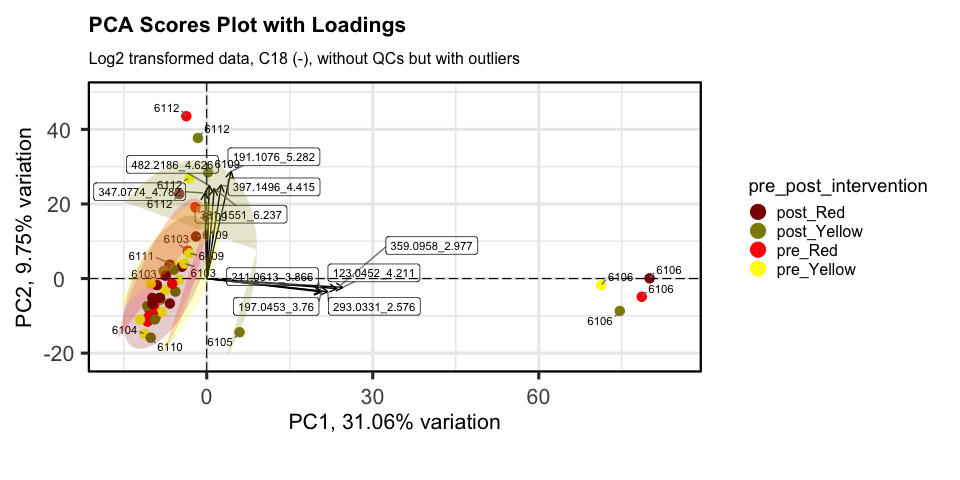
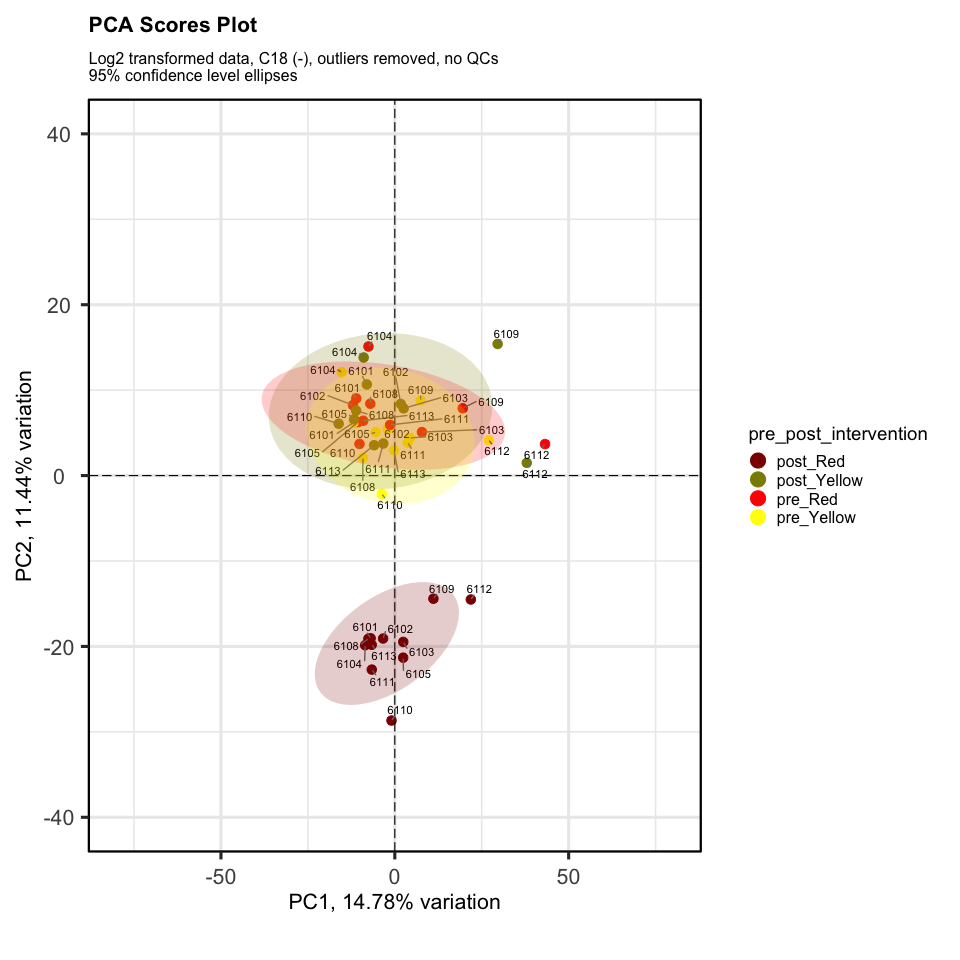
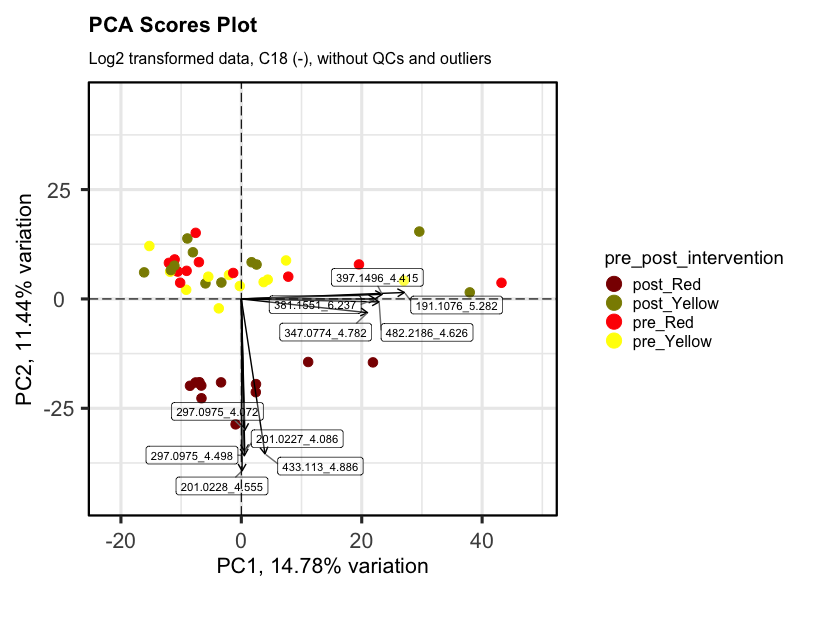
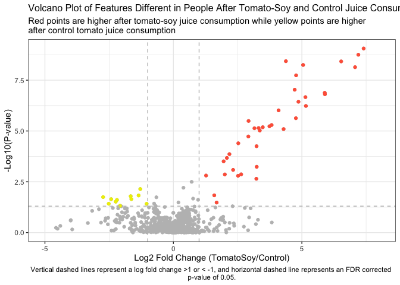
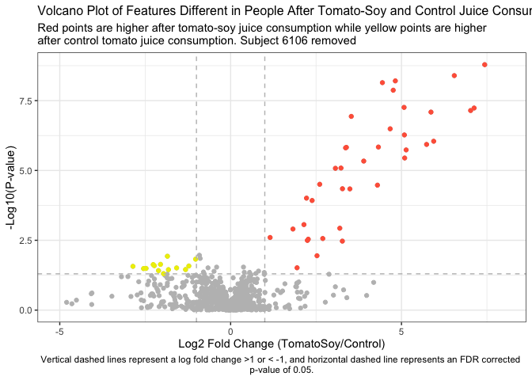
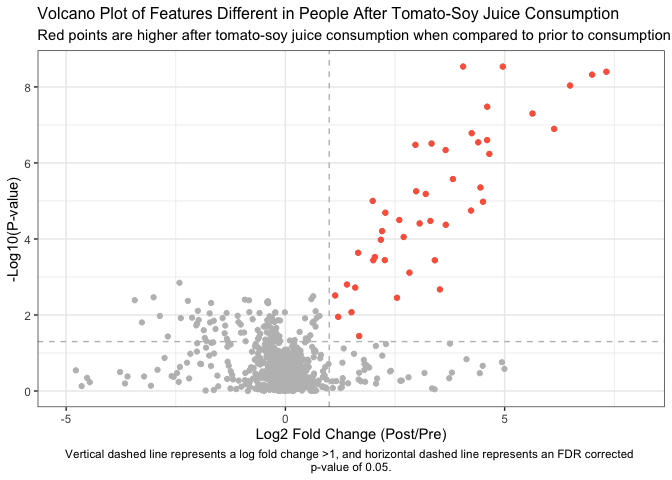
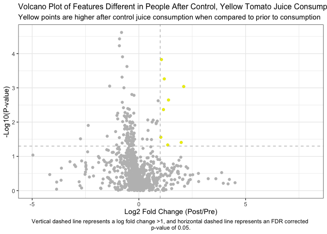
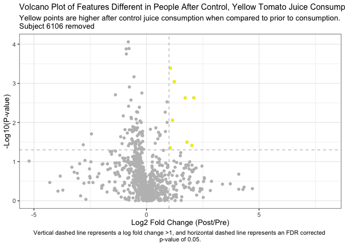
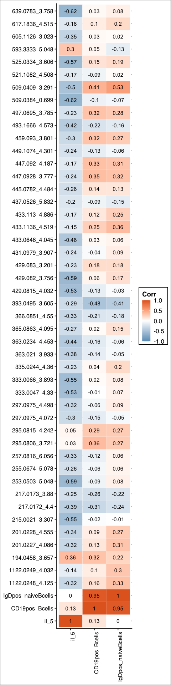

Metabolomics Data analysis
================
Maria Sholola
2023-06-05

# Load libraries

``` r
library(tidyverse) # for everything
library(readxl) # for reading in excel files
library(janitor) # data checks and cleaning
library(glue) # for easy pasting
library(FactoMineR) # for PCA
library(factoextra) # for PCA
library(rstatix) # for stats
library(pheatmap) # for heatmaps
library(plotly) # for interactive plots
library(htmlwidgets) # for saving interactive plots
library(devtools)
library(notame) # used for feature clustering
library(doParallel)
library(igraph) # feature clustering
library(ggpubr) # visualizations
library(knitr) # clean table printing
library(rmarkdown)
library(mixOmics) # for multilevel PCAs
library(corrr)
library(ggthemes)
library(ggtext)
library(PCAtools)
```

# Read in data

``` r
# raw filtered metabolomics data in C18 (-)
omicsdata <- read_csv("Feature lists/C18Neg-Data-Filtered-in-R.csv")

# metadata
metadata <- read_excel("Metadata-urine-c18neg.xlsx")
```

# Wrangle data

``` r
metadata <- metadata %>%
  rename("sample_ID" = Sample_ID)
```

``` r
# rename "row ID"
omicsdata <- omicsdata %>%
  rename("row_ID" = `row ID`)

# how many features
nrow(omicsdata)
```

    ## [1] 1411

``` r
# are there any duplicates?
omicsdata %>% get_dupes(mz_rt)
```

    ## # A tibble: 4 × 59
    ##   mz_rt          dupe_count row_ID `6111_U4_C18NEG_42` `6101_U2_C18NEG_30`
    ##   <chr>               <int>  <dbl>               <dbl>               <dbl>
    ## 1 361.0666_4.291          2   7185                 NA                  NA 
    ## 2 361.0666_4.291          2   7192                 NA                  NA 
    ## 3 385.1685_4.355          2   7299              27486.               5135.
    ## 4 385.1685_4.355          2   7306              27486.               5135.
    ## # ℹ 54 more variables: `6102_U1_C18NEG_26` <dbl>, `6110_U2_C18NEG_34` <dbl>,
    ## #   `6105_U4_C18NEG_47` <dbl>, `6103_U4_C18NEG_53` <dbl>,
    ## #   `6105_U1_C18NEG_43` <dbl>, `6104_U1_C18NEG_55` <dbl>,
    ## #   `6113_U4_C18NEG_62` <dbl>, `6105_U2_C18NEG_40` <dbl>,
    ## #   `6113_U3_C18NEG_15` <dbl>, `6102_U3_C18NEG_48` <dbl>,
    ## #   `6101_U3_C18NEG_29` <dbl>, `6108_U4_C18NEG_18` <dbl>,
    ## #   `6104_U4_C18NEG_12` <dbl>, `6111_U1_C18NEG_51` <dbl>, …

``` r
# remove dupes
omicsdata <- omicsdata %>% 
  distinct(mz_rt, .keep_all = TRUE)

# check again for dupes
omicsdata %>% get_dupes(mz_rt)
```

    ## # A tibble: 0 × 59
    ## # ℹ 59 variables: mz_rt <chr>, dupe_count <int>, row_ID <dbl>,
    ## #   6111_U4_C18NEG_42 <dbl>, 6101_U2_C18NEG_30 <dbl>, 6102_U1_C18NEG_26 <dbl>,
    ## #   6110_U2_C18NEG_34 <dbl>, 6105_U4_C18NEG_47 <dbl>, 6103_U4_C18NEG_53 <dbl>,
    ## #   6105_U1_C18NEG_43 <dbl>, 6104_U1_C18NEG_55 <dbl>, 6113_U4_C18NEG_62 <dbl>,
    ## #   6105_U2_C18NEG_40 <dbl>, 6113_U3_C18NEG_15 <dbl>, 6102_U3_C18NEG_48 <dbl>,
    ## #   6101_U3_C18NEG_29 <dbl>, 6108_U4_C18NEG_18 <dbl>, 6104_U4_C18NEG_12 <dbl>,
    ## #   6111_U1_C18NEG_51 <dbl>, 6105_U3_C18NEG_39 <dbl>, …

``` r
# how many features
nrow(omicsdata)
```

    ## [1] 1409

Sometimes a weird logical column (lgl) comes up in my data. Let’s check
if it’s there

``` r
colnames(omicsdata)
```

    ##  [1] "mz_rt"                       "row_ID"                     
    ##  [3] "6111_U4_C18NEG_42"           "6101_U2_C18NEG_30"          
    ##  [5] "6102_U1_C18NEG_26"           "6110_U2_C18NEG_34"          
    ##  [7] "6105_U4_C18NEG_47"           "6103_U4_C18NEG_53"          
    ##  [9] "6105_U1_C18NEG_43"           "6104_U1_C18NEG_55"          
    ## [11] "6113_U4_C18NEG_62"           "6105_U2_C18NEG_40"          
    ## [13] "6113_U3_C18NEG_15"           "6102_U3_C18NEG_48"          
    ## [15] "6101_U3_C18NEG_29"           "6108_U4_C18NEG_18"          
    ## [17] "6104_U4_C18NEG_12"           "6111_U1_C18NEG_51"          
    ## [19] "6105_U3_C18NEG_39"           "6110_U4_C18NEG_10"          
    ## [21] "6111_U3_C18NEG_54"           "6104_U2_C18NEG_19"          
    ## [23] "6101_U1_C18NEG_59"           "6111_U2_C18NEG_35"          
    ## [25] "6113_U2_C18NEG_31"           "6101_U4_C18NEG_14"          
    ## [27] "6103_U3_C18NEG_61"           "6108_U3_C18NEG_28"          
    ## [29] "6109_U1_C18NEG_58"           "6104_U3_C18NEG_32"          
    ## [31] "6110_U3_C18NEG_45"           "6108_U2_C18NEG_27"          
    ## [33] "6108_U1_C18NEG_44"           "6102_U4_C18NEG_50"          
    ## [35] "PooledQC10_C18NEG_64"        "6103_U2_C18NEG_60"          
    ## [37] "PooledQC9_C18NEG_57"         "6102_U2_C18NEG_16"          
    ## [39] "6112_U2_C18NEG_37"           "6110_U1_C18NEG_11"          
    ## [41] "6112_U4_C18NEG_63"           "6109_U3_C18NEG_52"          
    ## [43] "6109_U4_C18NEG_22"           "6109_U2_C18NEG_13"          
    ## [45] "6106_U4_C18NEG_36"           "6113_U1_C18NEG_24"          
    ## [47] "PooledQC5_C18NEG_25"         "6106_U3_C18NEG_20"          
    ## [49] "PooledQC6_C18NEG_33"         "6112_U3_C18NEG_56"          
    ## [51] "PooledQC4_C18NEG_17"         "PooledQC8_C18NEG_49"        
    ## [53] "PooledQC7_C18NEG_41"         "6103_U1_C18NEG_21"          
    ## [55] "6106_U1_C18NEG_23"           "6106_U2_C18NEG_46"          
    ## [57] "6112_U1_C18NEG_38"           "Prerun_PooledQC3_C18NEG_7_1"

``` r
# remove weird lgl column
omicsdata <- omicsdata %>%
  dplyr::select(!where(is.logical)) 

colnames(omicsdata)
```

    ##  [1] "mz_rt"                       "row_ID"                     
    ##  [3] "6111_U4_C18NEG_42"           "6101_U2_C18NEG_30"          
    ##  [5] "6102_U1_C18NEG_26"           "6110_U2_C18NEG_34"          
    ##  [7] "6105_U4_C18NEG_47"           "6103_U4_C18NEG_53"          
    ##  [9] "6105_U1_C18NEG_43"           "6104_U1_C18NEG_55"          
    ## [11] "6113_U4_C18NEG_62"           "6105_U2_C18NEG_40"          
    ## [13] "6113_U3_C18NEG_15"           "6102_U3_C18NEG_48"          
    ## [15] "6101_U3_C18NEG_29"           "6108_U4_C18NEG_18"          
    ## [17] "6104_U4_C18NEG_12"           "6111_U1_C18NEG_51"          
    ## [19] "6105_U3_C18NEG_39"           "6110_U4_C18NEG_10"          
    ## [21] "6111_U3_C18NEG_54"           "6104_U2_C18NEG_19"          
    ## [23] "6101_U1_C18NEG_59"           "6111_U2_C18NEG_35"          
    ## [25] "6113_U2_C18NEG_31"           "6101_U4_C18NEG_14"          
    ## [27] "6103_U3_C18NEG_61"           "6108_U3_C18NEG_28"          
    ## [29] "6109_U1_C18NEG_58"           "6104_U3_C18NEG_32"          
    ## [31] "6110_U3_C18NEG_45"           "6108_U2_C18NEG_27"          
    ## [33] "6108_U1_C18NEG_44"           "6102_U4_C18NEG_50"          
    ## [35] "PooledQC10_C18NEG_64"        "6103_U2_C18NEG_60"          
    ## [37] "PooledQC9_C18NEG_57"         "6102_U2_C18NEG_16"          
    ## [39] "6112_U2_C18NEG_37"           "6110_U1_C18NEG_11"          
    ## [41] "6112_U4_C18NEG_63"           "6109_U3_C18NEG_52"          
    ## [43] "6109_U4_C18NEG_22"           "6109_U2_C18NEG_13"          
    ## [45] "6106_U4_C18NEG_36"           "6113_U1_C18NEG_24"          
    ## [47] "PooledQC5_C18NEG_25"         "6106_U3_C18NEG_20"          
    ## [49] "PooledQC6_C18NEG_33"         "6112_U3_C18NEG_56"          
    ## [51] "PooledQC4_C18NEG_17"         "PooledQC8_C18NEG_49"        
    ## [53] "PooledQC7_C18NEG_41"         "6103_U1_C18NEG_21"          
    ## [55] "6106_U1_C18NEG_23"           "6106_U2_C18NEG_46"          
    ## [57] "6112_U1_C18NEG_38"           "Prerun_PooledQC3_C18NEG_7_1"

``` r
# create long df for omics df
omicsdata_tidy <- omicsdata %>%
  pivot_longer(cols = 3:ncol(.),
               names_to = "sample_ID",
               values_to = "peak_height")

# combine meta and omics dfs
meta_omics <- full_join(omicsdata_tidy,
                         metadata,
                         by = c("sample_ID" = "sample_ID"))

# separate mz and rt
meta_omics_sep <- meta_omics %>%
  separate(col = mz_rt,
           into = c("mz", "rt"),
           sep = "_") 

# convert columns to correct type
meta_omics_sep$mz <- as.numeric(meta_omics_sep$mz)
meta_omics_sep$rt <- as.numeric(meta_omics_sep$rt)
meta_omics_sep$Subject <- as.character(meta_omics_sep$Subject)
meta_omics_sep$Intervention <- as.character(meta_omics_sep$Intervention)

# rearrange column order
meta_omics_sep <- meta_omics_sep %>%
  dplyr::select(sample_ID, pre_post, Intervention, everything())

str(meta_omics_sep)
```

    ## tibble [78,904 × 14] (S3: tbl_df/tbl/data.frame)
    ##  $ sample_ID        : chr [1:78904] "6111_U4_C18NEG_42" "6101_U2_C18NEG_30" "6102_U1_C18NEG_26" "6110_U2_C18NEG_34" ...
    ##  $ pre_post         : chr [1:78904] "post" "post" "pre" "post" ...
    ##  $ Intervention     : chr [1:78904] "Red" "Red" "Red" "Yellow" ...
    ##  $ mz               : num [1:78904] 236 236 236 236 236 ...
    ##  $ rt               : num [1:78904] 0.603 0.603 0.603 0.603 0.603 0.603 0.603 0.603 0.603 0.603 ...
    ##  $ row_ID           : num [1:78904] 342 342 342 342 342 342 342 342 342 342 ...
    ##  $ peak_height      : num [1:78904] 4148 65119 16742 16351 46171 ...
    ##  $ Subject          : chr [1:78904] "6111" "6101" "6102" "6110" ...
    ##  $ Period           : chr [1:78904] "U4" "U2" "U1" "U2" ...
    ##  $ sequence         : chr [1:78904] "Y_R" "R_Y" "R_Y" "Y_R" ...
    ##  $ Intervention_week: num [1:78904] 14 6 2 6 14 14 2 2 14 6 ...
    ##  $ Sex              : chr [1:78904] "M" "F" "M" "M" ...
    ##  $ Age              : num [1:78904] 46 58 65 36 40 60 40 54 61 40 ...
    ##  $ BMI              : num [1:78904] 30 31.1 36.8 29.9 30.4 ...

``` r
# replace NA's in subject and intervention columns with QC
meta_omics_sep$Subject <- meta_omics_sep$Subject %>%
  replace_na("QC")

meta_omics_sep$Intervention <- meta_omics_sep$Intervention %>%
  replace_na("QC")
```

# Data summaries

## Number of masses detected

``` r
nrow(omicsdata)
```

    ## [1] 1409

## Mass range for metabolites detected?

``` r
range(meta_omics_sep$mz)
```

    ## [1]   73.0294 1303.2955

## RT range for metabolites detected?

``` r
range(meta_omics_sep$rt)
```

    ## [1] 0.603 8.045

## mass vs RT scatterplot

``` r
# plot
(plot_mzvsrt <- meta_omics_sep %>%
  ggplot(aes(x = rt, y = mz)) +
  geom_point() +
  theme_minimal() +
  labs(x = "Retention time, min",
       y = "m/z, neutral",
       title = "mz across RT for all features"))
```

<!-- -->

## Histogram for mass range

``` r
meta_omics_sep %>%
  ggplot(aes(x = mz)) +
  geom_histogram(binwidth = 25) +
  theme_minimal() +
  labs(x = "Monoisotopic mass (amu)",
       y = "Number of features",
       title = "Distribution of features by mass")
```

<!-- -->

## Histogram for RT

``` r
meta_omics_sep %>%
  ggplot(aes(x = rt)) +
  geom_histogram(binwidth = 0.1) + # 6 second bins
  theme_minimal() +
  labs(x = "Retention time",
       y = "Number of features",
       title = "Distribution of features by retention time")
```

<!-- -->

# NAs and imputing

## NAs

``` r
# samples only (no QCs)
omicsdata_noQC <- omicsdata %>%
  dplyr::select(-contains("QC"))

#NAs in samples only?
NAbyRow_noQC <- rowSums(is.na(omicsdata_noQC[,-1]))

hist(NAbyRow_noQC,
     breaks = 48, # because there are 48 samples 
     xlab = "Number of missing values",
     ylab = "Number of metabolites",
     main = "How many missing values are there?")
```

<!-- -->

Are there any missing values in QCs? There shouldn’t be after data
preprocessing/filtering

``` r
omicsdata_QC <- omicsdata %>%
  dplyr::select(starts_with("P")) 

NAbyRow_QC <- colSums(is.na(omicsdata_QC))
# lets confirm that there are no missing values from my QCs
sum(NAbyRow_QC) # no
```

    ## [1] 0

``` r
# calculate how many NAs there are per feature in whole data set
contains_NAs <- meta_omics %>%
  group_by(mz_rt) %>%
  count(is.na(peak_height)) %>%
  filter(`is.na(peak_height)` == TRUE)
kable(contains_NAs)
```

| mz_rt           | is.na(peak_height) |   n |
|:----------------|:-------------------|----:|
| 1003.2655_3.721 | TRUE               |  44 |
| 1003.2656_3.716 | TRUE               |  44 |
| 1004.2068_3.286 | TRUE               |  43 |
| 1041.2898_4.199 | TRUE               |  43 |
| 1069.2473_3.702 | TRUE               |  42 |
| 108.0216_3.832  | TRUE               |  40 |
| 108.0218_4.217  | TRUE               |  41 |
| 109.0288_3.757  | TRUE               |  43 |
| 109.0294_3.11   | TRUE               |  24 |
| 1115.3646_3.466 | TRUE               |   1 |
| 1117.2561_3.018 | TRUE               |  44 |
| 1121.3811_3.466 | TRUE               |   1 |
| 1122.0244_4.55  | TRUE               |  14 |
| 1122.0248_4.125 | TRUE               |  20 |
| 1122.0249_4.032 | TRUE               |  21 |
| 1123.2723_0.775 | TRUE               |  40 |
| 1123.2728_3.021 | TRUE               |  44 |
| 1124.0041_3.197 | TRUE               |   1 |
| 1131.2716_3.026 | TRUE               |  44 |
| 1132.0633_4.207 | TRUE               |  42 |
| 1135.2278_4.215 | TRUE               |  42 |
| 1137.288_3.026  | TRUE               |  44 |
| 1141.2436_3.619 | TRUE               |  43 |
| 1141.2441_4.201 | TRUE               |  42 |
| 1153.2827_0.789 | TRUE               |  42 |
| 1159.3041_3.727 | TRUE               |  44 |
| 1165.3189_3.729 | TRUE               |  44 |
| 123.0452_3.87   | TRUE               |   3 |
| 123.0452_4.211  | TRUE               |   5 |
| 124.01_0.775    | TRUE               |   5 |
| 124.0486_3.843  | TRUE               |  43 |
| 1257.2949_3.465 | TRUE               |   3 |
| 1279.2478_3.734 | TRUE               |  44 |
| 1303.2955_3.702 | TRUE               |  44 |
| 139.0401_0.786  | TRUE               |   6 |
| 139.0401_3.003  | TRUE               |  14 |
| 150.0562_3.542  | TRUE               |   6 |
| 161.9866_2.133  | TRUE               |  20 |
| 161.988_0.685   | TRUE               |   7 |
| 167.0349_3.921  | TRUE               |   1 |
| 171.0487_4.824  | TRUE               |  37 |
| 175.0975_4.743  | TRUE               |   4 |
| 177.1283_5.202  | TRUE               |  38 |
| 181.0503_4.495  | TRUE               |  21 |
| 181.0507_4.062  | TRUE               |   9 |
| 181.9916_0.803  | TRUE               |   4 |
| 181.9917_2.823  | TRUE               |   9 |
| 182.0076_0.788  | TRUE               |   9 |
| 182.0282_0.77   | TRUE               |  15 |
| 187.0383_3.122  | TRUE               |   2 |
| 191.1076_5.282  | TRUE               |  14 |
| 191.1105_5.283  | TRUE               |  16 |
| 193.0354_6.242  | TRUE               |   4 |
| 197.0453_3.76   | TRUE               |  21 |
| 197.0471_3.745  | TRUE               |  24 |
| 203.0172_4.555  | TRUE               |   4 |
| 209.0452_3.159  | TRUE               |  27 |
| 209.0452_3.24   | TRUE               |  29 |
| 209.0455_3.749  | TRUE               |   5 |
| 209.0532_3.773  | TRUE               |   3 |
| 210.0419_3.959  | TRUE               |  40 |
| 211.0971_3.846  | TRUE               |   5 |
| 212.0065_4.503  | TRUE               |  24 |
| 212.0937_3.815  | TRUE               |   2 |
| 212.0968_4.21   | TRUE               |  42 |
| 216.0277_4.034  | TRUE               |   2 |
| 217.0161_1.159  | TRUE               |   3 |
| 218.0821_5.22   | TRUE               |   1 |
| 219.0509_2.854  | TRUE               |   5 |
| 219.0524_2.85   | TRUE               |  11 |
| 220.0979_4.733  | TRUE               |   4 |
| 221.1178_5.185  | TRUE               |  28 |
| 222.0406_3.686  | TRUE               |   1 |
| 223.0583_2.562  | TRUE               |  32 |
| 227.0551_2.986  | TRUE               |   2 |
| 227.0554_2.1    | TRUE               |  29 |
| 227.0628_2.987  | TRUE               |  23 |
| 227.1036_0.798  | TRUE               |   4 |
| 232.0047_2.518  | TRUE               |   7 |
| 236.1018_5.033  | TRUE               |  19 |
| 237.0356_3.369  | TRUE               |  14 |
| 237.0359_3.933  | TRUE               |  16 |
| 237.1243_4.614  | TRUE               |   2 |
| 239.1144_0.622  | TRUE               |   1 |
| 246.0109_2.385  | TRUE               |   1 |
| 247.0798_4.12   | TRUE               |   2 |
| 251.0128_3.524  | TRUE               |   2 |
| 252.0891_4.335  | TRUE               |  41 |
| 253.0503_5.048  | TRUE               |  28 |
| 254.6229_6.168  | TRUE               |   1 |
| 255.0674_5.078  | TRUE               |  21 |
| 257.0801_5.284  | TRUE               |  14 |
| 257.0816_6.056  | TRUE               |  31 |
| 258.044_2.007   | TRUE               |  13 |
| 260.0239_2.686  | TRUE               |   5 |
| 263.0591_2.805  | TRUE               |   2 |
| 263.1054_2.91   | TRUE               |   1 |
| 265.0184_2.828  | TRUE               |   9 |
| 269.0163_3.668  | TRUE               |  16 |
| 276.0009_3.151  | TRUE               |  34 |
| 277.0353_3.723  | TRUE               |   1 |
| 277.0852_0.658  | TRUE               |   4 |
| 279.0487_3.569  | TRUE               |  12 |
| 279.0491_3.95   | TRUE               |   1 |
| 279.049_3.659   | TRUE               |   7 |
| 279.0984_3.799  | TRUE               |   1 |
| 280.0779_6.362  | TRUE               |  44 |
| 293.0743_2.543  | TRUE               |   5 |
| 294.149_5.025   | TRUE               |  41 |
| 295.0252_3.897  | TRUE               |   3 |
| 295.03_2.565    | TRUE               |  15 |
| 297.1062_4.504  | TRUE               |  17 |
| 305.0561_4.737  | TRUE               |  13 |
| 307.0111_2.574  | TRUE               |  14 |
| 307.1184_6.294  | TRUE               |   1 |
| 309.0242_2.522  | TRUE               |   5 |
| 310.9761_0.719  | TRUE               |   2 |
| 313.0569_3.13   | TRUE               |  13 |
| 320.1087_2.579  | TRUE               |  44 |
| 322.1104_2.943  | TRUE               |  32 |
| 322.1105_3.605  | TRUE               |  37 |
| 323.0414_2.68   | TRUE               |  26 |
| 324.0682_6.363  | TRUE               |  43 |
| 325.0323_0.804  | TRUE               |   2 |
| 326.0892_2.313  | TRUE               |   4 |
| 326.0973_2.32   | TRUE               |  11 |
| 328.9944_2.584  | TRUE               |  25 |
| 331.1218_3.932  | TRUE               |   5 |
| 334.0517_3.708  | TRUE               |  43 |
| 335.0215_3.886  | TRUE               |   6 |
| 336.0706_3.376  | TRUE               |  13 |
| 336.1218_3.046  | TRUE               |   3 |
| 336.1323_3.647  | TRUE               |  24 |
| 337.0436_0.684  | TRUE               |   1 |
| 337.1446_4.025  | TRUE               |   3 |
| 337.1469_3.591  | TRUE               |  15 |
| 338.0632_3.433  | TRUE               |  37 |
| 338.0879_3.557  | TRUE               |   1 |
| 338.1134_0.651  | TRUE               |   8 |
| 338.1178_2.307  | TRUE               |  46 |
| 341.1234_4.519  | TRUE               |   1 |
| 345.1933_4.201  | TRUE               |   1 |
| 347.0076_0.814  | TRUE               |   2 |
| 347.0774_4.782  | TRUE               |  22 |
| 347.0881_3.328  | TRUE               |  13 |
| 347.17_3.394    | TRUE               |   1 |
| 351.1236_4.04   | TRUE               |   9 |
| 354.1007_4.717  | TRUE               |   3 |
| 354.1009_5.03   | TRUE               |   1 |
| 356.1002_2.592  | TRUE               |   8 |
| 357.0825_3.399  | TRUE               |   3 |
| 359.0958_2.977  | TRUE               |   3 |
| 359.0975_2.524  | TRUE               |   4 |
| 360.1388_3.006  | TRUE               |   4 |
| 361.0218_2.595  | TRUE               |   2 |
| 361.0646_4.442  | TRUE               |  14 |
| 361.0666_4.291  | TRUE               |  19 |
| 364.0955_2.559  | TRUE               |  41 |
| 364.0958_3.594  | TRUE               |  40 |
| 364.0972_3.027  | TRUE               |  42 |
| 366.0851_4.55   | TRUE               |  16 |
| 368.0971_3.297  | TRUE               |   9 |
| 368.9723_3.004  | TRUE               |   2 |
| 372.1116_3.914  | TRUE               |   2 |
| 373.0764_3.153  | TRUE               |   6 |
| 373.1513_3.174  | TRUE               |  15 |
| 373.1514_3.715  | TRUE               |   1 |
| 374.1378_5.008  | TRUE               |  40 |
| 374.1587_3.706  | TRUE               |  34 |
| 375.0931_2.077  | TRUE               |  44 |
| 377.1019_5.09   | TRUE               |  12 |
| 379.1393_5.891  | TRUE               |   3 |
| 379.1955_5.602  | TRUE               |  12 |
| 381.0802_3.385  | TRUE               |   1 |
| 381.1551_6.237  | TRUE               |   4 |
| 381.1937_6.247  | TRUE               |   2 |
| 387.1489_5.77   | TRUE               |  27 |
| 389.1005_2.94   | TRUE               |   1 |
| 389.1043_2.952  | TRUE               |   3 |
| 389.1059_2.672  | TRUE               |  11 |
| 391.1122_2.774  | TRUE               |  16 |
| 395.1144_4.677  | TRUE               |  20 |
| 396.1124_4.459  | TRUE               |   1 |
| 396.1279_4.011  | TRUE               |  10 |
| 396.1297_3.506  | TRUE               |  26 |
| 397.1895_4.429  | TRUE               |   9 |
| 397.1911_4.067  | TRUE               |  29 |
| 401.1094_4.24   | TRUE               |   4 |
| 403.066_3.865   | TRUE               |   7 |
| 404.0395_3.379  | TRUE               |   2 |
| 404.0405_3.511  | TRUE               |   1 |
| 405.0285_1.16   | TRUE               |   2 |
| 405.1707_5.449  | TRUE               |   6 |
| 405.2644_6.291  | TRUE               |   5 |
| 407.0405_4.991  | TRUE               |   2 |
| 407.129_5.446   | TRUE               |  16 |
| 407.2799_5.411  | TRUE               |   1 |
| 407.2799_5.805  | TRUE               |   2 |
| 407.2801_6.791  | TRUE               |   6 |
| 411.0787_0.764  | TRUE               |   1 |
| 411.0792_3.55   | TRUE               |   1 |
| 411.0814_2.735  | TRUE               |   2 |
| 412.1044_3.523  | TRUE               |   1 |
| 413.1436_3.2    | TRUE               |   3 |
| 415.0625_4.788  | TRUE               |  28 |
| 416.1536_5.683  | TRUE               |   4 |
| 417.0951_3.717  | TRUE               |   7 |
| 417.1173_4.046  | TRUE               |   6 |
| 417.1192_4.5    | TRUE               |   8 |
| 418.1327_4.164  | TRUE               |  34 |
| 418.1842_3.015  | TRUE               |  33 |
| 419.1155_2.861  | TRUE               |  28 |
| 421.0582_5.463  | TRUE               |  11 |
| 422.0544_2.559  | TRUE               |  29 |
| 422.1067_0.783  | TRUE               |   4 |
| 422.1084_2.915  | TRUE               |  38 |
| 425.0363_4.553  | TRUE               |   1 |
| 427.0103_1.161  | TRUE               |   2 |
| 427.0844_2.991  | TRUE               |  12 |
| 428.0941_2.98   | TRUE               |  14 |
| 428.0955_4.037  | TRUE               |  31 |
| 428.0976_3.601  | TRUE               |  31 |
| 428.9933_3.184  | TRUE               |   1 |
| 429.0565_4.442  | TRUE               |  18 |
| 429.0571_4.306  | TRUE               |  19 |
| 429.0815_4.032  | TRUE               |   4 |
| 429.082_3.756   | TRUE               |   6 |
| 429.0831_3.189  | TRUE               |  13 |
| 429.083_3.201   | TRUE               |  14 |
| 431.0979_3.907  | TRUE               |   8 |
| 431.1141_3.739  | TRUE               |  18 |
| 431.1146_4.185  | TRUE               |   2 |
| 432.0832_2.56   | TRUE               |  44 |
| 432.1213_3.706  | TRUE               |  30 |
| 432.1447_3.927  | TRUE               |  22 |
| 432.1631_3.52   | TRUE               |  34 |
| 432.1639_2.932  | TRUE               |  39 |
| 432.2024_0.669  | TRUE               |  43 |
| 432.2027_3.06   | TRUE               |  42 |
| 433.0646_4.045  | TRUE               |   7 |
| 433.113_4.886   | TRUE               |   8 |
| 434.1396_3.922  | TRUE               |  24 |
| 436.092_0.669   | TRUE               |   1 |
| 436.1064_5.004  | TRUE               |  39 |
| 437.0526_5.832  | TRUE               |   6 |
| 437.18_7.078    | TRUE               |  14 |
| 439.1146_6.219  | TRUE               |  30 |
| 441.1026_3.212  | TRUE               |  15 |
| 442.1246_5.012  | TRUE               |  39 |
| 443.0945_3.705  | TRUE               |  10 |
| 445.0782_4.484  | TRUE               |   1 |
| 445.1072_3.893  | TRUE               |   3 |
| 446.0335_2.313  | TRUE               |   7 |
| 446.1142_3.879  | TRUE               |  19 |
| 446.1795_4.499  | TRUE               |   4 |
| 446.1831_4.341  | TRUE               |   3 |
| 447.0921_4.067  | TRUE               |   1 |
| 447.0928_3.777  | TRUE               |   1 |
| 447.092_4.187   | TRUE               |   1 |
| 448.1934_0.807  | TRUE               |  22 |
| 448.1959_3.232  | TRUE               |  37 |
| 448.1961_5.778  | TRUE               |  42 |
| 448.1966_4.911  | TRUE               |  30 |
| 449.0698_2.589  | TRUE               |  12 |
| 449.1074_4.301  | TRUE               |   2 |
| 449.142_6.234   | TRUE               |  17 |
| 455.1062_4.407  | TRUE               |   8 |
| 457.0623_2.989  | TRUE               |   1 |
| 457.0651_3.354  | TRUE               |  15 |
| 457.0963_2.367  | TRUE               |  40 |
| 457.097_2.652   | TRUE               |  24 |
| 457.2207_6.206  | TRUE               |  14 |
| 458.9733_3.815  | TRUE               |   5 |
| 459.0361_4.296  | TRUE               |   3 |
| 459.0924_4.452  | TRUE               |   6 |
| 459.0926_3.306  | TRUE               |  13 |
| 459.093_3.801   | TRUE               |   1 |
| 459.1629_2.778  | TRUE               |   5 |
| 461.0817_4.193  | TRUE               |   8 |
| 461.0857_3.898  | TRUE               |   8 |
| 461.0863_3.571  | TRUE               |   5 |
| 463.0831_5.418  | TRUE               |   1 |
| 464.0663_2.822  | TRUE               |   6 |
| 465.1366_4.417  | TRUE               |   3 |
| 466.0888_4.204  | TRUE               |  14 |
| 468.0438_2.896  | TRUE               |   6 |
| 468.0834_2.815  | TRUE               |  24 |
| 471.0822_3.708  | TRUE               |   1 |
| 471.199_5.262   | TRUE               |  13 |
| 474.1054_5.422  | TRUE               |  22 |
| 475.2184_5.932  | TRUE               |   1 |
| 476.0359_3.919  | TRUE               |   2 |
| 476.0415_4.203  | TRUE               |  38 |
| 476.1913_6.018  | TRUE               |  40 |
| 477.1007_0.807  | TRUE               |  16 |
| 477.1039_2.949  | TRUE               |  14 |
| 477.1039_4.686  | TRUE               |   8 |
| 479.0459_2.443  | TRUE               |  16 |
| 479.0465_3.005  | TRUE               |   8 |
| 479.0506_0.791  | TRUE               |   2 |
| 481.0163_4.286  | TRUE               |   7 |
| 482.2186_4.626  | TRUE               |  32 |
| 483.0154_2.51   | TRUE               |  11 |
| 484.0498_2.566  | TRUE               |   9 |
| 485.0499_4.198  | TRUE               |  12 |
| 486.1199_5.689  | TRUE               |  41 |
| 487.0726_2.982  | TRUE               |   6 |
| 487.0759_2.632  | TRUE               |  28 |
| 488.0429_4.206  | TRUE               |  40 |
| 489.0936_2.593  | TRUE               |   8 |
| 489.2111_3.578  | TRUE               |  22 |
| 489.2123_4.076  | TRUE               |  16 |
| 491.1861_5.71   | TRUE               |  10 |
| 491.191_4.507   | TRUE               |  12 |
| 492.1871_5.243  | TRUE               |  40 |
| 492.1884_4.319  | TRUE               |  24 |
| 493.0642_3.179  | TRUE               |   1 |
| 493.0653_3.147  | TRUE               |   1 |
| 493.1858_5.275  | TRUE               |  14 |
| 493.2869_6.516  | TRUE               |   7 |
| 494.0742_2.602  | TRUE               |  22 |
| 495.2227_4.812  | TRUE               |   2 |
| 495.2229_3.594  | TRUE               |  24 |
| 495.223_4.067   | TRUE               |   4 |
| 496.198_6.048   | TRUE               |  40 |
| 497.0695_3.785  | TRUE               |   5 |
| 497.2379_4.163  | TRUE               |   2 |
| 500.1902_3.066  | TRUE               |  41 |
| 500.282_5.708   | TRUE               |  44 |
| 501.1047_6.238  | TRUE               |  30 |
| 501.1339_4.505  | TRUE               |   4 |
| 501.2122_5.698  | TRUE               |  10 |
| 502.1148_5.219  | TRUE               |  36 |
| 502.2071_0.806  | TRUE               |  43 |
| 503.2011_4.23   | TRUE               |  16 |
| 505.1427_2.841  | TRUE               |   6 |
| 505.2452_7.002  | TRUE               |  31 |
| 507.0806_3.582  | TRUE               |  24 |
| 509.0384_0.699  | TRUE               |   5 |
| 509.0409_3.291  | TRUE               |   3 |
| 509.1453_5.277  | TRUE               |  14 |
| 511.1128_6.237  | TRUE               |  32 |
| 512.1916_6.018  | TRUE               |  38 |
| 513.0964_3.899  | TRUE               |   2 |
| 514.136_3.993   | TRUE               |   1 |
| 514.1681_4.367  | TRUE               |  23 |
| 514.1698_4.543  | TRUE               |  21 |
| 515.1648_5.296  | TRUE               |  17 |
| 516.1022_2.528  | TRUE               |  12 |
| 516.2234_0.803  | TRUE               |  44 |
| 517.0977_4.399  | TRUE               |   4 |
| 517.1295_6.231  | TRUE               |  27 |
| 517.1331_3.892  | TRUE               |   9 |
| 517.2049_4.804  | TRUE               |  20 |
| 517.2413_8.045  | TRUE               |   1 |
| 519.223_7.484   | TRUE               |  35 |
| 521.1082_4.508  | TRUE               |   2 |
| 521.239_6.221   | TRUE               |  10 |
| 525.0334_3.606  | TRUE               |   6 |
| 527.1086_4.425  | TRUE               |   2 |
| 528.2617_5.454  | TRUE               |   1 |
| 529.162_5.829   | TRUE               |  13 |
| 531.1311_5.287  | TRUE               |  10 |
| 531.1447_4.141  | TRUE               |   4 |
| 533.1257_4.426  | TRUE               |   6 |
| 535.0762_5.453  | TRUE               |  32 |
| 536.1898_4.583  | TRUE               |  38 |
| 536.3209_5.3    | TRUE               |  41 |
| 537.1508_5.278  | TRUE               |   7 |
| 539.1147_5.072  | TRUE               |   7 |
| 541.1395_0.742  | TRUE               |   7 |
| 543.2074_5.421  | TRUE               |  14 |
| 544.1472_4.514  | TRUE               |  25 |
| 544.1789_6.025  | TRUE               |  35 |
| 544.2886_5.154  | TRUE               |  30 |
| 547.1102_3.005  | TRUE               |  16 |
| 549.035_2.814   | TRUE               |  24 |
| 549.0364_0.757  | TRUE               |   6 |
| 549.1948_4.514  | TRUE               |  12 |
| 550.2061_4.628  | TRUE               |  35 |
| 551.0331_2.81   | TRUE               |   1 |
| 551.2033_6.504  | TRUE               |  13 |
| 553.0631_4.891  | TRUE               |  22 |
| 553.1926_5.396  | TRUE               |  26 |
| 555.0787_2.996  | TRUE               |  17 |
| 555.1553_0.783  | TRUE               |  25 |
| 556.1624_3.635  | TRUE               |  32 |
| 557.1344_0.671  | TRUE               |   1 |
| 557.2465_7.479  | TRUE               |  32 |
| 558.136_3.478   | TRUE               |   1 |
| 559.0435_3.584  | TRUE               |  15 |
| 559.0453_4.234  | TRUE               |  17 |
| 560.1364_2.889  | TRUE               |  11 |
| 560.1365_2.971  | TRUE               |  25 |
| 561.231_6.512   | TRUE               |   8 |
| 562.1922_4.035  | TRUE               |  17 |
| 565.0065_2.811  | TRUE               |  19 |
| 565.0578_3.576  | TRUE               |  11 |
| 565.0619_4.188  | TRUE               |   2 |
| 565.137_2.579   | TRUE               |  36 |
| 565.1563_4.799  | TRUE               |   1 |
| 569.0928_2.988  | TRUE               |   6 |
| 569.0956_3.38   | TRUE               |   1 |
| 569.1299_4.178  | TRUE               |   4 |
| 569.1307_3.754  | TRUE               |   2 |
| 569.1751_3.441  | TRUE               |   1 |
| 571.1469_3.618  | TRUE               |   4 |
| 571.1476_4.081  | TRUE               |  12 |
| 572.1076_0.784  | TRUE               |  10 |
| 572.1094_3.326  | TRUE               |  28 |
| 572.2105_4.512  | TRUE               |  20 |
| 572.2528_4.339  | TRUE               |   4 |
| 573.1087_0.695  | TRUE               |   1 |
| 573.2393_7.26   | TRUE               |  29 |
| 573.2395_6.305  | TRUE               |  22 |
| 574.1142_2.883  | TRUE               |   1 |
| 574.1523_2.913  | TRUE               |  19 |
| 574.1534_3.396  | TRUE               |  14 |
| 576.1317_0.792  | TRUE               |  18 |
| 576.1384_0.705  | TRUE               |   5 |
| 577.1184_2.969  | TRUE               |  14 |
| 579.0437_2.578  | TRUE               |  14 |
| 579.0457_0.796  | TRUE               |  10 |
| 579.0995_6.236  | TRUE               |  35 |
| 579.126_2.604   | TRUE               |   9 |
| 579.2066_4.211  | TRUE               |  14 |
| 580.1557_4.511  | TRUE               |  35 |
| 583.0211_3.647  | TRUE               |   5 |
| 583.1089_3.742  | TRUE               |   1 |
| 583.1092_3.147  | TRUE               |   9 |
| 584.0883_0.697  | TRUE               |   5 |
| 584.1374_3.972  | TRUE               |  19 |
| 585.0051_3.809  | TRUE               |   4 |
| 585.0184_3.643  | TRUE               |   2 |
| 585.0899_0.796  | TRUE               |  12 |
| 589.3024_5.037  | TRUE               |  21 |
| 590.1068_3.469  | TRUE               |   5 |
| 590.1471_2.657  | TRUE               |  37 |
| 591.2109_6.51   | TRUE               |   6 |
| 591.3184_5.021  | TRUE               |  16 |
| 593.1471_3.747  | TRUE               |  21 |
| 593.1477_3.228  | TRUE               |  35 |
| 593.3333_5.048  | TRUE               |  15 |
| 594.0962_3.363  | TRUE               |   1 |
| 594.3642_5.768  | TRUE               |   4 |
| 596.1248_2.733  | TRUE               |   1 |
| 599.1056_3.199  | TRUE               |  26 |
| 600.2843_4.732  | TRUE               |   4 |
| 600.982_3.815   | TRUE               |   4 |
| 601.2255_5.243  | TRUE               |   4 |
| 602.1667_4.638  | TRUE               |  37 |
| 603.0611_5.431  | TRUE               |  21 |
| 605.1126_3.023  | TRUE               |  12 |
| 605.1462_3.238  | TRUE               |  31 |
| 605.1484_3.739  | TRUE               |  23 |
| 606.1191_4.053  | TRUE               |  11 |
| 606.9991_3.815  | TRUE               |   3 |
| 607.0749_3.657  | TRUE               |  15 |
| 607.1267_3.483  | TRUE               |   4 |
| 607.1628_3.711  | TRUE               |  26 |
| 607.1633_3.738  | TRUE               |  25 |
| 608.1059_3.3    | TRUE               |  13 |
| 609.0591_2.577  | TRUE               |  17 |
| 609.0726_3.66   | TRUE               |  20 |
| 609.1423_0.802  | TRUE               |  21 |
| 609.1484_2.937  | TRUE               |   3 |
| 610.164_2.859   | TRUE               |   2 |
| 611.0554_2.581  | TRUE               |  25 |
| 611.069_3.647   | TRUE               |  15 |
| 613.1932_6.507  | TRUE               |  16 |
| 614.1849_4.02   | TRUE               |  31 |
| 617.1836_4.515  | TRUE               |  12 |
| 618.1838_3.802  | TRUE               |  38 |
| 618.1913_4.649  | TRUE               |  37 |
| 621.1797_5.389  | TRUE               |  30 |
| 622.0984_3.522  | TRUE               |  33 |
| 623.0319_2.6    | TRUE               |  14 |
| 623.1618_2.946  | TRUE               |  22 |
| 623.2016_6.501  | TRUE               |  17 |
| 625.0354_3.814  | TRUE               |  10 |
| 629.2176_6.511  | TRUE               |   9 |
| 631.0532_3.815  | TRUE               |  16 |
| 631.1154_0.686  | TRUE               |   4 |
| 633.1142_3.808  | TRUE               |  19 |
| 638.0934_3.724  | TRUE               |  39 |
| 639.0783_3.758  | TRUE               |  17 |
| 640.1347_3.515  | TRUE               |  30 |
| 645.1099_2.832  | TRUE               |  16 |
| 645.1108_0.776  | TRUE               |  18 |
| 645.1887_2.968  | TRUE               |  19 |
| 645.1893_2.881  | TRUE               |  11 |
| 645.1896_3.451  | TRUE               |   2 |
| 645.1901_2.522  | TRUE               |  40 |
| 649.0893_3.836  | TRUE               |  27 |
| 650.1898_2.57   | TRUE               |  45 |
| 651.3856_5.28   | TRUE               |   4 |
| 653.1834_2.294  | TRUE               |  44 |
| 655.1071_3.826  | TRUE               |  19 |
| 656.1287_4.025  | TRUE               |  40 |
| 657.1659_3.876  | TRUE               |  17 |
| 657.1681_4.216  | TRUE               |  26 |
| 659.1239_2.825  | TRUE               |  27 |
| 659.1667_2.763  | TRUE               |   2 |
| 659.2045_2.918  | TRUE               |  23 |
| 659.2057_3.452  | TRUE               |   2 |
| 661.1248_0.679  | TRUE               |  16 |
| 662.1454_4.018  | TRUE               |  41 |
| 662.3153_5.383  | TRUE               |   9 |
| 666.2108_3.475  | TRUE               |  11 |
| 673.1446_3.853  | TRUE               |  29 |
| 673.1455_4.198  | TRUE               |  36 |
| 673.2558_7.365  | TRUE               |  32 |
| 675.1192_0.802  | TRUE               |  28 |
| 675.1222_2.643  | TRUE               |  22 |
| 675.1511_4.19   | TRUE               |  21 |
| 675.1659_2.308  | TRUE               |  40 |
| 675.2009_2.65   | TRUE               |  41 |
| 675.9686_3.302  | TRUE               |   4 |
| 678.1113_4.032  | TRUE               |  39 |
| 679.1604_4.197  | TRUE               |  19 |
| 679.1625_3.856  | TRUE               |  24 |
| 680.165_3.608   | TRUE               |  37 |
| 680.2306_4.136  | TRUE               |  42 |
| 681.2357_4.115  | TRUE               |  32 |
| 681.985_3.302   | TRUE               |   1 |
| 685.341_5.775   | TRUE               |   7 |
| 689.1166_4.213  | TRUE               |  22 |
| 690.3154_4.751  | TRUE               |  13 |
| 691.1349_0.67   | TRUE               |  17 |
| 691.188_6.507   | TRUE               |  17 |
| 691.3175_4.507  | TRUE               |  21 |
| 691.3179_4.171  | TRUE               |  10 |
| 692.1776_3.461  | TRUE               |  32 |
| 692.32_4.516    | TRUE               |  24 |
| 710.0906_4.208  | TRUE               |  43 |
| 713.2993_4.51   | TRUE               |  16 |
| 714.3024_4.193  | TRUE               |  28 |
| 714.3028_4.511  | TRUE               |  26 |
| 73.0294_5.277   | TRUE               |  15 |
| 741.1856_3.019  | TRUE               |  40 |
| 741.1857_3.018  | TRUE               |  40 |
| 741.1865_0.791  | TRUE               |  36 |
| 745.1266_4.269  | TRUE               |  35 |
| 745.1653_3.9    | TRUE               |  38 |
| 747.2342_3.15   | TRUE               |  44 |
| 747.2354_3.721  | TRUE               |  40 |
| 747.3107_5.769  | TRUE               |  21 |
| 751.1822_3.898  | TRUE               |  37 |
| 753.328_5.771   | TRUE               |  19 |
| 755.1981_3.389  | TRUE               |  23 |
| 755.2012_3.03   | TRUE               |  41 |
| 757.1576_0.789  | TRUE               |  35 |
| 765.197_4.127   | TRUE               |  29 |
| 769.2167_3.733  | TRUE               |  41 |
| 769.2171_3.155  | TRUE               |  43 |
| 771.1944_2.999  | TRUE               |  41 |
| 771.1962_0.744  | TRUE               |  18 |
| 775.1556_3.475  | TRUE               |   1 |
| 779.2721_4.515  | TRUE               |  31 |
| 785.1841_3.18   | TRUE               |  44 |
| 785.1891_3.723  | TRUE               |  40 |
| 785.2097_2.974  | TRUE               |  39 |
| 792.3445_4.502  | TRUE               |  41 |
| 795.2377_4.518  | TRUE               |  30 |
| 800.1466_3.728  | TRUE               |  38 |
| 800.2743_3.027  | TRUE               |  43 |
| 801.154_3.74    | TRUE               |  35 |
| 801.2049_2.656  | TRUE               |  38 |
| 801.2549_4.519  | TRUE               |  26 |
| 807.2393_4.206  | TRUE               |  34 |
| 810.9784_3.814  | TRUE               |  10 |
| 813.255_4.198   | TRUE               |  31 |
| 814.2904_3.028  | TRUE               |  42 |
| 814.3239_4.509  | TRUE               |  42 |
| 815.077_4.202   | TRUE               |  37 |
| 816.9958_3.812  | TRUE               |   8 |
| 817.2886_4.438  | TRUE               |  32 |
| 819.2194_3.7    | TRUE               |  42 |
| 828.3048_3.061  | TRUE               |  44 |
| 829.2715_2.727  | TRUE               |   7 |
| 829.2715_2.758  | TRUE               |   3 |
| 833.2468_4.513  | TRUE               |  20 |
| 835.0489_2.8    | TRUE               |  15 |
| 835.1973_3.718  | TRUE               |  41 |
| 835.2887_2.754  | TRUE               |   2 |
| 835.2888_2.725  | TRUE               |   2 |
| 841.2146_3.693  | TRUE               |  42 |
| 845.2477_4.186  | TRUE               |  35 |
| 853.2516_4.121  | TRUE               |  36 |
| 855.1197_2.99   | TRUE               |  30 |
| 855.1238_0.789  | TRUE               |  36 |
| 855.1239_0.785  | TRUE               |  36 |
| 859.0857_3.824  | TRUE               |  35 |
| 860.2066_3.476  | TRUE               |   1 |
| 861.1356_3.001  | TRUE               |  34 |
| 861.1404_0.799  | TRUE               |  38 |
| 869.3936_6.15   | TRUE               |  42 |
| 875.1494_2.993  | TRUE               |  31 |
| 883.1412_3.819  | TRUE               |  37 |
| 883.1453_3.774  | TRUE               |  40 |
| 883.1498_3.145  | TRUE               |  43 |
| 889.161_3.783   | TRUE               |  39 |
| 889.1651_3.147  | TRUE               |  41 |
| 891.2154_3.643  | TRUE               |  42 |
| 891.2172_4.205  | TRUE               |  36 |
| 892.2207_4.211  | TRUE               |  36 |
| 896.2543_2.86   | TRUE               |  18 |
| 907.1941_3.871  | TRUE               |  42 |
| 907.1956_4.201  | TRUE               |  37 |
| 908.2639_4.165  | TRUE               |  43 |
| 913.2113_4.211  | TRUE               |  34 |
| 913.2118_3.895  | TRUE               |  40 |
| 913.214_3.531   | TRUE               |  25 |
| 931.1224_2.809  | TRUE               |  11 |
| 945.1645_3.008  | TRUE               |  40 |
| 951.181_3.008   | TRUE               |  39 |
| 973.198_3.133   | TRUE               |  43 |
| 979.2122_3.736  | TRUE               |  43 |
| 979.2124_3.136  | TRUE               |  44 |
| 997.2507_3.723  | TRUE               |  43 |

## Remove NAs

## Data imputation

``` r
# impute any missing values by replacing them with 1/2 of the lowest peak height value of a feature (i.e. in a row).
imputed_omicsdata <- omicsdata

imputed_omicsdata[] <- lapply(imputed_omicsdata, 
                              function(x) ifelse(is.na(x),
                                                 min(x, na.rm = TRUE)/2, x))

dim(imputed_omicsdata)
```

    ## [1] 1409   58

Are there any NAs?

``` r
imputed_omicsdata %>%
  is.na() %>%
  sum()
```

    ## [1] 0

``` r
# imputations worked
```

# Create new imputed tidy datasets

``` r
# create long df for imputed omics df
imputed_omicsdata_tidy <- imputed_omicsdata %>%
  pivot_longer(cols = 3:ncol(.),
               names_to = "sample_ID",
               values_to = "peak_height")

# combine meta and imputed omics dfs
imp_meta_omics <- full_join(imputed_omicsdata_tidy,
                         metadata,
                         by = c("sample_ID" = "sample_ID"))

# separate mz and rt
imp_meta_omics_sep <- imp_meta_omics %>%
  separate(col = mz_rt,
           into = c("mz", "rt"),
           sep = "_") 

# convert columns to correct type
imp_meta_omics_sep$mz <- as.numeric(imp_meta_omics_sep$mz)
imp_meta_omics_sep$rt <- as.numeric(imp_meta_omics_sep$rt)
imp_meta_omics_sep$Subject <- as.character(imp_meta_omics_sep$Subject)
imp_meta_omics_sep$Intervention <- as.character(imp_meta_omics_sep$Intervention)
```

# Notame feature reduction

vignette for reference

``` r
#browseVignettes("notame")
```

Let’s look at what masses come up at each RT again

``` r
# rt vs mz plot
imp_meta_omics_sep %>%
  ggplot(aes(x = rt, y = mz)) +
  geom_point() +
  theme_minimal() +
  labs(x = "RT (min)",
       y = "mz")
```

<!-- -->
There are several points that are at the same RT, meaning they could be
coming from the same compound. We’ll run notame clustering to collapse
features coming from one mass into one feature.

## Data restructuring for notame

``` r
# create features list from imputed data set to only include unique feature ID's (mz_rt), mz and RT
features <- imp_meta_omics_sep %>%
  cbind(imp_meta_omics$mz_rt) %>%
  rename("mz_rt" = "imp_meta_omics$mz_rt") %>%
  dplyr::select(c(mz_rt, mz, rt)) %>%
  distinct() # remove the duplicate rows

# create a second data frame which is just imp_meta_omics restructured to another wide format
data_notame <- data.frame(imputed_omicsdata %>%
                            dplyr::select(-row_ID) %>%
                            t())

data_notame <- data_notame %>%
  tibble::rownames_to_column() %>% # change samples from rownames to its own column
  row_to_names(row_number = 1) # change the feature IDs (mz_rt) from first row obs into column names
```

Check structures

``` r
# check if mz and rt are numeric
str(features)
```

    ## 'data.frame':    1409 obs. of  3 variables:
    ##  $ mz_rt: chr  "236.065_0.603" "168.0777_0.606" "154.0621_0.609" "124.0072_0.616" ...
    ##  $ mz   : num  236 168 154 124 193 ...
    ##  $ rt   : num  0.603 0.606 0.609 0.616 0.617 0.622 0.654 0.627 0.629 0.629 ...

``` r
# check if results are numeric
head(data_notame)
```

    ##               mz_rt 236.065_0.603 168.0777_0.606 154.0621_0.609 124.0072_0.616
    ## 2 6111_U4_C18NEG_42     4148.1560      6707.0720    304457.6000     63058.5270
    ## 3 6101_U2_C18NEG_30    65118.8000     81841.7800    112404.4300     22063.8480
    ## 4 6102_U1_C18NEG_26    16741.8500     29358.3710    168966.0200     56236.6450
    ## 5 6110_U2_C18NEG_34     16350.678      19073.940      67706.220      22557.037
    ## 6 6105_U4_C18NEG_47    46170.5080     59856.3360    208992.6000     56521.9000
    ## 7 6103_U4_C18NEG_53    62220.0470     90745.4140     92892.3000      4167.1500
    ##   193.0351_0.617 239.1144_0.622 275.056_0.654 195.051_0.627 215.0326_0.629
    ## 2    110661.2340      4148.8400     7621.4624   175922.4200     83845.8400
    ## 3     50736.0040     13944.5030    10538.4540   222889.0500    112802.2000
    ## 4     54822.6170     13815.2390    14388.4710   185187.0500     93607.8900
    ## 5      27333.799       2379.748     12803.501     97982.840      72868.770
    ## 6     51904.7270     13813.5900    54594.4060   119151.6250     87575.5400
    ## 7     81048.3900      7217.6150    11000.1140   109782.7340     56883.4100
    ##   219.0457_0.629 217.0486_0.63 245.0433_0.63 165.0405_0.634 187.0383_0.634
    ## 2     14710.4650    42995.4000    22739.1500     84372.0550     17612.5400
    ## 3     21731.1640    67756.3750    13593.9990    129945.7300     16133.5760
    ## 4     16508.4900    46851.0430    11583.4240     62910.2600     16036.7840
    ## 5      29380.190     84598.010      9735.333      99338.500      14608.523
    ## 6     18316.0660    49151.7800    15733.0520     81935.9700     21083.0700
    ## 7     25524.6640    80661.0600    13465.1520     79159.3200     22429.1930
    ##   265.0732_0.64 235.057_0.641 135.0295_0.64 277.0852_0.658 179.0556_0.643
    ## 2     3554.0090    10549.7070   215612.5300      1896.8904     49858.5800
    ## 3     2770.6050     7714.5710   161603.8300      1777.6233     69490.1100
    ## 4     3590.4802    13949.0800   180550.1400      1650.3148     54854.7340
    ## 5      2833.232      2971.846    118229.020       1515.141      79040.130
    ## 6     2556.3813     5410.3740   180194.6700      1872.5413     66115.3360
    ## 7     1964.5671     4466.6120   110849.0160      1644.7844     34921.9960
    ##   149.0089_0.649 547.1106_0.67 149.0452_0.654 262.0364_0.654 321.0625_0.656
    ## 2     59227.8160     1480.1112     53766.4000     24966.1520     10882.5720
    ## 3     94413.3700     1979.9187     55440.1950     16337.3920     25443.6100
    ## 4      8282.0510     2248.3880     50711.7000     22093.7560     18592.2230
    ## 5      14616.016      1228.672      64062.992      35391.867       8272.857
    ## 6      3099.2580     1445.8310     53487.2930     18773.7660     11248.7210
    ## 7      8325.3300     1888.4089     32421.2910     79602.7660      6367.6733
    ##   174.0405_0.655 291.0683_0.654 167.0208_0.657 261.039_0.66 494.1144_0.666
    ## 2     21986.1740      3920.8584    391255.3400   21221.8500      1378.3564
    ## 3     22722.2850      3144.5125    352507.1600   33641.8670      1788.4076
    ## 4     22790.8480      2798.2664    404390.6600   20416.8710      1299.2500
    ## 5      16850.508       4256.903     614587.000    31758.988       2543.849
    ## 6     39613.5160      3506.3880    847425.0000   20707.1170    111281.9900
    ## 7     16621.3980      3902.8433    378931.6000   55393.7800      1669.5349
    ##   308.0983_0.658 247.062_0.659 151.0066_0.66 363.0756_0.658 277.052_0.659
    ## 2     17307.6640    25386.6520     8439.7650     11992.5160     8896.5530
    ## 3     15982.8930    19120.8850    11509.5250     37390.3870     5537.2305
    ## 4     21815.3630    39358.4380    12856.6350     36373.7030     8356.7295
    ## 5      11636.194     16349.409     18192.979      21776.125     12400.021
    ## 6     15389.8410    27319.9410    10566.3160     19312.0000     7137.5390
    ## 7     10550.2650     6860.6650    17224.1970     12659.9000     7859.8510
    ##   262.0286_0.664 287.0195_0.66 290.0877_0.662 287.0526_0.66 263.0573_0.662
    ## 2     21046.4430    14930.0260      8933.0620     7753.7603     15739.0200
    ## 3     33996.1300     7956.3467      4929.5070     7766.6333     17729.2660
    ## 4     27414.6350     9422.4240      8266.6430     8011.1235     17002.3710
    ## 5      33476.040     14959.646       6859.244      5627.218      11740.802
    ## 6     22452.0600    10694.9580      9186.9240     6865.4946     17202.9410
    ## 7     27361.5570    14248.4060      4465.6550     5874.4560      6983.8990
    ##   253.9903_0.661 188.0021_0.665 337.0436_0.684 300.039_0.661 461.0646_0.667
    ## 2     11407.4400     18472.0530       500.0201    22658.5160      1432.1871
    ## 3      7760.9200     56319.2970      4015.7778    24527.4630      3294.4424
    ## 4     11899.6250     12348.4490      4727.2830    27361.3520      2893.5520
    ## 5       8558.486      17131.700       3151.240     12541.503       1607.297
    ## 6      9068.2350     20309.2770      2994.2952    32732.2950     25902.2270
    ## 7     11395.0340     10298.0230      3248.6460    13565.7080      1928.0118
    ##   463.0657_0.669 295.0277_0.684 379.0686_0.661 491.0719_0.671 247.9959_0.702
    ## 2      1728.1648      3877.8640     19467.2250      1976.4014      9789.6280
    ## 3      3113.4307      3143.3470    126441.6600      1952.8645     26527.5180
    ## 4      2402.4695      4319.6396     77050.3800      1530.9227      9697.3850
    ## 5       1732.253       2029.218      27472.498       1314.838      11553.704
    ## 6      3606.9004      3085.3591     23418.0000      2655.3190      7443.9090
    ## 7      2762.2295      2343.9160     23161.1040      1687.4609      6933.9126
    ##   243.0617_0.662 351.0566_0.663 373.0567_0.663 557.1344_0.671 351.0199_0.667
    ## 2     30853.5410     32206.3120      7283.2095      1498.1433      3787.9624
    ## 3     23710.4650     19565.9750     11812.0510      1949.1074     15992.7295
    ## 4     34791.4770     32150.5210     10058.4360      1646.7344     18490.9430
    ## 5      29982.627      14812.694       3590.756       1011.158       6557.495
    ## 6     31734.1230     32706.4100      5388.3020      5968.7896      4365.3830
    ## 7     22360.3120     14061.2300      4312.7075      1533.3982      9119.1740
    ##   323.0417_0.656 396.025_0.663 293.0301_0.685 254.9816_0.664 389.0688_0.663
    ## 2      4656.8800    36380.0300      4546.7780     72849.4100     10816.2230
    ## 3      5719.6772    32557.7970      7261.9634     78899.5800     26806.1270
    ## 4      2628.1118    22872.4800      6610.0260    112633.5400     24806.8180
    ## 5       3849.919      9591.220       2736.389      38314.094       8937.354
    ## 6      6543.9297    21491.2710     34597.0470     60320.0200     12854.0020
    ## 7      2698.0030    14241.1330     11340.4300     33674.3950      5623.1020
    ##   328.0474_0.665 275.0569_0.663 445.0903_0.667 289.0702_0.663 293.0676_0.65
    ## 2      7255.3096     11471.7020      8148.3910      9563.9830    10029.2730
    ## 3      6964.9727     10538.4540     18728.7900      6446.3804    14552.4390
    ## 4      7752.7600     14388.4710     18968.0300      9187.5260    10567.3660
    ## 5       4605.590      12803.501       4771.278       8563.401     10739.345
    ## 6      6006.5950     54594.4060     10714.8250      7585.1740    12973.7400
    ## 7      4763.8040     11000.1140      7042.9060      4399.0260     8009.9320
    ##   541.1207_0.663 227.9967_0.668 395.0628_0.675 405.0648_0.668 398.0412_0.681
    ## 2      3575.8132     72074.0860     12726.3030      6694.6963      2889.9944
    ## 3     10819.1610     72658.7400     53118.3320     34385.7070      2812.6152
    ## 4      8255.3910     45834.5980     31870.0040     23018.1110      3777.0356
    ## 5       2170.591      19956.219      15352.704       8227.380       8131.128
    ## 6      5221.6914     34732.7850     15376.1310     10411.9450    268753.4700
    ## 7     15615.9230     26029.3890     23932.9200      7877.4985      4579.8630
    ##   231.0308_0.666 289.0528_0.664 375.054_0.665 225.0623_0.658 360.0729_0.672
    ## 2     12636.0080      9199.4980     8978.2620      3959.2925      9899.3890
    ## 3     24950.5680      6697.9746    29421.7200      7518.0060     31006.0350
    ## 4     23874.4650      7208.1510    20557.3120     23502.8870     24456.6840
    ## 5      11439.280       7413.016      9835.665       2361.148       8538.419
    ## 6     18868.8100      7997.8090     9912.5580     17117.3850     16410.5250
    ## 7     13173.4400      4967.0054     6042.7983      8349.9020      6997.9180
    ##   216.0196_0.667 261.0232_0.668 260.0254_0.667 347.059_0.674 307.0116_0.682
    ## 2     58641.7500    173269.6200    117672.5900    10468.3830      1521.8510
    ## 3    178319.8600    340208.4000    203477.6100    30192.1100      2271.5900
    ## 4    157426.6400    316508.0000    211304.9400    22496.0840      2083.1924
    ## 5      69920.414     273429.530     165951.300     23684.217       2951.281
    ## 6     80708.1640    229276.4700    170327.8100    30482.3240      5467.7190
    ## 7    124550.2400    317140.1000    192901.4400    22400.6250      6189.2007
    ##   356.031_0.667 129.0191_0.669 331.0274_0.668 85.0291_0.668 345.0438_0.668
    ## 2     6124.0454    236005.0800     21954.3520    84031.9300     37873.7230
    ## 3    18968.3570    329562.6600     19095.8890   110775.6500     72203.1600
    ## 4     4514.1060    312758.8400     18446.1100   116002.2600    108276.0200
    ## 5      6339.006     229952.780      24770.727     83288.960      26113.564
    ## 6     4446.5310    295936.3400     12468.6190   108941.4450     40104.8100
    ## 7     7339.7754    297184.9400     40800.0550    91490.1700     15130.1990
    ##   336.0493_0.662 217.0162_0.671 349.059_0.669 371.0241_0.671 359.0566_0.67
    ## 2     21169.9020    254774.3800    26902.2930      3997.8467    11019.8160
    ## 3     20621.5720    666478.4400    74113.7340     10361.5530    15147.1770
    ## 4     20894.6400    575733.5000    41118.1640      9828.1280    17454.2360
    ## 5      41425.480     245340.300     27493.342       2132.876      8432.428
    ## 6     50127.7600    298069.7000    27595.8140      2971.7940    11856.2480
    ## 7     21760.6640    460064.8800    19456.7030      5593.3013     9593.0750
    ##   475.0782_0.667 432.2024_0.669 246.0075_0.694 304.0334_0.669 305.0302_0.67
    ## 2      2270.4578       500.0201      3329.6702    104681.8050   147793.8300
    ## 3      4959.0230       502.2117      3286.5608    137142.9700   184741.3800
    ## 4      4681.2690       500.2725      2274.4524    153807.8800   189132.4200
    ## 5       2710.678        500.000       5420.414     136424.440    180358.340
    ## 6      2697.7890      2117.2908    131341.4200    107177.8700   153268.7800
    ## 7      3094.5256       502.2908      2874.5503    163900.8400   203005.8400
    ##   431.0534_0.666 274.0026_0.671 230.0493_0.666 550.1307_0.664 173.0089_0.672
    ## 2      5363.1494      7800.1600      2385.2058      1647.1179    387825.7500
    ## 3     11396.4760     56630.1370      2519.8853      2237.8118    498700.2200
    ## 4      8234.1190      6476.7000      2632.7715      2314.8562    448936.1200
    ## 5       4677.412      16356.477       2170.819       1977.353     354741.720
    ## 6     10177.3270      8834.4010     24179.0920      1834.4805    437558.3400
    ## 7      5358.1304     28521.2150      2795.7686      1410.5865    458486.2500
    ##   526.0995_0.675 232.005_0.705 330.0291_0.673 410.0417_0.684 301.0547_0.665
    ## 2      1524.6020     4428.5107     21943.5060     23547.4300      4664.0024
    ## 3      1872.9838     6473.8890     19465.5020     12721.8960      3882.1885
    ## 4      1563.8273     4951.8720     17778.1050      2655.2402      4994.1500
    ## 5       2444.157      3688.011      33552.070       2591.827       3447.831
    ## 6    141841.3300    48300.5200     17316.7400      5945.2915     29855.4650
    ## 7      1605.1570     2360.2800     46560.2300      5217.2180     17143.3900
    ##   274.0396_0.676 691.1349_0.67 247.9921_0.704 318.064_0.674 315.0338_0.673
    ## 2     12929.9360     1078.6835      9789.6280     7785.8174      8878.0050
    ## 3     12111.8170      502.2117     26527.5180    10388.0580     18749.4880
    ## 4     11576.7710     1015.5614      9697.3850    10731.3760     22687.9200
    ## 5      12632.411      1233.036      11697.337      8062.857      13496.725
    ## 6     13121.7830     2851.9258      4977.2817     7053.5703     11470.7850
    ## 7     10873.2240     1045.9828      7218.6430     5680.6353     12024.8520
    ##   320.0597_0.683 277.0349_0.667 338.1134_0.651 462.0712_0.669 262.9863_0.693
    ## 2     28297.3900      4416.8910      1313.6183      1579.1161      2423.9880
    ## 3     30200.4860      9214.7320      1212.6208      3230.3440      3717.8792
    ## 4     21522.0180      4337.5625      1055.6311      2531.1738      2146.2593
    ## 5      12583.481       4946.517       1185.092       1835.917       3136.109
    ## 6     15244.0340      5060.5557      1195.8912      6311.4970      4296.7314
    ## 7     13343.0760      3963.0884      1609.4896      1764.8909      1933.5741
    ##   264.9884_0.68 399.0203_0.683 344.0448_0.677 303.0365_0.684 365.0528_0.68
    ## 2   113964.4200      6803.4350     24700.0740     28172.1950     9602.5650
    ## 3   112022.4400     33700.0700     50612.1680     37815.9730    33895.2850
    ## 4   131204.6700     27662.9690     58156.9180     56812.6330    11426.0930
    ## 5     57290.050      19677.950      17857.010      38021.715     20620.957
    ## 6   154751.2000     12679.5990     29855.4840     48059.8830    13932.0040
    ## 7    95716.9800     37637.4400     17081.1860     42261.2340    10952.6470
    ##   307.0326_0.669 246.0433_0.669 275.0216_0.69 288.0231_0.685 278.0698_0.683
    ## 2      7651.1260      6301.9400    21675.7010      2171.0352     11119.6875
    ## 3     12801.0280      4495.1990    48333.0800      2594.4520     12375.6870
    ## 4      9367.3400      5753.6040    46051.7800      3280.4750      9924.6080
    ## 5      10809.471       6208.385     27149.668       7146.336      12335.614
    ## 6      6298.2440      9574.2030    52112.7900      2866.7534      8318.3960
    ## 7     13549.3100      6263.1255    27632.2200      6015.0310     10469.7580
    ##   218.9961_0.686 288.0398_0.684 417.0297_0.684 191.0212_0.699 509.0384_0.699
    ## 2     29057.5620      5254.1343     36776.4770   4271292.5000      9943.6940
    ## 3     26525.7500     14368.8700     74917.3500   5971350.0000     14769.3430
    ## 4     17512.9430     12189.8940     71361.4600   5661172.0000       500.2725
    ## 5      69096.266       6233.876      46809.650    5800687.000       1152.252
    ## 6     49340.2930     11836.9680     45453.7730   6219833.0000       500.0225
    ## 7     45610.5160      8530.9200     80406.5100   5948255.5000      1457.8425
    ##   265.0186_0.67 289.0363_0.688 300.0195_0.687 661.1248_0.679 436.092_0.669
    ## 2     5677.8240     21162.4040      6127.3200       500.0201     1625.5333
    ## 3     5042.4697     38123.3830     16401.1930      1504.8782     2302.1897
    ## 4     5974.3800     38736.9300     17186.1000       500.2725     2267.7693
    ## 5      9163.784      25467.670      14968.058        500.000       500.000
    ## 6    10135.6860     32850.7230     10955.5780      1238.6486     1547.0419
    ## 7     9497.1460     29641.8030     29918.4690      1207.5732     6623.4727
    ##   480.0818_0.682 419.1179_0.71 361.0578_0.686 242.0115_0.695 385.0951_0.677
    ## 2      1683.9724     4461.0713     22139.1600     76768.0000      1877.1893
    ## 3      2538.0703     5500.9530     37329.9960     36109.5940      1451.5579
    ## 4      2445.1873     3409.8867     37392.1130      3506.0010      1697.6648
    ## 5       1214.369      2178.181      13581.197       4123.630       1439.647
    ## 6      3476.8518     5135.9530     37359.7400      6403.4080      1721.6453
    ## 7      1833.8857     4428.6490     22033.4470      4559.3870      1516.4857
    ##   487.0783_0.683 145.0141_0.693 631.1154_0.686 302.0532_0.694 439.056_0.753
    ## 2      2089.9312     32694.4600      1107.0416     19273.2070     3057.6484
    ## 3      3229.2050     27103.3890       502.2117     17813.2620     2580.3770
    ## 4      1752.8016     39290.8360      1138.2074     25512.5590     1636.4819
    ## 5       1377.679      18083.127        500.000      11645.039      1544.656
    ## 6      4552.8564     29402.8220      1328.6703     18164.5120     2300.6042
    ## 7      2126.6877     48293.8800      1027.8997     12906.6530     3150.1926
    ##   418.1123_0.717 377.0526_0.697 296.9824_0.699 218.0492_0.684 332.0663_0.696
    ## 2      9240.7580     16165.5120    172356.9800      6156.4100     14352.7540
    ## 3     27600.7580     22953.5960    261831.1000     86759.5400     11513.1870
    ## 4      8733.8000     17618.7130    260996.6400      9987.9600     14640.1580
    ## 5      10812.652      18719.190     141970.620      20545.275      13763.928
    ## 6     20853.9500     24687.9770    211734.0300      9220.2070     11579.3830
    ## 7      9241.5000     10513.1230    254820.1000     32551.0740     10625.5540
    ##   133.0504_0.696 405.0469_0.697 349.0207_0.696 295.9856_0.697 527.1244_0.676
    ## 2     58184.8870     12246.4560      9556.4840     44239.1370      1520.0815
    ## 3     19859.4530     20985.3090     21081.8090     68629.1500      1453.9219
    ## 4     26414.5860     20242.2850      2572.4692     71051.2900      1478.5604
    ## 5      39528.965      22405.697       2777.294      36044.312       3086.462
    ## 6     27557.3850     21118.8800      6357.4443     65073.4400      6357.5200
    ## 7     40625.3830     17682.3480      1964.0250     64934.2340      1952.4695
    ##   333.0634_0.694 392.0363_0.698 570.0904_0.696 394.06_0.685 144.03_0.697
    ## 2     50376.0160     79644.3200      1192.5267    5016.3830   20549.5370
    ## 3     37198.0000    211934.0500      1945.4053   17367.4360   12359.0590
    ## 4     45505.5430    195954.0600      1329.6543   10407.0420   17822.9410
    ## 5      36155.800     111624.734       1486.894    11816.269    14422.314
    ## 6     44392.8600    216734.2000      1282.2678    6937.3223   18463.6300
    ## 7     27413.2900    155174.6400      4704.6973   47895.9340   12584.4480
    ##   391.0332_0.698 296.0197_0.697 191.0523_0.699 319.0474_0.696 347.0424_0.697
    ## 2    493382.7800      2065.5852    128032.3000    228269.9700     21344.0270
    ## 3   1598408.4000      1706.8990    127600.2340    207429.1600     76096.5860
    ## 4   1336129.4000      2461.0554    114005.5700    330992.1000     35181.4700
    ## 5     737906.100       1892.521     113870.650     140869.950      32082.860
    ## 6   1615176.4000      1539.0139    104292.5550    204233.7800     27753.1290
    ## 7    654401.1000      2343.5354    148865.5500     66676.6400     25022.4880
    ##   316.0285_0.688 191.0203_0.697 192.0224_0.702 320.05_0.698 397.0582_0.701
    ## 2      2335.3386   4271292.5000    244912.1200   32589.7360     17310.6840
    ## 3     17480.0800   5971350.0000    425455.5300   30232.3830     23589.9060
    ## 4      2175.9163   5661172.0000    382120.6600   42970.6250     27858.7800
    ## 5       3997.198    5800687.000     510942.700    19847.176      12179.876
    ## 6      2973.0570   6219833.0000    455817.3400   31299.6930     20153.5600
    ## 7      5113.0913   5006305.0000    402905.8800   11344.9470     14181.0670
    ##   277.0021_0.707 206.9961_0.7 78.9585_0.702 468.0451_0.696 389.0528_0.7
    ## 2      5372.9487   52142.7700   211444.3600      1784.0773   26811.8100
    ## 3     10250.4440  135124.9400   170654.5800      3806.7124   41203.8750
    ## 4      3510.5737   62368.0500   219096.4800      1811.3746   37091.0940
    ## 5       2991.485    68935.340    103807.100       5802.637    14793.726
    ## 6     12172.9250   78885.2600   189029.5500      3278.9207   24250.2680
    ## 7      4614.7040   83022.6900   134074.3300     11802.0830   21201.1930
    ##   246.9913_0.705 161.988_0.685 154.9984_0.703 246.9916_0.705 111.0085_0.703
    ## 2     81910.3050      500.0201     29219.2500     81910.3050    406520.7800
    ## 3    229988.0200   367110.0000     25145.9770    229988.0200    661080.1000
    ## 4     73131.0160     1071.1361     22682.8790     73131.0160    603447.7500
    ## 5      85781.720      9216.258      15626.091      85781.720     626823.200
    ## 6     32668.5900     3869.4077     21313.9730     32668.5900    730377.2500
    ## 7     41336.6950      502.2908     15210.5540     41336.6950    634365.5000
    ##   216.981_0.709 524.0845_0.705 427.0674_0.685 379.0336_0.708 367.0282_0.707
    ## 2    60342.5200      6745.0120      2228.5696     15370.5170     23634.7270
    ## 3   105255.5160      6333.3228      2495.8103     43376.4340     15567.3000
    ## 4    42331.0080      5804.3696      2213.4170     19405.0370     15214.2550
    ## 5     48391.125       1876.439       2423.096      12354.700      18005.928
    ## 6   127584.3300      6225.2646      4249.3784     14402.4060     17370.8000
    ## 7   101494.0860     17141.7000      3508.2046     23399.6170      7441.6300
    ##   543.0792_0.704 303.0532_0.705 225.0424_0.708 232.9759_0.708 423.0571_0.703
    ## 2      9441.3060     33108.5700      1438.5791     33282.6800      6167.0180
    ## 3      3902.8647     45647.2970      1193.7743     69228.0100     44044.9650
    ## 4      6051.2640     66692.6950      3760.6030     18993.3800     12221.2400
    ## 5       3249.885      41528.293       1397.930      41496.670       8118.665
    ## 6      2081.1350     45342.8480      1462.1958     23995.3670     45888.8950
    ## 7      7330.2363     37758.7660      3271.2617     36132.2150     18807.6430
    ##   347.079_0.706 146.0456_0.708 335.0468_0.663 409.0428_0.71 559.1102_0.68
    ## 2    28352.6700     43757.4770     41948.9730     5476.0980     2089.9404
    ## 3    33714.1100     40495.8870    150743.6400    29388.1860     2526.5820
    ## 4    31311.3070     32793.0400    156294.3900     6958.3896     3685.1807
    ## 5     29898.604      29624.328     300009.060      7829.560      1578.039
    ## 6    27567.2190     58301.5940     55818.1170    30897.6580    18702.7520
    ## 7    20342.1930     34810.2200     29560.6330    12070.7570     2207.5564
    ##   259.057_0.712 377.0353_0.713 263.0249_0.69 370.0786_0.733 499.0756_0.705
    ## 2    20013.4550     19127.5500    16781.0500      3990.0160      1729.8732
    ## 3     7821.5845     47368.9000    22301.0590      3680.2607      1900.2081
    ## 4    16123.0690     43134.0660    19644.1150      3496.4058      1986.4675
    ## 5      8619.797      27326.040     25428.926       2746.170       3551.452
    ## 6    13171.8270     31398.5940   150805.6600      3453.3310      2036.7467
    ## 7     5871.9990     24756.8480    11801.4420     20682.4200      3225.7664
    ##   310.9761_0.719 291.0345_0.717 576.1384_0.705 424.0493_0.721 479.0535_0.737
    ## 2     55626.6900     22876.6720       500.0201     23092.5080      1715.2510
    ## 3     73050.5550     31448.6480      1191.1466     18950.0430      1446.0248
    ## 4     86704.8360     29264.3400      1416.7020     10549.7740      2122.0615
    ## 5     102870.610      36290.960       1044.005       8377.034       1198.108
    ## 6     77251.2340     30482.2050      2239.2495     19477.7250     15126.6670
    ## 7     63273.5600     18923.0550      1260.1454      9328.3270      1831.1595
    ##   405.0285_0.72 230.0139_0.763 418.1149_0.722 303.0715_0.727 258.0424_0.699
    ## 2    34730.8800     26786.1720      9386.8560     25215.3240     11518.4375
    ## 3    96463.8700    173433.3400     27600.7580     30536.9020      7196.1730
    ## 4    66619.4450      7272.1816     19513.6000     19851.1050      9132.3030
    ## 5    213321.170      31827.668      10812.652      31402.518       9889.745
    ## 6    91735.6600   1094556.0000     20853.9500     40252.7540      6244.5160
    ## 7   129526.1200     11000.6190      9241.5000     44833.5470      6408.3320
    ##   549.0364_0.757 485.0955_0.681 303.0712_0.728 584.0883_0.697 573.1087_0.695
    ## 2      1020.5068      1766.9160     25215.3240      1191.6068       500.0201
    ## 3      1264.0416      1969.4229     30536.9020      1020.0275      1564.3948
    ## 4       500.2725      2078.9668     19851.1050      1133.7792      1315.0110
    ## 5       1164.973       1888.713      31402.518        500.000       1212.008
    ## 6      1231.2000      2009.3416     40252.7540      1079.5731      5382.2840
    ## 7       502.2908      1626.0334     44833.5470      2581.0370      1605.2543
    ##   422.0501_0.727 218.1032_0.748 247.0277_0.755 175.0241_0.753 194.046_0.798
    ## 2      8559.4010     13785.0200     11656.1640     18934.5270    85857.4900
    ## 3      6211.2007     19853.5980     18421.3830      6923.8100   266435.7800
    ## 4      4910.7686     13012.5740      7439.3916      5896.4290   123845.4200
    ## 5       3516.970      11549.192      24980.500       9438.662    212657.140
    ## 6     11584.1590     19291.5940     12509.6540     23864.9260   100885.5550
    ## 7     13048.5540     14139.4060     40544.0820     16835.7190   788230.6000
    ##   137.0248_0.733 191.0524_0.713 205.0352_0.76 343.0666_0.756 457.0689_0.726
    ## 2      3329.1177    128032.3000    73709.0000     23513.5180      2072.7050
    ## 3      4851.5300    127600.2340    39592.6520      9829.7160      1468.5693
    ## 4      2741.8123    114005.5700    47546.7660      9161.8260      1876.0030
    ## 5       7323.842     113870.650     44800.914       4856.681       1510.607
    ## 6      5956.7850    104292.5550    87591.4000      3503.1530     14086.1220
    ## 7     13008.8050    126887.1900    49713.2460     19257.4450      2431.9690
    ##   147.0298_0.76 191.0267_0.755 389.1038_0.786 161.0454_0.768 855.1239_0.785
    ## 2    95357.3100     35133.3700      1946.2800     57661.7420       500.0201
    ## 3   135842.7200     34729.1130     20584.5350     53200.0800       502.2117
    ## 4    70525.4400     34061.3120      2451.4397     53321.2100       500.2725
    ## 5     93652.484      35948.690       5237.721      50538.830        500.000
    ## 6    72001.3750     32916.3400     17286.3790     49353.9900      1048.2848
    ## 7    86855.1900     41353.9380     44659.9920     62155.1170       502.2908
    ##   541.1395_0.742 446.038_0.779 177.0225_0.776 324.0723_0.776 208.0646_0.766
    ## 2       500.0201     1658.7102     40995.2600     68043.3300      8426.6540
    ## 3      1242.6123     2290.6530     46588.3870     57325.2270      8188.7827
    ## 4      1000.5450     1217.4502     47735.3200     34703.0800      4456.1580
    ## 5        500.000      2121.245      39499.200      22483.912       2965.903
    ## 6      2088.4001    38099.4000     43068.2660     42821.1200      6748.7620
    ## 7      1661.0409     2480.7651     39971.6600    163982.8800      5671.8830
    ##   757.1576_0.789 301.0563_0.774 1153.2827_0.789 144.0665_0.781 645.1108_0.776
    ## 2       500.0201      6962.6953        500.0201     51786.9380      1206.7730
    ## 3       502.2117      6924.0005        502.2117     34476.7150      1019.9524
    ## 4       500.2725      4752.0557        500.2725     42257.6300       500.2725
    ## 5        500.000       2565.265         500.000      28798.984        500.000
    ## 6      1481.4994     29855.4650        500.0225     35803.4180      1585.2367
    ## 7      1157.0000     14510.4170        502.2908     27630.0680      1248.0000
    ##   165.0409_0.76 555.1553_0.783 245.1137_0.783 299.1247_0.784 364.0954_0.768
    ## 2    19419.2190       500.0201     13970.7210      8509.2240      1520.5922
    ## 3    17942.3710      1373.9762     30608.9240     12404.6730      1945.4222
    ## 4    28789.5300       500.2725     14505.4890      9157.6420      1601.9349
    ## 5     17728.719        500.000       6751.876      11656.090       1604.762
    ## 6    19712.3380      2497.3308     20732.1620     11879.6970      1327.7667
    ## 7    31254.9900      1189.3865     20329.3360     14583.1960      2468.3755
    ##   357.0823_0.779 741.1865_0.791 195.0512_0.787 360.1406_0.756 315.0713_0.751
    ## 2      7354.2656       500.0201     29134.7600      2263.6921      3304.1526
    ## 3      4200.4453       502.2117     47263.9060      2437.9482      2395.3720
    ## 4      6396.3623       500.2725     73776.2340      2458.7043      2043.2003
    ## 5       7101.456        500.000      30895.540       1365.453       2464.498
    ## 6      4792.8300      2534.9316     70425.2900      2573.9521      2448.0850
    ## 7     34339.9300       502.2908    215220.3800      1706.7955      4512.0690
    ##   319.1032_0.789 274.039_0.769 275.0221_0.754 359.0971_0.789 204.9812_0.795
    ## 2     22483.9790    18499.6270     10979.9460      2741.6162     53297.8200
    ## 3     11512.6950    11861.7780     24789.8850      1889.9879     41683.9450
    ## 4     14819.9300    14183.1560     32565.0140      2321.9690     70088.2660
    ## 5      17165.516     11632.619      24247.920       1814.458      51446.676
    ## 6     17031.8540    11086.0630     20019.9770    168268.1700    104181.9600
    ## 7     25862.6720    13121.2560     16547.5940      4055.0860    110612.6800
    ##   216.9808_0.715 771.1962_0.744 231.9926_0.79 356.0987_0.796 261.0072_0.769
    ## 2     60342.5200      1552.0686    11582.2560      2576.5925     30946.5700
    ## 3    105255.5160       502.2117    47461.7930      1573.0795     68774.0800
    ## 4     42331.0080       500.2725    25121.1290      3326.7440     43543.4260
    ## 5      48391.125        500.000     17798.205       1769.738      47227.617
    ## 6    127584.3300      1172.4828    13655.8780     10235.5205     27382.3340
    ## 7    101494.0860      1336.9645     5845.7850      2619.3972    171906.8100
    ##   391.1124_0.79 194.0546_0.797 227.9971_0.795 502.2071_0.806 415.1607_0.797
    ## 2     2238.7780      8675.9680     66358.0000       500.0201      2236.2551
    ## 3     2061.1780     18655.8200     81859.7900       502.2117      6679.4690
    ## 4     7646.0225      9949.7650     50406.9200       500.2725      2686.2230
    ## 5      1121.088      15096.397      15420.121        500.000       2700.322
    ## 6    10854.7720      8582.5820     30611.0900       500.0225      2364.1380
    ## 7    36579.4600     38545.4500     44149.2030       502.2908      2757.7136
    ##   361.1497_0.795 303.0177_0.795 223.0623_0.802 189.9895_0.816 375.1294_0.798
    ## 2      4447.7236      7302.1000      1144.6578     10736.8950      7363.2485
    ## 3     21850.8500     14427.2920      1835.3335     19163.7540     28331.7320
    ## 4      7930.0034     11333.2390      1118.6530     13191.9130     14353.0000
    ## 5       3655.935       8702.116       1202.347      25967.732       4386.368
    ## 6     16740.7930     42028.5620      3526.4907      9589.3860     18520.5740
    ## 7     32214.5300     36042.9260      2448.0690     19991.5940     53226.5940
    ##   276.0018_0.763 168.0301_0.797 399.0923_0.803 373.0779_0.78 227.1036_0.798
    ## 2      1157.8638     36358.3050      2278.4138     2605.3170     12904.6310
    ## 3      3154.7210     50863.8120      2017.6725     1747.8801     25581.7870
    ## 4      2522.9702     48530.4400      2583.0005     3284.8716     15256.9740
    ## 5       9869.246      61832.360       2220.696      1572.836       7753.059
    ## 6     44971.0430     39271.9800      5329.5500     5729.1904     16874.2710
    ## 7      3434.5747     43985.0980      6257.0254     6013.5800     21659.8850
    ##   479.0506_0.791 411.0787_0.764 326.0866_0.798 579.0457_0.796 194.0459_0.799
    ## 2       500.0201      4575.4520      8678.5530      1057.3336     85857.4900
    ## 3      1241.6469      4025.5898     20011.0160      1393.7997    266435.7800
    ## 4      1161.4454      1995.3750      1661.0067      1024.1156    123845.4200
    ## 5       1198.108       3552.362      14005.729        500.000     212657.140
    ## 6     15126.6670      2133.0980    524976.2500      1327.6630    100885.5550
    ## 7      1831.1595     30593.5720      5637.0615      1434.3068    788230.6000
    ##   861.1404_0.799 1123.2723_0.775 516.2234_0.803 230.9967_0.757 282.0473_0.802
    ## 2       500.0201        500.0201       500.0201     26454.2830      5276.6020
    ## 3       502.2117        502.2117       502.2117     48949.5080     43431.7730
    ## 4       500.2725        500.2725       500.2725     37910.1800     10161.4830
    ## 5        500.000         500.000        500.000      30236.193      17003.963
    ## 6      1474.1422        500.0225       500.0225     28247.5180     34313.3100
    ## 7       502.2908       1337.8524       502.2908     34517.1330     25865.1460
    ##   182.0076_0.788 292.0225_0.799 258.9916_0.797 182.0282_0.77 219.0508_0.792
    ## 2      1016.8692     15912.0620      9436.8930      500.0201      2348.0452
    ## 3      1093.6797     38215.8320     27677.5310      502.2117      9981.2650
    ## 4      1148.9729     15948.4610      8003.4120     3617.5800      2965.5898
    ## 5       1069.306      19340.375      21220.290      1865.322      24056.643
    ## 6     17604.9840     11497.8000     15724.6510    57946.8830      2706.5703
    ## 7       502.2908     52938.4260     13266.9070     4012.2197    482739.4000
    ##   182.0458_0.803 489.0926_0.758 337.0556_0.777 389.1018_0.792 371.0976_0.801
    ## 2     38961.1700      1434.7361     77891.1100      2451.1028      6994.3535
    ## 3     51169.7730      1411.7039      2123.8315     20584.5350      3121.8787
    ## 4     33758.1400      1341.1239      3934.7075      2709.4160      7716.4140
    ## 5      25916.156       1399.844       5028.712       5237.721       5879.060
    ## 6     20724.7100      1986.8817      2222.3220     17286.3790      5209.3247
    ## 7     17853.4820      1288.3813     14473.3930     49781.4200      6424.0580
    ##   403.197_0.807 131.0349_0.8 372.0951_0.795 311.0753_0.804 230.0156_0.793
    ## 2     4133.2060   93725.9300      1870.9968      7916.0620     26786.1720
    ## 3    16434.2950   52997.4530      1706.7196      4291.2227     20267.7770
    ## 4     5214.3955   74554.6300      2679.1145      1645.0190      7272.1816
    ## 5     18957.777    29278.055       1695.265       4510.502       7118.002
    ## 6     4943.9473   62619.9600      3602.7686    101489.9840    194732.3800
    ## 7     3190.8542   34408.7730      2704.4630      5213.9630     13361.8400
    ##   181.9916_0.803 675.1192_0.802 248.0596_0.808 203.0021_0.801 230.0135_0.791
    ## 2      2235.6890      2395.5625      4100.9370      8536.0040     26786.1720
    ## 3      1330.1858       502.2117     94115.8100     13174.4260    173433.3400
    ## 4      1695.2194       500.2725      8698.7560      9756.9730      7272.1816
    ## 5       7599.906        500.000      12406.228      20716.230      20028.576
    ## 6    255537.9700      1356.0408      8838.0460     10468.7050    194732.3800
    ## 7      5933.5790      1036.9396     40463.0980     14179.2080     13361.8400
    ##   273.0073_0.807 313.0567_0.793 359.1353_0.806 227.06_0.796 576.1317_0.792
    ## 2     21640.5350      1576.8871      1199.9650    2327.6902       500.0201
    ## 3     55730.0160      2747.0770      2705.9120    1677.5560       502.2117
    ## 4     32845.9340      2117.7060      2024.0610    2125.5698      1130.5149
    ## 5      41429.938       1615.805       2194.423     2231.195       1044.005
    ## 6     56694.3000      2740.6160      5522.3070   18335.8570      2239.2495
    ## 7     43730.2500      8706.5710      2298.1697    1403.5505      1486.2402
    ##   368.0998_0.802 336.0708_0.807 224.0563_0.81 419.1134_0.748 855.1238_0.789
    ## 2      3468.8462      7069.7700    40847.9300      2662.7239       500.0201
    ## 3      2115.9365      5099.1740    11843.7440      5500.9530       502.2117
    ## 4      1713.5104      4117.1530    10996.3770      2803.2563       500.2725
    ## 5       1230.698       1282.872     11374.529       2390.166        500.000
    ## 6      1444.2819      4479.4530     8285.0800      4002.0244      1048.2848
    ## 7      1337.2166      3150.0024    16682.5500      4428.6490       502.2908
    ##   213.9982_0.833 188.9864_0.815 609.1423_0.802 572.1076_0.784 139.0401_0.786
    ## 2      2720.9587    162080.4400       500.0201      1015.9120      1527.6703
    ## 3      4570.8184    209628.9400      1545.8417      1006.0687      1350.2716
    ## 4      3981.9260    170851.8000       500.2725       500.2725       500.2725
    ## 5       2028.928     255497.620        500.000        500.000       1285.313
    ## 6      5432.6147     87560.8300      1138.2489      1088.1221      5499.4810
    ## 7     12856.6660    211470.3600      1402.1483      1305.2180      1352.0557
    ##   325.0323_0.804 181.0505_0.817 227.0559_0.8 124.01_0.775 422.1067_0.783
    ## 2      1310.0017     15064.9710    2327.6902    2415.2400      1149.3724
    ## 3      1439.7224     67733.4200    1840.9075    1614.5555      1933.4332
    ## 4      1111.0118     28290.8770    2125.5698    1725.7606      1274.4321
    ## 5       1023.366      18807.293     2467.409     1732.137       1027.562
    ## 6      2717.3884     16499.2660   18335.8570    2749.5370      1184.9493
    ## 7     28907.1250     94906.8500    1695.8068     502.2908      2038.3225
    ##   313.999_0.818 212.0023_0.825 448.1934_0.807 173.9923_0.799 585.0899_0.796
    ## 2     5934.9500     37405.9000      1357.0842      8043.6180       500.0201
    ## 3    14747.1230     90601.1100       502.2117     16555.2830      1217.2870
    ## 4     6826.1577     54552.4340       500.2725     16701.9960       500.2725
    ## 5     12779.035      24581.033        500.000       7784.886        500.000
    ## 6     5558.2880     99594.6800      2584.2312      5053.1750      1103.8805
    ## 7    24121.5040    173987.5600      2230.3474     17356.8090      1146.1119
    ##   463.107_0.79 477.1007_0.807 347.0076_0.814 167.0211_1.15 335.0494_1.152
    ## 2    3221.6296      1190.4961      1787.5654   403188.2500    119423.9800
    ## 3    2015.3980       502.2117      1232.8690   314273.6200    125768.9140
    ## 4    2161.7740      1062.6462       500.2725   334604.5300    134767.8800
    ## 5     1300.083        500.000       1404.900    373212.280     146170.770
    ## 6    2268.4602      1781.0600      1910.8651   600193.9400    270152.7200
    ## 7    2006.0029      1363.7043      1203.0910   460556.6000    205647.5000
    ##   381.0301_1.155 380.0301_1.155 217.0161_1.159 191.0201_1.159 405.0285_1.16
    ## 2     35170.8800      6337.1704     19659.6720    363765.7200    27292.4140
    ## 3     55100.8750     16793.7460     41126.7730   1733155.1000   150123.9700
    ## 4     51315.1500     10487.8180     42623.0350   1347743.6000   109597.8360
    ## 5      51177.840       5253.422      38632.848    1152099.200    100218.330
    ## 6     71307.1800     17658.1230     33021.2500    811499.5000    51973.1130
    ## 7     59260.8000     33215.3480     65129.5300   1213337.4000    98734.7900
    ##   111.0087_1.164 427.0103_1.161 310.9691_1.162 188.9863_1.166 191.0276_1.165
    ## 2     34893.6680     12452.2420     32047.7750     65642.7600     23857.4770
    ## 3    158133.1900     51556.8360     65223.3320     72952.6300     35074.5160
    ## 4    120755.1000     42546.7300     54402.0400     48730.1520     29036.6130
    ## 5     109486.630      34395.360      51852.625     109894.020      34110.137
    ## 6     82226.0860     23796.7990     41272.4060     31848.6350     37843.8700
    ## 7    121721.1200     37825.1050     51626.8600     76486.5160     34429.6250
    ##   173.0091_1.231 258.044_2.007 375.0931_2.077 227.0554_2.1 324.0723_2.134
    ## 2     30944.4840     2533.6267       500.0201     500.0201     21306.9510
    ## 3     44537.5080      502.2117       502.2117     502.2117      9048.3220
    ## 4     34525.3900     4374.3315       500.2725     500.2725      9504.1150
    ## 5      28947.867      4493.719        500.000      500.000       2797.101
    ## 6     29390.3050     1068.1229       500.0225    2764.5764     10496.8910
    ## 7     46178.5820     1863.5226       502.2908     502.2908     11165.8830
    ##   161.9866_2.133 182.0458_2.174 213.9981_2.254 326.0973_2.32 384.0537_2.335
    ## 2       500.0201     28041.9040      6752.2180     1109.6661      2353.7732
    ## 3    159573.4000     34700.8240     12230.5710     1026.8625      3245.9348
    ## 4       500.2725     19610.7710      5277.7593      500.2725      2293.5898
    ## 5       7515.866      15922.641       3254.754      1968.735       2110.682
    ## 6      2005.9071     18022.0020      7348.5205    41790.5160     44484.6330
    ## 7       502.2908     20148.4800     20126.8400     1599.8134      5405.7950
    ##   653.1834_2.294 675.1659_2.308 348.0769_2.315 446.0335_2.313 326.0892_2.313
    ## 2       500.0201       500.0201      1950.7544       500.0201      1772.1459
    ## 3       502.2117       502.2117      1720.4142       502.2117      1728.8490
    ## 4       500.2725       500.2725      1621.4033       500.2725      1122.4941
    ## 5        500.000        500.000       3782.358       2426.647      17648.123
    ## 6    156564.5200    148206.0600     98122.3400     67530.6900    843437.0600
    ## 7       502.2908      1043.6969      3945.9924      2553.4590      1233.1588
    ##   338.1178_2.307 165.0417_2.342 457.0963_2.367 227.9972_2.377 246.0109_2.385
    ## 2       500.0201     21899.0470       500.0201     65861.1600      1096.8365
    ## 3       502.2117     12035.6900       502.2117     75080.1950      2644.6387
    ## 4       500.2725     24832.4590       500.2725     49478.1050      1189.2017
    ## 5        500.000      10827.282        500.000      17093.960       2750.470
    ## 6       500.0225     14773.1360      2259.8994     27637.5080     66962.5860
    ## 7       502.2908     38866.5860       502.2908     32202.3570      2549.2446
    ##   206.9967_2.418 479.0459_2.443 233.0124_2.47 645.1901_2.522 309.0242_2.522
    ## 2     15948.3860       500.0201    33029.7300       500.0201       500.0201
    ## 3     34906.7540       502.2117    28601.2520       502.2117      1160.0740
    ## 4     16647.9120       500.2725    12021.5330       500.2725      1167.9474
    ## 5      29180.840        500.000     10164.411        500.000       1164.297
    ## 6     26154.9590       500.0225     5366.0240       500.0225      1743.6094
    ## 7     28900.7680       502.2908    24986.8610       502.2908      2152.3250
    ##   230.0129_2.513 230.0159_2.501 483.0154_2.51 232.0047_2.518 516.1022_2.528
    ## 2     18111.7770     16665.1700     1284.0045      1882.2661      1137.5221
    ## 3     18752.5780     17105.0920      502.2117      2045.0801      1284.2080
    ## 4      2599.2092      2599.2092      500.2725       500.2725       500.2725
    ## 5      31888.178      24080.053       500.000       2336.106       1134.390
    ## 6    791158.0000     38006.5980    47916.9340     39621.2150     12032.2110
    ## 7      3692.0410      2773.9204     1381.8585      1461.1941      1284.2013
    ##   359.0975_2.524 274.0027_2.51 565.137_2.579 218.1033_2.56 489.0936_2.593
    ## 2      1599.7126     5232.6070      500.0201     9406.8480       500.0201
    ## 3      1188.7185    47321.2970      502.2117    14377.9570      1512.1270
    ## 4       500.2725     4110.2764      500.2725    10466.6890       500.2725
    ## 5       1166.592     13986.703       500.000      8230.018        500.000
    ## 6      3931.9773     4022.9514      500.0225    10757.5460       500.0225
    ## 7      1577.5042    22292.0840      502.2908     8732.9380      1315.8228
    ##   422.0544_2.559 432.0832_2.56 579.0437_2.578 223.0583_2.562 611.0554_2.581
    ## 2      1104.2598      500.0201      1039.5365       500.0201       500.0201
    ## 3       502.2117      502.2117       502.2117       502.2117       502.2117
    ## 4       500.2725      500.2725      1002.3151       500.2725      1092.6956
    ## 5        500.000       500.000        500.000        500.000        500.000
    ## 6       500.0225      500.0225       500.0225       500.0225       500.0225
    ## 7       502.2908      502.2908      1737.7618       502.2908       502.2908
    ##   609.0591_2.577 449.0698_2.589 650.1898_2.57 364.0955_2.559 320.1087_2.579
    ## 2       500.0201      1219.1797      500.0201       500.0201       500.0201
    ## 3       502.2117      1021.5049      502.2117       502.2117       502.2117
    ## 4       500.2725       500.2725      500.2725       500.2725       500.2725
    ## 5        500.000        500.000       500.000        500.000        500.000
    ## 6      1051.0883      1125.1115      500.0225       500.0225       500.0225
    ## 7       502.2908      1406.8080      502.2908       502.2908       502.2908
    ##   494.0742_2.602 579.126_2.604 361.0218_2.595 295.03_2.565 293.0743_2.543
    ## 2       500.0201      500.0201      1896.5963     500.0201      1251.0277
    ## 3       502.2117     1187.2145      1686.0376    1244.3517      1513.0652
    ## 4       500.2725      500.2725      1616.0011     500.2725      1981.0028
    ## 5        500.000       500.000       1625.198     1469.206       1259.049
    ## 6       500.0225     1529.4370      6475.2954    4355.3706      2277.0650
    ## 7       502.2908     1628.0400      1148.9181    1191.4563      1544.7667
    ##   293.0331_2.576 484.0498_2.566 623.0319_2.6 204.9812_2.586 307.0111_2.574
    ## 2      1513.2408      1068.2694     500.0201     50909.4530       500.0201
    ## 3      2188.2178      1088.0094    1464.6678     26349.6070       502.2117
    ## 4      1896.8730       500.2725    1028.0994     76979.2500      1260.3247
    ## 5       3129.836        500.000      500.000      41582.258       1192.413
    ## 6     50455.0200      1007.6409    1067.2473    126316.2400      8508.9480
    ## 7      1738.1543      1098.5785    1018.5519    104325.9500       502.2908
    ##   328.9944_2.584 356.1002_2.592 168.0302_2.597 801.2049_2.656 389.1059_2.672
    ## 2       500.0201      1126.5315     17155.6300       500.0201       500.0201
    ## 3      1513.3253      1004.8297     22743.0780       502.2117      1421.5360
    ## 4      1029.7555      1128.5786     24585.0230       500.2725       500.2725
    ## 5        500.000        500.000      26314.129        500.000        500.000
    ## 6      2172.9480     38366.8950     19339.6860       500.0225     10951.8910
    ## 7      1161.0303      2596.6245     20257.0860      1234.3824      1916.8765
    ##   487.0759_2.632 675.1222_2.643 457.097_2.652 675.2009_2.65 509.0519_2.681
    ## 2       500.0201       500.0201      500.0201      500.0201      2563.2800
    ## 3       502.2117      1012.2609      502.2117      502.2117      3832.6733
    ## 4       500.2725       500.2725      500.2725      500.2725      2756.9650
    ## 5        500.000        500.000       500.000       500.000       5336.205
    ## 6      1562.7051       500.0225     2590.1562     1027.5782      1662.3877
    ## 7       502.2908      1045.9308     1177.7500      502.2908      2306.1938
    ##   590.1471_2.657 178.0524_2.721 216.9812_2.65 829.2715_2.727 323.0414_2.68
    ## 2       500.0201    430067.5000    29082.2290      3268.4067     1270.5984
    ## 3       502.2117    558012.4400    43089.9450      5805.1704      502.2117
    ## 4       500.2725    302084.4000    20813.8540      1082.7236      500.2725
    ## 5        500.000     445030.120     24046.232        500.000       500.000
    ## 6       500.0225    171995.9700    48939.3700       500.0225     5156.4673
    ## 7      1154.0962    386786.4700    50271.4700     12940.9280     1222.4187
    ##   835.2888_2.725 303.072_2.684 260.0239_2.686 659.1667_2.763 669.1448_2.74
    ## 2      4796.1810    12730.7710      1589.9888      5241.6860     8758.1660
    ## 3      7558.7420    17661.3380      1312.1364      7732.2590    16029.6280
    ## 4      1253.8003    12083.9960      1296.7530      1978.4995     4091.1430
    ## 5        500.000     21257.040       3538.354       3215.178      2959.554
    ## 6      1105.3215    25477.3500     54481.5200       500.0225     3764.2087
    ## 7     15031.0910    29635.9880      1088.1534      5833.2200    22590.6210
    ##   313.9951_2.734 596.1248_2.733 480.1382_2.735 194.0459_2.735 194.0495_2.735
    ## 2      5580.3890      1975.0679      8888.5960     47558.7270     47558.7270
    ## 3     10188.7040      2632.9190     19508.8670    119709.3600    119709.3600
    ## 4      9679.0870      1078.3878      8442.5200     90103.2500      7482.2227
    ## 5      11386.321       2541.959       7655.292     108583.836       9327.712
    ## 6      6570.5880       500.0225      7068.9760     63520.3870     63520.3870
    ## 7     21870.3790      2943.0490     97898.5100    392848.9400     27427.8930
    ##   411.0814_2.735 395.0857_2.735 379.0909_2.789 549.1963_2.753 744.2193_2.763
    ## 2      1161.5116      7264.7417     39631.1700     39381.4140      4912.6953
    ## 3      4568.2075     16883.5160     44951.2660     61347.6800      7099.3203
    ## 4      2500.2192     11030.8450     22708.0180     13445.1730      1960.9044
    ## 5       3053.327      18969.777      44086.992      10282.172       1940.490
    ## 6      2178.0005      4956.7812      9066.3300     12858.3090      1098.7122
    ## 7     25949.7870     32805.0080     26848.9550    124875.2660     11788.7470
    ##   263.1041_2.759 464.1437_2.772 264.1071_2.755 665.1832_2.777 178.0515_2.811
    ## 2    569173.9000     53509.5270     97138.4100      7740.3335    582890.0600
    ## 3    825874.3000     77648.0160    138249.4200      8456.4920    629197.4000
    ## 4    291803.0000     22589.6680     48649.5980      2622.5708    330607.7800
    ## 5     256603.900      29994.000      45349.050       4272.781     543115.250
    ## 6    292615.9400     16214.3530     50580.3670      1148.2830    216390.9500
    ## 7   1521374.0000     77026.5300    218575.6000      6747.9180    548982.2000
    ##   188.9864_2.765 829.2715_2.758 835.2887_2.754 195.0514_2.765 396.0904_2.751
    ## 2    125332.4600      3268.4067      4796.1810      9668.1520      2773.4705
    ## 3    171900.1900      5805.1704      7558.7420     16462.2850      4553.3335
    ## 4    126318.1640      1082.7236      1253.8003     44346.1640      3827.3340
    ## 5     221183.200        500.000        500.000      12144.354       4661.544
    ## 6     75570.3700      1149.6036      1260.7935     42334.4060      2355.9920
    ## 7    182080.3100     12940.9280     15966.0510    129361.8400      9247.4820
    ##   459.1629_2.778 391.1122_2.774 263.1397_2.777 383.0644_2.771 242.0128_2.785
    ## 2      1440.4685       500.0201     24785.2480     10508.1360     87696.1500
    ## 3      2860.3567       502.2117     36097.6100     10048.5370     39388.5860
    ## 4      3474.9812      3514.7710     11254.7500      6677.0615      4049.3271
    ## 5        500.000        500.000       9767.227       6365.724       3620.569
    ## 6      3436.1748      2802.4949     11711.8180      9871.0160      4309.5260
    ## 7     28042.4790     10796.5210     64490.0800     24387.0410      5961.0737
    ##   263.0272_2.81 931.1224_2.809 669.1447_2.763 551.0331_2.81 835.0489_2.8
    ## 2    18140.5400      1254.2596      8758.1660     1184.8718     500.0201
    ## 3    15501.4590      1108.3787     15741.4490     1241.0110    1436.2246
    ## 4    12893.2110       500.2725      4091.1430     1162.4291     500.2725
    ## 5     17381.934       1192.154       2959.554      1748.406      500.000
    ## 6   108861.8100       500.0225      3764.2087     1210.9774    1288.9585
    ## 7    12464.6220      1427.3160     22590.6210     1598.5969    1269.8384
    ##   246.9917_2.802 565.0065_2.811 263.0591_2.805 331.091_2.747 549.1196_2.793
    ## 2     27239.2660      1493.6395      1163.3062    56195.7400      1929.5126
    ## 3     98978.9000       502.2117      1078.2225    57986.1640      1893.3818
    ## 4     19829.8440      1257.8796       500.2725    38724.4730      1031.8339
    ## 5      33894.020       1155.785       1244.970     32944.367       1270.531
    ## 6      7881.4440      1449.9929      3014.2866    44828.7030      3602.1836
    ## 7     20859.1580      1317.6528      1540.5650    73977.1900      2059.1460
    ##   265.0184_2.828 468.0834_2.815 464.0663_2.822 659.1239_2.825 549.035_2.814
    ## 2      1264.2222      1004.6373      1094.8403       500.0201     1317.6860
    ## 3      1211.6644       502.2117      1611.5156       502.2117     1155.6483
    ## 4      1023.2070       500.2725      1514.5114       500.2725      500.2725
    ## 5       1147.350       1006.675       1764.189        500.000       500.000
    ## 6      6242.4033      7345.4976      3142.1477       500.0225     1219.5210
    ## 7      1282.2894      1068.5092      1294.5444       502.2908     1213.9509
    ##   645.1099_2.832 383.0324_2.787 473.0218_2.809 181.9917_2.823 549.1963_2.777
    ## 2      1395.7289      5912.8260      3270.0110      1184.9646     39381.4140
    ## 3      1463.8264      4728.0770      3020.3740      1102.5000     61347.6800
    ## 4       500.2725      4706.5728      2659.0908      1683.8644     13445.1730
    ## 5       1050.546       3316.681       2979.912       4367.650      10282.172
    ## 6       500.0225      8058.6973      4164.3700    137960.9500     13319.2690
    ## 7      1493.8925      5256.6304      2292.6611      3359.2764    124875.2660
    ##   464.1437_2.808 419.1155_2.861 610.164_2.859 896.2543_2.86 219.0524_2.85
    ## 2     60517.5800       500.0201     5761.9770     1530.5090      500.0201
    ## 3     77648.0160       502.2117     6249.2960     1049.4247      502.2117
    ## 4     22589.6680       500.2725     2146.5510      500.2725      500.2725
    ## 5      29994.000        500.000       500.000       500.000     13221.704
    ## 6     18029.0120      5512.6924     2944.6382      500.0225      500.0225
    ## 7     80643.5700       502.2908    21186.6350     4827.6700    16056.6080
    ##   505.1427_2.841 580.1297_2.848 324.0723_2.857 665.1833_2.829 219.0509_2.854
    ## 2      1196.0145      5893.4844     30983.6210      8325.7640       500.0201
    ## 3      1200.0968      4994.8843     27085.7910      8456.4920       502.2117
    ## 4       500.2725      2140.1482     25058.8050      2833.0500      1030.7941
    ## 5       2385.180       4268.077      11818.713       4272.781      15151.294
    ## 6      1112.1592      1546.4408     31264.0410      1989.6998      1124.0906
    ## 7     38062.6170      2892.5364     98016.6950      6747.9180    232285.7000
    ##   659.1666_2.837 263.1041_2.796 645.1893_2.881 560.1364_2.889 441.0612_2.876
    ## 2      6892.9250    552014.1000      1417.7347       500.0201     11581.2680
    ## 3      7546.5280    790106.5000      1507.5568      1010.2306      9240.3890
    ## 4      1986.5365    291803.0000       500.2725       500.2725      5040.6350
    ## 5       3215.178     256603.900        500.000        500.000       9564.785
    ## 6      1191.7554    295047.2800      1813.0662      1330.9205      4080.5857
    ## 7      6881.4030   1381773.8000      1361.5044      1112.5435      5153.3027
    ##   574.1142_2.883 343.0669_2.881 178.0513_2.879 379.0909_2.88 241.1193_2.896
    ## 2      3906.2615     25783.2930    712494.5600    56203.8750     19704.2290
    ## 3      4457.3070     11092.4710    623981.8000    42185.8700     43030.2930
    ## 4      1635.8798     12100.0500    352942.8800    21750.9430     36307.1100
    ## 5       3542.160       3660.505     543115.250     44153.900       9643.351
    ## 6      1020.1672      2780.4540    253609.4000    12113.6640     17985.6040
    ## 7      2298.9038     18084.5720    580858.1000    32058.9700     23183.8320
    ##   203.0021_2.888 246.0383_2.873 574.1523_2.913 134.0611_2.89 370.0781_2.895
    ## 2     16123.0040     72523.9400       500.0201    27422.1660      1753.0948
    ## 3     48660.6400     60718.7230       502.2117    23332.5820      1532.4760
    ## 4     18991.7100     55614.6000       500.2725    12033.9730      2974.4856
    ## 5      28931.715      83623.164        500.000     20631.459       1742.336
    ## 6     16632.7000     42570.6330      1073.2687     8854.5240      2740.1174
    ## 7     19111.6110     41042.7340      1010.2699    20185.7710     15739.5600
    ##   468.0438_2.896 277.0007_2.942 464.1436_2.856 432.1639_2.932 395.0857_2.92
    ## 2      1630.9438      2764.4556     60517.5800       500.0201     4678.2500
    ## 3      1174.2214      1816.1577     62852.1900       502.2117    19229.0000
    ## 4      1794.5576      3747.0417     17987.0980       500.2725     4045.2932
    ## 5       1024.719       2219.419      29994.000        500.000      8879.860
    ## 6      1138.2505      5460.6675     18029.0120      2839.2302     2433.5217
    ## 7      2265.8425      4001.6720     80643.5700       502.2908    13934.5650
    ##   194.0459_2.921 373.1067_2.937 659.2045_2.918 389.1005_2.94 388.047_2.937
    ## 2     24421.2300      5205.5020       500.0201      500.0201    21387.0370
    ## 3    135220.5300     28267.5980      1275.6581     7641.4185    36570.9600
    ## 4     28190.6820      3377.2227       500.2725     1311.1658    11045.6390
    ## 5      42752.773       9139.062        500.000      1345.664     11872.902
    ## 6     39412.0660     11700.8460      1064.9032     9700.9730    11901.3420
    ## 7    146909.3900     29116.9380      1136.2034    11689.8130    25565.7270
    ##   422.1084_2.915 473.0996_2.932 428.0941_2.98 157.0506_2.959 357.0826_2.931
    ## 2       500.0201     15568.2010      500.0201     23276.5700      4140.4717
    ## 3       502.2117     38337.5000     1212.6360     23729.4410      1923.6031
    ## 4       500.2725      6745.8630      500.2725     40769.4960      3403.0366
    ## 5        500.000       4761.560       500.000      14662.697       2746.002
    ## 6      1230.8770      9643.7780     3624.5490     38093.6640      3540.5752
    ## 7      1393.5662     37457.2800     1315.9333     26698.3830     20611.3070
    ##   459.0843_2.964 263.1054_2.91 623.1618_2.946 374.0316_2.965 227.0628_2.987
    ## 2      7907.9385   522071.9700      1284.4814     11341.1540      1012.7760
    ## 3     16352.2910   583875.5600      1028.4437     18363.0530       502.2117
    ## 4      6574.0000   226123.2300       500.2725     12535.9100       500.2725
    ## 5       3871.335    204995.860        500.000      11371.824        500.000
    ## 6      2946.0488   295047.2800      1066.5320      3823.3472     10034.8740
    ## 7     16488.6600  1323426.1000      1008.9670     16596.3320       502.2908
    ##   477.1039_2.949 139.0401_3.003 227.0551_2.986 609.1484_2.937 322.1104_2.943
    ## 2       500.0201      1051.8927      1485.8943      2539.2603       500.0201
    ## 3      1285.8231      1024.3806      1217.1273      1957.0605       502.2117
    ## 4       500.2725       500.2725      1569.8837       500.2725      1002.4456
    ## 5        500.000        500.000       1152.879       1008.658        500.000
    ## 6      1268.8782      4151.3193     14865.2890       500.0225       500.0225
    ## 7      1123.1480      1233.3864       502.2908      3621.3490       502.2908
    ##   1093.9937_2.988 785.2097_2.974 336.1218_3.046 563.1044_2.949 487.0726_2.982
    ## 2      14059.8980       500.0201      1228.1272      1366.6039      1291.2161
    ## 3      19792.4380       502.2117      1322.5994      1505.8705       502.2117
    ## 4      24328.4380       500.2725      1852.0878      1219.2864      1037.9515
    ## 5       21201.113        500.000       1044.224       1060.485       1200.075
    ## 6      10119.5340       500.0225      1324.4464      1141.1499      1299.7789
    ## 7      19701.6900      1508.3335      1304.3164      2479.1418      1657.1627
    ##   389.1043_2.952 173.0001_2.997 577.1184_2.969 771.1944_2.999 368.9723_3.004
    ## 2       500.0201     15839.0090       500.0201       500.0201      5975.8730
    ## 3      3734.0420     27973.3320      1818.1772       502.2117     26272.9840
    ## 4      1241.3461     27233.0210       500.2725       500.2725     23327.0820
    ## 5        500.000      18762.623        500.000        500.000      12524.897
    ## 6      9700.9730     10526.3880       500.0225       500.0225      4273.0464
    ## 7      6027.4710     27079.7730      1620.6034       502.2908     18753.4000
    ##   172.9915_3.001 359.1353_3.002 382.9875_3.002 875.1494_2.993 555.0787_2.996
    ## 2    228495.1700      2235.3823     12367.2190       500.0201       500.0201
    ## 3    543342.4400      2762.0930     58994.6600       502.2117       502.2117
    ## 4    461902.0300      3007.4146     22580.5140       500.2725       500.2725
    ## 5     275754.160       2034.514      12267.216        500.000       1000.227
    ## 6    149352.1000      4497.6455     11250.2930       500.0225      1806.5128
    ## 7    432861.4400     15491.3340     37467.4920      1036.0077      1070.4640
    ##   277.0329_2.993 855.1197_2.99 645.1887_2.968 360.1388_3.006 224.0561_3.018
    ## 2      1357.0261      500.0201       500.0201      1218.9586     30314.6930
    ## 3      1085.4979      502.2117       502.2117      1373.2695      7335.3496
    ## 4      2463.6060      500.2725       500.2725       500.2725      8555.2150
    ## 5       1895.586       500.000        500.000        500.000       8715.640
    ## 6      6097.4030      500.0225      2040.2936      1191.8896      8576.3620
    ## 7      3241.9102      502.2908       502.2908      2906.1467     16478.8400
    ##   1117.2561_3.018 861.1356_3.001 560.1365_2.971 800.2743_3.027 181.0504_3.017
    ## 2        500.0201       500.0201       500.0201       500.0201     24167.7680
    ## 3        502.2117       502.2117       502.2117       502.2117    123787.5900
    ## 4        500.2725       500.2725       500.2725      1187.7285     38108.6520
    ## 5         500.000        500.000        500.000        500.000      29161.830
    ## 6        500.0225       500.0225      2716.6870       500.0225     27173.9920
    ## 7        502.2908       502.2908       502.2908       502.2908    176814.8800
    ##   741.1857_3.018 359.0958_2.977 1123.2728_3.021 457.0623_2.989 741.1856_3.019
    ## 2       500.0201      1950.8844        500.0201      1511.4958       500.0201
    ## 3       502.2117       502.2117        502.2117      2918.6355       502.2117
    ## 4       500.2725      1433.5070        500.2725       500.2725       500.2725
    ## 5        500.000       1120.713         500.000       1434.815        500.000
    ## 6      1464.4463     99050.0550        500.0225      8062.7080      1464.4463
    ## 7       502.2908      2729.3610        502.2908      2425.1157       502.2908
    ##   479.0465_3.005 547.1102_3.005 418.1842_3.015 569.0928_2.988 427.0844_2.991
    ## 2      1015.8890      1115.2130       500.0201       500.0201       500.0201
    ## 3      1293.2338      1254.8406      1044.8848      1342.1074      1358.4607
    ## 4       500.2725       500.2725       500.2725       500.2725       500.2725
    ## 5        500.000       1132.767       1129.500       1024.919       1216.882
    ## 6      9337.2300      1172.8724     18896.3100      4701.3647     15889.6640
    ## 7      1005.1578       502.2908       502.2908      1022.4750      1556.0026
    ##   951.181_3.008 364.0972_3.027 755.2012_3.03 189.0027_3.097 1131.2716_3.026
    ## 2      500.0201       500.0201      500.0201     34493.9020        500.0201
    ## 3      502.2117       502.2117      502.2117     77083.4900        502.2117
    ## 4      500.2725       500.2725      500.2725     26709.7700        500.2725
    ## 5       500.000        500.000       500.000      19874.867         500.000
    ## 6      500.0225       500.0225      500.0225     33752.4960        500.0225
    ## 7      502.2908       502.2908      502.2908     58609.1200        502.2908
    ##   945.1645_3.008 605.1126_3.023 379.0338_3.038 1137.288_3.026 230.0128_3.042
    ## 2       500.0201      3806.9210      5589.8840       500.0201     42695.7200
    ## 3       502.2117      2101.3250     12932.4030       502.2117    164720.3000
    ## 4       500.2725       500.2725      5847.4830       500.2725      9055.0930
    ## 5        500.000        500.000       5296.986        500.000      25247.043
    ## 6       500.0225       500.0225      3140.2322       500.0225      6230.3080
    ## 7       502.2908      1248.9188      7005.9346       502.2908      9821.0150
    ##   814.2904_3.028 336.1214_3.081 432.2027_3.06 828.3048_3.061 500.1902_3.066
    ## 2       500.0201      1702.6837     1075.9193       500.0201       500.0201
    ## 3       502.2117      1711.1191      502.2117       502.2117       502.2117
    ## 4       500.2725      1852.0878      500.2725       500.2725       500.2725
    ## 5        500.000       1044.224       500.000        500.000        500.000
    ## 6       500.0225      1362.4879    21346.4320       500.0225      6366.7334
    ## 7       502.2908      1304.3164      502.2908       502.2908       502.2908
    ##   361.1499_3.066 109.0294_3.11 188.0103_3.118 330.0287_3.095 337.056_3.104
    ## 2      1650.4202      500.0201     64036.3600     12306.4730    43507.0940
    ## 3      7590.4560     1165.1726    144177.0800      5873.3220     1467.1447
    ## 4      3670.9233     1267.8936     44057.8200      4786.0493     1786.5221
    ## 5       2687.157       500.000      29924.877      18903.006      3224.266
    ## 6      8064.4507     1546.4446     62198.7580     13038.8310     1684.1503
    ## 7     12763.8090      502.2908    104678.0600      5482.9460     9325.2530
    ##   197.0442_3.134 375.1278_3.109 979.2124_3.136 1108.0095_3.117 397.0032_3.133
    ## 2      1582.0250      2554.6326       500.0201      39322.9700     39249.4600
    ## 3      1201.0673      9047.2280       502.2117      46984.0350    135508.2800
    ## 4      2969.0798      5938.3530       500.2725      33850.3120     21442.4120
    ## 5       1757.130       1790.583        500.000       35272.830      13288.415
    ## 6      2792.0032      6773.0890       500.0225      37220.9200     38784.6100
    ## 7      1808.8665     21871.0620       502.2908      49979.1130     84667.9800
    ##   583.1092_3.147 889.1651_3.147 187.0383_3.122 187.0075_3.121 973.198_3.133
    ## 2      1121.1277       500.0201     28279.0040    725395.7000      500.0201
    ## 3      1553.4073       502.2117     68913.6400   1835242.2000      502.2117
    ## 4       500.2725       500.2725     16783.2970    453787.2000      500.2725
    ## 5        500.000        500.000      11901.387     327898.030       500.000
    ## 6      3172.1243       500.0225     25334.3160    657575.0000      500.0225
    ## 7      1627.6866       502.2908     49611.6800   1310167.2000      502.2908
    ##   313.0569_3.13 189.0026_3.12 373.0764_3.153 883.1498_3.145 209.0452_3.159
    ## 2      500.0201    40609.0900      1451.3241       500.0201       500.0201
    ## 3      502.2117    77083.4900       502.2117       502.2117       502.2117
    ## 4     1100.7655    26800.7100       500.2725       500.2725       500.2725
    ## 5       500.000     19874.867        500.000        500.000        500.000
    ## 6     3479.0872    36243.5400      1334.4143       500.0225      1454.0785
    ## 7     3640.0960    58609.1200      1544.6494       502.2908      1420.8890
    ##   254.9941_3.14 211.0611_3.158 747.2342_3.15 413.1436_3.2 493.0653_3.147
    ## 2    30327.8930      3144.8100      500.0201    1291.3829      1505.3153
    ## 3    49599.2850      8091.9644      502.2117    1676.5596      1463.2155
    ## 4    22590.5270      3917.6372      500.2725    1659.1958      1354.6180
    ## 5     17440.748       4739.452       500.000     1180.482       1028.109
    ## 6    29116.4120      5361.1714      500.0225    1563.1838      3342.8160
    ## 7    38267.1200      3043.8208      502.2908    1831.2222      1593.8037
    ##   276.0009_3.151 769.2171_3.155 373.1513_3.174 471.0817_3.145 397.0032_3.134
    ## 2       500.0201       500.0201      1431.4451      1211.0331     39249.4600
    ## 3       502.2117       502.2117       502.2117      1474.2480    135508.2800
    ## 4       500.2725       500.2725      1178.6276      1141.4017     21442.4120
    ## 5      11798.137        500.000       1601.252       1174.738      13288.415
    ## 6     45853.5740       500.0225      1393.0183      1658.3204     38784.6100
    ## 7       502.2908       502.2908      1581.8109      1496.6775     84667.9800
    ##   218.9964_3.175  373.114_3.2 175.0611_3.177 230.9968_3.178 429.0831_3.189
    ## 2      6321.5107    2925.5212     10914.0240     13176.9260     28858.9450
    ## 3     24121.7070    5051.8594      9954.0970     25346.6900     18626.2900
    ## 4     27496.1520    4485.0410     18593.0740     13596.5730      1156.7950
    ## 5      25566.215     2577.343      26890.793      61188.600        500.000
    ## 6      5877.7227   27763.6860      5454.3076     23754.1460       500.0225
    ## 7     17027.7710   10832.5160      7648.3100     38262.9450       502.2908
    ##   311.0752_3.182 785.1841_3.18 441.1026_3.212 1124.0041_3.197 599.1056_3.199
    ## 2      1799.5591      500.0201      1254.1736       1171.2819       500.0201
    ## 3      2623.8342      502.2117       502.2117       1529.9209       502.2117
    ## 4      1156.8150      500.2725       500.2725       2603.4631       500.2725
    ## 5       2230.256       500.000        500.000        3558.246        500.000
    ## 6     59223.1900      500.0225      5217.1530       1624.3170      1091.4772
    ## 7      5574.2534      502.2908       502.2908       1314.7184       502.2908
    ##   493.0642_3.179 428.9933_3.184 203.0048_3.202 412.9977_3.204 204.9979_3.197
    ## 2      1495.0741      1401.9183     27376.5040      4577.0903      1948.8909
    ## 3      1393.2332      4389.1313     43821.9450     11395.8790      3473.2046
    ## 4      1296.8182      2192.7295     44778.0740      4682.3500      3641.9128
    ## 5       1029.883       1831.237      70541.990       6593.104       5097.104
    ## 6      3342.8160      1069.1965     41308.2580      8312.1045      3152.6338
    ## 7      1086.0625      2056.2864     34643.6950      8231.4250      3754.8735
    ##   203.002_3.205 303.0178_3.212 370.097_3.208 448.1959_3.232 1108.0095_3.194
    ## 2    27376.5040      4841.2476     7298.0474       500.0201      39322.9700
    ## 3    43821.9450      8432.9010    11697.9730       502.2117      40273.1680
    ## 4    44778.0740      5308.7080     4489.0293       500.2725      30145.4530
    ## 5     70541.990       6000.432      3371.135        500.000       32093.627
    ## 6    41308.2580     29464.3950     5011.5527      4333.9290      34589.2800
    ## 7    34643.6950     16405.0490    15327.7480       502.2908      42463.1400
    ##   429.083_3.201 593.1477_3.228 403.1971_3.26 605.1462_3.238 261.0071_3.241
    ## 2    28858.9450       500.0201     4809.0405       500.0201      1312.1093
    ## 3    18626.2900       502.2117     5487.4530       502.2117      6019.4976
    ## 4     1156.7950       500.2725     1935.7369       500.2725      2738.3020
    ## 5       500.000        500.000     13184.255        500.000       9583.148
    ## 6      500.0225      1024.6782     3571.7175       500.0225      2233.9287
    ## 7      502.2908       502.2908     2509.0200      1458.7856     28961.7990
    ##   209.0452_3.24 368.0971_3.297 509.0409_3.291 1004.2068_3.286 675.9686_3.302
    ## 2      500.0201      1528.0566     16441.8030        500.0201      1067.3505
    ## 3      502.2117      1605.1406     23053.1660        502.2117      6176.8887
    ## 4      500.2725      1167.4445      1587.6748        500.2725      1225.1904
    ## 5       500.000        500.000        500.000         500.000       1599.655
    ## 6     1335.0479      1091.7689      1391.2784        500.0225      1230.1396
    ## 7     1420.8890      1252.5865      1236.9949        502.2908     10873.5610
    ##   608.1059_3.3 423.9954_3.299 681.985_3.302 212.0348_3.301 212.0109_3.298
    ## 2     500.0201      4184.5684     1686.9532     19439.3950     29946.0740
    ## 3    1257.9000     14292.3800    10467.9300     53517.1100     35281.3870
    ## 4     500.2725      3379.8555     2960.2507     25333.8930     35919.4400
    ## 5      500.000       1659.044       500.000       9232.063      21052.742
    ## 6    2132.1924      5947.7715     2097.8850     20752.4880     35933.5350
    ## 7    1638.5148     12934.1770    26128.1840     84059.9140   2170537.0000
    ##   1133.0047_3.302 258.9926_3.301 421.9984_3.301 448.9914_3.302 279.9896_3.301
    ## 2      12797.5350      4464.9920     35450.4900      4404.7970     35932.0400
    ## 3      14018.1910     20303.9380    123168.1250     12268.9200     51047.7100
    ## 4      23355.4160      2779.1426     27037.9730      4722.0674     43687.1130
    ## 5       13411.941      16626.994      10325.753       1671.214      27310.984
    ## 6      14721.5450     10513.3630     45261.7340      4655.2334     44516.5080
    ## 7      25735.3750     11031.1250    118986.4400     21651.2170     68140.0200
    ##   459.0926_3.306 336.0718_3.292 213.9981_3.303 212.0027_3.304 446.9937_3.304
    ## 2     17902.4410     16148.0720     27911.1900    515011.8000     28600.3030
    ## 3     14738.7490      9804.8060     63811.2150   1357483.8000    113461.4400
    ## 4      1076.4628      7657.4443     30817.9260    618903.8000     42696.1520
    ## 5        500.000       2649.646      16270.612     271142.440      10988.386
    ## 6       500.0225     11947.9290     37721.7340    624528.3000     39930.9500
    ## 7      1484.4175      4903.3760     90533.0000   2170537.0000    204963.8300
    ##   572.1094_3.326 429.0423_3.352 215.0021_3.307 594.0962_3.363 283.0822_3.328
    ## 2       500.0201      2229.6282     30515.8340      4259.0854     40946.7150
    ## 3       502.2117      1990.6552     44670.7000      2377.0000     59168.2000
    ## 4      1203.5193      1930.7524      8639.1710      1370.1451     34351.0040
    ## 5        500.000       1217.086      92194.445       1024.509      14026.344
    ## 6       500.0225      2240.3625     31006.0040      1611.0526     47110.3630
    ## 7       502.2908      3608.4700     17411.1020      4252.1885     85490.8050
    ##   569.0956_3.38 245.0124_3.342 755.1981_3.389 273.0074_3.349 347.0881_3.328
    ## 2     1287.2800      8036.6990       500.0201     21716.8000       500.0201
    ## 3     1274.6588     56800.0400       502.2117     58623.1330       502.2117
    ## 4      500.2725     15923.6050       500.2725     32809.4300      1064.0841
    ## 5      1122.002      15662.349        500.000      43919.934        500.000
    ## 6     1236.8182      9428.4320       500.0225     47351.6560      1424.5940
    ## 7     1189.5416     65532.4920      1470.4814     44389.1700      2911.9338
    ##   243.1349_3.353 237.0356_3.369 574.1534_3.396 457.0651_3.354 404.0395_3.379
    ## 2     37066.1950       500.0201       500.0201       500.0201      1617.2145
    ## 3     15518.8300       502.2117       502.2117       502.2117      1894.1229
    ## 4     28669.3710       500.2725      1050.2803      1061.5360      1597.4543
    ## 5       5885.612       1284.558        500.000        500.000       1430.279
    ## 6     21825.2830      1065.7505      1038.6943      1686.2825      1847.7064
    ## 7      9667.5625      1024.9375      1054.7756      1319.7858      2474.0007
    ##   350.088_3.366 388.047_3.398 308.0774_3.378 345.1554_3.382 357.0825_3.399
    ## 2    28473.0350    23033.5040      8928.0330      3215.5464      1369.4939
    ## 3    34917.1640    37494.9700      2757.6985     14827.9990      1168.5048
    ## 4    33827.9920    13517.0660      3893.1592      7265.2607      1548.8846
    ## 5      7937.236     13641.189       1195.560       3706.526       2546.284
    ## 6    19562.9570    11891.3150      4109.6245     12293.0205       500.0225
    ## 7    16392.7440    23257.7250     22572.1780     20402.7400     22256.2710
    ##   283.0822_3.343 381.0802_3.385 347.17_3.394 645.1896_3.451 372.1099_3.404
    ## 2     40946.7150      1248.5895    1777.5074      2839.9000      4393.8200
    ## 3     59168.2000      1297.4020    1619.6880      3352.0417      2316.0000
    ## 4     34351.0040      1594.8368    8759.6330      1625.7839     22392.5060
    ## 5      14026.344       1237.889     1235.619       1933.333       9403.422
    ## 6     47110.3630      2476.5938   16943.1210      1261.0593      1336.3472
    ## 7     85490.8050      1424.4496    7108.1370      2030.4913      1796.5156
    ##   380.0942_3.483 359.1347_3.481 178.0557_3.444 240.9816_3.419 393.0614_3.427
    ## 2     32171.9690      6637.6074     33387.3160     76310.1640     18147.8160
    ## 3     23183.5880     10761.7310     35296.3200      2467.5962     18278.2870
    ## 4     22360.6150      9616.3010     42495.6370      6403.5713     20145.7000
    ## 5      32012.945       7535.427    1492137.800      27549.479      17839.291
    ## 6      8855.1160     10072.2500     30864.3000      4978.0310     27679.4730
    ## 7     16139.8270     31457.8980     37236.3700     13784.1790     23142.6820
    ##   659.2057_3.452 275.0224_3.427 331.091_3.433 297.0036_3.423 336.0706_3.376
    ## 2      1011.9239      1420.3838    60085.2200      1354.6753      2559.7950
    ## 3      1295.6661      7311.3340    59490.2200      1590.6173      1734.8120
    ## 4      1025.2408      1792.4160    64656.6560      1537.6403      1323.7981
    ## 5        500.000       2959.763     46114.137       1095.457        500.000
    ## 6      1459.6862      2168.9020    90255.9840      1227.8118       500.0225
    ## 7      1565.1840      1959.2510    85001.9500      1731.3763      1036.4287
    ##   361.1502_3.49 569.1751_3.441 338.0632_3.433 246.0383_3.487 321.0622_3.448
    ## 2     2958.1145      6952.4550      1654.4623     92775.0700     29864.2000
    ## 3    11504.6930     11497.2870       502.2117     75916.8300     30422.8440
    ## 4     5831.1460      3894.2944       500.2725     97662.7300     31541.7030
    ## 5      3116.306       1575.881        500.000     113493.880      25448.340
    ## 6     5918.6294      6497.2915       500.0225     72250.6800     30603.7870
    ## 7     8466.9720     18514.0700       502.2908     59849.7340     31963.0300
    ##   636.1806_3.455 264.1168_3.46 611.1667_3.462 526.114_3.463 675.1598_3.47
    ## 2      6597.0000    18984.1230     11994.7705    25346.2580     1367.0046
    ## 3      6171.3887   209550.1400     13618.3140    22599.6450     1885.2966
    ## 4      3551.7068    12719.3780      8018.0566    18018.1400     1052.2578
    ## 5       1692.240     11339.950       5001.151     17458.889      2040.139
    ## 6      3185.5290    15336.2070     11976.2890    13655.1570     1696.0833
    ## 7      5005.0073    34772.8550     18729.1880    18866.6130     1665.9763
    ##   759.1899_3.464 663.1291_3.465 473.0995_3.464 1115.3646_3.466 835.2891_3.466
    ## 2      6770.3710     17872.6270     26638.6520       9007.8600     30294.4280
    ## 3     17925.9960     25745.9630     71092.4900      14915.7900     54536.9500
    ## 4      3023.3018      8960.3900     11244.1830       1858.0869      9193.0830
    ## 5       2437.424       5286.119       9080.140         500.000       3969.529
    ## 6      3502.1830     10144.6280     23421.8380       2555.3733     12742.8410
    ## 7     17017.3070     31538.5230     57073.7500      40242.0940     93430.3700
    ##   263.141_3.465 669.1453_3.465 565.1701_3.465 1121.3811_3.466 813.2953_3.466
    ## 2    91165.7200     31356.9940      8595.8220       6712.3003      6448.3354
    ## 3   104570.1300     34249.3120     12769.9330       9404.1880     11707.7450
    ## 4    26066.0000     13491.6980      3599.4756       1444.8982      2950.2415
    ## 5     32622.402      10226.504       2471.274         500.000       1094.941
    ## 6    47276.6200     18428.2910      5163.5684       1624.0774      2361.4160
    ## 7   129550.0900     51002.4920     19104.1900      21716.1460     24760.5920
    ##   361.0713_3.465 829.2722_3.466 549.1965_3.467 971.2036_3.465 263.1046_3.466
    ## 2     27392.8800     24744.9510    202512.7200      9367.9380   2398278.2000
    ## 3     32319.6050     38729.4020    262769.6600     12603.4460   3079720.0000
    ## 4     14878.2650      5787.4517     80314.7700      4049.7893    984361.2000
    ## 5      11316.180       5231.621      48212.836       2011.288     766227.750
    ## 6     15289.3930      7975.6540     92371.7200      4322.8286   1079254.1000
    ## 7     38964.1800     74986.2200    437470.5000     16567.9670   4669233.0000
    ##   383.053_3.466 527.2139_3.467 728.2422_3.466 949.2215_3.466 145.0619_3.467
    ## 2    86987.2100     20327.6540      8234.7130      7274.3540     64166.7400
    ## 3   101857.5300     35878.9770     11448.2260     12761.2180     78737.6800
    ## 4    64309.7150      6010.0723      4072.0950      3739.2588     33152.9840
    ## 5     55675.140       4094.643       3181.435       1704.055      25409.906
    ## 6    69386.6250      8192.3100      2556.0989      2641.2551     33648.3750
    ## 7   119541.6300     57606.1300     11523.1130     22226.4340    127784.8800
    ##   744.2195_3.468 1030.3123_3.466 750.2363_3.468 480.1372_3.468 1257.2949_3.465
    ## 2     27855.5530      12820.2660     29474.2300      1708.6261       4634.3050
    ## 3     34246.8750      14998.2000     30712.8360      2180.9597       4342.8440
    ## 4     12259.0150       3155.5745     12023.7970      2122.2717       1329.2925
    ## 5      10039.240        1941.837      10111.634       1813.109         500.000
    ## 6      7884.7427       2729.7888      9491.5340      2119.3398       1443.2474
    ## 7     34506.3670      16687.0300     26660.2230      3721.5520       9309.0120
    ##   674.1395_3.477 643.1894_3.473 230.9969_3.457 945.2595_3.469 464.1438_3.474
    ## 2      4456.7144      8002.7534      2387.2107     14134.8770    191703.7300
    ## 3      7142.2456      8498.5340      5497.5380     14474.3740    181057.9700
    ## 4      3665.4540      4157.4053      7491.0020      5632.1123    116001.0860
    ## 5       2976.649       4629.730      37576.363       5843.373     117608.930
    ## 6      3044.6480      2571.2979      5612.9424      2455.5017     77506.0100
    ## 7      5177.9090      6552.0117     16211.3970     12756.3920    162613.1200
    ##   659.1667_3.474 665.1835_3.474 369.0829_3.476 388.047_3.472 178.0818_3.476
    ## 2     26325.2500     28839.4410      3680.2852    23033.5040     71185.5550
    ## 3     26661.6880     22829.7620      5441.3280    45957.4060     67737.3300
    ## 4     11779.7680     16705.2100      3148.8413    16806.2660     42114.6880
    ## 5      16950.727      19587.285       5100.924     14923.624      58070.164
    ## 6      5978.7695      6944.2935      6644.0894    15894.6090     21287.2090
    ## 7     19562.0410     19230.8380      7792.7715    28514.1520     48103.1560
    ##   357.1107_3.472 692.1776_3.461 860.2066_3.476 134.0612_3.478 178.0515_3.479
    ## 2     14011.9250       500.0201     10398.2710     48428.3750   1932230.2000
    ## 3     13775.3510       502.2117      8563.5970     43549.1800   1811344.0000
    ## 4      6658.9956      1036.9456      4538.2030     32288.1200   1065876.6000
    ## 5      12946.002        500.000       7695.449      44112.535    1492137.800
    ## 6      5244.0557       500.0225      1632.3392     19090.2420    576666.1000
    ## 7     10987.5810       502.2908      4974.2500     37712.8950   1247351.6000
    ##   558.136_3.478 441.0613_3.482 574.1139_3.482 236.0095_3.482 775.1556_3.475
    ## 2     5825.8260     21828.8650     18109.1230     39066.0080      5742.7217
    ## 3     3876.0693     15824.3530     13169.5880     37001.3000      4708.5713
    ## 4     2554.7070     16511.3700      8449.4000     42179.5900      2568.1091
    ## 5      4499.181      23779.107      13967.390      49828.348       4879.240
    ## 6     1612.5391      7390.1455      2859.6802     27509.8900      1227.6125
    ## 7     2306.6038     10609.4880      5463.6865     25460.7930      2693.2432
    ##   580.1303_3.48 379.091_3.484 590.1068_3.469 607.1267_3.483 371.0978_3.481
    ## 2    18088.8440   141366.0200      1108.0483      1024.0109      5079.8354
    ## 3    15281.7350   119121.7500      1563.5682      1148.3680      5834.8325
    ## 4    11567.5510    92462.8800       500.2725      1131.4443      7468.1660
    ## 5     21576.766    158943.120       1351.796       1201.111       2381.384
    ## 6     3191.2610    39452.0040       500.0225      1003.4628      3133.8696
    ## 7     6442.8700    70578.8200      1194.7349      1051.4238      5505.6050
    ##   437.0497_3.488 393.0776_3.464 298.0002_3.49 395.091_3.521 178.0526_3.481
    ## 2      8622.9920      3256.7703    47037.9730     2911.5117   1932230.2000
    ## 3      7041.3765      2940.2522    42788.4570     2672.5693   1811344.0000
    ## 4      8870.4910      2948.6920    43298.9380     3203.7642   1065876.6000
    ## 5      11053.334       2463.968     59809.562      2305.755    1492137.800
    ## 6      4157.9785      2987.5312    29050.8750     2508.1930    576666.1000
    ## 7      3944.3708      3215.4324    30930.8100     5999.9756   1247351.6000
    ##   246.0383_3.488 299.0779_3.509 412.1044_3.523 640.1347_3.515 359.1345_3.504
    ## 2     92775.0700      2514.0671      1316.6816      1059.8517      7766.5327
    ## 3     75916.8300      5905.4960      1395.9752       502.2117     10761.7310
    ## 4     97662.7300      4428.6410      1712.9783       500.2725      9616.3010
    ## 5     113493.880       2112.329       1042.024        500.000       7535.427
    ## 6     72250.6800      3174.4722      1563.0499       500.0225     10072.2500
    ## 7     59849.7340      4038.0550      1918.7172       502.2908     31457.8980
    ##   396.1297_3.506 242.0128_3.535 399.1658_3.513 432.1631_3.52 666.2108_3.475
    ## 2      1237.8220     15092.3380     14871.4610      500.0201      1416.0035
    ## 3      1081.2500      7215.1846     29974.5700     1380.7079      1618.9263
    ## 4       500.2725      4597.5000      5545.9253      500.2725      1036.3748
    ## 5        500.000       3201.710      20128.006       500.000        500.000
    ## 6       500.0225      4437.1504      7750.1367     5089.0770       500.0225
    ## 7       502.2908      2932.0889     14633.6920      502.2908      1110.3527
    ##   251.0128_3.524 404.0405_3.511 279.0487_3.569 241.1189_3.536 150.0562_3.542
    ## 2      1514.0778      1378.1066      1180.4450     39766.2970      1171.8206
    ## 3      1187.0214      2491.6528       502.2117     95559.9600      1434.4391
    ## 4      1249.9388      1597.4543      1334.9155     77710.1250       500.2725
    ## 5       2018.757       1505.133       1316.928      11695.774       1310.916
    ## 6      2546.0176      1509.6803      3898.3310     35093.3500       500.0225
    ## 7      8027.5960      2086.8123      1216.1870     43619.8550      2278.5050
    ##   287.0227_3.548 507.0806_3.582 565.0578_3.576 411.0792_3.55 489.2111_3.578
    ## 2     41345.4730      1448.2427      1177.1458     1696.9452       500.0201
    ## 3     15155.2930       502.2117      1004.4235     1300.8954      6157.4854
    ## 4     27982.4430       500.2725      1231.4302     1417.0740      1008.0990
    ## 5       3729.891        500.000        500.000      1033.423        500.000
    ## 6      2974.8430       500.0225       500.0225     1345.0096       500.0225
    ## 7     70927.5200       502.2908      1217.3944     1259.5208       502.2908
    ##   337.1469_3.591 194.0459_3.542 913.214_3.531 338.0879_3.557 622.0984_3.522
    ## 2       500.0201      4766.7570     1478.5022     23926.6350       500.0201
    ## 3       502.2117      8600.8620     1213.0704      6397.5176       502.2117
    ## 4      1047.5446      6345.9640      500.2725      2405.2570       500.2725
    ## 5        500.000       7711.624      1249.429        500.000        500.000
    ## 6      1246.6431     10094.8920      500.0225      2597.2285       500.0225
    ## 7       502.2908     18734.6290      502.2908      2083.7493       502.2908
    ##   559.0435_3.584 230.0128_3.569 331.0121_3.56 1141.2436_3.619 428.0976_3.601
    ## 2      1786.7450    126730.4700     1126.1914        500.0201       500.0201
    ## 3      1297.4121     38399.6400     1699.8720        502.2117       502.2117
    ## 4       500.2725      4776.5780     1268.7216        500.2725       500.2725
    ## 5       1050.114       1810.725      1482.222         500.000       1198.921
    ## 6       500.0225      4558.3430     3006.1926        500.0225       500.0225
    ## 7       502.2908      7235.9310     1488.0045        502.2908       502.2908
    ##   461.0863_3.571 891.2154_3.643 364.0958_3.594 680.165_3.608 255.1349_3.614
    ## 2      1315.3243       500.0201       500.0201      500.0201     22303.9140
    ## 3      1294.7432       502.2117       502.2117      502.2117     46002.7200
    ## 4      1070.9199       500.2725       500.2725      500.2725     36518.0000
    ## 5       1135.873        500.000        500.000       500.000       8328.170
    ## 6      1177.4474       500.0225       500.0225      500.0225     21621.3650
    ## 7      1189.2926       502.2908      1071.6423      502.2908     11909.5910
    ##   495.2229_3.594 571.1469_3.618 556.1624_3.635 525.0334_3.606 322.1105_3.605
    ## 2       500.0201       500.0201       500.0201     12501.2710       500.0201
    ## 3       502.2117      1323.5890       502.2117      7867.9565       502.2117
    ## 4      1286.0040      1080.4750       500.2725       500.2725       500.2725
    ## 5        500.000        500.000        500.000        500.000        500.000
    ## 6       500.0225      1036.8142       500.0225      1096.4861      1731.0074
    ## 7      1106.2970      1189.7152      1236.0323      1140.3828       502.2908
    ##   393.0495_3.605 427.197_3.64 383.0464_3.601 295.1298_3.641 585.0184_3.643
    ## 2     17994.1430    3006.5537      1747.9762     19796.1300      1617.0715
    ## 3     11281.4690    5215.8374      2125.0010      7887.5874     15123.0410
    ## 4      1547.2397    1750.5648      2248.8909      7556.4023       500.2725
    ## 5       2493.144     2250.605       1350.122      16807.713       1344.911
    ## 6      1083.0135    2734.3600      1515.9762      7550.4478      3683.7324
    ## 7      3176.7600    3191.1912      6360.2870     25827.3540      1398.2491
    ##   583.0211_3.647 609.0726_3.66 607.0749_3.657 611.069_3.647 250.0718_3.655
    ## 2      1251.8810      500.0201      1151.8369     1277.2717     20649.0600
    ## 3     13226.6140     1189.5818      1275.2057      502.2117      5720.1606
    ## 4       500.2725      500.2725       500.2725      500.2725     10667.2950
    ## 5       1067.132       500.000        500.000       500.000      11148.359
    ## 6      4161.7770      500.0225       500.0225      500.0225     10379.8700
    ## 7      1614.9852      502.2908      1095.3780     1317.0248      9006.9420
    ##   379.1607_3.652 336.1323_3.647 819.2194_3.7 203.0017_3.661 279.049_3.659
    ## 2     16945.3570       500.0201     500.0201     45271.3320     1586.7673
    ## 3     24049.4040       502.2117     502.2117    160459.3300      502.2117
    ## 4     10625.8910       500.2725     500.2725     54059.4060     1353.7037
    ## 5      13827.355        500.000      500.000      71851.030      1221.477
    ## 6     12091.8480      4356.7935     500.0225     38877.6880    11208.2470
    ## 7     40916.5200      1095.0127     502.2908     44831.3160     1226.9275
    ##   1303.2955_3.702 413.144_3.692 269.0163_3.668 1003.2656_3.716 222.0406_3.686
    ## 2        500.0201     1493.2852       500.0201        500.0201      5729.8335
    ## 3        502.2117     1677.7300       502.2117        502.2117      4179.1010
    ## 4        500.2725     1590.6039       500.2725        500.2725      4495.7610
    ## 5         500.000      1199.070        500.000         500.000       6324.002
    ## 6        500.0225     1636.8853      4438.7334        500.0225      4578.9760
    ## 7        502.2908     2880.2266      1152.2068        502.2908      6489.9920
    ##   607.1628_3.711 302.1145_3.69 1069.2473_3.702 841.2146_3.693 194.0458_3.657
    ## 2       500.0201    91857.8360        500.0201       500.0201      5241.9277
    ## 3      1142.7068    28181.7800        502.2117       502.2117      8256.8300
    ## 4       500.2725    15895.0300        500.2725       500.2725      8486.9320
    ## 5        500.000     25076.066         500.000        500.000       7414.563
    ## 6      1118.8005    18015.0040        500.0225       500.0225     10004.2940
    ## 7      1185.6836     8015.8564        502.2908       502.2908     15292.3330
    ##   835.1973_3.718 334.0517_3.708 638.0934_3.724 374.1587_3.706 295.0806_3.721
    ## 2       500.0201       500.0201       500.0201       500.0201      2551.5273
    ## 3       502.2117       502.2117       502.2117       502.2117      1578.5847
    ## 4       500.2725       500.2725       500.2725       500.2725      6792.6460
    ## 5        500.000        500.000        500.000        500.000       1362.611
    ## 6       500.0225       500.0225       500.0225      1364.5600      1525.8048
    ## 7       502.2908       502.2908       502.2908       502.2908      2028.1727
    ##   432.1213_3.706 997.2507_3.723 569.1307_3.754 373.1141_3.685 246.0753_3.721
    ## 2      1086.0332       500.0201      1258.9209      8083.2000      8153.1343
    ## 3       502.2117       502.2117      1486.8197      8978.2450      3739.3857
    ## 4       500.2725       500.2725      1545.0271      9669.3850     13370.0540
    ## 5        500.000        500.000        500.000       4972.398       5864.395
    ## 6       500.0225       500.0225      1154.3246     41840.9730      7869.1230
    ## 7      1022.6482       502.2908      2706.1228     18099.8770      6733.2935
    ##   443.0945_3.705 277.0353_3.723 785.1891_3.723 800.1466_3.728 471.0822_3.708
    ## 2      1024.4637      1568.9379       500.0201       500.0201      1299.6669
    ## 3      1124.5013      1134.8145       502.2117       502.2117      1479.6874
    ## 4      1109.6202      1435.7554       500.2725       500.2725      1441.3151
    ## 5       1000.000       1656.028        500.000        500.000       1001.342
    ## 6      1027.0779      2858.1775       500.0225       500.0225      2482.2444
    ## 7      1072.2911      1298.3939       502.2908       502.2908      1807.2285
    ##   1159.3041_3.727 1279.2478_3.734 747.2354_3.721 883.1453_3.774 1165.3189_3.729
    ## 2        500.0201        500.0201       500.0201       500.0201        500.0201
    ## 3        502.2117        502.2117       502.2117       502.2117        502.2117
    ## 4        500.2725        500.2725       500.2725       500.2725        500.2725
    ## 5         500.000         500.000        500.000        500.000         500.000
    ## 6        500.0225        500.0225       500.0225       500.0225        500.0225
    ## 7        502.2908        502.2908       502.2908       502.2908        502.2908
    ##   493.0631_3.69 769.2167_3.733 801.154_3.74 373.1514_3.715 439.1608_3.725
    ## 2     1971.8566       500.0201     500.0201      1381.0957      5220.8433
    ## 3     1739.1826       502.2117     502.2117      1860.4106      5158.2593
    ## 4     2370.0217       500.2725     500.2725      1082.3273      2868.0586
    ## 5      1546.894        500.000      500.000       1389.819      10824.269
    ## 6     4162.4580       500.0225     500.0225      2253.5060      6877.0703
    ## 7     3055.1045       502.2908    1040.0641      2120.3406      6261.7964
    ##   259.129_3.733 607.1633_3.738 245.0489_3.748 209.0532_3.773 197.0471_3.745
    ## 2     7273.8794       500.0201      1777.1166       500.0201       500.0201
    ## 3     4108.9155       502.2117      7832.0625       502.2117       502.2117
    ## 4     3302.0676       500.2725      2226.3115      1227.0742       500.2725
    ## 5      2128.313        500.000       5338.036       1355.779        500.000
    ## 6     2416.1467      1118.8005      6897.7646      7695.1580      5006.8410
    ## 7    33639.6450      1211.9608      5880.0845      1023.0393       502.2908
    ##   209.0455_3.749 583.1089_3.742 370.0981_3.747 431.1141_3.739 605.1484_3.739
    ## 2       500.0201      2004.8652     17987.9800      2087.0034       500.0201
    ## 3       502.2117      1863.5946     18174.6860      1372.4535       502.2117
    ## 4      1227.0742      1008.5159     11760.4410       500.2725       500.2725
    ## 5        500.000       1235.126       5629.892       1137.018        500.000
    ## 6      7695.1580      2917.7468     10777.8290      1138.9178       500.0225
    ## 7      1188.3182      2553.2305     28153.0530      1179.0244      1004.5817
    ##   1003.2655_3.721 447.0928_3.777 889.161_3.783 197.0453_3.76 979.2122_3.736
    ## 2        500.0201      5817.3184      500.0201      500.0201       500.0201
    ## 3        502.2117      2607.9136     1028.1815      502.2117       502.2117
    ## 4        500.2725      1321.8826      500.2725      500.2725       500.2725
    ## 5         500.000       1646.469       500.000       500.000        500.000
    ## 6        500.0225      1304.6113      500.0225     5006.8410       500.0225
    ## 7        502.2908      1368.0901      502.2908      502.2908       502.2908
    ##   593.1471_3.747 429.082_3.756 417.0951_3.717 109.0288_3.757 336.072_3.762
    ## 2       500.0201    69880.9400      1424.3392       500.0201    24309.2200
    ## 3       502.2117    38860.0230      1077.8129       502.2117    18206.6350
    ## 4       500.2725      500.2725       500.2725       500.2725    17938.7640
    ## 5        500.000      1068.796        500.000        500.000     10814.509
    ## 6       500.0225     1000.0450       500.0225      2511.1543    12824.3680
    ## 7      1070.0051      502.2908      1817.1829       502.2908    16711.3030
    ##   639.0783_3.758 497.0695_3.785 370.0972_3.765 243.1344_3.787 279.0984_3.799
    ## 2      6891.4270     13639.4670     10709.7960     79573.8500      1330.3252
    ## 3      6559.9937      5731.8560     18174.6860     29120.0330      3223.2485
    ## 4       500.2725      1049.1044     11760.4410     72831.1640      5079.8438
    ## 5        500.000        500.000       5629.892      13209.661       1466.146
    ## 6       500.0225      1066.2500     10777.8290     38053.1200      1446.6764
    ## 7       502.2908      1435.9784     28153.0530     17992.3380      1575.1718
    ##   1108.0095_3.804 585.0051_3.809 810.9784_3.814 816.9958_3.812 618.1838_3.802
    ## 2      44856.0600      2189.3810      2182.8752      2483.2370       500.0201
    ## 3      58556.5100     10752.0950     19287.7400     21774.9060       502.2117
    ## 4      45225.2850      1067.4426       500.2725      1575.5063      1030.1608
    ## 5       43306.582        500.000        500.000        500.000        500.000
    ## 6      57640.1050      1693.0485      1708.6609      2472.7148       500.0225
    ## 7      47952.0660      5656.9937      7793.5156     12349.9230      1097.2543
    ##   633.1142_3.808 600.982_3.815 649.0893_3.836 655.1071_3.826 883.1412_3.819
    ## 2       500.0201     5734.7124      1169.6640      1332.0315       500.0201
    ## 3       502.2117    37533.9400       502.2117       502.2117       502.2117
    ## 4       500.2725     3115.7146      1093.6445      1044.4434       500.2725
    ## 5        500.000      1094.854        500.000        500.000        500.000
    ## 6       500.0225     4487.0340      1229.8688       500.0225       500.0225
    ## 7      1303.1267    19456.4300      1350.6036      1026.3260       502.2908
    ##   606.9991_3.815 458.9733_3.815 412.977_3.815 399.0007_3.816 421.0558_3.818
    ## 2     12853.4630     12328.3250    15588.7610     22371.0600      1479.3531
    ## 3     69780.4200     37161.8000    22942.0700     47564.7200      1171.3115
    ## 4      4775.1460      8345.3830    11561.0220     15273.7170      1430.5155
    ## 5       2633.967       4435.841      8146.525      10219.755       1229.504
    ## 6     11777.0960     12020.8020    15848.5460     23609.7830     12992.2400
    ## 7     39775.2660     21458.2230    22016.2600     39299.3200      1292.7657
    ##   625.0354_3.814 107.0502_3.816 397.0034_3.815 189.0027_3.815 306.9561_3.814
    ## 2      1024.6462     36762.2600    198955.5500    103996.8000     34684.1300
    ## 3      1007.0374     67776.0160    467526.1600    228851.7500     47803.5700
    ## 4       500.2725     21243.6780    119134.7700     72777.1900     32122.1290
    ## 5       1035.604      17190.746      68001.510      55028.703      23527.709
    ## 6      2980.5059     32108.3570    195411.7200    106728.0000     36639.8550
    ## 7      1322.2114     50042.4300    370974.9000    167055.0200     43562.5700
    ##   187.0079_3.815 631.0532_3.815 124.0486_3.843 859.0857_3.824 459.093_3.801
    ## 2   2834762.5000       500.0201       500.0201       500.0201    33601.5200
    ## 3   5661702.5000       502.2117       502.2117      1100.2384    19828.3460
    ## 4   1783193.9000       500.2725       500.2725       500.2725     1412.8165
    ## 5    1285457.800       1042.229        500.000        500.000      1224.051
    ## 6   2722107.0000      2436.1067      3670.5625       500.0225     1185.4417
    ## 7   4625648.5000      1033.1272       502.2908       502.2908     1568.9005
    ##   187.0387_3.806 108.0216_3.832 208.0615_3.836 230.9963_3.838 211.0613_3.866
    ## 2     95299.8000       500.0201      2304.3200      1002.7122      4237.9336
    ## 3    120844.6200       502.2117      5911.1685     13124.7980      4617.0283
    ## 4     68292.0550       500.2725      3792.1785     24363.0300      6673.5120
    ## 5      50560.727        500.000       8967.401      77042.875       3417.560
    ## 6     99994.7000      5548.4710      5751.2534      2117.4990     76985.8800
    ## 7    127672.4700       502.2908      5121.3525     42761.0040      5618.1167
    ##   336.0719_3.763 212.0937_3.815 211.0971_3.846 187.0101_3.824 123.0452_3.87
    ## 2     24309.2200      1598.5942      1665.1260   2834762.5000     1613.4084
    ## 3     18206.6350      1042.9775       502.2117     28989.6640     1807.6850
    ## 4     17938.7640      1875.5529      1493.0270     37131.5740     2024.4840
    ## 5      10814.509       1206.836       1288.049    1285457.800      1806.485
    ## 6     12824.3680      1691.9846      2621.9620   2722107.0000    33680.5660
    ## 7     16711.3030      1140.2140      2047.3496   4625648.5000     1728.0970
    ##   403.066_3.865 907.1941_3.871 673.1446_3.853 333.0066_3.893 476.0359_3.919
    ## 2      500.0201       500.0201       500.0201     17232.4450      1494.5510
    ## 3     3756.6787       502.2117      1089.0626     47056.8360      1867.0461
    ## 4      500.2725       500.2725       500.2725      1098.1785      1778.4714
    ## 5       500.000        500.000        500.000       1530.248        500.000
    ## 6     1015.0013       500.0225       500.0225      2223.3254      1605.4033
    ## 7     6201.0117       502.2908      1034.3046      1572.0591      1912.6282
    ##   446.1142_3.879 679.1625_3.856 913.2118_3.895 461.0857_3.898 335.0215_3.886
    ## 2       500.0201       500.0201       500.0201      1110.2135     10626.4850
    ## 3       502.2117       502.2117       502.2117       502.2117     12157.3430
    ## 4       500.2725       500.2725       500.2725       500.2725      1012.2592
    ## 5        500.000        500.000        500.000        500.000       1066.522
    ## 6      1101.0021       500.0225       500.0225      1463.9512      1071.4332
    ## 7       502.2908       502.2908       502.2908      1278.7991      1256.3544
    ##   295.0252_3.897 264.0876_3.875 657.1659_3.876 445.1072_3.893 217.0173_3.88
    ## 2      1162.7778     17601.1450       500.0201      1099.7151    20278.4880
    ## 3      1033.2161     23898.5780       502.2117      2238.2783    33048.5470
    ## 4      1106.0292     10057.5160       500.2725      1164.7128     7707.6240
    ## 5       1192.085       8180.380        500.000        500.000     13451.042
    ## 6      2119.4683     10463.4760       500.0225      2895.3440     6215.3720
    ## 7      1432.7365     37543.0900      1183.1326      1339.4325    10430.6820
    ##   351.07_3.888 431.0979_3.907 751.1822_3.898 283.093_3.891 363.021_3.933
    ## 2   19412.9400     63325.5740       500.0201    10465.2230     6603.6330
    ## 3   31765.0620     17252.3400       502.2117    12388.6270    35801.2150
    ## 4   19264.6070       500.2725       500.2725     7955.6553     1812.1115
    ## 5     6007.056        500.000        500.000      3184.073      1472.760
    ## 6   24174.4500       500.0225       500.0225    10926.5240     1213.8076
    ## 7   39197.2000      1388.0386       502.2908    17390.2000     1470.4209
    ##   283.0822_3.893 517.1331_3.892 745.1653_3.9 368.0804_3.895 513.0964_3.899
    ## 2     94270.9300      1225.8290     500.0201      4963.2153      1226.3809
    ## 3    162427.9200       502.2117     502.2117     21955.5920      1745.1395
    ## 4     74429.4140       500.2725     500.2725     16235.8670       500.2725
    ## 5      27075.120        500.000      500.000       4350.932       1058.601
    ## 6    117184.5900      3785.7686     500.0225     10719.0870      1888.6066
    ## 7    224133.0200      1204.0728     502.2908      7148.1577      1687.0594
    ##   217.1081_3.912 372.1116_3.914 434.1396_3.922 432.1447_3.927 331.1218_3.932
    ## 2     16106.4760      7557.4870       500.0201       500.0201       500.0201
    ## 3     16787.7700      1222.4287       502.2117       502.2117      4598.1577
    ## 4     13261.0880     35055.9100       500.2725       500.2725      1406.8314
    ## 5       9372.490      13287.363       1115.323        500.000       1032.981
    ## 6     22671.4820       500.0225       500.0225      1660.1782       500.0225
    ## 7     15859.5300      1118.2866      1079.3500      1137.2874      2514.8323
    ##   237.0359_3.933 279.0491_3.95 167.0349_3.921 350.088_3.952 584.1374_3.972
    ## 2       500.0201     1542.5104      1112.2850    65342.4700      1059.7166
    ## 3      1216.0801     1401.9796       502.2117    94949.5000       502.2117
    ## 4      1077.5962     1434.3649      1655.5316    79700.3100       500.2725
    ## 5       1132.075      1422.325       1029.521     11276.089        500.000
    ## 6       500.0225    26237.7710      1593.4023    24731.6330      1866.1840
    ## 7      1188.8030     1348.4651      1957.2369    28154.8320      1459.4160
    ##   210.0419_3.959 396.1279_4.011 1122.0249_4.032 337.1446_4.025 614.1849_4.02
    ## 2       500.0201       500.0201      19439.8140      1616.4110      500.0201
    ## 3       502.2117      1576.9596      27973.2340      1111.9446      502.2117
    ## 4       500.2725       500.2725       1021.6447      1552.3207      500.2725
    ## 5        500.000        500.000         500.000        500.000       500.000
    ## 6       500.0225       500.0225        500.0225      1285.7370      500.0225
    ## 7       502.2908      1235.6437        502.2908      1302.7362      502.2908
    ##   427.197_4.049 194.0491_4.031 662.1454_4.018 514.136_3.993 428.0955_4.037
    ## 2     3337.3948     14809.8820       500.0201     1812.8403       500.0201
    ## 3     6070.5190     20284.2340       502.2117     3762.1628      1061.6772
    ## 4     2754.9048     17819.6390       500.2725     2912.2285       500.2725
    ## 5      3383.081      20059.430        500.000      1272.891        500.000
    ## 6     3190.0864     27963.5430       500.0225     1481.6903      1196.3405
    ## 7     4479.4890     47632.6250       502.2908     1670.4417       502.2908
    ##   150.056_4.032 656.1287_4.025 216.0277_4.034 194.0459_4.033 313.995_4.031
    ## 2     1134.0117       500.0201      1784.0631     14809.8820     1360.2754
    ## 3     1613.3573       502.2117      1692.0667     20284.2340     2456.6650
    ## 4     1438.1763       500.2725      2174.2688     17819.6390     2465.7056
    ## 5      1544.032        500.000       2707.154      20059.430      1854.125
    ## 6     2385.1660       500.0225      2134.5017     27963.5430     2813.4988
    ## 7     3688.2927       502.2908      4192.8840     47632.6250     4045.3906
    ##   678.1113_4.032 411.0759_4.059 281.1142_4.039 429.0815_4.032 606.1191_4.053
    ## 2       500.0201      3425.7554     12571.5180     42738.9300      1031.2367
    ## 3       502.2117      3658.3208     13000.7930     33700.7800      1118.6216
    ## 4       500.2725      3619.0388     14959.9410       500.2725      1032.2228
    ## 5        500.000       2601.438       7128.849        500.000       1012.195
    ## 6       500.0225      2628.2961     11598.5800      1191.8750       500.0225
    ## 7       502.2908      1806.5068     11206.6930      1244.0428       502.2908
    ##   433.0646_4.045 373.1139_4.04 495.223_4.067 255.1349_4.042 379.1607_4.047
    ## 2      6830.7570    15089.2660     1794.7240     43546.0470     30632.3950
    ## 3      5472.2750    14828.4090     1200.6797    115880.2100     43233.9020
    ## 4      1083.8410    20148.7340     1311.6964     92772.0700     17412.6950
    ## 5        500.000      7662.456      1129.322      13672.811      20755.982
    ## 6      1128.6172    15213.1190     1113.5663     43302.2770     21854.0600
    ## 7      1092.2622    28159.1000    13910.3040     21668.3800     80555.9100
    ##   401.1434_4.052 184.0979_4.054 571.1476_4.081 201.0227_4.086 417.1173_4.046
    ## 2      8576.2990      8380.1650       500.0201    276003.0600      1107.0532
    ## 3     10649.2420     15776.3730       502.2117    566404.6000      1265.0997
    ## 4      4732.8823      5861.9404      1209.0028      2771.8438       500.2725
    ## 5       5780.745      22387.355        500.000       2410.425        500.000
    ## 6      6853.7764     10352.3700       500.0225      2831.0718      1369.1118
    ## 7     18687.4700     10717.2240      1363.8920      2442.7874      1511.8750
    ##   351.1236_4.04 562.1922_4.035 397.1911_4.067 367.2236_4.071 447.0921_4.067
    ## 2     1080.4198       500.0201       500.0201     18045.5400      8853.1700
    ## 3      502.2117      1210.4100       502.2117     25799.0040      9127.3290
    ## 4     1200.1506      1155.6400       500.2725     18495.1210      1358.0940
    ## 5       500.000        500.000        500.000      10054.541      16708.617
    ## 6     1494.5300       500.0225       500.0225     21946.8850      5332.6406
    ## 7     1529.7859      1544.2903       502.2908     30512.0490      6793.3160
    ##   375.1294_4.074 181.0507_4.062 297.0975_4.072 489.2123_4.076 201.0227_4.09
    ## 2      9512.9060       500.0201    118699.6950       500.0201   276003.0600
    ## 3      8880.4990       502.2117     97780.7500     12474.1380   566404.6000
    ## 4     12815.9700      1146.7318      1337.3105      1802.8375     2771.8438
    ## 5      10566.450       1582.588       1780.940        500.000      2410.425
    ## 6     11239.8100      9212.3840      1384.6410       500.0225     2831.0718
    ## 7     19962.2800      2154.8665      2276.9860      1123.0166     2442.7874
    ##   765.197_4.127 365.0863_4.095 680.2306_4.136 151.04_4.082 853.2516_4.121
    ## 2     1007.2653     23400.2130       500.0201    2087.7424       500.0201
    ## 3      502.2117     20392.6020       502.2117    5241.4450       502.2117
    ## 4      500.2725      1099.2460       500.2725    5335.6807       500.2725
    ## 5       500.000       1189.499        500.000     2476.194        500.000
    ## 6      500.0225      1167.1471       500.0225    2929.0605       500.0225
    ## 7     1107.9886      1638.7913       502.2908    2539.6985      1379.6024
    ##   165.0557_4.102 204.0666_4.129 681.2357_4.115 247.0798_4.12 908.2639_4.165
    ## 2     15463.0880     16845.3070      1350.4375     1013.4516       500.0201
    ## 3     14762.5730      5050.5063       502.2117     1824.5050       502.2117
    ## 4      6505.9365      9398.2470       500.2725     2595.5125       500.2725
    ## 5       5094.479       6261.242        500.000      5533.848        500.000
    ## 6      6902.4536      7298.9946       500.0225     1768.2439       500.0225
    ## 7     81986.0800      8835.7730       502.2908     5627.4920       502.2908
    ##   185.0819_4.129 246.0752_4.139 531.1447_4.141 497.2379_4.163 1122.0248_4.125
    ## 2     31914.3950      9816.3860      1195.2208      1588.1838      18176.4900
    ## 3     31678.7660      5029.8696      1455.2782      1170.0887      31517.2850
    ## 4     39332.9060     15328.4990      1152.6781      1633.1454        500.2725
    ## 5      20293.197       6565.389       1076.325       1250.345         500.000
    ## 6     43057.2340      9835.3740      1312.1841      1418.8896        500.0225
    ## 7     54471.0550      8589.8850      1625.8005      3376.2478        502.2908
    ##   845.2477_4.186 363.1658_4.172 418.1327_4.164 565.0619_4.188 569.1299_4.178
    ## 2       500.0201      7593.4790       500.0201      1276.8286      1245.6401
    ## 3       502.2117      9047.3120       502.2117      2187.6565      1562.2822
    ## 4       500.2725     12075.4390       500.2725       500.2725       500.2725
    ## 5        500.000      11406.414        500.000        500.000       1309.736
    ## 6      1145.1302     38251.9960       500.0225      3525.0964      1004.5967
    ## 7      1203.7396     78509.0900       502.2908      1854.6865      1456.9252
    ##   245.0488_4.187 675.1511_4.19 691.3179_4.171 813.255_4.198 345.1933_4.201
    ## 2      3896.8047      500.0201      1084.5996      500.0201      1314.3209
    ## 3      4913.7515     1018.6769      1226.0865      502.2117      1571.9619
    ## 4      3427.6433      500.2725      1213.0780      500.2725      1963.8844
    ## 5      13658.554       500.000       1055.245       500.000       1145.560
    ## 6     26215.6680      500.0225      1061.5448      500.0225      2622.9211
    ## 7     20793.8630      502.2908     13143.5880     1297.0577     19960.6880
    ##   1041.2898_4.199 579.2066_4.211 714.3024_4.193 710.0906_4.208 461.0817_4.193
    ## 2        500.0201      1096.4995       500.0201       500.0201      1559.1384
    ## 3        502.2117       502.2117       502.2117       502.2117       502.2117
    ## 4        500.2725      1189.3319       500.2725       500.2725      1018.1447
    ## 5         500.000        500.000        500.000        500.000       1307.606
    ## 6        500.0225      4442.6600       500.0225       500.0225      1383.2630
    ## 7        502.2908      1456.6451      8200.0220       502.2908      1259.8547
    ##   285.0968_4.206 211.0967_4.185 431.1146_4.185 913.2113_4.211 485.0499_4.198
    ## 2      1591.0035      2141.0100      1492.3569       500.0201       500.0201
    ## 3      1198.2834      1366.0497      2108.5652       502.2117      1066.2404
    ## 4      1347.8960      1686.0962      1187.8210       500.2725       500.2725
    ## 5       1243.912       1193.337        500.000        500.000        500.000
    ## 6      2118.4414      6931.2485      1646.1582       500.0225      1221.0613
    ## 7      1457.1495      1860.4698      2051.8480       502.2908      1110.7401
    ##   807.2393_4.206 413.1426_4.219 137.0244_4.225 891.2172_4.205 1141.2441_4.201
    ## 2       500.0201      2777.5090      1388.5740       500.0201        500.0201
    ## 3       502.2117     14651.1190      1873.6206       502.2117        502.2117
    ## 4       500.2725      7951.3140      1760.3980       500.2725        500.2725
    ## 5        500.000       4579.056       2756.803        500.000         500.000
    ## 6       500.0225     13593.5660      3097.1704       500.0225        500.0225
    ## 7      1009.4717     72335.5860      4428.3840       502.2908        502.2908
    ##   673.1455_4.198 476.0415_4.203 465.0845_4.208 123.0452_4.211 445.1115_4.233
    ## 2       500.0201       500.0201      1415.1337      2133.5618      1439.3954
    ## 3       502.2117      1049.3372      2255.6487      1047.7245      2993.4424
    ## 4       500.2725       500.2725      1904.9906      2364.5676      1467.6023
    ## 5        500.000        500.000       1205.233       1380.799       1369.613
    ## 6       500.0225       500.0225      2061.0295     97200.3360     14130.6420
    ## 7       502.2908       502.2908      6454.0320      1342.1523      2321.4463
    ##   212.0968_4.21 108.0218_4.217 907.1956_4.201 679.1604_4.197 892.2207_4.211
    ## 2      500.0201       500.0201       500.0201      1211.0000       500.0201
    ## 3      502.2117       502.2117       502.2117      1610.2859       502.2117
    ## 4      500.2725       500.2725       500.2725      1168.6095      1006.4688
    ## 5       500.000        500.000        500.000        500.000        500.000
    ## 6     1060.3683     15684.2350       500.0225      1703.8150       500.0225
    ## 7      502.2908       502.2908       502.2908      1724.7579       502.2908
    ##   689.1166_4.213 488.0429_4.206 657.1681_4.216 815.077_4.202 1135.2278_4.215
    ## 2       500.0201       500.0201      1088.0382      500.0201        500.0201
    ## 3      1767.0101       502.2117       502.2117      502.2117        502.2117
    ## 4       500.2725       500.2725       500.2725      500.2725        500.2725
    ## 5        500.000        500.000        500.000       500.000         500.000
    ## 6       500.0225       500.0225       500.0225      500.0225        500.0225
    ## 7       502.2908       502.2908       502.2908      502.2908        502.2908
    ##   447.092_4.187 559.0453_4.234 347.1678_4.233 361.1501_4.225 1132.0633_4.207
    ## 2    14209.7500       500.0201      1978.9418     18063.7150        500.0201
    ## 3     6538.0137       502.2117      4885.0073     48543.9380        502.2117
    ## 4     1221.7495       500.2725      6896.6960     13687.7770        500.2725
    ## 5      9892.394       1210.506       4696.693      12739.073         500.000
    ## 6     3765.2014      2102.8110      5900.6206     17000.6580       2203.8574
    ## 7     4402.0910      1061.7600     20057.3160     31987.8360        502.2908
    ##   439.1607_4.307 466.0888_4.204 401.1094_4.24 503.2011_4.23 211.0615_4.235
    ## 2     35630.7420      1155.8306     1356.3113      500.0201      9299.7800
    ## 3     23377.7200      1212.0710     1017.2500      502.2117      5661.7524
    ## 4     32249.9840      1130.3230     1140.9067     1004.0062     14144.8170
    ## 5      23424.883        500.000      1192.040       500.000       6879.601
    ## 6     20375.0550      1008.7882    12783.1430     2787.1323    222310.8100
    ## 7     48064.6640      2062.6162     1082.3772     1340.5103     11281.4460
    ##   295.0815_4.242 363.0692_4.266 269.1506_4.275 481.0163_4.286 361.0666_4.291
    ## 2      5294.9746      1719.5027     55917.7420       500.0201       500.0201
    ## 3      1994.1454      1519.1920     56339.6800      1070.1798       502.2117
    ## 4     12367.1240      3087.0342    106905.8600      1194.2478      1052.2242
    ## 5       1849.375       1509.568      61634.270       1139.437       1005.257
    ## 6      1354.1439      1696.7412     65104.3100       500.0225      1268.7782
    ## 7      2633.7764      2583.0503     97614.0860      1564.8662      1169.2520
    ##   459.0361_4.296 745.1266_4.269 429.0571_4.306 265.1192_4.316 449.1074_4.301
    ## 2      1225.6070       500.0201       500.0201     13066.9110      5779.1270
    ## 3      1258.0916       502.2117       502.2117     15573.8610      4929.6520
    ## 4      1099.7789       500.2725       500.2725     22505.9510      1634.0016
    ## 5       1185.275        500.000       1181.836      18379.248       1670.182
    ## 6      1223.4037       500.0225       500.0225     14431.5550       500.0225
    ## 7      1103.3473       502.2908      1193.2788     30736.5470      1889.6991
    ##   199.0068_4.328 333.0047_4.33 459.1504_4.33 492.1884_4.319 252.0891_4.335
    ## 2     22453.9340    40354.1760    27175.8360       500.0201       500.0201
    ## 3     32792.8870   159986.2800    16161.5570       502.2117       502.2117
    ## 4    123501.5900     1782.3069     9640.4700       500.2725       500.2725
    ## 5      44842.332      1665.914     11853.272        500.000        500.000
    ## 6      7873.2603     2017.9968    13427.3520       500.0225       500.0225
    ## 7      9935.0310     2137.6326    11292.5650       502.2908       502.2908
    ##   572.2528_4.339 197.0819_4.344 363.1657_4.345 359.1344_4.351 229.017_4.354
    ## 2     17158.7680     27600.6270     13217.0990      2929.5144     3282.8772
    ## 3      5759.8003     18742.1880      6192.3810     10011.0530    25208.5880
    ## 4      4977.1777     37192.6900     10307.2170      4351.0894    10712.5590
    ## 5       4262.561      16994.816       3932.929       1805.749     12468.570
    ## 6     12581.1950     42092.0860     12115.0640      3142.5696    16434.3140
    ## 7     13409.0150     47107.3870      9359.7760     20665.8570    16348.3190
    ##   385.1685_4.355 295.0242_4.354 335.0244_4.36 640.3332_4.371 243.0329_4.371
    ## 2     27485.6500      1037.8563    30748.2830      5514.1333      2071.1892
    ## 3      5134.5864      1361.5409    44077.8100      6525.2646      9016.1200
    ## 4     22228.1740      1694.0413     1166.7769      7909.3857      4185.2940
    ## 5      12024.319       1146.532      1948.247       6326.681       6490.809
    ## 6     41181.6900      1123.1445     1594.8630      2940.4482      5720.7095
    ## 7     20923.7970      1223.4404     1316.0590     12598.6220      7917.5600
    ##   446.1831_4.341 425.145_4.374 514.1681_4.367 343.0855_4.396 495.1174_4.369
    ## 2      1560.2617    14722.6870       500.0201      8483.2580      3014.2500
    ## 3      1121.1812     4872.1855       502.2117     28780.3480      1872.8999
    ## 4      1361.3481     9586.8955      1026.9316      8179.7170      1532.4000
    ## 5        500.000     11847.822        500.000      24581.084       1267.245
    ## 6      8808.3600     8369.7480      2427.3208      5976.2163      1544.0000
    ## 7      1294.7365    13045.5400      1197.7728     12347.5630      3046.0417
    ##   217.0172_4.4 397.1895_4.429 533.1257_4.426 527.1086_4.425 455.1062_4.407
    ## 2   58557.6330       500.0201      1439.5072      1117.9026      1394.1925
    ## 3   47241.5300       502.2117      1081.0302      1266.9210      3071.6780
    ## 4    4373.0186      1564.3976       500.2725      1091.9269       500.2725
    ## 5     8832.745        500.000       1340.569        500.000        500.000
    ## 6    3322.8098      1122.5442      1077.5782      1105.8402       500.0225
    ## 7   12286.2250      1581.0319      1646.5192      1971.3319      1037.0580
    ##   363.0234_4.453 517.0977_4.399 465.1366_4.417 397.1496_4.415 817.2886_4.438
    ## 2     14996.7440      1303.6475      1261.2980      1728.5679       500.0201
    ## 3     88644.1500       502.2117      1157.9459      1439.8370       502.2117
    ## 4      9155.0590      1515.7781       500.2725      1454.4977       500.2725
    ## 5       4044.874        500.000        500.000       1406.541        500.000
    ## 6      3701.5623      1636.8439      1123.7861      2502.4536       500.0225
    ## 7      4041.2890      1484.1147      2097.8298      3281.9387      1516.2362
    ##   485.1661_4.43 361.0646_4.442 363.0701_4.451 429.0565_4.442 459.0924_4.452
    ## 2    28476.8400       500.0201      1267.2815      1903.0104      1083.5731
    ## 3    25053.0980       502.2117      2514.6628       502.2117      1466.3830
    ## 4    33872.0000       500.2725      1640.8085      1088.0776       500.2725
    ## 5     18329.996       1200.162       1702.103        500.000       1342.490
    ## 6    21684.7440      1011.9418      1719.3994       500.0225      1197.8843
    ## 7    16546.4820      1386.5675      1816.7646       502.2908      1592.6484
    ##   391.0993_4.492 445.0782_4.484 396.1124_4.459 427.1588_4.465 405.1764_4.467
    ## 2      2134.0005     36958.0860      3297.0050     18692.2660     75606.0550
    ## 3      1858.5024      9651.5580      8763.8820     27626.5410    105838.6100
    ## 4      2473.1365      1310.5109      3563.5900     10963.8770     36379.2970
    ## 5       1274.227       1040.282       2283.335      13559.532      50422.453
    ## 6      2064.2227      1429.5366      8070.8980     13868.0790     46699.6900
    ## 7      1378.0276      3928.9548     10723.8710     28537.1640    130460.7600
    ##   565.1557_4.485 243.0779_4.486 245.0937_4.487 417.1192_4.5 509.0959_4.5
    ## 2      1897.1666     98969.2600     34343.2070     500.0201    1274.5331
    ## 3      1021.9170     52586.6760      8035.0215     502.2117    1197.6566
    ## 4      1644.3389     45230.1400      6770.9424     500.2725    1364.6416
    ## 5       1152.575      43097.770      10609.345      500.000     1022.691
    ## 6      7180.3640     21415.4220      5492.7200    1072.8165    1218.3741
    ## 7      1630.7605     39697.0300      7075.2400    1442.2354    1625.5409
    ##   212.0065_4.503 580.1557_4.511 297.1062_4.504 365.0866_4.514 297.0975_4.498
    ## 2       500.0201       500.0201     18571.6330     46667.7900    265259.0600
    ## 3      1022.4869       502.2117     17202.4800     35284.9500    211687.7000
    ## 4       500.2725       500.2725       500.2725      1740.0006      1403.2051
    ## 5        500.000        500.000        500.000       1288.222       1367.149
    ## 6       500.0225       500.0225      1220.2224      1295.2630      1423.8284
    ## 7      1486.0110       502.2908      1410.9357      2355.2570      2220.7412
    ##   617.1836_4.515 501.1339_4.505 447.0919_4.504 181.0503_4.495 795.2377_4.518
    ## 2      6491.5957      1356.5575     12255.3770      1029.6250       500.0201
    ## 3      4387.0020      1064.6024     12365.8220       502.2117      1082.4540
    ## 4       500.2725       500.2725      1192.0284       500.2725       500.2725
    ## 5       1129.443       1015.445      26084.623       1111.155        500.000
    ## 6      1008.0633      1118.3269      6507.1313     15393.7630       500.0225
    ## 7      1075.1255      2011.5920      8644.8710      1972.9110       502.2908
    ##   801.2549_4.519 549.1948_4.514 443.1248_4.497 345.1938_4.506 521.1082_4.508
    ## 2       500.0201      1080.6757      1314.9849      1267.3481     10740.6610
    ## 3      4069.1458      1090.1663      4971.6084      1438.2470     13150.9375
    ## 4       500.2725      1070.9548      1884.1931      2342.1475      1017.5289
    ## 5        500.000        500.000       1631.061       1537.169       1401.632
    ## 6       500.0225      1173.4874      3531.4421      2251.9114      1400.6052
    ## 7       502.2908       502.2908     17172.1270     32250.7950      1293.2250
    ##   411.1279_4.49 411.1654_4.559 714.3028_4.511 692.32_4.516 833.2468_4.513
    ## 2     3198.3208      2218.7420       500.0201     500.0201       500.0201
    ## 3     1807.5377      1645.8203       502.2117     502.2117      1170.9766
    ## 4     1960.1522      2130.8347       500.2725     500.2725       500.2725
    ## 5      1357.588       3635.758        500.000      500.000        500.000
    ## 6     2660.6000      2767.2250       500.0225     500.0225       500.0225
    ## 7     2799.5560      5365.7260     16415.5300   13039.1040      8833.0330
    ##   481.1298_4.503 713.2993_4.51 465.1045_4.511 475.1137_4.509 403.1133_4.514
    ## 2      1835.2778      500.0201      1859.0535      1847.5371      1518.1235
    ## 3      7389.5327     2150.7368     11710.7960      7959.3610      6069.4570
    ## 4      3776.6536     1023.2011      5262.3280      3925.9343      3340.6191
    ## 5       3245.185       500.000       2839.534       1782.431       2240.783
    ## 6      6306.4340     1622.5605      7581.4556      4740.9100      6226.2670
    ## 7     28111.5350    44106.5740     51713.2900     23622.3700     32393.1540
    ##   691.3175_4.507 345.1554_4.506 779.2721_4.515 433.1136_4.519 792.3445_4.502
    ## 2       500.0201     20852.3030      1000.0402     36876.1050       500.0201
    ## 3      1424.4734    147361.2700       502.2117    130782.1000       502.2117
    ## 4       500.2725     63373.2660       500.2725      1524.9140       500.2725
    ## 5        500.000      28485.637        500.000       1178.540        500.000
    ## 6      1198.5745    105147.3800      1074.5065      2467.6080       500.0225
    ## 7     34889.7770    779903.9000       502.2908      5195.4673       502.2908
    ##   413.1426_4.51 544.1472_4.514 345.1556_4.509 446.1795_4.499 814.3239_4.509
    ## 2     3822.1885      1002.5149     20852.3030      1210.6852       500.0201
    ## 3    22333.0230       502.2117    147361.2700      1340.8474       502.2117
    ## 4    12796.6170       500.2725     63373.2660      1146.6337       500.2725
    ## 5      5930.739        500.000      28485.637        500.000        500.000
    ## 6    19394.1520      1094.1141    105147.3800      9838.2500       500.0225
    ## 7   108875.2300       502.2908     41562.0980      1084.7963       502.2908
    ##   572.2105_4.512 491.191_4.507 514.1698_4.543 341.1234_4.519 531.0773_4.532
    ## 2       500.0201      500.0201      1124.3052      3259.0725      4715.7686
    ## 3       502.2117      502.2117       502.2117      1429.3102     12150.3150
    ## 4       500.2725      500.2725       500.2725      1860.2935      1904.4490
    ## 5        500.000       500.000        500.000       2248.730       1446.962
    ## 6       500.0225      500.0225      2525.5530     12178.7810      1547.4824
    ## 7      2657.9800     1205.8857       502.2908     22193.3550      1471.4215
    ##   389.0919_4.531 541.2651_4.526 385.1861_4.524 204.0666_4.532 272.0538_4.533
    ## 2     30853.8380     49211.2200      8278.1350     56397.7420     11972.3990
    ## 3     24835.9410     33827.0080      9187.4600      5907.1055      1354.5878
    ## 4     30947.1270     41123.1520      3388.3657     31545.1680      7493.1416
    ## 5      21487.709      26071.283      13857.561      20137.030       4345.635
    ## 6     24255.9570     45082.9770      8629.1430     22654.2070      4862.6950
    ## 7     11179.1610     19061.7000      9608.0625     21858.1700      5151.4517
    ##   224.062_4.537 383.1529_4.559 425.0363_4.553 201.0228_4.555 203.0172_4.555
    ## 2    21967.3700     27211.6950     40519.2930   1109838.1000     49373.6520
    ## 3     5963.2144      6209.7495    163893.1900   2740269.2000    107369.7000
    ## 4    17189.0300     17199.4980      1391.3663      8847.9020       500.2725
    ## 5      9347.290       9585.461        500.000       4505.520       1247.953
    ## 6    20445.3960     34320.6200      1161.2998      8279.4920      1348.0198
    ## 7    11412.6850     10278.6220      1670.5409      4023.0327      1271.0688
    ##   1122.0244_4.55 493.1666_4.573 366.0851_4.55 269.1614_4.571 270.1538_4.572
    ## 2     38332.2420      8883.6770    11007.1720     12831.2860     24905.3750
    ## 3     48068.5940     12363.5110     8576.7040     11171.7190     20781.9600
    ## 4      1629.8573      1725.0573      500.2725     23895.3380     48914.4800
    ## 5       1559.223       1870.743      1732.607      13119.943      26293.598
    ## 6      1102.7025      2252.5078      500.0225     10984.5340     29178.0500
    ## 7       502.2908      2590.3523     4142.9850     18660.1070     37244.0430
    ##   269.1505_4.575 389.0981_4.564 561.29_4.571 151.04_4.576 536.1898_4.583
    ## 2    168327.2300     11812.0460    1980.8004    1379.4852       500.0201
    ## 3    131175.2000      8569.8790    1417.0460    7649.9014       502.2117
    ## 4    304923.7000     22971.7050    8845.7830   12576.1455       500.2725
    ## 5     166453.530      10959.376     2650.157     2479.001        500.000
    ## 6    170655.0500     11111.5205    2065.5764    3811.4640      1092.3750
    ## 7    211573.1400     12799.5980    3872.6875    3606.0684       502.2908
    ##   355.1037_4.621 238.0776_4.607 507.2078_4.607 237.1243_4.614 550.2061_4.628
    ## 2      1749.6000     11613.2550      1238.8121      6867.7940      1039.6333
    ## 3      3452.0479      3164.5040      4206.1360     18515.7620       502.2117
    ## 4      2007.5636     17256.9320      5436.7163     19349.8650       500.2725
    ## 5       1279.937       8977.313       4871.195      25809.947        500.000
    ## 6      5165.5127     14343.5070     11767.0720     10065.1700       500.0225
    ## 7     13623.0870      7438.6640      5104.5513     45283.1250       502.2908
    ##   482.2186_4.626 602.1667_4.638 618.1913_4.649 400.1429_4.669 440.1641_4.66
    ## 2       500.0201       500.0201      1001.4805      4314.1313    22935.5310
    ## 3       502.2117       502.2117       502.2117      5263.6060    14449.4760
    ## 4       500.2725       500.2725       500.2725      3461.4475    18276.0270
    ## 5        500.000        500.000        500.000       2466.310     12178.715
    ## 6       500.0225       500.0225       500.0225      1867.3164    12900.1890
    ## 7      1340.7145       502.2908       502.2908      4643.1390    31328.1370
    ##   461.1426_4.66 439.1608_4.66 539.2494_4.677 477.1039_4.686 245.0485_4.677
    ## 2    22342.8300    84061.9600     52808.7300      1336.4696     13326.7720
    ## 3    13347.7220    47145.1400     41944.2030      1394.1194      1610.6150
    ## 4    18871.0570    70785.0800     45355.2900       500.2725      6064.7495
    ## 5     14962.760     50771.340      27440.580        500.000      40403.617
    ## 6    13647.0330    49392.3320     38826.9060      1266.9812     59262.8500
    ## 7    29214.3520   127771.7400     16958.5040      1292.3481     52591.4300
    ##   395.1144_4.677 354.1007_4.717 473.1448_4.73 600.2843_4.732 339.1082_4.74
    ## 2       500.0201      3306.9010    27960.9120     81664.0100     4630.5767
    ## 3       502.2117     12077.5050     2878.7468     25238.9080     3142.1590
    ## 4      1031.8560      3519.6260    10558.7110     28730.5370     5125.0107
    ## 5        500.000       2596.864      4601.004      32069.043      5948.137
    ## 6       500.0225      2501.9280     1864.7656     50578.0400     5521.8984
    ## 7      1044.7402     14006.8850    17641.1620     34181.2100    16994.5570
    ##   305.0561_4.737 690.3154_4.751 243.1236_4.74 175.0975_4.743 343.0855_4.765
    ## 2       500.0201      1196.3077    16059.1480       500.0201     18579.6050
    ## 3      1489.6871      6130.7104    12399.7705      1557.9905     75148.2660
    ## 4      1089.7163      5252.0000    18358.4600      1878.2666     20522.6330
    ## 5       1152.188        500.000     11756.490        500.000      56479.830
    ## 6       500.0225       500.0225    20118.5620      1349.3058     16951.3180
    ## 7      1038.4114      5154.5100    56901.9570      1206.2797     27130.4700
    ##   220.0979_4.733 415.0625_4.788 347.0774_4.782 171.0487_4.824 541.2651_4.807
    ## 2      1638.4552      1021.1602       500.0201       500.0201    122914.7800
    ## 3      1724.1215       502.2117      1041.0525       502.2117     75771.5600
    ## 4      1005.2814       500.2725       500.2725       500.2725     88029.5000
    ## 5        500.000        500.000        500.000        500.000      53759.320
    ## 6       500.0225      1044.3330       500.0225       500.0225     95655.7100
    ## 7      1865.9061       502.2908      1173.3026       502.2908     38066.9600
    ##   137.0243_4.815 495.2227_4.812 517.2049_4.804 565.1563_4.799 366.1016_4.846
    ## 2      1662.0676     11146.9280      2882.8188      2647.6060      3199.0903
    ## 3      3193.0107      1366.4086       502.2117      1756.9518     23928.9410
    ## 4      2641.7173      2352.6565       500.2725      1647.2811      5646.1357
    ## 5       5506.447       1095.126        500.000       1374.983       7875.066
    ## 6      4906.6880      1566.5435       500.0225     17029.7640      5112.7495
    ## 7      8481.0830     66939.6700     17211.6200      1484.8522      5723.1520
    ##   411.2021_4.884 383.153_4.885 507.2079_4.889 433.113_4.886 553.0631_4.891
    ## 2     11232.7540    70643.2900      1886.9634   102240.2200      9312.3955
    ## 3     17214.3930    10736.6020      7853.3810   329724.4400     32912.5430
    ## 4     14588.9550    29128.1230     11057.5030      500.2725       500.2725
    ## 5      15264.835     15596.135       5999.206       500.000        500.000
    ## 6     18982.3100    71164.5800     17203.4160     1123.0288       500.0225
    ## 7     34991.2230    16922.4320      6678.3164     1115.3750      1093.7258
    ##   427.1967_4.894 448.1966_4.911 541.265_4.928 493.228_4.95 357.1009_4.96
    ## 2      3329.2760       500.0201   106122.6900    1161.5969    12913.0570
    ## 3      3412.5671       502.2117    86854.4900    2668.9990     9450.5720
    ## 4      2824.1270       500.2725   123232.4400    4901.6230    10193.0880
    ## 5       3092.959        500.000     50948.100     2959.201      5238.429
    ## 6      3632.7210       500.0225    84515.4200    4996.1560     4483.3457
    ## 7     10620.6570      1370.2866    37987.1170    2811.0500    11063.6400
    ##   433.2077_4.995 462.1766_4.998 407.0405_4.991 591.3184_5.021 294.149_5.025
    ## 2     50237.2770     20843.9650      1233.0165      4959.5977      500.0201
    ## 3     65668.1700     40955.9920      1171.7200      1760.4808      502.2117
    ## 4     23353.0270     42852.5200      1328.6544       500.2725      500.2725
    ## 5      39260.465      14111.677        500.000       5026.287       500.000
    ## 6     34034.7730     30898.1820      1194.6644      1887.0361      500.0225
    ## 7    136370.0200     26898.5410      1237.9250     10924.7770      502.2908
    ##   442.1246_5.012 199.0975_5.017 198.1135_5.021 436.1064_5.004 403.1019_5.042
    ## 2       500.0201     31569.9840     20392.4020       500.0201     17884.0210
    ## 3       502.2117     43998.1680     24181.2440       502.2117      1201.3427
    ## 4       500.2725     28701.6370     22313.4450       500.2725      1341.4708
    ## 5        500.000      23920.473      31832.006        500.000       1294.283
    ## 6       500.0225     45910.3700     35357.3240       500.0225     60392.4650
    ## 7      1045.8989     75289.9300     46829.7230       502.2908      7142.3745
    ##   374.1378_5.008 236.1018_5.033 354.1009_5.03 589.3024_5.037 253.0503_5.048
    ## 2       500.0201       500.0201    12059.9780      1183.0342     87628.7900
    ## 3       502.2117       502.2117    38183.9770       502.2117      9273.5380
    ## 4       500.2725       500.2725     9882.3050       500.2725       500.2725
    ## 5        500.000       1208.283      8366.475      11970.824        500.000
    ## 6       500.0225      1103.7936     7548.2890      5399.0730       500.0225
    ## 7       502.2908      1434.4534    49713.6950     12103.9480       502.2908
    ##   593.3333_5.048 539.1147_5.072 377.1019_5.09 255.0674_5.078 509.2751_5.084
    ## 2     20812.2970       500.0201     1027.2092     25627.5120     12026.2440
    ## 3       502.2117      1068.5839     1151.8346      2107.4490      8152.4160
    ## 4       500.2725      1030.7670      500.2725       500.2725     16909.2730
    ## 5        500.000       1290.289       500.000        500.000      11089.767
    ## 6      1264.2401      3301.1820     1162.5295      1099.6250      8110.6300
    ## 7      2037.0231      1504.2439     2033.6578      1006.4058     10047.3220
    ##   525.27_5.101 387.1658_5.117 544.2886_5.154 366.1015_5.18 221.1178_5.185
    ## 2   19517.9260     22937.2130      1040.8656     8198.0720       500.0201
    ## 3   14197.8360     20481.3480      1061.0623    72130.9840       502.2117
    ## 4   16485.2130     41533.5200       500.2725    19640.7030       500.2725
    ## 5     5771.371      22260.062        500.000     25038.250        500.000
    ## 6   12939.4610     23806.8960      1118.5981    19572.6780      1199.3672
    ## 7    7958.5080     53824.0230       502.2908    19473.2970       502.2908
    ##   177.1283_5.202 213.1132_5.201 511.2544_5.206 502.1148_5.219 352.0859_5.224
    ## 2       500.0201     24307.0880      5852.8706       500.0201    112688.7200
    ## 3       502.2117     33047.1500      3714.0657       502.2117    458347.8800
    ## 4       500.2725     34331.5860     11037.7140       500.2725    262000.7000
    ## 5        500.000      23485.188       4631.938        500.000     100043.336
    ## 6       500.0225     60858.3550      4175.9900       500.0225    208584.6600
    ## 7       502.2908     31735.4060      5967.0386       502.2908    182137.0500
    ##   218.0821_5.22 317.1602_5.227 385.1498_5.181 235.0957_5.223 492.1871_5.243
    ## 2     1588.3785      2098.5276      3198.5620      5796.4800       500.0201
    ## 3    17984.6000      1498.5624      2005.3846      6726.1680       502.2117
    ## 4     4179.0130      1280.7831      3541.4400      7509.8843      1018.1037
    ## 5      2000.520       1878.778       2268.223       5944.811        500.000
    ## 6     4259.6465     53313.6130     12095.8500     13241.8540       500.0225
    ## 7    21668.5370      3814.2888      4596.5900      6477.6914       502.2908
    ##   283.1657_5.239 481.2439_5.242 549.2312_5.243 493.1858_5.275 601.2255_5.243
    ## 2     15629.7070     96519.6900     17937.1540      1343.4958      1291.3202
    ## 3     14522.3880     46078.2800     11311.9210      1473.6250      1708.3146
    ## 4     18881.8340     92854.0200     17842.0530       500.2725      1841.1512
    ## 5       4988.767      46593.100      11252.220       1008.909        500.000
    ## 6     16454.7700     47444.9260      7793.1904      1020.0914      1166.7775
    ## 7      5726.3470     23718.9700      5081.6660      1117.0500      1741.1820
    ##   651.3856_5.28 537.1508_5.278 191.1105_5.283 223.0969_5.259 509.1453_5.277
    ## 2     2426.2744      1347.7834      2221.5210      3237.1140      1021.5819
    ## 3    22397.5740      1166.1658       502.2117      3351.8425      1093.4860
    ## 4     2509.8520       500.2725       500.2725      3574.7430      1220.8693
    ## 5     11791.816       1281.835        500.000       3418.265        500.000
    ## 6     5622.4517      1298.5032      2148.1370      5141.1630       500.0225
    ## 7     2543.0955      1387.5708      1963.0996      5629.7944      1069.8583
    ##   257.0801_5.284 73.0294_5.277 471.199_5.262 515.1648_5.296 355.0445_5.237
    ## 2      1097.2024      500.0201      500.0201      1029.4464      1697.0703
    ## 3       502.2117     1118.5565      502.2117      1324.2821      2313.2449
    ## 4       500.2725      500.2725      500.2725       500.2725      2196.7756
    ## 5        500.000       500.000       500.000        500.000       1403.233
    ## 6      1577.2256     1048.8716     1329.5245       500.0225      4114.3020
    ## 7      1487.7784      502.2908     1528.0974      1205.0000      1984.3488
    ##   191.1076_5.282 433.2076_5.283 223.0982_5.267 531.1311_5.287 536.3209_5.3
    ## 2      2221.5210     19980.6910      2078.3364       500.0201     500.0201
    ## 3       502.2117     22105.5230      3351.8425       502.2117     502.2117
    ## 4       500.2725     15200.3810      1130.0481      1148.1954     500.2725
    ## 5        500.000      13286.026       3203.035       1093.457      500.000
    ## 6      2148.1370     14589.4820      3403.3623      1173.9519     500.0225
    ## 7      1999.8200     27991.6300      4707.5635      1293.5547     502.2908
    ##   389.1814_5.311 442.19_5.313 325.1288_5.321 369.1737_5.331 344.143_5.362
    ## 2     12947.3470   13203.1370      2669.9553     15131.5930     3397.2060
    ## 3     11616.7240   23201.4790      6323.1840      5391.0400     9657.8980
    ## 4     15315.8430   11578.8180      5276.3696      9676.5610     4878.5250
    ## 5      10024.668    10516.662       3596.335       3973.209      2631.006
    ## 6     11237.2730    8790.4640      6082.9517     33698.8050     4509.8070
    ## 7     58495.2420    7053.8500     89544.2600      6309.5093    51613.2500
    ##   413.1993_5.357 329.1602_5.369 629.3537_5.37 343.1396_5.368 200.1291_5.38
    ## 2     20376.2520     24620.9180     4531.7870     14806.8750    19595.5040
    ## 3      6692.1074     11565.4180     4704.1494     46210.9600    46915.1100
    ## 4     16209.3120     13950.6860    14028.5840     20233.7400    28769.7640
    ## 5       6354.866      13071.861      3503.574      10672.633     22697.193
    ## 6     33519.0040     18615.5210     4097.5747     24811.5210    27645.8100
    ## 7      3962.4602     72749.5200     6564.5664    248378.9800   130450.0500
    ##   479.2283_5.383 229.0539_5.383 640.3334_5.395 662.3153_5.383 411.2021_5.398
    ## 2     58214.7270      2134.5254      1879.2208       500.0201     10346.4270
    ## 3     40937.7930    121871.5500     21882.2460      6553.6025     13203.2480
    ## 4     25046.6210     14170.3870     21452.8500      5815.1357     17267.0720
    ## 5      16035.868      57323.234       1315.734        500.000       9837.673
    ## 6     21580.6640     13520.7540      2236.6270       500.0225     14340.0320
    ## 7     11134.7250    105680.1200     42352.7150      9797.3790     32526.9820
    ##   553.1926_5.396 246.1531_5.399 407.2799_5.411 621.1797_5.389 543.2074_5.421
    ## 2       500.0201      8996.2290      1028.0500      1070.4548      1085.4550
    ## 3       502.2117     10460.2750     10389.7130       502.2117       502.2117
    ## 4       500.2725     20256.6970      1975.2726       500.2725      1076.1653
    ## 5        500.000       8449.521      14899.009        500.000        500.000
    ## 6      1102.4485     10757.1520      2966.6746      1057.1858      1269.5510
    ## 7       502.2908      5103.6797      1206.4402       502.2908      1047.4636
    ##   391.1968_5.431 463.0831_5.418 603.0611_5.431 467.1919_5.446 193.0353_5.465
    ## 2      2738.1912      1340.4934       500.0201     15354.9490      3243.8270
    ## 3      1827.1753      2845.3499       502.2117      5982.7725      3619.2812
    ## 4      2538.6736      2448.2473       500.2725      9843.9550      3813.4663
    ## 5       3200.716       1009.453        500.000      15191.840       1430.522
    ## 6      2528.2039      1852.4631       500.0225     11772.9580      3062.7540
    ## 7      4559.5090      3426.5671      1396.4355     12405.8830      5620.2670
    ##   405.1707_5.449 407.129_5.446 474.1054_5.422 535.0762_5.453 528.2617_5.454
    ## 2       500.0201      500.0201       500.0201       500.0201      4031.6567
    ## 3       502.2117      502.2117       502.2117       502.2117      2044.1810
    ## 4      1529.2470     1062.6777       500.2725       500.2725      3067.1716
    ## 5        500.000       500.000        500.000        500.000       1983.262
    ## 6      1054.0139     1142.9274       500.0225       500.0225      2681.4048
    ## 7      1537.0580     1222.5721      1744.0751       502.2908      2752.0050
    ##   405.118_5.456 421.0582_5.463 319.1396_5.493 305.1604_5.512 367.2123_5.512
    ## 2     1697.5070      2708.6428     40740.5300      7284.7780      1740.8025
    ## 3     1438.7695      1310.8369     35223.1100      3532.3486      1125.6466
    ## 4     1958.4794       500.2725     36789.4650     11569.7450      3451.5405
    ## 5      1247.273       1365.815       3131.644       5746.319       1330.111
    ## 6     1524.5052     54073.2600     12863.1970     27119.1170      9470.6220
    ## 7     1623.6658      1613.3344     28748.2970     34464.7100      5390.8350
    ##   526.2476_5.551 379.1955_5.602 435.2232_5.611 416.1536_5.683 461.1337_5.706
    ## 2     18850.8160       500.0201     19744.7190       500.0201      3057.5410
    ## 3      5487.0000       502.2117     38704.1760      2210.1304      6795.5420
    ## 4     15333.2500      1054.3843     18302.2050      2178.9585      8785.1960
    ## 5       4479.613       1295.213      12186.927       3820.612      10571.638
    ## 6      7234.5356      1333.6758     13620.8870      2163.3333      8601.2820
    ## 7     24299.5180     80812.1100     53611.0500      2933.4980      7262.4710
    ##   481.2073_5.68 491.1861_5.71 501.2122_5.698 583.3118_5.69 486.1199_5.689
    ## 2    25390.5880     1320.0769       500.0201     3827.3604       500.0201
    ## 3    11387.3350     6180.4980     20087.5780    10774.9480       502.2117
    ## 4    15662.7650     1049.0277      1673.5681     7042.0723       500.2725
    ## 5     10571.452       500.000       1145.778      6175.060        500.000
    ## 6     6319.4450      500.0225      1123.5095    15891.9900       500.0225
    ## 7    16433.9980     1133.5822      1158.9225     2899.5942       502.2908
    ##   477.2332_5.701 500.282_5.708 445.1587_5.793 529.121_5.76 594.3642_5.768
    ## 2      2181.8384      500.0201      3087.3535    1793.9824      6973.2485
    ## 3      1590.8765      502.2117      2069.0005    6140.8364     70584.6400
    ## 4      1166.6010      500.2725      2656.8408    6818.5737     12761.5180
    ## 5       1461.699     39633.395       2540.361     7222.016      25257.908
    ## 6      2061.0908      500.0225      2481.2893    5701.0360      6704.6210
    ## 7     16236.4000      502.2908      3431.7617    6164.1626      5536.9473
    ##   331.2144_5.765 448.1961_5.778 467.1506_5.777 747.3107_5.769 753.328_5.771
    ## 2      1633.9688       500.0201      2048.3564       500.0201      500.0201
    ## 3      2371.1074       502.2117      6777.2580      1497.0440      502.2117
    ## 4      7880.2140       500.2725     10671.2060      1494.2919     1102.9610
    ## 5       6886.719        500.000      12089.307        500.000      1087.015
    ## 6      5070.4756      1175.8634     10565.5860       500.0225      500.0225
    ## 7      6276.5140       502.2908      7449.4600       502.2908      502.2908
    ##   461.1338_5.769 685.341_5.775 331.1763_5.775 451.125_5.775 399.1634_5.776
    ## 2      3057.5410      500.0201     31980.7090     3377.0320      5757.4730
    ## 3      8331.2960     2162.3804    144166.0000     9500.9770     26219.3340
    ## 4     12213.9810     4053.9753    216570.2800    14970.2290     35131.5100
    ## 5      11611.581      4324.617     205911.580     15217.675      38359.668
    ## 6      9252.2280     2833.4746    164455.4700    11973.7050     28834.2560
    ## 7     10928.1380     2208.0051    185423.0500    11140.2470     28858.0640
    ##   387.1489_5.77 663.3572_5.772 367.1578_5.796 429.1762_5.798 407.2799_5.805
    ## 2      500.0201      1118.3784     88616.8050     16817.8890      1725.4916
    ## 3      502.2117      5551.0910     34362.1950     11833.7160      8467.0000
    ## 4      500.2725      2482.7812     33942.8240      6238.9644      2241.1953
    ## 5       500.000       4029.835      10800.803       7995.852      13887.737
    ## 6      500.0225      2061.7334    186158.0300      4617.9673     10292.0090
    ## 7      502.2908      2043.8568     27513.7600     18331.1110      1285.9371
    ##   222.1134_5.811 509.2752_5.821 437.0526_5.832 511.2181_5.843 461.2388_5.842
    ## 2     20131.9120     12520.9795      7512.7690      6566.1370     11973.6840
    ## 3     32680.5330      3916.2463      1170.5023     12403.6030     13561.2040
    ## 4     43111.1950      7785.1226       500.2725      6135.0293     14784.5190
    ## 5      25701.314      10226.408       2552.115       3394.999       9140.549
    ## 6     28337.3260     13470.8970      9565.3670      5085.6400     12646.8890
    ## 7     46498.8360      7646.6860      1519.2506      7645.7837     23317.4900
    ##   495.2232_5.846 529.162_5.829 345.1553_5.874 467.2645_5.878 497.2751_5.86
    ## 2     30918.5350      500.0201     23340.3610     23616.4400     2610.3608
    ## 3      6232.9697     1601.7107     25768.8930      3164.6057     1742.8497
    ## 4      5922.3140      500.2725     35932.0270      6060.4580     2179.1472
    ## 5       5351.081       500.000      16837.640      11580.010      1959.350
    ## 6      2931.7292     1127.5375     23477.2420     12453.0600     4171.2944
    ## 7     28736.4400     1354.7705     37412.6950      3336.3300     4375.2285
    ##   613.3589_5.89 379.1393_5.891 463.2334_5.897 475.2184_5.932 565.3012_5.907
    ## 2    26207.8670      1218.0563     18118.6930      2698.4640     13901.0720
    ## 3    22226.7520      1165.9767      6107.7056      1337.6556     10938.4000
    ## 4    57371.4200       500.2725      8941.6560      2093.8506     19063.0720
    ## 5     19845.783       1433.155      12609.671        500.000       7021.513
    ## 6    17457.3570      1558.3872     20039.7460      1790.8436      5426.2110
    ## 7    57183.9770      1505.9944      7462.6730     10889.0030      5859.9060
    ##   583.3118_5.932 491.228_5.918 567.3168_5.938 528.2633_5.962 550.2453_5.959
    ## 2      3671.7795     3077.4897     17762.6370     38637.6330     10067.3880
    ## 3     14698.7050     1077.9639      7784.8010     28933.8360     10546.3580
    ## 4      5976.6724     1191.0087     13694.3000     50107.0700     12697.3600
    ## 5       1829.164      1246.042       7636.197      36839.250       8387.270
    ## 6      9048.5360     3320.2893      6765.6530     31670.9980      7620.1510
    ## 7      9995.9390     2861.8708      4236.4030     94076.7400     24963.3200
    ##   509.2379_5.991 443.1557_5.98 465.1373_5.985 446.2908_6.024 369.1552_5.993
    ## 2      3319.1165    92757.7800     23771.9260      1971.5884      8651.6170
    ## 3      2286.9940    66802.6700     17166.8770     10073.2000      5791.5340
    ## 4      3478.7979    33966.9180     10277.8600      7636.6333     10599.6230
    ## 5       1776.782     45578.850      13733.121       2564.062       8412.393
    ## 6      3516.8462    39452.7030     11983.0280      3319.9001      9297.9870
    ## 7      6879.7120   102725.4100     24294.4180     11342.1480     18756.1620
    ##   345.1552_6.009 579.2778_6.011 511.2909_6.014 512.1916_6.018 624.3385_6.01
    ## 2     29148.0840     18536.4200     99607.2600       500.0201     9868.4960
    ## 3     29983.0350      8165.4570     40257.8300       502.2117     5978.2240
    ## 4     38178.9180      8655.9140     43796.2340       500.2725    24226.7070
    ## 5      15681.922      13243.390      63861.293        500.000      6894.057
    ## 6     28462.5490      5080.3413     30582.4180       500.0225     4857.5557
    ## 7     23003.6020      6157.9990     24339.0020       502.2908    24894.4260
    ##   476.1913_6.018 417.2126_6.021 544.1789_6.025 496.198_6.048 257.0816_6.056
    ## 2       500.0201     19204.3420       500.0201      500.0201     12280.1540
    ## 3       502.2117     17715.6110       502.2117      502.2117     10617.8750
    ## 4       500.2725     22952.4770       500.2725      500.2725       500.2725
    ## 5        500.000      10533.724        500.000       500.000        500.000
    ## 6       500.0225     18213.1100       500.0225      500.0225       500.0225
    ## 7       502.2908     35303.6330       502.2908      502.2908       502.2908
    ##   369.1737_6.099 437.1608_6.099 566.3329_6.114 446.2907_6.081 533.2364_6.145
    ## 2     66615.3100      9016.8660      2603.6562      1971.5884     55716.5230
    ## 3     41354.3480      6038.2690      2093.7744      8095.7150     15094.4330
    ## 4     45262.4180      7218.6750      6567.7550     10381.0205     36507.9140
    ## 5      35725.320       5862.789       2332.630       2564.062      39470.746
    ## 6    130593.6250     17558.7170      1887.0822      1796.1227     43421.9900
    ## 7     58683.8870      9514.2690      5535.0146      5062.5370     19414.7320
    ##   465.2493_6.146 869.3936_6.15 601.2235_6.147 585.1981_6.148 523.2077_6.148
    ## 2    300830.6600      500.0201     17970.0270     18568.0120     16883.5370
    ## 3     78652.2700      502.2117      5087.2820      5776.0093      4331.2820
    ## 4    186971.8800      500.2725     11645.3400     10978.6940     10122.1120
    ## 5     202456.440       500.000      12246.770      14130.377      12557.078
    ## 6    231344.1100      500.0225     12881.9290     13683.7150     12175.3000
    ## 7    116360.9000      502.2908      7134.1900      7617.4150      6948.3306
    ##   510.2524_6.169 254.6229_6.168 627.3743_6.176 457.2207_6.206 521.239_6.221
    ## 2     20275.6700      4623.0977      6618.1353       500.0201     1046.2118
    ## 3     17112.4940      3222.2466      4524.0728       502.2117      502.2117
    ## 4     44985.6760      7927.3920      7483.6665      1003.8928     1277.0312
    ## 5      16190.145       3123.695       4299.785        500.000       500.000
    ## 6     16388.1540      2694.7131     14348.0770      1160.4958     1013.5504
    ## 7     19043.1820      2504.4514     12548.5650      1079.9790     1331.9034
    ##   393.2643_6.229 517.1295_6.231 579.0995_6.236 381.1551_6.237 193.0354_6.242
    ## 2      7018.8040       500.0201       500.0201      2396.8450      1207.0001
    ## 3      5735.1610       502.2117       502.2117      1200.4326      1142.7527
    ## 4     12394.6400       500.2725       500.2725      1279.8898       500.2725
    ## 5       3846.231        500.000        500.000       1057.665        500.000
    ## 6      9533.6540       500.0225       500.0225      3174.2563      1533.3323
    ## 7      9603.9080      1268.0364       502.2908      4781.7800      1299.9011
    ##   381.1937_6.247 439.1146_6.219 501.1047_6.238 449.142_6.234 511.1128_6.237
    ## 2      1244.7769       500.0201       500.0201     1281.9812       500.0201
    ## 3      1381.1210       502.2117       502.2117     1067.3020       502.2117
    ## 4      1012.2658      1008.9587       500.2725      500.2725       500.2725
    ## 5       1185.178        500.000        500.000       500.000        500.000
    ## 6      1746.7676      1056.6683       500.0225     1131.5266      1022.5649
    ## 7      1270.5898      1045.2396      1060.7882     1961.8164       502.2908
    ##   405.2644_6.291 573.2395_6.305 471.2417_6.297 307.1184_6.294 509.2751_6.332
    ## 2      1387.9204       500.0201     18684.4730      6102.5850     21149.9590
    ## 3      3724.9272      1008.0635     18294.3600      1373.2618      4311.4510
    ## 4      1505.1262       500.2725     23933.8360      1323.8584     11959.6020
    ## 5       2287.129       1017.574       7752.073       2922.535      20269.045
    ## 6     11140.8090       500.0225      6665.7790     24614.3240     11147.6880
    ## 7      2388.3218      5741.0110     35014.1400     20257.7600      3102.0410
    ##   441.2108_6.348 419.2281_6.362 324.0682_6.363 280.0779_6.362 489.27_6.391
    ## 2      4303.2110     11611.4080       500.0201       500.0201   19273.8750
    ## 3      3087.0044      7739.5160       502.2117       502.2117   15949.5800
    ## 4      3277.2034     13111.4810       500.2725       500.2725    8301.6480
    ## 5       2454.044       8878.062        500.000        500.000     8016.592
    ## 6      2949.6184      4228.3320       500.0225       500.0225   12656.2660
    ## 7      5087.9450     14919.4230      1066.9482       502.2908   30728.7660
    ##   448.3058_6.47 495.296_6.494 623.2016_6.501 613.1932_6.507 551.2033_6.504
    ## 2    17199.8050    27995.4380      1837.4498      1894.7000      1654.2815
    ## 3     7255.5576     8289.5670      1504.4625      1087.0563      1042.4944
    ## 4    13846.4050    19739.8570       500.2725       500.2725       500.2725
    ## 5     12527.042     18634.680        500.000        500.000        500.000
    ## 6    18120.8960    12107.6045      1008.3889       500.0225       500.0225
    ## 7     3281.5308    18387.5060      1411.7673      1726.5679      1590.9014
    ##   629.2176_6.511 591.2109_6.51 493.2439_6.516 561.231_6.512 691.188_6.507
    ## 2      2108.0002     1857.5790     18997.6820     4671.8643     1491.9589
    ## 3      1077.4749     1005.4697      9637.5660     2719.0767     1057.6036
    ## 4       500.2725      500.2725      1452.6182      500.2725      500.2725
    ## 5        500.000       500.000       2134.265       500.000      1014.569
    ## 6      1305.1003     1174.1191      4077.1365     1140.4529      500.0225
    ## 7      1675.7294     1469.7109     12909.8480     2969.5227     1273.0312
    ##   493.2869_6.516 513.2714_6.619 489.27_6.555 514.2774_6.559 446.2909_6.562
    ## 2      1569.7882     12710.6820   22514.0470     16738.1210     70527.0900
    ## 3      1346.8307      5424.4270   11159.2440      5405.3520     23826.0550
    ## 4      1046.6996      4672.1820    8618.8390      6591.5410     28002.0590
    ## 5        500.000       3951.774    10743.843       3153.488      10707.768
    ## 6       500.0225      7240.8696    9633.0790      7264.9170     24641.2770
    ## 7      1055.0084     13957.7940   22765.8870     11843.5540     46801.4600
    ##   534.2499_6.614 512.2682_6.624 567.317_6.697 491.2855_6.773 407.2801_6.791
    ## 2      9309.4710     39989.2150     3238.9160      4670.7725      2874.2740
    ## 3      3499.2440     12448.2730     9105.0490      8206.8880      1008.4620
    ## 4      4768.9470     16551.2170    11183.8330      4406.3440      4265.1880
    ## 5       2497.870      10731.489      2711.477       3076.349       1270.337
    ## 6      5315.4844     19152.4120     3992.4788      2627.6377     44685.7100
    ## 7      8661.4000     39859.5040    12001.4920     11399.5260      1092.4450
    ##   507.2231_6.98 505.2452_7.002 267.1235_7.063 437.18_7.078 573.2393_7.26
    ## 2     4173.1970       500.0201     34378.4140    1187.5945      500.0201
    ## 3    25650.5760       502.2117     23522.3050    1160.8503      502.2117
    ## 4    22368.4530      1112.6277      9432.8070     500.2725      500.2725
    ## 5     32762.258        500.000      87857.734      500.000      1037.959
    ## 6    24798.7380       500.0225     58489.6200    6081.6685      500.0225
    ## 7    19402.6580       502.2908     53023.7800    1701.7600     3339.9758
    ##   673.2558_7.365 519.223_7.484 557.2465_7.479 517.2413_8.045 449.254_8.044
    ## 2       500.0201     1176.9064      1107.4280     20837.4790   116360.6000
    ## 3       502.2117      502.2117      1055.2023      1358.1008     6277.5054
    ## 4       500.2725     1026.7890       500.2725     12336.5550    62160.6500
    ## 5        500.000      1087.832        500.000      14514.675     76166.440
    ## 6       500.0225     1020.6257       500.0225     20214.2680   113360.1300
    ## 7      5379.2450      502.2908      2644.6428      1239.2578     3941.5579

``` r
# change to results to numeric
data_notame <- data_notame %>%
  mutate_at(-1, as.numeric)

head(data_notame)
```

    ##               mz_rt 236.065_0.603 168.0777_0.606 154.0621_0.609 124.0072_0.616
    ## 2 6111_U4_C18NEG_42      4148.156       6707.072      304457.60       63058.53
    ## 3 6101_U2_C18NEG_30     65118.800      81841.780      112404.43       22063.85
    ## 4 6102_U1_C18NEG_26     16741.850      29358.371      168966.02       56236.64
    ## 5 6110_U2_C18NEG_34     16350.678      19073.940       67706.22       22557.04
    ## 6 6105_U4_C18NEG_47     46170.508      59856.336      208992.60       56521.90
    ## 7 6103_U4_C18NEG_53     62220.047      90745.414       92892.30        4167.15
    ##   193.0351_0.617 239.1144_0.622 275.056_0.654 195.051_0.627 215.0326_0.629
    ## 2      110661.23       4148.840      7621.462     175922.42       83845.84
    ## 3       50736.00      13944.503     10538.454     222889.05      112802.20
    ## 4       54822.62      13815.239     14388.471     185187.05       93607.89
    ## 5       27333.80       2379.748     12803.501      97982.84       72868.77
    ## 6       51904.73      13813.590     54594.406     119151.62       87575.54
    ## 7       81048.39       7217.615     11000.114     109782.73       56883.41
    ##   219.0457_0.629 217.0486_0.63 245.0433_0.63 165.0405_0.634 187.0383_0.634
    ## 2       14710.47      42995.40     22739.150       84372.05       17612.54
    ## 3       21731.16      67756.38     13593.999      129945.73       16133.58
    ## 4       16508.49      46851.04     11583.424       62910.26       16036.78
    ## 5       29380.19      84598.01      9735.333       99338.50       14608.52
    ## 6       18316.07      49151.78     15733.052       81935.97       21083.07
    ## 7       25524.66      80661.06     13465.152       79159.32       22429.19
    ##   265.0732_0.64 235.057_0.641 135.0295_0.64 277.0852_0.658 179.0556_0.643
    ## 2      3554.009     10549.707      215612.5       1896.890       49858.58
    ## 3      2770.605      7714.571      161603.8       1777.623       69490.11
    ## 4      3590.480     13949.080      180550.1       1650.315       54854.73
    ## 5      2833.232      2971.846      118229.0       1515.141       79040.13
    ## 6      2556.381      5410.374      180194.7       1872.541       66115.34
    ## 7      1964.567      4466.612      110849.0       1644.784       34922.00
    ##   149.0089_0.649 547.1106_0.67 149.0452_0.654 262.0364_0.654 321.0625_0.656
    ## 2      59227.816      1480.111       53766.40       24966.15      10882.572
    ## 3      94413.370      1979.919       55440.19       16337.39      25443.610
    ## 4       8282.051      2248.388       50711.70       22093.76      18592.223
    ## 5      14616.016      1228.672       64062.99       35391.87       8272.857
    ## 6       3099.258      1445.831       53487.29       18773.77      11248.721
    ## 7       8325.330      1888.409       32421.29       79602.77       6367.673
    ##   174.0405_0.655 291.0683_0.654 167.0208_0.657 261.039_0.66 494.1144_0.666
    ## 2       21986.17       3920.858       391255.3     21221.85       1378.356
    ## 3       22722.28       3144.512       352507.2     33641.87       1788.408
    ## 4       22790.85       2798.266       404390.7     20416.87       1299.250
    ## 5       16850.51       4256.903       614587.0     31758.99       2543.849
    ## 6       39613.52       3506.388       847425.0     20707.12     111281.990
    ## 7       16621.40       3902.843       378931.6     55393.78       1669.535
    ##   308.0983_0.658 247.062_0.659 151.0066_0.66 363.0756_0.658 277.052_0.659
    ## 2       17307.66     25386.652      8439.765       11992.52      8896.553
    ## 3       15982.89     19120.885     11509.525       37390.39      5537.230
    ## 4       21815.36     39358.438     12856.635       36373.70      8356.729
    ## 5       11636.19     16349.409     18192.979       21776.12     12400.021
    ## 6       15389.84     27319.941     10566.316       19312.00      7137.539
    ## 7       10550.26      6860.665     17224.197       12659.90      7859.851
    ##   262.0286_0.664 287.0195_0.66 290.0877_0.662 287.0526_0.66 263.0573_0.662
    ## 2       21046.44     14930.026       8933.062      7753.760      15739.020
    ## 3       33996.13      7956.347       4929.507      7766.633      17729.266
    ## 4       27414.63      9422.424       8266.643      8011.123      17002.371
    ## 5       33476.04     14959.646       6859.244      5627.218      11740.802
    ## 6       22452.06     10694.958       9186.924      6865.495      17202.941
    ## 7       27361.56     14248.406       4465.655      5874.456       6983.899
    ##   253.9903_0.661 188.0021_0.665 337.0436_0.684 300.039_0.661 461.0646_0.667
    ## 2      11407.440       18472.05       500.0201      22658.52       1432.187
    ## 3       7760.920       56319.30      4015.7778      24527.46       3294.442
    ## 4      11899.625       12348.45      4727.2830      27361.35       2893.552
    ## 5       8558.486       17131.70      3151.2400      12541.50       1607.297
    ## 6       9068.235       20309.28      2994.2952      32732.29      25902.227
    ## 7      11395.034       10298.02      3248.6460      13565.71       1928.012
    ##   463.0657_0.669 295.0277_0.684 379.0686_0.661 491.0719_0.671 247.9959_0.702
    ## 2       1728.165       3877.864       19467.22       1976.401       9789.628
    ## 3       3113.431       3143.347      126441.66       1952.864      26527.518
    ## 4       2402.470       4319.640       77050.38       1530.923       9697.385
    ## 5       1732.253       2029.218       27472.50       1314.838      11553.704
    ## 6       3606.900       3085.359       23418.00       2655.319       7443.909
    ## 7       2762.229       2343.916       23161.10       1687.461       6933.913
    ##   243.0617_0.662 351.0566_0.663 373.0567_0.663 557.1344_0.671 351.0199_0.667
    ## 2       30853.54       32206.31       7283.209       1498.143       3787.962
    ## 3       23710.47       19565.97      11812.051       1949.107      15992.729
    ## 4       34791.48       32150.52      10058.436       1646.734      18490.943
    ## 5       29982.63       14812.69       3590.756       1011.158       6557.495
    ## 6       31734.12       32706.41       5388.302       5968.790       4365.383
    ## 7       22360.31       14061.23       4312.708       1533.398       9119.174
    ##   323.0417_0.656 396.025_0.663 293.0301_0.685 254.9816_0.664 389.0688_0.663
    ## 2       4656.880      36380.03       4546.778       72849.41      10816.223
    ## 3       5719.677      32557.80       7261.963       78899.58      26806.127
    ## 4       2628.112      22872.48       6610.026      112633.54      24806.818
    ## 5       3849.919       9591.22       2736.389       38314.09       8937.354
    ## 6       6543.930      21491.27      34597.047       60320.02      12854.002
    ## 7       2698.003      14241.13      11340.430       33674.39       5623.102
    ##   328.0474_0.665 275.0569_0.663 445.0903_0.667 289.0702_0.663 293.0676_0.65
    ## 2       7255.310       11471.70       8148.391       9563.983     10029.273
    ## 3       6964.973       10538.45      18728.790       6446.380     14552.439
    ## 4       7752.760       14388.47      18968.030       9187.526     10567.366
    ## 5       4605.590       12803.50       4771.278       8563.401     10739.345
    ## 6       6006.595       54594.41      10714.825       7585.174     12973.740
    ## 7       4763.804       11000.11       7042.906       4399.026      8009.932
    ##   541.1207_0.663 227.9967_0.668 395.0628_0.675 405.0648_0.668 398.0412_0.681
    ## 2       3575.813       72074.09       12726.30       6694.696       2889.994
    ## 3      10819.161       72658.74       53118.33      34385.707       2812.615
    ## 4       8255.391       45834.60       31870.00      23018.111       3777.036
    ## 5       2170.591       19956.22       15352.70       8227.380       8131.128
    ## 6       5221.691       34732.79       15376.13      10411.945     268753.470
    ## 7      15615.923       26029.39       23932.92       7877.498       4579.863
    ##   231.0308_0.666 289.0528_0.664 375.054_0.665 225.0623_0.658 360.0729_0.672
    ## 2       12636.01       9199.498      8978.262       3959.293       9899.389
    ## 3       24950.57       6697.975     29421.720       7518.006      31006.035
    ## 4       23874.47       7208.151     20557.312      23502.887      24456.684
    ## 5       11439.28       7413.016      9835.665       2361.148       8538.419
    ## 6       18868.81       7997.809      9912.558      17117.385      16410.525
    ## 7       13173.44       4967.005      6042.798       8349.902       6997.918
    ##   216.0196_0.667 261.0232_0.668 260.0254_0.667 347.059_0.674 307.0116_0.682
    ## 2       58641.75       173269.6       117672.6      10468.38       1521.851
    ## 3      178319.86       340208.4       203477.6      30192.11       2271.590
    ## 4      157426.64       316508.0       211304.9      22496.08       2083.192
    ## 5       69920.41       273429.5       165951.3      23684.22       2951.281
    ## 6       80708.16       229276.5       170327.8      30482.32       5467.719
    ## 7      124550.24       317140.1       192901.4      22400.62       6189.201
    ##   356.031_0.667 129.0191_0.669 331.0274_0.668 85.0291_0.668 345.0438_0.668
    ## 2      6124.045       236005.1       21954.35      84031.93       37873.72
    ## 3     18968.357       329562.7       19095.89     110775.65       72203.16
    ## 4      4514.106       312758.8       18446.11     116002.26      108276.02
    ## 5      6339.006       229952.8       24770.73      83288.96       26113.56
    ## 6      4446.531       295936.3       12468.62     108941.45       40104.81
    ## 7      7339.775       297184.9       40800.06      91490.17       15130.20
    ##   336.0493_0.662 217.0162_0.671 349.059_0.669 371.0241_0.671 359.0566_0.67
    ## 2       21169.90       254774.4      26902.29       3997.847     11019.816
    ## 3       20621.57       666478.4      74113.73      10361.553     15147.177
    ## 4       20894.64       575733.5      41118.16       9828.128     17454.236
    ## 5       41425.48       245340.3      27493.34       2132.876      8432.428
    ## 6       50127.76       298069.7      27595.81       2971.794     11856.248
    ## 7       21760.66       460064.9      19456.70       5593.301      9593.075
    ##   475.0782_0.667 432.2024_0.669 246.0075_0.694 304.0334_0.669 305.0302_0.67
    ## 2       2270.458       500.0201       3329.670       104681.8      147793.8
    ## 3       4959.023       502.2117       3286.561       137143.0      184741.4
    ## 4       4681.269       500.2725       2274.452       153807.9      189132.4
    ## 5       2710.678       500.0000       5420.414       136424.4      180358.3
    ## 6       2697.789      2117.2908     131341.420       107177.9      153268.8
    ## 7       3094.526       502.2908       2874.550       163900.8      203005.8
    ##   431.0534_0.666 274.0026_0.671 230.0493_0.666 550.1307_0.664 173.0089_0.672
    ## 2       5363.149       7800.160       2385.206       1647.118       387825.8
    ## 3      11396.476      56630.137       2519.885       2237.812       498700.2
    ## 4       8234.119       6476.700       2632.771       2314.856       448936.1
    ## 5       4677.412      16356.477       2170.819       1977.353       354741.7
    ## 6      10177.327       8834.401      24179.092       1834.480       437558.3
    ## 7       5358.130      28521.215       2795.769       1410.586       458486.2
    ##   526.0995_0.675 232.005_0.705 330.0291_0.673 410.0417_0.684 301.0547_0.665
    ## 2       1524.602      4428.511       21943.51      23547.430       4664.002
    ## 3       1872.984      6473.889       19465.50      12721.896       3882.189
    ## 4       1563.827      4951.872       17778.10       2655.240       4994.150
    ## 5       2444.157      3688.011       33552.07       2591.827       3447.831
    ## 6     141841.330     48300.520       17316.74       5945.292      29855.465
    ## 7       1605.157      2360.280       46560.23       5217.218      17143.390
    ##   274.0396_0.676 691.1349_0.67 247.9921_0.704 318.064_0.674 315.0338_0.673
    ## 2       12929.94     1078.6835       9789.628      7785.817       8878.005
    ## 3       12111.82      502.2117      26527.518     10388.058      18749.488
    ## 4       11576.77     1015.5614       9697.385     10731.376      22687.920
    ## 5       12632.41     1233.0360      11697.337      8062.857      13496.725
    ## 6       13121.78     2851.9258       4977.282      7053.570      11470.785
    ## 7       10873.22     1045.9828       7218.643      5680.635      12024.852
    ##   320.0597_0.683 277.0349_0.667 338.1134_0.651 462.0712_0.669 262.9863_0.693
    ## 2       28297.39       4416.891       1313.618       1579.116       2423.988
    ## 3       30200.49       9214.732       1212.621       3230.344       3717.879
    ## 4       21522.02       4337.562       1055.631       2531.174       2146.259
    ## 5       12583.48       4946.517       1185.092       1835.917       3136.109
    ## 6       15244.03       5060.556       1195.891       6311.497       4296.731
    ## 7       13343.08       3963.088       1609.490       1764.891       1933.574
    ##   264.9884_0.68 399.0203_0.683 344.0448_0.677 303.0365_0.684 365.0528_0.68
    ## 2     113964.42       6803.435       24700.07       28172.19      9602.565
    ## 3     112022.44      33700.070       50612.17       37815.97     33895.285
    ## 4     131204.67      27662.969       58156.92       56812.63     11426.093
    ## 5      57290.05      19677.950       17857.01       38021.71     20620.957
    ## 6     154751.20      12679.599       29855.48       48059.88     13932.004
    ## 7      95716.98      37637.440       17081.19       42261.23     10952.647
    ##   307.0326_0.669 246.0433_0.669 275.0216_0.69 288.0231_0.685 278.0698_0.683
    ## 2       7651.126       6301.940      21675.70       2171.035      11119.688
    ## 3      12801.028       4495.199      48333.08       2594.452      12375.687
    ## 4       9367.340       5753.604      46051.78       3280.475       9924.608
    ## 5      10809.471       6208.385      27149.67       7146.336      12335.614
    ## 6       6298.244       9574.203      52112.79       2866.753       8318.396
    ## 7      13549.310       6263.126      27632.22       6015.031      10469.758
    ##   218.9961_0.686 288.0398_0.684 417.0297_0.684 191.0212_0.699 509.0384_0.699
    ## 2       29057.56       5254.134       36776.48        4271292      9943.6940
    ## 3       26525.75      14368.870       74917.35        5971350     14769.3430
    ## 4       17512.94      12189.894       71361.46        5661172       500.2725
    ## 5       69096.27       6233.876       46809.65        5800687      1152.2520
    ## 6       49340.29      11836.968       45453.77        6219833       500.0225
    ## 7       45610.52       8530.920       80406.51        5948256      1457.8425
    ##   265.0186_0.67 289.0363_0.688 300.0195_0.687 661.1248_0.679 436.092_0.669
    ## 2      5677.824       21162.40        6127.32       500.0201      1625.533
    ## 3      5042.470       38123.38       16401.19      1504.8782      2302.190
    ## 4      5974.380       38736.93       17186.10       500.2725      2267.769
    ## 5      9163.784       25467.67       14968.06       500.0000       500.000
    ## 6     10135.686       32850.72       10955.58      1238.6486      1547.042
    ## 7      9497.146       29641.80       29918.47      1207.5732      6623.473
    ##   480.0818_0.682 419.1179_0.71 361.0578_0.686 242.0115_0.695 385.0951_0.677
    ## 2       1683.972      4461.071       22139.16      76768.000       1877.189
    ## 3       2538.070      5500.953       37330.00      36109.594       1451.558
    ## 4       2445.187      3409.887       37392.11       3506.001       1697.665
    ## 5       1214.369      2178.181       13581.20       4123.630       1439.647
    ## 6       3476.852      5135.953       37359.74       6403.408       1721.645
    ## 7       1833.886      4428.649       22033.45       4559.387       1516.486
    ##   487.0783_0.683 145.0141_0.693 631.1154_0.686 302.0532_0.694 439.056_0.753
    ## 2       2089.931       32694.46      1107.0416       19273.21      3057.648
    ## 3       3229.205       27103.39       502.2117       17813.26      2580.377
    ## 4       1752.802       39290.84      1138.2074       25512.56      1636.482
    ## 5       1377.679       18083.13       500.0000       11645.04      1544.656
    ## 6       4552.856       29402.82      1328.6703       18164.51      2300.604
    ## 7       2126.688       48293.88      1027.8997       12906.65      3150.193
    ##   418.1123_0.717 377.0526_0.697 296.9824_0.699 218.0492_0.684 332.0663_0.696
    ## 2       9240.758       16165.51       172357.0       6156.410       14352.75
    ## 3      27600.758       22953.60       261831.1      86759.540       11513.19
    ## 4       8733.800       17618.71       260996.6       9987.960       14640.16
    ## 5      10812.652       18719.19       141970.6      20545.275       13763.93
    ## 6      20853.950       24687.98       211734.0       9220.207       11579.38
    ## 7       9241.500       10513.12       254820.1      32551.074       10625.55
    ##   133.0504_0.696 405.0469_0.697 349.0207_0.696 295.9856_0.697 527.1244_0.676
    ## 2       58184.89       12246.46       9556.484       44239.14       1520.082
    ## 3       19859.45       20985.31      21081.809       68629.15       1453.922
    ## 4       26414.59       20242.28       2572.469       71051.29       1478.560
    ## 5       39528.96       22405.70       2777.294       36044.31       3086.462
    ## 6       27557.38       21118.88       6357.444       65073.44       6357.520
    ## 7       40625.38       17682.35       1964.025       64934.23       1952.469
    ##   333.0634_0.694 392.0363_0.698 570.0904_0.696 394.06_0.685 144.03_0.697
    ## 2       50376.02       79644.32       1192.527     5016.383     20549.54
    ## 3       37198.00      211934.05       1945.405    17367.436     12359.06
    ## 4       45505.54      195954.06       1329.654    10407.042     17822.94
    ## 5       36155.80      111624.73       1486.894    11816.269     14422.31
    ## 6       44392.86      216734.20       1282.268     6937.322     18463.63
    ## 7       27413.29      155174.64       4704.697    47895.934     12584.45
    ##   391.0332_0.698 296.0197_0.697 191.0523_0.699 319.0474_0.696 347.0424_0.697
    ## 2       493382.8       2065.585       128032.3      228269.97       21344.03
    ## 3      1598408.4       1706.899       127600.2      207429.16       76096.59
    ## 4      1336129.4       2461.055       114005.6      330992.10       35181.47
    ## 5       737906.1       1892.521       113870.6      140869.95       32082.86
    ## 6      1615176.4       1539.014       104292.6      204233.78       27753.13
    ## 7       654401.1       2343.535       148865.5       66676.64       25022.49
    ##   316.0285_0.688 191.0203_0.697 192.0224_0.702 320.05_0.698 397.0582_0.701
    ## 2       2335.339        4271292       244912.1     32589.74       17310.68
    ## 3      17480.080        5971350       425455.5     30232.38       23589.91
    ## 4       2175.916        5661172       382120.7     42970.62       27858.78
    ## 5       3997.198        5800687       510942.7     19847.18       12179.88
    ## 6       2973.057        6219833       455817.3     31299.69       20153.56
    ## 7       5113.091        5006305       402905.9     11344.95       14181.07
    ##   277.0021_0.707 206.9961_0.7 78.9585_0.702 468.0451_0.696 389.0528_0.7
    ## 2       5372.949     52142.77      211444.4       1784.077     26811.81
    ## 3      10250.444    135124.94      170654.6       3806.712     41203.88
    ## 4       3510.574     62368.05      219096.5       1811.375     37091.09
    ## 5       2991.485     68935.34      103807.1       5802.637     14793.73
    ## 6      12172.925     78885.26      189029.5       3278.921     24250.27
    ## 7       4614.704     83022.69      134074.3      11802.083     21201.19
    ##   246.9913_0.705 161.988_0.685 154.9984_0.703 246.9916_0.705 111.0085_0.703
    ## 2       81910.30      500.0201       29219.25       81910.30       406520.8
    ## 3      229988.02   367110.0000       25145.98      229988.02       661080.1
    ## 4       73131.02     1071.1361       22682.88       73131.02       603447.8
    ## 5       85781.72     9216.2580       15626.09       85781.72       626823.2
    ## 6       32668.59     3869.4077       21313.97       32668.59       730377.2
    ## 7       41336.69      502.2908       15210.55       41336.69       634365.5
    ##   216.981_0.709 524.0845_0.705 427.0674_0.685 379.0336_0.708 367.0282_0.707
    ## 2      60342.52       6745.012       2228.570       15370.52       23634.73
    ## 3     105255.52       6333.323       2495.810       43376.43       15567.30
    ## 4      42331.01       5804.370       2213.417       19405.04       15214.25
    ## 5      48391.12       1876.439       2423.096       12354.70       18005.93
    ## 6     127584.33       6225.265       4249.378       14402.41       17370.80
    ## 7     101494.09      17141.700       3508.205       23399.62        7441.63
    ##   543.0792_0.704 303.0532_0.705 225.0424_0.708 232.9759_0.708 423.0571_0.703
    ## 2       9441.306       33108.57       1438.579       33282.68       6167.018
    ## 3       3902.865       45647.30       1193.774       69228.01      44044.965
    ## 4       6051.264       66692.70       3760.603       18993.38      12221.240
    ## 5       3249.885       41528.29       1397.930       41496.67       8118.665
    ## 6       2081.135       45342.85       1462.196       23995.37      45888.895
    ## 7       7330.236       37758.77       3271.262       36132.21      18807.643
    ##   347.079_0.706 146.0456_0.708 335.0468_0.663 409.0428_0.71 559.1102_0.68
    ## 2      28352.67       43757.48       41948.97      5476.098      2089.940
    ## 3      33714.11       40495.89      150743.64     29388.186      2526.582
    ## 4      31311.31       32793.04      156294.39      6958.390      3685.181
    ## 5      29898.60       29624.33      300009.06      7829.560      1578.039
    ## 6      27567.22       58301.59       55818.12     30897.658     18702.752
    ## 7      20342.19       34810.22       29560.63     12070.757      2207.556
    ##   259.057_0.712 377.0353_0.713 263.0249_0.69 370.0786_0.733 499.0756_0.705
    ## 2     20013.455       19127.55      16781.05       3990.016       1729.873
    ## 3      7821.584       47368.90      22301.06       3680.261       1900.208
    ## 4     16123.069       43134.07      19644.12       3496.406       1986.467
    ## 5      8619.797       27326.04      25428.93       2746.170       3551.452
    ## 6     13171.827       31398.59     150805.66       3453.331       2036.747
    ## 7      5871.999       24756.85      11801.44      20682.420       3225.766
    ##   310.9761_0.719 291.0345_0.717 576.1384_0.705 424.0493_0.721 479.0535_0.737
    ## 2       55626.69       22876.67       500.0201      23092.508       1715.251
    ## 3       73050.55       31448.65      1191.1466      18950.043       1446.025
    ## 4       86704.84       29264.34      1416.7020      10549.774       2122.061
    ## 5      102870.61       36290.96      1044.0050       8377.034       1198.108
    ## 6       77251.23       30482.21      2239.2495      19477.725      15126.667
    ## 7       63273.56       18923.06      1260.1454       9328.327       1831.159
    ##   405.0285_0.72 230.0139_0.763 418.1149_0.722 303.0715_0.727 258.0424_0.699
    ## 2      34730.88      26786.172       9386.856       25215.32      11518.438
    ## 3      96463.87     173433.340      27600.758       30536.90       7196.173
    ## 4      66619.45       7272.182      19513.600       19851.10       9132.303
    ## 5     213321.17      31827.668      10812.652       31402.52       9889.745
    ## 6      91735.66    1094556.000      20853.950       40252.75       6244.516
    ## 7     129526.12      11000.619       9241.500       44833.55       6408.332
    ##   549.0364_0.757 485.0955_0.681 303.0712_0.728 584.0883_0.697 573.1087_0.695
    ## 2      1020.5068       1766.916       25215.32       1191.607       500.0201
    ## 3      1264.0416       1969.423       30536.90       1020.028      1564.3948
    ## 4       500.2725       2078.967       19851.10       1133.779      1315.0110
    ## 5      1164.9730       1888.713       31402.52        500.000      1212.0080
    ## 6      1231.2000       2009.342       40252.75       1079.573      5382.2840
    ## 7       502.2908       1626.033       44833.55       2581.037      1605.2543
    ##   422.0501_0.727 218.1032_0.748 247.0277_0.755 175.0241_0.753 194.046_0.798
    ## 2       8559.401       13785.02      11656.164      18934.527      85857.49
    ## 3       6211.201       19853.60      18421.383       6923.810     266435.78
    ## 4       4910.769       13012.57       7439.392       5896.429     123845.42
    ## 5       3516.970       11549.19      24980.500       9438.662     212657.14
    ## 6      11584.159       19291.59      12509.654      23864.926     100885.55
    ## 7      13048.554       14139.41      40544.082      16835.719     788230.60
    ##   137.0248_0.733 191.0524_0.713 205.0352_0.76 343.0666_0.756 457.0689_0.726
    ## 2       3329.118       128032.3      73709.00      23513.518       2072.705
    ## 3       4851.530       127600.2      39592.65       9829.716       1468.569
    ## 4       2741.812       114005.6      47546.77       9161.826       1876.003
    ## 5       7323.842       113870.6      44800.91       4856.681       1510.607
    ## 6       5956.785       104292.6      87591.40       3503.153      14086.122
    ## 7      13008.805       126887.2      49713.25      19257.445       2431.969
    ##   147.0298_0.76 191.0267_0.755 389.1038_0.786 161.0454_0.768 855.1239_0.785
    ## 2      95357.31       35133.37       1946.280       57661.74       500.0201
    ## 3     135842.72       34729.11      20584.535       53200.08       502.2117
    ## 4      70525.44       34061.31       2451.440       53321.21       500.2725
    ## 5      93652.48       35948.69       5237.721       50538.83       500.0000
    ## 6      72001.38       32916.34      17286.379       49353.99      1048.2848
    ## 7      86855.19       41353.94      44659.992       62155.12       502.2908
    ##   541.1395_0.742 446.038_0.779 177.0225_0.776 324.0723_0.776 208.0646_0.766
    ## 2       500.0201      1658.710       40995.26       68043.33       8426.654
    ## 3      1242.6123      2290.653       46588.39       57325.23       8188.783
    ## 4      1000.5450      1217.450       47735.32       34703.08       4456.158
    ## 5       500.0000      2121.245       39499.20       22483.91       2965.903
    ## 6      2088.4001     38099.400       43068.27       42821.12       6748.762
    ## 7      1661.0409      2480.765       39971.66      163982.88       5671.883
    ##   757.1576_0.789 301.0563_0.774 1153.2827_0.789 144.0665_0.781 645.1108_0.776
    ## 2       500.0201       6962.695        500.0201       51786.94      1206.7730
    ## 3       502.2117       6924.001        502.2117       34476.71      1019.9524
    ## 4       500.2725       4752.056        500.2725       42257.63       500.2725
    ## 5       500.0000       2565.265        500.0000       28798.98       500.0000
    ## 6      1481.4994      29855.465        500.0225       35803.42      1585.2367
    ## 7      1157.0000      14510.417        502.2908       27630.07      1248.0000
    ##   165.0409_0.76 555.1553_0.783 245.1137_0.783 299.1247_0.784 364.0954_0.768
    ## 2      19419.22       500.0201      13970.721       8509.224       1520.592
    ## 3      17942.37      1373.9762      30608.924      12404.673       1945.422
    ## 4      28789.53       500.2725      14505.489       9157.642       1601.935
    ## 5      17728.72       500.0000       6751.876      11656.090       1604.762
    ## 6      19712.34      2497.3308      20732.162      11879.697       1327.767
    ## 7      31254.99      1189.3865      20329.336      14583.196       2468.376
    ##   357.0823_0.779 741.1865_0.791 195.0512_0.787 360.1406_0.756 315.0713_0.751
    ## 2       7354.266       500.0201       29134.76       2263.692       3304.153
    ## 3       4200.445       502.2117       47263.91       2437.948       2395.372
    ## 4       6396.362       500.2725       73776.23       2458.704       2043.200
    ## 5       7101.456       500.0000       30895.54       1365.453       2464.498
    ## 6       4792.830      2534.9316       70425.29       2573.952       2448.085
    ## 7      34339.930       502.2908      215220.38       1706.795       4512.069
    ##   319.1032_0.789 274.039_0.769 275.0221_0.754 359.0971_0.789 204.9812_0.795
    ## 2       22483.98      18499.63       10979.95       2741.616       53297.82
    ## 3       11512.69      11861.78       24789.88       1889.988       41683.94
    ## 4       14819.93      14183.16       32565.01       2321.969       70088.27
    ## 5       17165.52      11632.62       24247.92       1814.458       51446.68
    ## 6       17031.85      11086.06       20019.98     168268.170      104181.96
    ## 7       25862.67      13121.26       16547.59       4055.086      110612.68
    ##   216.9808_0.715 771.1962_0.744 231.9926_0.79 356.0987_0.796 261.0072_0.769
    ## 2       60342.52      1552.0686     11582.256       2576.593       30946.57
    ## 3      105255.52       502.2117     47461.793       1573.080       68774.08
    ## 4       42331.01       500.2725     25121.129       3326.744       43543.43
    ## 5       48391.12       500.0000     17798.205       1769.738       47227.62
    ## 6      127584.33      1172.4828     13655.878      10235.521       27382.33
    ## 7      101494.09      1336.9645      5845.785       2619.397      171906.81
    ##   391.1124_0.79 194.0546_0.797 227.9971_0.795 502.2071_0.806 415.1607_0.797
    ## 2      2238.778       8675.968       66358.00       500.0201       2236.255
    ## 3      2061.178      18655.820       81859.79       502.2117       6679.469
    ## 4      7646.023       9949.765       50406.92       500.2725       2686.223
    ## 5      1121.088      15096.397       15420.12       500.0000       2700.322
    ## 6     10854.772       8582.582       30611.09       500.0225       2364.138
    ## 7     36579.460      38545.450       44149.20       502.2908       2757.714
    ##   361.1497_0.795 303.0177_0.795 223.0623_0.802 189.9895_0.816 375.1294_0.798
    ## 2       4447.724       7302.100       1144.658      10736.895       7363.248
    ## 3      21850.850      14427.292       1835.333      19163.754      28331.732
    ## 4       7930.003      11333.239       1118.653      13191.913      14353.000
    ## 5       3655.935       8702.116       1202.347      25967.732       4386.368
    ## 6      16740.793      42028.562       3526.491       9589.386      18520.574
    ## 7      32214.530      36042.926       2448.069      19991.594      53226.594
    ##   276.0018_0.763 168.0301_0.797 399.0923_0.803 373.0779_0.78 227.1036_0.798
    ## 2       1157.864       36358.31       2278.414      2605.317      12904.631
    ## 3       3154.721       50863.81       2017.672      1747.880      25581.787
    ## 4       2522.970       48530.44       2583.001      3284.872      15256.974
    ## 5       9869.246       61832.36       2220.696      1572.836       7753.059
    ## 6      44971.043       39271.98       5329.550      5729.190      16874.271
    ## 7       3434.575       43985.10       6257.025      6013.580      21659.885
    ##   479.0506_0.791 411.0787_0.764 326.0866_0.798 579.0457_0.796 194.0459_0.799
    ## 2       500.0201       4575.452       8678.553       1057.334       85857.49
    ## 3      1241.6469       4025.590      20011.016       1393.800      266435.78
    ## 4      1161.4454       1995.375       1661.007       1024.116      123845.42
    ## 5      1198.1080       3552.362      14005.729        500.000      212657.14
    ## 6     15126.6670       2133.098     524976.250       1327.663      100885.55
    ## 7      1831.1595      30593.572       5637.061       1434.307      788230.60
    ##   861.1404_0.799 1123.2723_0.775 516.2234_0.803 230.9967_0.757 282.0473_0.802
    ## 2       500.0201        500.0201       500.0201       26454.28       5276.602
    ## 3       502.2117        502.2117       502.2117       48949.51      43431.773
    ## 4       500.2725        500.2725       500.2725       37910.18      10161.483
    ## 5       500.0000        500.0000       500.0000       30236.19      17003.963
    ## 6      1474.1422        500.0225       500.0225       28247.52      34313.310
    ## 7       502.2908       1337.8524       502.2908       34517.13      25865.146
    ##   182.0076_0.788 292.0225_0.799 258.9916_0.797 182.0282_0.77 219.0508_0.792
    ## 2      1016.8692       15912.06       9436.893      500.0201       2348.045
    ## 3      1093.6797       38215.83      27677.531      502.2117       9981.265
    ## 4      1148.9729       15948.46       8003.412     3617.5800       2965.590
    ## 5      1069.3060       19340.38      21220.290     1865.3220      24056.643
    ## 6     17604.9840       11497.80      15724.651    57946.8830       2706.570
    ## 7       502.2908       52938.43      13266.907     4012.2197     482739.400
    ##   182.0458_0.803 489.0926_0.758 337.0556_0.777 389.1018_0.792 371.0976_0.801
    ## 2       38961.17       1434.736      77891.110       2451.103       6994.354
    ## 3       51169.77       1411.704       2123.831      20584.535       3121.879
    ## 4       33758.14       1341.124       3934.707       2709.416       7716.414
    ## 5       25916.16       1399.844       5028.712       5237.721       5879.060
    ## 6       20724.71       1986.882       2222.322      17286.379       5209.325
    ## 7       17853.48       1288.381      14473.393      49781.420       6424.058
    ##   403.197_0.807 131.0349_0.8 372.0951_0.795 311.0753_0.804 230.0156_0.793
    ## 2      4133.206     93725.93       1870.997       7916.062      26786.172
    ## 3     16434.295     52997.45       1706.720       4291.223      20267.777
    ## 4      5214.395     74554.63       2679.115       1645.019       7272.182
    ## 5     18957.777     29278.06       1695.265       4510.502       7118.002
    ## 6      4943.947     62619.96       3602.769     101489.984     194732.380
    ## 7      3190.854     34408.77       2704.463       5213.963      13361.840
    ##   181.9916_0.803 675.1192_0.802 248.0596_0.808 203.0021_0.801 230.0135_0.791
    ## 2       2235.689      2395.5625       4100.937       8536.004      26786.172
    ## 3       1330.186       502.2117      94115.810      13174.426     173433.340
    ## 4       1695.219       500.2725       8698.756       9756.973       7272.182
    ## 5       7599.906       500.0000      12406.228      20716.230      20028.576
    ## 6     255537.970      1356.0408       8838.046      10468.705     194732.380
    ## 7       5933.579      1036.9396      40463.098      14179.208      13361.840
    ##   273.0073_0.807 313.0567_0.793 359.1353_0.806 227.06_0.796 576.1317_0.792
    ## 2       21640.53       1576.887       1199.965     2327.690       500.0201
    ## 3       55730.02       2747.077       2705.912     1677.556       502.2117
    ## 4       32845.93       2117.706       2024.061     2125.570      1130.5149
    ## 5       41429.94       1615.805       2194.423     2231.195      1044.0050
    ## 6       56694.30       2740.616       5522.307    18335.857      2239.2495
    ## 7       43730.25       8706.571       2298.170     1403.551      1486.2402
    ##   368.0998_0.802 336.0708_0.807 224.0563_0.81 419.1134_0.748 855.1238_0.789
    ## 2       3468.846       7069.770      40847.93       2662.724       500.0201
    ## 3       2115.936       5099.174      11843.74       5500.953       502.2117
    ## 4       1713.510       4117.153      10996.38       2803.256       500.2725
    ## 5       1230.698       1282.872      11374.53       2390.166       500.0000
    ## 6       1444.282       4479.453       8285.08       4002.024      1048.2848
    ## 7       1337.217       3150.002      16682.55       4428.649       502.2908
    ##   213.9982_0.833 188.9864_0.815 609.1423_0.802 572.1076_0.784 139.0401_0.786
    ## 2       2720.959      162080.44       500.0201      1015.9120      1527.6703
    ## 3       4570.818      209628.94      1545.8417      1006.0687      1350.2716
    ## 4       3981.926      170851.80       500.2725       500.2725       500.2725
    ## 5       2028.928      255497.62       500.0000       500.0000      1285.3130
    ## 6       5432.615       87560.83      1138.2489      1088.1221      5499.4810
    ## 7      12856.666      211470.36      1402.1483      1305.2180      1352.0557
    ##   325.0323_0.804 181.0505_0.817 227.0559_0.8 124.01_0.775 422.1067_0.783
    ## 2       1310.002       15064.97     2327.690    2415.2400       1149.372
    ## 3       1439.722       67733.42     1840.908    1614.5555       1933.433
    ## 4       1111.012       28290.88     2125.570    1725.7606       1274.432
    ## 5       1023.366       18807.29     2467.409    1732.1370       1027.562
    ## 6       2717.388       16499.27    18335.857    2749.5370       1184.949
    ## 7      28907.125       94906.85     1695.807     502.2908       2038.322
    ##   313.999_0.818 212.0023_0.825 448.1934_0.807 173.9923_0.799 585.0899_0.796
    ## 2      5934.950       37405.90      1357.0842       8043.618       500.0201
    ## 3     14747.123       90601.11       502.2117      16555.283      1217.2870
    ## 4      6826.158       54552.43       500.2725      16701.996       500.2725
    ## 5     12779.035       24581.03       500.0000       7784.886       500.0000
    ## 6      5558.288       99594.68      2584.2312       5053.175      1103.8805
    ## 7     24121.504      173987.56      2230.3474      17356.809      1146.1119
    ##   463.107_0.79 477.1007_0.807 347.0076_0.814 167.0211_1.15 335.0494_1.152
    ## 2     3221.630      1190.4961      1787.5654      403188.2       119424.0
    ## 3     2015.398       502.2117      1232.8690      314273.6       125768.9
    ## 4     2161.774      1062.6462       500.2725      334604.5       134767.9
    ## 5     1300.083       500.0000      1404.9000      373212.3       146170.8
    ## 6     2268.460      1781.0600      1910.8651      600193.9       270152.7
    ## 7     2006.003      1363.7043      1203.0910      460556.6       205647.5
    ##   381.0301_1.155 380.0301_1.155 217.0161_1.159 191.0201_1.159 405.0285_1.16
    ## 2       35170.88       6337.170       19659.67       363765.7      27292.41
    ## 3       55100.88      16793.746       41126.77      1733155.1     150123.97
    ## 4       51315.15      10487.818       42623.04      1347743.6     109597.84
    ## 5       51177.84       5253.422       38632.85      1152099.2     100218.33
    ## 6       71307.18      17658.123       33021.25       811499.5      51973.11
    ## 7       59260.80      33215.348       65129.53      1213337.4      98734.79
    ##   111.0087_1.164 427.0103_1.161 310.9691_1.162 188.9863_1.166 191.0276_1.165
    ## 2       34893.67       12452.24       32047.78       65642.76       23857.48
    ## 3      158133.19       51556.84       65223.33       72952.63       35074.52
    ## 4      120755.10       42546.73       54402.04       48730.15       29036.61
    ## 5      109486.63       34395.36       51852.62      109894.02       34110.14
    ## 6       82226.09       23796.80       41272.41       31848.63       37843.87
    ## 7      121721.12       37825.11       51626.86       76486.52       34429.62
    ##   173.0091_1.231 258.044_2.007 375.0931_2.077 227.0554_2.1 324.0723_2.134
    ## 2       30944.48     2533.6267       500.0201     500.0201      21306.951
    ## 3       44537.51      502.2117       502.2117     502.2117       9048.322
    ## 4       34525.39     4374.3315       500.2725     500.2725       9504.115
    ## 5       28947.87     4493.7190       500.0000     500.0000       2797.101
    ## 6       29390.31     1068.1229       500.0225    2764.5764      10496.891
    ## 7       46178.58     1863.5226       502.2908     502.2908      11165.883
    ##   161.9866_2.133 182.0458_2.174 213.9981_2.254 326.0973_2.32 384.0537_2.335
    ## 2       500.0201       28041.90       6752.218     1109.6661       2353.773
    ## 3    159573.4000       34700.82      12230.571     1026.8625       3245.935
    ## 4       500.2725       19610.77       5277.759      500.2725       2293.590
    ## 5      7515.8660       15922.64       3254.754     1968.7350       2110.682
    ## 6      2005.9071       18022.00       7348.520    41790.5160      44484.633
    ## 7       502.2908       20148.48      20126.840     1599.8134       5405.795
    ##   653.1834_2.294 675.1659_2.308 348.0769_2.315 446.0335_2.313 326.0892_2.313
    ## 2       500.0201       500.0201       1950.754       500.0201       1772.146
    ## 3       502.2117       502.2117       1720.414       502.2117       1728.849
    ## 4       500.2725       500.2725       1621.403       500.2725       1122.494
    ## 5       500.0000       500.0000       3782.358      2426.6470      17648.123
    ## 6    156564.5200    148206.0600      98122.340     67530.6900     843437.060
    ## 7       502.2908      1043.6969       3945.992      2553.4590       1233.159
    ##   338.1178_2.307 165.0417_2.342 457.0963_2.367 227.9972_2.377 246.0109_2.385
    ## 2       500.0201       21899.05       500.0201       65861.16       1096.836
    ## 3       502.2117       12035.69       502.2117       75080.20       2644.639
    ## 4       500.2725       24832.46       500.2725       49478.11       1189.202
    ## 5       500.0000       10827.28       500.0000       17093.96       2750.470
    ## 6       500.0225       14773.14      2259.8994       27637.51      66962.586
    ## 7       502.2908       38866.59       502.2908       32202.36       2549.245
    ##   206.9967_2.418 479.0459_2.443 233.0124_2.47 645.1901_2.522 309.0242_2.522
    ## 2       15948.39       500.0201     33029.730       500.0201       500.0201
    ## 3       34906.75       502.2117     28601.252       502.2117      1160.0740
    ## 4       16647.91       500.2725     12021.533       500.2725      1167.9474
    ## 5       29180.84       500.0000     10164.411       500.0000      1164.2970
    ## 6       26154.96       500.0225      5366.024       500.0225      1743.6094
    ## 7       28900.77       502.2908     24986.861       502.2908      2152.3250
    ##   230.0129_2.513 230.0159_2.501 483.0154_2.51 232.0047_2.518 516.1022_2.528
    ## 2      18111.777      16665.170     1284.0045      1882.2661      1137.5221
    ## 3      18752.578      17105.092      502.2117      2045.0801      1284.2080
    ## 4       2599.209       2599.209      500.2725       500.2725       500.2725
    ## 5      31888.178      24080.053      500.0000      2336.1060      1134.3900
    ## 6     791158.000      38006.598    47916.9340     39621.2150     12032.2110
    ## 7       3692.041       2773.920     1381.8585      1461.1941      1284.2013
    ##   359.0975_2.524 274.0027_2.51 565.137_2.579 218.1033_2.56 489.0936_2.593
    ## 2      1599.7126      5232.607      500.0201      9406.848       500.0201
    ## 3      1188.7185     47321.297      502.2117     14377.957      1512.1270
    ## 4       500.2725      4110.276      500.2725     10466.689       500.2725
    ## 5      1166.5920     13986.703      500.0000      8230.018       500.0000
    ## 6      3931.9773      4022.951      500.0225     10757.546       500.0225
    ## 7      1577.5042     22292.084      502.2908      8732.938      1315.8228
    ##   422.0544_2.559 432.0832_2.56 579.0437_2.578 223.0583_2.562 611.0554_2.581
    ## 2      1104.2598      500.0201      1039.5365       500.0201       500.0201
    ## 3       502.2117      502.2117       502.2117       502.2117       502.2117
    ## 4       500.2725      500.2725      1002.3151       500.2725      1092.6956
    ## 5       500.0000      500.0000       500.0000       500.0000       500.0000
    ## 6       500.0225      500.0225       500.0225       500.0225       500.0225
    ## 7       502.2908      502.2908      1737.7618       502.2908       502.2908
    ##   609.0591_2.577 449.0698_2.589 650.1898_2.57 364.0955_2.559 320.1087_2.579
    ## 2       500.0201      1219.1797      500.0201       500.0201       500.0201
    ## 3       502.2117      1021.5049      502.2117       502.2117       502.2117
    ## 4       500.2725       500.2725      500.2725       500.2725       500.2725
    ## 5       500.0000       500.0000      500.0000       500.0000       500.0000
    ## 6      1051.0883      1125.1115      500.0225       500.0225       500.0225
    ## 7       502.2908      1406.8080      502.2908       502.2908       502.2908
    ##   494.0742_2.602 579.126_2.604 361.0218_2.595 295.03_2.565 293.0743_2.543
    ## 2       500.0201      500.0201       1896.596     500.0201       1251.028
    ## 3       502.2117     1187.2145       1686.038    1244.3517       1513.065
    ## 4       500.2725      500.2725       1616.001     500.2725       1981.003
    ## 5       500.0000      500.0000       1625.198    1469.2060       1259.049
    ## 6       500.0225     1529.4370       6475.295    4355.3706       2277.065
    ## 7       502.2908     1628.0400       1148.918    1191.4563       1544.767
    ##   293.0331_2.576 484.0498_2.566 623.0319_2.6 204.9812_2.586 307.0111_2.574
    ## 2       1513.241      1068.2694     500.0201       50909.45       500.0201
    ## 3       2188.218      1088.0094    1464.6678       26349.61       502.2117
    ## 4       1896.873       500.2725    1028.0994       76979.25      1260.3247
    ## 5       3129.836       500.0000     500.0000       41582.26      1192.4130
    ## 6      50455.020      1007.6409    1067.2473      126316.24      8508.9480
    ## 7       1738.154      1098.5785    1018.5519      104325.95       502.2908
    ##   328.9944_2.584 356.1002_2.592 168.0302_2.597 801.2049_2.656 389.1059_2.672
    ## 2       500.0201       1126.532       17155.63       500.0201       500.0201
    ## 3      1513.3253       1004.830       22743.08       502.2117      1421.5360
    ## 4      1029.7555       1128.579       24585.02       500.2725       500.2725
    ## 5       500.0000        500.000       26314.13       500.0000       500.0000
    ## 6      2172.9480      38366.895       19339.69       500.0225     10951.8910
    ## 7      1161.0303       2596.624       20257.09      1234.3824      1916.8765
    ##   487.0759_2.632 675.1222_2.643 457.097_2.652 675.2009_2.65 509.0519_2.681
    ## 2       500.0201       500.0201      500.0201      500.0201       2563.280
    ## 3       502.2117      1012.2609      502.2117      502.2117       3832.673
    ## 4       500.2725       500.2725      500.2725      500.2725       2756.965
    ## 5       500.0000       500.0000      500.0000      500.0000       5336.205
    ## 6      1562.7051       500.0225     2590.1562     1027.5782       1662.388
    ## 7       502.2908      1045.9308     1177.7500      502.2908       2306.194
    ##   590.1471_2.657 178.0524_2.721 216.9812_2.65 829.2715_2.727 323.0414_2.68
    ## 2       500.0201       430067.5      29082.23      3268.4067     1270.5984
    ## 3       502.2117       558012.4      43089.94      5805.1704      502.2117
    ## 4       500.2725       302084.4      20813.85      1082.7236      500.2725
    ## 5       500.0000       445030.1      24046.23       500.0000      500.0000
    ## 6       500.0225       171996.0      48939.37       500.0225     5156.4673
    ## 7      1154.0962       386786.5      50271.47     12940.9280     1222.4187
    ##   835.2888_2.725 303.072_2.684 260.0239_2.686 659.1667_2.763 669.1448_2.74
    ## 2       4796.181      12730.77       1589.989      5241.6860      8758.166
    ## 3       7558.742      17661.34       1312.136      7732.2590     16029.628
    ## 4       1253.800      12084.00       1296.753      1978.4995      4091.143
    ## 5        500.000      21257.04       3538.354      3215.1780      2959.554
    ## 6       1105.322      25477.35      54481.520       500.0225      3764.209
    ## 7      15031.091      29635.99       1088.153      5833.2200     22590.621
    ##   313.9951_2.734 596.1248_2.733 480.1382_2.735 194.0459_2.735 194.0495_2.735
    ## 2       5580.389      1975.0679       8888.596       47558.73      47558.727
    ## 3      10188.704      2632.9190      19508.867      119709.36     119709.360
    ## 4       9679.087      1078.3878       8442.520       90103.25       7482.223
    ## 5      11386.321      2541.9590       7655.292      108583.84       9327.712
    ## 6       6570.588       500.0225       7068.976       63520.39      63520.387
    ## 7      21870.379      2943.0490      97898.510      392848.94      27427.893
    ##   411.0814_2.735 395.0857_2.735 379.0909_2.789 549.1963_2.753 744.2193_2.763
    ## 2       1161.512       7264.742       39631.17       39381.41       4912.695
    ## 3       4568.208      16883.516       44951.27       61347.68       7099.320
    ## 4       2500.219      11030.845       22708.02       13445.17       1960.904
    ## 5       3053.327      18969.777       44086.99       10282.17       1940.490
    ## 6       2178.001       4956.781        9066.33       12858.31       1098.712
    ## 7      25949.787      32805.008       26848.96      124875.27      11788.747
    ##   263.1041_2.759 464.1437_2.772 264.1071_2.755 665.1832_2.777 178.0515_2.811
    ## 2       569173.9       53509.53       97138.41       7740.333       582890.1
    ## 3       825874.3       77648.02      138249.42       8456.492       629197.4
    ## 4       291803.0       22589.67       48649.60       2622.571       330607.8
    ## 5       256603.9       29994.00       45349.05       4272.781       543115.2
    ## 6       292615.9       16214.35       50580.37       1148.283       216391.0
    ## 7      1521374.0       77026.53      218575.60       6747.918       548982.2
    ##   188.9864_2.765 829.2715_2.758 835.2887_2.754 195.0514_2.765 396.0904_2.751
    ## 2      125332.46       3268.407       4796.181       9668.152       2773.470
    ## 3      171900.19       5805.170       7558.742      16462.285       4553.333
    ## 4      126318.16       1082.724       1253.800      44346.164       3827.334
    ## 5      221183.20        500.000        500.000      12144.354       4661.544
    ## 6       75570.37       1149.604       1260.793      42334.406       2355.992
    ## 7      182080.31      12940.928      15966.051     129361.840       9247.482
    ##   459.1629_2.778 391.1122_2.774 263.1397_2.777 383.0644_2.771 242.0128_2.785
    ## 2       1440.468       500.0201      24785.248      10508.136      87696.150
    ## 3       2860.357       502.2117      36097.610      10048.537      39388.586
    ## 4       3474.981      3514.7710      11254.750       6677.061       4049.327
    ## 5        500.000       500.0000       9767.227       6365.724       3620.569
    ## 6       3436.175      2802.4949      11711.818       9871.016       4309.526
    ## 7      28042.479     10796.5210      64490.080      24387.041       5961.074
    ##   263.0272_2.81 931.1224_2.809 669.1447_2.763 551.0331_2.81 835.0489_2.8
    ## 2      18140.54      1254.2596       8758.166      1184.872     500.0201
    ## 3      15501.46      1108.3787      15741.449      1241.011    1436.2246
    ## 4      12893.21       500.2725       4091.143      1162.429     500.2725
    ## 5      17381.93      1192.1540       2959.554      1748.406     500.0000
    ## 6     108861.81       500.0225       3764.209      1210.977    1288.9585
    ## 7      12464.62      1427.3160      22590.621      1598.597    1269.8384
    ##   246.9917_2.802 565.0065_2.811 263.0591_2.805 331.091_2.747 549.1196_2.793
    ## 2      27239.266      1493.6395      1163.3062      56195.74       1929.513
    ## 3      98978.900       502.2117      1078.2225      57986.16       1893.382
    ## 4      19829.844      1257.8796       500.2725      38724.47       1031.834
    ## 5      33894.020      1155.7850      1244.9700      32944.37       1270.531
    ## 6       7881.444      1449.9929      3014.2866      44828.70       3602.184
    ## 7      20859.158      1317.6528      1540.5650      73977.19       2059.146
    ##   265.0184_2.828 468.0834_2.815 464.0663_2.822 659.1239_2.825 549.035_2.814
    ## 2       1264.222      1004.6373       1094.840       500.0201     1317.6860
    ## 3       1211.664       502.2117       1611.516       502.2117     1155.6483
    ## 4       1023.207       500.2725       1514.511       500.2725      500.2725
    ## 5       1147.350      1006.6750       1764.189       500.0000      500.0000
    ## 6       6242.403      7345.4976       3142.148       500.0225     1219.5210
    ## 7       1282.289      1068.5092       1294.544       502.2908     1213.9509
    ##   645.1099_2.832 383.0324_2.787 473.0218_2.809 181.9917_2.823 549.1963_2.777
    ## 2      1395.7289       5912.826       3270.011       1184.965       39381.41
    ## 3      1463.8264       4728.077       3020.374       1102.500       61347.68
    ## 4       500.2725       4706.573       2659.091       1683.864       13445.17
    ## 5      1050.5460       3316.681       2979.912       4367.650       10282.17
    ## 6       500.0225       8058.697       4164.370     137960.950       13319.27
    ## 7      1493.8925       5256.630       2292.661       3359.276      124875.27
    ##   464.1437_2.808 419.1155_2.861 610.164_2.859 896.2543_2.86 219.0524_2.85
    ## 2       60517.58       500.0201      5761.977     1530.5090      500.0201
    ## 3       77648.02       502.2117      6249.296     1049.4247      502.2117
    ## 4       22589.67       500.2725      2146.551      500.2725      500.2725
    ## 5       29994.00       500.0000       500.000      500.0000    13221.7040
    ## 6       18029.01      5512.6924      2944.638      500.0225      500.0225
    ## 7       80643.57       502.2908     21186.635     4827.6700    16056.6080
    ##   505.1427_2.841 580.1297_2.848 324.0723_2.857 665.1833_2.829 219.0509_2.854
    ## 2      1196.0145       5893.484       30983.62       8325.764       500.0201
    ## 3      1200.0968       4994.884       27085.79       8456.492       502.2117
    ## 4       500.2725       2140.148       25058.81       2833.050      1030.7941
    ## 5      2385.1800       4268.077       11818.71       4272.781     15151.2940
    ## 6      1112.1592       1546.441       31264.04       1989.700      1124.0906
    ## 7     38062.6170       2892.536       98016.70       6747.918    232285.7000
    ##   659.1666_2.837 263.1041_2.796 645.1893_2.881 560.1364_2.889 441.0612_2.876
    ## 2       6892.925       552014.1      1417.7347       500.0201      11581.268
    ## 3       7546.528       790106.5      1507.5568      1010.2306       9240.389
    ## 4       1986.536       291803.0       500.2725       500.2725       5040.635
    ## 5       3215.178       256603.9       500.0000       500.0000       9564.785
    ## 6       1191.755       295047.3      1813.0662      1330.9205       4080.586
    ## 7       6881.403      1381773.8      1361.5044      1112.5435       5153.303
    ##   574.1142_2.883 343.0669_2.881 178.0513_2.879 379.0909_2.88 241.1193_2.896
    ## 2       3906.262      25783.293       712494.6      56203.88      19704.229
    ## 3       4457.307      11092.471       623981.8      42185.87      43030.293
    ## 4       1635.880      12100.050       352942.9      21750.94      36307.110
    ## 5       3542.160       3660.505       543115.2      44153.90       9643.351
    ## 6       1020.167       2780.454       253609.4      12113.66      17985.604
    ## 7       2298.904      18084.572       580858.1      32058.97      23183.832
    ##   203.0021_2.888 246.0383_2.873 574.1523_2.913 134.0611_2.89 370.0781_2.895
    ## 2       16123.00       72523.94       500.0201     27422.166       1753.095
    ## 3       48660.64       60718.72       502.2117     23332.582       1532.476
    ## 4       18991.71       55614.60       500.2725     12033.973       2974.486
    ## 5       28931.72       83623.16       500.0000     20631.459       1742.336
    ## 6       16632.70       42570.63      1073.2687      8854.524       2740.117
    ## 7       19111.61       41042.73      1010.2699     20185.771      15739.560
    ##   468.0438_2.896 277.0007_2.942 464.1436_2.856 432.1639_2.932 395.0857_2.92
    ## 2       1630.944       2764.456       60517.58       500.0201      4678.250
    ## 3       1174.221       1816.158       62852.19       502.2117     19229.000
    ## 4       1794.558       3747.042       17987.10       500.2725      4045.293
    ## 5       1024.719       2219.419       29994.00       500.0000      8879.860
    ## 6       1138.251       5460.667       18029.01      2839.2302      2433.522
    ## 7       2265.843       4001.672       80643.57       502.2908     13934.565
    ##   194.0459_2.921 373.1067_2.937 659.2045_2.918 389.1005_2.94 388.047_2.937
    ## 2       24421.23       5205.502       500.0201      500.0201      21387.04
    ## 3      135220.53      28267.598      1275.6581     7641.4185      36570.96
    ## 4       28190.68       3377.223       500.2725     1311.1658      11045.64
    ## 5       42752.77       9139.062       500.0000     1345.6640      11872.90
    ## 6       39412.07      11700.846      1064.9032     9700.9730      11901.34
    ## 7      146909.39      29116.938      1136.2034    11689.8130      25565.73
    ##   422.1084_2.915 473.0996_2.932 428.0941_2.98 157.0506_2.959 357.0826_2.931
    ## 2       500.0201      15568.201      500.0201       23276.57       4140.472
    ## 3       502.2117      38337.500     1212.6360       23729.44       1923.603
    ## 4       500.2725       6745.863      500.2725       40769.50       3403.037
    ## 5       500.0000       4761.560      500.0000       14662.70       2746.002
    ## 6      1230.8770       9643.778     3624.5490       38093.66       3540.575
    ## 7      1393.5662      37457.280     1315.9333       26698.38      20611.307
    ##   459.0843_2.964 263.1054_2.91 623.1618_2.946 374.0316_2.965 227.0628_2.987
    ## 2       7907.939      522072.0      1284.4814      11341.154      1012.7760
    ## 3      16352.291      583875.6      1028.4437      18363.053       502.2117
    ## 4       6574.000      226123.2       500.2725      12535.910       500.2725
    ## 5       3871.335      204995.9       500.0000      11371.824       500.0000
    ## 6       2946.049      295047.3      1066.5320       3823.347     10034.8740
    ## 7      16488.660     1323426.1      1008.9670      16596.332       502.2908
    ##   477.1039_2.949 139.0401_3.003 227.0551_2.986 609.1484_2.937 322.1104_2.943
    ## 2       500.0201      1051.8927      1485.8943      2539.2603       500.0201
    ## 3      1285.8231      1024.3806      1217.1273      1957.0605       502.2117
    ## 4       500.2725       500.2725      1569.8837       500.2725      1002.4456
    ## 5       500.0000       500.0000      1152.8790      1008.6580       500.0000
    ## 6      1268.8782      4151.3193     14865.2890       500.0225       500.0225
    ## 7      1123.1480      1233.3864       502.2908      3621.3490       502.2908
    ##   1093.9937_2.988 785.2097_2.974 336.1218_3.046 563.1044_2.949 487.0726_2.982
    ## 2        14059.90       500.0201       1228.127       1366.604      1291.2161
    ## 3        19792.44       502.2117       1322.599       1505.870       502.2117
    ## 4        24328.44       500.2725       1852.088       1219.286      1037.9515
    ## 5        21201.11       500.0000       1044.224       1060.485      1200.0750
    ## 6        10119.53       500.0225       1324.446       1141.150      1299.7789
    ## 7        19701.69      1508.3335       1304.316       2479.142      1657.1627
    ##   389.1043_2.952 173.0001_2.997 577.1184_2.969 771.1944_2.999 368.9723_3.004
    ## 2       500.0201       15839.01       500.0201       500.0201       5975.873
    ## 3      3734.0420       27973.33      1818.1772       502.2117      26272.984
    ## 4      1241.3461       27233.02       500.2725       500.2725      23327.082
    ## 5       500.0000       18762.62       500.0000       500.0000      12524.897
    ## 6      9700.9730       10526.39       500.0225       500.0225       4273.046
    ## 7      6027.4710       27079.77      1620.6034       502.2908      18753.400
    ##   172.9915_3.001 359.1353_3.002 382.9875_3.002 875.1494_2.993 555.0787_2.996
    ## 2       228495.2       2235.382       12367.22       500.0201       500.0201
    ## 3       543342.4       2762.093       58994.66       502.2117       502.2117
    ## 4       461902.0       3007.415       22580.51       500.2725       500.2725
    ## 5       275754.2       2034.514       12267.22       500.0000      1000.2270
    ## 6       149352.1       4497.645       11250.29       500.0225      1806.5128
    ## 7       432861.4      15491.334       37467.49      1036.0077      1070.4640
    ##   277.0329_2.993 855.1197_2.99 645.1887_2.968 360.1388_3.006 224.0561_3.018
    ## 2       1357.026      500.0201       500.0201      1218.9586      30314.693
    ## 3       1085.498      502.2117       502.2117      1373.2695       7335.350
    ## 4       2463.606      500.2725       500.2725       500.2725       8555.215
    ## 5       1895.586      500.0000       500.0000       500.0000       8715.640
    ## 6       6097.403      500.0225      2040.2936      1191.8896       8576.362
    ## 7       3241.910      502.2908       502.2908      2906.1467      16478.840
    ##   1117.2561_3.018 861.1356_3.001 560.1365_2.971 800.2743_3.027 181.0504_3.017
    ## 2        500.0201       500.0201       500.0201       500.0201       24167.77
    ## 3        502.2117       502.2117       502.2117       502.2117      123787.59
    ## 4        500.2725       500.2725       500.2725      1187.7285       38108.65
    ## 5        500.0000       500.0000       500.0000       500.0000       29161.83
    ## 6        500.0225       500.0225      2716.6870       500.0225       27173.99
    ## 7        502.2908       502.2908       502.2908       502.2908      176814.88
    ##   741.1857_3.018 359.0958_2.977 1123.2728_3.021 457.0623_2.989 741.1856_3.019
    ## 2       500.0201      1950.8844        500.0201      1511.4958       500.0201
    ## 3       502.2117       502.2117        502.2117      2918.6355       502.2117
    ## 4       500.2725      1433.5070        500.2725       500.2725       500.2725
    ## 5       500.0000      1120.7130        500.0000      1434.8150       500.0000
    ## 6      1464.4463     99050.0550        500.0225      8062.7080      1464.4463
    ## 7       502.2908      2729.3610        502.2908      2425.1157       502.2908
    ##   479.0465_3.005 547.1102_3.005 418.1842_3.015 569.0928_2.988 427.0844_2.991
    ## 2      1015.8890      1115.2130       500.0201       500.0201       500.0201
    ## 3      1293.2338      1254.8406      1044.8848      1342.1074      1358.4607
    ## 4       500.2725       500.2725       500.2725       500.2725       500.2725
    ## 5       500.0000      1132.7670      1129.5000      1024.9190      1216.8820
    ## 6      9337.2300      1172.8724     18896.3100      4701.3647     15889.6640
    ## 7      1005.1578       502.2908       502.2908      1022.4750      1556.0026
    ##   951.181_3.008 364.0972_3.027 755.2012_3.03 189.0027_3.097 1131.2716_3.026
    ## 2      500.0201       500.0201      500.0201       34493.90        500.0201
    ## 3      502.2117       502.2117      502.2117       77083.49        502.2117
    ## 4      500.2725       500.2725      500.2725       26709.77        500.2725
    ## 5      500.0000       500.0000      500.0000       19874.87        500.0000
    ## 6      500.0225       500.0225      500.0225       33752.50        500.0225
    ## 7      502.2908       502.2908      502.2908       58609.12        502.2908
    ##   945.1645_3.008 605.1126_3.023 379.0338_3.038 1137.288_3.026 230.0128_3.042
    ## 2       500.0201      3806.9210       5589.884       500.0201      42695.720
    ## 3       502.2117      2101.3250      12932.403       502.2117     164720.300
    ## 4       500.2725       500.2725       5847.483       500.2725       9055.093
    ## 5       500.0000       500.0000       5296.986       500.0000      25247.043
    ## 6       500.0225       500.0225       3140.232       500.0225       6230.308
    ## 7       502.2908      1248.9188       7005.935       502.2908       9821.015
    ##   814.2904_3.028 336.1214_3.081 432.2027_3.06 828.3048_3.061 500.1902_3.066
    ## 2       500.0201       1702.684     1075.9193       500.0201       500.0201
    ## 3       502.2117       1711.119      502.2117       502.2117       502.2117
    ## 4       500.2725       1852.088      500.2725       500.2725       500.2725
    ## 5       500.0000       1044.224      500.0000       500.0000       500.0000
    ## 6       500.0225       1362.488    21346.4320       500.0225      6366.7334
    ## 7       502.2908       1304.316      502.2908       502.2908       502.2908
    ##   361.1499_3.066 109.0294_3.11 188.0103_3.118 330.0287_3.095 337.056_3.104
    ## 2       1650.420      500.0201       64036.36      12306.473     43507.094
    ## 3       7590.456     1165.1726      144177.08       5873.322      1467.145
    ## 4       3670.923     1267.8936       44057.82       4786.049      1786.522
    ## 5       2687.157      500.0000       29924.88      18903.006      3224.266
    ## 6       8064.451     1546.4446       62198.76      13038.831      1684.150
    ## 7      12763.809      502.2908      104678.06       5482.946      9325.253
    ##   197.0442_3.134 375.1278_3.109 979.2124_3.136 1108.0095_3.117 397.0032_3.133
    ## 2       1582.025       2554.633       500.0201        39322.97       39249.46
    ## 3       1201.067       9047.228       502.2117        46984.04      135508.28
    ## 4       2969.080       5938.353       500.2725        33850.31       21442.41
    ## 5       1757.130       1790.583       500.0000        35272.83       13288.42
    ## 6       2792.003       6773.089       500.0225        37220.92       38784.61
    ## 7       1808.867      21871.062       502.2908        49979.11       84667.98
    ##   583.1092_3.147 889.1651_3.147 187.0383_3.122 187.0075_3.121 973.198_3.133
    ## 2      1121.1277       500.0201       28279.00       725395.7      500.0201
    ## 3      1553.4073       502.2117       68913.64      1835242.2      502.2117
    ## 4       500.2725       500.2725       16783.30       453787.2      500.2725
    ## 5       500.0000       500.0000       11901.39       327898.0      500.0000
    ## 6      3172.1243       500.0225       25334.32       657575.0      500.0225
    ## 7      1627.6866       502.2908       49611.68      1310167.2      502.2908
    ##   313.0569_3.13 189.0026_3.12 373.0764_3.153 883.1498_3.145 209.0452_3.159
    ## 2      500.0201      40609.09      1451.3241       500.0201       500.0201
    ## 3      502.2117      77083.49       502.2117       502.2117       502.2117
    ## 4     1100.7655      26800.71       500.2725       500.2725       500.2725
    ## 5      500.0000      19874.87       500.0000       500.0000       500.0000
    ## 6     3479.0872      36243.54      1334.4143       500.0225      1454.0785
    ## 7     3640.0960      58609.12      1544.6494       502.2908      1420.8890
    ##   254.9941_3.14 211.0611_3.158 747.2342_3.15 413.1436_3.2 493.0653_3.147
    ## 2      30327.89       3144.810      500.0201     1291.383       1505.315
    ## 3      49599.29       8091.964      502.2117     1676.560       1463.216
    ## 4      22590.53       3917.637      500.2725     1659.196       1354.618
    ## 5      17440.75       4739.452      500.0000     1180.482       1028.109
    ## 6      29116.41       5361.171      500.0225     1563.184       3342.816
    ## 7      38267.12       3043.821      502.2908     1831.222       1593.804
    ##   276.0009_3.151 769.2171_3.155 373.1513_3.174 471.0817_3.145 397.0032_3.134
    ## 2       500.0201       500.0201      1431.4451       1211.033       39249.46
    ## 3       502.2117       502.2117       502.2117       1474.248      135508.28
    ## 4       500.2725       500.2725      1178.6276       1141.402       21442.41
    ## 5     11798.1370       500.0000      1601.2520       1174.738       13288.42
    ## 6     45853.5740       500.0225      1393.0183       1658.320       38784.61
    ## 7       502.2908       502.2908      1581.8109       1496.678       84667.98
    ##   218.9964_3.175 373.114_3.2 175.0611_3.177 230.9968_3.178 429.0831_3.189
    ## 2       6321.511    2925.521      10914.024       13176.93     28858.9450
    ## 3      24121.707    5051.859       9954.097       25346.69     18626.2900
    ## 4      27496.152    4485.041      18593.074       13596.57      1156.7950
    ## 5      25566.215    2577.343      26890.793       61188.60       500.0000
    ## 6       5877.723   27763.686       5454.308       23754.15       500.0225
    ## 7      17027.771   10832.516       7648.310       38262.94       502.2908
    ##   311.0752_3.182 785.1841_3.18 441.1026_3.212 1124.0041_3.197 599.1056_3.199
    ## 2       1799.559      500.0201      1254.1736        1171.282       500.0201
    ## 3       2623.834      502.2117       502.2117        1529.921       502.2117
    ## 4       1156.815      500.2725       500.2725        2603.463       500.2725
    ## 5       2230.256      500.0000       500.0000        3558.246       500.0000
    ## 6      59223.190      500.0225      5217.1530        1624.317      1091.4772
    ## 7       5574.253      502.2908       502.2908        1314.718       502.2908
    ##   493.0642_3.179 428.9933_3.184 203.0048_3.202 412.9977_3.204 204.9979_3.197
    ## 2       1495.074       1401.918       27376.50       4577.090       1948.891
    ## 3       1393.233       4389.131       43821.94      11395.879       3473.205
    ## 4       1296.818       2192.729       44778.07       4682.350       3641.913
    ## 5       1029.883       1831.237       70541.99       6593.104       5097.104
    ## 6       3342.816       1069.197       41308.26       8312.104       3152.634
    ## 7       1086.062       2056.286       34643.69       8231.425       3754.874
    ##   203.002_3.205 303.0178_3.212 370.097_3.208 448.1959_3.232 1108.0095_3.194
    ## 2      27376.50       4841.248      7298.047       500.0201        39322.97
    ## 3      43821.94       8432.901     11697.973       502.2117        40273.17
    ## 4      44778.07       5308.708      4489.029       500.2725        30145.45
    ## 5      70541.99       6000.432      3371.135       500.0000        32093.63
    ## 6      41308.26      29464.395      5011.553      4333.9290        34589.28
    ## 7      34643.69      16405.049     15327.748       502.2908        42463.14
    ##   429.083_3.201 593.1477_3.228 403.1971_3.26 605.1462_3.238 261.0071_3.241
    ## 2    28858.9450       500.0201      4809.041       500.0201       1312.109
    ## 3    18626.2900       502.2117      5487.453       502.2117       6019.498
    ## 4     1156.7950       500.2725      1935.737       500.2725       2738.302
    ## 5      500.0000       500.0000     13184.255       500.0000       9583.148
    ## 6      500.0225      1024.6782      3571.718       500.0225       2233.929
    ## 7      502.2908       502.2908      2509.020      1458.7856      28961.799
    ##   209.0452_3.24 368.0971_3.297 509.0409_3.291 1004.2068_3.286 675.9686_3.302
    ## 2      500.0201       1528.057      16441.803        500.0201       1067.351
    ## 3      502.2117       1605.141      23053.166        502.2117       6176.889
    ## 4      500.2725       1167.445       1587.675        500.2725       1225.190
    ## 5      500.0000        500.000        500.000        500.0000       1599.655
    ## 6     1335.0479       1091.769       1391.278        500.0225       1230.140
    ## 7     1420.8890       1252.586       1236.995        502.2908      10873.561
    ##   608.1059_3.3 423.9954_3.299 681.985_3.302 212.0348_3.301 212.0109_3.298
    ## 2     500.0201       4184.568      1686.953      19439.395       29946.07
    ## 3    1257.9000      14292.380     10467.930      53517.110       35281.39
    ## 4     500.2725       3379.856      2960.251      25333.893       35919.44
    ## 5     500.0000       1659.044       500.000       9232.063       21052.74
    ## 6    2132.1924       5947.771      2097.885      20752.488       35933.54
    ## 7    1638.5148      12934.177     26128.184      84059.914     2170537.00
    ##   1133.0047_3.302 258.9926_3.301 421.9984_3.301 448.9914_3.302 279.9896_3.301
    ## 2        12797.53       4464.992       35450.49       4404.797       35932.04
    ## 3        14018.19      20303.938      123168.12      12268.920       51047.71
    ## 4        23355.42       2779.143       27037.97       4722.067       43687.11
    ## 5        13411.94      16626.994       10325.75       1671.214       27310.98
    ## 6        14721.55      10513.363       45261.73       4655.233       44516.51
    ## 7        25735.38      11031.125      118986.44      21651.217       68140.02
    ##   459.0926_3.306 336.0718_3.292 213.9981_3.303 212.0027_3.304 446.9937_3.304
    ## 2     17902.4410      16148.072       27911.19       515011.8       28600.30
    ## 3     14738.7490       9804.806       63811.21      1357483.8      113461.44
    ## 4      1076.4628       7657.444       30817.93       618903.8       42696.15
    ## 5       500.0000       2649.646       16270.61       271142.4       10988.39
    ## 6       500.0225      11947.929       37721.73       624528.3       39930.95
    ## 7      1484.4175       4903.376       90533.00      2170537.0      204963.83
    ##   572.1094_3.326 429.0423_3.352 215.0021_3.307 594.0962_3.363 283.0822_3.328
    ## 2       500.0201       2229.628      30515.834       4259.085       40946.71
    ## 3       502.2117       1990.655      44670.700       2377.000       59168.20
    ## 4      1203.5193       1930.752       8639.171       1370.145       34351.00
    ## 5       500.0000       1217.086      92194.445       1024.509       14026.34
    ## 6       500.0225       2240.363      31006.004       1611.053       47110.36
    ## 7       502.2908       3608.470      17411.102       4252.189       85490.80
    ##   569.0956_3.38 245.0124_3.342 755.1981_3.389 273.0074_3.349 347.0881_3.328
    ## 2     1287.2800       8036.699       500.0201       21716.80       500.0201
    ## 3     1274.6588      56800.040       502.2117       58623.13       502.2117
    ## 4      500.2725      15923.605       500.2725       32809.43      1064.0841
    ## 5     1122.0020      15662.349       500.0000       43919.93       500.0000
    ## 6     1236.8182       9428.432       500.0225       47351.66      1424.5940
    ## 7     1189.5416      65532.492      1470.4814       44389.17      2911.9338
    ##   243.1349_3.353 237.0356_3.369 574.1534_3.396 457.0651_3.354 404.0395_3.379
    ## 2      37066.195       500.0201       500.0201       500.0201       1617.215
    ## 3      15518.830       502.2117       502.2117       502.2117       1894.123
    ## 4      28669.371       500.2725      1050.2803      1061.5360       1597.454
    ## 5       5885.612      1284.5580       500.0000       500.0000       1430.279
    ## 6      21825.283      1065.7505      1038.6943      1686.2825       1847.706
    ## 7       9667.562      1024.9375      1054.7756      1319.7858       2474.001
    ##   350.088_3.366 388.047_3.398 308.0774_3.378 345.1554_3.382 357.0825_3.399
    ## 2     28473.035      23033.50       8928.033       3215.546      1369.4939
    ## 3     34917.164      37494.97       2757.698      14827.999      1168.5048
    ## 4     33827.992      13517.07       3893.159       7265.261      1548.8846
    ## 5      7937.236      13641.19       1195.560       3706.526      2546.2840
    ## 6     19562.957      11891.32       4109.624      12293.021       500.0225
    ## 7     16392.744      23257.72      22572.178      20402.740     22256.2710
    ##   283.0822_3.343 381.0802_3.385 347.17_3.394 645.1896_3.451 372.1099_3.404
    ## 2       40946.71       1248.590     1777.507       2839.900       4393.820
    ## 3       59168.20       1297.402     1619.688       3352.042       2316.000
    ## 4       34351.00       1594.837     8759.633       1625.784      22392.506
    ## 5       14026.34       1237.889     1235.619       1933.333       9403.422
    ## 6       47110.36       2476.594    16943.121       1261.059       1336.347
    ## 7       85490.80       1424.450     7108.137       2030.491       1796.516
    ##   380.0942_3.483 359.1347_3.481 178.0557_3.444 240.9816_3.419 393.0614_3.427
    ## 2      32171.969       6637.607       33387.32      76310.164       18147.82
    ## 3      23183.588      10761.731       35296.32       2467.596       18278.29
    ## 4      22360.615       9616.301       42495.64       6403.571       20145.70
    ## 5      32012.945       7535.427     1492137.80      27549.479       17839.29
    ## 6       8855.116      10072.250       30864.30       4978.031       27679.47
    ## 7      16139.827      31457.898       37236.37      13784.179       23142.68
    ##   659.2057_3.452 275.0224_3.427 331.091_3.433 297.0036_3.423 336.0706_3.376
    ## 2       1011.924       1420.384      60085.22       1354.675      2559.7950
    ## 3       1295.666       7311.334      59490.22       1590.617      1734.8120
    ## 4       1025.241       1792.416      64656.66       1537.640      1323.7981
    ## 5        500.000       2959.763      46114.14       1095.457       500.0000
    ## 6       1459.686       2168.902      90255.98       1227.812       500.0225
    ## 7       1565.184       1959.251      85001.95       1731.376      1036.4287
    ##   361.1502_3.49 569.1751_3.441 338.0632_3.433 246.0383_3.487 321.0622_3.448
    ## 2      2958.115       6952.455      1654.4623       92775.07       29864.20
    ## 3     11504.693      11497.287       502.2117       75916.83       30422.84
    ## 4      5831.146       3894.294       500.2725       97662.73       31541.70
    ## 5      3116.306       1575.881       500.0000      113493.88       25448.34
    ## 6      5918.629       6497.292       500.0225       72250.68       30603.79
    ## 7      8466.972      18514.070       502.2908       59849.73       31963.03
    ##   636.1806_3.455 264.1168_3.46 611.1667_3.462 526.114_3.463 675.1598_3.47
    ## 2       6597.000      18984.12      11994.771      25346.26      1367.005
    ## 3       6171.389     209550.14      13618.314      22599.65      1885.297
    ## 4       3551.707      12719.38       8018.057      18018.14      1052.258
    ## 5       1692.240      11339.95       5001.151      17458.89      2040.139
    ## 6       3185.529      15336.21      11976.289      13655.16      1696.083
    ## 7       5005.007      34772.86      18729.188      18866.61      1665.976
    ##   759.1899_3.464 663.1291_3.465 473.0995_3.464 1115.3646_3.466 835.2891_3.466
    ## 2       6770.371      17872.627       26638.65        9007.860      30294.428
    ## 3      17925.996      25745.963       71092.49       14915.790      54536.950
    ## 4       3023.302       8960.390       11244.18        1858.087       9193.083
    ## 5       2437.424       5286.119        9080.14         500.000       3969.529
    ## 6       3502.183      10144.628       23421.84        2555.373      12742.841
    ## 7      17017.307      31538.523       57073.75       40242.094      93430.370
    ##   263.141_3.465 669.1453_3.465 565.1701_3.465 1121.3811_3.466 813.2953_3.466
    ## 2      91165.72       31356.99       8595.822        6712.300       6448.335
    ## 3     104570.13       34249.31      12769.933        9404.188      11707.745
    ## 4      26066.00       13491.70       3599.476        1444.898       2950.242
    ## 5      32622.40       10226.50       2471.274         500.000       1094.941
    ## 6      47276.62       18428.29       5163.568        1624.077       2361.416
    ## 7     129550.09       51002.49      19104.190       21716.146      24760.592
    ##   361.0713_3.465 829.2722_3.466 549.1965_3.467 971.2036_3.465 263.1046_3.466
    ## 2       27392.88      24744.951      202512.72       9367.938      2398278.2
    ## 3       32319.60      38729.402      262769.66      12603.446      3079720.0
    ## 4       14878.26       5787.452       80314.77       4049.789       984361.2
    ## 5       11316.18       5231.621       48212.84       2011.288       766227.8
    ## 6       15289.39       7975.654       92371.72       4322.829      1079254.1
    ## 7       38964.18      74986.220      437470.50      16567.967      4669233.0
    ##   383.053_3.466 527.2139_3.467 728.2422_3.466 949.2215_3.466 145.0619_3.467
    ## 2      86987.21      20327.654       8234.713       7274.354       64166.74
    ## 3     101857.53      35878.977      11448.226      12761.218       78737.68
    ## 4      64309.71       6010.072       4072.095       3739.259       33152.98
    ## 5      55675.14       4094.643       3181.435       1704.055       25409.91
    ## 6      69386.62       8192.310       2556.099       2641.255       33648.38
    ## 7     119541.63      57606.130      11523.113      22226.434      127784.88
    ##   744.2195_3.468 1030.3123_3.466 750.2363_3.468 480.1372_3.468 1257.2949_3.465
    ## 2      27855.553       12820.266      29474.230       1708.626        4634.305
    ## 3      34246.875       14998.200      30712.836       2180.960        4342.844
    ## 4      12259.015        3155.575      12023.797       2122.272        1329.293
    ## 5      10039.240        1941.837      10111.634       1813.109         500.000
    ## 6       7884.743        2729.789       9491.534       2119.340        1443.247
    ## 7      34506.367       16687.030      26660.223       3721.552        9309.012
    ##   674.1395_3.477 643.1894_3.473 230.9969_3.457 945.2595_3.469 464.1438_3.474
    ## 2       4456.714       8002.753       2387.211      14134.877      191703.73
    ## 3       7142.246       8498.534       5497.538      14474.374      181057.97
    ## 4       3665.454       4157.405       7491.002       5632.112      116001.09
    ## 5       2976.649       4629.730      37576.363       5843.373      117608.93
    ## 6       3044.648       2571.298       5612.942       2455.502       77506.01
    ## 7       5177.909       6552.012      16211.397      12756.392      162613.12
    ##   659.1667_3.474 665.1835_3.474 369.0829_3.476 388.047_3.472 178.0818_3.476
    ## 2       26325.25      28839.441       3680.285      23033.50       71185.55
    ## 3       26661.69      22829.762       5441.328      45957.41       67737.33
    ## 4       11779.77      16705.210       3148.841      16806.27       42114.69
    ## 5       16950.73      19587.285       5100.924      14923.62       58070.16
    ## 6        5978.77       6944.293       6644.089      15894.61       21287.21
    ## 7       19562.04      19230.838       7792.771      28514.15       48103.16
    ##   357.1107_3.472 692.1776_3.461 860.2066_3.476 134.0612_3.478 178.0515_3.479
    ## 2      14011.925       500.0201      10398.271       48428.38      1932230.2
    ## 3      13775.351       502.2117       8563.597       43549.18      1811344.0
    ## 4       6658.996      1036.9456       4538.203       32288.12      1065876.6
    ## 5      12946.002       500.0000       7695.449       44112.54      1492137.8
    ## 6       5244.056       500.0225       1632.339       19090.24       576666.1
    ## 7      10987.581       502.2908       4974.250       37712.89      1247351.6
    ##   558.136_3.478 441.0613_3.482 574.1139_3.482 236.0095_3.482 775.1556_3.475
    ## 2      5825.826      21828.865      18109.123       39066.01       5742.722
    ## 3      3876.069      15824.353      13169.588       37001.30       4708.571
    ## 4      2554.707      16511.370       8449.400       42179.59       2568.109
    ## 5      4499.181      23779.107      13967.390       49828.35       4879.240
    ## 6      1612.539       7390.145       2859.680       27509.89       1227.612
    ## 7      2306.604      10609.488       5463.686       25460.79       2693.243
    ##   580.1303_3.48 379.091_3.484 590.1068_3.469 607.1267_3.483 371.0978_3.481
    ## 2     18088.844     141366.02      1108.0483       1024.011       5079.835
    ## 3     15281.735     119121.75      1563.5682       1148.368       5834.833
    ## 4     11567.551      92462.88       500.2725       1131.444       7468.166
    ## 5     21576.766     158943.12      1351.7960       1201.111       2381.384
    ## 6      3191.261      39452.00       500.0225       1003.463       3133.870
    ## 7      6442.870      70578.82      1194.7349       1051.424       5505.605
    ##   437.0497_3.488 393.0776_3.464 298.0002_3.49 395.091_3.521 178.0526_3.481
    ## 2       8622.992       3256.770      47037.97      2911.512      1932230.2
    ## 3       7041.377       2940.252      42788.46      2672.569      1811344.0
    ## 4       8870.491       2948.692      43298.94      3203.764      1065876.6
    ## 5      11053.334       2463.968      59809.56      2305.755      1492137.8
    ## 6       4157.979       2987.531      29050.88      2508.193       576666.1
    ## 7       3944.371       3215.432      30930.81      5999.976      1247351.6
    ##   246.0383_3.488 299.0779_3.509 412.1044_3.523 640.1347_3.515 359.1345_3.504
    ## 2       92775.07       2514.067       1316.682      1059.8517       7766.533
    ## 3       75916.83       5905.496       1395.975       502.2117      10761.731
    ## 4       97662.73       4428.641       1712.978       500.2725       9616.301
    ## 5      113493.88       2112.329       1042.024       500.0000       7535.427
    ## 6       72250.68       3174.472       1563.050       500.0225      10072.250
    ## 7       59849.73       4038.055       1918.717       502.2908      31457.898
    ##   396.1297_3.506 242.0128_3.535 399.1658_3.513 432.1631_3.52 666.2108_3.475
    ## 2      1237.8220      15092.338      14871.461      500.0201      1416.0035
    ## 3      1081.2500       7215.185      29974.570     1380.7079      1618.9263
    ## 4       500.2725       4597.500       5545.925      500.2725      1036.3748
    ## 5       500.0000       3201.710      20128.006      500.0000       500.0000
    ## 6       500.0225       4437.150       7750.137     5089.0770       500.0225
    ## 7       502.2908       2932.089      14633.692      502.2908      1110.3527
    ##   251.0128_3.524 404.0405_3.511 279.0487_3.569 241.1189_3.536 150.0562_3.542
    ## 2       1514.078       1378.107      1180.4450       39766.30      1171.8206
    ## 3       1187.021       2491.653       502.2117       95559.96      1434.4391
    ## 4       1249.939       1597.454      1334.9155       77710.12       500.2725
    ## 5       2018.757       1505.133      1316.9280       11695.77      1310.9160
    ## 6       2546.018       1509.680      3898.3310       35093.35       500.0225
    ## 7       8027.596       2086.812      1216.1870       43619.86      2278.5050
    ##   287.0227_3.548 507.0806_3.582 565.0578_3.576 411.0792_3.55 489.2111_3.578
    ## 2      41345.473      1448.2427      1177.1458      1696.945       500.0201
    ## 3      15155.293       502.2117      1004.4235      1300.895      6157.4854
    ## 4      27982.443       500.2725      1231.4302      1417.074      1008.0990
    ## 5       3729.891       500.0000       500.0000      1033.423       500.0000
    ## 6       2974.843       500.0225       500.0225      1345.010       500.0225
    ## 7      70927.520       502.2908      1217.3944      1259.521       502.2908
    ##   337.1469_3.591 194.0459_3.542 913.214_3.531 338.0879_3.557 622.0984_3.522
    ## 2       500.0201       4766.757     1478.5022      23926.635       500.0201
    ## 3       502.2117       8600.862     1213.0704       6397.518       502.2117
    ## 4      1047.5446       6345.964      500.2725       2405.257       500.2725
    ## 5       500.0000       7711.624     1249.4290        500.000       500.0000
    ## 6      1246.6431      10094.892      500.0225       2597.229       500.0225
    ## 7       502.2908      18734.629      502.2908       2083.749       502.2908
    ##   559.0435_3.584 230.0128_3.569 331.0121_3.56 1141.2436_3.619 428.0976_3.601
    ## 2      1786.7450     126730.470      1126.191        500.0201       500.0201
    ## 3      1297.4121      38399.640      1699.872        502.2117       502.2117
    ## 4       500.2725       4776.578      1268.722        500.2725       500.2725
    ## 5      1050.1140       1810.725      1482.222        500.0000      1198.9210
    ## 6       500.0225       4558.343      3006.193        500.0225       500.0225
    ## 7       502.2908       7235.931      1488.005        502.2908       502.2908
    ##   461.0863_3.571 891.2154_3.643 364.0958_3.594 680.165_3.608 255.1349_3.614
    ## 2       1315.324       500.0201       500.0201      500.0201       22303.91
    ## 3       1294.743       502.2117       502.2117      502.2117       46002.72
    ## 4       1070.920       500.2725       500.2725      500.2725       36518.00
    ## 5       1135.873       500.0000       500.0000      500.0000        8328.17
    ## 6       1177.447       500.0225       500.0225      500.0225       21621.37
    ## 7       1189.293       502.2908      1071.6423      502.2908       11909.59
    ##   495.2229_3.594 571.1469_3.618 556.1624_3.635 525.0334_3.606 322.1105_3.605
    ## 2       500.0201       500.0201       500.0201     12501.2710       500.0201
    ## 3       502.2117      1323.5890       502.2117      7867.9565       502.2117
    ## 4      1286.0040      1080.4750       500.2725       500.2725       500.2725
    ## 5       500.0000       500.0000       500.0000       500.0000       500.0000
    ## 6       500.0225      1036.8142       500.0225      1096.4861      1731.0074
    ## 7      1106.2970      1189.7152      1236.0323      1140.3828       502.2908
    ##   393.0495_3.605 427.197_3.64 383.0464_3.601 295.1298_3.641 585.0184_3.643
    ## 2      17994.143     3006.554       1747.976      19796.130      1617.0715
    ## 3      11281.469     5215.837       2125.001       7887.587     15123.0410
    ## 4       1547.240     1750.565       2248.891       7556.402       500.2725
    ## 5       2493.144     2250.605       1350.122      16807.713      1344.9110
    ## 6       1083.014     2734.360       1515.976       7550.448      3683.7324
    ## 7       3176.760     3191.191       6360.287      25827.354      1398.2491
    ##   583.0211_3.647 609.0726_3.66 607.0749_3.657 611.069_3.647 250.0718_3.655
    ## 2      1251.8810      500.0201      1151.8369     1277.2717      20649.060
    ## 3     13226.6140     1189.5818      1275.2057      502.2117       5720.161
    ## 4       500.2725      500.2725       500.2725      500.2725      10667.295
    ## 5      1067.1320      500.0000       500.0000      500.0000      11148.359
    ## 6      4161.7770      500.0225       500.0225      500.0225      10379.870
    ## 7      1614.9852      502.2908      1095.3780     1317.0248       9006.942
    ##   379.1607_3.652 336.1323_3.647 819.2194_3.7 203.0017_3.661 279.049_3.659
    ## 2       16945.36       500.0201     500.0201       45271.33     1586.7673
    ## 3       24049.40       502.2117     502.2117      160459.33      502.2117
    ## 4       10625.89       500.2725     500.2725       54059.41     1353.7037
    ## 5       13827.35       500.0000     500.0000       71851.03     1221.4770
    ## 6       12091.85      4356.7935     500.0225       38877.69    11208.2470
    ## 7       40916.52      1095.0127     502.2908       44831.32     1226.9275
    ##   1303.2955_3.702 413.144_3.692 269.0163_3.668 1003.2656_3.716 222.0406_3.686
    ## 2        500.0201      1493.285       500.0201        500.0201       5729.833
    ## 3        502.2117      1677.730       502.2117        502.2117       4179.101
    ## 4        500.2725      1590.604       500.2725        500.2725       4495.761
    ## 5        500.0000      1199.070       500.0000        500.0000       6324.002
    ## 6        500.0225      1636.885      4438.7334        500.0225       4578.976
    ## 7        502.2908      2880.227      1152.2068        502.2908       6489.992
    ##   607.1628_3.711 302.1145_3.69 1069.2473_3.702 841.2146_3.693 194.0458_3.657
    ## 2       500.0201     91857.836        500.0201       500.0201       5241.928
    ## 3      1142.7068     28181.780        502.2117       502.2117       8256.830
    ## 4       500.2725     15895.030        500.2725       500.2725       8486.932
    ## 5       500.0000     25076.066        500.0000       500.0000       7414.563
    ## 6      1118.8005     18015.004        500.0225       500.0225      10004.294
    ## 7      1185.6836      8015.856        502.2908       502.2908      15292.333
    ##   835.1973_3.718 334.0517_3.708 638.0934_3.724 374.1587_3.706 295.0806_3.721
    ## 2       500.0201       500.0201       500.0201       500.0201       2551.527
    ## 3       502.2117       502.2117       502.2117       502.2117       1578.585
    ## 4       500.2725       500.2725       500.2725       500.2725       6792.646
    ## 5       500.0000       500.0000       500.0000       500.0000       1362.611
    ## 6       500.0225       500.0225       500.0225      1364.5600       1525.805
    ## 7       502.2908       502.2908       502.2908       502.2908       2028.173
    ##   432.1213_3.706 997.2507_3.723 569.1307_3.754 373.1141_3.685 246.0753_3.721
    ## 2      1086.0332       500.0201       1258.921       8083.200       8153.134
    ## 3       502.2117       502.2117       1486.820       8978.245       3739.386
    ## 4       500.2725       500.2725       1545.027       9669.385      13370.054
    ## 5       500.0000       500.0000        500.000       4972.398       5864.395
    ## 6       500.0225       500.0225       1154.325      41840.973       7869.123
    ## 7      1022.6482       502.2908       2706.123      18099.877       6733.293
    ##   443.0945_3.705 277.0353_3.723 785.1891_3.723 800.1466_3.728 471.0822_3.708
    ## 2       1024.464       1568.938       500.0201       500.0201       1299.667
    ## 3       1124.501       1134.814       502.2117       502.2117       1479.687
    ## 4       1109.620       1435.755       500.2725       500.2725       1441.315
    ## 5       1000.000       1656.028       500.0000       500.0000       1001.342
    ## 6       1027.078       2858.177       500.0225       500.0225       2482.244
    ## 7       1072.291       1298.394       502.2908       502.2908       1807.228
    ##   1159.3041_3.727 1279.2478_3.734 747.2354_3.721 883.1453_3.774 1165.3189_3.729
    ## 2        500.0201        500.0201       500.0201       500.0201        500.0201
    ## 3        502.2117        502.2117       502.2117       502.2117        502.2117
    ## 4        500.2725        500.2725       500.2725       500.2725        500.2725
    ## 5        500.0000        500.0000       500.0000       500.0000        500.0000
    ## 6        500.0225        500.0225       500.0225       500.0225        500.0225
    ## 7        502.2908        502.2908       502.2908       502.2908        502.2908
    ##   493.0631_3.69 769.2167_3.733 801.154_3.74 373.1514_3.715 439.1608_3.725
    ## 2      1971.857       500.0201     500.0201       1381.096       5220.843
    ## 3      1739.183       502.2117     502.2117       1860.411       5158.259
    ## 4      2370.022       500.2725     500.2725       1082.327       2868.059
    ## 5      1546.894       500.0000     500.0000       1389.819      10824.269
    ## 6      4162.458       500.0225     500.0225       2253.506       6877.070
    ## 7      3055.104       502.2908    1040.0641       2120.341       6261.796
    ##   259.129_3.733 607.1633_3.738 245.0489_3.748 209.0532_3.773 197.0471_3.745
    ## 2      7273.879       500.0201       1777.117       500.0201       500.0201
    ## 3      4108.916       502.2117       7832.062       502.2117       502.2117
    ## 4      3302.068       500.2725       2226.311      1227.0742       500.2725
    ## 5      2128.313       500.0000       5338.036      1355.7790       500.0000
    ## 6      2416.147      1118.8005       6897.765      7695.1580      5006.8410
    ## 7     33639.645      1211.9608       5880.084      1023.0393       502.2908
    ##   209.0455_3.749 583.1089_3.742 370.0981_3.747 431.1141_3.739 605.1484_3.739
    ## 2       500.0201       2004.865      17987.980      2087.0034       500.0201
    ## 3       502.2117       1863.595      18174.686      1372.4535       502.2117
    ## 4      1227.0742       1008.516      11760.441       500.2725       500.2725
    ## 5       500.0000       1235.126       5629.892      1137.0180       500.0000
    ## 6      7695.1580       2917.747      10777.829      1138.9178       500.0225
    ## 7      1188.3182       2553.231      28153.053      1179.0244      1004.5817
    ##   1003.2655_3.721 447.0928_3.777 889.161_3.783 197.0453_3.76 979.2122_3.736
    ## 2        500.0201       5817.318      500.0201      500.0201       500.0201
    ## 3        502.2117       2607.914     1028.1815      502.2117       502.2117
    ## 4        500.2725       1321.883      500.2725      500.2725       500.2725
    ## 5        500.0000       1646.469      500.0000      500.0000       500.0000
    ## 6        500.0225       1304.611      500.0225     5006.8410       500.0225
    ## 7        502.2908       1368.090      502.2908      502.2908       502.2908
    ##   593.1471_3.747 429.082_3.756 417.0951_3.717 109.0288_3.757 336.072_3.762
    ## 2       500.0201    69880.9400      1424.3392       500.0201      24309.22
    ## 3       502.2117    38860.0230      1077.8129       502.2117      18206.63
    ## 4       500.2725      500.2725       500.2725       500.2725      17938.76
    ## 5       500.0000     1068.7960       500.0000       500.0000      10814.51
    ## 6       500.0225     1000.0450       500.0225      2511.1543      12824.37
    ## 7      1070.0051      502.2908      1817.1829       502.2908      16711.30
    ##   639.0783_3.758 497.0695_3.785 370.0972_3.765 243.1344_3.787 279.0984_3.799
    ## 2      6891.4270      13639.467      10709.796       79573.85       1330.325
    ## 3      6559.9937       5731.856      18174.686       29120.03       3223.249
    ## 4       500.2725       1049.104      11760.441       72831.16       5079.844
    ## 5       500.0000        500.000       5629.892       13209.66       1466.146
    ## 6       500.0225       1066.250      10777.829       38053.12       1446.676
    ## 7       502.2908       1435.978      28153.053       17992.34       1575.172
    ##   1108.0095_3.804 585.0051_3.809 810.9784_3.814 816.9958_3.812 618.1838_3.802
    ## 2        44856.06       2189.381      2182.8752       2483.237       500.0201
    ## 3        58556.51      10752.095     19287.7400      21774.906       502.2117
    ## 4        45225.29       1067.443       500.2725       1575.506      1030.1608
    ## 5        43306.58        500.000       500.0000        500.000       500.0000
    ## 6        57640.11       1693.049      1708.6609       2472.715       500.0225
    ## 7        47952.07       5656.994      7793.5156      12349.923      1097.2543
    ##   633.1142_3.808 600.982_3.815 649.0893_3.836 655.1071_3.826 883.1412_3.819
    ## 2       500.0201      5734.712      1169.6640      1332.0315       500.0201
    ## 3       502.2117     37533.940       502.2117       502.2117       502.2117
    ## 4       500.2725      3115.715      1093.6445      1044.4434       500.2725
    ## 5       500.0000      1094.854       500.0000       500.0000       500.0000
    ## 6       500.0225      4487.034      1229.8688       500.0225       500.0225
    ## 7      1303.1267     19456.430      1350.6036      1026.3260       502.2908
    ##   606.9991_3.815 458.9733_3.815 412.977_3.815 399.0007_3.816 421.0558_3.818
    ## 2      12853.463      12328.325     15588.761       22371.06       1479.353
    ## 3      69780.420      37161.800     22942.070       47564.72       1171.312
    ## 4       4775.146       8345.383     11561.022       15273.72       1430.515
    ## 5       2633.967       4435.841      8146.525       10219.75       1229.504
    ## 6      11777.096      12020.802     15848.546       23609.78      12992.240
    ## 7      39775.266      21458.223     22016.260       39299.32       1292.766
    ##   625.0354_3.814 107.0502_3.816 397.0034_3.815 189.0027_3.815 306.9561_3.814
    ## 2      1024.6462       36762.26      198955.55      103996.80       34684.13
    ## 3      1007.0374       67776.02      467526.16      228851.75       47803.57
    ## 4       500.2725       21243.68      119134.77       72777.19       32122.13
    ## 5      1035.6040       17190.75       68001.51       55028.70       23527.71
    ## 6      2980.5059       32108.36      195411.72      106728.00       36639.86
    ## 7      1322.2114       50042.43      370974.90      167055.02       43562.57
    ##   187.0079_3.815 631.0532_3.815 124.0486_3.843 859.0857_3.824 459.093_3.801
    ## 2        2834762       500.0201       500.0201       500.0201     33601.520
    ## 3        5661702       502.2117       502.2117      1100.2384     19828.346
    ## 4        1783194       500.2725       500.2725       500.2725      1412.816
    ## 5        1285458      1042.2290       500.0000       500.0000      1224.051
    ## 6        2722107      2436.1067      3670.5625       500.0225      1185.442
    ## 7        4625648      1033.1272       502.2908       502.2908      1568.900
    ##   187.0387_3.806 108.0216_3.832 208.0615_3.836 230.9963_3.838 211.0613_3.866
    ## 2       95299.80       500.0201       2304.320       1002.712       4237.934
    ## 3      120844.62       502.2117       5911.168      13124.798       4617.028
    ## 4       68292.05       500.2725       3792.178      24363.030       6673.512
    ## 5       50560.73       500.0000       8967.401      77042.875       3417.560
    ## 6       99994.70      5548.4710       5751.253       2117.499      76985.880
    ## 7      127672.47       502.2908       5121.352      42761.004       5618.117
    ##   336.0719_3.763 212.0937_3.815 211.0971_3.846 187.0101_3.824 123.0452_3.87
    ## 2       24309.22       1598.594      1665.1260     2834762.50      1613.408
    ## 3       18206.63       1042.977       502.2117       28989.66      1807.685
    ## 4       17938.76       1875.553      1493.0270       37131.57      2024.484
    ## 5       10814.51       1206.836      1288.0490     1285457.80      1806.485
    ## 6       12824.37       1691.985      2621.9620     2722107.00     33680.566
    ## 7       16711.30       1140.214      2047.3496     4625648.50      1728.097
    ##   403.066_3.865 907.1941_3.871 673.1446_3.853 333.0066_3.893 476.0359_3.919
    ## 2      500.0201       500.0201       500.0201      17232.445       1494.551
    ## 3     3756.6787       502.2117      1089.0626      47056.836       1867.046
    ## 4      500.2725       500.2725       500.2725       1098.178       1778.471
    ## 5      500.0000       500.0000       500.0000       1530.248        500.000
    ## 6     1015.0013       500.0225       500.0225       2223.325       1605.403
    ## 7     6201.0117       502.2908      1034.3046       1572.059       1912.628
    ##   446.1142_3.879 679.1625_3.856 913.2118_3.895 461.0857_3.898 335.0215_3.886
    ## 2       500.0201       500.0201       500.0201      1110.2135      10626.485
    ## 3       502.2117       502.2117       502.2117       502.2117      12157.343
    ## 4       500.2725       500.2725       500.2725       500.2725       1012.259
    ## 5       500.0000       500.0000       500.0000       500.0000       1066.522
    ## 6      1101.0021       500.0225       500.0225      1463.9512       1071.433
    ## 7       502.2908       502.2908       502.2908      1278.7991       1256.354
    ##   295.0252_3.897 264.0876_3.875 657.1659_3.876 445.1072_3.893 217.0173_3.88
    ## 2       1162.778       17601.15       500.0201       1099.715     20278.488
    ## 3       1033.216       23898.58       502.2117       2238.278     33048.547
    ## 4       1106.029       10057.52       500.2725       1164.713      7707.624
    ## 5       1192.085        8180.38       500.0000        500.000     13451.042
    ## 6       2119.468       10463.48       500.0225       2895.344      6215.372
    ## 7       1432.736       37543.09      1183.1326       1339.432     10430.682
    ##   351.07_3.888 431.0979_3.907 751.1822_3.898 283.093_3.891 363.021_3.933
    ## 2    19412.940     63325.5740       500.0201     10465.223      6603.633
    ## 3    31765.062     17252.3400       502.2117     12388.627     35801.215
    ## 4    19264.607       500.2725       500.2725      7955.655      1812.111
    ## 5     6007.056       500.0000       500.0000      3184.073      1472.760
    ## 6    24174.450       500.0225       500.0225     10926.524      1213.808
    ## 7    39197.200      1388.0386       502.2908     17390.200      1470.421
    ##   283.0822_3.893 517.1331_3.892 745.1653_3.9 368.0804_3.895 513.0964_3.899
    ## 2       94270.93      1225.8290     500.0201       4963.215      1226.3809
    ## 3      162427.92       502.2117     502.2117      21955.592      1745.1395
    ## 4       74429.41       500.2725     500.2725      16235.867       500.2725
    ## 5       27075.12       500.0000     500.0000       4350.932      1058.6010
    ## 6      117184.59      3785.7686     500.0225      10719.087      1888.6066
    ## 7      224133.02      1204.0728     502.2908       7148.158      1687.0594
    ##   217.1081_3.912 372.1116_3.914 434.1396_3.922 432.1447_3.927 331.1218_3.932
    ## 2       16106.48      7557.4870       500.0201       500.0201       500.0201
    ## 3       16787.77      1222.4287       502.2117       502.2117      4598.1577
    ## 4       13261.09     35055.9100       500.2725       500.2725      1406.8314
    ## 5        9372.49     13287.3630      1115.3230       500.0000      1032.9810
    ## 6       22671.48       500.0225       500.0225      1660.1782       500.0225
    ## 7       15859.53      1118.2866      1079.3500      1137.2874      2514.8323
    ##   237.0359_3.933 279.0491_3.95 167.0349_3.921 350.088_3.952 584.1374_3.972
    ## 2       500.0201      1542.510      1112.2850      65342.47      1059.7166
    ## 3      1216.0801      1401.980       502.2117      94949.50       502.2117
    ## 4      1077.5962      1434.365      1655.5316      79700.31       500.2725
    ## 5      1132.0750      1422.325      1029.5210      11276.09       500.0000
    ## 6       500.0225     26237.771      1593.4023      24731.63      1866.1840
    ## 7      1188.8030      1348.465      1957.2369      28154.83      1459.4160
    ##   210.0419_3.959 396.1279_4.011 1122.0249_4.032 337.1446_4.025 614.1849_4.02
    ## 2       500.0201       500.0201      19439.8140       1616.411      500.0201
    ## 3       502.2117      1576.9596      27973.2340       1111.945      502.2117
    ## 4       500.2725       500.2725       1021.6447       1552.321      500.2725
    ## 5       500.0000       500.0000        500.0000        500.000      500.0000
    ## 6       500.0225       500.0225        500.0225       1285.737      500.0225
    ## 7       502.2908      1235.6437        502.2908       1302.736      502.2908
    ##   427.197_4.049 194.0491_4.031 662.1454_4.018 514.136_3.993 428.0955_4.037
    ## 2      3337.395       14809.88       500.0201      1812.840       500.0201
    ## 3      6070.519       20284.23       502.2117      3762.163      1061.6772
    ## 4      2754.905       17819.64       500.2725      2912.229       500.2725
    ## 5      3383.081       20059.43       500.0000      1272.891       500.0000
    ## 6      3190.086       27963.54       500.0225      1481.690      1196.3405
    ## 7      4479.489       47632.62       502.2908      1670.442       502.2908
    ##   150.056_4.032 656.1287_4.025 216.0277_4.034 194.0459_4.033 313.995_4.031
    ## 2      1134.012       500.0201       1784.063       14809.88      1360.275
    ## 3      1613.357       502.2117       1692.067       20284.23      2456.665
    ## 4      1438.176       500.2725       2174.269       17819.64      2465.706
    ## 5      1544.032       500.0000       2707.154       20059.43      1854.125
    ## 6      2385.166       500.0225       2134.502       27963.54      2813.499
    ## 7      3688.293       502.2908       4192.884       47632.62      4045.391
    ##   678.1113_4.032 411.0759_4.059 281.1142_4.039 429.0815_4.032 606.1191_4.053
    ## 2       500.0201       3425.755      12571.518     42738.9300      1031.2367
    ## 3       502.2117       3658.321      13000.793     33700.7800      1118.6216
    ## 4       500.2725       3619.039      14959.941       500.2725      1032.2228
    ## 5       500.0000       2601.438       7128.849       500.0000      1012.1950
    ## 6       500.0225       2628.296      11598.580      1191.8750       500.0225
    ## 7       502.2908       1806.507      11206.693      1244.0428       502.2908
    ##   433.0646_4.045 373.1139_4.04 495.223_4.067 255.1349_4.042 379.1607_4.047
    ## 2       6830.757     15089.266      1794.724       43546.05       30632.40
    ## 3       5472.275     14828.409      1200.680      115880.21       43233.90
    ## 4       1083.841     20148.734      1311.696       92772.07       17412.69
    ## 5        500.000      7662.456      1129.322       13672.81       20755.98
    ## 6       1128.617     15213.119      1113.566       43302.28       21854.06
    ## 7       1092.262     28159.100     13910.304       21668.38       80555.91
    ##   401.1434_4.052 184.0979_4.054 571.1476_4.081 201.0227_4.086 417.1173_4.046
    ## 2       8576.299       8380.165       500.0201     276003.060      1107.0532
    ## 3      10649.242      15776.373       502.2117     566404.600      1265.0997
    ## 4       4732.882       5861.940      1209.0028       2771.844       500.2725
    ## 5       5780.745      22387.355       500.0000       2410.425       500.0000
    ## 6       6853.776      10352.370       500.0225       2831.072      1369.1118
    ## 7      18687.470      10717.224      1363.8920       2442.787      1511.8750
    ##   351.1236_4.04 562.1922_4.035 397.1911_4.067 367.2236_4.071 447.0921_4.067
    ## 2     1080.4198       500.0201       500.0201       18045.54       8853.170
    ## 3      502.2117      1210.4100       502.2117       25799.00       9127.329
    ## 4     1200.1506      1155.6400       500.2725       18495.12       1358.094
    ## 5      500.0000       500.0000       500.0000       10054.54      16708.617
    ## 6     1494.5300       500.0225       500.0225       21946.88       5332.641
    ## 7     1529.7859      1544.2903       502.2908       30512.05       6793.316
    ##   375.1294_4.074 181.0507_4.062 297.0975_4.072 489.2123_4.076 201.0227_4.09
    ## 2       9512.906       500.0201     118699.695       500.0201    276003.060
    ## 3       8880.499       502.2117      97780.750     12474.1380    566404.600
    ## 4      12815.970      1146.7318       1337.311      1802.8375      2771.844
    ## 5      10566.450      1582.5880       1780.940       500.0000      2410.425
    ## 6      11239.810      9212.3840       1384.641       500.0225      2831.072
    ## 7      19962.280      2154.8665       2276.986      1123.0166      2442.787
    ##   765.197_4.127 365.0863_4.095 680.2306_4.136 151.04_4.082 853.2516_4.121
    ## 2     1007.2653      23400.213       500.0201     2087.742       500.0201
    ## 3      502.2117      20392.602       502.2117     5241.445       502.2117
    ## 4      500.2725       1099.246       500.2725     5335.681       500.2725
    ## 5      500.0000       1189.499       500.0000     2476.194       500.0000
    ## 6      500.0225       1167.147       500.0225     2929.061       500.0225
    ## 7     1107.9886       1638.791       502.2908     2539.698      1379.6024
    ##   165.0557_4.102 204.0666_4.129 681.2357_4.115 247.0798_4.12 908.2639_4.165
    ## 2      15463.088      16845.307      1350.4375      1013.452       500.0201
    ## 3      14762.573       5050.506       502.2117      1824.505       502.2117
    ## 4       6505.936       9398.247       500.2725      2595.512       500.2725
    ## 5       5094.479       6261.242       500.0000      5533.848       500.0000
    ## 6       6902.454       7298.995       500.0225      1768.244       500.0225
    ## 7      81986.080       8835.773       502.2908      5627.492       502.2908
    ##   185.0819_4.129 246.0752_4.139 531.1447_4.141 497.2379_4.163 1122.0248_4.125
    ## 2       31914.40       9816.386       1195.221       1588.184      18176.4900
    ## 3       31678.77       5029.870       1455.278       1170.089      31517.2850
    ## 4       39332.91      15328.499       1152.678       1633.145        500.2725
    ## 5       20293.20       6565.389       1076.325       1250.345        500.0000
    ## 6       43057.23       9835.374       1312.184       1418.890        500.0225
    ## 7       54471.06       8589.885       1625.801       3376.248        502.2908
    ##   845.2477_4.186 363.1658_4.172 418.1327_4.164 565.0619_4.188 569.1299_4.178
    ## 2       500.0201       7593.479       500.0201      1276.8286      1245.6401
    ## 3       502.2117       9047.312       502.2117      2187.6565      1562.2822
    ## 4       500.2725      12075.439       500.2725       500.2725       500.2725
    ## 5       500.0000      11406.414       500.0000       500.0000      1309.7360
    ## 6      1145.1302      38251.996       500.0225      3525.0964      1004.5967
    ## 7      1203.7396      78509.090       502.2908      1854.6865      1456.9252
    ##   245.0488_4.187 675.1511_4.19 691.3179_4.171 813.255_4.198 345.1933_4.201
    ## 2       3896.805      500.0201       1084.600      500.0201       1314.321
    ## 3       4913.752     1018.6769       1226.086      502.2117       1571.962
    ## 4       3427.643      500.2725       1213.078      500.2725       1963.884
    ## 5      13658.554      500.0000       1055.245      500.0000       1145.560
    ## 6      26215.668      500.0225       1061.545      500.0225       2622.921
    ## 7      20793.863      502.2908      13143.588     1297.0577      19960.688
    ##   1041.2898_4.199 579.2066_4.211 714.3024_4.193 710.0906_4.208 461.0817_4.193
    ## 2        500.0201      1096.4995       500.0201       500.0201      1559.1384
    ## 3        502.2117       502.2117       502.2117       502.2117       502.2117
    ## 4        500.2725      1189.3319       500.2725       500.2725      1018.1447
    ## 5        500.0000       500.0000       500.0000       500.0000      1307.6060
    ## 6        500.0225      4442.6600       500.0225       500.0225      1383.2630
    ## 7        502.2908      1456.6451      8200.0220       502.2908      1259.8547
    ##   285.0968_4.206 211.0967_4.185 431.1146_4.185 913.2113_4.211 485.0499_4.198
    ## 2       1591.004       2141.010       1492.357       500.0201       500.0201
    ## 3       1198.283       1366.050       2108.565       502.2117      1066.2404
    ## 4       1347.896       1686.096       1187.821       500.2725       500.2725
    ## 5       1243.912       1193.337        500.000       500.0000       500.0000
    ## 6       2118.441       6931.248       1646.158       500.0225      1221.0613
    ## 7       1457.149       1860.470       2051.848       502.2908      1110.7401
    ##   807.2393_4.206 413.1426_4.219 137.0244_4.225 891.2172_4.205 1141.2441_4.201
    ## 2       500.0201       2777.509       1388.574       500.0201        500.0201
    ## 3       502.2117      14651.119       1873.621       502.2117        502.2117
    ## 4       500.2725       7951.314       1760.398       500.2725        500.2725
    ## 5       500.0000       4579.056       2756.803       500.0000        500.0000
    ## 6       500.0225      13593.566       3097.170       500.0225        500.0225
    ## 7      1009.4717      72335.586       4428.384       502.2908        502.2908
    ##   673.1455_4.198 476.0415_4.203 465.0845_4.208 123.0452_4.211 445.1115_4.233
    ## 2       500.0201       500.0201       1415.134       2133.562       1439.395
    ## 3       502.2117      1049.3372       2255.649       1047.725       2993.442
    ## 4       500.2725       500.2725       1904.991       2364.568       1467.602
    ## 5       500.0000       500.0000       1205.233       1380.799       1369.613
    ## 6       500.0225       500.0225       2061.030      97200.336      14130.642
    ## 7       502.2908       502.2908       6454.032       1342.152       2321.446
    ##   212.0968_4.21 108.0218_4.217 907.1956_4.201 679.1604_4.197 892.2207_4.211
    ## 2      500.0201       500.0201       500.0201       1211.000       500.0201
    ## 3      502.2117       502.2117       502.2117       1610.286       502.2117
    ## 4      500.2725       500.2725       500.2725       1168.610      1006.4688
    ## 5      500.0000       500.0000       500.0000        500.000       500.0000
    ## 6     1060.3683     15684.2350       500.0225       1703.815       500.0225
    ## 7      502.2908       502.2908       502.2908       1724.758       502.2908
    ##   689.1166_4.213 488.0429_4.206 657.1681_4.216 815.077_4.202 1135.2278_4.215
    ## 2       500.0201       500.0201      1088.0382      500.0201        500.0201
    ## 3      1767.0101       502.2117       502.2117      502.2117        502.2117
    ## 4       500.2725       500.2725       500.2725      500.2725        500.2725
    ## 5       500.0000       500.0000       500.0000      500.0000        500.0000
    ## 6       500.0225       500.0225       500.0225      500.0225        500.0225
    ## 7       502.2908       502.2908       502.2908      502.2908        502.2908
    ##   447.092_4.187 559.0453_4.234 347.1678_4.233 361.1501_4.225 1132.0633_4.207
    ## 2     14209.750       500.0201       1978.942       18063.72        500.0201
    ## 3      6538.014       502.2117       4885.007       48543.94        502.2117
    ## 4      1221.749       500.2725       6896.696       13687.78        500.2725
    ## 5      9892.394      1210.5060       4696.693       12739.07        500.0000
    ## 6      3765.201      2102.8110       5900.621       17000.66       2203.8574
    ## 7      4402.091      1061.7600      20057.316       31987.84        502.2908
    ##   439.1607_4.307 466.0888_4.204 401.1094_4.24 503.2011_4.23 211.0615_4.235
    ## 2       35630.74       1155.831      1356.311      500.0201       9299.780
    ## 3       23377.72       1212.071      1017.250      502.2117       5661.752
    ## 4       32249.98       1130.323      1140.907     1004.0062      14144.817
    ## 5       23424.88        500.000      1192.040      500.0000       6879.601
    ## 6       20375.06       1008.788     12783.143     2787.1323     222310.810
    ## 7       48064.66       2062.616      1082.377     1340.5103      11281.446
    ##   295.0815_4.242 363.0692_4.266 269.1506_4.275 481.0163_4.286 361.0666_4.291
    ## 2       5294.975       1719.503       55917.74       500.0201       500.0201
    ## 3       1994.145       1519.192       56339.68      1070.1798       502.2117
    ## 4      12367.124       3087.034      106905.86      1194.2478      1052.2242
    ## 5       1849.375       1509.568       61634.27      1139.4370      1005.2570
    ## 6       1354.144       1696.741       65104.31       500.0225      1268.7782
    ## 7       2633.776       2583.050       97614.09      1564.8662      1169.2520
    ##   459.0361_4.296 745.1266_4.269 429.0571_4.306 265.1192_4.316 449.1074_4.301
    ## 2       1225.607       500.0201       500.0201       13066.91      5779.1270
    ## 3       1258.092       502.2117       502.2117       15573.86      4929.6520
    ## 4       1099.779       500.2725       500.2725       22505.95      1634.0016
    ## 5       1185.275       500.0000      1181.8360       18379.25      1670.1820
    ## 6       1223.404       500.0225       500.0225       14431.56       500.0225
    ## 7       1103.347       502.2908      1193.2788       30736.55      1889.6991
    ##   199.0068_4.328 333.0047_4.33 459.1504_4.33 492.1884_4.319 252.0891_4.335
    ## 2      22453.934     40354.176      27175.84       500.0201       500.0201
    ## 3      32792.887    159986.280      16161.56       502.2117       502.2117
    ## 4     123501.590      1782.307       9640.47       500.2725       500.2725
    ## 5      44842.332      1665.914      11853.27       500.0000       500.0000
    ## 6       7873.260      2017.997      13427.35       500.0225       500.0225
    ## 7       9935.031      2137.633      11292.57       502.2908       502.2908
    ##   572.2528_4.339 197.0819_4.344 363.1657_4.345 359.1344_4.351 229.017_4.354
    ## 2      17158.768       27600.63      13217.099       2929.514      3282.877
    ## 3       5759.800       18742.19       6192.381      10011.053     25208.588
    ## 4       4977.178       37192.69      10307.217       4351.089     10712.559
    ## 5       4262.561       16994.82       3932.929       1805.749     12468.570
    ## 6      12581.195       42092.09      12115.064       3142.570     16434.314
    ## 7      13409.015       47107.39       9359.776      20665.857     16348.319
    ##   385.1685_4.355 295.0242_4.354 335.0244_4.36 640.3332_4.371 243.0329_4.371
    ## 2      27485.650       1037.856     30748.283       5514.133       2071.189
    ## 3       5134.586       1361.541     44077.810       6525.265       9016.120
    ## 4      22228.174       1694.041      1166.777       7909.386       4185.294
    ## 5      12024.319       1146.532      1948.247       6326.681       6490.809
    ## 6      41181.690       1123.145      1594.863       2940.448       5720.709
    ## 7      20923.797       1223.440      1316.059      12598.622       7917.560
    ##   446.1831_4.341 425.145_4.374 514.1681_4.367 343.0855_4.396 495.1174_4.369
    ## 2       1560.262     14722.687       500.0201       8483.258       3014.250
    ## 3       1121.181      4872.185       502.2117      28780.348       1872.900
    ## 4       1361.348      9586.896      1026.9316       8179.717       1532.400
    ## 5        500.000     11847.822       500.0000      24581.084       1267.245
    ## 6       8808.360      8369.748      2427.3208       5976.216       1544.000
    ## 7       1294.736     13045.540      1197.7728      12347.563       3046.042
    ##   217.0172_4.4 397.1895_4.429 533.1257_4.426 527.1086_4.425 455.1062_4.407
    ## 2    58557.633       500.0201      1439.5072       1117.903      1394.1925
    ## 3    47241.530       502.2117      1081.0302       1266.921      3071.6780
    ## 4     4373.019      1564.3976       500.2725       1091.927       500.2725
    ## 5     8832.745       500.0000      1340.5690        500.000       500.0000
    ## 6     3322.810      1122.5442      1077.5782       1105.840       500.0225
    ## 7    12286.225      1581.0319      1646.5192       1971.332      1037.0580
    ##   363.0234_4.453 517.0977_4.399 465.1366_4.417 397.1496_4.415 817.2886_4.438
    ## 2      14996.744      1303.6475      1261.2980       1728.568       500.0201
    ## 3      88644.150       502.2117      1157.9459       1439.837       502.2117
    ## 4       9155.059      1515.7781       500.2725       1454.498       500.2725
    ## 5       4044.874       500.0000       500.0000       1406.541       500.0000
    ## 6       3701.562      1636.8439      1123.7861       2502.454       500.0225
    ## 7       4041.289      1484.1147      2097.8298       3281.939      1516.2362
    ##   485.1661_4.43 361.0646_4.442 363.0701_4.451 429.0565_4.442 459.0924_4.452
    ## 2      28476.84       500.0201       1267.282      1903.0104      1083.5731
    ## 3      25053.10       502.2117       2514.663       502.2117      1466.3830
    ## 4      33872.00       500.2725       1640.809      1088.0776       500.2725
    ## 5      18330.00      1200.1620       1702.103       500.0000      1342.4900
    ## 6      21684.74      1011.9418       1719.399       500.0225      1197.8843
    ## 7      16546.48      1386.5675       1816.765       502.2908      1592.6484
    ##   391.0993_4.492 445.0782_4.484 396.1124_4.459 427.1588_4.465 405.1764_4.467
    ## 2       2134.001      36958.086       3297.005       18692.27       75606.05
    ## 3       1858.502       9651.558       8763.882       27626.54      105838.61
    ## 4       2473.137       1310.511       3563.590       10963.88       36379.30
    ## 5       1274.227       1040.282       2283.335       13559.53       50422.45
    ## 6       2064.223       1429.537       8070.898       13868.08       46699.69
    ## 7       1378.028       3928.955      10723.871       28537.16      130460.76
    ##   565.1557_4.485 243.0779_4.486 245.0937_4.487 417.1192_4.5 509.0959_4.5
    ## 2       1897.167       98969.26      34343.207     500.0201     1274.533
    ## 3       1021.917       52586.68       8035.021     502.2117     1197.657
    ## 4       1644.339       45230.14       6770.942     500.2725     1364.642
    ## 5       1152.575       43097.77      10609.345     500.0000     1022.691
    ## 6       7180.364       21415.42       5492.720    1072.8165     1218.374
    ## 7       1630.761       39697.03       7075.240    1442.2354     1625.541
    ##   212.0065_4.503 580.1557_4.511 297.1062_4.504 365.0866_4.514 297.0975_4.498
    ## 2       500.0201       500.0201     18571.6330      46667.790     265259.060
    ## 3      1022.4869       502.2117     17202.4800      35284.950     211687.700
    ## 4       500.2725       500.2725       500.2725       1740.001       1403.205
    ## 5       500.0000       500.0000       500.0000       1288.222       1367.149
    ## 6       500.0225       500.0225      1220.2224       1295.263       1423.828
    ## 7      1486.0110       502.2908      1410.9357       2355.257       2220.741
    ##   617.1836_4.515 501.1339_4.505 447.0919_4.504 181.0503_4.495 795.2377_4.518
    ## 2      6491.5957      1356.5575      12255.377      1029.6250       500.0201
    ## 3      4387.0020      1064.6024      12365.822       502.2117      1082.4540
    ## 4       500.2725       500.2725       1192.028       500.2725       500.2725
    ## 5      1129.4430      1015.4450      26084.623      1111.1550       500.0000
    ## 6      1008.0633      1118.3269       6507.131     15393.7630       500.0225
    ## 7      1075.1255      2011.5920       8644.871      1972.9110       502.2908
    ##   801.2549_4.519 549.1948_4.514 443.1248_4.497 345.1938_4.506 521.1082_4.508
    ## 2       500.0201      1080.6757       1314.985       1267.348      10740.661
    ## 3      4069.1458      1090.1663       4971.608       1438.247      13150.938
    ## 4       500.2725      1070.9548       1884.193       2342.148       1017.529
    ## 5       500.0000       500.0000       1631.061       1537.169       1401.632
    ## 6       500.0225      1173.4874       3531.442       2251.911       1400.605
    ## 7       502.2908       502.2908      17172.127      32250.795       1293.225
    ##   411.1279_4.49 411.1654_4.559 714.3028_4.511 692.32_4.516 833.2468_4.513
    ## 2      3198.321       2218.742       500.0201     500.0201       500.0201
    ## 3      1807.538       1645.820       502.2117     502.2117      1170.9766
    ## 4      1960.152       2130.835       500.2725     500.2725       500.2725
    ## 5      1357.588       3635.758       500.0000     500.0000       500.0000
    ## 6      2660.600       2767.225       500.0225     500.0225       500.0225
    ## 7      2799.556       5365.726     16415.5300   13039.1040      8833.0330
    ##   481.1298_4.503 713.2993_4.51 465.1045_4.511 475.1137_4.509 403.1133_4.514
    ## 2       1835.278      500.0201       1859.053       1847.537       1518.123
    ## 3       7389.533     2150.7368      11710.796       7959.361       6069.457
    ## 4       3776.654     1023.2011       5262.328       3925.934       3340.619
    ## 5       3245.185      500.0000       2839.534       1782.431       2240.783
    ## 6       6306.434     1622.5605       7581.456       4740.910       6226.267
    ## 7      28111.535    44106.5740      51713.290      23622.370      32393.154
    ##   691.3175_4.507 345.1554_4.506 779.2721_4.515 433.1136_4.519 792.3445_4.502
    ## 2       500.0201       20852.30      1000.0402      36876.105       500.0201
    ## 3      1424.4734      147361.27       502.2117     130782.100       502.2117
    ## 4       500.2725       63373.27       500.2725       1524.914       500.2725
    ## 5       500.0000       28485.64       500.0000       1178.540       500.0000
    ## 6      1198.5745      105147.38      1074.5065       2467.608       500.0225
    ## 7     34889.7770      779903.90       502.2908       5195.467       502.2908
    ##   413.1426_4.51 544.1472_4.514 345.1556_4.509 446.1795_4.499 814.3239_4.509
    ## 2      3822.189      1002.5149       20852.30       1210.685       500.0201
    ## 3     22333.023       502.2117      147361.27       1340.847       502.2117
    ## 4     12796.617       500.2725       63373.27       1146.634       500.2725
    ## 5      5930.739       500.0000       28485.64        500.000       500.0000
    ## 6     19394.152      1094.1141      105147.38       9838.250       500.0225
    ## 7    108875.230       502.2908       41562.10       1084.796       502.2908
    ##   572.2105_4.512 491.191_4.507 514.1698_4.543 341.1234_4.519 531.0773_4.532
    ## 2       500.0201      500.0201      1124.3052       3259.073       4715.769
    ## 3       502.2117      502.2117       502.2117       1429.310      12150.315
    ## 4       500.2725      500.2725       500.2725       1860.293       1904.449
    ## 5       500.0000      500.0000       500.0000       2248.730       1446.962
    ## 6       500.0225      500.0225      2525.5530      12178.781       1547.482
    ## 7      2657.9800     1205.8857       502.2908      22193.355       1471.421
    ##   389.0919_4.531 541.2651_4.526 385.1861_4.524 204.0666_4.532 272.0538_4.533
    ## 2       30853.84       49211.22       8278.135      56397.742      11972.399
    ## 3       24835.94       33827.01       9187.460       5907.105       1354.588
    ## 4       30947.13       41123.15       3388.366      31545.168       7493.142
    ## 5       21487.71       26071.28      13857.561      20137.030       4345.635
    ## 6       24255.96       45082.98       8629.143      22654.207       4862.695
    ## 7       11179.16       19061.70       9608.062      21858.170       5151.452
    ##   224.062_4.537 383.1529_4.559 425.0363_4.553 201.0228_4.555 203.0172_4.555
    ## 2     21967.370      27211.695      40519.293    1109838.100     49373.6520
    ## 3      5963.214       6209.749     163893.190    2740269.200    107369.7000
    ## 4     17189.030      17199.498       1391.366       8847.902       500.2725
    ## 5      9347.290       9585.461        500.000       4505.520      1247.9530
    ## 6     20445.396      34320.620       1161.300       8279.492      1348.0198
    ## 7     11412.685      10278.622       1670.541       4023.033      1271.0688
    ##   1122.0244_4.55 493.1666_4.573 366.0851_4.55 269.1614_4.571 270.1538_4.572
    ## 2     38332.2420       8883.677    11007.1720       12831.29       24905.38
    ## 3     48068.5940      12363.511     8576.7040       11171.72       20781.96
    ## 4      1629.8573       1725.057      500.2725       23895.34       48914.48
    ## 5      1559.2230       1870.743     1732.6070       13119.94       26293.60
    ## 6      1102.7025       2252.508      500.0225       10984.53       29178.05
    ## 7       502.2908       2590.352     4142.9850       18660.11       37244.04
    ##   269.1505_4.575 389.0981_4.564 561.29_4.571 151.04_4.576 536.1898_4.583
    ## 2       168327.2      11812.046     1980.800     1379.485       500.0201
    ## 3       131175.2       8569.879     1417.046     7649.901       502.2117
    ## 4       304923.7      22971.705     8845.783    12576.146       500.2725
    ## 5       166453.5      10959.376     2650.157     2479.001       500.0000
    ## 6       170655.0      11111.521     2065.576     3811.464      1092.3750
    ## 7       211573.1      12799.598     3872.688     3606.068       502.2908
    ##   355.1037_4.621 238.0776_4.607 507.2078_4.607 237.1243_4.614 550.2061_4.628
    ## 2       1749.600      11613.255       1238.812       6867.794      1039.6333
    ## 3       3452.048       3164.504       4206.136      18515.762       502.2117
    ## 4       2007.564      17256.932       5436.716      19349.865       500.2725
    ## 5       1279.937       8977.313       4871.195      25809.947       500.0000
    ## 6       5165.513      14343.507      11767.072      10065.170       500.0225
    ## 7      13623.087       7438.664       5104.551      45283.125       502.2908
    ##   482.2186_4.626 602.1667_4.638 618.1913_4.649 400.1429_4.669 440.1641_4.66
    ## 2       500.0201       500.0201      1001.4805       4314.131      22935.53
    ## 3       502.2117       502.2117       502.2117       5263.606      14449.48
    ## 4       500.2725       500.2725       500.2725       3461.448      18276.03
    ## 5       500.0000       500.0000       500.0000       2466.310      12178.72
    ## 6       500.0225       500.0225       500.0225       1867.316      12900.19
    ## 7      1340.7145       502.2908       502.2908       4643.139      31328.14
    ##   461.1426_4.66 439.1608_4.66 539.2494_4.677 477.1039_4.686 245.0485_4.677
    ## 2      22342.83      84061.96       52808.73      1336.4696      13326.772
    ## 3      13347.72      47145.14       41944.20      1394.1194       1610.615
    ## 4      18871.06      70785.08       45355.29       500.2725       6064.749
    ## 5      14962.76      50771.34       27440.58       500.0000      40403.617
    ## 6      13647.03      49392.33       38826.91      1266.9812      59262.850
    ## 7      29214.35     127771.74       16958.50      1292.3481      52591.430
    ##   395.1144_4.677 354.1007_4.717 473.1448_4.73 600.2843_4.732 339.1082_4.74
    ## 2       500.0201       3306.901     27960.912       81664.01      4630.577
    ## 3       502.2117      12077.505      2878.747       25238.91      3142.159
    ## 4      1031.8560       3519.626     10558.711       28730.54      5125.011
    ## 5       500.0000       2596.864      4601.004       32069.04      5948.137
    ## 6       500.0225       2501.928      1864.766       50578.04      5521.898
    ## 7      1044.7402      14006.885     17641.162       34181.21     16994.557
    ##   305.0561_4.737 690.3154_4.751 243.1236_4.74 175.0975_4.743 343.0855_4.765
    ## 2       500.0201      1196.3077      16059.15       500.0201       18579.60
    ## 3      1489.6871      6130.7104      12399.77      1557.9905       75148.27
    ## 4      1089.7163      5252.0000      18358.46      1878.2666       20522.63
    ## 5      1152.1880       500.0000      11756.49       500.0000       56479.83
    ## 6       500.0225       500.0225      20118.56      1349.3058       16951.32
    ## 7      1038.4114      5154.5100      56901.96      1206.2797       27130.47
    ##   220.0979_4.733 415.0625_4.788 347.0774_4.782 171.0487_4.824 541.2651_4.807
    ## 2      1638.4552      1021.1602       500.0201       500.0201      122914.78
    ## 3      1724.1215       502.2117      1041.0525       502.2117       75771.56
    ## 4      1005.2814       500.2725       500.2725       500.2725       88029.50
    ## 5       500.0000       500.0000       500.0000       500.0000       53759.32
    ## 6       500.0225      1044.3330       500.0225       500.0225       95655.71
    ## 7      1865.9061       502.2908      1173.3026       502.2908       38066.96
    ##   137.0243_4.815 495.2227_4.812 517.2049_4.804 565.1563_4.799 366.1016_4.846
    ## 2       1662.068      11146.928      2882.8188       2647.606       3199.090
    ## 3       3193.011       1366.409       502.2117       1756.952      23928.941
    ## 4       2641.717       2352.657       500.2725       1647.281       5646.136
    ## 5       5506.447       1095.126       500.0000       1374.983       7875.066
    ## 6       4906.688       1566.543       500.0225      17029.764       5112.749
    ## 7       8481.083      66939.670     17211.6200       1484.852       5723.152
    ##   411.2021_4.884 383.153_4.885 507.2079_4.889 433.113_4.886 553.0631_4.891
    ## 2       11232.75      70643.29       1886.963   102240.2200      9312.3955
    ## 3       17214.39      10736.60       7853.381   329724.4400     32912.5430
    ## 4       14588.95      29128.12      11057.503      500.2725       500.2725
    ## 5       15264.83      15596.14       5999.206      500.0000       500.0000
    ## 6       18982.31      71164.58      17203.416     1123.0288       500.0225
    ## 7       34991.22      16922.43       6678.316     1115.3750      1093.7258
    ##   427.1967_4.894 448.1966_4.911 541.265_4.928 493.228_4.95 357.1009_4.96
    ## 2       3329.276       500.0201     106122.69     1161.597     12913.057
    ## 3       3412.567       502.2117      86854.49     2668.999      9450.572
    ## 4       2824.127       500.2725     123232.44     4901.623     10193.088
    ## 5       3092.959       500.0000      50948.10     2959.201      5238.429
    ## 6       3632.721       500.0225      84515.42     4996.156      4483.346
    ## 7      10620.657      1370.2866      37987.12     2811.050     11063.640
    ##   433.2077_4.995 462.1766_4.998 407.0405_4.991 591.3184_5.021 294.149_5.025
    ## 2       50237.28       20843.97       1233.016      4959.5977      500.0201
    ## 3       65668.17       40955.99       1171.720      1760.4808      502.2117
    ## 4       23353.03       42852.52       1328.654       500.2725      500.2725
    ## 5       39260.46       14111.68        500.000      5026.2870      500.0000
    ## 6       34034.77       30898.18       1194.664      1887.0361      500.0225
    ## 7      136370.02       26898.54       1237.925     10924.7770      502.2908
    ##   442.1246_5.012 199.0975_5.017 198.1135_5.021 436.1064_5.004 403.1019_5.042
    ## 2       500.0201       31569.98       20392.40       500.0201      17884.021
    ## 3       502.2117       43998.17       24181.24       502.2117       1201.343
    ## 4       500.2725       28701.64       22313.44       500.2725       1341.471
    ## 5       500.0000       23920.47       31832.01       500.0000       1294.283
    ## 6       500.0225       45910.37       35357.32       500.0225      60392.465
    ## 7      1045.8989       75289.93       46829.72       502.2908       7142.374
    ##   374.1378_5.008 236.1018_5.033 354.1009_5.03 589.3024_5.037 253.0503_5.048
    ## 2       500.0201       500.0201     12059.978      1183.0342     87628.7900
    ## 3       502.2117       502.2117     38183.977       502.2117      9273.5380
    ## 4       500.2725       500.2725      9882.305       500.2725       500.2725
    ## 5       500.0000      1208.2830      8366.475     11970.8240       500.0000
    ## 6       500.0225      1103.7936      7548.289      5399.0730       500.0225
    ## 7       502.2908      1434.4534     49713.695     12103.9480       502.2908
    ##   593.3333_5.048 539.1147_5.072 377.1019_5.09 255.0674_5.078 509.2751_5.084
    ## 2     20812.2970       500.0201     1027.2092     25627.5120      12026.244
    ## 3       502.2117      1068.5839     1151.8346      2107.4490       8152.416
    ## 4       500.2725      1030.7670      500.2725       500.2725      16909.273
    ## 5       500.0000      1290.2890      500.0000       500.0000      11089.767
    ## 6      1264.2401      3301.1820     1162.5295      1099.6250       8110.630
    ## 7      2037.0231      1504.2439     2033.6578      1006.4058      10047.322
    ##   525.27_5.101 387.1658_5.117 544.2886_5.154 366.1015_5.18 221.1178_5.185
    ## 2    19517.926       22937.21      1040.8656      8198.072       500.0201
    ## 3    14197.836       20481.35      1061.0623     72130.984       502.2117
    ## 4    16485.213       41533.52       500.2725     19640.703       500.2725
    ## 5     5771.371       22260.06       500.0000     25038.250       500.0000
    ## 6    12939.461       23806.90      1118.5981     19572.678      1199.3672
    ## 7     7958.508       53824.02       502.2908     19473.297       502.2908
    ##   177.1283_5.202 213.1132_5.201 511.2544_5.206 502.1148_5.219 352.0859_5.224
    ## 2       500.0201       24307.09       5852.871       500.0201       112688.7
    ## 3       502.2117       33047.15       3714.066       502.2117       458347.9
    ## 4       500.2725       34331.59      11037.714       500.2725       262000.7
    ## 5       500.0000       23485.19       4631.938       500.0000       100043.3
    ## 6       500.0225       60858.36       4175.990       500.0225       208584.7
    ## 7       502.2908       31735.41       5967.039       502.2908       182137.0
    ##   218.0821_5.22 317.1602_5.227 385.1498_5.181 235.0957_5.223 492.1871_5.243
    ## 2      1588.379       2098.528       3198.562       5796.480       500.0201
    ## 3     17984.600       1498.562       2005.385       6726.168       502.2117
    ## 4      4179.013       1280.783       3541.440       7509.884      1018.1037
    ## 5      2000.520       1878.778       2268.223       5944.811       500.0000
    ## 6      4259.646      53313.613      12095.850      13241.854       500.0225
    ## 7     21668.537       3814.289       4596.590       6477.691       502.2908
    ##   283.1657_5.239 481.2439_5.242 549.2312_5.243 493.1858_5.275 601.2255_5.243
    ## 2      15629.707       96519.69      17937.154      1343.4958       1291.320
    ## 3      14522.388       46078.28      11311.921      1473.6250       1708.315
    ## 4      18881.834       92854.02      17842.053       500.2725       1841.151
    ## 5       4988.767       46593.10      11252.220      1008.9090        500.000
    ## 6      16454.770       47444.93       7793.190      1020.0914       1166.777
    ## 7       5726.347       23718.97       5081.666      1117.0500       1741.182
    ##   651.3856_5.28 537.1508_5.278 191.1105_5.283 223.0969_5.259 509.1453_5.277
    ## 2      2426.274      1347.7834      2221.5210       3237.114      1021.5819
    ## 3     22397.574      1166.1658       502.2117       3351.843      1093.4860
    ## 4      2509.852       500.2725       500.2725       3574.743      1220.8693
    ## 5     11791.816      1281.8350       500.0000       3418.265       500.0000
    ## 6      5622.452      1298.5032      2148.1370       5141.163       500.0225
    ## 7      2543.095      1387.5708      1963.0996       5629.794      1069.8583
    ##   257.0801_5.284 73.0294_5.277 471.199_5.262 515.1648_5.296 355.0445_5.237
    ## 2      1097.2024      500.0201      500.0201      1029.4464       1697.070
    ## 3       502.2117     1118.5565      502.2117      1324.2821       2313.245
    ## 4       500.2725      500.2725      500.2725       500.2725       2196.776
    ## 5       500.0000      500.0000      500.0000       500.0000       1403.233
    ## 6      1577.2256     1048.8716     1329.5245       500.0225       4114.302
    ## 7      1487.7784      502.2908     1528.0974      1205.0000       1984.349
    ##   191.1076_5.282 433.2076_5.283 223.0982_5.267 531.1311_5.287 536.3209_5.3
    ## 2      2221.5210       19980.69       2078.336       500.0201     500.0201
    ## 3       502.2117       22105.52       3351.843       502.2117     502.2117
    ## 4       500.2725       15200.38       1130.048      1148.1954     500.2725
    ## 5       500.0000       13286.03       3203.035      1093.4570     500.0000
    ## 6      2148.1370       14589.48       3403.362      1173.9519     500.0225
    ## 7      1999.8200       27991.63       4707.564      1293.5547     502.2908
    ##   389.1814_5.311 442.19_5.313 325.1288_5.321 369.1737_5.331 344.143_5.362
    ## 2       12947.35    13203.137       2669.955      15131.593      3397.206
    ## 3       11616.72    23201.479       6323.184       5391.040      9657.898
    ## 4       15315.84    11578.818       5276.370       9676.561      4878.525
    ## 5       10024.67    10516.662       3596.335       3973.209      2631.006
    ## 6       11237.27     8790.464       6082.952      33698.805      4509.807
    ## 7       58495.24     7053.850      89544.260       6309.509     51613.250
    ##   413.1993_5.357 329.1602_5.369 629.3537_5.37 343.1396_5.368 200.1291_5.38
    ## 2      20376.252       24620.92      4531.787       14806.88      19595.50
    ## 3       6692.107       11565.42      4704.149       46210.96      46915.11
    ## 4      16209.312       13950.69     14028.584       20233.74      28769.76
    ## 5       6354.866       13071.86      3503.574       10672.63      22697.19
    ## 6      33519.004       18615.52      4097.575       24811.52      27645.81
    ## 7       3962.460       72749.52      6564.566      248378.98     130450.05
    ##   479.2283_5.383 229.0539_5.383 640.3334_5.395 662.3153_5.383 411.2021_5.398
    ## 2       58214.73       2134.525       1879.221       500.0201      10346.427
    ## 3       40937.79     121871.550      21882.246      6553.6025      13203.248
    ## 4       25046.62      14170.387      21452.850      5815.1357      17267.072
    ## 5       16035.87      57323.234       1315.734       500.0000       9837.673
    ## 6       21580.66      13520.754       2236.627       500.0225      14340.032
    ## 7       11134.73     105680.120      42352.715      9797.3790      32526.982
    ##   553.1926_5.396 246.1531_5.399 407.2799_5.411 621.1797_5.389 543.2074_5.421
    ## 2       500.0201       8996.229       1028.050      1070.4548      1085.4550
    ## 3       502.2117      10460.275      10389.713       502.2117       502.2117
    ## 4       500.2725      20256.697       1975.273       500.2725      1076.1653
    ## 5       500.0000       8449.521      14899.009       500.0000       500.0000
    ## 6      1102.4485      10757.152       2966.675      1057.1858      1269.5510
    ## 7       502.2908       5103.680       1206.440       502.2908      1047.4636
    ##   391.1968_5.431 463.0831_5.418 603.0611_5.431 467.1919_5.446 193.0353_5.465
    ## 2       2738.191       1340.493       500.0201      15354.949       3243.827
    ## 3       1827.175       2845.350       502.2117       5982.773       3619.281
    ## 4       2538.674       2448.247       500.2725       9843.955       3813.466
    ## 5       3200.716       1009.453       500.0000      15191.840       1430.522
    ## 6       2528.204       1852.463       500.0225      11772.958       3062.754
    ## 7       4559.509       3426.567      1396.4355      12405.883       5620.267
    ##   405.1707_5.449 407.129_5.446 474.1054_5.422 535.0762_5.453 528.2617_5.454
    ## 2       500.0201      500.0201       500.0201       500.0201       4031.657
    ## 3       502.2117      502.2117       502.2117       502.2117       2044.181
    ## 4      1529.2470     1062.6777       500.2725       500.2725       3067.172
    ## 5       500.0000      500.0000       500.0000       500.0000       1983.262
    ## 6      1054.0139     1142.9274       500.0225       500.0225       2681.405
    ## 7      1537.0580     1222.5721      1744.0751       502.2908       2752.005
    ##   405.118_5.456 421.0582_5.463 319.1396_5.493 305.1604_5.512 367.2123_5.512
    ## 2      1697.507      2708.6428      40740.530       7284.778       1740.803
    ## 3      1438.770      1310.8369      35223.110       3532.349       1125.647
    ## 4      1958.479       500.2725      36789.465      11569.745       3451.541
    ## 5      1247.273      1365.8150       3131.644       5746.319       1330.111
    ## 6      1524.505     54073.2600      12863.197      27119.117       9470.622
    ## 7      1623.666      1613.3344      28748.297      34464.710       5390.835
    ##   526.2476_5.551 379.1955_5.602 435.2232_5.611 416.1536_5.683 461.1337_5.706
    ## 2      18850.816       500.0201       19744.72       500.0201       3057.541
    ## 3       5487.000       502.2117       38704.18      2210.1304       6795.542
    ## 4      15333.250      1054.3843       18302.21      2178.9585       8785.196
    ## 5       4479.613      1295.2130       12186.93      3820.6120      10571.638
    ## 6       7234.536      1333.6758       13620.89      2163.3333       8601.282
    ## 7      24299.518     80812.1100       53611.05      2933.4980       7262.471
    ##   481.2073_5.68 491.1861_5.71 501.2122_5.698 583.3118_5.69 486.1199_5.689
    ## 2     25390.588     1320.0769       500.0201      3827.360       500.0201
    ## 3     11387.335     6180.4980     20087.5780     10774.948       502.2117
    ## 4     15662.765     1049.0277      1673.5681      7042.072       500.2725
    ## 5     10571.452      500.0000      1145.7780      6175.060       500.0000
    ## 6      6319.445      500.0225      1123.5095     15891.990       500.0225
    ## 7     16433.998     1133.5822      1158.9225      2899.594       502.2908
    ##   477.2332_5.701 500.282_5.708 445.1587_5.793 529.121_5.76 594.3642_5.768
    ## 2       2181.838      500.0201       3087.354     1793.982       6973.248
    ## 3       1590.877      502.2117       2069.001     6140.836      70584.640
    ## 4       1166.601      500.2725       2656.841     6818.574      12761.518
    ## 5       1461.699    39633.3950       2540.361     7222.016      25257.908
    ## 6       2061.091      500.0225       2481.289     5701.036       6704.621
    ## 7      16236.400      502.2908       3431.762     6164.163       5536.947
    ##   331.2144_5.765 448.1961_5.778 467.1506_5.777 747.3107_5.769 753.328_5.771
    ## 2       1633.969       500.0201       2048.356       500.0201      500.0201
    ## 3       2371.107       502.2117       6777.258      1497.0440      502.2117
    ## 4       7880.214       500.2725      10671.206      1494.2919     1102.9610
    ## 5       6886.719       500.0000      12089.307       500.0000     1087.0150
    ## 6       5070.476      1175.8634      10565.586       500.0225      500.0225
    ## 7       6276.514       502.2908       7449.460       502.2908      502.2908
    ##   461.1338_5.769 685.341_5.775 331.1763_5.775 451.125_5.775 399.1634_5.776
    ## 2       3057.541      500.0201       31980.71      3377.032       5757.473
    ## 3       8331.296     2162.3804      144166.00      9500.977      26219.334
    ## 4      12213.981     4053.9753      216570.28     14970.229      35131.510
    ## 5      11611.581     4324.6170      205911.58     15217.675      38359.668
    ## 6       9252.228     2833.4746      164455.47     11973.705      28834.256
    ## 7      10928.138     2208.0051      185423.05     11140.247      28858.064
    ##   387.1489_5.77 663.3572_5.772 367.1578_5.796 429.1762_5.798 407.2799_5.805
    ## 2      500.0201       1118.378       88616.80      16817.889       1725.492
    ## 3      502.2117       5551.091       34362.19      11833.716       8467.000
    ## 4      500.2725       2482.781       33942.82       6238.964       2241.195
    ## 5      500.0000       4029.835       10800.80       7995.852      13887.737
    ## 6      500.0225       2061.733      186158.03       4617.967      10292.009
    ## 7      502.2908       2043.857       27513.76      18331.111       1285.937
    ##   222.1134_5.811 509.2752_5.821 437.0526_5.832 511.2181_5.843 461.2388_5.842
    ## 2       20131.91      12520.979      7512.7690       6566.137      11973.684
    ## 3       32680.53       3916.246      1170.5023      12403.603      13561.204
    ## 4       43111.19       7785.123       500.2725       6135.029      14784.519
    ## 5       25701.31      10226.408      2552.1150       3394.999       9140.549
    ## 6       28337.33      13470.897      9565.3670       5085.640      12646.889
    ## 7       46498.84       7646.686      1519.2506       7645.784      23317.490
    ##   495.2232_5.846 529.162_5.829 345.1553_5.874 467.2645_5.878 497.2751_5.86
    ## 2      30918.535      500.0201       23340.36      23616.440      2610.361
    ## 3       6232.970     1601.7107       25768.89       3164.606      1742.850
    ## 4       5922.314      500.2725       35932.03       6060.458      2179.147
    ## 5       5351.081      500.0000       16837.64      11580.010      1959.350
    ## 6       2931.729     1127.5375       23477.24      12453.060      4171.294
    ## 7      28736.440     1354.7705       37412.69       3336.330      4375.229
    ##   613.3589_5.89 379.1393_5.891 463.2334_5.897 475.2184_5.932 565.3012_5.907
    ## 2      26207.87      1218.0563      18118.693       2698.464      13901.072
    ## 3      22226.75      1165.9767       6107.706       1337.656      10938.400
    ## 4      57371.42       500.2725       8941.656       2093.851      19063.072
    ## 5      19845.78      1433.1550      12609.671        500.000       7021.513
    ## 6      17457.36      1558.3872      20039.746       1790.844       5426.211
    ## 7      57183.98      1505.9944       7462.673      10889.003       5859.906
    ##   583.3118_5.932 491.228_5.918 567.3168_5.938 528.2633_5.962 550.2453_5.959
    ## 2       3671.780      3077.490      17762.637       38637.63      10067.388
    ## 3      14698.705      1077.964       7784.801       28933.84      10546.358
    ## 4       5976.672      1191.009      13694.300       50107.07      12697.360
    ## 5       1829.164      1246.042       7636.197       36839.25       8387.270
    ## 6       9048.536      3320.289       6765.653       31671.00       7620.151
    ## 7       9995.939      2861.871       4236.403       94076.74      24963.320
    ##   509.2379_5.991 443.1557_5.98 465.1373_5.985 446.2908_6.024 369.1552_5.993
    ## 2       3319.117      92757.78       23771.93       1971.588       8651.617
    ## 3       2286.994      66802.67       17166.88      10073.200       5791.534
    ## 4       3478.798      33966.92       10277.86       7636.633      10599.623
    ## 5       1776.782      45578.85       13733.12       2564.062       8412.393
    ## 6       3516.846      39452.70       11983.03       3319.900       9297.987
    ## 7       6879.712     102725.41       24294.42      11342.148      18756.162
    ##   345.1552_6.009 579.2778_6.011 511.2909_6.014 512.1916_6.018 624.3385_6.01
    ## 2       29148.08      18536.420       99607.26       500.0201      9868.496
    ## 3       29983.03       8165.457       40257.83       502.2117      5978.224
    ## 4       38178.92       8655.914       43796.23       500.2725     24226.707
    ## 5       15681.92      13243.390       63861.29       500.0000      6894.057
    ## 6       28462.55       5080.341       30582.42       500.0225      4857.556
    ## 7       23003.60       6157.999       24339.00       502.2908     24894.426
    ##   476.1913_6.018 417.2126_6.021 544.1789_6.025 496.198_6.048 257.0816_6.056
    ## 2       500.0201       19204.34       500.0201      500.0201     12280.1540
    ## 3       502.2117       17715.61       502.2117      502.2117     10617.8750
    ## 4       500.2725       22952.48       500.2725      500.2725       500.2725
    ## 5       500.0000       10533.72       500.0000      500.0000       500.0000
    ## 6       500.0225       18213.11       500.0225      500.0225       500.0225
    ## 7       502.2908       35303.63       502.2908      502.2908       502.2908
    ##   369.1737_6.099 437.1608_6.099 566.3329_6.114 446.2907_6.081 533.2364_6.145
    ## 2       66615.31       9016.866       2603.656       1971.588       55716.52
    ## 3       41354.35       6038.269       2093.774       8095.715       15094.43
    ## 4       45262.42       7218.675       6567.755      10381.021       36507.91
    ## 5       35725.32       5862.789       2332.630       2564.062       39470.75
    ## 6      130593.62      17558.717       1887.082       1796.123       43421.99
    ## 7       58683.89       9514.269       5535.015       5062.537       19414.73
    ##   465.2493_6.146 869.3936_6.15 601.2235_6.147 585.1981_6.148 523.2077_6.148
    ## 2      300830.66      500.0201      17970.027      18568.012      16883.537
    ## 3       78652.27      502.2117       5087.282       5776.009       4331.282
    ## 4      186971.88      500.2725      11645.340      10978.694      10122.112
    ## 5      202456.44      500.0000      12246.770      14130.377      12557.078
    ## 6      231344.11      500.0225      12881.929      13683.715      12175.300
    ## 7      116360.90      502.2908       7134.190       7617.415       6948.331
    ##   510.2524_6.169 254.6229_6.168 627.3743_6.176 457.2207_6.206 521.239_6.221
    ## 2       20275.67       4623.098       6618.135       500.0201     1046.2118
    ## 3       17112.49       3222.247       4524.073       502.2117      502.2117
    ## 4       44985.68       7927.392       7483.667      1003.8928     1277.0312
    ## 5       16190.15       3123.695       4299.785       500.0000      500.0000
    ## 6       16388.15       2694.713      14348.077      1160.4958     1013.5504
    ## 7       19043.18       2504.451      12548.565      1079.9790     1331.9034
    ##   393.2643_6.229 517.1295_6.231 579.0995_6.236 381.1551_6.237 193.0354_6.242
    ## 2       7018.804       500.0201       500.0201       2396.845      1207.0001
    ## 3       5735.161       502.2117       502.2117       1200.433      1142.7527
    ## 4      12394.640       500.2725       500.2725       1279.890       500.2725
    ## 5       3846.231       500.0000       500.0000       1057.665       500.0000
    ## 6       9533.654       500.0225       500.0225       3174.256      1533.3323
    ## 7       9603.908      1268.0364       502.2908       4781.780      1299.9011
    ##   381.1937_6.247 439.1146_6.219 501.1047_6.238 449.142_6.234 511.1128_6.237
    ## 2       1244.777       500.0201       500.0201     1281.9812       500.0201
    ## 3       1381.121       502.2117       502.2117     1067.3020       502.2117
    ## 4       1012.266      1008.9587       500.2725      500.2725       500.2725
    ## 5       1185.178       500.0000       500.0000      500.0000       500.0000
    ## 6       1746.768      1056.6683       500.0225     1131.5266      1022.5649
    ## 7       1270.590      1045.2396      1060.7882     1961.8164       502.2908
    ##   405.2644_6.291 573.2395_6.305 471.2417_6.297 307.1184_6.294 509.2751_6.332
    ## 2       1387.920       500.0201      18684.473       6102.585      21149.959
    ## 3       3724.927      1008.0635      18294.360       1373.262       4311.451
    ## 4       1505.126       500.2725      23933.836       1323.858      11959.602
    ## 5       2287.129      1017.5740       7752.073       2922.535      20269.045
    ## 6      11140.809       500.0225       6665.779      24614.324      11147.688
    ## 7       2388.322      5741.0110      35014.140      20257.760       3102.041
    ##   441.2108_6.348 419.2281_6.362 324.0682_6.363 280.0779_6.362 489.27_6.391
    ## 2       4303.211      11611.408       500.0201       500.0201    19273.875
    ## 3       3087.004       7739.516       502.2117       502.2117    15949.580
    ## 4       3277.203      13111.481       500.2725       500.2725     8301.648
    ## 5       2454.044       8878.062       500.0000       500.0000     8016.592
    ## 6       2949.618       4228.332       500.0225       500.0225    12656.266
    ## 7       5087.945      14919.423      1066.9482       502.2908    30728.766
    ##   448.3058_6.47 495.296_6.494 623.2016_6.501 613.1932_6.507 551.2033_6.504
    ## 2     17199.805     27995.438      1837.4498      1894.7000      1654.2815
    ## 3      7255.558      8289.567      1504.4625      1087.0563      1042.4944
    ## 4     13846.405     19739.857       500.2725       500.2725       500.2725
    ## 5     12527.042     18634.680       500.0000       500.0000       500.0000
    ## 6     18120.896     12107.604      1008.3889       500.0225       500.0225
    ## 7      3281.531     18387.506      1411.7673      1726.5679      1590.9014
    ##   629.2176_6.511 591.2109_6.51 493.2439_6.516 561.231_6.512 691.188_6.507
    ## 2      2108.0002     1857.5790      18997.682     4671.8643     1491.9589
    ## 3      1077.4749     1005.4697       9637.566     2719.0767     1057.6036
    ## 4       500.2725      500.2725       1452.618      500.2725      500.2725
    ## 5       500.0000      500.0000       2134.265      500.0000     1014.5690
    ## 6      1305.1003     1174.1191       4077.137     1140.4529      500.0225
    ## 7      1675.7294     1469.7109      12909.848     2969.5227     1273.0312
    ##   493.2869_6.516 513.2714_6.619 489.27_6.555 514.2774_6.559 446.2909_6.562
    ## 2      1569.7882      12710.682    22514.047      16738.121       70527.09
    ## 3      1346.8307       5424.427    11159.244       5405.352       23826.06
    ## 4      1046.6996       4672.182     8618.839       6591.541       28002.06
    ## 5       500.0000       3951.774    10743.843       3153.488       10707.77
    ## 6       500.0225       7240.870     9633.079       7264.917       24641.28
    ## 7      1055.0084      13957.794    22765.887      11843.554       46801.46
    ##   534.2499_6.614 512.2682_6.624 567.317_6.697 491.2855_6.773 407.2801_6.791
    ## 2       9309.471       39989.21      3238.916       4670.773       2874.274
    ## 3       3499.244       12448.27      9105.049       8206.888       1008.462
    ## 4       4768.947       16551.22     11183.833       4406.344       4265.188
    ## 5       2497.870       10731.49      2711.477       3076.349       1270.337
    ## 6       5315.484       19152.41      3992.479       2627.638      44685.710
    ## 7       8661.400       39859.50     12001.492      11399.526       1092.445
    ##   507.2231_6.98 505.2452_7.002 267.1235_7.063 437.18_7.078 573.2393_7.26
    ## 2      4173.197       500.0201      34378.414    1187.5945      500.0201
    ## 3     25650.576       502.2117      23522.305    1160.8503      502.2117
    ## 4     22368.453      1112.6277       9432.807     500.2725      500.2725
    ## 5     32762.258       500.0000      87857.734     500.0000     1037.9590
    ## 6     24798.738       500.0225      58489.620    6081.6685      500.0225
    ## 7     19402.658       502.2908      53023.780    1701.7600     3339.9758
    ##   673.2558_7.365 519.223_7.484 557.2465_7.479 517.2413_8.045 449.254_8.044
    ## 2       500.0201     1176.9064      1107.4280      20837.479    116360.600
    ## 3       502.2117      502.2117      1055.2023       1358.101      6277.505
    ## 4       500.2725     1026.7890       500.2725      12336.555     62160.650
    ## 5       500.0000     1087.8320       500.0000      14514.675     76166.440
    ## 6       500.0225     1020.6257       500.0225      20214.268    113360.130
    ## 7      5379.2450      502.2908      2644.6428       1239.258      3941.558

## Find connections

``` r
connection <- find_connections(data = data_notame,
                               features = features,
                               corr_thresh = 0.9,
                               rt_window = 1/60,
                               name_col = "mz_rt",
                               mz_col = "mz",
                               rt_col = "rt")
```

    ## [1] 100
    ## [1] 200
    ## [1] 300
    ## [1] 400
    ## [1] 500
    ## [1] 600
    ## [1] 700
    ## [1] 800
    ## [1] 900
    ## [1] 1000
    ## [1] 1100
    ## [1] 1200
    ## [1] 1300
    ## [1] 1400

``` r
head(connection)
```

    ##                x              y       cor rt_diff  mz_diff
    ## 1  236.065_0.603 168.0777_0.606 0.9761211   0.003 -67.9873
    ## 2  275.056_0.654 275.0569_0.663 0.9311993   0.009   0.0009
    ## 3  265.0732_0.64 321.0625_0.656 0.9808950   0.016  55.9893
    ## 4 277.0852_0.658 321.0625_0.656 0.9038537  -0.002  43.9773
    ## 5 321.0625_0.656 373.0567_0.663 0.9401514   0.007  51.9942
    ## 6  151.0066_0.66 351.0199_0.667 0.9261984   0.007 200.0133

## Clustering

``` r
clusters <- find_clusters(connections = connection, d_thresh = 0.8)
```

    ## 153 components found
    ## 
    ## Component 100 / 153 
    ## 67 components found
    ## 
    ## 29 components found
    ## 
    ## 9 components found
    ## 
    ## 1 components found

``` r
# assign a cluster ID to all features. Clusters are named after feature with highest median peak height
features_clustered <- assign_cluster_id(data_notame, clusters, features, name_col = "mz_rt")

# lets see how many features are removed when we only keep one feature per cluster
pulled <- pull_clusters(data_notame, features_clustered, name_col = "mz_rt")
cluster_data <- pulled$cdata
cluster_features <- pulled$cfeatures

# how much did we trim our data down by?
nrow(omicsdata) - nrow(cluster_features)
```

    ## [1] 486

``` r
# export clustered feature list
write_csv(cluster_features,
          "Feature lists/c18neg-clustered-features.csv")
```

## Reduce dataset based on clustering

``` r
# transpose the full dataset back to wide so that it is more similar to the notame dataset
imp_meta_omics_wide <- imp_meta_omics %>%
  dplyr::select(-"row_ID") %>%
  pivot_wider(names_from = mz_rt,
              values_from = peak_height)

# list of reduced features
clusternames <- cluster_features$mz_rt

# select only the features are in the reduced list
imp_clust <- imp_meta_omics_wide[,c(names(imp_meta_omics_wide) %in% clusternames)]

# bind back sample names
imp_clust <- cbind(imp_meta_omics_wide[1], imp_clust)

tibble(imp_clust)
```

    ## # A tibble: 56 × 924
    ##    sample_ID `168.0777_0.606` `154.0621_0.609` `124.0072_0.616` `193.0351_0.617`
    ##    <chr>                <dbl>            <dbl>            <dbl>            <dbl>
    ##  1 6111_U4_…            6707.          304458.           63059.          110661.
    ##  2 6101_U2_…           81842.          112404.           22064.           50736.
    ##  3 6102_U1_…           29358.          168966.           56237.           54823.
    ##  4 6110_U2_…           19074.           67706.           22557.           27334.
    ##  5 6105_U4_…           59856.          208993.           56522.           51905.
    ##  6 6103_U4_…           90745.           92892.            4167.           81048.
    ##  7 6105_U1_…           36894.          248975.           63102.           70254.
    ##  8 6104_U1_…           29693.          322896            51042.           56236.
    ##  9 6113_U4_…          110885.          155423.           44750.           73910.
    ## 10 6105_U2_…           64532.          262397.           47441.           94744 
    ## # ℹ 46 more rows
    ## # ℹ 919 more variables: `239.1144_0.622` <dbl>, `195.051_0.627` <dbl>,
    ## #   `215.0326_0.629` <dbl>, `219.0457_0.629` <dbl>, `217.0486_0.63` <dbl>,
    ## #   `245.0433_0.63` <dbl>, `165.0405_0.634` <dbl>, `187.0383_0.634` <dbl>,
    ## #   `235.057_0.641` <dbl>, `135.0295_0.64` <dbl>, `277.0852_0.658` <dbl>,
    ## #   `179.0556_0.643` <dbl>, `149.0089_0.649` <dbl>, `547.1106_0.67` <dbl>,
    ## #   `149.0452_0.654` <dbl>, `262.0364_0.654` <dbl>, `321.0625_0.656` <dbl>, …

## New mz vs rt plot

Let’s see how our clustered data looks now compared to the original

``` r
# plot new rt vs mz scatterplot post-clustering
(plot_mzvsrt_postcluster <- cluster_features %>%
  ggplot(aes(x = rt,
             y = mz)) +
  geom_point() +
  theme_minimal() +
  labs(x = "Retention time, min",
       y = "m/z, neutral",
       title = "mz across RT for all features after clustering"))
```

<!-- -->

``` r
# plot both scatterplots to compare with and without notame clustering
(scatterplots <- ggarrange(plot_mzvsrt, 
                           plot_mzvsrt_postcluster, 
                           nrow = 2))
```

<!-- -->

There are still some features that line up, but the clustered data looks
much better.

# Wrangle new data

``` r
# bind back new clustered data with metadata
imp_metabind_clust <- right_join(metadata, 
                                 imp_clust,
                                 by = "sample_ID")
```

# Visualize untransformed data

## More wrangling

``` r
# change meta data columns to character so that I can change NAs from QCs to "QC"
imp_metabind_clust <- imp_metabind_clust %>%
  mutate_at(c("Subject",
              "Period",
              "Intervention",
              "pre_post",
              "sequence",
              "Intervention_week",
              "Sex",
              "Age",
              "BMI"),
            as.character) 

# replace NAs in metadata columns for QCs
imp_metabind_clust[is.na(imp_metabind_clust)] <- "QC"

# unite pre_post column with intervention column to create pre_intervention column
imp_metabind_clust <- imp_metabind_clust %>%
  unite(col = "pre_post_intervention",
        c("pre_post","Intervention"),
        sep = "_",
        remove = FALSE)

# long df
imp_metabind_clust_tidy <- imp_metabind_clust %>%
  pivot_longer(cols = 12:ncol(.),
               names_to = "mz_rt",
               values_to = "rel_abund")

# structure check
str(imp_metabind_clust_tidy)
```

    ## tibble [51,688 × 13] (S3: tbl_df/tbl/data.frame)
    ##  $ sample_ID            : chr [1:51688] "6101_U1_C18NEG_59" "6101_U1_C18NEG_59" "6101_U1_C18NEG_59" "6101_U1_C18NEG_59" ...
    ##  $ Subject              : chr [1:51688] "6101" "6101" "6101" "6101" ...
    ##  $ Period               : chr [1:51688] "U1" "U1" "U1" "U1" ...
    ##  $ pre_post_intervention: chr [1:51688] "pre_Red" "pre_Red" "pre_Red" "pre_Red" ...
    ##  $ Intervention         : chr [1:51688] "Red" "Red" "Red" "Red" ...
    ##  $ pre_post             : chr [1:51688] "pre" "pre" "pre" "pre" ...
    ##  $ sequence             : chr [1:51688] "R_Y" "R_Y" "R_Y" "R_Y" ...
    ##  $ Intervention_week    : chr [1:51688] "2" "2" "2" "2" ...
    ##  $ Sex                  : chr [1:51688] "F" "F" "F" "F" ...
    ##  $ Age                  : chr [1:51688] "58" "58" "58" "58" ...
    ##  $ BMI                  : chr [1:51688] "31.0556029483653" "31.0556029483653" "31.0556029483653" "31.0556029483653" ...
    ##  $ mz_rt                : chr [1:51688] "168.0777_0.606" "154.0621_0.609" "124.0072_0.616" "193.0351_0.617" ...
    ##  $ rel_abund            : num [1:51688] 152309 169447 29742 66817 18535 ...

## Boxplot

``` r
imp_metabind_clust_tidy %>%
  ggplot(aes(x = sample_ID, y = rel_abund, color = Intervention)) +
  geom_boxplot(alpha = 0.6) +
  scale_color_manual(values = c("light grey", "tomato1", "gold")) +
  theme_minimal() +
  theme(axis.text.x = element_text(angle = 90)) +
  labs(title = "LC-MS (-) Feature Abundances by Sample",
       subtitle = "Unscaled data",
       y = "Relative abundance")
```

<!-- -->

Will need to log transform in order to normalize and actually see the
data

# Log2 transform

``` r
imp_metabind_clust_tidy_log2 <- imp_metabind_clust_tidy %>%
  mutate(rel_abund_log2 = log2(rel_abund))
```

## Boxplot

``` r
(bp_data_quality <- imp_metabind_clust_tidy_log2 %>%
  ggplot(aes(x = sample_ID, y = rel_abund_log2, fill = Intervention)) +
  geom_boxplot(alpha = 0.6) +
  scale_fill_manual(values = c("light grey", "tomato1", "gold")) +
  theme_minimal() +
  theme(axis.text.x = element_text(angle = 90)) +
  labs(title = "LC-MS (-) Feature Abundances by Sample",
       subtitle = "Log2 transformed data",
       y = "Relative abundance"))
```

<!-- -->

Much better! QCs look good.

# PCAs

## With QCS

### Wrangle

``` r
# go back to wide data
imp_metabind_clust_log2 <- imp_metabind_clust_tidy_log2 %>%
  dplyr::select(!rel_abund) %>%
  pivot_wider(names_from = mz_rt,
              values_from = rel_abund_log2)

PCA.imp_metabind_clust_log2 <- PCA(imp_metabind_clust_log2,  # wide data
                                   quali.sup = 1:11, # remove qualitative variables
                                   graph = FALSE, # don't graph
                                   scale.unit = FALSE) # don't scale, already transformed data

# PCA summary
kable(summary(PCA.imp_metabind_clust_log2))
```

    ## 
    ## Call:
    ## PCA(X = imp_metabind_clust_log2, scale.unit = FALSE, quali.sup = 1:11,  
    ##      graph = FALSE) 
    ## 
    ## 
    ## Eigenvalues
    ##                        Dim.1   Dim.2   Dim.3   Dim.4   Dim.5   Dim.6   Dim.7
    ## Variance             683.392 199.020 123.670 102.071  94.088  74.721  63.366
    ## % of var.             36.934  10.756   6.684   5.516   5.085   4.038   3.425
    ## Cumulative % of var.  36.934  47.690  54.374  59.891  64.976  69.014  72.439
    ##                        Dim.8   Dim.9  Dim.10  Dim.11  Dim.12  Dim.13  Dim.14
    ## Variance              52.088  41.754  36.438  30.649  29.881  26.059  21.995
    ## % of var.              2.815   2.257   1.969   1.656   1.615   1.408   1.189
    ## Cumulative % of var.  75.254  77.510  79.480  81.136  82.751  84.159  85.348
    ##                       Dim.15  Dim.16  Dim.17  Dim.18  Dim.19  Dim.20  Dim.21
    ## Variance              19.653  16.815  16.386  15.053  14.039  12.578  12.133
    ## % of var.              1.062   0.909   0.886   0.814   0.759   0.680   0.656
    ## Cumulative % of var.  86.410  87.319  88.205  89.018  89.777  90.457  91.112
    ##                       Dim.22  Dim.23  Dim.24  Dim.25  Dim.26  Dim.27  Dim.28
    ## Variance              11.907  10.517  10.337   9.384   9.071   8.277   7.809
    ## % of var.              0.644   0.568   0.559   0.507   0.490   0.447   0.422
    ## Cumulative % of var.  91.756  92.324  92.883  93.390  93.880  94.328  94.750
    ##                       Dim.29  Dim.30  Dim.31  Dim.32  Dim.33  Dim.34  Dim.35
    ## Variance               7.721   7.036   6.629   6.461   6.110   5.745   5.622
    ## % of var.              0.417   0.380   0.358   0.349   0.330   0.311   0.304
    ## Cumulative % of var.  95.167  95.547  95.906  96.255  96.585  96.895  97.199
    ##                       Dim.36  Dim.37  Dim.38  Dim.39  Dim.40  Dim.41  Dim.42
    ## Variance               5.347   4.991   4.888   4.338   4.188   3.996   3.826
    ## % of var.              0.289   0.270   0.264   0.234   0.226   0.216   0.207
    ## Cumulative % of var.  97.488  97.758  98.022  98.257  98.483  98.699  98.906
    ##                       Dim.43  Dim.44  Dim.45  Dim.46  Dim.47  Dim.48  Dim.49
    ## Variance               3.569   3.347   3.000   2.842   2.806   2.378   0.425
    ## % of var.              0.193   0.181   0.162   0.154   0.152   0.129   0.023
    ## Cumulative % of var.  99.099  99.279  99.442  99.595  99.747  99.875  99.898
    ##                       Dim.50  Dim.51  Dim.52  Dim.53  Dim.54  Dim.55
    ## Variance               0.392   0.345   0.327   0.289   0.270   0.258
    ## % of var.              0.021   0.019   0.018   0.016   0.015   0.014
    ## Cumulative % of var.  99.919  99.938  99.956  99.971  99.986 100.000
    ## 
    ## Individuals (the 10 first)
    ##                        Dist     Dim.1     ctr    cos2     Dim.2     ctr    cos2
    ## 1                 |  33.859 | -19.706   1.015   0.339 | -10.370   0.965   0.094
    ## 2                 |  33.433 | -21.457   1.203   0.412 | -13.706   1.686   0.168
    ## 3                 |  38.898 |  -7.407   0.143   0.036 |   6.261   0.352   0.026
    ## 4                 |  39.035 | -20.230   1.069   0.269 | -11.999   1.292   0.094
    ## 5                 |  39.371 | -17.492   0.800   0.197 |  -8.848   0.702   0.051
    ## 6                 |  71.848 |  60.047   9.422   0.698 | -27.379   6.726   0.145
    ## 7                 |  36.871 | -17.102   0.764   0.215 |  -5.206   0.243   0.020
    ## 8                 |  36.948 | -10.259   0.275   0.077 |  -0.526   0.002   0.000
    ## 9                 |  29.525 | -12.729   0.423   0.186 |   0.168   0.000   0.000
    ## 10                |  35.950 | -13.189   0.455   0.135 |  -1.858   0.031   0.003
    ##                       Dim.3     ctr    cos2  
    ## 1                 |  -4.291   0.266   0.016 |
    ## 2                 |  -4.629   0.309   0.019 |
    ## 3                 |  -5.284   0.403   0.018 |
    ## 4                 |  -4.063   0.238   0.011 |
    ## 5                 |  -1.953   0.055   0.002 |
    ## 6                 | -10.466   1.582   0.021 |
    ## 7                 |  -3.790   0.207   0.011 |
    ## 8                 | -10.837   1.696   0.086 |
    ## 9                 |   3.866   0.216   0.017 |
    ## 10                |  -7.047   0.717   0.038 |
    ## 
    ## Variables (the 10 first)
    ##                      Dim.1    ctr   cos2    Dim.2    ctr   cos2    Dim.3    ctr
    ## 168.0777_0.606    | -0.172  0.004  0.012 | -0.093  0.004  0.004 |  0.522  0.220
    ## 154.0621_0.609    | -0.079  0.001  0.010 | -0.131  0.009  0.027 |  0.092  0.007
    ## 124.0072_0.616    | -0.056  0.000  0.002 | -0.316  0.050  0.070 |  0.336  0.091
    ## 193.0351_0.617    |  0.162  0.004  0.105 |  0.085  0.004  0.029 | -0.101  0.008
    ## 239.1144_0.622    | -0.152  0.003  0.016 | -0.081  0.003  0.004 |  0.285  0.066
    ## 195.051_0.627     | -0.053  0.000  0.016 |  0.100  0.005  0.058 | -0.114  0.010
    ## 215.0326_0.629    | -0.138  0.003  0.100 |  0.073  0.003  0.028 | -0.025  0.000
    ## 219.0457_0.629    | -0.165  0.004  0.038 |  0.184  0.017  0.048 |  0.050  0.002
    ## 217.0486_0.63     | -0.104  0.002  0.016 |  0.200  0.020  0.058 |  0.035  0.001
    ## 245.0433_0.63     | -0.100  0.001  0.024 |  0.149  0.011  0.052 |  0.051  0.002
    ##                     cos2  
    ## 168.0777_0.606     0.115 |
    ## 154.0621_0.609     0.013 |
    ## 124.0072_0.616     0.079 |
    ## 193.0351_0.617     0.041 |
    ## 239.1144_0.622     0.055 |
    ## 195.051_0.627      0.074 |
    ## 215.0326_0.629     0.003 |
    ## 219.0457_0.629     0.003 |
    ## 217.0486_0.63      0.002 |
    ## 245.0433_0.63      0.006 |
    ## 
    ## Supplementary categories (the 10 first)
    ##                        Dist     Dim.1    cos2  v.test     Dim.2    cos2  v.test
    ## 6101_U1_C18NEG_59 |  33.859 | -19.706   0.339  -0.754 | -10.370   0.094  -0.735
    ## 6101_U2_C18NEG_30 |  37.365 | -15.616   0.175  -0.597 |   0.084   0.000   0.006
    ## 6101_U3_C18NEG_29 |  34.060 | -20.953   0.378  -0.802 |  -9.637   0.080  -0.683
    ## 6101_U4_C18NEG_14 |  35.550 | -19.295   0.295  -0.738 |  -8.036   0.051  -0.570
    ## 6102_U1_C18NEG_26 |  33.433 | -21.457   0.412  -0.821 | -13.706   0.168  -0.972
    ## 6102_U2_C18NEG_16 |  33.451 | -15.025   0.202  -0.575 |   0.911   0.001   0.065
    ## 6102_U3_C18NEG_48 |  38.088 | -16.350   0.184  -0.625 |  -1.375   0.001  -0.097
    ## 6102_U4_C18NEG_50 |  31.034 | -14.002   0.204  -0.536 |  -0.185   0.000  -0.013
    ## 6103_U1_C18NEG_21 |  38.898 |  -7.407   0.036  -0.283 |   6.261   0.026   0.444
    ## 6103_U2_C18NEG_60 |  42.492 | -11.051   0.068  -0.423 |   6.634   0.024   0.470
    ##                       Dim.3    cos2  v.test  
    ## 6101_U1_C18NEG_59 |  -4.291   0.016  -0.386 |
    ## 6101_U2_C18NEG_30 |  19.331   0.268   1.738 |
    ## 6101_U3_C18NEG_29 |  -1.538   0.002  -0.138 |
    ## 6101_U4_C18NEG_14 |  -6.816   0.037  -0.613 |
    ## 6102_U1_C18NEG_26 |  -4.629   0.019  -0.416 |
    ## 6102_U2_C18NEG_16 |  16.983   0.258   1.527 |
    ## 6102_U3_C18NEG_48 |  -4.878   0.016  -0.439 |
    ## 6102_U4_C18NEG_50 |  -8.331   0.072  -0.749 |
    ## 6103_U1_C18NEG_21 |  -5.284   0.018  -0.475 |
    ## 6103_U2_C18NEG_60 |  17.452   0.169   1.569 |

|                   |     | Dist   |     | Dim.1   | cos2  | v.test |     | Dim.2   | cos2  | v.test |     | Dim.3  | cos2  | v.test |     |
|:------------------|:----|:-------|:----|:--------|:------|:-------|:----|:--------|:------|:-------|:----|:-------|:------|:-------|:----|
| 6101_U1_C18NEG_59 | \|  | 33.859 | \|  | -19.706 | 0.339 | -0.754 | \|  | -10.370 | 0.094 | -0.735 | \|  | -4.291 | 0.016 | -0.386 | \|  |
| 6101_U2_C18NEG_30 | \|  | 37.365 | \|  | -15.616 | 0.175 | -0.597 | \|  | 0.084   | 0.000 | 0.006  | \|  | 19.331 | 0.268 | 1.738  | \|  |
| 6101_U3_C18NEG_29 | \|  | 34.060 | \|  | -20.953 | 0.378 | -0.802 | \|  | -9.637  | 0.080 | -0.683 | \|  | -1.538 | 0.002 | -0.138 | \|  |
| 6101_U4_C18NEG_14 | \|  | 35.550 | \|  | -19.295 | 0.295 | -0.738 | \|  | -8.036  | 0.051 | -0.570 | \|  | -6.816 | 0.037 | -0.613 | \|  |
| 6102_U1_C18NEG_26 | \|  | 33.433 | \|  | -21.457 | 0.412 | -0.821 | \|  | -13.706 | 0.168 | -0.972 | \|  | -4.629 | 0.019 | -0.416 | \|  |
| 6102_U2_C18NEG_16 | \|  | 33.451 | \|  | -15.025 | 0.202 | -0.575 | \|  | 0.911   | 0.001 | 0.065  | \|  | 16.983 | 0.258 | 1.527  | \|  |
| 6102_U3_C18NEG_48 | \|  | 38.088 | \|  | -16.350 | 0.184 | -0.625 | \|  | -1.375  | 0.001 | -0.097 | \|  | -4.878 | 0.016 | -0.439 | \|  |
| 6102_U4_C18NEG_50 | \|  | 31.034 | \|  | -14.002 | 0.204 | -0.536 | \|  | -0.185  | 0.000 | -0.013 | \|  | -8.331 | 0.072 | -0.749 | \|  |
| 6103_U1_C18NEG_21 | \|  | 38.898 | \|  | -7.407  | 0.036 | -0.283 | \|  | 6.261   | 0.026 | 0.444  | \|  | -5.284 | 0.018 | -0.475 | \|  |
| 6103_U2_C18NEG_60 | \|  | 42.492 | \|  | -11.051 | 0.068 | -0.423 | \|  | 6.634   | 0.024 | 0.470  | \|  | 17.452 | 0.169 | 1.569  | \|  |

``` r
# pull PC coordinates into df
PC_coord_QC_log2 <- as.data.frame(PCA.imp_metabind_clust_log2$ind$coord)

# bind back metadata from cols 1-10
PC_coord_QC_log2 <- bind_cols(imp_metabind_clust_log2[,1:11], PC_coord_QC_log2)

# grab some variance explained
importance_QC <- PCA.imp_metabind_clust_log2$eig

# set variance explained with PC1, round to 2 digits
PC1_withQC <- round(importance_QC[1,2], 2)

# set variance explained with PC2, round to 2 digits
PC2_withQC <- round(importance_QC[2,2], 2)
```

### Plots

Using FactoExtra package

``` r
# scree plot
fviz_eig(PCA.imp_metabind_clust_log2)
```

<!-- -->

``` r
# get eigenvalues
kable(get_eig(PCA.imp_metabind_clust_log2))
```

|        |  eigenvalue | variance.percent | cumulative.variance.percent |
|:-------|------------:|-----------------:|----------------------------:|
| Dim.1  | 683.3918481 |       36.9342082 |                    36.93421 |
| Dim.2  | 199.0196047 |       10.7561007 |                    47.69031 |
| Dim.3  | 123.6695634 |        6.6837751 |                    54.37408 |
| Dim.4  | 102.0708619 |        5.5164639 |                    59.89055 |
| Dim.5  |  94.0878635 |        5.0850193 |                    64.97557 |
| Dim.6  |  74.7207523 |        4.0383154 |                    69.01388 |
| Dim.7  |  63.3657151 |        3.4246275 |                    72.43851 |
| Dim.8  |  52.0876271 |        2.8150984 |                    75.25361 |
| Dim.9  |  41.7541278 |        2.2566199 |                    77.51023 |
| Dim.10 |  36.4384195 |        1.9693302 |                    79.47956 |
| Dim.11 |  30.6488590 |        1.6564309 |                    81.13599 |
| Dim.12 |  29.8811065 |        1.6149373 |                    82.75093 |
| Dim.13 |  26.0587124 |        1.4083544 |                    84.15928 |
| Dim.14 |  21.9948367 |        1.1887205 |                    85.34800 |
| Dim.15 |  19.6529538 |        1.0621524 |                    86.41015 |
| Dim.16 |  16.8154251 |        0.9087969 |                    87.31895 |
| Dim.17 |  16.3863365 |        0.8856066 |                    88.20456 |
| Dim.18 |  15.0526980 |        0.8135296 |                    89.01809 |
| Dim.19 |  14.0390340 |        0.7587457 |                    89.77683 |
| Dim.20 |  12.5781503 |        0.6797916 |                    90.45662 |
| Dim.21 |  12.1332234 |        0.6557453 |                    91.11237 |
| Dim.22 |  11.9071599 |        0.6435276 |                    91.75590 |
| Dim.23 |  10.5169969 |        0.5683956 |                    92.32429 |
| Dim.24 |  10.3365270 |        0.5586421 |                    92.88294 |
| Dim.25 |   9.3840090 |        0.5071628 |                    93.39010 |
| Dim.26 |   9.0714465 |        0.4902703 |                    93.88037 |
| Dim.27 |   8.2774007 |        0.4473557 |                    94.32772 |
| Dim.28 |   7.8088541 |        0.4220329 |                    94.74976 |
| Dim.29 |   7.7209716 |        0.4172833 |                    95.16704 |
| Dim.30 |   7.0356148 |        0.3802428 |                    95.54728 |
| Dim.31 |   6.6288269 |        0.3582578 |                    95.90554 |
| Dim.32 |   6.4605273 |        0.3491620 |                    96.25470 |
| Dim.33 |   6.1102163 |        0.3302293 |                    96.58493 |
| Dim.34 |   5.7451875 |        0.3105011 |                    96.89543 |
| Dim.35 |   5.6221854 |        0.3038534 |                    97.19929 |
| Dim.36 |   5.3466651 |        0.2889628 |                    97.48825 |
| Dim.37 |   4.9905238 |        0.2697150 |                    97.75796 |
| Dim.38 |   4.8883642 |        0.2641938 |                    98.02216 |
| Dim.39 |   4.3382805 |        0.2344642 |                    98.25662 |
| Dim.40 |   4.1875363 |        0.2263172 |                    98.48294 |
| Dim.41 |   3.9960660 |        0.2159691 |                    98.69891 |
| Dim.42 |   3.8258030 |        0.2067672 |                    98.90568 |
| Dim.43 |   3.5689283 |        0.1928843 |                    99.09856 |
| Dim.44 |   3.3473644 |        0.1809098 |                    99.27947 |
| Dim.45 |   2.9998579 |        0.1621286 |                    99.44160 |
| Dim.46 |   2.8418558 |        0.1535893 |                    99.59519 |
| Dim.47 |   2.8055619 |        0.1516278 |                    99.74682 |
| Dim.48 |   2.3780328 |        0.1285218 |                    99.87534 |
| Dim.49 |   0.4247864 |        0.0229578 |                    99.89830 |
| Dim.50 |   0.3918083 |        0.0211754 |                    99.91947 |
| Dim.51 |   0.3453639 |        0.0186653 |                    99.93814 |
| Dim.52 |   0.3273038 |        0.0176893 |                    99.95583 |
| Dim.53 |   0.2894124 |        0.0156414 |                    99.97147 |
| Dim.54 |   0.2704455 |        0.0146163 |                    99.98608 |
| Dim.55 |   0.2575039 |        0.0139169 |                   100.00000 |

``` r
# scores plot
fviz_pca_ind(PCA.imp_metabind_clust_log2)
```

<!-- -->

### Manual scores plot

``` r
# manual scores plot
(PCA_withQCs <- PC_coord_QC_log2 %>%
  ggplot(aes(x = Dim.1, y = Dim.2,
             fill = factor(Intervention, levels = c("Yellow", "Red", "QC")))) +
  geom_point(shape = 21, alpha = 0.8) +
  scale_fill_manual(values = c("gold", "tomato1", "light grey")) +
  scale_color_manual(values = "black") +  
  theme_minimal() +
  coord_fixed(PC2_withQC/PC1_withQC) +
  labs(x = glue::glue("PC1: {PC1_withQC}%"),
       y = glue::glue("PC2: {PC2_withQC}%"),
       fill = "Group",
       title = "Principal Components Analysis Scores Plot",
       subtitle = "Log2 transformed data"))
```

<!-- -->

There seems to be outliers here. We’ll keep investigating. Let’s see how
the data looks without the QCs.

## Without QCs

### Wrangle

``` r
imp_metabind_clust_log2_noQCs <- imp_metabind_clust_log2 %>%
  filter(Intervention != "QC")

PCA.imp_metabind_clust_log2_noQCs <- PCA(imp_metabind_clust_log2_noQCs, # wide data
                               quali.sup=1:11, # remove qualitative variables
                               graph=FALSE, # don't graph
                               scale.unit=FALSE) # don't scale, we already did this

# look at summary
kable(summary(PCA.imp_metabind_clust_log2_noQCs))
```

    ## 
    ## Call:
    ## PCA(X = imp_metabind_clust_log2_noQCs, scale.unit = FALSE, quali.sup = 1:11,  
    ##      graph = FALSE) 
    ## 
    ## 
    ## Eigenvalues
    ##                        Dim.1   Dim.2   Dim.3   Dim.4   Dim.5   Dim.6   Dim.7
    ## Variance             539.822 169.381 140.275 110.123  91.704  76.898  66.493
    ## % of var.             31.065   9.747   8.072   6.337   5.277   4.425   3.826
    ## Cumulative % of var.  31.065  40.812  48.884  55.221  60.498  64.923  68.750
    ##                        Dim.8   Dim.9  Dim.10  Dim.11  Dim.12  Dim.13  Dim.14
    ## Variance              49.220  43.349  38.721  35.181  30.920  25.958  23.763
    ## % of var.              2.832   2.495   2.228   2.025   1.779   1.494   1.367
    ## Cumulative % of var.  71.582  74.077  76.305  78.330  80.109  81.603  82.970
    ##                       Dim.15  Dim.16  Dim.17  Dim.18  Dim.19  Dim.20  Dim.21
    ## Variance              20.675  19.277  18.702  16.843  14.911  14.195  14.087
    ## % of var.              1.190   1.109   1.076   0.969   0.858   0.817   0.811
    ## Cumulative % of var.  84.160  85.269  86.345  87.315  88.173  88.990  89.800
    ##                       Dim.22  Dim.23  Dim.24  Dim.25  Dim.26  Dim.27  Dim.28
    ## Variance              12.382  12.109  11.608  10.913   9.728   9.273   9.058
    ## % of var.              0.713   0.697   0.668   0.628   0.560   0.534   0.521
    ## Cumulative % of var.  90.513  91.210  91.878  92.506  93.065  93.599  94.120
    ##                       Dim.29  Dim.30  Dim.31  Dim.32  Dim.33  Dim.34  Dim.35
    ## Variance               8.460   7.734   7.555   7.122   6.770   6.565   6.288
    ## % of var.              0.487   0.445   0.435   0.410   0.390   0.378   0.362
    ## Cumulative % of var.  94.607  95.052  95.487  95.897  96.286  96.664  97.026
    ##                       Dim.36  Dim.37  Dim.38  Dim.39  Dim.40  Dim.41  Dim.42
    ## Variance               5.829   5.787   5.065   4.885   4.665   4.468   4.159
    ## % of var.              0.335   0.333   0.291   0.281   0.268   0.257   0.239
    ## Cumulative % of var.  97.362  97.695  97.986  98.267  98.536  98.793  99.032
    ##                       Dim.43  Dim.44  Dim.45  Dim.46  Dim.47
    ## Variance               3.898   3.543   3.332   3.261   2.788
    ## % of var.              0.224   0.204   0.192   0.188   0.160
    ## Cumulative % of var.  99.256  99.460  99.652  99.840 100.000
    ## 
    ## Individuals (the 10 first)
    ##                        Dist     Dim.1     ctr    cos2     Dim.2     ctr    cos2
    ## 1                 |  29.956 | -10.598   0.433   0.125 | -10.477   1.350   0.122
    ## 2                 |  28.555 | -10.685   0.441   0.140 | -11.534   1.636   0.163
    ## 3                 |  38.642 |  -3.423   0.045   0.008 |   7.442   0.681   0.037
    ## 4                 |  35.702 | -11.267   0.490   0.100 | -14.830   2.705   0.173
    ## 5                 |  36.649 |  -9.241   0.330   0.064 | -10.296   1.304   0.079
    ## 6                 |  76.447 |  71.291  19.615   0.870 |  -1.760   0.038   0.001
    ## 7                 |  34.148 |  -9.610   0.356   0.079 |  -6.667   0.547   0.038
    ## 8                 |  35.420 |  -3.150   0.038   0.008 |   6.759   0.562   0.036
    ## 9                 |  27.862 |  -7.620   0.224   0.075 |  -3.192   0.125   0.013
    ## 10                |  33.850 |  -5.868   0.133   0.030 |   3.666   0.165   0.012
    ##                       Dim.3     ctr    cos2  
    ## 1                 |  -8.581   1.094   0.082 |
    ## 2                 |  -8.078   0.969   0.080 |
    ## 3                 |  -4.185   0.260   0.012 |
    ## 4                 | -11.152   1.847   0.098 |
    ## 5                 |  -6.240   0.578   0.029 |
    ## 6                 |  -8.485   1.069   0.012 |
    ## 7                 |  -8.005   0.952   0.055 |
    ## 8                 |  -7.665   0.873   0.047 |
    ## 9                 |   2.120   0.067   0.006 |
    ## 10                |  -4.304   0.275   0.016 |
    ## 
    ## Variables (the 10 first)
    ##                      Dim.1    ctr   cos2    Dim.2    ctr   cos2    Dim.3    ctr
    ## 168.0777_0.606    | -0.341  0.022  0.043 | -0.747  0.329  0.204 |  0.134  0.013
    ## 154.0621_0.609    | -0.097  0.002  0.013 | -0.276  0.045  0.103 | -0.013  0.000
    ## 124.0072_0.616    | -0.101  0.002  0.006 | -0.709  0.296  0.306 |  0.047  0.002
    ## 193.0351_0.617    |  0.181  0.006  0.113 |  0.284  0.048  0.278 |  0.046  0.002
    ## 239.1144_0.622    | -0.200  0.007  0.023 | -0.414  0.101  0.101 |  0.083  0.005
    ## 195.051_0.627     | -0.082  0.001  0.033 |  0.135  0.011  0.090 | -0.075  0.004
    ## 215.0326_0.629    | -0.174  0.006  0.136 |  0.022  0.000  0.002 | -0.026  0.000
    ## 219.0457_0.629    | -0.324  0.019  0.128 | -0.095  0.005  0.011 | -0.080  0.005
    ## 217.0486_0.63     | -0.281  0.015  0.102 | -0.061  0.002  0.005 | -0.077  0.004
    ## 245.0433_0.63     | -0.228  0.010  0.107 | -0.051  0.002  0.005 | -0.029  0.001
    ##                     cos2  
    ## 168.0777_0.606     0.007 |
    ## 154.0621_0.609     0.000 |
    ## 124.0072_0.616     0.001 |
    ## 193.0351_0.617     0.007 |
    ## 239.1144_0.622     0.004 |
    ## 195.051_0.627      0.028 |
    ## 215.0326_0.629     0.003 |
    ## 219.0457_0.629     0.008 |
    ## 217.0486_0.63      0.008 |
    ## 245.0433_0.63      0.002 |
    ## 
    ## Supplementary categories (the 10 first)
    ##                        Dist     Dim.1    cos2  v.test     Dim.2    cos2  v.test
    ## 6101_U1_C18NEG_59 |  29.956 | -10.598   0.125  -0.456 | -10.477   0.122  -0.805
    ## 6101_U2_C18NEG_30 |  35.342 |  -9.827   0.077  -0.423 |  -5.188   0.022  -0.399
    ## 6101_U3_C18NEG_29 |  29.987 | -12.056   0.162  -0.519 | -10.972   0.134  -0.843
    ## 6101_U4_C18NEG_14 |  32.060 | -10.748   0.112  -0.463 |  -7.377   0.053  -0.567
    ## 6102_U1_C18NEG_26 |  28.555 | -10.685   0.140  -0.460 | -11.534   0.163  -0.886
    ## 6102_U2_C18NEG_16 |  31.178 |  -9.010   0.084  -0.388 |  -1.759   0.003  -0.135
    ## 6102_U3_C18NEG_48 |  35.927 | -10.109   0.079  -0.435 |  -1.343   0.001  -0.103
    ## 6102_U4_C18NEG_50 |  28.780 |  -7.787   0.073  -0.335 |   2.039   0.005   0.157
    ## 6103_U1_C18NEG_21 |  38.642 |  -3.423   0.008  -0.147 |   7.442   0.037   0.572
    ## 6103_U2_C18NEG_60 |  41.607 |  -6.706   0.026  -0.289 |   3.723   0.008   0.286
    ##                       Dim.3    cos2  v.test  
    ## 6101_U1_C18NEG_59 |  -8.581   0.082  -0.725 |
    ## 6101_U2_C18NEG_30 |  19.468   0.303   1.644 |
    ## 6101_U3_C18NEG_29 |  -5.910   0.039  -0.499 |
    ## 6101_U4_C18NEG_14 | -10.218   0.102  -0.863 |
    ## 6102_U1_C18NEG_26 |  -8.078   0.080  -0.682 |
    ## 6102_U2_C18NEG_16 |  19.199   0.379   1.621 |
    ## 6102_U3_C18NEG_48 |  -5.800   0.026  -0.490 |
    ## 6102_U4_C18NEG_50 |  -8.232   0.082  -0.695 |
    ## 6103_U1_C18NEG_21 |  -4.185   0.012  -0.353 |
    ## 6103_U2_C18NEG_60 |  20.708   0.248   1.748 |

|                   |     | Dist   |     | Dim.1   | cos2  | v.test |     | Dim.2   | cos2  | v.test |     | Dim.3   | cos2  | v.test |     |
|:------------------|:----|:-------|:----|:--------|:------|:-------|:----|:--------|:------|:-------|:----|:--------|:------|:-------|:----|
| 6101_U1_C18NEG_59 | \|  | 29.956 | \|  | -10.598 | 0.125 | -0.456 | \|  | -10.477 | 0.122 | -0.805 | \|  | -8.581  | 0.082 | -0.725 | \|  |
| 6101_U2_C18NEG_30 | \|  | 35.342 | \|  | -9.827  | 0.077 | -0.423 | \|  | -5.188  | 0.022 | -0.399 | \|  | 19.468  | 0.303 | 1.644  | \|  |
| 6101_U3_C18NEG_29 | \|  | 29.987 | \|  | -12.056 | 0.162 | -0.519 | \|  | -10.972 | 0.134 | -0.843 | \|  | -5.910  | 0.039 | -0.499 | \|  |
| 6101_U4_C18NEG_14 | \|  | 32.060 | \|  | -10.748 | 0.112 | -0.463 | \|  | -7.377  | 0.053 | -0.567 | \|  | -10.218 | 0.102 | -0.863 | \|  |
| 6102_U1_C18NEG_26 | \|  | 28.555 | \|  | -10.685 | 0.140 | -0.460 | \|  | -11.534 | 0.163 | -0.886 | \|  | -8.078  | 0.080 | -0.682 | \|  |
| 6102_U2_C18NEG_16 | \|  | 31.178 | \|  | -9.010  | 0.084 | -0.388 | \|  | -1.759  | 0.003 | -0.135 | \|  | 19.199  | 0.379 | 1.621  | \|  |
| 6102_U3_C18NEG_48 | \|  | 35.927 | \|  | -10.109 | 0.079 | -0.435 | \|  | -1.343  | 0.001 | -0.103 | \|  | -5.800  | 0.026 | -0.490 | \|  |
| 6102_U4_C18NEG_50 | \|  | 28.780 | \|  | -7.787  | 0.073 | -0.335 | \|  | 2.039   | 0.005 | 0.157  | \|  | -8.232  | 0.082 | -0.695 | \|  |
| 6103_U1_C18NEG_21 | \|  | 38.642 | \|  | -3.423  | 0.008 | -0.147 | \|  | 7.442   | 0.037 | 0.572  | \|  | -4.185  | 0.012 | -0.353 | \|  |
| 6103_U2_C18NEG_60 | \|  | 41.607 | \|  | -6.706  | 0.026 | -0.289 | \|  | 3.723   | 0.008 | 0.286  | \|  | 20.708  | 0.248 | 1.748  | \|  |

``` r
# pull PC coordinates into df
PC_coord_noQCs_log2 <- as.data.frame(PCA.imp_metabind_clust_log2_noQCs$ind$coord)

# bind back metadata from cols 1-10
PC_coord_noQCs_log2 <- bind_cols(imp_metabind_clust_log2_noQCs[,1:11], PC_coord_noQCs_log2)

# grab some variance explained
importance_noQC <- PCA.imp_metabind_clust_log2_noQCs$eig

# set variance explained with PC1, round to 2 digits
PC1_noQC <- round(importance_noQC[1,2], 2)

# set variance explained with PC2, round to 2 digits
PC2_noQC <- round(importance_noQC[2,2], 2)
```

### Plots

Using FactoExtra

``` r
# scree plot
fviz_eig(PCA.imp_metabind_clust_log2_noQCs)
```

<!-- -->

``` r
# scores plot
fviz_pca_ind(PCA.imp_metabind_clust_log2_noQCs)
```

<!-- -->

### Manual scores plot

``` r
(PCA_withoutQCs <- PC_coord_noQCs_log2 %>%
  ggplot(aes(x = Dim.1, 
             y = Dim.2,
             fill = Intervention,
             text = sample_ID)) +
    geom_point(shape = 21, alpha = 0.8) +
    geom_hline(yintercept = 0, linetype = "dashed", alpha=0.5) +
    geom_vline(xintercept = 0, linetype = "dashed", alpha=0.5) +
    scale_fill_manual(values = c("gold", "tomato1")) +
    scale_color_manual(values = "black") +  
    theme_minimal() +
    coord_fixed(PC2_noQC/PC1_noQC) +
    labs(x = glue::glue("PC1: {PC1_noQC}%"),
         y = glue::glue("PC2: {PC2_noQC}%"),
         fill = "Intervention",
         title = "Principal Components Analysis Scores Plot",
         subtitle = "Log2 transformed data, without QCs"))
```

<!-- -->

``` r
ggplotly(PCA_withoutQCs, tooltip = "text")
```

<div class="plotly html-widget html-fill-item-overflow-hidden html-fill-item" id="htmlwidget-62d615ae14bc51cbff59" style="width:672px;height:480px;"></div>
<script type="application/json" data-for="htmlwidget-62d615ae14bc51cbff59">{"x":{"data":[{"x":[-10.597695173287153,-10.685350571539155,-3.4229530969246733,-9.2412442345571151,-9.6102476070573406,-3.6851838919201541,-9.8266880769185949,-9.0101642736791323,-6.7063577561757519,-4.490451499298258,-6.665898403879682,-4.9711585520758224,-9.5139636242188583,78.616666278527802,-2.0414184899665733,-9.7126465992980417,-6.2430844619746582,-10.307463055307364,-9.8285017736830351,80.033195371623549,-1.9410634857115836,-7.420599324372315,-8.4432805961122988,-8.6359989513634599],"y":[-10.4771393498844,-11.533948122552836,7.4423457339095087,-10.296418543887411,-6.6668821981450295,43.5308428625113,-5.1877345990753403,-1.7594582591340773,3.7227677230536278,3.1762417906922638,-6.7018917346789566,22.684798957203359,-7.4003178216585006,-4.8729789479625127,19.081658720122078,-9.631561711513946,-1.3892885217899189,-8.5850877657293942,-6.7762300748831636,0.062160456926786366,11.284725961584316,0.77888172863887417,-5.1869232770821041,-5.2697425817069741],"text":["6101_U1_C18NEG_59","6102_U1_C18NEG_26","6103_U1_C18NEG_21","6105_U1_C18NEG_43","6108_U1_C18NEG_44","6112_U1_C18NEG_38","6101_U2_C18NEG_30","6102_U2_C18NEG_16","6103_U2_C18NEG_60","6105_U2_C18NEG_40","6108_U2_C18NEG_27","6112_U2_C18NEG_37","6104_U3_C18NEG_32","6106_U3_C18NEG_20","6109_U3_C18NEG_52","6110_U3_C18NEG_45","6111_U3_C18NEG_54","6113_U3_C18NEG_15","6104_U4_C18NEG_12","6106_U4_C18NEG_36","6109_U4_C18NEG_22","6110_U4_C18NEG_10","6111_U4_C18NEG_42","6113_U4_C18NEG_62"],"type":"scatter","mode":"markers","marker":{"autocolorscale":false,"color":"rgba(255,215,0,1)","opacity":0.80000000000000004,"size":5.6692913385826778,"symbol":"circle","line":{"width":1.8897637795275593,"color":"rgba(0,0,0,1)"}},"hoveron":"points","name":"(Red,1)","legendgroup":"(Red,1)","showlegend":true,"xaxis":"x","yaxis":"y","hoverinfo":"text","frame":null},{"x":[-11.266687224021227,71.291217040138591,-3.1500855460798158,-7.6196814699776487,-5.8679909321212982,-4.9903118070787267,-9.2122517740610714,74.644307506061395,0.24015513198275337,-10.127066341208389,-5.6691599638961527,-8.379323198882549,-12.056253255375839,-10.109434274309319,-4.0367688636705434,-8.5002853675645422,-8.1422972195852807,-3.1385130829766745,-10.748131301104037,-7.7870165252719419,-5.9804429854834238,5.9431426868381214,-9.3841649870666508,-1.6014043961160098],"y":[-14.830071697152649,-1.7600805681069325,6.7585279831660925,-3.19181336775396,3.666449385385766,-0.32814883781416776,-8.8230333169238122,-8.7015775412342364,28.494416402246973,-15.843282100339586,-3.4916296084878922,-5.6293760241384065,-10.971926776684843,-1.343340650781498,4.0409456317750259,-5.362126236158173,-8.9604478771767955,26.874964583133504,-7.3769312304416514,2.0391331443832725,2.3710289470573338,-14.391184429666446,-10.949827941434219,37.680511702189854],"text":["6104_U1_C18NEG_55","6106_U1_C18NEG_23","6109_U1_C18NEG_58","6110_U1_C18NEG_11","6111_U1_C18NEG_51","6113_U1_C18NEG_24","6104_U2_C18NEG_19","6106_U2_C18NEG_46","6109_U2_C18NEG_13","6110_U2_C18NEG_34","6111_U2_C18NEG_35","6113_U2_C18NEG_31","6101_U3_C18NEG_29","6102_U3_C18NEG_48","6103_U3_C18NEG_61","6105_U3_C18NEG_39","6108_U3_C18NEG_28","6112_U3_C18NEG_56","6101_U4_C18NEG_14","6102_U4_C18NEG_50","6103_U4_C18NEG_53","6105_U4_C18NEG_47","6108_U4_C18NEG_18","6112_U4_C18NEG_63"],"type":"scatter","mode":"markers","marker":{"autocolorscale":false,"color":"rgba(255,99,71,1)","opacity":0.80000000000000004,"size":5.6692913385826778,"symbol":"circle","line":{"width":1.8897637795275593,"color":"rgba(0,0,0,1)"}},"hoveron":"points","name":"(Yellow,1)","legendgroup":"(Yellow,1)","showlegend":true,"xaxis":"x","yaxis":"y","hoverinfo":"text","frame":null},{"x":[-16.660725686725808,84.637667802973525],"y":[0,0],"text":"","type":"scatter","mode":"lines","line":{"width":1.8897637795275593,"color":"rgba(0,0,0,0.5)","dash":"dash"},"hoveron":"points","showlegend":false,"xaxis":"x","yaxis":"y","hoverinfo":"text","frame":null},{"x":[0,0],"y":[-18.811988348482132,46.499549110653845],"text":"","type":"scatter","mode":"lines","line":{"width":1.8897637795275593,"color":"rgba(0,0,0,0.5)","dash":"dash"},"hoveron":"points","showlegend":false,"xaxis":"x","yaxis":"y","hoverinfo":"text","frame":null}],"layout":{"margin":{"t":43.762557077625573,"r":7.3059360730593621,"b":40.182648401826498,"l":37.260273972602747},"font":{"color":"rgba(0,0,0,1)","family":"","size":14.611872146118724},"title":{"text":"Principal Components Analysis Scores Plot","font":{"color":"rgba(0,0,0,1)","family":"","size":17.534246575342465},"x":0,"xref":"paper"},"xaxis":{"domain":[0,1],"automargin":true,"type":"linear","autorange":false,"range":[-16.660725686725808,84.637667802973525],"tickmode":"array","ticktext":["0","20","40","60","80"],"tickvals":[0,20.000000000000004,40.000000000000014,60,80],"categoryorder":"array","categoryarray":["0","20","40","60","80"],"nticks":null,"ticks":"","tickcolor":null,"ticklen":3.6529680365296811,"tickwidth":0,"showticklabels":true,"tickfont":{"color":"rgba(77,77,77,1)","family":"","size":11.68949771689498},"tickangle":-0,"showline":false,"linecolor":null,"linewidth":0,"showgrid":true,"gridcolor":"rgba(235,235,235,1)","gridwidth":0.66417600664176002,"zeroline":false,"anchor":"y","title":{"text":"PC1: 31.06%","font":{"color":"rgba(0,0,0,1)","family":"","size":14.611872146118724}},"scaleanchor":"y","scaleratio":3.1856410256410257,"hoverformat":".2f"},"yaxis":{"domain":[0,1],"automargin":true,"type":"linear","autorange":false,"range":[-18.811988348482132,46.499549110653845],"tickmode":"array","ticktext":["0","20","40"],"tickvals":[0,20,40],"categoryorder":"array","categoryarray":["0","20","40"],"nticks":null,"ticks":"","tickcolor":null,"ticklen":3.6529680365296811,"tickwidth":0,"showticklabels":true,"tickfont":{"color":"rgba(77,77,77,1)","family":"","size":11.68949771689498},"tickangle":-0,"showline":false,"linecolor":null,"linewidth":0,"showgrid":true,"gridcolor":"rgba(235,235,235,1)","gridwidth":0.66417600664176002,"zeroline":false,"anchor":"x","title":{"text":"PC2: 9.75%","font":{"color":"rgba(0,0,0,1)","family":"","size":14.611872146118724}},"scaleanchor":"x","scaleratio":0.31390856406954282,"hoverformat":".2f"},"shapes":[{"type":"rect","fillcolor":null,"line":{"color":null,"width":0,"linetype":[]},"yref":"paper","xref":"paper","x0":0,"x1":1,"y0":0,"y1":1}],"showlegend":true,"legend":{"bgcolor":null,"bordercolor":null,"borderwidth":0,"font":{"color":"rgba(0,0,0,1)","family":"","size":11.68949771689498},"title":{"text":"Intervention","font":{"color":"rgba(0,0,0,1)","family":"","size":14.611872146118724}}},"hovermode":"closest","barmode":"relative"},"config":{"doubleClick":"reset","modeBarButtonsToAdd":["hoverclosest","hovercompare"],"showSendToCloud":false},"source":"A","attrs":{"130fd6a52b7ac":{"x":{},"y":{},"fill":{},"text":{},"type":"scatter"},"130fd5c98b3bc":{"yintercept":{}},"130fd2d402b22":{"xintercept":{}}},"cur_data":"130fd6a52b7ac","visdat":{"130fd6a52b7ac":["function (y) ","x"],"130fd5c98b3bc":["function (y) ","x"],"130fd2d402b22":["function (y) ","x"]},"highlight":{"on":"plotly_click","persistent":false,"dynamic":false,"selectize":false,"opacityDim":0.20000000000000001,"selected":{"opacity":1},"debounce":0},"shinyEvents":["plotly_hover","plotly_click","plotly_selected","plotly_relayout","plotly_brushed","plotly_brushing","plotly_clickannotation","plotly_doubleclick","plotly_deselect","plotly_afterplot","plotly_sunburstclick"],"base_url":"https://plot.ly"},"evals":[],"jsHooks":[]}</script>

Interactive plot shows us that all of those visual outliers are subject
6106. Let’s see what the data looks like when we remove this outlier.

## Removal of outlier

### With QCs

#### Wrangle

``` r
# go back to wide data
imp_no6106_log2 <- imp_metabind_clust_tidy_log2 %>%
  dplyr::select(!rel_abund) %>%
  filter(Subject != 6106) %>%
  pivot_wider(names_from = mz_rt,
              values_from = rel_abund_log2)

PCA.imp_no6106_log2 <- PCA(imp_no6106_log2,  # wide data
                                   quali.sup = 1:11, # remove qualitative variables
                                   graph = FALSE, # don't graph
                                   scale.unit = FALSE) # don't scale, already transformed data

# PCA summary
kable(summary(PCA.imp_no6106_log2))
```

    ## 
    ## Call:
    ## PCA(X = imp_no6106_log2, scale.unit = FALSE, quali.sup = 1:11,  
    ##      graph = FALSE) 
    ## 
    ## 
    ## Eigenvalues
    ##                        Dim.1   Dim.2   Dim.3   Dim.4   Dim.5   Dim.6   Dim.7
    ## Variance             490.928 136.097 119.342 100.676  81.704  69.462  57.867
    ## % of var.             32.241   8.938   7.838   6.612   5.366   4.562   3.800
    ## Cumulative % of var.  32.241  41.179  49.016  55.628  60.994  65.556  69.356
    ##                        Dim.8   Dim.9  Dim.10  Dim.11  Dim.12  Dim.13  Dim.14
    ## Variance              46.064  36.930  32.740  32.399  27.047  23.881  21.976
    ## % of var.              3.025   2.425   2.150   2.128   1.776   1.568   1.443
    ## Cumulative % of var.  72.381  74.806  76.957  79.084  80.861  82.429  83.872
    ##                       Dim.15  Dim.16  Dim.17  Dim.18  Dim.19  Dim.20  Dim.21
    ## Variance              18.147  17.492  16.217  13.718  13.260  12.725  11.859
    ## % of var.              1.192   1.149   1.065   0.901   0.871   0.836   0.779
    ## Cumulative % of var.  85.064  86.213  87.278  88.179  89.049  89.885  90.664
    ##                       Dim.22  Dim.23  Dim.24  Dim.25  Dim.26  Dim.27  Dim.28
    ## Variance              10.976   9.943   9.717   9.265   8.420   7.804   7.735
    ## % of var.              0.721   0.653   0.638   0.608   0.553   0.513   0.508
    ## Cumulative % of var.  91.385  92.038  92.676  93.284  93.837  94.350  94.858
    ##                       Dim.29  Dim.30  Dim.31  Dim.32  Dim.33  Dim.34  Dim.35
    ## Variance               7.239   6.712   6.312   5.967   5.736   5.435   5.160
    ## % of var.              0.475   0.441   0.415   0.392   0.377   0.357   0.339
    ## Cumulative % of var.  95.333  95.774  96.189  96.580  96.957  97.314  97.653
    ##                       Dim.36  Dim.37  Dim.38  Dim.39  Dim.40  Dim.41  Dim.42
    ## Variance               4.607   4.424   4.334   4.064   3.639   3.362   3.133
    ## % of var.              0.303   0.291   0.285   0.267   0.239   0.221   0.206
    ## Cumulative % of var.  97.956  98.246  98.531  98.798  99.037  99.257  99.463
    ##                       Dim.43  Dim.44  Dim.45  Dim.46  Dim.47  Dim.48  Dim.49
    ## Variance               3.058   2.604   0.458   0.440   0.375   0.355   0.314
    ## % of var.              0.201   0.171   0.030   0.029   0.025   0.023   0.021
    ## Cumulative % of var.  99.664  99.835  99.865  99.894  99.918  99.942  99.962
    ##                       Dim.50  Dim.51
    ## Variance               0.293   0.279
    ## % of var.              0.019   0.018
    ## Cumulative % of var.  99.982 100.000
    ## 
    ## Individuals (the 10 first)
    ##                        Dist     Dim.1     ctr    cos2     Dim.2     ctr    cos2
    ## 1                 |  32.088 | -18.325   1.315   0.326 |  -2.495   0.088   0.006
    ## 2                 |  31.680 | -21.457   1.804   0.459 |  -1.903   0.051   0.004
    ## 3                 |  38.006 |  -1.104   0.005   0.001 |   5.286   0.395   0.019
    ## 4                 |  37.414 | -18.825   1.388   0.253 |  -5.979   0.505   0.026
    ## 5                 |  37.978 | -15.383   0.927   0.164 |  -4.275   0.258   0.013
    ## 6                 |  35.269 | -13.912   0.758   0.156 |  -2.209   0.069   0.004
    ## 7                 |  36.153 |  -6.805   0.181   0.035 |  10.166   1.460   0.079
    ## 8                 |  27.758 |  -7.720   0.233   0.077 |  -4.107   0.238   0.022
    ## 9                 |  34.797 |  -9.891   0.383   0.081 |   7.582   0.812   0.047
    ## 10                |  49.298 |  12.854   0.647   0.068 |  37.666  20.047   0.584
    ##                       Dim.3     ctr    cos2  
    ## 1                 |  -9.013   1.309   0.079 |
    ## 2                 |  -7.122   0.817   0.051 |
    ## 3                 |  -5.725   0.528   0.023 |
    ## 4                 | -13.739   3.042   0.135 |
    ## 5                 |  -6.809   0.747   0.032 |
    ## 6                 |  -9.739   1.528   0.076 |
    ## 7                 |  -6.082   0.596   0.028 |
    ## 8                 |   0.716   0.008   0.001 |
    ## 9                 |  -0.149   0.000   0.000 |
    ## 10                |   9.082   1.329   0.034 |
    ## 
    ## Variables (the 10 first)
    ##                      Dim.1    ctr   cos2    Dim.2    ctr   cos2    Dim.3    ctr
    ## 168.0777_0.606    | -0.020  0.000  0.000 | -0.847  0.527  0.306 | -0.231  0.045
    ## 154.0621_0.609    | -0.072  0.001  0.008 | -0.215  0.034  0.071 | -0.084  0.006
    ## 124.0072_0.616    | -0.091  0.002  0.006 | -0.645  0.305  0.292 | -0.169  0.024
    ## 193.0351_0.617    |  0.117  0.003  0.057 |  0.231  0.039  0.222 |  0.140  0.016
    ## 239.1144_0.622    | -0.083  0.001  0.005 | -0.464  0.158  0.151 | -0.119  0.012
    ## 195.051_0.627     |  0.006  0.000  0.000 |  0.143  0.015  0.137 |  0.026  0.001
    ## 215.0326_0.629    | -0.050  0.000  0.015 |  0.034  0.001  0.007 |  0.030  0.001
    ## 219.0457_0.629    |  0.045  0.000  0.003 | -0.136  0.014  0.028 | -0.145  0.018
    ## 217.0486_0.63     |  0.105  0.002  0.017 | -0.109  0.009  0.019 | -0.130  0.014
    ## 245.0433_0.63     |  0.062  0.001  0.010 | -0.093  0.006  0.021 | -0.076  0.005
    ##                     cos2  
    ## 168.0777_0.606     0.023 |
    ## 154.0621_0.609     0.011 |
    ## 124.0072_0.616     0.020 |
    ## 193.0351_0.617     0.081 |
    ## 239.1144_0.622     0.010 |
    ## 195.051_0.627      0.004 |
    ## 215.0326_0.629     0.006 |
    ## 219.0457_0.629     0.032 |
    ## 217.0486_0.63      0.026 |
    ## 245.0433_0.63      0.014 |
    ## 
    ## Supplementary categories (the 10 first)
    ##                        Dist     Dim.1    cos2  v.test     Dim.2    cos2  v.test
    ## 6101_U1_C18NEG_59 |  32.088 | -18.325   0.326  -0.827 |  -2.495   0.006  -0.214
    ## 6101_U2_C18NEG_30 |  35.735 | -11.006   0.095  -0.497 | -11.322   0.100  -0.970
    ## 6101_U3_C18NEG_29 |  32.042 | -19.088   0.355  -0.861 |  -4.063   0.016  -0.348
    ## 6101_U4_C18NEG_14 |  33.801 | -17.195   0.259  -0.776 |   0.568   0.000   0.049
    ## 6102_U1_C18NEG_26 |  31.680 | -21.457   0.459  -0.968 |  -1.903   0.004  -0.163
    ## 6102_U2_C18NEG_16 |  31.723 | -10.452   0.109  -0.472 |  -7.536   0.056  -0.646
    ## 6102_U3_C18NEG_48 |  36.424 | -11.925   0.107  -0.538 |   2.968   0.007   0.254
    ## 6102_U4_C18NEG_50 |  29.347 |  -9.631   0.108  -0.435 |   6.099   0.043   0.523
    ## 6103_U1_C18NEG_21 |  38.006 |  -1.104   0.001  -0.050 |   5.286   0.019   0.453
    ## 6103_U2_C18NEG_60 |  41.308 |  -4.739   0.013  -0.214 |  -6.264   0.023  -0.537
    ##                       Dim.3    cos2  v.test  
    ## 6101_U1_C18NEG_59 |  -9.013   0.079  -0.825 |
    ## 6101_U2_C18NEG_30 |  16.477   0.213   1.508 |
    ## 6101_U3_C18NEG_29 |  -6.642   0.043  -0.608 |
    ## 6101_U4_C18NEG_14 |  -9.807   0.084  -0.898 |
    ## 6102_U1_C18NEG_26 |  -7.122   0.051  -0.652 |
    ## 6102_U2_C18NEG_16 |  18.240   0.331   1.670 |
    ## 6102_U3_C18NEG_48 |  -3.587   0.010  -0.328 |
    ## 6102_U4_C18NEG_50 |  -6.357   0.047  -0.582 |
    ## 6103_U1_C18NEG_21 |  -5.725   0.023  -0.524 |
    ## 6103_U2_C18NEG_60 |  16.929   0.168   1.550 |

|                   |     | Dist   |     | Dim.1   | cos2  | v.test |     | Dim.2   | cos2  | v.test |     | Dim.3  | cos2  | v.test |     |
|:------------------|:----|:-------|:----|:--------|:------|:-------|:----|:--------|:------|:-------|:----|:-------|:------|:-------|:----|
| 6101_U1_C18NEG_59 | \|  | 32.088 | \|  | -18.325 | 0.326 | -0.827 | \|  | -2.495  | 0.006 | -0.214 | \|  | -9.013 | 0.079 | -0.825 | \|  |
| 6101_U2_C18NEG_30 | \|  | 35.735 | \|  | -11.006 | 0.095 | -0.497 | \|  | -11.322 | 0.100 | -0.970 | \|  | 16.477 | 0.213 | 1.508  | \|  |
| 6101_U3_C18NEG_29 | \|  | 32.042 | \|  | -19.088 | 0.355 | -0.861 | \|  | -4.063  | 0.016 | -0.348 | \|  | -6.642 | 0.043 | -0.608 | \|  |
| 6101_U4_C18NEG_14 | \|  | 33.801 | \|  | -17.195 | 0.259 | -0.776 | \|  | 0.568   | 0.000 | 0.049  | \|  | -9.807 | 0.084 | -0.898 | \|  |
| 6102_U1_C18NEG_26 | \|  | 31.680 | \|  | -21.457 | 0.459 | -0.968 | \|  | -1.903  | 0.004 | -0.163 | \|  | -7.122 | 0.051 | -0.652 | \|  |
| 6102_U2_C18NEG_16 | \|  | 31.723 | \|  | -10.452 | 0.109 | -0.472 | \|  | -7.536  | 0.056 | -0.646 | \|  | 18.240 | 0.331 | 1.670  | \|  |
| 6102_U3_C18NEG_48 | \|  | 36.424 | \|  | -11.925 | 0.107 | -0.538 | \|  | 2.968   | 0.007 | 0.254  | \|  | -3.587 | 0.010 | -0.328 | \|  |
| 6102_U4_C18NEG_50 | \|  | 29.347 | \|  | -9.631  | 0.108 | -0.435 | \|  | 6.099   | 0.043 | 0.523  | \|  | -6.357 | 0.047 | -0.582 | \|  |
| 6103_U1_C18NEG_21 | \|  | 38.006 | \|  | -1.104  | 0.001 | -0.050 | \|  | 5.286   | 0.019 | 0.453  | \|  | -5.725 | 0.023 | -0.524 | \|  |
| 6103_U2_C18NEG_60 | \|  | 41.308 | \|  | -4.739  | 0.013 | -0.214 | \|  | -6.264  | 0.023 | -0.537 | \|  | 16.929 | 0.168 | 1.550  | \|  |

``` r
# pull PC coordinates into df
PC_no6106_QC_log2 <- as.data.frame(PCA.imp_no6106_log2$ind$coord)

# bind back metadata from cols 1-11
PC_no6106_QC_log2 <- bind_cols(imp_no6106_log2[,1:11], PC_no6106_QC_log2)

# grab some variance explained
importance_no6106_QC <- PCA.imp_no6106_log2$eig

# set variance explained with PC1, round to 2 digits
PC1_no6106_withQC <- round(importance_no6106_QC[1,2], 2)

# set variance explained with PC2, round to 2 digits
PC2_no6106_withQC <- round(importance_no6106_QC[2,2], 2)
```

#### Plots

Using FactoExtra package

``` r
# scree plot
fviz_eig(PCA.imp_no6106_log2)
```

<!-- -->

``` r
# scores plot
fviz_pca_ind(PCA.imp_no6106_log2)
```

<!-- -->

#### Manual scores plot

``` r
# manual scores plot
(PCA_no6106_withQCs <- PC_no6106_QC_log2 %>%
  ggplot(aes(x = Dim.1, y = Dim.2,
             fill = factor(Intervention, levels = c("Yellow", "Red", "QC")))) +
  geom_point(shape = 21, alpha = 0.8) +
  scale_fill_manual(values = c("gold", "tomato1", "light grey")) +
  scale_color_manual(values = "black") +  
  theme_minimal() +
  coord_fixed(PC2_no6106_withQC/PC1_no6106_withQC) +
  labs(x = glue::glue("PC1: {PC1_no6106_withQC}%"),
       y = glue::glue("PC2: {PC2_no6106_withQC}%"),
       fill = "Group",
       title = "Principal Components Analysis Scores Plot"))
```

<!-- -->

Because of subject 6106, the pooled QC sample points are quite far from
samples.

### Without QCs

#### Wrangle

``` r
imp_no6106_log2_noQCs <- imp_metabind_clust_log2 %>%
  filter(Intervention != "QC") %>%
  filter(Subject != "6106")

PCA.imp_no6106_log2_noQCs <- PCA(imp_no6106_log2_noQCs, # wide data
                               quali.sup=1:11, # remove qualitative variables
                               graph=FALSE, # don't graph
                               scale.unit=FALSE) # don't scale, we already did this

# look at summary
kable(summary(PCA.imp_no6106_log2_noQCs))
```

    ## 
    ## Call:
    ## PCA(X = imp_no6106_log2_noQCs, scale.unit = FALSE, quali.sup = 1:11,  
    ##      graph = FALSE) 
    ## 
    ## 
    ## Eigenvalues
    ##                        Dim.1   Dim.2   Dim.3   Dim.4   Dim.5   Dim.6   Dim.7
    ## Variance             187.189 144.909 119.427 100.210  83.708  72.848  55.450
    ## % of var.             14.777  11.440   9.428   7.911   6.608   5.751   4.377
    ## Cumulative % of var.  14.777  26.217  35.645  43.556  50.164  55.915  60.293
    ##                        Dim.8   Dim.9  Dim.10  Dim.11  Dim.12  Dim.13  Dim.14
    ## Variance              43.661  41.361  38.384  32.195  28.218  25.965  22.378
    ## % of var.              3.447   3.265   3.030   2.542   2.228   2.050   1.767
    ## Cumulative % of var.  63.739  67.005  70.035  72.577  74.804  76.854  78.621
    ##                       Dim.15  Dim.16  Dim.17  Dim.18  Dim.19  Dim.20  Dim.21
    ## Variance              21.162  20.528  17.264  15.700  15.575  14.082  12.966
    ## % of var.              1.671   1.621   1.363   1.239   1.230   1.112   1.024
    ## Cumulative % of var.  80.291  81.912  83.275  84.514  85.744  86.855  87.879
    ##                       Dim.22  Dim.23  Dim.24  Dim.25  Dim.26  Dim.27  Dim.28
    ## Variance              12.630  11.485  10.983   9.951   9.423   9.170   8.559
    ## % of var.              0.997   0.907   0.867   0.786   0.744   0.724   0.676
    ## Cumulative % of var.  88.876  89.783  90.650  91.435  92.179  92.903  93.579
    ##                       Dim.29  Dim.30  Dim.31  Dim.32  Dim.33  Dim.34  Dim.35
    ## Variance               7.928   7.614   7.072   6.774   6.443   6.108   5.462
    ## % of var.              0.626   0.601   0.558   0.535   0.509   0.482   0.431
    ## Cumulative % of var.  94.205  94.806  95.364  95.899  96.407  96.889  97.321
    ##                       Dim.36  Dim.37  Dim.38  Dim.39  Dim.40  Dim.41  Dim.42
    ## Variance               5.257   5.136   4.863   4.299   3.994   3.697   3.613
    ## % of var.              0.415   0.405   0.384   0.339   0.315   0.292   0.285
    ## Cumulative % of var.  97.736  98.141  98.525  98.864  99.180  99.472  99.757
    ##                       Dim.43
    ## Variance               3.080
    ## % of var.              0.243
    ## Cumulative % of var. 100.000
    ## 
    ## Individuals (the 10 first)
    ##                        Dist     Dim.1     ctr    cos2     Dim.2     ctr    cos2
    ## 1                 |  28.465 | -11.080   1.491   0.152 |  -9.026   1.278   0.101
    ## 2                 |  26.955 | -12.031   1.757   0.199 |  -8.245   1.066   0.094
    ## 3                 |  38.522 |   7.798   0.738   0.041 |  -5.090   0.406   0.017
    ## 4                 |  34.338 | -15.275   2.833   0.198 | -12.098   2.295   0.124
    ## 5                 |  35.646 | -10.572   1.357   0.088 |  -6.256   0.614   0.031
    ## 6                 |  32.947 |  -7.048   0.603   0.046 |  -8.413   1.110   0.065
    ## 7                 |  35.348 |   7.424   0.669   0.044 |  -8.796   1.213   0.062
    ## 8                 |  26.862 |  -3.745   0.170   0.019 |   2.158   0.073   0.006
    ## 9                 |  33.313 |   3.704   0.167   0.012 |  -3.854   0.233   0.013
    ## 10                |  51.476 |  43.217  22.676   0.705 |  -3.689   0.213   0.005
    ##                       Dim.3     ctr    cos2  
    ## 1                 |  -0.351   0.002   0.000 |
    ## 2                 |  -6.000   0.685   0.050 |
    ## 3                 |  24.920  11.817   0.418 |
    ## 4                 |  -1.030   0.020   0.001 |
    ## 5                 |  -7.127   0.967   0.040 |
    ## 6                 |  -4.461   0.379   0.018 |
    ## 7                 |  14.663   4.091   0.172 |
    ## 8                 |   3.087   0.181   0.013 |
    ## 9                 |  -7.605   1.101   0.052 |
    ## 10                | -13.745   3.595   0.071 |
    ## 
    ## Variables (the 10 first)
    ##                      Dim.1    ctr   cos2    Dim.2    ctr   cos2    Dim.3    ctr
    ## 168.0777_0.606    | -0.816  0.356  0.242 |  0.146  0.015  0.008 |  0.572  0.274
    ## 154.0621_0.609    | -0.302  0.049  0.119 | -0.024  0.000  0.001 |  0.095  0.008
    ## 124.0072_0.616    | -0.754  0.304  0.341 |  0.058  0.002  0.002 |  0.108  0.010
    ## 193.0351_0.617    |  0.307  0.050  0.336 |  0.059  0.002  0.012 |  0.139  0.016
    ## 239.1144_0.622    | -0.463  0.114  0.128 |  0.082  0.005  0.004 |  0.458  0.176
    ## 195.051_0.627     |  0.129  0.009  0.094 | -0.039  0.001  0.009 | -0.048  0.002
    ## 215.0326_0.629    |  0.003  0.000  0.000 |  0.002  0.000  0.000 | -0.015  0.000
    ## 219.0457_0.629    | -0.128  0.009  0.022 | -0.071  0.003  0.007 |  0.061  0.003
    ## 217.0486_0.63     | -0.087  0.004  0.010 | -0.065  0.003  0.006 |  0.101  0.009
    ## 245.0433_0.63     | -0.071  0.003  0.011 | -0.025  0.000  0.001 | -0.077  0.005
    ##                     cos2  
    ## 168.0777_0.606     0.119 |
    ## 154.0621_0.609     0.012 |
    ## 124.0072_0.616     0.007 |
    ## 193.0351_0.617     0.069 |
    ## 239.1144_0.622     0.125 |
    ## 195.051_0.627      0.013 |
    ## 215.0326_0.629     0.001 |
    ## 219.0457_0.629     0.005 |
    ## 217.0486_0.63      0.014 |
    ## 245.0433_0.63      0.013 |
    ## 
    ## Supplementary categories (the 10 first)
    ##                        Dist     Dim.1    cos2  v.test     Dim.2    cos2  v.test
    ## 6101_U1_C18NEG_59 |  28.465 | -11.080   0.152  -0.810 |  -9.026   0.101  -0.750
    ## 6101_U2_C18NEG_30 |  34.183 |  -6.956   0.041  -0.508 |  19.045   0.310   1.582
    ## 6101_U3_C18NEG_29 |  28.133 | -11.824   0.177  -0.864 |  -6.221   0.049  -0.517
    ## 6101_U4_C18NEG_14 |  30.605 |  -8.045   0.069  -0.588 | -10.664   0.121  -0.886
    ## 6102_U1_C18NEG_26 |  26.955 | -12.031   0.199  -0.879 |  -8.245   0.094  -0.685
    ## 6102_U2_C18NEG_16 |  29.988 |  -3.370   0.013  -0.246 |  19.076   0.405   1.585
    ## 6102_U3_C18NEG_48 |  34.688 |  -2.057   0.004  -0.150 |  -5.481   0.025  -0.455
    ## 6102_U4_C18NEG_50 |  27.735 |   1.707   0.004   0.125 |  -8.392   0.092  -0.697
    ## 6103_U1_C18NEG_21 |  38.522 |   7.798   0.041   0.570 |  -5.090   0.017  -0.423
    ## 6103_U2_C18NEG_60 |  40.997 |   2.434   0.004   0.178 |  19.471   0.226   1.617
    ##                       Dim.3    cos2  v.test  
    ## 6101_U1_C18NEG_59 |  -0.351   0.000  -0.032 |
    ## 6101_U2_C18NEG_30 |   5.136   0.023   0.470 |
    ## 6101_U3_C18NEG_29 |  -0.457   0.000  -0.042 |
    ## 6101_U4_C18NEG_14 |   1.819   0.004   0.166 |
    ## 6102_U1_C18NEG_26 |  -6.000   0.050  -0.549 |
    ## 6102_U2_C18NEG_16 |   2.085   0.005   0.191 |
    ## 6102_U3_C18NEG_48 |  -6.202   0.032  -0.568 |
    ## 6102_U4_C18NEG_50 |   5.317   0.037   0.487 |
    ## 6103_U1_C18NEG_21 |  24.920   0.418   2.280 |
    ## 6103_U2_C18NEG_60 |  24.867   0.368   2.275 |

|                   |     | Dist   |     | Dim.1   | cos2  | v.test |     | Dim.2   | cos2  | v.test |     | Dim.3  | cos2  | v.test |     |
|:------------------|:----|:-------|:----|:--------|:------|:-------|:----|:--------|:------|:-------|:----|:-------|:------|:-------|:----|
| 6101_U1_C18NEG_59 | \|  | 28.465 | \|  | -11.080 | 0.152 | -0.810 | \|  | -9.026  | 0.101 | -0.750 | \|  | -0.351 | 0.000 | -0.032 | \|  |
| 6101_U2_C18NEG_30 | \|  | 34.183 | \|  | -6.956  | 0.041 | -0.508 | \|  | 19.045  | 0.310 | 1.582  | \|  | 5.136  | 0.023 | 0.470  | \|  |
| 6101_U3_C18NEG_29 | \|  | 28.133 | \|  | -11.824 | 0.177 | -0.864 | \|  | -6.221  | 0.049 | -0.517 | \|  | -0.457 | 0.000 | -0.042 | \|  |
| 6101_U4_C18NEG_14 | \|  | 30.605 | \|  | -8.045  | 0.069 | -0.588 | \|  | -10.664 | 0.121 | -0.886 | \|  | 1.819  | 0.004 | 0.166  | \|  |
| 6102_U1_C18NEG_26 | \|  | 26.955 | \|  | -12.031 | 0.199 | -0.879 | \|  | -8.245  | 0.094 | -0.685 | \|  | -6.000 | 0.050 | -0.549 | \|  |
| 6102_U2_C18NEG_16 | \|  | 29.988 | \|  | -3.370  | 0.013 | -0.246 | \|  | 19.076  | 0.405 | 1.585  | \|  | 2.085  | 0.005 | 0.191  | \|  |
| 6102_U3_C18NEG_48 | \|  | 34.688 | \|  | -2.057  | 0.004 | -0.150 | \|  | -5.481  | 0.025 | -0.455 | \|  | -6.202 | 0.032 | -0.568 | \|  |
| 6102_U4_C18NEG_50 | \|  | 27.735 | \|  | 1.707   | 0.004 | 0.125  | \|  | -8.392  | 0.092 | -0.697 | \|  | 5.317  | 0.037 | 0.487  | \|  |
| 6103_U1_C18NEG_21 | \|  | 38.522 | \|  | 7.798   | 0.041 | 0.570  | \|  | -5.090  | 0.017 | -0.423 | \|  | 24.920 | 0.418 | 2.280  | \|  |
| 6103_U2_C18NEG_60 | \|  | 40.997 | \|  | 2.434   | 0.004 | 0.178  | \|  | 19.471  | 0.226 | 1.617  | \|  | 24.867 | 0.368 | 2.275  | \|  |

``` r
# pull PC coordinates into df
PC_coord_no6106_noQC_log2 <- as.data.frame(PCA.imp_no6106_log2_noQCs$ind$coord)

# bind back metadata from cols 1-11
PC_coord_no6106_noQC_log2 <- bind_cols(imp_no6106_log2_noQCs[,1:11], PC_coord_no6106_noQC_log2)

# grab some variance explained
importance_no6106_noQC <- PCA.imp_no6106_log2_noQCs$eig

# set variance explained with PC1, round to 2 digits
PC1_no6106_noQC <- round(importance_no6106_noQC[1,2], 2)

# set variance explained with PC2, round to 2 digits
PC2_no6106_noQC <- round(importance_no6106_noQC[2,2], 2)
```

#### Plots

Using FactoExtra

``` r
# scree plot
fviz_eig(PCA.imp_no6106_log2_noQCs)
```

<!-- -->

``` r
# scores plot
fviz_pca_ind(PCA.imp_no6106_log2_noQCs)
```

<!-- -->

#### Manual scores plot

``` r
(PCA_no6106_withoutQCs <- PC_coord_no6106_noQC_log2 %>%
  ggplot(aes(x = Dim.1, 
             y = Dim.2,
             fill = Intervention)) +
    geom_point(shape = 21, alpha = 0.8) +
    geom_hline(yintercept = 0, linetype = "dashed", alpha=0.5) +
    geom_vline(xintercept = 0, linetype = "dashed", alpha=0.5) +
    scale_fill_manual(values = c("tomato1", "gold")) +
    scale_color_manual(values = "black") +  
    theme_minimal() +
    coord_fixed(PC2_no6106_noQC/PC1_no6106_noQC) +
    labs(x = glue::glue("PC1: {PC1_no6106_noQC}%"),
         y = glue::glue("PC2: {PC2_no6106_noQC}%"),
         fill = "Intervention",
         title = "Principal Components Analysis Scores Plot"))
```

<!-- -->

``` r
ggplotly(PCA_no6106_withoutQCs)
```

<div class="plotly html-widget html-fill-item-overflow-hidden html-fill-item" id="htmlwidget-0c5bb027f611c049cea2" style="width:672px;height:480px;"></div>
<script type="application/json" data-for="htmlwidget-0c5bb027f611c049cea2">{"x":{"data":[{"x":[-11.080257587304633,-12.030627099145899,7.7975680068525923,-10.572261213375336,-7.0479711575866002,43.216722891567557,-6.9555003251384777,-3.3696489191609729,2.4341566037697846,2.4012139946247304,-7.596721281910888,21.862780545963126,-7.5802549684116141,19.540640443360051,-10.162178069506234,-1.3492714240135315,-9.0892555331922011,-8.5292117003289114,11.103439126844982,-0.95214008062071487,-6.6212472321503633,-6.6503360710656212],"y":[-9.0259567458415937,-8.2454717175367946,-5.0901523734412191,-6.2557119988651868,-8.4131320359600963,-3.6893279177128879,19.044936632942242,19.076260366878067,19.470688177423373,21.315379662581581,19.100327807974985,14.504962638870209,-15.107725339275948,-7.87777972611529,-3.7010712661380056,-5.9317084785853655,-6.421712515647978,19.85579031345846,14.414341978115473,28.672979205515713,22.711457389237843,19.803534397364242],"text":["Dim.1: -11.0802576<br />Dim.2:  -9.025957<br />Intervention: Red","Dim.1: -12.0306271<br />Dim.2:  -8.245472<br />Intervention: Red","Dim.1:   7.7975680<br />Dim.2:  -5.090152<br />Intervention: Red","Dim.1: -10.5722612<br />Dim.2:  -6.255712<br />Intervention: Red","Dim.1:  -7.0479712<br />Dim.2:  -8.413132<br />Intervention: Red","Dim.1:  43.2167229<br />Dim.2:  -3.689328<br />Intervention: Red","Dim.1:  -6.9555003<br />Dim.2:  19.044937<br />Intervention: Red","Dim.1:  -3.3696489<br />Dim.2:  19.076260<br />Intervention: Red","Dim.1:   2.4341566<br />Dim.2:  19.470688<br />Intervention: Red","Dim.1:   2.4012140<br />Dim.2:  21.315380<br />Intervention: Red","Dim.1:  -7.5967213<br />Dim.2:  19.100328<br />Intervention: Red","Dim.1:  21.8627805<br />Dim.2:  14.504963<br />Intervention: Red","Dim.1:  -7.5802550<br />Dim.2: -15.107725<br />Intervention: Red","Dim.1:  19.5406404<br />Dim.2:  -7.877780<br />Intervention: Red","Dim.1: -10.1621781<br />Dim.2:  -3.701071<br />Intervention: Red","Dim.1:  -1.3492714<br />Dim.2:  -5.931708<br />Intervention: Red","Dim.1:  -9.0892555<br />Dim.2:  -6.421713<br />Intervention: Red","Dim.1:  -8.5292117<br />Dim.2:  19.855790<br />Intervention: Red","Dim.1:  11.1034391<br />Dim.2:  14.414342<br />Intervention: Red","Dim.1:  -0.9521401<br />Dim.2:  28.672979<br />Intervention: Red","Dim.1:  -6.6212472<br />Dim.2:  22.711457<br />Intervention: Red","Dim.1:  -6.6503361<br />Dim.2:  19.803534<br />Intervention: Red"],"type":"scatter","mode":"markers","marker":{"autocolorscale":false,"color":"rgba(255,99,71,1)","opacity":0.80000000000000004,"size":5.6692913385826778,"symbol":"circle","line":{"width":1.8897637795275593,"color":"rgba(0,0,0,1)"}},"hoveron":"points","name":"(Red,1)","legendgroup":"(Red,1)","showlegend":true,"xaxis":"x","yaxis":"y","hoverinfo":"text","frame":null},{"x":[-15.27530684694649,7.4244538258645996,-3.7448021500148183,3.703612992986749,-0.25389033702901614,-8.9627132095095021,29.568728695657779,-16.145509662816281,-3.3137469295352644,-5.9589672775398013,-11.824419844665421,-2.0567235320219575,4.3826478059392269,-5.486463032444167,-9.1608544243573462,27.014284048666624,-8.0452976357349151,1.7066204153640789,2.5300083844632684,-11.70284457137498,-11.11662666367984,37.948170998656387],"y":[-12.097928273642177,-8.7958396041062183,2.1575344501619269,-3.8543574273855579,-2.94392331189316,-13.822575112313231,-15.405381359723597,-6.0713835885282155,-3.7513940789026727,-3.5523421120377154,-6.2214747395418257,-5.4811472920384574,-4.4089533888428951,-5.0863890176092923,-2.0988195117430726,-4.1597600454556511,-10.664322155792595,-8.3924624891965287,-7.866742169760391,-6.5914898376835698,-7.6079842194428693,-1.4937731697640466],"text":["Dim.1: -15.2753068<br />Dim.2: -12.097928<br />Intervention: Yellow","Dim.1:   7.4244538<br />Dim.2:  -8.795840<br />Intervention: Yellow","Dim.1:  -3.7448022<br />Dim.2:   2.157534<br />Intervention: Yellow","Dim.1:   3.7036130<br />Dim.2:  -3.854357<br />Intervention: Yellow","Dim.1:  -0.2538903<br />Dim.2:  -2.943923<br />Intervention: Yellow","Dim.1:  -8.9627132<br />Dim.2: -13.822575<br />Intervention: Yellow","Dim.1:  29.5687287<br />Dim.2: -15.405381<br />Intervention: Yellow","Dim.1: -16.1455097<br />Dim.2:  -6.071384<br />Intervention: Yellow","Dim.1:  -3.3137469<br />Dim.2:  -3.751394<br />Intervention: Yellow","Dim.1:  -5.9589673<br />Dim.2:  -3.552342<br />Intervention: Yellow","Dim.1: -11.8244198<br />Dim.2:  -6.221475<br />Intervention: Yellow","Dim.1:  -2.0567235<br />Dim.2:  -5.481147<br />Intervention: Yellow","Dim.1:   4.3826478<br />Dim.2:  -4.408953<br />Intervention: Yellow","Dim.1:  -5.4864630<br />Dim.2:  -5.086389<br />Intervention: Yellow","Dim.1:  -9.1608544<br />Dim.2:  -2.098820<br />Intervention: Yellow","Dim.1:  27.0142840<br />Dim.2:  -4.159760<br />Intervention: Yellow","Dim.1:  -8.0452976<br />Dim.2: -10.664322<br />Intervention: Yellow","Dim.1:   1.7066204<br />Dim.2:  -8.392462<br />Intervention: Yellow","Dim.1:   2.5300084<br />Dim.2:  -7.866742<br />Intervention: Yellow","Dim.1: -11.7028446<br />Dim.2:  -6.591490<br />Intervention: Yellow","Dim.1: -11.1166267<br />Dim.2:  -7.607984<br />Intervention: Yellow","Dim.1:  37.9481710<br />Dim.2:  -1.493773<br />Intervention: Yellow"],"type":"scatter","mode":"markers","marker":{"autocolorscale":false,"color":"rgba(255,215,0,1)","opacity":0.80000000000000004,"size":5.6692913385826778,"symbol":"circle","line":{"width":1.8897637795275593,"color":"rgba(0,0,0,1)"}},"hoveron":"points","name":"(Yellow,1)","legendgroup":"(Yellow,1)","showlegend":true,"xaxis":"x","yaxis":"y","hoverinfo":"text","frame":null},{"x":[-19.113621290535473,46.184834519286746],"y":[0,0],"text":"yintercept: 0","type":"scatter","mode":"lines","line":{"width":1.8897637795275593,"color":"rgba(0,0,0,0.5)","dash":"dash"},"hoveron":"points","showlegend":false,"xaxis":"x","yaxis":"y","hoverinfo":"text","frame":null},{"x":[0,0],"y":[-17.609299387985562,30.876897233777679],"text":"xintercept: 0","type":"scatter","mode":"lines","line":{"width":1.8897637795275593,"color":"rgba(0,0,0,0.5)","dash":"dash"},"hoveron":"points","showlegend":false,"xaxis":"x","yaxis":"y","hoverinfo":"text","frame":null}],"layout":{"margin":{"t":43.762557077625573,"r":7.3059360730593621,"b":40.182648401826498,"l":43.105022831050235},"font":{"color":"rgba(0,0,0,1)","family":"","size":14.611872146118724},"title":{"text":"Principal Components Analysis Scores Plot","font":{"color":"rgba(0,0,0,1)","family":"","size":17.534246575342465},"x":0,"xref":"paper"},"xaxis":{"domain":[0,1],"automargin":true,"type":"linear","autorange":false,"range":[-19.113621290535473,46.184834519286746],"tickmode":"array","ticktext":["0","20","40"],"tickvals":[0,20.000000000000004,40],"categoryorder":"array","categoryarray":["0","20","40"],"nticks":null,"ticks":"","tickcolor":null,"ticklen":3.6529680365296811,"tickwidth":0,"showticklabels":true,"tickfont":{"color":"rgba(77,77,77,1)","family":"","size":11.68949771689498},"tickangle":-0,"showline":false,"linecolor":null,"linewidth":0,"showgrid":true,"gridcolor":"rgba(235,235,235,1)","gridwidth":0.66417600664176002,"zeroline":false,"anchor":"y","title":{"text":"PC1: 14.78%","font":{"color":"rgba(0,0,0,1)","family":"","size":14.611872146118724}},"scaleanchor":"y","scaleratio":1.2919580419580421,"hoverformat":".2f"},"yaxis":{"domain":[0,1],"automargin":true,"type":"linear","autorange":false,"range":[-17.609299387985562,30.876897233777679],"tickmode":"array","ticktext":["-10","0","10","20","30"],"tickvals":[-10,0,9.9999999999999964,19.999999999999996,29.999999999999996],"categoryorder":"array","categoryarray":["-10","0","10","20","30"],"nticks":null,"ticks":"","tickcolor":null,"ticklen":3.6529680365296811,"tickwidth":0,"showticklabels":true,"tickfont":{"color":"rgba(77,77,77,1)","family":"","size":11.68949771689498},"tickangle":-0,"showline":false,"linecolor":null,"linewidth":0,"showgrid":true,"gridcolor":"rgba(235,235,235,1)","gridwidth":0.66417600664176002,"zeroline":false,"anchor":"x","title":{"text":"PC2: 11.44%","font":{"color":"rgba(0,0,0,1)","family":"","size":14.611872146118724}},"scaleanchor":"x","scaleratio":0.77401894451962105,"hoverformat":".2f"},"shapes":[{"type":"rect","fillcolor":null,"line":{"color":null,"width":0,"linetype":[]},"yref":"paper","xref":"paper","x0":0,"x1":1,"y0":0,"y1":1}],"showlegend":true,"legend":{"bgcolor":null,"bordercolor":null,"borderwidth":0,"font":{"color":"rgba(0,0,0,1)","family":"","size":11.68949771689498},"title":{"text":"Intervention","font":{"color":"rgba(0,0,0,1)","family":"","size":14.611872146118724}}},"hovermode":"closest","barmode":"relative"},"config":{"doubleClick":"reset","modeBarButtonsToAdd":["hoverclosest","hovercompare"],"showSendToCloud":false},"source":"A","attrs":{"130fd4f8f9fc5":{"x":{},"y":{},"fill":{},"type":"scatter"},"130fd5e426751":{"yintercept":{}},"130fd598d272f":{"xintercept":{}}},"cur_data":"130fd4f8f9fc5","visdat":{"130fd4f8f9fc5":["function (y) ","x"],"130fd5e426751":["function (y) ","x"],"130fd598d272f":["function (y) ","x"]},"highlight":{"on":"plotly_click","persistent":false,"dynamic":false,"selectize":false,"opacityDim":0.20000000000000001,"selected":{"opacity":1},"debounce":0},"shinyEvents":["plotly_hover","plotly_click","plotly_selected","plotly_relayout","plotly_brushed","plotly_brushing","plotly_clickannotation","plotly_doubleclick","plotly_deselect","plotly_afterplot","plotly_sunburstclick"],"base_url":"https://plot.ly"},"evals":[],"jsHooks":[]}</script>

Now we’re seeing some separation along PC2! Let’s explore this more with
a pub-friendly package for PCAs, the PCAtools package.

# PCAtools

## W/ Outlier

### Data wrangling

``` r
# create rel abund df suitable for PCAtools package
imp_clust_omicsdata_outliers_forPCAtools <- as.data.frame(t(imp_clust)) # transpose df 

names(imp_clust_omicsdata_outliers_forPCAtools) <- imp_clust_omicsdata_outliers_forPCAtools[1,] # make sample IDs column names

imp_clust_omicsdata_outliers_forPCAtools <- imp_clust_omicsdata_outliers_forPCAtools[-1,] # remove sample ID row

# create metadata df suitable for PCAtools pckg

metadata_outliers_forPCAtools <- metadata %>%
  column_to_rownames(var = "sample_ID") # change sample ID column to rownames

# create a vector so that col names in abundance df matches metadata df
order_outliers_forPCAtools <- match(rownames(metadata_outliers_forPCAtools), colnames(imp_clust_omicsdata_outliers_forPCAtools))

# reorder col names in abundance df so that it matches metadata
abundata_outliers_reordered_forPCAtools <- imp_clust_omicsdata_outliers_forPCAtools[ ,order_outliers_forPCAtools] 

# change abundance df to numeric
abundata_outliers_reordered_forPCAtools <- abundata_outliers_reordered_forPCAtools %>%
  mutate_all(as.numeric)

# Log transform
log2_abundata_outliers_forPCAtools <- log2(abundata_outliers_reordered_forPCAtools)


# unite pre_post column with intervention column to create pre_intervention column
metadata_outliers_forPCAtools <- metadata_outliers_forPCAtools %>%
  unite(col = "pre_post_intervention",
        c("pre_post","Intervention"),
        sep = "_",
        remove = FALSE)
```

### PCA

``` r
# pca
p_outliers <- PCAtools::pca(log2_abundata_outliers_forPCAtools, 
         metadata = metadata_outliers_forPCAtools, 
         scale = FALSE # using scaled data already (log2 transformed)
         
)

(PCAtools_outliers <- biplot(p_outliers,
                               lab = paste0(metadata_outliers_forPCAtools$Subject),
                           colby = 'pre_post_intervention',
                           colkey = c("pre_Yellow" = "yellow",
                                      "post_Yellow" = "yellow4",
                                      "pre_Red" = "red",
                                      "post_Red" = "red4"),
                           hline = 0, vline = 0,
                           legendPosition = 'right',
                           title = "PCA Scores Plot with Loadings",
                           subtitle = "Log2 transformed data, C18 (-), without QCs but with outliers",
                           ellipse = TRUE,
                           ellipseType = 't', # assumes multivariate
                           ellipseLevel = 0.95,
                           ellipseFill = TRUE,
                           ellipseAlpha = 0.2,
                           ellipseLineSize = 0,
                           showLoadings = TRUE))
```

<!-- -->

We see here the top 5 metabolites driving separation along PC1, which is
really separation between subject 6106 and the rest of the samples.
These metabolites are worth me exploring a bit more as to why subject
6106 is an outlier. Let’s move on and explore the data without outliers
more. Confidence ellipses were added to show that 6106 samples are
statistical outliers.

## No outliers

### Data wrangling

``` r
# create rel abund df suitable for PCAtools package

imp_clust_omicsdata_forPCAtools <- as.data.frame(t(imp_clust)) # transpose df 

names(imp_clust_omicsdata_forPCAtools) <- imp_clust_omicsdata_forPCAtools[1,] # make sample IDs column names

imp_clust_omicsdata_forPCAtools <- imp_clust_omicsdata_forPCAtools[-1,] # remove sample ID row

imp_clust_omicsdata_forPCAtools <- imp_clust_omicsdata_forPCAtools %>%
  dplyr::select(!contains("QC")) # remove QC observations


# create metadata df suitable for PCAtools pckg

metadata_forPCAtools <- metadata %>%
  column_to_rownames(var = "sample_ID") # change sample ID column to rownames

# create a vector so that col names in abundance df matches metadata df
order_forPCAtools <- match(rownames(metadata_forPCAtools), colnames(imp_clust_omicsdata_forPCAtools))

# reorder col names in abundance df so that it matches metadata
abundata_reordered_forPCAtools <- imp_clust_omicsdata_forPCAtools[ ,order_forPCAtools] 

# change abundance df to numeric
abundata_reordered_forPCAtools <- abundata_reordered_forPCAtools %>%
  mutate_all(as.numeric)

# Log transform
log2_abundata_forPCAtools <- log2(abundata_reordered_forPCAtools)

# remove 6106 subj from both df
log2_abundata_forPCAtools <- log2_abundata_forPCAtools %>%
  dplyr::select(!contains("6106"))

metadata_forPCAtools <- metadata_forPCAtools %>%
  filter(Subject != 6106)

# unite pre_post column with intervention column to create pre_intervention column
metadata_forPCAtools <- metadata_forPCAtools %>%
  unite(col = "pre_post_intervention",
        c("pre_post","Intervention"),
        sep = "_",
        remove = FALSE)
```

### Screeplot

Elbow method

``` r
# pca
p <- PCAtools::pca(log2_abundata_forPCAtools, 
         metadata = metadata_forPCAtools, 
         scale = FALSE # using scaled data already (log2 transformed)
         
)

elbow <- findElbowPoint(p$variance)

elbow
```

    ## PC8 
    ##   8

``` r
  screeplot(p,
    components = getComponents(p, 1:20),
    vline = elbow) +
    geom_label(aes(x = elbow + 1, y = 50,
      label = 'Elbow method', vjust = -3, size = 8))
```

<!-- -->

How many PCs do we need to capture at least 80% variance?

``` r
which(cumsum(p$variance) > 80)[1]
```

    ## PC15 
    ##   15

This shows we’d need quite a few PCs to capture most of the variance.
Let’s move on with 2 PCs and explore more later.

### PCA plots

#### w/ stats ellipses

``` r
PCAtools::biplot(p,
       lab = paste0(metadata_forPCAtools$Subject),
       colby = 'pre_post_intervention',
       colkey = c("pre_Yellow" = "yellow",
                  "post_Yellow" = "yellow4",
                  "pre_Red" = "red",
                  "post_Red" = "red4"),
       hline = 0, vline = 0,
       # ellipse config
       ellipse = TRUE,
       ellipseType = 't', # assumes multivariate t-distribution
       ellipseLevel = 0.95,
       ellipseFill = TRUE,
       ellipseAlpha = 0.2,
       ellipseLineSize = 0,
       xlim = c(-80,80), ylim = c(-40,40),
       legendPosition = 'right',
       title = "PCA Scores Plot",
       subtitle = "Log2 transformed data, C18 (-), outliers removed, no QCs \n95% confidence level ellipses")
```

<!-- -->

With confidence intervals (Hotelling’s t), most samples are within the
intervals except for a few that are not far off. We will move forward.

#### w/ loadings

Let’s look at the metabolites driving

``` r
(PCA.colby.prevspost <- biplot(p,
                               lab = NULL,
                           # or lab = paste0(metadata_forPCAtools$Subject),
                           colby = 'pre_post_intervention',
                           colkey = c("pre_Yellow" = "yellow",
                                      "post_Yellow" = "yellow4",
                                      "pre_Red" = "red",
                                      "post_Red" = "red4"),
                           hline = 0, vline = 0,
                           legendPosition = 'right',
                           title = "PCA Scores Plot",
                           subtitle = "Log2 transformed data, C18 (-), without QCs and outliers",
                           ylim = c(-45,45),
                           showLoadings = TRUE))
```

<!-- -->

Feature 201.0228 at RT 4.555 drives the most separation along PC2
according to this PCA.

### Pairs plots

Here, we will look at separations for several components at once using
pairs plots.

#### post-intervention comparisons

``` r
(PCA_pairsplot.prevspost <-
  pairsplot(p,
    components = getComponents(p, c(1:10)),
    triangle = TRUE, trianglelabSize = 12,
    hline = 0, vline = 0,
    pointSize = 0.4,
    gridlines.major = FALSE, gridlines.minor = FALSE,
    colby = 'pre_post_intervention', 
    colkey = c("pre_Yellow" = "yellow",
               "post_Yellow" = "yellow4",
               "pre_Red" = "pink",
               "post_Red" = "red4"),
    title = 'Pairs plot', plotaxes = FALSE,
    margingaps = unit(c(-0.01, -0.01, -0.01, -0.01), 'cm')))
```

<!-- -->

#### sex?

Are there any obvious clusterings when colored by sex?

``` r
  pairsplot(p,
    components = getComponents(p, c(1:10)),
    triangle = TRUE, trianglelabSize = 12,
    hline = 0, vline = 0,
    pointSize = 0.4,
    gridlines.major = FALSE, gridlines.minor = FALSE,
    colby = 'Sex', 
    colkey = c("M" = "red",
               "F" = "purple"),
    title = 'Pairs plot', plotaxes = FALSE,
    margingaps = unit(c(-0.01, -0.01, -0.01, -0.01), 'cm'))
```

<!-- -->

#### sequence?

``` r
  pairsplot(p,
    components = getComponents(p, c(1:10)),
    triangle = TRUE, trianglelabSize = 12,
    hline = 0, vline = 0,
    pointSize = 0.4,
    gridlines.major = FALSE, gridlines.minor = FALSE,
    colby = 'sequence',
    title = 'Pairs plot', plotaxes = FALSE,
    margingaps = unit(c(-0.01, -0.01, -0.01, -0.01), 'cm'))
```

<!-- -->

## Eigen corplots

This is a cool way to explore the correlations between the metadata and
the PCs! I want to look at how the metavariables correlate with PCs that
account for 80% variation in the dataset.

Again: How many PCs do we need to capture at least 80% variance?

``` r
which(cumsum(p$variance) > 80)[1]
```

    ## PC15 
    ##   15

``` r
  eigencorplot(p,
    components = getComponents(p, 1:which(cumsum(p$variance) > 80)[1]), # get components that account for 80% variance
    metavars = colnames(metadata_forPCAtools),
    col = c('darkblue', 'blue2', 'gray', 'red2', 'darkred'),
    cexCorval = 0.7,
    colCorval = 'white',
    fontCorval = 2,
    posLab = 'bottomleft',
    rotLabX = 45,
    posColKey = 'top',
    cexLabColKey = 1.5,
    scale = TRUE,
    main = 'PC1-15 metadata correlations',
    colFrame = 'white',
    plotRsquared = FALSE)
```

<!-- -->

``` r
  eigencorplot(p,
    components = getComponents(p, 1:which(cumsum(p$variance) > 80)[1]),
    metavars = colnames(metadata_forPCAtools),
    col = c('white', 'cornsilk1', 'gold', 'forestgreen', 'darkgreen'),
    cexCorval = 1.2,
    fontCorval = 2,
    posLab = 'all',
    rotLabX = 45,
    scale = TRUE,
    main = bquote(Principal ~ component ~ Pearson ~ r^2 ~ metadata ~ correlates),
    plotRsquared = TRUE,
    corFUN = 'pearson',
    corUSE = 'pairwise.complete.obs',
    corMultipleTestCorrection = 'BH',
    signifSymbols = c('****', '***', '**', '*', ''),
    signifCutpoints = c(0, 0.0001, 0.001, 0.01, 0.05, 1))
```

<!-- -->

I am most interested in PCs affected by pre_post_intervention, so I
think it would be good to investigate the metabolites that contribute
the most to these PCs.

# Multilevel PCA

Because this is a crossover trial, measurements are taken from the same
person repeatedly and thus introduces variance not dependent on the
treatment but the subject. To account for interindividual variations in
MVA, I try multilevel PCAs from the mixOmics package. Here, I do not
remove subject 6106.

``` r
library(mixOmics)
```

``` r
# make df suitable for mixOmics
Data_forMPCA <- imp_metabind_clust_log2_noQCs %>%
  mutate_at("Subject", as.factor) # change subject id to factor
 

summary(as.factor(Data_forMPCA$Subject))
```

    ## 6101 6102 6103 6104 6105 6106 6108 6109 6110 6111 6112 6113 
    ##    4    4    4    4    4    4    4    4    4    4    4    4

``` r
# make a vector for meta variables
(metavar <- Data_forMPCA[,c(1:11)] %>%
    colnames())
```

    ##  [1] "sample_ID"             "Subject"               "Period"               
    ##  [4] "pre_post_intervention" "Intervention"          "pre_post"             
    ##  [7] "sequence"              "Intervention_week"     "Sex"                  
    ## [10] "Age"                   "BMI"

## Regular scores plot

``` r
mixOmicsPCA.result <- mixOmics::pca(Data_forMPCA[,!names(Data_forMPCA) %in% metavar],
                            scale = FALSE,
                            center = FALSE)

plotIndiv(mixOmicsPCA.result, 
          ind.names = Data_forMPCA$Subject, 
          group = Data_forMPCA$pre_post_intervention, 
          legend = TRUE, 
          legend.title = "Treatment", 
          title = 'Regular PCA, C18 (-), Log2 transformed')
```

<!-- -->

We see the same thing we’ve been seeing with 6106 overwhelming PC2.
Let’s try the multilevel pca and see what happens!

## Multilevel scores plot

``` r
multilevelPCA.result <- mixOmics::pca(Data_forMPCA[,-(c(1:11))], 
                            multilevel = Data_forMPCA$Subject,
                            scale = FALSE,
                            center = FALSE)

plotIndiv(multilevelPCA.result, 
          ind.names = Data_forMPCA$Subject, 
          group = Data_forMPCA$pre_post_intervention, 
          legend = TRUE, 
          legend.title = "Treatment", 
          title = 'Multilevel PCA, C18 (-), Log2 transformed')
```

<!-- -->

Now, even with 6106 still included, we see clear separation between
post-Red and other timepoints! Let’s take a look at a loadings plot to
see the top 40 features that contribute to PC1 separation.

### Loadings

``` r
plotLoadings(multilevelPCA.result, ndisplay = 40)
```

<!-- -->

Feature 201.0228 still is the top driver of separation. More digging
into PCA/MVA to come!

# Univariate analysis

## Wrangle data

``` r
# use tidy data 
head(imp_metabind_clust_tidy_log2)
```

    ## # A tibble: 6 × 14
    ##   sample_ID  Subject Period pre_post_intervention Intervention pre_post sequence
    ##   <chr>      <chr>   <chr>  <chr>                 <chr>        <chr>    <chr>   
    ## 1 6101_U1_C… 6101    U1     pre_Red               Red          pre      R_Y     
    ## 2 6101_U1_C… 6101    U1     pre_Red               Red          pre      R_Y     
    ## 3 6101_U1_C… 6101    U1     pre_Red               Red          pre      R_Y     
    ## 4 6101_U1_C… 6101    U1     pre_Red               Red          pre      R_Y     
    ## 5 6101_U1_C… 6101    U1     pre_Red               Red          pre      R_Y     
    ## 6 6101_U1_C… 6101    U1     pre_Red               Red          pre      R_Y     
    ## # ℹ 7 more variables: Intervention_week <chr>, Sex <chr>, Age <chr>, BMI <chr>,
    ## #   mz_rt <chr>, rel_abund <dbl>, rel_abund_log2 <dbl>

``` r
# remove QCs
df_for_stats <- imp_metabind_clust_tidy_log2 %>%
  filter(Intervention != "QC")

# check if QCs were removed
unique(df_for_stats$Intervention)
```

    ## [1] "Red"    "Yellow"

``` r
# df without outlier 6106
df_for_stats_noOutlier <- df_for_stats %>%
  filter(Subject != "6106")

# check if outlier was removed
unique(df_for_stats_noOutlier$Subject)
```

    ##  [1] "6101" "6102" "6103" "6104" "6105" "6108" "6109" "6110" "6111" "6112"
    ## [11] "6113"

``` r
# turn off sci notation outputs
options(scipen = 999)
```

## Parametric tests

### Paired t tests

Here, I am comparing pre- to post-intervention for both yellow and
tomato soy (Red) juice interventions. I also compare post-yellow to
post-red intervention. I am using the log transformed values of rel
abundance since parametric tests assume normality.

#### Ctrl

``` r
# run paired t-tests for control intervention
ctrl_t.test_paired <- df_for_stats %>%
  filter(Intervention == "Yellow") %>%
  dplyr::select(Subject, pre_post, mz_rt, rel_abund_log2) %>%
  group_by(mz_rt) %>%
  t_test(rel_abund_log2 ~ pre_post, 
         paired = TRUE, 
         p.adjust.method = "BH") %>% # Benjamini-Hochberg controlling to lower false positives
  add_significance()
```

Statistically significant features

``` r
# which features are significant?
ctrl_t.test_paired_sig <- ctrl_t.test_paired %>%
  filter(p <= 0.05)
kable(ctrl_t.test_paired_sig)
```

| mz_rt          | .y.            | group1 | group2 |  n1 |  n2 | statistic |  df |         p | p.signif |
|:---------------|:---------------|:-------|:-------|----:|----:|----------:|----:|----------:|:---------|
| 131.0349_0.8   | rel_abund_log2 | post   | pre    |  12 |  12 | -2.461404 |  11 | 0.0316000 | \*       |
| 144.03_0.697   | rel_abund_log2 | post   | pre    |  12 |  12 | -2.225323 |  11 | 0.0479000 | \*       |
| 144.0665_0.781 | rel_abund_log2 | post   | pre    |  12 |  12 | -4.136737 |  11 | 0.0016500 | \*\*     |
| 154.0621_0.609 | rel_abund_log2 | post   | pre    |  12 |  12 | -3.620947 |  11 | 0.0040200 | \*\*     |
| 154.9984_0.703 | rel_abund_log2 | post   | pre    |  12 |  12 | -3.227300 |  11 | 0.0080500 | \*\*     |
| 157.0506_2.959 | rel_abund_log2 | post   | pre    |  12 |  12 | -3.119834 |  11 | 0.0097500 | \*\*     |
| 168.0777_0.606 | rel_abund_log2 | post   | pre    |  12 |  12 | -3.356714 |  11 | 0.0064000 | \*\*     |
| 177.0225_0.776 | rel_abund_log2 | post   | pre    |  12 |  12 | -4.172454 |  11 | 0.0015600 | \*\*     |
| 178.0524_2.721 | rel_abund_log2 | post   | pre    |  12 |  12 |  2.242762 |  11 | 0.0465000 | \*       |
| 185.0819_4.129 | rel_abund_log2 | post   | pre    |  12 |  12 | -2.975798 |  11 | 0.0126000 | \*       |
| 188.0021_0.665 | rel_abund_log2 | post   | pre    |  12 |  12 | -2.629418 |  11 | 0.0234000 | \*       |
| 191.0201_1.159 | rel_abund_log2 | post   | pre    |  12 |  12 |  2.457882 |  11 | 0.0318000 | \*       |
| 193.0353_5.465 | rel_abund_log2 | post   | pre    |  12 |  12 | -2.477664 |  11 | 0.0307000 | \*       |
| 197.0819_4.344 | rel_abund_log2 | post   | pre    |  12 |  12 | -2.405456 |  11 | 0.0349000 | \*       |
| 198.1135_5.021 | rel_abund_log2 | post   | pre    |  12 |  12 | -3.259088 |  11 | 0.0076100 | \*\*     |
| 208.0646_0.766 | rel_abund_log2 | post   | pre    |  12 |  12 | -2.407311 |  11 | 0.0348000 | \*       |
| 212.0065_4.503 | rel_abund_log2 | post   | pre    |  12 |  12 | -5.338144 |  11 | 0.0002380 | \*\*\*   |
| 215.0021_3.307 | rel_abund_log2 | post   | pre    |  12 |  12 |  4.806060 |  11 | 0.0005480 | \*\*\*   |
| 217.0486_0.63  | rel_abund_log2 | post   | pre    |  12 |  12 | -4.509173 |  11 | 0.0008880 | \*\*\*   |
| 217.1081_3.912 | rel_abund_log2 | post   | pre    |  12 |  12 | -2.700100 |  11 | 0.0207000 | \*       |
| 218.0492_0.684 | rel_abund_log2 | post   | pre    |  12 |  12 | -2.243466 |  11 | 0.0464000 | \*       |
| 219.0457_0.629 | rel_abund_log2 | post   | pre    |  12 |  12 | -2.750307 |  11 | 0.0189000 | \*       |
| 222.1134_5.811 | rel_abund_log2 | post   | pre    |  12 |  12 | -4.879452 |  11 | 0.0004870 | \*\*\*   |
| 230.9963_3.838 | rel_abund_log2 | post   | pre    |  12 |  12 |  3.581533 |  11 | 0.0043100 | \*\*     |
| 230.9968_3.178 | rel_abund_log2 | post   | pre    |  12 |  12 |  3.181807 |  11 | 0.0087300 | \*\*     |
| 230.9969_3.457 | rel_abund_log2 | post   | pre    |  12 |  12 |  5.649514 |  11 | 0.0001490 | \*\*\*   |
| 231.9926_0.79  | rel_abund_log2 | post   | pre    |  12 |  12 | -2.845334 |  11 | 0.0159000 | \*       |
| 235.057_0.641  | rel_abund_log2 | post   | pre    |  12 |  12 | -2.931184 |  11 | 0.0137000 | \*       |
| 239.1144_0.622 | rel_abund_log2 | post   | pre    |  12 |  12 | -2.576189 |  11 | 0.0258000 | \*       |
| 240.9816_3.419 | rel_abund_log2 | post   | pre    |  12 |  12 |  3.923128 |  11 | 0.0023800 | \*\*     |
| 241.1189_3.536 | rel_abund_log2 | post   | pre    |  12 |  12 | -2.408506 |  11 | 0.0347000 | \*       |
| 241.1193_2.896 | rel_abund_log2 | post   | pre    |  12 |  12 | -2.671427 |  11 | 0.0217000 | \*       |
| 243.1344_3.787 | rel_abund_log2 | post   | pre    |  12 |  12 | -2.834514 |  11 | 0.0162000 | \*       |
| 243.1349_3.353 | rel_abund_log2 | post   | pre    |  12 |  12 | -3.345652 |  11 | 0.0065300 | \*\*     |
| 246.0753_3.721 | rel_abund_log2 | post   | pre    |  12 |  12 | -2.692257 |  11 | 0.0209000 | \*       |
| 246.1531_5.399 | rel_abund_log2 | post   | pre    |  12 |  12 | -2.673427 |  11 | 0.0217000 | \*       |
| 253.9903_0.661 | rel_abund_log2 | post   | pre    |  12 |  12 | -3.090685 |  11 | 0.0103000 | \*       |
| 255.1349_3.614 | rel_abund_log2 | post   | pre    |  12 |  12 | -2.295478 |  11 | 0.0424000 | \*       |
| 255.1349_4.042 | rel_abund_log2 | post   | pre    |  12 |  12 | -2.306841 |  11 | 0.0415000 | \*       |
| 263.0272_2.81  | rel_abund_log2 | post   | pre    |  12 |  12 |  2.449753 |  11 | 0.0323000 | \*       |
| 264.9884_0.68  | rel_abund_log2 | post   | pre    |  12 |  12 | -2.661654 |  11 | 0.0221000 | \*       |
| 269.1505_4.575 | rel_abund_log2 | post   | pre    |  12 |  12 | -6.293448 |  11 | 0.0000589 | \*\*\*\* |
| 269.1506_4.275 | rel_abund_log2 | post   | pre    |  12 |  12 | -6.630859 |  11 | 0.0000371 | \*\*\*\* |
| 274.0396_0.676 | rel_abund_log2 | post   | pre    |  12 |  12 | -2.396063 |  11 | 0.0355000 | \*       |
| 274.039_0.769  | rel_abund_log2 | post   | pre    |  12 |  12 | -3.469477 |  11 | 0.0052400 | \*\*     |
| 281.1142_4.039 | rel_abund_log2 | post   | pre    |  12 |  12 | -3.592610 |  11 | 0.0042200 | \*\*     |
| 287.0526_0.66  | rel_abund_log2 | post   | pre    |  12 |  12 | -2.282729 |  11 | 0.0433000 | \*       |
| 299.1247_0.784 | rel_abund_log2 | post   | pre    |  12 |  12 | -5.775087 |  11 | 0.0001240 | \*\*\*   |
| 300.039_0.661  | rel_abund_log2 | post   | pre    |  12 |  12 | -2.952846 |  11 | 0.0131000 | \*       |
| 302.1145_3.69  | rel_abund_log2 | post   | pre    |  12 |  12 | -2.989428 |  11 | 0.0123000 | \*       |
| 305.1604_5.512 | rel_abund_log2 | post   | pre    |  12 |  12 | -2.204836 |  11 | 0.0497000 | \*       |
| 310.9691_1.162 | rel_abund_log2 | post   | pre    |  12 |  12 |  2.470283 |  11 | 0.0311000 | \*       |
| 319.1032_0.789 | rel_abund_log2 | post   | pre    |  12 |  12 | -2.852395 |  11 | 0.0157000 | \*       |
| 319.1396_5.493 | rel_abund_log2 | post   | pre    |  12 |  12 | -2.373604 |  11 | 0.0369000 | \*       |
| 324.0723_0.776 | rel_abund_log2 | post   | pre    |  12 |  12 | -2.566481 |  11 | 0.0262000 | \*       |
| 336.072_3.762  | rel_abund_log2 | post   | pre    |  12 |  12 | -2.339190 |  11 | 0.0392000 | \*       |
| 336.1214_3.081 | rel_abund_log2 | post   | pre    |  12 |  12 | -3.104779 |  11 | 0.0100000 | \*\*     |
| 337.0556_0.777 | rel_abund_log2 | post   | pre    |  12 |  12 |  3.076820 |  11 | 0.0105000 | \*       |
| 337.056_3.104  | rel_abund_log2 | post   | pre    |  12 |  12 |  3.143328 |  11 | 0.0093500 | \*\*     |
| 345.1552_6.009 | rel_abund_log2 | post   | pre    |  12 |  12 | -3.309655 |  11 | 0.0069600 | \*\*     |
| 345.1553_5.874 | rel_abund_log2 | post   | pre    |  12 |  12 | -3.653538 |  11 | 0.0038000 | \*\*     |
| 350.088_3.366  | rel_abund_log2 | post   | pre    |  12 |  12 | -3.160283 |  11 | 0.0090700 | \*\*     |
| 350.088_3.952  | rel_abund_log2 | post   | pre    |  12 |  12 | -3.124386 |  11 | 0.0096700 | \*\*     |
| 354.1007_4.717 | rel_abund_log2 | post   | pre    |  12 |  12 | -3.341329 |  11 | 0.0065800 | \*\*     |
| 354.1009_5.03  | rel_abund_log2 | post   | pre    |  12 |  12 | -2.980159 |  11 | 0.0125000 | \*       |
| 361.1501_4.225 | rel_abund_log2 | post   | pre    |  12 |  12 | -3.443159 |  11 | 0.0054900 | \*\*     |
| 363.1657_4.345 | rel_abund_log2 | post   | pre    |  12 |  12 | -2.520770 |  11 | 0.0284000 | \*       |
| 366.1016_4.846 | rel_abund_log2 | post   | pre    |  12 |  12 | -2.373982 |  11 | 0.0369000 | \*       |
| 367.2236_4.071 | rel_abund_log2 | post   | pre    |  12 |  12 | -2.605583 |  11 | 0.0244000 | \*       |
| 369.1552_5.993 | rel_abund_log2 | post   | pre    |  12 |  12 | -3.862090 |  11 | 0.0026400 | \*\*     |
| 369.1737_6.099 | rel_abund_log2 | post   | pre    |  12 |  12 | -2.239345 |  11 | 0.0468000 | \*       |
| 370.097_3.208  | rel_abund_log2 | post   | pre    |  12 |  12 | -2.414807 |  11 | 0.0343000 | \*       |
| 370.0981_3.747 | rel_abund_log2 | post   | pre    |  12 |  12 | -2.508531 |  11 | 0.0291000 | \*       |
| 372.1099_3.404 | rel_abund_log2 | post   | pre    |  12 |  12 | -2.869688 |  11 | 0.0153000 | \*       |
| 372.1116_3.914 | rel_abund_log2 | post   | pre    |  12 |  12 | -4.440271 |  11 | 0.0009950 | \*\*\*   |
| 375.1294_4.074 | rel_abund_log2 | post   | pre    |  12 |  12 | -3.421851 |  11 | 0.0057000 | \*\*     |
| 385.1498_5.181 | rel_abund_log2 | post   | pre    |  12 |  12 | -6.953732 |  11 | 0.0000241 | \*\*\*\* |
| 385.1685_4.355 | rel_abund_log2 | post   | pre    |  12 |  12 | -2.222944 |  11 | 0.0481000 | \*       |
| 387.1489_5.77  | rel_abund_log2 | post   | pre    |  12 |  12 | -2.981651 |  11 | 0.0125000 | \*       |
| 389.0981_4.564 | rel_abund_log2 | post   | pre    |  12 |  12 | -2.232397 |  11 | 0.0473000 | \*       |
| 393.2643_6.229 | rel_abund_log2 | post   | pre    |  12 |  12 | -2.492934 |  11 | 0.0299000 | \*       |
| 400.1429_4.669 | rel_abund_log2 | post   | pre    |  12 |  12 | -2.214383 |  11 | 0.0488000 | \*       |
| 403.1971_3.26  | rel_abund_log2 | post   | pre    |  12 |  12 |  2.535363 |  11 | 0.0277000 | \*       |
| 403.197_0.807  | rel_abund_log2 | post   | pre    |  12 |  12 |  3.049801 |  11 | 0.0111000 | \*       |
| 413.1436_3.2   | rel_abund_log2 | post   | pre    |  12 |  12 |  2.338890 |  11 | 0.0392000 | \*       |
| 418.1327_4.164 | rel_abund_log2 | post   | pre    |  12 |  12 | -2.471681 |  11 | 0.0310000 | \*       |
| 424.0493_0.721 | rel_abund_log2 | post   | pre    |  12 |  12 | -3.444872 |  11 | 0.0054800 | \*\*     |
| 425.145_4.374  | rel_abund_log2 | post   | pre    |  12 |  12 | -2.505174 |  11 | 0.0292000 | \*       |
| 443.1557_5.98  | rel_abund_log2 | post   | pre    |  12 |  12 | -2.404597 |  11 | 0.0349000 | \*       |
| 446.2907_6.081 | rel_abund_log2 | post   | pre    |  12 |  12 | -2.202775 |  11 | 0.0498000 | \*       |
| 447.0919_4.504 | rel_abund_log2 | post   | pre    |  12 |  12 |  4.490515 |  11 | 0.0009150 | \*\*\*   |
| 447.0921_4.067 | rel_abund_log2 | post   | pre    |  12 |  12 |  3.953049 |  11 | 0.0022600 | \*\*     |
| 447.092_4.187  | rel_abund_log2 | post   | pre    |  12 |  12 |  2.793693 |  11 | 0.0175000 | \*       |
| 462.1766_4.998 | rel_abund_log2 | post   | pre    |  12 |  12 | -2.601817 |  11 | 0.0246000 | \*       |
| 464.0663_2.822 | rel_abund_log2 | post   | pre    |  12 |  12 |  3.187185 |  11 | 0.0086500 | \*\*     |
| 465.2493_6.146 | rel_abund_log2 | post   | pre    |  12 |  12 | -2.876169 |  11 | 0.0151000 | \*       |
| 481.2439_5.242 | rel_abund_log2 | post   | pre    |  12 |  12 | -2.633719 |  11 | 0.0233000 | \*       |
| 496.198_6.048  | rel_abund_log2 | post   | pre    |  12 |  12 | -2.317192 |  11 | 0.0408000 | \*       |
| 499.0756_0.705 | rel_abund_log2 | post   | pre    |  12 |  12 |  3.107461 |  11 | 0.0099700 | \*\*     |
| 509.2751_5.084 | rel_abund_log2 | post   | pre    |  12 |  12 | -3.310485 |  11 | 0.0069500 | \*\*     |
| 509.2751_6.332 | rel_abund_log2 | post   | pre    |  12 |  12 | -2.868766 |  11 | 0.0153000 | \*       |
| 514.136_3.993  | rel_abund_log2 | post   | pre    |  12 |  12 | -2.752558 |  11 | 0.0188000 | \*       |
| 528.2633_5.962 | rel_abund_log2 | post   | pre    |  12 |  12 | -2.378530 |  11 | 0.0366000 | \*       |
| 541.2651_4.807 | rel_abund_log2 | post   | pre    |  12 |  12 | -2.543890 |  11 | 0.0273000 | \*       |
| 541.265_4.928  | rel_abund_log2 | post   | pre    |  12 |  12 | -2.271880 |  11 | 0.0442000 | \*       |
| 572.2528_4.339 | rel_abund_log2 | post   | pre    |  12 |  12 | -3.083599 |  11 | 0.0104000 | \*       |
| 600.2843_4.732 | rel_abund_log2 | post   | pre    |  12 |  12 | -3.348925 |  11 | 0.0064900 | \*\*     |
| 613.3589_5.89  | rel_abund_log2 | post   | pre    |  12 |  12 | -2.670162 |  11 | 0.0218000 | \*       |
| 629.3537_5.37  | rel_abund_log2 | post   | pre    |  12 |  12 | -3.064920 |  11 | 0.0108000 | \*       |
| 636.1806_3.455 | rel_abund_log2 | post   | pre    |  12 |  12 | -2.560241 |  11 | 0.0265000 | \*       |

``` r
# how many are significant?
nrow(ctrl_t.test_paired_sig)
```

    ## [1] 110

#### Ctrl - no outlier

``` r
# run paired t-tests for control intervention
ctrl_noOutlier_t.test_paired <- df_for_stats_noOutlier %>%
  filter(Intervention == "Yellow") %>%
  dplyr::select(Subject, pre_post, mz_rt, rel_abund_log2) %>%
  group_by(mz_rt) %>%
  t_test(rel_abund_log2 ~ pre_post, 
         paired = TRUE, 
         p.adjust.method = "BH") %>% # Benjamini-Hochberg controlling to lower false positives
  add_significance()
```

Statistically significant features

``` r
# which features are significant?
ctrl_noOutlier_t.test_paired_sig <- ctrl_noOutlier_t.test_paired %>%
  filter(p <= 0.05)
kable(ctrl_noOutlier_t.test_paired_sig)
```

| mz_rt          | .y.            | group1 | group2 |  n1 |  n2 | statistic |  df |         p | p.signif |
|:---------------|:---------------|:-------|:-------|----:|----:|----------:|----:|----------:|:---------|
| 144.03_0.697   | rel_abund_log2 | post   | pre    |  11 |  11 | -2.285890 |  10 | 0.0453000 | \*       |
| 144.0665_0.781 | rel_abund_log2 | post   | pre    |  11 |  11 | -4.220806 |  10 | 0.0017700 | \*\*     |
| 154.0621_0.609 | rel_abund_log2 | post   | pre    |  11 |  11 | -3.543489 |  10 | 0.0053300 | \*\*     |
| 154.9984_0.703 | rel_abund_log2 | post   | pre    |  11 |  11 | -2.805096 |  10 | 0.0186000 | \*       |
| 157.0506_2.959 | rel_abund_log2 | post   | pre    |  11 |  11 | -2.712416 |  10 | 0.0218000 | \*       |
| 168.0777_0.606 | rel_abund_log2 | post   | pre    |  11 |  11 | -2.925426 |  10 | 0.0152000 | \*       |
| 177.0225_0.776 | rel_abund_log2 | post   | pre    |  11 |  11 | -3.702294 |  10 | 0.0040900 | \*\*     |
| 182.0282_0.77  | rel_abund_log2 | post   | pre    |  11 |  11 |  2.493735 |  10 | 0.0318000 | \*       |
| 185.0819_4.129 | rel_abund_log2 | post   | pre    |  11 |  11 | -2.576161 |  10 | 0.0276000 | \*       |
| 188.0021_0.665 | rel_abund_log2 | post   | pre    |  11 |  11 | -2.442009 |  10 | 0.0347000 | \*       |
| 191.0201_1.159 | rel_abund_log2 | post   | pre    |  11 |  11 |  2.454586 |  10 | 0.0340000 | \*       |
| 193.0353_5.465 | rel_abund_log2 | post   | pre    |  11 |  11 | -2.403408 |  10 | 0.0371000 | \*       |
| 198.1135_5.021 | rel_abund_log2 | post   | pre    |  11 |  11 | -2.876288 |  10 | 0.0165000 | \*       |
| 212.0065_4.503 | rel_abund_log2 | post   | pre    |  11 |  11 | -4.840716 |  10 | 0.0006810 | \*\*\*   |
| 215.0021_3.307 | rel_abund_log2 | post   | pre    |  11 |  11 |  4.651521 |  10 | 0.0009060 | \*\*\*   |
| 217.0486_0.63  | rel_abund_log2 | post   | pre    |  11 |  11 | -4.155849 |  10 | 0.0019600 | \*\*     |
| 217.1081_3.912 | rel_abund_log2 | post   | pre    |  11 |  11 | -2.307828 |  10 | 0.0437000 | \*       |
| 218.0492_0.684 | rel_abund_log2 | post   | pre    |  11 |  11 | -2.678661 |  10 | 0.0231000 | \*       |
| 219.0457_0.629 | rel_abund_log2 | post   | pre    |  11 |  11 | -2.443180 |  10 | 0.0347000 | \*       |
| 222.1134_5.811 | rel_abund_log2 | post   | pre    |  11 |  11 | -4.446102 |  10 | 0.0012400 | \*\*     |
| 230.9963_3.838 | rel_abund_log2 | post   | pre    |  11 |  11 |  3.246327 |  10 | 0.0087700 | \*\*     |
| 230.9968_3.178 | rel_abund_log2 | post   | pre    |  11 |  11 |  2.757680 |  10 | 0.0202000 | \*       |
| 230.9969_3.457 | rel_abund_log2 | post   | pre    |  11 |  11 |  5.185649 |  10 | 0.0004100 | \*\*\*   |
| 231.9926_0.79  | rel_abund_log2 | post   | pre    |  11 |  11 | -2.441984 |  10 | 0.0347000 | \*       |
| 235.057_0.641  | rel_abund_log2 | post   | pre    |  11 |  11 | -2.517797 |  10 | 0.0305000 | \*       |
| 240.9816_3.419 | rel_abund_log2 | post   | pre    |  11 |  11 |  3.896096 |  10 | 0.0029800 | \*\*     |
| 241.1193_2.896 | rel_abund_log2 | post   | pre    |  11 |  11 | -2.268062 |  10 | 0.0467000 | \*       |
| 243.1344_3.787 | rel_abund_log2 | post   | pre    |  11 |  11 | -2.433479 |  10 | 0.0352000 | \*       |
| 243.1349_3.353 | rel_abund_log2 | post   | pre    |  11 |  11 | -2.933145 |  10 | 0.0150000 | \*       |
| 246.0753_3.721 | rel_abund_log2 | post   | pre    |  11 |  11 | -2.721525 |  10 | 0.0215000 | \*       |
| 246.1531_5.399 | rel_abund_log2 | post   | pre    |  11 |  11 | -2.478294 |  10 | 0.0326000 | \*       |
| 253.9903_0.661 | rel_abund_log2 | post   | pre    |  11 |  11 | -3.283821 |  10 | 0.0082400 | \*\*     |
| 264.9884_0.68  | rel_abund_log2 | post   | pre    |  11 |  11 | -2.561411 |  10 | 0.0283000 | \*       |
| 267.1235_7.063 | rel_abund_log2 | post   | pre    |  11 |  11 |  2.609438 |  10 | 0.0261000 | \*       |
| 269.1505_4.575 | rel_abund_log2 | post   | pre    |  11 |  11 | -5.779048 |  10 | 0.0001780 | \*\*\*   |
| 269.1506_4.275 | rel_abund_log2 | post   | pre    |  11 |  11 | -5.999654 |  10 | 0.0001320 | \*\*\*   |
| 274.0396_0.676 | rel_abund_log2 | post   | pre    |  11 |  11 | -2.253681 |  10 | 0.0479000 | \*       |
| 274.039_0.769  | rel_abund_log2 | post   | pre    |  11 |  11 | -3.305777 |  10 | 0.0079400 | \*\*     |
| 281.1142_4.039 | rel_abund_log2 | post   | pre    |  11 |  11 | -3.150143 |  10 | 0.0103000 | \*       |
| 287.0227_3.548 | rel_abund_log2 | post   | pre    |  11 |  11 | -2.635784 |  10 | 0.0249000 | \*       |
| 297.0975_4.498 | rel_abund_log2 | post   | pre    |  11 |  11 | -2.506894 |  10 | 0.0311000 | \*       |
| 299.1247_0.784 | rel_abund_log2 | post   | pre    |  11 |  11 | -6.018921 |  10 | 0.0001290 | \*\*\*   |
| 300.039_0.661  | rel_abund_log2 | post   | pre    |  11 |  11 | -2.539255 |  10 | 0.0294000 | \*       |
| 302.1145_3.69  | rel_abund_log2 | post   | pre    |  11 |  11 | -2.715408 |  10 | 0.0217000 | \*       |
| 310.9691_1.162 | rel_abund_log2 | post   | pre    |  11 |  11 |  2.935762 |  10 | 0.0149000 | \*       |
| 319.1032_0.789 | rel_abund_log2 | post   | pre    |  11 |  11 | -2.912620 |  10 | 0.0155000 | \*       |
| 324.0723_0.776 | rel_abund_log2 | post   | pre    |  11 |  11 | -2.234646 |  10 | 0.0495000 | \*       |
| 336.1214_3.081 | rel_abund_log2 | post   | pre    |  11 |  11 | -2.831634 |  10 | 0.0178000 | \*       |
| 337.0556_0.777 | rel_abund_log2 | post   | pre    |  11 |  11 |  2.859345 |  10 | 0.0170000 | \*       |
| 337.056_3.104  | rel_abund_log2 | post   | pre    |  11 |  11 |  3.172896 |  10 | 0.0099400 | \*\*     |
| 345.1552_6.009 | rel_abund_log2 | post   | pre    |  11 |  11 | -3.023647 |  10 | 0.0128000 | \*       |
| 345.1553_5.874 | rel_abund_log2 | post   | pre    |  11 |  11 | -3.347115 |  10 | 0.0074000 | \*\*     |
| 350.088_3.366  | rel_abund_log2 | post   | pre    |  11 |  11 | -2.922181 |  10 | 0.0152000 | \*       |
| 350.088_3.952  | rel_abund_log2 | post   | pre    |  11 |  11 | -2.915616 |  10 | 0.0154000 | \*       |
| 354.1007_4.717 | rel_abund_log2 | post   | pre    |  11 |  11 | -2.911973 |  10 | 0.0155000 | \*       |
| 354.1009_5.03  | rel_abund_log2 | post   | pre    |  11 |  11 | -2.607041 |  10 | 0.0262000 | \*       |
| 361.1501_4.225 | rel_abund_log2 | post   | pre    |  11 |  11 | -3.399428 |  10 | 0.0067800 | \*\*     |
| 363.1657_4.345 | rel_abund_log2 | post   | pre    |  11 |  11 | -2.477080 |  10 | 0.0327000 | \*       |
| 367.2236_4.071 | rel_abund_log2 | post   | pre    |  11 |  11 | -2.368831 |  10 | 0.0394000 | \*       |
| 369.1552_5.993 | rel_abund_log2 | post   | pre    |  11 |  11 | -3.741100 |  10 | 0.0038400 | \*\*     |
| 372.1099_3.404 | rel_abund_log2 | post   | pre    |  11 |  11 | -2.587993 |  10 | 0.0270000 | \*       |
| 372.1116_3.914 | rel_abund_log2 | post   | pre    |  11 |  11 | -3.964124 |  10 | 0.0026700 | \*\*     |
| 375.1294_4.074 | rel_abund_log2 | post   | pre    |  11 |  11 | -2.987505 |  10 | 0.0136000 | \*       |
| 385.1498_5.181 | rel_abund_log2 | post   | pre    |  11 |  11 | -6.316287 |  10 | 0.0000872 | \*\*\*\* |
| 385.1685_4.355 | rel_abund_log2 | post   | pre    |  11 |  11 | -2.247770 |  10 | 0.0484000 | \*       |
| 387.1489_5.77  | rel_abund_log2 | post   | pre    |  11 |  11 | -2.774909 |  10 | 0.0196000 | \*       |
| 389.0981_4.564 | rel_abund_log2 | post   | pre    |  11 |  11 | -2.501829 |  10 | 0.0313000 | \*       |
| 393.2643_6.229 | rel_abund_log2 | post   | pre    |  11 |  11 | -2.248175 |  10 | 0.0483000 | \*       |
| 403.1971_3.26  | rel_abund_log2 | post   | pre    |  11 |  11 |  2.296263 |  10 | 0.0445000 | \*       |
| 403.197_0.807  | rel_abund_log2 | post   | pre    |  11 |  11 |  3.529688 |  10 | 0.0054500 | \*\*     |
| 413.1436_3.2   | rel_abund_log2 | post   | pre    |  11 |  11 |  2.380349 |  10 | 0.0386000 | \*       |
| 424.0493_0.721 | rel_abund_log2 | post   | pre    |  11 |  11 | -3.169279 |  10 | 0.0100000 | \*\*     |
| 425.145_4.374  | rel_abund_log2 | post   | pre    |  11 |  11 | -2.852678 |  10 | 0.0172000 | \*       |
| 447.0919_4.504 | rel_abund_log2 | post   | pre    |  11 |  11 |  4.046660 |  10 | 0.0023400 | \*\*     |
| 447.0921_4.067 | rel_abund_log2 | post   | pre    |  11 |  11 |  4.041824 |  10 | 0.0023500 | \*\*     |
| 447.092_4.187  | rel_abund_log2 | post   | pre    |  11 |  11 |  2.827069 |  10 | 0.0179000 | \*       |
| 464.0663_2.822 | rel_abund_log2 | post   | pre    |  11 |  11 |  2.983888 |  10 | 0.0137000 | \*       |
| 465.2493_6.146 | rel_abund_log2 | post   | pre    |  11 |  11 | -2.463089 |  10 | 0.0335000 | \*       |
| 481.2439_5.242 | rel_abund_log2 | post   | pre    |  11 |  11 | -2.520135 |  10 | 0.0304000 | \*       |
| 496.198_6.048  | rel_abund_log2 | post   | pre    |  11 |  11 | -2.370839 |  10 | 0.0392000 | \*       |
| 499.0756_0.705 | rel_abund_log2 | post   | pre    |  11 |  11 |  2.710151 |  10 | 0.0219000 | \*       |
| 509.2751_5.084 | rel_abund_log2 | post   | pre    |  11 |  11 | -2.989133 |  10 | 0.0136000 | \*       |
| 509.2751_6.332 | rel_abund_log2 | post   | pre    |  11 |  11 | -2.464232 |  10 | 0.0334000 | \*       |
| 514.136_3.993  | rel_abund_log2 | post   | pre    |  11 |  11 | -2.391987 |  10 | 0.0378000 | \*       |
| 528.2633_5.962 | rel_abund_log2 | post   | pre    |  11 |  11 | -2.784253 |  10 | 0.0193000 | \*       |
| 541.2651_4.807 | rel_abund_log2 | post   | pre    |  11 |  11 | -2.830511 |  10 | 0.0178000 | \*       |
| 541.265_4.928  | rel_abund_log2 | post   | pre    |  11 |  11 | -2.864772 |  10 | 0.0168000 | \*       |
| 572.2528_4.339 | rel_abund_log2 | post   | pre    |  11 |  11 | -3.222185 |  10 | 0.0091400 | \*\*     |
| 576.1384_0.705 | rel_abund_log2 | post   | pre    |  11 |  11 |  2.735908 |  10 | 0.0210000 | \*       |
| 600.2843_4.732 | rel_abund_log2 | post   | pre    |  11 |  11 | -3.527558 |  10 | 0.0054700 | \*\*     |
| 613.3589_5.89  | rel_abund_log2 | post   | pre    |  11 |  11 | -2.308321 |  10 | 0.0436000 | \*       |
| 629.3537_5.37  | rel_abund_log2 | post   | pre    |  11 |  11 | -2.773299 |  10 | 0.0197000 | \*       |
| 636.1806_3.455 | rel_abund_log2 | post   | pre    |  11 |  11 | -2.448178 |  10 | 0.0344000 | \*       |

``` r
# how many are significant?
nrow(ctrl_noOutlier_t.test_paired_sig)
```

    ## [1] 93

#### Red

``` r
# run paired t-tests for control intervention
red_t.test_paired <- df_for_stats %>%
  filter(Intervention == "Red") %>%
  dplyr::select(Subject, pre_post, mz_rt, rel_abund_log2) %>%
  group_by(mz_rt) %>%
  t_test(rel_abund_log2 ~ pre_post, 
         paired = TRUE, 
         p.adjust.method = "BH") %>% # Benjamini-Hochberg controlling to lower false positives
  add_significance()
```

Statistically significant features

``` r
# which features are significant?
red_t.test_paired_sig <- red_t.test_paired %>%
  filter(p <= 0.05)
kable(red_t.test_paired_sig)
```

| mz_rt           | .y.            | group1 | group2 |  n1 |  n2 | statistic |  df |         p | p.signif |
|:----------------|:---------------|:-------|:-------|----:|----:|----------:|----:|----------:|:---------|
| 1122.0248_4.125 | rel_abund_log2 | post   | pre    |  12 |  12 | 17.060205 |  11 | 0.0000000 | \*\*\*\* |
| 1122.0249_4.032 | rel_abund_log2 | post   | pre    |  12 |  12 | 13.546362 |  11 | 0.0000000 | \*\*\*\* |
| 168.0302_2.597  | rel_abund_log2 | post   | pre    |  12 |  12 |  3.008485 |  11 | 0.0119000 | \*       |
| 174.0405_0.655  | rel_abund_log2 | post   | pre    |  12 |  12 | -2.342576 |  11 | 0.0390000 | \*       |
| 187.0383_0.634  | rel_abund_log2 | post   | pre    |  12 |  12 | -2.870653 |  11 | 0.0152000 | \*       |
| 195.051_0.627   | rel_abund_log2 | post   | pre    |  12 |  12 | -3.036992 |  11 | 0.0113000 | \*       |
| 199.0068_4.328  | rel_abund_log2 | post   | pre    |  12 |  12 |  3.072751 |  11 | 0.0106000 | \*       |
| 201.0227_4.086  | rel_abund_log2 | post   | pre    |  12 |  12 | 15.310096 |  11 | 0.0000000 | \*\*\*\* |
| 201.0228_4.555  | rel_abund_log2 | post   | pre    |  12 |  12 | 16.566658 |  11 | 0.0000000 | \*\*\*\* |
| 203.0021_0.801  | rel_abund_log2 | post   | pre    |  12 |  12 |  2.248025 |  11 | 0.0460000 | \*       |
| 208.0615_3.836  | rel_abund_log2 | post   | pre    |  12 |  12 | -3.159004 |  11 | 0.0091000 | \*\*     |
| 209.0532_3.773  | rel_abund_log2 | post   | pre    |  12 |  12 | -2.217854 |  11 | 0.0485000 | \*       |
| 211.0611_3.158  | rel_abund_log2 | post   | pre    |  12 |  12 | -2.937554 |  11 | 0.0135000 | \*       |
| 215.0021_3.307  | rel_abund_log2 | post   | pre    |  12 |  12 |  7.649012 |  11 | 0.0000100 | \*\*\*\* |
| 217.0172_4.4    | rel_abund_log2 | post   | pre    |  12 |  12 |  5.889523 |  11 | 0.0001050 | \*\*\*   |
| 217.0173_3.88   | rel_abund_log2 | post   | pre    |  12 |  12 |  3.774771 |  11 | 0.0030700 | \*\*     |
| 218.0821_5.22   | rel_abund_log2 | post   | pre    |  12 |  12 | -2.998352 |  11 | 0.0121000 | \*       |
| 223.0623_0.802  | rel_abund_log2 | post   | pre    |  12 |  12 | -2.597176 |  11 | 0.0248000 | \*       |
| 230.9967_0.757  | rel_abund_log2 | post   | pre    |  12 |  12 |  2.995785 |  11 | 0.0122000 | \*       |
| 230.9968_3.178  | rel_abund_log2 | post   | pre    |  12 |  12 |  2.284174 |  11 | 0.0432000 | \*       |
| 232.9759_0.708  | rel_abund_log2 | post   | pre    |  12 |  12 |  3.748385 |  11 | 0.0032200 | \*\*     |
| 235.057_0.641   | rel_abund_log2 | post   | pre    |  12 |  12 | -2.738905 |  11 | 0.0193000 | \*       |
| 238.0776_4.607  | rel_abund_log2 | post   | pre    |  12 |  12 | -2.413731 |  11 | 0.0344000 | \*       |
| 246.0753_3.721  | rel_abund_log2 | post   | pre    |  12 |  12 | -2.743353 |  11 | 0.0191000 | \*       |
| 247.0798_4.12   | rel_abund_log2 | post   | pre    |  12 |  12 | -2.630902 |  11 | 0.0234000 | \*       |
| 253.0503_5.048  | rel_abund_log2 | post   | pre    |  12 |  12 |  7.606059 |  11 | 0.0000105 | \*\*\*\* |
| 254.9816_0.664  | rel_abund_log2 | post   | pre    |  12 |  12 | -2.302326 |  11 | 0.0419000 | \*       |
| 255.0674_5.078  | rel_abund_log2 | post   | pre    |  12 |  12 |  3.987767 |  11 | 0.0021300 | \*\*     |
| 257.0816_6.056  | rel_abund_log2 | post   | pre    |  12 |  12 |  7.184325 |  11 | 0.0000179 | \*\*\*\* |
| 263.1041_2.796  | rel_abund_log2 | post   | pre    |  12 |  12 |  2.252658 |  11 | 0.0457000 | \*       |
| 275.0224_3.427  | rel_abund_log2 | post   | pre    |  12 |  12 | -2.326554 |  11 | 0.0401000 | \*       |
| 278.0698_0.683  | rel_abund_log2 | post   | pre    |  12 |  12 | -3.576924 |  11 | 0.0043400 | \*\*     |
| 287.0526_0.66   | rel_abund_log2 | post   | pre    |  12 |  12 | -2.666736 |  11 | 0.0219000 | \*       |
| 295.0806_3.721  | rel_abund_log2 | post   | pre    |  12 |  12 |  3.044795 |  11 | 0.0112000 | \*       |
| 295.0815_4.242  | rel_abund_log2 | post   | pre    |  12 |  12 |  4.053748 |  11 | 0.0019000 | \*\*     |
| 297.0975_4.072  | rel_abund_log2 | post   | pre    |  12 |  12 | 13.018491 |  11 | 0.0000001 | \*\*\*\* |
| 297.0975_4.498  | rel_abund_log2 | post   | pre    |  12 |  12 | 16.296093 |  11 | 0.0000000 | \*\*\*\* |
| 303.0177_0.795  | rel_abund_log2 | post   | pre    |  12 |  12 | -2.483713 |  11 | 0.0304000 | \*       |
| 319.0474_0.696  | rel_abund_log2 | post   | pre    |  12 |  12 | -2.628246 |  11 | 0.0235000 | \*       |
| 319.1032_0.789  | rel_abund_log2 | post   | pre    |  12 |  12 | -2.927694 |  11 | 0.0137000 | \*       |
| 331.1218_3.932  | rel_abund_log2 | post   | pre    |  12 |  12 | -3.072720 |  11 | 0.0106000 | \*       |
| 333.0047_4.33   | rel_abund_log2 | post   | pre    |  12 |  12 |  8.334242 |  11 | 0.0000044 | \*\*\*\* |
| 333.0066_3.893  | rel_abund_log2 | post   | pre    |  12 |  12 |  6.532428 |  11 | 0.0000424 | \*\*\*\* |
| 335.0244_4.36   | rel_abund_log2 | post   | pre    |  12 |  12 | 10.246418 |  11 | 0.0000006 | \*\*\*\* |
| 336.0718_3.292  | rel_abund_log2 | post   | pre    |  12 |  12 | -2.299021 |  11 | 0.0421000 | \*       |
| 343.1396_5.368  | rel_abund_log2 | post   | pre    |  12 |  12 | -3.516853 |  11 | 0.0048300 | \*\*     |
| 345.1554_3.382  | rel_abund_log2 | post   | pre    |  12 |  12 | -2.853829 |  11 | 0.0157000 | \*       |
| 345.1554_4.506  | rel_abund_log2 | post   | pre    |  12 |  12 | -3.712369 |  11 | 0.0034300 | \*\*     |
| 345.1933_4.201  | rel_abund_log2 | post   | pre    |  12 |  12 | -2.376027 |  11 | 0.0368000 | \*       |
| 347.0774_4.782  | rel_abund_log2 | post   | pre    |  12 |  12 |  2.308452 |  11 | 0.0414000 | \*       |
| 351.0199_0.667  | rel_abund_log2 | post   | pre    |  12 |  12 | -2.511641 |  11 | 0.0289000 | \*       |
| 355.1037_4.621  | rel_abund_log2 | post   | pre    |  12 |  12 | -3.629476 |  11 | 0.0039600 | \*\*     |
| 359.1344_4.351  | rel_abund_log2 | post   | pre    |  12 |  12 | -3.000783 |  11 | 0.0121000 | \*       |
| 359.1353_0.806  | rel_abund_log2 | post   | pre    |  12 |  12 | -2.918482 |  11 | 0.0140000 | \*       |
| 359.1353_3.002  | rel_abund_log2 | post   | pre    |  12 |  12 | -2.904307 |  11 | 0.0143000 | \*       |
| 361.1499_3.066  | rel_abund_log2 | post   | pre    |  12 |  12 | -2.908186 |  11 | 0.0142000 | \*       |
| 361.1502_3.49   | rel_abund_log2 | post   | pre    |  12 |  12 | -2.779998 |  11 | 0.0179000 | \*       |
| 363.021_3.933   | rel_abund_log2 | post   | pre    |  12 |  12 |  4.596203 |  11 | 0.0007700 | \*\*\*   |
| 363.0234_4.453  | rel_abund_log2 | post   | pre    |  12 |  12 |  3.694581 |  11 | 0.0035300 | \*\*     |
| 365.0863_4.095  | rel_abund_log2 | post   | pre    |  12 |  12 |  8.786162 |  11 | 0.0000026 | \*\*\*\* |
| 366.0851_4.55   | rel_abund_log2 | post   | pre    |  12 |  12 |  5.065946 |  11 | 0.0003630 | \*\*\*   |
| 369.0829_3.476  | rel_abund_log2 | post   | pre    |  12 |  12 | -2.506415 |  11 | 0.0292000 | \*       |
| 370.0972_3.765  | rel_abund_log2 | post   | pre    |  12 |  12 | -3.608558 |  11 | 0.0041100 | \*\*     |
| 370.097_3.208   | rel_abund_log2 | post   | pre    |  12 |  12 | -2.962376 |  11 | 0.0129000 | \*       |
| 371.0976_0.801  | rel_abund_log2 | post   | pre    |  12 |  12 | -2.356344 |  11 | 0.0381000 | \*       |
| 371.0978_3.481  | rel_abund_log2 | post   | pre    |  12 |  12 | -2.817780 |  11 | 0.0167000 | \*       |
| 372.0951_0.795  | rel_abund_log2 | post   | pre    |  12 |  12 | -3.171804 |  11 | 0.0088900 | \*\*     |
| 373.1141_3.685  | rel_abund_log2 | post   | pre    |  12 |  12 | -3.196332 |  11 | 0.0085100 | \*\*     |
| 375.1278_3.109  | rel_abund_log2 | post   | pre    |  12 |  12 | -2.862459 |  11 | 0.0154000 | \*       |
| 375.1294_0.798  | rel_abund_log2 | post   | pre    |  12 |  12 | -2.752042 |  11 | 0.0188000 | \*       |
| 385.1685_4.355  | rel_abund_log2 | post   | pre    |  12 |  12 | -2.324504 |  11 | 0.0403000 | \*       |
| 393.0495_3.605  | rel_abund_log2 | post   | pre    |  12 |  12 |  7.082995 |  11 | 0.0000204 | \*\*\*\* |
| 393.0776_3.464  | rel_abund_log2 | post   | pre    |  12 |  12 | -2.746802 |  11 | 0.0190000 | \*       |
| 393.2643_6.229  | rel_abund_log2 | post   | pre    |  12 |  12 | -3.544331 |  11 | 0.0046000 | \*\*     |
| 395.0628_0.675  | rel_abund_log2 | post   | pre    |  12 |  12 | -2.208983 |  11 | 0.0493000 | \*       |
| 396.1124_4.459  | rel_abund_log2 | post   | pre    |  12 |  12 | -2.268141 |  11 | 0.0445000 | \*       |
| 397.0582_0.701  | rel_abund_log2 | post   | pre    |  12 |  12 | -3.189085 |  11 | 0.0086200 | \*\*     |
| 403.1133_4.514  | rel_abund_log2 | post   | pre    |  12 |  12 | -3.173482 |  11 | 0.0088600 | \*\*     |
| 411.2021_4.884  | rel_abund_log2 | post   | pre    |  12 |  12 | -2.709305 |  11 | 0.0203000 | \*       |
| 413.1426_4.219  | rel_abund_log2 | post   | pre    |  12 |  12 | -3.588145 |  11 | 0.0042600 | \*\*     |
| 413.1426_4.51   | rel_abund_log2 | post   | pre    |  12 |  12 | -4.228006 |  11 | 0.0014200 | \*\*     |
| 413.1436_3.2    | rel_abund_log2 | post   | pre    |  12 |  12 | -2.225186 |  11 | 0.0479000 | \*       |
| 415.1607_0.797  | rel_abund_log2 | post   | pre    |  12 |  12 | -2.211185 |  11 | 0.0491000 | \*       |
| 418.1149_0.722  | rel_abund_log2 | post   | pre    |  12 |  12 | -3.062973 |  11 | 0.0108000 | \*       |
| 424.0493_0.721  | rel_abund_log2 | post   | pre    |  12 |  12 |  2.416979 |  11 | 0.0342000 | \*       |
| 427.197_3.64    | rel_abund_log2 | post   | pre    |  12 |  12 | -3.013185 |  11 | 0.0118000 | \*       |
| 427.197_4.049   | rel_abund_log2 | post   | pre    |  12 |  12 | -3.246928 |  11 | 0.0077800 | \*\*     |
| 429.0815_4.032  | rel_abund_log2 | post   | pre    |  12 |  12 | 11.599019 |  11 | 0.0000002 | \*\*\*\* |
| 429.082_3.756   | rel_abund_log2 | post   | pre    |  12 |  12 | 10.983918 |  11 | 0.0000003 | \*\*\*\* |
| 429.083_3.201   | rel_abund_log2 | post   | pre    |  12 |  12 | 10.488952 |  11 | 0.0000005 | \*\*\*\* |
| 429.1762_5.798  | rel_abund_log2 | post   | pre    |  12 |  12 |  2.269644 |  11 | 0.0443000 | \*       |
| 431.0534_0.666  | rel_abund_log2 | post   | pre    |  12 |  12 | -3.193776 |  11 | 0.0085500 | \*\*     |
| 431.0979_3.907  | rel_abund_log2 | post   | pre    |  12 |  12 | 11.128933 |  11 | 0.0000003 | \*\*\*\* |
| 433.0646_4.045  | rel_abund_log2 | post   | pre    |  12 |  12 |  4.163031 |  11 | 0.0015800 | \*\*     |
| 433.1136_4.519  | rel_abund_log2 | post   | pre    |  12 |  12 |  5.189178 |  11 | 0.0002990 | \*\*\*   |
| 433.113_4.886   | rel_abund_log2 | post   | pre    |  12 |  12 | 11.902482 |  11 | 0.0000001 | \*\*\*\* |
| 434.1396_3.922  | rel_abund_log2 | post   | pre    |  12 |  12 | -2.518498 |  11 | 0.0286000 | \*       |
| 445.0782_4.484  | rel_abund_log2 | post   | pre    |  12 |  12 |  7.998427 |  11 | 0.0000065 | \*\*\*\* |
| 447.0919_4.504  | rel_abund_log2 | post   | pre    |  12 |  12 |  3.234507 |  11 | 0.0079500 | \*\*     |
| 447.0921_4.067  | rel_abund_log2 | post   | pre    |  12 |  12 |  2.881073 |  11 | 0.0149000 | \*       |
| 447.0928_3.777  | rel_abund_log2 | post   | pre    |  12 |  12 |  5.356682 |  11 | 0.0002310 | \*\*\*   |
| 447.092_4.187   | rel_abund_log2 | post   | pre    |  12 |  12 |  3.199700 |  11 | 0.0084600 | \*\*     |
| 449.0698_2.589  | rel_abund_log2 | post   | pre    |  12 |  12 |  2.237888 |  11 | 0.0469000 | \*       |
| 449.1074_4.301  | rel_abund_log2 | post   | pre    |  12 |  12 |  6.255445 |  11 | 0.0000621 | \*\*\*\* |
| 449.254_8.044   | rel_abund_log2 | post   | pre    |  12 |  12 | -2.928850 |  11 | 0.0137000 | \*       |
| 459.0843_2.964  | rel_abund_log2 | post   | pre    |  12 |  12 |  2.842769 |  11 | 0.0160000 | \*       |
| 459.093_3.801   | rel_abund_log2 | post   | pre    |  12 |  12 | 17.065127 |  11 | 0.0000000 | \*\*\*\* |
| 463.2334_5.897  | rel_abund_log2 | post   | pre    |  12 |  12 | -2.912403 |  11 | 0.0141000 | \*       |
| 465.0845_4.208  | rel_abund_log2 | post   | pre    |  12 |  12 | -3.508118 |  11 | 0.0049000 | \*\*     |
| 465.2493_6.146  | rel_abund_log2 | post   | pre    |  12 |  12 | -2.450605 |  11 | 0.0322000 | \*       |
| 477.1039_4.686  | rel_abund_log2 | post   | pre    |  12 |  12 | -3.611319 |  11 | 0.0040900 | \*\*     |
| 489.2123_4.076  | rel_abund_log2 | post   | pre    |  12 |  12 | -2.290848 |  11 | 0.0427000 | \*       |
| 492.1884_4.319  | rel_abund_log2 | post   | pre    |  12 |  12 | -2.480212 |  11 | 0.0306000 | \*       |
| 493.0631_3.69   | rel_abund_log2 | post   | pre    |  12 |  12 | -2.332401 |  11 | 0.0397000 | \*       |
| 493.1666_4.573  | rel_abund_log2 | post   | pre    |  12 |  12 |  5.069186 |  11 | 0.0003610 | \*\*\*   |
| 495.2232_5.846  | rel_abund_log2 | post   | pre    |  12 |  12 |  3.650833 |  11 | 0.0038200 | \*\*     |
| 497.0695_3.785  | rel_abund_log2 | post   | pre    |  12 |  12 |  6.593726 |  11 | 0.0000390 | \*\*\*\* |
| 509.0384_0.699  | rel_abund_log2 | post   | pre    |  12 |  12 |  8.135671 |  11 | 0.0000056 | \*\*\*\* |
| 509.0409_3.291  | rel_abund_log2 | post   | pre    |  12 |  12 | 10.822844 |  11 | 0.0000003 | \*\*\*\* |
| 509.2752_5.821  | rel_abund_log2 | post   | pre    |  12 |  12 | -2.383374 |  11 | 0.0363000 | \*       |
| 514.1698_4.543  | rel_abund_log2 | post   | pre    |  12 |  12 | -2.471245 |  11 | 0.0311000 | \*       |
| 521.1082_4.508  | rel_abund_log2 | post   | pre    |  12 |  12 |  6.703198 |  11 | 0.0000336 | \*\*\*\* |
| 525.0334_3.606  | rel_abund_log2 | post   | pre    |  12 |  12 | 10.906280 |  11 | 0.0000003 | \*\*\*\* |
| 528.2633_5.962  | rel_abund_log2 | post   | pre    |  12 |  12 | -2.743100 |  11 | 0.0191000 | \*       |
| 531.0773_4.532  | rel_abund_log2 | post   | pre    |  12 |  12 |  2.532233 |  11 | 0.0279000 | \*       |
| 550.1307_0.664  | rel_abund_log2 | post   | pre    |  12 |  12 | -2.463009 |  11 | 0.0315000 | \*       |
| 557.2465_7.479  | rel_abund_log2 | post   | pre    |  12 |  12 |  2.380755 |  11 | 0.0365000 | \*       |
| 572.2105_4.512  | rel_abund_log2 | post   | pre    |  12 |  12 | -2.587996 |  11 | 0.0252000 | \*       |
| 572.2528_4.339  | rel_abund_log2 | post   | pre    |  12 |  12 | -2.657747 |  11 | 0.0223000 | \*       |
| 576.1384_0.705  | rel_abund_log2 | post   | pre    |  12 |  12 | -3.202387 |  11 | 0.0084200 | \*\*     |
| 579.2066_4.211  | rel_abund_log2 | post   | pre    |  12 |  12 | -3.081009 |  11 | 0.0105000 | \*       |
| 591.3184_5.021  | rel_abund_log2 | post   | pre    |  12 |  12 |  2.713032 |  11 | 0.0202000 | \*       |
| 593.3333_5.048  | rel_abund_log2 | post   | pre    |  12 |  12 |  2.391537 |  11 | 0.0358000 | \*       |
| 605.1126_3.023  | rel_abund_log2 | post   | pre    |  12 |  12 |  6.747767 |  11 | 0.0000317 | \*\*\*\* |
| 613.3589_5.89   | rel_abund_log2 | post   | pre    |  12 |  12 | -2.608144 |  11 | 0.0243000 | \*       |
| 617.1836_4.515  | rel_abund_log2 | post   | pre    |  12 |  12 |  5.063815 |  11 | 0.0003640 | \*\*\*   |
| 639.0783_3.758  | rel_abund_log2 | post   | pre    |  12 |  12 |  6.004089 |  11 | 0.0000887 | \*\*\*\* |
| 691.3179_4.171  | rel_abund_log2 | post   | pre    |  12 |  12 | -2.851937 |  11 | 0.0157000 | \*       |

``` r
# how many are significant?
nrow(red_t.test_paired_sig)
```

    ## [1] 138

#### Red Without outlier

``` r
# run paired t-tests for control intervention
red_noOutlier_t.test_paired <- df_for_stats_noOutlier %>%
  filter(Intervention == "Red") %>%
  dplyr::select(Subject, pre_post, mz_rt, rel_abund_log2) %>%
  group_by(mz_rt) %>%
  t_test(rel_abund_log2 ~ pre_post, 
         paired = TRUE, 
         p.adjust.method = "BH") %>% # Benjamini-Hochberg controlling to lower false positives
  add_significance()
```

Statistically significant features

``` r
# which features are significant?
red_noOutlier_t.test_paired_sig <- red_noOutlier_t.test_paired %>%
  filter(p <= 0.05)
kable(red_noOutlier_t.test_paired_sig)
```

| mz_rt           | .y.            | group1 | group2 |  n1 |  n2 | statistic |  df |         p | p.signif |
|:----------------|:---------------|:-------|:-------|----:|----:|----------:|----:|----------:|:---------|
| 1122.0248_4.125 | rel_abund_log2 | post   | pre    |  11 |  11 | 16.953938 |  10 | 0.0000000 | \*\*\*\* |
| 1122.0249_4.032 | rel_abund_log2 | post   | pre    |  11 |  11 | 12.864394 |  10 | 0.0000002 | \*\*\*\* |
| 168.0302_2.597  | rel_abund_log2 | post   | pre    |  11 |  11 |  2.594820 |  10 | 0.0267000 | \*       |
| 174.0405_0.655  | rel_abund_log2 | post   | pre    |  11 |  11 | -2.515647 |  10 | 0.0306000 | \*       |
| 187.0383_0.634  | rel_abund_log2 | post   | pre    |  11 |  11 | -2.567731 |  10 | 0.0280000 | \*       |
| 194.0458_3.657  | rel_abund_log2 | post   | pre    |  11 |  11 |  2.967654 |  10 | 0.0141000 | \*       |
| 195.051_0.627   | rel_abund_log2 | post   | pre    |  11 |  11 | -2.800697 |  10 | 0.0188000 | \*       |
| 199.0068_4.328  | rel_abund_log2 | post   | pre    |  11 |  11 |  2.937957 |  10 | 0.0148000 | \*       |
| 201.0227_4.086  | rel_abund_log2 | post   | pre    |  11 |  11 | 14.594623 |  10 | 0.0000000 | \*\*\*\* |
| 201.0228_4.555  | rel_abund_log2 | post   | pre    |  11 |  11 | 15.429913 |  10 | 0.0000000 | \*\*\*\* |
| 208.0615_3.836  | rel_abund_log2 | post   | pre    |  11 |  11 | -3.272724 |  10 | 0.0083900 | \*\*     |
| 209.0532_3.773  | rel_abund_log2 | post   | pre    |  11 |  11 | -2.371227 |  10 | 0.0392000 | \*       |
| 211.0611_3.158  | rel_abund_log2 | post   | pre    |  11 |  11 | -3.149253 |  10 | 0.0103000 | \*       |
| 215.0021_3.307  | rel_abund_log2 | post   | pre    |  11 |  11 |  7.220693 |  10 | 0.0000286 | \*\*\*\* |
| 217.0172_4.4    | rel_abund_log2 | post   | pre    |  11 |  11 |  5.811750 |  10 | 0.0001700 | \*\*\*   |
| 217.0173_3.88   | rel_abund_log2 | post   | pre    |  11 |  11 |  3.667624 |  10 | 0.0043300 | \*\*     |
| 218.0821_5.22   | rel_abund_log2 | post   | pre    |  11 |  11 | -2.782899 |  10 | 0.0194000 | \*       |
| 223.0623_0.802  | rel_abund_log2 | post   | pre    |  11 |  11 | -2.580491 |  10 | 0.0274000 | \*       |
| 225.0623_0.658  | rel_abund_log2 | post   | pre    |  11 |  11 | -2.723898 |  10 | 0.0214000 | \*       |
| 227.0559_0.8    | rel_abund_log2 | post   | pre    |  11 |  11 | -2.268032 |  10 | 0.0467000 | \*       |
| 230.9967_0.757  | rel_abund_log2 | post   | pre    |  11 |  11 |  2.601497 |  10 | 0.0264000 | \*       |
| 232.9759_0.708  | rel_abund_log2 | post   | pre    |  11 |  11 |  3.673045 |  10 | 0.0043000 | \*\*     |
| 235.057_0.641   | rel_abund_log2 | post   | pre    |  11 |  11 | -3.220758 |  10 | 0.0091600 | \*\*     |
| 246.0753_3.721  | rel_abund_log2 | post   | pre    |  11 |  11 | -2.690304 |  10 | 0.0227000 | \*       |
| 247.0798_4.12   | rel_abund_log2 | post   | pre    |  11 |  11 | -2.485533 |  10 | 0.0322000 | \*       |
| 253.0503_5.048  | rel_abund_log2 | post   | pre    |  11 |  11 |  6.883945 |  10 | 0.0000428 | \*\*\*\* |
| 254.9816_0.664  | rel_abund_log2 | post   | pre    |  11 |  11 | -2.308606 |  10 | 0.0436000 | \*       |
| 255.0674_5.078  | rel_abund_log2 | post   | pre    |  11 |  11 |  3.671258 |  10 | 0.0043100 | \*\*     |
| 257.0816_6.056  | rel_abund_log2 | post   | pre    |  11 |  11 |  6.505158 |  10 | 0.0000685 | \*\*\*\* |
| 259.057_0.712   | rel_abund_log2 | post   | pre    |  11 |  11 | -2.285241 |  10 | 0.0454000 | \*       |
| 275.0224_3.427  | rel_abund_log2 | post   | pre    |  11 |  11 | -2.721029 |  10 | 0.0215000 | \*       |
| 278.0698_0.683  | rel_abund_log2 | post   | pre    |  11 |  11 | -4.441324 |  10 | 0.0012500 | \*\*     |
| 287.0526_0.66   | rel_abund_log2 | post   | pre    |  11 |  11 | -2.513389 |  10 | 0.0307000 | \*       |
| 295.0806_3.721  | rel_abund_log2 | post   | pre    |  11 |  11 |  2.970591 |  10 | 0.0140000 | \*       |
| 295.0815_4.242  | rel_abund_log2 | post   | pre    |  11 |  11 |  4.351551 |  10 | 0.0014400 | \*\*     |
| 297.0975_4.072  | rel_abund_log2 | post   | pre    |  11 |  11 | 12.525848 |  10 | 0.0000002 | \*\*\*\* |
| 297.0975_4.498  | rel_abund_log2 | post   | pre    |  11 |  11 | 15.225047 |  10 | 0.0000000 | \*\*\*\* |
| 300.039_0.661   | rel_abund_log2 | post   | pre    |  11 |  11 | -2.945955 |  10 | 0.0146000 | \*       |
| 303.0712_0.728  | rel_abund_log2 | post   | pre    |  11 |  11 |  3.139116 |  10 | 0.0105000 | \*       |
| 303.072_2.684   | rel_abund_log2 | post   | pre    |  11 |  11 |  2.395147 |  10 | 0.0376000 | \*       |
| 319.0474_0.696  | rel_abund_log2 | post   | pre    |  11 |  11 | -2.271359 |  10 | 0.0465000 | \*       |
| 319.1032_0.789  | rel_abund_log2 | post   | pre    |  11 |  11 | -2.834109 |  10 | 0.0177000 | \*       |
| 328.0474_0.665  | rel_abund_log2 | post   | pre    |  11 |  11 | -3.051623 |  10 | 0.0122000 | \*       |
| 331.1218_3.932  | rel_abund_log2 | post   | pre    |  11 |  11 | -3.187731 |  10 | 0.0096900 | \*\*     |
| 333.0047_4.33   | rel_abund_log2 | post   | pre    |  11 |  11 |  8.344941 |  10 | 0.0000081 | \*\*\*\* |
| 333.0066_3.893  | rel_abund_log2 | post   | pre    |  11 |  11 |  7.313244 |  10 | 0.0000256 | \*\*\*\* |
| 335.0244_4.36   | rel_abund_log2 | post   | pre    |  11 |  11 |  9.524045 |  10 | 0.0000025 | \*\*\*\* |
| 343.1396_5.368  | rel_abund_log2 | post   | pre    |  11 |  11 | -3.261653 |  10 | 0.0085500 | \*\*     |
| 345.1554_3.382  | rel_abund_log2 | post   | pre    |  11 |  11 | -2.839922 |  10 | 0.0176000 | \*       |
| 345.1554_4.506  | rel_abund_log2 | post   | pre    |  11 |  11 | -3.450951 |  10 | 0.0062200 | \*\*     |
| 345.1933_4.201  | rel_abund_log2 | post   | pre    |  11 |  11 | -2.231167 |  10 | 0.0497000 | \*       |
| 347.0774_4.782  | rel_abund_log2 | post   | pre    |  11 |  11 |  2.349123 |  10 | 0.0407000 | \*       |
| 347.1678_4.233  | rel_abund_log2 | post   | pre    |  11 |  11 | -2.418550 |  10 | 0.0362000 | \*       |
| 347.17_3.394    | rel_abund_log2 | post   | pre    |  11 |  11 | -2.243782 |  10 | 0.0487000 | \*       |
| 351.0199_0.667  | rel_abund_log2 | post   | pre    |  11 |  11 | -2.488484 |  10 | 0.0321000 | \*       |
| 355.1037_4.621  | rel_abund_log2 | post   | pre    |  11 |  11 | -4.639780 |  10 | 0.0009220 | \*\*\*   |
| 359.1344_4.351  | rel_abund_log2 | post   | pre    |  11 |  11 | -2.922365 |  10 | 0.0152000 | \*       |
| 359.1347_3.481  | rel_abund_log2 | post   | pre    |  11 |  11 | -2.280405 |  10 | 0.0458000 | \*       |
| 359.1353_0.806  | rel_abund_log2 | post   | pre    |  11 |  11 | -3.113067 |  10 | 0.0110000 | \*       |
| 359.1353_3.002  | rel_abund_log2 | post   | pre    |  11 |  11 | -2.981756 |  10 | 0.0138000 | \*       |
| 361.1499_3.066  | rel_abund_log2 | post   | pre    |  11 |  11 | -3.010305 |  10 | 0.0131000 | \*       |
| 361.1502_3.49   | rel_abund_log2 | post   | pre    |  11 |  11 | -3.129756 |  10 | 0.0107000 | \*       |
| 363.021_3.933   | rel_abund_log2 | post   | pre    |  11 |  11 |  4.546386 |  10 | 0.0010600 | \*\*     |
| 363.0234_4.453  | rel_abund_log2 | post   | pre    |  11 |  11 |  3.334866 |  10 | 0.0075600 | \*\*     |
| 365.0863_4.095  | rel_abund_log2 | post   | pre    |  11 |  11 |  9.351826 |  10 | 0.0000029 | \*\*\*\* |
| 366.0851_4.55   | rel_abund_log2 | post   | pre    |  11 |  11 |  4.561034 |  10 | 0.0010400 | \*\*     |
| 369.0829_3.476  | rel_abund_log2 | post   | pre    |  11 |  11 | -3.020661 |  10 | 0.0129000 | \*       |
| 370.0972_3.765  | rel_abund_log2 | post   | pre    |  11 |  11 | -3.224258 |  10 | 0.0091100 | \*\*     |
| 370.097_3.208   | rel_abund_log2 | post   | pre    |  11 |  11 | -2.598766 |  10 | 0.0265000 | \*       |
| 371.0976_0.801  | rel_abund_log2 | post   | pre    |  11 |  11 | -2.580622 |  10 | 0.0274000 | \*       |
| 371.0978_3.481  | rel_abund_log2 | post   | pre    |  11 |  11 | -3.457883 |  10 | 0.0061400 | \*\*     |
| 372.0951_0.795  | rel_abund_log2 | post   | pre    |  11 |  11 | -2.947224 |  10 | 0.0146000 | \*       |
| 373.1141_3.685  | rel_abund_log2 | post   | pre    |  11 |  11 | -3.336139 |  10 | 0.0075400 | \*\*     |
| 375.1278_3.109  | rel_abund_log2 | post   | pre    |  11 |  11 | -2.948802 |  10 | 0.0146000 | \*       |
| 375.1294_0.798  | rel_abund_log2 | post   | pre    |  11 |  11 | -2.984270 |  10 | 0.0137000 | \*       |
| 393.0495_3.605  | rel_abund_log2 | post   | pre    |  11 |  11 |  6.844579 |  10 | 0.0000449 | \*\*\*\* |
| 393.0776_3.464  | rel_abund_log2 | post   | pre    |  11 |  11 | -2.977353 |  10 | 0.0139000 | \*       |
| 393.2643_6.229  | rel_abund_log2 | post   | pre    |  11 |  11 | -3.106032 |  10 | 0.0111000 | \*       |
| 397.0582_0.701  | rel_abund_log2 | post   | pre    |  11 |  11 | -2.977087 |  10 | 0.0139000 | \*       |
| 400.1429_4.669  | rel_abund_log2 | post   | pre    |  11 |  11 | -2.368663 |  10 | 0.0394000 | \*       |
| 403.1133_4.514  | rel_abund_log2 | post   | pre    |  11 |  11 | -2.832928 |  10 | 0.0178000 | \*       |
| 405.0469_0.697  | rel_abund_log2 | post   | pre    |  11 |  11 | -2.395438 |  10 | 0.0376000 | \*       |
| 405.118_5.456   | rel_abund_log2 | post   | pre    |  11 |  11 | -2.597200 |  10 | 0.0266000 | \*       |
| 407.0405_4.991  | rel_abund_log2 | post   | pre    |  11 |  11 | -2.314706 |  10 | 0.0432000 | \*       |
| 411.2021_4.884  | rel_abund_log2 | post   | pre    |  11 |  11 | -2.371909 |  10 | 0.0391000 | \*       |
| 413.1426_4.219  | rel_abund_log2 | post   | pre    |  11 |  11 | -3.495668 |  10 | 0.0057700 | \*\*     |
| 413.1426_4.51   | rel_abund_log2 | post   | pre    |  11 |  11 | -3.881706 |  10 | 0.0030500 | \*\*     |
| 413.1436_3.2    | rel_abund_log2 | post   | pre    |  11 |  11 | -2.273782 |  10 | 0.0463000 | \*       |
| 415.1607_0.797  | rel_abund_log2 | post   | pre    |  11 |  11 | -2.295768 |  10 | 0.0446000 | \*       |
| 418.1149_0.722  | rel_abund_log2 | post   | pre    |  11 |  11 | -3.864202 |  10 | 0.0031400 | \*\*     |
| 427.197_3.64    | rel_abund_log2 | post   | pre    |  11 |  11 | -2.915237 |  10 | 0.0154000 | \*       |
| 427.197_4.049   | rel_abund_log2 | post   | pre    |  11 |  11 | -3.079159 |  10 | 0.0117000 | \*       |
| 429.0815_4.032  | rel_abund_log2 | post   | pre    |  11 |  11 | 10.579620 |  10 | 0.0000009 | \*\*\*\* |
| 429.082_3.756   | rel_abund_log2 | post   | pre    |  11 |  11 | 11.197913 |  10 | 0.0000006 | \*\*\*\* |
| 429.083_3.201   | rel_abund_log2 | post   | pre    |  11 |  11 | 10.376468 |  10 | 0.0000011 | \*\*\*\* |
| 429.1762_5.798  | rel_abund_log2 | post   | pre    |  11 |  11 |  2.506597 |  10 | 0.0311000 | \*       |
| 431.0534_0.666  | rel_abund_log2 | post   | pre    |  11 |  11 | -2.827706 |  10 | 0.0179000 | \*       |
| 431.0979_3.907  | rel_abund_log2 | post   | pre    |  11 |  11 | 10.555630 |  10 | 0.0000010 | \*\*\*\* |
| 433.0646_4.045  | rel_abund_log2 | post   | pre    |  11 |  11 |  4.483248 |  10 | 0.0011700 | \*\*     |
| 433.1136_4.519  | rel_abund_log2 | post   | pre    |  11 |  11 |  4.775541 |  10 | 0.0007510 | \*\*\*   |
| 433.113_4.886   | rel_abund_log2 | post   | pre    |  11 |  11 | 10.832767 |  10 | 0.0000008 | \*\*\*\* |
| 434.1396_3.922  | rel_abund_log2 | post   | pre    |  11 |  11 | -2.584976 |  10 | 0.0272000 | \*       |
| 437.0526_5.832  | rel_abund_log2 | post   | pre    |  11 |  11 |  2.560461 |  10 | 0.0284000 | \*       |
| 445.0782_4.484  | rel_abund_log2 | post   | pre    |  11 |  11 |  7.392075 |  10 | 0.0000234 | \*\*\*\* |
| 447.0919_4.504  | rel_abund_log2 | post   | pre    |  11 |  11 |  2.835809 |  10 | 0.0177000 | \*       |
| 447.0921_4.067  | rel_abund_log2 | post   | pre    |  11 |  11 |  2.895355 |  10 | 0.0160000 | \*       |
| 447.0928_3.777  | rel_abund_log2 | post   | pre    |  11 |  11 |  5.862940 |  10 | 0.0001590 | \*\*\*   |
| 447.092_4.187   | rel_abund_log2 | post   | pre    |  11 |  11 |  3.286366 |  10 | 0.0082000 | \*\*     |
| 449.0698_2.589  | rel_abund_log2 | post   | pre    |  11 |  11 |  2.722287 |  10 | 0.0215000 | \*       |
| 449.1074_4.301  | rel_abund_log2 | post   | pre    |  11 |  11 |  5.717157 |  10 | 0.0001940 | \*\*\*   |
| 449.254_8.044   | rel_abund_log2 | post   | pre    |  11 |  11 | -2.516932 |  10 | 0.0305000 | \*       |
| 459.0843_2.964  | rel_abund_log2 | post   | pre    |  11 |  11 |  2.440971 |  10 | 0.0348000 | \*       |
| 459.093_3.801   | rel_abund_log2 | post   | pre    |  11 |  11 | 15.975248 |  10 | 0.0000000 | \*\*\*\* |
| 463.2334_5.897  | rel_abund_log2 | post   | pre    |  11 |  11 | -2.964803 |  10 | 0.0142000 | \*       |
| 465.0845_4.208  | rel_abund_log2 | post   | pre    |  11 |  11 | -3.506125 |  10 | 0.0056700 | \*\*     |
| 465.2493_6.146  | rel_abund_log2 | post   | pre    |  11 |  11 | -2.362648 |  10 | 0.0398000 | \*       |
| 475.0782_0.667  | rel_abund_log2 | post   | pre    |  11 |  11 | -2.477009 |  10 | 0.0327000 | \*       |
| 477.1039_4.686  | rel_abund_log2 | post   | pre    |  11 |  11 | -4.364232 |  10 | 0.0014100 | \*\*     |
| 492.1884_4.319  | rel_abund_log2 | post   | pre    |  11 |  11 | -2.491375 |  10 | 0.0319000 | \*       |
| 493.0631_3.69   | rel_abund_log2 | post   | pre    |  11 |  11 | -2.305521 |  10 | 0.0438000 | \*       |
| 493.1666_4.573  | rel_abund_log2 | post   | pre    |  11 |  11 |  4.823781 |  10 | 0.0006980 | \*\*\*   |
| 495.2232_5.846  | rel_abund_log2 | post   | pre    |  11 |  11 |  3.638677 |  10 | 0.0045500 | \*\*     |
| 497.0695_3.785  | rel_abund_log2 | post   | pre    |  11 |  11 |  7.612692 |  10 | 0.0000181 | \*\*\*\* |
| 501.2122_5.698  | rel_abund_log2 | post   | pre    |  11 |  11 | -2.539997 |  10 | 0.0294000 | \*       |
| 509.0384_0.699  | rel_abund_log2 | post   | pre    |  11 |  11 |  8.465811 |  10 | 0.0000072 | \*\*\*\* |
| 509.0409_3.291  | rel_abund_log2 | post   | pre    |  11 |  11 | 13.572124 |  10 | 0.0000001 | \*\*\*\* |
| 509.2752_5.821  | rel_abund_log2 | post   | pre    |  11 |  11 | -2.359686 |  10 | 0.0400000 | \*       |
| 521.1082_4.508  | rel_abund_log2 | post   | pre    |  11 |  11 |  6.174921 |  10 | 0.0001050 | \*\*\*   |
| 525.0334_3.606  | rel_abund_log2 | post   | pre    |  11 |  11 | 10.488811 |  10 | 0.0000010 | \*\*\*\* |
| 528.2633_5.962  | rel_abund_log2 | post   | pre    |  11 |  11 | -2.348740 |  10 | 0.0407000 | \*       |
| 550.1307_0.664  | rel_abund_log2 | post   | pre    |  11 |  11 | -2.372318 |  10 | 0.0391000 | \*       |
| 572.2105_4.512  | rel_abund_log2 | post   | pre    |  11 |  11 | -2.527125 |  10 | 0.0300000 | \*       |
| 572.2528_4.339  | rel_abund_log2 | post   | pre    |  11 |  11 | -2.731114 |  10 | 0.0212000 | \*       |
| 576.1384_0.705  | rel_abund_log2 | post   | pre    |  11 |  11 | -4.248668 |  10 | 0.0016900 | \*\*     |
| 579.2066_4.211  | rel_abund_log2 | post   | pre    |  11 |  11 | -2.663537 |  10 | 0.0238000 | \*       |
| 591.3184_5.021  | rel_abund_log2 | post   | pre    |  11 |  11 |  2.786554 |  10 | 0.0192000 | \*       |
| 593.3333_5.048  | rel_abund_log2 | post   | pre    |  11 |  11 |  3.403899 |  10 | 0.0067300 | \*\*     |
| 605.1126_3.023  | rel_abund_log2 | post   | pre    |  11 |  11 |  7.581455 |  10 | 0.0000188 | \*\*\*\* |
| 613.3589_5.89   | rel_abund_log2 | post   | pre    |  11 |  11 | -2.541285 |  10 | 0.0293000 | \*       |
| 617.1836_4.515  | rel_abund_log2 | post   | pre    |  11 |  11 |  4.577883 |  10 | 0.0010100 | \*\*     |
| 639.0783_3.758  | rel_abund_log2 | post   | pre    |  11 |  11 |  7.448942 |  10 | 0.0000219 | \*\*\*\* |
| 691.3179_4.171  | rel_abund_log2 | post   | pre    |  11 |  11 | -2.733884 |  10 | 0.0211000 | \*       |

``` r
# how many are significant?
nrow(red_noOutlier_t.test_paired_sig)
```

    ## [1] 142

#### Post-red vs post-yellow

``` r
# run paired t-tests for post interventions
post_t.test_paired <- df_for_stats %>%
  filter(pre_post == "post") %>%
  dplyr::select(Subject, Intervention, mz_rt, rel_abund_log2) %>%
  group_by(mz_rt) %>%
  t_test(rel_abund_log2 ~ Intervention, 
         paired = TRUE, 
         p.adjust.method = "BH") %>% # Benjamini-Hochberg controlling to lower false positives
  add_significance()
```

Statistically significant features

``` r
# which features are significant?
post_t.test_paired_sig <- post_t.test_paired %>%
  filter(p <= 0.05)
kable(post_t.test_paired_sig)
```

| mz_rt           | .y.            | group1 | group2 |  n1 |  n2 | statistic |  df |         p | p.signif |
|:----------------|:---------------|:-------|:-------|----:|----:|----------:|----:|----------:|:---------|
| 1122.0248_4.125 | rel_abund_log2 | Red    | Yellow |  12 |  12 | 12.261341 |  11 | 0.0000001 | \*\*\*\* |
| 1122.0249_4.032 | rel_abund_log2 | Red    | Yellow |  12 |  12 | 14.335475 |  11 | 0.0000000 | \*\*\*\* |
| 175.0241_0.753  | rel_abund_log2 | Red    | Yellow |  12 |  12 | -2.652839 |  11 | 0.0225000 | \*       |
| 178.0524_2.721  | rel_abund_log2 | Red    | Yellow |  12 |  12 | -2.881217 |  11 | 0.0149000 | \*       |
| 201.0227_4.086  | rel_abund_log2 | Red    | Yellow |  12 |  12 | 16.654418 |  11 | 0.0000000 | \*\*\*\* |
| 201.0228_4.555  | rel_abund_log2 | Red    | Yellow |  12 |  12 | 19.108616 |  11 | 0.0000000 | \*\*\*\* |
| 206.9967_2.418  | rel_abund_log2 | Red    | Yellow |  12 |  12 | -2.768641 |  11 | 0.0183000 | \*       |
| 215.0021_3.307  | rel_abund_log2 | Red    | Yellow |  12 |  12 |  3.755225 |  11 | 0.0031800 | \*\*     |
| 217.0172_4.4    | rel_abund_log2 | Red    | Yellow |  12 |  12 |  4.244663 |  11 | 0.0013800 | \*\*     |
| 217.0173_3.88   | rel_abund_log2 | Red    | Yellow |  12 |  12 |  2.605892 |  11 | 0.0244000 | \*       |
| 253.0503_5.048  | rel_abund_log2 | Red    | Yellow |  12 |  12 | 11.662893 |  11 | 0.0000002 | \*\*\*\* |
| 255.0674_5.078  | rel_abund_log2 | Red    | Yellow |  12 |  12 |  3.956741 |  11 | 0.0022500 | \*\*     |
| 257.0816_6.056  | rel_abund_log2 | Red    | Yellow |  12 |  12 |  7.824727 |  11 | 0.0000081 | \*\*\*\* |
| 297.0975_4.072  | rel_abund_log2 | Red    | Yellow |  12 |  12 | 11.856212 |  11 | 0.0000001 | \*\*\*\* |
| 297.0975_4.498  | rel_abund_log2 | Red    | Yellow |  12 |  12 | 15.659551 |  11 | 0.0000000 | \*\*\*\* |
| 333.0047_4.33   | rel_abund_log2 | Red    | Yellow |  12 |  12 |  8.894883 |  11 | 0.0000024 | \*\*\*\* |
| 333.0066_3.893  | rel_abund_log2 | Red    | Yellow |  12 |  12 |  8.212012 |  11 | 0.0000051 | \*\*\*\* |
| 335.0244_4.36   | rel_abund_log2 | Red    | Yellow |  12 |  12 | 11.295074 |  11 | 0.0000002 | \*\*\*\* |
| 345.1554_4.506  | rel_abund_log2 | Red    | Yellow |  12 |  12 | -2.357006 |  11 | 0.0380000 | \*       |
| 345.1933_4.201  | rel_abund_log2 | Red    | Yellow |  12 |  12 | -2.646888 |  11 | 0.0227000 | \*       |
| 361.1499_3.066  | rel_abund_log2 | Red    | Yellow |  12 |  12 | -3.290661 |  11 | 0.0072000 | \*\*     |
| 363.021_3.933   | rel_abund_log2 | Red    | Yellow |  12 |  12 |  4.252842 |  11 | 0.0013600 | \*\*     |
| 363.0234_4.453  | rel_abund_log2 | Red    | Yellow |  12 |  12 |  4.151299 |  11 | 0.0016100 | \*\*     |
| 365.0863_4.095  | rel_abund_log2 | Red    | Yellow |  12 |  12 |  8.089468 |  11 | 0.0000059 | \*\*\*\* |
| 366.0851_4.55   | rel_abund_log2 | Red    | Yellow |  12 |  12 |  4.171253 |  11 | 0.0015600 | \*\*     |
| 369.0829_3.476  | rel_abund_log2 | Red    | Yellow |  12 |  12 | -2.352103 |  11 | 0.0383000 | \*       |
| 372.0951_0.795  | rel_abund_log2 | Red    | Yellow |  12 |  12 | -2.209135 |  11 | 0.0493000 | \*       |
| 393.0495_3.605  | rel_abund_log2 | Red    | Yellow |  12 |  12 |  5.412055 |  11 | 0.0002130 | \*\*\*   |
| 413.1426_4.51   | rel_abund_log2 | Red    | Yellow |  12 |  12 | -2.486714 |  11 | 0.0302000 | \*       |
| 427.197_3.64    | rel_abund_log2 | Red    | Yellow |  12 |  12 | -2.598312 |  11 | 0.0248000 | \*       |
| 427.197_4.049   | rel_abund_log2 | Red    | Yellow |  12 |  12 | -2.223249 |  11 | 0.0481000 | \*       |
| 429.0815_4.032  | rel_abund_log2 | Red    | Yellow |  12 |  12 | 16.032414 |  11 | 0.0000000 | \*\*\*\* |
| 429.082_3.756   | rel_abund_log2 | Red    | Yellow |  12 |  12 | 10.730400 |  11 | 0.0000004 | \*\*\*\* |
| 429.083_3.201   | rel_abund_log2 | Red    | Yellow |  12 |  12 |  9.736330 |  11 | 0.0000010 | \*\*\*\* |
| 431.0979_3.907  | rel_abund_log2 | Red    | Yellow |  12 |  12 | 10.232249 |  11 | 0.0000006 | \*\*\*\* |
| 433.0646_4.045  | rel_abund_log2 | Red    | Yellow |  12 |  12 |  3.374245 |  11 | 0.0062100 | \*\*     |
| 433.1136_4.519  | rel_abund_log2 | Red    | Yellow |  12 |  12 |  5.160475 |  11 | 0.0003130 | \*\*\*   |
| 433.113_4.886   | rel_abund_log2 | Red    | Yellow |  12 |  12 | 17.881262 |  11 | 0.0000000 | \*\*\*\* |
| 445.0782_4.484  | rel_abund_log2 | Red    | Yellow |  12 |  12 |  7.998582 |  11 | 0.0000065 | \*\*\*\* |
| 447.0928_3.777  | rel_abund_log2 | Red    | Yellow |  12 |  12 |  2.889559 |  11 | 0.0147000 | \*       |
| 447.092_4.187   | rel_abund_log2 | Red    | Yellow |  12 |  12 |  2.431750 |  11 | 0.0333000 | \*       |
| 449.1074_4.301  | rel_abund_log2 | Red    | Yellow |  12 |  12 |  4.555092 |  11 | 0.0008230 | \*\*\*   |
| 459.093_3.801   | rel_abund_log2 | Red    | Yellow |  12 |  12 | 16.698655 |  11 | 0.0000000 | \*\*\*\* |
| 493.1666_4.573  | rel_abund_log2 | Red    | Yellow |  12 |  12 |  5.699684 |  11 | 0.0001380 | \*\*\*   |
| 495.2232_5.846  | rel_abund_log2 | Red    | Yellow |  12 |  12 |  2.683297 |  11 | 0.0213000 | \*       |
| 497.0695_3.785  | rel_abund_log2 | Red    | Yellow |  12 |  12 |  7.921694 |  11 | 0.0000072 | \*\*\*\* |
| 509.0384_0.699  | rel_abund_log2 | Red    | Yellow |  12 |  12 |  7.903464 |  11 | 0.0000073 | \*\*\*\* |
| 509.0409_3.291  | rel_abund_log2 | Red    | Yellow |  12 |  12 |  8.612345 |  11 | 0.0000032 | \*\*\*\* |
| 521.1082_4.508  | rel_abund_log2 | Red    | Yellow |  12 |  12 |  6.326623 |  11 | 0.0000562 | \*\*\*\* |
| 525.0334_3.606  | rel_abund_log2 | Red    | Yellow |  12 |  12 |  7.686252 |  11 | 0.0000095 | \*\*\*\* |
| 531.0773_4.532  | rel_abund_log2 | Red    | Yellow |  12 |  12 |  2.438338 |  11 | 0.0329000 | \*       |
| 572.2105_4.512  | rel_abund_log2 | Red    | Yellow |  12 |  12 | -2.836010 |  11 | 0.0162000 | \*       |
| 576.1384_0.705  | rel_abund_log2 | Red    | Yellow |  12 |  12 | -2.364335 |  11 | 0.0375000 | \*       |
| 605.1126_3.023  | rel_abund_log2 | Red    | Yellow |  12 |  12 |  6.568304 |  11 | 0.0000403 | \*\*\*\* |
| 617.1836_4.515  | rel_abund_log2 | Red    | Yellow |  12 |  12 |  4.771226 |  11 | 0.0005800 | \*\*\*   |
| 639.0783_3.758  | rel_abund_log2 | Red    | Yellow |  12 |  12 |  7.150782 |  11 | 0.0000187 | \*\*\*\* |
| 691.3179_4.171  | rel_abund_log2 | Red    | Yellow |  12 |  12 | -2.779515 |  11 | 0.0179000 | \*       |

``` r
# how many are significant?
nrow(post_t.test_paired_sig)
```

    ## [1] 57

#### Post-red vs post-yellow Without Outlier

``` r
# run paired t-tests for post interventions
post_noOutlier_t.test_paired <- df_for_stats %>%
  filter(pre_post == "post",
         Subject != "6106") %>%
  dplyr::select(Subject, Intervention, mz_rt, rel_abund_log2) %>%
  group_by(mz_rt) %>%
  t_test(rel_abund_log2 ~ Intervention, 
         paired = TRUE, 
         p.adjust.method = "BH") %>% # Benjamini-Hochberg controlling to lower false positives
  add_significance()
```

Statistically significant features

``` r
# which features are significant?
post_noOutlier_t.test_paired_sig <- post_noOutlier_t.test_paired %>%
  filter(p <= 0.05)
kable(post_noOutlier_t.test_paired_sig)
```

| mz_rt           | .y.            | group1 | group2 |  n1 |  n2 | statistic |  df |         p | p.signif |
|:----------------|:---------------|:-------|:-------|----:|----:|----------:|----:|----------:|:---------|
| 1122.0248_4.125 | rel_abund_log2 | Red    | Yellow |  11 |  11 | 16.568040 |  10 | 0.0000000 | \*\*\*\* |
| 1122.0249_4.032 | rel_abund_log2 | Red    | Yellow |  11 |  11 | 17.935274 |  10 | 0.0000000 | \*\*\*\* |
| 175.0241_0.753  | rel_abund_log2 | Red    | Yellow |  11 |  11 | -2.426977 |  10 | 0.0356000 | \*       |
| 178.0524_2.721  | rel_abund_log2 | Red    | Yellow |  11 |  11 | -2.604367 |  10 | 0.0263000 | \*       |
| 201.0227_4.086  | rel_abund_log2 | Red    | Yellow |  11 |  11 | 18.752278 |  10 | 0.0000000 | \*\*\*\* |
| 201.0228_4.555  | rel_abund_log2 | Red    | Yellow |  11 |  11 | 20.576006 |  10 | 0.0000000 | \*\*\*\* |
| 206.9967_2.418  | rel_abund_log2 | Red    | Yellow |  11 |  11 | -2.516755 |  10 | 0.0306000 | \*       |
| 217.0172_4.4    | rel_abund_log2 | Red    | Yellow |  11 |  11 |  4.679864 |  10 | 0.0008680 | \*\*\*   |
| 217.0173_3.88   | rel_abund_log2 | Red    | Yellow |  11 |  11 |  2.291675 |  10 | 0.0449000 | \*       |
| 241.1189_3.536  | rel_abund_log2 | Red    | Yellow |  11 |  11 |  2.359264 |  10 | 0.0400000 | \*       |
| 243.1349_3.353  | rel_abund_log2 | Red    | Yellow |  11 |  11 |  2.296458 |  10 | 0.0445000 | \*       |
| 253.0503_5.048  | rel_abund_log2 | Red    | Yellow |  11 |  11 | 10.636744 |  10 | 0.0000009 | \*\*\*\* |
| 255.0674_5.078  | rel_abund_log2 | Red    | Yellow |  11 |  11 |  3.816934 |  10 | 0.0033900 | \*\*     |
| 257.0816_6.056  | rel_abund_log2 | Red    | Yellow |  11 |  11 |  7.084909 |  10 | 0.0000336 | \*\*\*\* |
| 261.039_0.66    | rel_abund_log2 | Red    | Yellow |  11 |  11 |  2.304029 |  10 | 0.0440000 | \*       |
| 297.0975_4.072  | rel_abund_log2 | Red    | Yellow |  11 |  11 | 10.343403 |  10 | 0.0000012 | \*\*\*\* |
| 297.0975_4.498  | rel_abund_log2 | Red    | Yellow |  11 |  11 | 13.921226 |  10 | 0.0000001 | \*\*\*\* |
| 333.0047_4.33   | rel_abund_log2 | Red    | Yellow |  11 |  11 |  9.840711 |  10 | 0.0000018 | \*\*\*\* |
| 333.0066_3.893  | rel_abund_log2 | Red    | Yellow |  11 |  11 | 10.103779 |  10 | 0.0000015 | \*\*\*\* |
| 335.0244_4.36   | rel_abund_log2 | Red    | Yellow |  11 |  11 | 11.248800 |  10 | 0.0000005 | \*\*\*\* |
| 345.1554_4.506  | rel_abund_log2 | Red    | Yellow |  11 |  11 | -2.481438 |  10 | 0.0325000 | \*       |
| 345.1933_4.201  | rel_abund_log2 | Red    | Yellow |  11 |  11 | -2.488524 |  10 | 0.0321000 | \*       |
| 359.1353_0.806  | rel_abund_log2 | Red    | Yellow |  11 |  11 | -2.967480 |  10 | 0.0141000 | \*       |
| 361.1499_3.066  | rel_abund_log2 | Red    | Yellow |  11 |  11 | -2.509862 |  10 | 0.0309000 | \*       |
| 363.021_3.933   | rel_abund_log2 | Red    | Yellow |  11 |  11 |  3.950894 |  10 | 0.0027300 | \*\*     |
| 363.0234_4.453  | rel_abund_log2 | Red    | Yellow |  11 |  11 |  3.098551 |  10 | 0.0113000 | \*       |
| 365.0863_4.095  | rel_abund_log2 | Red    | Yellow |  11 |  11 |  8.889569 |  10 | 0.0000046 | \*\*\*\* |
| 366.0851_4.55   | rel_abund_log2 | Red    | Yellow |  11 |  11 |  4.001611 |  10 | 0.0025100 | \*\*     |
| 369.0829_3.476  | rel_abund_log2 | Red    | Yellow |  11 |  11 | -2.431822 |  10 | 0.0353000 | \*       |
| 373.1141_3.685  | rel_abund_log2 | Red    | Yellow |  11 |  11 | -2.930087 |  10 | 0.0150000 | \*       |
| 393.0495_3.605  | rel_abund_log2 | Red    | Yellow |  11 |  11 |  6.076526 |  10 | 0.0001190 | \*\*\*   |
| 405.0469_0.697  | rel_abund_log2 | Red    | Yellow |  11 |  11 | -2.549860 |  10 | 0.0289000 | \*       |
| 413.1426_4.219  | rel_abund_log2 | Red    | Yellow |  11 |  11 | -2.683601 |  10 | 0.0230000 | \*       |
| 413.1426_4.51   | rel_abund_log2 | Red    | Yellow |  11 |  11 | -2.673485 |  10 | 0.0234000 | \*       |
| 413.1436_3.2    | rel_abund_log2 | Red    | Yellow |  11 |  11 | -2.235340 |  10 | 0.0494000 | \*       |
| 427.1967_4.894  | rel_abund_log2 | Red    | Yellow |  11 |  11 | -2.313638 |  10 | 0.0432000 | \*       |
| 427.197_3.64    | rel_abund_log2 | Red    | Yellow |  11 |  11 | -2.619251 |  10 | 0.0256000 | \*       |
| 427.197_4.049   | rel_abund_log2 | Red    | Yellow |  11 |  11 | -2.382279 |  10 | 0.0385000 | \*       |
| 429.0815_4.032  | rel_abund_log2 | Red    | Yellow |  11 |  11 | 14.300935 |  10 | 0.0000001 | \*\*\*\* |
| 429.082_3.756   | rel_abund_log2 | Red    | Yellow |  11 |  11 | 13.732174 |  10 | 0.0000001 | \*\*\*\* |
| 429.083_3.201   | rel_abund_log2 | Red    | Yellow |  11 |  11 | 11.870765 |  10 | 0.0000003 | \*\*\*\* |
| 431.0979_3.907  | rel_abund_log2 | Red    | Yellow |  11 |  11 |  9.146268 |  10 | 0.0000036 | \*\*\*\* |
| 433.0646_4.045  | rel_abund_log2 | Red    | Yellow |  11 |  11 |  2.550534 |  10 | 0.0288000 | \*       |
| 433.1136_4.519  | rel_abund_log2 | Red    | Yellow |  11 |  11 |  4.442153 |  10 | 0.0012500 | \*\*     |
| 433.113_4.886   | rel_abund_log2 | Red    | Yellow |  11 |  11 | 14.223055 |  10 | 0.0000001 | \*\*\*\* |
| 445.0782_4.484  | rel_abund_log2 | Red    | Yellow |  11 |  11 |  6.830648 |  10 | 0.0000457 | \*\*\*\* |
| 447.0928_3.777  | rel_abund_log2 | Red    | Yellow |  11 |  11 |  3.852655 |  10 | 0.0032000 | \*\*     |
| 447.092_4.187   | rel_abund_log2 | Red    | Yellow |  11 |  11 |  2.517924 |  10 | 0.0305000 | \*       |
| 449.1074_4.301  | rel_abund_log2 | Red    | Yellow |  11 |  11 |  3.914249 |  10 | 0.0028900 | \*\*     |
| 459.093_3.801   | rel_abund_log2 | Red    | Yellow |  11 |  11 | 17.666591 |  10 | 0.0000000 | \*\*\*\* |
| 493.0631_3.69   | rel_abund_log2 | Red    | Yellow |  11 |  11 | -2.349189 |  10 | 0.0407000 | \*       |
| 493.1666_4.573  | rel_abund_log2 | Red    | Yellow |  11 |  11 |  6.227474 |  10 | 0.0000979 | \*\*\*\* |
| 497.0695_3.785  | rel_abund_log2 | Red    | Yellow |  11 |  11 | 13.235046 |  10 | 0.0000001 | \*\*\*\* |
| 509.0384_0.699  | rel_abund_log2 | Red    | Yellow |  11 |  11 |  8.337022 |  10 | 0.0000082 | \*\*\*\* |
| 509.0409_3.291  | rel_abund_log2 | Red    | Yellow |  11 |  11 | 10.024150 |  10 | 0.0000016 | \*\*\*\* |
| 521.1082_4.508  | rel_abund_log2 | Red    | Yellow |  11 |  11 |  6.840537 |  10 | 0.0000451 | \*\*\*\* |
| 525.0334_3.606  | rel_abund_log2 | Red    | Yellow |  11 |  11 | 10.067446 |  10 | 0.0000015 | \*\*\*\* |
| 572.2105_4.512  | rel_abund_log2 | Red    | Yellow |  11 |  11 | -3.073439 |  10 | 0.0118000 | \*       |
| 576.1384_0.705  | rel_abund_log2 | Red    | Yellow |  11 |  11 | -3.123052 |  10 | 0.0108000 | \*       |
| 605.1126_3.023  | rel_abund_log2 | Red    | Yellow |  11 |  11 |  7.143170 |  10 | 0.0000313 | \*\*\*\* |
| 617.1836_4.515  | rel_abund_log2 | Red    | Yellow |  11 |  11 |  4.484883 |  10 | 0.0011700 | \*\*     |
| 639.0783_3.758  | rel_abund_log2 | Red    | Yellow |  11 |  11 |  8.315119 |  10 | 0.0000084 | \*\*\*\* |
| 681.2357_4.115  | rel_abund_log2 | Red    | Yellow |  11 |  11 |  2.242285 |  10 | 0.0488000 | \*       |
| 691.3179_4.171  | rel_abund_log2 | Red    | Yellow |  11 |  11 | -2.587562 |  10 | 0.0271000 | \*       |

``` r
# how many are significant?
nrow(post_noOutlier_t.test_paired_sig)
```

    ## [1] 64

#### Outlier comparison

Are there any significant features shared between tests with and without
outlier?

``` r
# return sig features present only in df with outlier, and not in df without outlier
kable(anti_join(post_noOutlier_t.test_paired_sig,
          post_t.test_paired_sig,
          by = "mz_rt"))
```

| mz_rt          | .y.            | group1 | group2 |  n1 |  n2 | statistic |  df |      p | p.signif |
|:---------------|:---------------|:-------|:-------|----:|----:|----------:|----:|-------:|:---------|
| 241.1189_3.536 | rel_abund_log2 | Red    | Yellow |  11 |  11 |  2.359264 |  10 | 0.0400 | \*       |
| 243.1349_3.353 | rel_abund_log2 | Red    | Yellow |  11 |  11 |  2.296458 |  10 | 0.0445 | \*       |
| 261.039_0.66   | rel_abund_log2 | Red    | Yellow |  11 |  11 |  2.304029 |  10 | 0.0440 | \*       |
| 359.1353_0.806 | rel_abund_log2 | Red    | Yellow |  11 |  11 | -2.967480 |  10 | 0.0141 | \*       |
| 373.1141_3.685 | rel_abund_log2 | Red    | Yellow |  11 |  11 | -2.930087 |  10 | 0.0150 | \*       |
| 405.0469_0.697 | rel_abund_log2 | Red    | Yellow |  11 |  11 | -2.549860 |  10 | 0.0289 | \*       |
| 413.1426_4.219 | rel_abund_log2 | Red    | Yellow |  11 |  11 | -2.683601 |  10 | 0.0230 | \*       |
| 413.1436_3.2   | rel_abund_log2 | Red    | Yellow |  11 |  11 | -2.235340 |  10 | 0.0494 | \*       |
| 427.1967_4.894 | rel_abund_log2 | Red    | Yellow |  11 |  11 | -2.313638 |  10 | 0.0432 | \*       |
| 493.0631_3.69  | rel_abund_log2 | Red    | Yellow |  11 |  11 | -2.349189 |  10 | 0.0407 | \*       |
| 681.2357_4.115 | rel_abund_log2 | Red    | Yellow |  11 |  11 |  2.242285 |  10 | 0.0488 | \*       |

``` r
nrow(anti_join(post_noOutlier_t.test_paired_sig,
          post_t.test_paired_sig,
          by = "mz_rt"))
```

    ## [1] 11

``` r
# return sig features from df with no outlier that are also present in df with outlier
kable(semi_join(post_noOutlier_t.test_paired_sig,
          post_t.test_paired_sig,
          by = "mz_rt"))
```

| mz_rt           | .y.            | group1 | group2 |  n1 |  n2 | statistic |  df |         p | p.signif |
|:----------------|:---------------|:-------|:-------|----:|----:|----------:|----:|----------:|:---------|
| 1122.0248_4.125 | rel_abund_log2 | Red    | Yellow |  11 |  11 | 16.568040 |  10 | 0.0000000 | \*\*\*\* |
| 1122.0249_4.032 | rel_abund_log2 | Red    | Yellow |  11 |  11 | 17.935274 |  10 | 0.0000000 | \*\*\*\* |
| 175.0241_0.753  | rel_abund_log2 | Red    | Yellow |  11 |  11 | -2.426977 |  10 | 0.0356000 | \*       |
| 178.0524_2.721  | rel_abund_log2 | Red    | Yellow |  11 |  11 | -2.604367 |  10 | 0.0263000 | \*       |
| 201.0227_4.086  | rel_abund_log2 | Red    | Yellow |  11 |  11 | 18.752278 |  10 | 0.0000000 | \*\*\*\* |
| 201.0228_4.555  | rel_abund_log2 | Red    | Yellow |  11 |  11 | 20.576006 |  10 | 0.0000000 | \*\*\*\* |
| 206.9967_2.418  | rel_abund_log2 | Red    | Yellow |  11 |  11 | -2.516755 |  10 | 0.0306000 | \*       |
| 217.0172_4.4    | rel_abund_log2 | Red    | Yellow |  11 |  11 |  4.679864 |  10 | 0.0008680 | \*\*\*   |
| 217.0173_3.88   | rel_abund_log2 | Red    | Yellow |  11 |  11 |  2.291675 |  10 | 0.0449000 | \*       |
| 253.0503_5.048  | rel_abund_log2 | Red    | Yellow |  11 |  11 | 10.636744 |  10 | 0.0000009 | \*\*\*\* |
| 255.0674_5.078  | rel_abund_log2 | Red    | Yellow |  11 |  11 |  3.816934 |  10 | 0.0033900 | \*\*     |
| 257.0816_6.056  | rel_abund_log2 | Red    | Yellow |  11 |  11 |  7.084909 |  10 | 0.0000336 | \*\*\*\* |
| 297.0975_4.072  | rel_abund_log2 | Red    | Yellow |  11 |  11 | 10.343403 |  10 | 0.0000012 | \*\*\*\* |
| 297.0975_4.498  | rel_abund_log2 | Red    | Yellow |  11 |  11 | 13.921226 |  10 | 0.0000001 | \*\*\*\* |
| 333.0047_4.33   | rel_abund_log2 | Red    | Yellow |  11 |  11 |  9.840711 |  10 | 0.0000018 | \*\*\*\* |
| 333.0066_3.893  | rel_abund_log2 | Red    | Yellow |  11 |  11 | 10.103779 |  10 | 0.0000015 | \*\*\*\* |
| 335.0244_4.36   | rel_abund_log2 | Red    | Yellow |  11 |  11 | 11.248800 |  10 | 0.0000005 | \*\*\*\* |
| 345.1554_4.506  | rel_abund_log2 | Red    | Yellow |  11 |  11 | -2.481438 |  10 | 0.0325000 | \*       |
| 345.1933_4.201  | rel_abund_log2 | Red    | Yellow |  11 |  11 | -2.488524 |  10 | 0.0321000 | \*       |
| 361.1499_3.066  | rel_abund_log2 | Red    | Yellow |  11 |  11 | -2.509862 |  10 | 0.0309000 | \*       |
| 363.021_3.933   | rel_abund_log2 | Red    | Yellow |  11 |  11 |  3.950894 |  10 | 0.0027300 | \*\*     |
| 363.0234_4.453  | rel_abund_log2 | Red    | Yellow |  11 |  11 |  3.098551 |  10 | 0.0113000 | \*       |
| 365.0863_4.095  | rel_abund_log2 | Red    | Yellow |  11 |  11 |  8.889569 |  10 | 0.0000046 | \*\*\*\* |
| 366.0851_4.55   | rel_abund_log2 | Red    | Yellow |  11 |  11 |  4.001611 |  10 | 0.0025100 | \*\*     |
| 369.0829_3.476  | rel_abund_log2 | Red    | Yellow |  11 |  11 | -2.431822 |  10 | 0.0353000 | \*       |
| 393.0495_3.605  | rel_abund_log2 | Red    | Yellow |  11 |  11 |  6.076526 |  10 | 0.0001190 | \*\*\*   |
| 413.1426_4.51   | rel_abund_log2 | Red    | Yellow |  11 |  11 | -2.673485 |  10 | 0.0234000 | \*       |
| 427.197_3.64    | rel_abund_log2 | Red    | Yellow |  11 |  11 | -2.619251 |  10 | 0.0256000 | \*       |
| 427.197_4.049   | rel_abund_log2 | Red    | Yellow |  11 |  11 | -2.382279 |  10 | 0.0385000 | \*       |
| 429.0815_4.032  | rel_abund_log2 | Red    | Yellow |  11 |  11 | 14.300935 |  10 | 0.0000001 | \*\*\*\* |
| 429.082_3.756   | rel_abund_log2 | Red    | Yellow |  11 |  11 | 13.732174 |  10 | 0.0000001 | \*\*\*\* |
| 429.083_3.201   | rel_abund_log2 | Red    | Yellow |  11 |  11 | 11.870765 |  10 | 0.0000003 | \*\*\*\* |
| 431.0979_3.907  | rel_abund_log2 | Red    | Yellow |  11 |  11 |  9.146268 |  10 | 0.0000036 | \*\*\*\* |
| 433.0646_4.045  | rel_abund_log2 | Red    | Yellow |  11 |  11 |  2.550534 |  10 | 0.0288000 | \*       |
| 433.1136_4.519  | rel_abund_log2 | Red    | Yellow |  11 |  11 |  4.442153 |  10 | 0.0012500 | \*\*     |
| 433.113_4.886   | rel_abund_log2 | Red    | Yellow |  11 |  11 | 14.223055 |  10 | 0.0000001 | \*\*\*\* |
| 445.0782_4.484  | rel_abund_log2 | Red    | Yellow |  11 |  11 |  6.830648 |  10 | 0.0000457 | \*\*\*\* |
| 447.0928_3.777  | rel_abund_log2 | Red    | Yellow |  11 |  11 |  3.852655 |  10 | 0.0032000 | \*\*     |
| 447.092_4.187   | rel_abund_log2 | Red    | Yellow |  11 |  11 |  2.517924 |  10 | 0.0305000 | \*       |
| 449.1074_4.301  | rel_abund_log2 | Red    | Yellow |  11 |  11 |  3.914249 |  10 | 0.0028900 | \*\*     |
| 459.093_3.801   | rel_abund_log2 | Red    | Yellow |  11 |  11 | 17.666591 |  10 | 0.0000000 | \*\*\*\* |
| 493.1666_4.573  | rel_abund_log2 | Red    | Yellow |  11 |  11 |  6.227474 |  10 | 0.0000979 | \*\*\*\* |
| 497.0695_3.785  | rel_abund_log2 | Red    | Yellow |  11 |  11 | 13.235046 |  10 | 0.0000001 | \*\*\*\* |
| 509.0384_0.699  | rel_abund_log2 | Red    | Yellow |  11 |  11 |  8.337022 |  10 | 0.0000082 | \*\*\*\* |
| 509.0409_3.291  | rel_abund_log2 | Red    | Yellow |  11 |  11 | 10.024150 |  10 | 0.0000016 | \*\*\*\* |
| 521.1082_4.508  | rel_abund_log2 | Red    | Yellow |  11 |  11 |  6.840537 |  10 | 0.0000451 | \*\*\*\* |
| 525.0334_3.606  | rel_abund_log2 | Red    | Yellow |  11 |  11 | 10.067446 |  10 | 0.0000015 | \*\*\*\* |
| 572.2105_4.512  | rel_abund_log2 | Red    | Yellow |  11 |  11 | -3.073439 |  10 | 0.0118000 | \*       |
| 576.1384_0.705  | rel_abund_log2 | Red    | Yellow |  11 |  11 | -3.123052 |  10 | 0.0108000 | \*       |
| 605.1126_3.023  | rel_abund_log2 | Red    | Yellow |  11 |  11 |  7.143170 |  10 | 0.0000313 | \*\*\*\* |
| 617.1836_4.515  | rel_abund_log2 | Red    | Yellow |  11 |  11 |  4.484883 |  10 | 0.0011700 | \*\*     |
| 639.0783_3.758  | rel_abund_log2 | Red    | Yellow |  11 |  11 |  8.315119 |  10 | 0.0000084 | \*\*\*\* |
| 691.3179_4.171  | rel_abund_log2 | Red    | Yellow |  11 |  11 | -2.587562 |  10 | 0.0271000 | \*       |

``` r
nrow(semi_join(post_noOutlier_t.test_paired_sig,
          post_t.test_paired_sig,
          by = "mz_rt"))
```

    ## [1] 53

### Volcano plots

#### Post-intervention comparisons

##### Wrangle

``` r
# calculate mean rel abund (not log) by sample, and avg fold change (FC) diff by feature
red_v_yellow_volcano_data <- df_for_stats %>%
  filter(pre_post == "post") %>%
  group_by(Intervention, mz_rt) %>%
  summarize(mean_rel_abund = mean(rel_abund)) %>%
  pivot_wider(names_from = Intervention, values_from = mean_rel_abund) %>%
  mutate(FC_postRed_div_postYellow = Red/Yellow) 

# bind back pval
red_v_yellow_tobind <- post_t.test_paired %>%
  dplyr::select(p)

# calculate log2FC, and -log10p
red_v_yellow_volcano_data <- 
  bind_cols(red_v_yellow_volcano_data, red_v_yellow_tobind) %>%
  mutate(log2_FC_postRed_div_postYellow = if_else(FC_postRed_div_postYellow > 0,
                                                  log2(FC_postRed_div_postYellow),
                                                  -(log2(abs(FC_postRed_div_postYellow)))), 
         neglog10p = -log10(p))

# set FC for features present in post-red but absent in post-yellow to a constant. I will choose 8. At this point I don't have any absent features so the data shouldn't change. 
red_v_yellow_volcano_data <- red_v_yellow_volcano_data %>%
  mutate(log2_FC_postRed_div_postYellow = if_else(is.infinite(log2_FC_postRed_div_postYellow),
                                                  8, log2_FC_postRed_div_postYellow))

# create a df of features passing FC and pval cutoffs higher in post-Red
higher_postRed <- red_v_yellow_volcano_data %>%
  filter(p <= 0.05 & log2_FC_postRed_div_postYellow >= 1)

# create a df of features passing FC and pval cutoffs higher in post-control
higher_postYellow <- red_v_yellow_volcano_data %>%
  filter(p <= 0.05 & log2_FC_postRed_div_postYellow <= -1)  
```

##### Export lists

Significant features (Pval \> .05, fold change \>= 2 (or log fold change
\<= 1))

``` r
write_csv(higher_postRed,
          "Feature lists/Red-sig-p05-fc2-post-intervention-comp-outliers.csv")

write_csv(higher_postYellow,
          "Feature lists/Yellow-sig-p05-fc2-post-intervention-comp-outliers.csv")
```

##### Plot

``` r
(red_v_yellow_volcano <- red_v_yellow_volcano_data %>%
  ggplot(aes(x = log2_FC_postRed_div_postYellow, y = neglog10p, 
             text = glue("Mass_retention time: {mz_rt}
                         P-value: {p}
                         Fold change tomato/control: {round(FC_postRed_div_postYellow, 2)}"))) +
  geom_point(color = "grey") +
  geom_point(data = higher_postRed, 
             aes(x = log2_FC_postRed_div_postYellow, y = neglog10p),
             color = "tomato") +
  geom_point(data = higher_postYellow, 
             aes(x = log2_FC_postRed_div_postYellow, y = neglog10p),
             color = "yellow2") +
  geom_vline(xintercept = 1, linetype = "dashed", color = "grey") +
  geom_vline(xintercept = -1, linetype = "dashed", color = "grey") +
  geom_hline(yintercept = 1.3, linetype = "dashed", color = "grey") +
  coord_cartesian(xlim = c(-5, 8)) +
  labs(title = "Volcano Plot of Features Different in People After Tomato-Soy and Control Juice Consumption",
       subtitle = "Red points are higher after tomato-soy juice consumption while yellow points are higher \nafter control tomato juice consumption",
       caption = "Vertical dashed lines represent a log fold change >1 or < -1, and horizontal dashed line represents an FDR corrected \np-value of 0.05.",
       x = "Log2 Fold Change (TomatoSoy/Control)",
       y = "-Log10(P-value)") +
  theme_bw() +
  theme(plot.title = element_text(size = 12, hjust = 0),
        plot.caption = element_text(hjust = 0.5)))
```

<!-- -->

``` r
# interactive plot
(red_v_yellow_volcano_ggplotly <- ggplotly(red_v_yellow_volcano, tooltip = "text"))
```

<div class="plotly html-widget html-fill-item-overflow-hidden html-fill-item" id="htmlwidget-e1caaf7e916ed8f78136" style="width:672px;height:480px;"></div>
<script type="application/json" data-for="htmlwidget-e1caaf7e916ed8f78136">{"x":{"data":[{"x":[0.031708538292762579,0.16438830389178288,0.71206520560490694,0.087730967537949178,0.08506127662308352,0.05432006018415092,0.047077080840115845,-0.13208375781778969,4.7196622091492308,4.7757017951908622,-0.14579279204611356,0.11412475366616948,-0.24008568296712077,-0.0049405938377546635,-0.55677175742606499,0.039617598389096759,-1.1529102801716162,-1.0238622877677808,-1.2177853983458855,0.24718041206895397,0.13475205075508628,-0.019297629424014098,0.17069276750192561,-0.22853724993473851,0.15203276293105109,-0.054549962402869946,1.903303177834851,2.1879391545751039,0.37464486189056795,0.20467109238783476,0.23758534874814685,-0.11859189053902391,1.3343321301578486,2.304520515289739,0.029049938379328566,-0.12216247500429706,-0.086530891345001734,-0.11696285090256918,-0.2424058941490124,-0.13018601299985422,0.17215784462643674,0.30248291208620964,0.73767593488849814,0.86369476483890228,0.37769569423271809,0.1564738676481561,-0.25616224618553129,-0.11039892267977341,0.86541859430334356,-0.024004251149927363,-1.6358765293429534,-0.60424672095891452,-0.1458572981526523,0.071826588543626446,-2.4069657821608939,-0.34921988205258453,-0.23305089908607279,-0.15939101019352717,-1.3537769714039547,-0.054767403555112185,-0.55041358683222752,-0.24165888316098777,0.22268750187489078,-0.20694632812114178,-0.085215123039934837,-0.0063662137763013625,2.0458525247433115,1.7187343116293117,1.3370595734514694,-0.66661367007755123,0.19864814718598761,0.21959419294593127,-0.55179401510643977,0.37659826523192896,0.19118680909237004,0.11695779132662978,0.35816707039401008,-0.083891025486386758,-0.048242923421772041,0.86181445707852344,-0.065772739182836409,0.0089625059793970157,-0.051433152470529618,0.16332857675531498,-0.39165718434894192,-0.052312233146387742,-0.19251670215007641,3.209929250977456,0.21851692821641899,0.063938100121101502,0.0381363739278631,-4.5701296532852931,-0.093510575365432475,0.32351367110623641,0.41169795101053586,-1.1594285931172261,-0.14126409625763334,-0.010332630678403622,-0.28488751278984337,-1.5751211689612696,-1.0399531817746654,-0.14126409625763334,-0.51860584993792991,-0.36801317802074407,-0.3408399361335982,0.012281794179356915,-0.12055995122684474,0.12616668037787632,0.60907641468350104,0.36104522860369426,-0.089081861762576278,0.51553616267084024,0.31710532700265959,0.60627180481176102,-0.12858374869080422,0.24200746136840284,6.5295643947984798,7.4044998562175719,0.21341871416398961,0.51052134668039406,0.16171200542318223,0.50384188060532564,2.3658189889226566,0.098412875418755569,0.21607019162170762,0.24195578247276217,0.12515931067325481,0.20720779112549362,-0.40545975316404853,-0.66188022691695592,-1.2195434071876321,0.13233962909756289,0.29777809320347925,0.17444912766595086,-0.036852380451392421,-0.33467559675504932,0.48039456184568108,-2.0028887577618639,0.084432219733284714,0.0021435049656462674,0.10687716577297185,-0.22006553710405988,0.18800249703460881,0.26383209156968535,-0.4460187731912208,0.15596670399816812,0.37615419941916212,0.1177545080175447,0.70983689766569713,0.16974446432721438,-0.52747359455044696,-0.069279516907187741,-0.20882659403593729,0.068673433630933423,-0.13259436648032577,2.0014967786565192,0.96006132017933021,0.35802441134028462,0.448870401739009,0.58432766955894488,-2.3574892986442539,0.019773825331860992,-0.35237055732507566,-0.12104168350497355,-0.20189117221934832,0.3292942602012246,-2.0754934203265996,-2.2278076433212366,-0.31224306091127935,1.9375267492623558,-2.2020446995589067,0.14433594191891122,0.52454374218767763,-0.95069682257307708,-3.32923757421054,-0.25986684086321293,0.76522056160221485,0.7613931005707395,0.16645968080952933,-0.44129812048332917,0.41501881620104614,0.37914941749077785,-0.37877583628583705,0.082900548678536745,0.077333112112729474,-0.014757890394447838,-0.19589742550707193,0.62728788684919146,1.1782833182829815,0.41936136715136124,-0.081305689988440177,0.39524550208138653,0.13217253338225687,-2.1762316226686451,0.28416908905951499,0.081659687656506635,-0.31527713154041842,0.25379317318141681,0.00065507162719276866,-0.71017577266018272,-0.011470075920922418,0.39381527010672468,0.07987842471816009,-0.071422767247870889,0.60401050456828598,0.070359644724484735,-1.6532209553329722,0.70526854359072366,-0.755888991662235,-1.0936096452179338,-0.18027409044742015,0.15518094155469569,0.24558262128221342,0.32760085001903216,0.819549669293405,0.57918262000164156,0.069762734904234694,0.18320846640195862,-0.80007953660225983,-1.5266439350697512,-0.0079346481978501172,-0.30102660247030427,0.18442095803444952,0.68249813366935741,0.5541871343631517,-0.23051959170552472,-1.0883737612927977,0.65450183738490642,0.249826122291992,0.41262352154576243,-0.14648343802908928,0.5547317413714189,-0.19762236225498775,-0.10653423622322904,-0.064331008599728318,-0.33877244341200669,0.067929954514848817,0.035710161625177594,0.53360007592274095,0.56496521671690658,0.82563256750099401,-0.0224742165584303,0.06046153289162965,-1.5363776956361308,0.41205748053776409,-0.52509317543949374,-1.8008323123053707,5.8975164509647184,0.32900638144780181,0.016595911968029318,0.10504529489141194,3.2282874519187383,0.58531284000883721,0.60881323176321356,4.2892918139295908,0.97133010935839814,0.21747945274944727,-0.32073081076501558,-0.44788686551847995,0.19811421234990026,-0.42159391273231794,0.26256311050022768,0.044524042874121407,0.97499321120541382,-0.12957270260263215,-0.026773079168707567,0.45198622932705645,0.43664012054173207,0.19181569306655535,-0.070971776366902953,0.22539131604722173,0.36199742695080506,-0.22311984521733499,0.12106875891043084,0.17081634940896287,0.16215136825931792,-0.50012898084034951,0.19141967396477461,0.086484856723675216,0.29779833795239669,0.95210053240532078,0.035219604377530418,0.49188732210876795,-0.16197265584193779,-0.18313619025655151,0.48472536037812325,0.50590087154684826,-0.68446726065515906,-0.59938388843978407,-0.027226789960314458,-0.22117081196652222,0.23348813141473684,0.37651473442414896,-0.084451491459132652,-0.12792390662702352,-1.809142484917492,-0.44280609549842082,-2.2856232104734375,-1.4857341689505903,0.55426388166123897,0.24702081310905016,0.27377021812271168,-0.14558247706629121,0.32639154287681305,-0.84296164176628685,-1.4744457041415346,1.828463280291817,0.062557178443495648,0.18860519040173904,-0.19437351997742938,0.19594264100218015,0.26489908595234057,0.18167975844697376,0.29180616121647379,-0.04250358032115438,0.034345563744711774,-0.72008711429092065,-0.021587460185107616,-0.11197435760632356,0.01949523113797123,-0.031584703229653295,-0.032378657290763141,0.77055370543665702,0.62894580228044783,0.082773602195222909,0.21262281994671539,0.092039921448046069,0.030312758556539782,0.29623439264553858,0.38101997554720812,-0.26930584684973258,-0.0071956055230989486,0.060837937940259837,5.8900039515187741,7.0708623651785505,-0.076359915184253696,0.44475560674337322,0.6843286581188599,-0.16985273430482259,0.073162277803244274,-0.63811889778086806,-0.2389783753176857,0.13199985068428108,-0.05481317196611616,-1.8882043697112449,-1.8105505400210307,0.025023342890987635,-0.21184743338411841,-0.19227452394940364,-0.33891463220821977,0.43704419054579069,0.05480318076301665,0.31364509280933672,0.79128286602435005,0.18640562003918995,0.029233463636671578,-0.12417890933122877,-0.092027911115648731,-1.2119292964704469,-1.7034591124806333,-1.6097654538400155,0.060704896162164304,-0.3358511966813883,-0.040855216411079177,-0.27541729453595287,0.02192644014893684,2.7431238218125329,0.12456182061575274,0.067806854814869616,-0.23001710657801497,0.21517705241689081,0.16292623741598267,0.12225428872608513,-0.357673126845369,0.73661835916988172,0.074777678190903182,0.10093857608371831,-0.03860477348252573,0.20383325009206857,-0.90164241679229074,0.14278261413400478,-0.45332218731940171,-0.68090803554700519,0.14556106088042145,-0.14409538549839648,0.44084030155215226,0.2377815088241293,0.17570416562741231,-3.1623617408834388,0.98533328281350163,4.7674135691512181,3.8227146246982584,-0.53560348060475116,-0.68425770235509054,5.1389654709418249,-0.22199985149943194,-0.28099121575253666,-0.73437256820250119,-0.81116160374274238,-0.73883757505513181,-0.07357917985069494,-0.093203170112752171,-0.10789422701586925,0.1447469356747145,0.63810254362576779,0.55443191428524363,0.077436485645712538,-0.20005376929619187,-0.58647538630797114,-0.85917242041244912,-0.0030370830859002321,-1.1085549665801007,0.15589834846928793,0.52019832841748781,0.64157902981804671,0.28845288561829879,0.39838961136223444,-1.3393816176778437,0.14165040185629391,0.25137011782489488,0.24675206755432749,0.32924933733596223,-1.375012306875532,-2.5172447076470887,-2.4211217886550167,-0.47909157881699554,-0.30685747784487433,1.1241699273033896,-0.16670589548678821,-0.72248076522544191,-0.011596208119835284,0.55459010472821579,-0.96947803062615245,0.0038551177933123042,-0.4919226551239001,0.16062360505823986,0.30227569641000357,-0.99615975059444473,-0.18893938494811677,-0.030635849412445428,-0.021583479901569502,0.083047909309519288,-0.047069078726517,-0.54984392554342387,0.43860859861225837,-0.76062535184645585,-0.62586790333288511,0.047666655185593661,0.54452897936971034,0.13677994032111307,0.76731084554553419,-0.36873702298313032,0.11534520633849388,0.80091409668875146,-0.98569452669090041,-0.17914872617349167,-0.017542525773797928,0.83379929944238018,-0.15699095414062705,-0.3017134825884526,-0.53037980210317248,-0.43240687334544486,0.084810809976144097,-1.2882446889869077,0.62198030474767718,-0.55434652940978235,2.6376745467318909,2.5168403109626492,-0.4254018363976998,-0.64330825160370864,-0.45004471979313931,0.16870418045166002,-0.23925716777774364,-0.071308755437762453,-0.22114741598808085,-0.0030370830859002321,-0.44799553620677363,3.7379882971504794,1.2705243361633072,0.022461181320115698,0.23498315864770339,0.056901452430028608,0.45035799907550267,0.19408827009598659,0.23052555654968665,0.0132729472240177,1.9361647289555954,1.8580877480614693,0.48259741640065523,-1.0420506363201281,0.45531606563117799,0.21473306182928487,0.22011227039081674,-0.779845701906973,-1.0192679949498202,-0.29008960466370115,-0.2985529844823363,-0.083509325455023486,0.23912640698583101,-0.75868966072929234,-2.0579674797782239,-0.68751288801116595,-0.19274165248586361,-0.34261050645291885,0.011972041736236616,0.023184637536403187,0.19677684261634185,0.094786729447345577,0.23407026865958386,0.84902492938103558,-0.21237335205323757,0.47970227588070624,-0.69392066677919773,-1.7656257782881206,0.21728367926826814,-0.21574138496239095,-0.2345925568052345,-0.8591659388958558,0.18201376232461122,0.17590378263416243,-0.25020459000798406,-0.39535088768536986,-0.15810459012363903,-2.2402789439036765,-0.069914984419571821,-0.157818296772859,0.078541711830534003,0.06735952419415113,-0.17217390340915978,0.31395787110035106,-4.5087596786130675,0.05496394837433332,0.99240849261387309,-0.78839135833229945,0.098823746355362382,0.21936392743173871,0.10656648585253869,0.40223328271955477,-0.71721697368846182,1.4753261837684246,0.060184703611488526,-0.16362141717998735,2.7794041074779035,0.029796585209484756,-0.25719039693280094,0.013050435295598146,-0.034179144764077019,-0.31060853295732488,0.24803541731478376,0.20933701549171957,0.32103030128296528,0.62394344775816091,-0.18109902453206325,-0.23168841542634849,0.11427953039240077,0.16698355661833994,-1.6123503338477145,2.0816396677068738,-1.2341844411762579,-0.14531513038945107,-0.025857019813159163,-0.20426483523415426,-0.38778252285456971,-0.45490706314714835,-1.6427706515130889,-1.6964784297905307,0.056275003488342933,-0.20045640169438075,-0.74482564849577859,1.6911072483420295,1.9022256417297185,0.022435277921636434,0.10616833313503923,0.03494320739137869,-3.9389525572057726,-2.658501079108381,-0.55014530411596696,0.20173559774418232,-0.26949662298151972,0.51260591674089973,-0.8834705296482207,-0.67874208379499978,3.2914545830363573,-1.1076003321145054,-0.87683825855318565,-0.77579931390159884,-1.3134684771125822,-0.6931071295109057,-0.37091822615438014,-0.39836068840755207,-0.17517377444855858,-0.16512338378600275,-0.21716098441374626,-0.17553969058363164,-1.9500628733712151,0.037256092803886358,-0.43963104318378265,-0.59527737118052026,-0.72596436194654212,-2.3151124452133565,-0.15618048291765707,-4.4020108280171995,-1.0001621332949246,-0.72725757318231121,-0.5578231517333524,-0.16868079680205622,-2.0276923248863077,-2.2452057011720838,-1.8792883671747176,-2.1493665817561998,0.455992591593814,-1.0957973004226882,0.93509507019667248,2.9468484259197791,3.8300183131488987,-0.10537700393001331,-0.21596511122585763,0.032624290085960878,0.85260665017016413,0.49345870279619086,0.52615301860258734,-0.54413567588635348,0.076239664612604188,2.172764381971938,0.03119739980804883,-0.28115184548351696,0.87544899236909945,0.61253557004239745,-0.83973649611629886,0.57683441813682257,0.34894188098546464,-1.0552354478138994,-0.77396959699432677,-2.1960292312545784,-2.0760758087974538,-0.35353162600235838,2.9070488612361474,2.0599129922275141,-1.3261254987093749,5.0483448507472968,4.8668237527253613,4.0934211530538542,0.54807969956407909,-0.10443229053984759,5.1568456006349042,0.077232164560144992,0.39156324624073541,1.9550686906805079,7.1983808372763809,-0.041573690615852983,-0.17469734338018128,-0.0095147842371197215,0.04783581463888386,0.25618294424931154,1.4097223551173468,1.5572283309588488,0.24911956532306886,-2.5499158048223811,0.21435255499780934,-0.63428228386779506,0.27815539340574968,-0.1914032482270622,-0.49391967943695048,0.17923920669797649,0.42982335151735396,3.4773791621540835,0.089939624379839711,-0.14212310672876344,0.41459713802982689,0.47461410329638593,0.62937202147634941,0.29300786917432636,-0.14227363748980387,0.53537966807464177,0.54480198943753444,1.5905063002336575,1.6827519478410704,1.2021618904339131,1.1024739563516641,-0.064239778934917321,-0.054644283739912203,2.324502474079976,-0.0086281303046708644,-0.11341595865511367,-0.056424114399357184,-0.30773793014651957,-0.97109106020356284,0.11950608180963805,0.64447092895651226,-0.26501095133241592,4.3781726333685089,0.31554660988884958,0.0082668869633673141,0.10742335122687256,0.62140250336736214,-0.072569306948050943,-0.012862417153642017,-0.17189986453125661,-0.073349200547142016,-0.44626050305711867,-0.25307283897123317,-0.21471754329653678,-0.20803641249702387,0.0023654885106344126,-0.22484389757956463,0.017057481276451878,0.38312255716713722,0.22499431561857852,0.16776427575395608,-0.96709439635969352,-0.1065321681246207,0.087776109383757031,0.16388916469636605,0.071870566147892251,-0.23022254737465558,-0.0021625067804877541,0.22043414858741345,0.10559124852115336,-0.62166422657312315,-2.8981341209497868,0.053911976094708346,0.43163118429672509,-0.22672891127558267,-0.50192007819324158,0.081761035774822591,0.0018671666809898309,-0.77669300082171644,-0.31405689638845785,0.3595037345014333,-0.094238322410244407,0.78209000726204103,-0.2572455865090707,-0.082415065269601115,0.0024690402551866375,-0.00098666617388975522,0.92804757814265026,0.43466924481166291,0.0607749180963515,-1.6094046220581542,-2.1000021060431511,0.20626139527724663,0.025974973906128393,-1.6627795190621744,0.67090052403946476,0.25958976283885171,0.87553336282872729,0.60515909745533414,-0.33147629212691204,-0.13932434647391495,2.1799519520627624,0.75024693971606449,3.0050568607867567,-1.5939718119378188,-1.25467397867543,-0.29770060689585337,1.3429331036867878,0.76540135897082806,0.81271204320239576,0.18674944078648059,0.47232594573098713,3.3163804392895151,-0.45107558364136707,-0.15587408013194179,-0.29440531743462728,-1.0467482316149825,-2.817059023508647,1.2650139719757223,-2.6340431554743446,1.0608364026363388,0.50563020612663223,-0.07011612925845799,0.28658375589291318,0.37052843176126837,-0.62572618902057209,3.1538501145419011,2.9249238632980652,0.040873046354731227,-0.035072682172657521,0.19699348675099498,0.21007120049966971,0.1293169636349068,0.04978074231346491,0.40817791446958357,0.38055500860665076,0.1781337967881865,0.46134505422253486,0.24310451529301336,0.047632836336214256,1.6354347168062375,0.1289720797040774,-0.21745501941199161,-3.9945414584452399,-2.5393654886915491,-0.59185644653837954,3.2365537080109861,-0.10631820205011543,-0.13587644375733104,3.3626365468003909,0.2559871938153177,-1.9158803804704707,0.093180886720931763,0.19521765732699539,0.20148659849348338,0.11514253519301781,0.44938842125095407,0.29429605476768284,0.19588181762133622,2.3511591644584602,0.57707181596212964,1.1194115361835431,-0.024479869928546609,0.11015914766771849,-0.07419857423272179,0.065231846695618809,0.066173752041680078,0.41740960773041885,-1.9942898335642087,0.40963164284566894,-1.2115642391489057,1.0145810711761762,-0.41849216362841463,0.31739983974840164,0.14018397882410746,0.1855251010434622,-0.0067285378276301612,0.84428748233997497,-0.23564403805795531,2.0019106774015918,-0.62258292732776621,-1.5143702064838356,0.13271475712637512,0.89296892631276525,1.591151698948907,0.24616841782899276,0.072508385422269894,0.067701640307658878,-0.00062682534386103146,0.73352705481059521,0.42718154519241713,-1.2677685674736332,-0.91292199207195479,0.30782977069423256,-0.63725553556491121,-0.97124255902902423,0.56539846343218569,-1.6625792039887466,-0.081847551478760369,1.1250696875796582,0.9685393008256159,0.29859918372036615,-0.75033629010907354,1.5613712690617447,-0.035202186831839274,-0.60813529888711626,-0.41728375435217474,0.71868936813192097,0.19070967156421484,0.09670540832102513,0.15961772009122538,0.60880065295938068,-0.42532545231343721,-1.4207462025991286,0.59247733916909573,1.297058539607965,0.24492108918793709,0.3922680600988887,-0.48217155089656361,0.33242035330826097,-0.088724632992395927,2.5258012443194691,0.052805289828226402,-0.35278331903004662,0.012208591719540885,0.071702367195489627,-0.43586029959521611,0.41330366314784267,0.074285373246747763,3.2419418304664784,1.3908071257100951,0.39142693186471422,0.43443227921914085,0.12094138688617803,0.3914768317667644,-0.16975544692572278,0.055326804483377269,0.18833826386491187,2.917773867461853,0.075035498714983065,0.66057820679062651,-0.16866604784931455,0.58207421233920842,0.46864821560783182,0.16262867686821789,-1.2692648008344911,0.12892213353344339,-0.33938745480033206,-0.43260002638912787,0.1833619839018352,0.93339974069126463,0.39539907407550673,0.57019800123006081,-0.19854366673864102,0.12385192227822267,0.30901214641098895,0.57033064637315112,1.781533906792633,0.57089923013881427,-2.7348902006900602,-0.1288882842167865,-0.06581752150092704,-0.021969054702341062,-0.0096151857917544832,0.049717748836639507,0.38515270930498652,-3.9978694016378094,-2.1315140341004564,-2.0808224181444128,-2.2562449202945709,-0.27301788459750614,0.24662758631554876,-0.42283708563939842,0.34589285142846915,0.78980834042947634],"y":[0.28735029837278864,0.049635145623876928,0.10513034325474745,0.05403929642243141,0.26841123481326129,0.2479515521805615,0.13430394008392949,0.030584087646018613,7.0305840876460186,7.7375489102695703,0.36653154442041347,0.032920265855502902,0.17134010346468015,0.041914151478914877,0.75202673363819339,0.40560744962457329,0.39040559077477999,0.47237009912866135,1.0979971086492706,0.48545224733971393,0.2636034977233575,0.035740369803151061,0.43062609038495414,0.29670862188133862,0.1284270644541213,0.43062609038495414,0.63827216398240705,0.4788619162959637,0.46344155742846993,0.45842075605341909,0.50307035192678506,0.1106982974936897,1.1007268126823961,1.2967086218813386,0.31158017799728938,0.19111413264018789,0.062983892535185784,0.70774392864352398,0.051587034221398972,0.084600164787730178,0.3516399890190684,0.5072396109731625,0.37986394502624249,0.012780770091995148,0.34678748622465633,0.24641694110709345,0.049635145623876928,0.11861534322942717,1.0043648054024501,0.010550182333308195,1.6478174818886375,0.036684488613888719,0.026872146400301365,0.10902040301031106,0.096367483915762317,0.32697909287110383,0.095825631715836468,0.22329881601158919,1.826813731587726,0.0078885122130503398,0.20134935455473107,0.73048705578208373,0.30715308072276998,0.25884840114821489,0.11918640771920865,0.38827669199265824,0.12551818230053352,0.080398976215889026,0.14630178822382564,0.13135556160517428,0.57348873863542471,0.67571754470230738,0.49894073778224851,0.56383735295924398,0.22694530663573742,0.19382002601611281,0.29499204066666401,0.31336373073770663,0.090979145788843946,1.0520763801682735,0.14327110961711742,0.019996628416253676,0.036212172654444715,0.24718356881172862,0.23136189875238555,0.0291883891274822,0.14569395819891939,0.4145392704914993,0.20342566678957033,0.27572413039921095,0.042392712939904729,0.23657200643706275,0.031517051446064863,0.63638802010785567,1.0599818449923368,0.017276612331454656,0.12033079436794646,0.053547734986926908,0.14935376481693349,0.0048037084028205992,0.017276612331454656,0.12033079436794646,0.69680394257951106,0.053547734986926908,0.61439372640168788,0.011441043121384482,0.063486257521106718,0.23136189875238555,0.055024091587952087,0.11463877996848799,0.13906337929990631,0.8507808873446201,0.66958622665080914,1.1325325121409484,0.15739076038943792,0.2749054789185309,8.4236586497942074,9.0599818449923362,0.2831622767004755,0.26121944151563081,0.075720713938118356,0.10568393731556154,0.33441900898204685,0.18177410638604449,0.3788237182249648,0.36552272983926842,0.22767829327708025,0.40560744962457329,0.35359627377693043,1.7375489102695705,0.77211329538632645,0.82390874094431876,0.056505484093897433,0.084072788302884227,0.064492734175287211,0.53313237964589055,0.078313524516397934,1,0.0043648054024500883,0.03385826726096737,0.064996848546345243,0.41907502432438071,0.14387555575769967,0.45469288353417592,0.078833949362261305,0.019088062223156451,0.38615817812393083,0.3645162531850879,2.4975728800155674,0.24336389175415199,0.62342304294348805,0.22184874961635639,0.035269078946370637,0.050609993355087209,0.11463877996848799,2.8601209135987635,1.6126101736612706,0.25258819211357664,0.75945075171740029,0.12090412049992724,1.2083093509798821,0.002176919254274547,0.30277065724028246,0.44129142946683431,0.014124642691606345,0.21538270736712464,0.65364702554936138,0.64206515299954614,0.62160209905186237,0.78251605578609373,0.50584540598155725,0.058985756294430272,0.79860287567954846,1.2350770153501116,0.46980030179691779,0.064996848546345243,0.36855623098682799,0.56863623584101264,0.064492734175287211,0.28232949699773785,0.00086945871262889137,0.13430394008392949,0.35852588949590047,0.5072396109731625,0.34198860334288755,0.2062096153091813,0.51286162452281348,0.021363051615525673,0.51855737149769499,0.29584948316020088,0.085128182459949631,0.06198090252378971,0.071604147743286189,0.87942606879415008,0.063989204284790407,0.10568393731556154,0.26600071346161303,0.44490555142168087,0.060480747381381476,0.55752023093555136,0.010550182333308195,0.13727247168202539,0.015472686656207449,0.15366288787019475,0.7471469690201068,0.17979854051435976,0.1778319206319825,0.11577123036739606,0.27572413039921095,0.072629636960976476,0.24718356881172862,0.060480747381381476,0.55439579672640238,0.17717835469689538,1.2848326421515421,0.88941028970075098,0.57839607313016894,0.37059040089728107,0.075204004202087837,0.6655462488490691,0.023191662661933767,0.20901152491118416,0.33348201944511913,0.66354026615147055,0.66958622665080914,0.21395878975744578,0.27818938478745336,0.088842391260023412,0.096367483915762317,0.16685288808721482,0.25336580106242124,0.20134935455473107,0.24108810760202651,0.38404994834359901,0.29328221766324125,0.74232142513081545,0.011887159731648099,0.0061230850587887945,0.96657624451305035,0.76447155309245107,0.74232142513081545,0.011441043121384482,0.092051478387727662,0.73754891026957059,0.047691990337874794,0.30980391997148632,1.032920265855503,6.8068754016455388,1.1713401034646802,0.37059040089728107,0.13906337929990631,2.6478174818886377,0.97469413473522981,0.96257350205937642,5.0936649581949096,0.84466396253493825,0.69897000433601875,0.25103713874383854,0.22621355501880647,0.72353819582675583,0.12959609472097294,0.13966199342900631,0.14630178822382564,0.51712641639124624,0.02090709936167361,0.056011124926228104,1.034798298974088,0.61798295742513165,0.28399665636520083,0.013676222949234686,0.091514981121350217,0.15058058620310061,0.086186147616283335,0.25727486869530169,0.31875876262441277,0.42712839779951983,0.51855737149769499,0.24488773360492885,0.35753547975787864,0.38195190328790729,0.20971483596675833,0.047691990337874794,0.19044028536473223,0.014124642691606345,0.085656842880559247,0.9393021596463883,1.0920514783877278,1.0888423912600234,0.87942606879415008,0.038104526332149599,0.15552282425431863,0.44369749923271273,0.36552272983926842,0.024108863598207259,0.02502800570193105,0.74472749489669399,0.71669877129645043,0.57348873863542471,0.49079747766889709,0.058488567365596968,0.10072681268239618,0.74232142513081545,0.56703070912559428,0.96657624451305035,0.13135556160517428,0.34678748622465633,0.64016451766011195,0.086186147616283335,0.66756154008439472,0.24565166428898116,0.13966199342900631,0.14387555575769967,0.38195190328790729,0.92081875395237522,0.11013827874181155,0.16749108729376366,0.42481215507233894,0.19859628998264489,0.12090412049992724,0.030118356253500032,0.002176919254274547,0.17457388223217687,0.0026136156026866902,0.16430942850757441,0.12378215940835775,0.051587034221398972,0.15058058620310061,0.070070439915412133,0.57839607313016894,0.790484985457369,0.3788237182249648,0.0026136156026866902,0.070070439915412133,6.8794260687941504,8.1402614338028538,0.36151074304536268,0.26280735729526272,1.1260984021355387,0.2831622767004755,0.36351210364663455,0.28232949699773785,0.023650020996726601,0.341035157335565,0.040481623027001735,1.1844222516757328,1.1837587000082168,0.12959609472097294,0.22694530663573742,0.29328221766324125,1.2564902352715703,0.017728766960431602,0.1444808443321999,0.059981844992336796,0.15428198203334137,0.31069114087637978,0.056011124926228104,0.10846254232743553,0.084072788302884227,0.2865094569060575,0.19722627470802431,0.059981844992336796,0.017728766960431602,0.10679324694015198,0.042392712939904729,0.032452023781137915,0.20551195334083039,0.29157909986528724,0.26121944151563081,0.10568393731556154,0.27736607746618774,0.47495519296315475,0.29756946355447472,0.35066514128785814,0.22988470521289839,0.0074464821678643838,0.15304467498017607,0.13786862068696282,0.068033885271827368,0.058985756294430272,0.21752737583371382,0.46724562100750222,0.17914201056030005,0.9393021596463883,0.32239304727950685,0.078833949362261305,0.83268266525182388,0.27164621797877153,0.24412514432750865,1.0685421293109949,0.27572413039921095,5.6289321377282642,5.2932822176632408,0.31336373073770663,0.0061230850587887945,6.6655462488490693,0.32882715728491674,0.30016227413275426,0.24184537803261005,0.16115090926274472,0.37986394502624249,0.078833949362261305,0.1106982974936897,0.038578905933551705,0.14996674231023099,0.10457745396059209,0.10017949757290372,0.38299965887910109,0.19382002601611281,0.12436006299583161,0.083019952679617801,0.97061622231479039,0.73282827159698616,0.10513034325474745,0.47237009912866135,0.49079747766889709,0.28399665636520083,0.30803489723263966,0.81815641205522749,0.14026143380285311,0.14813039927023372,0.45469288353417592,0.5767541260631921,0.95467702121334252,1.4202164033831899,1.6439741428068773,0.30189945437661009,0.30277065724028246,0.094204119632131461,0.11463877996848799,0.1444808443321999,0.50445566245355156,0.32882715728491674,0.22184874961635639,0.14327110961711742,0.32148162095988608,0.53910215724345223,0.80687540164553839,0.17392519729917355,0.19997064075586568,0.081445469449726471,0.074687908500350508,0.029653123769906618,0.067019178076801841,0.56703070912559428,0.57511836336893296,1.016824927962187,0.40893539297350079,0.02548830726267165,0.26520017041115301,0.11690664142431006,1.1073489661226996,0.20760831050174613,0.099086932262330937,0.034798298974087927,0.72353819582675583,0.23507701535011155,0.18045606445813131,0.41793663708829126,0.30803489723263966,0.076238039171299746,0.17979854051435976,0.16304326294044955,0.3124710387853657,2.1426675035687315,0.83268266525182388,0.99567862621735737,2.8664610916297826,2.7931741239681505,0.0043648054024500883,0.036684488613888719,0.69680394257951106,0.28399665636520083,0.24184537803261005,0.25414480482627105,0.30803489723263966,0.97061622231479039,0.25103713874383854,5.2306226739238619,2.8068754016455384,0.075720713938118356,0.10568393731556154,0.14996674231023099,0.22402566887063094,0.011441043121384482,0.22402566887063094,0.031517051446064863,0.63827216398240705,0.71444269099222624,0.059483515067432782,1.4168012260313771,0.53910215724345223,0.13608262304213956,0.090443970758824668,0.031984286006358213,0.016373712875465501,0.3788237182249648,0.33161408330999981,0.22548303427145044,0.070070439915412133,0.55909091793478227,0.69897000433601875,1.30715308072277,0.045757490560675115,0.062482107982653363,0.22914798835785583,0.040005161671583807,0.27818938478745336,0.036684488613888719,0.036212172654444715,0.065501548756432285,0.14206473528057098,0.019996628416253676,1.1850868187249262,0.82390874094431876,0.42481215507233894,0.35359627377693043,0.14996674231023099,0.016373712875465501,0.36855623098682799,0.30980391997148632,0.081445469449726471,0.341035157335565,0.42021640338318983,0.17327747983100789,0.074687908500350508,0.19517932127883766,0.14874165128092473,0.031050319018657353,0.11747546204511952,0.014573525916998339,0.18909571933129959,0.13727247168202539,0.66756154008439472,0.29929628285498067,0.40450377817442584,0.27736607746618774,0.024108863598207259,0.096910013008056392,0.28735029837278864,0.65757731917779372,0.071604147743286189,0.27245874297144357,1.2111248842245832,0.0052430554123718831,0.062983892535185784,0.098541678603887628,0.070070439915412133,0.11918640771920865,0.38404994834359901,0.2636034977233575,0.17979854051435976,0.17069622716897506,0.092051478387727662,0.031984286006358213,0.35457773065090809,0.065501548756432285,0.67571754470230738,3.6716203965612624,0.80134291304557737,0.18243463044021921,0.10846254232743553,0.10568393731556154,0.34390179798716813,0.39685562737981767,0.14569395819891939,0.20971483596675833,0.23582386760966931,0.22112552799726048,0.73048705578208373,0.25963731050575611,0.61083391563546752,0.16052195262580163,0.25806092227080107,0.18375870000821692,0.15428198203334137,0.58335949266171905,0.12147820449879346,0.38933983691012009,0.31695296176115045,0.49894073778224851,0.4788619162959637,0.18375870000821692,0.63078414258985716,0.89279003035213167,0.36855623098682799,0.70996538863748193,0.087777943467584538,0.047207556955907906,0.20690839982341983,0.44009337496388751,0.14508697769214446,0.36754270781527576,0.36855623098682799,0.072116589669293102,0.78515615195230215,0.002176919254274547,0.29157909986528724,0.20690839982341983,0.38615817812393083,0.099632871343529689,0.068033885271827368,0.32882715728491674,0.97061622231479039,0.62708799702989348,0.49894073778224851,0.12205304837081175,1.294992040666664,1.5199930570428493,0.95860731484177497,1.1931419704811825,0.19111413264018789,0.95860731484177497,0.3124710387853657,0.74472749489669399,0.49757288001556732,0.035740369803151061,0.20830935097988201,0.089909454405931857,0.65955588515988162,0.0039263455147246747,0.015022873584506671,0.11013827874181155,0.089375595110798803,0.19246497193114673,0.17979854051435976,0.74232142513081545,0.053547734986926908,0.028260409112221711,0.62525165398989613,0.95467702121334252,0.72815839346350109,0.53313237964589055,1.1713401034646802,1.6055483191737838,1.3178549236261683,0.17587416608345102,0.11294562194904302,0.0087739243075051505,0.096367483915762317,8.2487208960166569,6.4388986163509436,6.0154726866562074,0.77211329538632645,0.13312218566250114,6.231361898752386,0.075204004202087837,2.2069083998234196,3.5044556624535517,8.7520267336381927,0.036684488613888719,0.22548303427145044,0.25336580106242124,0.19382002601611281,0.08092190762392612,0.43415218132648237,0.73048705578208373,0.17457388223217687,0.40671393297954272,0.94309514866352739,1.1084625423274355,0.82973828460504262,0.29670862188133862,0.32697909287110383,0.23882418684426859,0.91364016932525183,5.1844222516757323,0.079354998593212434,0.029653123769906618,0.048662481204082321,0.12090412049992724,0.20901152491118416,0.091514981121350217,0.24184537803261005,1.2232988160115892,1.24184537803261,1.832682665251824,1.47755576649368,0.067019178076801841,0.10182351650232342,0.14874165128092473,0.27818938478745336,3.0846001647877301,0.058488567365596968,0.16621562534352105,0.13548891894160814,0.30277065724028246,0.24260397120697583,0.12667939818460122,0.63638802010785567,0.62708799702989348,8.4353339357479111,0.69250396208678711,0.17005330405836405,0.12726117252733121,0.28399665636520083,0.10568393731556154,0.058985756294430272,0.30016227413275426,0.087777943467584538,0.348721986001856,0.13253251214094852,0.079354998593212434,0.11520463605101904,0.0096611452123985687,0.44490555142168087,0.086716098239581554,0.15490195998574319,0.44009337496388751,0.063989204284790407,0.2479515521805615,0.11577123036739606,0.20690839982341983,0.2636034977233575,0.1830961606243397,0.052566278112949241,0.037630664329978893,0.25103713874383854,0.0065637695023882739,0.062482107982653363,1.1499667423102309,0.12205304837081175,0.10679324694015198,0.1106982974936897,0.17392519729917355,0.11182050608167508,0.017728766960431602,0.14691047014813446,0.038578905933551705,0.71219827006977399,0.099632871343529689,0.014573525916998339,0.21253952548158497,0.26121944151563081,0.041914151478914877,0.041436116778032536,0.035740369803151061,0.073143291050307674,0.051098239029786302,0.34678748622465633,0.48545224733971393,0.058488567365596968,0.0013048416883442813,0.48148606012211248,0.40560744962457329,0.28819277095880896,0.00086945871262889137,0.21253952548158497,0.25649023527157022,0.073657553374344958,3.8601209135987635,0.22548303427145044,1.1938200260161129,0.38090666937325729,0.51712641639124624,0.16941133131485567,0.14026143380285311,1.6716203965612624,0.099632871343529689,0.15242734085788781,0.029653123769906618,5.1444808443322003,0.064492734175287211,0.14935376481693349,0.43179827593300502,0.16813022571949829,0.49214412830416909,0.25026368443093888,0.7055337738384071,0.060480747381381476,0.02181948306258609,0.14086170270546919,0.089909454405931857,0.21112488422458328,0.71444269099222624,5.1348960253588718,5.4921441283041688,0.21183162885883233,0.076755981369723517,0.068542129310994945,0.13906337929990631,0.063989204284790407,0.10568393731556154,0.51570016065321422,0.20690839982341983,0.086716098239581554,0.074687908500350508,0.1444808443321999,0.19449914184159983,1.2350770153501116,0.18842499412940666,0.25649023527157022,0.61439372640168788,0.72584215073632019,0.18045606445813131,4.2502636844309389,0.07779372256098363,0.12436006299583161,5.0204516252959053,0.12378215940835775,0.28819277095880896,0.31158017799728938,0.22402566887063094,0.15739076038943792,0.081445469449726471,0.1830961606243397,0.018181392829336417,1.4828041020500258,0.45222529461217748,0.013676222949234686,0.069560405233299899,0.077274542006740027,0.041436116778032536,0.17717835469689538,0.040958607678906384,0.002176919254274547,0.27408836770495182,0.64397414280687726,0.11013827874181155,0.11407366019856895,0.0048037084028205992,0.62525165398989613,0.013676222949234686,0.24488773360492885,0.21968268785984871,0.064492734175287211,0.13786862068696282,0.40671393297954272,0.50031291738159622,0.24033215531036956,0.11918640771920865,0.13727247168202539,0.11182050608167508,0.16494389827988373,0.22767829327708025,0.12147820449879346,0.18177410638604449,0.073657553374344958,0.21467016498923297,0.0013048416883442813,0.057000406633959479,0.040958607678906384,0.27736607746618774,0.05403929642243141,0.22402566887063094,0.11294562194904302,1.790484985457369,0.068033885271827368,0.10072681268239618,0.057991946977686754,0.025949097207122653,1.4259687322722812,0.070581074285707285,0.015472686656207449,0.97881070093006195,0.21609642072726507,0.0056828473303632727,0.13608262304213956,0.0043648054024500883,0.068033885271827368,0.9318141382538383,0.20411998265592479,0.18045606445813131,0.20134935455473107,0.25103713874383854,0.10347378251044466,0.15676722190199061,0.2479515521805615,0.046240308266771224,0.34390179798716813,4.3946949538588909,0.12726117252733121,0.16430942850757441,0.011887159731648099,0.30803489723263966,0.25727486869530169,0.49620931694281889,0.11294562194904302,3.2365720064370627,0.079354998593212434,0.13846558914096219,0.084600164787730178,0.099086932262330937,0.44977164694490596,0.084072788302884227,0.041914151478914877,0.75696195131370558,4.7281583934635014,0.15119529894819625,0.11407366019856895,0.31069114087637978,0.042392712939904729,0.11182050608167508,0.035269078946370637,0.24718356881172862,0.17914201056030005,0.17005330405836405,0.31785492362616824,0.33629907461035186,0.11975822410451964,0.13966199342900631,0.10127481841050648,0.04672366333269562,0.032452023781137915,0.057495893831919269,0.45469288353417592,0.3777859770337047,0.55129368009492008,1.7471469690201069,0.067526235322846781,0.14146280243036088,0.13194363817695845,0.095825631715836468,0.30627305107635305,0.75696195131370558,0.5900668766687055,1.2757241303992111,0.790484985457369,0.53017798402183702,0.057000406633959479,0.048176964684088018,0.10846254232743553,0.039053804266168564,0.057000406633959479],"text":["Mass_retention time: 1030.3123_3.466<br />P-value: 0.516<br />Fold change tomato/control: 1.02","Mass_retention time: 108.0216_3.832<br />P-value: 0.892<br />Fold change tomato/control: 1.12","Mass_retention time: 109.0294_3.11<br />P-value: 0.785<br />Fold change tomato/control: 1.64","Mass_retention time: 1093.9937_2.988<br />P-value: 0.883<br />Fold change tomato/control: 1.06","Mass_retention time: 1108.0095_3.117<br />P-value: 0.539<br />Fold change tomato/control: 1.06","Mass_retention time: 1108.0095_3.194<br />P-value: 0.565<br />Fold change tomato/control: 1.04","Mass_retention time: 1108.0095_3.804<br />P-value: 0.734<br />Fold change tomato/control: 1.03","Mass_retention time: 111.0085_0.703<br />P-value: 0.932<br />Fold change tomato/control: 0.91","Mass_retention time: 1122.0248_4.125<br />P-value: 0.0000000932<br />Fold change tomato/control: 26.35","Mass_retention time: 1122.0249_4.032<br />P-value: 0.0000000183<br />Fold change tomato/control: 27.39","Mass_retention time: 1133.0047_3.302<br />P-value: 0.43<br />Fold change tomato/control: 0.9","Mass_retention time: 123.0452_4.211<br />P-value: 0.927<br />Fold change tomato/control: 1.08","Mass_retention time: 124.0072_0.616<br />P-value: 0.674<br />Fold change tomato/control: 0.85","Mass_retention time: 131.0349_0.8<br />P-value: 0.908<br />Fold change tomato/control: 1","Mass_retention time: 133.0504_0.696<br />P-value: 0.177<br />Fold change tomato/control: 0.68","Mass_retention time: 135.0295_0.64<br />P-value: 0.393<br />Fold change tomato/control: 1.03","Mass_retention time: 137.0243_4.815<br />P-value: 0.407<br />Fold change tomato/control: 0.45","Mass_retention time: 137.0244_4.225<br />P-value: 0.337<br />Fold change tomato/control: 0.49","Mass_retention time: 137.0248_0.733<br />P-value: 0.0798<br />Fold change tomato/control: 0.43","Mass_retention time: 144.03_0.697<br />P-value: 0.327<br />Fold change tomato/control: 1.19","Mass_retention time: 144.0665_0.781<br />P-value: 0.545<br />Fold change tomato/control: 1.1","Mass_retention time: 145.0141_0.693<br />P-value: 0.921<br />Fold change tomato/control: 0.99","Mass_retention time: 146.0456_0.708<br />P-value: 0.371<br />Fold change tomato/control: 1.13","Mass_retention time: 147.0298_0.76<br />P-value: 0.505<br />Fold change tomato/control: 0.85","Mass_retention time: 149.0089_0.649<br />P-value: 0.744<br />Fold change tomato/control: 1.11","Mass_retention time: 149.0452_0.654<br />P-value: 0.371<br />Fold change tomato/control: 0.96","Mass_retention time: 151.04_4.082<br />P-value: 0.23<br />Fold change tomato/control: 3.74","Mass_retention time: 151.04_4.576<br />P-value: 0.332<br />Fold change tomato/control: 4.56","Mass_retention time: 154.0621_0.609<br />P-value: 0.344<br />Fold change tomato/control: 1.3","Mass_retention time: 154.9984_0.703<br />P-value: 0.348<br />Fold change tomato/control: 1.15","Mass_retention time: 157.0506_2.959<br />P-value: 0.314<br />Fold change tomato/control: 1.18","Mass_retention time: 161.0454_0.768<br />P-value: 0.775<br />Fold change tomato/control: 0.92","Mass_retention time: 161.9866_2.133<br />P-value: 0.0793<br />Fold change tomato/control: 2.52","Mass_retention time: 161.988_0.685<br />P-value: 0.0505<br />Fold change tomato/control: 4.94","Mass_retention time: 165.0405_0.634<br />P-value: 0.488<br />Fold change tomato/control: 1.02","Mass_retention time: 165.0409_0.76<br />P-value: 0.644<br />Fold change tomato/control: 0.92","Mass_retention time: 165.0417_2.342<br />P-value: 0.865<br />Fold change tomato/control: 0.94","Mass_retention time: 165.0557_4.102<br />P-value: 0.196<br />Fold change tomato/control: 0.92","Mass_retention time: 167.0208_0.657<br />P-value: 0.888<br />Fold change tomato/control: 0.85","Mass_retention time: 167.0211_1.15<br />P-value: 0.823<br />Fold change tomato/control: 0.91","Mass_retention time: 168.0301_0.797<br />P-value: 0.445<br />Fold change tomato/control: 1.13","Mass_retention time: 168.0302_2.597<br />P-value: 0.311<br />Fold change tomato/control: 1.23","Mass_retention time: 168.0777_0.606<br />P-value: 0.417<br />Fold change tomato/control: 1.67","Mass_retention time: 171.0487_4.824<br />P-value: 0.971<br />Fold change tomato/control: 1.82","Mass_retention time: 172.9915_3.001<br />P-value: 0.45<br />Fold change tomato/control: 1.3","Mass_retention time: 173.0001_2.997<br />P-value: 0.567<br />Fold change tomato/control: 1.11","Mass_retention time: 173.0089_0.672<br />P-value: 0.892<br />Fold change tomato/control: 0.84","Mass_retention time: 173.0091_1.231<br />P-value: 0.761<br />Fold change tomato/control: 0.93","Mass_retention time: 173.9923_0.799<br />P-value: 0.099<br />Fold change tomato/control: 1.82","Mass_retention time: 174.0405_0.655<br />P-value: 0.976<br />Fold change tomato/control: 0.98","Mass_retention time: 175.0241_0.753<br />P-value: 0.0225<br />Fold change tomato/control: 0.32","Mass_retention time: 175.0611_3.177<br />P-value: 0.919<br />Fold change tomato/control: 0.66","Mass_retention time: 175.0975_4.743<br />P-value: 0.94<br />Fold change tomato/control: 0.9","Mass_retention time: 177.0225_0.776<br />P-value: 0.778<br />Fold change tomato/control: 1.05","Mass_retention time: 177.1283_5.202<br />P-value: 0.801<br />Fold change tomato/control: 0.19","Mass_retention time: 178.0513_2.879<br />P-value: 0.471<br />Fold change tomato/control: 0.79","Mass_retention time: 178.0515_2.811<br />P-value: 0.802<br />Fold change tomato/control: 0.85","Mass_retention time: 178.0515_3.479<br />P-value: 0.598<br />Fold change tomato/control: 0.9","Mass_retention time: 178.0524_2.721<br />P-value: 0.0149<br />Fold change tomato/control: 0.39","Mass_retention time: 178.0526_3.481<br />P-value: 0.982<br />Fold change tomato/control: 0.96","Mass_retention time: 178.0557_3.444<br />P-value: 0.629<br />Fold change tomato/control: 0.68","Mass_retention time: 179.0556_0.643<br />P-value: 0.186<br />Fold change tomato/control: 0.85","Mass_retention time: 181.0503_4.495<br />P-value: 0.493<br />Fold change tomato/control: 1.17","Mass_retention time: 181.0504_3.017<br />P-value: 0.551<br />Fold change tomato/control: 0.87","Mass_retention time: 181.0505_0.817<br />P-value: 0.76<br />Fold change tomato/control: 0.94","Mass_retention time: 181.0507_4.062<br />P-value: 0.409<br />Fold change tomato/control: 1","Mass_retention time: 181.9916_0.803<br />P-value: 0.749<br />Fold change tomato/control: 4.13","Mass_retention time: 181.9917_2.823<br />P-value: 0.831<br />Fold change tomato/control: 3.29","Mass_retention time: 182.0076_0.788<br />P-value: 0.714<br />Fold change tomato/control: 2.53","Mass_retention time: 182.0282_0.77<br />P-value: 0.739<br />Fold change tomato/control: 0.63","Mass_retention time: 182.0458_0.803<br />P-value: 0.267<br />Fold change tomato/control: 1.15","Mass_retention time: 182.0458_2.174<br />P-value: 0.211<br />Fold change tomato/control: 1.16","Mass_retention time: 184.0979_4.054<br />P-value: 0.317<br />Fold change tomato/control: 0.68","Mass_retention time: 185.0819_4.129<br />P-value: 0.273<br />Fold change tomato/control: 1.3","Mass_retention time: 187.0075_3.121<br />P-value: 0.593<br />Fold change tomato/control: 1.14","Mass_retention time: 187.0079_3.815<br />P-value: 0.64<br />Fold change tomato/control: 1.08","Mass_retention time: 187.0101_3.824<br />P-value: 0.507<br />Fold change tomato/control: 1.28","Mass_retention time: 187.0383_0.634<br />P-value: 0.486<br />Fold change tomato/control: 0.94","Mass_retention time: 187.0387_3.806<br />P-value: 0.811<br />Fold change tomato/control: 0.97","Mass_retention time: 188.0021_0.665<br />P-value: 0.0887<br />Fold change tomato/control: 1.82","Mass_retention time: 188.9863_1.166<br />P-value: 0.719<br />Fold change tomato/control: 0.96","Mass_retention time: 188.9864_0.815<br />P-value: 0.955<br />Fold change tomato/control: 1.01","Mass_retention time: 188.9864_2.765<br />P-value: 0.92<br />Fold change tomato/control: 0.96","Mass_retention time: 189.0027_3.097<br />P-value: 0.566<br />Fold change tomato/control: 1.12","Mass_retention time: 191.0201_1.159<br />P-value: 0.587<br />Fold change tomato/control: 0.76","Mass_retention time: 191.0203_0.697<br />P-value: 0.935<br />Fold change tomato/control: 0.96","Mass_retention time: 191.0212_0.699<br />P-value: 0.715<br />Fold change tomato/control: 0.88","Mass_retention time: 191.0267_0.755<br />P-value: 0.385<br />Fold change tomato/control: 9.25","Mass_retention time: 191.0276_1.165<br />P-value: 0.626<br />Fold change tomato/control: 1.16","Mass_retention time: 191.0523_0.699<br />P-value: 0.53<br />Fold change tomato/control: 1.05","Mass_retention time: 191.0524_0.713<br />P-value: 0.907<br />Fold change tomato/control: 1.03","Mass_retention time: 191.1076_5.282<br />P-value: 0.58<br />Fold change tomato/control: 0.04","Mass_retention time: 191.1105_5.283<br />P-value: 0.93<br />Fold change tomato/control: 0.94","Mass_retention time: 193.0351_0.617<br />P-value: 0.231<br />Fold change tomato/control: 1.25","Mass_retention time: 193.0353_5.465<br />P-value: 0.0871<br />Fold change tomato/control: 1.33","Mass_retention time: 194.0458_3.657<br />P-value: 0.961<br />Fold change tomato/control: 0.45","Mass_retention time: 194.0459_0.799<br />P-value: 0.758<br />Fold change tomato/control: 0.91","Mass_retention time: 194.0459_2.735<br />P-value: 0.884<br />Fold change tomato/control: 0.99","Mass_retention time: 194.0459_2.921<br />P-value: 0.709<br />Fold change tomato/control: 0.82","Mass_retention time: 194.0459_3.542<br />P-value: 0.989<br />Fold change tomato/control: 0.34","Mass_retention time: 194.0459_4.033<br />P-value: 0.961<br />Fold change tomato/control: 0.49","Mass_retention time: 194.046_0.798<br />P-value: 0.758<br />Fold change tomato/control: 0.91","Mass_retention time: 194.0491_4.031<br />P-value: 0.201<br />Fold change tomato/control: 0.7","Mass_retention time: 194.0495_2.735<br />P-value: 0.884<br />Fold change tomato/control: 0.77","Mass_retention time: 194.0546_0.797<br />P-value: 0.243<br />Fold change tomato/control: 0.79","Mass_retention time: 195.0512_0.787<br />P-value: 0.974<br />Fold change tomato/control: 1.01","Mass_retention time: 195.0514_2.765<br />P-value: 0.864<br />Fold change tomato/control: 0.92","Mass_retention time: 195.051_0.627<br />P-value: 0.587<br />Fold change tomato/control: 1.09","Mass_retention time: 197.0442_3.134<br />P-value: 0.881<br />Fold change tomato/control: 1.53","Mass_retention time: 197.0453_3.76<br />P-value: 0.768<br />Fold change tomato/control: 1.28","Mass_retention time: 197.0471_3.745<br />P-value: 0.726<br />Fold change tomato/control: 0.94","Mass_retention time: 197.0819_4.344<br />P-value: 0.141<br />Fold change tomato/control: 1.43","Mass_retention time: 198.1135_5.021<br />P-value: 0.214<br />Fold change tomato/control: 1.25","Mass_retention time: 199.0068_4.328<br />P-value: 0.0737<br />Fold change tomato/control: 1.52","Mass_retention time: 199.0975_5.017<br />P-value: 0.696<br />Fold change tomato/control: 0.91","Mass_retention time: 200.1291_5.38<br />P-value: 0.531<br />Fold change tomato/control: 1.18","Mass_retention time: 201.0227_4.086<br />P-value: 0.00000000377<br />Fold change tomato/control: 92.38","Mass_retention time: 201.0228_4.555<br />P-value: 0.000000000871<br />Fold change tomato/control: 169.42","Mass_retention time: 203.0017_3.661<br />P-value: 0.521<br />Fold change tomato/control: 1.16","Mass_retention time: 203.0021_0.801<br />P-value: 0.548<br />Fold change tomato/control: 1.42","Mass_retention time: 203.0021_2.888<br />P-value: 0.84<br />Fold change tomato/control: 1.12","Mass_retention time: 203.002_3.205<br />P-value: 0.784<br />Fold change tomato/control: 1.42","Mass_retention time: 203.0048_3.202<br />P-value: 0.463<br />Fold change tomato/control: 5.15","Mass_retention time: 204.0666_4.129<br />P-value: 0.658<br />Fold change tomato/control: 1.07","Mass_retention time: 204.0666_4.532<br />P-value: 0.418<br />Fold change tomato/control: 1.16","Mass_retention time: 204.9812_0.795<br />P-value: 0.431<br />Fold change tomato/control: 1.18","Mass_retention time: 204.9812_2.586<br />P-value: 0.592<br />Fold change tomato/control: 1.09","Mass_retention time: 205.0352_0.76<br />P-value: 0.393<br />Fold change tomato/control: 1.15","Mass_retention time: 206.9961_0.7<br />P-value: 0.443<br />Fold change tomato/control: 0.75","Mass_retention time: 206.9967_2.418<br />P-value: 0.0183<br />Fold change tomato/control: 0.63","Mass_retention time: 208.0615_3.836<br />P-value: 0.169<br />Fold change tomato/control: 0.43","Mass_retention time: 208.0646_0.766<br />P-value: 0.15<br />Fold change tomato/control: 1.1","Mass_retention time: 209.0452_3.159<br />P-value: 0.878<br />Fold change tomato/control: 1.23","Mass_retention time: 209.0452_3.24<br />P-value: 0.824<br />Fold change tomato/control: 1.13","Mass_retention time: 209.0455_3.749<br />P-value: 0.862<br />Fold change tomato/control: 0.97","Mass_retention time: 209.0532_3.773<br />P-value: 0.293<br />Fold change tomato/control: 0.79","Mass_retention time: 210.0419_3.959<br />P-value: 0.835<br />Fold change tomato/control: 1.4","Mass_retention time: 211.0611_3.158<br />P-value: 0.1<br />Fold change tomato/control: 0.25","Mass_retention time: 211.0613_3.866<br />P-value: 0.99<br />Fold change tomato/control: 1.06","Mass_retention time: 211.0615_4.235<br />P-value: 0.925<br />Fold change tomato/control: 1","Mass_retention time: 211.0967_4.185<br />P-value: 0.861<br />Fold change tomato/control: 1.08","Mass_retention time: 211.0971_3.846<br />P-value: 0.381<br />Fold change tomato/control: 0.86","Mass_retention time: 212.0023_0.825<br />P-value: 0.718<br />Fold change tomato/control: 1.14","Mass_retention time: 212.0027_3.304<br />P-value: 0.351<br />Fold change tomato/control: 1.2","Mass_retention time: 212.0065_4.503<br />P-value: 0.834<br />Fold change tomato/control: 0.73","Mass_retention time: 212.0937_3.815<br />P-value: 0.957<br />Fold change tomato/control: 1.11","Mass_retention time: 213.1132_5.201<br />P-value: 0.411<br />Fold change tomato/control: 1.3","Mass_retention time: 213.9981_2.254<br />P-value: 0.432<br />Fold change tomato/control: 1.09","Mass_retention time: 215.0021_3.307<br />P-value: 0.00318<br />Fold change tomato/control: 1.64","Mass_retention time: 215.0326_0.629<br />P-value: 0.571<br />Fold change tomato/control: 1.12","Mass_retention time: 216.9808_0.715<br />P-value: 0.238<br />Fold change tomato/control: 0.69","Mass_retention time: 216.9812_2.65<br />P-value: 0.6<br />Fold change tomato/control: 0.95","Mass_retention time: 216.981_0.709<br />P-value: 0.922<br />Fold change tomato/control: 0.87","Mass_retention time: 217.0161_1.159<br />P-value: 0.89<br />Fold change tomato/control: 1.05","Mass_retention time: 217.0162_0.671<br />P-value: 0.768<br />Fold change tomato/control: 0.91","Mass_retention time: 217.0172_4.4<br />P-value: 0.00138<br />Fold change tomato/control: 4","Mass_retention time: 217.0173_3.88<br />P-value: 0.0244<br />Fold change tomato/control: 1.95","Mass_retention time: 217.0486_0.63<br />P-value: 0.559<br />Fold change tomato/control: 1.28","Mass_retention time: 217.1081_3.912<br />P-value: 0.174<br />Fold change tomato/control: 1.36","Mass_retention time: 218.0492_0.684<br />P-value: 0.757<br />Fold change tomato/control: 1.5","Mass_retention time: 218.0821_5.22<br />P-value: 0.0619<br />Fold change tomato/control: 0.2","Mass_retention time: 218.1032_0.748<br />P-value: 0.995<br />Fold change tomato/control: 1.01","Mass_retention time: 218.1033_2.56<br />P-value: 0.498<br />Fold change tomato/control: 0.78","Mass_retention time: 218.9961_0.686<br />P-value: 0.362<br />Fold change tomato/control: 0.92","Mass_retention time: 218.9964_3.175<br />P-value: 0.968<br />Fold change tomato/control: 0.87","Mass_retention time: 219.0457_0.629<br />P-value: 0.609<br />Fold change tomato/control: 1.26","Mass_retention time: 219.0508_0.792<br />P-value: 0.222<br />Fold change tomato/control: 0.24","Mass_retention time: 219.0509_2.854<br />P-value: 0.228<br />Fold change tomato/control: 0.21","Mass_retention time: 219.0524_2.85<br />P-value: 0.239<br />Fold change tomato/control: 0.81","Mass_retention time: 220.0979_4.733<br />P-value: 0.165<br />Fold change tomato/control: 3.83","Mass_retention time: 221.1178_5.185<br />P-value: 0.312<br />Fold change tomato/control: 0.22","Mass_retention time: 222.0406_3.686<br />P-value: 0.873<br />Fold change tomato/control: 1.11","Mass_retention time: 222.1134_5.811<br />P-value: 0.159<br />Fold change tomato/control: 1.44","Mass_retention time: 223.0623_0.802<br />P-value: 0.0582<br />Fold change tomato/control: 0.52","Mass_retention time: 223.0969_5.259<br />P-value: 0.339<br />Fold change tomato/control: 0.1","Mass_retention time: 223.0982_5.267<br />P-value: 0.861<br />Fold change tomato/control: 0.84","Mass_retention time: 224.0561_3.018<br />P-value: 0.428<br />Fold change tomato/control: 1.7","Mass_retention time: 224.0563_0.81<br />P-value: 0.27<br />Fold change tomato/control: 1.7","Mass_retention time: 224.062_4.537<br />P-value: 0.862<br />Fold change tomato/control: 1.12","Mass_retention time: 225.0623_0.658<br />P-value: 0.522<br />Fold change tomato/control: 0.74","Mass_retention time: 227.0554_2.1<br />P-value: 0.998<br />Fold change tomato/control: 1.33","Mass_retention time: 227.0559_0.8<br />P-value: 0.734<br />Fold change tomato/control: 1.3","Mass_retention time: 227.06_0.796<br />P-value: 0.438<br />Fold change tomato/control: 0.77","Mass_retention time: 227.9967_0.668<br />P-value: 0.311<br />Fold change tomato/control: 1.06","Mass_retention time: 227.9971_0.795<br />P-value: 0.455<br />Fold change tomato/control: 1.06","Mass_retention time: 227.9972_2.377<br />P-value: 0.622<br />Fold change tomato/control: 0.99","Mass_retention time: 229.017_4.354<br />P-value: 0.307<br />Fold change tomato/control: 0.87","Mass_retention time: 229.0539_5.383<br />P-value: 0.952<br />Fold change tomato/control: 1.54","Mass_retention time: 230.0128_3.042<br />P-value: 0.303<br />Fold change tomato/control: 2.26","Mass_retention time: 230.0128_3.569<br />P-value: 0.506<br />Fold change tomato/control: 1.34","Mass_retention time: 230.0129_2.513<br />P-value: 0.822<br />Fold change tomato/control: 0.95","Mass_retention time: 230.0135_0.791<br />P-value: 0.867<br />Fold change tomato/control: 1.32","Mass_retention time: 230.0139_0.763<br />P-value: 0.848<br />Fold change tomato/control: 1.1","Mass_retention time: 230.0156_0.793<br />P-value: 0.132<br />Fold change tomato/control: 0.22","Mass_retention time: 230.0159_2.501<br />P-value: 0.863<br />Fold change tomato/control: 1.22","Mass_retention time: 230.0493_0.666<br />P-value: 0.784<br />Fold change tomato/control: 1.06","Mass_retention time: 230.9963_3.838<br />P-value: 0.542<br />Fold change tomato/control: 0.8","Mass_retention time: 230.9967_0.757<br />P-value: 0.359<br />Fold change tomato/control: 1.19","Mass_retention time: 230.9968_3.178<br />P-value: 0.87<br />Fold change tomato/control: 1","Mass_retention time: 230.9969_3.457<br />P-value: 0.277<br />Fold change tomato/control: 0.61","Mass_retention time: 231.0308_0.666<br />P-value: 0.976<br />Fold change tomato/control: 0.99","Mass_retention time: 231.9926_0.79<br />P-value: 0.729<br />Fold change tomato/control: 1.31","Mass_retention time: 232.005_0.705<br />P-value: 0.965<br />Fold change tomato/control: 1.06","Mass_retention time: 232.9759_0.708<br />P-value: 0.702<br />Fold change tomato/control: 0.95","Mass_retention time: 233.0124_2.47<br />P-value: 0.179<br />Fold change tomato/control: 1.52","Mass_retention time: 235.057_0.641<br />P-value: 0.661<br />Fold change tomato/control: 1.05","Mass_retention time: 235.0957_5.223<br />P-value: 0.664<br />Fold change tomato/control: 0.32","Mass_retention time: 236.1018_5.033<br />P-value: 0.766<br />Fold change tomato/control: 1.63","Mass_retention time: 237.0356_3.369<br />P-value: 0.53<br />Fold change tomato/control: 0.59","Mass_retention time: 237.0359_3.933<br />P-value: 0.846<br />Fold change tomato/control: 0.47","Mass_retention time: 237.1243_4.614<br />P-value: 0.566<br />Fold change tomato/control: 0.88","Mass_retention time: 238.0776_4.607<br />P-value: 0.87<br />Fold change tomato/control: 1.11","Mass_retention time: 239.1144_0.622<br />P-value: 0.279<br />Fold change tomato/control: 1.19","Mass_retention time: 240.9816_3.419<br />P-value: 0.665<br />Fold change tomato/control: 1.25","Mass_retention time: 241.1189_3.536<br />P-value: 0.0519<br />Fold change tomato/control: 1.76","Mass_retention time: 241.1193_2.896<br />P-value: 0.129<br />Fold change tomato/control: 1.49","Mass_retention time: 242.0115_0.695<br />P-value: 0.264<br />Fold change tomato/control: 1.05","Mass_retention time: 242.0128_2.785<br />P-value: 0.426<br />Fold change tomato/control: 1.14","Mass_retention time: 242.0128_3.535<br />P-value: 0.841<br />Fold change tomato/control: 0.57","Mass_retention time: 243.0329_4.371<br />P-value: 0.216<br />Fold change tomato/control: 0.35","Mass_retention time: 243.0617_0.662<br />P-value: 0.948<br />Fold change tomato/control: 0.99","Mass_retention time: 243.0779_4.486<br />P-value: 0.618<br />Fold change tomato/control: 0.81","Mass_retention time: 243.1236_4.74<br />P-value: 0.464<br />Fold change tomato/control: 1.14","Mass_retention time: 243.1344_3.787<br />P-value: 0.217<br />Fold change tomato/control: 1.6","Mass_retention time: 243.1349_3.353<br />P-value: 0.214<br />Fold change tomato/control: 1.47","Mass_retention time: 245.0124_3.342<br />P-value: 0.611<br />Fold change tomato/control: 0.85","Mass_retention time: 245.0433_0.63<br />P-value: 0.527<br />Fold change tomato/control: 0.47","Mass_retention time: 245.0485_4.677<br />P-value: 0.815<br />Fold change tomato/control: 1.57","Mass_retention time: 245.0488_4.187<br />P-value: 0.801<br />Fold change tomato/control: 1.19","Mass_retention time: 245.0489_3.748<br />P-value: 0.681<br />Fold change tomato/control: 1.33","Mass_retention time: 245.0937_4.487<br />P-value: 0.558<br />Fold change tomato/control: 0.9","Mass_retention time: 245.1137_0.783<br />P-value: 0.629<br />Fold change tomato/control: 1.47","Mass_retention time: 246.0109_2.385<br />P-value: 0.574<br />Fold change tomato/control: 0.87","Mass_retention time: 246.0383_2.873<br />P-value: 0.413<br />Fold change tomato/control: 0.93","Mass_retention time: 246.0383_3.487<br />P-value: 0.509<br />Fold change tomato/control: 0.96","Mass_retention time: 246.0433_0.669<br />P-value: 0.181<br />Fold change tomato/control: 0.79","Mass_retention time: 246.0752_4.139<br />P-value: 0.973<br />Fold change tomato/control: 1.05","Mass_retention time: 246.0753_3.721<br />P-value: 0.986<br />Fold change tomato/control: 1.03","Mass_retention time: 246.1531_5.399<br />P-value: 0.108<br />Fold change tomato/control: 1.45","Mass_retention time: 246.9913_0.705<br />P-value: 0.172<br />Fold change tomato/control: 1.48","Mass_retention time: 246.9917_2.802<br />P-value: 0.181<br />Fold change tomato/control: 1.77","Mass_retention time: 247.0277_0.755<br />P-value: 0.974<br />Fold change tomato/control: 0.98","Mass_retention time: 247.062_0.659<br />P-value: 0.809<br />Fold change tomato/control: 1.04","Mass_retention time: 247.0798_4.12<br />P-value: 0.183<br />Fold change tomato/control: 0.34","Mass_retention time: 248.0596_0.808<br />P-value: 0.896<br />Fold change tomato/control: 1.33","Mass_retention time: 250.0718_3.655<br />P-value: 0.49<br />Fold change tomato/control: 0.69","Mass_retention time: 251.0128_3.524<br />P-value: 0.0927<br />Fold change tomato/control: 0.29","Mass_retention time: 253.0503_5.048<br />P-value: 0.000000156<br />Fold change tomato/control: 59.61","Mass_retention time: 253.9903_0.661<br />P-value: 0.0674<br />Fold change tomato/control: 1.26","Mass_retention time: 254.9816_0.664<br />P-value: 0.426<br />Fold change tomato/control: 1.01","Mass_retention time: 254.9941_3.14<br />P-value: 0.726<br />Fold change tomato/control: 1.08","Mass_retention time: 255.0674_5.078<br />P-value: 0.00225<br />Fold change tomato/control: 9.37","Mass_retention time: 255.1349_3.614<br />P-value: 0.106<br />Fold change tomato/control: 1.5","Mass_retention time: 255.1349_4.042<br />P-value: 0.109<br />Fold change tomato/control: 1.53","Mass_retention time: 257.0816_6.056<br />P-value: 0.00000806<br />Fold change tomato/control: 19.55","Mass_retention time: 258.0424_0.699<br />P-value: 0.143<br />Fold change tomato/control: 1.96","Mass_retention time: 258.044_2.007<br />P-value: 0.2<br />Fold change tomato/control: 1.16","Mass_retention time: 258.9916_0.797<br />P-value: 0.561<br />Fold change tomato/control: 0.8","Mass_retention time: 258.9926_3.301<br />P-value: 0.594<br />Fold change tomato/control: 0.73","Mass_retention time: 259.057_0.712<br />P-value: 0.189<br />Fold change tomato/control: 1.15","Mass_retention time: 259.129_3.733<br />P-value: 0.742<br />Fold change tomato/control: 0.75","Mass_retention time: 260.0239_2.686<br />P-value: 0.725<br />Fold change tomato/control: 1.2","Mass_retention time: 260.0254_0.667<br />P-value: 0.714<br />Fold change tomato/control: 1.03","Mass_retention time: 261.0071_3.241<br />P-value: 0.304<br />Fold change tomato/control: 1.97","Mass_retention time: 261.0072_0.769<br />P-value: 0.953<br />Fold change tomato/control: 0.91","Mass_retention time: 261.0232_0.668<br />P-value: 0.879<br />Fold change tomato/control: 0.98","Mass_retention time: 261.039_0.66<br />P-value: 0.0923<br />Fold change tomato/control: 1.37","Mass_retention time: 262.0286_0.664<br />P-value: 0.241<br />Fold change tomato/control: 1.35","Mass_retention time: 262.0364_0.654<br />P-value: 0.52<br />Fold change tomato/control: 1.14","Mass_retention time: 262.9863_0.693<br />P-value: 0.969<br />Fold change tomato/control: 0.95","Mass_retention time: 263.0249_0.69<br />P-value: 0.81<br />Fold change tomato/control: 1.17","Mass_retention time: 263.0272_2.81<br />P-value: 0.707<br />Fold change tomato/control: 1.29","Mass_retention time: 263.0573_0.662<br />P-value: 0.82<br />Fold change tomato/control: 0.86","Mass_retention time: 263.1041_2.759<br />P-value: 0.553<br />Fold change tomato/control: 1.09","Mass_retention time: 263.1041_2.796<br />P-value: 0.48<br />Fold change tomato/control: 1.13","Mass_retention time: 263.1046_3.466<br />P-value: 0.374<br />Fold change tomato/control: 1.12","Mass_retention time: 263.1054_2.91<br />P-value: 0.303<br />Fold change tomato/control: 0.71","Mass_retention time: 263.1397_2.777<br />P-value: 0.569<br />Fold change tomato/control: 1.14","Mass_retention time: 263.141_3.465<br />P-value: 0.439<br />Fold change tomato/control: 1.06","Mass_retention time: 264.0876_3.875<br />P-value: 0.415<br />Fold change tomato/control: 1.23","Mass_retention time: 264.1168_3.46<br />P-value: 0.617<br />Fold change tomato/control: 1.93","Mass_retention time: 264.9884_0.68<br />P-value: 0.896<br />Fold change tomato/control: 1.02","Mass_retention time: 265.0184_2.828<br />P-value: 0.645<br />Fold change tomato/control: 1.41","Mass_retention time: 265.1192_4.316<br />P-value: 0.968<br />Fold change tomato/control: 0.89","Mass_retention time: 267.1235_7.063<br />P-value: 0.821<br />Fold change tomato/control: 0.88","Mass_retention time: 269.1505_4.575<br />P-value: 0.115<br />Fold change tomato/control: 1.4","Mass_retention time: 269.1506_4.275<br />P-value: 0.0809<br />Fold change tomato/control: 1.42","Mass_retention time: 273.0073_0.807<br />P-value: 0.0815<br />Fold change tomato/control: 0.62","Mass_retention time: 273.0074_3.349<br />P-value: 0.132<br />Fold change tomato/control: 0.66","Mass_retention time: 274.0026_0.671<br />P-value: 0.916<br />Fold change tomato/control: 0.98","Mass_retention time: 274.0027_2.51<br />P-value: 0.699<br />Fold change tomato/control: 0.86","Mass_retention time: 274.0396_0.676<br />P-value: 0.36<br />Fold change tomato/control: 1.18","Mass_retention time: 274.039_0.769<br />P-value: 0.431<br />Fold change tomato/control: 1.3","Mass_retention time: 275.0216_0.69<br />P-value: 0.946<br />Fold change tomato/control: 0.94","Mass_retention time: 275.0221_0.754<br />P-value: 0.944<br />Fold change tomato/control: 0.92","Mass_retention time: 275.0224_3.427<br />P-value: 0.18<br />Fold change tomato/control: 0.29","Mass_retention time: 275.0569_0.663<br />P-value: 0.192<br />Fold change tomato/control: 0.74","Mass_retention time: 276.0009_3.151<br />P-value: 0.267<br />Fold change tomato/control: 0.21","Mass_retention time: 276.0018_0.763<br />P-value: 0.323<br />Fold change tomato/control: 0.36","Mass_retention time: 277.0021_0.707<br />P-value: 0.874<br />Fold change tomato/control: 1.47","Mass_retention time: 277.0349_0.667<br />P-value: 0.793<br />Fold change tomato/control: 1.19","Mass_retention time: 277.052_0.659<br />P-value: 0.181<br />Fold change tomato/control: 1.21","Mass_retention time: 277.0852_0.658<br />P-value: 0.271<br />Fold change tomato/control: 0.9","Mass_retention time: 278.0698_0.683<br />P-value: 0.108<br />Fold change tomato/control: 1.25","Mass_retention time: 279.0491_3.95<br />P-value: 0.739<br />Fold change tomato/control: 0.56","Mass_retention time: 279.049_3.659<br />P-value: 0.45<br />Fold change tomato/control: 0.36","Mass_retention time: 279.0984_3.799<br />P-value: 0.229<br />Fold change tomato/control: 3.55","Mass_retention time: 279.9896_3.301<br />P-value: 0.82<br />Fold change tomato/control: 1.04","Mass_retention time: 281.1142_4.039<br />P-value: 0.215<br />Fold change tomato/control: 1.14","Mass_retention time: 282.0473_0.802<br />P-value: 0.568<br />Fold change tomato/control: 0.87","Mass_retention time: 283.0822_3.328<br />P-value: 0.725<br />Fold change tomato/control: 1.15","Mass_retention time: 283.0822_3.893<br />P-value: 0.718<br />Fold change tomato/control: 1.2","Mass_retention time: 283.1657_5.239<br />P-value: 0.415<br />Fold change tomato/control: 1.13","Mass_retention time: 287.0195_0.66<br />P-value: 0.12<br />Fold change tomato/control: 1.22","Mass_retention time: 287.0227_3.548<br />P-value: 0.776<br />Fold change tomato/control: 0.97","Mass_retention time: 287.0526_0.66<br />P-value: 0.68<br />Fold change tomato/control: 1.02","Mass_retention time: 289.0363_0.688<br />P-value: 0.376<br />Fold change tomato/control: 0.61","Mass_retention time: 289.0528_0.664<br />P-value: 0.633<br />Fold change tomato/control: 0.99","Mass_retention time: 289.0702_0.663<br />P-value: 0.757<br />Fold change tomato/control: 0.93","Mass_retention time: 290.0877_0.662<br />P-value: 0.933<br />Fold change tomato/control: 1.01","Mass_retention time: 291.0345_0.717<br />P-value: 0.995<br />Fold change tomato/control: 0.98","Mass_retention time: 291.0683_0.654<br />P-value: 0.669<br />Fold change tomato/control: 0.98","Mass_retention time: 293.0301_0.685<br />P-value: 0.994<br />Fold change tomato/control: 1.71","Mass_retention time: 293.0331_2.576<br />P-value: 0.685<br />Fold change tomato/control: 1.55","Mass_retention time: 293.0676_0.65<br />P-value: 0.752<br />Fold change tomato/control: 1.06","Mass_retention time: 293.0743_2.543<br />P-value: 0.888<br />Fold change tomato/control: 1.16","Mass_retention time: 295.0242_4.354<br />P-value: 0.707<br />Fold change tomato/control: 1.07","Mass_retention time: 295.0252_3.897<br />P-value: 0.851<br />Fold change tomato/control: 1.02","Mass_retention time: 295.0806_3.721<br />P-value: 0.264<br />Fold change tomato/control: 1.23","Mass_retention time: 295.0815_4.242<br />P-value: 0.162<br />Fold change tomato/control: 1.3","Mass_retention time: 295.1298_3.641<br />P-value: 0.418<br />Fold change tomato/control: 0.83","Mass_retention time: 296.0197_0.697<br />P-value: 0.994<br />Fold change tomato/control: 1","Mass_retention time: 296.9824_0.699<br />P-value: 0.851<br />Fold change tomato/control: 1.04","Mass_retention time: 297.0975_4.072<br />P-value: 0.000000132<br />Fold change tomato/control: 59.3","Mass_retention time: 297.0975_4.498<br />P-value: 0.00000000724<br />Fold change tomato/control: 134.44","Mass_retention time: 298.0002_3.49<br />P-value: 0.435<br />Fold change tomato/control: 0.95","Mass_retention time: 299.0779_3.509<br />P-value: 0.546<br />Fold change tomato/control: 1.36","Mass_retention time: 299.1247_0.784<br />P-value: 0.0748<br />Fold change tomato/control: 1.61","Mass_retention time: 300.0195_0.687<br />P-value: 0.521<br />Fold change tomato/control: 0.89","Mass_retention time: 300.039_0.661<br />P-value: 0.433<br />Fold change tomato/control: 1.05","Mass_retention time: 301.0547_0.665<br />P-value: 0.522<br />Fold change tomato/control: 0.64","Mass_retention time: 301.0563_0.774<br />P-value: 0.947<br />Fold change tomato/control: 0.85","Mass_retention time: 302.0532_0.694<br />P-value: 0.456<br />Fold change tomato/control: 1.1","Mass_retention time: 302.1145_3.69<br />P-value: 0.911<br />Fold change tomato/control: 0.96","Mass_retention time: 303.0177_0.795<br />P-value: 0.0654<br />Fold change tomato/control: 0.27","Mass_retention time: 303.0178_3.212<br />P-value: 0.0655<br />Fold change tomato/control: 0.29","Mass_retention time: 303.0365_0.684<br />P-value: 0.742<br />Fold change tomato/control: 1.02","Mass_retention time: 303.0532_0.705<br />P-value: 0.593<br />Fold change tomato/control: 0.86","Mass_retention time: 303.0712_0.728<br />P-value: 0.509<br />Fold change tomato/control: 0.88","Mass_retention time: 303.072_2.684<br />P-value: 0.0554<br />Fold change tomato/control: 0.79","Mass_retention time: 305.1604_5.512<br />P-value: 0.96<br />Fold change tomato/control: 1.35","Mass_retention time: 306.9561_3.814<br />P-value: 0.717<br />Fold change tomato/control: 1.04","Mass_retention time: 307.0326_0.669<br />P-value: 0.871<br />Fold change tomato/control: 1.24","Mass_retention time: 307.1184_6.294<br />P-value: 0.701<br />Fold change tomato/control: 1.73","Mass_retention time: 308.0774_3.378<br />P-value: 0.489<br />Fold change tomato/control: 1.14","Mass_retention time: 308.0983_0.658<br />P-value: 0.879<br />Fold change tomato/control: 1.02","Mass_retention time: 310.9691_1.162<br />P-value: 0.779<br />Fold change tomato/control: 0.92","Mass_retention time: 310.9761_0.719<br />P-value: 0.824<br />Fold change tomato/control: 0.94","Mass_retention time: 311.0752_3.182<br />P-value: 0.517<br />Fold change tomato/control: 0.43","Mass_retention time: 313.0567_0.793<br />P-value: 0.635<br />Fold change tomato/control: 0.31","Mass_retention time: 313.0569_3.13<br />P-value: 0.871<br />Fold change tomato/control: 0.33","Mass_retention time: 313.9951_2.734<br />P-value: 0.96<br />Fold change tomato/control: 1.04","Mass_retention time: 313.995_4.031<br />P-value: 0.782<br />Fold change tomato/control: 0.79","Mass_retention time: 313.999_0.818<br />P-value: 0.907<br />Fold change tomato/control: 0.97","Mass_retention time: 315.0338_0.673<br />P-value: 0.928<br />Fold change tomato/control: 0.83","Mass_retention time: 315.0713_0.751<br />P-value: 0.623<br />Fold change tomato/control: 1.02","Mass_retention time: 317.1602_5.227<br />P-value: 0.511<br />Fold change tomato/control: 6.7","Mass_retention time: 318.064_0.674<br />P-value: 0.548<br />Fold change tomato/control: 1.09","Mass_retention time: 319.0474_0.696<br />P-value: 0.784<br />Fold change tomato/control: 1.05","Mass_retention time: 319.1032_0.789<br />P-value: 0.528<br />Fold change tomato/control: 0.85","Mass_retention time: 319.1396_5.493<br />P-value: 0.335<br />Fold change tomato/control: 1.16","Mass_retention time: 320.0597_0.683<br />P-value: 0.504<br />Fold change tomato/control: 1.12","Mass_retention time: 321.0622_3.448<br />P-value: 0.446<br />Fold change tomato/control: 1.09","Mass_retention time: 321.0625_0.656<br />P-value: 0.589<br />Fold change tomato/control: 0.78","Mass_retention time: 324.0682_6.363<br />P-value: 0.983<br />Fold change tomato/control: 1.67","Mass_retention time: 324.0723_0.776<br />P-value: 0.703<br />Fold change tomato/control: 1.05","Mass_retention time: 324.0723_2.134<br />P-value: 0.728<br />Fold change tomato/control: 1.07","Mass_retention time: 324.0723_2.857<br />P-value: 0.855<br />Fold change tomato/control: 0.97","Mass_retention time: 325.1288_5.321<br />P-value: 0.873<br />Fold change tomato/control: 1.15","Mass_retention time: 326.0866_0.798<br />P-value: 0.606<br />Fold change tomato/control: 0.54","Mass_retention time: 328.0474_0.665<br />P-value: 0.341<br />Fold change tomato/control: 1.1","Mass_retention time: 329.1602_5.369<br />P-value: 0.662<br />Fold change tomato/control: 0.73","Mass_retention time: 330.0287_3.095<br />P-value: 0.115<br />Fold change tomato/control: 0.62","Mass_retention time: 330.0291_0.673<br />P-value: 0.476<br />Fold change tomato/control: 1.11","Mass_retention time: 331.0121_3.56<br />P-value: 0.834<br />Fold change tomato/control: 0.9","Mass_retention time: 331.0274_0.668<br />P-value: 0.147<br />Fold change tomato/control: 1.36","Mass_retention time: 331.091_2.747<br />P-value: 0.535<br />Fold change tomato/control: 1.18","Mass_retention time: 331.091_3.433<br />P-value: 0.57<br />Fold change tomato/control: 1.13","Mass_retention time: 331.1218_3.932<br />P-value: 0.0854<br />Fold change tomato/control: 0.11","Mass_retention time: 331.1763_5.775<br />P-value: 0.53<br />Fold change tomato/control: 1.98","Mass_retention time: 333.0047_4.33<br />P-value: 0.00000235<br />Fold change tomato/control: 27.24","Mass_retention time: 333.0066_3.893<br />P-value: 0.00000509<br />Fold change tomato/control: 14.15","Mass_retention time: 333.0634_0.694<br />P-value: 0.486<br />Fold change tomato/control: 0.69","Mass_retention time: 334.0517_3.708<br />P-value: 0.986<br />Fold change tomato/control: 0.62","Mass_retention time: 335.0244_4.36<br />P-value: 0.000000216<br />Fold change tomato/control: 35.24","Mass_retention time: 335.0468_0.663<br />P-value: 0.469<br />Fold change tomato/control: 0.86","Mass_retention time: 336.0493_0.662<br />P-value: 0.501<br />Fold change tomato/control: 0.82","Mass_retention time: 336.0706_3.376<br />P-value: 0.573<br />Fold change tomato/control: 0.6","Mass_retention time: 336.0708_0.807<br />P-value: 0.69<br />Fold change tomato/control: 0.57","Mass_retention time: 336.0718_3.292<br />P-value: 0.417<br />Fold change tomato/control: 0.6","Mass_retention time: 336.072_3.762<br />P-value: 0.834<br />Fold change tomato/control: 0.95","Mass_retention time: 336.1214_3.081<br />P-value: 0.775<br />Fold change tomato/control: 0.94","Mass_retention time: 336.1218_3.046<br />P-value: 0.915<br />Fold change tomato/control: 0.93","Mass_retention time: 336.1323_3.647<br />P-value: 0.708<br />Fold change tomato/control: 1.11","Mass_retention time: 337.0556_0.777<br />P-value: 0.786<br />Fold change tomato/control: 1.56","Mass_retention time: 337.056_3.104<br />P-value: 0.794<br />Fold change tomato/control: 1.47","Mass_retention time: 337.1446_4.025<br />P-value: 0.414<br />Fold change tomato/control: 1.06","Mass_retention time: 337.1469_3.591<br />P-value: 0.64<br />Fold change tomato/control: 0.87","Mass_retention time: 338.0632_3.433<br />P-value: 0.751<br />Fold change tomato/control: 0.67","Mass_retention time: 338.0879_3.557<br />P-value: 0.826<br />Fold change tomato/control: 0.55","Mass_retention time: 338.1178_2.307<br />P-value: 0.107<br />Fold change tomato/control: 1","Mass_retention time: 339.1082_4.74<br />P-value: 0.185<br />Fold change tomato/control: 0.46","Mass_retention time: 341.1234_4.519<br />P-value: 0.785<br />Fold change tomato/control: 1.11","Mass_retention time: 343.0666_0.756<br />P-value: 0.337<br />Fold change tomato/control: 1.43","Mass_retention time: 343.0669_2.881<br />P-value: 0.323<br />Fold change tomato/control: 1.56","Mass_retention time: 343.0855_4.396<br />P-value: 0.52<br />Fold change tomato/control: 1.22","Mass_retention time: 343.0855_4.765<br />P-value: 0.492<br />Fold change tomato/control: 1.32","Mass_retention time: 343.1396_5.368<br />P-value: 0.152<br />Fold change tomato/control: 0.4","Mass_retention time: 344.0448_0.677<br />P-value: 0.724<br />Fold change tomato/control: 1.1","Mass_retention time: 345.0438_0.668<br />P-value: 0.711<br />Fold change tomato/control: 1.19","Mass_retention time: 345.1552_6.009<br />P-value: 0.351<br />Fold change tomato/control: 1.19","Mass_retention time: 345.1553_5.874<br />P-value: 0.265<br />Fold change tomato/control: 1.26","Mass_retention time: 345.1554_3.382<br />P-value: 0.111<br />Fold change tomato/control: 0.39","Mass_retention time: 345.1554_4.506<br />P-value: 0.038<br />Fold change tomato/control: 0.17","Mass_retention time: 345.1933_4.201<br />P-value: 0.0227<br />Fold change tomato/control: 0.19","Mass_retention time: 347.0424_0.697<br />P-value: 0.499<br />Fold change tomato/control: 0.72","Mass_retention time: 347.059_0.674<br />P-value: 0.498<br />Fold change tomato/control: 0.81","Mass_retention time: 347.0774_4.782<br />P-value: 0.805<br />Fold change tomato/control: 2.18","Mass_retention time: 347.079_0.706<br />P-value: 0.768<br />Fold change tomato/control: 0.89","Mass_retention time: 347.0881_3.328<br />P-value: 0.717<br />Fold change tomato/control: 0.61","Mass_retention time: 347.1678_4.233<br />P-value: 0.313<br />Fold change tomato/control: 0.99","Mass_retention time: 347.17_3.394<br />P-value: 0.469<br />Fold change tomato/control: 1.47","Mass_retention time: 348.0769_2.315<br />P-value: 0.6<br />Fold change tomato/control: 0.51","Mass_retention time: 349.0207_0.696<br />P-value: 0.719<br />Fold change tomato/control: 1","Mass_retention time: 349.059_0.669<br />P-value: 0.477<br />Fold change tomato/control: 0.71","Mass_retention time: 350.088_3.366<br />P-value: 0.289<br />Fold change tomato/control: 1.12","Mass_retention time: 350.088_3.952<br />P-value: 0.156<br />Fold change tomato/control: 1.23","Mass_retention time: 351.0199_0.667<br />P-value: 0.67<br />Fold change tomato/control: 0.5","Mass_retention time: 351.0566_0.663<br />P-value: 0.631<br />Fold change tomato/control: 0.88","Mass_retention time: 351.07_3.888<br />P-value: 0.829<br />Fold change tomato/control: 0.98","Mass_retention time: 352.0859_5.224<br />P-value: 0.842<br />Fold change tomato/control: 0.99","Mass_retention time: 354.1007_4.717<br />P-value: 0.934<br />Fold change tomato/control: 1.06","Mass_retention time: 354.1009_5.03<br />P-value: 0.857<br />Fold change tomato/control: 0.97","Mass_retention time: 355.1037_4.621<br />P-value: 0.271<br />Fold change tomato/control: 0.68","Mass_retention time: 356.031_0.667<br />P-value: 0.266<br />Fold change tomato/control: 1.36","Mass_retention time: 356.0987_0.796<br />P-value: 0.0962<br />Fold change tomato/control: 0.59","Mass_retention time: 356.1002_2.592<br />P-value: 0.39<br />Fold change tomato/control: 0.65","Mass_retention time: 357.0823_0.779<br />P-value: 0.943<br />Fold change tomato/control: 1.03","Mass_retention time: 357.0825_3.399<br />P-value: 0.543<br />Fold change tomato/control: 1.46","Mass_retention time: 357.0826_2.931<br />P-value: 0.764<br />Fold change tomato/control: 1.1","Mass_retention time: 357.1009_4.96<br />P-value: 0.0781<br />Fold change tomato/control: 1.7","Mass_retention time: 359.0566_0.67<br />P-value: 0.62<br />Fold change tomato/control: 0.77","Mass_retention time: 359.0958_2.977<br />P-value: 0.796<br />Fold change tomato/control: 1.08","Mass_retention time: 359.0975_2.524<br />P-value: 0.923<br />Fold change tomato/control: 1.74","Mass_retention time: 359.1344_4.351<br />P-value: 0.189<br />Fold change tomato/control: 0.5","Mass_retention time: 359.1345_3.504<br />P-value: 0.582<br />Fold change tomato/control: 0.88","Mass_retention time: 359.1347_3.481<br />P-value: 0.66<br />Fold change tomato/control: 0.99","Mass_retention time: 359.1353_0.806<br />P-value: 0.382<br />Fold change tomato/control: 1.78","Mass_retention time: 359.1353_3.002<br />P-value: 0.492<br />Fold change tomato/control: 0.9","Mass_retention time: 360.0729_0.672<br />P-value: 0.839<br />Fold change tomato/control: 0.81","Mass_retention time: 361.0218_2.595<br />P-value: 0.661<br />Fold change tomato/control: 0.69","Mass_retention time: 361.0578_0.686<br />P-value: 0.687<br />Fold change tomato/control: 0.74","Mass_retention time: 361.0713_3.465<br />P-value: 0.487<br />Fold change tomato/control: 1.06","Mass_retention time: 361.1499_3.066<br />P-value: 0.0072<br />Fold change tomato/control: 0.41","Mass_retention time: 361.1501_4.225<br />P-value: 0.147<br />Fold change tomato/control: 1.54","Mass_retention time: 361.1502_3.49<br />P-value: 0.101<br />Fold change tomato/control: 0.68","Mass_retention time: 363.021_3.933<br />P-value: 0.00136<br />Fold change tomato/control: 6.22","Mass_retention time: 363.0234_4.453<br />P-value: 0.00161<br />Fold change tomato/control: 5.72","Mass_retention time: 363.0692_4.266<br />P-value: 0.99<br />Fold change tomato/control: 0.74","Mass_retention time: 363.0701_4.451<br />P-value: 0.919<br />Fold change tomato/control: 0.64","Mass_retention time: 363.0756_0.658<br />P-value: 0.201<br />Fold change tomato/control: 0.73","Mass_retention time: 363.1657_4.345<br />P-value: 0.52<br />Fold change tomato/control: 1.12","Mass_retention time: 363.1658_4.172<br />P-value: 0.573<br />Fold change tomato/control: 0.85","Mass_retention time: 364.0954_0.768<br />P-value: 0.557<br />Fold change tomato/control: 0.95","Mass_retention time: 364.0958_3.594<br />P-value: 0.492<br />Fold change tomato/control: 0.86","Mass_retention time: 364.0972_3.027<br />P-value: 0.107<br />Fold change tomato/control: 1","Mass_retention time: 365.0528_0.68<br />P-value: 0.561<br />Fold change tomato/control: 0.73","Mass_retention time: 365.0863_4.095<br />P-value: 0.00000588<br />Fold change tomato/control: 13.34","Mass_retention time: 366.0851_4.55<br />P-value: 0.00156<br />Fold change tomato/control: 2.41","Mass_retention time: 366.1015_5.18<br />P-value: 0.84<br />Fold change tomato/control: 1.02","Mass_retention time: 366.1016_4.846<br />P-value: 0.784<br />Fold change tomato/control: 1.18","Mass_retention time: 367.0282_0.707<br />P-value: 0.708<br />Fold change tomato/control: 1.04","Mass_retention time: 367.1578_5.796<br />P-value: 0.597<br />Fold change tomato/control: 1.37","Mass_retention time: 367.2123_5.512<br />P-value: 0.974<br />Fold change tomato/control: 1.14","Mass_retention time: 367.2236_4.071<br />P-value: 0.597<br />Fold change tomato/control: 1.17","Mass_retention time: 368.0804_3.895<br />P-value: 0.93<br />Fold change tomato/control: 1.01","Mass_retention time: 368.0971_3.297<br />P-value: 0.23<br />Fold change tomato/control: 3.83","Mass_retention time: 368.0998_0.802<br />P-value: 0.193<br />Fold change tomato/control: 3.63","Mass_retention time: 368.9723_3.004<br />P-value: 0.872<br />Fold change tomato/control: 1.4","Mass_retention time: 369.0829_3.476<br />P-value: 0.0383<br />Fold change tomato/control: 0.49","Mass_retention time: 369.1552_5.993<br />P-value: 0.289<br />Fold change tomato/control: 1.37","Mass_retention time: 369.1737_5.331<br />P-value: 0.731<br />Fold change tomato/control: 1.16","Mass_retention time: 369.1737_6.099<br />P-value: 0.812<br />Fold change tomato/control: 1.16","Mass_retention time: 370.0781_2.895<br />P-value: 0.929<br />Fold change tomato/control: 0.58","Mass_retention time: 370.0786_0.733<br />P-value: 0.963<br />Fold change tomato/control: 0.49","Mass_retention time: 370.0972_3.765<br />P-value: 0.418<br />Fold change tomato/control: 0.82","Mass_retention time: 370.097_3.208<br />P-value: 0.466<br />Fold change tomato/control: 0.81","Mass_retention time: 370.0981_3.747<br />P-value: 0.595<br />Fold change tomato/control: 0.94","Mass_retention time: 371.0241_0.671<br />P-value: 0.851<br />Fold change tomato/control: 1.18","Mass_retention time: 371.0976_0.801<br />P-value: 0.276<br />Fold change tomato/control: 0.59","Mass_retention time: 371.0978_3.481<br />P-value: 0.2<br />Fold change tomato/control: 0.24","Mass_retention time: 372.0951_0.795<br />P-value: 0.0493<br />Fold change tomato/control: 0.62","Mass_retention time: 372.1099_3.404<br />P-value: 0.9<br />Fold change tomato/control: 0.87","Mass_retention time: 372.1116_3.914<br />P-value: 0.866<br />Fold change tomato/control: 0.79","Mass_retention time: 373.1067_2.937<br />P-value: 0.59<br />Fold change tomato/control: 1.01","Mass_retention time: 373.1139_4.04<br />P-value: 0.912<br />Fold change tomato/control: 1.02","Mass_retention time: 373.1141_3.685<br />P-value: 0.527<br />Fold change tomato/control: 1.15","Mass_retention time: 373.1514_3.715<br />P-value: 0.919<br />Fold change tomato/control: 1.07","Mass_retention time: 374.0316_2.965<br />P-value: 0.92<br />Fold change tomato/control: 1.18","Mass_retention time: 374.1378_5.008<br />P-value: 0.86<br />Fold change tomato/control: 1.8","Mass_retention time: 375.054_0.665<br />P-value: 0.721<br />Fold change tomato/control: 0.86","Mass_retention time: 375.0931_2.077<br />P-value: 0.955<br />Fold change tomato/control: 1.39","Mass_retention time: 375.1278_3.109<br />P-value: 0.0653<br />Fold change tomato/control: 0.62","Mass_retention time: 375.1294_0.798<br />P-value: 0.15<br />Fold change tomato/control: 0.29","Mass_retention time: 375.1294_4.074<br />P-value: 0.376<br />Fold change tomato/control: 1.16","Mass_retention time: 377.0353_0.713<br />P-value: 0.443<br />Fold change tomato/control: 0.86","Mass_retention time: 377.0526_0.697<br />P-value: 0.708<br />Fold change tomato/control: 0.85","Mass_retention time: 377.1019_5.09<br />P-value: 0.963<br />Fold change tomato/control: 0.55","Mass_retention time: 379.0336_0.708<br />P-value: 0.428<br />Fold change tomato/control: 1.13","Mass_retention time: 379.0338_3.038<br />P-value: 0.49<br />Fold change tomato/control: 1.13","Mass_retention time: 379.0686_0.661<br />P-value: 0.829<br />Fold change tomato/control: 0.84","Mass_retention time: 379.0909_2.789<br />P-value: 0.456<br />Fold change tomato/control: 0.76","Mass_retention time: 379.091_3.484<br />P-value: 0.38<br />Fold change tomato/control: 0.9","Mass_retention time: 379.1393_5.891<br />P-value: 0.671<br />Fold change tomato/control: 0.21","Mass_retention time: 379.1607_3.652<br />P-value: 0.842<br />Fold change tomato/control: 0.95","Mass_retention time: 379.1607_4.047<br />P-value: 0.638<br />Fold change tomato/control: 0.9","Mass_retention time: 379.1955_5.602<br />P-value: 0.71<br />Fold change tomato/control: 1.06","Mass_retention time: 380.0301_1.155<br />P-value: 0.931<br />Fold change tomato/control: 1.05","Mass_retention time: 381.0301_1.155<br />P-value: 0.763<br />Fold change tomato/control: 0.89","Mass_retention time: 381.0802_3.385<br />P-value: 0.967<br />Fold change tomato/control: 1.24","Mass_retention time: 381.1551_6.237<br />P-value: 0.647<br />Fold change tomato/control: 0.04","Mass_retention time: 382.9875_3.002<br />P-value: 0.729<br />Fold change tomato/control: 1.04","Mass_retention time: 383.0324_2.787<br />P-value: 0.215<br />Fold change tomato/control: 1.99","Mass_retention time: 383.0464_3.601<br />P-value: 0.502<br />Fold change tomato/control: 0.58","Mass_retention time: 383.053_3.466<br />P-value: 0.394<br />Fold change tomato/control: 1.07","Mass_retention time: 383.0644_2.771<br />P-value: 0.528<br />Fold change tomato/control: 1.16","Mass_retention time: 383.1529_4.559<br />P-value: 0.946<br />Fold change tomato/control: 1.08","Mass_retention time: 383.153_4.885<br />P-value: 0.8<br />Fold change tomato/control: 1.32","Mass_retention time: 384.0537_2.335<br />P-value: 0.516<br />Fold change tomato/control: 0.61","Mass_retention time: 385.1498_5.181<br />P-value: 0.22<br />Fold change tomato/control: 2.78","Mass_retention time: 385.1685_4.355<br />P-value: 0.848<br />Fold change tomato/control: 1.04","Mass_retention time: 385.1861_4.524<br />P-value: 0.534<br />Fold change tomato/control: 0.89","Mass_retention time: 387.1489_5.77<br />P-value: 0.0615<br />Fold change tomato/control: 6.87","Mass_retention time: 387.1658_5.117<br />P-value: 0.988<br />Fold change tomato/control: 1.02","Mass_retention time: 388.047_2.937<br />P-value: 0.865<br />Fold change tomato/control: 0.84","Mass_retention time: 388.047_3.398<br />P-value: 0.797<br />Fold change tomato/control: 1.01","Mass_retention time: 388.047_3.472<br />P-value: 0.851<br />Fold change tomato/control: 0.98","Mass_retention time: 389.0528_0.7<br />P-value: 0.76<br />Fold change tomato/control: 0.81","Mass_retention time: 389.0919_4.531<br />P-value: 0.413<br />Fold change tomato/control: 1.19","Mass_retention time: 389.0981_4.564<br />P-value: 0.545<br />Fold change tomato/control: 1.16","Mass_retention time: 389.1038_0.786<br />P-value: 0.661<br />Fold change tomato/control: 1.25","Mass_retention time: 389.1043_2.952<br />P-value: 0.675<br />Fold change tomato/control: 1.54","Mass_retention time: 389.1814_5.311<br />P-value: 0.809<br />Fold change tomato/control: 0.88","Mass_retention time: 391.0332_0.698<br />P-value: 0.929<br />Fold change tomato/control: 0.85","Mass_retention time: 391.0993_4.492<br />P-value: 0.442<br />Fold change tomato/control: 1.08","Mass_retention time: 391.1124_0.79<br />P-value: 0.86<br />Fold change tomato/control: 1.12","Mass_retention time: 391.1968_5.431<br />P-value: 0.211<br />Fold change tomato/control: 0.33","Mass_retention time: 393.0495_3.605<br />P-value: 0.000213<br />Fold change tomato/control: 4.23","Mass_retention time: 393.0776_3.464<br />P-value: 0.158<br />Fold change tomato/control: 0.43","Mass_retention time: 393.2643_6.229<br />P-value: 0.657<br />Fold change tomato/control: 0.9","Mass_retention time: 394.06_0.685<br />P-value: 0.779<br />Fold change tomato/control: 0.98","Mass_retention time: 395.0628_0.675<br />P-value: 0.784<br />Fold change tomato/control: 0.87","Mass_retention time: 395.0857_2.735<br />P-value: 0.453<br />Fold change tomato/control: 0.76","Mass_retention time: 395.0857_2.92<br />P-value: 0.401<br />Fold change tomato/control: 0.73","Mass_retention time: 395.091_3.521<br />P-value: 0.715<br />Fold change tomato/control: 0.32","Mass_retention time: 395.1144_4.677<br />P-value: 0.617<br />Fold change tomato/control: 0.31","Mass_retention time: 396.025_0.663<br />P-value: 0.581<br />Fold change tomato/control: 1.04","Mass_retention time: 396.0904_2.751<br />P-value: 0.601<br />Fold change tomato/control: 0.87","Mass_retention time: 396.1124_4.459<br />P-value: 0.186<br />Fold change tomato/control: 0.6","Mass_retention time: 396.1279_4.011<br />P-value: 0.55<br />Fold change tomato/control: 3.23","Mass_retention time: 396.1297_3.506<br />P-value: 0.245<br />Fold change tomato/control: 3.74","Mass_retention time: 397.0032_3.133<br />P-value: 0.691<br />Fold change tomato/control: 1.02","Mass_retention time: 397.0034_3.815<br />P-value: 0.552<br />Fold change tomato/control: 1.08","Mass_retention time: 397.0582_0.701<br />P-value: 0.655<br />Fold change tomato/control: 1.02","Mass_retention time: 397.1496_4.415<br />P-value: 0.701<br />Fold change tomato/control: 0.07","Mass_retention time: 397.1911_4.067<br />P-value: 0.261<br />Fold change tomato/control: 0.16","Mass_retention time: 398.0412_0.681<br />P-value: 0.756<br />Fold change tomato/control: 0.68","Mass_retention time: 399.0203_0.683<br />P-value: 0.408<br />Fold change tomato/control: 1.15","Mass_retention time: 399.1658_3.513<br />P-value: 0.482<br />Fold change tomato/control: 0.83","Mass_retention time: 400.1429_4.669<br />P-value: 0.317<br />Fold change tomato/control: 1.43","Mass_retention time: 401.1094_4.24<br />P-value: 0.332<br />Fold change tomato/control: 0.54","Mass_retention time: 403.066_3.865<br />P-value: 0.655<br />Fold change tomato/control: 0.62","Mass_retention time: 403.1019_5.042<br />P-value: 0.234<br />Fold change tomato/control: 9.79","Mass_retention time: 403.1133_4.514<br />P-value: 0.128<br />Fold change tomato/control: 0.46","Mass_retention time: 403.1971_3.26<br />P-value: 0.428<br />Fold change tomato/control: 0.54","Mass_retention time: 403.197_0.807<br />P-value: 0.195<br />Fold change tomato/control: 0.58","Mass_retention time: 404.0395_3.379<br />P-value: 0.817<br />Fold change tomato/control: 0.4","Mass_retention time: 404.0405_3.511<br />P-value: 0.897<br />Fold change tomato/control: 0.62","Mass_retention time: 405.0285_0.72<br />P-value: 0.621<br />Fold change tomato/control: 0.77","Mass_retention time: 405.0469_0.697<br />P-value: 0.363<br />Fold change tomato/control: 0.76","Mass_retention time: 405.0648_0.668<br />P-value: 0.716<br />Fold change tomato/control: 0.89","Mass_retention time: 405.118_5.456<br />P-value: 0.429<br />Fold change tomato/control: 0.89","Mass_retention time: 405.1764_4.467<br />P-value: 0.428<br />Fold change tomato/control: 0.86","Mass_retention time: 405.2644_6.291<br />P-value: 0.847<br />Fold change tomato/control: 0.89","Mass_retention time: 407.0405_4.991<br />P-value: 0.164<br />Fold change tomato/control: 0.26","Mass_retention time: 407.2799_5.411<br />P-value: 0.995<br />Fold change tomato/control: 1.03","Mass_retention time: 407.2799_5.805<br />P-value: 0.511<br />Fold change tomato/control: 0.74","Mass_retention time: 407.2801_6.791<br />P-value: 0.621<br />Fold change tomato/control: 0.66","Mass_retention time: 409.0428_0.71<br />P-value: 0.411<br />Fold change tomato/control: 0.6","Mass_retention time: 411.0759_4.059<br />P-value: 0.795<br />Fold change tomato/control: 0.2","Mass_retention time: 411.0787_0.764<br />P-value: 0.855<br />Fold change tomato/control: 0.9","Mass_retention time: 411.1279_4.49<br />P-value: 0.469<br />Fold change tomato/control: 0.05","Mass_retention time: 411.1654_4.559<br />P-value: 0.107<br />Fold change tomato/control: 0.5","Mass_retention time: 411.2021_4.884<br />P-value: 0.236<br />Fold change tomato/control: 0.6","Mass_retention time: 411.2021_5.398<br />P-value: 0.317<br />Fold change tomato/control: 0.68","Mass_retention time: 412.9977_3.204<br />P-value: 0.755<br />Fold change tomato/control: 0.89","Mass_retention time: 413.1426_4.219<br />P-value: 0.0507<br />Fold change tomato/control: 0.25","Mass_retention time: 413.1426_4.51<br />P-value: 0.0302<br />Fold change tomato/control: 0.21","Mass_retention time: 413.1436_3.2<br />P-value: 0.11<br />Fold change tomato/control: 0.27","Mass_retention time: 413.144_3.692<br />P-value: 0.0641<br />Fold change tomato/control: 0.23","Mass_retention time: 413.1993_5.357<br />P-value: 0.644<br />Fold change tomato/control: 1.37","Mass_retention time: 415.1607_0.797<br />P-value: 0.11<br />Fold change tomato/control: 0.47","Mass_retention time: 416.1536_5.683<br />P-value: 0.487<br />Fold change tomato/control: 1.91","Mass_retention time: 417.1173_4.046<br />P-value: 0.18<br />Fold change tomato/control: 7.71","Mass_retention time: 417.1192_4.5<br />P-value: 0.318<br />Fold change tomato/control: 14.22","Mass_retention time: 417.2126_6.021<br />P-value: 0.921<br />Fold change tomato/control: 0.93","Mass_retention time: 418.1123_0.717<br />P-value: 0.619<br />Fold change tomato/control: 0.86","Mass_retention time: 418.1149_0.722<br />P-value: 0.813<br />Fold change tomato/control: 1.02","Mass_retention time: 418.1327_4.164<br />P-value: 0.219<br />Fold change tomato/control: 1.81","Mass_retention time: 419.1134_0.748<br />P-value: 0.991<br />Fold change tomato/control: 1.41","Mass_retention time: 419.1155_2.861<br />P-value: 0.966<br />Fold change tomato/control: 1.44","Mass_retention time: 419.2281_6.362<br />P-value: 0.776<br />Fold change tomato/control: 0.69","Mass_retention time: 421.0558_3.818<br />P-value: 0.814<br />Fold change tomato/control: 1.05","Mass_retention time: 421.0582_5.463<br />P-value: 0.642<br />Fold change tomato/control: 4.51","Mass_retention time: 421.9984_3.301<br />P-value: 0.661<br />Fold change tomato/control: 1.02","Mass_retention time: 422.0501_0.727<br />P-value: 0.181<br />Fold change tomato/control: 0.82","Mass_retention time: 422.1067_0.783<br />P-value: 0.884<br />Fold change tomato/control: 1.83","Mass_retention time: 422.1084_2.915<br />P-value: 0.937<br />Fold change tomato/control: 1.53","Mass_retention time: 423.0571_0.703<br />P-value: 0.237<br />Fold change tomato/control: 0.56","Mass_retention time: 424.0493_0.721<br />P-value: 0.111<br />Fold change tomato/control: 1.49","Mass_retention time: 425.145_4.374<br />P-value: 0.187<br />Fold change tomato/control: 1.27","Mass_retention time: 427.0844_2.991<br />P-value: 0.293<br />Fold change tomato/control: 0.48","Mass_retention time: 427.1967_4.894<br />P-value: 0.0674<br />Fold change tomato/control: 0.58","Mass_retention time: 427.197_3.64<br />P-value: 0.0248<br />Fold change tomato/control: 0.22","Mass_retention time: 427.197_4.049<br />P-value: 0.0481<br />Fold change tomato/control: 0.24","Mass_retention time: 428.0941_2.98<br />P-value: 0.667<br />Fold change tomato/control: 0.78","Mass_retention time: 428.0955_4.037<br />P-value: 0.771<br />Fold change tomato/control: 7.5","Mass_retention time: 428.0976_3.601<br />P-value: 0.98<br />Fold change tomato/control: 4.17","Mass_retention time: 429.0423_3.352<br />P-value: 0.801<br />Fold change tomato/control: 0.4","Mass_retention time: 429.0815_4.032<br />P-value: 0.00000000564<br />Fold change tomato/control: 33.09","Mass_retention time: 429.082_3.756<br />P-value: 0.000000364<br />Fold change tomato/control: 29.18","Mass_retention time: 429.083_3.201<br />P-value: 0.000000965<br />Fold change tomato/control: 17.07","Mass_retention time: 429.1762_5.798<br />P-value: 0.169<br />Fold change tomato/control: 1.46","Mass_retention time: 431.0534_0.666<br />P-value: 0.736<br />Fold change tomato/control: 0.93","Mass_retention time: 431.0979_3.907<br />P-value: 0.000000587<br />Fold change tomato/control: 35.68","Mass_retention time: 432.1213_3.706<br />P-value: 0.841<br />Fold change tomato/control: 1.05","Mass_retention time: 433.0646_4.045<br />P-value: 0.00621<br />Fold change tomato/control: 1.31","Mass_retention time: 433.1136_4.519<br />P-value: 0.000313<br />Fold change tomato/control: 3.88","Mass_retention time: 433.113_4.886<br />P-value: 0.00000000177<br />Fold change tomato/control: 146.87","Mass_retention time: 433.2076_5.283<br />P-value: 0.919<br />Fold change tomato/control: 0.97","Mass_retention time: 433.2077_4.995<br />P-value: 0.595<br />Fold change tomato/control: 0.89","Mass_retention time: 434.1396_3.922<br />P-value: 0.558<br />Fold change tomato/control: 0.99","Mass_retention time: 435.2232_5.611<br />P-value: 0.64<br />Fold change tomato/control: 1.03","Mass_retention time: 437.0497_3.488<br />P-value: 0.83<br />Fold change tomato/control: 1.19","Mass_retention time: 437.0526_5.832<br />P-value: 0.368<br />Fold change tomato/control: 2.66","Mass_retention time: 437.18_7.078<br />P-value: 0.186<br />Fold change tomato/control: 2.94","Mass_retention time: 439.056_0.753<br />P-value: 0.669<br />Fold change tomato/control: 1.19","Mass_retention time: 439.1146_6.219<br />P-value: 0.392<br />Fold change tomato/control: 0.17","Mass_retention time: 439.1607_4.307<br />P-value: 0.114<br />Fold change tomato/control: 1.16","Mass_retention time: 439.1608_3.725<br />P-value: 0.0779<br />Fold change tomato/control: 0.64","Mass_retention time: 439.1608_4.66<br />P-value: 0.148<br />Fold change tomato/control: 1.21","Mass_retention time: 441.0612_2.876<br />P-value: 0.505<br />Fold change tomato/control: 0.88","Mass_retention time: 441.1026_3.212<br />P-value: 0.471<br />Fold change tomato/control: 0.71","Mass_retention time: 442.19_5.313<br />P-value: 0.577<br />Fold change tomato/control: 1.13","Mass_retention time: 443.1557_5.98<br />P-value: 0.122<br />Fold change tomato/control: 1.35","Mass_retention time: 445.0782_4.484<br />P-value: 0.00000654<br />Fold change tomato/control: 11.14","Mass_retention time: 445.0903_0.667<br />P-value: 0.833<br />Fold change tomato/control: 1.06","Mass_retention time: 445.1072_3.893<br />P-value: 0.934<br />Fold change tomato/control: 0.91","Mass_retention time: 446.1795_4.499<br />P-value: 0.894<br />Fold change tomato/control: 1.33","Mass_retention time: 446.1831_4.341<br />P-value: 0.757<br />Fold change tomato/control: 1.39","Mass_retention time: 446.2907_6.081<br />P-value: 0.618<br />Fold change tomato/control: 1.55","Mass_retention time: 446.2908_6.024<br />P-value: 0.81<br />Fold change tomato/control: 1.23","Mass_retention time: 446.2909_6.562<br />P-value: 0.573<br />Fold change tomato/control: 0.91","Mass_retention time: 447.0919_4.504<br />P-value: 0.0598<br />Fold change tomato/control: 1.45","Mass_retention time: 447.0921_4.067<br />P-value: 0.0573<br />Fold change tomato/control: 1.46","Mass_retention time: 447.0928_3.777<br />P-value: 0.0147<br />Fold change tomato/control: 3.01","Mass_retention time: 447.092_4.187<br />P-value: 0.0333<br />Fold change tomato/control: 3.21","Mass_retention time: 448.1961_5.778<br />P-value: 0.857<br />Fold change tomato/control: 2.3","Mass_retention time: 448.1966_4.911<br />P-value: 0.791<br />Fold change tomato/control: 2.15","Mass_retention time: 448.3058_6.47<br />P-value: 0.71<br />Fold change tomato/control: 0.96","Mass_retention time: 449.0698_2.589<br />P-value: 0.527<br />Fold change tomato/control: 0.96","Mass_retention time: 449.1074_4.301<br />P-value: 0.000823<br />Fold change tomato/control: 5.01","Mass_retention time: 449.254_8.044<br />P-value: 0.874<br />Fold change tomato/control: 0.99","Mass_retention time: 457.0689_0.726<br />P-value: 0.682<br />Fold change tomato/control: 0.92","Mass_retention time: 457.0963_2.367<br />P-value: 0.732<br />Fold change tomato/control: 0.96","Mass_retention time: 457.097_2.652<br />P-value: 0.498<br />Fold change tomato/control: 0.81","Mass_retention time: 457.2207_6.206<br />P-value: 0.572<br />Fold change tomato/control: 0.51","Mass_retention time: 458.9733_3.815<br />P-value: 0.747<br />Fold change tomato/control: 1.09","Mass_retention time: 459.0843_2.964<br />P-value: 0.231<br />Fold change tomato/control: 1.56","Mass_retention time: 459.0924_4.452<br />P-value: 0.236<br />Fold change tomato/control: 0.83","Mass_retention time: 459.093_3.801<br />P-value: 0.00000000367<br />Fold change tomato/control: 20.8","Mass_retention time: 459.1504_4.33<br />P-value: 0.203<br />Fold change tomato/control: 1.24","Mass_retention time: 459.1629_2.778<br />P-value: 0.676<br />Fold change tomato/control: 1.01","Mass_retention time: 461.0863_3.571<br />P-value: 0.746<br />Fold change tomato/control: 1.08","Mass_retention time: 461.1337_5.706<br />P-value: 0.52<br />Fold change tomato/control: 1.54","Mass_retention time: 461.2388_5.842<br />P-value: 0.784<br />Fold change tomato/control: 0.95","Mass_retention time: 462.1766_4.998<br />P-value: 0.873<br />Fold change tomato/control: 0.99","Mass_retention time: 463.0831_5.418<br />P-value: 0.501<br />Fold change tomato/control: 0.89","Mass_retention time: 463.2334_5.897<br />P-value: 0.817<br />Fold change tomato/control: 0.95","Mass_retention time: 464.0663_2.822<br />P-value: 0.448<br />Fold change tomato/control: 0.73","Mass_retention time: 464.1436_2.856<br />P-value: 0.737<br />Fold change tomato/control: 0.84","Mass_retention time: 464.1437_2.772<br />P-value: 0.833<br />Fold change tomato/control: 0.86","Mass_retention time: 464.1437_2.808<br />P-value: 0.767<br />Fold change tomato/control: 0.87","Mass_retention time: 464.1438_3.474<br />P-value: 0.978<br />Fold change tomato/control: 1","Mass_retention time: 465.0845_4.208<br />P-value: 0.359<br />Fold change tomato/control: 0.86","Mass_retention time: 465.2493_6.146<br />P-value: 0.819<br />Fold change tomato/control: 1.01","Mass_retention time: 467.1506_5.777<br />P-value: 0.7<br />Fold change tomato/control: 1.3","Mass_retention time: 467.1919_5.446<br />P-value: 0.363<br />Fold change tomato/control: 1.17","Mass_retention time: 467.2645_5.878<br />P-value: 0.863<br />Fold change tomato/control: 1.12","Mass_retention time: 468.0451_0.696<br />P-value: 0.565<br />Fold change tomato/control: 0.51","Mass_retention time: 471.0822_3.708<br />P-value: 0.766<br />Fold change tomato/control: 0.93","Mass_retention time: 471.2417_6.297<br />P-value: 0.621<br />Fold change tomato/control: 1.06","Mass_retention time: 473.0995_3.464<br />P-value: 0.545<br />Fold change tomato/control: 1.12","Mass_retention time: 473.0996_2.932<br />P-value: 0.656<br />Fold change tomato/control: 1.05","Mass_retention time: 473.1448_4.73<br />P-value: 0.886<br />Fold change tomato/control: 0.85","Mass_retention time: 475.0782_0.667<br />P-value: 0.917<br />Fold change tomato/control: 1","Mass_retention time: 475.2184_5.932<br />P-value: 0.561<br />Fold change tomato/control: 1.17","Mass_retention time: 476.0359_3.919<br />P-value: 0.985<br />Fold change tomato/control: 1.08","Mass_retention time: 477.1039_2.949<br />P-value: 0.866<br />Fold change tomato/control: 0.65","Mass_retention time: 477.1039_4.686<br />P-value: 0.0708<br />Fold change tomato/control: 0.13","Mass_retention time: 477.2332_5.701<br />P-value: 0.755<br />Fold change tomato/control: 1.04","Mass_retention time: 479.0459_2.443<br />P-value: 0.782<br />Fold change tomato/control: 1.35","Mass_retention time: 479.0465_3.005<br />P-value: 0.775<br />Fold change tomato/control: 0.85","Mass_retention time: 479.0506_0.791<br />P-value: 0.67<br />Fold change tomato/control: 0.71","Mass_retention time: 479.2283_5.383<br />P-value: 0.773<br />Fold change tomato/control: 1.06","Mass_retention time: 480.0818_0.682<br />P-value: 0.96<br />Fold change tomato/control: 1","Mass_retention time: 480.1372_3.468<br />P-value: 0.713<br />Fold change tomato/control: 0.58","Mass_retention time: 481.0163_4.286<br />P-value: 0.915<br />Fold change tomato/control: 0.8","Mass_retention time: 481.2073_5.68<br />P-value: 0.194<br />Fold change tomato/control: 1.28","Mass_retention time: 481.2439_5.242<br />P-value: 0.795<br />Fold change tomato/control: 0.94","Mass_retention time: 482.2186_4.626<br />P-value: 0.967<br />Fold change tomato/control: 1.72","Mass_retention time: 484.0498_2.566<br />P-value: 0.613<br />Fold change tomato/control: 0.84","Mass_retention time: 485.0499_4.198<br />P-value: 0.548<br />Fold change tomato/control: 0.94","Mass_retention time: 485.0955_0.681<br />P-value: 0.908<br />Fold change tomato/control: 1","Mass_retention time: 485.1661_4.43<br />P-value: 0.909<br />Fold change tomato/control: 1","Mass_retention time: 486.1199_5.689<br />P-value: 0.921<br />Fold change tomato/control: 1.9","Mass_retention time: 487.0759_2.632<br />P-value: 0.845<br />Fold change tomato/control: 1.35","Mass_retention time: 489.0926_0.758<br />P-value: 0.889<br />Fold change tomato/control: 1.04","Mass_retention time: 489.2111_3.578<br />P-value: 0.45<br />Fold change tomato/control: 0.33","Mass_retention time: 489.2123_4.076<br />P-value: 0.327<br />Fold change tomato/control: 0.23","Mass_retention time: 489.27_6.391<br />P-value: 0.874<br />Fold change tomato/control: 1.15","Mass_retention time: 489.27_6.555<br />P-value: 0.997<br />Fold change tomato/control: 1.02","Mass_retention time: 491.191_4.507<br />P-value: 0.33<br />Fold change tomato/control: 0.32","Mass_retention time: 491.228_5.918<br />P-value: 0.393<br />Fold change tomato/control: 1.59","Mass_retention time: 491.2855_6.773<br />P-value: 0.515<br />Fold change tomato/control: 1.2","Mass_retention time: 492.1871_5.243<br />P-value: 0.998<br />Fold change tomato/control: 1.83","Mass_retention time: 492.1884_4.319<br />P-value: 0.613<br />Fold change tomato/control: 1.52","Mass_retention time: 493.0631_3.69<br />P-value: 0.554<br />Fold change tomato/control: 0.79","Mass_retention time: 493.0642_3.179<br />P-value: 0.844<br />Fold change tomato/control: 0.91","Mass_retention time: 493.1666_4.573<br />P-value: 0.000138<br />Fold change tomato/control: 4.53","Mass_retention time: 493.228_4.95<br />P-value: 0.595<br />Fold change tomato/control: 1.68","Mass_retention time: 493.2439_6.516<br />P-value: 0.064<br />Fold change tomato/control: 8.03","Mass_retention time: 494.1144_0.666<br />P-value: 0.416<br />Fold change tomato/control: 0.33","Mass_retention time: 495.1174_4.369<br />P-value: 0.304<br />Fold change tomato/control: 0.42","Mass_retention time: 495.2227_4.812<br />P-value: 0.677<br />Fold change tomato/control: 0.81","Mass_retention time: 495.2229_3.594<br />P-value: 0.724<br />Fold change tomato/control: 2.54","Mass_retention time: 495.2232_5.846<br />P-value: 0.0213<br />Fold change tomato/control: 1.7","Mass_retention time: 495.223_4.067<br />P-value: 0.795<br />Fold change tomato/control: 1.76","Mass_retention time: 495.296_6.494<br />P-value: 0.704<br />Fold change tomato/control: 1.14","Mass_retention time: 496.198_6.048<br />P-value: 0.934<br />Fold change tomato/control: 1.39","Mass_retention time: 497.0695_3.785<br />P-value: 0.00000717<br />Fold change tomato/control: 9.96","Mass_retention time: 497.2379_4.163<br />P-value: 0.862<br />Fold change tomato/control: 0.73","Mass_retention time: 497.2751_5.86<br />P-value: 0.709<br />Fold change tomato/control: 0.9","Mass_retention time: 499.0756_0.705<br />P-value: 0.37<br />Fold change tomato/control: 0.82","Mass_retention time: 500.1902_3.066<br />P-value: 0.679<br />Fold change tomato/control: 0.48","Mass_retention time: 500.282_5.708<br />P-value: 0.322<br />Fold change tomato/control: 0.14","Mass_retention time: 501.1339_4.505<br />P-value: 0.562<br />Fold change tomato/control: 2.4","Mass_retention time: 501.2122_5.698<br />P-value: 0.197<br />Fold change tomato/control: 0.16","Mass_retention time: 502.1148_5.219<br />P-value: 0.87<br />Fold change tomato/control: 2.09","Mass_retention time: 502.2071_0.806<br />P-value: 0.951<br />Fold change tomato/control: 1.42","Mass_retention time: 505.2452_7.002<br />P-value: 0.723<br />Fold change tomato/control: 0.95","Mass_retention time: 507.2078_4.607<br />P-value: 0.813<br />Fold change tomato/control: 1.22","Mass_retention time: 507.2079_4.889<br />P-value: 0.615<br />Fold change tomato/control: 1.29","Mass_retention time: 507.2231_6.98<br />P-value: 0.193<br />Fold change tomato/control: 0.65","Mass_retention time: 509.0384_0.699<br />P-value: 0.00000733<br />Fold change tomato/control: 8.9","Mass_retention time: 509.0409_3.291<br />P-value: 0.00000322<br />Fold change tomato/control: 7.59","Mass_retention time: 509.0519_2.681<br />P-value: 0.614<br />Fold change tomato/control: 1.03","Mass_retention time: 509.2379_5.991<br />P-value: 0.838<br />Fold change tomato/control: 0.98","Mass_retention time: 509.2751_5.084<br />P-value: 0.854<br />Fold change tomato/control: 1.15","Mass_retention time: 509.2751_6.332<br />P-value: 0.726<br />Fold change tomato/control: 1.16","Mass_retention time: 509.2752_5.821<br />P-value: 0.863<br />Fold change tomato/control: 1.09","Mass_retention time: 510.2524_6.169<br />P-value: 0.784<br />Fold change tomato/control: 1.04","Mass_retention time: 511.2181_5.843<br />P-value: 0.305<br />Fold change tomato/control: 1.33","Mass_retention time: 511.2544_5.206<br />P-value: 0.621<br />Fold change tomato/control: 1.3","Mass_retention time: 511.2909_6.014<br />P-value: 0.819<br />Fold change tomato/control: 1.13","Mass_retention time: 512.1916_6.018<br />P-value: 0.842<br />Fold change tomato/control: 1.38","Mass_retention time: 512.2682_6.624<br />P-value: 0.717<br />Fold change tomato/control: 1.18","Mass_retention time: 513.0964_3.899<br />P-value: 0.639<br />Fold change tomato/control: 1.03","Mass_retention time: 514.136_3.993<br />P-value: 0.0582<br />Fold change tomato/control: 3.11","Mass_retention time: 514.1681_4.367<br />P-value: 0.648<br />Fold change tomato/control: 1.09","Mass_retention time: 514.1698_4.543<br />P-value: 0.554<br />Fold change tomato/control: 0.86","Mass_retention time: 515.1648_5.296<br />P-value: 0.243<br />Fold change tomato/control: 0.06","Mass_retention time: 517.0977_4.399<br />P-value: 0.188<br />Fold change tomato/control: 0.17","Mass_retention time: 519.223_7.484<br />P-value: 0.66<br />Fold change tomato/control: 0.66","Mass_retention time: 521.1082_4.508<br />P-value: 0.0000562<br />Fold change tomato/control: 9.43","Mass_retention time: 521.239_6.221<br />P-value: 0.836<br />Fold change tomato/control: 0.93","Mass_retention time: 524.0845_0.705<br />P-value: 0.751<br />Fold change tomato/control: 0.91","Mass_retention time: 525.0334_3.606<br />P-value: 0.00000954<br />Fold change tomato/control: 10.29","Mass_retention time: 525.27_5.101<br />P-value: 0.752<br />Fold change tomato/control: 1.19","Mass_retention time: 526.0995_0.675<br />P-value: 0.515<br />Fold change tomato/control: 0.27","Mass_retention time: 526.114_3.463<br />P-value: 0.488<br />Fold change tomato/control: 1.07","Mass_retention time: 526.2476_5.551<br />P-value: 0.597<br />Fold change tomato/control: 1.14","Mass_retention time: 528.2617_5.454<br />P-value: 0.696<br />Fold change tomato/control: 1.15","Mass_retention time: 528.2633_5.962<br />P-value: 0.829<br />Fold change tomato/control: 1.08","Mass_retention time: 529.121_5.76<br />P-value: 0.656<br />Fold change tomato/control: 1.37","Mass_retention time: 529.162_5.829<br />P-value: 0.959<br />Fold change tomato/control: 1.23","Mass_retention time: 531.0773_4.532<br />P-value: 0.0329<br />Fold change tomato/control: 1.15","Mass_retention time: 531.1447_4.141<br />P-value: 0.353<br />Fold change tomato/control: 5.1","Mass_retention time: 536.1898_4.583<br />P-value: 0.969<br />Fold change tomato/control: 1.49","Mass_retention time: 539.1147_5.072<br />P-value: 0.852<br />Fold change tomato/control: 2.17","Mass_retention time: 539.2494_4.677<br />P-value: 0.837<br />Fold change tomato/control: 0.98","Mass_retention time: 541.1207_0.663<br />P-value: 0.909<br />Fold change tomato/control: 1.08","Mass_retention time: 541.2651_4.526<br />P-value: 0.665<br />Fold change tomato/control: 0.95","Mass_retention time: 541.2651_4.807<br />P-value: 0.91<br />Fold change tomato/control: 1.05","Mass_retention time: 541.265_4.928<br />P-value: 0.995<br />Fold change tomato/control: 1.05","Mass_retention time: 543.0792_0.704<br />P-value: 0.532<br />Fold change tomato/control: 1.34","Mass_retention time: 543.2074_5.421<br />P-value: 0.227<br />Fold change tomato/control: 0.25","Mass_retention time: 544.1789_6.025<br />P-value: 0.776<br />Fold change tomato/control: 1.33","Mass_retention time: 544.2886_5.154<br />P-value: 0.769<br />Fold change tomato/control: 0.43","Mass_retention time: 547.1102_3.005<br />P-value: 0.989<br />Fold change tomato/control: 2.02","Mass_retention time: 547.1106_0.67<br />P-value: 0.237<br />Fold change tomato/control: 0.75","Mass_retention time: 549.1196_2.793<br />P-value: 0.969<br />Fold change tomato/control: 1.25","Mass_retention time: 549.1948_4.514<br />P-value: 0.569<br />Fold change tomato/control: 1.1","Mass_retention time: 549.1963_2.777<br />P-value: 0.603<br />Fold change tomato/control: 1.14","Mass_retention time: 550.1307_0.664<br />P-value: 0.862<br />Fold change tomato/control: 1","Mass_retention time: 553.1926_5.396<br />P-value: 0.728<br />Fold change tomato/control: 1.8","Mass_retention time: 555.0787_2.996<br />P-value: 0.392<br />Fold change tomato/control: 0.85","Mass_retention time: 557.2465_7.479<br />P-value: 0.316<br />Fold change tomato/control: 4.01","Mass_retention time: 559.1102_0.68<br />P-value: 0.575<br />Fold change tomato/control: 0.65","Mass_retention time: 562.1922_4.035<br />P-value: 0.76<br />Fold change tomato/control: 0.35","Mass_retention time: 563.1044_2.949<br />P-value: 0.729<br />Fold change tomato/control: 1.1","Mass_retention time: 565.1557_4.485<br />P-value: 0.773<br />Fold change tomato/control: 1.86","Mass_retention time: 565.1563_4.799<br />P-value: 0.684<br />Fold change tomato/control: 3.01","Mass_retention time: 565.3012_5.907<br />P-value: 0.592<br />Fold change tomato/control: 1.19","Mass_retention time: 566.3329_6.114<br />P-value: 0.756<br />Fold change tomato/control: 1.05","Mass_retention time: 567.3168_5.938<br />P-value: 0.658<br />Fold change tomato/control: 1.05","Mass_retention time: 567.317_6.697<br />P-value: 0.844<br />Fold change tomato/control: 1","Mass_retention time: 569.0928_2.988<br />P-value: 0.61<br />Fold change tomato/control: 1.66","Mass_retention time: 569.0956_3.38<br />P-value: 0.997<br />Fold change tomato/control: 1.34","Mass_retention time: 569.1299_4.178<br />P-value: 0.877<br />Fold change tomato/control: 0.42","Mass_retention time: 569.1307_3.754<br />P-value: 0.91<br />Fold change tomato/control: 0.53","Mass_retention time: 569.1751_3.441<br />P-value: 0.528<br />Fold change tomato/control: 1.24","Mass_retention time: 571.1469_3.618<br />P-value: 0.883<br />Fold change tomato/control: 0.64","Mass_retention time: 571.1476_4.081<br />P-value: 0.597<br />Fold change tomato/control: 0.51","Mass_retention time: 572.1094_3.326<br />P-value: 0.771<br />Fold change tomato/control: 1.48","Mass_retention time: 572.2105_4.512<br />P-value: 0.0162<br />Fold change tomato/control: 0.32","Mass_retention time: 572.2528_4.339<br />P-value: 0.855<br />Fold change tomato/control: 0.94","Mass_retention time: 573.2393_7.26<br />P-value: 0.793<br />Fold change tomato/control: 2.18","Mass_retention time: 573.2395_6.305<br />P-value: 0.875<br />Fold change tomato/control: 1.96","Mass_retention time: 576.1317_0.792<br />P-value: 0.942<br />Fold change tomato/control: 1.23","Mass_retention time: 576.1384_0.705<br />P-value: 0.0375<br />Fold change tomato/control: 0.59","Mass_retention time: 577.1184_2.969<br />P-value: 0.85<br />Fold change tomato/control: 2.95","Mass_retention time: 579.0457_0.796<br />P-value: 0.965<br />Fold change tomato/control: 0.98","Mass_retention time: 579.2066_4.211<br />P-value: 0.105<br />Fold change tomato/control: 0.66","Mass_retention time: 580.1297_2.848<br />P-value: 0.608<br />Fold change tomato/control: 0.75","Mass_retention time: 583.1089_3.742<br />P-value: 0.987<br />Fold change tomato/control: 1.65","Mass_retention time: 583.3118_5.69<br />P-value: 0.731<br />Fold change tomato/control: 1.14","Mass_retention time: 583.3118_5.932<br />P-value: 0.99<br />Fold change tomato/control: 1.07","Mass_retention time: 584.1374_3.972<br />P-value: 0.855<br />Fold change tomato/control: 1.12","Mass_retention time: 585.0184_3.643<br />P-value: 0.117<br />Fold change tomato/control: 1.52","Mass_retention time: 589.3024_5.037<br />P-value: 0.625<br />Fold change tomato/control: 0.74","Mass_retention time: 590.1068_3.469<br />P-value: 0.66<br />Fold change tomato/control: 0.37","Mass_retention time: 591.3184_5.021<br />P-value: 0.629<br />Fold change tomato/control: 1.51","Mass_retention time: 593.3333_5.048<br />P-value: 0.561<br />Fold change tomato/control: 2.46","Mass_retention time: 594.0962_3.363<br />P-value: 0.788<br />Fold change tomato/control: 1.19","Mass_retention time: 594.3642_5.768<br />P-value: 0.697<br />Fold change tomato/control: 1.31","Mass_retention time: 596.1248_2.733<br />P-value: 0.565<br />Fold change tomato/control: 0.72","Mass_retention time: 600.2843_4.732<br />P-value: 0.899<br />Fold change tomato/control: 1.26","Mass_retention time: 601.2255_5.243<br />P-value: 0.453<br />Fold change tomato/control: 0.94","Mass_retention time: 605.1126_3.023<br />P-value: 0.0000403<br />Fold change tomato/control: 5.76","Mass_retention time: 606.9991_3.815<br />P-value: 0.746<br />Fold change tomato/control: 1.04","Mass_retention time: 607.1267_3.483<br />P-value: 0.685<br />Fold change tomato/control: 0.78","Mass_retention time: 608.1059_3.3<br />P-value: 0.973<br />Fold change tomato/control: 1.01","Mass_retention time: 610.164_2.859<br />P-value: 0.492<br />Fold change tomato/control: 1.05","Mass_retention time: 611.069_3.647<br />P-value: 0.553<br />Fold change tomato/control: 0.74","Mass_retention time: 611.1667_3.462<br />P-value: 0.319<br />Fold change tomato/control: 1.33","Mass_retention time: 613.3589_5.89<br />P-value: 0.771<br />Fold change tomato/control: 1.05","Mass_retention time: 617.1836_4.515<br />P-value: 0.00058<br />Fold change tomato/control: 9.46","Mass_retention time: 618.1838_3.802<br />P-value: 0.833<br />Fold change tomato/control: 2.62","Mass_retention time: 618.1913_4.649<br />P-value: 0.727<br />Fold change tomato/control: 1.31","Mass_retention time: 623.0319_2.6<br />P-value: 0.823<br />Fold change tomato/control: 1.35","Mass_retention time: 624.3385_6.01<br />P-value: 0.796<br />Fold change tomato/control: 1.09","Mass_retention time: 625.0354_3.814<br />P-value: 0.355<br />Fold change tomato/control: 1.31","Mass_retention time: 627.3743_6.176<br />P-value: 0.824<br />Fold change tomato/control: 0.89","Mass_retention time: 629.3537_5.37<br />P-value: 0.908<br />Fold change tomato/control: 1.04","Mass_retention time: 636.1806_3.455<br />P-value: 0.175<br />Fold change tomato/control: 1.14","Mass_retention time: 639.0783_3.758<br />P-value: 0.0000187<br />Fold change tomato/control: 7.56","Mass_retention time: 640.3332_4.371<br />P-value: 0.706<br />Fold change tomato/control: 1.05","Mass_retention time: 640.3334_5.395<br />P-value: 0.769<br />Fold change tomato/control: 1.58","Mass_retention time: 645.1893_2.881<br />P-value: 0.489<br />Fold change tomato/control: 0.89","Mass_retention time: 645.1896_3.451<br />P-value: 0.907<br />Fold change tomato/control: 1.5","Mass_retention time: 649.0893_3.836<br />P-value: 0.773<br />Fold change tomato/control: 1.38","Mass_retention time: 651.3856_5.28<br />P-value: 0.922<br />Fold change tomato/control: 1.12","Mass_retention time: 653.1834_2.294<br />P-value: 0.566<br />Fold change tomato/control: 0.41","Mass_retention time: 659.2045_2.918<br />P-value: 0.662<br />Fold change tomato/control: 1.09","Mass_retention time: 665.1832_2.777<br />P-value: 0.676<br />Fold change tomato/control: 0.79","Mass_retention time: 665.1833_2.829<br />P-value: 0.481<br />Fold change tomato/control: 0.74","Mass_retention time: 669.1448_2.74<br />P-value: 0.461<br />Fold change tomato/control: 1.14","Mass_retention time: 673.2558_7.365<br />P-value: 0.759<br />Fold change tomato/control: 1.91","Mass_retention time: 674.1395_3.477<br />P-value: 0.725<br />Fold change tomato/control: 1.32","Mass_retention time: 675.1222_2.643<br />P-value: 0.792<br />Fold change tomato/control: 1.48","Mass_retention time: 679.1625_3.856<br />P-value: 0.898<br />Fold change tomato/control: 0.87","Mass_retention time: 680.165_3.608<br />P-value: 0.928<br />Fold change tomato/control: 1.09","Mass_retention time: 680.2306_4.136<br />P-value: 0.876<br />Fold change tomato/control: 1.24","Mass_retention time: 681.2357_4.115<br />P-value: 0.351<br />Fold change tomato/control: 1.48","Mass_retention time: 685.341_5.775<br />P-value: 0.419<br />Fold change tomato/control: 3.44","Mass_retention time: 690.3154_4.751<br />P-value: 0.281<br />Fold change tomato/control: 1.49","Mass_retention time: 691.3179_4.171<br />P-value: 0.0179<br />Fold change tomato/control: 0.15","Mass_retention time: 741.1857_3.018<br />P-value: 0.856<br />Fold change tomato/control: 0.91","Mass_retention time: 744.2193_2.763<br />P-value: 0.722<br />Fold change tomato/control: 0.96","Mass_retention time: 744.2195_3.468<br />P-value: 0.738<br />Fold change tomato/control: 0.98","Mass_retention time: 750.2363_3.468<br />P-value: 0.802<br />Fold change tomato/control: 0.99","Mass_retention time: 78.9585_0.702<br />P-value: 0.494<br />Fold change tomato/control: 1.04","Mass_retention time: 801.2549_4.519<br />P-value: 0.175<br />Fold change tomato/control: 1.31","Mass_retention time: 817.2886_4.438<br />P-value: 0.257<br />Fold change tomato/control: 0.06","Mass_retention time: 845.2477_4.186<br />P-value: 0.053<br />Fold change tomato/control: 0.23","Mass_retention time: 853.2516_4.121<br />P-value: 0.162<br />Fold change tomato/control: 0.24","Mass_retention time: 869.3936_6.15<br />P-value: 0.295<br />Fold change tomato/control: 0.21","Mass_retention time: 889.161_3.783<br />P-value: 0.877<br />Fold change tomato/control: 0.83","Mass_retention time: 908.2639_4.165<br />P-value: 0.895<br />Fold change tomato/control: 1.19","Mass_retention time: 913.2118_3.895<br />P-value: 0.779<br />Fold change tomato/control: 0.75","Mass_retention time: 951.181_3.008<br />P-value: 0.914<br />Fold change tomato/control: 1.27","Mass_retention time: 973.198_3.133<br />P-value: 0.877<br />Fold change tomato/control: 1.73"],"type":"scatter","mode":"markers","marker":{"autocolorscale":false,"color":"rgba(190,190,190,1)","opacity":1,"size":5.6692913385826778,"symbol":"circle","line":{"width":1.8897637795275593,"color":"rgba(190,190,190,1)"}},"hoveron":"points","showlegend":false,"xaxis":"x","yaxis":"y","hoverinfo":"text","frame":null},{"x":[4.7196622091492308,4.7757017951908622,6.5295643947984798,7.4044998562175719,2.0014967786565192,5.8975164509647184,3.2282874519187383,4.2892918139295908,5.8900039515187741,7.0708623651785505,4.7674135691512181,3.8227146246982584,5.1389654709418249,2.6376745467318909,2.5168403109626492,3.7379882971504794,1.2705243361633072,2.0816396677068738,5.0483448507472968,4.8668237527253613,4.0934211530538542,5.1568456006349042,1.9550686906805079,7.1983808372763809,3.4773791621540835,1.5905063002336575,1.6827519478410704,2.324502474079976,4.3781726333685089,2.1799519520627624,3.3163804392895151,3.1538501145419011,2.9249238632980652,3.2365537080109861,3.3626365468003909,2.5258012443194691,3.2419418304664784,2.917773867461853],"y":[7.0305840876460186,7.7375489102695703,8.4236586497942074,9.0599818449923362,2.8601209135987635,6.8068754016455388,2.6478174818886377,5.0936649581949096,6.8794260687941504,8.1402614338028538,5.6289321377282642,5.2932822176632408,6.6655462488490693,2.8664610916297826,2.7931741239681505,5.2306226739238619,2.8068754016455384,3.6716203965612624,8.2487208960166569,6.4388986163509436,6.0154726866562074,6.231361898752386,3.5044556624535517,8.7520267336381927,5.1844222516757323,1.832682665251824,1.47755576649368,3.0846001647877301,8.4353339357479111,3.8601209135987635,5.1444808443322003,5.1348960253588718,5.4921441283041688,4.2502636844309389,5.0204516252959053,4.3946949538588909,3.2365720064370627,4.7281583934635014],"text":["Mass_retention time: 1122.0248_4.125<br />P-value: 0.0000000932<br />Fold change tomato/control: 26.35","Mass_retention time: 1122.0249_4.032<br />P-value: 0.0000000183<br />Fold change tomato/control: 27.39","Mass_retention time: 201.0227_4.086<br />P-value: 0.00000000377<br />Fold change tomato/control: 92.38","Mass_retention time: 201.0228_4.555<br />P-value: 0.000000000871<br />Fold change tomato/control: 169.42","Mass_retention time: 217.0172_4.4<br />P-value: 0.00138<br />Fold change tomato/control: 4","Mass_retention time: 253.0503_5.048<br />P-value: 0.000000156<br />Fold change tomato/control: 59.61","Mass_retention time: 255.0674_5.078<br />P-value: 0.00225<br />Fold change tomato/control: 9.37","Mass_retention time: 257.0816_6.056<br />P-value: 0.00000806<br />Fold change tomato/control: 19.55","Mass_retention time: 297.0975_4.072<br />P-value: 0.000000132<br />Fold change tomato/control: 59.3","Mass_retention time: 297.0975_4.498<br />P-value: 0.00000000724<br />Fold change tomato/control: 134.44","Mass_retention time: 333.0047_4.33<br />P-value: 0.00000235<br />Fold change tomato/control: 27.24","Mass_retention time: 333.0066_3.893<br />P-value: 0.00000509<br />Fold change tomato/control: 14.15","Mass_retention time: 335.0244_4.36<br />P-value: 0.000000216<br />Fold change tomato/control: 35.24","Mass_retention time: 363.021_3.933<br />P-value: 0.00136<br />Fold change tomato/control: 6.22","Mass_retention time: 363.0234_4.453<br />P-value: 0.00161<br />Fold change tomato/control: 5.72","Mass_retention time: 365.0863_4.095<br />P-value: 0.00000588<br />Fold change tomato/control: 13.34","Mass_retention time: 366.0851_4.55<br />P-value: 0.00156<br />Fold change tomato/control: 2.41","Mass_retention time: 393.0495_3.605<br />P-value: 0.000213<br />Fold change tomato/control: 4.23","Mass_retention time: 429.0815_4.032<br />P-value: 0.00000000564<br />Fold change tomato/control: 33.09","Mass_retention time: 429.082_3.756<br />P-value: 0.000000364<br />Fold change tomato/control: 29.18","Mass_retention time: 429.083_3.201<br />P-value: 0.000000965<br />Fold change tomato/control: 17.07","Mass_retention time: 431.0979_3.907<br />P-value: 0.000000587<br />Fold change tomato/control: 35.68","Mass_retention time: 433.1136_4.519<br />P-value: 0.000313<br />Fold change tomato/control: 3.88","Mass_retention time: 433.113_4.886<br />P-value: 0.00000000177<br />Fold change tomato/control: 146.87","Mass_retention time: 445.0782_4.484<br />P-value: 0.00000654<br />Fold change tomato/control: 11.14","Mass_retention time: 447.0928_3.777<br />P-value: 0.0147<br />Fold change tomato/control: 3.01","Mass_retention time: 447.092_4.187<br />P-value: 0.0333<br />Fold change tomato/control: 3.21","Mass_retention time: 449.1074_4.301<br />P-value: 0.000823<br />Fold change tomato/control: 5.01","Mass_retention time: 459.093_3.801<br />P-value: 0.00000000367<br />Fold change tomato/control: 20.8","Mass_retention time: 493.1666_4.573<br />P-value: 0.000138<br />Fold change tomato/control: 4.53","Mass_retention time: 497.0695_3.785<br />P-value: 0.00000717<br />Fold change tomato/control: 9.96","Mass_retention time: 509.0384_0.699<br />P-value: 0.00000733<br />Fold change tomato/control: 8.9","Mass_retention time: 509.0409_3.291<br />P-value: 0.00000322<br />Fold change tomato/control: 7.59","Mass_retention time: 521.1082_4.508<br />P-value: 0.0000562<br />Fold change tomato/control: 9.43","Mass_retention time: 525.0334_3.606<br />P-value: 0.00000954<br />Fold change tomato/control: 10.29","Mass_retention time: 605.1126_3.023<br />P-value: 0.0000403<br />Fold change tomato/control: 5.76","Mass_retention time: 617.1836_4.515<br />P-value: 0.00058<br />Fold change tomato/control: 9.46","Mass_retention time: 639.0783_3.758<br />P-value: 0.0000187<br />Fold change tomato/control: 7.56"],"type":"scatter","mode":"markers","marker":{"autocolorscale":false,"color":"rgba(255,99,71,1)","opacity":1,"size":5.6692913385826778,"symbol":"circle","line":{"width":1.8897637795275593,"color":"rgba(255,99,71,1)"}},"hoveron":"points","showlegend":false,"xaxis":"x","yaxis":"y","hoverinfo":"text","frame":null},{"x":[-1.6358765293429534,-1.3537769714039547,-2.5172447076470887,-2.4211217886550167,-1.2882446889869077,-1.0420506363201281,-2.2452057011720838,-2.1960292312545784,-2.0760758087974538,-1.6625792039887466,-2.7348902006900602],"y":[1.6478174818886375,1.826813731587726,1.4202164033831899,1.6439741428068773,2.1426675035687315,1.4168012260313771,1.5199930570428493,1.6055483191737838,1.3178549236261683,1.790484985457369,1.7471469690201069],"text":["Mass_retention time: 175.0241_0.753<br />P-value: 0.0225<br />Fold change tomato/control: 0.32","Mass_retention time: 178.0524_2.721<br />P-value: 0.0149<br />Fold change tomato/control: 0.39","Mass_retention time: 345.1554_4.506<br />P-value: 0.038<br />Fold change tomato/control: 0.17","Mass_retention time: 345.1933_4.201<br />P-value: 0.0227<br />Fold change tomato/control: 0.19","Mass_retention time: 361.1499_3.066<br />P-value: 0.0072<br />Fold change tomato/control: 0.41","Mass_retention time: 369.0829_3.476<br />P-value: 0.0383<br />Fold change tomato/control: 0.49","Mass_retention time: 413.1426_4.51<br />P-value: 0.0302<br />Fold change tomato/control: 0.21","Mass_retention time: 427.197_3.64<br />P-value: 0.0248<br />Fold change tomato/control: 0.22","Mass_retention time: 427.197_4.049<br />P-value: 0.0481<br />Fold change tomato/control: 0.24","Mass_retention time: 572.2105_4.512<br />P-value: 0.0162<br />Fold change tomato/control: 0.32","Mass_retention time: 691.3179_4.171<br />P-value: 0.0179<br />Fold change tomato/control: 0.15"],"type":"scatter","mode":"markers","marker":{"autocolorscale":false,"color":"rgba(238,238,0,1)","opacity":1,"size":5.6692913385826778,"symbol":"circle","line":{"width":1.8897637795275593,"color":"rgba(238,238,0,1)"}},"hoveron":"points","showlegend":false,"xaxis":"x","yaxis":"y","hoverinfo":"text","frame":null},{"x":[1,1],"y":[-0.45208616060135653,9.5129374643063223],"text":"","type":"scatter","mode":"lines","line":{"width":1.8897637795275593,"color":"rgba(190,190,190,1)","dash":"dash"},"hoveron":"points","showlegend":false,"xaxis":"x","yaxis":"y","hoverinfo":"text","frame":null},{"x":[-1,-1],"y":[-0.45208616060135653,9.5129374643063223],"text":"","type":"scatter","mode":"lines","line":{"width":1.8897637795275593,"color":"rgba(190,190,190,1)","dash":"dash"},"hoveron":"points","showlegend":false,"xaxis":"x","yaxis":"y","hoverinfo":"text","frame":null},{"x":[-5.6500000000000004,8.6500000000000004],"y":[1.3,1.3],"text":"","type":"scatter","mode":"lines","line":{"width":1.8897637795275593,"color":"rgba(190,190,190,1)","dash":"dash"},"hoveron":"points","showlegend":false,"xaxis":"x","yaxis":"y","hoverinfo":"text","frame":null}],"layout":{"margin":{"t":42.168534661685349,"r":7.3059360730593621,"b":40.182648401826498,"l":43.105022831050235},"plot_bgcolor":"rgba(255,255,255,1)","paper_bgcolor":"rgba(255,255,255,1)","font":{"color":"rgba(0,0,0,1)","family":"","size":14.611872146118724},"title":{"text":"Volcano Plot of Features Different in People After Tomato-Soy and Control Juice Consumption","font":{"color":"rgba(0,0,0,1)","family":"","size":15.940224159402241},"x":0,"xref":"paper"},"xaxis":{"domain":[0,1],"automargin":true,"type":"linear","autorange":false,"range":[-5.6500000000000004,8.6500000000000004],"tickmode":"array","ticktext":["-5","0","5"],"tickvals":[-5,0,5],"categoryorder":"array","categoryarray":["-5","0","5"],"nticks":null,"ticks":"outside","tickcolor":"rgba(51,51,51,1)","ticklen":3.6529680365296811,"tickwidth":0.66417600664176002,"showticklabels":true,"tickfont":{"color":"rgba(77,77,77,1)","family":"","size":11.68949771689498},"tickangle":-0,"showline":false,"linecolor":null,"linewidth":0,"showgrid":true,"gridcolor":"rgba(235,235,235,1)","gridwidth":0.66417600664176002,"zeroline":false,"anchor":"y","title":{"text":"Log2 Fold Change (TomatoSoy/Control)","font":{"color":"rgba(0,0,0,1)","family":"","size":14.611872146118724}},"hoverformat":".2f"},"yaxis":{"domain":[0,1],"automargin":true,"type":"linear","autorange":false,"range":[-0.45208616060135653,9.5129374643063223],"tickmode":"array","ticktext":["0.0","2.5","5.0","7.5"],"tickvals":[0,2.5,5,7.5],"categoryorder":"array","categoryarray":["0.0","2.5","5.0","7.5"],"nticks":null,"ticks":"outside","tickcolor":"rgba(51,51,51,1)","ticklen":3.6529680365296811,"tickwidth":0.66417600664176002,"showticklabels":true,"tickfont":{"color":"rgba(77,77,77,1)","family":"","size":11.68949771689498},"tickangle":-0,"showline":false,"linecolor":null,"linewidth":0,"showgrid":true,"gridcolor":"rgba(235,235,235,1)","gridwidth":0.66417600664176002,"zeroline":false,"anchor":"x","title":{"text":"-Log10(P-value)","font":{"color":"rgba(0,0,0,1)","family":"","size":14.611872146118724}},"hoverformat":".2f"},"shapes":[{"type":"rect","fillcolor":"transparent","line":{"color":"rgba(51,51,51,1)","width":0.66417600664176002,"linetype":"solid"},"yref":"paper","xref":"paper","x0":0,"x1":1,"y0":0,"y1":1}],"showlegend":false,"legend":{"bgcolor":"rgba(255,255,255,1)","bordercolor":"transparent","borderwidth":1.8897637795275593,"font":{"color":"rgba(0,0,0,1)","family":"","size":11.68949771689498}},"hovermode":"closest","barmode":"relative"},"config":{"doubleClick":"reset","modeBarButtonsToAdd":["hoverclosest","hovercompare"],"showSendToCloud":false},"source":"A","attrs":{"130fd4485991":{"x":{},"y":{},"text":{},"type":"scatter"},"130fd29f040c9":{"x":{},"y":{},"text":{}},"130fd5c2d61a1":{"x":{},"y":{},"text":{}},"130fd2764c04e":{"xintercept":{}},"130fd478d5516":{"xintercept":{}},"130fdfcd3c0d":{"yintercept":{}}},"cur_data":"130fd4485991","visdat":{"130fd4485991":["function (y) ","x"],"130fd29f040c9":["function (y) ","x"],"130fd5c2d61a1":["function (y) ","x"],"130fd2764c04e":["function (y) ","x"],"130fd478d5516":["function (y) ","x"],"130fdfcd3c0d":["function (y) ","x"]},"highlight":{"on":"plotly_click","persistent":false,"dynamic":false,"selectize":false,"opacityDim":0.20000000000000001,"selected":{"opacity":1},"debounce":0},"shinyEvents":["plotly_hover","plotly_click","plotly_selected","plotly_relayout","plotly_brushed","plotly_brushing","plotly_clickannotation","plotly_doubleclick","plotly_deselect","plotly_afterplot","plotly_sunburstclick"],"base_url":"https://plot.ly"},"evals":[],"jsHooks":[]}</script>

Save plots

``` r
# save volcano plot
ggsave(plot = red_v_yellow_volcano,
       filename = "figures/post-intervention-comp_volcano-outliers.svg")

# save interactive volcano plot
saveWidget(widget = red_v_yellow_volcano_ggplotly,
           file = "figures/post-intervention-comp_volcano-outliers.html")
```

##### Wrangle (no outlier)

``` r
# calculate mean rel abund (not log) by sample, and avg fold change (FC) diff by feature
red_v_yel_volcano_data_noOutlier <- df_for_stats %>%
  filter(pre_post == "post",
         Subject != 6106) %>% # remove outlier subj
  group_by(Intervention, mz_rt) %>%
  summarize(mean_rel_abund = mean(rel_abund)) %>%
  pivot_wider(names_from = Intervention, values_from = mean_rel_abund) %>%
  mutate(FC_postRed_div_postYellow = Red/Yellow) 

# bind back pval
red_v_yel_tobind_noOutlier <- post_noOutlier_t.test_paired %>%
  dplyr::select(p)

# calculate log2FC, and -log10p
red_v_yel_volcano_data_noOutlier <- 
  bind_cols(red_v_yel_volcano_data_noOutlier, red_v_yel_tobind_noOutlier) %>%
  mutate(log2_FC_postRed_div_postYellow = if_else(FC_postRed_div_postYellow > 0,
                                                  log2(FC_postRed_div_postYellow),
                                                  -(log2(abs(FC_postRed_div_postYellow)))), 
         neglog10p = -log10(p))

# set FC for features present in post-red but absent in post-yellow to a constant. I will choose 8. At this point I don't have any absent features so the data shouldn't change. 
red_v_yel_volcano_data_noOutlier <- red_v_yel_volcano_data_noOutlier %>%
  mutate(log2_FC_postRed_div_postYellow = if_else(is.infinite(log2_FC_postRed_div_postYellow),
                                                  8, log2_FC_postRed_div_postYellow))

# create a df of features passing FC and pval cutoffs higher in post-Red
higher_postRed_noOutlier <- red_v_yel_volcano_data_noOutlier %>%
  filter(p <= 0.05 & log2_FC_postRed_div_postYellow >= 1)

# create a df of features passing FC and pval cutoffs higher in post-control
higher_postYellow_noOutlier <- red_v_yel_volcano_data_noOutlier %>%
  filter(p <= 0.05 & log2_FC_postRed_div_postYellow <= -1)  
```

##### Export lists

Significant features (Pval \> .05, fold change \>= 2 (or log fold change
\<= 1))

``` r
write_csv(higher_postRed_noOutlier,
          "Feature lists/Red-sig-p05-fc2-post-intervention-comp.csv")

write_csv(higher_postYellow_noOutlier,
          "Feature lists/Yellow-sig-p05-fc2-post-intervention-comp.csv")
```

Create feature lists with significant features along with their clusters

``` r
red_sigfeatures_intervention_comp <- left_join(higher_postRed_noOutlier, cluster_features,
                                               by = "mz_rt")

write_csv(red_sigfeatures_intervention_comp,
          "Feature lists/Red-sig-p05-fc2-post-intervention-comp-with-clusters.csv")


yellow_sigfeatures_intervention_comp <- left_join(higher_postYellow_noOutlier, cluster_features,
                                               by = "mz_rt")

write_csv(yellow_sigfeatures_intervention_comp,
          "Feature lists/Yellow-sig-p05-fc2-interventioncomp-noOutliers-c18neg.csv")
```

##### Plot

``` r
(red_v_yellow_volcano_noOutlier <- red_v_yel_volcano_data_noOutlier %>%
  ggplot(aes(x = log2_FC_postRed_div_postYellow, y = neglog10p, 
             text = glue("Mass_retention time: {mz_rt}
                         P-value: {p}
                         Fold change tomato/control: {round(FC_postRed_div_postYellow, 2)}"))) +
  geom_point(color = "grey") +
  geom_point(data = higher_postRed_noOutlier, 
             aes(x = log2_FC_postRed_div_postYellow, y = neglog10p),
             color = "tomato") +
  geom_point(data = higher_postYellow_noOutlier, 
             aes(x = log2_FC_postRed_div_postYellow, y = neglog10p),
             color = "yellow2") +
  geom_vline(xintercept = 1, linetype = "dashed", color = "grey") +
  geom_vline(xintercept = -1, linetype = "dashed", color = "grey") +
  geom_hline(yintercept = 1.3, linetype = "dashed", color = "grey") +
  coord_cartesian(xlim = c(-5, 8)) +
  labs(title = "Volcano Plot of Features Different in People After Tomato-Soy and Control Juice Consumption",
       subtitle = "Red points are higher after tomato-soy juice consumption while yellow points are higher \nafter control tomato juice consumption. Subject 6106 removed",
       caption = "Vertical dashed lines represent a log fold change >1 or < -1, and horizontal dashed line represents an FDR corrected \np-value of 0.05.",
       x = "Log2 Fold Change (TomatoSoy/Control)",
       y = "-Log10(P-value)") +
  theme_bw() +
  theme(plot.title = element_text(size = 12, hjust = 0),
        plot.caption = element_text(hjust = 0.5)))
```

<!-- -->

``` r
(red_v_yellow_volcano_ggplotly_noOutlier <- ggplotly(red_v_yellow_volcano_noOutlier, tooltip = "text"))
```

<div class="plotly html-widget html-fill-item-overflow-hidden html-fill-item" id="htmlwidget-45ce5847b1bf26d43d58" style="width:672px;height:480px;"></div>
<script type="application/json" data-for="htmlwidget-45ce5847b1bf26d43d58">{"x":{"data":[{"x":[0.0073180423312424886,-0.79248522764836826,0.24285886881802948,0.095977464662120829,0.05578686151108022,0.025065227858534975,0.047832090390705816,-0.12860497264970358,4.7583246228293383,4.8199737017643791,-0.17957967226393692,-2.3594509434535587,-0.24231737735262529,-0.0089145788124655682,-0.53786677496683666,0.026472312582998068,-1.2203896648817314,-1.0745584635676346,-1.4198260226580242,0.31695457378961917,0.14308312604656684,-0.026758780570218015,0.17736650349190339,-0.23181703518092525,0.33810019527469337,-0.032436635799537143,1.9357686041551403,2.2317872775833698,0.35574178002798945,0.29565032546503767,0.22322023455090731,-0.10964339820295622,1.9041863050439218,4.1861393129691438,0.015164122105573979,-0.10020855026193898,-0.0095174779834505431,-0.13875860156818326,-0.20612920117215602,-0.10932827314010567,0.18310476765303449,0.33534423550599041,0.75048825456196477,0.87401553154544886,0.36533565650280492,0.13046020190633603,-0.26110753608280296,-0.13299934372281716,0.49856833360010283,-0.046939023942315056,-1.8188705335485003,-0.68960180647917069,-0.13408581228111183,0.081313363894419358,-2.4295338361159589,-0.38377851886245234,-0.2800658642324339,-0.18398724788990931,-1.2225971788456422,-0.06307415579774367,-1.6684369725398236,-0.12813935898312739,-1.718578338512603,-0.211765475772419,-0.1174932565522098,-1.0549740424025991,2.0479590252521396,1.725403555774079,1.336995063409101,-0.67752313549465504,0.21461275773407743,0.16635407033793362,-0.59649630398877984,0.36796163093955181,0.01164242867722924,0.050032837279574853,0.30435565945391729,-0.077604188393851567,-0.027463167912410266,0.98331266299330655,-0.17541833338021287,-0.20326108684563798,-0.19352927916248103,0.0062287550524437844,-0.39192409290901947,-0.052432020767433467,-0.19255432137980083,3.4002135691705986,0.22044560080902917,0.15404830000973677,0.084128762798044293,-4.7994780550212859,-0.27472468624915675,0.28682322731064225,0.41143186000965803,-1.3120299344095616,-0.16374501893492349,-0.028962565101445882,-0.35554288425240121,-2.4341567344730195,-1.9262382920043555,-0.16374501893492349,-0.71920956685713888,-0.43252425035029612,-0.08515216030255901,0.061219166328248378,-0.040820979740441514,0.13470447137004166,-0.22528611065840617,-0.71940570505175683,-0.66971029980560237,0.38187681758755049,0.23880752522213641,0.47058554307111433,-0.076958239638741377,0.241840381779417,6.5458291584194264,7.4352034733946493,0.15903729121308235,-0.55470448075475087,-0.0064956384894712732,-0.32023701382797554,0.0085080744410505078,-0.14586327230495211,-0.14929422407262535,0.28681414480358985,0.18274423454815517,0.21803663992854377,-0.38491282523942755,-0.66161648548107854,-1.2467310600209316,0.15259163878765269,-0.25455469147102522,-0.30560743951366215,-0.022627514043052251,-0.69866278476788501,0.53166890563604707,-2.3967990823544518,-0.96260611814543762,-1.1920973080095207,-0.36209166904609436,-0.22605487945512762,0.15630686392600715,0.26095031626836263,-0.45624417525629468,-0.034618095632235744,0.3742919179036408,0.11840079327246211,0.56042408530787413,0.18583190028076016,-0.5072089241202048,-0.47020547218239395,-0.42758408825324318,0.066213242114917831,-0.15009401284084481,2.1455105134207528,0.98483602138516368,0.38387700334879121,0.44879697508498789,0.68006778660883027,-2.4294118047866524,0.012320261721331683,-0.3634805632712314,-0.18013945761162406,-0.21729343001430618,0.35481648371018693,-2.0911007624713509,-2.2798905373451244,-0.34916614419330011,1.9942534667082501,-2.2450582737300544,0.15002769329773824,0.49839081250639672,-1.0151425767865332,-3.4740730822527985,-0.34567129361586685,0.84634599152120793,0.85010252871314096,0.16356714180392673,-0.32237748981330905,-0.21284546200393278,-0.91961235303796018,-1.0000475233307609,0.062778678783238548,0.045589811217978303,-0.11815700556524128,-0.42032583521818662,0.6237720004785462,1.2646993840040972,0.32984747015136506,-0.083700238159664514,0.40350747198132797,0.13265610207355397,-2.2243279690293321,0.28248889174391945,0.090021865148361455,-0.30504843837881368,0.22107864671538421,-0.092086538806175622,-0.73483459953393382,-0.0048562926309043512,0.39145827366096703,0.079969942480911646,-0.099314115162059069,0.65682199286303689,0.0096806246208577754,-1.6740031549144974,0.70950495227769717,-0.81560327442879543,-1.1173153956642716,-0.21020007093504836,0.14799240940791702,0.23070113818898635,0.32995478377243792,0.81698549881099469,0.57986629136299717,-0.034422245698292879,0.085257459689714113,-0.89811575570429991,-1.4765343460561182,-0.0012681208225928408,-0.2978107450160109,0.15261502371505531,0.68066778066619282,0.55502308718167837,-0.2897447961421093,-1.1187310712030865,0.71602754742980501,0.24074133799147268,0.35673332304141364,-0.13370873619269277,0.56982601038902414,-0.20069690314229727,-0.082156222645863031,-0.03352900211341122,-0.38824451131872995,0.070684700699785247,0.019910299755638371,0.46003332270447389,0.61511027596393208,0.82538597586301288,-0.039392367381597439,0.069286027267158712,-1.5957356160637002,0.41390511528824764,-0.58002725887722928,-1.8502385669436623,5.9425947311290432,0.2999445625822964,-0.0055199497515075425,0.10996530685092955,3.2692503734098408,0.54843640205164124,0.57212952840308262,4.2965215280593201,1.0037671227190141,0.31127259091805998,-0.40499039252468461,-0.5529599281997527,0.28013554689530867,-0.53814110594720199,0.26758953576254552,0.041785107085142888,0.96608703247381245,-0.18514465765902224,-0.028086101354642151,0.39919568846516773,0.40466185317845216,0.015756547370348272,0.12355442019792479,-0.61173671864470547,-0.72454447141149247,-0.12436350341250531,0.045945171112843006,0.15333497706472837,0.096251254570372924,-0.58009594001469378,0.044580139053490703,0.069252713261010831,0.19633428556618343,2.1647897649747558,0.072300614557283246,-0.73456284827746698,-0.2033586362158353,-0.19306195797567235,0.45794494189410651,0.47050340118446998,-0.72679852492022934,-0.66284152533811858,-0.063301771045280369,-0.30442916301744294,0.23793581795040533,0.39432693425152288,-0.10041251085013403,-0.17845100418364954,-1.9636025944173687,-0.46250502850409575,-2.3102773369044383,-1.5066430812138458,0.040808890788316045,0.081927637749816026,0.32482618185916357,-0.11419224474059875,0.29900075599160381,-1.2734113647352436,-0.80593374365192061,1.9396181848717118,0.083126935071933042,0.1847530258531031,-0.17754079468286682,0.03070182235940205,-0.012758982291277352,0.16909662977790058,0.32786616026546983,-0.022382332001310151,0.046863448513081316,-0.75355227648390966,-0.17273970833670613,-0.13963563950996016,0.024235131654060132,-0.03172503537236971,-0.027457310293425043,-0.30244899844272732,-1.8553183894586305,-0.19501690427248577,0.16279152015647261,0.059027271866632841,0.055994904030404628,0.13436794168524227,0.16014682606609351,-0.27696502910224069,0.011829606916268314,0.061957607223310777,5.7348251761100206,7.0236319961410789,-0.050732067475778408,0.39900050578642615,0.68251794453056891,-0.25220981045760754,0.04521816640685921,-0.66699088773400583,-0.24070234652473202,0.12700702452621818,-0.061952033395427895,-1.9242831535445661,-1.8562173795657047,0.028422443580850817,-0.21462959137010607,-0.20603589987953647,-0.31164418022140089,0.485407705572168,0.04602020022013955,-0.05119137741091042,0.83298167196291995,0.1969139584308256,0.029601128196563187,-0.12404352343731048,-0.08923242416758824,-1.2588378751093119,-2.0306197548645453,-2.0924823194076074,0.059031823412167395,-0.66771153399050653,-0.045455523759358941,-0.28552952317124825,0.09890902627889081,2.7711712251330005,0.14478102762290834,0.070730675337845467,-0.22780492433165742,0.28270598216454129,0.15960821181423873,0.13634455491244479,-0.36649504047261933,0.74853025857677369,0.083713937733585,-0.08473952395438529,-0.046305135655228515,0.16766293708603269,-0.90351744823768165,0.13038687741623145,-0.5116523469985349,-0.72818433483575051,0.14659214984830374,-0.18510757490027341,0.44985429244242708,0.26154534252969708,0.18028649671704164,-3.1940463296519126,0.84558391924613641,5.1362796961609964,4.3246267280704762,-0.53540475589648373,-0.69124279161346702,5.0854899795320723,-0.17388553879508881,-0.35297709530979104,-0.7383445305984303,-0.80886756438814789,-0.70768019151812012,-0.12143637938721898,0.18640176153675406,0.11315263986527908,-0.76589930221437608,0.67438967866514543,0.6000999833283045,0.034910328978967779,-0.17581136020160801,-0.59452793655087521,-1.0664004152687485,-0.0019932800528321749,-0.98853273092350391,0.2200607156235842,0.57263595007945978,0.72198826603499389,0.2890820946787514,0.40065753917365665,-1.367040144666563,0.14226059489985457,0.25126833862977233,0.22191704592546901,0.28227326430257443,-1.4020756486972508,-2.5475721324197576,-2.4743526389921406,-0.47713507337030148,-0.31219785861696647,1.1374527928520877,-0.14361195298897109,-0.81025951555286146,-0.68399543035106669,0.55096643085198205,-1.0021311881402235,0.0231917854514474,-0.48676140282631813,0.15239990988402929,0.28292134658853418,-1.0065098076213441,-0.18640239213469498,-0.040718179067366606,-0.016167660382220492,0.083883476643066265,-0.043104530128891101,-0.6743650603429876,0.50707993684460273,-0.84091165547491709,-0.62312354571644923,0.048566024936235498,0.55602244397023393,0.13708946797855087,0.75583080460265584,-0.41118825151247196,-2.5459323848100759,-0.29497983559336538,-1.0511631933397148,-0.26963841303162023,-0.27391251604794004,-0.89081474801150762,-0.69412318738470224,-0.30991055834344433,-0.34439010574475454,-0.43694417825742626,0.061674660085188591,-1.58114286549885,0.60319456337124722,-0.83314424194066583,2.6969575596138786,2.5279932221765034,-0.45036500999511508,-0.66108183846156987,-0.44843078460471797,0.17148849205537117,-0.65085299332313418,-0.071132644496009687,-0.23555445386758303,-0.0019932800528321749,-0.45867550205040619,3.8953965155119055,1.1554603550538709,0.024977438931458089,0.23682165304964847,0.033872001082481951,0.45354835192776682,0.18456041909473836,0.24792701668159869,0.012521202429273511,2.0615192912408125,1.9279133697224864,0.48819878442583087,-1.3192332506661093,0.45092582026899369,0.20937612255053165,0.22658366280733516,-1.3922128088087184,-1.7026698839759007,-0.25835793723928391,-0.28350640214948203,-0.04666233809013496,0.25110361758233624,-0.81823064027366987,-2.2228986731606071,-0.80469987400156018,-0.19720150868830377,-0.34723271720381899,-0.83831330917910074,-0.018261660363792828,-1.0251394006241741,-0.11552964811786989,0.23662548785046142,0.85533005434883036,-0.20938441453301271,-0.0019932800528321749,-1.8593721106761318,-1.7994277755082162,0.20253995615879175,-0.25510988648619759,-0.24498042281388746,-0.87229036152166806,0.16423596003480573,0.12444673148309122,-0.25344880366577638,-0.43215560103976874,-0.10352049713792436,-2.3230324733640222,-0.042584812585424334,-0.1329741166852294,0.067037513729940046,0.019693639640858851,-0.17399897900092559,-0.022602465259126046,-4.6450577785464917,0.049897203433628329,1.0161537871194075,-0.75750407718825785,0.099357460569684863,0.074798232883589652,0.062274931859481006,0.37402887992257489,-0.78357687076394178,1.5199837385229664,-0.0071739236508128303,-0.15817021916198071,2.8792654983009305,0.041963886539434184,-0.27276540805873206,0.0041049042773460328,-0.049526066420243223,-0.31177386950424685,0.25937438927437462,0.24891154326775602,-0.69777854604106071,-1.2903016742676754,-0.16895288380833443,-0.23166262961060297,0.12563288485669552,0.06577510862040932,-1.6412412140897708,2.3848422982193052,-1.2955887906542829,-0.14063015106884905,-0.028986091320403039,-0.21343936545844563,-0.40600667340981644,-0.46494775668121396,-2.0153852095449825,-1.7225041789886368,0.094243199696540852,-0.10891657265757262,-0.75709721085391735,1.7025496252060883,1.9526670039837843,0.0011781843852690349,0.04557728176156927,0.022591622849966998,-4.0650290903474522,-2.733754275138069,-0.55587445228515553,0.20059011581315919,-0.28319575095478838,0.48686491820292233,-0.9060215870754722,-0.7104648027860887,3.3053330735996194,-1.1110210269509033,-0.91023100718111571,-0.7830100354438253,-1.6134299379180477,-1.038370730573235,-0.37129039182169477,-0.4098622169141552,-0.17449130691791115,-0.22936835784297996,-0.20580260624308946,-0.17754975305652096,-2.0591654262037973,0.027187805129286244,-0.46898772356316826,-0.59800018934920707,-0.74596879364600355,-2.6093963648714911,-0.15630884205887491,-4.5120723943010823,-1.0431195033174776,-0.72324659386691892,-0.54682680572088183,-0.31856595007047472,-2.0526304627730569,-2.2644833337903165,-1.963455128824928,-2.2297588053857065,0.45373315176961715,-1.1251132801995856,0.81819246278076985,3.0652151156901808,3.9794768058844978,-0.083708970313108894,-0.22054188152904478,0.031321248505962303,0.82666272822073794,0.039639041570989443,-0.37794698806282151,-0.62461843341521306,-0.74652811986533907,2.1787943009892645,0.023492667193486413,-0.28701226802552693,0.055349836062976457,-0.20023445228143838,-0.85091882484892689,0.6943809686800928,0.3118791249313122,-1.3597990848449313,-0.79393683464962517,-2.2323670132882274,-2.1100747909801756,-0.20360933122316302,-0.095525868364165614,-0.36314243453168543,-1.4433338652846448,5.0754832073012377,5.8628549257763547,4.6691180941184482,0.53970242527827217,-0.16866297841469455,5.0929095006152618,-0.28454397820030736,0.37618093520678664,1.8236203765805075,7.1259827781687477,0.013151662251591364,-0.15539392504596394,-0.014080392302540734,0.069985097397800525,-0.034871627596447477,1.4614672829809985,1.5885122857361487,0.15320788683559139,-2.6156286915709708,0.19609013428292116,-0.70099626396618542,0.26718211142047449,-0.16876426711962034,-0.85386845929543909,0.15618588484276436,0.41969798331169772,3.4896958796115052,0.096384947322714257,0.1954127567393151,-0.66802391955859386,-0.21642857329969753,0.63299566518025174,0.28927162799729866,-0.1049457437865568,0.53804353494555834,0.60044378421181821,2.2453537118316844,1.944165585807986,-0.017569474969402928,-0.4074473712318406,-0.097780700470512655,0.20790791829575342,2.2713877437317658,-0.0040228521670254321,-0.72720765739989268,-0.53208171381303704,-0.53452330799790504,-0.99389192200624932,0.11980522807086477,0.65159656335706206,-0.32011475550206997,4.4413490741754815,0.31048373994914474,-0.15197617021527499,-0.15070622724247482,0.5800320492310912,-0.051484211067077977,-0.00026052561266323222,-0.18774158748530381,-0.11445240380629257,-0.44882730784448588,-0.24713980390159132,-0.29025764054697395,-0.20052109412784747,0.031654049836049677,-0.85570177310644213,-0.019369342266333581,0.40798876106259996,0.20928636695759401,0.15744006307888836,-1.1142516514636571,-0.28550986764901143,0.074207522676508722,0.12950410069380758,0.034232595000511554,-0.1918024941153158,-0.00030203708924773833,0.29699633065640757,-0.093947544010175854,-0.086225031719334821,-3.0061575721811584,0.09335546516082871,-0.25418536771785921,-0.70862922779520832,-0.90122036210206702,-0.0024867185847401892,0.1057872752596911,-1.0965373179864064,-0.30165501327443611,0.35271759844009742,-0.16250057027277118,0.78053413655527404,-0.12554717740008414,0.12895911837404608,-0.11343709398754305,-0.00061207240191736231,0.93464498991799527,-0.26669218050853083,-0.12852179129110014,-1.6431568764823121,-2.1229660627602973,0.21634976288125096,0.041039468627186222,-1.7415523430549855,0.67112231424954494,0.25860874250413612,-0.12880888744970662,-0.87467535516617589,-0.48552017015921439,-0.24922188416216418,2.2203523057360091,0.67617502358509274,3.0088469625510816,-1.630932118882011,-1.3263472819463691,-1.7742579195178432,1.6440164018464694,0.77798589003416185,0.84518424726277386,0.15425535458735162,0.48463481780642287,3.5309076200465475,-0.14199864224936709,-0.1715467607603548,-0.68304934212007229,-0.88561941424930768,-2.916254967378741,0.037330818911130416,-2.6888767074282875,1.0755759045222559,0.51041889663308715,0.38121455574333624,0.26398187064876449,0.3675222457921824,-0.63725159416007437,3.2299713716598988,3.3643054802135048,-0.21949913393224757,-0.01998823622626926,0.1371022733631507,0.18750259927260005,0.081064742821112867,0.043249739779448036,0.42454083423862043,0.15813611531661798,0.1568167787839434,0.46427501346178407,0.23786142607438956,0.36456702124833706,1.370317527712088,-0.48964108755620112,-0.57804807771127487,-4.0588024127882925,-2.6232766121687123,0.14675383691195437,3.2731407781222948,0.20678307968164186,-0.1537763375263701,3.3875056851973939,0.15991286127483564,-1.9616873878467691,0.10947560116327831,0.18922512646738598,0.18418394220005893,0.12485028549091448,0.46973809853218745,0.29951731734516435,0.075811023343484218,0.056126570601753342,0.58948230193782736,1.1198455018744149,-0.054824138120269629,0.068940121894111681,-0.11335975315732341,0.019239993362809165,0.031875838047646238,0.4332042279450114,-2.1326106149682893,-0.43418914849568579,-1.2479267386963502,-0.11769108480182132,-0.14231159360154061,-0.091440181441960477,0.12713614141970642,0.1903457051478489,-0.045190515104817343,0.28336161580594171,-0.47947902784547786,2.0334724175106227,-0.60007862807274104,-1.573896552355212,-0.28429248659271378,0.93298070603258831,1.5922022746752278,0.20447541897767854,0.081121841705941306,-0.031140818539646977,-0.021471515879599067,-0.54133619584720782,-0.10392208195896248,-1.3310894031041172,-0.96610527511607713,0.2052067920173892,-0.6860306758831749,-0.98919665327289297,0.24121663042701896,-1.8498405675462872,-0.082182924323601886,1.1256543457720711,0.9858875423654736,-0.23996959278714686,-0.91378698689717464,-0.23480027202835912,0.058841685830304351,-0.92175444151131225,-0.41016871867248389,-0.21188025900902013,0.17689138595653917,0.071482357253910334,0.030953983482736432,0.61078637511617428,-0.43123424654346543,-1.6002437400542355,0.59921363110290193,1.3133599341589477,0.038679932650458007,0.39316078215564632,-0.51236109895342841,0.33277876011623619,-0.15413093324071953,2.606865778561986,0.042231880080585871,-0.38242248918280652,-0.13951791736958322,0.077989814498212351,-0.1510148742527406,0.40832429006144805,0.074714194903336403,3.1946888090810006,-0.14815883416743847,0.40193860164244588,-0.094414023266925926,0.12659646109090456,0.080518337353840924,-0.20076040691236285,0.075952681686101767,0.19555704110352573,3.0666204326573161,-0.1283991220875205,0.65011349299304344,-0.46907478334870661,0.078212385511751886,0.18982359778456395,0.1635375031372136,-1.2725078174921651,-0.38073746069668774,-0.45273501117285841,-0.43296695812511654,0.15569144009952138,0.99874967944405846,0.034601655045426075,0.15630753813501894,-0.1362571264223878,-0.11115426392459843,0.15303517663828195,0.73680639872077758,1.9872331530923115,0.58544905356607801,-2.8583151807305671,-0.34273673766220436,-0.17102364266076628,-0.029251921785305269,0.0032966224520456456,0.097035006145619759,0.39701626117543315,-4.0780420940012938,-2.3140576367562331,-2.1651894364437991,-2.3478935453768992,-0.14146231636403808,-0.19514174019440034,-0.26138671586213558,-0.1789281856142115,-0.0019932800528321749],"y":[0.21041928783557454,0.26600071346161303,0.22329881601158919,0.12667939818460122,0.19654288435158612,0.16749108729376366,0.20204035626280387,0.081445469449726471,7.8728952016351927,8.2069083998234191,0.3516399890190684,0.11918640771920865,0.24108810760202651,0.066512712151294562,0.67366413907124856,0.37571790416433171,0.3053948010664313,0.28232949699773785,0.82102305270683062,0.65757731917779372,0.49894073778224851,0.011441043121384482,0.57511836336893296,0.45842075605341909,0.015922966097169242,0.22548303427145044,0.94692155651658028,0.61618463401956869,0.53910215724345223,0.58502665202918203,0.56703070912559428,0.11407366019856895,0.84163750790475034,0.99139982823808248,0.28988263488818372,0.15552282425431863,0.090979145788843946,0.4934949675951279,0.13966199342900631,0.060980223551333534,0.36151074304536268,0.85698519974590492,0.50168944621039946,0.012333735073725434,0.25963731050575611,0.16052195262580163,0.067019178076801841,0.28819277095880896,0.55284196865778079,0.093664958194909331,1.4485500020271249,0.061480274823508103,0.0034883278458213473,0.33254704711004607,0.095284454721319037,0.39147396642280585,0.097997108649270553,0.29073003902416922,1.5800442515102422,0.0083309926200514969,0.51144928349955576,0.54211810326600773,1.1354889189416082,0.13371266091580511,0.096910013008056392,1.2343314452409859,0.074172425375257686,0.05305672930217456,0.086186147616283335,0.15490195998574319,0.9393021596463883,0.52143350440615666,0.58169870868025453,0.63638802010785567,0.10402526764093542,0.13608262304213956,0.30891850787703151,0.30451832350980257,0.11463877996848799,1.2831622767004756,0.25414480482627105,0.11861534322942717,0.10846254232743553,0.11633856484638239,0.60554831917378371,0.06905096883247698,0.31158017799728938,0.44490555142168087,0.36351210364663455,0.45469288353417592,0.23807216157947098,0.27901425584626094,0.040481623027001735,0.50445566245355156,1.0065637695023884,0.025949097207122653,0.2062096153091813,0.1284270644541213,0.15864052954514513,0.12667939818460122,0.11918640771920865,0.2062096153091813,1.010105436281227,0.087777943467584538,0.099086932262330937,0.039529222465701036,0.037630664329978893,0.37468754903832613,0.4762535331884355,0.59176003468815042,0.3925449767853314,0.32882715728491674,0.2636034977233575,0.95467702121334252,0.05403929642243141,0.26760624017703144,8.3957739469155293,8.7878123955960419,0.18641901143180803,1.1897674820049158,0.061480274823508103,0.42829116819131241,0.086186147616283335,0.34678748622465633,0.52578373592374483,0.31158017799728938,0.20901152491118416,0.28232949699773785,0.22475374025976358,1.5142785735184201,1.2448877336049289,0.45717457304082015,0.25884840114821489,0.48280410205002566,0.23433144524098595,1.0333890133180657,0.073657553374344958,1.0400051616715837,0.023191662661933767,0.12609840213553863,0.29584948316020088,0.82973828460504262,0.071604147743286189,0.24412514432750865,0.033389013318065645,0.040005161671583807,0.9507819773298184,0.21467016498923297,1.0974532206860086,0.29413628771608075,0.66154350639539516,0.38510278396686543,0.12378215940835775,0.18775530319963074,0.014573525916998339,3.0614802748235079,1.3477536589966768,0.41680122603137726,0.769551078621726,0.18708664335714442,0.91364016932525183,0.026410376572743116,0.348721986001856,0.43297363384093962,0.022733787572707352,0.40450377817442584,0.51855737149769499,0.5767541260631921,0.50031291738159622,1.0096611452123985,0.50168944621039946,0.034328028779893278,0.51004152057516539,1.2533658010624211,0.49620931694281889,0.019996628416253676,0.55909091793478227,0.70333480973846885,0.075204004202087837,0.38510278396686543,0.085656842880559247,1.0177287669604316,1.0048037084028205,0.30715308072276998,0.1830961606243397,0.043351420794796675,0.679853713888946,0.0092173081968621833,0.53910215724345223,0.09312646527792956,0.12090412049992724,0.043351420794796675,0.068033885271827368,0.94692155651658028,0.10292299679057967,0.088309841246138887,0.18641901143180803,0.28232949699773785,0.14387555575769967,0.48148606012211248,0.052566278112949241,0.082494490447453356,0.011441043121384482,0.13430394008392949,1.0824944904474534,0.15864052954514513,0.20273245916928356,0.11238269966426384,0.26440110030182007,0.056505484093897433,0.26600071346161303,0.045757490560675115,0.68402965454308229,0.18976748200491589,1.3979400086720375,1.157390760389438,0.25492520841794247,0.11690664142431006,0.13430394008392949,0.45469288353417592,0.0061230850587887945,0.33441900898204685,0.25570701687732372,1.0931264652779296,1.3516399890190685,0.19586056766464957,0.27245874297144357,0.14874165128092473,0.076238039171299746,0.072116589669293102,0.30189945437661009,0.48811663902112562,0.22914798835785583,0.29584948316020088,0.089909454405931857,0.91009488856060206,0.024108863598207259,0.063486257521106718,1.0555173278498313,0.80687540164553839,0.68402965454308229,0.016373712875465501,0.16877030613293661,0.81530856918240124,0.034798298974087927,0.40782324260413316,0.96657624451305035,6.0457574905606748,0.95467702121334252,0.32239304727950685,0.22402566887063094,2.4698003017969179,1.0762380391712998,1.0319842860063582,4.4736607226101563,0.63264407897398101,0.55752023093555136,0.28735029837278864,0.24565166428898116,0.62342304294348805,0.014124642691606345,0.11125903931710739,0.23657200643706275,0.34390179798716813,0.091514981121350217,0.10513034325474745,1.3565473235138126,0.51286162452281348,0.31425826139773638,0.0017406615763012701,0.348721986001856,0.78251605578609373,0.11861534322942717,0.096367483915762317,0.19997064075586568,0.21681130892474243,0.58169870868025453,0.11975822410451964,0.22988470521289839,0.21538270736712464,0.49214412830416909,0.33913452199613081,1.1694113313148558,0.066006836168757702,0.2479515521805615,0.66354026615147055,0.64589156085259902,0.93554201077308152,0.73992861201492521,0.05305672930217456,0.17457388223217687,0.39577394691552992,0.36855623098682799,0.12320502379929942,0.044793462458058257,0.78251605578609373,0.9244530386074693,0.58169870868025453,0.50445566245355156,0.13786862068696282,0.083019952679617801,1.1295960947209729,0.4934949675951279,0.64975198166583714,0.22475374025976358,0.44009337496388751,0.97061622231479039,0.33818731446273875,0.66154350639539516,0.1752235375244543,0.06198090252378971,0.063486257521106718,0.72124639904717103,1.016824927962187,0.083019952679617801,0.24565166428898116,0.55129368009492008,0.64397414280687726,0.64781748188863753,0.078833949362261305,0.002176919254274547,0.20481541031757602,0.06905096883247698,0.87942606879415008,0.61798295742513165,0.11747546204511952,0.21609642072726507,0.11182050608167508,0.44490555142168087,0.6655462488490691,0.37675070960209955,0.048176964684088018,0.19791074211826731,5.9318141382538387,7.1456939581989198,0.21752737583371382,0.64016451766011195,0.74472749489669399,0.48545224733971393,0.29843201494407262,0.27245874297144357,0.044312249686494193,0.77211329538632645,0.029653123769906618,1.245651664288981,1.2865094569060576,0.19586056766464957,0.78251605578609373,0.29929628285498067,0.69680394257951106,0.038104526332149599,0.14327110961711742,0.0043648054024500883,0.42136079003192767,0.17069622716897506,0.10623823794205658,0.35359627377693043,0.026410376572743116,0.33348201944511913,0.21395878975744578,0.12493873660829995,0.041914151478914877,0.067019178076801841,0.078833949362261305,0.16304326294044955,0.12262865413022594,0.28399665636520083,0.28819277095880896,0.38404994834359901,0.45842075605341909,0.84466396253493825,0.43415218132648237,0.48148606012211248,0.54668165995296236,0.0070049015686584892,0.17134010346468015,0.05305672930217456,0.041436116778032536,0.0039263455147246747,0.18375870000821692,0.63638802010785567,0.33629907461035186,1.0376306643299789,0.34294414714289606,0.62342304294348805,0.8507808873446201,0.40450377817442584,0.31069114087637978,1.1951793212788377,0.29157909986528724,5.7351821769904632,5.8386319977650247,0.49214412830416909,0.0065637695023882739,6.2716462179787715,0.30803489723263966,0.85387196432176193,0.23284413391781958,0.12551818230053352,0.32239304727950685,0.35261702988538018,0.75448733218585018,0.17392519729917355,1.2873502983727887,0.10957898119908573,0.057495893831919269,0.21112488422458328,0.29073003902416922,0.11182050608167508,0.0092173081968621833,0.73048705578208373,0.55439579672640238,0.017276612331454656,0.69897000433601875,0.67571754470230738,0.27736607746618774,0.32697909287110383,0.86966623150499389,0.32239304727950685,0.36754270781527576,0.7055337738384071,0.43533393574791068,0.98296666070121963,1.4881166390211256,1.4934949675951279,0.55284196865778079,1.1536628878701947,0.14327110961711742,0.057991946977686754,0.23657200643706275,0.63264407897398101,0.26600071346161303,0.25336580106242124,0.12959609472097294,0.40011692792631215,0.54821356447570979,0.84466396253493825,0.25258819211357664,0.16367588429324828,0.064492734175287211,0.042392712939904729,0.034798298974087927,0.031050319018657353,0.5867002359187482,0.72584215073632019,0.69897000433601875,0.35654732351381258,0.023191662661933767,0.21968268785984871,0.10846254232743553,0.98716277529482777,0.48811663902112562,0.33535802444387447,0.2865094569060575,0.66958622665080914,0.36855623098682799,0.36754270781527576,1.8507808873446201,0.769551078621726,0.12493873660829995,0.39361863488939502,0.31069114087637978,0.16813022571949829,1.5100415205751654,0.68613277963084662,0.96257350205937642,2.563837352959244,1.9469215565165803,0.032452023781137915,0.022276394711152253,1.0213630516155257,0.43415218132648237,0.43062609038495414,0.23210238398190938,0.30189945437661009,0.73048705578208373,0.52578373592374483,5.3353580244438747,2.600326278518962,0.059483515067432782,0.11013827874181155,0.11013827874181155,0.27327279097342771,0.010550182333308195,0.53910215724345223,0.030584087646018613,0.64589156085259902,0.83268266525182388,0.15926676538819329,1.4522252946121774,0.42021640338318983,0.13727247168202539,0.15926676538819329,0.10127481841050648,0.050122295963125202,0.24184537803261005,0.23882418684426859,0.068033885271827368,0.090979145788843946,0.78251605578609373,0.88941028970075098,1.095284454721319,0.050609993355087209,0.057991946977686754,0.46980030179691779,0.034328028779893278,1.8239087409443189,0.30364361126666789,0.049635145623876928,0.065501548756432285,0.20134935455473107,0.73048705578208373,1.1555228242543185,1.1163385648463824,0.38615817812393083,0.75945075171740029,0.78251605578609373,0.014124642691606345,0.239577516576788,0.22184874961635639,0.13548891894160814,0.40230481407448765,0.35457773065090809,0.18575240426807979,0.010550182333308195,0.11690664142431006,0.095284454721319037,0.019542107723899943,0.26440110030182007,0.0056828473303632727,0.22767829327708025,0.12147820449879346,1.0629838925351858,0.16621562534352105,0.32148162095988608,0.10127481841050648,0.057495893831919269,0.074172425375257686,0.33254704711004607,0.68613277963084662,0.12090412049992724,0.23284413391781958,1.2848326421515421,0.043831569524636682,0.092588639225413813,0.095284454721319037,0.060480747381381476,0.46597389394386496,0.63264407897398101,0.25884840114821489,0.33724216831842591,0.40782324260413316,0.039529222465701036,0.072629636960976476,0.43533393574791068,0.043351420794796675,0.59859945921845592,3.9244530386074694,1.0319842860063582,0.20901152491118416,0.14086170270546919,0.17914201056030005,0.55909091793478227,0.33161408330999981,0.29157909986528724,0.19449914184159983,0.24949160514865382,0.084600164787730178,0.57511836336893296,0.18111458540599013,0.64397414280687726,0.11690664142431006,0.15242734085788781,0.20065945054641829,0.20204035626280387,0.543633966870957,0.13489602535887207,0.41680122603137726,0.34486156518861788,0.40340290437353976,0.5867002359187482,0.18111458540599013,0.72584215073632019,1.0065637695023884,0.32057210338788111,0.51286162452281348,0.11407366019856895,0.070070439915412133,0.38510278396686543,1.5391021572434522,0.18243463044021921,0.61439372640168788,0.33254704711004607,0.11918640771920865,0.91009488856060206,0.021363051615525673,0.51427857351841999,0.28567024025476695,0.68824613894424569,0.085128182459949631,0.039053804266168564,0.35654732351381258,0.83863199776502517,0.57024771999759194,0.44855000202712486,0.13489602535887207,1.6382721639824072,1.630784142589857,1.3062730510763532,1.1180450286603996,0.20134935455473107,1.1700533040583641,0.31785492362616824,0.83564714421556296,0.52432881167557033,0.12726117252733121,0.32882715728491674,0.11690664142431006,0.32605800136591223,0.082494490447453356,0.085128182459949631,0.0043648054024500883,0.41005039867429227,0.13966199342900631,0.15989390554324223,0.43651891460558934,0.014124642691606345,0.26760624017703144,0.78251605578609373,1.0159229660971691,0.34486156518861788,0.89619627904404309,1.3645162531850878,1.5917600346881504,1.4145392704914994,0.33535802444387447,0.071604147743286189,0.67366413907124856,0.14266750356873156,7.2572748686953021,7.0893755951107984,6.490797477668897,0.71896663275227246,0.39577394691552992,5.4461169733561254,0.13727247168202539,1.5406075122407692,2.9030899869919438,7.2350770153501118,0.14996674231023099,0.11463877996848799,0.27002571430044436,0.41566877563246918,0.23136189875238555,0.62893213772826373,0.94309514866352739,0.63078414258985716,0.36251027048748929,0.40671393297954272,0.95860731484177497,0.41566877563246918,0.29242982390206362,1.1062382379420566,0.16178077809237421,0.74472749489669399,4.3400837999301496,0.15366288787019475,0.18111458540599013,0.28066871301627333,0.39361863488939502,0.23732143627256383,0.081445469449726471,0.10072681268239618,1.1784864715952268,1.2644011003018201,2.4948500216800942,1.5157001606532141,0.02090709936167361,0.64397414280687726,0.11633856484638239,0.66354026615147055,2.5391021572434522,0.046240308266771224,0.64781748188863753,0.74472749489669399,0.95467702121334252,0.28399665636520083,0.18909571933129959,0.53165266958784274,1.0506099933550872,8.1432711096171175,0.75448733218585018,0.10679324694015198,0.64016451766011195,0.3010299956639812,0.03385826726096737,0.017276612331454656,0.31158017799728938,0.1830961606243397,1.0362121726544447,0.10402526764093542,0.15490195998574319,0.087777943467584538,0.046240308266771224,1.1561445773768388,0.18243463044021921,0.18045606445813131,0.24565166428898116,0.047207556955907906,0.19928292171761497,1.0118871597316481,0.15242734085788781,0.19928292171761497,0.11407366019856895,0.02502800570193105,0.16178077809237421,0.2479515521805615,0.0078885122130503398,0.085656842880559247,1.1999706407558657,0.06905096883247698,0.55439579672640238,0.31785492362616824,0.48678239993206096,0.18708664335714442,0.16430942850757441,0.049148541111453566,0.064492734175287211,0.66756154008439472,0.24949160514865382,0.05305672930217456,0.37986394502624249,0.769551078621726,0.11918640771920865,0.073657553374344958,0.032920265855502902,0.69036983257410123,0.54060751224076919,0.45345733652186898,0.66154350639539516,0.17134010346468015,0.099632871343529689,0.60380065290426366,0.25258819211357664,0.52870828894106148,0.4762535331884355,0.64397414280687726,1.3904055907747799,0.32148162095988608,4.0092173081968623,0.15304467498017607,0.53610701101409275,0.36754270781527576,0.51286162452281348,0.19997064075586568,0.13076828026902382,1.1180450286603996,0.15676722190199061,0.083019952679617801,0.030118356253500032,6.9355420107730819,0.064492734175287211,0.17457388223217687,1.1402614338028532,0.2636034977233575,0.48811663902112562,0.15801519540988615,1.016824927962187,0.051587034221398972,0.023650020996726601,1.2069083998234198,0.064492734175287211,0.21538270736712464,1.0319842860063582,5.0867160982395818,5.8096683018297082,0.48280410205002566,0.050609993355087209,0.026410376572743116,0.075720713938118356,0.01322826573375516,0.15428198203334137,0.87942606879415008,0.096910013008056392,0.058488567365596968,0.073657553374344958,0.11690664142431006,0.57348873863542471,0.71219827006977399,0.55129368009492008,0.81530856918240124,0.61261017366127057,0.61798295742513165,0.29328221766324125,4.3458234581220392,0.53610701101409275,0.06905096883247698,5.826813731587726,0.018634490921455603,0.3053948010664313,0.37059040089728107,0.17587416608345102,0.096910013008056392,0.15428198203334137,0.19449914184159983,0.0087739243075051505,1.1555228242543185,0.08092190762392612,0.012780770091995148,0.14813039927023372,0.27002571430044436,0.011887159731648099,0.38404994834359901,0.20551195334083039,0.1106982974936897,0.36251027048748929,0.71896663275227246,0.5867002359187482,0.11690664142431006,0.12320502379929942,0.46980030179691779,0.18775530319963074,0.20971483596675833,0.20901152491118416,0.21041928783557454,0.94692155651658028,0.78251605578609373,0.40893539297350079,0.3788237182249648,0.13786862068696282,0.57186520597121115,0.13727247168202539,0.10237290870955855,0.15801519540988615,0.14387555575769967,0.092051478387727662,0.02181948306258609,1.1938200260161129,0.34775365899667682,0.078313524516397934,0.12090412049992724,0.18243463044021921,0.062983892535185784,0.24488773360492885,0.34486156518861788,1.9281179926938745,0.09312646527792956,0.022276394711152253,0.023191662661933767,0.13489602535887207,1.9665762445130504,0.46724562100750222,0.058488567365596968,1.2006594505464183,0.21253952548158497,0.16367588429324828,0.11463877996848799,0.064996848546345243,0.17587416608345102,0.86646109162978246,0.25963731050575611,0.25258819211357664,0.22841251911874466,0.22841251911874466,0.10292299679057967,0.29670862188133862,0.29756946355447472,0.10292299679057967,0.16430942850757441,4.5044556624535517,0.09312646527792956,0.50031291738159622,0.040005161671583807,0.23507701535011155,0.22988470521289839,0.45345733652186898,0.17134010346468015,2.9318141382538383,0.26280735729526272,0.13846558914096219,0.31336373073770663,0.13076828026902382,0.37161106994968846,0.20204035626280387,0.10679324694015198,0.6777807052660807,5.0767559813697236,0.37675070960209955,0.052566278112949241,0.97881070093006195,0.021363051615525673,0.40450377817442584,0.041914151478914877,0.24488773360492885,0.543633966870957,0.28232949699773785,0.34294414714289606,0.21183162885883233,0.12609840213553863,0.10679324694015198,0.21253952548158497,0.18045606445813131,0.17392519729917355,0.45345733652186898,1.3115801779972893,0.42596873227228116,0.43179827593300502,1.5670307091255944,0.76195389687120463,0.027334407733889104,0.11861534322942717,0.13608262304213956,0.43889861635094402,0.73754891026957059,0.5867002359187482,1.2350770153501116,0.78515615195230215,0.52578373592374483,0.25649023527157022,0.47755576649368009,0.78781239559604221,0.29499204066666401,0.73048705578208373],"text":["Mass_retention time: 1030.3123_3.466<br />P-value: 0.616<br />Fold change tomato/control: 1.01","Mass_retention time: 108.0216_3.832<br />P-value: 0.542<br />Fold change tomato/control: 0.58","Mass_retention time: 109.0294_3.11<br />P-value: 0.598<br />Fold change tomato/control: 1.18","Mass_retention time: 1093.9937_2.988<br />P-value: 0.747<br />Fold change tomato/control: 1.07","Mass_retention time: 1108.0095_3.117<br />P-value: 0.636<br />Fold change tomato/control: 1.04","Mass_retention time: 1108.0095_3.194<br />P-value: 0.68<br />Fold change tomato/control: 1.02","Mass_retention time: 1108.0095_3.804<br />P-value: 0.628<br />Fold change tomato/control: 1.03","Mass_retention time: 111.0085_0.703<br />P-value: 0.829<br />Fold change tomato/control: 0.91","Mass_retention time: 1122.0248_4.125<br />P-value: 0.0000000134<br />Fold change tomato/control: 27.06","Mass_retention time: 1122.0249_4.032<br />P-value: 0.00000000621<br />Fold change tomato/control: 28.25","Mass_retention time: 1133.0047_3.302<br />P-value: 0.445<br />Fold change tomato/control: 0.88","Mass_retention time: 123.0452_4.211<br />P-value: 0.76<br />Fold change tomato/control: 0.19","Mass_retention time: 124.0072_0.616<br />P-value: 0.574<br />Fold change tomato/control: 0.85","Mass_retention time: 131.0349_0.8<br />P-value: 0.858<br />Fold change tomato/control: 0.99","Mass_retention time: 133.0504_0.696<br />P-value: 0.212<br />Fold change tomato/control: 0.69","Mass_retention time: 135.0295_0.64<br />P-value: 0.421<br />Fold change tomato/control: 1.02","Mass_retention time: 137.0243_4.815<br />P-value: 0.495<br />Fold change tomato/control: 0.43","Mass_retention time: 137.0244_4.225<br />P-value: 0.522<br />Fold change tomato/control: 0.47","Mass_retention time: 137.0248_0.733<br />P-value: 0.151<br />Fold change tomato/control: 0.37","Mass_retention time: 144.03_0.697<br />P-value: 0.22<br />Fold change tomato/control: 1.25","Mass_retention time: 144.0665_0.781<br />P-value: 0.317<br />Fold change tomato/control: 1.1","Mass_retention time: 145.0141_0.693<br />P-value: 0.974<br />Fold change tomato/control: 0.98","Mass_retention time: 146.0456_0.708<br />P-value: 0.266<br />Fold change tomato/control: 1.13","Mass_retention time: 147.0298_0.76<br />P-value: 0.348<br />Fold change tomato/control: 0.85","Mass_retention time: 149.0089_0.649<br />P-value: 0.964<br />Fold change tomato/control: 1.26","Mass_retention time: 149.0452_0.654<br />P-value: 0.595<br />Fold change tomato/control: 0.98","Mass_retention time: 151.04_4.082<br />P-value: 0.113<br />Fold change tomato/control: 3.83","Mass_retention time: 151.04_4.576<br />P-value: 0.242<br />Fold change tomato/control: 4.7","Mass_retention time: 154.0621_0.609<br />P-value: 0.289<br />Fold change tomato/control: 1.28","Mass_retention time: 154.9984_0.703<br />P-value: 0.26<br />Fold change tomato/control: 1.23","Mass_retention time: 157.0506_2.959<br />P-value: 0.271<br />Fold change tomato/control: 1.17","Mass_retention time: 161.0454_0.768<br />P-value: 0.769<br />Fold change tomato/control: 0.93","Mass_retention time: 161.9866_2.133<br />P-value: 0.144<br />Fold change tomato/control: 3.74","Mass_retention time: 161.988_0.685<br />P-value: 0.102<br />Fold change tomato/control: 18.2","Mass_retention time: 165.0405_0.634<br />P-value: 0.513<br />Fold change tomato/control: 1.01","Mass_retention time: 165.0409_0.76<br />P-value: 0.699<br />Fold change tomato/control: 0.93","Mass_retention time: 165.0417_2.342<br />P-value: 0.811<br />Fold change tomato/control: 0.99","Mass_retention time: 165.0557_4.102<br />P-value: 0.321<br />Fold change tomato/control: 0.91","Mass_retention time: 167.0208_0.657<br />P-value: 0.725<br />Fold change tomato/control: 0.87","Mass_retention time: 167.0211_1.15<br />P-value: 0.869<br />Fold change tomato/control: 0.93","Mass_retention time: 168.0301_0.797<br />P-value: 0.435<br />Fold change tomato/control: 1.14","Mass_retention time: 168.0302_2.597<br />P-value: 0.139<br />Fold change tomato/control: 1.26","Mass_retention time: 168.0777_0.606<br />P-value: 0.315<br />Fold change tomato/control: 1.68","Mass_retention time: 171.0487_4.824<br />P-value: 0.972<br />Fold change tomato/control: 1.83","Mass_retention time: 172.9915_3.001<br />P-value: 0.55<br />Fold change tomato/control: 1.29","Mass_retention time: 173.0001_2.997<br />P-value: 0.691<br />Fold change tomato/control: 1.09","Mass_retention time: 173.0089_0.672<br />P-value: 0.857<br />Fold change tomato/control: 0.83","Mass_retention time: 173.0091_1.231<br />P-value: 0.515<br />Fold change tomato/control: 0.91","Mass_retention time: 173.9923_0.799<br />P-value: 0.28<br />Fold change tomato/control: 1.41","Mass_retention time: 174.0405_0.655<br />P-value: 0.806<br />Fold change tomato/control: 0.97","Mass_retention time: 175.0241_0.753<br />P-value: 0.0356<br />Fold change tomato/control: 0.28","Mass_retention time: 175.0611_3.177<br />P-value: 0.868<br />Fold change tomato/control: 0.62","Mass_retention time: 175.0975_4.743<br />P-value: 0.992<br />Fold change tomato/control: 0.91","Mass_retention time: 177.0225_0.776<br />P-value: 0.465<br />Fold change tomato/control: 1.06","Mass_retention time: 177.1283_5.202<br />P-value: 0.803<br />Fold change tomato/control: 0.19","Mass_retention time: 178.0513_2.879<br />P-value: 0.406<br />Fold change tomato/control: 0.77","Mass_retention time: 178.0515_2.811<br />P-value: 0.798<br />Fold change tomato/control: 0.82","Mass_retention time: 178.0515_3.479<br />P-value: 0.512<br />Fold change tomato/control: 0.88","Mass_retention time: 178.0524_2.721<br />P-value: 0.0263<br />Fold change tomato/control: 0.43","Mass_retention time: 178.0526_3.481<br />P-value: 0.981<br />Fold change tomato/control: 0.96","Mass_retention time: 178.0557_3.444<br />P-value: 0.308<br />Fold change tomato/control: 0.31","Mass_retention time: 179.0556_0.643<br />P-value: 0.287<br />Fold change tomato/control: 0.92","Mass_retention time: 181.0503_4.495<br />P-value: 0.0732<br />Fold change tomato/control: 0.3","Mass_retention time: 181.0504_3.017<br />P-value: 0.735<br />Fold change tomato/control: 0.86","Mass_retention time: 181.0505_0.817<br />P-value: 0.8<br />Fold change tomato/control: 0.92","Mass_retention time: 181.0507_4.062<br />P-value: 0.0583<br />Fold change tomato/control: 0.48","Mass_retention time: 181.9916_0.803<br />P-value: 0.843<br />Fold change tomato/control: 4.14","Mass_retention time: 181.9917_2.823<br />P-value: 0.885<br />Fold change tomato/control: 3.31","Mass_retention time: 182.0076_0.788<br />P-value: 0.82<br />Fold change tomato/control: 2.53","Mass_retention time: 182.0282_0.77<br />P-value: 0.7<br />Fold change tomato/control: 0.63","Mass_retention time: 182.0458_0.803<br />P-value: 0.115<br />Fold change tomato/control: 1.16","Mass_retention time: 182.0458_2.174<br />P-value: 0.301<br />Fold change tomato/control: 1.12","Mass_retention time: 184.0979_4.054<br />P-value: 0.262<br />Fold change tomato/control: 0.66","Mass_retention time: 185.0819_4.129<br />P-value: 0.231<br />Fold change tomato/control: 1.29","Mass_retention time: 187.0075_3.121<br />P-value: 0.787<br />Fold change tomato/control: 1.01","Mass_retention time: 187.0079_3.815<br />P-value: 0.731<br />Fold change tomato/control: 1.04","Mass_retention time: 187.0101_3.824<br />P-value: 0.491<br />Fold change tomato/control: 1.23","Mass_retention time: 187.0383_0.634<br />P-value: 0.496<br />Fold change tomato/control: 0.95","Mass_retention time: 187.0387_3.806<br />P-value: 0.768<br />Fold change tomato/control: 0.98","Mass_retention time: 188.0021_0.665<br />P-value: 0.0521<br />Fold change tomato/control: 1.98","Mass_retention time: 188.9863_1.166<br />P-value: 0.557<br />Fold change tomato/control: 0.89","Mass_retention time: 188.9864_0.815<br />P-value: 0.761<br />Fold change tomato/control: 0.87","Mass_retention time: 188.9864_2.765<br />P-value: 0.779<br />Fold change tomato/control: 0.87","Mass_retention time: 189.0027_3.097<br />P-value: 0.765<br />Fold change tomato/control: 1","Mass_retention time: 191.0201_1.159<br />P-value: 0.248<br />Fold change tomato/control: 0.76","Mass_retention time: 191.0203_0.697<br />P-value: 0.853<br />Fold change tomato/control: 0.96","Mass_retention time: 191.0212_0.699<br />P-value: 0.488<br />Fold change tomato/control: 0.88","Mass_retention time: 191.0267_0.755<br />P-value: 0.359<br />Fold change tomato/control: 10.56","Mass_retention time: 191.0276_1.165<br />P-value: 0.433<br />Fold change tomato/control: 1.17","Mass_retention time: 191.0523_0.699<br />P-value: 0.351<br />Fold change tomato/control: 1.11","Mass_retention time: 191.0524_0.713<br />P-value: 0.578<br />Fold change tomato/control: 1.06","Mass_retention time: 191.1076_5.282<br />P-value: 0.526<br />Fold change tomato/control: 0.04","Mass_retention time: 191.1105_5.283<br />P-value: 0.911<br />Fold change tomato/control: 0.83","Mass_retention time: 193.0351_0.617<br />P-value: 0.313<br />Fold change tomato/control: 1.22","Mass_retention time: 193.0353_5.465<br />P-value: 0.0985<br />Fold change tomato/control: 1.33","Mass_retention time: 194.0458_3.657<br />P-value: 0.942<br />Fold change tomato/control: 0.4","Mass_retention time: 194.0459_0.799<br />P-value: 0.622<br />Fold change tomato/control: 0.89","Mass_retention time: 194.0459_2.735<br />P-value: 0.744<br />Fold change tomato/control: 0.98","Mass_retention time: 194.0459_2.921<br />P-value: 0.694<br />Fold change tomato/control: 0.78","Mass_retention time: 194.0459_3.542<br />P-value: 0.747<br />Fold change tomato/control: 0.19","Mass_retention time: 194.0459_4.033<br />P-value: 0.76<br />Fold change tomato/control: 0.26","Mass_retention time: 194.046_0.798<br />P-value: 0.622<br />Fold change tomato/control: 0.89","Mass_retention time: 194.0491_4.031<br />P-value: 0.0977<br />Fold change tomato/control: 0.61","Mass_retention time: 194.0495_2.735<br />P-value: 0.817<br />Fold change tomato/control: 0.74","Mass_retention time: 194.0546_0.797<br />P-value: 0.796<br />Fold change tomato/control: 0.94","Mass_retention time: 195.0512_0.787<br />P-value: 0.913<br />Fold change tomato/control: 1.04","Mass_retention time: 195.0514_2.765<br />P-value: 0.917<br />Fold change tomato/control: 0.97","Mass_retention time: 195.051_0.627<br />P-value: 0.422<br />Fold change tomato/control: 1.1","Mass_retention time: 197.0442_3.134<br />P-value: 0.334<br />Fold change tomato/control: 0.86","Mass_retention time: 197.0453_3.76<br />P-value: 0.256<br />Fold change tomato/control: 0.61","Mass_retention time: 197.0471_3.745<br />P-value: 0.405<br />Fold change tomato/control: 0.63","Mass_retention time: 197.0819_4.344<br />P-value: 0.469<br />Fold change tomato/control: 1.3","Mass_retention time: 198.1135_5.021<br />P-value: 0.545<br />Fold change tomato/control: 1.18","Mass_retention time: 199.0068_4.328<br />P-value: 0.111<br />Fold change tomato/control: 1.39","Mass_retention time: 199.0975_5.017<br />P-value: 0.883<br />Fold change tomato/control: 0.95","Mass_retention time: 200.1291_5.38<br />P-value: 0.54<br />Fold change tomato/control: 1.18","Mass_retention time: 201.0227_4.086<br />P-value: 0.00000000402<br />Fold change tomato/control: 93.43","Mass_retention time: 201.0228_4.555<br />P-value: 0.00000000163<br />Fold change tomato/control: 173.07","Mass_retention time: 203.0017_3.661<br />P-value: 0.651<br />Fold change tomato/control: 1.12","Mass_retention time: 203.0021_0.801<br />P-value: 0.0646<br />Fold change tomato/control: 0.68","Mass_retention time: 203.0021_2.888<br />P-value: 0.868<br />Fold change tomato/control: 1","Mass_retention time: 203.002_3.205<br />P-value: 0.373<br />Fold change tomato/control: 0.8","Mass_retention time: 203.0048_3.202<br />P-value: 0.82<br />Fold change tomato/control: 1.01","Mass_retention time: 204.0666_4.129<br />P-value: 0.45<br />Fold change tomato/control: 0.9","Mass_retention time: 204.0666_4.532<br />P-value: 0.298<br />Fold change tomato/control: 0.9","Mass_retention time: 204.9812_0.795<br />P-value: 0.488<br />Fold change tomato/control: 1.22","Mass_retention time: 204.9812_2.586<br />P-value: 0.618<br />Fold change tomato/control: 1.14","Mass_retention time: 205.0352_0.76<br />P-value: 0.522<br />Fold change tomato/control: 1.16","Mass_retention time: 206.9961_0.7<br />P-value: 0.596<br />Fold change tomato/control: 0.77","Mass_retention time: 206.9967_2.418<br />P-value: 0.0306<br />Fold change tomato/control: 0.63","Mass_retention time: 208.0615_3.836<br />P-value: 0.0569<br />Fold change tomato/control: 0.42","Mass_retention time: 208.0646_0.766<br />P-value: 0.349<br />Fold change tomato/control: 1.11","Mass_retention time: 209.0452_3.159<br />P-value: 0.551<br />Fold change tomato/control: 0.84","Mass_retention time: 209.0452_3.24<br />P-value: 0.329<br />Fold change tomato/control: 0.81","Mass_retention time: 209.0455_3.749<br />P-value: 0.583<br />Fold change tomato/control: 0.98","Mass_retention time: 209.0532_3.773<br />P-value: 0.0926<br />Fold change tomato/control: 0.62","Mass_retention time: 210.0419_3.959<br />P-value: 0.844<br />Fold change tomato/control: 1.45","Mass_retention time: 211.0611_3.158<br />P-value: 0.0912<br />Fold change tomato/control: 0.19","Mass_retention time: 211.0613_3.866<br />P-value: 0.948<br />Fold change tomato/control: 0.51","Mass_retention time: 211.0615_4.235<br />P-value: 0.748<br />Fold change tomato/control: 0.44","Mass_retention time: 211.0967_4.185<br />P-value: 0.506<br />Fold change tomato/control: 0.78","Mass_retention time: 211.0971_3.846<br />P-value: 0.148<br />Fold change tomato/control: 0.85","Mass_retention time: 212.0023_0.825<br />P-value: 0.848<br />Fold change tomato/control: 1.11","Mass_retention time: 212.0027_3.304<br />P-value: 0.57<br />Fold change tomato/control: 1.2","Mass_retention time: 212.0065_4.503<br />P-value: 0.926<br />Fold change tomato/control: 0.73","Mass_retention time: 212.0937_3.815<br />P-value: 0.912<br />Fold change tomato/control: 0.98","Mass_retention time: 213.1132_5.201<br />P-value: 0.112<br />Fold change tomato/control: 1.3","Mass_retention time: 213.9981_2.254<br />P-value: 0.61<br />Fold change tomato/control: 1.09","Mass_retention time: 215.0021_3.307<br />P-value: 0.0799<br />Fold change tomato/control: 1.47","Mass_retention time: 215.0326_0.629<br />P-value: 0.508<br />Fold change tomato/control: 1.14","Mass_retention time: 216.9808_0.715<br />P-value: 0.218<br />Fold change tomato/control: 0.7","Mass_retention time: 216.9812_2.65<br />P-value: 0.412<br />Fold change tomato/control: 0.72","Mass_retention time: 216.981_0.709<br />P-value: 0.752<br />Fold change tomato/control: 0.74","Mass_retention time: 217.0161_1.159<br />P-value: 0.649<br />Fold change tomato/control: 1.05","Mass_retention time: 217.0162_0.671<br />P-value: 0.967<br />Fold change tomato/control: 0.9","Mass_retention time: 217.0172_4.4<br />P-value: 0.000868<br />Fold change tomato/control: 4.42","Mass_retention time: 217.0173_3.88<br />P-value: 0.0449<br />Fold change tomato/control: 1.98","Mass_retention time: 217.0486_0.63<br />P-value: 0.383<br />Fold change tomato/control: 1.3","Mass_retention time: 217.1081_3.912<br />P-value: 0.17<br />Fold change tomato/control: 1.36","Mass_retention time: 218.0492_0.684<br />P-value: 0.65<br />Fold change tomato/control: 1.6","Mass_retention time: 218.0821_5.22<br />P-value: 0.122<br />Fold change tomato/control: 0.19","Mass_retention time: 218.1032_0.748<br />P-value: 0.941<br />Fold change tomato/control: 1.01","Mass_retention time: 218.1033_2.56<br />P-value: 0.448<br />Fold change tomato/control: 0.78","Mass_retention time: 218.9961_0.686<br />P-value: 0.369<br />Fold change tomato/control: 0.88","Mass_retention time: 218.9964_3.175<br />P-value: 0.949<br />Fold change tomato/control: 0.86","Mass_retention time: 219.0457_0.629<br />P-value: 0.394<br />Fold change tomato/control: 1.28","Mass_retention time: 219.0508_0.792<br />P-value: 0.303<br />Fold change tomato/control: 0.23","Mass_retention time: 219.0509_2.854<br />P-value: 0.265<br />Fold change tomato/control: 0.21","Mass_retention time: 219.0524_2.85<br />P-value: 0.316<br />Fold change tomato/control: 0.79","Mass_retention time: 220.0979_4.733<br />P-value: 0.0978<br />Fold change tomato/control: 3.98","Mass_retention time: 221.1178_5.185<br />P-value: 0.315<br />Fold change tomato/control: 0.21","Mass_retention time: 222.0406_3.686<br />P-value: 0.924<br />Fold change tomato/control: 1.11","Mass_retention time: 222.1134_5.811<br />P-value: 0.309<br />Fold change tomato/control: 1.41","Mass_retention time: 223.0623_0.802<br />P-value: 0.0558<br />Fold change tomato/control: 0.49","Mass_retention time: 223.0969_5.259<br />P-value: 0.319<br />Fold change tomato/control: 0.09","Mass_retention time: 223.0982_5.267<br />P-value: 0.955<br />Fold change tomato/control: 0.79","Mass_retention time: 224.0561_3.018<br />P-value: 0.276<br />Fold change tomato/control: 1.8","Mass_retention time: 224.0563_0.81<br />P-value: 0.198<br />Fold change tomato/control: 1.8","Mass_retention time: 224.062_4.537<br />P-value: 0.841<br />Fold change tomato/control: 1.12","Mass_retention time: 225.0623_0.658<br />P-value: 0.412<br />Fold change tomato/control: 0.8","Mass_retention time: 227.0554_2.1<br />P-value: 0.821<br />Fold change tomato/control: 0.86","Mass_retention time: 227.0559_0.8<br />P-value: 0.096<br />Fold change tomato/control: 0.53","Mass_retention time: 227.06_0.796<br />P-value: 0.0989<br />Fold change tomato/control: 0.5","Mass_retention time: 227.9967_0.668<br />P-value: 0.493<br />Fold change tomato/control: 1.04","Mass_retention time: 227.9971_0.795<br />P-value: 0.656<br />Fold change tomato/control: 1.03","Mass_retention time: 227.9972_2.377<br />P-value: 0.905<br />Fold change tomato/control: 0.92","Mass_retention time: 229.017_4.354<br />P-value: 0.209<br />Fold change tomato/control: 0.75","Mass_retention time: 229.0539_5.383<br />P-value: 0.979<br />Fold change tomato/control: 1.54","Mass_retention time: 230.0128_3.042<br />P-value: 0.289<br />Fold change tomato/control: 2.4","Mass_retention time: 230.0128_3.569<br />P-value: 0.807<br />Fold change tomato/control: 1.26","Mass_retention time: 230.0129_2.513<br />P-value: 0.757<br />Fold change tomato/control: 0.94","Mass_retention time: 230.0135_0.791<br />P-value: 0.905<br />Fold change tomato/control: 1.32","Mass_retention time: 230.0139_0.763<br />P-value: 0.855<br />Fold change tomato/control: 1.1","Mass_retention time: 230.0156_0.793<br />P-value: 0.113<br />Fold change tomato/control: 0.21","Mass_retention time: 230.0159_2.501<br />P-value: 0.789<br />Fold change tomato/control: 1.22","Mass_retention time: 230.0493_0.666<br />P-value: 0.816<br />Fold change tomato/control: 1.06","Mass_retention time: 230.9963_3.838<br />P-value: 0.651<br />Fold change tomato/control: 0.81","Mass_retention time: 230.9967_0.757<br />P-value: 0.522<br />Fold change tomato/control: 1.17","Mass_retention time: 230.9968_3.178<br />P-value: 0.718<br />Fold change tomato/control: 0.94","Mass_retention time: 230.9969_3.457<br />P-value: 0.33<br />Fold change tomato/control: 0.6","Mass_retention time: 231.0308_0.666<br />P-value: 0.886<br />Fold change tomato/control: 1","Mass_retention time: 231.9926_0.79<br />P-value: 0.827<br />Fold change tomato/control: 1.31","Mass_retention time: 232.005_0.705<br />P-value: 0.974<br />Fold change tomato/control: 1.06","Mass_retention time: 232.9759_0.708<br />P-value: 0.734<br />Fold change tomato/control: 0.93","Mass_retention time: 233.0124_2.47<br />P-value: 0.0827<br />Fold change tomato/control: 1.58","Mass_retention time: 235.057_0.641<br />P-value: 0.694<br />Fold change tomato/control: 1.01","Mass_retention time: 235.0957_5.223<br />P-value: 0.627<br />Fold change tomato/control: 0.31","Mass_retention time: 236.1018_5.033<br />P-value: 0.772<br />Fold change tomato/control: 1.64","Mass_retention time: 237.0356_3.369<br />P-value: 0.544<br />Fold change tomato/control: 0.57","Mass_retention time: 237.0359_3.933<br />P-value: 0.878<br />Fold change tomato/control: 0.46","Mass_retention time: 237.1243_4.614<br />P-value: 0.542<br />Fold change tomato/control: 0.86","Mass_retention time: 238.0776_4.607<br />P-value: 0.9<br />Fold change tomato/control: 1.11","Mass_retention time: 239.1144_0.622<br />P-value: 0.207<br />Fold change tomato/control: 1.17","Mass_retention time: 240.9816_3.419<br />P-value: 0.646<br />Fold change tomato/control: 1.26","Mass_retention time: 241.1189_3.536<br />P-value: 0.04<br />Fold change tomato/control: 1.76","Mass_retention time: 241.1193_2.896<br />P-value: 0.0696<br />Fold change tomato/control: 1.49","Mass_retention time: 242.0115_0.695<br />P-value: 0.556<br />Fold change tomato/control: 0.98","Mass_retention time: 242.0128_2.785<br />P-value: 0.764<br />Fold change tomato/control: 1.06","Mass_retention time: 242.0128_3.535<br />P-value: 0.734<br />Fold change tomato/control: 0.54","Mass_retention time: 243.0329_4.371<br />P-value: 0.351<br />Fold change tomato/control: 0.36","Mass_retention time: 243.0617_0.662<br />P-value: 0.986<br />Fold change tomato/control: 1","Mass_retention time: 243.0779_4.486<br />P-value: 0.463<br />Fold change tomato/control: 0.81","Mass_retention time: 243.1236_4.74<br />P-value: 0.555<br />Fold change tomato/control: 1.11","Mass_retention time: 243.1344_3.787<br />P-value: 0.0807<br />Fold change tomato/control: 1.6","Mass_retention time: 243.1349_3.353<br />P-value: 0.0445<br />Fold change tomato/control: 1.47","Mass_retention time: 245.0124_3.342<br />P-value: 0.637<br />Fold change tomato/control: 0.82","Mass_retention time: 245.0433_0.63<br />P-value: 0.534<br />Fold change tomato/control: 0.46","Mass_retention time: 245.0485_4.677<br />P-value: 0.71<br />Fold change tomato/control: 1.64","Mass_retention time: 245.0488_4.187<br />P-value: 0.839<br />Fold change tomato/control: 1.18","Mass_retention time: 245.0489_3.748<br />P-value: 0.847<br />Fold change tomato/control: 1.28","Mass_retention time: 245.0937_4.487<br />P-value: 0.499<br />Fold change tomato/control: 0.91","Mass_retention time: 245.1137_0.783<br />P-value: 0.325<br />Fold change tomato/control: 1.48","Mass_retention time: 246.0109_2.385<br />P-value: 0.59<br />Fold change tomato/control: 0.87","Mass_retention time: 246.0383_2.873<br />P-value: 0.506<br />Fold change tomato/control: 0.94","Mass_retention time: 246.0383_3.487<br />P-value: 0.813<br />Fold change tomato/control: 0.98","Mass_retention time: 246.0433_0.669<br />P-value: 0.123<br />Fold change tomato/control: 0.76","Mass_retention time: 246.0752_4.139<br />P-value: 0.946<br />Fold change tomato/control: 1.05","Mass_retention time: 246.0753_3.721<br />P-value: 0.864<br />Fold change tomato/control: 1.01","Mass_retention time: 246.1531_5.399<br />P-value: 0.088<br />Fold change tomato/control: 1.38","Mass_retention time: 246.9913_0.705<br />P-value: 0.156<br />Fold change tomato/control: 1.53","Mass_retention time: 246.9917_2.802<br />P-value: 0.207<br />Fold change tomato/control: 1.77","Mass_retention time: 247.0277_0.755<br />P-value: 0.963<br />Fold change tomato/control: 0.97","Mass_retention time: 247.062_0.659<br />P-value: 0.678<br />Fold change tomato/control: 1.05","Mass_retention time: 247.0798_4.12<br />P-value: 0.153<br />Fold change tomato/control: 0.33","Mass_retention time: 248.0596_0.808<br />P-value: 0.923<br />Fold change tomato/control: 1.33","Mass_retention time: 250.0718_3.655<br />P-value: 0.391<br />Fold change tomato/control: 0.67","Mass_retention time: 251.0128_3.524<br />P-value: 0.108<br />Fold change tomato/control: 0.28","Mass_retention time: 253.0503_5.048<br />P-value: 0.0000009<br />Fold change tomato/control: 61.5","Mass_retention time: 253.9903_0.661<br />P-value: 0.111<br />Fold change tomato/control: 1.23","Mass_retention time: 254.9816_0.664<br />P-value: 0.476<br />Fold change tomato/control: 1","Mass_retention time: 254.9941_3.14<br />P-value: 0.597<br />Fold change tomato/control: 1.08","Mass_retention time: 255.0674_5.078<br />P-value: 0.00339<br />Fold change tomato/control: 9.64","Mass_retention time: 255.1349_3.614<br />P-value: 0.0839<br />Fold change tomato/control: 1.46","Mass_retention time: 255.1349_4.042<br />P-value: 0.0929<br />Fold change tomato/control: 1.49","Mass_retention time: 257.0816_6.056<br />P-value: 0.0000336<br />Fold change tomato/control: 19.65","Mass_retention time: 258.0424_0.699<br />P-value: 0.233<br />Fold change tomato/control: 2.01","Mass_retention time: 258.044_2.007<br />P-value: 0.277<br />Fold change tomato/control: 1.24","Mass_retention time: 258.9916_0.797<br />P-value: 0.516<br />Fold change tomato/control: 0.76","Mass_retention time: 258.9926_3.301<br />P-value: 0.568<br />Fold change tomato/control: 0.68","Mass_retention time: 259.057_0.712<br />P-value: 0.238<br />Fold change tomato/control: 1.21","Mass_retention time: 259.129_3.733<br />P-value: 0.968<br />Fold change tomato/control: 0.69","Mass_retention time: 260.0239_2.686<br />P-value: 0.774<br />Fold change tomato/control: 1.2","Mass_retention time: 260.0254_0.667<br />P-value: 0.58<br />Fold change tomato/control: 1.03","Mass_retention time: 261.0071_3.241<br />P-value: 0.453<br />Fold change tomato/control: 1.95","Mass_retention time: 261.0072_0.769<br />P-value: 0.81<br />Fold change tomato/control: 0.88","Mass_retention time: 261.0232_0.668<br />P-value: 0.785<br />Fold change tomato/control: 0.98","Mass_retention time: 261.039_0.66<br />P-value: 0.044<br />Fold change tomato/control: 1.32","Mass_retention time: 262.0286_0.664<br />P-value: 0.307<br />Fold change tomato/control: 1.32","Mass_retention time: 262.0364_0.654<br />P-value: 0.485<br />Fold change tomato/control: 1.01","Mass_retention time: 262.9863_0.693<br />P-value: 0.996<br />Fold change tomato/control: 1.09","Mass_retention time: 263.0249_0.69<br />P-value: 0.448<br />Fold change tomato/control: 0.65","Mass_retention time: 263.0272_2.81<br />P-value: 0.165<br />Fold change tomato/control: 0.61","Mass_retention time: 263.0573_0.662<br />P-value: 0.761<br />Fold change tomato/control: 0.92","Mass_retention time: 263.1041_2.759<br />P-value: 0.801<br />Fold change tomato/control: 1.03","Mass_retention time: 263.1041_2.796<br />P-value: 0.631<br />Fold change tomato/control: 1.11","Mass_retention time: 263.1046_3.466<br />P-value: 0.607<br />Fold change tomato/control: 1.07","Mass_retention time: 263.1054_2.91<br />P-value: 0.262<br />Fold change tomato/control: 0.67","Mass_retention time: 263.1397_2.777<br />P-value: 0.759<br />Fold change tomato/control: 1.03","Mass_retention time: 263.141_3.465<br />P-value: 0.589<br />Fold change tomato/control: 1.05","Mass_retention time: 264.0876_3.875<br />P-value: 0.609<br />Fold change tomato/control: 1.15","Mass_retention time: 264.1168_3.46<br />P-value: 0.322<br />Fold change tomato/control: 4.48","Mass_retention time: 264.9884_0.68<br />P-value: 0.458<br />Fold change tomato/control: 1.05","Mass_retention time: 265.0184_2.828<br />P-value: 0.0677<br />Fold change tomato/control: 0.6","Mass_retention time: 265.1192_4.316<br />P-value: 0.859<br />Fold change tomato/control: 0.87","Mass_retention time: 267.1235_7.063<br />P-value: 0.565<br />Fold change tomato/control: 0.87","Mass_retention time: 269.1505_4.575<br />P-value: 0.217<br />Fold change tomato/control: 1.37","Mass_retention time: 269.1506_4.275<br />P-value: 0.226<br />Fold change tomato/control: 1.39","Mass_retention time: 273.0073_0.807<br />P-value: 0.116<br />Fold change tomato/control: 0.6","Mass_retention time: 273.0074_3.349<br />P-value: 0.182<br />Fold change tomato/control: 0.63","Mass_retention time: 274.0026_0.671<br />P-value: 0.885<br />Fold change tomato/control: 0.96","Mass_retention time: 274.0027_2.51<br />P-value: 0.669<br />Fold change tomato/control: 0.81","Mass_retention time: 274.0396_0.676<br />P-value: 0.402<br />Fold change tomato/control: 1.18","Mass_retention time: 274.039_0.769<br />P-value: 0.428<br />Fold change tomato/control: 1.31","Mass_retention time: 275.0216_0.69<br />P-value: 0.753<br />Fold change tomato/control: 0.93","Mass_retention time: 275.0221_0.754<br />P-value: 0.902<br />Fold change tomato/control: 0.88","Mass_retention time: 275.0224_3.427<br />P-value: 0.165<br />Fold change tomato/control: 0.26","Mass_retention time: 275.0569_0.663<br />P-value: 0.119<br />Fold change tomato/control: 0.73","Mass_retention time: 276.0009_3.151<br />P-value: 0.262<br />Fold change tomato/control: 0.2","Mass_retention time: 276.0018_0.763<br />P-value: 0.313<br />Fold change tomato/control: 0.35","Mass_retention time: 277.0021_0.707<br />P-value: 0.728<br />Fold change tomato/control: 1.03","Mass_retention time: 277.0349_0.667<br />P-value: 0.826<br />Fold change tomato/control: 1.06","Mass_retention time: 277.052_0.659<br />P-value: 0.0742<br />Fold change tomato/control: 1.25","Mass_retention time: 277.0852_0.658<br />P-value: 0.321<br />Fold change tomato/control: 0.92","Mass_retention time: 278.0698_0.683<br />P-value: 0.224<br />Fold change tomato/control: 1.23","Mass_retention time: 279.0491_3.95<br />P-value: 0.596<br />Fold change tomato/control: 0.41","Mass_retention time: 279.049_3.659<br />P-value: 0.363<br />Fold change tomato/control: 0.57","Mass_retention time: 279.0984_3.799<br />P-value: 0.107<br />Fold change tomato/control: 3.84","Mass_retention time: 279.9896_3.301<br />P-value: 0.459<br />Fold change tomato/control: 1.06","Mass_retention time: 281.1142_4.039<br />P-value: 0.218<br />Fold change tomato/control: 1.14","Mass_retention time: 282.0473_0.802<br />P-value: 0.668<br />Fold change tomato/control: 0.88","Mass_retention time: 283.0822_3.328<br />P-value: 0.867<br />Fold change tomato/control: 1.02","Mass_retention time: 283.0822_3.893<br />P-value: 0.864<br />Fold change tomato/control: 0.99","Mass_retention time: 283.1657_5.239<br />P-value: 0.19<br />Fold change tomato/control: 1.12","Mass_retention time: 287.0195_0.66<br />P-value: 0.0962<br />Fold change tomato/control: 1.26","Mass_retention time: 287.0227_3.548<br />P-value: 0.826<br />Fold change tomato/control: 0.98","Mass_retention time: 287.0526_0.66<br />P-value: 0.568<br />Fold change tomato/control: 1.03","Mass_retention time: 289.0363_0.688<br />P-value: 0.281<br />Fold change tomato/control: 0.59","Mass_retention time: 289.0528_0.664<br />P-value: 0.227<br />Fold change tomato/control: 0.89","Mass_retention time: 289.0702_0.663<br />P-value: 0.225<br />Fold change tomato/control: 0.91","Mass_retention time: 290.0877_0.662<br />P-value: 0.834<br />Fold change tomato/control: 1.02","Mass_retention time: 291.0345_0.717<br />P-value: 0.995<br />Fold change tomato/control: 0.98","Mass_retention time: 291.0683_0.654<br />P-value: 0.624<br />Fold change tomato/control: 0.98","Mass_retention time: 293.0301_0.685<br />P-value: 0.853<br />Fold change tomato/control: 0.81","Mass_retention time: 293.0331_2.576<br />P-value: 0.132<br />Fold change tomato/control: 0.28","Mass_retention time: 293.0676_0.65<br />P-value: 0.241<br />Fold change tomato/control: 0.87","Mass_retention time: 293.0743_2.543<br />P-value: 0.763<br />Fold change tomato/control: 1.12","Mass_retention time: 295.0242_4.354<br />P-value: 0.608<br />Fold change tomato/control: 1.04","Mass_retention time: 295.0252_3.897<br />P-value: 0.773<br />Fold change tomato/control: 1.04","Mass_retention time: 295.0806_3.721<br />P-value: 0.359<br />Fold change tomato/control: 1.1","Mass_retention time: 295.0815_4.242<br />P-value: 0.216<br />Fold change tomato/control: 1.12","Mass_retention time: 295.1298_3.641<br />P-value: 0.42<br />Fold change tomato/control: 0.83","Mass_retention time: 296.0197_0.697<br />P-value: 0.895<br />Fold change tomato/control: 1.01","Mass_retention time: 296.9824_0.699<br />P-value: 0.634<br />Fold change tomato/control: 1.04","Mass_retention time: 297.0975_4.072<br />P-value: 0.00000117<br />Fold change tomato/control: 53.25","Mass_retention time: 297.0975_4.498<br />P-value: 0.0000000715<br />Fold change tomato/control: 130.11","Mass_retention time: 298.0002_3.49<br />P-value: 0.606<br />Fold change tomato/control: 0.97","Mass_retention time: 299.0779_3.509<br />P-value: 0.229<br />Fold change tomato/control: 1.32","Mass_retention time: 299.1247_0.784<br />P-value: 0.18<br />Fold change tomato/control: 1.6","Mass_retention time: 300.0195_0.687<br />P-value: 0.327<br />Fold change tomato/control: 0.84","Mass_retention time: 300.039_0.661<br />P-value: 0.503<br />Fold change tomato/control: 1.03","Mass_retention time: 301.0547_0.665<br />P-value: 0.534<br />Fold change tomato/control: 0.63","Mass_retention time: 301.0563_0.774<br />P-value: 0.903<br />Fold change tomato/control: 0.85","Mass_retention time: 302.0532_0.694<br />P-value: 0.169<br />Fold change tomato/control: 1.09","Mass_retention time: 302.1145_3.69<br />P-value: 0.934<br />Fold change tomato/control: 0.96","Mass_retention time: 303.0177_0.795<br />P-value: 0.0568<br />Fold change tomato/control: 0.26","Mass_retention time: 303.0178_3.212<br />P-value: 0.0517<br />Fold change tomato/control: 0.28","Mass_retention time: 303.0365_0.684<br />P-value: 0.637<br />Fold change tomato/control: 1.02","Mass_retention time: 303.0532_0.705<br />P-value: 0.165<br />Fold change tomato/control: 0.86","Mass_retention time: 303.0712_0.728<br />P-value: 0.502<br />Fold change tomato/control: 0.87","Mass_retention time: 303.072_2.684<br />P-value: 0.201<br />Fold change tomato/control: 0.81","Mass_retention time: 305.1604_5.512<br />P-value: 0.916<br />Fold change tomato/control: 1.4","Mass_retention time: 306.9561_3.814<br />P-value: 0.719<br />Fold change tomato/control: 1.03","Mass_retention time: 307.0326_0.669<br />P-value: 0.99<br />Fold change tomato/control: 0.97","Mass_retention time: 307.1184_6.294<br />P-value: 0.379<br />Fold change tomato/control: 1.78","Mass_retention time: 308.0774_3.378<br />P-value: 0.675<br />Fold change tomato/control: 1.15","Mass_retention time: 308.0983_0.658<br />P-value: 0.783<br />Fold change tomato/control: 1.02","Mass_retention time: 310.9691_1.162<br />P-value: 0.443<br />Fold change tomato/control: 0.92","Mass_retention time: 310.9761_0.719<br />P-value: 0.941<br />Fold change tomato/control: 0.94","Mass_retention time: 311.0752_3.182<br />P-value: 0.464<br />Fold change tomato/control: 0.42","Mass_retention time: 313.0567_0.793<br />P-value: 0.611<br />Fold change tomato/control: 0.24","Mass_retention time: 313.0569_3.13<br />P-value: 0.75<br />Fold change tomato/control: 0.23","Mass_retention time: 313.9951_2.734<br />P-value: 0.908<br />Fold change tomato/control: 1.04","Mass_retention time: 313.995_4.031<br />P-value: 0.857<br />Fold change tomato/control: 0.63","Mass_retention time: 313.999_0.818<br />P-value: 0.834<br />Fold change tomato/control: 0.97","Mass_retention time: 315.0338_0.673<br />P-value: 0.687<br />Fold change tomato/control: 0.82","Mass_retention time: 315.0713_0.751<br />P-value: 0.754<br />Fold change tomato/control: 1.07","Mass_retention time: 317.1602_5.227<br />P-value: 0.52<br />Fold change tomato/control: 6.83","Mass_retention time: 318.064_0.674<br />P-value: 0.515<br />Fold change tomato/control: 1.11","Mass_retention time: 319.0474_0.696<br />P-value: 0.413<br />Fold change tomato/control: 1.05","Mass_retention time: 319.1032_0.789<br />P-value: 0.348<br />Fold change tomato/control: 0.85","Mass_retention time: 319.1396_5.493<br />P-value: 0.143<br />Fold change tomato/control: 1.22","Mass_retention time: 320.0597_0.683<br />P-value: 0.368<br />Fold change tomato/control: 1.12","Mass_retention time: 321.0622_3.448<br />P-value: 0.33<br />Fold change tomato/control: 1.1","Mass_retention time: 321.0625_0.656<br />P-value: 0.284<br />Fold change tomato/control: 0.78","Mass_retention time: 324.0682_6.363<br />P-value: 0.984<br />Fold change tomato/control: 1.68","Mass_retention time: 324.0723_0.776<br />P-value: 0.674<br />Fold change tomato/control: 1.06","Mass_retention time: 324.0723_2.134<br />P-value: 0.885<br />Fold change tomato/control: 0.94","Mass_retention time: 324.0723_2.857<br />P-value: 0.909<br />Fold change tomato/control: 0.97","Mass_retention time: 325.1288_5.321<br />P-value: 0.991<br />Fold change tomato/control: 1.12","Mass_retention time: 326.0866_0.798<br />P-value: 0.655<br />Fold change tomato/control: 0.53","Mass_retention time: 328.0474_0.665<br />P-value: 0.231<br />Fold change tomato/control: 1.09","Mass_retention time: 329.1602_5.369<br />P-value: 0.461<br />Fold change tomato/control: 0.7","Mass_retention time: 330.0287_3.095<br />P-value: 0.0917<br />Fold change tomato/control: 0.6","Mass_retention time: 330.0291_0.673<br />P-value: 0.454<br />Fold change tomato/control: 1.11","Mass_retention time: 331.0121_3.56<br />P-value: 0.238<br />Fold change tomato/control: 0.88","Mass_retention time: 331.0274_0.668<br />P-value: 0.141<br />Fold change tomato/control: 1.37","Mass_retention time: 331.091_2.747<br />P-value: 0.394<br />Fold change tomato/control: 1.2","Mass_retention time: 331.091_3.433<br />P-value: 0.489<br />Fold change tomato/control: 1.13","Mass_retention time: 331.1218_3.932<br />P-value: 0.0638<br />Fold change tomato/control: 0.11","Mass_retention time: 331.1763_5.775<br />P-value: 0.511<br />Fold change tomato/control: 1.8","Mass_retention time: 333.0047_4.33<br />P-value: 0.00000184<br />Fold change tomato/control: 35.17","Mass_retention time: 333.0066_3.893<br />P-value: 0.00000145<br />Fold change tomato/control: 20.04","Mass_retention time: 333.0634_0.694<br />P-value: 0.322<br />Fold change tomato/control: 0.69","Mass_retention time: 334.0517_3.708<br />P-value: 0.985<br />Fold change tomato/control: 0.62","Mass_retention time: 335.0244_4.36<br />P-value: 0.000000535<br />Fold change tomato/control: 33.95","Mass_retention time: 335.0468_0.663<br />P-value: 0.492<br />Fold change tomato/control: 0.89","Mass_retention time: 336.0493_0.662<br />P-value: 0.14<br />Fold change tomato/control: 0.78","Mass_retention time: 336.0706_3.376<br />P-value: 0.585<br />Fold change tomato/control: 0.6","Mass_retention time: 336.0708_0.807<br />P-value: 0.749<br />Fold change tomato/control: 0.57","Mass_retention time: 336.0718_3.292<br />P-value: 0.476<br />Fold change tomato/control: 0.61","Mass_retention time: 336.072_3.762<br />P-value: 0.444<br />Fold change tomato/control: 0.92","Mass_retention time: 336.1214_3.081<br />P-value: 0.176<br />Fold change tomato/control: 1.14","Mass_retention time: 336.1218_3.046<br />P-value: 0.67<br />Fold change tomato/control: 1.08","Mass_retention time: 336.1323_3.647<br />P-value: 0.0516<br />Fold change tomato/control: 0.59","Mass_retention time: 337.0556_0.777<br />P-value: 0.777<br />Fold change tomato/control: 1.6","Mass_retention time: 337.056_3.104<br />P-value: 0.876<br />Fold change tomato/control: 1.52","Mass_retention time: 337.1446_4.025<br />P-value: 0.615<br />Fold change tomato/control: 1.02","Mass_retention time: 337.1469_3.591<br />P-value: 0.512<br />Fold change tomato/control: 0.89","Mass_retention time: 338.0632_3.433<br />P-value: 0.773<br />Fold change tomato/control: 0.66","Mass_retention time: 338.0879_3.557<br />P-value: 0.979<br />Fold change tomato/control: 0.48","Mass_retention time: 338.1178_2.307<br />P-value: 0.186<br />Fold change tomato/control: 1","Mass_retention time: 339.1082_4.74<br />P-value: 0.279<br />Fold change tomato/control: 0.5","Mass_retention time: 341.1234_4.519<br />P-value: 0.961<br />Fold change tomato/control: 1.16","Mass_retention time: 343.0666_0.756<br />P-value: 0.2<br />Fold change tomato/control: 1.49","Mass_retention time: 343.0669_2.881<br />P-value: 0.211<br />Fold change tomato/control: 1.65","Mass_retention time: 343.0855_4.396<br />P-value: 0.528<br />Fold change tomato/control: 1.22","Mass_retention time: 343.0855_4.765<br />P-value: 0.471<br />Fold change tomato/control: 1.32","Mass_retention time: 343.1396_5.368<br />P-value: 0.135<br />Fold change tomato/control: 0.39","Mass_retention time: 344.0448_0.677<br />P-value: 0.476<br />Fold change tomato/control: 1.1","Mass_retention time: 345.0438_0.668<br />P-value: 0.429<br />Fold change tomato/control: 1.19","Mass_retention time: 345.1552_6.009<br />P-value: 0.197<br />Fold change tomato/control: 1.17","Mass_retention time: 345.1553_5.874<br />P-value: 0.367<br />Fold change tomato/control: 1.22","Mass_retention time: 345.1554_3.382<br />P-value: 0.104<br />Fold change tomato/control: 0.38","Mass_retention time: 345.1554_4.506<br />P-value: 0.0325<br />Fold change tomato/control: 0.17","Mass_retention time: 345.1933_4.201<br />P-value: 0.0321<br />Fold change tomato/control: 0.18","Mass_retention time: 347.0424_0.697<br />P-value: 0.28<br />Fold change tomato/control: 0.72","Mass_retention time: 347.059_0.674<br />P-value: 0.0702<br />Fold change tomato/control: 0.81","Mass_retention time: 347.0774_4.782<br />P-value: 0.719<br />Fold change tomato/control: 2.2","Mass_retention time: 347.079_0.706<br />P-value: 0.875<br />Fold change tomato/control: 0.91","Mass_retention time: 347.0881_3.328<br />P-value: 0.58<br />Fold change tomato/control: 0.57","Mass_retention time: 347.1678_4.233<br />P-value: 0.233<br />Fold change tomato/control: 0.62","Mass_retention time: 347.17_3.394<br />P-value: 0.542<br />Fold change tomato/control: 1.47","Mass_retention time: 348.0769_2.315<br />P-value: 0.558<br />Fold change tomato/control: 0.5","Mass_retention time: 349.0207_0.696<br />P-value: 0.742<br />Fold change tomato/control: 1.02","Mass_retention time: 349.059_0.669<br />P-value: 0.398<br />Fold change tomato/control: 0.71","Mass_retention time: 350.088_3.366<br />P-value: 0.283<br />Fold change tomato/control: 1.11","Mass_retention time: 350.088_3.952<br />P-value: 0.143<br />Fold change tomato/control: 1.22","Mass_retention time: 351.0199_0.667<br />P-value: 0.559<br />Fold change tomato/control: 0.5","Mass_retention time: 351.0566_0.663<br />P-value: 0.686<br />Fold change tomato/control: 0.88","Mass_retention time: 351.07_3.888<br />P-value: 0.862<br />Fold change tomato/control: 0.97","Mass_retention time: 352.0859_5.224<br />P-value: 0.907<br />Fold change tomato/control: 0.99","Mass_retention time: 354.1007_4.717<br />P-value: 0.923<br />Fold change tomato/control: 1.06","Mass_retention time: 354.1009_5.03<br />P-value: 0.931<br />Fold change tomato/control: 0.97","Mass_retention time: 355.1037_4.621<br />P-value: 0.259<br />Fold change tomato/control: 0.63","Mass_retention time: 356.031_0.667<br />P-value: 0.188<br />Fold change tomato/control: 1.42","Mass_retention time: 356.0987_0.796<br />P-value: 0.2<br />Fold change tomato/control: 0.56","Mass_retention time: 356.1002_2.592<br />P-value: 0.44<br />Fold change tomato/control: 0.65","Mass_retention time: 357.0823_0.779<br />P-value: 0.948<br />Fold change tomato/control: 1.03","Mass_retention time: 357.0825_3.399<br />P-value: 0.603<br />Fold change tomato/control: 1.47","Mass_retention time: 357.0826_2.931<br />P-value: 0.779<br />Fold change tomato/control: 1.1","Mass_retention time: 357.1009_4.96<br />P-value: 0.103<br />Fold change tomato/control: 1.69","Mass_retention time: 359.0566_0.67<br />P-value: 0.325<br />Fold change tomato/control: 0.75","Mass_retention time: 359.0958_2.977<br />P-value: 0.462<br />Fold change tomato/control: 0.17","Mass_retention time: 359.0975_2.524<br />P-value: 0.517<br />Fold change tomato/control: 0.82","Mass_retention time: 359.1344_4.351<br />P-value: 0.214<br />Fold change tomato/control: 0.48","Mass_retention time: 359.1345_3.504<br />P-value: 0.428<br />Fold change tomato/control: 0.83","Mass_retention time: 359.1347_3.481<br />P-value: 0.429<br />Fold change tomato/control: 0.83","Mass_retention time: 359.1353_0.806<br />P-value: 0.0141<br />Fold change tomato/control: 0.54","Mass_retention time: 359.1353_3.002<br />P-value: 0.17<br />Fold change tomato/control: 0.62","Mass_retention time: 360.0729_0.672<br />P-value: 0.75<br />Fold change tomato/control: 0.81","Mass_retention time: 361.0218_2.595<br />P-value: 0.404<br />Fold change tomato/control: 0.79","Mass_retention time: 361.0578_0.686<br />P-value: 0.489<br />Fold change tomato/control: 0.74","Mass_retention time: 361.0713_3.465<br />P-value: 0.679<br />Fold change tomato/control: 1.04","Mass_retention time: 361.1499_3.066<br />P-value: 0.0309<br />Fold change tomato/control: 0.33","Mass_retention time: 361.1501_4.225<br />P-value: 0.206<br />Fold change tomato/control: 1.52","Mass_retention time: 361.1502_3.49<br />P-value: 0.109<br />Fold change tomato/control: 0.56","Mass_retention time: 363.021_3.933<br />P-value: 0.00273<br />Fold change tomato/control: 6.48","Mass_retention time: 363.0234_4.453<br />P-value: 0.0113<br />Fold change tomato/control: 5.77","Mass_retention time: 363.0692_4.266<br />P-value: 0.928<br />Fold change tomato/control: 0.73","Mass_retention time: 363.0701_4.451<br />P-value: 0.95<br />Fold change tomato/control: 0.63","Mass_retention time: 363.0756_0.658<br />P-value: 0.0952<br />Fold change tomato/control: 0.73","Mass_retention time: 363.1657_4.345<br />P-value: 0.368<br />Fold change tomato/control: 1.13","Mass_retention time: 363.1658_4.172<br />P-value: 0.371<br />Fold change tomato/control: 0.64","Mass_retention time: 364.0954_0.768<br />P-value: 0.586<br />Fold change tomato/control: 0.95","Mass_retention time: 364.0958_3.594<br />P-value: 0.499<br />Fold change tomato/control: 0.85","Mass_retention time: 364.0972_3.027<br />P-value: 0.186<br />Fold change tomato/control: 1","Mass_retention time: 365.0528_0.68<br />P-value: 0.298<br />Fold change tomato/control: 0.73","Mass_retention time: 365.0863_4.095<br />P-value: 0.00000462<br />Fold change tomato/control: 14.88","Mass_retention time: 366.0851_4.55<br />P-value: 0.00251<br />Fold change tomato/control: 2.23","Mass_retention time: 366.1015_5.18<br />P-value: 0.872<br />Fold change tomato/control: 1.02","Mass_retention time: 366.1016_4.846<br />P-value: 0.776<br />Fold change tomato/control: 1.18","Mass_retention time: 367.0282_0.707<br />P-value: 0.776<br />Fold change tomato/control: 1.02","Mass_retention time: 367.1578_5.796<br />P-value: 0.533<br />Fold change tomato/control: 1.37","Mass_retention time: 367.2123_5.512<br />P-value: 0.976<br />Fold change tomato/control: 1.14","Mass_retention time: 367.2236_4.071<br />P-value: 0.289<br />Fold change tomato/control: 1.19","Mass_retention time: 368.0804_3.895<br />P-value: 0.932<br />Fold change tomato/control: 1.01","Mass_retention time: 368.0971_3.297<br />P-value: 0.226<br />Fold change tomato/control: 4.17","Mass_retention time: 368.0998_0.802<br />P-value: 0.147<br />Fold change tomato/control: 3.81","Mass_retention time: 368.9723_3.004<br />P-value: 0.693<br />Fold change tomato/control: 1.4","Mass_retention time: 369.0829_3.476<br />P-value: 0.0353<br />Fold change tomato/control: 0.4","Mass_retention time: 369.1552_5.993<br />P-value: 0.38<br />Fold change tomato/control: 1.37","Mass_retention time: 369.1737_5.331<br />P-value: 0.729<br />Fold change tomato/control: 1.16","Mass_retention time: 369.1737_6.099<br />P-value: 0.693<br />Fold change tomato/control: 1.17","Mass_retention time: 370.0781_2.895<br />P-value: 0.792<br />Fold change tomato/control: 0.38","Mass_retention time: 370.0786_0.733<br />P-value: 0.891<br />Fold change tomato/control: 0.31","Mass_retention time: 370.0972_3.765<br />P-value: 0.573<br />Fold change tomato/control: 0.84","Mass_retention time: 370.097_3.208<br />P-value: 0.577<br />Fold change tomato/control: 0.82","Mass_retention time: 370.0981_3.747<br />P-value: 0.855<br />Fold change tomato/control: 0.97","Mass_retention time: 371.0241_0.671<br />P-value: 0.811<br />Fold change tomato/control: 1.19","Mass_retention time: 371.0976_0.801<br />P-value: 0.165<br />Fold change tomato/control: 0.57","Mass_retention time: 371.0978_3.481<br />P-value: 0.129<br />Fold change tomato/control: 0.21","Mass_retention time: 372.0951_0.795<br />P-value: 0.0803<br />Fold change tomato/control: 0.57","Mass_retention time: 372.1099_3.404<br />P-value: 0.89<br />Fold change tomato/control: 0.87","Mass_retention time: 372.1116_3.914<br />P-value: 0.875<br />Fold change tomato/control: 0.79","Mass_retention time: 373.1067_2.937<br />P-value: 0.339<br />Fold change tomato/control: 0.56","Mass_retention time: 373.1139_4.04<br />P-value: 0.924<br />Fold change tomato/control: 0.99","Mass_retention time: 373.1141_3.685<br />P-value: 0.015<br />Fold change tomato/control: 0.49","Mass_retention time: 373.1514_3.715<br />P-value: 0.497<br />Fold change tomato/control: 0.92","Mass_retention time: 374.0316_2.965<br />P-value: 0.892<br />Fold change tomato/control: 1.18","Mass_retention time: 374.1378_5.008<br />P-value: 0.86<br />Fold change tomato/control: 1.81","Mass_retention time: 375.054_0.665<br />P-value: 0.629<br />Fold change tomato/control: 0.86","Mass_retention time: 375.0931_2.077<br />P-value: 0.186<br />Fold change tomato/control: 1","Mass_retention time: 375.1278_3.109<br />P-value: 0.0699<br />Fold change tomato/control: 0.28","Mass_retention time: 375.1294_0.798<br />P-value: 0.0765<br />Fold change tomato/control: 0.29","Mass_retention time: 375.1294_4.074<br />P-value: 0.411<br />Fold change tomato/control: 1.15","Mass_retention time: 377.0353_0.713<br />P-value: 0.174<br />Fold change tomato/control: 0.84","Mass_retention time: 377.0526_0.697<br />P-value: 0.165<br />Fold change tomato/control: 0.84","Mass_retention time: 377.1019_5.09<br />P-value: 0.968<br />Fold change tomato/control: 0.55","Mass_retention time: 379.0336_0.708<br />P-value: 0.576<br />Fold change tomato/control: 1.12","Mass_retention time: 379.0338_3.038<br />P-value: 0.6<br />Fold change tomato/control: 1.09","Mass_retention time: 379.0686_0.661<br />P-value: 0.732<br />Fold change tomato/control: 0.84","Mass_retention time: 379.0909_2.789<br />P-value: 0.396<br />Fold change tomato/control: 0.74","Mass_retention time: 379.091_3.484<br />P-value: 0.442<br />Fold change tomato/control: 0.93","Mass_retention time: 379.1393_5.891<br />P-value: 0.652<br />Fold change tomato/control: 0.2","Mass_retention time: 379.1607_3.652<br />P-value: 0.976<br />Fold change tomato/control: 0.97","Mass_retention time: 379.1607_4.047<br />P-value: 0.764<br />Fold change tomato/control: 0.91","Mass_retention time: 379.1955_5.602<br />P-value: 0.803<br />Fold change tomato/control: 1.05","Mass_retention time: 380.0301_1.155<br />P-value: 0.956<br />Fold change tomato/control: 1.01","Mass_retention time: 381.0301_1.155<br />P-value: 0.544<br />Fold change tomato/control: 0.89","Mass_retention time: 381.0802_3.385<br />P-value: 0.987<br />Fold change tomato/control: 0.98","Mass_retention time: 381.1551_6.237<br />P-value: 0.592<br />Fold change tomato/control: 0.04","Mass_retention time: 382.9875_3.002<br />P-value: 0.756<br />Fold change tomato/control: 1.04","Mass_retention time: 383.0324_2.787<br />P-value: 0.0865<br />Fold change tomato/control: 2.02","Mass_retention time: 383.0464_3.601<br />P-value: 0.682<br />Fold change tomato/control: 0.59","Mass_retention time: 383.053_3.466<br />P-value: 0.477<br />Fold change tomato/control: 1.07","Mass_retention time: 383.0644_2.771<br />P-value: 0.792<br />Fold change tomato/control: 1.05","Mass_retention time: 383.1529_4.559<br />P-value: 0.876<br />Fold change tomato/control: 1.04","Mass_retention time: 383.153_4.885<br />P-value: 0.843<br />Fold change tomato/control: 1.3","Mass_retention time: 384.0537_2.335<br />P-value: 0.465<br />Fold change tomato/control: 0.58","Mass_retention time: 385.1498_5.181<br />P-value: 0.206<br />Fold change tomato/control: 2.87","Mass_retention time: 385.1685_4.355<br />P-value: 0.757<br />Fold change tomato/control: 1","Mass_retention time: 385.1861_4.524<br />P-value: 0.585<br />Fold change tomato/control: 0.9","Mass_retention time: 387.1489_5.77<br />P-value: 0.0519<br />Fold change tomato/control: 7.36","Mass_retention time: 387.1658_5.117<br />P-value: 0.904<br />Fold change tomato/control: 1.03","Mass_retention time: 388.047_2.937<br />P-value: 0.808<br />Fold change tomato/control: 0.83","Mass_retention time: 388.047_3.398<br />P-value: 0.803<br />Fold change tomato/control: 1","Mass_retention time: 388.047_3.472<br />P-value: 0.87<br />Fold change tomato/control: 0.97","Mass_retention time: 389.0528_0.7<br />P-value: 0.342<br />Fold change tomato/control: 0.81","Mass_retention time: 389.0919_4.531<br />P-value: 0.233<br />Fold change tomato/control: 1.2","Mass_retention time: 389.0981_4.564<br />P-value: 0.551<br />Fold change tomato/control: 1.19","Mass_retention time: 389.1038_0.786<br />P-value: 0.46<br />Fold change tomato/control: 0.62","Mass_retention time: 389.1043_2.952<br />P-value: 0.391<br />Fold change tomato/control: 0.41","Mass_retention time: 389.1814_5.311<br />P-value: 0.913<br />Fold change tomato/control: 0.89","Mass_retention time: 391.0332_0.698<br />P-value: 0.846<br />Fold change tomato/control: 0.85","Mass_retention time: 391.0993_4.492<br />P-value: 0.367<br />Fold change tomato/control: 1.09","Mass_retention time: 391.1124_0.79<br />P-value: 0.905<br />Fold change tomato/control: 1.05","Mass_retention time: 391.1968_5.431<br />P-value: 0.252<br />Fold change tomato/control: 0.32","Mass_retention time: 393.0495_3.605<br />P-value: 0.000119<br />Fold change tomato/control: 5.22","Mass_retention time: 393.0776_3.464<br />P-value: 0.0929<br />Fold change tomato/control: 0.41","Mass_retention time: 393.2643_6.229<br />P-value: 0.618<br />Fold change tomato/control: 0.91","Mass_retention time: 394.06_0.685<br />P-value: 0.723<br />Fold change tomato/control: 0.98","Mass_retention time: 395.0628_0.675<br />P-value: 0.662<br />Fold change tomato/control: 0.86","Mass_retention time: 395.0857_2.735<br />P-value: 0.276<br />Fold change tomato/control: 0.75","Mass_retention time: 395.0857_2.92<br />P-value: 0.466<br />Fold change tomato/control: 0.72","Mass_retention time: 395.091_3.521<br />P-value: 0.511<br />Fold change tomato/control: 0.25","Mass_retention time: 395.1144_4.677<br />P-value: 0.639<br />Fold change tomato/control: 0.3","Mass_retention time: 396.025_0.663<br />P-value: 0.563<br />Fold change tomato/control: 1.07","Mass_retention time: 396.0904_2.751<br />P-value: 0.823<br />Fold change tomato/control: 0.93","Mass_retention time: 396.1124_4.459<br />P-value: 0.266<br />Fold change tomato/control: 0.59","Mass_retention time: 396.1279_4.011<br />P-value: 0.659<br />Fold change tomato/control: 3.25","Mass_retention time: 396.1297_3.506<br />P-value: 0.227<br />Fold change tomato/control: 3.87","Mass_retention time: 397.0032_3.133<br />P-value: 0.764<br />Fold change tomato/control: 1","Mass_retention time: 397.0034_3.815<br />P-value: 0.704<br />Fold change tomato/control: 1.03","Mass_retention time: 397.0582_0.701<br />P-value: 0.63<br />Fold change tomato/control: 1.02","Mass_retention time: 397.1496_4.415<br />P-value: 0.628<br />Fold change tomato/control: 0.06","Mass_retention time: 397.1911_4.067<br />P-value: 0.286<br />Fold change tomato/control: 0.15","Mass_retention time: 398.0412_0.681<br />P-value: 0.733<br />Fold change tomato/control: 0.68","Mass_retention time: 399.0203_0.683<br />P-value: 0.383<br />Fold change tomato/control: 1.15","Mass_retention time: 399.1658_3.513<br />P-value: 0.452<br />Fold change tomato/control: 0.82","Mass_retention time: 400.1429_4.669<br />P-value: 0.395<br />Fold change tomato/control: 1.4","Mass_retention time: 401.1094_4.24<br />P-value: 0.259<br />Fold change tomato/control: 0.53","Mass_retention time: 403.066_3.865<br />P-value: 0.659<br />Fold change tomato/control: 0.61","Mass_retention time: 403.1019_5.042<br />P-value: 0.188<br />Fold change tomato/control: 9.89","Mass_retention time: 403.1133_4.514<br />P-value: 0.0985<br />Fold change tomato/control: 0.46","Mass_retention time: 403.1971_3.26<br />P-value: 0.478<br />Fold change tomato/control: 0.53","Mass_retention time: 403.197_0.807<br />P-value: 0.307<br />Fold change tomato/control: 0.58","Mass_retention time: 404.0395_3.379<br />P-value: 0.769<br />Fold change tomato/control: 0.33","Mass_retention time: 404.0405_3.511<br />P-value: 0.851<br />Fold change tomato/control: 0.49","Mass_retention time: 405.0285_0.72<br />P-value: 0.412<br />Fold change tomato/control: 0.77","Mass_retention time: 405.0469_0.697<br />P-value: 0.0289<br />Fold change tomato/control: 0.75","Mass_retention time: 405.0648_0.668<br />P-value: 0.657<br />Fold change tomato/control: 0.89","Mass_retention time: 405.118_5.456<br />P-value: 0.243<br />Fold change tomato/control: 0.85","Mass_retention time: 405.1764_4.467<br />P-value: 0.465<br />Fold change tomato/control: 0.87","Mass_retention time: 405.2644_6.291<br />P-value: 0.76<br />Fold change tomato/control: 0.88","Mass_retention time: 407.0405_4.991<br />P-value: 0.123<br />Fold change tomato/control: 0.24","Mass_retention time: 407.2799_5.411<br />P-value: 0.952<br />Fold change tomato/control: 1.02","Mass_retention time: 407.2799_5.805<br />P-value: 0.306<br />Fold change tomato/control: 0.72","Mass_retention time: 407.2801_6.791<br />P-value: 0.518<br />Fold change tomato/control: 0.66","Mass_retention time: 409.0428_0.71<br />P-value: 0.205<br />Fold change tomato/control: 0.6","Mass_retention time: 411.0759_4.059<br />P-value: 0.822<br />Fold change tomato/control: 0.16","Mass_retention time: 411.0787_0.764<br />P-value: 0.914<br />Fold change tomato/control: 0.9","Mass_retention time: 411.1279_4.49<br />P-value: 0.44<br />Fold change tomato/control: 0.04","Mass_retention time: 411.1654_4.559<br />P-value: 0.145<br />Fold change tomato/control: 0.49","Mass_retention time: 411.2021_4.884<br />P-value: 0.269<br />Fold change tomato/control: 0.61","Mass_retention time: 411.2021_5.398<br />P-value: 0.356<br />Fold change tomato/control: 0.68","Mass_retention time: 412.9977_3.204<br />P-value: 0.733<br />Fold change tomato/control: 0.8","Mass_retention time: 413.1426_4.219<br />P-value: 0.023<br />Fold change tomato/control: 0.24","Mass_retention time: 413.1426_4.51<br />P-value: 0.0234<br />Fold change tomato/control: 0.21","Mass_retention time: 413.1436_3.2<br />P-value: 0.0494<br />Fold change tomato/control: 0.26","Mass_retention time: 413.144_3.692<br />P-value: 0.0762<br />Fold change tomato/control: 0.21","Mass_retention time: 413.1993_5.357<br />P-value: 0.629<br />Fold change tomato/control: 1.37","Mass_retention time: 415.1607_0.797<br />P-value: 0.0676<br />Fold change tomato/control: 0.46","Mass_retention time: 416.1536_5.683<br />P-value: 0.481<br />Fold change tomato/control: 1.76","Mass_retention time: 417.1173_4.046<br />P-value: 0.146<br />Fold change tomato/control: 8.37","Mass_retention time: 417.1192_4.5<br />P-value: 0.299<br />Fold change tomato/control: 15.77","Mass_retention time: 417.2126_6.021<br />P-value: 0.746<br />Fold change tomato/control: 0.94","Mass_retention time: 418.1123_0.717<br />P-value: 0.469<br />Fold change tomato/control: 0.86","Mass_retention time: 418.1149_0.722<br />P-value: 0.764<br />Fold change tomato/control: 1.02","Mass_retention time: 418.1327_4.164<br />P-value: 0.472<br />Fold change tomato/control: 1.77","Mass_retention time: 419.1134_0.748<br />P-value: 0.827<br />Fold change tomato/control: 1.03","Mass_retention time: 419.1155_2.861<br />P-value: 0.822<br />Fold change tomato/control: 0.77","Mass_retention time: 419.2281_6.362<br />P-value: 0.99<br />Fold change tomato/control: 0.65","Mass_retention time: 421.0558_3.818<br />P-value: 0.389<br />Fold change tomato/control: 0.6","Mass_retention time: 421.0582_5.463<br />P-value: 0.725<br />Fold change tomato/control: 4.53","Mass_retention time: 421.9984_3.301<br />P-value: 0.692<br />Fold change tomato/control: 1.02","Mass_retention time: 422.0501_0.727<br />P-value: 0.366<br />Fold change tomato/control: 0.82","Mass_retention time: 422.1067_0.783<br />P-value: 0.968<br />Fold change tomato/control: 1.04","Mass_retention time: 422.1084_2.915<br />P-value: 0.54<br />Fold change tomato/control: 0.87","Mass_retention time: 423.0571_0.703<br />P-value: 0.165<br />Fold change tomato/control: 0.55","Mass_retention time: 424.0493_0.721<br />P-value: 0.0964<br />Fold change tomato/control: 1.62","Mass_retention time: 425.145_4.374<br />P-value: 0.452<br />Fold change tomato/control: 1.24","Mass_retention time: 427.0844_2.991<br />P-value: 0.127<br />Fold change tomato/control: 0.39","Mass_retention time: 427.1967_4.894<br />P-value: 0.0432<br />Fold change tomato/control: 0.58","Mass_retention time: 427.197_3.64<br />P-value: 0.0256<br />Fold change tomato/control: 0.21","Mass_retention time: 427.197_4.049<br />P-value: 0.0385<br />Fold change tomato/control: 0.23","Mass_retention time: 428.0941_2.98<br />P-value: 0.462<br />Fold change tomato/control: 0.87","Mass_retention time: 428.0955_4.037<br />P-value: 0.848<br />Fold change tomato/control: 0.94","Mass_retention time: 428.0976_3.601<br />P-value: 0.212<br />Fold change tomato/control: 0.78","Mass_retention time: 429.0423_3.352<br />P-value: 0.72<br />Fold change tomato/control: 0.37","Mass_retention time: 429.0815_4.032<br />P-value: 0.0000000553<br />Fold change tomato/control: 33.72","Mass_retention time: 429.082_3.756<br />P-value: 0.0000000814<br />Fold change tomato/control: 58.2","Mass_retention time: 429.083_3.201<br />P-value: 0.000000323<br />Fold change tomato/control: 25.44","Mass_retention time: 429.1762_5.798<br />P-value: 0.191<br />Fold change tomato/control: 1.45","Mass_retention time: 431.0534_0.666<br />P-value: 0.402<br />Fold change tomato/control: 0.89","Mass_retention time: 431.0979_3.907<br />P-value: 0.00000358<br />Fold change tomato/control: 34.13","Mass_retention time: 432.1213_3.706<br />P-value: 0.729<br />Fold change tomato/control: 0.82","Mass_retention time: 433.0646_4.045<br />P-value: 0.0288<br />Fold change tomato/control: 1.3","Mass_retention time: 433.1136_4.519<br />P-value: 0.00125<br />Fold change tomato/control: 3.54","Mass_retention time: 433.113_4.886<br />P-value: 0.0000000582<br />Fold change tomato/control: 139.68","Mass_retention time: 433.2076_5.283<br />P-value: 0.708<br />Fold change tomato/control: 1.01","Mass_retention time: 433.2077_4.995<br />P-value: 0.768<br />Fold change tomato/control: 0.9","Mass_retention time: 434.1396_3.922<br />P-value: 0.537<br />Fold change tomato/control: 0.99","Mass_retention time: 435.2232_5.611<br />P-value: 0.384<br />Fold change tomato/control: 1.05","Mass_retention time: 437.0497_3.488<br />P-value: 0.587<br />Fold change tomato/control: 0.98","Mass_retention time: 437.0526_5.832<br />P-value: 0.235<br />Fold change tomato/control: 2.75","Mass_retention time: 437.18_7.078<br />P-value: 0.114<br />Fold change tomato/control: 3.01","Mass_retention time: 439.056_0.753<br />P-value: 0.234<br />Fold change tomato/control: 1.11","Mass_retention time: 439.1146_6.219<br />P-value: 0.434<br />Fold change tomato/control: 0.16","Mass_retention time: 439.1607_4.307<br />P-value: 0.392<br />Fold change tomato/control: 1.15","Mass_retention time: 439.1608_3.725<br />P-value: 0.11<br />Fold change tomato/control: 0.62","Mass_retention time: 439.1608_4.66<br />P-value: 0.384<br />Fold change tomato/control: 1.2","Mass_retention time: 441.0612_2.876<br />P-value: 0.51<br />Fold change tomato/control: 0.89","Mass_retention time: 441.1026_3.212<br />P-value: 0.0783<br />Fold change tomato/control: 0.55","Mass_retention time: 442.19_5.313<br />P-value: 0.689<br />Fold change tomato/control: 1.11","Mass_retention time: 443.1557_5.98<br />P-value: 0.18<br />Fold change tomato/control: 1.34","Mass_retention time: 445.0782_4.484<br />P-value: 0.0000457<br />Fold change tomato/control: 11.23","Mass_retention time: 445.0903_0.667<br />P-value: 0.702<br />Fold change tomato/control: 1.07","Mass_retention time: 445.1072_3.893<br />P-value: 0.659<br />Fold change tomato/control: 1.15","Mass_retention time: 446.1795_4.499<br />P-value: 0.524<br />Fold change tomato/control: 0.63","Mass_retention time: 446.1831_4.341<br />P-value: 0.404<br />Fold change tomato/control: 0.86","Mass_retention time: 446.2907_6.081<br />P-value: 0.579<br />Fold change tomato/control: 1.55","Mass_retention time: 446.2908_6.024<br />P-value: 0.829<br />Fold change tomato/control: 1.22","Mass_retention time: 446.2909_6.562<br />P-value: 0.793<br />Fold change tomato/control: 0.93","Mass_retention time: 447.0919_4.504<br />P-value: 0.0663<br />Fold change tomato/control: 1.45","Mass_retention time: 447.0921_4.067<br />P-value: 0.0544<br />Fold change tomato/control: 1.52","Mass_retention time: 447.0928_3.777<br />P-value: 0.0032<br />Fold change tomato/control: 4.74","Mass_retention time: 447.092_4.187<br />P-value: 0.0305<br />Fold change tomato/control: 3.85","Mass_retention time: 448.1961_5.778<br />P-value: 0.953<br />Fold change tomato/control: 0.99","Mass_retention time: 448.1966_4.911<br />P-value: 0.227<br />Fold change tomato/control: 0.75","Mass_retention time: 448.3058_6.47<br />P-value: 0.765<br />Fold change tomato/control: 0.93","Mass_retention time: 449.0698_2.589<br />P-value: 0.217<br />Fold change tomato/control: 1.16","Mass_retention time: 449.1074_4.301<br />P-value: 0.00289<br />Fold change tomato/control: 4.83","Mass_retention time: 449.254_8.044<br />P-value: 0.899<br />Fold change tomato/control: 1","Mass_retention time: 457.0689_0.726<br />P-value: 0.225<br />Fold change tomato/control: 0.6","Mass_retention time: 457.0963_2.367<br />P-value: 0.18<br />Fold change tomato/control: 0.69","Mass_retention time: 457.097_2.652<br />P-value: 0.111<br />Fold change tomato/control: 0.69","Mass_retention time: 457.2207_6.206<br />P-value: 0.52<br />Fold change tomato/control: 0.5","Mass_retention time: 458.9733_3.815<br />P-value: 0.647<br />Fold change tomato/control: 1.09","Mass_retention time: 459.0843_2.964<br />P-value: 0.294<br />Fold change tomato/control: 1.57","Mass_retention time: 459.0924_4.452<br />P-value: 0.089<br />Fold change tomato/control: 0.8","Mass_retention time: 459.093_3.801<br />P-value: 0.00000000719<br />Fold change tomato/control: 21.73","Mass_retention time: 459.1504_4.33<br />P-value: 0.176<br />Fold change tomato/control: 1.24","Mass_retention time: 459.1629_2.778<br />P-value: 0.782<br />Fold change tomato/control: 0.9","Mass_retention time: 461.0863_3.571<br />P-value: 0.229<br />Fold change tomato/control: 0.9","Mass_retention time: 461.1337_5.706<br />P-value: 0.5<br />Fold change tomato/control: 1.49","Mass_retention time: 461.2388_5.842<br />P-value: 0.925<br />Fold change tomato/control: 0.96","Mass_retention time: 462.1766_4.998<br />P-value: 0.961<br />Fold change tomato/control: 1","Mass_retention time: 463.0831_5.418<br />P-value: 0.488<br />Fold change tomato/control: 0.88","Mass_retention time: 463.2334_5.897<br />P-value: 0.656<br />Fold change tomato/control: 0.92","Mass_retention time: 464.0663_2.822<br />P-value: 0.092<br />Fold change tomato/control: 0.73","Mass_retention time: 464.1436_2.856<br />P-value: 0.787<br />Fold change tomato/control: 0.84","Mass_retention time: 464.1437_2.772<br />P-value: 0.7<br />Fold change tomato/control: 0.82","Mass_retention time: 464.1437_2.808<br />P-value: 0.817<br />Fold change tomato/control: 0.87","Mass_retention time: 464.1438_3.474<br />P-value: 0.899<br />Fold change tomato/control: 1.02","Mass_retention time: 465.0845_4.208<br />P-value: 0.0698<br />Fold change tomato/control: 0.55","Mass_retention time: 465.2493_6.146<br />P-value: 0.657<br />Fold change tomato/control: 0.99","Mass_retention time: 467.1506_5.777<br />P-value: 0.66<br />Fold change tomato/control: 1.33","Mass_retention time: 467.1919_5.446<br />P-value: 0.568<br />Fold change tomato/control: 1.16","Mass_retention time: 467.2645_5.878<br />P-value: 0.897<br />Fold change tomato/control: 1.12","Mass_retention time: 468.0451_0.696<br />P-value: 0.632<br />Fold change tomato/control: 0.46","Mass_retention time: 471.0822_3.708<br />P-value: 0.0973<br />Fold change tomato/control: 0.82","Mass_retention time: 471.2417_6.297<br />P-value: 0.704<br />Fold change tomato/control: 1.05","Mass_retention time: 473.0995_3.464<br />P-value: 0.632<br />Fold change tomato/control: 1.09","Mass_retention time: 473.0996_2.932<br />P-value: 0.769<br />Fold change tomato/control: 1.02","Mass_retention time: 473.1448_4.73<br />P-value: 0.944<br />Fold change tomato/control: 0.88","Mass_retention time: 475.0782_0.667<br />P-value: 0.689<br />Fold change tomato/control: 1","Mass_retention time: 475.2184_5.932<br />P-value: 0.565<br />Fold change tomato/control: 1.23","Mass_retention time: 476.0359_3.919<br />P-value: 0.982<br />Fold change tomato/control: 0.94","Mass_retention time: 477.1039_2.949<br />P-value: 0.821<br />Fold change tomato/control: 0.94","Mass_retention time: 477.1039_4.686<br />P-value: 0.0631<br />Fold change tomato/control: 0.12","Mass_retention time: 477.2332_5.701<br />P-value: 0.853<br />Fold change tomato/control: 1.07","Mass_retention time: 479.0459_2.443<br />P-value: 0.279<br />Fold change tomato/control: 0.84","Mass_retention time: 479.0465_3.005<br />P-value: 0.481<br />Fold change tomato/control: 0.61","Mass_retention time: 479.0506_0.791<br />P-value: 0.326<br />Fold change tomato/control: 0.54","Mass_retention time: 479.2283_5.383<br />P-value: 0.65<br />Fold change tomato/control: 1","Mass_retention time: 480.0818_0.682<br />P-value: 0.685<br />Fold change tomato/control: 1.08","Mass_retention time: 480.1372_3.468<br />P-value: 0.893<br />Fold change tomato/control: 0.47","Mass_retention time: 481.0163_4.286<br />P-value: 0.862<br />Fold change tomato/control: 0.81","Mass_retention time: 481.2073_5.68<br />P-value: 0.215<br />Fold change tomato/control: 1.28","Mass_retention time: 481.2439_5.242<br />P-value: 0.563<br />Fold change tomato/control: 0.89","Mass_retention time: 482.2186_4.626<br />P-value: 0.885<br />Fold change tomato/control: 1.72","Mass_retention time: 484.0498_2.566<br />P-value: 0.417<br />Fold change tomato/control: 0.92","Mass_retention time: 485.0499_4.198<br />P-value: 0.17<br />Fold change tomato/control: 1.09","Mass_retention time: 485.0955_0.681<br />P-value: 0.76<br />Fold change tomato/control: 0.92","Mass_retention time: 485.1661_4.43<br />P-value: 0.844<br />Fold change tomato/control: 1","Mass_retention time: 486.1199_5.689<br />P-value: 0.927<br />Fold change tomato/control: 1.91","Mass_retention time: 487.0759_2.632<br />P-value: 0.204<br />Fold change tomato/control: 0.83","Mass_retention time: 489.0926_0.758<br />P-value: 0.288<br />Fold change tomato/control: 0.91","Mass_retention time: 489.2111_3.578<br />P-value: 0.352<br />Fold change tomato/control: 0.32","Mass_retention time: 489.2123_4.076<br />P-value: 0.218<br />Fold change tomato/control: 0.23","Mass_retention time: 489.27_6.391<br />P-value: 0.674<br />Fold change tomato/control: 1.16","Mass_retention time: 489.27_6.555<br />P-value: 0.795<br />Fold change tomato/control: 1.03","Mass_retention time: 491.191_4.507<br />P-value: 0.249<br />Fold change tomato/control: 0.3","Mass_retention time: 491.228_5.918<br />P-value: 0.559<br />Fold change tomato/control: 1.59","Mass_retention time: 491.2855_6.773<br />P-value: 0.296<br />Fold change tomato/control: 1.2","Mass_retention time: 492.1871_5.243<br />P-value: 0.334<br />Fold change tomato/control: 0.91","Mass_retention time: 492.1884_4.319<br />P-value: 0.227<br />Fold change tomato/control: 0.55","Mass_retention time: 493.0631_3.69<br />P-value: 0.0407<br />Fold change tomato/control: 0.71","Mass_retention time: 493.0642_3.179<br />P-value: 0.477<br />Fold change tomato/control: 0.84","Mass_retention time: 493.1666_4.573<br />P-value: 0.0000979<br />Fold change tomato/control: 4.66","Mass_retention time: 493.228_4.95<br />P-value: 0.703<br />Fold change tomato/control: 1.6","Mass_retention time: 493.2439_6.516<br />P-value: 0.291<br />Fold change tomato/control: 8.05","Mass_retention time: 494.1144_0.666<br />P-value: 0.429<br />Fold change tomato/control: 0.32","Mass_retention time: 495.1174_4.369<br />P-value: 0.307<br />Fold change tomato/control: 0.4","Mass_retention time: 495.2227_4.812<br />P-value: 0.631<br />Fold change tomato/control: 0.29","Mass_retention time: 495.2229_3.594<br />P-value: 0.74<br />Fold change tomato/control: 3.13","Mass_retention time: 495.2232_5.846<br />P-value: 0.0762<br />Fold change tomato/control: 1.71","Mass_retention time: 495.223_4.067<br />P-value: 0.697<br />Fold change tomato/control: 1.8","Mass_retention time: 495.296_6.494<br />P-value: 0.826<br />Fold change tomato/control: 1.11","Mass_retention time: 496.198_6.048<br />P-value: 0.933<br />Fold change tomato/control: 1.4","Mass_retention time: 497.0695_3.785<br />P-value: 0.000000116<br />Fold change tomato/control: 11.56","Mass_retention time: 497.2379_4.163<br />P-value: 0.862<br />Fold change tomato/control: 0.91","Mass_retention time: 497.2751_5.86<br />P-value: 0.669<br />Fold change tomato/control: 0.89","Mass_retention time: 499.0756_0.705<br />P-value: 0.0724<br />Fold change tomato/control: 0.62","Mass_retention time: 500.1902_3.066<br />P-value: 0.545<br />Fold change tomato/control: 0.54","Mass_retention time: 500.282_5.708<br />P-value: 0.325<br />Fold change tomato/control: 0.13","Mass_retention time: 501.1339_4.505<br />P-value: 0.695<br />Fold change tomato/control: 1.03","Mass_retention time: 501.2122_5.698<br />P-value: 0.0962<br />Fold change tomato/control: 0.16","Mass_retention time: 502.1148_5.219<br />P-value: 0.888<br />Fold change tomato/control: 2.11","Mass_retention time: 502.2071_0.806<br />P-value: 0.947<br />Fold change tomato/control: 1.42","Mass_retention time: 505.2452_7.002<br />P-value: 0.0621<br />Fold change tomato/control: 1.3","Mass_retention time: 507.2078_4.607<br />P-value: 0.862<br />Fold change tomato/control: 1.2","Mass_retention time: 507.2079_4.889<br />P-value: 0.609<br />Fold change tomato/control: 1.29","Mass_retention time: 507.2231_6.98<br />P-value: 0.0929<br />Fold change tomato/control: 0.64","Mass_retention time: 509.0384_0.699<br />P-value: 0.00000819<br />Fold change tomato/control: 9.38","Mass_retention time: 509.0409_3.291<br />P-value: 0.00000155<br />Fold change tomato/control: 10.3","Mass_retention time: 509.0519_2.681<br />P-value: 0.329<br />Fold change tomato/control: 0.86","Mass_retention time: 509.2379_5.991<br />P-value: 0.89<br />Fold change tomato/control: 0.99","Mass_retention time: 509.2751_5.084<br />P-value: 0.941<br />Fold change tomato/control: 1.1","Mass_retention time: 509.2751_6.332<br />P-value: 0.84<br />Fold change tomato/control: 1.14","Mass_retention time: 509.2752_5.821<br />P-value: 0.97<br />Fold change tomato/control: 1.06","Mass_retention time: 510.2524_6.169<br />P-value: 0.701<br />Fold change tomato/control: 1.03","Mass_retention time: 511.2181_5.843<br />P-value: 0.132<br />Fold change tomato/control: 1.34","Mass_retention time: 511.2544_5.206<br />P-value: 0.8<br />Fold change tomato/control: 1.12","Mass_retention time: 511.2909_6.014<br />P-value: 0.874<br />Fold change tomato/control: 1.11","Mass_retention time: 512.1916_6.018<br />P-value: 0.844<br />Fold change tomato/control: 1.38","Mass_retention time: 512.2682_6.624<br />P-value: 0.764<br />Fold change tomato/control: 1.18","Mass_retention time: 513.0964_3.899<br />P-value: 0.267<br />Fold change tomato/control: 1.29","Mass_retention time: 514.136_3.993<br />P-value: 0.194<br />Fold change tomato/control: 2.59","Mass_retention time: 514.1681_4.367<br />P-value: 0.281<br />Fold change tomato/control: 0.71","Mass_retention time: 514.1698_4.543<br />P-value: 0.153<br />Fold change tomato/control: 0.67","Mass_retention time: 515.1648_5.296<br />P-value: 0.244<br />Fold change tomato/control: 0.06","Mass_retention time: 517.0977_4.399<br />P-value: 0.241<br />Fold change tomato/control: 0.16","Mass_retention time: 519.223_7.484<br />P-value: 0.509<br />Fold change tomato/control: 1.11","Mass_retention time: 521.1082_4.508<br />P-value: 0.0000451<br />Fold change tomato/control: 9.67","Mass_retention time: 521.239_6.221<br />P-value: 0.291<br />Fold change tomato/control: 1.15","Mass_retention time: 524.0845_0.705<br />P-value: 0.853<br />Fold change tomato/control: 0.9","Mass_retention time: 525.0334_3.606<br />P-value: 0.00000149<br />Fold change tomato/control: 10.47","Mass_retention time: 525.27_5.101<br />P-value: 0.958<br />Fold change tomato/control: 1.12","Mass_retention time: 526.0995_0.675<br />P-value: 0.495<br />Fold change tomato/control: 0.26","Mass_retention time: 526.114_3.463<br />P-value: 0.426<br />Fold change tomato/control: 1.08","Mass_retention time: 526.2476_5.551<br />P-value: 0.667<br />Fold change tomato/control: 1.14","Mass_retention time: 528.2617_5.454<br />P-value: 0.8<br />Fold change tomato/control: 1.14","Mass_retention time: 528.2633_5.962<br />P-value: 0.701<br />Fold change tomato/control: 1.09","Mass_retention time: 529.121_5.76<br />P-value: 0.639<br />Fold change tomato/control: 1.38","Mass_retention time: 529.162_5.829<br />P-value: 0.98<br />Fold change tomato/control: 1.23","Mass_retention time: 531.0773_4.532<br />P-value: 0.0699<br />Fold change tomato/control: 1.05","Mass_retention time: 531.1447_4.141<br />P-value: 0.83<br />Fold change tomato/control: 1.04","Mass_retention time: 536.1898_4.583<br />P-value: 0.971<br />Fold change tomato/control: 1.5","Mass_retention time: 539.1147_5.072<br />P-value: 0.711<br />Fold change tomato/control: 2.17","Mass_retention time: 539.2494_4.677<br />P-value: 0.537<br />Fold change tomato/control: 0.96","Mass_retention time: 541.1207_0.663<br />P-value: 0.973<br />Fold change tomato/control: 1.05","Mass_retention time: 541.2651_4.526<br />P-value: 0.413<br />Fold change tomato/control: 0.92","Mass_retention time: 541.2651_4.807<br />P-value: 0.623<br />Fold change tomato/control: 1.01","Mass_retention time: 541.265_4.928<br />P-value: 0.775<br />Fold change tomato/control: 1.02","Mass_retention time: 543.0792_0.704<br />P-value: 0.434<br />Fold change tomato/control: 1.35","Mass_retention time: 543.2074_5.421<br />P-value: 0.191<br />Fold change tomato/control: 0.23","Mass_retention time: 544.1789_6.025<br />P-value: 0.259<br />Fold change tomato/control: 0.74","Mass_retention time: 544.2886_5.154<br />P-value: 0.764<br />Fold change tomato/control: 0.42","Mass_retention time: 547.1102_3.005<br />P-value: 0.753<br />Fold change tomato/control: 0.92","Mass_retention time: 547.1106_0.67<br />P-value: 0.339<br />Fold change tomato/control: 0.91","Mass_retention time: 549.1196_2.793<br />P-value: 0.649<br />Fold change tomato/control: 0.94","Mass_retention time: 549.1948_4.514<br />P-value: 0.617<br />Fold change tomato/control: 1.09","Mass_retention time: 549.1963_2.777<br />P-value: 0.618<br />Fold change tomato/control: 1.14","Mass_retention time: 550.1307_0.664<br />P-value: 0.616<br />Fold change tomato/control: 0.97","Mass_retention time: 553.1926_5.396<br />P-value: 0.113<br />Fold change tomato/control: 1.22","Mass_retention time: 555.0787_2.996<br />P-value: 0.165<br />Fold change tomato/control: 0.72","Mass_retention time: 557.2465_7.479<br />P-value: 0.39<br />Fold change tomato/control: 4.09","Mass_retention time: 559.1102_0.68<br />P-value: 0.418<br />Fold change tomato/control: 0.66","Mass_retention time: 562.1922_4.035<br />P-value: 0.728<br />Fold change tomato/control: 0.34","Mass_retention time: 563.1044_2.949<br />P-value: 0.268<br />Fold change tomato/control: 0.82","Mass_retention time: 565.1557_4.485<br />P-value: 0.729<br />Fold change tomato/control: 1.91","Mass_retention time: 565.1563_4.799<br />P-value: 0.79<br />Fold change tomato/control: 3.02","Mass_retention time: 565.3012_5.907<br />P-value: 0.695<br />Fold change tomato/control: 1.15","Mass_retention time: 566.3329_6.114<br />P-value: 0.718<br />Fold change tomato/control: 1.06","Mass_retention time: 567.3168_5.938<br />P-value: 0.809<br />Fold change tomato/control: 0.98","Mass_retention time: 567.317_6.697<br />P-value: 0.951<br />Fold change tomato/control: 0.99","Mass_retention time: 569.0928_2.988<br />P-value: 0.064<br />Fold change tomato/control: 0.69","Mass_retention time: 569.0956_3.38<br />P-value: 0.449<br />Fold change tomato/control: 0.93","Mass_retention time: 569.1299_4.178<br />P-value: 0.835<br />Fold change tomato/control: 0.4","Mass_retention time: 569.1307_3.754<br />P-value: 0.757<br />Fold change tomato/control: 0.51","Mass_retention time: 569.1751_3.441<br />P-value: 0.657<br />Fold change tomato/control: 1.15","Mass_retention time: 571.1469_3.618<br />P-value: 0.865<br />Fold change tomato/control: 0.62","Mass_retention time: 571.1476_4.081<br />P-value: 0.569<br />Fold change tomato/control: 0.5","Mass_retention time: 572.1094_3.326<br />P-value: 0.452<br />Fold change tomato/control: 1.18","Mass_retention time: 572.2105_4.512<br />P-value: 0.0118<br />Fold change tomato/control: 0.28","Mass_retention time: 572.2528_4.339<br />P-value: 0.807<br />Fold change tomato/control: 0.94","Mass_retention time: 573.2393_7.26<br />P-value: 0.95<br />Fold change tomato/control: 2.18","Mass_retention time: 573.2395_6.305<br />P-value: 0.948<br />Fold change tomato/control: 1.98","Mass_retention time: 576.1317_0.792<br />P-value: 0.733<br />Fold change tomato/control: 0.85","Mass_retention time: 576.1384_0.705<br />P-value: 0.0108<br />Fold change tomato/control: 0.53","Mass_retention time: 577.1184_2.969<br />P-value: 0.341<br />Fold change tomato/control: 0.85","Mass_retention time: 579.0457_0.796<br />P-value: 0.874<br />Fold change tomato/control: 1.04","Mass_retention time: 579.2066_4.211<br />P-value: 0.063<br />Fold change tomato/control: 0.53","Mass_retention time: 580.1297_2.848<br />P-value: 0.613<br />Fold change tomato/control: 0.75","Mass_retention time: 583.1089_3.742<br />P-value: 0.686<br />Fold change tomato/control: 0.86","Mass_retention time: 583.3118_5.69<br />P-value: 0.768<br />Fold change tomato/control: 1.13","Mass_retention time: 583.3118_5.932<br />P-value: 0.861<br />Fold change tomato/control: 1.05","Mass_retention time: 584.1374_3.972<br />P-value: 0.667<br />Fold change tomato/control: 1.02","Mass_retention time: 585.0184_3.643<br />P-value: 0.136<br />Fold change tomato/control: 1.53","Mass_retention time: 589.3024_5.037<br />P-value: 0.55<br />Fold change tomato/control: 0.74","Mass_retention time: 590.1068_3.469<br />P-value: 0.559<br />Fold change tomato/control: 0.33","Mass_retention time: 591.3184_5.021<br />P-value: 0.591<br />Fold change tomato/control: 1.51","Mass_retention time: 593.3333_5.048<br />P-value: 0.591<br />Fold change tomato/control: 2.49","Mass_retention time: 594.0962_3.363<br />P-value: 0.789<br />Fold change tomato/control: 1.03","Mass_retention time: 594.3642_5.768<br />P-value: 0.505<br />Fold change tomato/control: 1.31","Mass_retention time: 596.1248_2.733<br />P-value: 0.504<br />Fold change tomato/control: 0.7","Mass_retention time: 600.2843_4.732<br />P-value: 0.789<br />Fold change tomato/control: 1.26","Mass_retention time: 601.2255_5.243<br />P-value: 0.685<br />Fold change tomato/control: 0.9","Mass_retention time: 605.1126_3.023<br />P-value: 0.0000313<br />Fold change tomato/control: 6.09","Mass_retention time: 606.9991_3.815<br />P-value: 0.807<br />Fold change tomato/control: 1.03","Mass_retention time: 607.1267_3.483<br />P-value: 0.316<br />Fold change tomato/control: 0.77","Mass_retention time: 608.1059_3.3<br />P-value: 0.912<br />Fold change tomato/control: 0.91","Mass_retention time: 610.164_2.859<br />P-value: 0.582<br />Fold change tomato/control: 1.06","Mass_retention time: 611.069_3.647<br />P-value: 0.589<br />Fold change tomato/control: 0.9","Mass_retention time: 611.1667_3.462<br />P-value: 0.352<br />Fold change tomato/control: 1.33","Mass_retention time: 613.3589_5.89<br />P-value: 0.674<br />Fold change tomato/control: 1.05","Mass_retention time: 617.1836_4.515<br />P-value: 0.00117<br />Fold change tomato/control: 9.16","Mass_retention time: 618.1838_3.802<br />P-value: 0.546<br />Fold change tomato/control: 0.9","Mass_retention time: 618.1913_4.649<br />P-value: 0.727<br />Fold change tomato/control: 1.32","Mass_retention time: 623.0319_2.6<br />P-value: 0.486<br />Fold change tomato/control: 0.94","Mass_retention time: 624.3385_6.01<br />P-value: 0.74<br />Fold change tomato/control: 1.09","Mass_retention time: 625.0354_3.814<br />P-value: 0.425<br />Fold change tomato/control: 1.06","Mass_retention time: 627.3743_6.176<br />P-value: 0.628<br />Fold change tomato/control: 0.87","Mass_retention time: 629.3537_5.37<br />P-value: 0.782<br />Fold change tomato/control: 1.05","Mass_retention time: 636.1806_3.455<br />P-value: 0.21<br />Fold change tomato/control: 1.15","Mass_retention time: 639.0783_3.758<br />P-value: 0.00000838<br />Fold change tomato/control: 8.38","Mass_retention time: 640.3332_4.371<br />P-value: 0.42<br />Fold change tomato/control: 0.91","Mass_retention time: 640.3334_5.395<br />P-value: 0.886<br />Fold change tomato/control: 1.57","Mass_retention time: 645.1893_2.881<br />P-value: 0.105<br />Fold change tomato/control: 0.72","Mass_retention time: 645.1896_3.451<br />P-value: 0.952<br />Fold change tomato/control: 1.06","Mass_retention time: 649.0893_3.836<br />P-value: 0.394<br />Fold change tomato/control: 1.14","Mass_retention time: 651.3856_5.28<br />P-value: 0.908<br />Fold change tomato/control: 1.12","Mass_retention time: 653.1834_2.294<br />P-value: 0.569<br />Fold change tomato/control: 0.41","Mass_retention time: 659.2045_2.918<br />P-value: 0.286<br />Fold change tomato/control: 0.77","Mass_retention time: 665.1832_2.777<br />P-value: 0.522<br />Fold change tomato/control: 0.73","Mass_retention time: 665.1833_2.829<br />P-value: 0.454<br />Fold change tomato/control: 0.74","Mass_retention time: 669.1448_2.74<br />P-value: 0.614<br />Fold change tomato/control: 1.11","Mass_retention time: 673.2558_7.365<br />P-value: 0.748<br />Fold change tomato/control: 2","Mass_retention time: 674.1395_3.477<br />P-value: 0.782<br />Fold change tomato/control: 1.02","Mass_retention time: 675.1222_2.643<br />P-value: 0.613<br />Fold change tomato/control: 1.11","Mass_retention time: 679.1625_3.856<br />P-value: 0.66<br />Fold change tomato/control: 0.91","Mass_retention time: 680.165_3.608<br />P-value: 0.67<br />Fold change tomato/control: 0.93","Mass_retention time: 680.2306_4.136<br />P-value: 0.352<br />Fold change tomato/control: 1.11","Mass_retention time: 681.2357_4.115<br />P-value: 0.0488<br />Fold change tomato/control: 1.67","Mass_retention time: 685.341_5.775<br />P-value: 0.375<br />Fold change tomato/control: 3.96","Mass_retention time: 690.3154_4.751<br />P-value: 0.37<br />Fold change tomato/control: 1.5","Mass_retention time: 691.3179_4.171<br />P-value: 0.0271<br />Fold change tomato/control: 0.14","Mass_retention time: 741.1857_3.018<br />P-value: 0.173<br />Fold change tomato/control: 0.79","Mass_retention time: 744.2193_2.763<br />P-value: 0.939<br />Fold change tomato/control: 0.89","Mass_retention time: 744.2195_3.468<br />P-value: 0.761<br />Fold change tomato/control: 0.98","Mass_retention time: 750.2363_3.468<br />P-value: 0.731<br />Fold change tomato/control: 1","Mass_retention time: 78.9585_0.702<br />P-value: 0.364<br />Fold change tomato/control: 1.07","Mass_retention time: 801.2549_4.519<br />P-value: 0.183<br />Fold change tomato/control: 1.32","Mass_retention time: 817.2886_4.438<br />P-value: 0.259<br />Fold change tomato/control: 0.06","Mass_retention time: 845.2477_4.186<br />P-value: 0.0582<br />Fold change tomato/control: 0.2","Mass_retention time: 853.2516_4.121<br />P-value: 0.164<br />Fold change tomato/control: 0.22","Mass_retention time: 869.3936_6.15<br />P-value: 0.298<br />Fold change tomato/control: 0.2","Mass_retention time: 889.161_3.783<br />P-value: 0.554<br />Fold change tomato/control: 0.91","Mass_retention time: 908.2639_4.165<br />P-value: 0.333<br />Fold change tomato/control: 0.87","Mass_retention time: 913.2118_3.895<br />P-value: 0.163<br />Fold change tomato/control: 0.83","Mass_retention time: 951.181_3.008<br />P-value: 0.507<br />Fold change tomato/control: 0.88","Mass_retention time: 973.198_3.133<br />P-value: 0.186<br />Fold change tomato/control: 1"],"type":"scatter","mode":"markers","marker":{"autocolorscale":false,"color":"rgba(190,190,190,1)","opacity":1,"size":5.6692913385826778,"symbol":"circle","line":{"width":1.8897637795275593,"color":"rgba(190,190,190,1)"}},"hoveron":"points","showlegend":false,"xaxis":"x","yaxis":"y","hoverinfo":"text","frame":null},{"x":[4.7583246228293383,4.8199737017643791,6.5458291584194264,7.4352034733946493,2.1455105134207528,5.9425947311290432,3.2692503734098408,4.2965215280593201,5.7348251761100206,7.0236319961410789,5.1362796961609964,4.3246267280704762,5.0854899795320723,2.6969575596138786,2.5279932221765034,3.8953965155119055,1.1554603550538709,2.3848422982193052,5.0754832073012377,5.8628549257763547,4.6691180941184482,5.0929095006152618,1.8236203765805075,7.1259827781687477,3.4896958796115052,2.2453537118316844,1.944165585807986,2.2713877437317658,4.4413490741754815,2.2203523057360091,3.5309076200465475,3.2299713716598988,3.3643054802135048,3.2731407781222948,3.3875056851973939,2.606865778561986,3.1946888090810006,3.0666204326573161],"y":[7.8728952016351927,8.2069083998234191,8.3957739469155293,8.7878123955960419,3.0614802748235079,6.0457574905606748,2.4698003017969179,4.4736607226101563,5.9318141382538387,7.1456939581989198,5.7351821769904632,5.8386319977650247,6.2716462179787715,2.563837352959244,1.9469215565165803,5.3353580244438747,2.600326278518962,3.9244530386074694,7.2572748686953021,7.0893755951107984,6.490797477668897,5.4461169733561254,2.9030899869919438,7.2350770153501118,4.3400837999301496,2.4948500216800942,1.5157001606532141,2.5391021572434522,8.1432711096171175,4.0092173081968623,6.9355420107730819,5.0867160982395818,5.8096683018297082,4.3458234581220392,5.826813731587726,4.5044556624535517,2.9318141382538383,5.0767559813697236],"text":["Mass_retention time: 1122.0248_4.125<br />P-value: 0.0000000134<br />Fold change tomato/control: 27.06","Mass_retention time: 1122.0249_4.032<br />P-value: 0.00000000621<br />Fold change tomato/control: 28.25","Mass_retention time: 201.0227_4.086<br />P-value: 0.00000000402<br />Fold change tomato/control: 93.43","Mass_retention time: 201.0228_4.555<br />P-value: 0.00000000163<br />Fold change tomato/control: 173.07","Mass_retention time: 217.0172_4.4<br />P-value: 0.000868<br />Fold change tomato/control: 4.42","Mass_retention time: 253.0503_5.048<br />P-value: 0.0000009<br />Fold change tomato/control: 61.5","Mass_retention time: 255.0674_5.078<br />P-value: 0.00339<br />Fold change tomato/control: 9.64","Mass_retention time: 257.0816_6.056<br />P-value: 0.0000336<br />Fold change tomato/control: 19.65","Mass_retention time: 297.0975_4.072<br />P-value: 0.00000117<br />Fold change tomato/control: 53.25","Mass_retention time: 297.0975_4.498<br />P-value: 0.0000000715<br />Fold change tomato/control: 130.11","Mass_retention time: 333.0047_4.33<br />P-value: 0.00000184<br />Fold change tomato/control: 35.17","Mass_retention time: 333.0066_3.893<br />P-value: 0.00000145<br />Fold change tomato/control: 20.04","Mass_retention time: 335.0244_4.36<br />P-value: 0.000000535<br />Fold change tomato/control: 33.95","Mass_retention time: 363.021_3.933<br />P-value: 0.00273<br />Fold change tomato/control: 6.48","Mass_retention time: 363.0234_4.453<br />P-value: 0.0113<br />Fold change tomato/control: 5.77","Mass_retention time: 365.0863_4.095<br />P-value: 0.00000462<br />Fold change tomato/control: 14.88","Mass_retention time: 366.0851_4.55<br />P-value: 0.00251<br />Fold change tomato/control: 2.23","Mass_retention time: 393.0495_3.605<br />P-value: 0.000119<br />Fold change tomato/control: 5.22","Mass_retention time: 429.0815_4.032<br />P-value: 0.0000000553<br />Fold change tomato/control: 33.72","Mass_retention time: 429.082_3.756<br />P-value: 0.0000000814<br />Fold change tomato/control: 58.2","Mass_retention time: 429.083_3.201<br />P-value: 0.000000323<br />Fold change tomato/control: 25.44","Mass_retention time: 431.0979_3.907<br />P-value: 0.00000358<br />Fold change tomato/control: 34.13","Mass_retention time: 433.1136_4.519<br />P-value: 0.00125<br />Fold change tomato/control: 3.54","Mass_retention time: 433.113_4.886<br />P-value: 0.0000000582<br />Fold change tomato/control: 139.68","Mass_retention time: 445.0782_4.484<br />P-value: 0.0000457<br />Fold change tomato/control: 11.23","Mass_retention time: 447.0928_3.777<br />P-value: 0.0032<br />Fold change tomato/control: 4.74","Mass_retention time: 447.092_4.187<br />P-value: 0.0305<br />Fold change tomato/control: 3.85","Mass_retention time: 449.1074_4.301<br />P-value: 0.00289<br />Fold change tomato/control: 4.83","Mass_retention time: 459.093_3.801<br />P-value: 0.00000000719<br />Fold change tomato/control: 21.73","Mass_retention time: 493.1666_4.573<br />P-value: 0.0000979<br />Fold change tomato/control: 4.66","Mass_retention time: 497.0695_3.785<br />P-value: 0.000000116<br />Fold change tomato/control: 11.56","Mass_retention time: 509.0384_0.699<br />P-value: 0.00000819<br />Fold change tomato/control: 9.38","Mass_retention time: 509.0409_3.291<br />P-value: 0.00000155<br />Fold change tomato/control: 10.3","Mass_retention time: 521.1082_4.508<br />P-value: 0.0000451<br />Fold change tomato/control: 9.67","Mass_retention time: 525.0334_3.606<br />P-value: 0.00000149<br />Fold change tomato/control: 10.47","Mass_retention time: 605.1126_3.023<br />P-value: 0.0000313<br />Fold change tomato/control: 6.09","Mass_retention time: 617.1836_4.515<br />P-value: 0.00117<br />Fold change tomato/control: 9.16","Mass_retention time: 639.0783_3.758<br />P-value: 0.00000838<br />Fold change tomato/control: 8.38"],"type":"scatter","mode":"markers","marker":{"autocolorscale":false,"color":"rgba(255,99,71,1)","opacity":1,"size":5.6692913385826778,"symbol":"circle","line":{"width":1.8897637795275593,"color":"rgba(255,99,71,1)"}},"hoveron":"points","showlegend":false,"xaxis":"x","yaxis":"y","hoverinfo":"text","frame":null},{"x":[-1.8188705335485003,-1.2225971788456422,-2.5475721324197576,-2.4743526389921406,-1.58114286549885,-1.3192332506661093,-1.0251394006241741,-2.0526304627730569,-2.2644833337903165,-1.963455128824928,-2.2323670132882274,-2.1100747909801756,-1.8498405675462872,-2.8583151807305671],"y":[1.4485500020271249,1.5800442515102422,1.4881166390211256,1.4934949675951279,1.5100415205751654,1.4522252946121774,1.8239087409443189,1.6382721639824072,1.630784142589857,1.3062730510763532,1.5917600346881504,1.4145392704914994,1.9281179926938745,1.5670307091255944],"text":["Mass_retention time: 175.0241_0.753<br />P-value: 0.0356<br />Fold change tomato/control: 0.28","Mass_retention time: 178.0524_2.721<br />P-value: 0.0263<br />Fold change tomato/control: 0.43","Mass_retention time: 345.1554_4.506<br />P-value: 0.0325<br />Fold change tomato/control: 0.17","Mass_retention time: 345.1933_4.201<br />P-value: 0.0321<br />Fold change tomato/control: 0.18","Mass_retention time: 361.1499_3.066<br />P-value: 0.0309<br />Fold change tomato/control: 0.33","Mass_retention time: 369.0829_3.476<br />P-value: 0.0353<br />Fold change tomato/control: 0.4","Mass_retention time: 373.1141_3.685<br />P-value: 0.015<br />Fold change tomato/control: 0.49","Mass_retention time: 413.1426_4.219<br />P-value: 0.023<br />Fold change tomato/control: 0.24","Mass_retention time: 413.1426_4.51<br />P-value: 0.0234<br />Fold change tomato/control: 0.21","Mass_retention time: 413.1436_3.2<br />P-value: 0.0494<br />Fold change tomato/control: 0.26","Mass_retention time: 427.197_3.64<br />P-value: 0.0256<br />Fold change tomato/control: 0.21","Mass_retention time: 427.197_4.049<br />P-value: 0.0385<br />Fold change tomato/control: 0.23","Mass_retention time: 572.2105_4.512<br />P-value: 0.0118<br />Fold change tomato/control: 0.28","Mass_retention time: 691.3179_4.171<br />P-value: 0.0271<br />Fold change tomato/control: 0.14"],"type":"scatter","mode":"markers","marker":{"autocolorscale":false,"color":"rgba(238,238,0,1)","opacity":1,"size":5.6692913385826778,"symbol":"circle","line":{"width":1.8897637795275593,"color":"rgba(238,238,0,1)"}},"hoveron":"points","showlegend":false,"xaxis":"x","yaxis":"y","hoverinfo":"text","frame":null},{"x":[1,1],"y":[-0.43756292512468581,9.227115982297029],"text":"","type":"scatter","mode":"lines","line":{"width":1.8897637795275593,"color":"rgba(190,190,190,1)","dash":"dash"},"hoveron":"points","showlegend":false,"xaxis":"x","yaxis":"y","hoverinfo":"text","frame":null},{"x":[-1,-1],"y":[-0.43756292512468581,9.227115982297029],"text":"","type":"scatter","mode":"lines","line":{"width":1.8897637795275593,"color":"rgba(190,190,190,1)","dash":"dash"},"hoveron":"points","showlegend":false,"xaxis":"x","yaxis":"y","hoverinfo":"text","frame":null},{"x":[-5.6500000000000004,8.6500000000000004],"y":[1.3,1.3],"text":"","type":"scatter","mode":"lines","line":{"width":1.8897637795275593,"color":"rgba(190,190,190,1)","dash":"dash"},"hoveron":"points","showlegend":false,"xaxis":"x","yaxis":"y","hoverinfo":"text","frame":null}],"layout":{"margin":{"t":42.168534661685349,"r":7.3059360730593621,"b":40.182648401826498,"l":43.105022831050235},"plot_bgcolor":"rgba(255,255,255,1)","paper_bgcolor":"rgba(255,255,255,1)","font":{"color":"rgba(0,0,0,1)","family":"","size":14.611872146118724},"title":{"text":"Volcano Plot of Features Different in People After Tomato-Soy and Control Juice Consumption","font":{"color":"rgba(0,0,0,1)","family":"","size":15.940224159402241},"x":0,"xref":"paper"},"xaxis":{"domain":[0,1],"automargin":true,"type":"linear","autorange":false,"range":[-5.6500000000000004,8.6500000000000004],"tickmode":"array","ticktext":["-5","0","5"],"tickvals":[-5,0,5],"categoryorder":"array","categoryarray":["-5","0","5"],"nticks":null,"ticks":"outside","tickcolor":"rgba(51,51,51,1)","ticklen":3.6529680365296811,"tickwidth":0.66417600664176002,"showticklabels":true,"tickfont":{"color":"rgba(77,77,77,1)","family":"","size":11.68949771689498},"tickangle":-0,"showline":false,"linecolor":null,"linewidth":0,"showgrid":true,"gridcolor":"rgba(235,235,235,1)","gridwidth":0.66417600664176002,"zeroline":false,"anchor":"y","title":{"text":"Log2 Fold Change (TomatoSoy/Control)","font":{"color":"rgba(0,0,0,1)","family":"","size":14.611872146118724}},"hoverformat":".2f"},"yaxis":{"domain":[0,1],"automargin":true,"type":"linear","autorange":false,"range":[-0.43756292512468581,9.227115982297029],"tickmode":"array","ticktext":["0.0","2.5","5.0","7.5"],"tickvals":[0,2.5,5,7.5],"categoryorder":"array","categoryarray":["0.0","2.5","5.0","7.5"],"nticks":null,"ticks":"outside","tickcolor":"rgba(51,51,51,1)","ticklen":3.6529680365296811,"tickwidth":0.66417600664176002,"showticklabels":true,"tickfont":{"color":"rgba(77,77,77,1)","family":"","size":11.68949771689498},"tickangle":-0,"showline":false,"linecolor":null,"linewidth":0,"showgrid":true,"gridcolor":"rgba(235,235,235,1)","gridwidth":0.66417600664176002,"zeroline":false,"anchor":"x","title":{"text":"-Log10(P-value)","font":{"color":"rgba(0,0,0,1)","family":"","size":14.611872146118724}},"hoverformat":".2f"},"shapes":[{"type":"rect","fillcolor":"transparent","line":{"color":"rgba(51,51,51,1)","width":0.66417600664176002,"linetype":"solid"},"yref":"paper","xref":"paper","x0":0,"x1":1,"y0":0,"y1":1}],"showlegend":false,"legend":{"bgcolor":"rgba(255,255,255,1)","bordercolor":"transparent","borderwidth":1.8897637795275593,"font":{"color":"rgba(0,0,0,1)","family":"","size":11.68949771689498}},"hovermode":"closest","barmode":"relative"},"config":{"doubleClick":"reset","modeBarButtonsToAdd":["hoverclosest","hovercompare"],"showSendToCloud":false},"source":"A","attrs":{"130fdf95fcaa":{"x":{},"y":{},"text":{},"type":"scatter"},"130fd3fff04e4":{"x":{},"y":{},"text":{}},"130fd7f9a358e":{"x":{},"y":{},"text":{}},"130fd65323f14":{"xintercept":{}},"130fd45cb6df3":{"xintercept":{}},"130fd2e9f9051":{"yintercept":{}}},"cur_data":"130fdf95fcaa","visdat":{"130fdf95fcaa":["function (y) ","x"],"130fd3fff04e4":["function (y) ","x"],"130fd7f9a358e":["function (y) ","x"],"130fd65323f14":["function (y) ","x"],"130fd45cb6df3":["function (y) ","x"],"130fd2e9f9051":["function (y) ","x"]},"highlight":{"on":"plotly_click","persistent":false,"dynamic":false,"selectize":false,"opacityDim":0.20000000000000001,"selected":{"opacity":1},"debounce":0},"shinyEvents":["plotly_hover","plotly_click","plotly_selected","plotly_relayout","plotly_brushed","plotly_brushing","plotly_clickannotation","plotly_doubleclick","plotly_deselect","plotly_afterplot","plotly_sunburstclick"],"base_url":"https://plot.ly"},"evals":[],"jsHooks":[]}</script>

Save plots

``` r
# save volcano plot
ggsave(plot = red_v_yellow_volcano,
       filename = "figures/post-intervention-comp_volcano.svg")

# save interactive volcano plot
saveWidget(widget = red_v_yellow_volcano_ggplotly,
           file = "figures/post-intervention-comp_volcano.html")
```

#### Red

##### Wrangle

``` r
# calculate mean rel abund (not log) by sample, and avg fold change (FC) diff by feature
red_volcano_data <- df_for_stats %>%
  filter(Intervention == "Red") %>%
  group_by(pre_post, mz_rt) %>%
  summarize(mean_rel_abund = mean(rel_abund)) %>%
  pivot_wider(names_from = pre_post, values_from = mean_rel_abund) %>%
  mutate(FC_post_div_pre = post/pre) 

# bind back pval
red_tobind <- red_t.test_paired %>%
  dplyr::select(p)

# calculate log2FC, and -log10p
red_volcano_data <- 
  bind_cols(red_volcano_data, red_tobind) %>%
  mutate(log2_FC_post_div_pre = if_else(FC_post_div_pre > 0,
                                        log2(FC_post_div_pre),
                                        -(log2(abs(FC_post_div_pre)))), 
         neglog10p = -log10(p))

# set FC for features present in post-red but absent in post-yellow to a constant. Only use if there are 0s in data
#red_volcano_data <- red_volcano_data %>%
  #mutate(log2_FC_post_div_pre = if_else(is.infinite(log2_FC_post_div_pre),
                                                  #8, log2_FC_post_div_pre))

# create a df of features passing FC and pval cutoffs higher in post-intervention compared to pre
red_higher_post <- red_volcano_data %>%
  filter(p <= 0.05 & log2_FC_post_div_pre >= 1)
```

##### Export lists

Significant features (Pval \> .05, fold change \>= 2 (or log fold change
\<= 1))

``` r
write_csv(red_higher_post,
          "Feature lists/Red-pre-post-comp-sig-p05-fc2-outliers.csv")
```

##### Plot

``` r
(red_volcano <- red_volcano_data %>%
  ggplot(aes(x = log2_FC_post_div_pre, y = neglog10p, 
             text = glue("Mass_retention time: {mz_rt}
                         P-value: {p}
                         Fold change post/pre: {round(FC_post_div_pre, 2)}"))) +
  geom_point(color = "grey") +
  geom_point(data = red_higher_post, 
             aes(x = log2_FC_post_div_pre, y = neglog10p),
             color = "tomato") +
  geom_vline(xintercept = 1, linetype = "dashed", color = "grey") +
  geom_hline(yintercept = 1.3, linetype = "dashed", color = "grey") +
  coord_cartesian(xlim = c(-5, 8)) +
  labs(title = "Volcano Plot of Features Different in People After Tomato-Soy Juice Consumption",
       subtitle = "Red points are higher after tomato-soy juice consumption when compared to prior to consumption",
       caption = "Vertical dashed line represents a log fold change >1, and horizontal dashed line represents an FDR corrected \np-value of 0.05.",
       x = "Log2 Fold Change (Post/Pre)",
       y = "-Log10(P-value)") +
  theme_bw() +
  theme(plot.title = element_text(size = 12, hjust = 0),
        plot.caption = element_text(hjust = 0.5)))
```

<!-- -->

``` r
(red_volcano_ggplotly <- ggplotly(red_volcano, tooltip = "text"))
```

<div class="plotly html-widget html-fill-item-overflow-hidden html-fill-item" id="htmlwidget-5d112971d68134b1b368" style="width:672px;height:480px;"></div>
<script type="application/json" data-for="htmlwidget-5d112971d68134b1b368">{"x":{"data":[{"x":[0.26961481719741326,0.13436854323519273,0.34638182059928907,-0.078969696309499668,0.1838080802185045,0.1733886331573615,0.16800736506616709,-0.04557044629655839,4.95808437875806,4.6016056492399358,-0.13010650005103255,0.02749609411462416,-0.16046542559586224,-0.25593942192131552,-0.16784413506986035,-0.15478232236495632,-0.45020223174968999,-0.43298610075960242,-0.056617077205614645,0.1108341104818842,-0.11822828548491043,-0.12567066830475682,0.10773916670840267,-0.016268395523709248,-1.2135154788201796,-0.13149484583513291,0.57185265878695746,0.57704576234691896,-0.24342925532254106,0.022750392909045208,-0.25262374897996764,0.015446499755014274,0.63947569173119223,0.9372925721475428,0.15934432339327553,-0.45029352605599965,-0.6223119941285512,0.047577414832104203,-0.35617770047139347,-0.21663735975532306,0.44751875376553896,0.71534419727124776,-0.15074393061383007,0.52591203057667735,0.14516948251502529,0.036132852898041225,-0.18344719689478262,0.010466898509041249,0.42088323403030048,-0.33350611916127915,-0.27341742868645874,-0.16294742600587925,0.17118909981356703,-0.19014046436784682,-3.0670158055771721,0.14324297359362295,0.11253732280352551,0.21055020118177292,0.058669381421087706,0.22772699508091029,0.099784252997235881,-0.041386517455097215,-0.34299937226811916,-0.14842270471853058,-0.14294866110283019,-0.079348821268702768,3.4030218560630212,3.3443402133885982,-1.1213139734440212,0.57143032063120269,-0.057732677688380377,-0.050357398450861623,-0.17296597716471374,-0.14177811535787502,-0.0058881266777635697,0.1597183718659205,0.67584571873338206,-0.25060588017648144,0.21591924277860192,0.1618053837786991,0.021942692472164346,0.12009187322823299,0.15708519600918064,0.057644781690075628,-0.16863106874128536,-0.076161463078143934,-0.23954541930466328,4.1295593417481964,0.27230170711130752,0.061149478386534874,0.068265079274469592,-4.4615147534942894,0.08749590836585347,0.085041978396423384,0.1046943927549453,-0.14879223515636608,0.034808593861411538,0.018168966528255389,-0.069047172398617088,0.15890918711488469,-0.030242815222217275,0.034808593861411538,-2.7553559162743633,-0.55865454406784065,-0.26340579722330121,-0.28369283702476583,-0.32904144367128663,-0.30629902334069709,0.37842397926076993,0.65348214518141312,0.045626963377283551,0.020658718991498244,-0.2251183295786644,0.77791633893820888,0.3688497760247661,0.13223043030354989,6.4921827601198219,7.3201240537573762,0.17546586927356642,0.50945992393065975,-0.020409767494771119,-0.059939211426689135,-0.067178804968426473,0.1758593600253362,0.43927227547391307,0.22162908846123611,0.27571800100604815,-0.068228343127028801,0.15797046084691613,0.11973288124255489,-1.7276190637416973,-0.11993269471973181,0.70194477384534004,0.55035065551108053,0.67400156857948568,-0.1166196904309629,-2.5479779412594881,-1.9772281275931998,0.015816481210098567,-0.002054320145307373,0.015199301021245256,-0.16752215825892536,0.10194996733679008,0.087766103746670682,-0.72183367294879175,-0.0087697637197085201,0.2381350951422431,0.02751584115009597,1.9910240237147983,-0.15125631604662707,-0.10348694914780977,-0.024789843981562011,0.11057122244163943,0.042107890316089885,-0.04008035569111635,2.1771072289544646,1.1352150451900616,-0.26599517372286868,0.015020156964881936,-0.11663477226995923,-2.3856179095663577,-0.068725754827693775,-0.17617771220467451,0.11951268801140455,-0.16361201246648169,-0.57582456827635764,-1.5504519978173195,-0.91481543706833834,-0.80698737415817712,2.0628338952315071,-2.9157617368587623,-0.85455552098879839,-0.052137206472073365,-0.6319508753486921,-3.2226158202128445,-0.68506003696718876,0.54334667461498432,0.50225834642269285,-0.23336081319226337,-0.40498449736777126,-0.12379260822055246,0.18540254005961609,-4.7787868700252636,0.30367107774669727,0.10660600236598489,0.073397676068646653,0.087786863289207498,0.85286970214740121,0.45993261622814319,0.33543857356317558,4.9386702159178295,2.0667407896062557,3.7962274080542646,-0.042552693199192179,4.995397680823805,1.2893781746700816,-0.65245581712294243,0.44765345106146515,0.50140583247112169,-0.0089678228065061399,-0.13729216931410171,0.054364274056168602,1.7888184664752738,0.63424541808060964,0.25538191176519032,-0.41695830330744377,-1.5317980168134699,0.45132487335216925,-0.52876162671143201,-0.82024399848184282,0.47141362958459038,-0.19241066984478719,-0.17754532902643116,0.06676669516423675,-0.048713885147551733,-0.048449199599461638,-0.081808052133869935,0.092646560090309721,-0.42791973953753842,-0.40231213661891657,-0.056781999286136989,-0.15121435220196766,0.23978560136649399,0.18548994020182644,0.090989149847520101,-0.15764166553539183,0.084185412132622497,0.1899204316959191,-0.5387519802480617,-0.23278139222968908,-0.035832429404733017,0.48342156815781745,2.8074144862497423,0.085911382351389801,-0.025536949485475208,-0.24182794845737063,-0.25694273658204159,-0.37712350712367115,0.027264767661638836,0.064431417969881097,0.37447916071277965,0.31880454891249749,-0.42019176610342268,-1.5931679324581212,0.5939423681409729,-0.34886429864095547,-2.2433786600220635,4.5056078923252336,-0.20789063109520689,-0.31650497581262421,0.15892936406297159,3.5229259291587907,-0.37508517294556432,-0.39610906323820727,4.2334917277135151,0.64641799272586331,-1.3177746822288021,-0.06037108291635207,0.47819719177031467,-0.14763581497596123,-0.10311132572837152,3.1723104807746161,0.0057303738522201091,0.62587660177860982,-0.23955505014519771,-0.052014396032099057,0.2363944040846078,0.26318098794438116,0.073783339295128397,-0.16622897724080818,0.013578193587442462,-0.0011895383767238587,-0.34052667320346824,-0.009659093934811732,0.21151125245718061,0.1578155587017753,-0.099401449052866131,0.049543914764886156,0.17323826031843917,-0.015143367172861247,1.9113238485286965,-0.22181917758961928,0.020357777659647681,-0.12157034564317948,0.18426438279564816,-0.19652857640220295,-0.18544161381604329,-0.4907169283649026,-0.34428710537341173,-0.048549192894126229,-0.11502139967963021,-0.0077643529558831179,0.0066464787436768058,-0.066670654652915551,-0.18321920616747175,-1.8376085422930417,-0.14097143047998259,1.0813744083120218,0.85817413326653558,-0.00012746204115594983,-0.021364837661454621,0.13620291217383632,-2.0110612670272463,-0.39924272764829527,-0.0083827245073216598,-0.051286005225674919,0.34242347521026784,0.036299780439843693,-0.23912736923843189,-0.10323453929333223,0.15988156927565822,0.17166970896624115,-0.16726707394767859,0.2663655941427307,-0.76142920836086647,-0.20853920865563189,-0.78438895176471435,-0.032082256915907346,-0.25588761924570474,-0.11734516833751071,-0.018846655143428651,-0.45250298762075841,-0.024099488102184166,-0.13911647691672449,-0.035511197042359749,0.1845082717428462,-0.18767608465463764,-0.0018642410159212686,1.2040798594380653,1.5914765897820506,0.069211800220764036,-0.23053771465024309,-0.20798327693715057,5.6352915432262227,6.9945111196842085,0.041598750722098024,0.14555470219704819,-0.026029026865736361,-0.21057605303179802,-0.2759965730208086,0.10430945695821109,0.3430546803578986,-0.041173957385757465,0.064674310008082631,-1.385104563791242,-1.3088945001573493,-0.01120052119951432,-0.062105223613773547,0.25361869677497706,0.23131608727064101,0.18763759484149314,0.1366393660515563,0.12887379457418532,-0.54389012728081287,0.036136810011795417,-0.20285079045759688,0.023560245108533877,-0.052913676918946537,1.5645310210938446,-0.33971105328168055,0.1670192864729603,0.08395371198160434,0.15584548324800826,0.3427630016561739,-0.68381010835250311,0.32691481599773653,2.3857424335853312,-0.01656162347281186,-0.22779653032975836,-0.4137661425479805,-0.16617176966541622,-0.27843485360078868,-0.019693914741015672,-1.8096319260790672,0.26686535344945622,0.1156804048078395,0.12104126072516112,0.046233316342835791,0.38818400729478736,2.6213972923749549,-0.1450531888180758,-0.03036057865547339,-0.52737752328390131,-0.0010811981590469154,0.071718991083434533,0.2047377330686323,0.12859540005019218,-0.014026870602790417,-2.8638033322713472,0.066910558177452825,4.4477993124057695,3.6574426142026999,-0.22684336089453835,-0.85616874721439284,4.6509846187591801,-0.42528582366845086,-0.27803643367548686,-1.0046653837160777,-0.6255507218446138,-0.62249846798377018,-0.40671260707321766,-0.073927273387470391,-0.11846630428139067,0.047052809705793619,0.50604381092987172,0.51259068245371975,-0.026999003628987064,0.17580964680110542,-0.92492893718682112,-0.13706153768624654,-0.53671832619619109,-0.087170549159012192,-0.17639277632858913,0.36444390088923906,0.60731942360625457,0.17170998432960319,0.30001942689235006,-1.6947165457652471,0.060021719344948661,-0.16076119967286076,-0.081015699139976319,-0.11167415139276608,-1.7171556544792372,-3.0059298727728634,-2.6812282082557561,-0.014439470592473587,-0.9136603452828389,0.46552398201746958,-0.2486123603697056,-1.2455954614800664,-0.39648602960811569,-0.20969949506755806,1.8023324141691801,-0.65792753680053695,-0.23807809281669451,-0.10104549424109455,-0.16345982391390687,-0.9409965702579508,-0.29212189743839534,0.16552436778958546,-0.39760231504275761,-0.58033005710107244,-0.67757882329787766,-0.92337873803096926,-0.014721529485845436,-0.01487297680257753,1.8188504242061632,-0.27991368589300802,-0.055449115684911655,-0.13000737605439408,-0.065601368336508314,-0.23401861801459339,0.073574032445968177,-0.091467382578906353,-1.4316114442708481,-0.47381274053706096,-0.423604206244311,-0.12254738213060803,-0.28138783546058072,-0.33984966144530754,-0.26215951393474574,-0.29640400736198097,0.067117471777844495,-1.6337880526909854,0.29419865326902783,-1.0176338301498458,2.8287132133394679,2.5447664665641203,-1.8203258000943465,-1.631772969346915,-0.26152698134054281,-0.092214006604165913,0.14089027178270128,-0.1650691427506974,0.050407537617746946,-0.44455778417328551,0.070924638343738577,3.8201690539193236,2.0042668063425868,-0.46752765958171216,-0.1984112980201912,0.0048564485208422107,0.34362559493870021,0.43599186927922023,0.22534121311884775,-0.41943381639570415,1.8523361777379166,1.8030433768575156,-0.00084932956100596099,-1.0136933000865227,-0.025310995012927447,0.19429116972941032,-0.18370211518261639,-0.10957675822959155,-0.25656450024995431,-0.82912806311857901,-0.74690078358665313,-0.28718993446838809,-0.10290806469778496,-0.60172109656308703,-2.0127901387924174,-0.59016331150125523,-0.16588976491042678,0.28700721562969111,-0.15474145670460607,-0.10947877462238072,-0.012611796526318253,0.024906104135476476,0.35633785666227707,0.45464792833191814,-0.22747061230454918,-0.13110941356639927,-1.0700530961230241,-2.032539700042769,-0.14268461754046929,-0.26880353104060822,-0.25423051382029527,-0.45172171611337286,-0.044612374515847701,0.073390249624864054,-0.093349762596423788,0.1354644542300108,0.15330838255971513,-2.4329364510034375,-0.0016009453785451864,-0.021404977305624164,-0.57301005802042537,-0.065302471453066765,-0.20265827888814986,0.3216000596543237,-4.6460281164298731,-0.021565155230969413,0.90913824883946048,-0.65565794409574429,0.073029641278592725,0.055473291788367525,-0.15949914845173832,0.093170004414457719,0.79503684812155651,1.1621138468976668,-0.25450022120883298,-0.24789311125483085,-0.37491130274170681,-0.040930652713713461,0.20480366464029642,0.31152804927211425,0.30493975749586155,-0.14034853560300442,-0.039594331248970098,-0.096834161756954931,0.14650240511398183,0.052360241231976815,-0.11145928254005374,-0.22830452275183483,-0.024982719433510665,-0.16667876385381472,-0.19479214508498296,2.2788452765156171,-1.3731177898393141,-0.41619682489726539,-0.073736548860275905,-0.26967830561974004,0.02750131568191402,-0.015681316852120767,-0.052366902918808314,-1.2921394896095362,0.10689111742860097,-0.078818760745502453,-0.45552159712428486,1.7255759336465042,2.2102000001307869,0.034264829281458985,0.087416930504190818,-0.23108577507460715,-3.6580944987025075,-2.4056980494343234,2.4053328141003423,0.23653704372418741,0.3754536505608021,-0.067653383344280157,-1.9220399815991953,-0.59364491950937215,3.7530822181216519,-1.3416785046904347,-0.36016987540206508,-0.25701145458947433,-0.44175590196505582,0.089541929087757849,0.117201113429051,-0.27653373727862446,-0.085561883383235199,-0.27796597573379156,-0.12435260269088787,-0.33807529424888538,-1.6936579333965438,0.52597500371442496,-0.4837890606818086,-0.49380088421762502,-0.49967089632345141,-0.24167911626104666,0.041936350522851239,-4.5216264085719651,-0.85454638329886634,-0.49319826537272288,-0.37442915251877895,0.17894995016812415,-2.2231609264432382,-2.4152620715973554,-1.805408790145475,-2.0183621857439462,0.32172666129434796,-0.90661235633338089,-0.14073184699160965,2.6535958044588055,3.7353405196193301,-0.13265555475801286,-0.2318978261910753,-0.35749855111269335,0.89396673961999906,0.83999299323175713,0.11062911781567997,0.20121379854312885,-0.12350534965794256,4.4995066618691002,0.12362916425380119,-0.1057192925158591,0.85672104935839877,0.75920782423378108,-0.44075763280252583,0.56902389678546861,-0.33451319383504885,-0.10705930290882024,-0.69351683867514868,-2.1286641575795109,-1.9963218675234911,0.50856100055232056,-0.22704428527761614,-0.13549476560810136,-0.31934336330030988,4.2488580896369514,4.3966183228419125,3.6533330948050975,0.51438523329469632,-0.22984959613486969,4.5997198963170209,0.048788547083605451,1.4036706273274673,2.040712432454741,6.1281865367536081,0.15117381470420965,-0.11801815698755644,-0.42489451913143633,0.18023839033532718,0.10837501835758438,2.2936161635489318,1.3005528023438306,-0.26876942946027915,-2.5955115714330259,-0.014177244450705747,-0.059800400726776497,0.035221590077980397,0.1577864963370896,-0.14017738252570314,0.045521904427570266,0.14218725689060471,3.2007510657901683,-0.073744227201574128,-0.028927871140087654,-0.1134423514896758,-0.083147629427413522,0.98438739995062152,0.81058682606589982,-0.11228837329967746,0.68948530214119053,0.64315265360149831,1.6588984328967944,1.506596659176819,-0.12990609589646476,-0.107795924232733,-0.12995020314710445,0.10164119274346986,2.2054094789114025,-0.16889146047070869,-0.087793854759608839,-0.51223762116008065,-0.13086985247220384,-1.626370213173935,0.27822204704235631,0.61658083126583296,-0.20189362384868462,4.0525240958914335,0.20743292584351236,-0.12671675981822231,0.22451851754219462,0.11569134788607363,0.16729364781052716,-0.69861065923373522,-0.5406867927946043,-0.30386001337820262,0.30282072859802728,0.12493323768173488,0.091912891289796878,0.18238411591210987,0.15709544527298988,-0.39185607504384823,-0.28021566965334693,-0.0294668311123675,-0.16466408881372541,-0.055052754458120655,-0.30547130493619473,-0.20625654435553564,-0.088958127112748947,0.18476315426041412,0.16040636641794742,0.23347370365720541,0.50604796106549654,0.40296860364585446,0.050120016696663723,0.19695157116012776,-3.4354817237493984,0.58291832991570591,-0.096836498170485619,0.02972581227945887,-0.26031713315836547,-0.11154982462862202,-0.33995649168666581,-0.01175898049524895,-1.3289064977706824,0.10389119236616254,-0.44615486399084026,0.53204446842078401,0.32386958437876018,-0.09842817683359889,-0.17246273621343997,-0.17318440771976179,0.20398866824894629,-0.13429311845385056,0.57893529084077555,-1.2509631880637901,-1.3321279228964258,0.37970176776299369,0.014241349970303047,-1.3220528453351135,0.43488486361991185,0.28787410994702528,-0.023864526444748083,-0.20495418632050097,-0.17183853170823557,-0.085327606135828529,2.2670144265723855,-0.044882228605413174,0.28367613768876954,1.0745656134461063,-0.81621341887273668,0.66101470337679991,1.2573353083228367,0.59250587308232538,1.2987395120630534,-0.1376859387173103,0.24376759065414713,3.0614631462950492,0.93885589488439147,-0.11974124710529853,0.064216467328436944,0.012976463003121106,0.12039145523856164,1.3081642977956625,-1.6454157069894235,0.15539278410704349,0.65319290930287643,0.08813939646387757,-0.52536905378781817,-0.43992035133080087,-0.35650779870506222,2.9819152881676101,2.9650912207968267,0.10264760636700757,0.097829406794238821,-0.2154632040433806,-0.19365591703366292,-0.25171813240103419,-0.10418657836699857,0.22226710395178192,0.68541281529247122,-0.098998290936791106,0.40400728781287193,0.10338710613033819,0.055105912074059238,1.3292359954163757,-0.23106096921243818,-0.57372062593543716,-3.7715110704762895,-2.1689869046263168,-0.13788943314083973,3.3070577497066487,0.018947277564937397,-0.1982605180701017,3.3332575471344343,-0.17254062368760448,1.6821999816864348,0.018409411585478406,-0.46993181906534087,-0.24861367698878101,-0.44989591621251246,0.057592190577715904,0.047836304908551404,0.32459886011355082,2.0921439747752277,0.750287789567886,1.4297607196587248,-0.3482757696135646,0.040705115399434666,-0.4294845234573621,-0.35950031763934143,-0.28602666683412609,0.40330889886345134,-2.1944485905835269,-0.162059011588984,-1.2530464456815398,-0.42087861898429019,-1.7377006870206477,-0.047563376280417256,-0.39513010749930855,0.15935184941690117,-0.35433403533273478,-0.061795769919305771,0.21356044664578186,-0.13614055655095214,0.17018785430442832,-0.24329737581445784,-0.02436392822323254,0.91730900840129548,1.6702298311366008,0.11934308965834496,-0.39011674283273695,-0.1790033484103051,-0.1343061487526373,-0.32200917345188329,-0.62676459866540457,-0.65573200655431374,-0.65131266960483558,0.33601812279003845,-0.62636454394203178,-0.73977706613041627,-0.26952444235789941,-1.8615275369692832,-0.3194238255866218,-0.62374777230891199,-0.2840513179246833,-0.11791850573926509,-0.82156805731412963,-0.33659265528388377,-0.45046249241973529,-1.0889004193804981,0.098665358881960458,-0.61561261916333732,-0.29412336191278815,-0.14756256185464781,-0.33198273502168196,0.34973249879049667,-0.39167111410958266,0.30023161474713062,0.68665916585815201,1.6819781686961612,0.084954509758679339,0.65086481878657465,0.04809882571941386,-0.10381669019223869,-0.90771201017201308,2.596719873446022,0.13766415650853062,0.61541590730458018,-0.061212737456683,0.27299140189700299,0.2576416726868998,0.11155741359617466,-0.25385204689809698,3.4075451972846404,-1.066425660205127,0.34266470680110056,-0.12862040465198873,-0.086546787390193253,-0.59305688448866234,-0.22904340863919989,-0.25515772807850151,-0.080390526462249465,2.6969657660120241,-0.39531582685263517,0.48052454357733276,-0.044326233144749067,0.11300198857603988,-0.38951168470939579,0.16361415616670039,4.4336315975645011,0.018377375994850731,0.088684413193421449,0.087402030733785718,0.056500625795461605,-0.067305169224817982,0.61016563550253511,-0.089551535727369985,-0.022778261875785986,0.21497487027870002,-0.25422698594168253,-0.10558978903353802,0.19258836844374375,-0.013837147597139799,-3.2727571970426119,0.033594723266504499,0.0099101899113669938,0.15356866243220824,0.20861187349161653,-0.033057563918935801,-1.1932405068163274,-3.600275432750216,-1.942212727106541,-1.6968980290869038,-2.4711325590474167,-0.20722320355207369,-0.084353951844716529,-0.10977271367532369,-0.32667501125544157,-0.4092731547580799],"y":[1.1396619934290064,0.066006836168757702,0.29073003902416922,0.021363051615525673,0.67366413907124856,0.75696195131370558,0.58502665202918203,0.3516399890190684,8.5346171485515825,7.4788619162959638,0.33629907461035186,0.13966199342900631,0.70333480973846885,0.769551078621726,0.27245874297144357,0.11463877996848799,0.13312218566250114,0.10790539730951958,0.11975822410451964,0.098541678603887628,0.99139982823808248,0.12378215940835775,0.4762535331884355,0.12609840213553863,0.42021640338318983,0.24260397120697583,0.18111458540599013,0.0083309926200514969,0.48017200622428124,0.054531414868180264,0.61261017366127057,0.067019178076801841,0.40893539297350079,0.30189945437661009,1.0013048416883443,1.0685421293109949,0.72353819582675583,1.0872466963286771,0.61618463401956869,0.64975198166583714,1.2806687130162733,1.9244530386074692,0.30715308072276998,0.087246696328677029,0.26042765554990804,0.17717835469689538,0.75448733218585018,0.15181088300860132,0.49485002168009401,1.4089353929735009,0.049635145623876928,0.010550182333308195,0.13371266091580511,0.8507808873446201,0.13846558914096219,0.27736607746618774,0.08092190762392612,0.24412514432750865,0.060480747381381476,0.040958607678906384,0.15676722190199061,0.029653123769906618,0.29670862188133862,0.37263414340726736,0.26042765554990804,0.57186520597121115,0.046240308266771224,0.068542129310994945,0.051098239029786302,0.13548891894160814,0.075204004202087837,0.1752235375244543,0.50307035192678506,0.35359627377693043,0.55595520408192367,0.7055337738384071,1.072116589669293,1.8181564120552274,0.769551078621726,0.086186147616283335,0.1284270644541213,0.3124710387853657,0.71219827006977399,0.59345981956604488,0.93554201077308152,0.36653154442041347,0.62708799702989348,0.83564714421556296,0.59859945921845592,0.2831622767004755,0.348721986001856,0.23062267392386154,0.12493873660829995,0.08092190762392612,0.22257317761068865,0.87614835903291421,0.049635145623876928,0.15989390554324223,0.16367588429324828,1.1804560644581312,0.90657831483776496,0.049635145623876928,0.86966623150499389,0.44129142946683431,0.48545224733971393,0.49214412830416909,0.60730304674033431,1.9469215565165803,0.012333735073725434,0.0039263455147246747,0.20204035626280387,0.11690664142431006,0.85698519974590492,1.9746941347352298,0.47755576649368009,0.042871802323186915,8.0366844886138882,8.3990271043132516,0.34294414714289606,1.3372421683184259,0.25884840114821489,0.40450377817442584,0.37161106994968846,0.056505484093897433,0.090443970758824668,0.40011692792631215,0.38404994834359901,0.64589156085259902,0.37059040089728107,0.31158017799728938,2.0409586076789066,0.54211810326600773,0.011887159731648099,0.12667939818460122,0.23136189875238555,1.3142582613977363,0.37365963262495766,1.8696662315049939,0.24718356881172862,0.32882715728491674,0.95467702121334252,0.86966623150499389,0.1444808443321999,0.43533393574791068,0.60554831917378371,0.62525165398989613,0.57024771999759194,0.27901425584626094,5.0008694587126286,0.35066514128785814,0.18775530319963074,0.31966448658543678,0.46597389394386496,0.039053804266168564,0.084600164787730178,3.9788107009300617,2.5128616245228135,0.33818731446273875,0.051098239029786302,0.68613277963084662,1.9172146296835499,0.18575240426807979,0.91009488856060206,0.041436116778032536,0.17914201056030005,0.69680394257951106,0.40340290437353976,0.27984069659404309,0.10623823794205658,1.1864190114318081,0.55752023093555136,0.26280735729526272,0.19246497193114673,1.6055483191737838,0.38195190328790729,0.064996848546345243,0.35457773065090809,0.34486156518861788,0.8728952016351923,1.2146701649892331,0.026872146400301365,1.0443122496864943,0.543633966870957,0.68613277963084662,0.43533393574791068,0.30980391997148632,0.13135556160517428,0.12262865413022594,0.14813039927023372,0.24260397120697583,0.75696195131370558,0.19382002601611281,0.48545224733971393,0.060480747381381476,0.58169870868025453,0.10568393731556154,0.26201267366656922,1.9136401693252518,1.3645162531850878,0.0030507515046188267,0.82102305270683062,0.088842391260023412,0.81815641205522749,2.4921441283041692,0.28149831113272572,1.7144426909922261,0.12262865413022594,0.14874165128092473,0.018181392829336417,0.53910215724345223,0.53910215724345223,1.4634415574284698,0.013676222949234686,0.48148606012211248,0.11577123036739606,0.18243463044021921,0.15926676538819329,0.13076828026902382,0.9244530386074693,1.0958256317158366,0.10347378251044466,0.14206473528057098,0.35556141053216145,0.0052430554123718831,0.012780770091995148,0.49485002168009401,0.65560772631488928,0.11294562194904302,0.33913452199613081,0.28483264215154214,0.2692177243336108,0.13966199342900631,0.35951856302957819,0.076238039171299746,0.14630178822382564,0.39361863488939502,1.1487416512809248,1.7189666327522726,0.075720713938118356,0.15552282425431863,0.64781748188863753,0.88605664769316317,1.0087739243075051,1.630784142589857,0.0083309926200514969,0.14327110961711742,0.74472749489669399,4.9788107009300617,0.58838029403676984,1.3777859770337046,0.62708799702989348,2.6716203965612624,0.42829116819131241,0.45717457304082015,4.7471469690201067,0.88941028970075098,0.769551078621726,0.052566278112949241,0.68613277963084662,1.2644011003018201,0.04672366333269562,0.47237009912866135,0.17457388223217687,0.27984069659404309,0.2865094569060575,0.47237009912866135,0.81530856918240124,0.72584215073632019,0.24412514432750865,0.95467702121334252,0.51999305704284937,0.0043648054024500883,0.9244530386074693,0.53610701101409275,1.3400837999301498,0.88941028970075098,0.39040559077477999,0.75448733218585018,0.790484985457369,0.2692177243336108,0.61798295742513165,0.45842075605341909,0.49214412830416909,0.21324857785443882,0.59516628338006194,0.52724355068278772,0.55439579672640238,0.73518217699046351,0.49485002168009401,0.39685562737981767,0.4788619162959637,0.25884840114821489,0.20760831050174613,0.10846254232743553,0.063486257521106718,1.3968556273798178,0.42365864979420714,0.079354998593212434,0.36957212497497616,0.42596873227228116,0.014573525916998339,0.53313237964589055,1.2564902352715703,2.3625102704874892,0.084072788302884227,0.082494490447453356,0.10790539730951958,0.31069114087637978,0.75945075171740029,0.46724562100750222,0.90657831483776496,0.86012091359876341,0.34678748622465633,0.79317412396815024,1.032920265855503,1.6595558851598817,0.62525165398989613,0.5767541260631921,0.69036983257410123,0.58004425151024208,0.066006836168757702,0.50584540598155725,0.51144928349955576,0.8124792791635369,0.19791074211826731,0.031517051446064863,0.68824613894424569,0.073143291050307674,1.9507819773298183,2.7212463990471711,0.1444808443321999,1.0824944904474534,1.0004345117740177,7.3001622741327541,8.3233063903751336,0.02090709936167361,0.018181392829336417,0.27572413039921095,0.25103713874383854,1.080398976215889,0.51427857351841999,1.0619809025237896,0.12784372725170717,0.059483515067432782,1.5171264163912463,1.2932822176632413,0.14813039927023372,0.14508697769214446,0.9507819773298184,0.77989191195994489,0.26600071346161303,0.54515513999148979,0.029653123769906618,0.066006836168757702,0.85698519974590492,0.99139982823808248,0.25103713874383854,0.28567024025476695,0.97881070093006195,0.36957212497497616,1.1830961606243398,0.11577123036739606,0.75696195131370558,0.65757731917779372,0.45967052520912632,0.064492734175287211,0.51427857351841999,0.16115090926274472,1.6289321377282637,1.8632794328435933,0.48678239993206096,0.22040350874217546,0.17134010346468015,1.140861702705469,0.44369749923271273,0.62160209905186237,0.97881070093006195,0.39902710431325172,0.31069114087637978,0.27002571430044436,0.82390874094431876,0.015922966097169242,0.78251605578609373,0.22548303427145044,0.11747546204511952,0.54211810326600773,0.09312646527792956,0.1444808443321999,1.9746941347352298,0.15119529894819625,5.3545777306509077,4.3726341434072671,0.82681373158772598,0.0013048416883442813,6.2373214362725635,0.88941028970075098,0.40893539297350079,0.11407366019856895,0.82390874094431876,1.3757179041643317,1.2924298239020637,0.11975822410451964,0.81815641205522749,0.32790214206428259,0.2831622767004755,0.19517932127883766,0.061480274823508103,0.18177410638604449,0.27901425584626094,0.12378215940835775,0.46980030179691779,0.32697909287110383,0.051098239029786302,0.21467016498923297,0.32605800136591223,0.26280735729526272,0.73518217699046351,2.3160528692484879,0.10237290870955855,0.58169870868025453,0.28735029837278864,0.32882715728491674,1.8041003475907662,2.4647058799572297,1.4341521813264824,0.44249279809434211,0.47495519296315475,1.3829996588791011,0.53313237964589055,0.51855737149769499,1.174573882232177,0.94309514866352739,0.55439579672640238,0.37161106994968846,0.72584215073632019,0.15304467498017607,0.24260397120697583,1.5391021572434522,0.8507808873446201,0.65169513695183934,0.48545224733971393,1.080398976215889,1.2343314452409859,2.4023048140744878,0.14266750356873156,0.13489602535887207,0.24336389175415199,0.10902040301031106,0.056505484093897433,0.079876673709276078,0.679853713888946,0.56703070912559428,0.0291883891274822,0.23882418684426859,1.9172146296835499,1.0996328713435297,1.2781893847874535,1.853871964321762,1.8446639625349381,1.2628073572952627,0.067019178076801841,0.86966623150499389,0.65560772631488928,1.8477116556169435,0.15926676538819329,1.7471469690201069,3.1135092748275182,2.4522252946121772,0.012333735073725434,0.026410376572743116,0.89619627904404309,0.3124710387853657,0.091514981121350217,0.67571754470230738,0.12090412049992724,1.0462403082667713,0.022276394711152253,5.5767541260631921,3.4400933749638876,1.2298847052128983,0.27164621797877153,0.063486257521106718,0.57348873863542471,0.13194363817695845,0.18508681872492605,0.33348201944511913,0.6777807052660807,0.70996538863748193,0.13906337929990631,1.5346171485515816,0.14508697769214446,0.36552272983926842,1.031517051446065,0.59176003468815042,0.85698519974590492,2.3861581781239307,1.889410289700751,0.71444269099222624,0.45345733652186898,1.4190750243243806,1.7772835288524167,2.0510982390297863,1.2856702402547671,0.16115090926274472,0.13667713987954411,0.44490555142168087,2.070070439915412,0.62893213772826373,0.49757288001556732,0.22767829327708025,0.78515615195230215,0.52870828894106148,1.8124792791635369,1.7258421507363202,0.51712641639124624,0.61618463401956869,0.83268266525182388,0.12090412049992724,0.1180450286603995,0.40893539297350079,0.543633966870957,0.19382002601611281,0.073657553374344958,0.24033215531036956,0.0087739243075051505,0.0052430554123718831,0.86327943284359321,0.045757490560675115,0.76700388960784616,0.31158017799728938,0.1290111862394247,0.42021640338318983,0.63264407897398101,0.85698519974590492,0.49757288001556732,0.2636034977233575,1.0594835150674329,0.17914201056030005,0.86012091359876341,0.26201267366656922,1.3946949538588904,0.21681130892474243,0.31515463835558755,0.30803489723263966,0.62708799702989348,0.9244530386074693,0.90657831483776496,0.068542129310994945,0.25649023527157022,0.3788237182249648,0.29328221766324125,0.75202673363819339,0.082494490447453356,1.0447934624580582,0.13076828026902382,0.60032627851896181,0.61083391563546752,4.6903698325741008,1.7212463990471711,2.3372421683184261,0.063486257521106718,1.30715308072277,0.05551732784983137,0.084600164787730178,0.073143291050307674,0.6655462488490691,0.239577516576788,0.052566278112949241,1.3516399890190685,0.25570701687732372,0.9318141382538383,0.4934949675951279,0.59176003468815042,2.0644927341752872,0.19859628998264489,0.63264407897398101,0.53017798402183702,0.96257350205937642,0.79588001734407521,0.71444269099222624,0.70774392864352398,0.10457745396059209,1.245651664288981,2.0525662781129492,0.0291883891274822,0.025949097207122653,0.32422165832591499,0.48545224733971393,0.034328028779893278,0.91364016932525183,0.51144928349955576,0.93554201077308152,0.20690839982341983,0.22184874961635639,1.2692177243336109,0.78251605578609373,0.0048037084028205992,0.16367588429324828,0.74957999769110606,0.15304467498017607,0.61618463401956869,0.34486156518861788,0.25570701687732372,1.6925039620867872,1.2502636844309389,0.99139982823808248,2.3705904008972811,2.8477116556169437,1.3196644865854368,1.0371573187987575,0.29584948316020088,1.3089185078770316,0.35261702988538018,0.27408836770495182,0.33629907461035186,0.28066871301627333,0.69250396208678711,1.9665762445130504,0.4145392704914993,0.10513034325474745,0.46092390120722343,1.2373214362725637,0.13018179202067184,0.66354026615147055,0.59859945921845592,0.066006836168757702,0.51999305704284937,0.27408836770495182,0.52578373592374483,1.4659738939438649,0.82973828460504262,0.26600071346161303,1.1726307269461749,1.9281179926938745,2.109020403010311,0.21681130892474243,0.45469288353417592,0.16430942850757441,0.14874165128092473,6.7825160557860933,6.5421181032660076,6.3391345219961313,1.3535962737769305,2.0680338852718272,6.6003262785189616,0.28149831113272572,2.8013429130455774,3.5243288116755704,6.8961962790440428,0.31695296176115045,0.091514981121350217,1.5436339668709569,0.40011692792631215,0.044312249686494193,1.2358238676096693,0.74472749489669399,0.13253251214094852,0.3925449767853314,0.3124710387853657,0.21538270736712464,0.32605800136591223,0.25026368443093888,0.43889861635094402,0.052076380168273602,0.41566877563246918,5.1844222516757323,0.27327279097342771,0.062482107982653363,0.13489602535887207,0.073657553374344958,0.70774392864352398,0.9507819773298184,0.19517932127883766,2.0996328713435295,1.826813731587726,3.6363880201078556,2.0726296369609765,0.36552272983926842,0.57024771999759194,0.10623823794205658,1.3288271572849168,4.20690839982342,1.8632794328435933,0.75202673363819339,0.73518217699046351,0.02090709936167361,0.98716277529482777,0.57186520597121115,1.7958800173440752,0.44733178388780681,8.5361070110140922,0.89279003035213167,0.022733787572707352,0.25103713874383854,0.051098239029786302,0.12726117252733121,0.82390874094431876,1.0936649581949094,1.8507808873446201,0.11350927482751812,0.73048705578208373,0.43889861635094402,0.76700388960784616,0.50445566245355156,2.3098039199714862,1.4921441283041692,0.44490555142168087,0.23136189875238555,0.88605664769316317,0.39577394691552992,0.27572413039921095,0.48945498979338786,0.73518217699046351,0.78515615195230215,0.17652577082969892,0.82390874094431876,0.39902710431325172,0.071604147743286189,0.5900668766687055,2.3882766919926581,0.28735029837278864,0.17134010346468015,0.090979145788843946,0.063486257521106718,0.44369749923271273,0.88605664769316317,1.0856568428805593,0.31785492362616824,0.45345733652186898,1.0525662781129492,0.63264407897398101,0.28483264215154214,0.18909571933129959,0.30451832350980257,0.27164621797877153,0.57839607313016894,0.24949160514865382,0.18641901143180803,1.2254830342714504,1.3695721249749762,0.36855623098682799,0.29584948316020088,1.1655792963184675,0.42945706011810247,0.18842499412940666,0.77469071827413716,1.5142785735184201,1.401209493236885,0.51855737149769499,3.4424927980943423,0.15242734085788781,0.06198090252378971,0.25414480482627105,0.23136189875238555,0.063486257521106718,0.076238039171299746,2.4179366370882911,0.21824462534753111,0.53610701101409275,0.28567024025476695,4.4089353929735005,0.068033885271827368,0.023191662661933767,0.14813039927023372,0.42945706011810247,0.46218090492672592,0.33818731446273875,1.2790142558462609,0.063989204284790407,0.45842075605341909,0.14630178822382564,0.51570016065321422,0.35261702988538018,0.8124792791635369,5.2549252084179425,6.4762535331884354,0.17848647159522685,0.034328028779893278,0.85387196432176193,0.90308998699194354,1.4400933749638876,0.58004425151024208,0.65757731917779372,1.0319842860063582,0.769551078621726,0.83564714421556296,0.40340290437353976,0.48017200622428124,1.1197582241045196,0.78251605578609373,1.5072396109731625,0.49894073778224851,0.97881070093006195,0.0030507515046188267,4.4736607226101563,0.22184874961635639,0.065501548756432285,6.5100415205751654,0.66756154008439472,0.48017200622428124,0.028260409112221711,1.0649968485463452,0.060480747381381476,1.7189666327522726,0.12959609472097294,0.25727486869530169,1.5543957967264024,0.32790214206428259,0.18442225167573273,0.20273245916928356,1.0030507515046188,0.26201267366656922,1.2865094569060576,0.96657624451305035,0.78251605578609373,0.21041928783557454,0.32975414692587596,0.33068311943388784,0.066006836168757702,0.43179827593300502,0.9318141382538383,0.27572413039921095,0.50307035192678506,0.3777859770337047,1.5016894462103996,0.27818938478745336,0.051098239029786302,1.4377071355435254,0.002176919254274547,0.45967052520912632,0.82390874094431876,0.094204119632131461,0.30277065724028246,0.50307035192678506,0.40230481407448765,0.034328028779893278,0.086716098239581554,0.061480274823508103,0.044793462458058257,0.32330639037513342,0.8124792791635369,0.99139982823808248,0.99139982823808248,0.32605800136591223,0.48280410205002566,1.5985994592184558,1.6516951369518393,1.1469104701481345,0.21681130892474243,1.0231916626619337,2.0746879085003505,0.21041928783557454,0.3925449767853314,1.9788107009300619,0.30891850787703151,0.15366288787019475,0.23882418684426859,0.15864052954514513,0.29670862188133862,0.95467702121334252,0.44129142946683431,0.69464863055337622,1.6946486305533763,1.4461169733561257,0.23507701535011155,1.0333890133180657,0.02502800570193105,0.65955588515988162,0.1752235375244543,4.4989407377822488,0.32790214206428259,0.1106982974936897,0.62342304294348805,1.0969100130080565,0.14086170270546919,0.074172425375257686,1.6143937264016879,3.4388986163509441,0.27408836770495182,0.072116589669293102,0.14569395819891939,0.16557929631846741,0.16430942850757441,0.84163750790475034,0.86966623150499389,0.016373712875465501,4.0520763801682733,0.62342304294348805,0.53910215724345223,0.20551195334083039,0.15490195998574319,0.62160209905186237,0.22767829327708025,0.46852108295774486,0.35753547975787864,0.2865094569060575,0.43651891460558934,0.51286162452281348,0.2831622767004755,1.1598939055432422,0.54211810326600773,0.98296666070121963,0.14327110961711742,0.29499204066666401,0.46980030179691779,0.036684488613888719,0.72584215073632019,1.8041003475907662,0.22329881601158919,0.45593195564972439,0.59176003468815042,0.7471469690201068,0.21896306137886817,0.30364361126666789,0.38195190328790729,0.71669877129645043,0.65757731917779372,0.4736607226101559,0.29756946355447472,0.54060751224076919,0.53017798402183702,0.19997064075586568,0.70114692359029329],"text":["Mass_retention time: 1030.3123_3.466<br />P-value: 0.0725<br />Fold change post/pre: 1.21","Mass_retention time: 108.0216_3.832<br />P-value: 0.859<br />Fold change post/pre: 1.1","Mass_retention time: 109.0294_3.11<br />P-value: 0.512<br />Fold change post/pre: 1.27","Mass_retention time: 1093.9937_2.988<br />P-value: 0.952<br />Fold change post/pre: 0.95","Mass_retention time: 1108.0095_3.117<br />P-value: 0.212<br />Fold change post/pre: 1.14","Mass_retention time: 1108.0095_3.194<br />P-value: 0.175<br />Fold change post/pre: 1.13","Mass_retention time: 1108.0095_3.804<br />P-value: 0.26<br />Fold change post/pre: 1.12","Mass_retention time: 111.0085_0.703<br />P-value: 0.445<br />Fold change post/pre: 0.97","Mass_retention time: 1122.0248_4.125<br />P-value: 0.00000000292<br />Fold change post/pre: 31.08","Mass_retention time: 1122.0249_4.032<br />P-value: 0.0000000332<br />Fold change post/pre: 24.28","Mass_retention time: 1133.0047_3.302<br />P-value: 0.461<br />Fold change post/pre: 0.91","Mass_retention time: 123.0452_4.211<br />P-value: 0.725<br />Fold change post/pre: 1.02","Mass_retention time: 124.0072_0.616<br />P-value: 0.198<br />Fold change post/pre: 0.89","Mass_retention time: 131.0349_0.8<br />P-value: 0.17<br />Fold change post/pre: 0.84","Mass_retention time: 133.0504_0.696<br />P-value: 0.534<br />Fold change post/pre: 0.89","Mass_retention time: 135.0295_0.64<br />P-value: 0.768<br />Fold change post/pre: 0.9","Mass_retention time: 137.0243_4.815<br />P-value: 0.736<br />Fold change post/pre: 0.73","Mass_retention time: 137.0244_4.225<br />P-value: 0.78<br />Fold change post/pre: 0.74","Mass_retention time: 137.0248_0.733<br />P-value: 0.759<br />Fold change post/pre: 0.96","Mass_retention time: 144.03_0.697<br />P-value: 0.797<br />Fold change post/pre: 1.08","Mass_retention time: 144.0665_0.781<br />P-value: 0.102<br />Fold change post/pre: 0.92","Mass_retention time: 145.0141_0.693<br />P-value: 0.752<br />Fold change post/pre: 0.92","Mass_retention time: 146.0456_0.708<br />P-value: 0.334<br />Fold change post/pre: 1.08","Mass_retention time: 147.0298_0.76<br />P-value: 0.748<br />Fold change post/pre: 0.99","Mass_retention time: 149.0089_0.649<br />P-value: 0.38<br />Fold change post/pre: 0.43","Mass_retention time: 149.0452_0.654<br />P-value: 0.572<br />Fold change post/pre: 0.91","Mass_retention time: 151.04_4.082<br />P-value: 0.659<br />Fold change post/pre: 1.49","Mass_retention time: 151.04_4.576<br />P-value: 0.981<br />Fold change post/pre: 1.49","Mass_retention time: 154.0621_0.609<br />P-value: 0.331<br />Fold change post/pre: 0.84","Mass_retention time: 154.9984_0.703<br />P-value: 0.882<br />Fold change post/pre: 1.02","Mass_retention time: 157.0506_2.959<br />P-value: 0.244<br />Fold change post/pre: 0.84","Mass_retention time: 161.0454_0.768<br />P-value: 0.857<br />Fold change post/pre: 1.01","Mass_retention time: 161.9866_2.133<br />P-value: 0.39<br />Fold change post/pre: 1.56","Mass_retention time: 161.988_0.685<br />P-value: 0.499<br />Fold change post/pre: 1.91","Mass_retention time: 165.0405_0.634<br />P-value: 0.0997<br />Fold change post/pre: 1.12","Mass_retention time: 165.0409_0.76<br />P-value: 0.0854<br />Fold change post/pre: 0.73","Mass_retention time: 165.0417_2.342<br />P-value: 0.189<br />Fold change post/pre: 0.65","Mass_retention time: 165.0557_4.102<br />P-value: 0.0818<br />Fold change post/pre: 1.03","Mass_retention time: 167.0208_0.657<br />P-value: 0.242<br />Fold change post/pre: 0.78","Mass_retention time: 167.0211_1.15<br />P-value: 0.224<br />Fold change post/pre: 0.86","Mass_retention time: 168.0301_0.797<br />P-value: 0.0524<br />Fold change post/pre: 1.36","Mass_retention time: 168.0302_2.597<br />P-value: 0.0119<br />Fold change post/pre: 1.64","Mass_retention time: 168.0777_0.606<br />P-value: 0.493<br />Fold change post/pre: 0.9","Mass_retention time: 171.0487_4.824<br />P-value: 0.818<br />Fold change post/pre: 1.44","Mass_retention time: 172.9915_3.001<br />P-value: 0.549<br />Fold change post/pre: 1.11","Mass_retention time: 173.0001_2.997<br />P-value: 0.665<br />Fold change post/pre: 1.03","Mass_retention time: 173.0089_0.672<br />P-value: 0.176<br />Fold change post/pre: 0.88","Mass_retention time: 173.0091_1.231<br />P-value: 0.705<br />Fold change post/pre: 1.01","Mass_retention time: 173.9923_0.799<br />P-value: 0.32<br />Fold change post/pre: 1.34","Mass_retention time: 174.0405_0.655<br />P-value: 0.039<br />Fold change post/pre: 0.79","Mass_retention time: 175.0241_0.753<br />P-value: 0.892<br />Fold change post/pre: 0.83","Mass_retention time: 175.0611_3.177<br />P-value: 0.976<br />Fold change post/pre: 0.89","Mass_retention time: 175.0975_4.743<br />P-value: 0.735<br />Fold change post/pre: 1.13","Mass_retention time: 177.0225_0.776<br />P-value: 0.141<br />Fold change post/pre: 0.88","Mass_retention time: 177.1283_5.202<br />P-value: 0.727<br />Fold change post/pre: 0.12","Mass_retention time: 178.0513_2.879<br />P-value: 0.528<br />Fold change post/pre: 1.1","Mass_retention time: 178.0515_2.811<br />P-value: 0.83<br />Fold change post/pre: 1.08","Mass_retention time: 178.0515_3.479<br />P-value: 0.57<br />Fold change post/pre: 1.16","Mass_retention time: 178.0524_2.721<br />P-value: 0.87<br />Fold change post/pre: 1.04","Mass_retention time: 178.0526_3.481<br />P-value: 0.91<br />Fold change post/pre: 1.17","Mass_retention time: 178.0557_3.444<br />P-value: 0.697<br />Fold change post/pre: 1.07","Mass_retention time: 179.0556_0.643<br />P-value: 0.934<br />Fold change post/pre: 0.97","Mass_retention time: 181.0503_4.495<br />P-value: 0.505<br />Fold change post/pre: 0.79","Mass_retention time: 181.0504_3.017<br />P-value: 0.424<br />Fold change post/pre: 0.9","Mass_retention time: 181.0505_0.817<br />P-value: 0.549<br />Fold change post/pre: 0.91","Mass_retention time: 181.0507_4.062<br />P-value: 0.268<br />Fold change post/pre: 0.95","Mass_retention time: 181.9916_0.803<br />P-value: 0.899<br />Fold change post/pre: 10.58","Mass_retention time: 181.9917_2.823<br />P-value: 0.854<br />Fold change post/pre: 10.16","Mass_retention time: 182.0076_0.788<br />P-value: 0.889<br />Fold change post/pre: 0.46","Mass_retention time: 182.0282_0.77<br />P-value: 0.732<br />Fold change post/pre: 1.49","Mass_retention time: 182.0458_0.803<br />P-value: 0.841<br />Fold change post/pre: 0.96","Mass_retention time: 182.0458_2.174<br />P-value: 0.668<br />Fold change post/pre: 0.97","Mass_retention time: 184.0979_4.054<br />P-value: 0.314<br />Fold change post/pre: 0.89","Mass_retention time: 185.0819_4.129<br />P-value: 0.443<br />Fold change post/pre: 0.91","Mass_retention time: 187.0075_3.121<br />P-value: 0.278<br />Fold change post/pre: 1","Mass_retention time: 187.0079_3.815<br />P-value: 0.197<br />Fold change post/pre: 1.12","Mass_retention time: 187.0101_3.824<br />P-value: 0.0847<br />Fold change post/pre: 1.6","Mass_retention time: 187.0383_0.634<br />P-value: 0.0152<br />Fold change post/pre: 0.84","Mass_retention time: 187.0387_3.806<br />P-value: 0.17<br />Fold change post/pre: 1.16","Mass_retention time: 188.0021_0.665<br />P-value: 0.82<br />Fold change post/pre: 1.12","Mass_retention time: 188.9863_1.166<br />P-value: 0.744<br />Fold change post/pre: 1.02","Mass_retention time: 188.9864_0.815<br />P-value: 0.487<br />Fold change post/pre: 1.09","Mass_retention time: 188.9864_2.765<br />P-value: 0.194<br />Fold change post/pre: 1.12","Mass_retention time: 189.0027_3.097<br />P-value: 0.255<br />Fold change post/pre: 1.04","Mass_retention time: 191.0201_1.159<br />P-value: 0.116<br />Fold change post/pre: 0.89","Mass_retention time: 191.0203_0.697<br />P-value: 0.43<br />Fold change post/pre: 0.95","Mass_retention time: 191.0212_0.699<br />P-value: 0.236<br />Fold change post/pre: 0.85","Mass_retention time: 191.0267_0.755<br />P-value: 0.146<br />Fold change post/pre: 17.5","Mass_retention time: 191.0276_1.165<br />P-value: 0.252<br />Fold change post/pre: 1.21","Mass_retention time: 191.0523_0.699<br />P-value: 0.521<br />Fold change post/pre: 1.04","Mass_retention time: 191.0524_0.713<br />P-value: 0.448<br />Fold change post/pre: 1.05","Mass_retention time: 191.1076_5.282<br />P-value: 0.588<br />Fold change post/pre: 0.05","Mass_retention time: 191.1105_5.283<br />P-value: 0.75<br />Fold change post/pre: 1.06","Mass_retention time: 193.0351_0.617<br />P-value: 0.83<br />Fold change post/pre: 1.06","Mass_retention time: 193.0353_5.465<br />P-value: 0.599<br />Fold change post/pre: 1.08","Mass_retention time: 194.0458_3.657<br />P-value: 0.133<br />Fold change post/pre: 0.9","Mass_retention time: 194.0459_0.799<br />P-value: 0.892<br />Fold change post/pre: 1.02","Mass_retention time: 194.0459_2.735<br />P-value: 0.692<br />Fold change post/pre: 1.01","Mass_retention time: 194.0459_2.921<br />P-value: 0.686<br />Fold change post/pre: 0.95","Mass_retention time: 194.0459_3.542<br />P-value: 0.066<br />Fold change post/pre: 1.12","Mass_retention time: 194.0459_4.033<br />P-value: 0.124<br />Fold change post/pre: 0.98","Mass_retention time: 194.046_0.798<br />P-value: 0.892<br />Fold change post/pre: 1.02","Mass_retention time: 194.0491_4.031<br />P-value: 0.135<br />Fold change post/pre: 0.15","Mass_retention time: 194.0495_2.735<br />P-value: 0.362<br />Fold change post/pre: 0.68","Mass_retention time: 194.0546_0.797<br />P-value: 0.327<br />Fold change post/pre: 0.83","Mass_retention time: 195.0512_0.787<br />P-value: 0.322<br />Fold change post/pre: 0.82","Mass_retention time: 195.0514_2.765<br />P-value: 0.247<br />Fold change post/pre: 0.8","Mass_retention time: 195.051_0.627<br />P-value: 0.0113<br />Fold change post/pre: 0.81","Mass_retention time: 197.0442_3.134<br />P-value: 0.972<br />Fold change post/pre: 1.3","Mass_retention time: 197.0453_3.76<br />P-value: 0.991<br />Fold change post/pre: 1.57","Mass_retention time: 197.0471_3.745<br />P-value: 0.628<br />Fold change post/pre: 1.03","Mass_retention time: 197.0819_4.344<br />P-value: 0.764<br />Fold change post/pre: 1.01","Mass_retention time: 198.1135_5.021<br />P-value: 0.139<br />Fold change post/pre: 0.86","Mass_retention time: 199.0068_4.328<br />P-value: 0.0106<br />Fold change post/pre: 1.71","Mass_retention time: 199.0975_5.017<br />P-value: 0.333<br />Fold change post/pre: 1.29","Mass_retention time: 200.1291_5.38<br />P-value: 0.906<br />Fold change post/pre: 1.1","Mass_retention time: 201.0227_4.086<br />P-value: 0.00000000919<br />Fold change post/pre: 90.02","Mass_retention time: 201.0228_4.555<br />P-value: 0.00000000399<br />Fold change post/pre: 159.8","Mass_retention time: 203.0017_3.661<br />P-value: 0.454<br />Fold change post/pre: 1.13","Mass_retention time: 203.0021_0.801<br />P-value: 0.046<br />Fold change post/pre: 1.42","Mass_retention time: 203.0021_2.888<br />P-value: 0.551<br />Fold change post/pre: 0.99","Mass_retention time: 203.002_3.205<br />P-value: 0.394<br />Fold change post/pre: 0.96","Mass_retention time: 203.0048_3.202<br />P-value: 0.425<br />Fold change post/pre: 0.95","Mass_retention time: 204.0666_4.129<br />P-value: 0.878<br />Fold change post/pre: 1.13","Mass_retention time: 204.0666_4.532<br />P-value: 0.812<br />Fold change post/pre: 1.36","Mass_retention time: 204.9812_0.795<br />P-value: 0.398<br />Fold change post/pre: 1.17","Mass_retention time: 204.9812_2.586<br />P-value: 0.413<br />Fold change post/pre: 1.21","Mass_retention time: 205.0352_0.76<br />P-value: 0.226<br />Fold change post/pre: 0.95","Mass_retention time: 206.9961_0.7<br />P-value: 0.426<br />Fold change post/pre: 1.12","Mass_retention time: 206.9967_2.418<br />P-value: 0.488<br />Fold change post/pre: 1.09","Mass_retention time: 208.0615_3.836<br />P-value: 0.0091<br />Fold change post/pre: 0.3","Mass_retention time: 208.0646_0.766<br />P-value: 0.287<br />Fold change post/pre: 0.92","Mass_retention time: 209.0452_3.159<br />P-value: 0.973<br />Fold change post/pre: 1.63","Mass_retention time: 209.0452_3.24<br />P-value: 0.747<br />Fold change post/pre: 1.46","Mass_retention time: 209.0455_3.749<br />P-value: 0.587<br />Fold change post/pre: 1.6","Mass_retention time: 209.0532_3.773<br />P-value: 0.0485<br />Fold change post/pre: 0.92","Mass_retention time: 210.0419_3.959<br />P-value: 0.423<br />Fold change post/pre: 0.17","Mass_retention time: 211.0611_3.158<br />P-value: 0.0135<br />Fold change post/pre: 0.25","Mass_retention time: 211.0613_3.866<br />P-value: 0.566<br />Fold change post/pre: 1.01","Mass_retention time: 211.0615_4.235<br />P-value: 0.469<br />Fold change post/pre: 1","Mass_retention time: 211.0967_4.185<br />P-value: 0.111<br />Fold change post/pre: 1.01","Mass_retention time: 211.0971_3.846<br />P-value: 0.135<br />Fold change post/pre: 0.89","Mass_retention time: 212.0023_0.825<br />P-value: 0.717<br />Fold change post/pre: 1.07","Mass_retention time: 212.0027_3.304<br />P-value: 0.367<br />Fold change post/pre: 1.06","Mass_retention time: 212.0065_4.503<br />P-value: 0.248<br />Fold change post/pre: 0.61","Mass_retention time: 212.0937_3.815<br />P-value: 0.237<br />Fold change post/pre: 0.99","Mass_retention time: 213.1132_5.201<br />P-value: 0.269<br />Fold change post/pre: 1.18","Mass_retention time: 213.9981_2.254<br />P-value: 0.526<br />Fold change post/pre: 1.02","Mass_retention time: 215.0021_3.307<br />P-value: 0.00000998<br />Fold change post/pre: 3.98","Mass_retention time: 215.0326_0.629<br />P-value: 0.446<br />Fold change post/pre: 0.9","Mass_retention time: 216.9808_0.715<br />P-value: 0.649<br />Fold change post/pre: 0.93","Mass_retention time: 216.9812_2.65<br />P-value: 0.479<br />Fold change post/pre: 0.98","Mass_retention time: 216.981_0.709<br />P-value: 0.342<br />Fold change post/pre: 1.08","Mass_retention time: 217.0161_1.159<br />P-value: 0.914<br />Fold change post/pre: 1.03","Mass_retention time: 217.0162_0.671<br />P-value: 0.823<br />Fold change post/pre: 0.97","Mass_retention time: 217.0172_4.4<br />P-value: 0.000105<br />Fold change post/pre: 4.52","Mass_retention time: 217.0173_3.88<br />P-value: 0.00307<br />Fold change post/pre: 2.2","Mass_retention time: 217.0486_0.63<br />P-value: 0.459<br />Fold change post/pre: 0.83","Mass_retention time: 217.1081_3.912<br />P-value: 0.889<br />Fold change post/pre: 1.01","Mass_retention time: 218.0492_0.684<br />P-value: 0.206<br />Fold change post/pre: 0.92","Mass_retention time: 218.0821_5.22<br />P-value: 0.0121<br />Fold change post/pre: 0.19","Mass_retention time: 218.1032_0.748<br />P-value: 0.652<br />Fold change post/pre: 0.95","Mass_retention time: 218.1033_2.56<br />P-value: 0.123<br />Fold change post/pre: 0.89","Mass_retention time: 218.9961_0.686<br />P-value: 0.909<br />Fold change post/pre: 1.09","Mass_retention time: 218.9964_3.175<br />P-value: 0.662<br />Fold change post/pre: 0.89","Mass_retention time: 219.0457_0.629<br />P-value: 0.201<br />Fold change post/pre: 0.67","Mass_retention time: 219.0508_0.792<br />P-value: 0.395<br />Fold change post/pre: 0.34","Mass_retention time: 219.0509_2.854<br />P-value: 0.525<br />Fold change post/pre: 0.53","Mass_retention time: 219.0524_2.85<br />P-value: 0.783<br />Fold change post/pre: 0.57","Mass_retention time: 220.0979_4.733<br />P-value: 0.0651<br />Fold change post/pre: 4.18","Mass_retention time: 221.1178_5.185<br />P-value: 0.277<br />Fold change post/pre: 0.13","Mass_retention time: 222.0406_3.686<br />P-value: 0.546<br />Fold change post/pre: 0.55","Mass_retention time: 222.1134_5.811<br />P-value: 0.642<br />Fold change post/pre: 0.96","Mass_retention time: 223.0623_0.802<br />P-value: 0.0248<br />Fold change post/pre: 0.65","Mass_retention time: 223.0969_5.259<br />P-value: 0.415<br />Fold change post/pre: 0.11","Mass_retention time: 223.0982_5.267<br />P-value: 0.861<br />Fold change post/pre: 0.62","Mass_retention time: 224.0561_3.018<br />P-value: 0.442<br />Fold change post/pre: 1.46","Mass_retention time: 224.0563_0.81<br />P-value: 0.452<br />Fold change post/pre: 1.42","Mass_retention time: 224.062_4.537<br />P-value: 0.134<br />Fold change post/pre: 0.85","Mass_retention time: 225.0623_0.658<br />P-value: 0.061<br />Fold change post/pre: 0.76","Mass_retention time: 227.0554_2.1<br />P-value: 0.94<br />Fold change post/pre: 0.92","Mass_retention time: 227.0559_0.8<br />P-value: 0.0903<br />Fold change post/pre: 1.14","Mass_retention time: 227.06_0.796<br />P-value: 0.286<br />Fold change post/pre: 0.04","Mass_retention time: 227.9967_0.668<br />P-value: 0.206<br />Fold change post/pre: 1.23","Mass_retention time: 227.9971_0.795<br />P-value: 0.367<br />Fold change post/pre: 1.08","Mass_retention time: 227.9972_2.377<br />P-value: 0.49<br />Fold change post/pre: 1.05","Mass_retention time: 229.017_4.354<br />P-value: 0.739<br />Fold change post/pre: 1.06","Mass_retention time: 229.0539_5.383<br />P-value: 0.754<br />Fold change post/pre: 1.81","Mass_retention time: 230.0128_3.042<br />P-value: 0.711<br />Fold change post/pre: 1.38","Mass_retention time: 230.0128_3.569<br />P-value: 0.572<br />Fold change post/pre: 1.26","Mass_retention time: 230.0129_2.513<br />P-value: 0.175<br />Fold change post/pre: 30.67","Mass_retention time: 230.0135_0.791<br />P-value: 0.64<br />Fold change post/pre: 4.19","Mass_retention time: 230.0139_0.763<br />P-value: 0.327<br />Fold change post/pre: 13.89","Mass_retention time: 230.0156_0.793<br />P-value: 0.87<br />Fold change post/pre: 0.97","Mass_retention time: 230.0159_2.501<br />P-value: 0.262<br />Fold change post/pre: 31.9","Mass_retention time: 230.0493_0.666<br />P-value: 0.784<br />Fold change post/pre: 2.44","Mass_retention time: 230.9963_3.838<br />P-value: 0.547<br />Fold change post/pre: 0.64","Mass_retention time: 230.9967_0.757<br />P-value: 0.0122<br />Fold change post/pre: 1.36","Mass_retention time: 230.9968_3.178<br />P-value: 0.0432<br />Fold change post/pre: 1.42","Mass_retention time: 230.9969_3.457<br />P-value: 0.993<br />Fold change post/pre: 0.99","Mass_retention time: 231.0308_0.666<br />P-value: 0.151<br />Fold change post/pre: 0.91","Mass_retention time: 231.9926_0.79<br />P-value: 0.815<br />Fold change post/pre: 1.04","Mass_retention time: 232.005_0.705<br />P-value: 0.152<br />Fold change post/pre: 3.46","Mass_retention time: 232.9759_0.708<br />P-value: 0.00322<br />Fold change post/pre: 1.55","Mass_retention time: 233.0124_2.47<br />P-value: 0.523<br />Fold change post/pre: 1.19","Mass_retention time: 235.057_0.641<br />P-value: 0.0193<br />Fold change post/pre: 0.75","Mass_retention time: 235.0957_5.223<br />P-value: 0.754<br />Fold change post/pre: 0.35","Mass_retention time: 236.1018_5.033<br />P-value: 0.71<br />Fold change post/pre: 1.37","Mass_retention time: 237.0356_3.369<br />P-value: 0.959<br />Fold change post/pre: 0.69","Mass_retention time: 237.0359_3.933<br />P-value: 0.289<br />Fold change post/pre: 0.57","Mass_retention time: 237.1243_4.614<br />P-value: 0.289<br />Fold change post/pre: 1.39","Mass_retention time: 238.0776_4.607<br />P-value: 0.0344<br />Fold change post/pre: 0.88","Mass_retention time: 239.1144_0.622<br />P-value: 0.969<br />Fold change post/pre: 0.88","Mass_retention time: 240.9816_3.419<br />P-value: 0.33<br />Fold change post/pre: 1.05","Mass_retention time: 241.1189_3.536<br />P-value: 0.766<br />Fold change post/pre: 0.97","Mass_retention time: 241.1193_2.896<br />P-value: 0.657<br />Fold change post/pre: 0.97","Mass_retention time: 242.0115_0.695<br />P-value: 0.693<br />Fold change post/pre: 0.94","Mass_retention time: 242.0128_2.785<br />P-value: 0.74<br />Fold change post/pre: 1.07","Mass_retention time: 242.0128_3.535<br />P-value: 0.119<br />Fold change post/pre: 0.74","Mass_retention time: 243.0329_4.371<br />P-value: 0.0802<br />Fold change post/pre: 0.76","Mass_retention time: 243.0617_0.662<br />P-value: 0.788<br />Fold change post/pre: 0.96","Mass_retention time: 243.0779_4.486<br />P-value: 0.721<br />Fold change post/pre: 0.9","Mass_retention time: 243.1236_4.74<br />P-value: 0.441<br />Fold change post/pre: 1.18","Mass_retention time: 243.1344_3.787<br />P-value: 0.988<br />Fold change post/pre: 1.14","Mass_retention time: 243.1349_3.353<br />P-value: 0.971<br />Fold change post/pre: 1.07","Mass_retention time: 245.0124_3.342<br />P-value: 0.32<br />Fold change post/pre: 0.9","Mass_retention time: 245.0433_0.63<br />P-value: 0.221<br />Fold change post/pre: 1.06","Mass_retention time: 245.0485_4.677<br />P-value: 0.771<br />Fold change post/pre: 1.14","Mass_retention time: 245.0488_4.187<br />P-value: 0.458<br />Fold change post/pre: 0.69","Mass_retention time: 245.0489_3.748<br />P-value: 0.519<br />Fold change post/pre: 0.85","Mass_retention time: 245.0937_4.487<br />P-value: 0.538<br />Fold change post/pre: 0.98","Mass_retention time: 245.1137_0.783<br />P-value: 0.725<br />Fold change post/pre: 1.4","Mass_retention time: 246.0109_2.385<br />P-value: 0.437<br />Fold change post/pre: 7","Mass_retention time: 246.0383_2.873<br />P-value: 0.839<br />Fold change post/pre: 1.06","Mass_retention time: 246.0383_3.487<br />P-value: 0.714<br />Fold change post/pre: 0.98","Mass_retention time: 246.0433_0.669<br />P-value: 0.404<br />Fold change post/pre: 0.85","Mass_retention time: 246.0752_4.139<br />P-value: 0.071<br />Fold change post/pre: 0.84","Mass_retention time: 246.0753_3.721<br />P-value: 0.0191<br />Fold change post/pre: 0.77","Mass_retention time: 246.1531_5.399<br />P-value: 0.84<br />Fold change post/pre: 1.02","Mass_retention time: 246.9913_0.705<br />P-value: 0.699<br />Fold change post/pre: 1.05","Mass_retention time: 246.9917_2.802<br />P-value: 0.225<br />Fold change post/pre: 1.3","Mass_retention time: 247.0277_0.755<br />P-value: 0.13<br />Fold change post/pre: 1.25","Mass_retention time: 247.062_0.659<br />P-value: 0.098<br />Fold change post/pre: 0.75","Mass_retention time: 247.0798_4.12<br />P-value: 0.0234<br />Fold change post/pre: 0.33","Mass_retention time: 248.0596_0.808<br />P-value: 0.981<br />Fold change post/pre: 1.51","Mass_retention time: 250.0718_3.655<br />P-value: 0.719<br />Fold change post/pre: 0.79","Mass_retention time: 251.0128_3.524<br />P-value: 0.18<br />Fold change post/pre: 0.21","Mass_retention time: 253.0503_5.048<br />P-value: 0.0000105<br />Fold change post/pre: 22.72","Mass_retention time: 253.9903_0.661<br />P-value: 0.258<br />Fold change post/pre: 0.87","Mass_retention time: 254.9816_0.664<br />P-value: 0.0419<br />Fold change post/pre: 0.8","Mass_retention time: 254.9941_3.14<br />P-value: 0.236<br />Fold change post/pre: 1.12","Mass_retention time: 255.0674_5.078<br />P-value: 0.00213<br />Fold change post/pre: 11.49","Mass_retention time: 255.1349_3.614<br />P-value: 0.373<br />Fold change post/pre: 0.77","Mass_retention time: 255.1349_4.042<br />P-value: 0.349<br />Fold change post/pre: 0.76","Mass_retention time: 257.0816_6.056<br />P-value: 0.0000179<br />Fold change post/pre: 18.81","Mass_retention time: 258.0424_0.699<br />P-value: 0.129<br />Fold change post/pre: 1.57","Mass_retention time: 258.044_2.007<br />P-value: 0.17<br />Fold change post/pre: 0.4","Mass_retention time: 258.9916_0.797<br />P-value: 0.886<br />Fold change post/pre: 0.96","Mass_retention time: 258.9926_3.301<br />P-value: 0.206<br />Fold change post/pre: 1.39","Mass_retention time: 259.057_0.712<br />P-value: 0.0544<br />Fold change post/pre: 0.9","Mass_retention time: 259.129_3.733<br />P-value: 0.898<br />Fold change post/pre: 0.93","Mass_retention time: 260.0239_2.686<br />P-value: 0.337<br />Fold change post/pre: 9.01","Mass_retention time: 260.0254_0.667<br />P-value: 0.669<br />Fold change post/pre: 1","Mass_retention time: 261.0071_3.241<br />P-value: 0.525<br />Fold change post/pre: 1.54","Mass_retention time: 261.0072_0.769<br />P-value: 0.517<br />Fold change post/pre: 0.85","Mass_retention time: 261.0232_0.668<br />P-value: 0.337<br />Fold change post/pre: 0.96","Mass_retention time: 261.039_0.66<br />P-value: 0.153<br />Fold change post/pre: 1.18","Mass_retention time: 262.0286_0.664<br />P-value: 0.188<br />Fold change post/pre: 1.2","Mass_retention time: 262.0364_0.654<br />P-value: 0.57<br />Fold change post/pre: 1.05","Mass_retention time: 262.9863_0.693<br />P-value: 0.111<br />Fold change post/pre: 0.89","Mass_retention time: 263.0249_0.69<br />P-value: 0.302<br />Fold change post/pre: 1.01","Mass_retention time: 263.0272_2.81<br />P-value: 0.99<br />Fold change post/pre: 1","Mass_retention time: 263.0573_0.662<br />P-value: 0.119<br />Fold change post/pre: 0.79","Mass_retention time: 263.1041_2.759<br />P-value: 0.291<br />Fold change post/pre: 0.99","Mass_retention time: 263.1041_2.796<br />P-value: 0.0457<br />Fold change post/pre: 1.16","Mass_retention time: 263.1046_3.466<br />P-value: 0.129<br />Fold change post/pre: 1.12","Mass_retention time: 263.1054_2.91<br />P-value: 0.407<br />Fold change post/pre: 0.93","Mass_retention time: 263.1397_2.777<br />P-value: 0.176<br />Fold change post/pre: 1.03","Mass_retention time: 263.141_3.465<br />P-value: 0.162<br />Fold change post/pre: 1.13","Mass_retention time: 264.0876_3.875<br />P-value: 0.538<br />Fold change post/pre: 0.99","Mass_retention time: 264.1168_3.46<br />P-value: 0.241<br />Fold change post/pre: 3.76","Mass_retention time: 264.9884_0.68<br />P-value: 0.348<br />Fold change post/pre: 0.86","Mass_retention time: 265.0184_2.828<br />P-value: 0.322<br />Fold change post/pre: 1.01","Mass_retention time: 265.1192_4.316<br />P-value: 0.612<br />Fold change post/pre: 0.92","Mass_retention time: 267.1235_7.063<br />P-value: 0.254<br />Fold change post/pre: 1.14","Mass_retention time: 269.1505_4.575<br />P-value: 0.297<br />Fold change post/pre: 0.87","Mass_retention time: 269.1506_4.275<br />P-value: 0.279<br />Fold change post/pre: 0.88","Mass_retention time: 273.0073_0.807<br />P-value: 0.184<br />Fold change post/pre: 0.71","Mass_retention time: 273.0074_3.349<br />P-value: 0.32<br />Fold change post/pre: 0.79","Mass_retention time: 274.0026_0.671<br />P-value: 0.401<br />Fold change post/pre: 0.97","Mass_retention time: 274.0027_2.51<br />P-value: 0.332<br />Fold change post/pre: 0.92","Mass_retention time: 274.0396_0.676<br />P-value: 0.551<br />Fold change post/pre: 0.99","Mass_retention time: 274.039_0.769<br />P-value: 0.62<br />Fold change post/pre: 1","Mass_retention time: 275.0216_0.69<br />P-value: 0.779<br />Fold change post/pre: 0.95","Mass_retention time: 275.0221_0.754<br />P-value: 0.864<br />Fold change post/pre: 0.88","Mass_retention time: 275.0224_3.427<br />P-value: 0.0401<br />Fold change post/pre: 0.28","Mass_retention time: 275.0569_0.663<br />P-value: 0.377<br />Fold change post/pre: 0.91","Mass_retention time: 276.0009_3.151<br />P-value: 0.833<br />Fold change post/pre: 2.12","Mass_retention time: 276.0018_0.763<br />P-value: 0.427<br />Fold change post/pre: 1.81","Mass_retention time: 277.0021_0.707<br />P-value: 0.375<br />Fold change post/pre: 1","Mass_retention time: 277.0349_0.667<br />P-value: 0.967<br />Fold change post/pre: 0.99","Mass_retention time: 277.052_0.659<br />P-value: 0.293<br />Fold change post/pre: 1.1","Mass_retention time: 277.0852_0.658<br />P-value: 0.0554<br />Fold change post/pre: 0.25","Mass_retention time: 278.0698_0.683<br />P-value: 0.00434<br />Fold change post/pre: 0.76","Mass_retention time: 279.0491_3.95<br />P-value: 0.824<br />Fold change post/pre: 0.99","Mass_retention time: 279.049_3.659<br />P-value: 0.827<br />Fold change post/pre: 0.97","Mass_retention time: 279.0984_3.799<br />P-value: 0.78<br />Fold change post/pre: 1.27","Mass_retention time: 279.9896_3.301<br />P-value: 0.489<br />Fold change post/pre: 1.03","Mass_retention time: 281.1142_4.039<br />P-value: 0.174<br />Fold change post/pre: 0.85","Mass_retention time: 282.0473_0.802<br />P-value: 0.341<br />Fold change post/pre: 0.93","Mass_retention time: 283.0822_3.328<br />P-value: 0.124<br />Fold change post/pre: 1.12","Mass_retention time: 283.0822_3.893<br />P-value: 0.138<br />Fold change post/pre: 1.13","Mass_retention time: 283.1657_5.239<br />P-value: 0.45<br />Fold change post/pre: 0.89","Mass_retention time: 287.0195_0.66<br />P-value: 0.161<br />Fold change post/pre: 1.2","Mass_retention time: 287.0227_3.548<br />P-value: 0.0927<br />Fold change post/pre: 0.59","Mass_retention time: 287.0526_0.66<br />P-value: 0.0219<br />Fold change post/pre: 0.87","Mass_retention time: 289.0363_0.688<br />P-value: 0.237<br />Fold change post/pre: 0.58","Mass_retention time: 289.0528_0.664<br />P-value: 0.265<br />Fold change post/pre: 0.98","Mass_retention time: 289.0702_0.663<br />P-value: 0.204<br />Fold change post/pre: 0.84","Mass_retention time: 290.0877_0.662<br />P-value: 0.263<br />Fold change post/pre: 0.92","Mass_retention time: 291.0345_0.717<br />P-value: 0.859<br />Fold change post/pre: 0.99","Mass_retention time: 291.0683_0.654<br />P-value: 0.312<br />Fold change post/pre: 0.73","Mass_retention time: 293.0301_0.685<br />P-value: 0.308<br />Fold change post/pre: 0.98","Mass_retention time: 293.0331_2.576<br />P-value: 0.154<br />Fold change post/pre: 0.91","Mass_retention time: 293.0676_0.65<br />P-value: 0.634<br />Fold change post/pre: 0.98","Mass_retention time: 293.0743_2.543<br />P-value: 0.93<br />Fold change post/pre: 1.14","Mass_retention time: 295.0242_4.354<br />P-value: 0.205<br />Fold change post/pre: 0.88","Mass_retention time: 295.0252_3.897<br />P-value: 0.845<br />Fold change post/pre: 1","Mass_retention time: 295.0806_3.721<br />P-value: 0.0112<br />Fold change post/pre: 2.3","Mass_retention time: 295.0815_4.242<br />P-value: 0.0019<br />Fold change post/pre: 3.01","Mass_retention time: 295.1298_3.641<br />P-value: 0.717<br />Fold change post/pre: 1.05","Mass_retention time: 296.0197_0.697<br />P-value: 0.0827<br />Fold change post/pre: 0.85","Mass_retention time: 296.9824_0.699<br />P-value: 0.0999<br />Fold change post/pre: 0.87","Mass_retention time: 297.0975_4.072<br />P-value: 0.0000000501<br />Fold change post/pre: 49.7","Mass_retention time: 297.0975_4.498<br />P-value: 0.00000000475<br />Fold change post/pre: 127.51","Mass_retention time: 298.0002_3.49<br />P-value: 0.953<br />Fold change post/pre: 1.03","Mass_retention time: 299.0779_3.509<br />P-value: 0.959<br />Fold change post/pre: 1.11","Mass_retention time: 299.1247_0.784<br />P-value: 0.53<br />Fold change post/pre: 0.98","Mass_retention time: 300.0195_0.687<br />P-value: 0.561<br />Fold change post/pre: 0.86","Mass_retention time: 300.039_0.661<br />P-value: 0.0831<br />Fold change post/pre: 0.83","Mass_retention time: 301.0547_0.665<br />P-value: 0.306<br />Fold change post/pre: 1.07","Mass_retention time: 301.0563_0.774<br />P-value: 0.0867<br />Fold change post/pre: 1.27","Mass_retention time: 302.0532_0.694<br />P-value: 0.745<br />Fold change post/pre: 0.97","Mass_retention time: 302.1145_3.69<br />P-value: 0.872<br />Fold change post/pre: 1.05","Mass_retention time: 303.0177_0.795<br />P-value: 0.0304<br />Fold change post/pre: 0.38","Mass_retention time: 303.0178_3.212<br />P-value: 0.0509<br />Fold change post/pre: 0.4","Mass_retention time: 303.0365_0.684<br />P-value: 0.711<br />Fold change post/pre: 0.99","Mass_retention time: 303.0532_0.705<br />P-value: 0.716<br />Fold change post/pre: 0.96","Mass_retention time: 303.0712_0.728<br />P-value: 0.112<br />Fold change post/pre: 1.19","Mass_retention time: 303.072_2.684<br />P-value: 0.166<br />Fold change post/pre: 1.17","Mass_retention time: 305.1604_5.512<br />P-value: 0.542<br />Fold change post/pre: 1.14","Mass_retention time: 306.9561_3.814<br />P-value: 0.285<br />Fold change post/pre: 1.1","Mass_retention time: 307.0326_0.669<br />P-value: 0.934<br />Fold change post/pre: 1.09","Mass_retention time: 307.1184_6.294<br />P-value: 0.859<br />Fold change post/pre: 0.69","Mass_retention time: 308.0774_3.378<br />P-value: 0.139<br />Fold change post/pre: 1.03","Mass_retention time: 308.0983_0.658<br />P-value: 0.102<br />Fold change post/pre: 0.87","Mass_retention time: 310.9691_1.162<br />P-value: 0.561<br />Fold change post/pre: 1.02","Mass_retention time: 310.9761_0.719<br />P-value: 0.518<br />Fold change post/pre: 0.96","Mass_retention time: 311.0752_3.182<br />P-value: 0.105<br />Fold change post/pre: 2.96","Mass_retention time: 313.0567_0.793<br />P-value: 0.427<br />Fold change post/pre: 0.79","Mass_retention time: 313.0569_3.13<br />P-value: 0.0656<br />Fold change post/pre: 1.12","Mass_retention time: 313.9951_2.734<br />P-value: 0.766<br />Fold change post/pre: 1.06","Mass_retention time: 313.995_4.031<br />P-value: 0.175<br />Fold change post/pre: 1.11","Mass_retention time: 313.999_0.818<br />P-value: 0.22<br />Fold change post/pre: 1.27","Mass_retention time: 315.0338_0.673<br />P-value: 0.347<br />Fold change post/pre: 0.62","Mass_retention time: 315.0713_0.751<br />P-value: 0.862<br />Fold change post/pre: 1.25","Mass_retention time: 317.1602_5.227<br />P-value: 0.306<br />Fold change post/pre: 5.23","Mass_retention time: 318.064_0.674<br />P-value: 0.69<br />Fold change post/pre: 0.99","Mass_retention time: 319.0474_0.696<br />P-value: 0.0235<br />Fold change post/pre: 0.85","Mass_retention time: 319.1032_0.789<br />P-value: 0.0137<br />Fold change post/pre: 0.75","Mass_retention time: 319.1396_5.493<br />P-value: 0.326<br />Fold change post/pre: 0.89","Mass_retention time: 320.0597_0.683<br />P-value: 0.602<br />Fold change post/pre: 0.82","Mass_retention time: 321.0622_3.448<br />P-value: 0.674<br />Fold change post/pre: 0.99","Mass_retention time: 321.0625_0.656<br />P-value: 0.0723<br />Fold change post/pre: 0.29","Mass_retention time: 324.0682_6.363<br />P-value: 0.36<br />Fold change post/pre: 1.2","Mass_retention time: 324.0723_0.776<br />P-value: 0.239<br />Fold change post/pre: 1.08","Mass_retention time: 324.0723_2.134<br />P-value: 0.105<br />Fold change post/pre: 1.09","Mass_retention time: 324.0723_2.857<br />P-value: 0.399<br />Fold change post/pre: 1.03","Mass_retention time: 325.1288_5.321<br />P-value: 0.489<br />Fold change post/pre: 1.31","Mass_retention time: 326.0866_0.798<br />P-value: 0.537<br />Fold change post/pre: 6.15","Mass_retention time: 328.0474_0.665<br />P-value: 0.15<br />Fold change post/pre: 0.9","Mass_retention time: 329.1602_5.369<br />P-value: 0.964<br />Fold change post/pre: 0.98","Mass_retention time: 330.0287_3.095<br />P-value: 0.165<br />Fold change post/pre: 0.69","Mass_retention time: 330.0291_0.673<br />P-value: 0.595<br />Fold change post/pre: 1","Mass_retention time: 331.0121_3.56<br />P-value: 0.763<br />Fold change post/pre: 1.05","Mass_retention time: 331.0274_0.668<br />P-value: 0.287<br />Fold change post/pre: 1.15","Mass_retention time: 331.091_2.747<br />P-value: 0.807<br />Fold change post/pre: 1.09","Mass_retention time: 331.091_3.433<br />P-value: 0.717<br />Fold change post/pre: 0.99","Mass_retention time: 331.1218_3.932<br />P-value: 0.0106<br />Fold change post/pre: 0.14","Mass_retention time: 331.1763_5.775<br />P-value: 0.706<br />Fold change post/pre: 1.05","Mass_retention time: 333.0047_4.33<br />P-value: 0.00000442<br />Fold change post/pre: 21.82","Mass_retention time: 333.0066_3.893<br />P-value: 0.0000424<br />Fold change post/pre: 12.62","Mass_retention time: 333.0634_0.694<br />P-value: 0.149<br />Fold change post/pre: 0.85","Mass_retention time: 334.0517_3.708<br />P-value: 0.997<br />Fold change post/pre: 0.55","Mass_retention time: 335.0244_4.36<br />P-value: 0.000000579<br />Fold change post/pre: 25.12","Mass_retention time: 335.0468_0.663<br />P-value: 0.129<br />Fold change post/pre: 0.74","Mass_retention time: 336.0493_0.662<br />P-value: 0.39<br />Fold change post/pre: 0.82","Mass_retention time: 336.0706_3.376<br />P-value: 0.769<br />Fold change post/pre: 0.5","Mass_retention time: 336.0708_0.807<br />P-value: 0.15<br />Fold change post/pre: 0.65","Mass_retention time: 336.0718_3.292<br />P-value: 0.0421<br />Fold change post/pre: 0.65","Mass_retention time: 336.072_3.762<br />P-value: 0.051<br />Fold change post/pre: 0.75","Mass_retention time: 336.1214_3.081<br />P-value: 0.759<br />Fold change post/pre: 0.95","Mass_retention time: 336.1218_3.046<br />P-value: 0.152<br />Fold change post/pre: 0.92","Mass_retention time: 336.1323_3.647<br />P-value: 0.47<br />Fold change post/pre: 1.03","Mass_retention time: 337.0556_0.777<br />P-value: 0.521<br />Fold change post/pre: 1.42","Mass_retention time: 337.056_3.104<br />P-value: 0.638<br />Fold change post/pre: 1.43","Mass_retention time: 337.1446_4.025<br />P-value: 0.868<br />Fold change post/pre: 0.98","Mass_retention time: 337.1469_3.591<br />P-value: 0.658<br />Fold change post/pre: 1.13","Mass_retention time: 338.0632_3.433<br />P-value: 0.526<br />Fold change post/pre: 0.53","Mass_retention time: 338.0879_3.557<br />P-value: 0.752<br />Fold change post/pre: 0.91","Mass_retention time: 338.1178_2.307<br />P-value: 0.339<br />Fold change post/pre: 0.69","Mass_retention time: 339.1082_4.74<br />P-value: 0.471<br />Fold change post/pre: 0.94","Mass_retention time: 341.1234_4.519<br />P-value: 0.889<br />Fold change post/pre: 0.88","Mass_retention time: 343.0666_0.756<br />P-value: 0.61<br />Fold change post/pre: 1.29","Mass_retention time: 343.0669_2.881<br />P-value: 0.472<br />Fold change post/pre: 1.52","Mass_retention time: 343.0855_4.396<br />P-value: 0.546<br />Fold change post/pre: 1.13","Mass_retention time: 343.0855_4.765<br />P-value: 0.184<br />Fold change post/pre: 1.23","Mass_retention time: 343.1396_5.368<br />P-value: 0.00483<br />Fold change post/pre: 0.31","Mass_retention time: 344.0448_0.677<br />P-value: 0.79<br />Fold change post/pre: 1.04","Mass_retention time: 345.0438_0.668<br />P-value: 0.262<br />Fold change post/pre: 0.89","Mass_retention time: 345.1552_6.009<br />P-value: 0.516<br />Fold change post/pre: 0.95","Mass_retention time: 345.1553_5.874<br />P-value: 0.469<br />Fold change post/pre: 0.93","Mass_retention time: 345.1554_3.382<br />P-value: 0.0157<br />Fold change post/pre: 0.3","Mass_retention time: 345.1554_4.506<br />P-value: 0.00343<br />Fold change post/pre: 0.12","Mass_retention time: 345.1933_4.201<br />P-value: 0.0368<br />Fold change post/pre: 0.16","Mass_retention time: 347.0424_0.697<br />P-value: 0.361<br />Fold change post/pre: 0.99","Mass_retention time: 347.059_0.674<br />P-value: 0.335<br />Fold change post/pre: 0.53","Mass_retention time: 347.0774_4.782<br />P-value: 0.0414<br />Fold change post/pre: 1.38","Mass_retention time: 347.079_0.706<br />P-value: 0.293<br />Fold change post/pre: 0.84","Mass_retention time: 347.0881_3.328<br />P-value: 0.303<br />Fold change post/pre: 0.42","Mass_retention time: 347.1678_4.233<br />P-value: 0.0669<br />Fold change post/pre: 0.76","Mass_retention time: 347.17_3.394<br />P-value: 0.114<br />Fold change post/pre: 0.86","Mass_retention time: 348.0769_2.315<br />P-value: 0.279<br />Fold change post/pre: 3.49","Mass_retention time: 349.0207_0.696<br />P-value: 0.425<br />Fold change post/pre: 0.63","Mass_retention time: 349.059_0.669<br />P-value: 0.188<br />Fold change post/pre: 0.85","Mass_retention time: 350.088_3.366<br />P-value: 0.703<br />Fold change post/pre: 0.93","Mass_retention time: 350.088_3.952<br />P-value: 0.572<br />Fold change post/pre: 0.89","Mass_retention time: 351.0199_0.667<br />P-value: 0.0289<br />Fold change post/pre: 0.52","Mass_retention time: 351.0566_0.663<br />P-value: 0.141<br />Fold change post/pre: 0.82","Mass_retention time: 351.07_3.888<br />P-value: 0.223<br />Fold change post/pre: 1.12","Mass_retention time: 352.0859_5.224<br />P-value: 0.327<br />Fold change post/pre: 0.76","Mass_retention time: 354.1007_4.717<br />P-value: 0.0831<br />Fold change post/pre: 0.67","Mass_retention time: 354.1009_5.03<br />P-value: 0.0583<br />Fold change post/pre: 0.63","Mass_retention time: 355.1037_4.621<br />P-value: 0.00396<br />Fold change post/pre: 0.53","Mass_retention time: 356.031_0.667<br />P-value: 0.72<br />Fold change post/pre: 0.99","Mass_retention time: 356.0987_0.796<br />P-value: 0.733<br />Fold change post/pre: 0.99","Mass_retention time: 356.1002_2.592<br />P-value: 0.571<br />Fold change post/pre: 3.53","Mass_retention time: 357.0823_0.779<br />P-value: 0.778<br />Fold change post/pre: 0.82","Mass_retention time: 357.0825_3.399<br />P-value: 0.878<br />Fold change post/pre: 0.96","Mass_retention time: 357.0826_2.931<br />P-value: 0.832<br />Fold change post/pre: 0.91","Mass_retention time: 357.1009_4.96<br />P-value: 0.209<br />Fold change post/pre: 0.96","Mass_retention time: 359.0566_0.67<br />P-value: 0.271<br />Fold change post/pre: 0.85","Mass_retention time: 359.0958_2.977<br />P-value: 0.935<br />Fold change post/pre: 1.05","Mass_retention time: 359.0975_2.524<br />P-value: 0.577<br />Fold change post/pre: 0.94","Mass_retention time: 359.1344_4.351<br />P-value: 0.0121<br />Fold change post/pre: 0.37","Mass_retention time: 359.1345_3.504<br />P-value: 0.0795<br />Fold change post/pre: 0.72","Mass_retention time: 359.1347_3.481<br />P-value: 0.0527<br />Fold change post/pre: 0.75","Mass_retention time: 359.1353_0.806<br />P-value: 0.014<br />Fold change post/pre: 0.92","Mass_retention time: 359.1353_3.002<br />P-value: 0.0143<br />Fold change post/pre: 0.82","Mass_retention time: 360.0729_0.672<br />P-value: 0.0546<br />Fold change post/pre: 0.79","Mass_retention time: 361.0218_2.595<br />P-value: 0.857<br />Fold change post/pre: 0.83","Mass_retention time: 361.0578_0.686<br />P-value: 0.135<br />Fold change post/pre: 0.81","Mass_retention time: 361.0713_3.465<br />P-value: 0.221<br />Fold change post/pre: 1.05","Mass_retention time: 361.1499_3.066<br />P-value: 0.0142<br />Fold change post/pre: 0.32","Mass_retention time: 361.1501_4.225<br />P-value: 0.693<br />Fold change post/pre: 1.23","Mass_retention time: 361.1502_3.49<br />P-value: 0.0179<br />Fold change post/pre: 0.49","Mass_retention time: 363.021_3.933<br />P-value: 0.00077<br />Fold change post/pre: 7.1","Mass_retention time: 363.0234_4.453<br />P-value: 0.00353<br />Fold change post/pre: 5.84","Mass_retention time: 363.0692_4.266<br />P-value: 0.972<br />Fold change post/pre: 0.28","Mass_retention time: 363.0701_4.451<br />P-value: 0.941<br />Fold change post/pre: 0.32","Mass_retention time: 363.0756_0.658<br />P-value: 0.127<br />Fold change post/pre: 0.83","Mass_retention time: 363.1657_4.345<br />P-value: 0.487<br />Fold change post/pre: 0.94","Mass_retention time: 363.1658_4.172<br />P-value: 0.81<br />Fold change post/pre: 1.1","Mass_retention time: 364.0954_0.768<br />P-value: 0.211<br />Fold change post/pre: 0.89","Mass_retention time: 364.0958_3.594<br />P-value: 0.757<br />Fold change post/pre: 1.04","Mass_retention time: 364.0972_3.027<br />P-value: 0.0899<br />Fold change post/pre: 0.73","Mass_retention time: 365.0528_0.68<br />P-value: 0.95<br />Fold change post/pre: 1.05","Mass_retention time: 365.0863_4.095<br />P-value: 0.00000265<br />Fold change post/pre: 14.12","Mass_retention time: 366.0851_4.55<br />P-value: 0.000363<br />Fold change post/pre: 4.01","Mass_retention time: 366.1015_5.18<br />P-value: 0.0589<br />Fold change post/pre: 0.72","Mass_retention time: 366.1016_4.846<br />P-value: 0.535<br />Fold change post/pre: 0.87","Mass_retention time: 367.0282_0.707<br />P-value: 0.864<br />Fold change post/pre: 1","Mass_retention time: 367.1578_5.796<br />P-value: 0.267<br />Fold change post/pre: 1.27","Mass_retention time: 367.2123_5.512<br />P-value: 0.738<br />Fold change post/pre: 1.35","Mass_retention time: 367.2236_4.071<br />P-value: 0.653<br />Fold change post/pre: 1.17","Mass_retention time: 368.0804_3.895<br />P-value: 0.464<br />Fold change post/pre: 0.75","Mass_retention time: 368.0971_3.297<br />P-value: 0.21<br />Fold change post/pre: 3.61","Mass_retention time: 368.0998_0.802<br />P-value: 0.195<br />Fold change post/pre: 3.49","Mass_retention time: 368.9723_3.004<br />P-value: 0.726<br />Fold change post/pre: 1","Mass_retention time: 369.0829_3.476<br />P-value: 0.0292<br />Fold change post/pre: 0.5","Mass_retention time: 369.1552_5.993<br />P-value: 0.716<br />Fold change post/pre: 0.98","Mass_retention time: 369.1737_5.331<br />P-value: 0.431<br />Fold change post/pre: 1.14","Mass_retention time: 369.1737_6.099<br />P-value: 0.093<br />Fold change post/pre: 0.88","Mass_retention time: 370.0781_2.895<br />P-value: 0.256<br />Fold change post/pre: 0.93","Mass_retention time: 370.0786_0.733<br />P-value: 0.139<br />Fold change post/pre: 0.84","Mass_retention time: 370.0972_3.765<br />P-value: 0.00411<br />Fold change post/pre: 0.56","Mass_retention time: 370.097_3.208<br />P-value: 0.0129<br />Fold change post/pre: 0.6","Mass_retention time: 370.0981_3.747<br />P-value: 0.193<br />Fold change post/pre: 0.82","Mass_retention time: 371.0241_0.671<br />P-value: 0.352<br />Fold change post/pre: 0.93","Mass_retention time: 371.0976_0.801<br />P-value: 0.0381<br />Fold change post/pre: 0.66","Mass_retention time: 371.0978_3.481<br />P-value: 0.0167<br />Fold change post/pre: 0.25","Mass_retention time: 372.0951_0.795<br />P-value: 0.00889<br />Fold change post/pre: 0.66","Mass_retention time: 372.1099_3.404<br />P-value: 0.0518<br />Fold change post/pre: 0.89","Mass_retention time: 372.1116_3.914<br />P-value: 0.69<br />Fold change post/pre: 1.22","Mass_retention time: 373.1067_2.937<br />P-value: 0.73<br />Fold change post/pre: 0.9","Mass_retention time: 373.1139_4.04<br />P-value: 0.359<br />Fold change post/pre: 0.93","Mass_retention time: 373.1141_3.685<br />P-value: 0.00851<br />Fold change post/pre: 0.99","Mass_retention time: 373.1514_3.715<br />P-value: 0.235<br />Fold change post/pre: 1.02","Mass_retention time: 374.0316_2.965<br />P-value: 0.318<br />Fold change post/pre: 1.28","Mass_retention time: 374.1378_5.008<br />P-value: 0.592<br />Fold change post/pre: 1.37","Mass_retention time: 375.054_0.665<br />P-value: 0.164<br />Fold change post/pre: 0.85","Mass_retention time: 375.0931_2.077<br />P-value: 0.296<br />Fold change post/pre: 0.91","Mass_retention time: 375.1278_3.109<br />P-value: 0.0154<br />Fold change post/pre: 0.48","Mass_retention time: 375.1294_0.798<br />P-value: 0.0188<br />Fold change post/pre: 0.24","Mass_retention time: 375.1294_4.074<br />P-value: 0.304<br />Fold change post/pre: 0.91","Mass_retention time: 377.0353_0.713<br />P-value: 0.242<br />Fold change post/pre: 0.83","Mass_retention time: 377.0526_0.697<br />P-value: 0.147<br />Fold change post/pre: 0.84","Mass_retention time: 377.1019_5.09<br />P-value: 0.757<br />Fold change post/pre: 0.73","Mass_retention time: 379.0336_0.708<br />P-value: 0.762<br />Fold change post/pre: 0.97","Mass_retention time: 379.0338_3.038<br />P-value: 0.39<br />Fold change post/pre: 1.05","Mass_retention time: 379.0686_0.661<br />P-value: 0.286<br />Fold change post/pre: 0.94","Mass_retention time: 379.0909_2.789<br />P-value: 0.64<br />Fold change post/pre: 1.1","Mass_retention time: 379.091_3.484<br />P-value: 0.844<br />Fold change post/pre: 1.11","Mass_retention time: 379.1393_5.891<br />P-value: 0.575<br />Fold change post/pre: 0.19","Mass_retention time: 379.1607_3.652<br />P-value: 0.98<br />Fold change post/pre: 1","Mass_retention time: 379.1607_4.047<br />P-value: 0.988<br />Fold change post/pre: 0.99","Mass_retention time: 379.1955_5.602<br />P-value: 0.137<br />Fold change post/pre: 0.67","Mass_retention time: 380.0301_1.155<br />P-value: 0.9<br />Fold change post/pre: 0.96","Mass_retention time: 381.0301_1.155<br />P-value: 0.171<br />Fold change post/pre: 0.87","Mass_retention time: 381.0802_3.385<br />P-value: 0.488<br />Fold change post/pre: 1.25","Mass_retention time: 381.1551_6.237<br />P-value: 0.743<br />Fold change post/pre: 0.04","Mass_retention time: 382.9875_3.002<br />P-value: 0.38<br />Fold change post/pre: 0.99","Mass_retention time: 383.0324_2.787<br />P-value: 0.233<br />Fold change post/pre: 1.88","Mass_retention time: 383.0464_3.601<br />P-value: 0.139<br />Fold change post/pre: 0.63","Mass_retention time: 383.053_3.466<br />P-value: 0.318<br />Fold change post/pre: 1.05","Mass_retention time: 383.0644_2.771<br />P-value: 0.545<br />Fold change post/pre: 1.04","Mass_retention time: 383.1529_4.559<br />P-value: 0.0872<br />Fold change post/pre: 0.9","Mass_retention time: 383.153_4.885<br />P-value: 0.662<br />Fold change post/pre: 1.07","Mass_retention time: 384.0537_2.335<br />P-value: 0.138<br />Fold change post/pre: 1.74","Mass_retention time: 385.1498_5.181<br />P-value: 0.547<br />Fold change post/pre: 2.24","Mass_retention time: 385.1685_4.355<br />P-value: 0.0403<br />Fold change post/pre: 0.84","Mass_retention time: 385.1861_4.524<br />P-value: 0.607<br />Fold change post/pre: 0.84","Mass_retention time: 387.1489_5.77<br />P-value: 0.484<br />Fold change post/pre: 0.77","Mass_retention time: 387.1658_5.117<br />P-value: 0.492<br />Fold change post/pre: 0.97","Mass_retention time: 388.047_2.937<br />P-value: 0.236<br />Fold change post/pre: 1.15","Mass_retention time: 388.047_3.398<br />P-value: 0.119<br />Fold change post/pre: 1.24","Mass_retention time: 388.047_3.472<br />P-value: 0.124<br />Fold change post/pre: 1.24","Mass_retention time: 389.0528_0.7<br />P-value: 0.854<br />Fold change post/pre: 0.91","Mass_retention time: 389.0919_4.531<br />P-value: 0.554<br />Fold change post/pre: 0.97","Mass_retention time: 389.0981_4.564<br />P-value: 0.418<br />Fold change post/pre: 0.94","Mass_retention time: 389.1038_0.786<br />P-value: 0.509<br />Fold change post/pre: 1.11","Mass_retention time: 389.1043_2.952<br />P-value: 0.177<br />Fold change post/pre: 1.04","Mass_retention time: 389.1814_5.311<br />P-value: 0.827<br />Fold change post/pre: 0.93","Mass_retention time: 391.0332_0.698<br />P-value: 0.0902<br />Fold change post/pre: 0.85","Mass_retention time: 391.0993_4.492<br />P-value: 0.74<br />Fold change post/pre: 0.98","Mass_retention time: 391.1124_0.79<br />P-value: 0.251<br />Fold change post/pre: 0.89","Mass_retention time: 391.1968_5.431<br />P-value: 0.245<br />Fold change post/pre: 0.87","Mass_retention time: 393.0495_3.605<br />P-value: 0.0000204<br />Fold change post/pre: 4.85","Mass_retention time: 393.0776_3.464<br />P-value: 0.019<br />Fold change post/pre: 0.39","Mass_retention time: 393.2643_6.229<br />P-value: 0.0046<br />Fold change post/pre: 0.75","Mass_retention time: 394.06_0.685<br />P-value: 0.864<br />Fold change post/pre: 0.95","Mass_retention time: 395.0628_0.675<br />P-value: 0.0493<br />Fold change post/pre: 0.83","Mass_retention time: 395.0857_2.735<br />P-value: 0.88<br />Fold change post/pre: 1.02","Mass_retention time: 395.0857_2.92<br />P-value: 0.823<br />Fold change post/pre: 0.99","Mass_retention time: 395.091_3.521<br />P-value: 0.845<br />Fold change post/pre: 0.96","Mass_retention time: 395.1144_4.677<br />P-value: 0.216<br />Fold change post/pre: 0.41","Mass_retention time: 396.025_0.663<br />P-value: 0.576<br />Fold change post/pre: 1.08","Mass_retention time: 396.0904_2.751<br />P-value: 0.886<br />Fold change post/pre: 0.95","Mass_retention time: 396.1124_4.459<br />P-value: 0.0445<br />Fold change post/pre: 0.73","Mass_retention time: 396.1279_4.011<br />P-value: 0.555<br />Fold change post/pre: 3.31","Mass_retention time: 396.1297_3.506<br />P-value: 0.117<br />Fold change post/pre: 4.63","Mass_retention time: 397.0032_3.133<br />P-value: 0.321<br />Fold change post/pre: 1.02","Mass_retention time: 397.0034_3.815<br />P-value: 0.256<br />Fold change post/pre: 1.06","Mass_retention time: 397.0582_0.701<br />P-value: 0.00862<br />Fold change post/pre: 0.85","Mass_retention time: 397.1496_4.415<br />P-value: 0.633<br />Fold change post/pre: 0.08","Mass_retention time: 397.1911_4.067<br />P-value: 0.233<br />Fold change post/pre: 0.19","Mass_retention time: 398.0412_0.681<br />P-value: 0.295<br />Fold change post/pre: 5.3","Mass_retention time: 399.0203_0.683<br />P-value: 0.109<br />Fold change post/pre: 1.18","Mass_retention time: 399.1658_3.513<br />P-value: 0.16<br />Fold change post/pre: 1.3","Mass_retention time: 400.1429_4.669<br />P-value: 0.193<br />Fold change post/pre: 0.95","Mass_retention time: 401.1094_4.24<br />P-value: 0.196<br />Fold change post/pre: 0.26","Mass_retention time: 403.066_3.865<br />P-value: 0.786<br />Fold change post/pre: 0.66","Mass_retention time: 403.1019_5.042<br />P-value: 0.0568<br />Fold change post/pre: 13.48","Mass_retention time: 403.1133_4.514<br />P-value: 0.00886<br />Fold change post/pre: 0.39","Mass_retention time: 403.1971_3.26<br />P-value: 0.935<br />Fold change post/pre: 0.78","Mass_retention time: 403.197_0.807<br />P-value: 0.942<br />Fold change post/pre: 0.84","Mass_retention time: 404.0395_3.379<br />P-value: 0.474<br />Fold change post/pre: 0.74","Mass_retention time: 404.0405_3.511<br />P-value: 0.327<br />Fold change post/pre: 1.06","Mass_retention time: 405.0285_0.72<br />P-value: 0.924<br />Fold change post/pre: 1.08","Mass_retention time: 405.0469_0.697<br />P-value: 0.122<br />Fold change post/pre: 0.83","Mass_retention time: 405.0648_0.668<br />P-value: 0.308<br />Fold change post/pre: 0.94","Mass_retention time: 405.118_5.456<br />P-value: 0.116<br />Fold change post/pre: 0.82","Mass_retention time: 405.1764_4.467<br />P-value: 0.621<br />Fold change post/pre: 0.92","Mass_retention time: 405.2644_6.291<br />P-value: 0.6<br />Fold change post/pre: 0.79","Mass_retention time: 407.0405_4.991<br />P-value: 0.0538<br />Fold change post/pre: 0.31","Mass_retention time: 407.2799_5.411<br />P-value: 0.165<br />Fold change post/pre: 1.44","Mass_retention time: 407.2799_5.805<br />P-value: 0.989<br />Fold change post/pre: 0.72","Mass_retention time: 407.2801_6.791<br />P-value: 0.686<br />Fold change post/pre: 0.71","Mass_retention time: 409.0428_0.71<br />P-value: 0.178<br />Fold change post/pre: 0.71","Mass_retention time: 411.0759_4.059<br />P-value: 0.703<br />Fold change post/pre: 0.85","Mass_retention time: 411.0787_0.764<br />P-value: 0.242<br />Fold change post/pre: 1.03","Mass_retention time: 411.1279_4.49<br />P-value: 0.452<br />Fold change post/pre: 0.04","Mass_retention time: 411.1654_4.559<br />P-value: 0.555<br />Fold change post/pre: 0.55","Mass_retention time: 411.2021_4.884<br />P-value: 0.0203<br />Fold change post/pre: 0.71","Mass_retention time: 411.2021_5.398<br />P-value: 0.0562<br />Fold change post/pre: 0.77","Mass_retention time: 412.9977_3.204<br />P-value: 0.102<br />Fold change post/pre: 1.13","Mass_retention time: 413.1426_4.219<br />P-value: 0.00426<br />Fold change post/pre: 0.21","Mass_retention time: 413.1426_4.51<br />P-value: 0.00142<br />Fold change post/pre: 0.19","Mass_retention time: 413.1436_3.2<br />P-value: 0.0479<br />Fold change post/pre: 0.29","Mass_retention time: 413.144_3.692<br />P-value: 0.0918<br />Fold change post/pre: 0.25","Mass_retention time: 413.1993_5.357<br />P-value: 0.506<br />Fold change post/pre: 1.25","Mass_retention time: 415.1607_0.797<br />P-value: 0.0491<br />Fold change post/pre: 0.53","Mass_retention time: 416.1536_5.683<br />P-value: 0.444<br />Fold change post/pre: 0.91","Mass_retention time: 417.1173_4.046<br />P-value: 0.532<br />Fold change post/pre: 6.29","Mass_retention time: 417.1192_4.5<br />P-value: 0.461<br />Fold change post/pre: 13.32","Mass_retention time: 417.2126_6.021<br />P-value: 0.524<br />Fold change post/pre: 0.91","Mass_retention time: 418.1123_0.717<br />P-value: 0.203<br />Fold change post/pre: 0.85","Mass_retention time: 418.1149_0.722<br />P-value: 0.0108<br />Fold change post/pre: 0.78","Mass_retention time: 418.1327_4.164<br />P-value: 0.385<br />Fold change post/pre: 1.86","Mass_retention time: 419.1134_0.748<br />P-value: 0.785<br />Fold change post/pre: 1.79","Mass_retention time: 419.1155_2.861<br />P-value: 0.346<br />Fold change post/pre: 1.08","Mass_retention time: 419.2281_6.362<br />P-value: 0.0579<br />Fold change post/pre: 1.15","Mass_retention time: 421.0558_3.818<br />P-value: 0.741<br />Fold change post/pre: 0.92","Mass_retention time: 421.0582_5.463<br />P-value: 0.217<br />Fold change post/pre: 22.62","Mass_retention time: 421.9984_3.301<br />P-value: 0.252<br />Fold change post/pre: 1.09","Mass_retention time: 422.0501_0.727<br />P-value: 0.859<br />Fold change post/pre: 0.93","Mass_retention time: 422.1067_0.783<br />P-value: 0.302<br />Fold change post/pre: 1.81","Mass_retention time: 422.1084_2.915<br />P-value: 0.532<br />Fold change post/pre: 1.69","Mass_retention time: 423.0571_0.703<br />P-value: 0.298<br />Fold change post/pre: 0.74","Mass_retention time: 424.0493_0.721<br />P-value: 0.0342<br />Fold change post/pre: 1.48","Mass_retention time: 425.145_4.374<br />P-value: 0.148<br />Fold change post/pre: 0.79","Mass_retention time: 427.0844_2.991<br />P-value: 0.542<br />Fold change post/pre: 0.93","Mass_retention time: 427.1967_4.894<br />P-value: 0.0672<br />Fold change post/pre: 0.62","Mass_retention time: 427.197_3.64<br />P-value: 0.0118<br />Fold change post/pre: 0.23","Mass_retention time: 427.197_4.049<br />P-value: 0.00778<br />Fold change post/pre: 0.25","Mass_retention time: 428.0941_2.98<br />P-value: 0.607<br />Fold change post/pre: 1.42","Mass_retention time: 428.0955_4.037<br />P-value: 0.351<br />Fold change post/pre: 0.85","Mass_retention time: 428.0976_3.601<br />P-value: 0.685<br />Fold change post/pre: 0.91","Mass_retention time: 429.0423_3.352<br />P-value: 0.71<br />Fold change post/pre: 0.8","Mass_retention time: 429.0815_4.032<br />P-value: 0.000000165<br />Fold change post/pre: 19.01","Mass_retention time: 429.082_3.756<br />P-value: 0.000000287<br />Fold change post/pre: 21.06","Mass_retention time: 429.083_3.201<br />P-value: 0.000000458<br />Fold change post/pre: 12.58","Mass_retention time: 429.1762_5.798<br />P-value: 0.0443<br />Fold change post/pre: 1.43","Mass_retention time: 431.0534_0.666<br />P-value: 0.00855<br />Fold change post/pre: 0.85","Mass_retention time: 431.0979_3.907<br />P-value: 0.000000251<br />Fold change post/pre: 24.25","Mass_retention time: 432.1213_3.706<br />P-value: 0.523<br />Fold change post/pre: 1.03","Mass_retention time: 433.0646_4.045<br />P-value: 0.00158<br />Fold change post/pre: 2.65","Mass_retention time: 433.1136_4.519<br />P-value: 0.000299<br />Fold change post/pre: 4.11","Mass_retention time: 433.113_4.886<br />P-value: 0.000000127<br />Fold change post/pre: 69.95","Mass_retention time: 433.2076_5.283<br />P-value: 0.482<br />Fold change post/pre: 1.11","Mass_retention time: 433.2077_4.995<br />P-value: 0.81<br />Fold change post/pre: 0.92","Mass_retention time: 434.1396_3.922<br />P-value: 0.0286<br />Fold change post/pre: 0.74","Mass_retention time: 435.2232_5.611<br />P-value: 0.398<br />Fold change post/pre: 1.13","Mass_retention time: 437.0497_3.488<br />P-value: 0.903<br />Fold change post/pre: 1.08","Mass_retention time: 437.0526_5.832<br />P-value: 0.0581<br />Fold change post/pre: 4.9","Mass_retention time: 437.18_7.078<br />P-value: 0.18<br />Fold change post/pre: 2.46","Mass_retention time: 439.056_0.753<br />P-value: 0.737<br />Fold change post/pre: 0.83","Mass_retention time: 439.1146_6.219<br />P-value: 0.405<br />Fold change post/pre: 0.17","Mass_retention time: 439.1607_4.307<br />P-value: 0.487<br />Fold change post/pre: 0.99","Mass_retention time: 439.1608_3.725<br />P-value: 0.609<br />Fold change post/pre: 0.96","Mass_retention time: 439.1608_4.66<br />P-value: 0.472<br />Fold change post/pre: 1.02","Mass_retention time: 441.0612_2.876<br />P-value: 0.562<br />Fold change post/pre: 1.12","Mass_retention time: 441.1026_3.212<br />P-value: 0.364<br />Fold change post/pre: 0.91","Mass_retention time: 442.19_5.313<br />P-value: 0.887<br />Fold change post/pre: 1.03","Mass_retention time: 443.1557_5.98<br />P-value: 0.384<br />Fold change post/pre: 1.1","Mass_retention time: 445.0782_4.484<br />P-value: 0.00000654<br />Fold change post/pre: 9.19","Mass_retention time: 445.0903_0.667<br />P-value: 0.533<br />Fold change post/pre: 0.95","Mass_retention time: 445.1072_3.893<br />P-value: 0.866<br />Fold change post/pre: 0.98","Mass_retention time: 446.1795_4.499<br />P-value: 0.733<br />Fold change post/pre: 0.92","Mass_retention time: 446.1831_4.341<br />P-value: 0.844<br />Fold change post/pre: 0.94","Mass_retention time: 446.2907_6.081<br />P-value: 0.196<br />Fold change post/pre: 1.98","Mass_retention time: 446.2908_6.024<br />P-value: 0.112<br />Fold change post/pre: 1.75","Mass_retention time: 446.2909_6.562<br />P-value: 0.638<br />Fold change post/pre: 0.93","Mass_retention time: 447.0919_4.504<br />P-value: 0.00795<br />Fold change post/pre: 1.61","Mass_retention time: 447.0921_4.067<br />P-value: 0.0149<br />Fold change post/pre: 1.56","Mass_retention time: 447.0928_3.777<br />P-value: 0.000231<br />Fold change post/pre: 3.16","Mass_retention time: 447.092_4.187<br />P-value: 0.00846<br />Fold change post/pre: 2.84","Mass_retention time: 448.1961_5.778<br />P-value: 0.431<br />Fold change post/pre: 0.91","Mass_retention time: 448.1966_4.911<br />P-value: 0.269<br />Fold change post/pre: 0.93","Mass_retention time: 448.3058_6.47<br />P-value: 0.783<br />Fold change post/pre: 0.91","Mass_retention time: 449.0698_2.589<br />P-value: 0.0469<br />Fold change post/pre: 1.07","Mass_retention time: 449.1074_4.301<br />P-value: 0.0000621<br />Fold change post/pre: 4.61","Mass_retention time: 449.254_8.044<br />P-value: 0.0137<br />Fold change post/pre: 0.89","Mass_retention time: 457.0689_0.726<br />P-value: 0.177<br />Fold change post/pre: 0.94","Mass_retention time: 457.0963_2.367<br />P-value: 0.184<br />Fold change post/pre: 0.7","Mass_retention time: 457.097_2.652<br />P-value: 0.953<br />Fold change post/pre: 0.91","Mass_retention time: 457.2207_6.206<br />P-value: 0.103<br />Fold change post/pre: 0.32","Mass_retention time: 458.9733_3.815<br />P-value: 0.268<br />Fold change post/pre: 1.21","Mass_retention time: 459.0843_2.964<br />P-value: 0.016<br />Fold change post/pre: 1.53","Mass_retention time: 459.0924_4.452<br />P-value: 0.357<br />Fold change post/pre: 0.87","Mass_retention time: 459.093_3.801<br />P-value: 0.00000000291<br />Fold change post/pre: 16.59","Mass_retention time: 459.1504_4.33<br />P-value: 0.128<br />Fold change post/pre: 1.15","Mass_retention time: 459.1629_2.778<br />P-value: 0.949<br />Fold change post/pre: 0.92","Mass_retention time: 461.0863_3.571<br />P-value: 0.561<br />Fold change post/pre: 1.17","Mass_retention time: 461.1337_5.706<br />P-value: 0.889<br />Fold change post/pre: 1.08","Mass_retention time: 461.2388_5.842<br />P-value: 0.746<br />Fold change post/pre: 1.12","Mass_retention time: 462.1766_4.998<br />P-value: 0.15<br />Fold change post/pre: 0.62","Mass_retention time: 463.0831_5.418<br />P-value: 0.0806<br />Fold change post/pre: 0.69","Mass_retention time: 463.2334_5.897<br />P-value: 0.0141<br />Fold change post/pre: 0.81","Mass_retention time: 464.0663_2.822<br />P-value: 0.77<br />Fold change post/pre: 1.23","Mass_retention time: 464.1436_2.856<br />P-value: 0.186<br />Fold change post/pre: 1.09","Mass_retention time: 464.1437_2.772<br />P-value: 0.364<br />Fold change post/pre: 1.07","Mass_retention time: 464.1437_2.808<br />P-value: 0.171<br />Fold change post/pre: 1.13","Mass_retention time: 464.1438_3.474<br />P-value: 0.313<br />Fold change post/pre: 1.12","Mass_retention time: 465.0845_4.208<br />P-value: 0.0049<br />Fold change post/pre: 0.76","Mass_retention time: 465.2493_6.146<br />P-value: 0.0322<br />Fold change post/pre: 0.82","Mass_retention time: 467.1506_5.777<br />P-value: 0.359<br />Fold change post/pre: 0.98","Mass_retention time: 467.1919_5.446<br />P-value: 0.587<br />Fold change post/pre: 0.89","Mass_retention time: 467.2645_5.878<br />P-value: 0.13<br />Fold change post/pre: 0.96","Mass_retention time: 468.0451_0.696<br />P-value: 0.402<br />Fold change post/pre: 0.81","Mass_retention time: 471.0822_3.708<br />P-value: 0.53<br />Fold change post/pre: 0.87","Mass_retention time: 471.2417_6.297<br />P-value: 0.324<br />Fold change post/pre: 0.94","Mass_retention time: 473.0995_3.464<br />P-value: 0.184<br />Fold change post/pre: 1.14","Mass_retention time: 473.0996_2.932<br />P-value: 0.164<br />Fold change post/pre: 1.12","Mass_retention time: 473.1448_4.73<br />P-value: 0.666<br />Fold change post/pre: 1.18","Mass_retention time: 475.0782_0.667<br />P-value: 0.15<br />Fold change post/pre: 1.42","Mass_retention time: 475.2184_5.932<br />P-value: 0.399<br />Fold change post/pre: 1.32","Mass_retention time: 476.0359_3.919<br />P-value: 0.848<br />Fold change post/pre: 1.04","Mass_retention time: 477.1039_2.949<br />P-value: 0.257<br />Fold change post/pre: 1.15","Mass_retention time: 477.1039_4.686<br />P-value: 0.00409<br />Fold change post/pre: 0.09","Mass_retention time: 477.2332_5.701<br />P-value: 0.516<br />Fold change post/pre: 1.5","Mass_retention time: 479.0459_2.443<br />P-value: 0.674<br />Fold change post/pre: 0.94","Mass_retention time: 479.0465_3.005<br />P-value: 0.811<br />Fold change post/pre: 1.02","Mass_retention time: 479.0506_0.791<br />P-value: 0.864<br />Fold change post/pre: 0.83","Mass_retention time: 479.2283_5.383<br />P-value: 0.36<br />Fold change post/pre: 0.93","Mass_retention time: 480.0818_0.682<br />P-value: 0.13<br />Fold change post/pre: 0.79","Mass_retention time: 480.1372_3.468<br />P-value: 0.0821<br />Fold change post/pre: 0.99","Mass_retention time: 481.0163_4.286<br />P-value: 0.481<br />Fold change post/pre: 0.4","Mass_retention time: 481.2073_5.68<br />P-value: 0.352<br />Fold change post/pre: 1.07","Mass_retention time: 481.2439_5.242<br />P-value: 0.0886<br />Fold change post/pre: 0.73","Mass_retention time: 482.2186_4.626<br />P-value: 0.233<br />Fold change post/pre: 1.45","Mass_retention time: 484.0498_2.566<br />P-value: 0.519<br />Fold change post/pre: 1.25","Mass_retention time: 485.0499_4.198<br />P-value: 0.647<br />Fold change post/pre: 0.93","Mass_retention time: 485.0955_0.681<br />P-value: 0.496<br />Fold change post/pre: 0.89","Mass_retention time: 485.1661_4.43<br />P-value: 0.535<br />Fold change post/pre: 0.89","Mass_retention time: 486.1199_5.689<br />P-value: 0.264<br />Fold change post/pre: 1.15","Mass_retention time: 487.0759_2.632<br />P-value: 0.563<br />Fold change post/pre: 0.91","Mass_retention time: 489.0926_0.758<br />P-value: 0.651<br />Fold change post/pre: 1.49","Mass_retention time: 489.2111_3.578<br />P-value: 0.0595<br />Fold change post/pre: 0.42","Mass_retention time: 489.2123_4.076<br />P-value: 0.0427<br />Fold change post/pre: 0.4","Mass_retention time: 489.27_6.391<br />P-value: 0.428<br />Fold change post/pre: 1.3","Mass_retention time: 489.27_6.555<br />P-value: 0.506<br />Fold change post/pre: 1.01","Mass_retention time: 491.191_4.507<br />P-value: 0.0683<br />Fold change post/pre: 0.4","Mass_retention time: 491.228_5.918<br />P-value: 0.372<br />Fold change post/pre: 1.35","Mass_retention time: 491.2855_6.773<br />P-value: 0.648<br />Fold change post/pre: 1.22","Mass_retention time: 492.1871_5.243<br />P-value: 0.168<br />Fold change post/pre: 0.98","Mass_retention time: 492.1884_4.319<br />P-value: 0.0306<br />Fold change post/pre: 0.87","Mass_retention time: 493.0631_3.69<br />P-value: 0.0397<br />Fold change post/pre: 0.89","Mass_retention time: 493.0642_3.179<br />P-value: 0.303<br />Fold change post/pre: 0.94","Mass_retention time: 493.1666_4.573<br />P-value: 0.000361<br />Fold change post/pre: 4.81","Mass_retention time: 493.228_4.95<br />P-value: 0.704<br />Fold change post/pre: 0.97","Mass_retention time: 493.2439_6.516<br />P-value: 0.867<br />Fold change post/pre: 1.22","Mass_retention time: 494.1144_0.666<br />P-value: 0.557<br />Fold change post/pre: 2.11","Mass_retention time: 495.1174_4.369<br />P-value: 0.587<br />Fold change post/pre: 0.57","Mass_retention time: 495.2227_4.812<br />P-value: 0.864<br />Fold change post/pre: 1.58","Mass_retention time: 495.2229_3.594<br />P-value: 0.839<br />Fold change post/pre: 2.39","Mass_retention time: 495.2232_5.846<br />P-value: 0.00382<br />Fold change post/pre: 1.51","Mass_retention time: 495.223_4.067<br />P-value: 0.605<br />Fold change post/pre: 2.46","Mass_retention time: 495.296_6.494<br />P-value: 0.291<br />Fold change post/pre: 0.91","Mass_retention time: 496.198_6.048<br />P-value: 0.518<br />Fold change post/pre: 1.18","Mass_retention time: 497.0695_3.785<br />P-value: 0.000039<br />Fold change post/pre: 8.35","Mass_retention time: 497.2379_4.163<br />P-value: 0.855<br />Fold change post/pre: 1.92","Mass_retention time: 497.2751_5.86<br />P-value: 0.948<br />Fold change post/pre: 0.92","Mass_retention time: 499.0756_0.705<br />P-value: 0.711<br />Fold change post/pre: 1.05","Mass_retention time: 500.1902_3.066<br />P-value: 0.372<br />Fold change post/pre: 1.01","Mass_retention time: 500.282_5.708<br />P-value: 0.345<br />Fold change post/pre: 1.09","Mass_retention time: 501.1339_4.505<br />P-value: 0.459<br />Fold change post/pre: 2.48","Mass_retention time: 501.2122_5.698<br />P-value: 0.0526<br />Fold change post/pre: 0.32","Mass_retention time: 502.1148_5.219<br />P-value: 0.863<br />Fold change post/pre: 1.11","Mass_retention time: 502.2071_0.806<br />P-value: 0.348<br />Fold change post/pre: 1.57","Mass_retention time: 505.2452_7.002<br />P-value: 0.714<br />Fold change post/pre: 1.06","Mass_retention time: 507.2078_4.607<br />P-value: 0.305<br />Fold change post/pre: 0.69","Mass_retention time: 507.2079_4.889<br />P-value: 0.444<br />Fold change post/pre: 0.74","Mass_retention time: 507.2231_6.98<br />P-value: 0.154<br />Fold change post/pre: 0.78","Mass_retention time: 509.0384_0.699<br />P-value: 0.00000556<br />Fold change post/pre: 7.9","Mass_retention time: 509.0409_3.291<br />P-value: 0.000000334<br />Fold change post/pre: 7.81","Mass_retention time: 509.0519_2.681<br />P-value: 0.663<br />Fold change post/pre: 1.07","Mass_retention time: 509.2379_5.991<br />P-value: 0.924<br />Fold change post/pre: 1.07","Mass_retention time: 509.2751_5.084<br />P-value: 0.14<br />Fold change post/pre: 0.86","Mass_retention time: 509.2751_6.332<br />P-value: 0.125<br />Fold change post/pre: 0.87","Mass_retention time: 509.2752_5.821<br />P-value: 0.0363<br />Fold change post/pre: 0.84","Mass_retention time: 510.2524_6.169<br />P-value: 0.263<br />Fold change post/pre: 0.93","Mass_retention time: 511.2181_5.843<br />P-value: 0.22<br />Fold change post/pre: 1.17","Mass_retention time: 511.2544_5.206<br />P-value: 0.0929<br />Fold change post/pre: 1.61","Mass_retention time: 511.2909_6.014<br />P-value: 0.17<br />Fold change post/pre: 0.93","Mass_retention time: 512.1916_6.018<br />P-value: 0.146<br />Fold change post/pre: 1.32","Mass_retention time: 512.2682_6.624<br />P-value: 0.395<br />Fold change post/pre: 1.07","Mass_retention time: 513.0964_3.899<br />P-value: 0.331<br />Fold change post/pre: 1.04","Mass_retention time: 514.136_3.993<br />P-value: 0.0759<br />Fold change post/pre: 2.51","Mass_retention time: 514.1681_4.367<br />P-value: 0.165<br />Fold change post/pre: 0.85","Mass_retention time: 514.1698_4.543<br />P-value: 0.0311<br />Fold change post/pre: 0.67","Mass_retention time: 515.1648_5.296<br />P-value: 0.317<br />Fold change post/pre: 0.07","Mass_retention time: 517.0977_4.399<br />P-value: 0.105<br />Fold change post/pre: 0.22","Mass_retention time: 519.223_7.484<br />P-value: 0.993<br />Fold change post/pre: 0.91","Mass_retention time: 521.1082_4.508<br />P-value: 0.0000336<br />Fold change post/pre: 9.9","Mass_retention time: 521.239_6.221<br />P-value: 0.6<br />Fold change post/pre: 1.01","Mass_retention time: 524.0845_0.705<br />P-value: 0.86<br />Fold change post/pre: 0.87","Mass_retention time: 525.0334_3.606<br />P-value: 0.000000309<br />Fold change post/pre: 10.08","Mass_retention time: 525.27_5.101<br />P-value: 0.215<br />Fold change post/pre: 0.89","Mass_retention time: 526.0995_0.675<br />P-value: 0.331<br />Fold change post/pre: 3.21","Mass_retention time: 526.114_3.463<br />P-value: 0.937<br />Fold change post/pre: 1.01","Mass_retention time: 526.2476_5.551<br />P-value: 0.0861<br />Fold change post/pre: 0.72","Mass_retention time: 528.2617_5.454<br />P-value: 0.87<br />Fold change post/pre: 0.84","Mass_retention time: 528.2633_5.962<br />P-value: 0.0191<br />Fold change post/pre: 0.73","Mass_retention time: 529.121_5.76<br />P-value: 0.742<br />Fold change post/pre: 1.04","Mass_retention time: 529.162_5.829<br />P-value: 0.553<br />Fold change post/pre: 1.03","Mass_retention time: 531.0773_4.532<br />P-value: 0.0279<br />Fold change post/pre: 1.25","Mass_retention time: 531.1447_4.141<br />P-value: 0.47<br />Fold change post/pre: 4.26","Mass_retention time: 536.1898_4.583<br />P-value: 0.654<br />Fold change post/pre: 1.68","Mass_retention time: 539.1147_5.072<br />P-value: 0.627<br />Fold change post/pre: 2.69","Mass_retention time: 539.2494_4.677<br />P-value: 0.0993<br />Fold change post/pre: 0.79","Mass_retention time: 541.1207_0.663<br />P-value: 0.547<br />Fold change post/pre: 1.03","Mass_retention time: 541.2651_4.526<br />P-value: 0.0517<br />Fold change post/pre: 0.74","Mass_retention time: 541.2651_4.807<br />P-value: 0.108<br />Fold change post/pre: 0.78","Mass_retention time: 541.265_4.928<br />P-value: 0.165<br />Fold change post/pre: 0.82","Mass_retention time: 543.0792_0.704<br />P-value: 0.616<br />Fold change post/pre: 1.32","Mass_retention time: 543.2074_5.421<br />P-value: 0.468<br />Fold change post/pre: 0.22","Mass_retention time: 544.1789_6.025<br />P-value: 0.467<br />Fold change post/pre: 0.89","Mass_retention time: 544.2886_5.154<br />P-value: 0.859<br />Fold change post/pre: 0.42","Mass_retention time: 547.1102_3.005<br />P-value: 0.37<br />Fold change post/pre: 0.75","Mass_retention time: 547.1106_0.67<br />P-value: 0.117<br />Fold change post/pre: 0.3","Mass_retention time: 549.1196_2.793<br />P-value: 0.53<br />Fold change post/pre: 0.97","Mass_retention time: 549.1948_4.514<br />P-value: 0.314<br />Fold change post/pre: 0.76","Mass_retention time: 549.1963_2.777<br />P-value: 0.419<br />Fold change post/pre: 1.12","Mass_retention time: 550.1307_0.664<br />P-value: 0.0315<br />Fold change post/pre: 0.78","Mass_retention time: 553.1926_5.396<br />P-value: 0.527<br />Fold change post/pre: 0.96","Mass_retention time: 555.0787_2.996<br />P-value: 0.889<br />Fold change post/pre: 1.16","Mass_retention time: 557.2465_7.479<br />P-value: 0.0365<br />Fold change post/pre: 0.91","Mass_retention time: 559.1102_0.68<br />P-value: 0.995<br />Fold change post/pre: 1.13","Mass_retention time: 562.1922_4.035<br />P-value: 0.347<br />Fold change post/pre: 0.84","Mass_retention time: 563.1044_2.949<br />P-value: 0.15<br />Fold change post/pre: 0.98","Mass_retention time: 565.1557_4.485<br />P-value: 0.805<br />Fold change post/pre: 1.89","Mass_retention time: 565.1563_4.799<br />P-value: 0.498<br />Fold change post/pre: 3.18","Mass_retention time: 565.3012_5.907<br />P-value: 0.314<br />Fold change post/pre: 1.09","Mass_retention time: 566.3329_6.114<br />P-value: 0.396<br />Fold change post/pre: 0.76","Mass_retention time: 567.3168_5.938<br />P-value: 0.924<br />Fold change post/pre: 0.88","Mass_retention time: 567.317_6.697<br />P-value: 0.819<br />Fold change post/pre: 0.91","Mass_retention time: 569.0928_2.988<br />P-value: 0.868<br />Fold change post/pre: 0.8","Mass_retention time: 569.0956_3.38<br />P-value: 0.902<br />Fold change post/pre: 0.65","Mass_retention time: 569.1299_4.178<br />P-value: 0.475<br />Fold change post/pre: 0.63","Mass_retention time: 569.1307_3.754<br />P-value: 0.154<br />Fold change post/pre: 0.64","Mass_retention time: 569.1751_3.441<br />P-value: 0.102<br />Fold change post/pre: 1.26","Mass_retention time: 571.1469_3.618<br />P-value: 0.102<br />Fold change post/pre: 0.65","Mass_retention time: 571.1476_4.081<br />P-value: 0.472<br />Fold change post/pre: 0.6","Mass_retention time: 572.1094_3.326<br />P-value: 0.329<br />Fold change post/pre: 0.83","Mass_retention time: 572.2105_4.512<br />P-value: 0.0252<br />Fold change post/pre: 0.28","Mass_retention time: 572.2528_4.339<br />P-value: 0.0223<br />Fold change post/pre: 0.8","Mass_retention time: 573.2393_7.26<br />P-value: 0.0713<br />Fold change post/pre: 0.65","Mass_retention time: 573.2395_6.305<br />P-value: 0.607<br />Fold change post/pre: 0.82","Mass_retention time: 576.1317_0.792<br />P-value: 0.0948<br />Fold change post/pre: 0.92","Mass_retention time: 576.1384_0.705<br />P-value: 0.00842<br />Fold change post/pre: 0.57","Mass_retention time: 577.1184_2.969<br />P-value: 0.616<br />Fold change post/pre: 0.79","Mass_retention time: 579.0457_0.796<br />P-value: 0.405<br />Fold change post/pre: 0.73","Mass_retention time: 579.2066_4.211<br />P-value: 0.0105<br />Fold change post/pre: 0.47","Mass_retention time: 580.1297_2.848<br />P-value: 0.491<br />Fold change post/pre: 1.07","Mass_retention time: 583.1089_3.742<br />P-value: 0.702<br />Fold change post/pre: 0.65","Mass_retention time: 583.3118_5.69<br />P-value: 0.577<br />Fold change post/pre: 0.82","Mass_retention time: 583.3118_5.932<br />P-value: 0.694<br />Fold change post/pre: 0.9","Mass_retention time: 584.1374_3.972<br />P-value: 0.505<br />Fold change post/pre: 0.79","Mass_retention time: 585.0184_3.643<br />P-value: 0.111<br />Fold change post/pre: 1.27","Mass_retention time: 589.3024_5.037<br />P-value: 0.362<br />Fold change post/pre: 0.76","Mass_retention time: 590.1068_3.469<br />P-value: 0.202<br />Fold change post/pre: 1.23","Mass_retention time: 591.3184_5.021<br />P-value: 0.0202<br />Fold change post/pre: 1.61","Mass_retention time: 593.3333_5.048<br />P-value: 0.0358<br />Fold change post/pre: 3.21","Mass_retention time: 594.0962_3.363<br />P-value: 0.582<br />Fold change post/pre: 1.06","Mass_retention time: 594.3642_5.768<br />P-value: 0.0926<br />Fold change post/pre: 1.57","Mass_retention time: 596.1248_2.733<br />P-value: 0.944<br />Fold change post/pre: 1.03","Mass_retention time: 600.2843_4.732<br />P-value: 0.219<br />Fold change post/pre: 0.93","Mass_retention time: 601.2255_5.243<br />P-value: 0.668<br />Fold change post/pre: 0.53","Mass_retention time: 605.1126_3.023<br />P-value: 0.0000317<br />Fold change post/pre: 6.05","Mass_retention time: 606.9991_3.815<br />P-value: 0.47<br />Fold change post/pre: 1.1","Mass_retention time: 607.1267_3.483<br />P-value: 0.775<br />Fold change post/pre: 1.53","Mass_retention time: 608.1059_3.3<br />P-value: 0.238<br />Fold change post/pre: 0.96","Mass_retention time: 610.164_2.859<br />P-value: 0.08<br />Fold change post/pre: 1.21","Mass_retention time: 611.069_3.647<br />P-value: 0.723<br />Fold change post/pre: 1.2","Mass_retention time: 611.1667_3.462<br />P-value: 0.843<br />Fold change post/pre: 1.08","Mass_retention time: 613.3589_5.89<br />P-value: 0.0243<br />Fold change post/pre: 0.84","Mass_retention time: 617.1836_4.515<br />P-value: 0.000364<br />Fold change post/pre: 10.61","Mass_retention time: 618.1838_3.802<br />P-value: 0.532<br />Fold change post/pre: 0.48","Mass_retention time: 618.1913_4.649<br />P-value: 0.847<br />Fold change post/pre: 1.27","Mass_retention time: 623.0319_2.6<br />P-value: 0.715<br />Fold change post/pre: 0.91","Mass_retention time: 624.3385_6.01<br />P-value: 0.683<br />Fold change post/pre: 0.94","Mass_retention time: 625.0354_3.814<br />P-value: 0.685<br />Fold change post/pre: 0.66","Mass_retention time: 627.3743_6.176<br />P-value: 0.144<br />Fold change post/pre: 0.85","Mass_retention time: 629.3537_5.37<br />P-value: 0.135<br />Fold change post/pre: 0.84","Mass_retention time: 636.1806_3.455<br />P-value: 0.963<br />Fold change post/pre: 0.95","Mass_retention time: 639.0783_3.758<br />P-value: 0.0000887<br />Fold change post/pre: 6.48","Mass_retention time: 640.3332_4.371<br />P-value: 0.238<br />Fold change post/pre: 0.76","Mass_retention time: 640.3334_5.395<br />P-value: 0.289<br />Fold change post/pre: 1.4","Mass_retention time: 645.1893_2.881<br />P-value: 0.623<br />Fold change post/pre: 0.97","Mass_retention time: 645.1896_3.451<br />P-value: 0.7<br />Fold change post/pre: 1.08","Mass_retention time: 649.0893_3.836<br />P-value: 0.239<br />Fold change post/pre: 0.76","Mass_retention time: 651.3856_5.28<br />P-value: 0.592<br />Fold change post/pre: 1.12","Mass_retention time: 653.1834_2.294<br />P-value: 0.34<br />Fold change post/pre: 21.61","Mass_retention time: 659.2045_2.918<br />P-value: 0.439<br />Fold change post/pre: 1.01","Mass_retention time: 665.1832_2.777<br />P-value: 0.517<br />Fold change post/pre: 1.06","Mass_retention time: 665.1833_2.829<br />P-value: 0.366<br />Fold change post/pre: 1.06","Mass_retention time: 669.1448_2.74<br />P-value: 0.307<br />Fold change post/pre: 1.04","Mass_retention time: 673.2558_7.365<br />P-value: 0.521<br />Fold change post/pre: 0.95","Mass_retention time: 674.1395_3.477<br />P-value: 0.0692<br />Fold change post/pre: 1.53","Mass_retention time: 675.1222_2.643<br />P-value: 0.287<br />Fold change post/pre: 0.94","Mass_retention time: 679.1625_3.856<br />P-value: 0.104<br />Fold change post/pre: 0.98","Mass_retention time: 680.165_3.608<br />P-value: 0.719<br />Fold change post/pre: 1.16","Mass_retention time: 680.2306_4.136<br />P-value: 0.507<br />Fold change post/pre: 0.84","Mass_retention time: 681.2357_4.115<br />P-value: 0.339<br />Fold change post/pre: 0.93","Mass_retention time: 685.341_5.775<br />P-value: 0.919<br />Fold change post/pre: 1.14","Mass_retention time: 690.3154_4.751<br />P-value: 0.188<br />Fold change post/pre: 0.99","Mass_retention time: 691.3179_4.171<br />P-value: 0.0157<br />Fold change post/pre: 0.1","Mass_retention time: 741.1857_3.018<br />P-value: 0.598<br />Fold change post/pre: 1.02","Mass_retention time: 744.2193_2.763<br />P-value: 0.35<br />Fold change post/pre: 1.01","Mass_retention time: 744.2195_3.468<br />P-value: 0.256<br />Fold change post/pre: 1.11","Mass_retention time: 750.2363_3.468<br />P-value: 0.179<br />Fold change post/pre: 1.16","Mass_retention time: 78.9585_0.702<br />P-value: 0.604<br />Fold change post/pre: 0.98","Mass_retention time: 801.2549_4.519<br />P-value: 0.497<br />Fold change post/pre: 0.44","Mass_retention time: 817.2886_4.438<br />P-value: 0.415<br />Fold change post/pre: 0.08","Mass_retention time: 845.2477_4.186<br />P-value: 0.192<br />Fold change post/pre: 0.26","Mass_retention time: 853.2516_4.121<br />P-value: 0.22<br />Fold change post/pre: 0.31","Mass_retention time: 869.3936_6.15<br />P-value: 0.336<br />Fold change post/pre: 0.18","Mass_retention time: 889.161_3.783<br />P-value: 0.504<br />Fold change post/pre: 0.87","Mass_retention time: 908.2639_4.165<br />P-value: 0.288<br />Fold change post/pre: 0.94","Mass_retention time: 913.2118_3.895<br />P-value: 0.295<br />Fold change post/pre: 0.93","Mass_retention time: 951.181_3.008<br />P-value: 0.631<br />Fold change post/pre: 0.8","Mass_retention time: 973.198_3.133<br />P-value: 0.199<br />Fold change post/pre: 0.75"],"type":"scatter","mode":"markers","marker":{"autocolorscale":false,"color":"rgba(190,190,190,1)","opacity":1,"size":5.6692913385826778,"symbol":"circle","line":{"width":1.8897637795275593,"color":"rgba(190,190,190,1)"}},"hoveron":"points","showlegend":false,"xaxis":"x","yaxis":"y","hoverinfo":"text","frame":null},{"x":[4.95808437875806,4.6016056492399358,6.4921827601198219,7.3201240537573762,1.9910240237147983,2.1771072289544646,1.1352150451900616,4.5056078923252336,3.5229259291587907,4.2334917277135151,1.2040798594380653,1.5914765897820506,5.6352915432262227,6.9945111196842085,4.4477993124057695,3.6574426142026999,4.6509846187591801,2.8287132133394679,2.5447664665641203,3.8201690539193236,2.0042668063425868,2.2788452765156171,4.2488580896369514,4.3966183228419125,3.6533330948050975,4.5997198963170209,1.4036706273274673,2.040712432454741,6.1281865367536081,3.2007510657901683,1.6588984328967944,1.506596659176819,2.2054094789114025,4.0525240958914335,2.2670144265723855,3.0614631462950492,2.9819152881676101,2.9650912207968267,3.3070577497066487,3.3332575471344343,1.6819781686961612,2.596719873446022,3.4075451972846404,2.6969657660120241],"y":[8.5346171485515825,7.4788619162959638,8.0366844886138882,8.3990271043132516,5.0008694587126286,3.9788107009300617,2.5128616245228135,4.9788107009300617,2.6716203965612624,4.7471469690201067,1.9507819773298183,2.7212463990471711,7.3001622741327541,8.3233063903751336,5.3545777306509077,4.3726341434072671,6.2373214362725635,3.1135092748275182,2.4522252946121772,5.5767541260631921,3.4400933749638876,4.6903698325741008,6.7825160557860933,6.5421181032660076,6.3391345219961313,6.6003262785189616,2.8013429130455774,3.5243288116755704,6.8961962790440428,5.1844222516757323,3.6363880201078556,2.0726296369609765,4.20690839982342,8.5361070110140922,3.4424927980943423,4.4089353929735005,5.2549252084179425,6.4762535331884354,4.4736607226101563,6.5100415205751654,1.4461169733561257,4.4989407377822488,3.4388986163509441,4.0520763801682733],"text":["Mass_retention time: 1122.0248_4.125<br />P-value: 0.00000000292<br />Fold change post/pre: 31.08","Mass_retention time: 1122.0249_4.032<br />P-value: 0.0000000332<br />Fold change post/pre: 24.28","Mass_retention time: 201.0227_4.086<br />P-value: 0.00000000919<br />Fold change post/pre: 90.02","Mass_retention time: 201.0228_4.555<br />P-value: 0.00000000399<br />Fold change post/pre: 159.8","Mass_retention time: 215.0021_3.307<br />P-value: 0.00000998<br />Fold change post/pre: 3.98","Mass_retention time: 217.0172_4.4<br />P-value: 0.000105<br />Fold change post/pre: 4.52","Mass_retention time: 217.0173_3.88<br />P-value: 0.00307<br />Fold change post/pre: 2.2","Mass_retention time: 253.0503_5.048<br />P-value: 0.0000105<br />Fold change post/pre: 22.72","Mass_retention time: 255.0674_5.078<br />P-value: 0.00213<br />Fold change post/pre: 11.49","Mass_retention time: 257.0816_6.056<br />P-value: 0.0000179<br />Fold change post/pre: 18.81","Mass_retention time: 295.0806_3.721<br />P-value: 0.0112<br />Fold change post/pre: 2.3","Mass_retention time: 295.0815_4.242<br />P-value: 0.0019<br />Fold change post/pre: 3.01","Mass_retention time: 297.0975_4.072<br />P-value: 0.0000000501<br />Fold change post/pre: 49.7","Mass_retention time: 297.0975_4.498<br />P-value: 0.00000000475<br />Fold change post/pre: 127.51","Mass_retention time: 333.0047_4.33<br />P-value: 0.00000442<br />Fold change post/pre: 21.82","Mass_retention time: 333.0066_3.893<br />P-value: 0.0000424<br />Fold change post/pre: 12.62","Mass_retention time: 335.0244_4.36<br />P-value: 0.000000579<br />Fold change post/pre: 25.12","Mass_retention time: 363.021_3.933<br />P-value: 0.00077<br />Fold change post/pre: 7.1","Mass_retention time: 363.0234_4.453<br />P-value: 0.00353<br />Fold change post/pre: 5.84","Mass_retention time: 365.0863_4.095<br />P-value: 0.00000265<br />Fold change post/pre: 14.12","Mass_retention time: 366.0851_4.55<br />P-value: 0.000363<br />Fold change post/pre: 4.01","Mass_retention time: 393.0495_3.605<br />P-value: 0.0000204<br />Fold change post/pre: 4.85","Mass_retention time: 429.0815_4.032<br />P-value: 0.000000165<br />Fold change post/pre: 19.01","Mass_retention time: 429.082_3.756<br />P-value: 0.000000287<br />Fold change post/pre: 21.06","Mass_retention time: 429.083_3.201<br />P-value: 0.000000458<br />Fold change post/pre: 12.58","Mass_retention time: 431.0979_3.907<br />P-value: 0.000000251<br />Fold change post/pre: 24.25","Mass_retention time: 433.0646_4.045<br />P-value: 0.00158<br />Fold change post/pre: 2.65","Mass_retention time: 433.1136_4.519<br />P-value: 0.000299<br />Fold change post/pre: 4.11","Mass_retention time: 433.113_4.886<br />P-value: 0.000000127<br />Fold change post/pre: 69.95","Mass_retention time: 445.0782_4.484<br />P-value: 0.00000654<br />Fold change post/pre: 9.19","Mass_retention time: 447.0928_3.777<br />P-value: 0.000231<br />Fold change post/pre: 3.16","Mass_retention time: 447.092_4.187<br />P-value: 0.00846<br />Fold change post/pre: 2.84","Mass_retention time: 449.1074_4.301<br />P-value: 0.0000621<br />Fold change post/pre: 4.61","Mass_retention time: 459.093_3.801<br />P-value: 0.00000000291<br />Fold change post/pre: 16.59","Mass_retention time: 493.1666_4.573<br />P-value: 0.000361<br />Fold change post/pre: 4.81","Mass_retention time: 497.0695_3.785<br />P-value: 0.000039<br />Fold change post/pre: 8.35","Mass_retention time: 509.0384_0.699<br />P-value: 0.00000556<br />Fold change post/pre: 7.9","Mass_retention time: 509.0409_3.291<br />P-value: 0.000000334<br />Fold change post/pre: 7.81","Mass_retention time: 521.1082_4.508<br />P-value: 0.0000336<br />Fold change post/pre: 9.9","Mass_retention time: 525.0334_3.606<br />P-value: 0.000000309<br />Fold change post/pre: 10.08","Mass_retention time: 593.3333_5.048<br />P-value: 0.0358<br />Fold change post/pre: 3.21","Mass_retention time: 605.1126_3.023<br />P-value: 0.0000317<br />Fold change post/pre: 6.05","Mass_retention time: 617.1836_4.515<br />P-value: 0.000364<br />Fold change post/pre: 10.61","Mass_retention time: 639.0783_3.758<br />P-value: 0.0000887<br />Fold change post/pre: 6.48"],"type":"scatter","mode":"markers","marker":{"autocolorscale":false,"color":"rgba(255,99,71,1)","opacity":1,"size":5.6692913385826778,"symbol":"circle","line":{"width":1.8897637795275593,"color":"rgba(255,99,71,1)"}},"hoveron":"points","showlegend":false,"xaxis":"x","yaxis":"y","hoverinfo":"text","frame":null},{"x":[1,1],"y":[-0.42543526677794313,8.9628471194803794],"text":"","type":"scatter","mode":"lines","line":{"width":1.8897637795275593,"color":"rgba(190,190,190,1)","dash":"dash"},"hoveron":"points","showlegend":false,"xaxis":"x","yaxis":"y","hoverinfo":"text","frame":null},{"x":[-5.6500000000000004,8.6500000000000004],"y":[1.3,1.3],"text":"","type":"scatter","mode":"lines","line":{"width":1.8897637795275593,"color":"rgba(190,190,190,1)","dash":"dash"},"hoveron":"points","showlegend":false,"xaxis":"x","yaxis":"y","hoverinfo":"text","frame":null}],"layout":{"margin":{"t":42.168534661685349,"r":7.3059360730593621,"b":40.182648401826498,"l":31.415525114155255},"plot_bgcolor":"rgba(255,255,255,1)","paper_bgcolor":"rgba(255,255,255,1)","font":{"color":"rgba(0,0,0,1)","family":"","size":14.611872146118724},"title":{"text":"Volcano Plot of Features Different in People After Tomato-Soy Juice Consumption","font":{"color":"rgba(0,0,0,1)","family":"","size":15.940224159402241},"x":0,"xref":"paper"},"xaxis":{"domain":[0,1],"automargin":true,"type":"linear","autorange":false,"range":[-5.6500000000000004,8.6500000000000004],"tickmode":"array","ticktext":["-5","0","5"],"tickvals":[-5,0,5],"categoryorder":"array","categoryarray":["-5","0","5"],"nticks":null,"ticks":"outside","tickcolor":"rgba(51,51,51,1)","ticklen":3.6529680365296811,"tickwidth":0.66417600664176002,"showticklabels":true,"tickfont":{"color":"rgba(77,77,77,1)","family":"","size":11.68949771689498},"tickangle":-0,"showline":false,"linecolor":null,"linewidth":0,"showgrid":true,"gridcolor":"rgba(235,235,235,1)","gridwidth":0.66417600664176002,"zeroline":false,"anchor":"y","title":{"text":"Log2 Fold Change (Post/Pre)","font":{"color":"rgba(0,0,0,1)","family":"","size":14.611872146118724}},"hoverformat":".2f"},"yaxis":{"domain":[0,1],"automargin":true,"type":"linear","autorange":false,"range":[-0.42543526677794313,8.9628471194803794],"tickmode":"array","ticktext":["0","2","4","6","8"],"tickvals":[0,2,4,6,8],"categoryorder":"array","categoryarray":["0","2","4","6","8"],"nticks":null,"ticks":"outside","tickcolor":"rgba(51,51,51,1)","ticklen":3.6529680365296811,"tickwidth":0.66417600664176002,"showticklabels":true,"tickfont":{"color":"rgba(77,77,77,1)","family":"","size":11.68949771689498},"tickangle":-0,"showline":false,"linecolor":null,"linewidth":0,"showgrid":true,"gridcolor":"rgba(235,235,235,1)","gridwidth":0.66417600664176002,"zeroline":false,"anchor":"x","title":{"text":"-Log10(P-value)","font":{"color":"rgba(0,0,0,1)","family":"","size":14.611872146118724}},"hoverformat":".2f"},"shapes":[{"type":"rect","fillcolor":"transparent","line":{"color":"rgba(51,51,51,1)","width":0.66417600664176002,"linetype":"solid"},"yref":"paper","xref":"paper","x0":0,"x1":1,"y0":0,"y1":1}],"showlegend":false,"legend":{"bgcolor":"rgba(255,255,255,1)","bordercolor":"transparent","borderwidth":1.8897637795275593,"font":{"color":"rgba(0,0,0,1)","family":"","size":11.68949771689498}},"hovermode":"closest","barmode":"relative"},"config":{"doubleClick":"reset","modeBarButtonsToAdd":["hoverclosest","hovercompare"],"showSendToCloud":false},"source":"A","attrs":{"130fd66451858":{"x":{},"y":{},"text":{},"type":"scatter"},"130fd42416ddc":{"x":{},"y":{},"text":{}},"130fd5593a87f":{"xintercept":{}},"130fd511b55bd":{"yintercept":{}}},"cur_data":"130fd66451858","visdat":{"130fd66451858":["function (y) ","x"],"130fd42416ddc":["function (y) ","x"],"130fd5593a87f":["function (y) ","x"],"130fd511b55bd":["function (y) ","x"]},"highlight":{"on":"plotly_click","persistent":false,"dynamic":false,"selectize":false,"opacityDim":0.20000000000000001,"selected":{"opacity":1},"debounce":0},"shinyEvents":["plotly_hover","plotly_click","plotly_selected","plotly_relayout","plotly_brushed","plotly_brushing","plotly_clickannotation","plotly_doubleclick","plotly_deselect","plotly_afterplot","plotly_sunburstclick"],"base_url":"https://plot.ly"},"evals":[],"jsHooks":[]}</script>

Save plots

``` r
# save volcano plot
ggsave(plot = red_volcano,
       filename = "figures/red_volcano-outliers.svg")

# save interactive volcano plot
saveWidget(widget = red_volcano_ggplotly,
           file = "figures/interactive_red_volcano_plot-outliers.html")
```

##### Wrangle (no outlier)

``` r
# calculate mean rel abund (not log) by sample, and avg fold change (FC) diff by feature
red_volcano_data_noOutlier <- df_for_stats %>%
  filter(Intervention == "Red",
         Subject != 6106) %>%
  group_by(pre_post, mz_rt) %>%
  summarize(mean_rel_abund = mean(rel_abund)) %>%
  pivot_wider(names_from = pre_post, values_from = mean_rel_abund) %>%
  mutate(FC_post_div_pre = post/pre) 

# bind back pval
red_tobind_noOutlier <- red_noOutlier_t.test_paired %>%
  dplyr::select(p)

# calculate log2FC, and -log10p
red_volcano_data_noOutlier <- 
  bind_cols(red_volcano_data_noOutlier, red_tobind_noOutlier) %>%
  mutate(log2_FC_post_div_pre = if_else(FC_post_div_pre > 0,
                                        log2(FC_post_div_pre),
                                        -(log2(abs(FC_post_div_pre)))), 
         neglog10p = -log10(p))

# set FC for features present in post-red but absent in post-yellow to a constant. Only use if there are 0s in data
#red_volcano_data_noOutlier <- red_volcano_data_noOutlier %>%
  #mutate(log2_FC_post_div_pre = if_else(is.infinite(log2_FC_post_div_pre),
                                                  #8, log2_FC_post_div_pre))

# create a df of features passing FC and pval cutoffs higher in post-intervention compared to pre
red_higher_post_noOutlier <- red_volcano_data_noOutlier %>%
  filter(p <= 0.05 & log2_FC_post_div_pre >= 1)
```

##### Export lists

Significant features (Pval \> .05, fold change \>= 2 (or log fold change
\<= 1))

``` r
write_csv(red_higher_post_noOutlier,
          "Feature lists/Red-pre-post-comp-sig-p05-fc2.csv")
```

Create feature lists with significant features along with their clusters

``` r
red_sigfeatures_pre_vs_post_comp <- left_join(red_higher_post_noOutlier, cluster_features,
                                               by = "mz_rt")

write_csv(red_sigfeatures_pre_vs_post_comp,
          "Feature lists/Red-pre-post-comp-sig-p05-fc2-with-clusters.csv")
```

##### Plot

``` r
(red_volcano_noOutlier <- red_volcano_data_noOutlier %>%
  ggplot(aes(x = log2_FC_post_div_pre, y = neglog10p, 
             text = glue("Mass_retention time: {mz_rt}
                         P-value: {p}
                         Fold change post/pre: {round(FC_post_div_pre, 2)}"))) +
  geom_point(color = "grey") +
  geom_point(data = red_higher_post_noOutlier, 
             aes(x = log2_FC_post_div_pre, y = neglog10p),
             color = "tomato") +
  geom_vline(xintercept = 1, linetype = "dashed", color = "grey") +
  geom_hline(yintercept = 1.3, linetype = "dashed", color = "grey") +
  coord_cartesian(xlim = c(-5, 8)) +
  labs(title = "Volcano Plot of Features Different in People After Tomato-Soy Juice Consumption",
       subtitle = "Red points are higher after tomato-soy juice consumption when compared to prior to consumption",
       caption = "Vertical dashed line represents a log fold change >1, and horizontal dashed line represents an FDR corrected \np-value of 0.05.",
       x = "Log2 Fold Change (Post/Pre)",
       y = "-Log10(P-value)") +
  theme_bw() +
  theme(plot.title = element_text(size = 12, hjust = 0),
        plot.caption = element_text(hjust = 0.5)))
```

<!-- -->

``` r
(red_volcano_ggplotly_noOutlier <- ggplotly(red_volcano_noOutlier, tooltip = "text"))
```

<div class="plotly html-widget html-fill-item-overflow-hidden html-fill-item" id="htmlwidget-5f2eb4cab36b758e1995" style="width:672px;height:480px;"></div>
<script type="application/json" data-for="htmlwidget-5f2eb4cab36b758e1995">{"x":{"data":[{"x":[0.27987019892229459,-0.1040053782981149,0.24382857737423086,-0.091355229429514309,0.22659467294811811,0.21591952663931613,0.20386223503976852,-0.042794059170020826,5.0101043690938711,4.6349029025172372,-0.16146698040388177,0.18502708653421115,-0.14003485129168855,-0.26938829540990467,-0.18808074765292943,-0.16833387047500964,-0.44860028497102666,-0.41803383023653334,0.035864292123860428,0.12418998410972862,-0.12032151802120022,-0.13947978005211287,0.097475418883086584,-0.035384132873733834,-0.59679975633601146,-0.14444906792424855,0.57683114850840633,0.58461006715489738,-0.24686713171472668,0.066545784534215585,-0.25512595520312115,0.0065020390134551721,0.59989199729118714,0.92275106229275627,0.14583905855453858,-0.48148588834874723,-0.74695541747739447,0.045703932897655897,-0.36295546664800754,-0.2066785091489079,0.33274857879223324,0.48668597823458581,-0.11012417092831889,0.53128322639209646,0.12108170480964202,0.011105196610199011,-0.17799285474519078,0.010040622165633901,0.16540735462974004,-0.35750268678987235,-0.34431176814090886,-0.24863261570718168,0.18213969990140563,-0.19380577723874384,-3.091556642250795,0.042216700343610643,-0.0031126833511007025,0.14695140384897373,0.058680362433942493,0.16352863552600491,-0.3570394054905548,-0.11395844149414264,-0.16088331577667753,-0.15631071565728349,-0.1731554866215132,-0.24450531092262948,3.4660266600306731,3.4294785129387271,-1.1346508933908543,0.56597737533102088,-0.049652556498103032,-0.039575398597982661,-0.31418320686915158,-0.13815434619646744,0.11705429340333712,0.21082216900575773,0.38242738690612849,-0.24884169559277872,0.19078925130874155,0.12889283097436158,0.037586581868909459,-0.00767649378921334,0.0961163435946637,0.13454164091296272,-0.16867477000928038,-0.075978669974787097,-0.23955381772733947,4.3848033952680883,0.27936688105435808,-0.017366176784480242,0.064791642597964966,-4.6842917099058639,0.077363883964816998,0.13347962722208273,0.088787670492854895,1.2349164458038906,0.014338901973104914,0.034750148987144326,-0.15194231486834681,0.24032505767375836,0.23544308003602468,0.014338901973104914,-0.29893079893299612,-0.57066683541176211,-0.0015293324846262452,-0.31353523031640912,-0.50886046645316174,-0.2600203896252497,-0.0323152308302126,-0.077089647565953698,-0.15143985146729336,-0.0071673421066998392,-0.23801873300759466,0.64397518055842951,0.40550605480885415,0.15832868530777061,6.5944376487370171,7.3751536476128416,0.24742672548365424,0.25704789303482883,0.1346715189624616,0.13884607090729673,0.14281871477838948,-0.00058010284557027145,0.1574272060818673,0.22139715104091715,0.28587700703701291,-0.051660151860281806,0.27166107226987013,0.26579811977328854,-1.7541678298110854,-0.1177749703044442,-0.13669890178967034,-0.043914622879820453,0.29801945143556918,-0.60640594511712576,-2.7799697773249163,-2.3475796445724453,-0.075696056312422488,-0.091244863427524733,-0.17510152811392041,-0.17254991850903345,0.087765153585501868,0.10826028858710307,-0.72573917838221369,-0.1548205318958833,0.24163230871909003,0.039282337272764541,1.8765427485252082,-0.1458312785893229,0.22319572431181595,0.11075108052565648,0.16922139158522362,0.039593600634605458,-0.055513958353046025,2.3225302737947158,1.2044507276177254,-0.2679253445876994,0.044937645729608518,-0.065726347314986291,-2.4275262744363126,-0.065603449458483662,-0.18629863234067098,0.052899500835876669,-0.20315983142448815,-0.58575772129858694,-1.5587501738564484,-0.94182749353368311,-0.84532924115634578,2.2162388987202166,-2.9635064141162939,-0.86767847465521319,-0.036290766731771826,-0.67287295574791439,-3.3594923004067159,-0.72850604211679193,0.54283499029991522,0.50402575031778218,-0.23680572306927009,-0.70889851974007567,-0.00076155801470545296,-0.16245506975608945,-0.083505466138237297,0.32561215473939503,0.092574562989590506,0.11915991979990523,-0.16159845061683023,0.87747756406050192,0.55834062028197451,0.44988590912570281,5.0740987267499573,2.2158014169194948,3.9470658720127183,0.11861478013030326,5.1452283307313849,1.3182950717516961,-0.6531737857107317,0.42288889089655779,0.36824506746350893,0.30622007827828074,-0.14260971364360017,0.060443424680311351,1.864656998591552,0.68117194941736736,0.27014731055977148,-0.49100586074821367,-1.5495954652823956,0.45371033648066622,-0.61248191805659558,-0.87175175849707753,0.61699466651671075,-0.18889732427314262,-0.19087551256072696,0.062685453467298091,-0.0010281852234724101,-0.021590114039773591,-0.04665221689356204,0.21911655511853798,-0.45554134306985905,-0.30895539674799938,-0.055537999729160396,-0.14378219391032165,0.22108452225425079,0.18887109243514444,0.093379805852118747,-0.22383680445519408,0.088255946234298152,0.2358470974172634,-0.5629358794450019,-0.29476307657843942,-0.047741991481888853,0.49650562304277129,2.8743638804113658,0.08652683562870174,-0.023655830489168268,-0.30221173919590621,-0.25723106152284164,-0.3824019247080267,-0.0036496103854505423,0.12820710650458605,0.4651377867602639,0.33969727094104046,-0.43054866177757639,-1.6412874465169829,0.61422808622920411,-0.4225715279845989,-2.3120801655978984,4.4703648066824684,-0.28285674651085818,-0.33106538862673529,0.17002439515682302,3.5925476192423842,-0.3596953948308374,-0.35365118791760386,4.2352160746010794,0.66234912731196083,-1.3303809910692288,-0.15704839112378974,0.43488003430820271,-0.16272268762302941,-0.19672916782496638,3.2011475905415465,0.0039692793151199614,0.61769322258221604,-0.29702219817961317,-0.048182507914245852,0.049124294490853378,0.087040146779949201,-0.26036066732446944,-0.463061899335658,-0.20868761717050058,0.014124892479685782,-0.48401525279245461,0.020149226221775365,0.22441586044015291,0.17342312582721084,-0.13050310458470327,0.077735845767858677,0.18329924650772689,0.038222689076152658,2.0398271146895124,-0.21733558409821946,-0.25438003895930189,-0.12144882829645326,0.19268797451649752,-0.1902643706200213,-0.19472920763767645,-0.53288183111719312,-0.40412695619912054,-0.11575926434279972,-0.21734238996643132,-0.015138107149498176,-0.0010874482491862951,-0.083843095662677641,-0.25035721633822039,-1.9957646392193271,-0.1755678897010651,1.1166687056711029,0.88572228418628396,0.16459469048787198,0.02899871209076663,0.12507914840656284,-2.084547830828924,-0.440291808697855,0.017927707580525067,0.13732350743226229,0.34561227372777958,0.038118219973465886,-0.25697839217578156,-0.10554331646077988,0.19723239612125593,0.2493697756116024,-0.14116275226334518,0.28721783810628732,-0.78484061131562066,-0.21214873795662637,-0.84043671608977055,-0.21284553682841351,-0.28061119505617904,-0.10879139991501494,-0.023898210638662789,-0.51046829662149351,-0.22985838106691978,-0.2912729120514293,-0.12925926374704408,-0.021217859043407568,-0.062711836880514626,0.047743372259581855,1.0711876558294804,1.4089684122990092,0.056336336656132788,-0.24143153731110237,-0.20834908793789325,5.447995685692959,6.8783792351667339,0.030488383430069394,0.029990475267044341,-0.020184699586381406,-0.33942308771162405,-0.31411471542657976,0.054368091681307379,0.31694367744805252,-0.047607762242896909,0.059988129527999215,-1.3276244455828281,-1.2270087273028674,-0.021819945434907201,-0.066992293377341666,0.47594682690178802,0.44752009567676942,0.18616004980935513,0.18706746642873326,-0.070889378656638774,-0.54041465488821294,0.015071329374048755,-0.19539791208798551,0.024127427476151021,-0.052952714740779089,1.6396590359236718,-0.41559968238186823,0.29434720211268056,0.094513693516400793,0.31177408594675271,0.34400409178301955,-0.69288375397952984,0.42371076504912097,2.4269708819143072,-0.079492806927032311,-0.22383623625081395,-0.41637371283074981,-0.16018367921962715,-0.292437807935787,-0.0074824436443652583,-1.8292278203052961,0.27035540538414826,0.11277831235249472,0.11642270356693073,0.051102582739074968,0.39448242333761108,2.8565244866898349,-0.16548689321880525,-0.058868243792278695,-0.60054611425201321,-0.0146408381957752,-0.046581102053397626,0.20423837902730849,0.17551788361915141,0.019849634841627939,-2.8946302597726428,-0.45391046577063421,4.6254202330447036,4.0370790843545956,-0.23083902599252035,-0.86460364578322524,4.5571510791490892,-0.42436739263705459,-0.32207313773026813,-0.99293242176411489,-0.61784434598842086,-0.59187273146026653,-0.42187073182209267,-0.04187991304220124,-0.28699161348856655,-0.19307823513194369,0.55708006149331735,0.57506325924429058,-0.014883062442065111,0.090321939918564298,-0.93658457175991416,-0.025189161886635201,-0.57713432466167458,0.085997094846723549,-0.16636374155727679,0.37713113730496506,0.63704810722385086,0.15983782334363769,0.28254808201924214,-1.7090722588714715,0.059810099912217064,-0.16308352064999618,-0.077491015029058238,-0.12502134044677796,-1.7438598062776656,-3.0234435685549514,-2.7273532021333056,-0.0086607130162250565,-0.92350432254928594,0.46666575831669388,-0.27649891141005345,-1.3221895360579747,-1.0871641374550478,-0.24214804290434047,1.8898187863885776,-0.57549856179238246,-0.23999373937561974,-0.096103342756309773,-0.12492753394728225,-0.94905864480828661,-0.32236143833607966,0.17163573497078013,-0.37567597052563251,-0.58429781126441571,-0.67506217765245113,-1.0631859443247114,-0.020128514937504345,-0.01692650731308469,1.8940416303860623,-0.28823931304685207,-0.055743574452852641,-0.12668073934540383,-0.093899590003429123,-0.27358299140262005,0.082184652317589479,-0.16993001690871384,-1.4863403966108826,-0.55474189888142134,-0.57953911210439113,-0.96446825887526244,-0.86030541707249775,-0.34458909309052882,0.067099484070448495,-0.30324063535415074,0.097843410015240467,-1.9252993564286291,0.27505655055326805,-1.2794116215163831,2.9159927926649196,2.5747398501414067,-1.8604166223203111,-1.6517550075262413,-0.25746635977256893,-0.10683673119625023,-0.13069653435958919,-0.17007530446900199,0.054037446325406822,-0.47916699906630289,0.072879334928752704,3.913192188577765,1.8727989722953109,-0.45732718637498676,-0.19057535021039634,-0.075440189348969178,0.36042856255279976,0.43935354606516019,0.24627559035540417,-0.41454229967659001,1.7852143848016151,1.8620213938192871,-0.00085696035954927429,-1.3316977609433351,-0.035483180271123752,0.20867688633625361,-0.18184777275866246,-0.10278853809010689,-0.2864607895741052,-0.82565155827834569,-0.74401797803239222,-0.27600021361951604,-0.10465309535451137,-0.64647099711845912,-2.1788925774707084,-0.60401660551913849,-0.16408488703233687,0.29768612815568318,-0.17829544284722676,-0.075438723401289431,-1.086519792394735,-0.25761747120351014,0.35750632104473934,0.47008732381400653,-0.23560891674395384,-0.0012311352478339736,-2.1270360028184436,-2.0684117559514927,-0.14067728305414579,-0.32157781685886294,-0.26373928660071344,-0.43151540929658733,-0.04333039463311783,0.12090655161845076,-0.092140909549153591,0.06978598245096812,0.12662901912817484,-2.5203324062964101,0.015482934790526407,-0.0073369509258075782,-0.58745411209838172,-0.076827978098419888,-0.20260335789732251,0.056131062948228623,-4.7811376206993597,-0.021546293464679591,0.94521169594500321,-0.69821672707302262,0.096847705998938161,-0.086896905321126594,-0.1339891723375726,0.13687740542956911,0.86930228536961018,1.2047212593474683,-0.23724026197742532,-0.33072157999933649,-0.37865273183444892,-0.019893541614937681,0.20812290208327813,0.35860591857689045,0.3447181415768531,-0.14057371264031759,-0.030193594428411272,-0.061662846607217318,-0.45615926832152004,-0.53904442648989082,-0.12196859384675666,-0.22827891907018583,-0.0029078098281737357,-0.31253243322984109,-0.18954716295432458,2.4148914049045302,-1.4350506104431298,-0.39478975953809803,-0.079058886646787077,-0.27371257605669996,0.028786371113272789,-0.044575548606933031,-0.095637581314996056,-1.3145690130641841,0.12214943486519811,-0.11779035780938228,-0.4398637370790851,1.7865137479634197,2.3862245303267828,0.091690611691191123,0.19693057308672851,-0.23186627191579059,-3.7807452209223356,-2.478474527162104,2.4483155265742216,0.22760834550532974,0.37263501719369352,-0.10516784298980281,-1.9396139630453091,-0.61943704627668139,3.7843811008453012,-1.3229933062893944,-0.40650595639722359,-0.26392756923750854,-0.55424834291288705,0.16382979563413996,0.11653016587918513,-0.29070698641525777,-0.090980595978956774,-0.36301043709132186,-0.11080741872180395,-0.34207818099125858,-1.7972931510488366,0.5959452851882685,-0.49373570027171892,-0.49619449012286188,-0.51581832492840074,-0.1492079558843358,0.020196135492794857,-4.629902896694218,-0.91600359654597474,-0.48420515475019504,-0.35739733634917381,0.44072999865513579,-2.2417509086268557,-2.4200148885782578,-1.8748709479571255,-2.1028903852132146,0.36291325741966213,-0.93788915085997326,-0.44666160908549524,2.7750368923772886,3.8987462624500675,-0.10974998477340013,-0.23832225118422007,-0.36509062587859514,0.9186923623504939,0.043561421086258122,-0.082638506793795502,0.13993683133415394,0.063207036920517629,4.6257700062108187,0.17050313769081038,-0.13038562801002976,0.16311174158853625,-0.28846930947260369,-0.45109658123804341,0.567954627952164,-0.38221664085837154,-0.18767160930150201,-0.48085982939346406,-2.16755969696018,-2.0261368120504177,0.24223589195438333,0.13696790710721701,-0.049338590015838346,-0.38591922307804699,4.2276563688192716,4.5280819593829005,3.7395738224848429,0.54888516300162093,-0.16963118067136002,4.5202118424503768,-0.68357026227671791,1.4847621103910473,1.9495682502483418,6.0704593866069763,0.17537696592209476,-0.10258241556817795,-0.44254623675035798,0.18336307074971492,0.059450325920755352,2.3964262464182751,1.3755882011596565,-0.074500594815088209,-2.661796725630583,-0.074412295998638273,-0.13028487184381968,-0.015784158497472327,0.13371584725217597,-0.25200576696148713,0.0059830471610945353,0.16034278694786419,3.223030860736964,-0.076030382665421198,0.070042326315072567,0.025422058037039223,0.038812434546528586,1.0163329555410319,0.83512351735257173,-0.073688471842783057,0.63510073538288581,0.71068142885585728,2.1661983327109295,1.7328112020076878,0.1499988894787147,-0.29495679801977215,-0.19681874156079229,0.51547374863757978,2.1175991874645659,-0.15644364326610075,-0.31379650629499833,-0.13542372026686517,-0.0004184648121603835,-1.6381881496121991,0.28293499574306191,0.60225328777121478,-0.26495969203680581,4.1030776262708031,0.21714331940230916,-0.39103532000216218,-0.15158450204032425,-0.11064555117647183,0.17969382240323828,-0.6706514784150529,-0.57686151936693719,-0.31968367439427087,-0.060759590405385304,0.10999158564766585,0.066408462061714482,0.17070377939191358,0.14707863454647965,-0.92013440821515058,-0.288451452875985,-0.16825648388383438,-0.15575048298120753,-0.046541399872735666,-0.28903012637749226,-0.20191128160134739,-0.091503331541504418,0.28433654472875952,0.1756996398813333,0.24928549106311459,-0.37029513507672945,0.40620675215229868,-0.054551748290996523,0.31571120085710608,-3.5455737906074383,0.65015765250205038,-0.082832906709566556,0.037165233721034648,0.010435472577347992,-0.13513395796542027,-0.23585875856234695,0.057967877214777495,-1.3790767938401405,0.11712156088307919,-0.4532938061057219,0.53786753498824258,0.068658214953566721,-0.12273609017925373,-0.060428557234849321,-0.18013012185753299,0.20505655494447031,-0.22044898563509238,-0.010255894377407388,-1.280306941314054,-1.3365354043044895,0.39121765592396845,0.017602277189550694,-1.3927038305017676,0.38554412840423996,0.29913294245191396,-0.30307340680521389,-0.75714103815069433,-0.45351689437220177,-0.32242305791401638,2.3191494885079842,-0.19428680290356395,0.23451706859002849,1.1351559795914266,-0.88229446039658777,-0.0099049437339947342,1.0404873821805007,0.60817419905512671,1.1313461283271411,-0.10960543754852572,0.24932568597640675,3.2050769449585688,-0.045960137954130877,-0.11151561543785481,-0.35943429263532617,0.16057717214267528,0.13059049409490966,0.063917045970276379,-1.6969420570124387,0.15686942216896965,0.65947828304236122,0.093228602899360122,-0.6090937231524669,-0.55459106070183573,-0.3455073864564962,3.0815726763313371,3.3269927574506011,0.23503514232555317,0.057906460725709978,-0.25012096866026468,-0.19231877677039302,-0.26693684010180146,-0.099998607662587932,0.23606838537186331,0.53097514908267252,-0.098274747520296551,0.40641004569429057,0.14637212309547928,0.34597239652613343,1.0794042187306512,-0.34063582355200145,-0.50898286684275862,-3.8351205919847851,-2.2462193679324942,-0.14634274722001059,3.3581976203647552,0.04477103417039973,-0.2008358867585624,3.3565377853465432,-0.19063859940439815,1.7876186940626864,0.046114305070417409,-0.44677100980791168,-0.27184498607968699,-0.43405903391044315,-0.055371703336097561,0.038308510243559739,0.2070126281027434,-0.10088185828656256,0.76692977862700185,1.4401755316777387,-0.35048108533408517,0.01926895699322085,-0.43294797542646468,-0.36327253787586145,-0.27538664761048726,0.40213872549893426,-2.3168495783356149,-0.17210990440178256,-1.2905199381176626,-0.16354868473276646,-0.28873012476287147,0.086732455801302219,-0.079847109817974729,0.24331675315210938,-0.37528373522181407,-0.16942805171426414,-0.053051211779867345,-0.15895053977206342,-0.015103635446565553,-0.19881069942904775,-0.20025496621769281,0.96747317507057062,1.7023800809617964,0.14240791724202273,-0.39423846185518258,-0.1848341540213855,-0.14850018989917591,0.035763346049938916,0.013258075968179498,-0.72960720446909799,-0.67232631186770342,0.46829449451346167,-0.63101765240529928,-0.72775418649620327,-0.27579880330648249,-1.9967388387135683,-0.32089484222407466,-0.64891924914882537,-0.27329682860167498,-0.74622815897550476,-1.0137867709434432,0.031390690412341632,0.27082830345724268,-0.70451895973787204,0.098291745537236463,-0.16018691374298122,-0.2974948342961688,-0.14929713209434572,0.16642380646020832,0.30983995626428468,-0.39737753799030151,0.34162003525452628,0.69447015190639827,1.7823533914306875,0.11423726040072003,0.65241906994812093,0.040045923756794936,-0.10391076249434308,-0.9889767288628567,2.7594889051628937,0.19144003448420541,-0.04566959430352046,-0.30813807772136997,0.27808099932625069,0.01399787308797806,0.14440956746440073,-0.25678094851017969,3.4796529736037138,-0.0010825660843806378,0.40370672776478794,0.138297933386517,-0.083306919601129958,0.16013882714894626,-0.2338895469413089,-0.2634690987726887,-0.10001188476475592,2.8906850303541471,-0.48703530595044592,0.49785006037691448,0.062488367748287178,0.1858435203391525,0.37151480486088145,0.16443376589995756,4.5533989449390848,-0.2334252706535935,0.0036391189811160129,0.061174558985459801,0.10837935891069217,-0.087982099336798125,0.31227356899348269,-0.2340028048507059,-0.2631949500605113,-0.13554447610057857,0.15379732144328012,0.35485888247641029,-0.83540036675454699,0.032987803746055921,-3.4066421456112237,-0.0012311352478339736,0.045908694956294974,0.17555717688114203,0.23420582342919682,-0.025096545949944427,-1.2139550006028519,-3.6788604619716918,-2.1606840498799893,-1.7305478891385293,-2.5663178752394091,0.13038713546981173,-0.0012311352478339736,-0.15616725306646709,0.12900326798319323,-0.15150192560633918],"y":[1.0767559813697234,0.092051478387727662,0.24260397120697583,0.10513034325474745,0.73754891026957059,0.84163750790475034,0.71669877129645043,0.22767829327708025,7.9706162223147903,6.8210230527068303,0.46470587995722945,0.13608262304213956,0.48148606012211248,1.1958605676646494,0.29073003902416922,0.11238269966426384,0.19449914184159983,0.014573525916998339,0.19382002601611281,0.1444808443321999,0.93554201077308152,0.27984069659404309,0.31069114087637978,0.020451625295904902,0.20411998265592479,0.24641694110709345,0.18775530319963074,0.028724151261894745,0.40671393297954272,0.16685288808721482,0.56066730616973737,0.0026136156026866902,0.36957212497497616,0.26760624017703144,0.76447155309245107,1.2426039712069759,0.88272870434423567,1.0695604052332999,0.56224943717961195,0.53165266958784274,0.96657624451305035,1.5734887386354248,0.14266750356873156,0.086186147616283335,0.13966199342900631,0.078313524516397934,0.6020599913279624,0.14569395819891939,0.23807216157947098,1.5142785735184201,0.074687908500350508,0.090443970758824668,0.12551818230053352,0.8507808873446201,0.13786862068696282,0.15181088300860132,0.14327110961711742,0.16367588429324828,0.056505484093897433,0.064492734175287211,0.12320502379929942,0.050609993355087209,0.23507701535011155,0.3777859770337047,0.31515463835558755,0.55752023093555136,0.056011124926228104,0.077274542006740027,0.06198090252378971,0.072116589669293102,0.13846558914096219,0.19586056766464957,0.72815839346350109,0.26121944151563081,0.62525165398989613,0.72353819582675583,0.76447155309245107,1.5528419686577808,0.69250396208678711,0.051098239029786302,0.13548891894160814,0.19586056766464957,0.55909091793478227,0.63451201510910027,0.90657831483776496,0.31158017799728938,0.60380065290426366,0.8124792791635369,0.63264407897398101,0.12726117252733121,0.24336389175415199,0.23582386760966931,0.11633856484638239,0.15614457737683893,0.12090412049992724,1.8507808873446201,0.13430394008392949,0.078313524516397934,0.39577394691552992,1.1643094285075744,0.97469413473522981,0.13430394008392949,0.69897000433601875,0.39147396642280585,0.10347378251044466,0.64397414280687726,0.91009488856060206,1.7258421507363202,0.10623823794205658,0.06905096883247698,0.21538270736712464,0.15989390554324223,0.80410034759076621,1.8297382846050425,1.0520763801682735,0.18775530319963074,7.3419886033428874,7.575118363368933,0.39147396642280585,1.1018235165023234,0.29584948316020088,0.45099673797421219,0.41680122603137726,0.12262865413022594,0.063989204284790407,0.33724216831842591,0.34582345812203946,0.4736607226101559,0.78781239559604221,0.81815641205522749,2.0762380391712996,0.45099673797421219,0.096910013008056392,0.033389013318065645,0.31875876262441277,1.4067139329795428,0.46980030179691779,1.9871627752948278,0.25103713874383854,0.32697909287110383,1.0026136156026866,0.86966623150499389,0.10846254232743553,0.48545224733971393,0.70774392864352398,0.63827216398240705,0.56224943717961195,0.31966448658543678,4.5436339668709573,0.28149831113272572,0.47108329972234525,0.36151074304536268,0.4762535331884355,0.19722627470802431,0.45222529461217748,3.7695510786217259,2.3635121036466344,0.30627305107635305,0.034798298974087927,0.52724355068278772,1.712198270069774,0.12033079436794646,1.0428718023231869,0.0074464821678643838,0.18708664335714442,0.64975198166583714,0.34582345812203946,0.27654432796481421,0.12667939818460122,1.1713401034646802,0.55439579672640238,0.37468754903832613,0.13430394008392949,1.5622494371796121,0.38933983691012009,0.050609993355087209,0.25884840114821489,0.27164621797877153,0.85387196432176193,1.6695862266508092,0.002176919254274547,1.330683119433888,0.2062096153091813,0.64781748188863753,0.34294414714289606,0.3788237182249648,0.34775365899667682,0.069560405233299899,0.030118356253500032,0.29413628771608075,0.78515615195230215,0.32422165832591499,0.61083391563546752,0.065501548756432285,0.64206515299954614,0.12436006299583161,0.22112552799726048,1.5783960731301689,1.0670191780768019,0.21968268785984871,0.86327943284359321,0.073143291050307674,0.82390874094431876,2.3665315444204134,0.3516399890190684,2.0381045263321496,0.11520463605101904,0.14813039927023372,0.20411998265592479,0.36351210364663455,0.92081875395237522,1.2636034977233577,0.034798298974087927,0.53910215724345223,0.039053804266168564,0.10017949757290372,0.19928292171761497,0.22329881601158919,0.87942606879415008,0.79317412396815024,0.080398976215889026,0.064492734175287211,0.22841251911874466,0.0048037084028205992,0.010105436281226938,0.69464863055337622,0.65169513695183934,0.24718356881172862,0.36653154442041347,0.44855000202712486,0.32790214206428259,0.22548303427145044,0.32239304727950685,0.062482107982653363,0.12378215940835775,0.58004425151024208,1.0241088635982072,1.6439741428068773,0.16941133131485567,0.23807216157947098,0.8096683018297085,0.87942606879415008,0.97469413473522981,1.4921441283041692,0.03385826726096737,0.32057210338788111,0.70774392864352398,4.3685562309868278,0.90657831483776496,1.3605135107314139,0.72584215073632019,2.3655227298392685,0.32422165832591499,0.30277065724028246,4.1643094285075746,0.79317412396815024,0.769551078621726,0.19382002601611281,0.59176003468815042,1.342944147142896,0.35359627377693043,0.38510278396686543,0.10734896612269966,0.21467016498923297,0.42365864979420714,0.36351210364663455,0.51004152057516539,0.4122890349810886,0.036212172654444715,1.025028005701931,0.52287874528033762,0.0048037084028205992,0.91721462968354994,0.65560772631488928,1.2798406965940432,0.86327943284359321,0.39577394691552992,0.77211329538632645,0.75448733218585018,0.36251027048748929,0.59345981956604488,0.32422165832591499,0.49620931694281889,0.19178902707577791,0.78251605578609373,0.45842075605341909,0.54211810326600773,0.8124792791635369,0.59516628338006194,0.66958622665080914,0.79317412396815024,0.3053948010664313,0.24033215531036956,0.28903688100472424,0.22767829327708025,1.6675615400843946,0.75945075171740029,0.078833949362261305,0.36351210364663455,0.42712839779951983,0.026872146400301365,0.41116827440579273,1.2153827073671246,2.9030899869919438,0.092051478387727662,0.10182351650232342,0.11463877996848799,0.34008379993014975,0.82973828460504262,0.46852108295774486,0.89962945488243706,0.85698519974590492,0.19586056766464957,0.82973828460504262,1.0867160982395816,1.5128616245228135,0.93554201077308152,1.2410881076020266,0.86646109162978246,0.42136079003192767,0.073657553374344958,0.53910215724345223,0.50445566245355156,0.75202673363819339,0.21324857785443882,0.0052430554123718831,0.38721614328026455,0.0052430554123718831,1.853871964321762,2.8416375079047502,0.088842391260023412,1.0259490972071226,1.0409586076789064,6.7099653886374817,7.5185573714976952,0.03385826726096737,0.0083309926200514969,0.22841251911874466,0.91364016932525183,1.8356471442155629,0.24641694110709345,0.79588001734407521,0.24336389175415199,0.090443970758824668,1.2160964207272651,1.0199966284162536,0.072116589669293102,0.21896306137886817,1.9788107009300619,1.4248121550723389,0.29843201494407262,0.73282827159698616,0.069560405233299899,0.0092173081968621833,0.769551078621726,0.80410034759076621,0.18641901143180803,0.28399665636520083,0.89279003035213167,0.37263414340726736,1.2118316288588322,0.050609993355087209,0.83564714421556296,0.55909091793478227,0.51855737149769499,0.18909571933129959,0.68613277963084662,0.36552272983926842,1.332547047110046,1.7520267336381934,0.3777859770337047,0.29073003902416922,0.062983892535185784,1.0376306643299789,0.43533393574791068,0.53017798402183702,0.91009488856060206,0.41005039867429227,0.33913452199613081,0.39147396642280585,1.9136401693252518,0.095284454721319037,1.1904402853647322,0.089909454405931857,0.14508697769214446,0.4841261562883209,0.3925449767853314,0.011887159731648099,2.0136762229492344,0.32882715728491674,5.0904439707588249,4.5917600346881509,0.8507808873446201,0.00086945871262889137,5.605548319173784,0.78251605578609373,0.45469288353417592,0.43297363384093962,0.61261017366127057,1.0550240915879521,1.1951793212788377,0.095825631715836468,0.79860287567954846,0.341035157335565,0.24872089601665776,0.086716098239581554,0.10902040301031106,0.10347378251044466,0.27818938478745336,0.22988470521289839,0.46852108295774486,0.037157318798757548,0.016373712875465501,0.22841251911874466,0.39685562737981767,0.14813039927023372,0.48545224733971393,2.0680338852718272,0.087246696328677029,0.78251605578609373,0.22914798835785583,0.37365963262495766,1.7544873321858501,2.2062096153091812,1.3036436112666678,0.27327279097342771,0.48545224733971393,1.3904055907747799,1.0083309926200514,0.55284196865778079,1.4412914294668342,1.3124710387853658,0.51855737149769499,0.22402566887063094,0.67571754470230738,0.11861534322942717,0.15242734085788781,1.4934949675951279,1.1313555616051743,0.64589156085259902,0.22841251911874466,1.0830199526796178,0.95860731484177497,3.0352690789463708,0.15552282425431863,0.13489602535887207,0.22841251911874466,0.11918640771920865,0.058985756294430272,0.10237290870955855,0.42596873227228116,1.1001794975729038,0.043351420794796675,0.22040350874217546,1.8181564120552274,1.2848326421515421,1.3391345219961308,1.9586073148417751,1.8601209135987635,1.2189630613788682,0.0056828473303632727,1.0619809025237896,0.78515615195230215,1.8827287043442358,0.096910013008056392,1.9706162223147903,2.9746941347352296,2.1214782044987937,0.044312249686494193,0.027334407733889104,0.790484985457369,0.38510278396686543,0.24336389175415199,0.64206515299954614,0.11975822410451964,1.0481769646840879,0.015922966097169242,5.5331323796458909,2.9829666607012197,0.91721462968354994,0.15058058620310061,0.30277065724028246,0.69897000433601875,0.092051478387727662,0.42712839779951983,0.22621355501880647,0.41005039867429227,0.62708799702989348,0.13846558914096219,1.889410289700751,0.18375870000821692,0.46980030179691779,0.83863199776502517,0.61083391563546752,0.90657831483776496,2.0404816230270018,1.5767541260631921,0.50168944621039946,0.44611697335612566,1.5622494371796121,2.2118316288588322,1.8356471442155629,1.1095789811990857,0.24412514432750865,0.12033079436794646,0.27736607746618774,2.1226286541302262,0.65757731917779372,0.45345733652186898,0.36552272983926842,0.92081875395237522,0.46092390120722343,1.8356471442155629,1.8632794328435933,0.45345733652186898,1.2518119729937995,1.0762380391712998,0.29670862188133862,0.12320502379929942,0.43651891460558934,0.49485002168009401,0.10513034325474745,0.015022873584506671,0.26760624017703144,0.06905096883247698,0.041914151478914877,1.2533658010624211,0.036212172654444715,0.68193666503723849,0.19314197048118256,0.16685288808721482,0.42136079003192767,0.790484985457369,0.88272870434423567,0.66756154008439472,0.12726117252733121,0.9393021596463883,0.093664958194909331,0.85387196432176193,0.27327279097342771,1.2636034977233577,0.12147820449879346,0.3124710387853657,0.18575240426807979,0.60380065290426366,1.0052430554123719,0.95467702121334252,0.053547734986926908,0.19928292171761497,0.26201267366656922,0.33913452199613081,0.76700388960784616,0.042392712939904729,0.93554201077308152,0.045275209020937013,0.65364702554936138,0.48811663902112562,4.3477536589966768,1.856985199745905,1.9546770212133426,0.14206473528057098,1.2898826348881838,0.056505484093897433,0.23882418684426859,0.056011124926228104,0.66354026615147055,0.2636034977233575,0.070581074285707285,1.1051303432547475,0.24872089601665776,1.1343039400839294,0.63264407897398101,0.7055337738384071,1.856985199745905,0.23358715288760054,0.63078414258985716,0.50307035192678506,0.73518217699046351,0.69680394257951106,1.4045037781744258,0.55129368009492008,0.094743951251548705,1.2814983111327258,1.7495799976911059,0.11747546204511952,0.046240308266771224,0.31785492362616824,0.50031291738159622,0.085128182459949631,1.4248121550723389,0.58169870868025453,1.575118363368933,0.13786862068696282,0.21968268785984871,1.3645162531850878,1.0428718023231869,0.0092173081968621833,0.16304326294044955,0.90657831483776496,0.42021640338318983,0.29670862188133862,0.32882715728491674,0.29843201494407262,1.4078232426041331,0.96657624451305035,1.1045774539605921,2.2388241868442686,2.5157001606532141,1.3344190089820469,1.069050968832477,0.56543109596580121,1.3506651412878581,0.57186520597121115,0.42021640338318983,0.36855623098682799,0.075720713938118356,0.88272870434423567,2.5030703519267852,0.37059040089728107,0.15926676538819329,0.48678239993206096,0.9244530386074693,0.17198493577602311,0.67366413907124856,0.72353819582675583,0.12033079436794646,0.32605800136591223,0.68613277963084662,0.63078414258985716,1.2189630613788682,0.9318141382538383,0.25570701687732372,0.93554201077308152,1.8124792791635369,1.9318141382538383,0.13312218566250114,0.53313237964589055,0.13076828026902382,0.054531414868180264,6.0241088635982072,6.2533658010624213,5.9469215565165801,1.5072396109731625,1.7471469690201069,6.015022873584507,0.38404994834359901,2.9318141382538383,3.1243600629958315,6.1191864077192086,0.43651891460558934,0.012780770091995148,1.5654310959658013,0.38615817812393083,0.016373712875465501,1.5466816599529623,1.1505805862031007,0.040005161671583807,0.39040559077477999,0.14327110961711742,0.069560405233299899,0.17069622716897506,0.15242734085788781,0.41341269532824504,0.26440110030182007,0.69036983257410123,4.6307841425898575,0.28567024025476695,0.057991946977686754,0.16367588429324828,0.096367483915762317,0.76700388960784616,1.034798298974088,0.27327279097342771,1.7520267336381934,1.7958800173440752,3.7986028756795487,2.0861861476162833,0.46092390120722343,0.54668165995296236,0.073143291050307674,1.6675615400843946,3.712198270069774,1.5157001606532141,0.72815839346350109,0.4762535331884355,0.0030507515046188267,0.81530856918240124,0.72815839346350109,1.458420756053419,0.51144928349955576,7.7189666327522728,0.91721462968354994,0.13253251214094852,0.33535802444387447,0.15801519540988615,0.20481541031757602,0.543633966870957,1.1475200063631437,1.8477116556169435,0.1830961606243397,0.60380065290426366,0.37263414340726736,0.64206515299954614,0.40893539297350079,2.2464169411070936,1.4001169279263121,0.54668165995296236,0.15926676538819329,0.77989191195994489,0.4736607226101559,0.22329881601158919,0.48280410205002566,0.88605664769316317,0.80134291304557737,0.16241156176448873,1.485452247339714,0.29929628285498067,0.054531414868180264,0.55439579672640238,2.8507808873446199,0.44855000202712486,0.15366288787019475,0.079876673709276078,0.045757490560675115,0.44129142946683431,0.6020599913279624,1.1904402853647322,0.29413628771608075,0.5072396109731625,0.9507819773298184,1.0114410431213845,0.13846558914096219,0.19928292171761497,0.19382002601611281,0.25963731050575611,0.57348873863542471,0.22841251911874466,0.037630664329978893,1.2306226739238615,1.2153827073671246,0.46597389394386496,0.32697909287110383,1.2153827073671246,0.25414480482627105,0.23657200643706275,0.77469071827413716,1.496209316942819,1.3585258894959005,0.50584540598155725,3.1561445773768391,0.35654732351381258,0.09745322068600859,0.2479515521805615,0.24336389175415199,0.043831569524636682,0.093664958194909331,2.3419886033428874,0.066006836168757702,0.34294414714289606,0.28483264215154214,4.7423214251308154,0.35066514128785814,0.019542107723899943,0.33068311943388784,0.45842075605341909,0.45842075605341909,0.031984286006358213,1.5316526695878427,0.062482107982653363,0.45345733652186898,0.14508697769214446,0.6777807052660807,0.67162039656126227,0.64397414280687726,5.1456939581989189,7.0404816230270013,0.17587416608345102,0.16494389827988373,0.95467702121334252,0.73992861201492521,1.3979400086720375,0.42712839779951983,0.75945075171740029,0.78781239559604221,0.69897000433601875,0.83564714421556296,0.63827216398240705,0.60554831917378371,0.82973828460504262,0.72353819582675583,1.2975694635544748,0.49620931694281889,0.94692155651658028,0.0034883278458213473,3.9788107009300617,0.32422165832591499,0.085128182459949631,5.991399828238082,0.6655462488490691,0.45345733652186898,0.14752000636314366,0.77211329538632645,0.02548830726267165,1.3904055907747799,0.20134935455473107,0.19586056766464957,1.2806687130162733,0.083546051450074932,0.18243463044021921,0.10182351650232342,0.9244530386074693,0.34486156518861788,1.1817741063860445,0.90308998699194354,0.68613277963084662,0.14026143380285311,0.32882715728491674,0.2865094569060575,0.064996848546345243,0.34294414714289606,1.0783135245163979,0.30891850787703151,0.22694530663573742,1.1056839373155616,1.4078232426041331,0.26201267366656922,0.031984286006358213,1.114638779968488,0.11577123036739606,0.30891850787703151,0.98716277529482777,0.14026143380285311,0.2692177243336108,0.58004425151024208,0.31966448658543678,0.010995384301463193,0.1284270644541213,0.020451625295904902,0.18045606445813131,0.1290111862394247,0.75696195131370558,1.0614802748235082,0.80410034759076621,0.15552282425431863,0.43297363384093962,1.5228787452803376,1.6736641390712486,1.1732774798310079,0.30803489723263966,1.2232988160115892,2.7721132953863266,0.15552282425431863,0.58838029403676984,1.6234230429434879,0.29413628771608075,0.040481623027001735,0.21824462534753111,0.14813039927023372,0.42945706011810247,0.8477116556169435,0.43770713554352531,0.67366413907124856,1.7166987712964503,2.171984935776023,0.22548303427145044,1.032920265855503,0.0070049015686584892,0.65757731917779372,0.41793663708829126,4.7258421507363204,0.49620931694281889,0.063486257521106718,0.60906489289662091,1.0163737128754655,0.0092173081968621833,0.16367588429324828,1.5331323796458904,2.9956786262173574,0.0030507515046188267,0.10513034325474745,0.18045606445813131,0.12205304837081175,0.80410034759076621,0.769551078621726,0.87942606879415008,0.040481623027001735,4.6595558851598815,0.58335949266171905,0.56066730616973737,0.21752737583371382,0.14569395819891939,0.790484985457369,0.22694530663573742,0.46597389394386496,0.37571790416433171,0.17979854051435976,0.29756946355447472,0.78515615195230215,0.35261702988538018,0.90657831483776496,0.52432881167557033,0.97469413473522981,0.19654288435158612,0.45842075605341909,0.53910215724345223,0.070070439915412133,1.0222763947111522,1.6757175447023074,0.46092390120722343,0.50445566245355156,0.60906489289662091,0.82390874094431876,0.24108810760202651,0.3010299956639812,0.37986394502624249,0.89279003035213167,0.51570016065321422,0.47108329972234525,0.45593195564972439,0.46092390120722343,0.47237009912866135,0.46470587995722945,0.4762535331884355],"text":["Mass_retention time: 1030.3123_3.466<br />P-value: 0.0838<br />Fold change post/pre: 1.21","Mass_retention time: 108.0216_3.832<br />P-value: 0.809<br />Fold change post/pre: 0.93","Mass_retention time: 109.0294_3.11<br />P-value: 0.572<br />Fold change post/pre: 1.18","Mass_retention time: 1093.9937_2.988<br />P-value: 0.785<br />Fold change post/pre: 0.94","Mass_retention time: 1108.0095_3.117<br />P-value: 0.183<br />Fold change post/pre: 1.17","Mass_retention time: 1108.0095_3.194<br />P-value: 0.144<br />Fold change post/pre: 1.16","Mass_retention time: 1108.0095_3.804<br />P-value: 0.192<br />Fold change post/pre: 1.15","Mass_retention time: 111.0085_0.703<br />P-value: 0.592<br />Fold change post/pre: 0.97","Mass_retention time: 1122.0248_4.125<br />P-value: 0.0000000107<br />Fold change post/pre: 32.22","Mass_retention time: 1122.0249_4.032<br />P-value: 0.000000151<br />Fold change post/pre: 24.85","Mass_retention time: 1133.0047_3.302<br />P-value: 0.343<br />Fold change post/pre: 0.89","Mass_retention time: 123.0452_4.211<br />P-value: 0.731<br />Fold change post/pre: 1.14","Mass_retention time: 124.0072_0.616<br />P-value: 0.33<br />Fold change post/pre: 0.91","Mass_retention time: 131.0349_0.8<br />P-value: 0.0637<br />Fold change post/pre: 0.83","Mass_retention time: 133.0504_0.696<br />P-value: 0.512<br />Fold change post/pre: 0.88","Mass_retention time: 135.0295_0.64<br />P-value: 0.772<br />Fold change post/pre: 0.89","Mass_retention time: 137.0243_4.815<br />P-value: 0.639<br />Fold change post/pre: 0.73","Mass_retention time: 137.0244_4.225<br />P-value: 0.967<br />Fold change post/pre: 0.75","Mass_retention time: 137.0248_0.733<br />P-value: 0.64<br />Fold change post/pre: 1.03","Mass_retention time: 144.03_0.697<br />P-value: 0.717<br />Fold change post/pre: 1.09","Mass_retention time: 144.0665_0.781<br />P-value: 0.116<br />Fold change post/pre: 0.92","Mass_retention time: 145.0141_0.693<br />P-value: 0.525<br />Fold change post/pre: 0.91","Mass_retention time: 146.0456_0.708<br />P-value: 0.489<br />Fold change post/pre: 1.07","Mass_retention time: 147.0298_0.76<br />P-value: 0.954<br />Fold change post/pre: 0.98","Mass_retention time: 149.0089_0.649<br />P-value: 0.625<br />Fold change post/pre: 0.66","Mass_retention time: 149.0452_0.654<br />P-value: 0.567<br />Fold change post/pre: 0.9","Mass_retention time: 151.04_4.082<br />P-value: 0.649<br />Fold change post/pre: 1.49","Mass_retention time: 151.04_4.576<br />P-value: 0.936<br />Fold change post/pre: 1.5","Mass_retention time: 154.0621_0.609<br />P-value: 0.392<br />Fold change post/pre: 0.84","Mass_retention time: 154.9984_0.703<br />P-value: 0.681<br />Fold change post/pre: 1.05","Mass_retention time: 157.0506_2.959<br />P-value: 0.275<br />Fold change post/pre: 0.84","Mass_retention time: 161.0454_0.768<br />P-value: 0.994<br />Fold change post/pre: 1","Mass_retention time: 161.9866_2.133<br />P-value: 0.427<br />Fold change post/pre: 1.52","Mass_retention time: 161.988_0.685<br />P-value: 0.54<br />Fold change post/pre: 1.9","Mass_retention time: 165.0405_0.634<br />P-value: 0.172<br />Fold change post/pre: 1.11","Mass_retention time: 165.0409_0.76<br />P-value: 0.0572<br />Fold change post/pre: 0.72","Mass_retention time: 165.0417_2.342<br />P-value: 0.131<br />Fold change post/pre: 0.6","Mass_retention time: 165.0557_4.102<br />P-value: 0.0852<br />Fold change post/pre: 1.03","Mass_retention time: 167.0208_0.657<br />P-value: 0.274<br />Fold change post/pre: 0.78","Mass_retention time: 167.0211_1.15<br />P-value: 0.294<br />Fold change post/pre: 0.87","Mass_retention time: 168.0301_0.797<br />P-value: 0.108<br />Fold change post/pre: 1.26","Mass_retention time: 168.0302_2.597<br />P-value: 0.0267<br />Fold change post/pre: 1.4","Mass_retention time: 168.0777_0.606<br />P-value: 0.72<br />Fold change post/pre: 0.93","Mass_retention time: 171.0487_4.824<br />P-value: 0.82<br />Fold change post/pre: 1.45","Mass_retention time: 172.9915_3.001<br />P-value: 0.725<br />Fold change post/pre: 1.09","Mass_retention time: 173.0001_2.997<br />P-value: 0.835<br />Fold change post/pre: 1.01","Mass_retention time: 173.0089_0.672<br />P-value: 0.25<br />Fold change post/pre: 0.88","Mass_retention time: 173.0091_1.231<br />P-value: 0.715<br />Fold change post/pre: 1.01","Mass_retention time: 173.9923_0.799<br />P-value: 0.578<br />Fold change post/pre: 1.12","Mass_retention time: 174.0405_0.655<br />P-value: 0.0306<br />Fold change post/pre: 0.78","Mass_retention time: 175.0241_0.753<br />P-value: 0.842<br />Fold change post/pre: 0.79","Mass_retention time: 175.0611_3.177<br />P-value: 0.812<br />Fold change post/pre: 0.84","Mass_retention time: 175.0975_4.743<br />P-value: 0.749<br />Fold change post/pre: 1.13","Mass_retention time: 177.0225_0.776<br />P-value: 0.141<br />Fold change post/pre: 0.87","Mass_retention time: 177.1283_5.202<br />P-value: 0.728<br />Fold change post/pre: 0.12","Mass_retention time: 178.0513_2.879<br />P-value: 0.705<br />Fold change post/pre: 1.03","Mass_retention time: 178.0515_2.811<br />P-value: 0.719<br />Fold change post/pre: 1","Mass_retention time: 178.0515_3.479<br />P-value: 0.686<br />Fold change post/pre: 1.11","Mass_retention time: 178.0524_2.721<br />P-value: 0.878<br />Fold change post/pre: 1.04","Mass_retention time: 178.0526_3.481<br />P-value: 0.862<br />Fold change post/pre: 1.12","Mass_retention time: 178.0557_3.444<br />P-value: 0.753<br />Fold change post/pre: 0.78","Mass_retention time: 179.0556_0.643<br />P-value: 0.89<br />Fold change post/pre: 0.92","Mass_retention time: 181.0503_4.495<br />P-value: 0.582<br />Fold change post/pre: 0.89","Mass_retention time: 181.0504_3.017<br />P-value: 0.419<br />Fold change post/pre: 0.9","Mass_retention time: 181.0505_0.817<br />P-value: 0.484<br />Fold change post/pre: 0.89","Mass_retention time: 181.0507_4.062<br />P-value: 0.277<br />Fold change post/pre: 0.84","Mass_retention time: 181.9916_0.803<br />P-value: 0.879<br />Fold change post/pre: 11.05","Mass_retention time: 181.9917_2.823<br />P-value: 0.837<br />Fold change post/pre: 10.77","Mass_retention time: 182.0076_0.788<br />P-value: 0.867<br />Fold change post/pre: 0.46","Mass_retention time: 182.0282_0.77<br />P-value: 0.847<br />Fold change post/pre: 1.48","Mass_retention time: 182.0458_0.803<br />P-value: 0.727<br />Fold change post/pre: 0.97","Mass_retention time: 182.0458_2.174<br />P-value: 0.637<br />Fold change post/pre: 0.97","Mass_retention time: 184.0979_4.054<br />P-value: 0.187<br />Fold change post/pre: 0.8","Mass_retention time: 185.0819_4.129<br />P-value: 0.548<br />Fold change post/pre: 0.91","Mass_retention time: 187.0075_3.121<br />P-value: 0.237<br />Fold change post/pre: 1.08","Mass_retention time: 187.0079_3.815<br />P-value: 0.189<br />Fold change post/pre: 1.16","Mass_retention time: 187.0101_3.824<br />P-value: 0.172<br />Fold change post/pre: 1.3","Mass_retention time: 187.0383_0.634<br />P-value: 0.028<br />Fold change post/pre: 0.84","Mass_retention time: 187.0387_3.806<br />P-value: 0.203<br />Fold change post/pre: 1.14","Mass_retention time: 188.0021_0.665<br />P-value: 0.889<br />Fold change post/pre: 1.09","Mass_retention time: 188.9863_1.166<br />P-value: 0.732<br />Fold change post/pre: 1.03","Mass_retention time: 188.9864_0.815<br />P-value: 0.637<br />Fold change post/pre: 0.99","Mass_retention time: 188.9864_2.765<br />P-value: 0.276<br />Fold change post/pre: 1.07","Mass_retention time: 189.0027_3.097<br />P-value: 0.232<br />Fold change post/pre: 1.1","Mass_retention time: 191.0201_1.159<br />P-value: 0.124<br />Fold change post/pre: 0.89","Mass_retention time: 191.0203_0.697<br />P-value: 0.488<br />Fold change post/pre: 0.95","Mass_retention time: 191.0212_0.699<br />P-value: 0.249<br />Fold change post/pre: 0.85","Mass_retention time: 191.0267_0.755<br />P-value: 0.154<br />Fold change post/pre: 20.89","Mass_retention time: 191.0276_1.165<br />P-value: 0.233<br />Fold change post/pre: 1.21","Mass_retention time: 191.0523_0.699<br />P-value: 0.746<br />Fold change post/pre: 0.99","Mass_retention time: 191.0524_0.713<br />P-value: 0.571<br />Fold change post/pre: 1.05","Mass_retention time: 191.1076_5.282<br />P-value: 0.581<br />Fold change post/pre: 0.04","Mass_retention time: 191.1105_5.283<br />P-value: 0.765<br />Fold change post/pre: 1.06","Mass_retention time: 193.0351_0.617<br />P-value: 0.698<br />Fold change post/pre: 1.1","Mass_retention time: 193.0353_5.465<br />P-value: 0.757<br />Fold change post/pre: 1.06","Mass_retention time: 194.0458_3.657<br />P-value: 0.0141<br />Fold change post/pre: 2.35","Mass_retention time: 194.0459_0.799<br />P-value: 0.734<br />Fold change post/pre: 1.01","Mass_retention time: 194.0459_2.735<br />P-value: 0.835<br />Fold change post/pre: 1.02","Mass_retention time: 194.0459_2.921<br />P-value: 0.402<br />Fold change post/pre: 0.9","Mass_retention time: 194.0459_3.542<br />P-value: 0.0685<br />Fold change post/pre: 1.18","Mass_retention time: 194.0459_4.033<br />P-value: 0.106<br />Fold change post/pre: 1.18","Mass_retention time: 194.046_0.798<br />P-value: 0.734<br />Fold change post/pre: 1.01","Mass_retention time: 194.0491_4.031<br />P-value: 0.2<br />Fold change post/pre: 0.81","Mass_retention time: 194.0495_2.735<br />P-value: 0.406<br />Fold change post/pre: 0.67","Mass_retention time: 194.0546_0.797<br />P-value: 0.788<br />Fold change post/pre: 1","Mass_retention time: 195.0512_0.787<br />P-value: 0.227<br />Fold change post/pre: 0.8","Mass_retention time: 195.0514_2.765<br />P-value: 0.123<br />Fold change post/pre: 0.7","Mass_retention time: 195.051_0.627<br />P-value: 0.0188<br />Fold change post/pre: 0.84","Mass_retention time: 197.0442_3.134<br />P-value: 0.783<br />Fold change post/pre: 0.98","Mass_retention time: 197.0453_3.76<br />P-value: 0.853<br />Fold change post/pre: 0.95","Mass_retention time: 197.0471_3.745<br />P-value: 0.609<br />Fold change post/pre: 0.9","Mass_retention time: 197.0819_4.344<br />P-value: 0.692<br />Fold change post/pre: 1","Mass_retention time: 198.1135_5.021<br />P-value: 0.157<br />Fold change post/pre: 0.85","Mass_retention time: 199.0068_4.328<br />P-value: 0.0148<br />Fold change post/pre: 1.56","Mass_retention time: 199.0975_5.017<br />P-value: 0.0887<br />Fold change post/pre: 1.32","Mass_retention time: 200.1291_5.38<br />P-value: 0.649<br />Fold change post/pre: 1.12","Mass_retention time: 201.0227_4.086<br />P-value: 0.0000000455<br />Fold change post/pre: 96.63","Mass_retention time: 201.0228_4.555<br />P-value: 0.0000000266<br />Fold change post/pre: 166.01","Mass_retention time: 203.0017_3.661<br />P-value: 0.406<br />Fold change post/pre: 1.19","Mass_retention time: 203.0021_0.801<br />P-value: 0.0791<br />Fold change post/pre: 1.2","Mass_retention time: 203.0021_2.888<br />P-value: 0.506<br />Fold change post/pre: 1.1","Mass_retention time: 203.002_3.205<br />P-value: 0.354<br />Fold change post/pre: 1.1","Mass_retention time: 203.0048_3.202<br />P-value: 0.383<br />Fold change post/pre: 1.1","Mass_retention time: 204.0666_4.129<br />P-value: 0.754<br />Fold change post/pre: 1","Mass_retention time: 204.0666_4.532<br />P-value: 0.863<br />Fold change post/pre: 1.12","Mass_retention time: 204.9812_0.795<br />P-value: 0.46<br />Fold change post/pre: 1.17","Mass_retention time: 204.9812_2.586<br />P-value: 0.451<br />Fold change post/pre: 1.22","Mass_retention time: 205.0352_0.76<br />P-value: 0.336<br />Fold change post/pre: 0.96","Mass_retention time: 206.9961_0.7<br />P-value: 0.163<br />Fold change post/pre: 1.21","Mass_retention time: 206.9967_2.418<br />P-value: 0.152<br />Fold change post/pre: 1.2","Mass_retention time: 208.0615_3.836<br />P-value: 0.00839<br />Fold change post/pre: 0.3","Mass_retention time: 208.0646_0.766<br />P-value: 0.354<br />Fold change post/pre: 0.92","Mass_retention time: 209.0452_3.159<br />P-value: 0.8<br />Fold change post/pre: 0.91","Mass_retention time: 209.0452_3.24<br />P-value: 0.926<br />Fold change post/pre: 0.97","Mass_retention time: 209.0455_3.749<br />P-value: 0.48<br />Fold change post/pre: 1.23","Mass_retention time: 209.0532_3.773<br />P-value: 0.0392<br />Fold change post/pre: 0.66","Mass_retention time: 210.0419_3.959<br />P-value: 0.339<br />Fold change post/pre: 0.15","Mass_retention time: 211.0611_3.158<br />P-value: 0.0103<br />Fold change post/pre: 0.2","Mass_retention time: 211.0613_3.866<br />P-value: 0.561<br />Fold change post/pre: 0.95","Mass_retention time: 211.0615_4.235<br />P-value: 0.471<br />Fold change post/pre: 0.94","Mass_retention time: 211.0967_4.185<br />P-value: 0.0994<br />Fold change post/pre: 0.89","Mass_retention time: 211.0971_3.846<br />P-value: 0.135<br />Fold change post/pre: 0.89","Mass_retention time: 212.0023_0.825<br />P-value: 0.779<br />Fold change post/pre: 1.06","Mass_retention time: 212.0027_3.304<br />P-value: 0.327<br />Fold change post/pre: 1.08","Mass_retention time: 212.0065_4.503<br />P-value: 0.196<br />Fold change post/pre: 0.6","Mass_retention time: 212.0937_3.815<br />P-value: 0.23<br />Fold change post/pre: 0.9","Mass_retention time: 213.1132_5.201<br />P-value: 0.274<br />Fold change post/pre: 1.18","Mass_retention time: 213.9981_2.254<br />P-value: 0.479<br />Fold change post/pre: 1.03","Mass_retention time: 215.0021_3.307<br />P-value: 0.0000286<br />Fold change post/pre: 3.67","Mass_retention time: 215.0326_0.629<br />P-value: 0.523<br />Fold change post/pre: 0.9","Mass_retention time: 216.9808_0.715<br />P-value: 0.338<br />Fold change post/pre: 1.17","Mass_retention time: 216.9812_2.65<br />P-value: 0.435<br />Fold change post/pre: 1.08","Mass_retention time: 216.981_0.709<br />P-value: 0.334<br />Fold change post/pre: 1.12","Mass_retention time: 217.0161_1.159<br />P-value: 0.635<br />Fold change post/pre: 1.03","Mass_retention time: 217.0162_0.671<br />P-value: 0.353<br />Fold change post/pre: 0.96","Mass_retention time: 217.0172_4.4<br />P-value: 0.00017<br />Fold change post/pre: 5","Mass_retention time: 217.0173_3.88<br />P-value: 0.00433<br />Fold change post/pre: 2.3","Mass_retention time: 217.0486_0.63<br />P-value: 0.494<br />Fold change post/pre: 0.83","Mass_retention time: 217.1081_3.912<br />P-value: 0.923<br />Fold change post/pre: 1.03","Mass_retention time: 218.0492_0.684<br />P-value: 0.297<br />Fold change post/pre: 0.96","Mass_retention time: 218.0821_5.22<br />P-value: 0.0194<br />Fold change post/pre: 0.19","Mass_retention time: 218.1032_0.748<br />P-value: 0.758<br />Fold change post/pre: 0.96","Mass_retention time: 218.1033_2.56<br />P-value: 0.0906<br />Fold change post/pre: 0.88","Mass_retention time: 218.9961_0.686<br />P-value: 0.983<br />Fold change post/pre: 1.04","Mass_retention time: 218.9964_3.175<br />P-value: 0.65<br />Fold change post/pre: 0.87","Mass_retention time: 219.0457_0.629<br />P-value: 0.224<br />Fold change post/pre: 0.67","Mass_retention time: 219.0508_0.792<br />P-value: 0.451<br />Fold change post/pre: 0.34","Mass_retention time: 219.0509_2.854<br />P-value: 0.529<br />Fold change post/pre: 0.52","Mass_retention time: 219.0524_2.85<br />P-value: 0.747<br />Fold change post/pre: 0.56","Mass_retention time: 220.0979_4.733<br />P-value: 0.0674<br />Fold change post/pre: 4.65","Mass_retention time: 221.1178_5.185<br />P-value: 0.279<br />Fold change post/pre: 0.13","Mass_retention time: 222.0406_3.686<br />P-value: 0.422<br />Fold change post/pre: 0.55","Mass_retention time: 222.1134_5.811<br />P-value: 0.734<br />Fold change post/pre: 0.98","Mass_retention time: 223.0623_0.802<br />P-value: 0.0274<br />Fold change post/pre: 0.63","Mass_retention time: 223.0969_5.259<br />P-value: 0.408<br />Fold change post/pre: 0.1","Mass_retention time: 223.0982_5.267<br />P-value: 0.89<br />Fold change post/pre: 0.6","Mass_retention time: 224.0561_3.018<br />P-value: 0.551<br />Fold change post/pre: 1.46","Mass_retention time: 224.0563_0.81<br />P-value: 0.535<br />Fold change post/pre: 1.42","Mass_retention time: 224.062_4.537<br />P-value: 0.14<br />Fold change post/pre: 0.85","Mass_retention time: 225.0623_0.658<br />P-value: 0.0214<br />Fold change post/pre: 0.61","Mass_retention time: 227.0554_2.1<br />P-value: 0.995<br />Fold change post/pre: 1","Mass_retention time: 227.0559_0.8<br />P-value: 0.0467<br />Fold change post/pre: 0.89","Mass_retention time: 227.06_0.796<br />P-value: 0.622<br />Fold change post/pre: 0.94","Mass_retention time: 227.9967_0.668<br />P-value: 0.225<br />Fold change post/pre: 1.25","Mass_retention time: 227.9971_0.795<br />P-value: 0.454<br />Fold change post/pre: 1.07","Mass_retention time: 227.9972_2.377<br />P-value: 0.418<br />Fold change post/pre: 1.09","Mass_retention time: 229.017_4.354<br />P-value: 0.449<br />Fold change post/pre: 0.89","Mass_retention time: 229.0539_5.383<br />P-value: 0.852<br />Fold change post/pre: 1.84","Mass_retention time: 230.0128_3.042<br />P-value: 0.933<br />Fold change post/pre: 1.47","Mass_retention time: 230.0128_3.569<br />P-value: 0.508<br />Fold change post/pre: 1.37","Mass_retention time: 230.0129_2.513<br />P-value: 0.164<br />Fold change post/pre: 33.69","Mass_retention time: 230.0135_0.791<br />P-value: 0.474<br />Fold change post/pre: 4.65","Mass_retention time: 230.0139_0.763<br />P-value: 0.245<br />Fold change post/pre: 15.42","Mass_retention time: 230.0156_0.793<br />P-value: 0.86<br />Fold change post/pre: 1.09","Mass_retention time: 230.0159_2.501<br />P-value: 0.228<br />Fold change post/pre: 35.39","Mass_retention time: 230.0493_0.666<br />P-value: 0.751<br />Fold change post/pre: 2.49","Mass_retention time: 230.9963_3.838<br />P-value: 0.601<br />Fold change post/pre: 0.64","Mass_retention time: 230.9967_0.757<br />P-value: 0.0264<br />Fold change post/pre: 1.34","Mass_retention time: 230.9968_3.178<br />P-value: 0.0857<br />Fold change post/pre: 1.29","Mass_retention time: 230.9969_3.457<br />P-value: 0.603<br />Fold change post/pre: 1.24","Mass_retention time: 231.0308_0.666<br />P-value: 0.137<br />Fold change post/pre: 0.91","Mass_retention time: 231.9926_0.79<br />P-value: 0.845<br />Fold change post/pre: 1.04","Mass_retention time: 232.005_0.705<br />P-value: 0.15<br />Fold change post/pre: 3.64","Mass_retention time: 232.9759_0.708<br />P-value: 0.0043<br />Fold change post/pre: 1.6","Mass_retention time: 233.0124_2.47<br />P-value: 0.445<br />Fold change post/pre: 1.21","Mass_retention time: 235.057_0.641<br />P-value: 0.00916<br />Fold change post/pre: 0.71","Mass_retention time: 235.0957_5.223<br />P-value: 0.767<br />Fold change post/pre: 0.34","Mass_retention time: 236.1018_5.033<br />P-value: 0.711<br />Fold change post/pre: 1.37","Mass_retention time: 237.0356_3.369<br />P-value: 0.625<br />Fold change post/pre: 0.65","Mass_retention time: 237.0359_3.933<br />P-value: 0.433<br />Fold change post/pre: 0.55","Mass_retention time: 237.1243_4.614<br />P-value: 0.12<br />Fold change post/pre: 1.53","Mass_retention time: 238.0776_4.607<br />P-value: 0.0545<br />Fold change post/pre: 0.88","Mass_retention time: 239.1144_0.622<br />P-value: 0.923<br />Fold change post/pre: 0.88","Mass_retention time: 240.9816_3.419<br />P-value: 0.289<br />Fold change post/pre: 1.04","Mass_retention time: 241.1189_3.536<br />P-value: 0.914<br />Fold change post/pre: 1","Mass_retention time: 241.1193_2.896<br />P-value: 0.794<br />Fold change post/pre: 0.99","Mass_retention time: 242.0115_0.695<br />P-value: 0.632<br />Fold change post/pre: 0.97","Mass_retention time: 242.0128_2.785<br />P-value: 0.598<br />Fold change post/pre: 1.16","Mass_retention time: 242.0128_3.535<br />P-value: 0.132<br />Fold change post/pre: 0.73","Mass_retention time: 243.0329_4.371<br />P-value: 0.161<br />Fold change post/pre: 0.81","Mass_retention time: 243.0617_0.662<br />P-value: 0.831<br />Fold change post/pre: 0.96","Mass_retention time: 243.0779_4.486<br />P-value: 0.862<br />Fold change post/pre: 0.91","Mass_retention time: 243.1236_4.74<br />P-value: 0.591<br />Fold change post/pre: 1.17","Mass_retention time: 243.1344_3.787<br />P-value: 0.989<br />Fold change post/pre: 1.14","Mass_retention time: 243.1349_3.353<br />P-value: 0.977<br />Fold change post/pre: 1.07","Mass_retention time: 245.0124_3.342<br />P-value: 0.202<br />Fold change post/pre: 0.86","Mass_retention time: 245.0433_0.63<br />P-value: 0.223<br />Fold change post/pre: 1.06","Mass_retention time: 245.0485_4.677<br />P-value: 0.566<br />Fold change post/pre: 1.18","Mass_retention time: 245.0488_4.187<br />P-value: 0.43<br />Fold change post/pre: 0.68","Mass_retention time: 245.0489_3.748<br />P-value: 0.356<br />Fold change post/pre: 0.82","Mass_retention time: 245.0937_4.487<br />P-value: 0.47<br />Fold change post/pre: 0.97","Mass_retention time: 245.1137_0.783<br />P-value: 0.595<br />Fold change post/pre: 1.41","Mass_retention time: 246.0109_2.385<br />P-value: 0.476<br />Fold change post/pre: 7.33","Mass_retention time: 246.0383_2.873<br />P-value: 0.866<br />Fold change post/pre: 1.06","Mass_retention time: 246.0383_3.487<br />P-value: 0.752<br />Fold change post/pre: 0.98","Mass_retention time: 246.0433_0.669<br />P-value: 0.263<br />Fold change post/pre: 0.81","Mass_retention time: 246.0752_4.139<br />P-value: 0.0946<br />Fold change post/pre: 0.84","Mass_retention time: 246.0753_3.721<br />P-value: 0.0227<br />Fold change post/pre: 0.77","Mass_retention time: 246.1531_5.399<br />P-value: 0.677<br />Fold change post/pre: 1","Mass_retention time: 246.9913_0.705<br />P-value: 0.578<br />Fold change post/pre: 1.09","Mass_retention time: 246.9917_2.802<br />P-value: 0.155<br />Fold change post/pre: 1.38","Mass_retention time: 247.0277_0.755<br />P-value: 0.132<br />Fold change post/pre: 1.27","Mass_retention time: 247.062_0.659<br />P-value: 0.106<br />Fold change post/pre: 0.74","Mass_retention time: 247.0798_4.12<br />P-value: 0.0322<br />Fold change post/pre: 0.32","Mass_retention time: 248.0596_0.808<br />P-value: 0.925<br />Fold change post/pre: 1.53","Mass_retention time: 250.0718_3.655<br />P-value: 0.478<br />Fold change post/pre: 0.75","Mass_retention time: 251.0128_3.524<br />P-value: 0.196<br />Fold change post/pre: 0.2","Mass_retention time: 253.0503_5.048<br />P-value: 0.0000428<br />Fold change post/pre: 22.17","Mass_retention time: 253.9903_0.661<br />P-value: 0.124<br />Fold change post/pre: 0.82","Mass_retention time: 254.9816_0.664<br />P-value: 0.0436<br />Fold change post/pre: 0.79","Mass_retention time: 254.9941_3.14<br />P-value: 0.188<br />Fold change post/pre: 1.13","Mass_retention time: 255.0674_5.078<br />P-value: 0.00431<br />Fold change post/pre: 12.06","Mass_retention time: 255.1349_3.614<br />P-value: 0.474<br />Fold change post/pre: 0.78","Mass_retention time: 255.1349_4.042<br />P-value: 0.498<br />Fold change post/pre: 0.78","Mass_retention time: 257.0816_6.056<br />P-value: 0.0000685<br />Fold change post/pre: 18.83","Mass_retention time: 258.0424_0.699<br />P-value: 0.161<br />Fold change post/pre: 1.58","Mass_retention time: 258.044_2.007<br />P-value: 0.17<br />Fold change post/pre: 0.4","Mass_retention time: 258.9916_0.797<br />P-value: 0.64<br />Fold change post/pre: 0.9","Mass_retention time: 258.9926_3.301<br />P-value: 0.256<br />Fold change post/pre: 1.35","Mass_retention time: 259.057_0.712<br />P-value: 0.0454<br />Fold change post/pre: 0.89","Mass_retention time: 259.129_3.733<br />P-value: 0.443<br />Fold change post/pre: 0.87","Mass_retention time: 260.0239_2.686<br />P-value: 0.412<br />Fold change post/pre: 9.2","Mass_retention time: 260.0254_0.667<br />P-value: 0.781<br />Fold change post/pre: 1","Mass_retention time: 261.0071_3.241<br />P-value: 0.61<br />Fold change post/pre: 1.53","Mass_retention time: 261.0072_0.769<br />P-value: 0.377<br />Fold change post/pre: 0.81","Mass_retention time: 261.0232_0.668<br />P-value: 0.433<br />Fold change post/pre: 0.97","Mass_retention time: 261.039_0.66<br />P-value: 0.309<br />Fold change post/pre: 1.03","Mass_retention time: 262.0286_0.664<br />P-value: 0.387<br />Fold change post/pre: 1.06","Mass_retention time: 262.0364_0.654<br />P-value: 0.92<br />Fold change post/pre: 0.83","Mass_retention time: 262.9863_0.693<br />P-value: 0.0944<br />Fold change post/pre: 0.73","Mass_retention time: 263.0249_0.69<br />P-value: 0.3<br />Fold change post/pre: 0.87","Mass_retention time: 263.0272_2.81<br />P-value: 0.989<br />Fold change post/pre: 1.01","Mass_retention time: 263.0573_0.662<br />P-value: 0.121<br />Fold change post/pre: 0.71","Mass_retention time: 263.1041_2.759<br />P-value: 0.221<br />Fold change post/pre: 1.01","Mass_retention time: 263.1041_2.796<br />P-value: 0.0525<br />Fold change post/pre: 1.17","Mass_retention time: 263.1046_3.466<br />P-value: 0.137<br />Fold change post/pre: 1.13","Mass_retention time: 263.1054_2.91<br />P-value: 0.402<br />Fold change post/pre: 0.91","Mass_retention time: 263.1397_2.777<br />P-value: 0.169<br />Fold change post/pre: 1.06","Mass_retention time: 263.141_3.465<br />P-value: 0.176<br />Fold change post/pre: 1.14","Mass_retention time: 264.0876_3.875<br />P-value: 0.434<br />Fold change post/pre: 1.03","Mass_retention time: 264.1168_3.46<br />P-value: 0.255<br />Fold change post/pre: 4.11","Mass_retention time: 264.9884_0.68<br />P-value: 0.474<br />Fold change post/pre: 0.86","Mass_retention time: 265.0184_2.828<br />P-value: 0.319<br />Fold change post/pre: 0.84","Mass_retention time: 265.1192_4.316<br />P-value: 0.643<br />Fold change post/pre: 0.92","Mass_retention time: 267.1235_7.063<br />P-value: 0.165<br />Fold change post/pre: 1.14","Mass_retention time: 269.1505_4.575<br />P-value: 0.348<br />Fold change post/pre: 0.88","Mass_retention time: 269.1506_4.275<br />P-value: 0.287<br />Fold change post/pre: 0.87","Mass_retention time: 273.0073_0.807<br />P-value: 0.154<br />Fold change post/pre: 0.69","Mass_retention time: 273.0074_3.349<br />P-value: 0.254<br />Fold change post/pre: 0.76","Mass_retention time: 274.0026_0.671<br />P-value: 0.214<br />Fold change post/pre: 0.92","Mass_retention time: 274.0027_2.51<br />P-value: 0.161<br />Fold change post/pre: 0.86","Mass_retention time: 274.0396_0.676<br />P-value: 0.495<br />Fold change post/pre: 0.99","Mass_retention time: 274.039_0.769<br />P-value: 0.575<br />Fold change post/pre: 1","Mass_retention time: 275.0216_0.69<br />P-value: 0.514<br />Fold change post/pre: 0.94","Mass_retention time: 275.0221_0.754<br />P-value: 0.592<br />Fold change post/pre: 0.84","Mass_retention time: 275.0224_3.427<br />P-value: 0.0215<br />Fold change post/pre: 0.25","Mass_retention time: 275.0569_0.663<br />P-value: 0.174<br />Fold change post/pre: 0.89","Mass_retention time: 276.0009_3.151<br />P-value: 0.834<br />Fold change post/pre: 2.17","Mass_retention time: 276.0018_0.763<br />P-value: 0.433<br />Fold change post/pre: 1.85","Mass_retention time: 277.0021_0.707<br />P-value: 0.374<br />Fold change post/pre: 1.12","Mass_retention time: 277.0349_0.667<br />P-value: 0.94<br />Fold change post/pre: 1.02","Mass_retention time: 277.052_0.659<br />P-value: 0.388<br />Fold change post/pre: 1.09","Mass_retention time: 277.0852_0.658<br />P-value: 0.0609<br />Fold change post/pre: 0.24","Mass_retention time: 278.0698_0.683<br />P-value: 0.00125<br />Fold change post/pre: 0.74","Mass_retention time: 279.0491_3.95<br />P-value: 0.809<br />Fold change post/pre: 1.01","Mass_retention time: 279.049_3.659<br />P-value: 0.791<br />Fold change post/pre: 1.1","Mass_retention time: 279.0984_3.799<br />P-value: 0.768<br />Fold change post/pre: 1.27","Mass_retention time: 279.9896_3.301<br />P-value: 0.457<br />Fold change post/pre: 1.03","Mass_retention time: 281.1142_4.039<br />P-value: 0.148<br />Fold change post/pre: 0.84","Mass_retention time: 282.0473_0.802<br />P-value: 0.34<br />Fold change post/pre: 0.93","Mass_retention time: 283.0822_3.328<br />P-value: 0.126<br />Fold change post/pre: 1.15","Mass_retention time: 283.0822_3.893<br />P-value: 0.139<br />Fold change post/pre: 1.19","Mass_retention time: 283.1657_5.239<br />P-value: 0.637<br />Fold change post/pre: 0.91","Mass_retention time: 287.0195_0.66<br />P-value: 0.148<br />Fold change post/pre: 1.22","Mass_retention time: 287.0227_3.548<br />P-value: 0.0819<br />Fold change post/pre: 0.58","Mass_retention time: 287.0526_0.66<br />P-value: 0.0307<br />Fold change post/pre: 0.86","Mass_retention time: 289.0363_0.688<br />P-value: 0.116<br />Fold change post/pre: 0.56","Mass_retention time: 289.0528_0.664<br />P-value: 0.0574<br />Fold change post/pre: 0.86","Mass_retention time: 289.0702_0.663<br />P-value: 0.136<br />Fold change post/pre: 0.82","Mass_retention time: 290.0877_0.662<br />P-value: 0.379<br />Fold change post/pre: 0.93","Mass_retention time: 291.0345_0.717<br />P-value: 0.844<br />Fold change post/pre: 0.98","Mass_retention time: 291.0683_0.654<br />P-value: 0.289<br />Fold change post/pre: 0.7","Mass_retention time: 293.0301_0.685<br />P-value: 0.313<br />Fold change post/pre: 0.85","Mass_retention time: 293.0331_2.576<br />P-value: 0.177<br />Fold change post/pre: 0.82","Mass_retention time: 293.0676_0.65<br />P-value: 0.612<br />Fold change post/pre: 0.91","Mass_retention time: 293.0743_2.543<br />P-value: 0.988<br />Fold change post/pre: 0.99","Mass_retention time: 295.0242_4.354<br />P-value: 0.41<br />Fold change post/pre: 0.96","Mass_retention time: 295.0252_3.897<br />P-value: 0.988<br />Fold change post/pre: 1.03","Mass_retention time: 295.0806_3.721<br />P-value: 0.014<br />Fold change post/pre: 2.1","Mass_retention time: 295.0815_4.242<br />P-value: 0.00144<br />Fold change post/pre: 2.66","Mass_retention time: 295.1298_3.641<br />P-value: 0.815<br />Fold change post/pre: 1.04","Mass_retention time: 296.0197_0.697<br />P-value: 0.0942<br />Fold change post/pre: 0.85","Mass_retention time: 296.9824_0.699<br />P-value: 0.091<br />Fold change post/pre: 0.87","Mass_retention time: 297.0975_4.072<br />P-value: 0.000000195<br />Fold change post/pre: 43.65","Mass_retention time: 297.0975_4.498<br />P-value: 0.0000000303<br />Fold change post/pre: 117.65","Mass_retention time: 298.0002_3.49<br />P-value: 0.925<br />Fold change post/pre: 1.02","Mass_retention time: 299.0779_3.509<br />P-value: 0.981<br />Fold change post/pre: 1.02","Mass_retention time: 299.1247_0.784<br />P-value: 0.591<br />Fold change post/pre: 0.99","Mass_retention time: 300.0195_0.687<br />P-value: 0.122<br />Fold change post/pre: 0.79","Mass_retention time: 300.039_0.661<br />P-value: 0.0146<br />Fold change post/pre: 0.8","Mass_retention time: 301.0547_0.665<br />P-value: 0.567<br />Fold change post/pre: 1.04","Mass_retention time: 301.0563_0.774<br />P-value: 0.16<br />Fold change post/pre: 1.25","Mass_retention time: 302.0532_0.694<br />P-value: 0.571<br />Fold change post/pre: 0.97","Mass_retention time: 302.1145_3.69<br />P-value: 0.812<br />Fold change post/pre: 1.04","Mass_retention time: 303.0177_0.795<br />P-value: 0.0608<br />Fold change post/pre: 0.4","Mass_retention time: 303.0178_3.212<br />P-value: 0.0955<br />Fold change post/pre: 0.43","Mass_retention time: 303.0365_0.684<br />P-value: 0.847<br />Fold change post/pre: 0.98","Mass_retention time: 303.0532_0.705<br />P-value: 0.604<br />Fold change post/pre: 0.95","Mass_retention time: 303.0712_0.728<br />P-value: 0.0105<br />Fold change post/pre: 1.39","Mass_retention time: 303.072_2.684<br />P-value: 0.0376<br />Fold change post/pre: 1.36","Mass_retention time: 305.1604_5.512<br />P-value: 0.503<br />Fold change post/pre: 1.14","Mass_retention time: 306.9561_3.814<br />P-value: 0.185<br />Fold change post/pre: 1.14","Mass_retention time: 307.0326_0.669<br />P-value: 0.852<br />Fold change post/pre: 0.95","Mass_retention time: 307.1184_6.294<br />P-value: 0.979<br />Fold change post/pre: 0.69","Mass_retention time: 308.0774_3.378<br />P-value: 0.17<br />Fold change post/pre: 1.01","Mass_retention time: 308.0983_0.658<br />P-value: 0.157<br />Fold change post/pre: 0.87","Mass_retention time: 310.9691_1.162<br />P-value: 0.651<br />Fold change post/pre: 1.02","Mass_retention time: 310.9761_0.719<br />P-value: 0.52<br />Fold change post/pre: 0.96","Mass_retention time: 311.0752_3.182<br />P-value: 0.128<br />Fold change post/pre: 3.12","Mass_retention time: 313.0567_0.793<br />P-value: 0.424<br />Fold change post/pre: 0.75","Mass_retention time: 313.0569_3.13<br />P-value: 0.0614<br />Fold change post/pre: 1.23","Mass_retention time: 313.9951_2.734<br />P-value: 0.89<br />Fold change post/pre: 1.07","Mass_retention time: 313.995_4.031<br />P-value: 0.146<br />Fold change post/pre: 1.24","Mass_retention time: 313.999_0.818<br />P-value: 0.276<br />Fold change post/pre: 1.27","Mass_retention time: 315.0338_0.673<br />P-value: 0.303<br />Fold change post/pre: 0.62","Mass_retention time: 315.0713_0.751<br />P-value: 0.647<br />Fold change post/pre: 1.34","Mass_retention time: 317.1602_5.227<br />P-value: 0.206<br />Fold change post/pre: 5.38","Mass_retention time: 318.064_0.674<br />P-value: 0.431<br />Fold change post/pre: 0.95","Mass_retention time: 319.0474_0.696<br />P-value: 0.0465<br />Fold change post/pre: 0.86","Mass_retention time: 319.1032_0.789<br />P-value: 0.0177<br />Fold change post/pre: 0.75","Mass_retention time: 319.1396_5.493<br />P-value: 0.419<br />Fold change post/pre: 0.89","Mass_retention time: 320.0597_0.683<br />P-value: 0.512<br />Fold change post/pre: 0.82","Mass_retention time: 321.0622_3.448<br />P-value: 0.865<br />Fold change post/pre: 0.99","Mass_retention time: 321.0625_0.656<br />P-value: 0.0917<br />Fold change post/pre: 0.28","Mass_retention time: 324.0682_6.363<br />P-value: 0.367<br />Fold change post/pre: 1.21","Mass_retention time: 324.0723_0.776<br />P-value: 0.295<br />Fold change post/pre: 1.08","Mass_retention time: 324.0723_2.134<br />P-value: 0.123<br />Fold change post/pre: 1.08","Mass_retention time: 324.0723_2.857<br />P-value: 0.389<br />Fold change post/pre: 1.04","Mass_retention time: 325.1288_5.321<br />P-value: 0.458<br />Fold change post/pre: 1.31","Mass_retention time: 326.0866_0.798<br />P-value: 0.406<br />Fold change post/pre: 7.24","Mass_retention time: 328.0474_0.665<br />P-value: 0.0122<br />Fold change post/pre: 0.89","Mass_retention time: 329.1602_5.369<br />P-value: 0.803<br />Fold change post/pre: 0.96","Mass_retention time: 330.0287_3.095<br />P-value: 0.0645<br />Fold change post/pre: 0.66","Mass_retention time: 330.0291_0.673<br />P-value: 0.813<br />Fold change post/pre: 0.99","Mass_retention time: 331.0121_3.56<br />P-value: 0.716<br />Fold change post/pre: 0.97","Mass_retention time: 331.0274_0.668<br />P-value: 0.328<br />Fold change post/pre: 1.15","Mass_retention time: 331.091_2.747<br />P-value: 0.405<br />Fold change post/pre: 1.13","Mass_retention time: 331.091_3.433<br />P-value: 0.973<br />Fold change post/pre: 1.01","Mass_retention time: 331.1218_3.932<br />P-value: 0.00969<br />Fold change post/pre: 0.13","Mass_retention time: 331.1763_5.775<br />P-value: 0.469<br />Fold change post/pre: 0.73","Mass_retention time: 333.0047_4.33<br />P-value: 0.00000812<br />Fold change post/pre: 24.68","Mass_retention time: 333.0066_3.893<br />P-value: 0.0000256<br />Fold change post/pre: 16.42","Mass_retention time: 333.0634_0.694<br />P-value: 0.141<br />Fold change post/pre: 0.85","Mass_retention time: 334.0517_3.708<br />P-value: 0.998<br />Fold change post/pre: 0.55","Mass_retention time: 335.0244_4.36<br />P-value: 0.00000248<br />Fold change post/pre: 23.54","Mass_retention time: 335.0468_0.663<br />P-value: 0.165<br />Fold change post/pre: 0.75","Mass_retention time: 336.0493_0.662<br />P-value: 0.351<br />Fold change post/pre: 0.8","Mass_retention time: 336.0706_3.376<br />P-value: 0.369<br />Fold change post/pre: 0.5","Mass_retention time: 336.0708_0.807<br />P-value: 0.244<br />Fold change post/pre: 0.65","Mass_retention time: 336.0718_3.292<br />P-value: 0.0881<br />Fold change post/pre: 0.66","Mass_retention time: 336.072_3.762<br />P-value: 0.0638<br />Fold change post/pre: 0.75","Mass_retention time: 336.1214_3.081<br />P-value: 0.802<br />Fold change post/pre: 0.97","Mass_retention time: 336.1218_3.046<br />P-value: 0.159<br />Fold change post/pre: 0.82","Mass_retention time: 336.1323_3.647<br />P-value: 0.456<br />Fold change post/pre: 0.87","Mass_retention time: 337.0556_0.777<br />P-value: 0.564<br />Fold change post/pre: 1.47","Mass_retention time: 337.056_3.104<br />P-value: 0.819<br />Fold change post/pre: 1.49","Mass_retention time: 337.1446_4.025<br />P-value: 0.778<br />Fold change post/pre: 0.99","Mass_retention time: 337.1469_3.591<br />P-value: 0.788<br />Fold change post/pre: 1.06","Mass_retention time: 338.0632_3.433<br />P-value: 0.527<br />Fold change post/pre: 0.52","Mass_retention time: 338.0879_3.557<br />P-value: 0.589<br />Fold change post/pre: 0.98","Mass_retention time: 338.1178_2.307<br />P-value: 0.34<br />Fold change post/pre: 0.67","Mass_retention time: 339.1082_4.74<br />P-value: 0.918<br />Fold change post/pre: 1.06","Mass_retention time: 341.1234_4.519<br />P-value: 0.963<br />Fold change post/pre: 0.89","Mass_retention time: 343.0666_0.756<br />P-value: 0.591<br />Fold change post/pre: 1.3","Mass_retention time: 343.0669_2.881<br />P-value: 0.401<br />Fold change post/pre: 1.56","Mass_retention time: 343.0855_4.396<br />P-value: 0.711<br />Fold change post/pre: 1.12","Mass_retention time: 343.0855_4.765<br />P-value: 0.327<br />Fold change post/pre: 1.22","Mass_retention time: 343.1396_5.368<br />P-value: 0.00855<br />Fold change post/pre: 0.31","Mass_retention time: 344.0448_0.677<br />P-value: 0.818<br />Fold change post/pre: 1.04","Mass_retention time: 345.0438_0.668<br />P-value: 0.165<br />Fold change post/pre: 0.89","Mass_retention time: 345.1552_6.009<br />P-value: 0.59<br />Fold change post/pre: 0.95","Mass_retention time: 345.1553_5.874<br />P-value: 0.423<br />Fold change post/pre: 0.92","Mass_retention time: 345.1554_3.382<br />P-value: 0.0176<br />Fold change post/pre: 0.3","Mass_retention time: 345.1554_4.506<br />P-value: 0.00622<br />Fold change post/pre: 0.12","Mass_retention time: 345.1933_4.201<br />P-value: 0.0497<br />Fold change post/pre: 0.15","Mass_retention time: 347.0424_0.697<br />P-value: 0.533<br />Fold change post/pre: 0.99","Mass_retention time: 347.059_0.674<br />P-value: 0.327<br />Fold change post/pre: 0.53","Mass_retention time: 347.0774_4.782<br />P-value: 0.0407<br />Fold change post/pre: 1.38","Mass_retention time: 347.079_0.706<br />P-value: 0.0981<br />Fold change post/pre: 0.83","Mass_retention time: 347.0881_3.328<br />P-value: 0.28<br />Fold change post/pre: 0.4","Mass_retention time: 347.1678_4.233<br />P-value: 0.0362<br />Fold change post/pre: 0.47","Mass_retention time: 347.17_3.394<br />P-value: 0.0487<br />Fold change post/pre: 0.85","Mass_retention time: 348.0769_2.315<br />P-value: 0.303<br />Fold change post/pre: 3.71","Mass_retention time: 349.0207_0.696<br />P-value: 0.597<br />Fold change post/pre: 0.67","Mass_retention time: 349.059_0.669<br />P-value: 0.211<br />Fold change post/pre: 0.85","Mass_retention time: 350.088_3.366<br />P-value: 0.761<br />Fold change post/pre: 0.94","Mass_retention time: 350.088_3.952<br />P-value: 0.704<br />Fold change post/pre: 0.92","Mass_retention time: 351.0199_0.667<br />P-value: 0.0321<br />Fold change post/pre: 0.52","Mass_retention time: 351.0566_0.663<br />P-value: 0.0739<br />Fold change post/pre: 0.8","Mass_retention time: 351.07_3.888<br />P-value: 0.226<br />Fold change post/pre: 1.13","Mass_retention time: 352.0859_5.224<br />P-value: 0.591<br />Fold change post/pre: 0.77","Mass_retention time: 354.1007_4.717<br />P-value: 0.0826<br />Fold change post/pre: 0.67","Mass_retention time: 354.1009_5.03<br />P-value: 0.11<br />Fold change post/pre: 0.63","Mass_retention time: 355.1037_4.621<br />P-value: 0.000922<br />Fold change post/pre: 0.48","Mass_retention time: 356.031_0.667<br />P-value: 0.699<br />Fold change post/pre: 0.99","Mass_retention time: 356.0987_0.796<br />P-value: 0.733<br />Fold change post/pre: 0.99","Mass_retention time: 356.1002_2.592<br />P-value: 0.591<br />Fold change post/pre: 3.72","Mass_retention time: 357.0823_0.779<br />P-value: 0.76<br />Fold change post/pre: 0.82","Mass_retention time: 357.0825_3.399<br />P-value: 0.873<br />Fold change post/pre: 0.96","Mass_retention time: 357.0826_2.931<br />P-value: 0.79<br />Fold change post/pre: 0.92","Mass_retention time: 357.1009_4.96<br />P-value: 0.375<br />Fold change post/pre: 0.94","Mass_retention time: 359.0566_0.67<br />P-value: 0.0794<br />Fold change post/pre: 0.83","Mass_retention time: 359.0958_2.977<br />P-value: 0.905<br />Fold change post/pre: 1.06","Mass_retention time: 359.0975_2.524<br />P-value: 0.602<br />Fold change post/pre: 0.89","Mass_retention time: 359.1344_4.351<br />P-value: 0.0152<br />Fold change post/pre: 0.36","Mass_retention time: 359.1345_3.504<br />P-value: 0.0519<br />Fold change post/pre: 0.68","Mass_retention time: 359.1347_3.481<br />P-value: 0.0458<br />Fold change post/pre: 0.67","Mass_retention time: 359.1353_0.806<br />P-value: 0.011<br />Fold change post/pre: 0.51","Mass_retention time: 359.1353_3.002<br />P-value: 0.0138<br />Fold change post/pre: 0.55","Mass_retention time: 360.0729_0.672<br />P-value: 0.0604<br />Fold change post/pre: 0.79","Mass_retention time: 361.0218_2.595<br />P-value: 0.987<br />Fold change post/pre: 1.05","Mass_retention time: 361.0578_0.686<br />P-value: 0.0867<br />Fold change post/pre: 0.81","Mass_retention time: 361.0713_3.465<br />P-value: 0.164<br />Fold change post/pre: 1.07","Mass_retention time: 361.1499_3.066<br />P-value: 0.0131<br />Fold change post/pre: 0.26","Mass_retention time: 361.1501_4.225<br />P-value: 0.8<br />Fold change post/pre: 1.21","Mass_retention time: 361.1502_3.49<br />P-value: 0.0107<br />Fold change post/pre: 0.41","Mass_retention time: 363.021_3.933<br />P-value: 0.00106<br />Fold change post/pre: 7.55","Mass_retention time: 363.0234_4.453<br />P-value: 0.00756<br />Fold change post/pre: 5.96","Mass_retention time: 363.0692_4.266<br />P-value: 0.903<br />Fold change post/pre: 0.28","Mass_retention time: 363.0701_4.451<br />P-value: 0.939<br />Fold change post/pre: 0.32","Mass_retention time: 363.0756_0.658<br />P-value: 0.162<br />Fold change post/pre: 0.84","Mass_retention time: 363.1657_4.345<br />P-value: 0.412<br />Fold change post/pre: 0.93","Mass_retention time: 363.1658_4.172<br />P-value: 0.571<br />Fold change post/pre: 0.91","Mass_retention time: 364.0954_0.768<br />P-value: 0.228<br />Fold change post/pre: 0.89","Mass_retention time: 364.0958_3.594<br />P-value: 0.759<br />Fold change post/pre: 1.04","Mass_retention time: 364.0972_3.027<br />P-value: 0.0895<br />Fold change post/pre: 0.72","Mass_retention time: 365.0528_0.68<br />P-value: 0.964<br />Fold change post/pre: 1.05","Mass_retention time: 365.0863_4.095<br />P-value: 0.00000293<br />Fold change post/pre: 15.07","Mass_retention time: 366.0851_4.55<br />P-value: 0.00104<br />Fold change post/pre: 3.66","Mass_retention time: 366.1015_5.18<br />P-value: 0.121<br />Fold change post/pre: 0.73","Mass_retention time: 366.1016_4.846<br />P-value: 0.707<br />Fold change post/pre: 0.88","Mass_retention time: 367.0282_0.707<br />P-value: 0.498<br />Fold change post/pre: 0.95","Mass_retention time: 367.1578_5.796<br />P-value: 0.2<br />Fold change post/pre: 1.28","Mass_retention time: 367.2123_5.512<br />P-value: 0.809<br />Fold change post/pre: 1.36","Mass_retention time: 367.2236_4.071<br />P-value: 0.374<br />Fold change post/pre: 1.19","Mass_retention time: 368.0804_3.895<br />P-value: 0.594<br />Fold change post/pre: 0.75","Mass_retention time: 368.0971_3.297<br />P-value: 0.389<br />Fold change post/pre: 3.45","Mass_retention time: 368.0998_0.802<br />P-value: 0.236<br />Fold change post/pre: 3.64","Mass_retention time: 368.9723_3.004<br />P-value: 0.727<br />Fold change post/pre: 1","Mass_retention time: 369.0829_3.476<br />P-value: 0.0129<br />Fold change post/pre: 0.4","Mass_retention time: 369.1552_5.993<br />P-value: 0.655<br />Fold change post/pre: 0.98","Mass_retention time: 369.1737_5.331<br />P-value: 0.339<br />Fold change post/pre: 1.16","Mass_retention time: 369.1737_6.099<br />P-value: 0.145<br />Fold change post/pre: 0.88","Mass_retention time: 370.0781_2.895<br />P-value: 0.245<br />Fold change post/pre: 0.93","Mass_retention time: 370.0786_0.733<br />P-value: 0.124<br />Fold change post/pre: 0.82","Mass_retention time: 370.0972_3.765<br />P-value: 0.00911<br />Fold change post/pre: 0.56","Mass_retention time: 370.097_3.208<br />P-value: 0.0265<br />Fold change post/pre: 0.6","Mass_retention time: 370.0981_3.747<br />P-value: 0.315<br />Fold change post/pre: 0.83","Mass_retention time: 371.0241_0.671<br />P-value: 0.358<br />Fold change post/pre: 0.93","Mass_retention time: 371.0976_0.801<br />P-value: 0.0274<br />Fold change post/pre: 0.64","Mass_retention time: 371.0978_3.481<br />P-value: 0.00614<br />Fold change post/pre: 0.22","Mass_retention time: 372.0951_0.795<br />P-value: 0.0146<br />Fold change post/pre: 0.66","Mass_retention time: 372.1099_3.404<br />P-value: 0.0777<br />Fold change post/pre: 0.89","Mass_retention time: 372.1116_3.914<br />P-value: 0.57<br />Fold change post/pre: 1.23","Mass_retention time: 373.1067_2.937<br />P-value: 0.758<br />Fold change post/pre: 0.88","Mass_retention time: 373.1139_4.04<br />P-value: 0.528<br />Fold change post/pre: 0.95","Mass_retention time: 373.1141_3.685<br />P-value: 0.00754<br />Fold change post/pre: 0.47","Mass_retention time: 373.1514_3.715<br />P-value: 0.22<br />Fold change post/pre: 0.84","Mass_retention time: 374.0316_2.965<br />P-value: 0.352<br />Fold change post/pre: 1.28","Mass_retention time: 374.1378_5.008<br />P-value: 0.431<br />Fold change post/pre: 1.39","Mass_retention time: 375.054_0.665<br />P-value: 0.12<br />Fold change post/pre: 0.85","Mass_retention time: 375.0931_2.077<br />P-value: 0.346<br />Fold change post/pre: 1","Mass_retention time: 375.1278_3.109<br />P-value: 0.0146<br />Fold change post/pre: 0.23","Mass_retention time: 375.1294_0.798<br />P-value: 0.0137<br />Fold change post/pre: 0.24","Mass_retention time: 375.1294_4.074<br />P-value: 0.352<br />Fold change post/pre: 0.91","Mass_retention time: 377.0353_0.713<br />P-value: 0.056<br />Fold change post/pre: 0.8","Mass_retention time: 377.0526_0.697<br />P-value: 0.0839<br />Fold change post/pre: 0.83","Mass_retention time: 377.1019_5.09<br />P-value: 0.505<br />Fold change post/pre: 0.74","Mass_retention time: 379.0336_0.708<br />P-value: 0.753<br />Fold change post/pre: 0.97","Mass_retention time: 379.0338_3.038<br />P-value: 0.366<br />Fold change post/pre: 1.09","Mass_retention time: 379.0686_0.661<br />P-value: 0.32<br />Fold change post/pre: 0.94","Mass_retention time: 379.0909_2.789<br />P-value: 0.785<br />Fold change post/pre: 1.05","Mass_retention time: 379.091_3.484<br />P-value: 0.966<br />Fold change post/pre: 1.09","Mass_retention time: 379.1393_5.891<br />P-value: 0.54<br />Fold change post/pre: 0.17","Mass_retention time: 379.1607_3.652<br />P-value: 0.853<br />Fold change post/pre: 1.01","Mass_retention time: 379.1607_4.047<br />P-value: 0.908<br />Fold change post/pre: 0.99","Mass_retention time: 379.1955_5.602<br />P-value: 0.0558<br />Fold change post/pre: 0.67","Mass_retention time: 380.0301_1.155<br />P-value: 0.92<br />Fold change post/pre: 0.95","Mass_retention time: 381.0301_1.155<br />P-value: 0.208<br />Fold change post/pre: 0.87","Mass_retention time: 381.0802_3.385<br />P-value: 0.641<br />Fold change post/pre: 1.04","Mass_retention time: 381.1551_6.237<br />P-value: 0.681<br />Fold change post/pre: 0.04","Mass_retention time: 382.9875_3.002<br />P-value: 0.379<br />Fold change post/pre: 0.99","Mass_retention time: 383.0324_2.787<br />P-value: 0.162<br />Fold change post/pre: 1.93","Mass_retention time: 383.0464_3.601<br />P-value: 0.131<br />Fold change post/pre: 0.62","Mass_retention time: 383.053_3.466<br />P-value: 0.215<br />Fold change post/pre: 1.07","Mass_retention time: 383.0644_2.771<br />P-value: 0.746<br />Fold change post/pre: 0.94","Mass_retention time: 383.1529_4.559<br />P-value: 0.115<br />Fold change post/pre: 0.91","Mass_retention time: 383.153_4.885<br />P-value: 0.806<br />Fold change post/pre: 1.1","Mass_retention time: 384.0537_2.335<br />P-value: 0.14<br />Fold change post/pre: 1.83","Mass_retention time: 385.1498_5.181<br />P-value: 0.533<br />Fold change post/pre: 2.3","Mass_retention time: 385.1685_4.355<br />P-value: 0.0545<br />Fold change post/pre: 0.85","Mass_retention time: 385.1861_4.524<br />P-value: 0.756<br />Fold change post/pre: 0.8","Mass_retention time: 387.1489_5.77<br />P-value: 0.487<br />Fold change post/pre: 0.77","Mass_retention time: 387.1658_5.117<br />P-value: 0.652<br />Fold change post/pre: 0.99","Mass_retention time: 388.047_2.937<br />P-value: 0.249<br />Fold change post/pre: 1.16","Mass_retention time: 388.047_3.398<br />P-value: 0.0988<br />Fold change post/pre: 1.28","Mass_retention time: 388.047_3.472<br />P-value: 0.111<br />Fold change post/pre: 1.27","Mass_retention time: 389.0528_0.7<br />P-value: 0.884<br />Fold change post/pre: 0.91","Mass_retention time: 389.0919_4.531<br />P-value: 0.632<br />Fold change post/pre: 0.98","Mass_retention time: 389.0981_4.564<br />P-value: 0.547<br />Fold change post/pre: 0.96","Mass_retention time: 389.1038_0.786<br />P-value: 0.458<br />Fold change post/pre: 0.73","Mass_retention time: 389.1043_2.952<br />P-value: 0.171<br />Fold change post/pre: 0.69","Mass_retention time: 389.1814_5.311<br />P-value: 0.907<br />Fold change post/pre: 0.92","Mass_retention time: 391.0332_0.698<br />P-value: 0.116<br />Fold change post/pre: 0.85","Mass_retention time: 391.0993_4.492<br />P-value: 0.901<br />Fold change post/pre: 1","Mass_retention time: 391.1124_0.79<br />P-value: 0.222<br />Fold change post/pre: 0.81","Mass_retention time: 391.1968_5.431<br />P-value: 0.325<br />Fold change post/pre: 0.88","Mass_retention time: 393.0495_3.605<br />P-value: 0.0000449<br />Fold change post/pre: 5.33","Mass_retention time: 393.0776_3.464<br />P-value: 0.0139<br />Fold change post/pre: 0.37","Mass_retention time: 393.2643_6.229<br />P-value: 0.0111<br />Fold change post/pre: 0.76","Mass_retention time: 394.06_0.685<br />P-value: 0.721<br />Fold change post/pre: 0.95","Mass_retention time: 395.0628_0.675<br />P-value: 0.0513<br />Fold change post/pre: 0.83","Mass_retention time: 395.0857_2.735<br />P-value: 0.878<br />Fold change post/pre: 1.02","Mass_retention time: 395.0857_2.92<br />P-value: 0.577<br />Fold change post/pre: 0.97","Mass_retention time: 395.091_3.521<br />P-value: 0.879<br />Fold change post/pre: 0.94","Mass_retention time: 395.1144_4.677<br />P-value: 0.217<br />Fold change post/pre: 0.4","Mass_retention time: 396.025_0.663<br />P-value: 0.545<br />Fold change post/pre: 1.09","Mass_retention time: 396.0904_2.751<br />P-value: 0.85<br />Fold change post/pre: 0.92","Mass_retention time: 396.1124_4.459<br />P-value: 0.0785<br />Fold change post/pre: 0.74","Mass_retention time: 396.1279_4.011<br />P-value: 0.564<br />Fold change post/pre: 3.45","Mass_retention time: 396.1297_3.506<br />P-value: 0.0734<br />Fold change post/pre: 5.23","Mass_retention time: 397.0032_3.133<br />P-value: 0.233<br />Fold change post/pre: 1.07","Mass_retention time: 397.0034_3.815<br />P-value: 0.197<br />Fold change post/pre: 1.15","Mass_retention time: 397.0582_0.701<br />P-value: 0.0139<br />Fold change post/pre: 0.85","Mass_retention time: 397.1496_4.415<br />P-value: 0.584<br />Fold change post/pre: 0.07","Mass_retention time: 397.1911_4.067<br />P-value: 0.234<br />Fold change post/pre: 0.18","Mass_retention time: 398.0412_0.681<br />P-value: 0.314<br />Fold change post/pre: 5.46","Mass_retention time: 399.0203_0.683<br />P-value: 0.184<br />Fold change post/pre: 1.17","Mass_retention time: 399.1658_3.513<br />P-value: 0.201<br />Fold change post/pre: 1.29","Mass_retention time: 400.1429_4.669<br />P-value: 0.0394<br />Fold change post/pre: 0.93","Mass_retention time: 401.1094_4.24<br />P-value: 0.281<br />Fold change post/pre: 0.26","Mass_retention time: 403.066_3.865<br />P-value: 0.804<br />Fold change post/pre: 0.65","Mass_retention time: 403.1019_5.042<br />P-value: 0.0523<br />Fold change post/pre: 13.78","Mass_retention time: 403.1133_4.514<br />P-value: 0.0178<br />Fold change post/pre: 0.4","Mass_retention time: 403.1971_3.26<br />P-value: 0.763<br />Fold change post/pre: 0.75","Mass_retention time: 403.197_0.807<br />P-value: 0.899<br />Fold change post/pre: 0.83","Mass_retention time: 404.0395_3.379<br />P-value: 0.481<br />Fold change post/pre: 0.68","Mass_retention time: 404.0405_3.511<br />P-value: 0.316<br />Fold change post/pre: 1.12","Mass_retention time: 405.0285_0.72<br />P-value: 0.822<br />Fold change post/pre: 1.08","Mass_retention time: 405.0469_0.697<br />P-value: 0.0376<br />Fold change post/pre: 0.82","Mass_retention time: 405.0648_0.668<br />P-value: 0.262<br />Fold change post/pre: 0.94","Mass_retention time: 405.118_5.456<br />P-value: 0.0266<br />Fold change post/pre: 0.78","Mass_retention time: 405.1764_4.467<br />P-value: 0.728<br />Fold change post/pre: 0.93","Mass_retention time: 405.2644_6.291<br />P-value: 0.603<br />Fold change post/pre: 0.79","Mass_retention time: 407.0405_4.991<br />P-value: 0.0432<br />Fold change post/pre: 0.29","Mass_retention time: 407.2799_5.411<br />P-value: 0.0906<br />Fold change post/pre: 1.51","Mass_retention time: 407.2799_5.805<br />P-value: 0.979<br />Fold change post/pre: 0.71","Mass_retention time: 407.2801_6.791<br />P-value: 0.687<br />Fold change post/pre: 0.71","Mass_retention time: 409.0428_0.71<br />P-value: 0.124<br />Fold change post/pre: 0.7","Mass_retention time: 411.0759_4.059<br />P-value: 0.38<br />Fold change post/pre: 0.9","Mass_retention time: 411.0787_0.764<br />P-value: 0.505<br />Fold change post/pre: 1.01","Mass_retention time: 411.1279_4.49<br />P-value: 0.469<br />Fold change post/pre: 0.04","Mass_retention time: 411.1654_4.559<br />P-value: 0.503<br />Fold change post/pre: 0.53","Mass_retention time: 411.2021_4.884<br />P-value: 0.0391<br />Fold change post/pre: 0.71","Mass_retention time: 411.2021_5.398<br />P-value: 0.108<br />Fold change post/pre: 0.78","Mass_retention time: 412.9977_3.204<br />P-value: 0.0786<br />Fold change post/pre: 1.36","Mass_retention time: 413.1426_4.219<br />P-value: 0.00577<br />Fold change post/pre: 0.21","Mass_retention time: 413.1426_4.51<br />P-value: 0.00305<br />Fold change post/pre: 0.19","Mass_retention time: 413.1436_3.2<br />P-value: 0.0463<br />Fold change post/pre: 0.27","Mass_retention time: 413.144_3.692<br />P-value: 0.0853<br />Fold change post/pre: 0.23","Mass_retention time: 413.1993_5.357<br />P-value: 0.272<br />Fold change post/pre: 1.29","Mass_retention time: 415.1607_0.797<br />P-value: 0.0446<br />Fold change post/pre: 0.52","Mass_retention time: 416.1536_5.683<br />P-value: 0.268<br />Fold change post/pre: 0.73","Mass_retention time: 417.1173_4.046<br />P-value: 0.38<br />Fold change post/pre: 6.84","Mass_retention time: 417.1192_4.5<br />P-value: 0.428<br />Fold change post/pre: 14.92","Mass_retention time: 417.2126_6.021<br />P-value: 0.84<br />Fold change post/pre: 0.93","Mass_retention time: 418.1123_0.717<br />P-value: 0.131<br />Fold change post/pre: 0.85","Mass_retention time: 418.1149_0.722<br />P-value: 0.00314<br />Fold change post/pre: 0.78","Mass_retention time: 418.1327_4.164<br />P-value: 0.426<br />Fold change post/pre: 1.89","Mass_retention time: 419.1134_0.748<br />P-value: 0.693<br />Fold change post/pre: 1.03","Mass_retention time: 419.1155_2.861<br />P-value: 0.326<br />Fold change post/pre: 0.94","Mass_retention time: 419.2281_6.362<br />P-value: 0.119<br />Fold change post/pre: 1.1","Mass_retention time: 421.0558_3.818<br />P-value: 0.673<br />Fold change post/pre: 1.04","Mass_retention time: 421.0582_5.463<br />P-value: 0.212<br />Fold change post/pre: 24.69","Mass_retention time: 421.9984_3.301<br />P-value: 0.189<br />Fold change post/pre: 1.13","Mass_retention time: 422.0501_0.727<br />P-value: 0.758<br />Fold change post/pre: 0.91","Mass_retention time: 422.1067_0.783<br />P-value: 0.472<br />Fold change post/pre: 1.12","Mass_retention time: 422.1084_2.915<br />P-value: 0.206<br />Fold change post/pre: 0.82","Mass_retention time: 423.0571_0.703<br />P-value: 0.234<br />Fold change post/pre: 0.73","Mass_retention time: 424.0493_0.721<br />P-value: 0.0604<br />Fold change post/pre: 1.48","Mass_retention time: 425.145_4.374<br />P-value: 0.117<br />Fold change post/pre: 0.77","Mass_retention time: 427.0844_2.991<br />P-value: 0.555<br />Fold change post/pre: 0.88","Mass_retention time: 427.1967_4.894<br />P-value: 0.116<br />Fold change post/pre: 0.72","Mass_retention time: 427.197_3.64<br />P-value: 0.0154<br />Fold change post/pre: 0.22","Mass_retention time: 427.197_4.049<br />P-value: 0.0117<br />Fold change post/pre: 0.25","Mass_retention time: 428.0941_2.98<br />P-value: 0.736<br />Fold change post/pre: 1.18","Mass_retention time: 428.0955_4.037<br />P-value: 0.293<br />Fold change post/pre: 1.1","Mass_retention time: 428.0976_3.601<br />P-value: 0.74<br />Fold change post/pre: 0.97","Mass_retention time: 429.0423_3.352<br />P-value: 0.882<br />Fold change post/pre: 0.77","Mass_retention time: 429.0815_4.032<br />P-value: 0.000000946<br />Fold change post/pre: 18.73","Mass_retention time: 429.082_3.756<br />P-value: 0.000000558<br />Fold change post/pre: 23.07","Mass_retention time: 429.083_3.201<br />P-value: 0.00000113<br />Fold change post/pre: 13.36","Mass_retention time: 429.1762_5.798<br />P-value: 0.0311<br />Fold change post/pre: 1.46","Mass_retention time: 431.0534_0.666<br />P-value: 0.0179<br />Fold change post/pre: 0.89","Mass_retention time: 431.0979_3.907<br />P-value: 0.000000966<br />Fold change post/pre: 22.95","Mass_retention time: 432.1213_3.706<br />P-value: 0.413<br />Fold change post/pre: 0.62","Mass_retention time: 433.0646_4.045<br />P-value: 0.00117<br />Fold change post/pre: 2.8","Mass_retention time: 433.1136_4.519<br />P-value: 0.000751<br />Fold change post/pre: 3.86","Mass_retention time: 433.113_4.886<br />P-value: 0.00000076<br />Fold change post/pre: 67.2","Mass_retention time: 433.2076_5.283<br />P-value: 0.366<br />Fold change post/pre: 1.13","Mass_retention time: 433.2077_4.995<br />P-value: 0.971<br />Fold change post/pre: 0.93","Mass_retention time: 434.1396_3.922<br />P-value: 0.0272<br />Fold change post/pre: 0.74","Mass_retention time: 435.2232_5.611<br />P-value: 0.411<br />Fold change post/pre: 1.14","Mass_retention time: 437.0497_3.488<br />P-value: 0.963<br />Fold change post/pre: 1.04","Mass_retention time: 437.0526_5.832<br />P-value: 0.0284<br />Fold change post/pre: 5.26","Mass_retention time: 437.18_7.078<br />P-value: 0.0707<br />Fold change post/pre: 2.59","Mass_retention time: 439.056_0.753<br />P-value: 0.912<br />Fold change post/pre: 0.95","Mass_retention time: 439.1146_6.219<br />P-value: 0.407<br />Fold change post/pre: 0.16","Mass_retention time: 439.1607_4.307<br />P-value: 0.719<br />Fold change post/pre: 0.95","Mass_retention time: 439.1608_3.725<br />P-value: 0.852<br />Fold change post/pre: 0.91","Mass_retention time: 439.1608_4.66<br />P-value: 0.675<br />Fold change post/pre: 0.99","Mass_retention time: 441.0612_2.876<br />P-value: 0.704<br />Fold change post/pre: 1.1","Mass_retention time: 441.1026_3.212<br />P-value: 0.386<br />Fold change post/pre: 0.84","Mass_retention time: 442.19_5.313<br />P-value: 0.544<br />Fold change post/pre: 1","Mass_retention time: 443.1557_5.98<br />P-value: 0.204<br />Fold change post/pre: 1.12","Mass_retention time: 445.0782_4.484<br />P-value: 0.0000234<br />Fold change post/pre: 9.34","Mass_retention time: 445.0903_0.667<br />P-value: 0.518<br />Fold change post/pre: 0.95","Mass_retention time: 445.1072_3.893<br />P-value: 0.875<br />Fold change post/pre: 1.05","Mass_retention time: 446.1795_4.499<br />P-value: 0.686<br />Fold change post/pre: 1.02","Mass_retention time: 446.1831_4.341<br />P-value: 0.801<br />Fold change post/pre: 1.03","Mass_retention time: 446.2907_6.081<br />P-value: 0.171<br />Fold change post/pre: 2.02","Mass_retention time: 446.2908_6.024<br />P-value: 0.0923<br />Fold change post/pre: 1.78","Mass_retention time: 446.2909_6.562<br />P-value: 0.533<br />Fold change post/pre: 0.95","Mass_retention time: 447.0919_4.504<br />P-value: 0.0177<br />Fold change post/pre: 1.55","Mass_retention time: 447.0921_4.067<br />P-value: 0.016<br />Fold change post/pre: 1.64","Mass_retention time: 447.0928_3.777<br />P-value: 0.000159<br />Fold change post/pre: 4.49","Mass_retention time: 447.092_4.187<br />P-value: 0.0082<br />Fold change post/pre: 3.32","Mass_retention time: 448.1961_5.778<br />P-value: 0.346<br />Fold change post/pre: 1.11","Mass_retention time: 448.1966_4.911<br />P-value: 0.284<br />Fold change post/pre: 0.82","Mass_retention time: 448.3058_6.47<br />P-value: 0.845<br />Fold change post/pre: 0.87","Mass_retention time: 449.0698_2.589<br />P-value: 0.0215<br />Fold change post/pre: 1.43","Mass_retention time: 449.1074_4.301<br />P-value: 0.000194<br />Fold change post/pre: 4.34","Mass_retention time: 449.254_8.044<br />P-value: 0.0305<br />Fold change post/pre: 0.9","Mass_retention time: 457.0689_0.726<br />P-value: 0.187<br />Fold change post/pre: 0.8","Mass_retention time: 457.0963_2.367<br />P-value: 0.334<br />Fold change post/pre: 0.91","Mass_retention time: 457.097_2.652<br />P-value: 0.993<br />Fold change post/pre: 1","Mass_retention time: 457.2207_6.206<br />P-value: 0.153<br />Fold change post/pre: 0.32","Mass_retention time: 458.9733_3.815<br />P-value: 0.187<br />Fold change post/pre: 1.22","Mass_retention time: 459.0843_2.964<br />P-value: 0.0348<br />Fold change post/pre: 1.52","Mass_retention time: 459.0924_4.452<br />P-value: 0.308<br />Fold change post/pre: 0.83","Mass_retention time: 459.093_3.801<br />P-value: 0.0000000191<br />Fold change post/pre: 17.18","Mass_retention time: 459.1504_4.33<br />P-value: 0.121<br />Fold change post/pre: 1.16","Mass_retention time: 459.1629_2.778<br />P-value: 0.737<br />Fold change post/pre: 0.76","Mass_retention time: 461.0863_3.571<br />P-value: 0.462<br />Fold change post/pre: 0.9","Mass_retention time: 461.1337_5.706<br />P-value: 0.695<br />Fold change post/pre: 0.93","Mass_retention time: 461.2388_5.842<br />P-value: 0.624<br />Fold change post/pre: 1.13","Mass_retention time: 462.1766_4.998<br />P-value: 0.286<br />Fold change post/pre: 0.63","Mass_retention time: 463.0831_5.418<br />P-value: 0.0712<br />Fold change post/pre: 0.67","Mass_retention time: 463.2334_5.897<br />P-value: 0.0142<br />Fold change post/pre: 0.8","Mass_retention time: 464.0663_2.822<br />P-value: 0.656<br />Fold change post/pre: 0.96","Mass_retention time: 464.1436_2.856<br />P-value: 0.249<br />Fold change post/pre: 1.08","Mass_retention time: 464.1437_2.772<br />P-value: 0.424<br />Fold change post/pre: 1.05","Mass_retention time: 464.1437_2.808<br />P-value: 0.228<br />Fold change post/pre: 1.13","Mass_retention time: 464.1438_3.474<br />P-value: 0.39<br />Fold change post/pre: 1.11","Mass_retention time: 465.0845_4.208<br />P-value: 0.00567<br />Fold change post/pre: 0.53","Mass_retention time: 465.2493_6.146<br />P-value: 0.0398<br />Fold change post/pre: 0.82","Mass_retention time: 467.1506_5.777<br />P-value: 0.284<br />Fold change post/pre: 0.89","Mass_retention time: 467.1919_5.446<br />P-value: 0.693<br />Fold change post/pre: 0.9","Mass_retention time: 467.2645_5.878<br />P-value: 0.166<br />Fold change post/pre: 0.97","Mass_retention time: 468.0451_0.696<br />P-value: 0.336<br />Fold change post/pre: 0.82","Mass_retention time: 471.0822_3.708<br />P-value: 0.598<br />Fold change post/pre: 0.87","Mass_retention time: 471.2417_6.297<br />P-value: 0.329<br />Fold change post/pre: 0.94","Mass_retention time: 473.0995_3.464<br />P-value: 0.13<br />Fold change post/pre: 1.22","Mass_retention time: 473.0996_2.932<br />P-value: 0.158<br />Fold change post/pre: 1.13","Mass_retention time: 473.1448_4.73<br />P-value: 0.688<br />Fold change post/pre: 1.19","Mass_retention time: 475.0782_0.667<br />P-value: 0.0327<br />Fold change post/pre: 0.77","Mass_retention time: 475.2184_5.932<br />P-value: 0.502<br />Fold change post/pre: 1.33","Mass_retention time: 476.0359_3.919<br />P-value: 0.882<br />Fold change post/pre: 0.96","Mass_retention time: 477.1039_2.949<br />P-value: 0.279<br />Fold change post/pre: 1.24","Mass_retention time: 477.1039_4.686<br />P-value: 0.00141<br />Fold change post/pre: 0.09","Mass_retention time: 477.2332_5.701<br />P-value: 0.356<br />Fold change post/pre: 1.57","Mass_retention time: 479.0459_2.443<br />P-value: 0.702<br />Fold change post/pre: 0.94","Mass_retention time: 479.0465_3.005<br />P-value: 0.832<br />Fold change post/pre: 1.03","Mass_retention time: 479.0506_0.791<br />P-value: 0.9<br />Fold change post/pre: 1.01","Mass_retention time: 479.2283_5.383<br />P-value: 0.362<br />Fold change post/pre: 0.91","Mass_retention time: 480.0818_0.682<br />P-value: 0.25<br />Fold change post/pre: 0.85","Mass_retention time: 480.1372_3.468<br />P-value: 0.0645<br />Fold change post/pre: 1.04","Mass_retention time: 481.0163_4.286<br />P-value: 0.508<br />Fold change post/pre: 0.38","Mass_retention time: 481.2073_5.68<br />P-value: 0.311<br />Fold change post/pre: 1.08","Mass_retention time: 481.2439_5.242<br />P-value: 0.112<br />Fold change post/pre: 0.73","Mass_retention time: 482.2186_4.626<br />P-value: 0.0974<br />Fold change post/pre: 1.45","Mass_retention time: 484.0498_2.566<br />P-value: 0.727<br />Fold change post/pre: 1.05","Mass_retention time: 485.0499_4.198<br />P-value: 0.632<br />Fold change post/pre: 0.92","Mass_retention time: 485.0955_0.681<br />P-value: 0.64<br />Fold change post/pre: 0.96","Mass_retention time: 485.1661_4.43<br />P-value: 0.55<br />Fold change post/pre: 0.88","Mass_retention time: 486.1199_5.689<br />P-value: 0.267<br />Fold change post/pre: 1.15","Mass_retention time: 487.0759_2.632<br />P-value: 0.591<br />Fold change post/pre: 0.86","Mass_retention time: 489.0926_0.758<br />P-value: 0.917<br />Fold change post/pre: 0.99","Mass_retention time: 489.2111_3.578<br />P-value: 0.0588<br />Fold change post/pre: 0.41","Mass_retention time: 489.2123_4.076<br />P-value: 0.0609<br />Fold change post/pre: 0.4","Mass_retention time: 489.27_6.391<br />P-value: 0.342<br />Fold change post/pre: 1.31","Mass_retention time: 489.27_6.555<br />P-value: 0.471<br />Fold change post/pre: 1.01","Mass_retention time: 491.191_4.507<br />P-value: 0.0609<br />Fold change post/pre: 0.38","Mass_retention time: 491.228_5.918<br />P-value: 0.557<br />Fold change post/pre: 1.31","Mass_retention time: 491.2855_6.773<br />P-value: 0.58<br />Fold change post/pre: 1.23","Mass_retention time: 492.1871_5.243<br />P-value: 0.168<br />Fold change post/pre: 0.81","Mass_retention time: 492.1884_4.319<br />P-value: 0.0319<br />Fold change post/pre: 0.59","Mass_retention time: 493.0631_3.69<br />P-value: 0.0438<br />Fold change post/pre: 0.73","Mass_retention time: 493.0642_3.179<br />P-value: 0.312<br />Fold change post/pre: 0.8","Mass_retention time: 493.1666_4.573<br />P-value: 0.000698<br />Fold change post/pre: 4.99","Mass_retention time: 493.228_4.95<br />P-value: 0.44<br />Fold change post/pre: 0.87","Mass_retention time: 493.2439_6.516<br />P-value: 0.799<br />Fold change post/pre: 1.18","Mass_retention time: 494.1144_0.666<br />P-value: 0.565<br />Fold change post/pre: 2.2","Mass_retention time: 495.1174_4.369<br />P-value: 0.571<br />Fold change post/pre: 0.54","Mass_retention time: 495.2227_4.812<br />P-value: 0.904<br />Fold change post/pre: 0.99","Mass_retention time: 495.2229_3.594<br />P-value: 0.806<br />Fold change post/pre: 2.06","Mass_retention time: 495.2232_5.846<br />P-value: 0.00455<br />Fold change post/pre: 1.52","Mass_retention time: 495.223_4.067<br />P-value: 0.859<br />Fold change post/pre: 2.19","Mass_retention time: 495.296_6.494<br />P-value: 0.454<br />Fold change post/pre: 0.93","Mass_retention time: 496.198_6.048<br />P-value: 0.519<br />Fold change post/pre: 1.19","Mass_retention time: 497.0695_3.785<br />P-value: 0.0000181<br />Fold change post/pre: 9.22","Mass_retention time: 497.2379_4.163<br />P-value: 0.446<br />Fold change post/pre: 0.97","Mass_retention time: 497.2751_5.86<br />P-value: 0.956<br />Fold change post/pre: 0.93","Mass_retention time: 499.0756_0.705<br />P-value: 0.467<br />Fold change post/pre: 0.78","Mass_retention time: 500.1902_3.066<br />P-value: 0.348<br />Fold change post/pre: 1.12","Mass_retention time: 500.282_5.708<br />P-value: 0.348<br />Fold change post/pre: 1.09","Mass_retention time: 501.1339_4.505<br />P-value: 0.929<br />Fold change post/pre: 1.05","Mass_retention time: 501.2122_5.698<br />P-value: 0.0294<br />Fold change post/pre: 0.31","Mass_retention time: 502.1148_5.219<br />P-value: 0.866<br />Fold change post/pre: 1.11","Mass_retention time: 502.2071_0.806<br />P-value: 0.352<br />Fold change post/pre: 1.58","Mass_retention time: 505.2452_7.002<br />P-value: 0.716<br />Fold change post/pre: 1.07","Mass_retention time: 507.2078_4.607<br />P-value: 0.21<br />Fold change post/pre: 0.66","Mass_retention time: 507.2079_4.889<br />P-value: 0.213<br />Fold change post/pre: 0.68","Mass_retention time: 507.2231_6.98<br />P-value: 0.227<br />Fold change post/pre: 0.79","Mass_retention time: 509.0384_0.699<br />P-value: 0.00000715<br />Fold change post/pre: 8.47","Mass_retention time: 509.0409_3.291<br />P-value: 0.0000000911<br />Fold change post/pre: 10.04","Mass_retention time: 509.0519_2.681<br />P-value: 0.667<br />Fold change post/pre: 1.18","Mass_retention time: 509.2379_5.991<br />P-value: 0.684<br />Fold change post/pre: 1.04","Mass_retention time: 509.2751_5.084<br />P-value: 0.111<br />Fold change post/pre: 0.84","Mass_retention time: 509.2751_6.332<br />P-value: 0.182<br />Fold change post/pre: 0.88","Mass_retention time: 509.2752_5.821<br />P-value: 0.04<br />Fold change post/pre: 0.83","Mass_retention time: 510.2524_6.169<br />P-value: 0.374<br />Fold change post/pre: 0.93","Mass_retention time: 511.2181_5.843<br />P-value: 0.174<br />Fold change post/pre: 1.18","Mass_retention time: 511.2544_5.206<br />P-value: 0.163<br />Fold change post/pre: 1.44","Mass_retention time: 511.2909_6.014<br />P-value: 0.2<br />Fold change post/pre: 0.93","Mass_retention time: 512.1916_6.018<br />P-value: 0.146<br />Fold change post/pre: 1.33","Mass_retention time: 512.2682_6.624<br />P-value: 0.23<br />Fold change post/pre: 1.11","Mass_retention time: 513.0964_3.899<br />P-value: 0.248<br />Fold change post/pre: 1.27","Mass_retention time: 514.136_3.993<br />P-value: 0.148<br />Fold change post/pre: 2.11","Mass_retention time: 514.1681_4.367<br />P-value: 0.189<br />Fold change post/pre: 0.79","Mass_retention time: 514.1698_4.543<br />P-value: 0.0504<br />Fold change post/pre: 0.7","Mass_retention time: 515.1648_5.296<br />P-value: 0.319<br />Fold change post/pre: 0.07","Mass_retention time: 517.0977_4.399<br />P-value: 0.113<br />Fold change post/pre: 0.21","Mass_retention time: 519.223_7.484<br />P-value: 0.992<br />Fold change post/pre: 0.9","Mass_retention time: 521.1082_4.508<br />P-value: 0.000105<br />Fold change post/pre: 10.25","Mass_retention time: 521.239_6.221<br />P-value: 0.474<br />Fold change post/pre: 1.03","Mass_retention time: 524.0845_0.705<br />P-value: 0.822<br />Fold change post/pre: 0.87","Mass_retention time: 525.0334_3.606<br />P-value: 0.00000102<br />Fold change post/pre: 10.24","Mass_retention time: 525.27_5.101<br />P-value: 0.216<br />Fold change post/pre: 0.88","Mass_retention time: 526.0995_0.675<br />P-value: 0.352<br />Fold change post/pre: 3.45","Mass_retention time: 526.114_3.463<br />P-value: 0.712<br />Fold change post/pre: 1.03","Mass_retention time: 526.2476_5.551<br />P-value: 0.169<br />Fold change post/pre: 0.73","Mass_retention time: 528.2617_5.454<br />P-value: 0.943<br />Fold change post/pre: 0.83","Mass_retention time: 528.2633_5.962<br />P-value: 0.0407<br />Fold change post/pre: 0.74","Mass_retention time: 529.121_5.76<br />P-value: 0.629<br />Fold change post/pre: 0.96","Mass_retention time: 529.162_5.829<br />P-value: 0.637<br />Fold change post/pre: 1.03","Mass_retention time: 531.0773_4.532<br />P-value: 0.0524<br />Fold change post/pre: 1.15","Mass_retention time: 531.1447_4.141<br />P-value: 0.825<br />Fold change post/pre: 0.93","Mass_retention time: 536.1898_4.583<br />P-value: 0.657<br />Fold change post/pre: 1.7","Mass_retention time: 539.1147_5.072<br />P-value: 0.791<br />Fold change post/pre: 2.71","Mass_retention time: 539.2494_4.677<br />P-value: 0.119<br />Fold change post/pre: 0.78","Mass_retention time: 541.1207_0.663<br />P-value: 0.452<br />Fold change post/pre: 1.01","Mass_retention time: 541.2651_4.526<br />P-value: 0.0658<br />Fold change post/pre: 0.74","Mass_retention time: 541.2651_4.807<br />P-value: 0.125<br />Fold change post/pre: 0.78","Mass_retention time: 541.265_4.928<br />P-value: 0.206<br />Fold change post/pre: 0.83","Mass_retention time: 543.0792_0.704<br />P-value: 0.724<br />Fold change post/pre: 1.32","Mass_retention time: 543.2074_5.421<br />P-value: 0.469<br />Fold change post/pre: 0.2","Mass_retention time: 544.1789_6.025<br />P-value: 0.517<br />Fold change post/pre: 0.89","Mass_retention time: 544.2886_5.154<br />P-value: 0.861<br />Fold change post/pre: 0.41","Mass_retention time: 547.1102_3.005<br />P-value: 0.454<br />Fold change post/pre: 0.89","Mass_retention time: 547.1106_0.67<br />P-value: 0.0835<br />Fold change post/pre: 0.82","Mass_retention time: 549.1196_2.793<br />P-value: 0.491<br />Fold change post/pre: 1.06","Mass_retention time: 549.1948_4.514<br />P-value: 0.593<br />Fold change post/pre: 0.95","Mass_retention time: 549.1963_2.777<br />P-value: 0.0784<br />Fold change post/pre: 1.18","Mass_retention time: 550.1307_0.664<br />P-value: 0.0391<br />Fold change post/pre: 0.77","Mass_retention time: 553.1926_5.396<br />P-value: 0.547<br />Fold change post/pre: 0.89","Mass_retention time: 555.0787_2.996<br />P-value: 0.929<br />Fold change post/pre: 0.96","Mass_retention time: 557.2465_7.479<br />P-value: 0.0768<br />Fold change post/pre: 0.9","Mass_retention time: 559.1102_0.68<br />P-value: 0.766<br />Fold change post/pre: 0.99","Mass_retention time: 562.1922_4.035<br />P-value: 0.491<br />Fold change post/pre: 0.87","Mass_retention time: 563.1044_2.949<br />P-value: 0.103<br />Fold change post/pre: 0.87","Mass_retention time: 565.1557_4.485<br />P-value: 0.724<br />Fold change post/pre: 1.96","Mass_retention time: 565.1563_4.799<br />P-value: 0.538<br />Fold change post/pre: 3.25","Mass_retention time: 565.3012_5.907<br />P-value: 0.263<br />Fold change post/pre: 1.1","Mass_retention time: 566.3329_6.114<br />P-value: 0.479<br />Fold change post/pre: 0.76","Mass_retention time: 567.3168_5.938<br />P-value: 0.975<br />Fold change post/pre: 0.88","Mass_retention time: 567.317_6.697<br />P-value: 0.744<br />Fold change post/pre: 0.9","Mass_retention time: 569.0928_2.988<br />P-value: 0.954<br />Fold change post/pre: 1.03","Mass_retention time: 569.0956_3.38<br />P-value: 0.66<br />Fold change post/pre: 1.01","Mass_retention time: 569.1299_4.178<br />P-value: 0.743<br />Fold change post/pre: 0.6","Mass_retention time: 569.1307_3.754<br />P-value: 0.175<br />Fold change post/pre: 0.63","Mass_retention time: 569.1751_3.441<br />P-value: 0.0868<br />Fold change post/pre: 1.38","Mass_retention time: 571.1469_3.618<br />P-value: 0.157<br />Fold change post/pre: 0.65","Mass_retention time: 571.1476_4.081<br />P-value: 0.699<br />Fold change post/pre: 0.6","Mass_retention time: 572.1094_3.326<br />P-value: 0.369<br />Fold change post/pre: 0.83","Mass_retention time: 572.2105_4.512<br />P-value: 0.03<br />Fold change post/pre: 0.25","Mass_retention time: 572.2528_4.339<br />P-value: 0.0212<br />Fold change post/pre: 0.8","Mass_retention time: 573.2393_7.26<br />P-value: 0.0671<br />Fold change post/pre: 0.64","Mass_retention time: 573.2395_6.305<br />P-value: 0.492<br />Fold change post/pre: 0.83","Mass_retention time: 576.1317_0.792<br />P-value: 0.0598<br />Fold change post/pre: 0.6","Mass_retention time: 576.1384_0.705<br />P-value: 0.00169<br />Fold change post/pre: 0.5","Mass_retention time: 577.1184_2.969<br />P-value: 0.699<br />Fold change post/pre: 1.02","Mass_retention time: 579.0457_0.796<br />P-value: 0.258<br />Fold change post/pre: 1.21","Mass_retention time: 579.2066_4.211<br />P-value: 0.0238<br />Fold change post/pre: 0.61","Mass_retention time: 580.1297_2.848<br />P-value: 0.508<br />Fold change post/pre: 1.07","Mass_retention time: 583.1089_3.742<br />P-value: 0.911<br />Fold change post/pre: 0.89","Mass_retention time: 583.3118_5.69<br />P-value: 0.605<br />Fold change post/pre: 0.81","Mass_retention time: 583.3118_5.932<br />P-value: 0.711<br />Fold change post/pre: 0.9","Mass_retention time: 584.1374_3.972<br />P-value: 0.372<br />Fold change post/pre: 1.12","Mass_retention time: 585.0184_3.643<br />P-value: 0.142<br />Fold change post/pre: 1.24","Mass_retention time: 589.3024_5.037<br />P-value: 0.365<br />Fold change post/pre: 0.76","Mass_retention time: 590.1068_3.469<br />P-value: 0.212<br />Fold change post/pre: 1.27","Mass_retention time: 591.3184_5.021<br />P-value: 0.0192<br />Fold change post/pre: 1.62","Mass_retention time: 593.3333_5.048<br />P-value: 0.00673<br />Fold change post/pre: 3.44","Mass_retention time: 594.0962_3.363<br />P-value: 0.595<br />Fold change post/pre: 1.08","Mass_retention time: 594.3642_5.768<br />P-value: 0.0927<br />Fold change post/pre: 1.57","Mass_retention time: 596.1248_2.733<br />P-value: 0.984<br />Fold change post/pre: 1.03","Mass_retention time: 600.2843_4.732<br />P-value: 0.22<br />Fold change post/pre: 0.93","Mass_retention time: 601.2255_5.243<br />P-value: 0.382<br />Fold change post/pre: 0.5","Mass_retention time: 605.1126_3.023<br />P-value: 0.0000188<br />Fold change post/pre: 6.77","Mass_retention time: 606.9991_3.815<br />P-value: 0.319<br />Fold change post/pre: 1.14","Mass_retention time: 607.1267_3.483<br />P-value: 0.864<br />Fold change post/pre: 0.97","Mass_retention time: 608.1059_3.3<br />P-value: 0.246<br />Fold change post/pre: 0.81","Mass_retention time: 610.164_2.859<br />P-value: 0.0963<br />Fold change post/pre: 1.21","Mass_retention time: 611.069_3.647<br />P-value: 0.979<br />Fold change post/pre: 1.01","Mass_retention time: 611.1667_3.462<br />P-value: 0.686<br />Fold change post/pre: 1.11","Mass_retention time: 613.3589_5.89<br />P-value: 0.0293<br />Fold change post/pre: 0.84","Mass_retention time: 617.1836_4.515<br />P-value: 0.00101<br />Fold change post/pre: 11.16","Mass_retention time: 618.1838_3.802<br />P-value: 0.993<br />Fold change post/pre: 1","Mass_retention time: 618.1913_4.649<br />P-value: 0.785<br />Fold change post/pre: 1.32","Mass_retention time: 623.0319_2.6<br />P-value: 0.66<br />Fold change post/pre: 1.1","Mass_retention time: 624.3385_6.01<br />P-value: 0.755<br />Fold change post/pre: 0.94","Mass_retention time: 625.0354_3.814<br />P-value: 0.157<br />Fold change post/pre: 1.12","Mass_retention time: 627.3743_6.176<br />P-value: 0.17<br />Fold change post/pre: 0.85","Mass_retention time: 629.3537_5.37<br />P-value: 0.132<br />Fold change post/pre: 0.83","Mass_retention time: 636.1806_3.455<br />P-value: 0.911<br />Fold change post/pre: 0.93","Mass_retention time: 639.0783_3.758<br />P-value: 0.0000219<br />Fold change post/pre: 7.42","Mass_retention time: 640.3332_4.371<br />P-value: 0.261<br />Fold change post/pre: 0.71","Mass_retention time: 640.3334_5.395<br />P-value: 0.275<br />Fold change post/pre: 1.41","Mass_retention time: 645.1893_2.881<br />P-value: 0.606<br />Fold change post/pre: 1.04","Mass_retention time: 645.1896_3.451<br />P-value: 0.715<br />Fold change post/pre: 1.14","Mass_retention time: 649.0893_3.836<br />P-value: 0.162<br />Fold change post/pre: 1.29","Mass_retention time: 651.3856_5.28<br />P-value: 0.593<br />Fold change post/pre: 1.12","Mass_retention time: 653.1834_2.294<br />P-value: 0.342<br />Fold change post/pre: 23.48","Mass_retention time: 659.2045_2.918<br />P-value: 0.421<br />Fold change post/pre: 0.85","Mass_retention time: 665.1832_2.777<br />P-value: 0.661<br />Fold change post/pre: 1","Mass_retention time: 665.1833_2.829<br />P-value: 0.504<br />Fold change post/pre: 1.04","Mass_retention time: 669.1448_2.74<br />P-value: 0.164<br />Fold change post/pre: 1.08","Mass_retention time: 673.2558_7.365<br />P-value: 0.444<br />Fold change post/pre: 0.94","Mass_retention time: 674.1395_3.477<br />P-value: 0.124<br />Fold change post/pre: 1.24","Mass_retention time: 675.1222_2.643<br />P-value: 0.299<br />Fold change post/pre: 0.85","Mass_retention time: 679.1625_3.856<br />P-value: 0.106<br />Fold change post/pre: 0.83","Mass_retention time: 680.165_3.608<br />P-value: 0.636<br />Fold change post/pre: 0.91","Mass_retention time: 680.2306_4.136<br />P-value: 0.348<br />Fold change post/pre: 1.11","Mass_retention time: 681.2357_4.115<br />P-value: 0.289<br />Fold change post/pre: 1.28","Mass_retention time: 685.341_5.775<br />P-value: 0.851<br />Fold change post/pre: 0.56","Mass_retention time: 690.3154_4.751<br />P-value: 0.095<br />Fold change post/pre: 1.02","Mass_retention time: 691.3179_4.171<br />P-value: 0.0211<br />Fold change post/pre: 0.09","Mass_retention time: 741.1857_3.018<br />P-value: 0.346<br />Fold change post/pre: 1","Mass_retention time: 744.2193_2.763<br />P-value: 0.313<br />Fold change post/pre: 1.03","Mass_retention time: 744.2195_3.468<br />P-value: 0.246<br />Fold change post/pre: 1.13","Mass_retention time: 750.2363_3.468<br />P-value: 0.15<br />Fold change post/pre: 1.18","Mass_retention time: 78.9585_0.702<br />P-value: 0.574<br />Fold change post/pre: 0.98","Mass_retention time: 801.2549_4.519<br />P-value: 0.5<br />Fold change post/pre: 0.43","Mass_retention time: 817.2886_4.438<br />P-value: 0.417<br />Fold change post/pre: 0.08","Mass_retention time: 845.2477_4.186<br />P-value: 0.128<br />Fold change post/pre: 0.22","Mass_retention time: 853.2516_4.121<br />P-value: 0.305<br />Fold change post/pre: 0.3","Mass_retention time: 869.3936_6.15<br />P-value: 0.338<br />Fold change post/pre: 0.17","Mass_retention time: 889.161_3.783<br />P-value: 0.35<br />Fold change post/pre: 1.09","Mass_retention time: 908.2639_4.165<br />P-value: 0.346<br />Fold change post/pre: 1","Mass_retention time: 913.2118_3.895<br />P-value: 0.337<br />Fold change post/pre: 0.9","Mass_retention time: 951.181_3.008<br />P-value: 0.343<br />Fold change post/pre: 1.09","Mass_retention time: 973.198_3.133<br />P-value: 0.334<br />Fold change post/pre: 0.9"],"type":"scatter","mode":"markers","marker":{"autocolorscale":false,"color":"rgba(190,190,190,1)","opacity":1,"size":5.6692913385826778,"symbol":"circle","line":{"width":1.8897637795275593,"color":"rgba(190,190,190,1)"}},"hoveron":"points","showlegend":false,"xaxis":"x","yaxis":"y","hoverinfo":"text","frame":null},{"x":[5.0101043690938711,4.6349029025172372,1.2349164458038906,6.5944376487370171,7.3751536476128416,1.8765427485252082,2.3225302737947158,1.2044507276177254,4.4703648066824684,3.5925476192423842,4.2352160746010794,1.0711876558294804,1.4089684122990092,5.447995685692959,6.8783792351667339,4.6254202330447036,4.0370790843545956,4.5571510791490892,2.9159927926649196,2.5747398501414067,3.913192188577765,1.8727989722953109,2.4148914049045302,4.2276563688192716,4.5280819593829005,3.7395738224848429,4.5202118424503768,1.4847621103910473,1.9495682502483418,6.0704593866069763,2.3964262464182751,3.223030860736964,2.1661983327109295,1.7328112020076878,2.1175991874645659,4.1030776262708031,2.3191494885079842,3.2050769449585688,3.0815726763313371,3.3269927574506011,3.3581976203647552,3.3565377853465432,1.7823533914306875,2.7594889051628937,3.4796529736037138,2.8906850303541471],"y":[7.9706162223147903,6.8210230527068303,1.8507808873446201,7.3419886033428874,7.575118363368933,4.5436339668709573,3.7695510786217259,2.3635121036466344,4.3685562309868278,2.3655227298392685,4.1643094285075746,1.853871964321762,2.8416375079047502,6.7099653886374817,7.5185573714976952,5.0904439707588249,4.5917600346881509,5.605548319173784,2.9746941347352296,2.1214782044987937,5.5331323796458909,2.9829666607012197,4.3477536589966768,6.0241088635982072,6.2533658010624213,5.9469215565165801,6.015022873584507,2.9318141382538383,3.1243600629958315,6.1191864077192086,1.5466816599529623,4.6307841425898575,3.7986028756795487,2.0861861476162833,3.712198270069774,7.7189666327522728,3.1561445773768391,4.7423214251308154,5.1456939581989189,7.0404816230270013,3.9788107009300617,5.991399828238082,2.171984935776023,4.7258421507363204,2.9956786262173574,4.6595558851598815],"text":["Mass_retention time: 1122.0248_4.125<br />P-value: 0.0000000107<br />Fold change post/pre: 32.22","Mass_retention time: 1122.0249_4.032<br />P-value: 0.000000151<br />Fold change post/pre: 24.85","Mass_retention time: 194.0458_3.657<br />P-value: 0.0141<br />Fold change post/pre: 2.35","Mass_retention time: 201.0227_4.086<br />P-value: 0.0000000455<br />Fold change post/pre: 96.63","Mass_retention time: 201.0228_4.555<br />P-value: 0.0000000266<br />Fold change post/pre: 166.01","Mass_retention time: 215.0021_3.307<br />P-value: 0.0000286<br />Fold change post/pre: 3.67","Mass_retention time: 217.0172_4.4<br />P-value: 0.00017<br />Fold change post/pre: 5","Mass_retention time: 217.0173_3.88<br />P-value: 0.00433<br />Fold change post/pre: 2.3","Mass_retention time: 253.0503_5.048<br />P-value: 0.0000428<br />Fold change post/pre: 22.17","Mass_retention time: 255.0674_5.078<br />P-value: 0.00431<br />Fold change post/pre: 12.06","Mass_retention time: 257.0816_6.056<br />P-value: 0.0000685<br />Fold change post/pre: 18.83","Mass_retention time: 295.0806_3.721<br />P-value: 0.014<br />Fold change post/pre: 2.1","Mass_retention time: 295.0815_4.242<br />P-value: 0.00144<br />Fold change post/pre: 2.66","Mass_retention time: 297.0975_4.072<br />P-value: 0.000000195<br />Fold change post/pre: 43.65","Mass_retention time: 297.0975_4.498<br />P-value: 0.0000000303<br />Fold change post/pre: 117.65","Mass_retention time: 333.0047_4.33<br />P-value: 0.00000812<br />Fold change post/pre: 24.68","Mass_retention time: 333.0066_3.893<br />P-value: 0.0000256<br />Fold change post/pre: 16.42","Mass_retention time: 335.0244_4.36<br />P-value: 0.00000248<br />Fold change post/pre: 23.54","Mass_retention time: 363.021_3.933<br />P-value: 0.00106<br />Fold change post/pre: 7.55","Mass_retention time: 363.0234_4.453<br />P-value: 0.00756<br />Fold change post/pre: 5.96","Mass_retention time: 365.0863_4.095<br />P-value: 0.00000293<br />Fold change post/pre: 15.07","Mass_retention time: 366.0851_4.55<br />P-value: 0.00104<br />Fold change post/pre: 3.66","Mass_retention time: 393.0495_3.605<br />P-value: 0.0000449<br />Fold change post/pre: 5.33","Mass_retention time: 429.0815_4.032<br />P-value: 0.000000946<br />Fold change post/pre: 18.73","Mass_retention time: 429.082_3.756<br />P-value: 0.000000558<br />Fold change post/pre: 23.07","Mass_retention time: 429.083_3.201<br />P-value: 0.00000113<br />Fold change post/pre: 13.36","Mass_retention time: 431.0979_3.907<br />P-value: 0.000000966<br />Fold change post/pre: 22.95","Mass_retention time: 433.0646_4.045<br />P-value: 0.00117<br />Fold change post/pre: 2.8","Mass_retention time: 433.1136_4.519<br />P-value: 0.000751<br />Fold change post/pre: 3.86","Mass_retention time: 433.113_4.886<br />P-value: 0.00000076<br />Fold change post/pre: 67.2","Mass_retention time: 437.0526_5.832<br />P-value: 0.0284<br />Fold change post/pre: 5.26","Mass_retention time: 445.0782_4.484<br />P-value: 0.0000234<br />Fold change post/pre: 9.34","Mass_retention time: 447.0928_3.777<br />P-value: 0.000159<br />Fold change post/pre: 4.49","Mass_retention time: 447.092_4.187<br />P-value: 0.0082<br />Fold change post/pre: 3.32","Mass_retention time: 449.1074_4.301<br />P-value: 0.000194<br />Fold change post/pre: 4.34","Mass_retention time: 459.093_3.801<br />P-value: 0.0000000191<br />Fold change post/pre: 17.18","Mass_retention time: 493.1666_4.573<br />P-value: 0.000698<br />Fold change post/pre: 4.99","Mass_retention time: 497.0695_3.785<br />P-value: 0.0000181<br />Fold change post/pre: 9.22","Mass_retention time: 509.0384_0.699<br />P-value: 0.00000715<br />Fold change post/pre: 8.47","Mass_retention time: 509.0409_3.291<br />P-value: 0.0000000911<br />Fold change post/pre: 10.04","Mass_retention time: 521.1082_4.508<br />P-value: 0.000105<br />Fold change post/pre: 10.25","Mass_retention time: 525.0334_3.606<br />P-value: 0.00000102<br />Fold change post/pre: 10.24","Mass_retention time: 593.3333_5.048<br />P-value: 0.00673<br />Fold change post/pre: 3.44","Mass_retention time: 605.1126_3.023<br />P-value: 0.0000188<br />Fold change post/pre: 6.77","Mass_retention time: 617.1836_4.515<br />P-value: 0.00101<br />Fold change post/pre: 11.16","Mass_retention time: 639.0783_3.758<br />P-value: 0.0000219<br />Fold change post/pre: 7.42"],"type":"scatter","mode":"markers","marker":{"autocolorscale":false,"color":"rgba(255,99,71,1)","opacity":1,"size":5.6692913385826778,"symbol":"circle","line":{"width":1.8897637795275593,"color":"rgba(255,99,71,1)"}},"hoveron":"points","showlegend":false,"xaxis":"x","yaxis":"y","hoverinfo":"text","frame":null},{"x":[1,1],"y":[-0.39761787946747923,8.3691035604948976],"text":"","type":"scatter","mode":"lines","line":{"width":1.8897637795275593,"color":"rgba(190,190,190,1)","dash":"dash"},"hoveron":"points","showlegend":false,"xaxis":"x","yaxis":"y","hoverinfo":"text","frame":null},{"x":[-5.6500000000000004,8.6500000000000004],"y":[1.3,1.3],"text":"","type":"scatter","mode":"lines","line":{"width":1.8897637795275593,"color":"rgba(190,190,190,1)","dash":"dash"},"hoveron":"points","showlegend":false,"xaxis":"x","yaxis":"y","hoverinfo":"text","frame":null}],"layout":{"margin":{"t":42.168534661685349,"r":7.3059360730593621,"b":40.182648401826498,"l":31.415525114155255},"plot_bgcolor":"rgba(255,255,255,1)","paper_bgcolor":"rgba(255,255,255,1)","font":{"color":"rgba(0,0,0,1)","family":"","size":14.611872146118724},"title":{"text":"Volcano Plot of Features Different in People After Tomato-Soy Juice Consumption","font":{"color":"rgba(0,0,0,1)","family":"","size":15.940224159402241},"x":0,"xref":"paper"},"xaxis":{"domain":[0,1],"automargin":true,"type":"linear","autorange":false,"range":[-5.6500000000000004,8.6500000000000004],"tickmode":"array","ticktext":["-5","0","5"],"tickvals":[-5,0,5],"categoryorder":"array","categoryarray":["-5","0","5"],"nticks":null,"ticks":"outside","tickcolor":"rgba(51,51,51,1)","ticklen":3.6529680365296811,"tickwidth":0.66417600664176002,"showticklabels":true,"tickfont":{"color":"rgba(77,77,77,1)","family":"","size":11.68949771689498},"tickangle":-0,"showline":false,"linecolor":null,"linewidth":0,"showgrid":true,"gridcolor":"rgba(235,235,235,1)","gridwidth":0.66417600664176002,"zeroline":false,"anchor":"y","title":{"text":"Log2 Fold Change (Post/Pre)","font":{"color":"rgba(0,0,0,1)","family":"","size":14.611872146118724}},"hoverformat":".2f"},"yaxis":{"domain":[0,1],"automargin":true,"type":"linear","autorange":false,"range":[-0.39761787946747923,8.3691035604948976],"tickmode":"array","ticktext":["0","2","4","6","8"],"tickvals":[0,2,4,6,7.9999999999999991],"categoryorder":"array","categoryarray":["0","2","4","6","8"],"nticks":null,"ticks":"outside","tickcolor":"rgba(51,51,51,1)","ticklen":3.6529680365296811,"tickwidth":0.66417600664176002,"showticklabels":true,"tickfont":{"color":"rgba(77,77,77,1)","family":"","size":11.68949771689498},"tickangle":-0,"showline":false,"linecolor":null,"linewidth":0,"showgrid":true,"gridcolor":"rgba(235,235,235,1)","gridwidth":0.66417600664176002,"zeroline":false,"anchor":"x","title":{"text":"-Log10(P-value)","font":{"color":"rgba(0,0,0,1)","family":"","size":14.611872146118724}},"hoverformat":".2f"},"shapes":[{"type":"rect","fillcolor":"transparent","line":{"color":"rgba(51,51,51,1)","width":0.66417600664176002,"linetype":"solid"},"yref":"paper","xref":"paper","x0":0,"x1":1,"y0":0,"y1":1}],"showlegend":false,"legend":{"bgcolor":"rgba(255,255,255,1)","bordercolor":"transparent","borderwidth":1.8897637795275593,"font":{"color":"rgba(0,0,0,1)","family":"","size":11.68949771689498}},"hovermode":"closest","barmode":"relative"},"config":{"doubleClick":"reset","modeBarButtonsToAdd":["hoverclosest","hovercompare"],"showSendToCloud":false},"source":"A","attrs":{"130fd41d894ac":{"x":{},"y":{},"text":{},"type":"scatter"},"130fd7208c9f9":{"x":{},"y":{},"text":{}},"130fd1f0434ec":{"xintercept":{}},"130fd4d2e81dc":{"yintercept":{}}},"cur_data":"130fd41d894ac","visdat":{"130fd41d894ac":["function (y) ","x"],"130fd7208c9f9":["function (y) ","x"],"130fd1f0434ec":["function (y) ","x"],"130fd4d2e81dc":["function (y) ","x"]},"highlight":{"on":"plotly_click","persistent":false,"dynamic":false,"selectize":false,"opacityDim":0.20000000000000001,"selected":{"opacity":1},"debounce":0},"shinyEvents":["plotly_hover","plotly_click","plotly_selected","plotly_relayout","plotly_brushed","plotly_brushing","plotly_clickannotation","plotly_doubleclick","plotly_deselect","plotly_afterplot","plotly_sunburstclick"],"base_url":"https://plot.ly"},"evals":[],"jsHooks":[]}</script>

Save plots

``` r
# save volcano plot
ggsave(plot = red_volcano_noOutlier,
       filename = "figures/red_volcano.svg")

# save interactive volcano plot
saveWidget(widget = red_volcano_ggplotly_noOutlier,
           file = "figures/interactive_red_volcano_plot.html")
```

#### Yellow

##### Wrangle

``` r
# calculate mean rel abund (not log) by sample, and avg fold change (FC) diff by feature
yel_volcano_data <- df_for_stats %>%
  filter(Intervention == "Yellow") %>%
  group_by(pre_post, mz_rt) %>%
  summarize(mean_rel_abund = mean(rel_abund)) %>%
  pivot_wider(names_from = pre_post, values_from = mean_rel_abund) %>%
  mutate(FC_post_div_pre = post/pre) 

# bind back pval
yel_tobind <- ctrl_t.test_paired %>%
  dplyr::select(p)

# calculate log2FC, and -log10p
yel_volcano_data <- 
  bind_cols(yel_volcano_data, yel_tobind) %>%
  mutate(log2_FC_post_div_pre = if_else(FC_post_div_pre > 0,
                                        log2(FC_post_div_pre),
                                        -(log2(abs(FC_post_div_pre)))), 
         neglog10p = -log10(p))


# create a df of features passing FC and pval cutoffs higher in post-intervention compared to pre
yellow_higher_post <- yel_volcano_data %>%
  filter(p <= 0.05 & log2_FC_post_div_pre >= 1)
```

##### Export lists

Significant features (Pval \> .05, fold change \>= 2 (or log fold change
\<= 1))

``` r
write_csv(yellow_higher_post,
          "Feature lists/Yellow-pre-post-comp-p05-fc2-outliers.csv")
```

##### Plot

``` r
(yellow_volcano <- yel_volcano_data %>%
  ggplot(aes(x = log2_FC_post_div_pre, y = neglog10p, 
             text = glue("Mass_retention time: {mz_rt}
                         P-value: {p}
                         Fold change post/pre: {round(FC_post_div_pre, 2)}"))) +
  geom_point(color = "grey") +
  geom_point(data = yellow_higher_post, 
             aes(x = log2_FC_post_div_pre, y = neglog10p),
             color = "yellow2") +
  geom_vline(xintercept = 1, linetype = "dashed", color = "grey") +
  geom_hline(yintercept = 1.3, linetype = "dashed", color = "grey") +
  coord_cartesian(xlim = c(-5, 8)) +
  labs(title = "Volcano Plot of Features Different in People After Control, Yellow Tomato Juice Consumption",
       subtitle = "Yellow points are higher after control juice consumption when compared to prior to consumption",
       caption = "Vertical dashed line represents a log fold change >1, and horizontal dashed line represents an FDR corrected \np-value of 0.05.",
       x = "Log2 Fold Change (Post/Pre)",
       y = "-Log10(P-value)") +
  theme_bw() +
  theme(plot.title = element_text(size = 12, hjust = 0),
        plot.caption = element_text(hjust = 0.5)))
```

<!-- -->

``` r
(yellow_volcanoo_ggplotly <- ggplotly(yellow_volcano, tooltip = "text"))
```

<div class="plotly html-widget html-fill-item-overflow-hidden html-fill-item" id="htmlwidget-38bf7052a0e71b24013e" style="width:672px;height:480px;"></div>
<script type="application/json" data-for="htmlwidget-38bf7052a0e71b24013e">{"x":{"data":[{"x":[0.040728359967870879,0.22996186915317332,-0.06212069892063312,-0.12935213178019586,-0.027213992384049399,-0.016903837374763527,-0.045202235576785536,-0.080343660857871715,-0.44075490057944566,-0.35450782337015635,0.11049455677761252,0.017644593792419491,0.2246801143219912,-0.19960718943327158,0.067285964845281807,-0.27771500778161778,1.8780819586212201,1.6136385374648246,0.89133884539767849,-0.28736378633427934,-0.2272325990885499,-0.030092610203758616,-0.39387803927150999,-0.10775440501177123,-1.2487223740611417,-0.081280256000505272,-1.0409924076337274,-1.2808216555908145,-0.5199557812103458,-0.9917801424467716,-0.41670700700967489,-0.24780281288579395,-0.017711632420227164,-0.8539539939964147,-0.04503087670435392,-0.72044776412969236,-0.87475708447386735,-0.10870393435260189,-0.00036005476825761286,-0.094595429532768061,-0.18097992072448821,0.1336089695365732,-1.0276471518438486,-1.1773544092614343,-0.59829795704730926,-0.15786363085921584,-0.0093112269481862488,-0.029987441369967189,-0.90972299639515775,-0.14037142370139549,0.00781514847614782,0.28100072269582826,-3.6457403046694963,-0.32820590757557289,2.8028796725330341,0.24073152132973991,0.087701453424330097,0.19190150553815052,1.3514780041216519,0.49816696407112226,0.0037349412231075679,0.17395669980303774,-0.06914621304543507,-0.15313784032156635,-0.20352630282513512,-0.041102437541950365,2.0626649794037752,2.2873051376205513,-0.96692524935382351,1.6318032357542918,-0.16366175104559952,-0.36041215793511294,0.046894749550281535,-0.65621583906487346,-0.20850337134944608,-0.15381737803864595,-0.63388489498807821,-0.18242048551404402,-0.067654750107757677,-0.7178926032819255,-0.0020767152908590355,0.19300165084871024,0.16210854340683004,-0.10283387157107531,0.386325200761228,0.030453674816521909,-0.052877063051452712,-2.7581467825894879,0.17916535197194239,-0.13479584629043101,-0.14853489382349133,3.9557043682119248,-0.50189632355010383,-0.30668607957965827,-2.736102116963778,0.9035951385627039,-0.072774781199577143,-0.016378206111006311,-0.036728127099301712,1.5365527520317437,1.1128777979999864,0.55769189501813787,0.0025544182754962137,-0.092013772401893776,-2.523701263141179,-0.53455675882445053,-0.42952080395834247,-0.24982119477683815,-0.070053345849182241,0.38759864675779682,0.1092749089659639,-0.51903787815545899,-0.58720534251061518,-0.29957998108200401,-0.14142933686826359,-0.35596391141596684,-0.54775946915278684,-0.50056420649426825,-0.44377140430216477,0.4182844650212349,-0.17142436272377579,0.2994429953314523,-0.034844939256811397,-0.19164277911725511,-0.17722021500579604,-0.46044557502756195,-0.43621465125783471,-0.23242507800368023,-0.11007976968294157,0.22363530344550162,0.91238455210176528,-0.42417443668710358,0.44900776149067301,0.45436276685865279,0.59908105815556545,0.66264631188459244,-2.1256139845515536,1.8317032295450937,0.05292749306558011,0.015226831034850343,0.18208158539992902,0.031400018276844507,-0.1381187509529872,-0.26986404448176454,-0.55922639101906912,0.061797990754488288,-0.23420603605350448,-0.19393782411360078,1.1910490330427517,-0.17513036552155176,0.30791244787100625,0.21218156493628487,0.15189474516252499,0.082208330123567666,0.21474230438083308,-0.044586062739732209,-0.36728334278233582,-1.3689338714281412,-0.52014101316822714,-1.0436399504485632,0.54057641395428591,-0.028591931620219058,0.10129988517244545,-0.076910033374450723,-0.17924628775709237,-1.0900686432931264,1.1221922341316193,1.1233665704789499,0.3444422060383372,-2.4000660639448821,2.0466387142582483,-1.2423115608726116,-0.78875270264172259,-1.4115563525142814,3.2487147661902989,0.15320230719967379,-0.4240720597194032,-0.44419679470016904,-0.23185132999906585,0.19220191860451319,0.22108032311000003,0.34689686102242762,-3.8565161800803667,-0.12911186446317008,-0.15836542729747075,-0.077971691046063898,-0.46342637302212686,-0.093433622301069455,-0.99163384041379621,-0.11292392893668242,0.7510116587223592,0.20093239840879012,0.8619068729526056,2.2143497206109672,0.32585464653352225,0.46502138126522191,1.152596383346961,-0.041489771439381679,0.67047435600267347,1.0561967784590691,0.048133035672769782,-0.6714108186910831,0.53279879354386339,0.39960723483763533,-0.18319130059084349,-0.55046605407836646,1.9027893421042357,-0.6621467665246511,0.24885685777675254,0.20866078734786236,0.14433724081331414,-0.094984954776452982,-1.4839989266444324,0.90262993590471408,-0.6182658662199938,-0.52831091165874156,-0.10131541145659149,-0.18526048748309434,0.71854340020151708,0.59459802728376754,-0.11375082129672823,-0.15661915207750338,-0.38871308029846313,-0.54353587768401834,-0.53652739713994468,-0.07380046839193545,0.98918364523453672,-0.61076463406704451,-0.62022279699107852,-0.39679655352985743,-0.1775073919697284,-0.33754090951094395,1.0343255039566297,0.17701202486291845,0.10249981050982669,0.38478504181086487,-0.23317765341022872,-0.21951183020052364,-0.54712839768446997,-0.34857133760643,-0.36847520010669271,0.18185128660550343,-0.41493704012741428,-0.9698144576904919,-0.45060495157708058,0.293168344660236,-0.17891195570169957,-0.82923965080772266,-0.42213396186070984,-0.28445112211982404,-0.15204715986704384,0.51700143480798166,-0.50013088519778026,-0.53199686710216576,-0.26691126273455579,-0.20581622424090532,-0.26309851585061511,0.36336946596192188,0.69020273006922916,-0.26603408386789479,-2.1638392465305287,0.80050372222244481,0.10429393884838697,-0.97303856621076235,-0.21550583146179036,0.17137698621579051,0.065403786436935285,0.39961723395480986,0.38972507403119661,-0.66489567346333289,-0.0053372065275171998,0.59091997081184,0.28764041370930954,-0.21080860947878338,-0.27647226678511794,-0.095053715200337785,0.63344337509269255,-0.13689338753680261,-0.02824056616210072,-0.29104886227702087,-0.9002662970446933,-0.37023651752922965,0.16788464921183496,-0.010399000201477618,0.47076684259706331,-0.91419170115190207,-0.90704358941440588,0.16230996740129042,0.13358545371681768,-0.21676373157200754,-0.016522178203189117,-0.37091461981400542,-0.64835061026902441,0.087597478868697815,0.27757741602789415,1.9624993115840272,0.24241573757481311,0.70288318245815007,0.57138315859653965,0.34172551127482159,-0.23783856277671289,-0.041928511875631694,-0.8254489965372368,-0.59423274821349692,0.23256050220319321,0.42020985326772214,-1.376005570864641,-0.045051033772079745,-0.44732575159611826,-0.75556128986764493,-0.090574143223535741,-0.066494765826472832,-0.89536849160315546,0.0069585568835270487,-0.9456384101433023,-0.3586100548442499,-0.34017039121368414,0.063567857870783631,-0.13564081951624737,-0.22429363285634341,-0.0044378371794961749,-0.16047165234503846,-0.70191412709773471,-0.27244221769912275,-0.14883251029034048,-0.12816406999710656,-4.9676134399929239,-3.6300977268429846,0.37707945641246515,0.43758433300449467,0.21294743540447802,-1.4311809262259105,-0.30008435094059643,-0.2261788910975657,-0.48155251029456259,0.089989114898020611,0.092090870648885978,-0.7673796444503509,0.17896496224740377,-0.39443228610480513,0.69471972856008446,0.22322115455550023,-0.17172626648386397,-0.18752732529790889,0.50594904842795352,0.49316905681156875,0.1078295329098852,0.099563118483849397,-0.09540637772306014,0.13545121444503358,-0.41803685747643776,-0.13584017343817989,0.24633249344645575,-0.50633734228210892,-0.30163349028470099,-0.25608719432427962,0.17111356768992833,0.06998787578963872,1.5429414979948126,1.335551350126658,1.3166118120167267,-0.00063049975905817989,0.14705512086699749,-0.11704068133607111,-0.32916577136464742,-0.32889159759190045,-0.81573553879424698,-0.00039102550470172803,-0.25276077232259486,-0.4387764749985632,-0.35847701229146062,-0.37801443031346338,-0.11668713689156356,-0.99610485405732119,-0.073090720621349414,-0.24797346915558643,-0.075731732326515089,-0.10278790086572766,-0.18317656583004324,1.1859971799700588,-0.27086422755189454,0.49824480479652378,0.029589289303272148,-0.094065627933411736,-0.046232614127549851,0.026077044320415025,-0.15318134324639604,-0.1735481744211152,2.411748118839824,-1.0554972589064526,-0.55271722498187215,-0.32404207253673656,0.12027732977995273,-0.5176916585337592,-1.3066568311825355,-0.035749253177036415,0.15314713313473305,-0.57110231437588188,0.34874264676005101,0.15830151756618632,-0.51849365648994117,-0.30086924529356579,-0.30729037855782099,-0.378145262994521,0.81709443428669626,0.86259742333472089,-2.4801753612189099,-1.6752549207585861,-0.49625713251752768,0.8252259581278204,-4.176835387968465,0.15777666835974249,-0.91438606175864057,-0.21843204322484405,-0.20791694227573457,-0.18038808469127343,-0.2607685640652877,0.27932237886311784,-0.022263428363586215,-0.25660097313501096,-0.63977633259414313,-0.72305509644431187,0.79982357313984842,0.86333322026844106,0.83060317150464613,0.17633678653296603,-0.31931001824064176,-1.3377223114187078,-0.10882835277152811,-0.53839933276584517,0.0025008218388803231,0.685076400389806,0.9869119485352853,-1.0026113314018457,0.082652426099340745,-0.57070892424107578,-0.7602275584435717,0.33590728632422223,-0.14470519545251456,-0.081533464183238674,-0.4415806066254388,-0.68249938078919392,-0.65887339367591891,-0.77884779397674075,-0.48397124266323782,0.13949765329465325,0.95155832306285781,-0.38254934437103055,-0.83730063520573828,-0.46390786987262744,-0.07007585604975472,0.20529311018833049,0.14423686520596027,-0.030803551675945114,-0.1487250639472705,-0.077851870222267264,0.089878796011745421,0.50766238890838444,1.1886293451238419,0.15714823391722643,0.26124381398050417,0.077479589621328074,-0.022782615571656468,1.0609498538120994,-0.9902016568883385,0.25433955288427174,-0.36402206209087534,-0.48937492958498285,-0.34167266782408995,-0.48786779150095194,0.11443872774355886,-0.91329496643690533,0.048416434129254983,-2.5030684909840426,-3.8519013779627174,-2.9634872468057738,0.38076383805712188,-0.059447646136043336,-1.5051283672506917,-0.46597667224854494,-0.56430097280888492,-0.11332801899323335,-0.050032271118403034,-1.1972505746045463,-0.50999534283307657,-0.53237799766527727,-1.5310264891499621,-1.8536560353222884,-0.28529314649097964,0.64500410987746981,-0.77800750997868462,-0.02967540518175887,-0.24754773064486602,0.48087232031672766,0.67161567978261183,-0.36777307653246283,-0.40602649883663428,-0.47201977956899988,0.069328512547869897,0.44675334669705297,1.5269302761055406,-0.66797635240436593,-0.65006774276434021,-0.70018252816813686,-0.32268877793201356,-0.1999531108904217,0.082427992707896414,0.050644628338220629,-0.0035659541527408561,-0.7819762488237666,-0.02574458770674477,0.074588591119623487,0.97718209157828895,1.5565789733906841,-0.53096819020949093,0.064337530912795857,0.015305252282797065,0.49620043495931948,-0.56213076806259787,-0.38874473984166302,0.20272841620601989,0.21806735374747391,0.18273687923144663,2.1384839204355126,-0.38160097104957341,-0.35929482457237116,1.0391896763246227,0.014145532524945969,0.018507208929213325,0.12167377387535089,4.179951524187083,-0.042604672420659677,-0.06856530386130838,-0.19553946727642432,-0.042656571719108222,-0.22655159880920658,-0.12873078673448135,-0.1377563279279507,0.73091955669109787,-0.81309829425826352,-0.33136035685162296,0.26363742353728858,-2.3721206129271737,-0.41176988377563195,0.10360942132712016,-0.04892372145907746,-0.015417489155812446,0.19234624203947639,-0.15172758561986133,-0.4409507986870061,0.059490464211722986,0.25255538522493393,-0.8271780085006275,0.046693984609266839,-3.2291726206828768,-0.80724556718071461,1.2305255356614693,0.16263476383774131,1.1984110061617375,-0.29317641254730514,0.2398025641165126,0.087792116209918322,0.44373306240190402,0.26666925528710256,0.87260681453461775,0.66333371011028475,-0.20600762633697398,-0.22612764795487064,0.11697483134788676,-2.5005861806663146,-2.4643352117788107,-0.21440295421073824,-0.20169703800175937,-0.22634022049100991,4.5075558837945104,2.3102825706010006,0.96861771456342871,0.40224844463953036,0.55794752462459607,-0.35068574738028602,0.76462329225723424,-0.79746983941619232,-0.40584142429082726,0.69862150722118954,1.0284720357517554,0.8087695512587868,1.1747349683661146,0.41042829924130869,0.6407389211754333,0.21576270564548505,0.2708580383472925,-1.896933391079707,-0.24019418696319397,0.30373676217509038,1.8235082647182113,-0.031892614712557769,0.23602910404932276,0.68588359153576084,0.29644741917599615,1.3059704542754802,-0.053388522435208412,4.2417828848152341,0.83401089431353137,0.024936805397237059,-0.023775360634155151,0.19873919556803457,1.2531208292694964,1.0029470571947965,1.9840252690549032,1.9655962888129657,-0.23819676269188381,0.83048216335633229,-0.94253090141713214,-0.2744463541682815,-0.021669838623774047,-0.36228169170774666,0.052189387257460383,-0.16247944487902974,-0.29194400002653387,0.56087509633499744,0.29858620354785698,-0.18549772898069183,-0.21264751408000113,-2.6860259578353158,-0.07236619657470722,0.061925254603257089,-0.064653563301682204,0.4338312933857692,0.26261391866004141,-0.23744355408667786,-0.5800802026037023,0.53962715165641273,-0.44740800391412583,1.6660910343093682,1.4422172844794199,0.58511484808090986,0.47693495178382789,0.29927405268119256,1.1622243755798436,-0.58118875050841157,-0.03374305898016032,0.15469883132161907,-0.71945086175799933,-0.14021042676895779,-0.82288698757765133,-0.16900721709418756,0.26368175440529318,2.3529687815798996,-0.35065330341409656,-0.23648593264099976,-0.36436248794452308,-0.074403417179629006,-0.52966898788615413,0.036579216227801817,-1.7085982683685657,-0.29862485471799483,-0.26144142226016803,2.2866650429567512,-0.18037524049496528,0.55773775732696018,-0.13493447985195042,0.26069733905467851,0.2024360336820166,-0.085911009066993865,-0.57568256579756716,-0.10353271223071754,-0.21370110579024112,0.098338385546551846,-0.65656532761429121,-0.66617124510076109,-0.44294589016489588,0.12072027443006153,-0.14650295414895775,2.1014609278326426,1.3888797678153284,-0.099936966935339266,0.43090629140834574,-1.0734233476135362,-0.93025203405273749,-0.27335997125787043,-1.415405053371751,0.10924884774955328,-0.24087687888587953,-0.26180177831421142,0.16629978122371192,0.077562064558446581,-1.0473651972783333,-0.18304284518425726,-0.3752503255316933,-1.5016121355166618,-0.72991450029386606,-0.43550413021511281,-0.51604803470792959,-0.044536075976821431,-0.67365188265506126,-0.33432506519758576,-0.56528842971404092,-1.6239042212448271,-0.16682974477000093,0.41729747548265006,0.17965937232354379,0.12273836486120035,0.089496925266128971,0.049486572806295114,0.099108004058882898,-0.27854124704669292,-0.53504062244964512,-0.42053836233185493,-0.13754857023239003,0.1872671873174358,0.28824216196302238,-0.02226349391372523,-0.092613029745265321,0.036567610196054437,-0.14672159598887877,0.43136717685074116,-1.3005537504166762,-0.085619077827153112,0.61107087007544836,1.8233304423764418,-1.3408335810724683,0.09559011369180509,0.032660111376523547,0.25891832801050552,-0.087583642230498762,-3.0138266824635571,0.64039697525629669,-0.29612330790418739,-0.15281481834186275,-0.2641240892988202,-1.1199713299979639,-2.319049482444286,0.086350862465008796,-1.1387591977701346,-0.1468615830504171,-0.43059090013625245,-0.13471615147748905,0.057298309086848229,1.2694380798753593,1.6110880008957269,-0.30160594722616091,-0.35674983751707512,0.50689562895011109,-0.53889485237182022,-0.51196394722376137,-0.63173969814439435,-0.39747024465590336,0.074292657065243545,0.11675348041182862,-0.1568062682678949,-1.1419792284049399,-2.6826441896477005,1.6836621467797981,1.1334035799005084,0.55868188394320217,-0.59471630466399072,-0.042127700275911478,-0.28561991929955571,-0.15697109141897939,-0.7837265773121076,-0.24720954516238913,1.1809286730218389,-1.3683716438466391,0.62082746669860311,0.20316488519767695,2.7895126589953847,-0.025604809386018147,2.5233053763227917,-0.41832246044487004,-0.3817944697677198,-2.4869765405369608,-0.85733942309375355,-0.87802431178341023,-0.050341635983893247,-0.024189560820632228,-0.10111385958468833,0.01037833777753238,-0.69378046174807573,-0.43596683969886202,-0.33088749673319018,-0.21006660420874862,-0.073017724528119957,-0.21899599056197505,0.4698564756335879,-0.2700708142090712,-0.77826224358788954,-0.33875622441104652,-0.2135287554791242,-0.34269904614469804,-0.26330347684826422,0.04625070456597663,3.6075695318166074,2.4055373123743355,-1.7761291776345054,-0.096237139240488143,-1.4693367035027809,-0.097691408314970446,-0.30921088650664447,-0.27386579586098247,1.3390625130896281,-0.022685122822592402,-0.24730460336427776,-0.14662017687659315,-0.26264649866805856,-0.60221069046886344,0.062431542686100024,1.8546466623359936,-0.15707138323924502,-0.4113657707683584,-0.47864398009191234,-0.28132370461529932,-0.099612245989790738,-0.30934930919950809,-0.38275439791824067,-0.28506499680149372,0.063700824738649214,1.8428972874661596,-0.22534661531287403,1.2480304665300801,-0.044479104427034732,-0.20840235123075401,-0.29777460692209706,-1.8858586794445689,-0.3008033151866486,-1.6486790290742321,-0.2564846174901993,-1.7938872657810709,-1.0178085956990033,0.37070983001202107,1.504522810850988,-1.3915492113460508,-0.32831564701624893,-0.45503654383320197,0.091720685140820213,-0.35842353790417836,-0.057298473280613556,0.021826703245025624,-0.43621778598861738,-0.20621196188199778,0.78215717605361657,0.45802671707343884,-0.20424491161102334,0.072175984681007929,0.32104962314826335,-0.055853768740339718,-0.22976020035696293,-0.28417101119943056,-0.4515992295689259,-0.38912438746692657,-0.071992011468538508,-0.98597099657205012,-0.19282480772366156,-0.26980933265812795,-2.7993545038143623,0.26612860441091118,-0.29917016716049122,-0.20354508580564706,0.15164229811262758,-0.62579162037982261,-0.36642513844019775,0.54069684960882891,0.86862449759632065,0.34393637276071554,-0.61243666459894364,0.056521514394937473,-0.0059260718714573609,0.64139928442195016,-0.39402154736066203,0.15855703344139882,-0.058641321058832171,-0.091188305243238857,0.68689229416016762,0.094989924038407961,-0.19890228775780147,-0.8662748040828756,-0.21224993156010724,-0.24047839698295689,-0.68637554812727664,-1.1308291364704326,-0.44863825507119004,0.21765999343832576,-0.016122622480751175,-0.34355346915921114,-0.061286043501141287,-0.34054787882468424,-0.49989008074478769,-0.49704155608434764,-0.26279934710832425,0.12001541822356189,0.19313931699098486,-0.11233155702523127,-0.44741296427821042,-0.36299030366743507,1.5045061293322,-0.092960896544090746,0.21777550383111899,0.28607586652803285,-0.15214698662003839,-0.62649334343302077,-0.19399250323672979,0.14009604951256163,0.14413393045723752,-0.084900522210052454,-0.55261751217358102,-0.44735881666100191,-1.5971531677018296,-0.35158730501356578,1.42961475869431,0.25932011974683539,-0.026677015582569824,0.033585625585316296,0.027509900969803179,-0.33739068276241152,0.53282718726164524,3.8798352024716909,1.7685265224683309,1.8138551620098196,2.1672444269483524,0.064998696474319828,-0.24475168351845203,0.16899628930143867,-0.27325007116452293,-0.34515760434733583],"y":[0.15304467498017607,0.27984069659404309,0.095284454721319037,0.16052195262580163,0.19997064075586568,0.30364361126666789,0.3124710387853657,0.56383735295924398,0.78515615195230215,0.48148606012211248,0.25414480482627105,0.086186147616283335,0.21041928783557454,1.5003129173815961,0.074172425375257686,0.81530856918240124,0.88605664769316317,0.77728352885241669,0.91009488856060206,1.3196644865854368,2.7825160557860937,0.42136079003192767,1.0186344909214555,0.47495519296315475,1.114638779968488,0.061480274823508103,0.88941028970075098,0.87942606879415008,2.3957739469155301,2.0942041196321317,2.010995384301463,0.55129368009492008,0.37263414340726736,0.39469495385889053,0.27327279097342771,0.68193666503723849,0.67571754470230738,0.77989191195994489,0.42365864979420714,0.72584215073632019,0.11182050608167508,0.12033079436794646,2.1938200260161129,0.62525165398989613,0.43533393574791068,0.26440110030182007,0.43770713554352531,0.3053948010664313,1.2027324591692836,0.54060751224076919,0.38827669199265824,0.074172425375257686,0.30277065724028246,2.8068754016455384,0.26440110030182007,0.62525165398989613,0.10127481841050648,0.50584540598155725,1.332547047110046,0.43533393574791068,0.1290111862394247,0.61978875828839397,0.28483264215154214,0.34390179798716813,0.78251605578609373,0.60032627851896181,0.33441900898204685,0.65560772631488928,0.0096611452123985687,0.62525165398989613,0.21681130892474243,0.83564714421556296,0.16178077809237421,1.8996294548824371,0.94692155651658028,0.70774392864352398,1.0136762229492347,0.65955588515988162,0.38615817812393083,1.630784142589857,0.039053804266168564,0.13312218566250114,0.099086932262330937,0.21112488422458328,1.4975728800155672,0.16621562534352105,0.52724355068278772,0.1444808443321999,0.679853713888946,0.43889861635094402,0.19246497193114673,0.21467016498923297,0.017276612331454656,1.07727454200674,1.5128616245228135,0.028260409112221711,0.0034883278458213473,0.099632871343529689,0.21968268785984871,0.058985756294430272,0.028724151261894745,0.50307035192678506,0.085656842880559247,0.6020599913279624,0.47495519296315475,0.83863199776502517,0.57024771999759194,0.88605664769316317,0.18045606445813131,0.44249279809434211,0.058488567365596968,1.4571745730408201,2.1186153432294272,0.26520017041115301,0.32882715728491674,1.1931419704811825,1.1804560644581312,0.51712641639124624,0.89279003035213167,0.77211329538632645,0.4736607226101559,0.18842499412940666,0.0291883891274822,0.021363051615525673,0.52724355068278772,0.28066871301627333,0.27654432796481421,0.80134291304557737,0.29929628285498067,0.29157909986528724,0.34582345812203946,1.458420756053419,0.32975414692587596,0.085128182459949631,0.15242734085788781,1.0017406615763014,0.42712839779951983,0.71896663275227246,0.040481623027001735,0.077274542006740027,0.078313524516397934,0.019088062223156451,0.32148162095988608,0.72815839346350109,3.6234230429434882,0.015022873584506671,0.85698519974590492,1.0123337350737254,3.2612194415156308,0.65364702554936138,0.32790214206428259,0.27984069659404309,0.11182050608167508,0.15366288787019475,0.011887159731648099,0.30715308072276998,0.84466396253493825,3.0515870342213991,1.6840296545430822,1.3334820194451191,0.18909571933129959,0.034328028779893278,0.14086170270546919,0.063989204284790407,0.23433144524098595,1.7235381958267559,0.018181392829336417,0.010105436281226938,0.072116589669293102,1.1319436381769583,0.32513885926218844,0.25963731050575611,3.3124710387853655,0.35654732351381258,0.34775365899667682,0.33068311943388784,0.41566877563246918,0.43770713554352531,1.0609802235513335,0.0017406615763012701,0.064492734175287211,0.58838029403676984,0.040958607678906384,0.49485002168009401,0.769551078621726,0.43651891460558934,0.0291883891274822,0.010105436281226938,0.57511836336893296,0.10568393731556154,0.31605286924848786,0.085128182459949631,0.21609642072726507,0.69680394257951106,0.19246497193114673,0.39577394691552992,2.3655227298392685,0.1106982974936897,2.0589857562944305,3.826813731587726,0.072116589669293102,1.7986028756795485,0.090979145788843946,0.38090666937325729,0.057495893831919269,1.8632794328435933,0.37986394502624249,0.2062096153091813,0.49079747766889709,0.16877030613293661,0.23136189875238555,0.70114692359029329,1.5883802940367699,2.6234230429434882,1.4596705252091262,1.6635402661514704,0.37263414340726736,0.12493873660829995,0.24412514432750865,0.079876673709276078,0.71896663275227246,0.12090412049992724,0.96657624451305035,1.790484985457369,2.1850868187249262,0.26440110030182007,0.13194363817695845,0.12262865413022594,0.53313237964589055,0.39361863488939502,0.18442225167573273,0.9393021596463883,0.46344155742846993,0.75202673363819339,0.29670862188133862,0.95467702121334252,0.96657624451305035,1.679853713888946,1.6635402661514704,0.58169870868025453,0.086186147616283335,0.62342304294348805,1.0222763947111522,0.19928292171761497,0.58004425151024208,0.16052195262580163,0.11577123036739606,0.99567862621735737,1.9871627752948278,1.0282604091122216,1.1214782044987934,0.69036983257410123,1.3726341434072673,1.3819519032879073,0.18442225167573273,0.19791074211826731,0.033389013318065645,0.35359627377693043,0.49214412830416909,1.2027324591692836,0.67571754470230738,0.20971483596675833,0.090979145788843946,0.040958607678906384,0.29242982390206362,0.057495893831919269,0.097997108649270553,0.78781239559604221,0.14996674231023099,0.96257350205937642,0.32513885926218844,1.490797477668897,0.15119529894819625,0.51004152057516539,0.89962945488243706,0.30803489723263966,0.62160209905186237,0.33913452199613081,0.24033215531036956,0.61439372640168788,0.20342566678957033,1.6556077263148892,0.66154350639539516,0.13548891894160814,0.35359627377693043,4.2298847052128981,4.4306260903849539,0.30016227413275426,0.24872089601665776,0.44249279809434211,0.16241156176448873,1.449771646944906,2.2806687130162735,0.019088062223156451,0.15181088300860132,0.71444269099222624,0.12262865413022594,0.38090666937325729,0.8477116556169435,0.25336580106242124,0.59516628338006194,0.16749108729376366,1.0305840876460186,1.1045774539605921,0.13312218566250114,0.30016227413275426,0.82390874094431876,0.53017798402183702,2.3746875490383261,0.38721614328026455,0.12147820449879346,0.11747546204511952,0.98296666070121963,0.088309841246138887,1.2668027348934305,1.3635121036466347,0.19517932127883766,0.10127481841050648,0.55595520408192367,0.9393021596463883,0.21253952548158497,0.16877030613293661,0.86966623150499389,0.9318141382538383,0.027334407733889104,0.28232949699773785,1.0371573187987575,0.65560772631488928,0.22548303427145044,0.32882715728491674,0.27164621797877153,1.176525770829699,0.9393021596463883,0.56703070912559428,0.97881070093006195,0.38721614328026455,0.56703070912559428,3.9065783148377649,0.55752023093555136,1.8827287043442358,0.41793663708829126,0.0070049015686584892,0.83564714421556296,1.9100948885606022,0.015922966097169242,0.0039263455147246747,0.32513885926218844,0.24108810760202651,0.10902040301031106,0.27164621797877153,1.3036436112666678,0.83863199776502517,0.28066871301627333,0.1778319206319825,0.89619627904404309,1.1101382787418115,1.5072396109731625,0.0070049015686584892,0.66354026615147055,0.43062609038495414,0.62342304294348805,0.13371266091580511,0.11350927482751812,0.33161408330999981,0.9393021596463883,0.045757490560675115,0.13846558914096219,0.091514981121350217,0.83268266525182388,1.8041003475907662,1.4329736338409396,1.0634862575211066,0.86012091359876341,0.7055337738384071,0.3979400086720376,1.5816987086802545,0.2749054789185309,0.51144928349955576,0.11577123036739606,0.29328221766324125,1.1360826230421395,0.26841123481326129,0.20342566678957033,0.34969247686806354,0.44129142946683431,0.019542107723899943,0.8507808873446201,0.66354026615147055,0.32330639037513342,1.0594835150674329,0.34294414714289606,0.48545224733971393,0.23807216157947098,0.44855000202712486,0.73992861201492521,0.038104526332149599,0.35261702988538018,0.72815839346350109,0.089375595110798803,0.075204004202087837,1.4067139329795428,2,0.64589156085259902,0.22040350874217546,1.9788107009300619,2.0291883891274822,0.73992861201492521,0.33913452199613081,0.31158017799728938,0.14387555575769967,0.46852108295774486,0.18842499412940666,0.25884840114821489,0.32790214206428259,0.35556141053216145,0.52287874528033762,0.70996538863748193,0.10846254232743553,0.3645162531850879,0.49757288001556732,2.157390760389438,2.4202164033831899,0.26520017041115301,0.29413628771608075,0.37059040089728107,0.035740369803151061,0.11463877996848799,0.31605286924848786,0.41680122603137726,0.46344155742846993,0.21896306137886817,0.79588001734407521,0.57839607313016894,1.2240256688706308,0.19586056766464957,2.0423927129399049,2.0145735259169983,0.21467016498923297,0.59176003468815042,0.2479515521805615,0.80134291304557737,2.1817741063860443,1.9030899869919435,0.51004152057516539,0.65560772631488928,0.059981844992336796,0.38933983691012009,0.13906337929990631,0.13076828026902382,0.33913452199613081,0.068033885271827368,0.0087739243075051505,0.30451832350980257,0.23882418684426859,0.046240308266771224,0.12320502379929942,0.10237290870955855,0.7471469690201068,0.77469071827413716,0.097997108649270553,0.73992861201492521,0.22841251911874466,0.092051478387727662,0.8096683018297085,2.2604276555499081,0.15801519540988615,0.15676722190199061,0.27654432796481421,0.019088062223156451,0.19928292171761497,0.091514981121350217,1.5466816599529623,0.06198090252378971,0.54211810326600773,0.24872089601665776,0.70333480973846885,0.22402566887063094,0.16052195262580163,1.1938200260161129,1.1837587000082168,1.4329736338409396,0.41005039867429227,0.55909091793478227,1.1186153432294272,1.6126101736612706,1.0899094544059318,0.74232142513081545,0.95467702121334252,0.45842075605341909,0.55595520408192367,2.5783960731301687,0.34294414714289606,1.329754146925876,0.13076828026902382,0.16685288808721482,1.0979971086492706,1.4647058799572295,1.5361070110140926,0.094204119632131461,0.35359627377693043,0.31875876262441277,0.13312218566250114,1.8153085691824011,3.0021769192542744,0.31966448658543678,0.68824613894424569,0.63078414258985716,0.49757288001556732,0.11463877996848799,0.75945075171740029,0.28903688100472424,0.53910215724345223,0.90308998699194354,0.55909091793478227,2.2441251443275085,0.39147396642280585,0.3010299956639812,0.31966448658543678,1.0118871597316481,0.81530856918240124,0.2749054789185309,0.46218090492672592,0.56383735295924398,0.12609840213553863,0.51427857351841999,0.38299965887910109,0.48017200622428124,0.16178077809237421,0.28232949699773785,0.26280735729526272,0.19586056766464957,0.55909091793478227,0.26042765554990804,0.64397414280687726,0.42481215507233894,0.86012091359876341,0.89279003035213167,0.49214412830416909,0.6655462488490691,4.6179829574251317,1.3178549236261683,0.78251605578609373,1.9030899869919435,0.77469071827413716,0.16115090926274472,0.12262865413022594,0.13430394008392949,0.0092173081968621833,0.65560772631488928,1.3251388592621884,0.11861534322942717,0.26600071346161303,0.92811799269387463,0.42481215507233894,0.84466396253493825,0.82102305270683062,0.48017200622428124,0.065501548756432285,0.70333480973846885,1.5243288116755704,0.5867002359187482,0.14387555575769967,0.48148606012211248,0.22621355501880647,0.042392712939904729,0.32697909287110383,0.83268266525182388,0.12726117252733121,0.034798298974087927,0.81530856918240124,0.62342304294348805,0.79317412396815024,0.61978875828839397,0.9507819773298184,0.23062267392386154,0.24412514432750865,0.62893213772826373,0.239577516576788,1.2781893847874535,1.3115801779972893,0.21467016498923297,0.046240308266771224,0.043831569524636682,0.27901425584626094,1.5575202309355514,1.9546770212133426,0.0061230850587887945,0.21752737583371382,1.1414628024303608,0.73992861201492521,0.12205304837081175,0.99567862621735737,0.42021640338318983,0.22694530663573742,0.56383735295924398,0.40340290437353976,0.26520017041115301,0.089909454405931857,0.10017949757290372,0.22402566887063094,0.047691990337874794,0.32697909287110383,0.64016451766011195,0.14026143380285311,0.14146280243036088,0.14387555575769967,0.48280410205002566,0.40011692792631215,1.4067139329795428,0.97469413473522981,0.69897000433601875,0.98716277529482777,1.111820506081675,1.0390538042661686,0.040005161671583807,1.1186153432294272,0.043831569524636682,0.4762535331884355,1.5086383061657274,0.63451201510910027,0.11013827874181155,0.92811799269387463,0.15864052954514513,0.076755981369723517,0.65955588515988162,0.16557929631846741,0.29756946355447472,0.95860731484177497,0.19997064075586568,2.2612194415156308,1.5346171485515816,0.70114692359029329,0.35066514128785814,0.68402965454308229,0.43770713554352531,0.72124639904717103,0.10568393731556154,0.57839607313016894,0.075204004202087837,0.95860731484177497,0.54821356447570979,0.057000406633959479,1.0056828473303634,0.10017949757290372,0.40450377817442584,0.74957999769110606,0.071092309756047342,0.30277065724028246,0.3645162531850879,0.42136079003192767,0.56224943717961195,0.084072788302884227,1.0936649581949094,0.43297363384093962,0.21968268785984871,0.48017200622428124,1.0736575533743449,0.20901152491118416,0.49214412830416909,1.0877779434675845,0.3010299956639812,0.83863199776502517,0.72584215073632019,0.44249279809434211,1.4571745730408201,0.11577123036739606,0.79317412396815024,0.60032627851896181,0.086186147616283335,0.8124792791635369,1.3027706572402824,0.044793462458058257,0.16115090926274472,3.0385789059335515,2.6458915608525992,0.076755981369723517,1.7569619513137056,0.040005161671583807,0.21896306137886817,0.48148606012211248,0.37263414340726736,0.038104526332149599,0.83268266525182388,0.064996848546345243,0.40893539297350079,0.97881070093006195,0.38721614328026455,0.96657624451305035,0.42021640338318983,0.80687540164553839,1.0083309926200514,1.158640529545145,1.0700704399154122,0.27164621797877153,0.97881070093006195,0.67162039656126227,1.6090648928966209,0.59516628338006194,0.9244530386074693,2.0629838925351858,0.30891850787703151,0.094743951251548705,0.049148541111453566,0.14206473528057098,0.86646109162978246,1.8210230527068305,0.89279003035213167,0.53313237964589055,0.3777859770337047,0.34198860334288755,0.31515463835558755,0.39147396642280585,0.56543109596580121,0.20760831050174613,0.060480747381381476,0.21183162885883233,0.85698519974590492,0.9507819773298184,0.020451625295904902,0.23433144524098595,0.22988470521289839,0.32697909287110383,0.26440110030182007,0.23210238398190938,0.37263414340726736,0.74957999769110606,0.0291883891274822,0.37161106994968846,0.55909091793478227,1.6326440789739809,0.094204119632131461,0.39685562737981767,0.20273245916928356,0.20830935097988201,0.8477116556169435,0.11350927482751812,0.16241156176448873,0.44855000202712486,0.026410376572743116,0.18708664335714442,0.5900668766687055,0.59516628338006194,0.6020599913279624,0.77469071827413716,1.1255181823005336,0.46724562100750222,0.34390179798716813,0.53760200210104392,0.69897000433601875,0.27083521030722996,0.66756154008439472,0.86646109162978246,0.32148162095988608,0.43533393574791068,0.17198493577602311,0.75696195131370558,0.17327747983100789,0.18508681872492605,0.63638802010785567,1.38933983691012,0.48945498979338786,0.015472686656207449,0.53760200210104392,2.0013048416883441,0.25258819211357664,0.50168944621039946,0.068033885271827368,0.46344155742846993,1.0555173278498313,0.23882418684426859,0.69680394257951106,0.90308998699194354,0.82681373158772598,0.051098239029786302,0.044312249686494193,0.14935376481693349,0.59516628338006194,0.77728352885241669,2.1580151954098863,1.8153085691824011,1.1051303432547475,0.75448733218585018,0.46092390120722343,0.30715308072276998,0.82102305270683062,0.092588639225413813,0.59176003468815042,0.52432881167557033,1.7258421507363202,0.79588001734407521,0.032920265855502902,0.34678748622465633,0.45099673797421219,0.06198090252378971,0.36351210364663455,0.38615817812393083,0.543633966870957,0.67162039656126227,1.1012748184105066,0.65169513695183934,0.14327110961711742,1.0400051616715837,0.49620931694281889,1.4365189146055892,0.95860731484177497,0.034328028779893278,0.49485002168009401,0.30980391997148632,0.083546051450074932,0.28903688100472424,1.2175273758337137,0.20971483596675833,1.1732774798310079,1.563837352959244,1.3545777306509081,0.0039263455147246747,0.55284196865778079,0.0061230850587887945,0.15428198203334137,0.10623823794205658,0.065501548756432285,0.17848647159522685,0.82102305270683062,0.77989191195994489,0.88941028970075098,0.79317412396815024,0.074172425375257686,1.0851281824599497,0.16557929631846741,0.18177410638604449,0.13906337929990631,0.83863199776502517,0.72584215073632019,0.29499204066666401,0.71669877129645043,0.3925449767853314,0.3925449767853314,0.52287874528033762,0.54060751224076919,0.0026136156026866902,0.45222529461217748,0.36957212497497616,0.29929628285498067,0.2692177243336108,0.27164621797877153,0.31695296176115045,1.9829666607012197,0.3925449767853314,0.11747546204511952,0.10182351650232342,0.10127481841050648,0.30803489723263966,0.075720713938118356,0.25806092227080107,0.57348873863542471,0.21253952548158497,0.2062096153091813,0.16813022571949829,0.61978875828839397,0.43062609038495414,0.17198493577602311,0.53165266958784274,0.085656842880559247,0.18641901143180803,0.30980391997148632,0.24412514432750865,0.37986394502624249,2.1877553031996309,0.33441900898204685,0.13966199342900631,0.69680394257951106,0.83863199776502517,0.11407366019856895,0.66154350639539516,0.02548830726267165,0.77989191195994489,1.6615435063953952,0.27736607746618774,0.57186520597121115,1,0.69464863055337622,0.61978875828839397,0.14935376481693349,0.3516399890190684,1.9665762445130504,1.5767541260631921,1.2365720064370627,0.70996538863748193,0.083546051450074932,1.2328441339178196,0.60906489289662091,0.0092173081968621833,0.057991946977686754,0.51286162452281348,0.31966448658543678,0.2479515521805615,0.56543109596580121,0.55909091793478227,0.83564714421556296,0.0065637695023882739,0.17392519729917355,0.52724355068278772,0.044312249686494193,0.72353819582675583,0.12551818230053352,0.84466396253493825,0.42945706011810247,0.58502665202918203,0.058985756294430272,0.2479515521805615,0.047207556955907906,0.028260409112221711,1.0017406615763014,0.087777943467584538,0.52578373592374483,0.73518217699046351,0.52724355068278772,0.46344155742846993,0.00043451177401769168,0.24336389175415199,0.239577516576788,0.036212172654444715,0.45717457304082015],"text":["Mass_retention time: 1030.3123_3.466<br />P-value: 0.703<br />Fold change post/pre: 1.03","Mass_retention time: 108.0216_3.832<br />P-value: 0.525<br />Fold change post/pre: 1.17","Mass_retention time: 109.0294_3.11<br />P-value: 0.803<br />Fold change post/pre: 0.96","Mass_retention time: 1093.9937_2.988<br />P-value: 0.691<br />Fold change post/pre: 0.91","Mass_retention time: 1108.0095_3.117<br />P-value: 0.631<br />Fold change post/pre: 0.98","Mass_retention time: 1108.0095_3.194<br />P-value: 0.497<br />Fold change post/pre: 0.99","Mass_retention time: 1108.0095_3.804<br />P-value: 0.487<br />Fold change post/pre: 0.97","Mass_retention time: 111.0085_0.703<br />P-value: 0.273<br />Fold change post/pre: 0.95","Mass_retention time: 1122.0248_4.125<br />P-value: 0.164<br />Fold change post/pre: 0.74","Mass_retention time: 1122.0249_4.032<br />P-value: 0.33<br />Fold change post/pre: 0.78","Mass_retention time: 1133.0047_3.302<br />P-value: 0.557<br />Fold change post/pre: 1.08","Mass_retention time: 123.0452_4.211<br />P-value: 0.82<br />Fold change post/pre: 1.01","Mass_retention time: 124.0072_0.616<br />P-value: 0.616<br />Fold change post/pre: 1.17","Mass_retention time: 131.0349_0.8<br />P-value: 0.0316<br />Fold change post/pre: 0.87","Mass_retention time: 133.0504_0.696<br />P-value: 0.843<br />Fold change post/pre: 1.05","Mass_retention time: 135.0295_0.64<br />P-value: 0.153<br />Fold change post/pre: 0.82","Mass_retention time: 137.0243_4.815<br />P-value: 0.13<br />Fold change post/pre: 3.68","Mass_retention time: 137.0244_4.225<br />P-value: 0.167<br />Fold change post/pre: 3.06","Mass_retention time: 137.0248_0.733<br />P-value: 0.123<br />Fold change post/pre: 1.85","Mass_retention time: 144.03_0.697<br />P-value: 0.0479<br />Fold change post/pre: 0.82","Mass_retention time: 144.0665_0.781<br />P-value: 0.00165<br />Fold change post/pre: 0.85","Mass_retention time: 145.0141_0.693<br />P-value: 0.379<br />Fold change post/pre: 0.98","Mass_retention time: 146.0456_0.708<br />P-value: 0.0958<br />Fold change post/pre: 0.76","Mass_retention time: 147.0298_0.76<br />P-value: 0.335<br />Fold change post/pre: 0.93","Mass_retention time: 149.0089_0.649<br />P-value: 0.0768<br />Fold change post/pre: 0.42","Mass_retention time: 149.0452_0.654<br />P-value: 0.868<br />Fold change post/pre: 0.95","Mass_retention time: 151.04_4.082<br />P-value: 0.129<br />Fold change post/pre: 0.49","Mass_retention time: 151.04_4.576<br />P-value: 0.132<br />Fold change post/pre: 0.41","Mass_retention time: 154.0621_0.609<br />P-value: 0.00402<br />Fold change post/pre: 0.7","Mass_retention time: 154.9984_0.703<br />P-value: 0.00805<br />Fold change post/pre: 0.5","Mass_retention time: 157.0506_2.959<br />P-value: 0.00975<br />Fold change post/pre: 0.75","Mass_retention time: 161.0454_0.768<br />P-value: 0.281<br />Fold change post/pre: 0.84","Mass_retention time: 161.9866_2.133<br />P-value: 0.424<br />Fold change post/pre: 0.99","Mass_retention time: 161.988_0.685<br />P-value: 0.403<br />Fold change post/pre: 0.55","Mass_retention time: 165.0405_0.634<br />P-value: 0.533<br />Fold change post/pre: 0.97","Mass_retention time: 165.0409_0.76<br />P-value: 0.208<br />Fold change post/pre: 0.61","Mass_retention time: 165.0417_2.342<br />P-value: 0.211<br />Fold change post/pre: 0.55","Mass_retention time: 165.0557_4.102<br />P-value: 0.166<br />Fold change post/pre: 0.93","Mass_retention time: 167.0208_0.657<br />P-value: 0.377<br />Fold change post/pre: 1","Mass_retention time: 167.0211_1.15<br />P-value: 0.188<br />Fold change post/pre: 0.94","Mass_retention time: 168.0301_0.797<br />P-value: 0.773<br />Fold change post/pre: 0.88","Mass_retention time: 168.0302_2.597<br />P-value: 0.758<br />Fold change post/pre: 1.1","Mass_retention time: 168.0777_0.606<br />P-value: 0.0064<br />Fold change post/pre: 0.49","Mass_retention time: 171.0487_4.824<br />P-value: 0.237<br />Fold change post/pre: 0.44","Mass_retention time: 172.9915_3.001<br />P-value: 0.367<br />Fold change post/pre: 0.66","Mass_retention time: 173.0001_2.997<br />P-value: 0.544<br />Fold change post/pre: 0.9","Mass_retention time: 173.0089_0.672<br />P-value: 0.365<br />Fold change post/pre: 0.99","Mass_retention time: 173.0091_1.231<br />P-value: 0.495<br />Fold change post/pre: 0.98","Mass_retention time: 173.9923_0.799<br />P-value: 0.0627<br />Fold change post/pre: 0.53","Mass_retention time: 174.0405_0.655<br />P-value: 0.288<br />Fold change post/pre: 0.91","Mass_retention time: 175.0241_0.753<br />P-value: 0.409<br />Fold change post/pre: 1.01","Mass_retention time: 175.0611_3.177<br />P-value: 0.843<br />Fold change post/pre: 1.22","Mass_retention time: 175.0975_4.743<br />P-value: 0.498<br />Fold change post/pre: 0.08","Mass_retention time: 177.0225_0.776<br />P-value: 0.00156<br />Fold change post/pre: 0.8","Mass_retention time: 177.1283_5.202<br />P-value: 0.544<br />Fold change post/pre: 6.98","Mass_retention time: 178.0513_2.879<br />P-value: 0.237<br />Fold change post/pre: 1.18","Mass_retention time: 178.0515_2.811<br />P-value: 0.792<br />Fold change post/pre: 1.06","Mass_retention time: 178.0515_3.479<br />P-value: 0.312<br />Fold change post/pre: 1.14","Mass_retention time: 178.0524_2.721<br />P-value: 0.0465<br />Fold change post/pre: 2.55","Mass_retention time: 178.0526_3.481<br />P-value: 0.367<br />Fold change post/pre: 1.41","Mass_retention time: 178.0557_3.444<br />P-value: 0.743<br />Fold change post/pre: 1","Mass_retention time: 179.0556_0.643<br />P-value: 0.24<br />Fold change post/pre: 1.13","Mass_retention time: 181.0503_4.495<br />P-value: 0.519<br />Fold change post/pre: 0.95","Mass_retention time: 181.0504_3.017<br />P-value: 0.453<br />Fold change post/pre: 0.9","Mass_retention time: 181.0505_0.817<br />P-value: 0.165<br />Fold change post/pre: 0.87","Mass_retention time: 181.0507_4.062<br />P-value: 0.251<br />Fold change post/pre: 0.97","Mass_retention time: 181.9916_0.803<br />P-value: 0.463<br />Fold change post/pre: 4.18","Mass_retention time: 181.9917_2.823<br />P-value: 0.221<br />Fold change post/pre: 4.88","Mass_retention time: 182.0076_0.788<br />P-value: 0.978<br />Fold change post/pre: 0.51","Mass_retention time: 182.0282_0.77<br />P-value: 0.237<br />Fold change post/pre: 3.1","Mass_retention time: 182.0458_0.803<br />P-value: 0.607<br />Fold change post/pre: 0.89","Mass_retention time: 182.0458_2.174<br />P-value: 0.146<br />Fold change post/pre: 0.78","Mass_retention time: 184.0979_4.054<br />P-value: 0.689<br />Fold change post/pre: 1.03","Mass_retention time: 185.0819_4.129<br />P-value: 0.0126<br />Fold change post/pre: 0.63","Mass_retention time: 187.0075_3.121<br />P-value: 0.113<br />Fold change post/pre: 0.87","Mass_retention time: 187.0079_3.815<br />P-value: 0.196<br />Fold change post/pre: 0.9","Mass_retention time: 187.0101_3.824<br />P-value: 0.0969<br />Fold change post/pre: 0.64","Mass_retention time: 187.0383_0.634<br />P-value: 0.219<br />Fold change post/pre: 0.88","Mass_retention time: 187.0387_3.806<br />P-value: 0.411<br />Fold change post/pre: 0.95","Mass_retention time: 188.0021_0.665<br />P-value: 0.0234<br />Fold change post/pre: 0.61","Mass_retention time: 188.9863_1.166<br />P-value: 0.914<br />Fold change post/pre: 1","Mass_retention time: 188.9864_0.815<br />P-value: 0.736<br />Fold change post/pre: 1.14","Mass_retention time: 188.9864_2.765<br />P-value: 0.796<br />Fold change post/pre: 1.12","Mass_retention time: 189.0027_3.097<br />P-value: 0.615<br />Fold change post/pre: 0.93","Mass_retention time: 191.0201_1.159<br />P-value: 0.0318<br />Fold change post/pre: 1.31","Mass_retention time: 191.0203_0.697<br />P-value: 0.682<br />Fold change post/pre: 1.02","Mass_retention time: 191.0212_0.699<br />P-value: 0.297<br />Fold change post/pre: 0.96","Mass_retention time: 191.0267_0.755<br />P-value: 0.717<br />Fold change post/pre: 0.15","Mass_retention time: 191.0276_1.165<br />P-value: 0.209<br />Fold change post/pre: 1.13","Mass_retention time: 191.0523_0.699<br />P-value: 0.364<br />Fold change post/pre: 0.91","Mass_retention time: 191.0524_0.713<br />P-value: 0.642<br />Fold change post/pre: 0.9","Mass_retention time: 191.1076_5.282<br />P-value: 0.61<br />Fold change post/pre: 15.52","Mass_retention time: 191.1105_5.283<br />P-value: 0.961<br />Fold change post/pre: 0.71","Mass_retention time: 193.0351_0.617<br />P-value: 0.0837<br />Fold change post/pre: 0.81","Mass_retention time: 193.0353_5.465<br />P-value: 0.0307<br />Fold change post/pre: 0.15","Mass_retention time: 194.0458_3.657<br />P-value: 0.937<br />Fold change post/pre: 1.87","Mass_retention time: 194.0459_0.799<br />P-value: 0.992<br />Fold change post/pre: 0.95","Mass_retention time: 194.0459_2.735<br />P-value: 0.795<br />Fold change post/pre: 0.99","Mass_retention time: 194.0459_2.921<br />P-value: 0.603<br />Fold change post/pre: 0.97","Mass_retention time: 194.0459_3.542<br />P-value: 0.873<br />Fold change post/pre: 2.9","Mass_retention time: 194.0459_4.033<br />P-value: 0.936<br />Fold change post/pre: 2.16","Mass_retention time: 194.046_0.798<br />P-value: 0.314<br />Fold change post/pre: 1.47","Mass_retention time: 194.0491_4.031<br />P-value: 0.821<br />Fold change post/pre: 1","Mass_retention time: 194.0495_2.735<br />P-value: 0.25<br />Fold change post/pre: 0.94","Mass_retention time: 194.0546_0.797<br />P-value: 0.335<br />Fold change post/pre: 0.17","Mass_retention time: 195.0512_0.787<br />P-value: 0.145<br />Fold change post/pre: 0.69","Mass_retention time: 195.0514_2.765<br />P-value: 0.269<br />Fold change post/pre: 0.74","Mass_retention time: 195.051_0.627<br />P-value: 0.13<br />Fold change post/pre: 0.84","Mass_retention time: 197.0442_3.134<br />P-value: 0.66<br />Fold change post/pre: 0.95","Mass_retention time: 197.0453_3.76<br />P-value: 0.361<br />Fold change post/pre: 1.31","Mass_retention time: 197.0471_3.745<br />P-value: 0.874<br />Fold change post/pre: 1.08","Mass_retention time: 197.0819_4.344<br />P-value: 0.0349<br />Fold change post/pre: 0.7","Mass_retention time: 198.1135_5.021<br />P-value: 0.00761<br />Fold change post/pre: 0.67","Mass_retention time: 199.0068_4.328<br />P-value: 0.543<br />Fold change post/pre: 0.81","Mass_retention time: 199.0975_5.017<br />P-value: 0.469<br />Fold change post/pre: 0.91","Mass_retention time: 200.1291_5.38<br />P-value: 0.0641<br />Fold change post/pre: 0.78","Mass_retention time: 201.0227_4.086<br />P-value: 0.066<br />Fold change post/pre: 0.68","Mass_retention time: 201.0228_4.555<br />P-value: 0.304<br />Fold change post/pre: 0.71","Mass_retention time: 203.0017_3.661<br />P-value: 0.128<br />Fold change post/pre: 0.74","Mass_retention time: 203.0021_0.801<br />P-value: 0.169<br />Fold change post/pre: 1.34","Mass_retention time: 203.0021_2.888<br />P-value: 0.336<br />Fold change post/pre: 0.89","Mass_retention time: 203.002_3.205<br />P-value: 0.648<br />Fold change post/pre: 1.23","Mass_retention time: 203.0048_3.202<br />P-value: 0.935<br />Fold change post/pre: 0.98","Mass_retention time: 204.0666_4.129<br />P-value: 0.952<br />Fold change post/pre: 0.88","Mass_retention time: 204.0666_4.532<br />P-value: 0.297<br />Fold change post/pre: 0.88","Mass_retention time: 204.9812_0.795<br />P-value: 0.524<br />Fold change post/pre: 0.73","Mass_retention time: 204.9812_2.586<br />P-value: 0.529<br />Fold change post/pre: 0.74","Mass_retention time: 205.0352_0.76<br />P-value: 0.158<br />Fold change post/pre: 0.85","Mass_retention time: 206.9961_0.7<br />P-value: 0.502<br />Fold change post/pre: 0.93","Mass_retention time: 206.9967_2.418<br />P-value: 0.511<br />Fold change post/pre: 1.17","Mass_retention time: 208.0615_3.836<br />P-value: 0.451<br />Fold change post/pre: 1.88","Mass_retention time: 208.0646_0.766<br />P-value: 0.0348<br />Fold change post/pre: 0.75","Mass_retention time: 209.0452_3.159<br />P-value: 0.468<br />Fold change post/pre: 1.37","Mass_retention time: 209.0452_3.24<br />P-value: 0.822<br />Fold change post/pre: 1.37","Mass_retention time: 209.0455_3.749<br />P-value: 0.704<br />Fold change post/pre: 1.51","Mass_retention time: 209.0532_3.773<br />P-value: 0.0996<br />Fold change post/pre: 1.58","Mass_retention time: 210.0419_3.959<br />P-value: 0.374<br />Fold change post/pre: 0.23","Mass_retention time: 211.0611_3.158<br />P-value: 0.191<br />Fold change post/pre: 3.56","Mass_retention time: 211.0613_3.866<br />P-value: 0.911<br />Fold change post/pre: 1.04","Mass_retention time: 211.0615_4.235<br />P-value: 0.837<br />Fold change post/pre: 1.01","Mass_retention time: 211.0967_4.185<br />P-value: 0.835<br />Fold change post/pre: 1.13","Mass_retention time: 211.0971_3.846<br />P-value: 0.957<br />Fold change post/pre: 1.02","Mass_retention time: 212.0023_0.825<br />P-value: 0.477<br />Fold change post/pre: 0.91","Mass_retention time: 212.0027_3.304<br />P-value: 0.187<br />Fold change post/pre: 0.83","Mass_retention time: 212.0065_4.503<br />P-value: 0.000238<br />Fold change post/pre: 0.68","Mass_retention time: 212.0937_3.815<br />P-value: 0.966<br />Fold change post/pre: 1.04","Mass_retention time: 213.1132_5.201<br />P-value: 0.139<br />Fold change post/pre: 0.85","Mass_retention time: 213.9981_2.254<br />P-value: 0.0972<br />Fold change post/pre: 0.87","Mass_retention time: 215.0021_3.307<br />P-value: 0.000548<br />Fold change post/pre: 2.28","Mass_retention time: 215.0326_0.629<br />P-value: 0.222<br />Fold change post/pre: 0.89","Mass_retention time: 216.9808_0.715<br />P-value: 0.47<br />Fold change post/pre: 1.24","Mass_retention time: 216.9812_2.65<br />P-value: 0.525<br />Fold change post/pre: 1.16","Mass_retention time: 216.981_0.709<br />P-value: 0.773<br />Fold change post/pre: 1.11","Mass_retention time: 217.0161_1.159<br />P-value: 0.702<br />Fold change post/pre: 1.06","Mass_retention time: 217.0162_0.671<br />P-value: 0.973<br />Fold change post/pre: 1.16","Mass_retention time: 217.0172_4.4<br />P-value: 0.493<br />Fold change post/pre: 0.97","Mass_retention time: 217.0173_3.88<br />P-value: 0.143<br />Fold change post/pre: 0.78","Mass_retention time: 217.0486_0.63<br />P-value: 0.000888<br />Fold change post/pre: 0.39","Mass_retention time: 217.1081_3.912<br />P-value: 0.0207<br />Fold change post/pre: 0.7","Mass_retention time: 218.0492_0.684<br />P-value: 0.0464<br />Fold change post/pre: 0.49","Mass_retention time: 218.0821_5.22<br />P-value: 0.647<br />Fold change post/pre: 1.45","Mass_retention time: 218.1032_0.748<br />P-value: 0.924<br />Fold change post/pre: 0.98","Mass_retention time: 218.1033_2.56<br />P-value: 0.723<br />Fold change post/pre: 1.07","Mass_retention time: 218.9961_0.686<br />P-value: 0.863<br />Fold change post/pre: 0.95","Mass_retention time: 218.9964_3.175<br />P-value: 0.583<br />Fold change post/pre: 0.88","Mass_retention time: 219.0457_0.629<br />P-value: 0.0189<br />Fold change post/pre: 0.47","Mass_retention time: 219.0508_0.792<br />P-value: 0.959<br />Fold change post/pre: 2.18","Mass_retention time: 219.0509_2.854<br />P-value: 0.977<br />Fold change post/pre: 2.18","Mass_retention time: 219.0524_2.85<br />P-value: 0.847<br />Fold change post/pre: 1.27","Mass_retention time: 220.0979_4.733<br />P-value: 0.0738<br />Fold change post/pre: 0.19","Mass_retention time: 221.1178_5.185<br />P-value: 0.473<br />Fold change post/pre: 4.13","Mass_retention time: 222.0406_3.686<br />P-value: 0.55<br />Fold change post/pre: 0.42","Mass_retention time: 222.1134_5.811<br />P-value: 0.000487<br />Fold change post/pre: 0.58","Mass_retention time: 223.0623_0.802<br />P-value: 0.44<br />Fold change post/pre: 0.38","Mass_retention time: 223.0969_5.259<br />P-value: 0.449<br />Fold change post/pre: 9.51","Mass_retention time: 223.0982_5.267<br />P-value: 0.467<br />Fold change post/pre: 1.11","Mass_retention time: 224.0561_3.018<br />P-value: 0.384<br />Fold change post/pre: 0.75","Mass_retention time: 224.0563_0.81<br />P-value: 0.365<br />Fold change post/pre: 0.73","Mass_retention time: 224.062_4.537<br />P-value: 0.0869<br />Fold change post/pre: 0.85","Mass_retention time: 225.0623_0.658<br />P-value: 0.996<br />Fold change post/pre: 1.14","Mass_retention time: 227.0554_2.1<br />P-value: 0.862<br />Fold change post/pre: 1.17","Mass_retention time: 227.0559_0.8<br />P-value: 0.258<br />Fold change post/pre: 1.27","Mass_retention time: 227.06_0.796<br />P-value: 0.91<br />Fold change post/pre: 0.07","Mass_retention time: 227.9967_0.668<br />P-value: 0.32<br />Fold change post/pre: 0.91","Mass_retention time: 227.9971_0.795<br />P-value: 0.17<br />Fold change post/pre: 0.9","Mass_retention time: 227.9972_2.377<br />P-value: 0.366<br />Fold change post/pre: 0.95","Mass_retention time: 229.017_4.354<br />P-value: 0.935<br />Fold change post/pre: 0.73","Mass_retention time: 229.0539_5.383<br />P-value: 0.977<br />Fold change post/pre: 0.94","Mass_retention time: 230.0128_3.042<br />P-value: 0.266<br />Fold change post/pre: 0.5","Mass_retention time: 230.0128_3.569<br />P-value: 0.784<br />Fold change post/pre: 0.92","Mass_retention time: 230.0129_2.513<br />P-value: 0.483<br />Fold change post/pre: 1.68","Mass_retention time: 230.0135_0.791<br />P-value: 0.822<br />Fold change post/pre: 1.15","Mass_retention time: 230.0139_0.763<br />P-value: 0.608<br />Fold change post/pre: 1.82","Mass_retention time: 230.0156_0.793<br />P-value: 0.201<br />Fold change post/pre: 4.64","Mass_retention time: 230.0159_2.501<br />P-value: 0.642<br />Fold change post/pre: 1.25","Mass_retention time: 230.0493_0.666<br />P-value: 0.402<br />Fold change post/pre: 1.38","Mass_retention time: 230.9963_3.838<br />P-value: 0.00431<br />Fold change post/pre: 2.22","Mass_retention time: 230.9967_0.757<br />P-value: 0.775<br />Fold change post/pre: 0.97","Mass_retention time: 230.9968_3.178<br />P-value: 0.00873<br />Fold change post/pre: 1.59","Mass_retention time: 230.9969_3.457<br />P-value: 0.000149<br />Fold change post/pre: 2.08","Mass_retention time: 231.0308_0.666<br />P-value: 0.847<br />Fold change post/pre: 1.03","Mass_retention time: 231.9926_0.79<br />P-value: 0.0159<br />Fold change post/pre: 0.63","Mass_retention time: 232.005_0.705<br />P-value: 0.811<br />Fold change post/pre: 1.45","Mass_retention time: 232.9759_0.708<br />P-value: 0.416<br />Fold change post/pre: 1.32","Mass_retention time: 233.0124_2.47<br />P-value: 0.876<br />Fold change post/pre: 0.88","Mass_retention time: 235.057_0.641<br />P-value: 0.0137<br />Fold change post/pre: 0.68","Mass_retention time: 235.0957_5.223<br />P-value: 0.417<br />Fold change post/pre: 3.74","Mass_retention time: 236.1018_5.033<br />P-value: 0.622<br />Fold change post/pre: 0.63","Mass_retention time: 237.0356_3.369<br />P-value: 0.323<br />Fold change post/pre: 1.19","Mass_retention time: 237.0359_3.933<br />P-value: 0.678<br />Fold change post/pre: 1.16","Mass_retention time: 237.1243_4.614<br />P-value: 0.587<br />Fold change post/pre: 1.11","Mass_retention time: 238.0776_4.607<br />P-value: 0.199<br />Fold change post/pre: 0.94","Mass_retention time: 239.1144_0.622<br />P-value: 0.0258<br />Fold change post/pre: 0.36","Mass_retention time: 240.9816_3.419<br />P-value: 0.00238<br />Fold change post/pre: 1.87","Mass_retention time: 241.1189_3.536<br />P-value: 0.0347<br />Fold change post/pre: 0.65","Mass_retention time: 241.1193_2.896<br />P-value: 0.0217<br />Fold change post/pre: 0.69","Mass_retention time: 242.0115_0.695<br />P-value: 0.424<br />Fold change post/pre: 0.93","Mass_retention time: 242.0128_2.785<br />P-value: 0.75<br />Fold change post/pre: 0.88","Mass_retention time: 242.0128_3.535<br />P-value: 0.57<br />Fold change post/pre: 1.65","Mass_retention time: 243.0329_4.371<br />P-value: 0.832<br />Fold change post/pre: 1.51","Mass_retention time: 243.0617_0.662<br />P-value: 0.191<br />Fold change post/pre: 0.92","Mass_retention time: 243.0779_4.486<br />P-value: 0.757<br />Fold change post/pre: 0.9","Mass_retention time: 243.1236_4.74<br />P-value: 0.108<br />Fold change post/pre: 0.76","Mass_retention time: 243.1344_3.787<br />P-value: 0.0162<br />Fold change post/pre: 0.69","Mass_retention time: 243.1349_3.353<br />P-value: 0.00653<br />Fold change post/pre: 0.69","Mass_retention time: 245.0124_3.342<br />P-value: 0.544<br />Fold change post/pre: 0.95","Mass_retention time: 245.0433_0.63<br />P-value: 0.738<br />Fold change post/pre: 1.99","Mass_retention time: 245.0485_4.677<br />P-value: 0.754<br />Fold change post/pre: 0.65","Mass_retention time: 245.0488_4.187<br />P-value: 0.293<br />Fold change post/pre: 0.65","Mass_retention time: 245.0489_3.748<br />P-value: 0.404<br />Fold change post/pre: 0.76","Mass_retention time: 245.0937_4.487<br />P-value: 0.654<br />Fold change post/pre: 0.88","Mass_retention time: 245.1137_0.783<br />P-value: 0.115<br />Fold change post/pre: 0.79","Mass_retention time: 246.0109_2.385<br />P-value: 0.344<br />Fold change post/pre: 2.05","Mass_retention time: 246.0383_2.873<br />P-value: 0.177<br />Fold change post/pre: 1.13","Mass_retention time: 246.0383_3.487<br />P-value: 0.505<br />Fold change post/pre: 1.07","Mass_retention time: 246.0433_0.669<br />P-value: 0.111<br />Fold change post/pre: 1.31","Mass_retention time: 246.0752_4.139<br />P-value: 0.108<br />Fold change post/pre: 0.85","Mass_retention time: 246.0753_3.721<br />P-value: 0.0209<br />Fold change post/pre: 0.86","Mass_retention time: 246.1531_5.399<br />P-value: 0.0217<br />Fold change post/pre: 0.68","Mass_retention time: 246.9913_0.705<br />P-value: 0.262<br />Fold change post/pre: 0.79","Mass_retention time: 246.9917_2.802<br />P-value: 0.82<br />Fold change post/pre: 0.77","Mass_retention time: 247.0277_0.755<br />P-value: 0.238<br />Fold change post/pre: 1.13","Mass_retention time: 247.062_0.659<br />P-value: 0.095<br />Fold change post/pre: 0.75","Mass_retention time: 247.0798_4.12<br />P-value: 0.632<br />Fold change post/pre: 0.51","Mass_retention time: 248.0596_0.808<br />P-value: 0.263<br />Fold change post/pre: 0.73","Mass_retention time: 250.0718_3.655<br />P-value: 0.691<br />Fold change post/pre: 1.23","Mass_retention time: 251.0128_3.524<br />P-value: 0.766<br />Fold change post/pre: 0.88","Mass_retention time: 253.0503_5.048<br />P-value: 0.101<br />Fold change post/pre: 0.56","Mass_retention time: 253.9903_0.661<br />P-value: 0.0103<br />Fold change post/pre: 0.75","Mass_retention time: 254.9816_0.664<br />P-value: 0.0937<br />Fold change post/pre: 0.82","Mass_retention time: 254.9941_3.14<br />P-value: 0.0756<br />Fold change post/pre: 0.9","Mass_retention time: 255.0674_5.078<br />P-value: 0.204<br />Fold change post/pre: 1.43","Mass_retention time: 255.1349_3.614<br />P-value: 0.0424<br />Fold change post/pre: 0.71","Mass_retention time: 255.1349_4.042<br />P-value: 0.0415<br />Fold change post/pre: 0.69","Mass_retention time: 257.0816_6.056<br />P-value: 0.654<br />Fold change post/pre: 0.83","Mass_retention time: 258.0424_0.699<br />P-value: 0.634<br />Fold change post/pre: 0.87","Mass_retention time: 258.044_2.007<br />P-value: 0.926<br />Fold change post/pre: 0.83","Mass_retention time: 258.9916_0.797<br />P-value: 0.443<br />Fold change post/pre: 1.29","Mass_retention time: 258.9926_3.301<br />P-value: 0.322<br />Fold change post/pre: 1.61","Mass_retention time: 259.057_0.712<br />P-value: 0.0627<br />Fold change post/pre: 0.83","Mass_retention time: 259.129_3.733<br />P-value: 0.211<br />Fold change post/pre: 0.22","Mass_retention time: 260.0239_2.686<br />P-value: 0.617<br />Fold change post/pre: 1.74","Mass_retention time: 260.0254_0.667<br />P-value: 0.811<br />Fold change post/pre: 1.07","Mass_retention time: 261.0071_3.241<br />P-value: 0.91<br />Fold change post/pre: 0.51","Mass_retention time: 261.0072_0.769<br />P-value: 0.51<br />Fold change post/pre: 0.86","Mass_retention time: 261.0232_0.668<br />P-value: 0.876<br />Fold change post/pre: 1.13","Mass_retention time: 261.039_0.66<br />P-value: 0.798<br />Fold change post/pre: 1.05","Mass_retention time: 262.0286_0.664<br />P-value: 0.163<br />Fold change post/pre: 1.32","Mass_retention time: 262.0364_0.654<br />P-value: 0.708<br />Fold change post/pre: 1.31","Mass_retention time: 262.9863_0.693<br />P-value: 0.109<br />Fold change post/pre: 0.63","Mass_retention time: 263.0249_0.69<br />P-value: 0.473<br />Fold change post/pre: 1","Mass_retention time: 263.0272_2.81<br />P-value: 0.0323<br />Fold change post/pre: 1.51","Mass_retention time: 263.0573_0.662<br />P-value: 0.706<br />Fold change post/pre: 1.22","Mass_retention time: 263.1041_2.759<br />P-value: 0.309<br />Fold change post/pre: 0.86","Mass_retention time: 263.1041_2.796<br />P-value: 0.126<br />Fold change post/pre: 0.83","Mass_retention time: 263.1046_3.466<br />P-value: 0.492<br />Fold change post/pre: 0.94","Mass_retention time: 263.1054_2.91<br />P-value: 0.239<br />Fold change post/pre: 1.55","Mass_retention time: 263.1397_2.777<br />P-value: 0.458<br />Fold change post/pre: 0.91","Mass_retention time: 263.141_3.465<br />P-value: 0.575<br />Fold change post/pre: 0.98","Mass_retention time: 264.0876_3.875<br />P-value: 0.243<br />Fold change post/pre: 0.82","Mass_retention time: 264.1168_3.46<br />P-value: 0.626<br />Fold change post/pre: 0.54","Mass_retention time: 264.9884_0.68<br />P-value: 0.0221<br />Fold change post/pre: 0.77","Mass_retention time: 265.0184_2.828<br />P-value: 0.218<br />Fold change post/pre: 1.12","Mass_retention time: 265.1192_4.316<br />P-value: 0.732<br />Fold change post/pre: 0.99","Mass_retention time: 267.1235_7.063<br />P-value: 0.443<br />Fold change post/pre: 1.39","Mass_retention time: 269.1505_4.575<br />P-value: 0.0000589<br />Fold change post/pre: 0.53","Mass_retention time: 269.1506_4.275<br />P-value: 0.0000371<br />Fold change post/pre: 0.53","Mass_retention time: 273.0073_0.807<br />P-value: 0.501<br />Fold change post/pre: 1.12","Mass_retention time: 273.0074_3.349<br />P-value: 0.564<br />Fold change post/pre: 1.1","Mass_retention time: 274.0026_0.671<br />P-value: 0.361<br />Fold change post/pre: 0.86","Mass_retention time: 274.0027_2.51<br />P-value: 0.688<br />Fold change post/pre: 0.99","Mass_retention time: 274.0396_0.676<br />P-value: 0.0355<br />Fold change post/pre: 0.77","Mass_retention time: 274.039_0.769<br />P-value: 0.00524<br />Fold change post/pre: 0.64","Mass_retention time: 275.0216_0.69<br />P-value: 0.957<br />Fold change post/pre: 1.06","Mass_retention time: 275.0221_0.754<br />P-value: 0.705<br />Fold change post/pre: 1.21","Mass_retention time: 275.0224_3.427<br />P-value: 0.193<br />Fold change post/pre: 3.9","Mass_retention time: 275.0569_0.663<br />P-value: 0.754<br />Fold change post/pre: 1.18","Mass_retention time: 276.0009_3.151<br />P-value: 0.416<br />Fold change post/pre: 1.63","Mass_retention time: 276.0018_0.763<br />P-value: 0.142<br />Fold change post/pre: 1.49","Mass_retention time: 277.0021_0.707<br />P-value: 0.558<br />Fold change post/pre: 1.27","Mass_retention time: 277.0349_0.667<br />P-value: 0.254<br />Fold change post/pre: 0.85","Mass_retention time: 277.052_0.659<br />P-value: 0.68<br />Fold change post/pre: 0.97","Mass_retention time: 277.0852_0.658<br />P-value: 0.0932<br />Fold change post/pre: 0.56","Mass_retention time: 278.0698_0.683<br />P-value: 0.0786<br />Fold change post/pre: 0.66","Mass_retention time: 279.0491_3.95<br />P-value: 0.736<br />Fold change post/pre: 1.17","Mass_retention time: 279.049_3.659<br />P-value: 0.501<br />Fold change post/pre: 1.34","Mass_retention time: 279.0984_3.799<br />P-value: 0.15<br />Fold change post/pre: 0.39","Mass_retention time: 279.9896_3.301<br />P-value: 0.295<br />Fold change post/pre: 0.97","Mass_retention time: 281.1142_4.039<br />P-value: 0.00422<br />Fold change post/pre: 0.73","Mass_retention time: 282.0473_0.802<br />P-value: 0.41<br />Fold change post/pre: 0.59","Mass_retention time: 283.0822_3.328<br />P-value: 0.756<br />Fold change post/pre: 0.94","Mass_retention time: 283.0822_3.893<br />P-value: 0.763<br />Fold change post/pre: 0.95","Mass_retention time: 283.1657_5.239<br />P-value: 0.104<br />Fold change post/pre: 0.54","Mass_retention time: 287.0195_0.66<br />P-value: 0.816<br />Fold change post/pre: 1","Mass_retention time: 287.0227_3.548<br />P-value: 0.0541<br />Fold change post/pre: 0.52","Mass_retention time: 287.0526_0.66<br />P-value: 0.0433<br />Fold change post/pre: 0.78","Mass_retention time: 289.0363_0.688<br />P-value: 0.638<br />Fold change post/pre: 0.79","Mass_retention time: 289.0528_0.664<br />P-value: 0.792<br />Fold change post/pre: 1.05","Mass_retention time: 289.0702_0.663<br />P-value: 0.278<br />Fold change post/pre: 0.91","Mass_retention time: 290.0877_0.662<br />P-value: 0.115<br />Fold change post/pre: 0.86","Mass_retention time: 291.0345_0.717<br />P-value: 0.613<br />Fold change post/pre: 1","Mass_retention time: 291.0683_0.654<br />P-value: 0.678<br />Fold change post/pre: 0.89","Mass_retention time: 293.0301_0.685<br />P-value: 0.135<br />Fold change post/pre: 0.61","Mass_retention time: 293.0331_2.576<br />P-value: 0.117<br />Fold change post/pre: 0.83","Mass_retention time: 293.0676_0.65<br />P-value: 0.939<br />Fold change post/pre: 0.9","Mass_retention time: 293.0743_2.543<br />P-value: 0.522<br />Fold change post/pre: 0.91","Mass_retention time: 295.0242_4.354<br />P-value: 0.0918<br />Fold change post/pre: 0.03","Mass_retention time: 295.0252_3.897<br />P-value: 0.221<br />Fold change post/pre: 0.08","Mass_retention time: 295.0806_3.721<br />P-value: 0.595<br />Fold change post/pre: 1.3","Mass_retention time: 295.0815_4.242<br />P-value: 0.469<br />Fold change post/pre: 1.35","Mass_retention time: 295.1298_3.641<br />P-value: 0.535<br />Fold change post/pre: 1.16","Mass_retention time: 296.0197_0.697<br />P-value: 0.0666<br />Fold change post/pre: 0.37","Mass_retention time: 296.9824_0.699<br />P-value: 0.115<br />Fold change post/pre: 0.81","Mass_retention time: 297.0975_4.072<br />P-value: 0.271<br />Fold change post/pre: 0.85","Mass_retention time: 297.0975_4.498<br />P-value: 0.105<br />Fold change post/pre: 0.72","Mass_retention time: 298.0002_3.49<br />P-value: 0.41<br />Fold change post/pre: 1.06","Mass_retention time: 299.0779_3.509<br />P-value: 0.271<br />Fold change post/pre: 1.07","Mass_retention time: 299.1247_0.784<br />P-value: 0.000124<br />Fold change post/pre: 0.59","Mass_retention time: 300.0195_0.687<br />P-value: 0.277<br />Fold change post/pre: 1.13","Mass_retention time: 300.039_0.661<br />P-value: 0.0131<br />Fold change post/pre: 0.76","Mass_retention time: 301.0547_0.665<br />P-value: 0.382<br />Fold change post/pre: 1.62","Mass_retention time: 301.0563_0.774<br />P-value: 0.984<br />Fold change post/pre: 1.17","Mass_retention time: 302.0532_0.694<br />P-value: 0.146<br />Fold change post/pre: 0.89","Mass_retention time: 302.1145_3.69<br />P-value: 0.0123<br />Fold change post/pre: 0.88","Mass_retention time: 303.0177_0.795<br />P-value: 0.964<br />Fold change post/pre: 1.42","Mass_retention time: 303.0178_3.212<br />P-value: 0.991<br />Fold change post/pre: 1.41","Mass_retention time: 303.0365_0.684<br />P-value: 0.473<br />Fold change post/pre: 1.08","Mass_retention time: 303.0532_0.705<br />P-value: 0.574<br />Fold change post/pre: 1.07","Mass_retention time: 303.0712_0.728<br />P-value: 0.778<br />Fold change post/pre: 0.94","Mass_retention time: 303.072_2.684<br />P-value: 0.535<br />Fold change post/pre: 1.1","Mass_retention time: 305.1604_5.512<br />P-value: 0.0497<br />Fold change post/pre: 0.75","Mass_retention time: 306.9561_3.814<br />P-value: 0.145<br />Fold change post/pre: 0.91","Mass_retention time: 307.0326_0.669<br />P-value: 0.524<br />Fold change post/pre: 1.19","Mass_retention time: 307.1184_6.294<br />P-value: 0.664<br />Fold change post/pre: 0.7","Mass_retention time: 308.0774_3.378<br />P-value: 0.127<br />Fold change post/pre: 0.81","Mass_retention time: 308.0983_0.658<br />P-value: 0.0776<br />Fold change post/pre: 0.84","Mass_retention time: 310.9691_1.162<br />P-value: 0.0311<br />Fold change post/pre: 1.13","Mass_retention time: 310.9761_0.719<br />P-value: 0.984<br />Fold change post/pre: 1.05","Mass_retention time: 311.0752_3.182<br />P-value: 0.217<br />Fold change post/pre: 2.91","Mass_retention time: 313.0567_0.793<br />P-value: 0.371<br />Fold change post/pre: 2.52","Mass_retention time: 313.0569_3.13<br />P-value: 0.238<br />Fold change post/pre: 2.49","Mass_retention time: 313.9951_2.734<br />P-value: 0.735<br />Fold change post/pre: 1","Mass_retention time: 313.995_4.031<br />P-value: 0.77<br />Fold change post/pre: 1.11","Mass_retention time: 313.999_0.818<br />P-value: 0.466<br />Fold change post/pre: 0.92","Mass_retention time: 315.0338_0.673<br />P-value: 0.115<br />Fold change post/pre: 0.8","Mass_retention time: 315.0713_0.751<br />P-value: 0.9<br />Fold change post/pre: 0.8","Mass_retention time: 317.1602_5.227<br />P-value: 0.727<br />Fold change post/pre: 0.57","Mass_retention time: 318.064_0.674<br />P-value: 0.81<br />Fold change post/pre: 1","Mass_retention time: 319.0474_0.696<br />P-value: 0.147<br />Fold change post/pre: 0.84","Mass_retention time: 319.1032_0.789<br />P-value: 0.0157<br />Fold change post/pre: 0.74","Mass_retention time: 319.1396_5.493<br />P-value: 0.0369<br />Fold change post/pre: 0.78","Mass_retention time: 320.0597_0.683<br />P-value: 0.0864<br />Fold change post/pre: 0.77","Mass_retention time: 321.0622_3.448<br />P-value: 0.138<br />Fold change post/pre: 0.92","Mass_retention time: 321.0625_0.656<br />P-value: 0.197<br />Fold change post/pre: 0.5","Mass_retention time: 324.0682_6.363<br />P-value: 0.4<br />Fold change post/pre: 0.95","Mass_retention time: 324.0723_0.776<br />P-value: 0.0262<br />Fold change post/pre: 0.84","Mass_retention time: 324.0723_2.134<br />P-value: 0.531<br />Fold change post/pre: 0.95","Mass_retention time: 324.0723_2.857<br />P-value: 0.308<br />Fold change post/pre: 0.93","Mass_retention time: 325.1288_5.321<br />P-value: 0.766<br />Fold change post/pre: 0.88","Mass_retention time: 326.0866_0.798<br />P-value: 0.509<br />Fold change post/pre: 2.28","Mass_retention time: 328.0474_0.665<br />P-value: 0.0731<br />Fold change post/pre: 0.83","Mass_retention time: 329.1602_5.369<br />P-value: 0.539<br />Fold change post/pre: 1.41","Mass_retention time: 330.0287_3.095<br />P-value: 0.626<br />Fold change post/pre: 1.02","Mass_retention time: 330.0291_0.673<br />P-value: 0.447<br />Fold change post/pre: 0.94","Mass_retention time: 331.0121_3.56<br />P-value: 0.362<br />Fold change post/pre: 0.97","Mass_retention time: 331.0274_0.668<br />P-value: 0.956<br />Fold change post/pre: 1.02","Mass_retention time: 331.091_2.747<br />P-value: 0.141<br />Fold change post/pre: 0.9","Mass_retention time: 331.091_3.433<br />P-value: 0.217<br />Fold change post/pre: 0.89","Mass_retention time: 331.1218_3.932<br />P-value: 0.475<br />Fold change post/pre: 5.32","Mass_retention time: 331.1763_5.775<br />P-value: 0.0872<br />Fold change post/pre: 0.48","Mass_retention time: 333.0047_4.33<br />P-value: 0.454<br />Fold change post/pre: 0.68","Mass_retention time: 333.0066_3.893<br />P-value: 0.327<br />Fold change post/pre: 0.8","Mass_retention time: 333.0634_0.694<br />P-value: 0.578<br />Fold change post/pre: 1.09","Mass_retention time: 334.0517_3.708<br />P-value: 0.356<br />Fold change post/pre: 0.7","Mass_retention time: 335.0244_4.36<br />P-value: 0.182<br />Fold change post/pre: 0.4","Mass_retention time: 335.0468_0.663<br />P-value: 0.916<br />Fold change post/pre: 0.98","Mass_retention time: 336.0493_0.662<br />P-value: 0.444<br />Fold change post/pre: 1.11","Mass_retention time: 336.0706_3.376<br />P-value: 0.187<br />Fold change post/pre: 0.67","Mass_retention time: 336.0708_0.807<br />P-value: 0.814<br />Fold change post/pre: 1.27","Mass_retention time: 336.0718_3.292<br />P-value: 0.841<br />Fold change post/pre: 1.12","Mass_retention time: 336.072_3.762<br />P-value: 0.0392<br />Fold change post/pre: 0.7","Mass_retention time: 336.1214_3.081<br />P-value: 0.01<br />Fold change post/pre: 0.81","Mass_retention time: 336.1218_3.046<br />P-value: 0.226<br />Fold change post/pre: 0.81","Mass_retention time: 336.1323_3.647<br />P-value: 0.602<br />Fold change post/pre: 0.77","Mass_retention time: 337.0556_0.777<br />P-value: 0.0105<br />Fold change post/pre: 1.76","Mass_retention time: 337.056_3.104<br />P-value: 0.00935<br />Fold change post/pre: 1.82","Mass_retention time: 337.1446_4.025<br />P-value: 0.182<br />Fold change post/pre: 0.18","Mass_retention time: 337.1469_3.591<br />P-value: 0.458<br />Fold change post/pre: 0.31","Mass_retention time: 338.0632_3.433<br />P-value: 0.488<br />Fold change post/pre: 0.71","Mass_retention time: 338.0879_3.557<br />P-value: 0.718<br />Fold change post/pre: 1.77","Mass_retention time: 338.1178_2.307<br />P-value: 0.34<br />Fold change post/pre: 0.06","Mass_retention time: 339.1082_4.74<br />P-value: 0.648<br />Fold change post/pre: 1.12","Mass_retention time: 341.1234_4.519<br />P-value: 0.551<br />Fold change post/pre: 0.53","Mass_retention time: 343.0666_0.756<br />P-value: 0.47<br />Fold change post/pre: 0.86","Mass_retention time: 343.0669_2.881<br />P-value: 0.441<br />Fold change post/pre: 0.87","Mass_retention time: 343.0855_4.396<br />P-value: 0.3<br />Fold change post/pre: 0.88","Mass_retention time: 343.0855_4.765<br />P-value: 0.195<br />Fold change post/pre: 0.83","Mass_retention time: 343.1396_5.368<br />P-value: 0.779<br />Fold change post/pre: 1.21","Mass_retention time: 344.0448_0.677<br />P-value: 0.432<br />Fold change post/pre: 0.98","Mass_retention time: 345.0438_0.668<br />P-value: 0.318<br />Fold change post/pre: 0.84","Mass_retention time: 345.1552_6.009<br />P-value: 0.00696<br />Fold change post/pre: 0.64","Mass_retention time: 345.1553_5.874<br />P-value: 0.0038<br />Fold change post/pre: 0.61","Mass_retention time: 345.1554_3.382<br />P-value: 0.543<br />Fold change post/pre: 1.74","Mass_retention time: 345.1554_4.506<br />P-value: 0.508<br />Fold change post/pre: 1.82","Mass_retention time: 345.1933_4.201<br />P-value: 0.426<br />Fold change post/pre: 1.78","Mass_retention time: 347.0424_0.697<br />P-value: 0.921<br />Fold change post/pre: 1.13","Mass_retention time: 347.059_0.674<br />P-value: 0.768<br />Fold change post/pre: 0.8","Mass_retention time: 347.0774_4.782<br />P-value: 0.483<br />Fold change post/pre: 0.4","Mass_retention time: 347.079_0.706<br />P-value: 0.383<br />Fold change post/pre: 0.93","Mass_retention time: 347.0881_3.328<br />P-value: 0.344<br />Fold change post/pre: 0.69","Mass_retention time: 347.1678_4.233<br />P-value: 0.604<br />Fold change post/pre: 1","Mass_retention time: 347.17_3.394<br />P-value: 0.16<br />Fold change post/pre: 1.61","Mass_retention time: 348.0769_2.315<br />P-value: 0.264<br />Fold change post/pre: 1.98","Mass_retention time: 349.0207_0.696<br />P-value: 0.0597<br />Fold change post/pre: 0.5","Mass_retention time: 349.059_0.669<br />P-value: 0.637<br />Fold change post/pre: 1.06","Mass_retention time: 350.088_3.366<br />P-value: 0.00907<br />Fold change post/pre: 0.67","Mass_retention time: 350.088_3.952<br />P-value: 0.00967<br />Fold change post/pre: 0.59","Mass_retention time: 351.0199_0.667<br />P-value: 0.61<br />Fold change post/pre: 1.26","Mass_retention time: 351.0566_0.663<br />P-value: 0.256<br />Fold change post/pre: 0.9","Mass_retention time: 351.07_3.888<br />P-value: 0.565<br />Fold change post/pre: 0.95","Mass_retention time: 352.0859_5.224<br />P-value: 0.158<br />Fold change post/pre: 0.74","Mass_retention time: 354.1007_4.717<br />P-value: 0.00658<br />Fold change post/pre: 0.62","Mass_retention time: 354.1009_5.03<br />P-value: 0.0125<br />Fold change post/pre: 0.63","Mass_retention time: 355.1037_4.621<br />P-value: 0.309<br />Fold change post/pre: 0.58","Mass_retention time: 356.031_0.667<br />P-value: 0.221<br />Fold change post/pre: 0.72","Mass_retention time: 356.0987_0.796<br />P-value: 0.871<br />Fold change post/pre: 1.1","Mass_retention time: 356.1002_2.592<br />P-value: 0.408<br />Fold change post/pre: 1.93","Mass_retention time: 357.0823_0.779<br />P-value: 0.726<br />Fold change post/pre: 0.77","Mass_retention time: 357.0825_3.399<br />P-value: 0.74<br />Fold change post/pre: 0.56","Mass_retention time: 357.0826_2.931<br />P-value: 0.458<br />Fold change post/pre: 0.73","Mass_retention time: 357.1009_4.96<br />P-value: 0.855<br />Fold change post/pre: 0.95","Mass_retention time: 359.0566_0.67<br />P-value: 0.98<br />Fold change post/pre: 1.15","Mass_retention time: 359.0958_2.977<br />P-value: 0.496<br />Fold change post/pre: 1.11","Mass_retention time: 359.0975_2.524<br />P-value: 0.577<br />Fold change post/pre: 0.98","Mass_retention time: 359.1344_4.351<br />P-value: 0.899<br />Fold change post/pre: 0.9","Mass_retention time: 359.1345_3.504<br />P-value: 0.753<br />Fold change post/pre: 0.95","Mass_retention time: 359.1347_3.481<br />P-value: 0.79<br />Fold change post/pre: 1.06","Mass_retention time: 359.1353_0.806<br />P-value: 0.179<br />Fold change post/pre: 1.42","Mass_retention time: 359.1353_3.002<br />P-value: 0.168<br />Fold change post/pre: 2.28","Mass_retention time: 360.0729_0.672<br />P-value: 0.798<br />Fold change post/pre: 1.12","Mass_retention time: 361.0218_2.595<br />P-value: 0.182<br />Fold change post/pre: 1.2","Mass_retention time: 361.0578_0.686<br />P-value: 0.591<br />Fold change post/pre: 1.06","Mass_retention time: 361.0713_3.465<br />P-value: 0.809<br />Fold change post/pre: 0.98","Mass_retention time: 361.1499_3.066<br />P-value: 0.155<br />Fold change post/pre: 2.09","Mass_retention time: 361.1501_4.225<br />P-value: 0.00549<br />Fold change post/pre: 0.5","Mass_retention time: 361.1502_3.49<br />P-value: 0.695<br />Fold change post/pre: 1.19","Mass_retention time: 363.021_3.933<br />P-value: 0.697<br />Fold change post/pre: 0.78","Mass_retention time: 363.0234_4.453<br />P-value: 0.529<br />Fold change post/pre: 0.71","Mass_retention time: 363.0692_4.266<br />P-value: 0.957<br />Fold change post/pre: 0.79","Mass_retention time: 363.0701_4.451<br />P-value: 0.632<br />Fold change post/pre: 0.71","Mass_retention time: 363.0756_0.658<br />P-value: 0.81<br />Fold change post/pre: 1.08","Mass_retention time: 363.1657_4.345<br />P-value: 0.0284<br />Fold change post/pre: 0.53","Mass_retention time: 363.1658_4.172<br />P-value: 0.867<br />Fold change post/pre: 1.03","Mass_retention time: 364.0954_0.768<br />P-value: 0.287<br />Fold change post/pre: 0.18","Mass_retention time: 364.0958_3.594<br />P-value: 0.564<br />Fold change post/pre: 0.07","Mass_retention time: 364.0972_3.027<br />P-value: 0.198<br />Fold change post/pre: 0.13","Mass_retention time: 365.0528_0.68<br />P-value: 0.597<br />Fold change post/pre: 1.3","Mass_retention time: 365.0863_4.095<br />P-value: 0.691<br />Fold change post/pre: 0.96","Mass_retention time: 366.0851_4.55<br />P-value: 0.064<br />Fold change post/pre: 0.35","Mass_retention time: 366.1015_5.18<br />P-value: 0.0655<br />Fold change post/pre: 0.72","Mass_retention time: 366.1016_4.846<br />P-value: 0.0369<br />Fold change post/pre: 0.68","Mass_retention time: 367.0282_0.707<br />P-value: 0.389<br />Fold change post/pre: 0.92","Mass_retention time: 367.1578_5.796<br />P-value: 0.276<br />Fold change post/pre: 0.97","Mass_retention time: 367.2123_5.512<br />P-value: 0.0761<br />Fold change post/pre: 0.44","Mass_retention time: 367.2236_4.071<br />P-value: 0.0244<br />Fold change post/pre: 0.7","Mass_retention time: 368.0804_3.895<br />P-value: 0.0813<br />Fold change post/pre: 0.69","Mass_retention time: 368.0971_3.297<br />P-value: 0.181<br />Fold change post/pre: 0.35","Mass_retention time: 368.0998_0.802<br />P-value: 0.111<br />Fold change post/pre: 0.28","Mass_retention time: 368.9723_3.004<br />P-value: 0.348<br />Fold change post/pre: 0.82","Mass_retention time: 369.0829_3.476<br />P-value: 0.278<br />Fold change post/pre: 1.56","Mass_retention time: 369.1552_5.993<br />P-value: 0.00264<br />Fold change post/pre: 0.58","Mass_retention time: 369.1737_5.331<br />P-value: 0.454<br />Fold change post/pre: 0.98","Mass_retention time: 369.1737_6.099<br />P-value: 0.0468<br />Fold change post/pre: 0.84","Mass_retention time: 370.0781_2.895<br />P-value: 0.74<br />Fold change post/pre: 1.4","Mass_retention time: 370.0786_0.733<br />P-value: 0.681<br />Fold change post/pre: 1.59","Mass_retention time: 370.0972_3.765<br />P-value: 0.0798<br />Fold change post/pre: 0.77","Mass_retention time: 370.097_3.208<br />P-value: 0.0343<br />Fold change post/pre: 0.75","Mass_retention time: 370.0981_3.747<br />P-value: 0.0291<br />Fold change post/pre: 0.72","Mass_retention time: 371.0241_0.671<br />P-value: 0.805<br />Fold change post/pre: 1.05","Mass_retention time: 371.0976_0.801<br />P-value: 0.443<br />Fold change post/pre: 1.36","Mass_retention time: 371.0978_3.481<br />P-value: 0.48<br />Fold change post/pre: 2.88","Mass_retention time: 372.0951_0.795<br />P-value: 0.736<br />Fold change post/pre: 0.63","Mass_retention time: 372.1099_3.404<br />P-value: 0.0153<br />Fold change post/pre: 0.64","Mass_retention time: 372.1116_3.914<br />P-value: 0.000995<br />Fold change post/pre: 0.62","Mass_retention time: 373.1067_2.937<br />P-value: 0.479<br />Fold change post/pre: 0.8","Mass_retention time: 373.1139_4.04<br />P-value: 0.205<br />Fold change post/pre: 0.87","Mass_retention time: 373.1141_3.685<br />P-value: 0.234<br />Fold change post/pre: 1.06","Mass_retention time: 373.1514_3.715<br />P-value: 0.318<br />Fold change post/pre: 1.04","Mass_retention time: 374.0316_2.965<br />P-value: 0.768<br />Fold change post/pre: 1","Mass_retention time: 374.1378_5.008<br />P-value: 0.174<br />Fold change post/pre: 0.58","Mass_retention time: 375.054_0.665<br />P-value: 0.514<br />Fold change post/pre: 0.98","Mass_retention time: 375.0931_2.077<br />P-value: 0.289<br />Fold change post/pre: 1.05","Mass_retention time: 375.1278_3.109<br />P-value: 0.125<br />Fold change post/pre: 1.97","Mass_retention time: 375.1294_0.798<br />P-value: 0.276<br />Fold change post/pre: 2.94","Mass_retention time: 375.1294_4.074<br />P-value: 0.0057<br />Fold change post/pre: 0.69","Mass_retention time: 377.0353_0.713<br />P-value: 0.406<br />Fold change post/pre: 1.05","Mass_retention time: 377.0526_0.697<br />P-value: 0.5<br />Fold change post/pre: 1.01","Mass_retention time: 377.1019_5.09<br />P-value: 0.479<br />Fold change post/pre: 1.41","Mass_retention time: 379.0336_0.708<br />P-value: 0.0973<br />Fold change post/pre: 0.68","Mass_retention time: 379.0338_3.038<br />P-value: 0.153<br />Fold change post/pre: 0.76","Mass_retention time: 379.0686_0.661<br />P-value: 0.531<br />Fold change post/pre: 1.15","Mass_retention time: 379.0909_2.789<br />P-value: 0.345<br />Fold change post/pre: 1.16","Mass_retention time: 379.091_3.484<br />P-value: 0.273<br />Fold change post/pre: 1.14","Mass_retention time: 379.1393_5.891<br />P-value: 0.748<br />Fold change post/pre: 4.4","Mass_retention time: 379.1607_3.652<br />P-value: 0.306<br />Fold change post/pre: 0.77","Mass_retention time: 379.1607_4.047<br />P-value: 0.414<br />Fold change post/pre: 0.78","Mass_retention time: 379.1955_5.602<br />P-value: 0.331<br />Fold change post/pre: 2.06","Mass_retention time: 380.0301_1.155<br />P-value: 0.689<br />Fold change post/pre: 1.01","Mass_retention time: 381.0301_1.155<br />P-value: 0.522<br />Fold change post/pre: 1.01","Mass_retention time: 381.0802_3.385<br />P-value: 0.546<br />Fold change post/pre: 1.09","Mass_retention time: 381.1551_6.237<br />P-value: 0.637<br />Fold change post/pre: 18.13","Mass_retention time: 382.9875_3.002<br />P-value: 0.276<br />Fold change post/pre: 0.97","Mass_retention time: 383.0324_2.787<br />P-value: 0.549<br />Fold change post/pre: 0.95","Mass_retention time: 383.0464_3.601<br />P-value: 0.227<br />Fold change post/pre: 0.87","Mass_retention time: 383.053_3.466<br />P-value: 0.376<br />Fold change post/pre: 0.97","Mass_retention time: 383.0644_2.771<br />P-value: 0.138<br />Fold change post/pre: 0.85","Mass_retention time: 383.1529_4.559<br />P-value: 0.128<br />Fold change post/pre: 0.91","Mass_retention time: 383.153_4.885<br />P-value: 0.322<br />Fold change post/pre: 0.91","Mass_retention time: 384.0537_2.335<br />P-value: 0.216<br />Fold change post/pre: 1.66","Mass_retention time: 385.1498_5.181<br />P-value: 0.0000241<br />Fold change post/pre: 0.57","Mass_retention time: 385.1685_4.355<br />P-value: 0.0481<br />Fold change post/pre: 0.79","Mass_retention time: 385.1861_4.524<br />P-value: 0.165<br />Fold change post/pre: 1.2","Mass_retention time: 387.1489_5.77<br />P-value: 0.0125<br />Fold change post/pre: 0.19","Mass_retention time: 387.1658_5.117<br />P-value: 0.168<br />Fold change post/pre: 0.75","Mass_retention time: 388.047_2.937<br />P-value: 0.69<br />Fold change post/pre: 1.07","Mass_retention time: 388.047_3.398<br />P-value: 0.754<br />Fold change post/pre: 0.97","Mass_retention time: 388.047_3.472<br />P-value: 0.734<br />Fold change post/pre: 0.99","Mass_retention time: 389.0528_0.7<br />P-value: 0.979<br />Fold change post/pre: 1.14","Mass_retention time: 389.0919_4.531<br />P-value: 0.221<br />Fold change post/pre: 0.9","Mass_retention time: 389.0981_4.564<br />P-value: 0.0473<br />Fold change post/pre: 0.74","Mass_retention time: 389.1038_0.786<br />P-value: 0.761<br />Fold change post/pre: 1.04","Mass_retention time: 389.1043_2.952<br />P-value: 0.542<br />Fold change post/pre: 1.19","Mass_retention time: 389.1814_5.311<br />P-value: 0.118<br />Fold change post/pre: 0.56","Mass_retention time: 391.0332_0.698<br />P-value: 0.376<br />Fold change post/pre: 1.03","Mass_retention time: 391.0993_4.492<br />P-value: 0.143<br />Fold change post/pre: 0.11","Mass_retention time: 391.1124_0.79<br />P-value: 0.151<br />Fold change post/pre: 0.57","Mass_retention time: 391.1968_5.431<br />P-value: 0.331<br />Fold change post/pre: 2.35","Mass_retention time: 393.0495_3.605<br />P-value: 0.86<br />Fold change post/pre: 1.12","Mass_retention time: 393.0776_3.464<br />P-value: 0.198<br />Fold change post/pre: 2.29","Mass_retention time: 393.2643_6.229<br />P-value: 0.0299<br />Fold change post/pre: 0.82","Mass_retention time: 394.06_0.685<br />P-value: 0.259<br />Fold change post/pre: 1.18","Mass_retention time: 395.0628_0.675<br />P-value: 0.718<br />Fold change post/pre: 1.06","Mass_retention time: 395.0857_2.735<br />P-value: 0.33<br />Fold change post/pre: 1.36","Mass_retention time: 395.0857_2.92<br />P-value: 0.594<br />Fold change post/pre: 1.2","Mass_retention time: 395.091_3.521<br />P-value: 0.907<br />Fold change post/pre: 1.83","Mass_retention time: 395.1144_4.677<br />P-value: 0.471<br />Fold change post/pre: 1.58","Mass_retention time: 396.025_0.663<br />P-value: 0.147<br />Fold change post/pre: 0.87","Mass_retention time: 396.0904_2.751<br />P-value: 0.746<br />Fold change post/pre: 0.85","Mass_retention time: 396.1124_4.459<br />P-value: 0.923<br />Fold change post/pre: 1.08","Mass_retention time: 396.1279_4.011<br />P-value: 0.153<br />Fold change post/pre: 0.18","Mass_retention time: 396.1297_3.506<br />P-value: 0.238<br />Fold change post/pre: 0.18","Mass_retention time: 397.0032_3.133<br />P-value: 0.161<br />Fold change post/pre: 0.86","Mass_retention time: 397.0034_3.815<br />P-value: 0.24<br />Fold change post/pre: 0.87","Mass_retention time: 397.0582_0.701<br />P-value: 0.112<br />Fold change post/pre: 0.85","Mass_retention time: 397.1496_4.415<br />P-value: 0.588<br />Fold change post/pre: 22.75","Mass_retention time: 397.1911_4.067<br />P-value: 0.57<br />Fold change post/pre: 4.96","Mass_retention time: 398.0412_0.681<br />P-value: 0.235<br />Fold change post/pre: 1.96","Mass_retention time: 399.0203_0.683<br />P-value: 0.576<br />Fold change post/pre: 1.32","Mass_retention time: 399.1658_3.513<br />P-value: 0.0527<br />Fold change post/pre: 1.47","Mass_retention time: 400.1429_4.669<br />P-value: 0.0488<br />Fold change post/pre: 0.78","Mass_retention time: 401.1094_4.24<br />P-value: 0.61<br />Fold change post/pre: 1.7","Mass_retention time: 403.066_3.865<br />P-value: 0.899<br />Fold change post/pre: 0.58","Mass_retention time: 403.1019_5.042<br />P-value: 0.904<br />Fold change post/pre: 0.75","Mass_retention time: 403.1133_4.514<br />P-value: 0.526<br />Fold change post/pre: 1.62","Mass_retention time: 403.1971_3.26<br />P-value: 0.0277<br />Fold change post/pre: 2.04","Mass_retention time: 403.197_0.807<br />P-value: 0.0111<br />Fold change post/pre: 1.75","Mass_retention time: 404.0395_3.379<br />P-value: 0.986<br />Fold change post/pre: 2.26","Mass_retention time: 404.0405_3.511<br />P-value: 0.606<br />Fold change post/pre: 1.33","Mass_retention time: 405.0285_0.72<br />P-value: 0.0722<br />Fold change post/pre: 1.56","Mass_retention time: 405.0469_0.697<br />P-value: 0.182<br />Fold change post/pre: 1.16","Mass_retention time: 405.0648_0.668<br />P-value: 0.755<br />Fold change post/pre: 1.21","Mass_retention time: 405.118_5.456<br />P-value: 0.101<br />Fold change post/pre: 0.27","Mass_retention time: 405.1764_4.467<br />P-value: 0.38<br />Fold change post/pre: 0.85","Mass_retention time: 405.2644_6.291<br />P-value: 0.593<br />Fold change post/pre: 1.23","Mass_retention time: 407.0405_4.991<br />P-value: 0.273<br />Fold change post/pre: 3.54","Mass_retention time: 407.2799_5.411<br />P-value: 0.395<br />Fold change post/pre: 0.98","Mass_retention time: 407.2799_5.805<br />P-value: 0.543<br />Fold change post/pre: 1.18","Mass_retention time: 407.2801_6.791<br />P-value: 0.813<br />Fold change post/pre: 1.61","Mass_retention time: 409.0428_0.71<br />P-value: 0.794<br />Fold change post/pre: 1.23","Mass_retention time: 411.0759_4.059<br />P-value: 0.597<br />Fold change post/pre: 2.47","Mass_retention time: 411.0787_0.764<br />P-value: 0.896<br />Fold change post/pre: 0.96","Mass_retention time: 411.1279_4.49<br />P-value: 0.471<br />Fold change post/pre: 18.92","Mass_retention time: 411.1654_4.559<br />P-value: 0.229<br />Fold change post/pre: 1.78","Mass_retention time: 411.2021_4.884<br />P-value: 0.724<br />Fold change post/pre: 1.02","Mass_retention time: 411.2021_5.398<br />P-value: 0.722<br />Fold change post/pre: 0.98","Mass_retention time: 412.9977_3.204<br />P-value: 0.718<br />Fold change post/pre: 1.15","Mass_retention time: 413.1426_4.219<br />P-value: 0.329<br />Fold change post/pre: 2.38","Mass_retention time: 413.1426_4.51<br />P-value: 0.398<br />Fold change post/pre: 2","Mass_retention time: 413.1436_3.2<br />P-value: 0.0392<br />Fold change post/pre: 3.96","Mass_retention time: 413.144_3.692<br />P-value: 0.106<br />Fold change post/pre: 3.91","Mass_retention time: 413.1993_5.357<br />P-value: 0.2<br />Fold change post/pre: 0.85","Mass_retention time: 415.1607_0.797<br />P-value: 0.103<br />Fold change post/pre: 1.78","Mass_retention time: 416.1536_5.683<br />P-value: 0.0773<br />Fold change post/pre: 0.52","Mass_retention time: 417.1173_4.046<br />P-value: 0.0914<br />Fold change post/pre: 0.83","Mass_retention time: 417.1192_4.5<br />P-value: 0.912<br />Fold change post/pre: 0.99","Mass_retention time: 417.2126_6.021<br />P-value: 0.0761<br />Fold change post/pre: 0.78","Mass_retention time: 418.1123_0.717<br />P-value: 0.904<br />Fold change post/pre: 1.04","Mass_retention time: 418.1149_0.722<br />P-value: 0.334<br />Fold change post/pre: 0.89","Mass_retention time: 418.1327_4.164<br />P-value: 0.031<br />Fold change post/pre: 0.82","Mass_retention time: 419.1134_0.748<br />P-value: 0.232<br />Fold change post/pre: 1.48","Mass_retention time: 419.1155_2.861<br />P-value: 0.776<br />Fold change post/pre: 1.23","Mass_retention time: 419.2281_6.362<br />P-value: 0.118<br />Fold change post/pre: 0.88","Mass_retention time: 421.0558_3.818<br />P-value: 0.694<br />Fold change post/pre: 0.86","Mass_retention time: 421.0582_5.463<br />P-value: 0.838<br />Fold change post/pre: 0.16","Mass_retention time: 421.9984_3.301<br />P-value: 0.219<br />Fold change post/pre: 0.95","Mass_retention time: 422.0501_0.727<br />P-value: 0.683<br />Fold change post/pre: 1.04","Mass_retention time: 422.1067_0.783<br />P-value: 0.504<br />Fold change post/pre: 0.96","Mass_retention time: 422.1084_2.915<br />P-value: 0.11<br />Fold change post/pre: 1.35","Mass_retention time: 423.0571_0.703<br />P-value: 0.631<br />Fold change post/pre: 1.2","Mass_retention time: 424.0493_0.721<br />P-value: 0.00548<br />Fold change post/pre: 0.85","Mass_retention time: 425.145_4.374<br />P-value: 0.0292<br />Fold change post/pre: 0.67","Mass_retention time: 427.0844_2.991<br />P-value: 0.199<br />Fold change post/pre: 1.45","Mass_retention time: 427.1967_4.894<br />P-value: 0.446<br />Fold change post/pre: 0.73","Mass_retention time: 427.197_3.64<br />P-value: 0.207<br />Fold change post/pre: 3.17","Mass_retention time: 427.197_4.049<br />P-value: 0.365<br />Fold change post/pre: 2.72","Mass_retention time: 428.0941_2.98<br />P-value: 0.19<br />Fold change post/pre: 1.5","Mass_retention time: 428.0955_4.037<br />P-value: 0.784<br />Fold change post/pre: 1.39","Mass_retention time: 428.0976_3.601<br />P-value: 0.264<br />Fold change post/pre: 1.23","Mass_retention time: 429.0423_3.352<br />P-value: 0.841<br />Fold change post/pre: 2.24","Mass_retention time: 429.0815_4.032<br />P-value: 0.11<br />Fold change post/pre: 0.67","Mass_retention time: 429.082_3.756<br />P-value: 0.283<br />Fold change post/pre: 0.98","Mass_retention time: 429.083_3.201<br />P-value: 0.877<br />Fold change post/pre: 1.11","Mass_retention time: 429.1762_5.798<br />P-value: 0.0987<br />Fold change post/pre: 0.61","Mass_retention time: 431.0534_0.666<br />P-value: 0.794<br />Fold change post/pre: 0.91","Mass_retention time: 431.0979_3.907<br />P-value: 0.394<br />Fold change post/pre: 0.57","Mass_retention time: 432.1213_3.706<br />P-value: 0.178<br />Fold change post/pre: 0.89","Mass_retention time: 433.0646_4.045<br />P-value: 0.849<br />Fold change post/pre: 1.2","Mass_retention time: 433.1136_4.519<br />P-value: 0.498<br />Fold change post/pre: 5.11","Mass_retention time: 433.113_4.886<br />P-value: 0.432<br />Fold change post/pre: 0.78","Mass_retention time: 433.2076_5.283<br />P-value: 0.379<br />Fold change post/pre: 0.85","Mass_retention time: 433.2077_4.995<br />P-value: 0.274<br />Fold change post/pre: 0.78","Mass_retention time: 434.1396_3.922<br />P-value: 0.824<br />Fold change post/pre: 0.95","Mass_retention time: 435.2232_5.611<br />P-value: 0.0806<br />Fold change post/pre: 0.69","Mass_retention time: 437.0497_3.488<br />P-value: 0.369<br />Fold change post/pre: 1.03","Mass_retention time: 437.0526_5.832<br />P-value: 0.603<br />Fold change post/pre: 0.31","Mass_retention time: 437.18_7.078<br />P-value: 0.331<br />Fold change post/pre: 0.81","Mass_retention time: 439.056_0.753<br />P-value: 0.0844<br />Fold change post/pre: 0.83","Mass_retention time: 439.1146_6.219<br />P-value: 0.618<br />Fold change post/pre: 4.88","Mass_retention time: 439.1607_4.307<br />P-value: 0.322<br />Fold change post/pre: 0.88","Mass_retention time: 439.1608_3.725<br />P-value: 0.0817<br />Fold change post/pre: 1.47","Mass_retention time: 439.1608_4.66<br />P-value: 0.5<br />Fold change post/pre: 0.91","Mass_retention time: 441.0612_2.876<br />P-value: 0.145<br />Fold change post/pre: 1.2","Mass_retention time: 441.1026_3.212<br />P-value: 0.188<br />Fold change post/pre: 1.15","Mass_retention time: 442.19_5.313<br />P-value: 0.361<br />Fold change post/pre: 0.94","Mass_retention time: 443.1557_5.98<br />P-value: 0.0349<br />Fold change post/pre: 0.67","Mass_retention time: 445.0782_4.484<br />P-value: 0.766<br />Fold change post/pre: 0.93","Mass_retention time: 445.0903_0.667<br />P-value: 0.161<br />Fold change post/pre: 0.86","Mass_retention time: 445.1072_3.893<br />P-value: 0.251<br />Fold change post/pre: 1.07","Mass_retention time: 446.1795_4.499<br />P-value: 0.82<br />Fold change post/pre: 0.63","Mass_retention time: 446.1831_4.341<br />P-value: 0.154<br />Fold change post/pre: 0.63","Mass_retention time: 446.2907_6.081<br />P-value: 0.0498<br />Fold change post/pre: 0.74","Mass_retention time: 446.2908_6.024<br />P-value: 0.902<br />Fold change post/pre: 1.09","Mass_retention time: 446.2909_6.562<br />P-value: 0.69<br />Fold change post/pre: 0.9","Mass_retention time: 447.0919_4.504<br />P-value: 0.000915<br />Fold change post/pre: 4.29","Mass_retention time: 447.0921_4.067<br />P-value: 0.00226<br />Fold change post/pre: 2.62","Mass_retention time: 447.0928_3.777<br />P-value: 0.838<br />Fold change post/pre: 0.93","Mass_retention time: 447.092_4.187<br />P-value: 0.0175<br />Fold change post/pre: 1.35","Mass_retention time: 448.1961_5.778<br />P-value: 0.912<br />Fold change post/pre: 0.48","Mass_retention time: 448.1966_4.911<br />P-value: 0.604<br />Fold change post/pre: 0.52","Mass_retention time: 448.3058_6.47<br />P-value: 0.33<br />Fold change post/pre: 0.83","Mass_retention time: 449.0698_2.589<br />P-value: 0.424<br />Fold change post/pre: 0.37","Mass_retention time: 449.1074_4.301<br />P-value: 0.916<br />Fold change post/pre: 1.08","Mass_retention time: 449.254_8.044<br />P-value: 0.147<br />Fold change post/pre: 0.85","Mass_retention time: 457.0689_0.726<br />P-value: 0.861<br />Fold change post/pre: 0.83","Mass_retention time: 457.0963_2.367<br />P-value: 0.39<br />Fold change post/pre: 1.12","Mass_retention time: 457.097_2.652<br />P-value: 0.105<br />Fold change post/pre: 1.06","Mass_retention time: 457.2207_6.206<br />P-value: 0.41<br />Fold change post/pre: 0.48","Mass_retention time: 458.9733_3.815<br />P-value: 0.108<br />Fold change post/pre: 0.88","Mass_retention time: 459.0843_2.964<br />P-value: 0.38<br />Fold change post/pre: 0.77","Mass_retention time: 459.0924_4.452<br />P-value: 0.156<br />Fold change post/pre: 0.35","Mass_retention time: 459.093_3.801<br />P-value: 0.0981<br />Fold change post/pre: 0.6","Mass_retention time: 459.1504_4.33<br />P-value: 0.0694<br />Fold change post/pre: 0.74","Mass_retention time: 459.1629_2.778<br />P-value: 0.0851<br />Fold change post/pre: 0.7","Mass_retention time: 461.0863_3.571<br />P-value: 0.535<br />Fold change post/pre: 0.97","Mass_retention time: 461.1337_5.706<br />P-value: 0.105<br />Fold change post/pre: 0.63","Mass_retention time: 461.2388_5.842<br />P-value: 0.213<br />Fold change post/pre: 0.79","Mass_retention time: 462.1766_4.998<br />P-value: 0.0246<br />Fold change post/pre: 0.68","Mass_retention time: 463.0831_5.418<br />P-value: 0.254<br />Fold change post/pre: 0.32","Mass_retention time: 463.2334_5.897<br />P-value: 0.119<br />Fold change post/pre: 0.89","Mass_retention time: 464.0663_2.822<br />P-value: 0.00865<br />Fold change post/pre: 1.34","Mass_retention time: 464.1436_2.856<br />P-value: 0.491<br />Fold change post/pre: 1.13","Mass_retention time: 464.1437_2.772<br />P-value: 0.804<br />Fold change post/pre: 1.09","Mass_retention time: 464.1437_2.808<br />P-value: 0.893<br />Fold change post/pre: 1.06","Mass_retention time: 464.1438_3.474<br />P-value: 0.721<br />Fold change post/pre: 1.03","Mass_retention time: 465.0845_4.208<br />P-value: 0.136<br />Fold change post/pre: 1.07","Mass_retention time: 465.2493_6.146<br />P-value: 0.0151<br />Fold change post/pre: 0.82","Mass_retention time: 467.1506_5.777<br />P-value: 0.128<br />Fold change post/pre: 0.69","Mass_retention time: 467.1919_5.446<br />P-value: 0.293<br />Fold change post/pre: 0.75","Mass_retention time: 467.2645_5.878<br />P-value: 0.419<br />Fold change post/pre: 0.91","Mass_retention time: 468.0451_0.696<br />P-value: 0.455<br />Fold change post/pre: 1.14","Mass_retention time: 471.0822_3.708<br />P-value: 0.484<br />Fold change post/pre: 1.22","Mass_retention time: 471.2417_6.297<br />P-value: 0.406<br />Fold change post/pre: 0.98","Mass_retention time: 473.0995_3.464<br />P-value: 0.272<br />Fold change post/pre: 0.94","Mass_retention time: 473.0996_2.932<br />P-value: 0.62<br />Fold change post/pre: 1.03","Mass_retention time: 473.1448_4.73<br />P-value: 0.87<br />Fold change post/pre: 0.9","Mass_retention time: 475.0782_0.667<br />P-value: 0.614<br />Fold change post/pre: 1.35","Mass_retention time: 475.2184_5.932<br />P-value: 0.139<br />Fold change post/pre: 0.41","Mass_retention time: 476.0359_3.919<br />P-value: 0.112<br />Fold change post/pre: 0.94","Mass_retention time: 477.1039_2.949<br />P-value: 0.954<br />Fold change post/pre: 1.53","Mass_retention time: 477.1039_4.686<br />P-value: 0.583<br />Fold change post/pre: 3.54","Mass_retention time: 477.2332_5.701<br />P-value: 0.589<br />Fold change post/pre: 0.39","Mass_retention time: 479.0459_2.443<br />P-value: 0.471<br />Fold change post/pre: 1.07","Mass_retention time: 479.0465_3.005<br />P-value: 0.544<br />Fold change post/pre: 1.02","Mass_retention time: 479.0506_0.791<br />P-value: 0.586<br />Fold change post/pre: 1.2","Mass_retention time: 479.2283_5.383<br />P-value: 0.424<br />Fold change post/pre: 0.94","Mass_retention time: 480.0818_0.682<br />P-value: 0.178<br />Fold change post/pre: 0.12","Mass_retention time: 480.1372_3.468<br />P-value: 0.935<br />Fold change post/pre: 1.56","Mass_retention time: 481.0163_4.286<br />P-value: 0.425<br />Fold change post/pre: 0.81","Mass_retention time: 481.2073_5.68<br />P-value: 0.276<br />Fold change post/pre: 0.9","Mass_retention time: 481.2439_5.242<br />P-value: 0.0233<br />Fold change post/pre: 0.83","Mass_retention time: 482.2186_4.626<br />P-value: 0.805<br />Fold change post/pre: 0.46","Mass_retention time: 484.0498_2.566<br />P-value: 0.401<br />Fold change post/pre: 0.2","Mass_retention time: 485.0499_4.198<br />P-value: 0.627<br />Fold change post/pre: 1.06","Mass_retention time: 485.0955_0.681<br />P-value: 0.619<br />Fold change post/pre: 0.45","Mass_retention time: 485.1661_4.43<br />P-value: 0.142<br />Fold change post/pre: 0.9","Mass_retention time: 486.1199_5.689<br />P-value: 0.77<br />Fold change post/pre: 0.74","Mass_retention time: 487.0759_2.632<br />P-value: 0.688<br />Fold change post/pre: 0.91","Mass_retention time: 489.0926_0.758<br />P-value: 0.356<br />Fold change post/pre: 1.04","Mass_retention time: 489.2111_3.578<br />P-value: 0.941<br />Fold change post/pre: 2.41","Mass_retention time: 489.2123_4.076<br />P-value: 0.65<br />Fold change post/pre: 3.05","Mass_retention time: 489.27_6.391<br />P-value: 0.257<br />Fold change post/pre: 0.81","Mass_retention time: 489.27_6.555<br />P-value: 0.254<br />Fold change post/pre: 0.78","Mass_retention time: 491.191_4.507<br />P-value: 0.25<br />Fold change post/pre: 1.42","Mass_retention time: 491.228_5.918<br />P-value: 0.168<br />Fold change post/pre: 0.69","Mass_retention time: 491.2855_6.773<br />P-value: 0.0749<br />Fold change post/pre: 0.7","Mass_retention time: 492.1871_5.243<br />P-value: 0.341<br />Fold change post/pre: 0.65","Mass_retention time: 492.1884_4.319<br />P-value: 0.453<br />Fold change post/pre: 0.76","Mass_retention time: 493.0631_3.69<br />P-value: 0.29<br />Fold change post/pre: 1.05","Mass_retention time: 493.0642_3.179<br />P-value: 0.2<br />Fold change post/pre: 1.08","Mass_retention time: 493.1666_4.573<br />P-value: 0.536<br />Fold change post/pre: 0.9","Mass_retention time: 493.228_4.95<br />P-value: 0.215<br />Fold change post/pre: 0.45","Mass_retention time: 493.2439_6.516<br />P-value: 0.136<br />Fold change post/pre: 0.16","Mass_retention time: 494.1144_0.666<br />P-value: 0.477<br />Fold change post/pre: 3.21","Mass_retention time: 495.1174_4.369<br />P-value: 0.367<br />Fold change post/pre: 2.19","Mass_retention time: 495.2227_4.812<br />P-value: 0.673<br />Fold change post/pre: 1.47","Mass_retention time: 495.2229_3.594<br />P-value: 0.175<br />Fold change post/pre: 0.66","Mass_retention time: 495.2232_5.846<br />P-value: 0.671<br />Fold change post/pre: 0.97","Mass_retention time: 495.223_4.067<br />P-value: 0.653<br />Fold change post/pre: 0.82","Mass_retention time: 495.296_6.494<br />P-value: 0.231<br />Fold change post/pre: 0.9","Mass_retention time: 496.198_6.048<br />P-value: 0.0408<br />Fold change post/pre: 0.58","Mass_retention time: 497.0695_3.785<br />P-value: 0.324<br />Fold change post/pre: 0.84","Mass_retention time: 497.2379_4.163<br />P-value: 0.965<br />Fold change post/pre: 2.27","Mass_retention time: 497.2751_5.86<br />P-value: 0.29<br />Fold change post/pre: 0.39","Mass_retention time: 499.0756_0.705<br />P-value: 0.00997<br />Fold change post/pre: 1.54","Mass_retention time: 500.1902_3.066<br />P-value: 0.559<br />Fold change post/pre: 1.15","Mass_retention time: 500.282_5.708<br />P-value: 0.315<br />Fold change post/pre: 6.91","Mass_retention time: 501.1339_4.505<br />P-value: 0.855<br />Fold change post/pre: 0.98","Mass_retention time: 501.2122_5.698<br />P-value: 0.344<br />Fold change post/pre: 5.75","Mass_retention time: 502.1148_5.219<br />P-value: 0.088<br />Fold change post/pre: 0.75","Mass_retention time: 502.2071_0.806<br />P-value: 0.577<br />Fold change post/pre: 0.77","Mass_retention time: 505.2452_7.002<br />P-value: 0.201<br />Fold change post/pre: 0.18","Mass_retention time: 507.2078_4.607<br />P-value: 0.125<br />Fold change post/pre: 0.55","Mass_retention time: 507.2079_4.889<br />P-value: 0.149<br />Fold change post/pre: 0.54","Mass_retention time: 507.2231_6.98<br />P-value: 0.889<br />Fold change post/pre: 0.97","Mass_retention time: 509.0384_0.699<br />P-value: 0.903<br />Fold change post/pre: 0.98","Mass_retention time: 509.0409_3.291<br />P-value: 0.709<br />Fold change post/pre: 0.93","Mass_retention time: 509.0519_2.681<br />P-value: 0.254<br />Fold change post/pre: 1.01","Mass_retention time: 509.2379_5.991<br />P-value: 0.167<br />Fold change post/pre: 0.62","Mass_retention time: 509.2751_5.084<br />P-value: 0.00695<br />Fold change post/pre: 0.74","Mass_retention time: 509.2751_6.332<br />P-value: 0.0153<br />Fold change post/pre: 0.8","Mass_retention time: 509.2752_5.821<br />P-value: 0.0785<br />Fold change post/pre: 0.86","Mass_retention time: 510.2524_6.169<br />P-value: 0.176<br />Fold change post/pre: 0.95","Mass_retention time: 511.2181_5.843<br />P-value: 0.346<br />Fold change post/pre: 0.86","Mass_retention time: 511.2544_5.206<br />P-value: 0.493<br />Fold change post/pre: 1.38","Mass_retention time: 511.2909_6.014<br />P-value: 0.151<br />Fold change post/pre: 0.83","Mass_retention time: 512.1916_6.018<br />P-value: 0.808<br />Fold change post/pre: 0.58","Mass_retention time: 512.2682_6.624<br />P-value: 0.256<br />Fold change post/pre: 0.79","Mass_retention time: 513.0964_3.899<br />P-value: 0.299<br />Fold change post/pre: 0.86","Mass_retention time: 514.136_3.993<br />P-value: 0.0188<br />Fold change post/pre: 0.79","Mass_retention time: 514.1681_4.367<br />P-value: 0.16<br />Fold change post/pre: 0.83","Mass_retention time: 514.1698_4.543<br />P-value: 0.927<br />Fold change post/pre: 1.03","Mass_retention time: 515.1648_5.296<br />P-value: 0.45<br />Fold change post/pre: 12.19","Mass_retention time: 517.0977_4.399<br />P-value: 0.354<br />Fold change post/pre: 5.3","Mass_retention time: 519.223_7.484<br />P-value: 0.867<br />Fold change post/pre: 0.29","Mass_retention time: 521.1082_4.508<br />P-value: 0.433<br />Fold change post/pre: 0.94","Mass_retention time: 521.239_6.221<br />P-value: 0.411<br />Fold change post/pre: 0.36","Mass_retention time: 524.0845_0.705<br />P-value: 0.286<br />Fold change post/pre: 0.93","Mass_retention time: 525.0334_3.606<br />P-value: 0.213<br />Fold change post/pre: 0.81","Mass_retention time: 525.27_5.101<br />P-value: 0.0792<br />Fold change post/pre: 0.83","Mass_retention time: 526.0995_0.675<br />P-value: 0.223<br />Fold change post/pre: 2.53","Mass_retention time: 526.114_3.463<br />P-value: 0.719<br />Fold change post/pre: 0.98","Mass_retention time: 526.2476_5.551<br />P-value: 0.0912<br />Fold change post/pre: 0.84","Mass_retention time: 528.2617_5.454<br />P-value: 0.319<br />Fold change post/pre: 0.9","Mass_retention time: 528.2633_5.962<br />P-value: 0.0366<br />Fold change post/pre: 0.83","Mass_retention time: 529.121_5.76<br />P-value: 0.11<br />Fold change post/pre: 0.66","Mass_retention time: 529.162_5.829<br />P-value: 0.924<br />Fold change post/pre: 1.04","Mass_retention time: 531.0773_4.532<br />P-value: 0.32<br />Fold change post/pre: 3.62","Mass_retention time: 531.1447_4.141<br />P-value: 0.49<br />Fold change post/pre: 0.9","Mass_retention time: 536.1898_4.583<br />P-value: 0.825<br />Fold change post/pre: 0.75","Mass_retention time: 539.1147_5.072<br />P-value: 0.514<br />Fold change post/pre: 0.72","Mass_retention time: 539.2494_4.677<br />P-value: 0.0606<br />Fold change post/pre: 0.82","Mass_retention time: 541.1207_0.663<br />P-value: 0.617<br />Fold change post/pre: 0.93","Mass_retention time: 541.2651_4.526<br />P-value: 0.0671<br />Fold change post/pre: 0.81","Mass_retention time: 541.2651_4.807<br />P-value: 0.0273<br />Fold change post/pre: 0.77","Mass_retention time: 541.265_4.928<br />P-value: 0.0442<br />Fold change post/pre: 0.82","Mass_retention time: 543.0792_0.704<br />P-value: 0.991<br />Fold change post/pre: 1.05","Mass_retention time: 543.2074_5.421<br />P-value: 0.28<br />Fold change post/pre: 3.59","Mass_retention time: 544.1789_6.025<br />P-value: 0.986<br />Fold change post/pre: 0.86","Mass_retention time: 544.2886_5.154<br />P-value: 0.701<br />Fold change post/pre: 2.38","Mass_retention time: 547.1102_3.005<br />P-value: 0.783<br />Fold change post/pre: 0.97","Mass_retention time: 547.1106_0.67<br />P-value: 0.86<br />Fold change post/pre: 0.87","Mass_retention time: 549.1196_2.793<br />P-value: 0.663<br />Fold change post/pre: 0.81","Mass_retention time: 549.1948_4.514<br />P-value: 0.151<br />Fold change post/pre: 0.27","Mass_retention time: 549.1963_2.777<br />P-value: 0.166<br />Fold change post/pre: 0.81","Mass_retention time: 550.1307_0.664<br />P-value: 0.129<br />Fold change post/pre: 0.32","Mass_retention time: 553.1926_5.396<br />P-value: 0.161<br />Fold change post/pre: 0.84","Mass_retention time: 555.0787_2.996<br />P-value: 0.843<br />Fold change post/pre: 0.29","Mass_retention time: 557.2465_7.479<br />P-value: 0.0822<br />Fold change post/pre: 0.49","Mass_retention time: 559.1102_0.68<br />P-value: 0.683<br />Fold change post/pre: 1.29","Mass_retention time: 562.1922_4.035<br />P-value: 0.658<br />Fold change post/pre: 2.84","Mass_retention time: 563.1044_2.949<br />P-value: 0.726<br />Fold change post/pre: 0.38","Mass_retention time: 565.1557_4.485<br />P-value: 0.145<br />Fold change post/pre: 0.8","Mass_retention time: 565.1563_4.799<br />P-value: 0.188<br />Fold change post/pre: 0.73","Mass_retention time: 565.3012_5.907<br />P-value: 0.507<br />Fold change post/pre: 1.07","Mass_retention time: 566.3329_6.114<br />P-value: 0.192<br />Fold change post/pre: 0.78","Mass_retention time: 567.3168_5.938<br />P-value: 0.405<br />Fold change post/pre: 0.96","Mass_retention time: 567.317_6.697<br />P-value: 0.405<br />Fold change post/pre: 1.02","Mass_retention time: 569.0928_2.988<br />P-value: 0.3<br />Fold change post/pre: 0.74","Mass_retention time: 569.0956_3.38<br />P-value: 0.288<br />Fold change post/pre: 0.87","Mass_retention time: 569.1299_4.178<br />P-value: 0.994<br />Fold change post/pre: 1.72","Mass_retention time: 569.1307_3.754<br />P-value: 0.353<br />Fold change post/pre: 1.37","Mass_retention time: 569.1751_3.441<br />P-value: 0.427<br />Fold change post/pre: 0.87","Mass_retention time: 571.1469_3.618<br />P-value: 0.502<br />Fold change post/pre: 1.05","Mass_retention time: 571.1476_4.081<br />P-value: 0.538<br />Fold change post/pre: 1.25","Mass_retention time: 572.1094_3.326<br />P-value: 0.535<br />Fold change post/pre: 0.96","Mass_retention time: 572.2105_4.512<br />P-value: 0.482<br />Fold change post/pre: 0.85","Mass_retention time: 572.2528_4.339<br />P-value: 0.0104<br />Fold change post/pre: 0.82","Mass_retention time: 573.2393_7.26<br />P-value: 0.405<br />Fold change post/pre: 0.73","Mass_retention time: 573.2395_6.305<br />P-value: 0.763<br />Fold change post/pre: 0.76","Mass_retention time: 576.1317_0.792<br />P-value: 0.791<br />Fold change post/pre: 0.95","Mass_retention time: 576.1384_0.705<br />P-value: 0.792<br />Fold change post/pre: 0.5","Mass_retention time: 577.1184_2.969<br />P-value: 0.492<br />Fold change post/pre: 0.87","Mass_retention time: 579.0457_0.796<br />P-value: 0.84<br />Fold change post/pre: 0.83","Mass_retention time: 579.2066_4.211<br />P-value: 0.552<br />Fold change post/pre: 0.14","Mass_retention time: 580.1297_2.848<br />P-value: 0.267<br />Fold change post/pre: 1.2","Mass_retention time: 583.1089_3.742<br />P-value: 0.613<br />Fold change post/pre: 0.81","Mass_retention time: 583.3118_5.69<br />P-value: 0.622<br />Fold change post/pre: 0.87","Mass_retention time: 583.3118_5.932<br />P-value: 0.679<br />Fold change post/pre: 1.11","Mass_retention time: 584.1374_3.972<br />P-value: 0.24<br />Fold change post/pre: 0.65","Mass_retention time: 585.0184_3.643<br />P-value: 0.371<br />Fold change post/pre: 0.78","Mass_retention time: 589.3024_5.037<br />P-value: 0.673<br />Fold change post/pre: 1.45","Mass_retention time: 590.1068_3.469<br />P-value: 0.294<br />Fold change post/pre: 1.83","Mass_retention time: 591.3184_5.021<br />P-value: 0.821<br />Fold change post/pre: 1.27","Mass_retention time: 593.3333_5.048<br />P-value: 0.651<br />Fold change post/pre: 0.65","Mass_retention time: 594.0962_3.363<br />P-value: 0.49<br />Fold change post/pre: 1.04","Mass_retention time: 594.3642_5.768<br />P-value: 0.57<br />Fold change post/pre: 1","Mass_retention time: 596.1248_2.733<br />P-value: 0.417<br />Fold change post/pre: 1.56","Mass_retention time: 600.2843_4.732<br />P-value: 0.00649<br />Fold change post/pre: 0.76","Mass_retention time: 601.2255_5.243<br />P-value: 0.463<br />Fold change post/pre: 1.12","Mass_retention time: 605.1126_3.023<br />P-value: 0.725<br />Fold change post/pre: 0.96","Mass_retention time: 606.9991_3.815<br />P-value: 0.201<br />Fold change post/pre: 0.94","Mass_retention time: 607.1267_3.483<br />P-value: 0.145<br />Fold change post/pre: 1.61","Mass_retention time: 608.1059_3.3<br />P-value: 0.769<br />Fold change post/pre: 1.07","Mass_retention time: 610.164_2.859<br />P-value: 0.218<br />Fold change post/pre: 0.87","Mass_retention time: 611.069_3.647<br />P-value: 0.943<br />Fold change post/pre: 0.55","Mass_retention time: 611.1667_3.462<br />P-value: 0.166<br />Fold change post/pre: 0.86","Mass_retention time: 613.3589_5.89<br />P-value: 0.0218<br />Fold change post/pre: 0.85","Mass_retention time: 617.1836_4.515<br />P-value: 0.528<br />Fold change post/pre: 0.62","Mass_retention time: 618.1838_3.802<br />P-value: 0.268<br />Fold change post/pre: 0.46","Mass_retention time: 618.1913_4.649<br />P-value: 0.1<br />Fold change post/pre: 0.73","Mass_retention time: 623.0319_2.6<br />P-value: 0.202<br />Fold change post/pre: 1.16","Mass_retention time: 624.3385_6.01<br />P-value: 0.24<br />Fold change post/pre: 0.99","Mass_retention time: 625.0354_3.814<br />P-value: 0.709<br />Fold change post/pre: 0.79","Mass_retention time: 627.3743_6.176<br />P-value: 0.445<br />Fold change post/pre: 0.96","Mass_retention time: 629.3537_5.37<br />P-value: 0.0108<br />Fold change post/pre: 0.79","Mass_retention time: 636.1806_3.455<br />P-value: 0.0265<br />Fold change post/pre: 0.71","Mass_retention time: 639.0783_3.758<br />P-value: 0.058<br />Fold change post/pre: 0.71","Mass_retention time: 640.3332_4.371<br />P-value: 0.195<br />Fold change post/pre: 0.83","Mass_retention time: 640.3334_5.395<br />P-value: 0.825<br />Fold change post/pre: 1.09","Mass_retention time: 645.1893_2.881<br />P-value: 0.0585<br />Fold change post/pre: 1.14","Mass_retention time: 645.1896_3.451<br />P-value: 0.246<br />Fold change post/pre: 0.93","Mass_retention time: 649.0893_3.836<br />P-value: 0.979<br />Fold change post/pre: 0.73","Mass_retention time: 651.3856_5.28<br />P-value: 0.875<br />Fold change post/pre: 0.78","Mass_retention time: 653.1834_2.294<br />P-value: 0.307<br />Fold change post/pre: 2.84","Mass_retention time: 659.2045_2.918<br />P-value: 0.479<br />Fold change post/pre: 0.94","Mass_retention time: 665.1832_2.777<br />P-value: 0.565<br />Fold change post/pre: 1.16","Mass_retention time: 665.1833_2.829<br />P-value: 0.272<br />Fold change post/pre: 1.22","Mass_retention time: 669.1448_2.74<br />P-value: 0.276<br />Fold change post/pre: 0.9","Mass_retention time: 673.2558_7.365<br />P-value: 0.146<br />Fold change post/pre: 0.65","Mass_retention time: 674.1395_3.477<br />P-value: 0.985<br />Fold change post/pre: 0.87","Mass_retention time: 675.1222_2.643<br />P-value: 0.67<br />Fold change post/pre: 1.1","Mass_retention time: 679.1625_3.856<br />P-value: 0.297<br />Fold change post/pre: 1.11","Mass_retention time: 680.165_3.608<br />P-value: 0.903<br />Fold change post/pre: 0.94","Mass_retention time: 680.2306_4.136<br />P-value: 0.189<br />Fold change post/pre: 0.68","Mass_retention time: 681.2357_4.115<br />P-value: 0.749<br />Fold change post/pre: 0.73","Mass_retention time: 685.341_5.775<br />P-value: 0.143<br />Fold change post/pre: 0.33","Mass_retention time: 690.3154_4.751<br />P-value: 0.372<br />Fold change post/pre: 0.78","Mass_retention time: 691.3179_4.171<br />P-value: 0.26<br />Fold change post/pre: 2.69","Mass_retention time: 741.1857_3.018<br />P-value: 0.873<br />Fold change post/pre: 1.2","Mass_retention time: 744.2193_2.763<br />P-value: 0.565<br />Fold change post/pre: 0.98","Mass_retention time: 744.2195_3.468<br />P-value: 0.897<br />Fold change post/pre: 1.02","Mass_retention time: 750.2363_3.468<br />P-value: 0.937<br />Fold change post/pre: 1.02","Mass_retention time: 78.9585_0.702<br />P-value: 0.0996<br />Fold change post/pre: 0.79","Mass_retention time: 801.2549_4.519<br />P-value: 0.817<br />Fold change post/pre: 1.45","Mass_retention time: 817.2886_4.438<br />P-value: 0.298<br />Fold change post/pre: 14.72","Mass_retention time: 845.2477_4.186<br />P-value: 0.184<br />Fold change post/pre: 3.41","Mass_retention time: 853.2516_4.121<br />P-value: 0.297<br />Fold change post/pre: 3.52","Mass_retention time: 869.3936_6.15<br />P-value: 0.344<br />Fold change post/pre: 4.49","Mass_retention time: 889.161_3.783<br />P-value: 0.999<br />Fold change post/pre: 1.05","Mass_retention time: 908.2639_4.165<br />P-value: 0.571<br />Fold change post/pre: 0.84","Mass_retention time: 913.2118_3.895<br />P-value: 0.576<br />Fold change post/pre: 1.12","Mass_retention time: 951.181_3.008<br />P-value: 0.92<br />Fold change post/pre: 0.83","Mass_retention time: 973.198_3.133<br />P-value: 0.349<br />Fold change post/pre: 0.79"],"type":"scatter","mode":"markers","marker":{"autocolorscale":false,"color":"rgba(190,190,190,1)","opacity":1,"size":5.6692913385826778,"symbol":"circle","line":{"width":1.8897637795275593,"color":"rgba(190,190,190,1)"}},"hoveron":"points","showlegend":false,"xaxis":"x","yaxis":"y","hoverinfo":"text","frame":null},{"x":[1.3514780041216519,1.1910490330427517,1.152596383346961,1.0561967784590691,1.0284720357517554,1.9840252690549032,2.1014609278326426,1.3888797678153284],"y":[1.332547047110046,3.2612194415156308,2.3655227298392685,3.826813731587726,1.5575202309355514,1.4067139329795428,3.0385789059335515,2.6458915608525992],"text":["Mass_retention time: 178.0524_2.721<br />P-value: 0.0465<br />Fold change post/pre: 2.55","Mass_retention time: 215.0021_3.307<br />P-value: 0.000548<br />Fold change post/pre: 2.28","Mass_retention time: 230.9963_3.838<br />P-value: 0.00431<br />Fold change post/pre: 2.22","Mass_retention time: 230.9969_3.457<br />P-value: 0.000149<br />Fold change post/pre: 2.08","Mass_retention time: 403.1971_3.26<br />P-value: 0.0277<br />Fold change post/pre: 2.04","Mass_retention time: 413.1436_3.2<br />P-value: 0.0392<br />Fold change post/pre: 3.96","Mass_retention time: 447.0919_4.504<br />P-value: 0.000915<br />Fold change post/pre: 4.29","Mass_retention time: 447.0921_4.067<br />P-value: 0.00226<br />Fold change post/pre: 2.62"],"type":"scatter","mode":"markers","marker":{"autocolorscale":false,"color":"rgba(238,238,0,1)","opacity":1,"size":5.6692913385826778,"symbol":"circle","line":{"width":1.8897637795275593,"color":"rgba(238,238,0,1)"}},"hoveron":"points","showlegend":false,"xaxis":"x","yaxis":"y","hoverinfo":"text","frame":null},{"x":[1,1],"y":[-0.23044291050853802,4.8488603797076877],"text":"","type":"scatter","mode":"lines","line":{"width":1.8897637795275593,"color":"rgba(190,190,190,1)","dash":"dash"},"hoveron":"points","showlegend":false,"xaxis":"x","yaxis":"y","hoverinfo":"text","frame":null},{"x":[-5.6500000000000004,8.6500000000000004],"y":[1.3,1.3],"text":"","type":"scatter","mode":"lines","line":{"width":1.8897637795275593,"color":"rgba(190,190,190,1)","dash":"dash"},"hoveron":"points","showlegend":false,"xaxis":"x","yaxis":"y","hoverinfo":"text","frame":null}],"layout":{"margin":{"t":42.168534661685349,"r":7.3059360730593621,"b":40.182648401826498,"l":31.415525114155255},"plot_bgcolor":"rgba(255,255,255,1)","paper_bgcolor":"rgba(255,255,255,1)","font":{"color":"rgba(0,0,0,1)","family":"","size":14.611872146118724},"title":{"text":"Volcano Plot of Features Different in People After Control, Yellow Tomato Juice Consumption","font":{"color":"rgba(0,0,0,1)","family":"","size":15.940224159402241},"x":0,"xref":"paper"},"xaxis":{"domain":[0,1],"automargin":true,"type":"linear","autorange":false,"range":[-5.6500000000000004,8.6500000000000004],"tickmode":"array","ticktext":["-5","0","5"],"tickvals":[-5,0,5],"categoryorder":"array","categoryarray":["-5","0","5"],"nticks":null,"ticks":"outside","tickcolor":"rgba(51,51,51,1)","ticklen":3.6529680365296811,"tickwidth":0.66417600664176002,"showticklabels":true,"tickfont":{"color":"rgba(77,77,77,1)","family":"","size":11.68949771689498},"tickangle":-0,"showline":false,"linecolor":null,"linewidth":0,"showgrid":true,"gridcolor":"rgba(235,235,235,1)","gridwidth":0.66417600664176002,"zeroline":false,"anchor":"y","title":{"text":"Log2 Fold Change (Post/Pre)","font":{"color":"rgba(0,0,0,1)","family":"","size":14.611872146118724}},"hoverformat":".2f"},"yaxis":{"domain":[0,1],"automargin":true,"type":"linear","autorange":false,"range":[-0.23044291050853802,4.8488603797076877],"tickmode":"array","ticktext":["0","1","2","3","4"],"tickvals":[-2.7755575615628914e-17,0.99999999999999989,2,3,4],"categoryorder":"array","categoryarray":["0","1","2","3","4"],"nticks":null,"ticks":"outside","tickcolor":"rgba(51,51,51,1)","ticklen":3.6529680365296811,"tickwidth":0.66417600664176002,"showticklabels":true,"tickfont":{"color":"rgba(77,77,77,1)","family":"","size":11.68949771689498},"tickangle":-0,"showline":false,"linecolor":null,"linewidth":0,"showgrid":true,"gridcolor":"rgba(235,235,235,1)","gridwidth":0.66417600664176002,"zeroline":false,"anchor":"x","title":{"text":"-Log10(P-value)","font":{"color":"rgba(0,0,0,1)","family":"","size":14.611872146118724}},"hoverformat":".2f"},"shapes":[{"type":"rect","fillcolor":"transparent","line":{"color":"rgba(51,51,51,1)","width":0.66417600664176002,"linetype":"solid"},"yref":"paper","xref":"paper","x0":0,"x1":1,"y0":0,"y1":1}],"showlegend":false,"legend":{"bgcolor":"rgba(255,255,255,1)","bordercolor":"transparent","borderwidth":1.8897637795275593,"font":{"color":"rgba(0,0,0,1)","family":"","size":11.68949771689498}},"hovermode":"closest","barmode":"relative"},"config":{"doubleClick":"reset","modeBarButtonsToAdd":["hoverclosest","hovercompare"],"showSendToCloud":false},"source":"A","attrs":{"130fd2e18a215":{"x":{},"y":{},"text":{},"type":"scatter"},"130fd53392857":{"x":{},"y":{},"text":{}},"130fd4d879270":{"xintercept":{}},"130fd7f9f1ed3":{"yintercept":{}}},"cur_data":"130fd2e18a215","visdat":{"130fd2e18a215":["function (y) ","x"],"130fd53392857":["function (y) ","x"],"130fd4d879270":["function (y) ","x"],"130fd7f9f1ed3":["function (y) ","x"]},"highlight":{"on":"plotly_click","persistent":false,"dynamic":false,"selectize":false,"opacityDim":0.20000000000000001,"selected":{"opacity":1},"debounce":0},"shinyEvents":["plotly_hover","plotly_click","plotly_selected","plotly_relayout","plotly_brushed","plotly_brushing","plotly_clickannotation","plotly_doubleclick","plotly_deselect","plotly_afterplot","plotly_sunburstclick"],"base_url":"https://plot.ly"},"evals":[],"jsHooks":[]}</script>

Save plots

``` r
# save volcano plot
ggsave(plot = yellow_volcano,
       filename = "figures/yellow_volcano-outliers.svg")

# save interactive volcano plot
saveWidget(widget = red_volcano_ggplotly,
           file = "figures/interactive_red_volcano-outliers.html")
```

##### Wrangle (no outlier)

``` r
# calculate mean rel abund (not log) by sample, and avg fold change (FC) diff by feature
yel_volcano_data_noOutlier <- df_for_stats %>%
  filter(Intervention == "Yellow",
         Subject != 6106) %>%
  group_by(pre_post, mz_rt) %>%
  summarize(mean_rel_abund = mean(rel_abund)) %>%
  pivot_wider(names_from = pre_post, values_from = mean_rel_abund) %>%
  mutate(FC_post_div_pre = post/pre) 

# bind back pval
yel_tobind_noOutlier <- ctrl_noOutlier_t.test_paired %>%
  dplyr::select(p)

# calculate log2FC, and -log10p
yel_volcano_data_noOutlier <- 
  bind_cols(yel_volcano_data_noOutlier, yel_tobind_noOutlier) %>%
  mutate(log2_FC_post_div_pre = if_else(FC_post_div_pre > 0,
                                        log2(FC_post_div_pre),
                                        -(log2(abs(FC_post_div_pre)))), 
         neglog10p = -log10(p))


# create a df of features passing FC and pval cutoffs higher in post-intervention compared to pre
yel_higher_post_noOutlier <- yel_volcano_data_noOutlier %>%
  filter(p <= 0.05 & log2_FC_post_div_pre >= 1)
```

##### Export lists

Significant features (Pval \> .05, fold change \>= 2 (or log fold change
\<= 1))

``` r
write_csv(yel_higher_post_noOutlier,
          "Feature lists/Yellow-pre-post-comp-sig-p05-fc2.csv")
```

Create feature lists with significant features along with their clusters

``` r
yellow_sigfeatures_pre_vs_post_comp <- left_join(yellow_higher_post, cluster_features,
                                               by = "mz_rt")

write_csv(yellow_sigfeatures_pre_vs_post_comp,
          "Feature lists/Yellow-pre-post-comp-sig-p05-fc2-clusters.csv")
```

##### Plot

``` r
(yel_volcano_noOutlier <- yel_volcano_data_noOutlier %>%
  ggplot(aes(x = log2_FC_post_div_pre, y = neglog10p, 
             text = glue("Mass_retention time: {mz_rt}
                         P-value: {p}
                         Fold change post/pre: {round(FC_post_div_pre, 2)}"))) +
  geom_point(color = "grey") +
  geom_point(data = yel_higher_post_noOutlier, 
             aes(x = log2_FC_post_div_pre, y = neglog10p),
             color = "yellow2") +
  geom_vline(xintercept = 1, linetype = "dashed", color = "grey") +
  geom_hline(yintercept = 1.3, linetype = "dashed", color = "grey") +
  coord_cartesian(xlim = c(-5, 8)) +
  labs(title = "Volcano Plot of Features Different in People After Control, Yellow Tomato Juice Consumption",
       subtitle = "Yellow points are higher after control juice consumption when compared to prior to consumption.\nSubject 6106 removed",
       caption = "Vertical dashed line represents a log fold change >1, and horizontal dashed line represents an FDR corrected \np-value of 0.05.",
       x = "Log2 Fold Change (Post/Pre)",
       y = "-Log10(P-value)") +
  theme_bw() +
  theme(plot.title = element_text(size = 12, hjust = 0),
        plot.caption = element_text(hjust = 0.5)))
```

<!-- -->

``` r
(yel_volcano_ggplotly_noOutlier <- ggplotly(yel_volcano_noOutlier, tooltip = "text"))
```

<div class="plotly html-widget html-fill-item-overflow-hidden html-fill-item" id="htmlwidget-b96383d2651462cbf766" style="width:672px;height:480px;"></div>
<script type="application/json" data-for="htmlwidget-b96383d2651462cbf766">{"x":{"data":[{"x":[0.096156360589889078,0.77314941979175267,0.07695646056042188,0.045127171987680716,0.0035184155068514055,0.0096362710341756381,-0.038425402784682046,-0.055319208310841778,-0.46221730496634655,-0.37423731069541305,0.19073306041913868,2.5200473376480681,0.54416346942835847,-0.19535378039783108,0.01427736924033436,-0.20302580208681834,1.8911601204736941,1.6304234181625195,0.92261465342296756,-0.31403631878895599,-0.20626696241186779,-0.011490436347763767,-0.39066234594316757,-0.09231937196443149,-1.2106315504786407,0.025398038972132674,-1.0556308140289965,-1.2839675044986787,-0.43676353799592116,-0.85090644107111835,-0.40876729152813479,-0.26180702207457573,0.1603596980403573,-1.9882015028823596,-0.013972285539013789,-0.76409235231730421,-1.0788899555825817,-0.049143552309119112,0.0097445474218523839,-0.11583087637545479,-0.18804152492112469,-0.2152992440945419,-0.95657051386628933,-1.1900522698315601,-0.14002168456019198,-0.033133631999117674,0.066179195347365605,-0.0074557900190169984,-0.72432245274210483,-0.034763528257413981,0.014098176597094428,0.25279763902725139,-3.7167390150783408,-0.31769684312963964,2.8344184260909957,0.17976906997959949,0.023690010026662895,0.16297143603225064,1.219291931459686,0.51635804272112795,0.47772111420138957,0.17356278172048784,1.2098314861210113,-0.11603693322938122,-0.11846735826377207,0.82323703409988647,2.0733413841601545,2.2914503978512544,-0.95720858595177938,1.7996526092931056,-0.15147885859924706,-0.32948492499743692,-0.10082683229216756,-0.64042517085979167,-0.16269507095929969,-0.13900034341335346,-0.68954466759065614,-0.099976162208843783,-0.097993158008876854,-0.74661715813199669,-0.11002606154677812,0.054785139453622018,0.035334344176440727,-0.060055812190371302,0.3864920068016009,0.035062453664913652,-0.052624550644057848,-2.9280357553650553,0.18151377171861405,-0.27406627560223207,-0.20327325333160981,4.0986500083770698,-0.40505691228746671,-0.2639013206360874,-2.8094762389317234,0.89905911102512037,-0.070723559597155997,-0.0067885500135372468,-0.041297633710216691,1.5420546264249984,1.1089150437414756,0.57323551542176587,0.094461140051282561,-0.07675421413657961,-2.7797917825638176,-0.58630906362386903,-0.59114248706862171,-0.15220595630761469,0.082288018374111635,0.50315859002175345,0.344767250258945,-0.40590653213684952,-0.57685344747889367,-0.25757952106951121,-0.16129982091770581,-0.34585518006482957,-0.55494322983889321,-0.51414498570993949,-0.47616545190630466,0.18118157174833249,-0.42782558008205473,0.14132102895325721,-0.040022703866725164,0.12185557849434822,0.34961234303875732,-0.59379761931575825,-0.55218564905680934,-0.13500078506758451,0.022660869967977216,0.37267173391583197,0.94185255187586203,-0.39139408461553937,0.20501979261856626,0.050144466343946703,0.42619367450450207,0.94503372624540904,-2.3813630140733855,2.0321339309416575,0.88101184961272749,0.95991023355128602,0.14448459332686567,0.031936638002220283,-0.1459555689488938,-0.23031431260353299,-0.5563701217241972,0.014951919932364298,-0.21989444603149874,-0.17271452559400224,1.2345200354216845,-0.095393368030437145,0.2052166756687191,0.24149214010048423,0.161861282179486,0.082298544322777181,0.21731498419913128,-0.1706755218369562,-0.44688193673506199,-1.3818007410946902,-0.48283341107183975,-1.1483883923094571,1.6499521607137229,-0.0058901044753624223,0.12713991464084212,-0.17584959649090232,-0.28887713290605155,-1.0856799543866784,1.9884255708853344,2.3856786210920924,0.51048519006286441,-2.4712769254119649,2.0840464686618709,-1.248706384062797,-0.76057443540303793,-1.4349827917440621,3.374865607027524,0.24479968995343696,-0.46964975771776035,-0.50653772687360188,-0.20670960620198478,-0.066001469896374926,0.21179731868547919,0.71606103930866627,0.94346234061400325,-0.15953613283540649,-0.15047147986936429,-0.041048581232937656,-0.44968396946935485,-0.04355821374011086,-0.9720818567418863,-0.11967475984052453,0.7529690091022988,0.24269155922417585,0.87987434463606917,2.4627877829422933,0.32663824303248135,0.4609332503855294,1.1537975962223774,-0.026248997203453396,0.59909456260087235,1.055877934104807,0.075557789623407492,-0.64575794940384068,0.56331015534596396,0.37420574860013106,-0.14520555691847176,-0.45599922018518269,1.9394504629123202,-0.65056510294540892,0.26106214836952296,0.21155605732650595,0.19090990587024248,-0.050160828811773112,-1.3788995194512284,0.91066366895012052,-0.57413933549792329,-0.4847962303287276,-0.11257730437628539,-0.19047077900246834,0.72645028380609245,0.5615698237835054,-0.077686451003523241,-0.16972190250745253,-0.3628317108253174,-0.46874380043689295,-0.51144453513663024,-0.10372089467863466,1.0404934153852907,-0.58238527776677673,-0.59096210606653854,-0.36762303227577969,-0.20496046730095552,-0.32845312180207292,1.0473089913708702,0.17859296887724219,0.098956132768613259,0.43338491745500579,-0.22895960317934602,-0.19468975863478136,-0.46818250232575565,-0.4143877811798512,-0.39641409170392172,0.24299695393229506,-0.33695509823104108,-0.99507263062630336,-0.44100090108689521,0.32606061576383105,-0.19360707670408212,-0.8866001738821172,-0.46372988917056346,-0.19598376192747333,-0.14288845226465277,0.46553260025909926,-0.42458743051483822,-0.44681064417795729,-0.28635092386814526,-0.20319025385998121,-0.33553491245886735,0.33355075270109846,0.64556777470502147,-0.26697114877904854,-2.1808728873714136,0.80428684623812685,0.12420953745783914,-0.93139644862716697,-0.20790172572478693,0.17575249240823423,-0.075088018921855501,0.23059540460247197,0.20196611869478578,-1.6146457171560165,0.73800359957547101,0.75065473728979371,-0.079745784348930926,-0.14237128678214159,-0.25221416688373355,-0.036186046789710803,0.71119584309423955,-0.097261741749276043,-0.015877514210896827,-0.25877324619072994,-2.1149074597575184,-0.37689510553696792,0.59997497590639715,0.060372012628206406,0.50343192957145233,-0.89582905928509893,-0.90390627310731131,0.1674040455055395,0.12478792830021884,-0.25973646904619907,-0.045196814462930349,-0.38241217589453547,-0.67088307972302597,0.096813316242589709,0.29845672309490451,2.1196786109745624,0.29717132314798073,0.70681415358648625,0.58247976583442185,-0.19143889903264832,-0.38980605152733871,-0.095651138146155487,-0.77754089841990448,-0.58783050546350335,1.2016104222280752,0.1157666750474242,-1.4111265068159289,-0.017682274519473733,-0.41688338022868754,-0.78993531239395609,-0.17155675542219473,-0.14950624662808243,-0.27072639185896158,-0.051761815801757337,-0.99596184674853572,-0.33170048740934011,-0.3693845363456767,-0.056838599619110856,-0.073917322101884175,-0.17144559298891643,0.00010456996187351383,-0.16703847338417954,-0.18563398385007779,1.919952245800765,0.078066349563356022,-0.20397426653953885,-5.2163838812404411,-3.8329587340149351,0.78304478047933157,0.82027436047968405,0.25284712914759766,-1.3660445289663605,-0.29884677103463114,-0.21413271205887363,-0.6058547504420817,0.096273478319550077,-0.32010493221707625,-0.77720688176694086,0.25720098123861113,-0.3599536243682277,0.71195646436247662,0.23507903631164637,-0.14696639893188149,-0.17703572329448636,0.68983861312399453,0.72131103043524469,0.092563253381546876,0.11098365374895655,0.07496056358682654,0.26900501611060823,-0.40924277874671883,-0.11971014182907293,0.069827278409568247,-0.53678392697424371,-0.2872167393422827,-0.18865605149592213,0.1718332188863155,0.068642543224697608,1.5701732563288067,1.3351003495149723,1.3052541555246338,0.0015011313439015031,0.14067305283130938,-0.11872492938606792,-0.32576432145823653,-0.41366925311463659,-0.81855720775201957,-0.034902903898971771,-0.24035055035822764,-0.44373457462474764,-0.30499953059538909,-0.356215798360769,-0.087743740746694388,-0.97926829442463792,-0.074771981842114657,-0.23876982056218141,-0.11379350264774513,-0.072835957257622735,-0.055765612873575579,1.2210039193584676,-0.23253380683798924,0.5739412217829013,0.050233226303977634,-0.077402250471080236,0.143925394560668,0.0032081813726451704,-0.13618261326873968,-0.12823161363255597,2.5646576063939084,-1.552627204288948,-0.75824314823242522,-0.44841459331113903,0.13658160751846271,-0.5213094876647657,-1.3673839690810008,-0.050967118958576745,0.15646024229052191,-0.57313800136387538,0.34835580314954862,0.10792545312018574,-0.52523072987749408,-0.2869256042477864,-0.30911092039439775,0.16007046910420164,0.84129695198121002,0.9145819305518913,-2.5033736824118589,-1.9906901591697934,-0.50114642669497944,0.83869238138431623,-4.2969054491565934,0.047004271448920172,-0.76686207540263995,-0.22844405739514037,-0.24314887326573859,-0.18580013643032875,-0.27341322521845746,0.70801116981919476,-0.016087217181444589,-0.25735150615937974,-0.6066133525112295,-0.68463158080406483,0.90454650177876772,1.7406044450273006,1.7453191537027308,0.18708117930655399,-0.31959079810185809,-1.3458916302476036,-0.1186964441387296,-0.54725750947534713,0.042902013271780962,0.67931263473630255,1.0293726195197572,-1.0027430348466633,0.091133603948423722,-0.57266246544512911,-0.75941912736934858,0.34916543242338849,-0.046017025033028958,-0.073398014695521679,-0.40496851784597815,-0.67305639492425795,-0.65384530740434754,-0.83133069588541364,-0.49013251067876867,0.14978283645698945,0.93251804354975709,-0.37078943408600373,-0.7787374504556851,-0.40454634771864595,-0.053749262899711943,0.23958408893344602,2.4588523100813586,0.26926100398892161,0.4417449501070238,0.078590823006419092,0.080361777026943873,0.53549426378276832,0.53524687607488897,0.16267128534058486,0.49637293561080786,0.094416762624794814,-0.0004524445508850505,1.2674010200727153,-1.0310660417146658,0.52595597643228864,-0.39863519741355058,-0.52463763490074811,-0.34443900603097821,-0.48640147173542592,0.14654680962217467,-0.47311812315766133,0.063484858621606299,-2.5590412242623342,-3.9360669588958621,-3.0747142395512652,0.41182039816719884,-0.13484771420082925,-1.5359896777061528,-0.44768779521421576,-0.54079096773494706,-0.049509722468864141,-0.048201406003680579,-1.1961641020827372,-0.50497501693241609,-0.52189444046901523,-1.7350478638875253,-1.936230926800329,-0.17393969507494192,0.68325513223711043,-0.796237227427252,-0.020459016858635048,-0.24190519011048256,0.41115013521803967,0.60194724855446713,-0.33145235613210972,-0.35862241462342054,-0.43871815608218628,0.060006871527736379,0.46013144913364784,1.6295842694806664,-0.70123757784775076,-0.64690675710248813,-0.69137315944963329,0.36276095936933461,-0.14728226458719518,0.67847028402845955,0.10114493928332535,0.054925337182741396,-0.78790070205460982,-0.02510918838573422,0.00094574680261887622,1.8509771012728997,1.6707312995603993,-0.5129178108225575,0.031974477867221358,0.046662737989549154,0.52748527585445659,-0.6165059020687973,-0.47515049951698085,0.2426230059198651,0.21160378460899645,0.14212529715303915,2.2273006972427378,-0.40741418588289807,-0.39664766746721142,1.0474495670183623,0.047398057702873267,0.021844975554199023,0.080565623142669671,4.2861829749936042,0.017254146138910721,-0.044696653953596559,-0.29297846832599328,-0.013266434678730571,-0.20179235026737186,-0.078726243709462573,-0.084898643370103277,0.7791628135522688,-0.81101827436032603,-0.12741927234010439,0.1656007281530166,-2.443674951564359,-0.40672440099283447,0.10416688961405535,-0.033739488476474837,-0.0084826955688878172,0.21005279360338047,-0.13805379853320579,-0.48703164369364788,0.0070591665342956932,0.14216586609387338,-0.83279604426215392,0.047401336702725207,-3.3162800647183954,-0.98981564132656064,1.2811236723277226,-0.14419096960377531,1.3372977922977451,-0.22886089751586747,0.25849255529276899,0.10961626927969279,0.46622382201742596,0.26502214583708461,0.90111954955066431,0.67001624741698163,-0.24054985388302394,-0.34075857700682383,0.14363956889900953,-2.5326862706235764,-2.5205051434367678,-0.2023694756669199,-0.17302501264534581,-0.20838732579795813,4.7030170094367909,2.3660845579885592,0.97731314904252131,0.42942251377988971,0.5469790274563926,-0.34976016514329733,0.83808604003291653,-0.83851320580419031,-0.38675643534820742,1.1960691254554168,1.0455124700134246,0.82913370257333907,1.2684712301768528,0.46854683202140784,0.6400370427416513,0.21772448574442022,0.28503112052055102,-1.9706436183339537,-0.25887374060576157,0.33178300340866745,1.9277123792522344,-0.013405961383929958,0.29312067554772053,0.70041964781020838,0.30495105142244661,1.323346633217823,-0.058736205290459489,4.3326822869416963,0.85414558798132978,0.077715722647969193,0.031052065975683725,0.22481464813915461,1.501173871745066,1.5131017356860677,2.0176304248954406,2.0205034670200557,-0.22522889671170268,0.85267674016696038,-1.1873277268187978,-0.29689434378675411,-0.050136826395504888,-0.34971442429577881,0.068436000899021687,-0.1488924128028101,-0.25434544442387758,0.25515088846048362,0.48381743301054964,-0.15771108846527468,0.62956355260371188,-2.6933895104426404,-0.041908026339852029,0.079742069754881656,0.08219786556328218,0.37299493233392006,0.27421868932853971,-0.23577339429142899,-0.62733540645859731,1.1427021145548009,-0.43080970243970845,1.8575413579356452,1.6004597897471007,0.42360205870981171,0.011025675937613022,0.22203364237461484,1.2017090066285239,-0.61878179401528288,-0.68204908811825982,-0.17996635532381094,-0.68797270566073732,0.0050906045793470299,-0.74272504289527974,-0.5642713930059664,0.29611478426019483,2.4127046819913649,-0.3024638529922582,-0.27419028011536667,-0.38159825981710155,-0.065441932475017825,-0.54013415878517235,0.20590197681920461,-1.751747798791311,-0.3078193236222807,-0.28638176679571814,2.4589909048988097,-0.20783285161658879,0.58232290653005303,-0.16947343049561261,0.246544249691554,0.66522613769855132,-0.045561388919419764,-0.54578119959000493,0.031571335757507944,-0.21423396213618121,-0.52948331278737903,0.50791735326203924,-0.061917463609043259,-0.44103184173125842,0.13693388444996177,-0.14161717396543519,2.0985390528736629,1.7186745048858199,-0.38434150183725641,0.53174231779623971,0.16775196644573839,0.0029898129128673469,-0.18751769537642402,-1.9379892131070731,0.11755815964489662,-0.19587498039516321,0.3947789761888606,0.38947173511916056,0.55939688397865439,-1.0598163765279738,-0.18346880927847048,-0.29368488450795199,-1.6113159117869738,-0.81635103355614613,-0.40210279358843187,-0.54669583648225772,0.048752292718223157,-0.95467667863285721,-0.34937779139092268,-0.5229440845873663,-1.6526267074081229,-0.09187965767200526,0.41296993230013718,0.16510633368510458,0.19070569212498309,0.12073018281081969,0.042122337151844234,0.70803562989963653,-0.25748410624897994,-0.77034288495074366,-0.43430017005068211,-0.15120029863374163,0.16311795676186508,0.064874819263120123,0.051397456558777144,-0.05819965567422522,0.057463076912399852,-0.36354987099616048,-0.0085355223379069423,-1.40540774464101,-0.35576718435039217,-0.0011308417679556846,1.891159361696416,-1.4138914114154313,0.19009231043759048,0.60297237528606162,0.80172107198467457,-0.10710652549679248,-3.213836126492339,0.64746284895324147,-0.34481075651581816,-0.1581921939971847,-0.17049046205481114,-1.1218930273476335,-3.0384478567318922,0.20728446054694294,0.17258706515168656,-0.13535200117293536,-0.43422617471313768,0.1572159509426789,-0.12451835598615893,1.3337939205298057,1.6848907280366443,-0.29984834130612154,-0.36659477497193926,0.52906656320493972,-0.5375698457360869,-0.49961805057598024,8.4110156579229307e-07,0.17920587301791849,0.2972325335948709,0.3168227268762005,-0.09079556654826644,-1.2485230437065231,-2.7344928778556179,1.7432444048434639,1.1708549923772353,-0.014604457572912552,-1.3291278084538403,-0.047357099961426986,-0.81710297497813122,-0.097491340661294792,-0.80190569946611578,-0.25124155461727649,-0.12918290194667037,-1.3987031638834635,0.58371863609333752,0.87480708338507462,2.8866678899833249,-0.029016625033360884,2.5698028733372658,-0.3915755051121228,-0.38557264792347767,-0.2625526044198066,-0.9106713790337877,-0.99414813950856973,0.030963735696967681,-0.047409578132839553,-0.22314086909080624,0.21730259972108526,-0.79364378688355064,-0.39761951150861569,-0.31114880262988398,-0.14459728076764852,-0.035278877886805365,-0.22122955648302287,0.26943607354905696,-0.26605703708563344,-0.78265748268226976,-0.18424233527055153,-0.20529427742560519,-0.32499236293908368,0.49288516486831502,0.070306545223621425,3.7217326306797931,2.5323019866438576,0.24958764350520313,-0.094654287679181839,-0.0052941266765353691,-0.093336979309292967,-0.31910752413751098,-0.16828880593325074,1.353516667242987,0.027734772886573261,-0.19652196523630999,-0.089705683495921951,-0.1899656302688095,-0.8186940479194561,0.070005861692686813,1.9045879419647052,-0.085517751178151538,-0.42075327618965752,-0.4913194421554431,-0.20823782941179947,-0.10629956883580495,-0.20955297786516155,-0.28931771347548163,-0.17600866054492942,0.055460795484746021,1.8845099984943965,0.066759514597414332,1.2861939572126593,0.11194602671640624,0.030260729468472101,0.14318053980141143,-0.25541030749381832,-0.23296720733621978,-1.7176649361479062,-0.44358964589606831,0.19452836833748152,-1.0538019823476183,0.55542234968504078,1.5663351063951594,0.18008185566095819,-0.31787429078882534,-0.43393419431984276,0.12340342764467689,-0.36781558553314064,0.080881690645871307,0.067963475713054056,0.47747399612868369,-0.066060324759560488,0.80396080951655557,0.51816486365207948,-0.23746901293171355,0.094573950161315035,0.32559150456202601,-0.17251952853513736,1.5201730716514934,-0.28547060171535815,-0.37519093530977971,-0.47809229025858674,0.066045362170067359,0.60923314126710959,0.11469830666752548,-0.016596319536611229,0.34050288144280766,0.24771003724871204,0.27682464061422352,-0.17085864673241624,0.18429072835220445,-0.2256187329299158,0.030372026248326498,0.60714247104522667,0.84952724966432813,0.39940910552650583,-0.60024806047082391,0.16228298922091003,-0.0059702078363923095,0.6623810382362455,-0.39443264995298877,0.23146320683451926,-0.064919081040205981,-0.082959818456197057,0.3497680450504484,-0.052480085687639302,-0.20530819544701087,0.10976520643226911,-0.1686390442399546,-0.22142087709201153,0.053507127166762675,-0.27641770972174479,-0.42083697589658298,0.23585629286313908,0.012700882391257539,0.036391112980950817,-0.019056944096561758,-0.33863814566464745,-0.51506046234541714,-0.42730336277705683,-0.09003324325131988,0.1559802806917113,0.28797624393325588,0.25483026088976307,0.089441984553269682,-0.36478936758835556,1.50875181861444,0.22075215547506691,0.25614435531391239,0.28828714898632329,-0.10516398636639174,-0.59463596775646566,0.057169897777885115,-0.14957159926339139,-0.25091457336713241,0.069860443384068507,-0.14125602153484801,-0.0059956652806655809,-2.9692305657921718,-0.34294490423424018,2.2018628042139459,0.021021115390194415,0.080466224217576196,0.080217184393800878,0.082039473458846379,-0.36102093885852649,0.67100187834635738,4.0966779851214294,2.0048244280846581,2.056974079203822,2.2519468505494245,-0.013706253555647719,0.19409420694418705,0.10456795093454567,0.023791728659486425,0.00094574680261887622],"y":[0.08092190762392612,0.2479515521805615,0.10347378251044466,0.29328221766324125,0.037157318798757548,0.085128182459949631,0.22329881601158919,0.3777859770337047,0.78515615195230215,0.48017200622428124,0.5767541260631921,0.085656842880559247,0.01322826573375516,1.2284125191187447,0.06198090252378971,0.64975198166583714,0.81530856918240124,0.70333480973846885,0.8507808873446201,1.3439017979871681,2.7520267336381932,0.23210238398190938,0.90308998699194354,0.27736607746618774,0.97061622231479039,0.09745322068600859,0.82681373158772598,0.73754891026957059,2.2732727909734276,1.7304870557820837,1.6615435063953952,0.58838029403676984,0.3925449767853314,0.37986394502624249,0.21395878975744578,0.70774392864352398,0.79317412396815024,0.5900668766687055,0.40011692792631215,0.78251605578609373,0.09312646527792956,0.057000406633959479,1.8181564120552274,0.62525165398989613,0.092588639225413813,0.0017406615763012701,0.26440110030182007,0.11975822410451964,0.91009488856060206,0.22988470521289839,0.39685562737981767,0.019996628416253676,0.27164621797877153,2.3882766919926581,0.26201267366656922,0.46344155742846993,0.13846558914096219,0.42365864979420714,1.0150228735845066,0.40893539297350079,0.35359627377693043,0.54975089168063895,0.30016227413275426,0.14691047014813446,0.47237009912866135,0.65955588515988162,0.27327279097342771,0.4841261562883209,0.070070439915412133,1.4975728800155672,0.12090412049992724,0.61083391563546752,0.029653123769906618,1.5590909179347823,0.72124639904717103,0.59345981956604488,0.98716277529482777,0.34969247686806354,0.49757288001556732,1.4596705252091262,0.18708664335714442,0.018181392829336417,0.047691990337874794,0.1106982974936897,1.4685210829577449,0.040481623027001735,0.33818731446273875,0.12609840213553863,0.65955588515988162,1.1157712303673961,0.70114692359029329,0.29413628771608075,0.10127481841050648,0.84466396253493825,1.4306260903849541,0.040005161671583807,0.033389013318065645,0.17717835469689538,0.23136189875238555,0.0096611452123985687,0.05551732784983137,0.53017798402183702,0.1778319206319825,0.54211810326600773,0.44733178388780681,0.9244530386074693,0.63638802010785567,0.58335949266171905,0.20830935097988201,0.3788237182249648,0.05403929642243141,1.2175273758337137,1.7825160557860937,0.19517932127883766,0.40230481407448765,0.94692155651658028,1.0574958938319192,0.4736607226101559,0.93554201077308152,0.60380065290426366,0.65364702554936138,0.1180450286603995,0.026410376572743116,0.26280735729526272,0.77989191195994489,0.44129142946683431,0.37468754903832613,0.49214412830416909,0.14508697769214446,0.61798295742513165,0.44733178388780681,1.1719849357760233,0.25026368443093888,0.034798298974087927,0.085128182459949631,0.91364016932525183,0.46597389394386496,0.73992861201492521,0.043351420794796675,0.075720713938118356,0.12147820449879346,0.015472686656207449,0.30364361126666789,0.52578373592374483,3.1668528880872149,0.037157318798757548,0.58838029403676984,0.79588001734407521,3.0428718023231869,0.33441900898204685,0.083546051450074932,0.28483264215154214,0.11747546204511952,0.15058058620310061,0.10902040301031106,0.43533393574791068,1.1214782044987934,2.7077439286435241,1.3595185630295781,1.6363880201078558,0.56383735295924398,0.19178902707577791,0.36754270781527576,0.02090709936167361,0.30715308072276998,1.4596705252091262,0.28399665636520083,0.31069114087637978,0.05305672930217456,0.99567862621735737,0.32239304727950685,0.19517932127883766,2.9065783148377649,0.27164621797877153,0.42365864979420714,0.18575240426807979,0.49214412830416909,0.53610701101409275,0.75945075171740029,0.065501548756432285,0.040481623027001735,0.51427857351841999,0.85698519974590492,0.51004152057516539,0.68193666503723849,0.31875876262441277,0.076238039171299746,0.18708664335714442,0.43889861635094402,0.14026143380285311,0.36552272983926842,0.18641901143180803,0.31425826139773638,0.88605664769316317,0.23062267392386154,0.29756946355447472,2.0570004066339593,0.04672366333269562,1.6946486305533763,3.3872161432802645,0.04672366333269562,1.4596705252091262,0.14691047014813446,0.25884840114821489,0.0030507515046188267,1.5157001606532141,0.45593195564972439,0.46470587995722945,0.50307035192678506,0.18575240426807979,0.34008379993014975,0.42365864979420714,1.2692177243336109,2.5257837359237447,1.1402614338028532,1.330683119433888,0.42481215507233894,0.14691047014813446,0.17327747983100789,0.0048037084028205992,0.43533393574791068,0.048176964684088018,0.76700388960784616,1.453457336521869,1.8239087409443189,0.38827669199265824,0.16052195262580163,0.19449914184159983,0.37263414340726736,0.24033215531036956,0.36251027048748929,0.74472749489669399,0.45842075605341909,0.68402965454308229,0.24641694110709345,1.1237821594083577,0.75448733218585018,1.6675615400843946,1.4867823999320611,0.60730304674033431,0.095825631715836468,0.88941028970075098,0.76700388960784616,0.25026368443093888,0.45593195564972439,0.21824462534753111,0.060980223551333534,1,2.0840727883028842,0.76195389687120463,0.84466396253493825,0.52724355068278772,1.1864190114318081,1.2225731776106885,0.18508681872492605,0.15242734085788781,0.1290111862394247,0.22184874961635639,0.34390179798716813,1.0985416786038877,0.61083391563546752,0.1752235375244543,0.036684488613888719,0.045275209020937013,0.23433144524098595,0.05305672930217456,0.31875876262441277,0.4934949675951279,0.0070049015686584892,1.2596373105057561,0.32790214206428259,1.2873502983727887,0.38721614328026455,0.27901425584626094,0.69250396208678711,0.17914201056030005,0.61798295742513165,0.2479515521805615,0.19928292171761497,0.44733178388780681,0.69464863055337622,1.5482135644757098,0.63078414258985716,0.021363051615525673,1.5833594926617189,3.7495799976911059,3.87942606879415,0.29157909986528724,0.19722627470802431,0.57511836336893296,0.25103713874383854,1.3196644865854368,2.1001794975729036,0.075204004202087837,0.17134010346468015,0.8096683018297085,0.23433144524098595,0.3777859770337047,0.90657831483776496,0.34294414714289606,0.68824613894424569,0.3788237182249648,0.8096683018297085,0.93554201077308152,0.14206473528057098,0.36754270781527576,0.71219827006977399,0.23062267392386154,1.9871627752948278,0.59345981956604488,0.24565166428898116,0.21183162885883233,1.0867160982395816,0.29929628285498067,1.6038006529042637,1.0996328713435297,0.54821356447570979,0.081969663215119878,0.28735029837278864,0.63827216398240705,0.12147820449879346,0.14569395819891939,0.71896663275227246,0.99567862621735737,0.056011124926228104,0.26042765554990804,1.0141246426916064,0.63078414258985716,0.055024091587952087,0.15739076038943792,0.36351210364663455,0.87942606879415008,0.790484985457369,0.43889861635094402,1.5072396109731625,0.38090666937325729,0.89619627904404309,3.8894102897007512,0.99139982823808248,1.5316526695878427,0.341035157335565,0.0056828473303632727,0.59176003468815042,1.6635402661514704,0.2479515521805615,0.24872089601665776,0.15864052954514513,0.47755576649368009,0.08092190762392612,0.43770713554352531,1.0555173278498313,0.543633966870957,0.062983892535185784,0.32975414692587596,0.7471469690201068,0.80410034759076621,1.826813731587726,0.11182050608167508,0.65757731917779372,0.2692177243336108,0.42596873227228116,0.15676722190199061,0.17263072694617473,0.31425826139773638,0.69250396208678711,0.10568393731556154,0.032920265855502902,0.15181088300860132,0.62160209905186237,1.8096683018297086,1.1694113313148558,0.84163750790475034,0.59687947882418213,0.47495519296315475,0.38933983691012009,1.3053948010664314,0.28903688100472424,0.31425826139773638,0.085128182459949631,0.36251027048748929,0.82973828460504262,0.53610701101409275,0.26042765554990804,0.2636034977233575,0.4841261562883209,0.096367483915762317,0.63451201510910027,0.40230481407448765,0.5900668766687055,1.1884249941294067,0.39469495385889053,0.48017200622428124,0.14266750356873156,0.45842075605341909,0.66756154008439472,0.05551732784983137,0.32330639037513342,0.72815839346350109,0.050122295963125202,0.07779372256098363,1.238072161579471,1.7495799976911059,0.56224943717961195,0.16941133131485567,1.7695510786217261,2.0026136156026868,0.58004425151024208,0.32057210338788111,0.30715308072276998,0.10790539730951958,0.46724562100750222,0.057000406633959479,0.07779372256098363,0.32057210338788111,0.39469495385889053,0.51004152057516539,0.78251605578609373,0.53017798402183702,0.25258819211357664,0.4762535331884355,1.8927900303521317,2.1307682802690238,0.47755576649368009,0.84466396253493825,0.91364016932525183,0.1290111862394247,0.15676722190199061,0.25806092227080107,0.43533393574791068,0.46344155742846993,0.23062267392386154,0.63451201510910027,0.71444269099222624,1.0767559813697234,0.17327747983100789,1.8181564120552274,1.8124792791635369,0.089375595110798803,0.33913452199613081,0.18375870000821692,0.53910215724345223,1.8096683018297086,1.5816987086802545,0.57511836336893296,0.56224943717961195,0.078313524516397934,0.22548303427145044,0.063486257521106718,0.019542107723899943,0.17392519729917355,0.040005161671583807,0.096367483915762317,0.29242982390206362,0.24641694110709345,0.19382002601611281,0.073657553374344958,0.078313524516397934,0.65364702554936138,0.51286162452281348,0.081445469449726471,0.69464863055337622,0.11013827874181155,0.027797161620935564,0.85698519974590492,2.1687703061329366,0.34294414714289606,0.21041928783557454,0.33535802444387447,0.0056828473303632727,0.0013048416883442813,0.17717835469689538,1.485452247339714,0.059483515067432782,0.46852108295774486,0.24718356881172862,0.70333480973846885,0.57511836336893296,0.51855737149769499,1.2628073572952627,0.8728952016351923,1.1095789811990857,0.28567024025476695,0.50584540598155725,0.91009488856060206,1.4045037781744258,0.89279003035213167,0.94309514866352739,0.94309514866352739,0.11407366019856895,0.49620931694281889,2.4156687756324691,0.20551195334083039,1.0254883072626717,0.10237290870955855,0.056011124926228104,0.84466396253493825,1.1390633792999063,1.2343314452409859,0.14387555575769967,0.35066514128785814,0.40230481407448765,0.19178902707577791,1.5686362358410126,2.5734887386354246,0.45099673797421219,0.4788619162959637,0.61798295742513165,0.47755576649368009,0.17327747983100789,0.76447155309245107,0.27572413039921095,0.30189945437661009,0.9244530386074693,0.83268266525182388,1.8664610916297826,0.031517051446064863,0.031517051446064863,0.14996674231023099,1.1243600629958317,1.1414628024303608,0.0291883891274822,0.41341269532824504,0.45099673797421219,0.14508697769214446,0.58004425151024208,0.55439579672640238,0.4788619162959637,0.071604147743286189,0.13489602535887207,0.23210238398190938,0.28988263488818372,0.22112552799726048,0.11125903931710739,1.0767559813697234,0.21752737583371382,0.68613277963084662,0.60730304674033431,0.22040350874217546,0.76195389687120463,4.0594835150674324,1.3151546383555874,0.50307035192678506,1.7077439286435239,0.65560772631488928,0.14327110961711742,0.070581074285707285,0.10237290870955855,0.19044028536473223,0.51570016065321422,1.5044556624535514,0.10957898119908573,0.29328221766324125,0.790484985457369,0.32882715728491674,0.85698519974590492,0.84163750790475034,0.47108329972234525,0.47495519296315475,0.97881070093006195,1.3160528692484879,1.1301817920206718,0.0013048416883442813,0.5900668766687055,0.16621562534352105,0.019088062223156451,0.32697909287110383,0.88272870434423567,0.3925449767853314,0.1290111862394247,0.81530856918240124,0.62160209905186237,0.59516628338006194,0.38933983691012009,0.70774392864352398,0.30980391997148632,0.24108810760202651,0.66154350639539516,0.33161408330999981,1.0762380391712998,1.1636758842932484,0.33254704711004607,0.034798298974087927,0.24412514432750865,0.75945075171740029,1.3516399890190685,2.2636034977233574,0.0056828473303632727,0.21395878975744578,0.91364016932525183,0.70333480973846885,0.18045606445813131,0.9318141382538383,0.50863830616572736,0.38933983691012009,0.61261017366127057,0.61978875828839397,0.77469071827413716,0.16621562534352105,0.1444808443321999,0.15614457737683893,0.084600164787730178,0.34775365899667682,0.54975089168063895,0.027334407733889104,0.019542107723899943,0.12784372725170717,1.1493537648169334,0.9507819773298184,1.4134126953282451,0.91009488856060206,0.46852108295774486,0.96257350205937642,1.1630432629404497,1.0400051616715837,0.088842391260023412,0.9318141382538383,0.3777859770337047,0.32605800136591223,1.2027324591692836,0.39685562737981767,0.079876673709276078,0.66958622665080914,0.19722627470802431,0.036212172654444715,0.48148606012211248,0.20204035626280387,0.33913452199613081,0.77989191195994489,0.27245874297144357,2,1.7644715530924511,0.65169513695183934,0.22841251911874466,0.89619627904404309,0.64397414280687726,0.6020599913279624,0.011441043121384482,0.45842075605341909,0.098541678603887628,0.95860731484177497,0.81815641205522749,0.020451625295904902,0.76700388960784616,0.047207556955907906,0.21824462534753111,0.73754891026957059,0.024108863598207259,0.28483264215154214,0.22621355501880647,0.54668165995296236,0.62160209905186237,0.044793462458058257,1.0438315695246367,0.54668165995296236,0.22329881601158919,0.48148606012211248,0.96257350205937642,0.30189945437661009,0.54668165995296236,1.0570004066339596,0.38933983691012009,0.71444269099222624,0.69897000433601875,0.26600071346161303,1.1384655891409621,0.0013048416883442813,0.72353819582675583,0.61798295742513165,0.15739076038943792,0.69036983257410123,1.0840727883028842,0.13966199342900631,0.11520463605101904,2.630784142589857,2.6289321377282637,0.10846254232743553,1.7471469690201069,0.47495519296315475,0.048662481204082321,0.29584948316020088,0.3979400086720376,0.041436116778032536,0.53461714855158171,0.10679324694015198,0.3788237182249648,0.98716277529482777,0.38615817812393083,0.96657624451305035,0.20551195334083039,0.82390874094431876,1.1018235165023234,0.87614835903291421,1.0087739243075051,0.29328221766324125,1.0861861476162833,0.76195389687120463,1.2773660774661877,0.48545224733971393,0.65364702554936138,1.8632794328435933,0.2062096153091813,0.20901152491118416,0.12033079436794646,0.11294562194904302,0.89962945488243706,1.4749551929631548,0.97061622231479039,0.61978875828839397,0.37986394502624249,0.18508681872492605,0.22841251911874466,0.14026143380285311,0.40011692792631215,0.11633856484638239,0.37468754903832613,0.039529222465701036,0.96257350205937642,0.97469413473522981,0.078313524516397934,0.33724216831842591,0.31875876262441277,0.31605286924848786,0.27408836770495182,0.21681130892474243,0.39469495385889053,0.73048705578208373,0.011887159731648099,0.60380065290426366,0.56383735295924398,1.5171264163912463,0.095284454721319037,0.57348873863542471,0.20551195334083039,0.53461714855158171,0.66354026615147055,0.11577123036739606,0.18442225167573273,0.50031291738159622,0.091514981121350217,0.33161408330999981,0.51570016065321422,0.62160209905186237,0.51855737149769499,0.66354026615147055,0.92811799269387463,0.060980223551333534,0.23507701535011155,0.53165266958784274,0.67162039656126227,0.061480274823508103,0.679853713888946,1.0301183562535001,0.35654732351381258,0.37468754903832613,0.07779372256098363,0.96657624451305035,0.15428198203334137,0.28819277095880896,0.31336373073770663,1.4067139329795428,0.43770713554352531,0.49757288001556732,0.48280410205002566,1.6595558851598817,0.25414480482627105,0.49757288001556732,0.064492734175287211,0.56543109596580121,0.76447155309245107,0.23284413391781958,0.38299965887910109,0.89619627904404309,1.0163737128754655,0.17005330405836405,0.015922966097169242,0.17069622716897506,0.63638802010785567,0.97061622231479039,1.8664610916297826,1.4762535331884354,0.86646109162978246,0.44129142946683431,0.42250820016277468,0.13018179202067184,0.65955588515988162,0.089909454405931857,0.25258819211357664,0.45967052520912632,1.4225082001627747,0.97881070093006195,0.036684488613888719,0.43297363384093962,0.49214412830416909,0.84466396253493825,0.32697909287110383,0.063486257521106718,0.45967052520912632,0.67162039656126227,0.84466396253493825,0.63638802010785567,0.023191662661933767,0.73282827159698616,0.23136189875238555,1.7144426909922261,1.034798298974088,0.045757490560675115,0.43770713554352531,0.15989390554324223,0.085128182459949631,0.28903688100472424,1.2365720064370627,0.21896306137886817,0.98296666070121963,1.7495799976911059,1.7746907182741372,0.036212172654444715,0.54821356447570979,0.025949097207122653,0.15242734085788781,0.11690664142431006,0.1290111862394247,0.35654732351381258,0.53461714855158171,0.4841261562883209,0.79588001734407521,0.73518217699046351,0.3010299956639812,1.0915149811213503,0.14813039927023372,0.10127481841050648,0.56863623584101264,0.63827216398240705,0.41116827440579273,0.65757731917779372,0.679853713888946,0.14813039927023372,0.17198493577602311,0.73754891026957059,0.35261702988538018,0.0043648054024500883,0.19791074211826731,0.39469495385889053,0.22694530663573742,0.26600071346161303,0.26280735729526272,1.2284125191187447,2.0390538042661683,0.15490195998574319,0.2636034977233575,0.075204004202087837,1.6777807052660807,0.36754270781527576,0.024568191490737076,0.19111413264018789,0.44733178388780681,0.31785492362616824,0.039053804266168564,0.42596873227228116,0.47495519296315475,0.24641694110709345,0.4788619162959637,0.29242982390206362,0.11577123036739606,0.073143291050307674,0.32697909287110383,0.23882418684426859,0.36552272983926842,2.2620126736665691,0.14569395819891939,0.14086170270546919,0.51004152057516539,0.61261017366127057,0.12609840213553863,0.64397414280687726,0.24108810760202651,0.48811663902112562,1.3605135107314139,0.083019952679617801,0.26201267366656922,0.70996538863748193,0.64397414280687726,0.39902710431325172,0.022276394711152253,0.14086170270546919,1.7055337738384071,1.4634415574284698,0.99567862621735737,0.41566877563246918,0.16241156176448873,1.1649438982798836,0.74957999769110606,0.090979145788843946,0.058985756294430272,0.50863830616572736,0.35261702988538018,0.29328221766324125,0.51999305704284937,0.31515463835558755,0.53760200210104392,0.16621562534352105,0.21112488422458328,0.57024771999759194,0.062482107982653363,0.45842075605341909,0.0043648054024500883,0.94692155651658028,0.31336373073770663,0.83863199776502517,0.015472686656207449,0.088842391260023412,0.0065637695023882739,0.063989204284790407,0.98716277529482777,0.21681130892474243,0.679853713888946,0.77728352885241669,0.74472749489669399,0.45967052520912632,0.016824927962187056,0.4736607226101559,0.19449914184159983,0.022276394711152253,0.30189945437661009],"text":["Mass_retention time: 1030.3123_3.466<br />P-value: 0.83<br />Fold change post/pre: 1.07","Mass_retention time: 108.0216_3.832<br />P-value: 0.565<br />Fold change post/pre: 1.71","Mass_retention time: 109.0294_3.11<br />P-value: 0.788<br />Fold change post/pre: 1.05","Mass_retention time: 1093.9937_2.988<br />P-value: 0.509<br />Fold change post/pre: 1.03","Mass_retention time: 1108.0095_3.117<br />P-value: 0.918<br />Fold change post/pre: 1","Mass_retention time: 1108.0095_3.194<br />P-value: 0.822<br />Fold change post/pre: 1.01","Mass_retention time: 1108.0095_3.804<br />P-value: 0.598<br />Fold change post/pre: 0.97","Mass_retention time: 111.0085_0.703<br />P-value: 0.419<br />Fold change post/pre: 0.96","Mass_retention time: 1122.0248_4.125<br />P-value: 0.164<br />Fold change post/pre: 0.73","Mass_retention time: 1122.0249_4.032<br />P-value: 0.331<br />Fold change post/pre: 0.77","Mass_retention time: 1133.0047_3.302<br />P-value: 0.265<br />Fold change post/pre: 1.14","Mass_retention time: 123.0452_4.211<br />P-value: 0.821<br />Fold change post/pre: 5.74","Mass_retention time: 124.0072_0.616<br />P-value: 0.97<br />Fold change post/pre: 1.46","Mass_retention time: 131.0349_0.8<br />P-value: 0.0591<br />Fold change post/pre: 0.87","Mass_retention time: 133.0504_0.696<br />P-value: 0.867<br />Fold change post/pre: 1.01","Mass_retention time: 135.0295_0.64<br />P-value: 0.224<br />Fold change post/pre: 0.87","Mass_retention time: 137.0243_4.815<br />P-value: 0.153<br />Fold change post/pre: 3.71","Mass_retention time: 137.0244_4.225<br />P-value: 0.198<br />Fold change post/pre: 3.1","Mass_retention time: 137.0248_0.733<br />P-value: 0.141<br />Fold change post/pre: 1.9","Mass_retention time: 144.03_0.697<br />P-value: 0.0453<br />Fold change post/pre: 0.8","Mass_retention time: 144.0665_0.781<br />P-value: 0.00177<br />Fold change post/pre: 0.87","Mass_retention time: 145.0141_0.693<br />P-value: 0.586<br />Fold change post/pre: 0.99","Mass_retention time: 146.0456_0.708<br />P-value: 0.125<br />Fold change post/pre: 0.76","Mass_retention time: 147.0298_0.76<br />P-value: 0.528<br />Fold change post/pre: 0.94","Mass_retention time: 149.0089_0.649<br />P-value: 0.107<br />Fold change post/pre: 0.43","Mass_retention time: 149.0452_0.654<br />P-value: 0.799<br />Fold change post/pre: 1.02","Mass_retention time: 151.04_4.082<br />P-value: 0.149<br />Fold change post/pre: 0.48","Mass_retention time: 151.04_4.576<br />P-value: 0.183<br />Fold change post/pre: 0.41","Mass_retention time: 154.0621_0.609<br />P-value: 0.00533<br />Fold change post/pre: 0.74","Mass_retention time: 154.9984_0.703<br />P-value: 0.0186<br />Fold change post/pre: 0.55","Mass_retention time: 157.0506_2.959<br />P-value: 0.0218<br />Fold change post/pre: 0.75","Mass_retention time: 161.0454_0.768<br />P-value: 0.258<br />Fold change post/pre: 0.83","Mass_retention time: 161.9866_2.133<br />P-value: 0.405<br />Fold change post/pre: 1.12","Mass_retention time: 161.988_0.685<br />P-value: 0.417<br />Fold change post/pre: 0.25","Mass_retention time: 165.0405_0.634<br />P-value: 0.611<br />Fold change post/pre: 0.99","Mass_retention time: 165.0409_0.76<br />P-value: 0.196<br />Fold change post/pre: 0.59","Mass_retention time: 165.0417_2.342<br />P-value: 0.161<br />Fold change post/pre: 0.47","Mass_retention time: 165.0557_4.102<br />P-value: 0.257<br />Fold change post/pre: 0.97","Mass_retention time: 167.0208_0.657<br />P-value: 0.398<br />Fold change post/pre: 1.01","Mass_retention time: 167.0211_1.15<br />P-value: 0.165<br />Fold change post/pre: 0.92","Mass_retention time: 168.0301_0.797<br />P-value: 0.807<br />Fold change post/pre: 0.88","Mass_retention time: 168.0302_2.597<br />P-value: 0.877<br />Fold change post/pre: 0.86","Mass_retention time: 168.0777_0.606<br />P-value: 0.0152<br />Fold change post/pre: 0.52","Mass_retention time: 171.0487_4.824<br />P-value: 0.237<br />Fold change post/pre: 0.44","Mass_retention time: 172.9915_3.001<br />P-value: 0.808<br />Fold change post/pre: 0.91","Mass_retention time: 173.0001_2.997<br />P-value: 0.996<br />Fold change post/pre: 0.98","Mass_retention time: 173.0089_0.672<br />P-value: 0.544<br />Fold change post/pre: 1.05","Mass_retention time: 173.0091_1.231<br />P-value: 0.759<br />Fold change post/pre: 0.99","Mass_retention time: 173.9923_0.799<br />P-value: 0.123<br />Fold change post/pre: 0.61","Mass_retention time: 174.0405_0.655<br />P-value: 0.589<br />Fold change post/pre: 0.98","Mass_retention time: 175.0241_0.753<br />P-value: 0.401<br />Fold change post/pre: 1.01","Mass_retention time: 175.0611_3.177<br />P-value: 0.955<br />Fold change post/pre: 1.19","Mass_retention time: 175.0975_4.743<br />P-value: 0.535<br />Fold change post/pre: 0.08","Mass_retention time: 177.0225_0.776<br />P-value: 0.00409<br />Fold change post/pre: 0.8","Mass_retention time: 177.1283_5.202<br />P-value: 0.547<br />Fold change post/pre: 7.13","Mass_retention time: 178.0513_2.879<br />P-value: 0.344<br />Fold change post/pre: 1.13","Mass_retention time: 178.0515_2.811<br />P-value: 0.727<br />Fold change post/pre: 1.02","Mass_retention time: 178.0515_3.479<br />P-value: 0.377<br />Fold change post/pre: 1.12","Mass_retention time: 178.0524_2.721<br />P-value: 0.0966<br />Fold change post/pre: 2.33","Mass_retention time: 178.0526_3.481<br />P-value: 0.39<br />Fold change post/pre: 1.43","Mass_retention time: 178.0557_3.444<br />P-value: 0.443<br />Fold change post/pre: 1.39","Mass_retention time: 179.0556_0.643<br />P-value: 0.282<br />Fold change post/pre: 1.13","Mass_retention time: 181.0503_4.495<br />P-value: 0.501<br />Fold change post/pre: 2.31","Mass_retention time: 181.0504_3.017<br />P-value: 0.713<br />Fold change post/pre: 0.92","Mass_retention time: 181.0505_0.817<br />P-value: 0.337<br />Fold change post/pre: 0.92","Mass_retention time: 181.0507_4.062<br />P-value: 0.219<br />Fold change post/pre: 1.77","Mass_retention time: 181.9916_0.803<br />P-value: 0.533<br />Fold change post/pre: 4.21","Mass_retention time: 181.9917_2.823<br />P-value: 0.328<br />Fold change post/pre: 4.9","Mass_retention time: 182.0076_0.788<br />P-value: 0.851<br />Fold change post/pre: 0.52","Mass_retention time: 182.0282_0.77<br />P-value: 0.0318<br />Fold change post/pre: 3.48","Mass_retention time: 182.0458_0.803<br />P-value: 0.757<br />Fold change post/pre: 0.9","Mass_retention time: 182.0458_2.174<br />P-value: 0.245<br />Fold change post/pre: 0.8","Mass_retention time: 184.0979_4.054<br />P-value: 0.934<br />Fold change post/pre: 0.93","Mass_retention time: 185.0819_4.129<br />P-value: 0.0276<br />Fold change post/pre: 0.64","Mass_retention time: 187.0075_3.121<br />P-value: 0.19<br />Fold change post/pre: 0.89","Mass_retention time: 187.0079_3.815<br />P-value: 0.255<br />Fold change post/pre: 0.91","Mass_retention time: 187.0101_3.824<br />P-value: 0.103<br />Fold change post/pre: 0.62","Mass_retention time: 187.0383_0.634<br />P-value: 0.447<br />Fold change post/pre: 0.93","Mass_retention time: 187.0387_3.806<br />P-value: 0.318<br />Fold change post/pre: 0.93","Mass_retention time: 188.0021_0.665<br />P-value: 0.0347<br />Fold change post/pre: 0.6","Mass_retention time: 188.9863_1.166<br />P-value: 0.65<br />Fold change post/pre: 0.93","Mass_retention time: 188.9864_0.815<br />P-value: 0.959<br />Fold change post/pre: 1.04","Mass_retention time: 188.9864_2.765<br />P-value: 0.896<br />Fold change post/pre: 1.02","Mass_retention time: 189.0027_3.097<br />P-value: 0.775<br />Fold change post/pre: 0.96","Mass_retention time: 191.0201_1.159<br />P-value: 0.034<br />Fold change post/pre: 1.31","Mass_retention time: 191.0203_0.697<br />P-value: 0.911<br />Fold change post/pre: 1.02","Mass_retention time: 191.0212_0.699<br />P-value: 0.459<br />Fold change post/pre: 0.96","Mass_retention time: 191.0267_0.755<br />P-value: 0.748<br />Fold change post/pre: 0.13","Mass_retention time: 191.0276_1.165<br />P-value: 0.219<br />Fold change post/pre: 1.13","Mass_retention time: 191.0523_0.699<br />P-value: 0.0766<br />Fold change post/pre: 0.83","Mass_retention time: 191.0524_0.713<br />P-value: 0.199<br />Fold change post/pre: 0.87","Mass_retention time: 191.1076_5.282<br />P-value: 0.508<br />Fold change post/pre: 17.13","Mass_retention time: 191.1105_5.283<br />P-value: 0.792<br />Fold change post/pre: 0.76","Mass_retention time: 193.0351_0.617<br />P-value: 0.143<br />Fold change post/pre: 0.83","Mass_retention time: 193.0353_5.465<br />P-value: 0.0371<br />Fold change post/pre: 0.14","Mass_retention time: 194.0458_3.657<br />P-value: 0.912<br />Fold change post/pre: 1.86","Mass_retention time: 194.0459_0.799<br />P-value: 0.926<br />Fold change post/pre: 0.95","Mass_retention time: 194.0459_2.735<br />P-value: 0.665<br />Fold change post/pre: 1","Mass_retention time: 194.0459_2.921<br />P-value: 0.587<br />Fold change post/pre: 0.97","Mass_retention time: 194.0459_3.542<br />P-value: 0.978<br />Fold change post/pre: 2.91","Mass_retention time: 194.0459_4.033<br />P-value: 0.88<br />Fold change post/pre: 2.16","Mass_retention time: 194.046_0.798<br />P-value: 0.295<br />Fold change post/pre: 1.49","Mass_retention time: 194.0491_4.031<br />P-value: 0.664<br />Fold change post/pre: 1.07","Mass_retention time: 194.0495_2.735<br />P-value: 0.287<br />Fold change post/pre: 0.95","Mass_retention time: 194.0546_0.797<br />P-value: 0.357<br />Fold change post/pre: 0.15","Mass_retention time: 195.0512_0.787<br />P-value: 0.119<br />Fold change post/pre: 0.67","Mass_retention time: 195.0514_2.765<br />P-value: 0.231<br />Fold change post/pre: 0.66","Mass_retention time: 195.051_0.627<br />P-value: 0.261<br />Fold change post/pre: 0.9","Mass_retention time: 197.0442_3.134<br />P-value: 0.619<br />Fold change post/pre: 1.06","Mass_retention time: 197.0453_3.76<br />P-value: 0.418<br />Fold change post/pre: 1.42","Mass_retention time: 197.0471_3.745<br />P-value: 0.883<br />Fold change post/pre: 1.27","Mass_retention time: 197.0819_4.344<br />P-value: 0.0606<br />Fold change post/pre: 0.75","Mass_retention time: 198.1135_5.021<br />P-value: 0.0165<br />Fold change post/pre: 0.67","Mass_retention time: 199.0068_4.328<br />P-value: 0.638<br />Fold change post/pre: 0.84","Mass_retention time: 199.0975_5.017<br />P-value: 0.396<br />Fold change post/pre: 0.89","Mass_retention time: 200.1291_5.38<br />P-value: 0.113<br />Fold change post/pre: 0.79","Mass_retention time: 201.0227_4.086<br />P-value: 0.0876<br />Fold change post/pre: 0.68","Mass_retention time: 201.0228_4.555<br />P-value: 0.336<br />Fold change post/pre: 0.7","Mass_retention time: 203.0017_3.661<br />P-value: 0.116<br />Fold change post/pre: 0.72","Mass_retention time: 203.0021_0.801<br />P-value: 0.249<br />Fold change post/pre: 1.13","Mass_retention time: 203.0021_2.888<br />P-value: 0.222<br />Fold change post/pre: 0.74","Mass_retention time: 203.002_3.205<br />P-value: 0.762<br />Fold change post/pre: 1.1","Mass_retention time: 203.0048_3.202<br />P-value: 0.941<br />Fold change post/pre: 0.97","Mass_retention time: 204.0666_4.129<br />P-value: 0.546<br />Fold change post/pre: 1.09","Mass_retention time: 204.0666_4.532<br />P-value: 0.166<br />Fold change post/pre: 1.27","Mass_retention time: 204.9812_0.795<br />P-value: 0.362<br />Fold change post/pre: 0.66","Mass_retention time: 204.9812_2.586<br />P-value: 0.422<br />Fold change post/pre: 0.68","Mass_retention time: 205.0352_0.76<br />P-value: 0.322<br />Fold change post/pre: 0.91","Mass_retention time: 206.9961_0.7<br />P-value: 0.716<br />Fold change post/pre: 1.02","Mass_retention time: 206.9967_2.418<br />P-value: 0.241<br />Fold change post/pre: 1.29","Mass_retention time: 208.0615_3.836<br />P-value: 0.357<br />Fold change post/pre: 1.92","Mass_retention time: 208.0646_0.766<br />P-value: 0.0673<br />Fold change post/pre: 0.76","Mass_retention time: 209.0452_3.159<br />P-value: 0.562<br />Fold change post/pre: 1.15","Mass_retention time: 209.0452_3.24<br />P-value: 0.923<br />Fold change post/pre: 1.04","Mass_retention time: 209.0455_3.749<br />P-value: 0.822<br />Fold change post/pre: 1.34","Mass_retention time: 209.0532_3.773<br />P-value: 0.122<br />Fold change post/pre: 1.93","Mass_retention time: 210.0419_3.959<br />P-value: 0.342<br />Fold change post/pre: 0.19","Mass_retention time: 211.0611_3.158<br />P-value: 0.182<br />Fold change post/pre: 4.09","Mass_retention time: 211.0613_3.866<br />P-value: 0.905<br />Fold change post/pre: 1.84","Mass_retention time: 211.0615_4.235<br />P-value: 0.84<br />Fold change post/pre: 1.95","Mass_retention time: 211.0967_4.185<br />P-value: 0.756<br />Fold change post/pre: 1.11","Mass_retention time: 211.0971_3.846<br />P-value: 0.965<br />Fold change post/pre: 1.02","Mass_retention time: 212.0023_0.825<br />P-value: 0.497<br />Fold change post/pre: 0.9","Mass_retention time: 212.0027_3.304<br />P-value: 0.298<br />Fold change post/pre: 0.85","Mass_retention time: 212.0065_4.503<br />P-value: 0.000681<br />Fold change post/pre: 0.68","Mass_retention time: 212.0937_3.815<br />P-value: 0.918<br />Fold change post/pre: 1.01","Mass_retention time: 213.1132_5.201<br />P-value: 0.258<br />Fold change post/pre: 0.86","Mass_retention time: 213.9981_2.254<br />P-value: 0.16<br />Fold change post/pre: 0.89","Mass_retention time: 215.0021_3.307<br />P-value: 0.000906<br />Fold change post/pre: 2.35","Mass_retention time: 215.0326_0.629<br />P-value: 0.463<br />Fold change post/pre: 0.94","Mass_retention time: 216.9808_0.715<br />P-value: 0.825<br />Fold change post/pre: 1.15","Mass_retention time: 216.9812_2.65<br />P-value: 0.519<br />Fold change post/pre: 1.18","Mass_retention time: 216.981_0.709<br />P-value: 0.763<br />Fold change post/pre: 1.12","Mass_retention time: 217.0161_1.159<br />P-value: 0.707<br />Fold change post/pre: 1.06","Mass_retention time: 217.0162_0.671<br />P-value: 0.778<br />Fold change post/pre: 1.16","Mass_retention time: 217.0172_4.4<br />P-value: 0.367<br />Fold change post/pre: 0.89","Mass_retention time: 217.0173_3.88<br />P-value: 0.0756<br />Fold change post/pre: 0.73","Mass_retention time: 217.0486_0.63<br />P-value: 0.00196<br />Fold change post/pre: 0.38","Mass_retention time: 217.1081_3.912<br />P-value: 0.0437<br />Fold change post/pre: 0.72","Mass_retention time: 218.0492_0.684<br />P-value: 0.0231<br />Fold change post/pre: 0.45","Mass_retention time: 218.0821_5.22<br />P-value: 0.273<br />Fold change post/pre: 3.14","Mass_retention time: 218.1032_0.748<br />P-value: 0.643<br />Fold change post/pre: 1","Mass_retention time: 218.1033_2.56<br />P-value: 0.429<br />Fold change post/pre: 1.09","Mass_retention time: 218.9961_0.686<br />P-value: 0.953<br />Fold change post/pre: 0.89","Mass_retention time: 218.9964_3.175<br />P-value: 0.493<br />Fold change post/pre: 0.82","Mass_retention time: 219.0457_0.629<br />P-value: 0.0347<br />Fold change post/pre: 0.47","Mass_retention time: 219.0508_0.792<br />P-value: 0.52<br />Fold change post/pre: 3.97","Mass_retention time: 219.0509_2.854<br />P-value: 0.489<br />Fold change post/pre: 5.23","Mass_retention time: 219.0524_2.85<br />P-value: 0.885<br />Fold change post/pre: 1.42","Mass_retention time: 220.0979_4.733<br />P-value: 0.101<br />Fold change post/pre: 0.18","Mass_retention time: 221.1178_5.185<br />P-value: 0.476<br />Fold change post/pre: 4.24","Mass_retention time: 222.0406_3.686<br />P-value: 0.638<br />Fold change post/pre: 0.42","Mass_retention time: 222.1134_5.811<br />P-value: 0.00124<br />Fold change post/pre: 0.59","Mass_retention time: 223.0623_0.802<br />P-value: 0.535<br />Fold change post/pre: 0.37","Mass_retention time: 223.0969_5.259<br />P-value: 0.377<br />Fold change post/pre: 10.37","Mass_retention time: 223.0982_5.267<br />P-value: 0.652<br />Fold change post/pre: 1.18","Mass_retention time: 224.0561_3.018<br />P-value: 0.322<br />Fold change post/pre: 0.72","Mass_retention time: 224.0563_0.81<br />P-value: 0.291<br />Fold change post/pre: 0.7","Mass_retention time: 224.062_4.537<br />P-value: 0.174<br />Fold change post/pre: 0.87","Mass_retention time: 225.0623_0.658<br />P-value: 0.86<br />Fold change post/pre: 0.96","Mass_retention time: 227.0554_2.1<br />P-value: 0.911<br />Fold change post/pre: 1.16","Mass_retention time: 227.0559_0.8<br />P-value: 0.306<br />Fold change post/pre: 1.64","Mass_retention time: 227.06_0.796<br />P-value: 0.139<br />Fold change post/pre: 1.92","Mass_retention time: 227.9967_0.668<br />P-value: 0.309<br />Fold change post/pre: 0.9","Mass_retention time: 227.9971_0.795<br />P-value: 0.208<br />Fold change post/pre: 0.9","Mass_retention time: 227.9972_2.377<br />P-value: 0.48<br />Fold change post/pre: 0.97","Mass_retention time: 229.017_4.354<br />P-value: 0.839<br />Fold change post/pre: 0.73","Mass_retention time: 229.0539_5.383<br />P-value: 0.65<br />Fold change post/pre: 0.97","Mass_retention time: 230.0128_3.042<br />P-value: 0.364<br />Fold change post/pre: 0.51","Mass_retention time: 230.0128_3.569<br />P-value: 0.724<br />Fold change post/pre: 0.92","Mass_retention time: 230.0129_2.513<br />P-value: 0.431<br />Fold change post/pre: 1.69","Mass_retention time: 230.0135_0.791<br />P-value: 0.651<br />Fold change post/pre: 1.18","Mass_retention time: 230.0139_0.763<br />P-value: 0.485<br />Fold change post/pre: 1.84","Mass_retention time: 230.0156_0.793<br />P-value: 0.13<br />Fold change post/pre: 5.51","Mass_retention time: 230.0159_2.501<br />P-value: 0.588<br />Fold change post/pre: 1.25","Mass_retention time: 230.0493_0.666<br />P-value: 0.504<br />Fold change post/pre: 1.38","Mass_retention time: 230.9963_3.838<br />P-value: 0.00877<br />Fold change post/pre: 2.22","Mass_retention time: 230.9967_0.757<br />P-value: 0.898<br />Fold change post/pre: 0.98","Mass_retention time: 230.9968_3.178<br />P-value: 0.0202<br />Fold change post/pre: 1.51","Mass_retention time: 230.9969_3.457<br />P-value: 0.00041<br />Fold change post/pre: 2.08","Mass_retention time: 231.0308_0.666<br />P-value: 0.898<br />Fold change post/pre: 1.05","Mass_retention time: 231.9926_0.79<br />P-value: 0.0347<br />Fold change post/pre: 0.64","Mass_retention time: 232.005_0.705<br />P-value: 0.713<br />Fold change post/pre: 1.48","Mass_retention time: 232.9759_0.708<br />P-value: 0.551<br />Fold change post/pre: 1.3","Mass_retention time: 233.0124_2.47<br />P-value: 0.993<br />Fold change post/pre: 0.9","Mass_retention time: 235.057_0.641<br />P-value: 0.0305<br />Fold change post/pre: 0.73","Mass_retention time: 235.0957_5.223<br />P-value: 0.35<br />Fold change post/pre: 3.84","Mass_retention time: 236.1018_5.033<br />P-value: 0.343<br />Fold change post/pre: 0.64","Mass_retention time: 237.0356_3.369<br />P-value: 0.314<br />Fold change post/pre: 1.2","Mass_retention time: 237.0359_3.933<br />P-value: 0.652<br />Fold change post/pre: 1.16","Mass_retention time: 237.1243_4.614<br />P-value: 0.457<br />Fold change post/pre: 1.14","Mass_retention time: 238.0776_4.607<br />P-value: 0.377<br />Fold change post/pre: 0.97","Mass_retention time: 239.1144_0.622<br />P-value: 0.0538<br />Fold change post/pre: 0.38","Mass_retention time: 240.9816_3.419<br />P-value: 0.00298<br />Fold change post/pre: 1.88","Mass_retention time: 241.1189_3.536<br />P-value: 0.0724<br />Fold change post/pre: 0.67","Mass_retention time: 241.1193_2.896<br />P-value: 0.0467<br />Fold change post/pre: 0.71","Mass_retention time: 242.0115_0.695<br />P-value: 0.376<br />Fold change post/pre: 0.92","Mass_retention time: 242.0128_2.785<br />P-value: 0.713<br />Fold change post/pre: 0.88","Mass_retention time: 242.0128_3.535<br />P-value: 0.671<br />Fold change post/pre: 1.65","Mass_retention time: 243.0329_4.371<br />P-value: 0.989<br />Fold change post/pre: 1.48","Mass_retention time: 243.0617_0.662<br />P-value: 0.367<br />Fold change post/pre: 0.95","Mass_retention time: 243.0779_4.486<br />P-value: 0.895<br />Fold change post/pre: 0.89","Mass_retention time: 243.1236_4.74<br />P-value: 0.171<br />Fold change post/pre: 0.78","Mass_retention time: 243.1344_3.787<br />P-value: 0.0352<br />Fold change post/pre: 0.72","Mass_retention time: 243.1349_3.353<br />P-value: 0.015<br />Fold change post/pre: 0.7","Mass_retention time: 245.0124_3.342<br />P-value: 0.409<br />Fold change post/pre: 0.93","Mass_retention time: 245.0433_0.63<br />P-value: 0.691<br />Fold change post/pre: 2.06","Mass_retention time: 245.0485_4.677<br />P-value: 0.639<br />Fold change post/pre: 0.67","Mass_retention time: 245.0488_4.187<br />P-value: 0.424<br />Fold change post/pre: 0.66","Mass_retention time: 245.0489_3.748<br />P-value: 0.575<br />Fold change post/pre: 0.78","Mass_retention time: 245.0937_4.487<br />P-value: 0.434<br />Fold change post/pre: 0.87","Mass_retention time: 245.1137_0.783<br />P-value: 0.18<br />Fold change post/pre: 0.8","Mass_retention time: 246.0109_2.385<br />P-value: 0.348<br />Fold change post/pre: 2.07","Mass_retention time: 246.0383_2.873<br />P-value: 0.207<br />Fold change post/pre: 1.13","Mass_retention time: 246.0383_3.487<br />P-value: 0.567<br />Fold change post/pre: 1.07","Mass_retention time: 246.0433_0.669<br />P-value: 0.0752<br />Fold change post/pre: 1.35","Mass_retention time: 246.0752_4.139<br />P-value: 0.176<br />Fold change post/pre: 0.85","Mass_retention time: 246.0753_3.721<br />P-value: 0.0215<br />Fold change post/pre: 0.87","Mass_retention time: 246.1531_5.399<br />P-value: 0.0326<br />Fold change post/pre: 0.72","Mass_retention time: 246.9913_0.705<br />P-value: 0.247<br />Fold change post/pre: 0.75","Mass_retention time: 246.9917_2.802<br />P-value: 0.802<br />Fold change post/pre: 0.76","Mass_retention time: 247.0277_0.755<br />P-value: 0.129<br />Fold change post/pre: 1.18","Mass_retention time: 247.062_0.659<br />P-value: 0.171<br />Fold change post/pre: 0.79","Mass_retention time: 247.0798_4.12<br />P-value: 0.562<br />Fold change post/pre: 0.5","Mass_retention time: 248.0596_0.808<br />P-value: 0.35<br />Fold change post/pre: 0.74","Mass_retention time: 250.0718_3.655<br />P-value: 0.605<br />Fold change post/pre: 1.25","Mass_retention time: 251.0128_3.524<br />P-value: 0.869<br />Fold change post/pre: 0.87","Mass_retention time: 253.0503_5.048<br />P-value: 0.1<br />Fold change post/pre: 0.54","Mass_retention time: 253.9903_0.661<br />P-value: 0.00824<br />Fold change post/pre: 0.73","Mass_retention time: 254.9816_0.664<br />P-value: 0.173<br />Fold change post/pre: 0.87","Mass_retention time: 254.9941_3.14<br />P-value: 0.143<br />Fold change post/pre: 0.91","Mass_retention time: 255.0674_5.078<br />P-value: 0.297<br />Fold change post/pre: 1.38","Mass_retention time: 255.1349_3.614<br />P-value: 0.0651<br />Fold change post/pre: 0.75","Mass_retention time: 255.1349_4.042<br />P-value: 0.0599<br />Fold change post/pre: 0.73","Mass_retention time: 257.0816_6.056<br />P-value: 0.653<br />Fold change post/pre: 0.82","Mass_retention time: 258.0424_0.699<br />P-value: 0.704<br />Fold change post/pre: 0.87","Mass_retention time: 258.044_2.007<br />P-value: 0.743<br />Fold change post/pre: 0.79","Mass_retention time: 258.9916_0.797<br />P-value: 0.6<br />Fold change post/pre: 1.26","Mass_retention time: 258.9926_3.301<br />P-value: 0.453<br />Fold change post/pre: 1.56","Mass_retention time: 259.057_0.712<br />P-value: 0.0797<br />Fold change post/pre: 0.83","Mass_retention time: 259.129_3.733<br />P-value: 0.245<br />Fold change post/pre: 0.22","Mass_retention time: 260.0239_2.686<br />P-value: 0.668<br />Fold change post/pre: 1.75","Mass_retention time: 260.0254_0.667<br />P-value: 0.919<br />Fold change post/pre: 1.09","Mass_retention time: 261.0071_3.241<br />P-value: 0.901<br />Fold change post/pre: 0.52","Mass_retention time: 261.0072_0.769<br />P-value: 0.583<br />Fold change post/pre: 0.87","Mass_retention time: 261.0232_0.668<br />P-value: 0.885<br />Fold change post/pre: 1.13","Mass_retention time: 261.039_0.66<br />P-value: 0.48<br />Fold change post/pre: 0.95","Mass_retention time: 262.0286_0.664<br />P-value: 0.321<br />Fold change post/pre: 1.17","Mass_retention time: 262.0364_0.654<br />P-value: 0.984<br />Fold change post/pre: 1.15","Mass_retention time: 262.9863_0.693<br />P-value: 0.055<br />Fold change post/pre: 0.33","Mass_retention time: 263.0249_0.69<br />P-value: 0.47<br />Fold change post/pre: 1.67","Mass_retention time: 263.0272_2.81<br />P-value: 0.0516<br />Fold change post/pre: 1.68","Mass_retention time: 263.0573_0.662<br />P-value: 0.41<br />Fold change post/pre: 0.95","Mass_retention time: 263.1041_2.759<br />P-value: 0.526<br />Fold change post/pre: 0.91","Mass_retention time: 263.1041_2.796<br />P-value: 0.203<br />Fold change post/pre: 0.84","Mass_retention time: 263.1046_3.466<br />P-value: 0.662<br />Fold change post/pre: 0.98","Mass_retention time: 263.1054_2.91<br />P-value: 0.241<br />Fold change post/pre: 1.64","Mass_retention time: 263.1397_2.777<br />P-value: 0.565<br />Fold change post/pre: 0.93","Mass_retention time: 263.141_3.465<br />P-value: 0.632<br />Fold change post/pre: 0.99","Mass_retention time: 264.0876_3.875<br />P-value: 0.357<br />Fold change post/pre: 0.84","Mass_retention time: 264.1168_3.46<br />P-value: 0.202<br />Fold change post/pre: 0.23","Mass_retention time: 264.9884_0.68<br />P-value: 0.0283<br />Fold change post/pre: 0.77","Mass_retention time: 265.0184_2.828<br />P-value: 0.234<br />Fold change post/pre: 1.52","Mass_retention time: 265.1192_4.316<br />P-value: 0.952<br />Fold change post/pre: 1.04","Mass_retention time: 267.1235_7.063<br />P-value: 0.0261<br />Fold change post/pre: 1.42","Mass_retention time: 269.1505_4.575<br />P-value: 0.000178<br />Fold change post/pre: 0.54","Mass_retention time: 269.1506_4.275<br />P-value: 0.000132<br />Fold change post/pre: 0.53","Mass_retention time: 273.0073_0.807<br />P-value: 0.511<br />Fold change post/pre: 1.12","Mass_retention time: 273.0074_3.349<br />P-value: 0.635<br />Fold change post/pre: 1.09","Mass_retention time: 274.0026_0.671<br />P-value: 0.266<br />Fold change post/pre: 0.84","Mass_retention time: 274.0027_2.51<br />P-value: 0.561<br />Fold change post/pre: 0.97","Mass_retention time: 274.0396_0.676<br />P-value: 0.0479<br />Fold change post/pre: 0.77","Mass_retention time: 274.039_0.769<br />P-value: 0.00794<br />Fold change post/pre: 0.63","Mass_retention time: 275.0216_0.69<br />P-value: 0.841<br />Fold change post/pre: 1.07","Mass_retention time: 275.0221_0.754<br />P-value: 0.674<br />Fold change post/pre: 1.23","Mass_retention time: 275.0224_3.427<br />P-value: 0.155<br />Fold change post/pre: 4.35","Mass_retention time: 275.0569_0.663<br />P-value: 0.583<br />Fold change post/pre: 1.23","Mass_retention time: 276.0009_3.151<br />P-value: 0.419<br />Fold change post/pre: 1.63","Mass_retention time: 276.0018_0.763<br />P-value: 0.124<br />Fold change post/pre: 1.5","Mass_retention time: 277.0021_0.707<br />P-value: 0.454<br />Fold change post/pre: 0.88","Mass_retention time: 277.0349_0.667<br />P-value: 0.205<br />Fold change post/pre: 0.76","Mass_retention time: 277.052_0.659<br />P-value: 0.418<br />Fold change post/pre: 0.94","Mass_retention time: 277.0852_0.658<br />P-value: 0.155<br />Fold change post/pre: 0.58","Mass_retention time: 278.0698_0.683<br />P-value: 0.116<br />Fold change post/pre: 0.67","Mass_retention time: 279.0491_3.95<br />P-value: 0.721<br />Fold change post/pre: 2.3","Mass_retention time: 279.049_3.659<br />P-value: 0.429<br />Fold change post/pre: 1.08","Mass_retention time: 279.0984_3.799<br />P-value: 0.194<br />Fold change post/pre: 0.38","Mass_retention time: 279.9896_3.301<br />P-value: 0.588<br />Fold change post/pre: 0.99","Mass_retention time: 281.1142_4.039<br />P-value: 0.0103<br />Fold change post/pre: 0.75","Mass_retention time: 282.0473_0.802<br />P-value: 0.255<br />Fold change post/pre: 0.58","Mass_retention time: 283.0822_3.328<br />P-value: 0.568<br />Fold change post/pre: 0.89","Mass_retention time: 283.0822_3.893<br />P-value: 0.614<br />Fold change post/pre: 0.9","Mass_retention time: 283.1657_5.239<br />P-value: 0.0819<br />Fold change post/pre: 0.83","Mass_retention time: 287.0195_0.66<br />P-value: 0.502<br />Fold change post/pre: 0.96","Mass_retention time: 287.0227_3.548<br />P-value: 0.0249<br />Fold change post/pre: 0.5","Mass_retention time: 287.0526_0.66<br />P-value: 0.0795<br />Fold change post/pre: 0.79","Mass_retention time: 289.0363_0.688<br />P-value: 0.283<br />Fold change post/pre: 0.77","Mass_retention time: 289.0528_0.664<br />P-value: 0.828<br />Fold change post/pre: 0.96","Mass_retention time: 289.0702_0.663<br />P-value: 0.516<br />Fold change post/pre: 0.95","Mass_retention time: 290.0877_0.662<br />P-value: 0.23<br />Fold change post/pre: 0.89","Mass_retention time: 291.0345_0.717<br />P-value: 0.756<br />Fold change post/pre: 1","Mass_retention time: 291.0683_0.654<br />P-value: 0.715<br />Fold change post/pre: 0.89","Mass_retention time: 293.0301_0.685<br />P-value: 0.191<br />Fold change post/pre: 0.88","Mass_retention time: 293.0331_2.576<br />P-value: 0.101<br />Fold change post/pre: 3.78","Mass_retention time: 293.0676_0.65<br />P-value: 0.879<br />Fold change post/pre: 1.06","Mass_retention time: 293.0743_2.543<br />P-value: 0.549<br />Fold change post/pre: 0.87","Mass_retention time: 295.0242_4.354<br />P-value: 0.0968<br />Fold change post/pre: 0.03","Mass_retention time: 295.0252_3.897<br />P-value: 0.234<br />Fold change post/pre: 0.07","Mass_retention time: 295.0806_3.721<br />P-value: 0.881<br />Fold change post/pre: 1.72","Mass_retention time: 295.0815_4.242<br />P-value: 0.696<br />Fold change post/pre: 1.77","Mass_retention time: 295.1298_3.641<br />P-value: 0.433<br />Fold change post/pre: 1.19","Mass_retention time: 296.0197_0.697<br />P-value: 0.132<br />Fold change post/pre: 0.39","Mass_retention time: 296.9824_0.699<br />P-value: 0.162<br />Fold change post/pre: 0.81","Mass_retention time: 297.0975_4.072<br />P-value: 0.364<br />Fold change post/pre: 0.86","Mass_retention time: 297.0975_4.498<br />P-value: 0.0311<br />Fold change post/pre: 0.66","Mass_retention time: 298.0002_3.49<br />P-value: 0.416<br />Fold change post/pre: 1.07","Mass_retention time: 299.0779_3.509<br />P-value: 0.127<br />Fold change post/pre: 0.8","Mass_retention time: 299.1247_0.784<br />P-value: 0.000129<br />Fold change post/pre: 0.58","Mass_retention time: 300.0195_0.687<br />P-value: 0.102<br />Fold change post/pre: 1.2","Mass_retention time: 300.039_0.661<br />P-value: 0.0294<br />Fold change post/pre: 0.78","Mass_retention time: 301.0547_0.665<br />P-value: 0.456<br />Fold change post/pre: 1.64","Mass_retention time: 301.0563_0.774<br />P-value: 0.987<br />Fold change post/pre: 1.18","Mass_retention time: 302.0532_0.694<br />P-value: 0.256<br />Fold change post/pre: 0.9","Mass_retention time: 302.1145_3.69<br />P-value: 0.0217<br />Fold change post/pre: 0.88","Mass_retention time: 303.0177_0.795<br />P-value: 0.565<br />Fold change post/pre: 1.61","Mass_retention time: 303.0178_3.212<br />P-value: 0.564<br />Fold change post/pre: 1.65","Mass_retention time: 303.0365_0.684<br />P-value: 0.694<br />Fold change post/pre: 1.07","Mass_retention time: 303.0532_0.705<br />P-value: 0.333<br />Fold change post/pre: 1.08","Mass_retention time: 303.0712_0.728<br />P-value: 0.83<br />Fold change post/pre: 1.05","Mass_retention time: 303.072_2.684<br />P-value: 0.365<br />Fold change post/pre: 1.2","Mass_retention time: 305.1604_5.512<br />P-value: 0.088<br />Fold change post/pre: 0.75","Mass_retention time: 306.9561_3.814<br />P-value: 0.286<br />Fold change post/pre: 0.92","Mass_retention time: 307.0326_0.669<br />P-value: 0.865<br />Fold change post/pre: 1.05","Mass_retention time: 307.1184_6.294<br />P-value: 0.468<br />Fold change post/pre: 0.69","Mass_retention time: 308.0774_3.378<br />P-value: 0.179<br />Fold change post/pre: 0.82","Mass_retention time: 308.0983_0.658<br />P-value: 0.157<br />Fold change post/pre: 0.88","Mass_retention time: 310.9691_1.162<br />P-value: 0.0149<br />Fold change post/pre: 1.13","Mass_retention time: 310.9761_0.719<br />P-value: 0.773<br />Fold change post/pre: 1.05","Mass_retention time: 311.0752_3.182<br />P-value: 0.22<br />Fold change post/pre: 2.97","Mass_retention time: 313.0567_0.793<br />P-value: 0.538<br />Fold change post/pre: 2.52","Mass_retention time: 313.0569_3.13<br />P-value: 0.375<br />Fold change post/pre: 2.47","Mass_retention time: 313.9951_2.734<br />P-value: 0.697<br />Fold change post/pre: 1","Mass_retention time: 313.995_4.031<br />P-value: 0.672<br />Fold change post/pre: 1.1","Mass_retention time: 313.999_0.818<br />P-value: 0.485<br />Fold change post/pre: 0.92","Mass_retention time: 315.0338_0.673<br />P-value: 0.203<br />Fold change post/pre: 0.8","Mass_retention time: 315.0713_0.751<br />P-value: 0.784<br />Fold change post/pre: 0.75","Mass_retention time: 317.1602_5.227<br />P-value: 0.927<br />Fold change post/pre: 0.57","Mass_retention time: 318.064_0.674<br />P-value: 0.705<br />Fold change post/pre: 0.98","Mass_retention time: 319.0474_0.696<br />P-value: 0.239<br />Fold change post/pre: 0.85","Mass_retention time: 319.1032_0.789<br />P-value: 0.0155<br />Fold change post/pre: 0.74","Mass_retention time: 319.1396_5.493<br />P-value: 0.0677<br />Fold change post/pre: 0.81","Mass_retention time: 320.0597_0.683<br />P-value: 0.144<br />Fold change post/pre: 0.78","Mass_retention time: 321.0622_3.448<br />P-value: 0.253<br />Fold change post/pre: 0.94","Mass_retention time: 321.0625_0.656<br />P-value: 0.335<br />Fold change post/pre: 0.51","Mass_retention time: 324.0682_6.363<br />P-value: 0.408<br />Fold change post/pre: 0.95","Mass_retention time: 324.0723_0.776<br />P-value: 0.0495<br />Fold change post/pre: 0.85","Mass_retention time: 324.0723_2.134<br />P-value: 0.514<br />Fold change post/pre: 0.92","Mass_retention time: 324.0723_2.857<br />P-value: 0.485<br />Fold change post/pre: 0.95","Mass_retention time: 325.1288_5.321<br />P-value: 0.822<br />Fold change post/pre: 0.96","Mass_retention time: 326.0866_0.798<br />P-value: 0.434<br />Fold change post/pre: 2.33","Mass_retention time: 328.0474_0.665<br />P-value: 0.148<br />Fold change post/pre: 0.85","Mass_retention time: 329.1602_5.369<br />P-value: 0.291<br />Fold change post/pre: 1.49","Mass_retention time: 330.0287_3.095<br />P-value: 0.549<br />Fold change post/pre: 1.04","Mass_retention time: 330.0291_0.673<br />P-value: 0.545<br />Fold change post/pre: 0.95","Mass_retention time: 331.0121_3.56<br />P-value: 0.328<br />Fold change post/pre: 1.1","Mass_retention time: 331.0274_0.668<br />P-value: 0.801<br />Fold change post/pre: 1","Mass_retention time: 331.091_2.747<br />P-value: 0.232<br />Fold change post/pre: 0.91","Mass_retention time: 331.091_3.433<br />P-value: 0.396<br />Fold change post/pre: 0.91","Mass_retention time: 331.1218_3.932<br />P-value: 0.257<br />Fold change post/pre: 5.92","Mass_retention time: 331.1763_5.775<br />P-value: 0.0648<br />Fold change post/pre: 0.34","Mass_retention time: 333.0047_4.33<br />P-value: 0.403<br />Fold change post/pre: 0.59","Mass_retention time: 333.0066_3.893<br />P-value: 0.331<br />Fold change post/pre: 0.73","Mass_retention time: 333.0634_0.694<br />P-value: 0.72<br />Fold change post/pre: 1.1","Mass_retention time: 334.0517_3.708<br />P-value: 0.348<br />Fold change post/pre: 0.7","Mass_retention time: 335.0244_4.36<br />P-value: 0.215<br />Fold change post/pre: 0.39","Mass_retention time: 335.0468_0.663<br />P-value: 0.88<br />Fold change post/pre: 0.97","Mass_retention time: 336.0493_0.662<br />P-value: 0.475<br />Fold change post/pre: 1.11","Mass_retention time: 336.0706_3.376<br />P-value: 0.187<br />Fold change post/pre: 0.67","Mass_retention time: 336.0708_0.807<br />P-value: 0.891<br />Fold change post/pre: 1.27","Mass_retention time: 336.0718_3.292<br />P-value: 0.836<br />Fold change post/pre: 1.08","Mass_retention time: 336.072_3.762<br />P-value: 0.0578<br />Fold change post/pre: 0.69","Mass_retention time: 336.1214_3.081<br />P-value: 0.0178<br />Fold change post/pre: 0.82","Mass_retention time: 336.1218_3.046<br />P-value: 0.274<br />Fold change post/pre: 0.81","Mass_retention time: 336.1323_3.647<br />P-value: 0.677<br />Fold change post/pre: 1.12","Mass_retention time: 337.0556_0.777<br />P-value: 0.017<br />Fold change post/pre: 1.79","Mass_retention time: 337.056_3.104<br />P-value: 0.00994<br />Fold change post/pre: 1.89","Mass_retention time: 337.1446_4.025<br />P-value: 0.263<br />Fold change post/pre: 0.18","Mass_retention time: 337.1469_3.591<br />P-value: 0.478<br />Fold change post/pre: 0.25","Mass_retention time: 338.0632_3.433<br />P-value: 0.493<br />Fold change post/pre: 0.71","Mass_retention time: 338.0879_3.557<br />P-value: 0.78<br />Fold change post/pre: 1.79","Mass_retention time: 338.1178_2.307<br />P-value: 0.341<br />Fold change post/pre: 0.05","Mass_retention time: 339.1082_4.74<br />P-value: 0.877<br />Fold change post/pre: 1.03","Mass_retention time: 341.1234_4.519<br />P-value: 0.836<br />Fold change post/pre: 0.59","Mass_retention time: 343.0666_0.756<br />P-value: 0.478<br />Fold change post/pre: 0.85","Mass_retention time: 343.0669_2.881<br />P-value: 0.403<br />Fold change post/pre: 0.84","Mass_retention time: 343.0855_4.396<br />P-value: 0.309<br />Fold change post/pre: 0.88","Mass_retention time: 343.0855_4.765<br />P-value: 0.165<br />Fold change post/pre: 0.83","Mass_retention time: 343.1396_5.368<br />P-value: 0.295<br />Fold change post/pre: 1.63","Mass_retention time: 344.0448_0.677<br />P-value: 0.559<br />Fold change post/pre: 0.99","Mass_retention time: 345.0438_0.668<br />P-value: 0.334<br />Fold change post/pre: 0.84","Mass_retention time: 345.1552_6.009<br />P-value: 0.0128<br />Fold change post/pre: 0.66","Mass_retention time: 345.1553_5.874<br />P-value: 0.0074<br />Fold change post/pre: 0.62","Mass_retention time: 345.1554_3.382<br />P-value: 0.333<br />Fold change post/pre: 1.87","Mass_retention time: 345.1554_4.506<br />P-value: 0.143<br />Fold change post/pre: 3.34","Mass_retention time: 345.1933_4.201<br />P-value: 0.122<br />Fold change post/pre: 3.35","Mass_retention time: 347.0424_0.697<br />P-value: 0.743<br />Fold change post/pre: 1.14","Mass_retention time: 347.059_0.674<br />P-value: 0.697<br />Fold change post/pre: 0.8","Mass_retention time: 347.0774_4.782<br />P-value: 0.552<br />Fold change post/pre: 0.39","Mass_retention time: 347.079_0.706<br />P-value: 0.367<br />Fold change post/pre: 0.92","Mass_retention time: 347.0881_3.328<br />P-value: 0.344<br />Fold change post/pre: 0.68","Mass_retention time: 347.1678_4.233<br />P-value: 0.588<br />Fold change post/pre: 1.03","Mass_retention time: 347.17_3.394<br />P-value: 0.232<br />Fold change post/pre: 1.6","Mass_retention time: 348.0769_2.315<br />P-value: 0.193<br />Fold change post/pre: 2.04","Mass_retention time: 349.0207_0.696<br />P-value: 0.0838<br />Fold change post/pre: 0.5","Mass_retention time: 349.059_0.669<br />P-value: 0.671<br />Fold change post/pre: 1.07","Mass_retention time: 350.088_3.366<br />P-value: 0.0152<br />Fold change post/pre: 0.67","Mass_retention time: 350.088_3.952<br />P-value: 0.0154<br />Fold change post/pre: 0.59","Mass_retention time: 351.0199_0.667<br />P-value: 0.814<br />Fold change post/pre: 1.27","Mass_retention time: 351.0566_0.663<br />P-value: 0.458<br />Fold change post/pre: 0.97","Mass_retention time: 351.07_3.888<br />P-value: 0.655<br />Fold change post/pre: 0.95","Mass_retention time: 352.0859_5.224<br />P-value: 0.289<br />Fold change post/pre: 0.76","Mass_retention time: 354.1007_4.717<br />P-value: 0.0155<br />Fold change post/pre: 0.63","Mass_retention time: 354.1009_5.03<br />P-value: 0.0262<br />Fold change post/pre: 0.64","Mass_retention time: 355.1037_4.621<br />P-value: 0.266<br />Fold change post/pre: 0.56","Mass_retention time: 356.031_0.667<br />P-value: 0.274<br />Fold change post/pre: 0.71","Mass_retention time: 356.0987_0.796<br />P-value: 0.835<br />Fold change post/pre: 1.11","Mass_retention time: 356.1002_2.592<br />P-value: 0.595<br />Fold change post/pre: 1.91","Mass_retention time: 357.0823_0.779<br />P-value: 0.864<br />Fold change post/pre: 0.77","Mass_retention time: 357.0825_3.399<br />P-value: 0.956<br />Fold change post/pre: 0.58","Mass_retention time: 357.0826_2.931<br />P-value: 0.67<br />Fold change post/pre: 0.76","Mass_retention time: 357.1009_4.96<br />P-value: 0.912<br />Fold change post/pre: 0.96","Mass_retention time: 359.0566_0.67<br />P-value: 0.801<br />Fold change post/pre: 1.18","Mass_retention time: 359.0958_2.977<br />P-value: 0.51<br />Fold change post/pre: 5.5","Mass_retention time: 359.0975_2.524<br />P-value: 0.567<br />Fold change post/pre: 1.21","Mass_retention time: 359.1344_4.351<br />P-value: 0.64<br />Fold change post/pre: 1.36","Mass_retention time: 359.1345_3.504<br />P-value: 0.844<br />Fold change post/pre: 1.06","Mass_retention time: 359.1347_3.481<br />P-value: 0.835<br />Fold change post/pre: 1.06","Mass_retention time: 359.1353_0.806<br />P-value: 0.222<br />Fold change post/pre: 1.45","Mass_retention time: 359.1353_3.002<br />P-value: 0.307<br />Fold change post/pre: 1.45","Mass_retention time: 360.0729_0.672<br />P-value: 0.829<br />Fold change post/pre: 1.12","Mass_retention time: 361.0218_2.595<br />P-value: 0.202<br />Fold change post/pre: 1.41","Mass_retention time: 361.0578_0.686<br />P-value: 0.776<br />Fold change post/pre: 1.07","Mass_retention time: 361.0713_3.465<br />P-value: 0.938<br />Fold change post/pre: 1","Mass_retention time: 361.1499_3.066<br />P-value: 0.139<br />Fold change post/pre: 2.41","Mass_retention time: 361.1501_4.225<br />P-value: 0.00678<br />Fold change post/pre: 0.49","Mass_retention time: 361.1502_3.49<br />P-value: 0.454<br />Fold change post/pre: 1.44","Mass_retention time: 363.021_3.933<br />P-value: 0.616<br />Fold change post/pre: 0.76","Mass_retention time: 363.0234_4.453<br />P-value: 0.462<br />Fold change post/pre: 0.7","Mass_retention time: 363.0692_4.266<br />P-value: 0.987<br />Fold change post/pre: 0.79","Mass_retention time: 363.0701_4.451<br />P-value: 0.997<br />Fold change post/pre: 0.71","Mass_retention time: 363.0756_0.658<br />P-value: 0.665<br />Fold change post/pre: 1.11","Mass_retention time: 363.1657_4.345<br />P-value: 0.0327<br />Fold change post/pre: 0.72","Mass_retention time: 363.1658_4.172<br />P-value: 0.872<br />Fold change post/pre: 1.04","Mass_retention time: 364.0954_0.768<br />P-value: 0.34<br />Fold change post/pre: 0.17","Mass_retention time: 364.0958_3.594<br />P-value: 0.566<br />Fold change post/pre: 0.07","Mass_retention time: 364.0972_3.027<br />P-value: 0.198<br />Fold change post/pre: 0.12","Mass_retention time: 365.0528_0.68<br />P-value: 0.266<br />Fold change post/pre: 1.33","Mass_retention time: 365.0863_4.095<br />P-value: 0.303<br />Fold change post/pre: 0.91","Mass_retention time: 366.0851_4.55<br />P-value: 0.0546<br />Fold change post/pre: 0.34","Mass_retention time: 366.1015_5.18<br />P-value: 0.134<br />Fold change post/pre: 0.73","Mass_retention time: 366.1016_4.846<br />P-value: 0.0777<br />Fold change post/pre: 0.69","Mass_retention time: 367.0282_0.707<br />P-value: 0.518<br />Fold change post/pre: 0.97","Mass_retention time: 367.1578_5.796<br />P-value: 0.312<br />Fold change post/pre: 0.97","Mass_retention time: 367.2123_5.512<br />P-value: 0.123<br />Fold change post/pre: 0.44","Mass_retention time: 367.2236_4.071<br />P-value: 0.0394<br />Fold change post/pre: 0.7","Mass_retention time: 368.0804_3.895<br />P-value: 0.128<br />Fold change post/pre: 0.7","Mass_retention time: 368.0971_3.297<br />P-value: 0.114<br />Fold change post/pre: 0.3","Mass_retention time: 368.0998_0.802<br />P-value: 0.114<br />Fold change post/pre: 0.26","Mass_retention time: 368.9723_3.004<br />P-value: 0.769<br />Fold change post/pre: 0.89","Mass_retention time: 369.0829_3.476<br />P-value: 0.319<br />Fold change post/pre: 1.61","Mass_retention time: 369.1552_5.993<br />P-value: 0.00384<br />Fold change post/pre: 0.58","Mass_retention time: 369.1737_5.331<br />P-value: 0.623<br />Fold change post/pre: 0.99","Mass_retention time: 369.1737_6.099<br />P-value: 0.0943<br />Fold change post/pre: 0.85","Mass_retention time: 370.0781_2.895<br />P-value: 0.79<br />Fold change post/pre: 1.33","Mass_retention time: 370.0786_0.733<br />P-value: 0.879<br />Fold change post/pre: 1.52","Mass_retention time: 370.0972_3.765<br />P-value: 0.143<br />Fold change post/pre: 0.79","Mass_retention time: 370.097_3.208<br />P-value: 0.0726<br />Fold change post/pre: 0.78","Mass_retention time: 370.0981_3.747<br />P-value: 0.0583<br />Fold change post/pre: 0.74","Mass_retention time: 371.0241_0.671<br />P-value: 0.718<br />Fold change post/pre: 1.04","Mass_retention time: 371.0976_0.801<br />P-value: 0.446<br />Fold change post/pre: 1.38","Mass_retention time: 371.0978_3.481<br />P-value: 0.396<br />Fold change post/pre: 3.09","Mass_retention time: 372.0951_0.795<br />P-value: 0.643<br />Fold change post/pre: 0.62","Mass_retention time: 372.1099_3.404<br />P-value: 0.027<br />Fold change post/pre: 0.64","Mass_retention time: 372.1116_3.914<br />P-value: 0.00267<br />Fold change post/pre: 0.62","Mass_retention time: 373.1067_2.937<br />P-value: 0.354<br />Fold change post/pre: 1.29","Mass_retention time: 373.1139_4.04<br />P-value: 0.332<br />Fold change post/pre: 0.9","Mass_retention time: 373.1141_3.685<br />P-value: 0.241<br />Fold change post/pre: 1.6","Mass_retention time: 373.1514_3.715<br />P-value: 0.333<br />Fold change post/pre: 1.07","Mass_retention time: 374.0316_2.965<br />P-value: 0.671<br />Fold change post/pre: 1.04","Mass_retention time: 374.1378_5.008<br />P-value: 0.172<br />Fold change post/pre: 0.58","Mass_retention time: 375.054_0.665<br />P-value: 0.53<br />Fold change post/pre: 0.98","Mass_retention time: 375.0931_2.077<br />P-value: 0.499<br />Fold change post/pre: 1","Mass_retention time: 375.1278_3.109<br />P-value: 0.119<br />Fold change post/pre: 3.61","Mass_retention time: 375.1294_0.798<br />P-value: 0.147<br />Fold change post/pre: 3.18","Mass_retention time: 375.1294_4.074<br />P-value: 0.0136<br />Fold change post/pre: 0.7","Mass_retention time: 377.0353_0.713<br />P-value: 0.93<br />Fold change post/pre: 1.02","Mass_retention time: 377.0526_0.697<br />P-value: 0.93<br />Fold change post/pre: 1.03","Mass_retention time: 377.1019_5.09<br />P-value: 0.708<br />Fold change post/pre: 1.44","Mass_retention time: 379.0336_0.708<br />P-value: 0.0751<br />Fold change post/pre: 0.65","Mass_retention time: 379.0338_3.038<br />P-value: 0.0722<br />Fold change post/pre: 0.72","Mass_retention time: 379.0686_0.661<br />P-value: 0.935<br />Fold change post/pre: 1.18","Mass_retention time: 379.0909_2.789<br />P-value: 0.386<br />Fold change post/pre: 1.16","Mass_retention time: 379.091_3.484<br />P-value: 0.354<br />Fold change post/pre: 1.1","Mass_retention time: 379.1393_5.891<br />P-value: 0.716<br />Fold change post/pre: 4.68","Mass_retention time: 379.1607_3.652<br />P-value: 0.263<br />Fold change post/pre: 0.75","Mass_retention time: 379.1607_4.047<br />P-value: 0.279<br />Fold change post/pre: 0.76","Mass_retention time: 379.1955_5.602<br />P-value: 0.332<br />Fold change post/pre: 2.07","Mass_retention time: 380.0301_1.155<br />P-value: 0.848<br />Fold change post/pre: 1.03","Mass_retention time: 381.0301_1.155<br />P-value: 0.733<br />Fold change post/pre: 1.02","Mass_retention time: 381.0802_3.385<br />P-value: 0.586<br />Fold change post/pre: 1.06","Mass_retention time: 381.1551_6.237<br />P-value: 0.513<br />Fold change post/pre: 19.51","Mass_retention time: 382.9875_3.002<br />P-value: 0.601<br />Fold change post/pre: 1.01","Mass_retention time: 383.0324_2.787<br />P-value: 0.774<br />Fold change post/pre: 0.97","Mass_retention time: 383.0464_3.601<br />P-value: 0.0838<br />Fold change post/pre: 0.82","Mass_retention time: 383.053_3.466<br />P-value: 0.606<br />Fold change post/pre: 0.99","Mass_retention time: 383.0644_2.771<br />P-value: 0.206<br />Fold change post/pre: 0.87","Mass_retention time: 383.1529_4.559<br />P-value: 0.247<br />Fold change post/pre: 0.95","Mass_retention time: 383.153_4.885<br />P-value: 0.602<br />Fold change post/pre: 0.94","Mass_retention time: 384.0537_2.335<br />P-value: 0.173<br />Fold change post/pre: 1.72","Mass_retention time: 385.1498_5.181<br />P-value: 0.0000872<br />Fold change post/pre: 0.57","Mass_retention time: 385.1685_4.355<br />P-value: 0.0484<br />Fold change post/pre: 0.92","Mass_retention time: 385.1861_4.524<br />P-value: 0.314<br />Fold change post/pre: 1.12","Mass_retention time: 387.1489_5.77<br />P-value: 0.0196<br />Fold change post/pre: 0.18","Mass_retention time: 387.1658_5.117<br />P-value: 0.221<br />Fold change post/pre: 0.75","Mass_retention time: 388.047_2.937<br />P-value: 0.719<br />Fold change post/pre: 1.07","Mass_retention time: 388.047_3.398<br />P-value: 0.85<br />Fold change post/pre: 0.98","Mass_retention time: 388.047_3.472<br />P-value: 0.79<br />Fold change post/pre: 0.99","Mass_retention time: 389.0528_0.7<br />P-value: 0.645<br />Fold change post/pre: 1.16","Mass_retention time: 389.0919_4.531<br />P-value: 0.305<br />Fold change post/pre: 0.91","Mass_retention time: 389.0981_4.564<br />P-value: 0.0313<br />Fold change post/pre: 0.71","Mass_retention time: 389.1038_0.786<br />P-value: 0.777<br />Fold change post/pre: 1","Mass_retention time: 389.1043_2.952<br />P-value: 0.509<br />Fold change post/pre: 1.1","Mass_retention time: 389.1814_5.311<br />P-value: 0.162<br />Fold change post/pre: 0.56","Mass_retention time: 391.0332_0.698<br />P-value: 0.469<br />Fold change post/pre: 1.03","Mass_retention time: 391.0993_4.492<br />P-value: 0.139<br />Fold change post/pre: 0.1","Mass_retention time: 391.1124_0.79<br />P-value: 0.144<br />Fold change post/pre: 0.5","Mass_retention time: 391.1968_5.431<br />P-value: 0.338<br />Fold change post/pre: 2.43","Mass_retention time: 393.0495_3.605<br />P-value: 0.335<br />Fold change post/pre: 0.9","Mass_retention time: 393.0776_3.464<br />P-value: 0.105<br />Fold change post/pre: 2.53","Mass_retention time: 393.2643_6.229<br />P-value: 0.0483<br />Fold change post/pre: 0.85","Mass_retention time: 394.06_0.685<br />P-value: 0.0741<br />Fold change post/pre: 1.2","Mass_retention time: 395.0628_0.675<br />P-value: 0.997<br />Fold change post/pre: 1.08","Mass_retention time: 395.0857_2.735<br />P-value: 0.257<br />Fold change post/pre: 1.38","Mass_retention time: 395.0857_2.92<br />P-value: 0.682<br />Fold change post/pre: 1.2","Mass_retention time: 395.091_3.521<br />P-value: 0.957<br />Fold change post/pre: 1.87","Mass_retention time: 395.1144_4.677<br />P-value: 0.471<br />Fold change post/pre: 1.59","Mass_retention time: 396.025_0.663<br />P-value: 0.131<br />Fold change post/pre: 0.85","Mass_retention time: 396.0904_2.751<br />P-value: 0.405<br />Fold change post/pre: 0.79","Mass_retention time: 396.1124_4.459<br />P-value: 0.743<br />Fold change post/pre: 1.1","Mass_retention time: 396.1279_4.011<br />P-value: 0.153<br />Fold change post/pre: 0.17","Mass_retention time: 396.1297_3.506<br />P-value: 0.239<br />Fold change post/pre: 0.17","Mass_retention time: 397.0032_3.133<br />P-value: 0.254<br />Fold change post/pre: 0.87","Mass_retention time: 397.0034_3.815<br />P-value: 0.408<br />Fold change post/pre: 0.89","Mass_retention time: 397.0582_0.701<br />P-value: 0.196<br />Fold change post/pre: 0.87","Mass_retention time: 397.1496_4.415<br />P-value: 0.49<br />Fold change post/pre: 26.05","Mass_retention time: 397.1911_4.067<br />P-value: 0.574<br />Fold change post/pre: 5.16","Mass_retention time: 398.0412_0.681<br />P-value: 0.218<br />Fold change post/pre: 1.97","Mass_retention time: 399.0203_0.683<br />P-value: 0.466<br />Fold change post/pre: 1.35","Mass_retention time: 399.1658_3.513<br />P-value: 0.0839<br />Fold change post/pre: 1.46","Mass_retention time: 400.1429_4.669<br />P-value: 0.0686<br />Fold change post/pre: 0.78","Mass_retention time: 401.1094_4.24<br />P-value: 0.465<br />Fold change post/pre: 1.79","Mass_retention time: 403.066_3.865<br />P-value: 0.923<br />Fold change post/pre: 0.56","Mass_retention time: 403.1019_5.042<br />P-value: 0.57<br />Fold change post/pre: 0.76","Mass_retention time: 403.1133_4.514<br />P-value: 0.174<br />Fold change post/pre: 2.29","Mass_retention time: 403.1971_3.26<br />P-value: 0.0445<br />Fold change post/pre: 2.06","Mass_retention time: 403.197_0.807<br />P-value: 0.00545<br />Fold change post/pre: 1.78","Mass_retention time: 404.0395_3.379<br />P-value: 0.987<br />Fold change post/pre: 2.41","Mass_retention time: 404.0405_3.511<br />P-value: 0.611<br />Fold change post/pre: 1.38","Mass_retention time: 405.0285_0.72<br />P-value: 0.122<br />Fold change post/pre: 1.56","Mass_retention time: 405.0469_0.697<br />P-value: 0.198<br />Fold change post/pre: 1.16","Mass_retention time: 405.0648_0.668<br />P-value: 0.66<br />Fold change post/pre: 1.22","Mass_retention time: 405.118_5.456<br />P-value: 0.117<br />Fold change post/pre: 0.26","Mass_retention time: 405.1764_4.467<br />P-value: 0.31<br />Fold change post/pre: 0.84","Mass_retention time: 405.2644_6.291<br />P-value: 0.408<br />Fold change post/pre: 1.26","Mass_retention time: 407.0405_4.991<br />P-value: 0.244<br />Fold change post/pre: 3.8","Mass_retention time: 407.2799_5.411<br />P-value: 0.24<br />Fold change post/pre: 0.99","Mass_retention time: 407.2799_5.805<br />P-value: 0.168<br />Fold change post/pre: 1.23","Mass_retention time: 407.2801_6.791<br />P-value: 0.682<br />Fold change post/pre: 1.62","Mass_retention time: 409.0428_0.71<br />P-value: 0.717<br />Fold change post/pre: 1.24","Mass_retention time: 411.0759_4.059<br />P-value: 0.698<br />Fold change post/pre: 2.5","Mass_retention time: 411.0787_0.764<br />P-value: 0.823<br />Fold change post/pre: 0.96","Mass_retention time: 411.1279_4.49<br />P-value: 0.449<br />Fold change post/pre: 20.15","Mass_retention time: 411.1654_4.559<br />P-value: 0.282<br />Fold change post/pre: 1.81","Mass_retention time: 411.2021_4.884<br />P-value: 0.939<br />Fold change post/pre: 1.06","Mass_retention time: 411.2021_5.398<br />P-value: 0.956<br />Fold change post/pre: 1.02","Mass_retention time: 412.9977_3.204<br />P-value: 0.745<br />Fold change post/pre: 1.17","Mass_retention time: 413.1426_4.219<br />P-value: 0.0709<br />Fold change post/pre: 2.83","Mass_retention time: 413.1426_4.51<br />P-value: 0.112<br />Fold change post/pre: 2.85","Mass_retention time: 413.1436_3.2<br />P-value: 0.0386<br />Fold change post/pre: 4.05","Mass_retention time: 413.144_3.692<br />P-value: 0.123<br />Fold change post/pre: 4.06","Mass_retention time: 413.1993_5.357<br />P-value: 0.34<br />Fold change post/pre: 0.86","Mass_retention time: 415.1607_0.797<br />P-value: 0.109<br />Fold change post/pre: 1.81","Mass_retention time: 416.1536_5.683<br />P-value: 0.0687<br />Fold change post/pre: 0.44","Mass_retention time: 417.1173_4.046<br />P-value: 0.0912<br />Fold change post/pre: 0.81","Mass_retention time: 417.1192_4.5<br />P-value: 0.815<br />Fold change post/pre: 0.97","Mass_retention time: 417.2126_6.021<br />P-value: 0.117<br />Fold change post/pre: 0.78","Mass_retention time: 418.1123_0.717<br />P-value: 0.419<br />Fold change post/pre: 1.05","Mass_retention time: 418.1149_0.722<br />P-value: 0.472<br />Fold change post/pre: 0.9","Mass_retention time: 418.1327_4.164<br />P-value: 0.0627<br />Fold change post/pre: 0.84","Mass_retention time: 419.1134_0.748<br />P-value: 0.401<br />Fold change post/pre: 1.19","Mass_retention time: 419.1155_2.861<br />P-value: 0.832<br />Fold change post/pre: 1.4","Mass_retention time: 419.2281_6.362<br />P-value: 0.214<br />Fold change post/pre: 0.9","Mass_retention time: 421.0558_3.818<br />P-value: 0.635<br />Fold change post/pre: 1.55","Mass_retention time: 421.0582_5.463<br />P-value: 0.92<br />Fold change post/pre: 0.15","Mass_retention time: 421.9984_3.301<br />P-value: 0.33<br />Fold change post/pre: 0.97","Mass_retention time: 422.0501_0.727<br />P-value: 0.628<br />Fold change post/pre: 1.06","Mass_retention time: 422.1067_0.783<br />P-value: 0.458<br />Fold change post/pre: 1.06","Mass_retention time: 422.1084_2.915<br />P-value: 0.166<br />Fold change post/pre: 1.3","Mass_retention time: 423.0571_0.703<br />P-value: 0.534<br />Fold change post/pre: 1.21","Mass_retention time: 424.0493_0.721<br />P-value: 0.01<br />Fold change post/pre: 0.85","Mass_retention time: 425.145_4.374<br />P-value: 0.0172<br />Fold change post/pre: 0.65","Mass_retention time: 427.0844_2.991<br />P-value: 0.223<br />Fold change post/pre: 2.21","Mass_retention time: 427.1967_4.894<br />P-value: 0.591<br />Fold change post/pre: 0.74","Mass_retention time: 427.197_3.64<br />P-value: 0.127<br />Fold change post/pre: 3.62","Mass_retention time: 427.197_4.049<br />P-value: 0.227<br />Fold change post/pre: 3.03","Mass_retention time: 428.0941_2.98<br />P-value: 0.25<br />Fold change post/pre: 1.34","Mass_retention time: 428.0955_4.037<br />P-value: 0.974<br />Fold change post/pre: 1.01","Mass_retention time: 428.0976_3.601<br />P-value: 0.348<br />Fold change post/pre: 1.17","Mass_retention time: 429.0423_3.352<br />P-value: 0.797<br />Fold change post/pre: 2.3","Mass_retention time: 429.0815_4.032<br />P-value: 0.11<br />Fold change post/pre: 0.65","Mass_retention time: 429.082_3.756<br />P-value: 0.152<br />Fold change post/pre: 0.62","Mass_retention time: 429.083_3.201<br />P-value: 0.954<br />Fold change post/pre: 0.88","Mass_retention time: 429.1762_5.798<br />P-value: 0.171<br />Fold change post/pre: 0.62","Mass_retention time: 431.0534_0.666<br />P-value: 0.897<br />Fold change post/pre: 1","Mass_retention time: 431.0979_3.907<br />P-value: 0.605<br />Fold change post/pre: 0.6","Mass_retention time: 432.1213_3.706<br />P-value: 0.183<br />Fold change post/pre: 0.68","Mass_retention time: 433.0646_4.045<br />P-value: 0.946<br />Fold change post/pre: 1.23","Mass_retention time: 433.1136_4.519<br />P-value: 0.519<br />Fold change post/pre: 5.32","Mass_retention time: 433.113_4.886<br />P-value: 0.594<br />Fold change post/pre: 0.81","Mass_retention time: 433.2076_5.283<br />P-value: 0.284<br />Fold change post/pre: 0.83","Mass_retention time: 433.2077_4.995<br />P-value: 0.239<br />Fold change post/pre: 0.77","Mass_retention time: 434.1396_3.922<br />P-value: 0.902<br />Fold change post/pre: 0.96","Mass_retention time: 435.2232_5.611<br />P-value: 0.0904<br />Fold change post/pre: 0.69","Mass_retention time: 437.0497_3.488<br />P-value: 0.284<br />Fold change post/pre: 1.15","Mass_retention time: 437.0526_5.832<br />P-value: 0.598<br />Fold change post/pre: 0.3","Mass_retention time: 437.18_7.078<br />P-value: 0.33<br />Fold change post/pre: 0.81","Mass_retention time: 439.056_0.753<br />P-value: 0.109<br />Fold change post/pre: 0.82","Mass_retention time: 439.1146_6.219<br />P-value: 0.499<br />Fold change post/pre: 5.5","Mass_retention time: 439.1607_4.307<br />P-value: 0.284<br />Fold change post/pre: 0.87","Mass_retention time: 439.1608_3.725<br />P-value: 0.0877<br />Fold change post/pre: 1.5","Mass_retention time: 439.1608_4.66<br />P-value: 0.408<br />Fold change post/pre: 0.89","Mass_retention time: 441.0612_2.876<br />P-value: 0.193<br />Fold change post/pre: 1.19","Mass_retention time: 441.1026_3.212<br />P-value: 0.2<br />Fold change post/pre: 1.59","Mass_retention time: 442.19_5.313<br />P-value: 0.542<br />Fold change post/pre: 0.97","Mass_retention time: 443.1557_5.98<br />P-value: 0.0727<br />Fold change post/pre: 0.69","Mass_retention time: 445.0782_4.484<br />P-value: 0.997<br />Fold change post/pre: 1.02","Mass_retention time: 445.0903_0.667<br />P-value: 0.189<br />Fold change post/pre: 0.86","Mass_retention time: 445.1072_3.893<br />P-value: 0.241<br />Fold change post/pre: 0.69","Mass_retention time: 446.1795_4.499<br />P-value: 0.696<br />Fold change post/pre: 1.42","Mass_retention time: 446.1831_4.341<br />P-value: 0.204<br />Fold change post/pre: 0.96","Mass_retention time: 446.2907_6.081<br />P-value: 0.0824<br />Fold change post/pre: 0.74","Mass_retention time: 446.2908_6.024<br />P-value: 0.725<br />Fold change post/pre: 1.1","Mass_retention time: 446.2909_6.562<br />P-value: 0.767<br />Fold change post/pre: 0.91","Mass_retention time: 447.0919_4.504<br />P-value: 0.00234<br />Fold change post/pre: 4.28","Mass_retention time: 447.0921_4.067<br />P-value: 0.00235<br />Fold change post/pre: 3.29","Mass_retention time: 447.0928_3.777<br />P-value: 0.779<br />Fold change post/pre: 0.77","Mass_retention time: 447.092_4.187<br />P-value: 0.0179<br />Fold change post/pre: 1.45","Mass_retention time: 448.1961_5.778<br />P-value: 0.335<br />Fold change post/pre: 1.12","Mass_retention time: 448.1966_4.911<br />P-value: 0.894<br />Fold change post/pre: 1","Mass_retention time: 448.3058_6.47<br />P-value: 0.506<br />Fold change post/pre: 0.88","Mass_retention time: 449.0698_2.589<br />P-value: 0.4<br />Fold change post/pre: 0.26","Mass_retention time: 449.1074_4.301<br />P-value: 0.909<br />Fold change post/pre: 1.08","Mass_retention time: 449.254_8.044<br />P-value: 0.292<br />Fold change post/pre: 0.87","Mass_retention time: 457.0689_0.726<br />P-value: 0.782<br />Fold change post/pre: 1.31","Mass_retention time: 457.0963_2.367<br />P-value: 0.418<br />Fold change post/pre: 1.31","Mass_retention time: 457.097_2.652<br />P-value: 0.103<br />Fold change post/pre: 1.47","Mass_retention time: 457.2207_6.206<br />P-value: 0.411<br />Fold change post/pre: 0.48","Mass_retention time: 458.9733_3.815<br />P-value: 0.108<br />Fold change post/pre: 0.88","Mass_retention time: 459.0843_2.964<br />P-value: 0.623<br />Fold change post/pre: 0.82","Mass_retention time: 459.0924_4.452<br />P-value: 0.15<br />Fold change post/pre: 0.33","Mass_retention time: 459.093_3.801<br />P-value: 0.0791<br />Fold change post/pre: 0.57","Mass_retention time: 459.1504_4.33<br />P-value: 0.133<br />Fold change post/pre: 0.76","Mass_retention time: 459.1629_2.778<br />P-value: 0.098<br />Fold change post/pre: 0.68","Mass_retention time: 461.0863_3.571<br />P-value: 0.509<br />Fold change post/pre: 1.03","Mass_retention time: 461.1337_5.706<br />P-value: 0.082<br />Fold change post/pre: 0.52","Mass_retention time: 461.2388_5.842<br />P-value: 0.173<br />Fold change post/pre: 0.78","Mass_retention time: 462.1766_4.998<br />P-value: 0.0528<br />Fold change post/pre: 0.7","Mass_retention time: 463.0831_5.418<br />P-value: 0.327<br />Fold change post/pre: 0.32","Mass_retention time: 463.2334_5.897<br />P-value: 0.222<br />Fold change post/pre: 0.94","Mass_retention time: 464.0663_2.822<br />P-value: 0.0137<br />Fold change post/pre: 1.33","Mass_retention time: 464.1436_2.856<br />P-value: 0.622<br />Fold change post/pre: 1.12","Mass_retention time: 464.1437_2.772<br />P-value: 0.618<br />Fold change post/pre: 1.14","Mass_retention time: 464.1437_2.808<br />P-value: 0.758<br />Fold change post/pre: 1.09","Mass_retention time: 464.1438_3.474<br />P-value: 0.771<br />Fold change post/pre: 1.03","Mass_retention time: 465.0845_4.208<br />P-value: 0.126<br />Fold change post/pre: 1.63","Mass_retention time: 465.2493_6.146<br />P-value: 0.0335<br />Fold change post/pre: 0.84","Mass_retention time: 467.1506_5.777<br />P-value: 0.107<br />Fold change post/pre: 0.59","Mass_retention time: 467.1919_5.446<br />P-value: 0.24<br />Fold change post/pre: 0.74","Mass_retention time: 467.2645_5.878<br />P-value: 0.417<br />Fold change post/pre: 0.9","Mass_retention time: 468.0451_0.696<br />P-value: 0.653<br />Fold change post/pre: 1.12","Mass_retention time: 471.0822_3.708<br />P-value: 0.591<br />Fold change post/pre: 1.05","Mass_retention time: 471.2417_6.297<br />P-value: 0.724<br />Fold change post/pre: 1.04","Mass_retention time: 473.0995_3.464<br />P-value: 0.398<br />Fold change post/pre: 0.96","Mass_retention time: 473.0996_2.932<br />P-value: 0.765<br />Fold change post/pre: 1.04","Mass_retention time: 473.1448_4.73<br />P-value: 0.422<br />Fold change post/pre: 0.78","Mass_retention time: 475.0782_0.667<br />P-value: 0.913<br />Fold change post/pre: 0.99","Mass_retention time: 475.2184_5.932<br />P-value: 0.109<br />Fold change post/pre: 0.38","Mass_retention time: 476.0359_3.919<br />P-value: 0.106<br />Fold change post/pre: 0.78","Mass_retention time: 477.1039_2.949<br />P-value: 0.835<br />Fold change post/pre: 1","Mass_retention time: 477.1039_4.686<br />P-value: 0.46<br />Fold change post/pre: 3.71","Mass_retention time: 477.2332_5.701<br />P-value: 0.48<br />Fold change post/pre: 0.38","Mass_retention time: 479.0459_2.443<br />P-value: 0.483<br />Fold change post/pre: 1.14","Mass_retention time: 479.0465_3.005<br />P-value: 0.532<br />Fold change post/pre: 1.52","Mass_retention time: 479.0506_0.791<br />P-value: 0.607<br />Fold change post/pre: 1.74","Mass_retention time: 479.2283_5.383<br />P-value: 0.403<br />Fold change post/pre: 0.93","Mass_retention time: 480.0818_0.682<br />P-value: 0.186<br />Fold change post/pre: 0.11","Mass_retention time: 480.1372_3.468<br />P-value: 0.973<br />Fold change post/pre: 1.57","Mass_retention time: 481.0163_4.286<br />P-value: 0.249<br />Fold change post/pre: 0.79","Mass_retention time: 481.2073_5.68<br />P-value: 0.273<br />Fold change post/pre: 0.9","Mass_retention time: 481.2439_5.242<br />P-value: 0.0304<br />Fold change post/pre: 0.89","Mass_retention time: 482.2186_4.626<br />P-value: 0.803<br />Fold change post/pre: 0.46","Mass_retention time: 484.0498_2.566<br />P-value: 0.267<br />Fold change post/pre: 0.12","Mass_retention time: 485.0499_4.198<br />P-value: 0.623<br />Fold change post/pre: 1.15","Mass_retention time: 485.0955_0.681<br />P-value: 0.292<br />Fold change post/pre: 1.13","Mass_retention time: 485.1661_4.43<br />P-value: 0.217<br />Fold change post/pre: 0.91","Mass_retention time: 486.1199_5.689<br />P-value: 0.766<br />Fold change post/pre: 0.74","Mass_retention time: 487.0759_2.632<br />P-value: 0.654<br />Fold change post/pre: 1.12","Mass_retention time: 489.0926_0.758<br />P-value: 0.316<br />Fold change post/pre: 0.92","Mass_retention time: 489.2111_3.578<br />P-value: 0.81<br />Fold change post/pre: 2.52","Mass_retention time: 489.2123_4.076<br />P-value: 0.466<br />Fold change post/pre: 3.22","Mass_retention time: 489.27_6.391<br />P-value: 0.305<br />Fold change post/pre: 0.81","Mass_retention time: 489.27_6.555<br />P-value: 0.239<br />Fold change post/pre: 0.78","Mass_retention time: 491.191_4.507<br />P-value: 0.303<br />Fold change post/pre: 1.44","Mass_retention time: 491.228_5.918<br />P-value: 0.217<br />Fold change post/pre: 0.69","Mass_retention time: 491.2855_6.773<br />P-value: 0.118<br />Fold change post/pre: 0.71","Mass_retention time: 492.1871_5.243<br />P-value: 0.869<br />Fold change post/pre: 1","Mass_retention time: 492.1884_4.319<br />P-value: 0.582<br />Fold change post/pre: 1.13","Mass_retention time: 493.0631_3.69<br />P-value: 0.294<br />Fold change post/pre: 1.23","Mass_retention time: 493.0642_3.179<br />P-value: 0.213<br />Fold change post/pre: 1.25","Mass_retention time: 493.1666_4.573<br />P-value: 0.868<br />Fold change post/pre: 0.94","Mass_retention time: 493.228_4.95<br />P-value: 0.209<br />Fold change post/pre: 0.42","Mass_retention time: 493.2439_6.516<br />P-value: 0.0933<br />Fold change post/pre: 0.15","Mass_retention time: 494.1144_0.666<br />P-value: 0.44<br />Fold change post/pre: 3.35","Mass_retention time: 495.1174_4.369<br />P-value: 0.422<br />Fold change post/pre: 2.25","Mass_retention time: 495.2227_4.812<br />P-value: 0.836<br />Fold change post/pre: 0.99","Mass_retention time: 495.2229_3.594<br />P-value: 0.108<br />Fold change post/pre: 0.4","Mass_retention time: 495.2232_5.846<br />P-value: 0.701<br />Fold change post/pre: 0.97","Mass_retention time: 495.223_4.067<br />P-value: 0.515<br />Fold change post/pre: 0.57","Mass_retention time: 495.296_6.494<br />P-value: 0.486<br />Fold change post/pre: 0.93","Mass_retention time: 496.198_6.048<br />P-value: 0.0392<br />Fold change post/pre: 0.57","Mass_retention time: 497.0695_3.785<br />P-value: 0.365<br />Fold change post/pre: 0.84","Mass_retention time: 497.2379_4.163<br />P-value: 0.318<br />Fold change post/pre: 0.91","Mass_retention time: 497.2751_5.86<br />P-value: 0.329<br />Fold change post/pre: 0.38","Mass_retention time: 499.0756_0.705<br />P-value: 0.0219<br />Fold change post/pre: 1.5","Mass_retention time: 500.1902_3.066<br />P-value: 0.557<br />Fold change post/pre: 1.83","Mass_retention time: 500.282_5.708<br />P-value: 0.318<br />Fold change post/pre: 7.4","Mass_retention time: 501.1339_4.505<br />P-value: 0.862<br />Fold change post/pre: 0.98","Mass_retention time: 501.2122_5.698<br />P-value: 0.272<br />Fold change post/pre: 5.94","Mass_retention time: 502.1148_5.219<br />P-value: 0.172<br />Fold change post/pre: 0.76","Mass_retention time: 502.2071_0.806<br />P-value: 0.585<br />Fold change post/pre: 0.77","Mass_retention time: 505.2452_7.002<br />P-value: 0.414<br />Fold change post/pre: 0.83","Mass_retention time: 507.2078_4.607<br />P-value: 0.127<br />Fold change post/pre: 0.53","Mass_retention time: 507.2079_4.889<br />P-value: 0.0963<br />Fold change post/pre: 0.5","Mass_retention time: 507.2231_6.98<br />P-value: 0.676<br />Fold change post/pre: 1.02","Mass_retention time: 509.0384_0.699<br />P-value: 0.964<br />Fold change post/pre: 0.97","Mass_retention time: 509.0409_3.291<br />P-value: 0.675<br />Fold change post/pre: 0.86","Mass_retention time: 509.0519_2.681<br />P-value: 0.231<br />Fold change post/pre: 1.16","Mass_retention time: 509.2379_5.991<br />P-value: 0.107<br />Fold change post/pre: 0.58","Mass_retention time: 509.2751_5.084<br />P-value: 0.0136<br />Fold change post/pre: 0.76","Mass_retention time: 509.2751_6.332<br />P-value: 0.0334<br />Fold change post/pre: 0.81","Mass_retention time: 509.2752_5.821<br />P-value: 0.136<br />Fold change post/pre: 0.9","Mass_retention time: 510.2524_6.169<br />P-value: 0.362<br />Fold change post/pre: 0.98","Mass_retention time: 511.2181_5.843<br />P-value: 0.378<br />Fold change post/pre: 0.86","Mass_retention time: 511.2544_5.206<br />P-value: 0.741<br />Fold change post/pre: 1.21","Mass_retention time: 511.2909_6.014<br />P-value: 0.219<br />Fold change post/pre: 0.83","Mass_retention time: 512.1916_6.018<br />P-value: 0.813<br />Fold change post/pre: 0.58","Mass_retention time: 512.2682_6.624<br />P-value: 0.559<br />Fold change post/pre: 0.88","Mass_retention time: 513.0964_3.899<br />P-value: 0.347<br />Fold change post/pre: 0.87","Mass_retention time: 514.136_3.993<br />P-value: 0.0378<br />Fold change post/pre: 0.8","Mass_retention time: 514.1681_4.367<br />P-value: 0.105<br />Fold change post/pre: 1.41","Mass_retention time: 514.1698_4.543<br />P-value: 0.919<br />Fold change post/pre: 1.05","Mass_retention time: 515.1648_5.296<br />P-value: 0.369<br />Fold change post/pre: 13.19","Mass_retention time: 517.0977_4.399<br />P-value: 0.322<br />Fold change post/pre: 5.78","Mass_retention time: 519.223_7.484<br />P-value: 0.143<br />Fold change post/pre: 1.19","Mass_retention time: 521.1082_4.508<br />P-value: 0.471<br />Fold change post/pre: 0.94","Mass_retention time: 521.239_6.221<br />P-value: 0.864<br />Fold change post/pre: 1","Mass_retention time: 524.0845_0.705<br />P-value: 0.347<br />Fold change post/pre: 0.94","Mass_retention time: 525.0334_3.606<br />P-value: 0.213<br />Fold change post/pre: 0.8","Mass_retention time: 525.27_5.101<br />P-value: 0.143<br />Fold change post/pre: 0.89","Mass_retention time: 526.0995_0.675<br />P-value: 0.231<br />Fold change post/pre: 2.56","Mass_retention time: 526.114_3.463<br />P-value: 0.948<br />Fold change post/pre: 1.02","Mass_retention time: 526.2476_5.551<br />P-value: 0.185<br />Fold change post/pre: 0.87","Mass_retention time: 528.2617_5.454<br />P-value: 0.587<br />Fold change post/pre: 0.94","Mass_retention time: 528.2633_5.962<br />P-value: 0.0193<br />Fold change post/pre: 0.88","Mass_retention time: 529.121_5.76<br />P-value: 0.0923<br />Fold change post/pre: 0.57","Mass_retention time: 529.162_5.829<br />P-value: 0.9<br />Fold change post/pre: 1.05","Mass_retention time: 531.0773_4.532<br />P-value: 0.365<br />Fold change post/pre: 3.74","Mass_retention time: 531.1447_4.141<br />P-value: 0.692<br />Fold change post/pre: 0.94","Mass_retention time: 536.1898_4.583<br />P-value: 0.822<br />Fold change post/pre: 0.75","Mass_retention time: 539.1147_5.072<br />P-value: 0.514<br />Fold change post/pre: 0.71","Mass_retention time: 539.2494_4.677<br />P-value: 0.058<br />Fold change post/pre: 0.87","Mass_retention time: 541.1207_0.663<br />P-value: 0.604<br />Fold change post/pre: 0.93","Mass_retention time: 541.2651_4.526<br />P-value: 0.104<br />Fold change post/pre: 0.86","Mass_retention time: 541.2651_4.807<br />P-value: 0.0178<br />Fold change post/pre: 0.82","Mass_retention time: 541.265_4.928<br />P-value: 0.0168<br />Fold change post/pre: 0.89","Mass_retention time: 543.0792_0.704<br />P-value: 0.92<br />Fold change post/pre: 1.04","Mass_retention time: 543.2074_5.421<br />P-value: 0.283<br />Fold change post/pre: 3.69","Mass_retention time: 544.1789_6.025<br />P-value: 0.942<br />Fold change post/pre: 1.05","Mass_retention time: 544.2886_5.154<br />P-value: 0.704<br />Fold change post/pre: 2.44","Mass_retention time: 547.1102_3.005<br />P-value: 0.764<br />Fold change post/pre: 1.08","Mass_retention time: 547.1106_0.67<br />P-value: 0.743<br />Fold change post/pre: 1.02","Mass_retention time: 549.1196_2.793<br />P-value: 0.44<br />Fold change post/pre: 1.1","Mass_retention time: 549.1948_4.514<br />P-value: 0.292<br />Fold change post/pre: 0.84","Mass_retention time: 549.1963_2.777<br />P-value: 0.328<br />Fold change post/pre: 0.85","Mass_retention time: 550.1307_0.664<br />P-value: 0.16<br />Fold change post/pre: 0.3","Mass_retention time: 553.1926_5.396<br />P-value: 0.184<br />Fold change post/pre: 0.74","Mass_retention time: 555.0787_2.996<br />P-value: 0.5<br />Fold change post/pre: 1.14","Mass_retention time: 557.2465_7.479<br />P-value: 0.081<br />Fold change post/pre: 0.48","Mass_retention time: 559.1102_0.68<br />P-value: 0.711<br />Fold change post/pre: 1.47","Mass_retention time: 562.1922_4.035<br />P-value: 0.792<br />Fold change post/pre: 2.96","Mass_retention time: 563.1044_2.949<br />P-value: 0.27<br />Fold change post/pre: 1.13","Mass_retention time: 565.1557_4.485<br />P-value: 0.23<br />Fold change post/pre: 0.8","Mass_retention time: 565.1563_4.799<br />P-value: 0.388<br />Fold change post/pre: 0.74","Mass_retention time: 565.3012_5.907<br />P-value: 0.22<br />Fold change post/pre: 1.09","Mass_retention time: 566.3329_6.114<br />P-value: 0.209<br />Fold change post/pre: 0.77","Mass_retention time: 567.3168_5.938<br />P-value: 0.711<br />Fold change post/pre: 1.06","Mass_retention time: 567.317_6.697<br />P-value: 0.673<br />Fold change post/pre: 1.05","Mass_retention time: 569.0928_2.988<br />P-value: 0.183<br />Fold change post/pre: 1.39","Mass_retention time: 569.0956_3.38<br />P-value: 0.444<br />Fold change post/pre: 0.96","Mass_retention time: 569.1299_4.178<br />P-value: 0.99<br />Fold change post/pre: 1.75","Mass_retention time: 569.1307_3.754<br />P-value: 0.634<br />Fold change post/pre: 1.43","Mass_retention time: 569.1751_3.441<br />P-value: 0.403<br />Fold change post/pre: 0.85","Mass_retention time: 571.1469_3.618<br />P-value: 0.593<br />Fold change post/pre: 1.07","Mass_retention time: 571.1476_4.081<br />P-value: 0.542<br />Fold change post/pre: 1.25","Mass_retention time: 572.1094_3.326<br />P-value: 0.546<br />Fold change post/pre: 0.89","Mass_retention time: 572.2105_4.512<br />P-value: 0.0591<br />Fold change post/pre: 2.87","Mass_retention time: 572.2528_4.339<br />P-value: 0.00914<br />Fold change post/pre: 0.82","Mass_retention time: 573.2393_7.26<br />P-value: 0.7<br />Fold change post/pre: 0.77","Mass_retention time: 573.2395_6.305<br />P-value: 0.545<br />Fold change post/pre: 0.72","Mass_retention time: 576.1317_0.792<br />P-value: 0.841<br />Fold change post/pre: 1.05","Mass_retention time: 576.1384_0.705<br />P-value: 0.021<br />Fold change post/pre: 1.53","Mass_retention time: 577.1184_2.969<br />P-value: 0.429<br />Fold change post/pre: 1.08","Mass_retention time: 579.0457_0.796<br />P-value: 0.945<br />Fold change post/pre: 0.99","Mass_retention time: 579.2066_4.211<br />P-value: 0.644<br />Fold change post/pre: 1.27","Mass_retention time: 580.1297_2.848<br />P-value: 0.357<br />Fold change post/pre: 1.19","Mass_retention time: 583.1089_3.742<br />P-value: 0.481<br />Fold change post/pre: 1.21","Mass_retention time: 583.3118_5.69<br />P-value: 0.914<br />Fold change post/pre: 0.89","Mass_retention time: 583.3118_5.932<br />P-value: 0.375<br />Fold change post/pre: 1.14","Mass_retention time: 584.1374_3.972<br />P-value: 0.335<br />Fold change post/pre: 0.86","Mass_retention time: 585.0184_3.643<br />P-value: 0.567<br />Fold change post/pre: 1.02","Mass_retention time: 589.3024_5.037<br />P-value: 0.332<br />Fold change post/pre: 1.52","Mass_retention time: 590.1068_3.469<br />P-value: 0.51<br />Fold change post/pre: 1.8","Mass_retention time: 591.3184_5.021<br />P-value: 0.766<br />Fold change post/pre: 1.32","Mass_retention time: 593.3333_5.048<br />P-value: 0.845<br />Fold change post/pre: 0.66","Mass_retention time: 594.0962_3.363<br />P-value: 0.471<br />Fold change post/pre: 1.12","Mass_retention time: 594.3642_5.768<br />P-value: 0.577<br />Fold change post/pre: 1","Mass_retention time: 596.1248_2.733<br />P-value: 0.431<br />Fold change post/pre: 1.58","Mass_retention time: 600.2843_4.732<br />P-value: 0.00547<br />Fold change post/pre: 0.76","Mass_retention time: 601.2255_5.243<br />P-value: 0.715<br />Fold change post/pre: 1.17","Mass_retention time: 605.1126_3.023<br />P-value: 0.723<br />Fold change post/pre: 0.96","Mass_retention time: 606.9991_3.815<br />P-value: 0.309<br />Fold change post/pre: 0.94","Mass_retention time: 607.1267_3.483<br />P-value: 0.244<br />Fold change post/pre: 1.27","Mass_retention time: 608.1059_3.3<br />P-value: 0.748<br />Fold change post/pre: 0.96","Mass_retention time: 610.164_2.859<br />P-value: 0.227<br />Fold change post/pre: 0.87","Mass_retention time: 611.069_3.647<br />P-value: 0.574<br />Fold change post/pre: 1.08","Mass_retention time: 611.1667_3.462<br />P-value: 0.325<br />Fold change post/pre: 0.89","Mass_retention time: 613.3589_5.89<br />P-value: 0.0436<br />Fold change post/pre: 0.86","Mass_retention time: 617.1836_4.515<br />P-value: 0.826<br />Fold change post/pre: 1.04","Mass_retention time: 618.1838_3.802<br />P-value: 0.547<br />Fold change post/pre: 0.83","Mass_retention time: 618.1913_4.649<br />P-value: 0.195<br />Fold change post/pre: 0.75","Mass_retention time: 623.0319_2.6<br />P-value: 0.227<br />Fold change post/pre: 1.18","Mass_retention time: 624.3385_6.01<br />P-value: 0.399<br />Fold change post/pre: 1.01","Mass_retention time: 625.0354_3.814<br />P-value: 0.95<br />Fold change post/pre: 1.03","Mass_retention time: 627.3743_6.176<br />P-value: 0.723<br />Fold change post/pre: 0.99","Mass_retention time: 629.3537_5.37<br />P-value: 0.0197<br />Fold change post/pre: 0.79","Mass_retention time: 636.1806_3.455<br />P-value: 0.0344<br />Fold change post/pre: 0.7","Mass_retention time: 639.0783_3.758<br />P-value: 0.101<br />Fold change post/pre: 0.74","Mass_retention time: 640.3332_4.371<br />P-value: 0.384<br />Fold change post/pre: 0.94","Mass_retention time: 640.3334_5.395<br />P-value: 0.688<br />Fold change post/pre: 1.11","Mass_retention time: 645.1893_2.881<br />P-value: 0.0684<br />Fold change post/pre: 1.22","Mass_retention time: 645.1896_3.451<br />P-value: 0.178<br />Fold change post/pre: 1.19","Mass_retention time: 649.0893_3.836<br />P-value: 0.811<br />Fold change post/pre: 1.06","Mass_retention time: 651.3856_5.28<br />P-value: 0.873<br />Fold change post/pre: 0.78","Mass_retention time: 653.1834_2.294<br />P-value: 0.31<br />Fold change post/pre: 2.85","Mass_retention time: 659.2045_2.918<br />P-value: 0.444<br />Fold change post/pre: 1.17","Mass_retention time: 665.1832_2.777<br />P-value: 0.509<br />Fold change post/pre: 1.19","Mass_retention time: 665.1833_2.829<br />P-value: 0.302<br />Fold change post/pre: 1.22","Mass_retention time: 669.1448_2.74<br />P-value: 0.484<br />Fold change post/pre: 0.93","Mass_retention time: 673.2558_7.365<br />P-value: 0.29<br />Fold change post/pre: 0.66","Mass_retention time: 674.1395_3.477<br />P-value: 0.682<br />Fold change post/pre: 1.04","Mass_retention time: 675.1222_2.643<br />P-value: 0.615<br />Fold change post/pre: 0.9","Mass_retention time: 679.1625_3.856<br />P-value: 0.269<br />Fold change post/pre: 0.84","Mass_retention time: 680.165_3.608<br />P-value: 0.866<br />Fold change post/pre: 1.05","Mass_retention time: 680.2306_4.136<br />P-value: 0.348<br />Fold change post/pre: 0.91","Mass_retention time: 681.2357_4.115<br />P-value: 0.99<br />Fold change post/pre: 1","Mass_retention time: 685.341_5.775<br />P-value: 0.113<br />Fold change post/pre: 0.13","Mass_retention time: 690.3154_4.751<br />P-value: 0.486<br />Fold change post/pre: 0.79","Mass_retention time: 691.3179_4.171<br />P-value: 0.145<br />Fold change post/pre: 4.6","Mass_retention time: 741.1857_3.018<br />P-value: 0.965<br />Fold change post/pre: 1.01","Mass_retention time: 744.2193_2.763<br />P-value: 0.815<br />Fold change post/pre: 1.06","Mass_retention time: 744.2195_3.468<br />P-value: 0.985<br />Fold change post/pre: 1.06","Mass_retention time: 750.2363_3.468<br />P-value: 0.863<br />Fold change post/pre: 1.06","Mass_retention time: 78.9585_0.702<br />P-value: 0.103<br />Fold change post/pre: 0.78","Mass_retention time: 801.2549_4.519<br />P-value: 0.607<br />Fold change post/pre: 1.59","Mass_retention time: 817.2886_4.438<br />P-value: 0.209<br />Fold change post/pre: 17.11","Mass_retention time: 845.2477_4.186<br />P-value: 0.167<br />Fold change post/pre: 4.01","Mass_retention time: 853.2516_4.121<br />P-value: 0.18<br />Fold change post/pre: 4.16","Mass_retention time: 869.3936_6.15<br />P-value: 0.347<br />Fold change post/pre: 4.76","Mass_retention time: 889.161_3.783<br />P-value: 0.962<br />Fold change post/pre: 0.99","Mass_retention time: 908.2639_4.165<br />P-value: 0.336<br />Fold change post/pre: 1.14","Mass_retention time: 913.2118_3.895<br />P-value: 0.639<br />Fold change post/pre: 1.08","Mass_retention time: 951.181_3.008<br />P-value: 0.95<br />Fold change post/pre: 1.02","Mass_retention time: 973.198_3.133<br />P-value: 0.499<br />Fold change post/pre: 1"],"type":"scatter","mode":"markers","marker":{"autocolorscale":false,"color":"rgba(190,190,190,1)","opacity":1,"size":5.6692913385826778,"symbol":"circle","line":{"width":1.8897637795275593,"color":"rgba(190,190,190,1)"}},"hoveron":"points","showlegend":false,"xaxis":"x","yaxis":"y","hoverinfo":"text","frame":null},{"x":[1.7996526092931056,1.2345200354216845,1.1537975962223774,1.055877934104807,1.0455124700134246,2.0176304248954406,2.0985390528736629,1.7186745048858199],"y":[1.4975728800155672,3.0428718023231869,2.0570004066339593,3.3872161432802645,1.3516399890190685,1.4134126953282451,2.630784142589857,2.6289321377282637],"text":["Mass_retention time: 182.0282_0.77<br />P-value: 0.0318<br />Fold change post/pre: 3.48","Mass_retention time: 215.0021_3.307<br />P-value: 0.000906<br />Fold change post/pre: 2.35","Mass_retention time: 230.9963_3.838<br />P-value: 0.00877<br />Fold change post/pre: 2.22","Mass_retention time: 230.9969_3.457<br />P-value: 0.00041<br />Fold change post/pre: 2.08","Mass_retention time: 403.1971_3.26<br />P-value: 0.0445<br />Fold change post/pre: 2.06","Mass_retention time: 413.1436_3.2<br />P-value: 0.0386<br />Fold change post/pre: 4.05","Mass_retention time: 447.0919_4.504<br />P-value: 0.00234<br />Fold change post/pre: 4.28","Mass_retention time: 447.0921_4.067<br />P-value: 0.00235<br />Fold change post/pre: 3.29"],"type":"scatter","mode":"markers","marker":{"autocolorscale":false,"color":"rgba(238,238,0,1)","opacity":1,"size":5.6692913385826778,"symbol":"circle","line":{"width":1.8897637795275593,"color":"rgba(238,238,0,1)"}},"hoveron":"points","showlegend":false,"xaxis":"x","yaxis":"y","hoverinfo":"text","frame":null},{"x":[1,1],"y":[-0.20160409198061016,4.2623924487363869],"text":"","type":"scatter","mode":"lines","line":{"width":1.8897637795275593,"color":"rgba(190,190,190,1)","dash":"dash"},"hoveron":"points","showlegend":false,"xaxis":"x","yaxis":"y","hoverinfo":"text","frame":null},{"x":[-5.6500000000000004,8.6500000000000004],"y":[1.3,1.3],"text":"","type":"scatter","mode":"lines","line":{"width":1.8897637795275593,"color":"rgba(190,190,190,1)","dash":"dash"},"hoveron":"points","showlegend":false,"xaxis":"x","yaxis":"y","hoverinfo":"text","frame":null}],"layout":{"margin":{"t":42.168534661685349,"r":7.3059360730593621,"b":40.182648401826498,"l":31.415525114155255},"plot_bgcolor":"rgba(255,255,255,1)","paper_bgcolor":"rgba(255,255,255,1)","font":{"color":"rgba(0,0,0,1)","family":"","size":14.611872146118724},"title":{"text":"Volcano Plot of Features Different in People After Control, Yellow Tomato Juice Consumption","font":{"color":"rgba(0,0,0,1)","family":"","size":15.940224159402241},"x":0,"xref":"paper"},"xaxis":{"domain":[0,1],"automargin":true,"type":"linear","autorange":false,"range":[-5.6500000000000004,8.6500000000000004],"tickmode":"array","ticktext":["-5","0","5"],"tickvals":[-5,0,5],"categoryorder":"array","categoryarray":["-5","0","5"],"nticks":null,"ticks":"outside","tickcolor":"rgba(51,51,51,1)","ticklen":3.6529680365296811,"tickwidth":0.66417600664176002,"showticklabels":true,"tickfont":{"color":"rgba(77,77,77,1)","family":"","size":11.68949771689498},"tickangle":-0,"showline":false,"linecolor":null,"linewidth":0,"showgrid":true,"gridcolor":"rgba(235,235,235,1)","gridwidth":0.66417600664176002,"zeroline":false,"anchor":"y","title":{"text":"Log2 Fold Change (Post/Pre)","font":{"color":"rgba(0,0,0,1)","family":"","size":14.611872146118724}},"hoverformat":".2f"},"yaxis":{"domain":[0,1],"automargin":true,"type":"linear","autorange":false,"range":[-0.20160409198061016,4.2623924487363869],"tickmode":"array","ticktext":["0","1","2","3","4"],"tickvals":[0,1,2,3,4],"categoryorder":"array","categoryarray":["0","1","2","3","4"],"nticks":null,"ticks":"outside","tickcolor":"rgba(51,51,51,1)","ticklen":3.6529680365296811,"tickwidth":0.66417600664176002,"showticklabels":true,"tickfont":{"color":"rgba(77,77,77,1)","family":"","size":11.68949771689498},"tickangle":-0,"showline":false,"linecolor":null,"linewidth":0,"showgrid":true,"gridcolor":"rgba(235,235,235,1)","gridwidth":0.66417600664176002,"zeroline":false,"anchor":"x","title":{"text":"-Log10(P-value)","font":{"color":"rgba(0,0,0,1)","family":"","size":14.611872146118724}},"hoverformat":".2f"},"shapes":[{"type":"rect","fillcolor":"transparent","line":{"color":"rgba(51,51,51,1)","width":0.66417600664176002,"linetype":"solid"},"yref":"paper","xref":"paper","x0":0,"x1":1,"y0":0,"y1":1}],"showlegend":false,"legend":{"bgcolor":"rgba(255,255,255,1)","bordercolor":"transparent","borderwidth":1.8897637795275593,"font":{"color":"rgba(0,0,0,1)","family":"","size":11.68949771689498}},"hovermode":"closest","barmode":"relative"},"config":{"doubleClick":"reset","modeBarButtonsToAdd":["hoverclosest","hovercompare"],"showSendToCloud":false},"source":"A","attrs":{"130fd7adb0692":{"x":{},"y":{},"text":{},"type":"scatter"},"130fd418c9a41":{"x":{},"y":{},"text":{}},"130fd75e34305":{"xintercept":{}},"130fd1b4539ba":{"yintercept":{}}},"cur_data":"130fd7adb0692","visdat":{"130fd7adb0692":["function (y) ","x"],"130fd418c9a41":["function (y) ","x"],"130fd75e34305":["function (y) ","x"],"130fd1b4539ba":["function (y) ","x"]},"highlight":{"on":"plotly_click","persistent":false,"dynamic":false,"selectize":false,"opacityDim":0.20000000000000001,"selected":{"opacity":1},"debounce":0},"shinyEvents":["plotly_hover","plotly_click","plotly_selected","plotly_relayout","plotly_brushed","plotly_brushing","plotly_clickannotation","plotly_doubleclick","plotly_deselect","plotly_afterplot","plotly_sunburstclick"],"base_url":"https://plot.ly"},"evals":[],"jsHooks":[]}</script>

Save plots

``` r
# save volcano plot
ggsave(plot = yel_volcano_noOutlier,
       filename = "figures/yel_volcano.svg")

# save interactive volcano plot
saveWidget(widget = yel_volcano_ggplotly_noOutlier,
           file = "figures/interactive_yel_volcano.html")
```

# Immuno Correlations

IL-5 was significantly decreased after tomato-soy intervention (only
when comparing pre to post in Red). Immune cell types were significantly
altered in all 3 comparisons - so let’s see how these significant immuno
outcomes correlate with metabolites found to be significant at p \>
0.05.

Import other outcomes (carotenoids and immunology data)

``` r
# load data
carot_immunology_meta <- read_excel("CompiledData_Results_Meta.xlsx",
                         sheet = "metadata_corrected_withsequence")

# clean up variable names 
carot_immunology_meta <- clean_names(carot_immunology_meta)
```

## Wrangle

``` r
# convert variables that should be factors to factors
carot_immunology_meta <- carot_immunology_meta %>%
  filter(intervention != "Baseline") %>%
  mutate(across(.cols = c("patient_id", "period", 
                          "intervention", "intervention_week", 
                          "pre_post", "sex", "sequence"),
                .fns = as.factor))


# some stuff came in as characters but should be numeric
carot_immunology_meta <- carot_immunology_meta %>%
  mutate(across(.cols = c("il_2", "il_10", "il_13", "il_4"),
                .fns = as.numeric))


# changing factor levels for pre_post
carot_immunology_meta$pre_post <- factor(carot_immunology_meta$pre_post,
                              levels = c("pre", "post"))

levels(carot_immunology_meta$pre_post)        
```

    ## [1] "pre"  "post"

``` r
# Calculate total_cis_lyc, total_lyc, and total_carotenoids
carot_immunology_meta <- carot_immunology_meta %>%
  mutate(total_cis_lyc = other_cis_lyc + x5_cis_lyc,
         total_lyc = all_trans_lyc + total_cis_lyc,
         total_carotenoids = lutein + zeaxanthin + b_cryptoxanthin + 
                             a_carotene + b_carotene + total_lyc)
```

## No outliers

``` r
# go back to wide for stats df
df_for_stats_wide_noOutlier <- df_for_stats_noOutlier %>%
  dplyr::select(!rel_abund) %>%
  pivot_wider(names_from = mz_rt,
              values_from = rel_abund_log2)

# take outliers out of carot_immuno df 
carot_immunology_meta_noOutlier <- carot_immunology_meta %>%
  filter(patient_id != 6106)

# add immuno outcome columns to dataset
forcorr_metabslog2_immuno_noOutlier <- df_for_stats_wide_noOutlier %>%
  mutate(il_5 = carot_immunology_meta_noOutlier$il_5) %>%
  mutate(CD19pos_Bcells = carot_immunology_meta_noOutlier$x25_cd19_cd3_b_cells) %>%
  mutate(IgDpos_naiveBcells = carot_immunology_meta_noOutlier$x26_cd27_ig_d_naive_b_cells)

# df with sig metabs
red_prepost_forcorr_metabslog2_immuno_noOutlier <- forcorr_metabslog2_immuno_noOutlier %>%
  filter(Intervention == "Red") %>%
  dplyr::select(sample_ID, Intervention, pre_post, il_5, CD19pos_Bcells, IgDpos_naiveBcells, all_of(red_noOutlier_t.test_paired_sig$mz_rt)) 

# correlation table
red_corr_results_metabs_immuno_noOutlier <- red_prepost_forcorr_metabslog2_immuno_noOutlier %>%  
  correlate() 

kable(red_corr_results_metabs_immuno_noOutlier, format = "markdown", digits = 3)
```

| term               |   il_5 | CD19pos_Bcells | IgDpos_naiveBcells | 1122.0248_4.125 | 1122.0249_4.032 | 168.0302_2.597 | 174.0405_0.655 | 187.0383_0.634 | 194.0458_3.657 | 195.051_0.627 | 199.0068_4.328 | 201.0227_4.086 | 201.0228_4.555 | 208.0615_3.836 | 209.0532_3.773 | 211.0611_3.158 | 215.0021_3.307 | 217.0172_4.4 | 217.0173_3.88 | 218.0821_5.22 | 223.0623_0.802 | 225.0623_0.658 | 227.0559_0.8 | 230.9967_0.757 | 232.9759_0.708 | 235.057_0.641 | 246.0753_3.721 | 247.0798_4.12 | 253.0503_5.048 | 254.9816_0.664 | 255.0674_5.078 | 257.0816_6.056 | 259.057_0.712 | 275.0224_3.427 | 278.0698_0.683 | 287.0526_0.66 | 295.0806_3.721 | 295.0815_4.242 | 297.0975_4.072 | 297.0975_4.498 | 300.039_0.661 | 303.0712_0.728 | 303.072_2.684 | 319.0474_0.696 | 319.1032_0.789 | 328.0474_0.665 | 331.1218_3.932 | 333.0047_4.33 | 333.0066_3.893 | 335.0244_4.36 | 343.1396_5.368 | 345.1554_3.382 | 345.1554_4.506 | 345.1933_4.201 | 347.0774_4.782 | 347.1678_4.233 | 347.17_3.394 | 351.0199_0.667 | 355.1037_4.621 | 359.1344_4.351 | 359.1347_3.481 | 359.1353_0.806 | 359.1353_3.002 | 361.1499_3.066 | 361.1502_3.49 | 363.021_3.933 | 363.0234_4.453 | 365.0863_4.095 | 366.0851_4.55 | 369.0829_3.476 | 370.0972_3.765 | 370.097_3.208 | 371.0976_0.801 | 371.0978_3.481 | 372.0951_0.795 | 373.1141_3.685 | 375.1278_3.109 | 375.1294_0.798 | 393.0495_3.605 | 393.0776_3.464 | 393.2643_6.229 | 397.0582_0.701 | 400.1429_4.669 | 403.1133_4.514 | 405.0469_0.697 | 405.118_5.456 | 407.0405_4.991 | 411.2021_4.884 | 413.1426_4.219 | 413.1426_4.51 | 413.1436_3.2 | 415.1607_0.797 | 418.1149_0.722 | 427.197_3.64 | 427.197_4.049 | 429.0815_4.032 | 429.082_3.756 | 429.083_3.201 | 429.1762_5.798 | 431.0534_0.666 | 431.0979_3.907 | 433.0646_4.045 | 433.1136_4.519 | 433.113_4.886 | 434.1396_3.922 | 437.0526_5.832 | 445.0782_4.484 | 447.0919_4.504 | 447.0921_4.067 | 447.0928_3.777 | 447.092_4.187 | 449.0698_2.589 | 449.1074_4.301 | 449.254_8.044 | 459.0843_2.964 | 459.093_3.801 | 463.2334_5.897 | 465.0845_4.208 | 465.2493_6.146 | 475.0782_0.667 | 477.1039_4.686 | 492.1884_4.319 | 493.0631_3.69 | 493.1666_4.573 | 495.2232_5.846 | 497.0695_3.785 | 501.2122_5.698 | 509.0384_0.699 | 509.0409_3.291 | 509.2752_5.821 | 521.1082_4.508 | 525.0334_3.606 | 528.2633_5.962 | 550.1307_0.664 | 572.2105_4.512 | 572.2528_4.339 | 576.1384_0.705 | 579.2066_4.211 | 591.3184_5.021 | 593.3333_5.048 | 605.1126_3.023 | 613.3589_5.89 | 617.1836_4.515 | 639.0783_3.758 | 691.3179_4.171 |
|:-------------------|-------:|---------------:|-------------------:|----------------:|----------------:|---------------:|---------------:|---------------:|---------------:|--------------:|---------------:|---------------:|---------------:|---------------:|---------------:|---------------:|---------------:|-------------:|--------------:|--------------:|---------------:|---------------:|-------------:|---------------:|---------------:|--------------:|---------------:|--------------:|---------------:|---------------:|---------------:|---------------:|--------------:|---------------:|---------------:|--------------:|---------------:|---------------:|---------------:|---------------:|--------------:|---------------:|--------------:|---------------:|---------------:|---------------:|---------------:|--------------:|---------------:|--------------:|---------------:|---------------:|---------------:|---------------:|---------------:|---------------:|-------------:|---------------:|---------------:|---------------:|---------------:|---------------:|---------------:|---------------:|--------------:|--------------:|---------------:|---------------:|--------------:|---------------:|---------------:|--------------:|---------------:|---------------:|---------------:|---------------:|---------------:|---------------:|---------------:|---------------:|---------------:|---------------:|---------------:|---------------:|---------------:|--------------:|---------------:|---------------:|---------------:|--------------:|-------------:|---------------:|---------------:|-------------:|--------------:|---------------:|--------------:|--------------:|---------------:|---------------:|---------------:|---------------:|---------------:|--------------:|---------------:|---------------:|---------------:|---------------:|---------------:|---------------:|--------------:|---------------:|---------------:|--------------:|---------------:|--------------:|---------------:|---------------:|---------------:|---------------:|---------------:|---------------:|--------------:|---------------:|---------------:|---------------:|---------------:|---------------:|---------------:|---------------:|---------------:|---------------:|---------------:|---------------:|---------------:|---------------:|---------------:|---------------:|---------------:|---------------:|---------------:|--------------:|---------------:|---------------:|---------------:|
| il_5               |     NA |         -0.214 |             -0.186 |          -0.062 |          -0.043 |          0.283 |          0.049 |          0.322 |         -0.216 |        -0.185 |          0.168 |         -0.108 |         -0.113 |         -0.116 |          0.053 |         -0.236 |          0.014 |       -0.127 |        -0.075 |         0.023 |         -0.084 |          0.048 |        0.144 |         -0.175 |         -0.019 |         0.180 |         -0.005 |        -0.074 |         -0.138 |          0.134 |         -0.052 |         -0.238 |         0.104 |         -0.067 |          0.429 |         0.348 |         -0.095 |         -0.187 |         -0.144 |         -0.123 |         0.166 |         -0.083 |        -0.064 |          0.550 |         -0.060 |          0.316 |         -0.230 |        -0.043 |         -0.027 |         0.072 |          0.039 |         -0.025 |         -0.027 |         -0.324 |         -0.121 |         -0.082 |       -0.239 |          0.257 |         -0.016 |         -0.004 |         -0.041 |          0.091 |          0.019 |         -0.106 |        -0.112 |         0.054 |          0.069 |         -0.119 |        -0.240 |         -0.233 |          0.022 |        -0.009 |          0.112 |         -0.127 |          0.021 |          0.014 |         -0.044 |         -0.091 |         -0.170 |         -0.099 |         -0.256 |          0.001 |         -0.174 |         -0.009 |          0.356 |        -0.279 |         -0.180 |          0.300 |          0.022 |         0.056 |       -0.064 |         -0.237 |         -0.243 |       -0.261 |        -0.205 |         -0.158 |        -0.165 |        -0.142 |          0.275 |          0.335 |         -0.067 |         -0.282 |         -0.299 |        -0.244 |         -0.251 |          0.269 |         -0.039 |         -0.044 |         -0.004 |          0.378 |         0.303 |         -0.583 |          0.084 |         0.319 |         -0.203 |        -0.176 |          0.192 |          0.002 |          0.206 |          0.145 |         -0.174 |         -0.294 |        -0.149 |         -0.105 |         -0.455 |         -0.106 |         -0.231 |         -0.175 |         -0.120 |          0.012 |          0.051 |         -0.056 |         -0.141 |          0.204 |         -0.111 |         -0.408 |         -0.035 |          0.284 |          0.018 |         -0.300 |         -0.247 |        -0.260 |          0.028 |         -0.159 |         -0.026 |
| CD19pos_Bcells     | -0.214 |             NA |              0.986 |           0.199 |           0.214 |          0.335 |         -0.321 |         -0.070 |          0.188 |         0.058 |          0.151 |          0.213 |          0.207 |          0.097 |         -0.001 |         -0.315 |          0.119 |        0.067 |         0.055 |        -0.113 |          0.094 |          0.021 |       -0.198 |         -0.010 |          0.086 |        -0.296 |         -0.187 |        -0.396 |          0.133 |         -0.409 |          0.036 |          0.054 |        -0.305 |         -0.417 |         -0.334 |        -0.458 |          0.437 |          0.451 |          0.272 |          0.281 |        -0.397 |          0.254 |         0.431 |         -0.571 |          0.027 |         -0.741 |         -0.227 |         0.107 |          0.075 |         0.111 |         -0.282 |         -0.303 |         -0.234 |         -0.061 |          0.101 |          0.163 |        0.401 |         -0.176 |         -0.101 |         -0.111 |         -0.004 |         -0.291 |         -0.150 |         -0.202 |        -0.105 |        -0.023 |         -0.089 |          0.248 |         0.245 |         -0.108 |         -0.431 |        -0.345 |         -0.082 |         -0.348 |          0.030 |         -0.372 |         -0.300 |         -0.351 |          0.169 |         -0.283 |          0.178 |         -0.069 |         -0.373 |         -0.263 |         -0.304 |         0.002 |         -0.221 |         -0.008 |         -0.242 |        -0.291 |       -0.143 |         -0.237 |         -0.253 |       -0.341 |        -0.302 |          0.349 |         0.339 |         0.364 |          0.186 |         -0.401 |          0.268 |          0.209 |          0.270 |         0.262 |          0.019 |          0.342 |          0.295 |          0.243 |          0.208 |          0.217 |         0.223 |          0.230 |          0.183 |        -0.434 |          0.030 |         0.343 |         -0.394 |         -0.304 |         -0.480 |         -0.272 |         -0.247 |          0.145 |        -0.155 |          0.201 |          0.271 |          0.478 |         -0.151 |          0.227 |          0.290 |         -0.351 |          0.198 |          0.314 |         -0.293 |         -0.229 |         -0.058 |         -0.080 |         -0.298 |         -0.158 |         -0.027 |          0.270 |          0.465 |         0.444 |          0.223 |          0.268 |         -0.172 |
| IgDpos_naiveBcells | -0.186 |          0.986 |                 NA |           0.197 |           0.215 |          0.317 |         -0.333 |         -0.100 |          0.149 |         0.039 |          0.132 |          0.209 |          0.208 |          0.112 |         -0.018 |         -0.317 |          0.111 |        0.036 |         0.009 |        -0.056 |          0.075 |          0.021 |       -0.245 |         -0.023 |          0.023 |        -0.320 |         -0.255 |        -0.467 |          0.142 |         -0.375 |          0.045 |          0.069 |        -0.283 |         -0.410 |         -0.398 |        -0.443 |          0.431 |          0.443 |          0.264 |          0.277 |        -0.409 |          0.244 |         0.427 |         -0.519 |         -0.067 |         -0.695 |         -0.207 |         0.100 |          0.075 |         0.112 |         -0.270 |         -0.291 |         -0.213 |         -0.052 |         -0.002 |          0.151 |        0.361 |         -0.164 |         -0.125 |         -0.084 |         -0.033 |         -0.324 |         -0.157 |         -0.188 |        -0.121 |        -0.022 |         -0.071 |          0.247 |         0.212 |         -0.142 |         -0.399 |        -0.339 |         -0.112 |         -0.330 |          0.012 |         -0.379 |         -0.283 |         -0.341 |          0.149 |         -0.263 |          0.178 |         -0.041 |         -0.392 |         -0.256 |         -0.307 |        -0.023 |         -0.194 |          0.050 |         -0.221 |        -0.259 |       -0.153 |         -0.251 |         -0.301 |       -0.303 |        -0.260 |          0.335 |         0.330 |         0.348 |          0.206 |         -0.341 |          0.253 |          0.187 |          0.239 |         0.251 |         -0.068 |          0.327 |          0.288 |          0.203 |          0.170 |          0.227 |         0.204 |          0.196 |          0.178 |        -0.420 |         -0.023 |         0.339 |         -0.459 |         -0.286 |         -0.529 |         -0.255 |         -0.239 |          0.164 |        -0.164 |          0.200 |          0.210 |          0.480 |         -0.145 |          0.216 |          0.297 |         -0.435 |          0.212 |          0.306 |         -0.368 |         -0.256 |         -0.044 |         -0.169 |         -0.297 |         -0.166 |         -0.026 |          0.268 |          0.444 |         0.394 |          0.225 |          0.242 |         -0.189 |
| 1122.0248_4.125    | -0.062 |          0.199 |              0.197 |              NA |           0.992 |          0.362 |         -0.228 |         -0.212 |          0.249 |        -0.359 |          0.162 |          0.996 |          0.991 |         -0.600 |         -0.472 |         -0.511 |          0.911 |        0.777 |         0.630 |        -0.497 |         -0.462 |         -0.441 |       -0.334 |          0.366 |          0.607 |        -0.466 |         -0.318 |        -0.262 |          0.851 |         -0.236 |          0.731 |          0.860 |        -0.166 |         -0.472 |         -0.323 |        -0.268 |          0.108 |          0.172 |          0.949 |          0.978 |        -0.294 |          0.549 |         0.416 |          0.013 |         -0.416 |         -0.209 |         -0.596 |         0.943 |          0.924 |         0.920 |         -0.502 |         -0.507 |         -0.617 |         -0.463 |          0.091 |         -0.390 |       -0.148 |         -0.362 |         -0.331 |         -0.527 |         -0.265 |         -0.470 |         -0.399 |         -0.520 |        -0.511 |         0.777 |          0.635 |          0.952 |         0.766 |         -0.547 |         -0.305 |        -0.176 |         -0.490 |         -0.566 |         -0.503 |         -0.476 |         -0.527 |         -0.511 |          0.825 |         -0.511 |         -0.369 |         -0.361 |         -0.185 |         -0.529 |         -0.325 |        -0.404 |         -0.458 |         -0.160 |         -0.608 |        -0.651 |       -0.416 |         -0.429 |         -0.248 |       -0.529 |        -0.566 |          0.889 |         0.884 |         0.879 |          0.424 |         -0.079 |          0.878 |          0.713 |          0.763 |         0.913 |         -0.161 |          0.487 |          0.831 |          0.527 |          0.537 |          0.703 |         0.589 |          0.480 |          0.707 |         0.059 |          0.123 |         0.903 |         -0.283 |         -0.598 |         -0.226 |         -0.236 |         -0.565 |         -0.512 |        -0.372 |          0.867 |          0.303 |          0.833 |         -0.446 |          0.879 |          0.886 |         -0.164 |          0.883 |          0.889 |         -0.263 |         -0.399 |         -0.504 |         -0.253 |         -0.625 |         -0.458 |          0.318 |          0.241 |          0.750 |        -0.230 |          0.812 |          0.877 |         -0.476 |
| 1122.0249_4.032    | -0.043 |          0.214 |              0.215 |           0.992 |              NA |          0.389 |         -0.240 |         -0.247 |          0.245 |        -0.352 |          0.234 |          0.994 |          0.988 |         -0.604 |         -0.463 |         -0.500 |          0.898 |        0.789 |         0.642 |        -0.463 |         -0.451 |         -0.390 |       -0.312 |          0.382 |          0.600 |        -0.438 |         -0.273 |        -0.275 |          0.864 |         -0.221 |          0.744 |          0.860 |        -0.141 |         -0.473 |         -0.331 |        -0.282 |          0.161 |          0.228 |          0.943 |          0.973 |        -0.287 |          0.506 |         0.378 |         -0.008 |         -0.417 |         -0.246 |         -0.589 |         0.937 |          0.912 |         0.924 |         -0.495 |         -0.482 |         -0.596 |         -0.434 |          0.104 |         -0.361 |       -0.135 |         -0.349 |         -0.362 |         -0.507 |         -0.254 |         -0.442 |         -0.383 |         -0.497 |        -0.490 |         0.788 |          0.657 |          0.949 |         0.756 |         -0.540 |         -0.350 |        -0.233 |         -0.459 |         -0.546 |         -0.490 |         -0.438 |         -0.498 |         -0.486 |          0.837 |         -0.496 |         -0.364 |         -0.384 |         -0.215 |         -0.510 |         -0.322 |        -0.391 |         -0.415 |         -0.193 |         -0.587 |        -0.635 |       -0.378 |         -0.408 |         -0.263 |       -0.530 |        -0.575 |          0.894 |         0.889 |         0.891 |          0.393 |         -0.104 |          0.886 |          0.706 |          0.774 |         0.912 |         -0.154 |          0.483 |          0.830 |          0.528 |          0.547 |          0.705 |         0.597 |          0.492 |          0.736 |         0.050 |          0.119 |         0.900 |         -0.264 |         -0.582 |         -0.217 |         -0.238 |         -0.564 |         -0.495 |        -0.326 |          0.860 |          0.324 |          0.831 |         -0.419 |          0.862 |          0.890 |         -0.133 |          0.882 |          0.881 |         -0.239 |         -0.392 |         -0.465 |         -0.263 |         -0.609 |         -0.406 |          0.278 |          0.209 |          0.747 |        -0.196 |          0.816 |          0.881 |         -0.433 |
| 168.0302_2.597     |  0.283 |          0.335 |              0.317 |           0.362 |           0.389 |             NA |         -0.483 |         -0.506 |          0.485 |        -0.345 |          0.548 |          0.369 |          0.354 |         -0.474 |         -0.340 |         -0.443 |          0.367 |        0.387 |         0.239 |        -0.163 |         -0.343 |         -0.101 |        0.119 |          0.122 |          0.399 |        -0.070 |          0.207 |         0.097 |          0.346 |         -0.441 |          0.331 |          0.311 |        -0.437 |         -0.492 |         -0.074 |        -0.291 |          0.634 |          0.581 |          0.401 |          0.356 |        -0.453 |          0.447 |         0.436 |         -0.358 |         -0.103 |         -0.527 |         -0.536 |         0.355 |          0.324 |         0.429 |         -0.355 |         -0.379 |         -0.347 |         -0.359 |          0.083 |         -0.093 |       -0.030 |         -0.154 |         -0.143 |         -0.292 |         -0.084 |         -0.303 |         -0.269 |         -0.328 |        -0.164 |         0.392 |          0.324 |          0.298 |         0.367 |         -0.094 |         -0.324 |        -0.165 |          0.201 |         -0.298 |          0.149 |         -0.304 |         -0.327 |         -0.412 |          0.391 |         -0.418 |         -0.383 |         -0.068 |         -0.471 |         -0.388 |         -0.258 |        -0.187 |         -0.166 |         -0.106 |         -0.324 |        -0.366 |       -0.191 |         -0.488 |         -0.413 |       -0.647 |        -0.631 |          0.504 |         0.506 |         0.524 |          0.354 |         -0.165 |          0.486 |          0.350 |          0.438 |         0.429 |         -0.110 |          0.321 |          0.463 |          0.241 |          0.251 |          0.443 |         0.321 |          0.131 |          0.504 |        -0.335 |          0.159 |         0.513 |         -0.005 |         -0.274 |         -0.105 |         -0.400 |         -0.515 |          0.025 |        -0.194 |          0.227 |          0.128 |          0.517 |         -0.436 |          0.495 |          0.399 |         -0.016 |          0.319 |          0.514 |          0.049 |         -0.125 |         -0.232 |         -0.195 |         -0.252 |         -0.035 |          0.237 |          0.161 |          0.521 |         0.187 |          0.192 |          0.520 |         -0.100 |
| 174.0405_0.655     |  0.049 |         -0.321 |             -0.333 |          -0.228 |          -0.240 |         -0.483 |             NA |          0.564 |         -0.004 |         0.189 |         -0.323 |         -0.240 |         -0.262 |          0.300 |          0.473 |          0.180 |         -0.138 |       -0.276 |        -0.194 |         0.106 |          0.348 |          0.495 |       -0.320 |         -0.004 |         -0.093 |         0.250 |          0.076 |         0.062 |         -0.212 |          0.416 |         -0.107 |         -0.120 |         0.488 |          0.297 |          0.153 |         0.588 |         -0.442 |         -0.447 |         -0.267 |         -0.264 |         0.875 |         -0.030 |        -0.102 |          0.463 |          0.149 |          0.388 |          0.151 |        -0.136 |         -0.135 |        -0.189 |          0.217 |          0.417 |          0.290 |          0.160 |         -0.246 |          0.051 |        0.324 |          0.008 |          0.276 |          0.075 |          0.178 |          0.292 |          0.301 |          0.310 |         0.151 |        -0.110 |         -0.116 |         -0.216 |        -0.213 |          0.123 |          0.310 |         0.191 |          0.041 |          0.135 |         -0.097 |          0.249 |          0.345 |          0.351 |         -0.259 |          0.168 |          0.288 |          0.015 |          0.317 |          0.432 |          0.372 |         0.205 |         -0.069 |          0.204 |          0.328 |         0.343 |        0.098 |          0.334 |          0.291 |        0.257 |         0.242 |         -0.367 |        -0.346 |        -0.337 |         -0.165 |          0.029 |         -0.281 |         -0.229 |         -0.287 |        -0.296 |         -0.198 |         -0.224 |         -0.323 |          0.042 |          0.050 |         -0.206 |        -0.039 |         -0.280 |         -0.205 |         0.454 |         -0.266 |        -0.379 |          0.168 |          0.279 |          0.297 |          0.370 |          0.418 |         -0.318 |         0.116 |         -0.264 |         -0.029 |         -0.480 |          0.041 |         -0.345 |         -0.376 |          0.302 |         -0.207 |         -0.318 |          0.104 |          0.629 |          0.157 |          0.333 |          0.276 |          0.276 |         -0.181 |         -0.417 |         -0.449 |        -0.041 |         -0.133 |         -0.292 |         -0.035 |
| 187.0383_0.634     |  0.322 |         -0.070 |             -0.100 |          -0.212 |          -0.247 |         -0.506 |          0.564 |             NA |         -0.388 |         0.010 |         -0.452 |         -0.252 |         -0.261 |          0.448 |          0.464 |          0.144 |         -0.182 |       -0.375 |        -0.237 |        -0.077 |          0.387 |          0.123 |       -0.098 |         -0.117 |         -0.115 |         0.049 |         -0.208 |        -0.105 |         -0.318 |          0.414 |         -0.239 |         -0.350 |         0.442 |          0.266 |          0.510 |         0.591 |         -0.605 |         -0.593 |         -0.229 |         -0.209 |         0.472 |         -0.341 |        -0.303 |          0.455 |          0.463 |          0.422 |          0.160 |        -0.235 |         -0.221 |        -0.229 |          0.184 |          0.235 |          0.141 |         -0.013 |          0.045 |          0.194 |        0.103 |          0.193 |          0.145 |          0.104 |          0.109 |          0.288 |          0.206 |          0.068 |         0.059 |        -0.254 |         -0.312 |         -0.163 |        -0.145 |          0.071 |          0.115 |         0.016 |         -0.008 |          0.021 |         -0.078 |          0.037 |          0.090 |          0.118 |         -0.334 |          0.188 |          0.401 |         -0.128 |          0.428 |          0.225 |          0.269 |         0.017 |         -0.240 |          0.260 |          0.157 |         0.180 |       -0.018 |          0.245 |          0.336 |        0.200 |         0.234 |         -0.357 |        -0.404 |        -0.375 |         -0.006 |         -0.004 |         -0.292 |         -0.289 |         -0.422 |        -0.387 |          0.037 |          0.215 |         -0.293 |         -0.023 |         -0.056 |         -0.047 |         0.073 |         -0.357 |         -0.351 |         0.439 |         -0.172 |        -0.397 |          0.048 |          0.117 |          0.165 |          0.248 |          0.239 |         -0.383 |        -0.168 |         -0.067 |         -0.021 |         -0.328 |          0.120 |         -0.382 |         -0.411 |          0.073 |         -0.130 |         -0.299 |          0.027 |          0.338 |          0.200 |          0.072 |          0.091 |          0.252 |          0.004 |         -0.177 |         -0.423 |         0.069 |          0.023 |         -0.376 |         -0.030 |
| 194.0458_3.657     | -0.216 |          0.188 |              0.149 |           0.249 |           0.245 |          0.485 |         -0.004 |         -0.388 |             NA |        -0.323 |          0.180 |          0.281 |          0.263 |         -0.187 |          0.059 |         -0.193 |          0.276 |        0.410 |         0.300 |        -0.072 |         -0.112 |          0.137 |       -0.003 |          0.194 |          0.340 |        -0.207 |          0.241 |         0.366 |          0.177 |         -0.417 |          0.274 |          0.300 |        -0.541 |         -0.216 |         -0.221 |        -0.198 |          0.345 |          0.339 |          0.363 |          0.286 |        -0.141 |          0.567 |         0.496 |         -0.456 |         -0.163 |         -0.352 |         -0.244 |         0.264 |          0.243 |         0.331 |         -0.118 |         -0.099 |         -0.113 |         -0.054 |         -0.039 |          0.168 |        0.204 |         -0.198 |          0.258 |         -0.182 |          0.142 |         -0.066 |         -0.050 |         -0.074 |         0.044 |         0.205 |          0.152 |          0.269 |         0.427 |          0.107 |          0.054 |         0.199 |          0.117 |         -0.166 |          0.344 |         -0.203 |         -0.146 |         -0.181 |          0.421 |         -0.236 |         -0.062 |          0.252 |         -0.215 |         -0.043 |         -0.162 |        -0.030 |         -0.048 |          0.089 |         -0.076 |        -0.143 |       -0.137 |         -0.357 |         -0.102 |       -0.356 |        -0.311 |          0.330 |         0.344 |         0.351 |          0.218 |         -0.263 |          0.380 |          0.442 |          0.441 |         0.407 |         -0.093 |         -0.040 |          0.310 |          0.223 |          0.249 |          0.159 |         0.122 |          0.310 |          0.413 |        -0.415 |          0.278 |         0.375 |         -0.003 |         -0.033 |         -0.044 |         -0.241 |         -0.145 |          0.006 |        -0.155 |          0.183 |          0.401 |          0.287 |         -0.419 |          0.371 |          0.202 |          0.077 |          0.272 |          0.334 |          0.318 |          0.047 |         -0.107 |          0.276 |         -0.181 |          0.028 |          0.443 |          0.223 |          0.479 |         0.275 |          0.215 |          0.366 |         -0.108 |
| 195.051_0.627      | -0.185 |          0.058 |              0.039 |          -0.359 |          -0.352 |         -0.345 |          0.189 |          0.010 |         -0.323 |            NA |          0.199 |         -0.371 |         -0.383 |          0.451 |          0.353 |          0.337 |         -0.378 |       -0.331 |        -0.262 |         0.237 |          0.599 |          0.322 |       -0.102 |         -0.118 |         -0.171 |         0.370 |          0.276 |        -0.222 |         -0.170 |          0.242 |         -0.289 |         -0.231 |         0.185 |          0.343 |         -0.226 |        -0.351 |          0.203 |          0.176 |         -0.523 |         -0.431 |         0.422 |         -0.316 |        -0.160 |         -0.051 |          0.093 |         -0.014 |          0.372 |        -0.321 |         -0.331 |        -0.382 |          0.215 |          0.176 |          0.317 |          0.308 |          0.101 |         -0.137 |        0.263 |          0.141 |         -0.160 |          0.235 |          0.117 |          0.160 |          0.276 |          0.346 |         0.138 |        -0.454 |         -0.462 |         -0.482 |        -0.604 |          0.222 |         -0.321 |        -0.374 |          0.108 |          0.303 |         -0.172 |          0.477 |          0.331 |          0.342 |         -0.420 |          0.263 |         -0.005 |         -0.029 |          0.057 |          0.435 |          0.443 |         0.110 |          0.375 |         -0.289 |          0.301 |         0.315 |        0.377 |          0.490 |          0.114 |        0.315 |         0.301 |         -0.206 |        -0.178 |        -0.202 |         -0.488 |         -0.136 |         -0.273 |         -0.637 |         -0.168 |        -0.226 |          0.149 |         -0.446 |         -0.195 |          0.172 |          0.143 |         -0.316 |        -0.051 |         -0.207 |         -0.229 |         0.038 |         -0.243 |        -0.302 |          0.277 |          0.273 |          0.106 |          0.232 |          0.473 |          0.444 |         0.375 |         -0.405 |         -0.381 |         -0.292 |          0.361 |         -0.280 |         -0.103 |          0.299 |         -0.540 |         -0.264 |         -0.113 |          0.132 |          0.162 |          0.120 |          0.514 |         -0.189 |         -0.746 |         -0.368 |         -0.163 |        -0.182 |         -0.564 |         -0.337 |          0.228 |
| 199.0068_4.328     |  0.168 |          0.151 |              0.132 |           0.162 |           0.234 |          0.548 |         -0.323 |         -0.452 |          0.180 |         0.199 |             NA |          0.180 |          0.167 |         -0.228 |         -0.116 |         -0.098 |          0.139 |        0.269 |         0.219 |         0.007 |          0.030 |          0.181 |        0.084 |          0.391 |          0.378 |         0.193 |          0.519 |        -0.004 |          0.298 |          0.014 |          0.184 |          0.259 |        -0.070 |         -0.178 |         -0.296 |        -0.395 |          0.816 |          0.792 |          0.087 |          0.116 |        -0.036 |         -0.026 |        -0.019 |         -0.246 |         -0.059 |         -0.281 |         -0.161 |         0.161 |          0.121 |         0.193 |         -0.157 |         -0.041 |         -0.028 |         -0.022 |          0.201 |         -0.111 |        0.002 |          0.186 |         -0.475 |         -0.069 |          0.009 |          0.016 |         -0.019 |         -0.009 |        -0.034 |         0.173 |          0.166 |          0.066 |        -0.022 |          0.009 |         -0.704 |        -0.619 |          0.331 |          0.048 |          0.053 |          0.164 |          0.055 |         -0.007 |          0.216 |         -0.130 |         -0.289 |         -0.238 |         -0.339 |         -0.048 |          0.115 |        -0.147 |          0.164 |         -0.520 |         -0.015 |        -0.067 |        0.196 |         -0.030 |         -0.106 |       -0.320 |        -0.340 |          0.326 |         0.317 |         0.387 |         -0.287 |         -0.212 |          0.266 |         -0.022 |          0.430 |         0.325 |          0.059 |         -0.069 |          0.327 |          0.327 |          0.357 |          0.147 |         0.255 |          0.155 |          0.404 |        -0.192 |          0.185 |         0.320 |          0.175 |         -0.076 |          0.083 |         -0.210 |         -0.248 |          0.263 |         0.101 |          0.030 |          0.053 |          0.286 |          0.055 |          0.265 |          0.349 |          0.357 |          0.024 |          0.323 |          0.178 |         -0.119 |          0.054 |         -0.288 |          0.074 |         -0.083 |         -0.415 |         -0.368 |          0.437 |         0.223 |         -0.016 |          0.333 |          0.163 |
| 201.0227_4.086     | -0.108 |          0.213 |              0.209 |           0.996 |           0.994 |          0.369 |         -0.240 |         -0.252 |          0.281 |        -0.371 |          0.180 |             NA |          0.997 |         -0.600 |         -0.462 |         -0.486 |          0.912 |        0.806 |         0.667 |        -0.476 |         -0.462 |         -0.407 |       -0.301 |          0.376 |          0.618 |        -0.453 |         -0.293 |        -0.235 |          0.860 |         -0.259 |          0.744 |          0.867 |        -0.185 |         -0.457 |         -0.332 |        -0.283 |          0.136 |          0.205 |          0.962 |          0.985 |        -0.314 |          0.550 |         0.414 |         -0.033 |         -0.408 |         -0.247 |         -0.570 |         0.948 |          0.928 |         0.924 |         -0.490 |         -0.488 |         -0.600 |         -0.422 |          0.106 |         -0.357 |       -0.132 |         -0.360 |         -0.322 |         -0.508 |         -0.247 |         -0.442 |         -0.389 |         -0.498 |        -0.476 |         0.796 |          0.664 |          0.963 |         0.795 |         -0.515 |         -0.313 |        -0.181 |         -0.463 |         -0.539 |         -0.477 |         -0.456 |         -0.508 |         -0.492 |          0.857 |         -0.493 |         -0.356 |         -0.348 |         -0.203 |         -0.520 |         -0.338 |        -0.361 |         -0.429 |         -0.180 |         -0.594 |        -0.642 |       -0.390 |         -0.413 |         -0.250 |       -0.512 |        -0.554 |          0.902 |         0.896 |         0.895 |          0.418 |         -0.101 |          0.890 |          0.749 |          0.793 |         0.927 |         -0.141 |          0.487 |          0.836 |          0.522 |          0.538 |          0.692 |         0.575 |          0.534 |          0.733 |         0.024 |          0.146 |         0.913 |         -0.276 |         -0.590 |         -0.224 |         -0.235 |         -0.559 |         -0.480 |        -0.344 |          0.880 |          0.358 |          0.843 |         -0.421 |          0.889 |          0.891 |         -0.148 |          0.893 |          0.892 |         -0.232 |         -0.414 |         -0.473 |         -0.218 |         -0.627 |         -0.419 |          0.321 |          0.250 |          0.767 |        -0.193 |          0.830 |          0.897 |         -0.448 |
| 201.0228_4.555     | -0.113 |          0.207 |              0.208 |           0.991 |           0.988 |          0.354 |         -0.262 |         -0.261 |          0.263 |        -0.383 |          0.167 |          0.997 |             NA |         -0.592 |         -0.461 |         -0.472 |          0.902 |        0.791 |         0.666 |        -0.479 |         -0.474 |         -0.427 |       -0.303 |          0.370 |          0.606 |        -0.459 |         -0.329 |        -0.252 |          0.851 |         -0.255 |          0.740 |          0.870 |        -0.186 |         -0.437 |         -0.341 |        -0.279 |          0.124 |          0.196 |          0.962 |          0.987 |        -0.337 |          0.538 |         0.400 |         -0.023 |         -0.419 |         -0.227 |         -0.547 |         0.940 |          0.927 |         0.923 |         -0.501 |         -0.503 |         -0.607 |         -0.429 |          0.092 |         -0.371 |       -0.158 |         -0.340 |         -0.353 |         -0.512 |         -0.286 |         -0.467 |         -0.425 |         -0.520 |        -0.494 |         0.803 |          0.677 |          0.965 |         0.785 |         -0.515 |         -0.313 |        -0.183 |         -0.472 |         -0.529 |         -0.472 |         -0.474 |         -0.527 |         -0.510 |          0.854 |         -0.491 |         -0.359 |         -0.341 |         -0.191 |         -0.528 |         -0.349 |        -0.360 |         -0.437 |         -0.195 |         -0.606 |        -0.647 |       -0.401 |         -0.421 |         -0.249 |       -0.499 |        -0.542 |          0.895 |         0.884 |         0.884 |          0.416 |         -0.079 |          0.882 |          0.740 |          0.787 |         0.927 |         -0.145 |          0.479 |          0.832 |          0.474 |          0.490 |          0.680 |         0.535 |          0.539 |          0.732 |         0.015 |          0.168 |         0.914 |         -0.307 |         -0.605 |         -0.246 |         -0.232 |         -0.590 |         -0.467 |        -0.364 |          0.884 |          0.358 |          0.843 |         -0.408 |          0.891 |          0.896 |         -0.186 |          0.897 |          0.889 |         -0.249 |         -0.451 |         -0.477 |         -0.246 |         -0.641 |         -0.415 |          0.324 |          0.256 |          0.773 |        -0.203 |          0.834 |          0.885 |         -0.463 |
| 208.0615_3.836     | -0.116 |          0.097 |              0.112 |          -0.600 |          -0.604 |         -0.474 |          0.300 |          0.448 |         -0.187 |         0.451 |         -0.228 |         -0.600 |         -0.592 |             NA |          0.734 |          0.649 |         -0.646 |       -0.596 |        -0.493 |         0.577 |          0.841 |          0.420 |        0.028 |         -0.198 |         -0.384 |         0.160 |          0.004 |        -0.004 |         -0.513 |          0.426 |         -0.455 |         -0.463 |         0.134 |          0.668 |          0.211 |         0.250 |         -0.139 |         -0.141 |         -0.591 |         -0.574 |         0.291 |         -0.567 |        -0.346 |         -0.105 |          0.429 |          0.128 |          0.767 |        -0.613 |         -0.592 |        -0.549 |          0.629 |          0.625 |          0.731 |          0.580 |          0.046 |          0.555 |        0.195 |          0.457 |          0.146 |          0.666 |          0.354 |          0.503 |          0.493 |          0.610 |         0.564 |        -0.564 |         -0.566 |         -0.555 |        -0.455 |          0.654 |         -0.002 |        -0.159 |          0.341 |          0.595 |          0.387 |          0.470 |          0.575 |          0.571 |         -0.577 |          0.646 |          0.445 |          0.185 |          0.351 |          0.738 |          0.336 |         0.246 |          0.475 |          0.150 |          0.705 |         0.726 |        0.495 |          0.604 |          0.347 |        0.635 |         0.674 |         -0.462 |        -0.504 |        -0.542 |         -0.263 |         -0.075 |         -0.480 |         -0.597 |         -0.349 |        -0.448 |          0.232 |         -0.331 |         -0.488 |         -0.193 |         -0.241 |         -0.507 |        -0.349 |         -0.205 |         -0.457 |        -0.122 |         -0.099 |        -0.572 |          0.021 |          0.622 |         -0.046 |          0.283 |          0.632 |          0.488 |         0.219 |         -0.385 |         -0.060 |         -0.500 |          0.614 |         -0.513 |         -0.525 |          0.042 |         -0.532 |         -0.517 |          0.216 |          0.251 |          0.760 |          0.099 |          0.636 |          0.324 |         -0.207 |         -0.190 |         -0.394 |         0.257 |         -0.434 |         -0.616 |          0.475 |
| 209.0532_3.773     |  0.053 |         -0.001 |             -0.018 |          -0.472 |          -0.463 |         -0.340 |          0.473 |          0.464 |          0.059 |         0.353 |         -0.116 |         -0.462 |         -0.461 |          0.734 |             NA |          0.380 |         -0.371 |       -0.326 |        -0.165 |         0.305 |          0.647 |          0.655 |        0.141 |         -0.109 |         -0.287 |         0.382 |          0.184 |         0.090 |         -0.361 |          0.291 |         -0.165 |         -0.332 |         0.176 |          0.550 |          0.222 |         0.248 |         -0.110 |         -0.106 |         -0.435 |         -0.438 |         0.479 |         -0.285 |        -0.158 |          0.112 |          0.452 |          0.180 |          0.452 |        -0.424 |         -0.404 |        -0.347 |          0.461 |          0.398 |          0.487 |          0.415 |          0.062 |          0.407 |        0.453 |          0.398 |          0.232 |          0.396 |          0.384 |          0.491 |          0.517 |          0.402 |         0.392 |        -0.435 |         -0.424 |         -0.417 |        -0.289 |          0.446 |         -0.047 |        -0.128 |          0.334 |          0.364 |          0.296 |          0.419 |          0.390 |          0.371 |         -0.335 |          0.350 |          0.526 |          0.291 |          0.238 |          0.713 |          0.474 |         0.326 |          0.290 |          0.129 |          0.483 |         0.502 |        0.370 |          0.310 |          0.177 |        0.270 |         0.313 |         -0.378 |        -0.413 |        -0.414 |         -0.122 |         -0.127 |         -0.312 |         -0.425 |         -0.301 |        -0.410 |          0.159 |         -0.202 |         -0.361 |         -0.165 |         -0.168 |         -0.266 |        -0.182 |         -0.146 |         -0.207 |         0.150 |         -0.226 |        -0.503 |          0.227 |          0.448 |          0.227 |          0.451 |          0.409 |          0.267 |         0.115 |         -0.222 |          0.036 |         -0.430 |          0.215 |         -0.415 |         -0.486 |          0.297 |         -0.350 |         -0.409 |          0.321 |          0.287 |          0.513 |          0.270 |          0.509 |          0.508 |         -0.190 |         -0.306 |         -0.284 |         0.235 |         -0.287 |         -0.484 |          0.250 |
| 211.0611_3.158     | -0.236 |         -0.315 |             -0.317 |          -0.511 |          -0.500 |         -0.443 |          0.180 |          0.144 |         -0.193 |         0.337 |         -0.098 |         -0.486 |         -0.472 |          0.649 |          0.380 |             NA |         -0.515 |       -0.357 |        -0.334 |         0.490 |          0.672 |          0.321 |        0.163 |         -0.010 |         -0.093 |         0.112 |          0.161 |         0.321 |         -0.271 |          0.492 |         -0.228 |         -0.304 |         0.239 |          0.912 |          0.222 |         0.117 |         -0.077 |         -0.075 |         -0.519 |         -0.519 |         0.164 |         -0.728 |        -0.687 |         -0.163 |          0.309 |          0.341 |          0.915 |        -0.436 |         -0.394 |        -0.383 |          0.520 |          0.661 |          0.636 |          0.656 |          0.113 |          0.440 |       -0.250 |          0.426 |         -0.040 |          0.548 |          0.147 |          0.564 |          0.325 |          0.595 |         0.553 |        -0.273 |         -0.252 |         -0.487 |        -0.377 |          0.854 |          0.051 |        -0.157 |          0.520 |          0.919 |          0.255 |          0.598 |          0.586 |          0.620 |         -0.376 |          0.865 |          0.060 |         -0.115 |          0.530 |          0.516 |          0.184 |         0.171 |          0.673 |         -0.136 |          0.609 |         0.619 |        0.566 |          0.828 |          0.487 |        0.872 |         0.845 |         -0.327 |        -0.353 |        -0.390 |         -0.347 |         -0.204 |         -0.316 |         -0.430 |         -0.222 |        -0.310 |          0.263 |         -0.313 |         -0.302 |         -0.078 |         -0.089 |         -0.404 |        -0.286 |          0.047 |         -0.234 |        -0.119 |          0.163 |        -0.389 |          0.243 |          0.608 |          0.104 |          0.064 |          0.717 |          0.488 |         0.396 |         -0.288 |          0.051 |         -0.392 |          0.688 |         -0.320 |         -0.354 |          0.285 |         -0.505 |         -0.383 |          0.488 |         -0.068 |          0.725 |          0.158 |          0.637 |          0.271 |         -0.239 |         -0.104 |         -0.322 |         0.032 |         -0.412 |         -0.402 |          0.618 |
| 215.0021_3.307     |  0.014 |          0.119 |              0.111 |           0.911 |           0.898 |          0.367 |         -0.138 |         -0.182 |          0.276 |        -0.378 |          0.139 |          0.912 |          0.902 |         -0.646 |         -0.371 |         -0.515 |             NA |        0.800 |         0.684 |        -0.378 |         -0.469 |         -0.272 |       -0.313 |          0.442 |          0.646 |        -0.427 |         -0.330 |        -0.173 |          0.804 |         -0.319 |          0.754 |          0.779 |        -0.221 |         -0.379 |         -0.310 |        -0.241 |          0.062 |          0.072 |          0.887 |          0.889 |        -0.210 |          0.629 |         0.416 |          0.067 |         -0.454 |         -0.123 |         -0.568 |         0.967 |          0.960 |         0.887 |         -0.426 |         -0.428 |         -0.550 |         -0.377 |         -0.053 |         -0.340 |       -0.127 |         -0.252 |         -0.126 |         -0.432 |         -0.179 |         -0.336 |         -0.273 |         -0.431 |        -0.399 |         0.839 |          0.735 |          0.888 |         0.796 |         -0.512 |         -0.146 |         0.012 |         -0.414 |         -0.539 |         -0.480 |         -0.433 |         -0.454 |         -0.447 |          0.836 |         -0.526 |         -0.307 |         -0.279 |         -0.181 |         -0.469 |         -0.214 |        -0.425 |         -0.405 |          0.037 |         -0.525 |        -0.553 |       -0.385 |         -0.388 |         -0.249 |       -0.495 |        -0.520 |          0.813 |         0.814 |         0.815 |          0.515 |          0.021 |          0.812 |          0.755 |          0.671 |         0.792 |         -0.284 |          0.566 |          0.804 |          0.569 |          0.590 |          0.776 |         0.677 |          0.415 |          0.753 |         0.061 |          0.091 |         0.822 |         -0.262 |         -0.469 |         -0.223 |         -0.119 |         -0.495 |         -0.478 |        -0.382 |          0.843 |          0.183 |          0.785 |         -0.467 |          0.858 |          0.774 |         -0.152 |          0.899 |          0.850 |         -0.236 |         -0.394 |         -0.515 |         -0.250 |         -0.594 |         -0.367 |          0.283 |          0.084 |          0.691 |        -0.271 |          0.777 |          0.882 |         -0.462 |
| 217.0172_4.4       | -0.127 |          0.067 |              0.036 |           0.777 |           0.789 |          0.387 |         -0.276 |         -0.375 |          0.410 |        -0.331 |          0.269 |          0.806 |          0.791 |         -0.596 |         -0.326 |         -0.357 |          0.800 |           NA |         0.890 |        -0.299 |         -0.358 |         -0.160 |        0.106 |          0.233 |          0.640 |        -0.200 |          0.039 |         0.052 |          0.726 |         -0.530 |          0.618 |          0.612 |        -0.374 |         -0.328 |         -0.195 |        -0.303 |          0.232 |          0.295 |          0.841 |          0.803 |        -0.355 |          0.490 |         0.378 |         -0.170 |         -0.296 |         -0.298 |         -0.416 |         0.808 |          0.771 |         0.764 |         -0.303 |         -0.350 |         -0.446 |         -0.251 |          0.146 |         -0.201 |       -0.089 |         -0.408 |         -0.073 |         -0.319 |          0.021 |         -0.158 |         -0.155 |         -0.311 |        -0.273 |         0.717 |          0.663 |          0.813 |         0.761 |         -0.306 |         -0.253 |        -0.072 |         -0.169 |         -0.360 |         -0.197 |         -0.236 |         -0.303 |         -0.299 |          0.944 |         -0.374 |         -0.364 |         -0.113 |         -0.414 |         -0.312 |         -0.190 |        -0.172 |         -0.143 |         -0.177 |         -0.416 |        -0.501 |       -0.251 |         -0.360 |         -0.423 |       -0.379 |        -0.397 |          0.784 |         0.804 |         0.786 |          0.414 |         -0.141 |          0.782 |          0.814 |          0.667 |         0.756 |         -0.082 |          0.528 |          0.751 |          0.527 |          0.570 |          0.667 |         0.595 |          0.662 |          0.794 |        -0.071 |          0.118 |         0.753 |          0.108 |         -0.361 |          0.063 |         -0.224 |         -0.365 |         -0.200 |        -0.184 |          0.745 |          0.418 |          0.729 |         -0.366 |          0.775 |          0.717 |          0.131 |          0.767 |          0.777 |         -0.071 |         -0.360 |         -0.350 |          0.084 |         -0.567 |         -0.163 |          0.317 |          0.233 |          0.675 |        -0.187 |          0.763 |          0.825 |         -0.241 |
| 217.0173_3.88      | -0.075 |          0.055 |              0.009 |           0.630 |           0.642 |          0.239 |         -0.194 |         -0.237 |          0.300 |        -0.262 |          0.219 |          0.667 |          0.666 |         -0.493 |         -0.165 |         -0.334 |          0.684 |        0.890 |            NA |        -0.281 |         -0.266 |         -0.058 |        0.186 |          0.200 |          0.595 |        -0.040 |         -0.022 |        -0.046 |          0.569 |         -0.481 |          0.486 |          0.465 |        -0.314 |         -0.232 |         -0.067 |        -0.214 |          0.078 |          0.147 |          0.705 |          0.677 |        -0.201 |          0.410 |         0.315 |         -0.076 |         -0.229 |         -0.227 |         -0.299 |         0.705 |          0.677 |         0.672 |         -0.306 |         -0.356 |         -0.429 |         -0.315 |          0.122 |         -0.266 |       -0.080 |         -0.322 |         -0.073 |         -0.311 |         -0.077 |         -0.076 |         -0.236 |         -0.351 |        -0.260 |         0.674 |          0.701 |          0.681 |         0.611 |         -0.326 |         -0.207 |        -0.059 |         -0.236 |         -0.374 |         -0.200 |         -0.277 |         -0.353 |         -0.343 |          0.854 |         -0.411 |         -0.310 |         -0.038 |         -0.390 |         -0.286 |         -0.118 |        -0.012 |         -0.223 |         -0.220 |         -0.406 |        -0.463 |       -0.320 |         -0.344 |         -0.383 |       -0.343 |        -0.362 |          0.630 |         0.625 |         0.653 |          0.343 |         -0.075 |          0.642 |          0.673 |          0.546 |         0.606 |         -0.094 |          0.451 |          0.549 |          0.359 |          0.416 |          0.544 |         0.471 |          0.635 |          0.708 |        -0.111 |          0.238 |         0.582 |          0.109 |         -0.419 |          0.082 |         -0.112 |         -0.421 |         -0.171 |        -0.319 |          0.678 |          0.436 |          0.555 |         -0.200 |          0.644 |          0.618 |          0.100 |          0.669 |          0.623 |         -0.164 |         -0.286 |         -0.327 |          0.101 |         -0.563 |         -0.011 |          0.145 |          0.038 |          0.555 |        -0.136 |          0.720 |          0.681 |         -0.334 |
| 218.0821_5.22      |  0.023 |         -0.113 |             -0.056 |          -0.497 |          -0.463 |         -0.163 |          0.106 |         -0.077 |         -0.072 |         0.237 |          0.007 |         -0.476 |         -0.479 |          0.577 |          0.305 |          0.490 |         -0.378 |       -0.299 |        -0.281 |            NA |          0.526 |          0.427 |        0.053 |         -0.063 |         -0.261 |         0.051 |          0.002 |         0.115 |         -0.386 |          0.113 |         -0.348 |         -0.367 |        -0.189 |          0.548 |          0.076 |         0.188 |          0.001 |         -0.101 |         -0.463 |         -0.491 |         0.144 |         -0.356 |        -0.290 |         -0.193 |         -0.068 |          0.006 |          0.677 |        -0.349 |         -0.340 |        -0.369 |          0.752 |          0.785 |          0.860 |          0.688 |         -0.267 |          0.568 |       -0.086 |          0.464 |          0.371 |          0.894 |          0.435 |          0.571 |          0.571 |          0.798 |         0.735 |        -0.121 |         -0.025 |         -0.432 |        -0.298 |          0.525 |          0.302 |         0.208 |          0.353 |          0.557 |          0.512 |          0.543 |          0.759 |          0.734 |         -0.310 |          0.549 |          0.126 |          0.263 |          0.026 |          0.712 |          0.301 |         0.005 |          0.732 |          0.428 |          0.872 |         0.886 |        0.572 |          0.575 |          0.108 |        0.635 |         0.645 |         -0.353 |        -0.352 |        -0.420 |         -0.073 |          0.317 |         -0.392 |         -0.324 |         -0.231 |        -0.347 |         -0.045 |         -0.277 |         -0.361 |         -0.082 |         -0.078 |         -0.310 |        -0.166 |         -0.224 |         -0.139 |        -0.382 |         -0.011 |        -0.450 |         -0.026 |          0.852 |         -0.193 |          0.261 |          0.593 |          0.580 |         0.383 |         -0.394 |         -0.323 |         -0.420 |          0.630 |         -0.355 |         -0.402 |         -0.098 |         -0.271 |         -0.389 |          0.137 |          0.228 |          0.673 |         -0.127 |          0.517 |          0.364 |         -0.148 |         -0.390 |         -0.366 |         0.037 |         -0.325 |         -0.332 |          0.644 |
| 223.0623_0.802     | -0.084 |          0.094 |              0.075 |          -0.462 |          -0.451 |         -0.343 |          0.348 |          0.387 |         -0.112 |         0.599 |          0.030 |         -0.462 |         -0.474 |          0.841 |          0.647 |          0.672 |         -0.469 |       -0.358 |        -0.266 |         0.526 |             NA |          0.503 |       -0.066 |         -0.032 |         -0.059 |         0.135 |          0.139 |        -0.082 |         -0.275 |          0.364 |         -0.304 |         -0.342 |         0.173 |          0.692 |          0.121 |         0.066 |          0.022 |          0.006 |         -0.501 |         -0.472 |         0.420 |         -0.603 |        -0.448 |         -0.233 |          0.356 |          0.080 |          0.715 |        -0.402 |         -0.404 |        -0.352 |          0.417 |          0.544 |          0.586 |          0.461 |         -0.015 |          0.362 |        0.070 |          0.270 |         -0.039 |          0.503 |          0.206 |          0.451 |          0.365 |          0.500 |         0.405 |        -0.363 |         -0.377 |         -0.481 |        -0.445 |          0.684 |         -0.170 |        -0.340 |          0.428 |          0.580 |          0.252 |          0.414 |          0.474 |          0.467 |         -0.348 |          0.573 |          0.191 |         -0.119 |          0.326 |          0.640 |          0.263 |         0.052 |          0.550 |         -0.053 |          0.594 |         0.596 |        0.374 |          0.689 |          0.277 |        0.615 |         0.633 |         -0.243 |        -0.272 |        -0.292 |         -0.309 |         -0.366 |         -0.251 |         -0.571 |         -0.246 |        -0.275 |          0.066 |         -0.209 |         -0.252 |          0.196 |          0.153 |         -0.288 |        -0.015 |         -0.101 |         -0.151 |        -0.222 |          0.074 |        -0.365 |          0.207 |          0.600 |          0.008 |         -0.010 |          0.654 |          0.497 |         0.126 |         -0.310 |         -0.005 |         -0.348 |          0.573 |         -0.306 |         -0.291 |          0.258 |         -0.479 |         -0.277 |          0.210 |          0.196 |          0.679 |          0.105 |          0.555 |          0.235 |         -0.433 |         -0.332 |         -0.192 |         0.165 |         -0.391 |         -0.379 |          0.407 |
| 225.0623_0.658     |  0.048 |          0.021 |              0.021 |          -0.441 |          -0.390 |         -0.101 |          0.495 |          0.123 |          0.137 |         0.322 |          0.181 |         -0.407 |         -0.427 |          0.420 |          0.655 |          0.321 |         -0.272 |       -0.160 |        -0.058 |         0.427 |          0.503 |             NA |        0.077 |         -0.069 |         -0.199 |         0.507 |          0.446 |         0.185 |         -0.288 |          0.149 |         -0.266 |         -0.359 |         0.080 |          0.359 |         -0.023 |         0.187 |          0.233 |          0.193 |         -0.387 |         -0.418 |         0.478 |         -0.174 |        -0.067 |          0.020 |          0.153 |         -0.056 |          0.398 |        -0.281 |         -0.298 |        -0.356 |          0.362 |          0.459 |          0.466 |          0.506 |         -0.123 |          0.376 |        0.544 |          0.156 |          0.236 |          0.365 |          0.487 |          0.494 |          0.545 |          0.520 |         0.447 |        -0.192 |         -0.086 |         -0.378 |        -0.261 |          0.405 |         -0.054 |        -0.176 |          0.472 |          0.420 |          0.177 |          0.467 |          0.534 |          0.478 |         -0.198 |          0.368 |          0.447 |          0.357 |         -0.142 |          0.561 |          0.476 |         0.459 |          0.445 |          0.137 |          0.505 |         0.485 |        0.324 |          0.424 |          0.008 |        0.305 |         0.334 |         -0.294 |        -0.275 |        -0.250 |         -0.212 |         -0.136 |         -0.312 |         -0.213 |         -0.269 |        -0.370 |         -0.084 |         -0.196 |         -0.309 |          0.086 |          0.114 |         -0.190 |        -0.021 |         -0.139 |         -0.011 |         0.077 |         -0.330 |        -0.386 |          0.296 |          0.508 |          0.293 |          0.381 |          0.464 |          0.303 |         0.346 |         -0.244 |          0.011 |         -0.360 |          0.252 |         -0.377 |         -0.376 |          0.403 |         -0.329 |         -0.364 |          0.215 |          0.441 |          0.452 |          0.250 |          0.423 |          0.484 |         -0.357 |         -0.445 |         -0.319 |         0.321 |         -0.251 |         -0.278 |          0.296 |
| 227.0559_0.8       |  0.144 |         -0.198 |             -0.245 |          -0.334 |          -0.312 |          0.119 |         -0.320 |         -0.098 |         -0.003 |        -0.102 |          0.084 |         -0.301 |         -0.303 |          0.028 |          0.141 |          0.163 |         -0.313 |        0.106 |         0.186 |         0.053 |         -0.066 |          0.077 |           NA |         -0.485 |         -0.160 |         0.583 |          0.553 |         0.524 |         -0.220 |         -0.197 |         -0.156 |         -0.410 |        -0.174 |          0.083 |          0.575 |         0.081 |          0.139 |          0.155 |         -0.201 |         -0.261 |        -0.280 |         -0.177 |        -0.037 |         -0.072 |          0.468 |         -0.109 |          0.136 |        -0.320 |         -0.314 |        -0.235 |          0.365 |          0.091 |          0.203 |          0.213 |          0.481 |          0.245 |       -0.012 |          0.095 |          0.253 |          0.257 |          0.380 |          0.452 |          0.304 |          0.191 |         0.361 |        -0.244 |         -0.172 |         -0.238 |        -0.017 |          0.300 |         -0.056 |         0.031 |          0.487 |          0.308 |          0.413 |          0.429 |          0.219 |          0.205 |         -0.061 |          0.318 |         -0.066 |          0.374 |         -0.328 |          0.130 |          0.205 |         0.538 |          0.267 |         -0.067 |          0.180 |         0.134 |        0.359 |         -0.069 |         -0.264 |        0.042 |         0.064 |         -0.158 |        -0.159 |        -0.163 |          0.135 |          0.009 |         -0.123 |          0.003 |         -0.072 |        -0.262 |          0.485 |          0.119 |         -0.169 |         -0.218 |         -0.172 |         -0.066 |        -0.086 |          0.104 |         -0.078 |         0.065 |         -0.084 |        -0.276 |          0.687 |          0.102 |          0.631 |          0.142 |          0.138 |          0.335 |         0.340 |         -0.122 |          0.220 |         -0.144 |          0.088 |         -0.223 |         -0.282 |          0.468 |         -0.205 |         -0.237 |          0.356 |          0.052 |          0.284 |          0.483 |          0.116 |          0.583 |          0.226 |          0.286 |         -0.196 |         0.137 |         -0.056 |         -0.176 |          0.478 |
| 230.9967_0.757     | -0.175 |         -0.010 |             -0.023 |           0.366 |           0.382 |          0.122 |         -0.004 |         -0.117 |          0.194 |        -0.118 |          0.391 |          0.376 |          0.370 |         -0.198 |         -0.109 |         -0.010 |          0.442 |        0.233 |         0.200 |        -0.063 |         -0.032 |         -0.069 |       -0.485 |             NA |          0.565 |        -0.471 |         -0.187 |        -0.094 |          0.391 |          0.247 |          0.446 |          0.566 |         0.133 |          0.047 |         -0.353 |        -0.239 |          0.097 |          0.108 |          0.287 |          0.288 |         0.120 |          0.060 |        -0.186 |         -0.123 |         -0.219 |          0.167 |         -0.075 |         0.396 |          0.369 |         0.366 |         -0.244 |          0.075 |         -0.115 |         -0.117 |         -0.052 |         -0.016 |       -0.185 |          0.304 |         -0.229 |         -0.150 |         -0.215 |          0.025 |         -0.165 |         -0.072 |        -0.026 |         0.374 |          0.336 |          0.278 |         0.276 |         -0.078 |         -0.138 |        -0.145 |         -0.244 |         -0.114 |         -0.217 |         -0.217 |         -0.102 |         -0.085 |          0.274 |         -0.290 |         -0.012 |         -0.490 |          0.429 |         -0.144 |         -0.177 |        -0.460 |         -0.137 |         -0.247 |         -0.112 |        -0.107 |       -0.075 |          0.099 |          0.516 |       -0.147 |        -0.200 |          0.269 |         0.228 |         0.297 |         -0.256 |         -0.107 |          0.265 |          0.225 |          0.428 |         0.381 |         -0.139 |         -0.119 |          0.214 |          0.210 |          0.214 |          0.052 |         0.112 |          0.376 |          0.188 |        -0.229 |          0.448 |         0.336 |         -0.473 |         -0.126 |         -0.465 |         -0.167 |         -0.210 |         -0.171 |        -0.342 |          0.303 |          0.101 |          0.236 |          0.155 |          0.394 |          0.285 |         -0.098 |          0.240 |          0.331 |          0.226 |         -0.271 |         -0.045 |         -0.429 |          0.090 |         -0.418 |         -0.254 |         -0.448 |          0.385 |         0.143 |          0.116 |          0.367 |         -0.211 |
| 232.9759_0.708     | -0.019 |          0.086 |              0.023 |           0.607 |           0.600 |          0.399 |         -0.093 |         -0.115 |          0.340 |        -0.171 |          0.378 |          0.618 |          0.606 |         -0.384 |         -0.287 |         -0.093 |          0.646 |        0.640 |         0.595 |        -0.261 |         -0.059 |         -0.199 |       -0.160 |          0.565 |             NA |        -0.338 |         -0.049 |        -0.021 |          0.564 |         -0.211 |          0.530 |          0.555 |        -0.198 |         -0.062 |         -0.137 |        -0.293 |          0.193 |          0.205 |          0.591 |          0.571 |        -0.112 |          0.304 |         0.102 |         -0.210 |         -0.190 |         -0.078 |         -0.225 |         0.648 |          0.625 |         0.648 |         -0.358 |         -0.161 |         -0.344 |         -0.347 |          0.082 |         -0.169 |       -0.310 |         -0.022 |         -0.220 |         -0.315 |         -0.213 |         -0.030 |         -0.332 |         -0.252 |        -0.164 |         0.625 |          0.508 |          0.566 |         0.524 |         -0.044 |         -0.331 |        -0.157 |         -0.084 |         -0.209 |         -0.237 |         -0.257 |         -0.272 |         -0.273 |          0.639 |         -0.325 |         -0.502 |         -0.457 |         -0.011 |         -0.319 |         -0.061 |        -0.421 |         -0.325 |         -0.298 |         -0.316 |        -0.376 |       -0.187 |         -0.077 |          0.079 |       -0.267 |        -0.294 |          0.615 |         0.597 |         0.648 |          0.111 |         -0.226 |          0.632 |          0.480 |          0.652 |         0.676 |         -0.200 |          0.389 |          0.643 |          0.568 |          0.588 |          0.517 |         0.555 |          0.471 |          0.611 |        -0.260 |          0.391 |         0.661 |         -0.068 |         -0.350 |         -0.181 |         -0.321 |         -0.260 |         -0.245 |        -0.362 |          0.498 |          0.278 |          0.621 |         -0.106 |          0.707 |          0.586 |          0.046 |          0.524 |          0.709 |          0.011 |         -0.302 |         -0.262 |         -0.098 |         -0.327 |         -0.292 |          0.044 |         -0.078 |          0.631 |        -0.157 |          0.492 |          0.667 |         -0.258 |
| 235.057_0.641      |  0.180 |         -0.296 |             -0.320 |          -0.466 |          -0.438 |         -0.070 |          0.250 |          0.049 |         -0.207 |         0.370 |          0.193 |         -0.453 |         -0.459 |          0.160 |          0.382 |          0.112 |         -0.427 |       -0.200 |        -0.040 |         0.051 |          0.135 |          0.507 |        0.583 |         -0.471 |         -0.338 |            NA |          0.698 |         0.235 |         -0.281 |          0.175 |         -0.293 |         -0.379 |         0.248 |          0.107 |          0.301 |         0.265 |          0.182 |          0.181 |         -0.458 |         -0.455 |         0.390 |         -0.168 |        -0.020 |          0.316 |          0.434 |          0.022 |          0.118 |        -0.399 |         -0.401 |        -0.421 |          0.268 |          0.122 |          0.255 |          0.190 |          0.206 |         -0.110 |        0.375 |          0.024 |          0.035 |          0.126 |          0.313 |          0.316 |          0.345 |          0.244 |         0.206 |        -0.347 |         -0.250 |         -0.462 |        -0.391 |          0.192 |         -0.198 |        -0.199 |          0.451 |          0.315 |          0.062 |          0.550 |          0.350 |          0.308 |         -0.325 |          0.266 |          0.126 |          0.385 |         -0.293 |          0.337 |          0.513 |         0.726 |          0.217 |         -0.219 |          0.241 |         0.243 |        0.314 |          0.129 |         -0.212 |        0.064 |         0.056 |         -0.337 |        -0.320 |        -0.288 |         -0.240 |          0.047 |         -0.347 |         -0.366 |         -0.251 |        -0.409 |          0.222 |         -0.240 |         -0.369 |         -0.181 |         -0.154 |         -0.299 |        -0.194 |         -0.241 |         -0.215 |         0.438 |         -0.428 |        -0.451 |          0.722 |          0.151 |          0.797 |          0.421 |          0.213 |          0.262 |         0.410 |         -0.364 |         -0.018 |         -0.430 |          0.142 |         -0.417 |         -0.365 |          0.655 |         -0.468 |         -0.421 |          0.132 |          0.497 |          0.237 |          0.460 |          0.344 |          0.529 |         -0.300 |         -0.214 |         -0.420 |         0.101 |         -0.351 |         -0.358 |          0.284 |
| 246.0753_3.721     | -0.005 |         -0.187 |             -0.255 |          -0.318 |          -0.273 |          0.207 |          0.076 |         -0.208 |          0.241 |         0.276 |          0.519 |         -0.293 |         -0.329 |          0.004 |          0.184 |          0.161 |         -0.330 |        0.039 |        -0.022 |         0.002 |          0.139 |          0.446 |        0.553 |         -0.187 |         -0.049 |         0.698 |             NA |         0.539 |         -0.151 |          0.032 |         -0.201 |         -0.240 |         0.011 |         -0.015 |          0.146 |        -0.023 |          0.538 |          0.538 |         -0.295 |         -0.325 |         0.193 |         -0.137 |        -0.038 |         -0.148 |          0.419 |         -0.214 |          0.026 |        -0.302 |         -0.347 |        -0.312 |          0.212 |          0.183 |          0.231 |          0.281 |          0.408 |          0.122 |        0.361 |         -0.043 |          0.039 |          0.081 |          0.456 |          0.352 |          0.395 |          0.296 |         0.277 |        -0.315 |         -0.307 |         -0.337 |        -0.184 |          0.350 |         -0.346 |        -0.280 |          0.627 |          0.335 |          0.265 |          0.566 |          0.378 |          0.343 |         -0.123 |          0.270 |          0.042 |          0.210 |         -0.279 |          0.277 |          0.345 |         0.466 |          0.369 |         -0.359 |          0.244 |         0.164 |        0.404 |          0.159 |         -0.040 |       -0.039 |        -0.042 |         -0.130 |        -0.099 |        -0.069 |         -0.376 |         -0.284 |         -0.147 |         -0.148 |          0.025 |        -0.159 |          0.380 |         -0.267 |         -0.128 |          0.133 |          0.159 |         -0.249 |        -0.034 |         -0.037 |         -0.040 |         0.152 |         -0.178 |        -0.199 |          0.779 |          0.238 |          0.744 |          0.061 |          0.264 |          0.280 |         0.538 |         -0.330 |          0.183 |         -0.227 |          0.029 |         -0.247 |         -0.237 |          0.845 |         -0.415 |         -0.223 |          0.531 |          0.417 |          0.251 |          0.542 |          0.332 |          0.329 |         -0.152 |         -0.061 |         -0.124 |         0.320 |         -0.321 |         -0.119 |          0.473 |
| 247.0798_4.12      | -0.074 |         -0.396 |             -0.467 |          -0.262 |          -0.275 |          0.097 |          0.062 |         -0.105 |          0.366 |        -0.222 |         -0.004 |         -0.235 |         -0.252 |         -0.004 |          0.090 |          0.321 |         -0.173 |        0.052 |        -0.046 |         0.115 |         -0.082 |          0.185 |        0.524 |         -0.094 |         -0.021 |         0.235 |          0.539 |            NA |         -0.280 |         -0.060 |         -0.177 |         -0.237 |        -0.255 |          0.216 |          0.468 |         0.280 |          0.050 |          0.026 |         -0.158 |         -0.251 |        -0.083 |          0.024 |         0.009 |         -0.121 |          0.388 |          0.031 |          0.190 |        -0.197 |         -0.194 |        -0.224 |          0.485 |          0.418 |          0.382 |          0.441 |          0.462 |          0.473 |        0.105 |          0.220 |          0.498 |          0.316 |          0.573 |          0.518 |          0.488 |          0.441 |         0.552 |        -0.074 |         -0.098 |         -0.200 |         0.129 |          0.496 |          0.261 |         0.327 |          0.536 |          0.419 |          0.535 |          0.469 |          0.457 |          0.471 |         -0.100 |          0.382 |          0.053 |          0.319 |          0.061 |          0.283 |          0.194 |         0.341 |          0.296 |          0.072 |          0.392 |         0.324 |        0.468 |          0.182 |          0.255 |        0.134 |         0.153 |         -0.208 |        -0.198 |        -0.246 |          0.038 |          0.098 |         -0.195 |          0.171 |          0.013 |        -0.184 |          0.551 |         -0.162 |         -0.192 |         -0.110 |         -0.085 |         -0.237 |        -0.216 |          0.088 |         -0.120 |         0.042 |          0.083 |        -0.246 |          0.449 |          0.389 |          0.460 |          0.193 |          0.264 |          0.134 |         0.486 |         -0.185 |          0.172 |         -0.276 |          0.040 |         -0.167 |         -0.374 |          0.512 |         -0.215 |         -0.242 |          0.767 |          0.215 |          0.280 |          0.461 |          0.333 |          0.309 |          0.361 |          0.111 |         -0.211 |         0.249 |         -0.157 |         -0.073 |          0.562 |
| 253.0503_5.048     | -0.138 |          0.133 |              0.142 |           0.851 |           0.864 |          0.346 |         -0.212 |         -0.318 |          0.177 |        -0.170 |          0.298 |          0.860 |          0.851 |         -0.513 |         -0.361 |         -0.271 |          0.804 |        0.726 |         0.569 |        -0.386 |         -0.275 |         -0.288 |       -0.220 |          0.391 |          0.564 |        -0.281 |         -0.151 |        -0.280 |             NA |         -0.062 |          0.904 |          0.889 |         0.092 |         -0.259 |         -0.378 |        -0.385 |          0.291 |          0.351 |          0.775 |          0.815 |        -0.188 |          0.364 |         0.229 |         -0.051 |         -0.322 |         -0.131 |         -0.436 |         0.858 |          0.857 |         0.885 |         -0.474 |         -0.426 |         -0.508 |         -0.293 |          0.024 |         -0.457 |       -0.247 |         -0.344 |         -0.474 |         -0.472 |         -0.343 |         -0.383 |         -0.349 |         -0.417 |        -0.442 |         0.697 |          0.589 |          0.767 |         0.620 |         -0.304 |         -0.407 |        -0.365 |         -0.215 |         -0.249 |         -0.527 |         -0.282 |         -0.419 |         -0.425 |          0.759 |         -0.281 |         -0.461 |         -0.531 |         -0.120 |         -0.492 |         -0.391 |        -0.277 |         -0.183 |         -0.299 |         -0.517 |        -0.537 |       -0.249 |         -0.273 |         -0.329 |       -0.340 |        -0.406 |          0.909 |         0.914 |         0.908 |          0.394 |         -0.340 |          0.923 |          0.552 |          0.760 |         0.857 |         -0.201 |          0.453 |          0.857 |          0.622 |          0.636 |          0.704 |         0.645 |          0.586 |          0.756 |         0.081 |          0.129 |         0.874 |         -0.060 |         -0.503 |         -0.080 |         -0.362 |         -0.340 |         -0.212 |        -0.274 |          0.792 |          0.379 |          0.821 |         -0.347 |          0.890 |          0.887 |          0.076 |          0.692 |          0.893 |         -0.146 |         -0.529 |         -0.259 |         -0.178 |         -0.398 |         -0.316 |          0.069 |          0.220 |          0.775 |        -0.225 |          0.626 |          0.865 |         -0.325 |
| 254.9816_0.664     |  0.134 |         -0.409 |             -0.375 |          -0.236 |          -0.221 |         -0.441 |          0.416 |          0.414 |         -0.417 |         0.242 |          0.014 |         -0.259 |         -0.255 |          0.426 |          0.291 |          0.492 |         -0.319 |       -0.530 |        -0.481 |         0.113 |          0.364 |          0.149 |       -0.197 |          0.247 |         -0.211 |         0.175 |          0.032 |        -0.060 |         -0.062 |             NA |         -0.008 |          0.033 |         0.755 |          0.492 |          0.154 |         0.355 |         -0.212 |         -0.195 |         -0.419 |         -0.336 |         0.583 |         -0.583 |        -0.591 |          0.452 |          0.207 |          0.617 |          0.391 |        -0.255 |         -0.223 |        -0.183 |          0.241 |          0.420 |          0.360 |          0.215 |          0.037 |          0.012 |       -0.172 |          0.446 |         -0.325 |          0.154 |         -0.097 |          0.292 |          0.157 |          0.281 |         0.175 |        -0.237 |         -0.248 |         -0.352 |        -0.423 |          0.252 |         -0.055 |        -0.326 |          0.095 |          0.488 |         -0.230 |          0.376 |          0.326 |          0.352 |         -0.512 |          0.487 |          0.147 |         -0.322 |          0.647 |          0.261 |          0.212 |         0.050 |          0.176 |         -0.151 |          0.325 |         0.391 |        0.300 |          0.512 |          0.566 |        0.401 |         0.349 |         -0.289 |        -0.333 |        -0.298 |         -0.415 |         -0.020 |         -0.250 |         -0.572 |         -0.153 |        -0.226 |          0.094 |         -0.434 |         -0.332 |         -0.107 |         -0.118 |         -0.346 |        -0.210 |         -0.259 |         -0.377 |         0.417 |         -0.030 |        -0.331 |          0.033 |          0.215 |          0.157 |          0.225 |          0.352 |         -0.075 |         0.106 |         -0.154 |         -0.106 |         -0.413 |          0.458 |         -0.304 |         -0.234 |          0.257 |         -0.382 |         -0.328 |          0.289 |          0.190 |          0.466 |         -0.219 |          0.597 |          0.079 |         -0.377 |         -0.395 |         -0.369 |         0.046 |         -0.338 |         -0.367 |          0.219 |
| 255.0674_5.078     | -0.052 |          0.036 |              0.045 |           0.731 |           0.744 |          0.331 |         -0.107 |         -0.239 |          0.274 |        -0.289 |          0.184 |          0.744 |          0.740 |         -0.455 |         -0.165 |         -0.228 |          0.754 |        0.618 |         0.486 |        -0.348 |         -0.304 |         -0.266 |       -0.156 |          0.446 |          0.530 |        -0.293 |         -0.201 |        -0.177 |          0.904 |         -0.008 |             NA |          0.852 |         0.157 |         -0.140 |         -0.245 |        -0.289 |          0.149 |          0.195 |          0.683 |          0.700 |        -0.112 |          0.391 |         0.191 |          0.025 |         -0.252 |          0.021 |         -0.423 |         0.751 |          0.771 |         0.855 |         -0.379 |         -0.338 |         -0.429 |         -0.264 |         -0.014 |         -0.326 |       -0.257 |         -0.140 |         -0.302 |         -0.418 |         -0.338 |         -0.255 |         -0.296 |         -0.367 |        -0.327 |         0.621 |          0.513 |          0.671 |         0.609 |         -0.235 |         -0.232 |        -0.179 |         -0.183 |         -0.218 |         -0.394 |         -0.240 |         -0.392 |         -0.402 |          0.660 |         -0.287 |         -0.401 |         -0.489 |          0.038 |         -0.400 |         -0.335 |        -0.283 |         -0.243 |         -0.163 |         -0.445 |        -0.444 |       -0.155 |         -0.332 |         -0.227 |       -0.367 |        -0.432 |          0.753 |         0.751 |         0.750 |          0.468 |         -0.278 |          0.853 |          0.500 |          0.692 |         0.723 |         -0.203 |          0.418 |          0.749 |          0.425 |          0.459 |          0.673 |         0.543 |          0.534 |          0.676 |         0.116 |          0.140 |         0.730 |         -0.082 |         -0.459 |         -0.092 |         -0.245 |         -0.315 |         -0.269 |        -0.298 |          0.702 |          0.363 |          0.705 |         -0.420 |          0.789 |          0.695 |          0.046 |          0.660 |          0.778 |          0.018 |         -0.518 |         -0.211 |         -0.123 |         -0.287 |         -0.130 |          0.163 |          0.195 |          0.682 |        -0.229 |          0.556 |          0.729 |         -0.303 |
| 257.0816_6.056     | -0.238 |          0.054 |              0.069 |           0.860 |           0.860 |          0.311 |         -0.120 |         -0.350 |          0.300 |        -0.231 |          0.259 |          0.867 |          0.870 |         -0.463 |         -0.332 |         -0.304 |          0.779 |        0.612 |         0.465 |        -0.367 |         -0.342 |         -0.359 |       -0.410 |          0.566 |          0.555 |        -0.379 |         -0.240 |        -0.237 |          0.889 |          0.033 |          0.852 |             NA |         0.050 |         -0.260 |         -0.451 |        -0.278 |          0.193 |          0.259 |          0.777 |          0.814 |        -0.106 |          0.458 |         0.268 |         -0.017 |         -0.366 |         -0.068 |         -0.436 |         0.828 |          0.827 |         0.852 |         -0.446 |         -0.357 |         -0.445 |         -0.321 |         -0.007 |         -0.425 |       -0.189 |         -0.201 |         -0.444 |         -0.467 |         -0.362 |         -0.429 |         -0.390 |         -0.394 |        -0.408 |         0.694 |          0.569 |          0.766 |         0.624 |         -0.335 |         -0.307 |        -0.235 |         -0.364 |         -0.320 |         -0.451 |         -0.338 |         -0.393 |         -0.387 |          0.686 |         -0.391 |         -0.351 |         -0.448 |          0.052 |         -0.390 |         -0.367 |        -0.332 |         -0.296 |         -0.317 |         -0.464 |        -0.470 |       -0.256 |         -0.289 |         -0.079 |       -0.395 |        -0.470 |          0.811 |         0.795 |         0.797 |          0.233 |         -0.155 |          0.818 |          0.532 |          0.815 |         0.888 |         -0.172 |          0.174 |          0.727 |          0.408 |          0.413 |          0.465 |         0.363 |          0.545 |          0.618 |         0.021 |          0.230 |         0.829 |         -0.305 |         -0.483 |         -0.241 |         -0.247 |         -0.458 |         -0.304 |        -0.337 |          0.722 |          0.341 |          0.694 |         -0.295 |          0.859 |          0.812 |         -0.068 |          0.682 |          0.810 |         -0.067 |         -0.412 |         -0.293 |         -0.257 |         -0.321 |         -0.419 |          0.132 |          0.093 |          0.750 |        -0.158 |          0.557 |          0.792 |         -0.394 |
| 259.057_0.712      |  0.104 |         -0.305 |             -0.283 |          -0.166 |          -0.141 |         -0.437 |          0.488 |          0.442 |         -0.541 |         0.185 |         -0.070 |         -0.185 |         -0.186 |          0.134 |          0.176 |          0.239 |         -0.221 |       -0.374 |        -0.314 |        -0.189 |          0.173 |          0.080 |       -0.174 |          0.133 |         -0.198 |         0.248 |          0.011 |        -0.255 |          0.092 |          0.755 |          0.157 |          0.050 |            NA |          0.228 |          0.132 |         0.321 |         -0.267 |         -0.204 |         -0.297 |         -0.231 |         0.588 |         -0.463 |        -0.513 |          0.508 |          0.280 |          0.527 |          0.072 |        -0.196 |         -0.180 |        -0.129 |         -0.109 |          0.120 |          0.005 |         -0.035 |         -0.052 |         -0.243 |       -0.078 |          0.057 |         -0.376 |         -0.173 |         -0.303 |          0.043 |         -0.052 |         -0.028 |        -0.163 |        -0.200 |         -0.186 |         -0.239 |        -0.362 |          0.005 |         -0.082 |        -0.328 |          0.020 |          0.226 |         -0.381 |          0.156 |          0.060 |          0.072 |         -0.343 |          0.194 |          0.105 |         -0.520 |          0.487 |         -0.002 |         -0.021 |         0.141 |         -0.080 |         -0.292 |         -0.023 |         0.040 |        0.070 |          0.259 |          0.251 |        0.207 |         0.126 |         -0.250 |        -0.257 |        -0.213 |         -0.303 |         -0.225 |         -0.160 |         -0.407 |         -0.257 |        -0.265 |         -0.046 |         -0.132 |         -0.238 |         -0.123 |         -0.123 |         -0.164 |        -0.098 |         -0.100 |         -0.299 |         0.604 |         -0.155 |        -0.258 |          0.141 |         -0.101 |          0.274 |          0.030 |          0.184 |         -0.223 |         0.030 |         -0.162 |          0.048 |         -0.298 |          0.141 |         -0.274 |         -0.176 |          0.305 |         -0.317 |         -0.226 |          0.079 |          0.104 |          0.202 |         -0.012 |          0.312 |          0.139 |         -0.470 |         -0.252 |         -0.337 |        -0.035 |         -0.222 |         -0.272 |         -0.060 |
| 275.0224_3.427     | -0.067 |         -0.417 |             -0.410 |          -0.472 |          -0.473 |         -0.492 |          0.297 |          0.266 |         -0.216 |         0.343 |         -0.178 |         -0.457 |         -0.437 |          0.668 |          0.550 |          0.912 |         -0.379 |       -0.328 |        -0.232 |         0.548 |          0.692 |          0.359 |        0.083 |          0.047 |         -0.062 |         0.107 |         -0.015 |         0.216 |         -0.259 |          0.492 |         -0.140 |         -0.260 |         0.228 |             NA |          0.255 |         0.201 |         -0.257 |         -0.282 |         -0.499 |         -0.492 |         0.312 |         -0.640 |        -0.653 |          0.041 |          0.218 |          0.511 |          0.892 |        -0.340 |         -0.282 |        -0.284 |          0.553 |          0.646 |          0.639 |          0.573 |         -0.039 |          0.357 |       -0.280 |          0.540 |          0.037 |          0.572 |          0.110 |          0.579 |          0.343 |          0.559 |         0.511 |        -0.173 |         -0.142 |         -0.456 |        -0.373 |          0.747 |          0.161 |        -0.030 |          0.402 |          0.817 |          0.206 |          0.550 |          0.546 |          0.579 |         -0.335 |          0.745 |          0.059 |         -0.060 |          0.585 |          0.615 |          0.319 |         0.044 |          0.602 |          0.019 |          0.621 |         0.666 |        0.497 |          0.764 |          0.451 |        0.824 |         0.808 |         -0.343 |        -0.380 |        -0.421 |         -0.216 |         -0.020 |         -0.298 |         -0.468 |         -0.274 |        -0.330 |          0.109 |         -0.266 |         -0.295 |         -0.102 |         -0.106 |         -0.294 |        -0.216 |         -0.051 |         -0.160 |        -0.051 |          0.134 |        -0.425 |          0.183 |          0.638 |          0.052 |          0.226 |          0.653 |          0.411 |         0.224 |         -0.225 |         -0.112 |         -0.424 |          0.633 |         -0.281 |         -0.358 |          0.195 |         -0.393 |         -0.355 |          0.382 |         -0.060 |          0.644 |          0.039 |          0.621 |          0.307 |         -0.254 |         -0.298 |         -0.334 |        -0.145 |         -0.363 |         -0.411 |          0.487 |
| 278.0698_0.683     |  0.429 |         -0.334 |             -0.398 |          -0.323 |          -0.331 |         -0.074 |          0.153 |          0.510 |         -0.221 |        -0.226 |         -0.296 |         -0.332 |         -0.341 |          0.211 |          0.222 |          0.222 |         -0.310 |       -0.195 |        -0.067 |         0.076 |          0.121 |         -0.023 |        0.575 |         -0.353 |         -0.137 |         0.301 |          0.146 |         0.468 |         -0.378 |          0.154 |         -0.245 |         -0.451 |         0.132 |          0.255 |             NA |         0.615 |         -0.454 |         -0.461 |         -0.270 |         -0.310 |         0.102 |         -0.326 |        -0.254 |          0.227 |          0.631 |          0.194 |          0.161 |        -0.302 |         -0.296 |        -0.204 |          0.421 |          0.314 |          0.286 |          0.068 |          0.443 |          0.329 |       -0.129 |          0.229 |          0.351 |          0.287 |          0.269 |          0.502 |          0.276 |          0.200 |         0.365 |        -0.123 |         -0.136 |         -0.276 |        -0.081 |          0.302 |          0.270 |         0.221 |          0.303 |          0.208 |          0.371 |          0.278 |          0.228 |          0.251 |         -0.283 |          0.296 |         -0.003 |          0.031 |          0.199 |          0.226 |          0.159 |         0.260 |          0.011 |          0.147 |          0.286 |         0.278 |        0.256 |          0.136 |          0.146 |        0.114 |         0.117 |         -0.347 |        -0.384 |        -0.406 |          0.217 |          0.149 |         -0.252 |         -0.172 |         -0.301 |        -0.410 |          0.455 |          0.158 |         -0.383 |         -0.272 |         -0.258 |         -0.109 |        -0.105 |         -0.187 |         -0.283 |         0.221 |          0.058 |        -0.474 |          0.444 |          0.216 |          0.431 |          0.187 |          0.158 |         -0.125 |         0.135 |         -0.186 |          0.077 |         -0.428 |          0.166 |         -0.365 |         -0.469 |          0.318 |         -0.211 |         -0.362 |          0.407 |          0.346 |          0.324 |          0.286 |          0.235 |          0.586 |          0.252 |          0.009 |         -0.495 |         0.097 |         -0.072 |         -0.311 |          0.393 |
| 287.0526_0.66      |  0.348 |         -0.458 |             -0.443 |          -0.268 |          -0.282 |         -0.291 |          0.588 |          0.591 |         -0.198 |        -0.351 |         -0.395 |         -0.283 |         -0.279 |          0.250 |          0.248 |          0.117 |         -0.241 |       -0.303 |        -0.214 |         0.188 |          0.066 |          0.187 |        0.081 |         -0.239 |         -0.293 |         0.265 |         -0.023 |         0.280 |         -0.385 |          0.355 |         -0.289 |         -0.278 |         0.321 |          0.201 |          0.615 |            NA |         -0.551 |         -0.550 |         -0.204 |         -0.243 |         0.423 |         -0.184 |        -0.197 |          0.539 |          0.365 |          0.395 |          0.154 |        -0.240 |         -0.221 |        -0.242 |          0.383 |          0.453 |          0.367 |          0.120 |         -0.085 |          0.238 |        0.029 |          0.142 |          0.290 |          0.268 |          0.242 |          0.309 |          0.286 |          0.254 |         0.237 |        -0.004 |          0.027 |         -0.168 |        -0.076 |          0.144 |          0.415 |         0.310 |          0.198 |          0.179 |          0.279 |          0.184 |          0.364 |          0.359 |         -0.267 |          0.262 |          0.298 |          0.163 |          0.218 |          0.355 |          0.196 |         0.266 |         -0.053 |          0.319 |          0.387 |         0.409 |        0.097 |          0.163 |          0.169 |        0.235 |         0.239 |         -0.438 |        -0.469 |        -0.480 |          0.081 |          0.370 |         -0.387 |         -0.105 |         -0.381 |        -0.392 |          0.033 |         -0.005 |         -0.440 |         -0.341 |         -0.341 |         -0.242 |        -0.262 |         -0.335 |         -0.300 |         0.431 |         -0.129 |        -0.459 |          0.121 |          0.325 |          0.349 |          0.321 |          0.125 |         -0.283 |         0.055 |         -0.208 |          0.042 |         -0.523 |          0.147 |         -0.406 |         -0.506 |          0.135 |         -0.106 |         -0.395 |          0.205 |          0.582 |          0.334 |          0.102 |          0.139 |          0.550 |          0.261 |         -0.217 |         -0.580 |         0.133 |          0.027 |         -0.328 |          0.174 |
| 295.0806_3.721     | -0.095 |          0.437 |              0.431 |           0.108 |           0.161 |          0.634 |         -0.442 |         -0.605 |          0.345 |         0.203 |          0.816 |          0.136 |          0.124 |         -0.139 |         -0.110 |         -0.077 |          0.062 |        0.232 |         0.078 |         0.001 |          0.022 |          0.233 |        0.139 |          0.097 |          0.193 |         0.182 |          0.538 |         0.050 |          0.291 |         -0.212 |          0.149 |          0.193 |        -0.267 |         -0.257 |         -0.454 |        -0.551 |             NA |          0.977 |          0.110 |          0.116 |        -0.309 |          0.132 |         0.241 |         -0.508 |         -0.031 |         -0.562 |         -0.145 |         0.088 |          0.062 |         0.104 |         -0.164 |         -0.153 |         -0.051 |          0.130 |          0.166 |         -0.014 |        0.205 |         -0.042 |         -0.368 |         -0.066 |          0.103 |         -0.135 |          0.012 |          0.004 |        -0.002 |         0.033 |          0.004 |          0.059 |         0.066 |          0.156 |         -0.693 |        -0.589 |          0.461 |          0.124 |          0.129 |          0.126 |          0.025 |         -0.061 |          0.203 |         -0.009 |         -0.174 |         -0.024 |         -0.516 |         -0.115 |         -0.041 |         0.072 |          0.259 |         -0.388 |         -0.052 |        -0.117 |        0.190 |         -0.098 |         -0.324 |       -0.271 |        -0.259 |          0.407 |         0.423 |         0.451 |         -0.105 |         -0.400 |          0.306 |          0.087 |          0.435 |         0.340 |          0.075 |          0.014 |          0.408 |          0.364 |          0.367 |          0.158 |         0.218 |          0.219 |          0.398 |        -0.296 |          0.017 |         0.399 |          0.165 |         -0.066 |          0.054 |         -0.298 |         -0.135 |          0.477 |         0.215 |          0.043 |          0.180 |          0.429 |         -0.100 |          0.304 |          0.355 |          0.273 |         -0.014 |          0.352 |          0.122 |         -0.209 |          0.093 |         -0.072 |          0.021 |         -0.081 |         -0.209 |          0.065 |          0.527 |         0.338 |         -0.047 |          0.353 |          0.198 |
| 295.0815_4.242     | -0.187 |          0.451 |              0.443 |           0.172 |           0.228 |          0.581 |         -0.447 |         -0.593 |          0.339 |         0.176 |          0.792 |          0.205 |          0.196 |         -0.141 |         -0.106 |         -0.075 |          0.072 |        0.295 |         0.147 |        -0.101 |          0.006 |          0.193 |        0.155 |          0.108 |          0.205 |         0.181 |          0.538 |         0.026 |          0.351 |         -0.195 |          0.195 |          0.259 |        -0.204 |         -0.282 |         -0.461 |        -0.550 |          0.977 |             NA |          0.186 |          0.193 |        -0.335 |          0.114 |         0.239 |         -0.507 |          0.018 |         -0.568 |         -0.160 |         0.110 |          0.078 |         0.140 |         -0.221 |         -0.202 |         -0.117 |          0.090 |          0.241 |         -0.034 |        0.234 |         -0.114 |         -0.436 |         -0.139 |          0.077 |         -0.168 |         -0.033 |         -0.056 |        -0.065 |         0.031 |         -0.003 |          0.134 |         0.117 |          0.128 |         -0.758 |        -0.664 |          0.408 |          0.101 |          0.091 |          0.090 |         -0.023 |         -0.100 |          0.265 |         -0.030 |         -0.142 |         -0.057 |         -0.498 |         -0.143 |         -0.101 |         0.137 |          0.208 |         -0.505 |         -0.127 |        -0.201 |        0.153 |         -0.129 |         -0.323 |       -0.285 |        -0.282 |          0.451 |         0.464 |         0.493 |         -0.138 |         -0.473 |          0.353 |          0.148 |          0.482 |         0.399 |          0.133 |          0.020 |          0.426 |          0.330 |          0.332 |          0.138 |         0.176 |          0.354 |          0.393 |        -0.251 |          0.018 |         0.443 |          0.165 |         -0.159 |          0.085 |         -0.326 |         -0.178 |          0.440 |         0.190 |          0.116 |          0.312 |          0.467 |         -0.102 |          0.336 |          0.403 |          0.301 |          0.014 |          0.384 |          0.130 |         -0.247 |          0.090 |         -0.014 |         -0.016 |         -0.098 |         -0.194 |          0.136 |          0.565 |         0.369 |          0.024 |          0.375 |          0.144 |
| 297.0975_4.072     | -0.144 |          0.272 |              0.264 |           0.949 |           0.943 |          0.401 |         -0.267 |         -0.229 |          0.363 |        -0.523 |          0.087 |          0.962 |          0.962 |         -0.591 |         -0.435 |         -0.519 |          0.887 |        0.841 |         0.705 |        -0.463 |         -0.501 |         -0.387 |       -0.201 |          0.287 |          0.591 |        -0.458 |         -0.295 |        -0.158 |          0.775 |         -0.419 |          0.683 |          0.777 |        -0.297 |         -0.499 |         -0.270 |        -0.204 |          0.110 |          0.186 |             NA |          0.986 |        -0.427 |          0.598 |         0.469 |         -0.112 |         -0.329 |         -0.331 |         -0.574 |         0.898 |          0.877 |         0.869 |         -0.471 |         -0.489 |         -0.600 |         -0.403 |          0.085 |         -0.238 |       -0.073 |         -0.416 |         -0.195 |         -0.475 |         -0.173 |         -0.430 |         -0.370 |         -0.508 |        -0.436 |         0.784 |          0.666 |          0.986 |         0.893 |         -0.471 |         -0.244 |        -0.073 |         -0.400 |         -0.565 |         -0.328 |         -0.515 |         -0.515 |         -0.509 |          0.909 |         -0.506 |         -0.246 |         -0.228 |         -0.276 |         -0.515 |         -0.393 |        -0.280 |         -0.446 |         -0.094 |         -0.590 |        -0.651 |       -0.430 |         -0.481 |         -0.314 |       -0.517 |        -0.542 |          0.864 |         0.855 |         0.853 |          0.496 |         -0.105 |          0.851 |          0.867 |          0.744 |         0.878 |         -0.138 |          0.592 |          0.808 |          0.445 |          0.459 |          0.681 |         0.525 |          0.577 |          0.724 |        -0.039 |          0.147 |         0.888 |         -0.284 |         -0.566 |         -0.215 |         -0.262 |         -0.587 |         -0.457 |        -0.371 |          0.877 |          0.468 |          0.848 |         -0.464 |          0.857 |          0.802 |         -0.197 |          0.928 |          0.863 |         -0.207 |         -0.394 |         -0.448 |         -0.115 |         -0.724 |         -0.298 |          0.485 |          0.367 |          0.753 |        -0.086 |          0.895 |          0.884 |         -0.443 |
| 297.0975_4.498     | -0.123 |          0.281 |              0.277 |           0.978 |           0.973 |          0.356 |         -0.264 |         -0.209 |          0.286 |        -0.431 |          0.116 |          0.985 |          0.987 |         -0.574 |         -0.438 |         -0.519 |          0.889 |        0.803 |         0.677 |        -0.491 |         -0.472 |         -0.418 |       -0.261 |          0.288 |          0.571 |        -0.455 |         -0.325 |        -0.251 |          0.815 |         -0.336 |          0.700 |          0.814 |        -0.231 |         -0.492 |         -0.310 |        -0.243 |          0.116 |          0.193 |          0.986 |             NA |        -0.378 |          0.560 |         0.443 |         -0.063 |         -0.359 |         -0.301 |         -0.576 |         0.917 |          0.901 |         0.895 |         -0.498 |         -0.523 |         -0.619 |         -0.423 |          0.095 |         -0.322 |       -0.094 |         -0.403 |         -0.298 |         -0.505 |         -0.237 |         -0.478 |         -0.404 |         -0.538 |        -0.497 |         0.775 |          0.648 |          0.986 |         0.833 |         -0.517 |         -0.310 |        -0.158 |         -0.447 |         -0.572 |         -0.416 |         -0.507 |         -0.544 |         -0.532 |          0.879 |         -0.500 |         -0.286 |         -0.292 |         -0.251 |         -0.530 |         -0.378 |        -0.319 |         -0.455 |         -0.143 |         -0.614 |        -0.666 |       -0.430 |         -0.462 |         -0.307 |       -0.518 |        -0.550 |          0.891 |         0.879 |         0.880 |          0.465 |         -0.111 |          0.876 |          0.787 |          0.760 |         0.907 |         -0.134 |          0.561 |          0.835 |          0.479 |          0.490 |          0.694 |         0.552 |          0.536 |          0.730 |         0.006 |          0.142 |         0.909 |         -0.293 |         -0.603 |         -0.224 |         -0.253 |         -0.597 |         -0.471 |        -0.373 |          0.890 |          0.421 |          0.859 |         -0.450 |          0.870 |          0.864 |         -0.196 |          0.921 |          0.884 |         -0.263 |         -0.420 |         -0.468 |         -0.180 |         -0.715 |         -0.356 |          0.403 |          0.333 |          0.773 |        -0.137 |          0.883 |          0.884 |         -0.463 |
| 300.039_0.661      |  0.166 |         -0.397 |             -0.409 |          -0.294 |          -0.287 |         -0.453 |          0.875 |          0.472 |         -0.141 |         0.422 |         -0.036 |         -0.314 |         -0.337 |          0.291 |          0.479 |          0.164 |         -0.210 |       -0.355 |        -0.201 |         0.144 |          0.420 |          0.478 |       -0.280 |          0.120 |         -0.112 |         0.390 |          0.193 |        -0.083 |         -0.188 |          0.583 |         -0.112 |         -0.106 |         0.588 |          0.312 |          0.102 |         0.423 |         -0.309 |         -0.335 |         -0.427 |         -0.378 |            NA |         -0.186 |        -0.254 |          0.499 |          0.119 |          0.451 |          0.156 |        -0.188 |         -0.194 |        -0.216 |          0.184 |          0.369 |          0.303 |          0.091 |         -0.222 |         -0.137 |        0.216 |          0.139 |          0.067 |          0.064 |          0.055 |          0.297 |          0.254 |          0.277 |         0.103 |        -0.190 |         -0.159 |         -0.377 |        -0.438 |          0.059 |          0.145 |         0.004 |          0.023 |          0.147 |         -0.185 |          0.320 |          0.320 |          0.327 |         -0.365 |          0.127 |          0.180 |         -0.083 |          0.342 |          0.436 |          0.443 |         0.120 |          0.030 |          0.021 |          0.331 |         0.375 |        0.131 |          0.363 |          0.324 |        0.201 |         0.168 |         -0.391 |        -0.384 |        -0.339 |         -0.368 |          0.035 |         -0.314 |         -0.493 |         -0.283 |        -0.327 |         -0.185 |         -0.416 |         -0.381 |          0.055 |          0.068 |         -0.281 |        -0.035 |         -0.383 |         -0.236 |         0.422 |         -0.169 |        -0.434 |          0.250 |          0.271 |          0.330 |          0.353 |          0.374 |         -0.193 |         0.074 |         -0.352 |         -0.192 |         -0.560 |          0.178 |         -0.380 |         -0.335 |          0.402 |         -0.349 |         -0.362 |          0.091 |          0.621 |          0.167 |          0.160 |          0.416 |          0.209 |         -0.486 |         -0.667 |         -0.437 |        -0.069 |         -0.325 |         -0.349 |         -0.009 |
| 303.0712_0.728     | -0.083 |          0.254 |              0.244 |           0.549 |           0.506 |          0.447 |         -0.030 |         -0.341 |          0.567 |        -0.316 |         -0.026 |          0.550 |          0.538 |         -0.567 |         -0.285 |         -0.728 |          0.629 |        0.490 |         0.410 |        -0.356 |         -0.603 |         -0.174 |       -0.177 |          0.060 |          0.304 |        -0.168 |         -0.137 |         0.024 |          0.364 |         -0.583 |          0.391 |          0.458 |        -0.463 |         -0.640 |         -0.326 |        -0.184 |          0.132 |          0.114 |          0.598 |          0.560 |        -0.186 |             NA |         0.908 |          0.003 |         -0.404 |         -0.335 |         -0.697 |         0.564 |          0.556 |         0.491 |         -0.327 |         -0.460 |         -0.449 |         -0.378 |         -0.125 |         -0.294 |        0.280 |         -0.349 |          0.282 |         -0.412 |          0.016 |         -0.391 |         -0.188 |         -0.330 |        -0.274 |         0.414 |          0.354 |          0.549 |         0.559 |         -0.525 |          0.111 |         0.363 |         -0.366 |         -0.642 |         -0.157 |         -0.427 |         -0.385 |         -0.420 |          0.478 |         -0.659 |         -0.190 |          0.275 |         -0.487 |         -0.380 |         -0.094 |        -0.027 |         -0.557 |          0.234 |         -0.426 |        -0.456 |       -0.355 |         -0.687 |         -0.407 |       -0.676 |        -0.642 |          0.453 |         0.500 |         0.488 |          0.513 |          0.194 |          0.448 |          0.629 |          0.475 |         0.488 |         -0.247 |          0.227 |          0.444 |          0.207 |          0.229 |          0.425 |         0.282 |          0.208 |          0.390 |        -0.023 |         -0.112 |         0.513 |         -0.223 |         -0.476 |         -0.126 |          0.049 |         -0.473 |         -0.317 |        -0.246 |          0.364 |          0.073 |          0.492 |         -0.680 |          0.536 |          0.424 |         -0.226 |          0.557 |          0.515 |         -0.312 |         -0.027 |         -0.624 |          0.087 |         -0.494 |         -0.281 |          0.388 |          0.218 |          0.470 |        -0.117 |          0.441 |          0.551 |         -0.507 |
| 303.072_2.684      | -0.064 |          0.431 |              0.427 |           0.416 |           0.378 |          0.436 |         -0.102 |         -0.303 |          0.496 |        -0.160 |         -0.019 |          0.414 |          0.400 |         -0.346 |         -0.158 |         -0.687 |          0.416 |        0.378 |         0.315 |        -0.290 |         -0.448 |         -0.067 |       -0.037 |         -0.186 |          0.102 |        -0.020 |         -0.038 |         0.009 |          0.229 |         -0.591 |          0.191 |          0.268 |        -0.513 |         -0.653 |         -0.254 |        -0.197 |          0.241 |          0.239 |          0.469 |          0.443 |        -0.254 |          0.908 |            NA |         -0.053 |         -0.271 |         -0.482 |         -0.606 |         0.377 |          0.359 |         0.326 |         -0.196 |         -0.426 |         -0.335 |         -0.282 |          0.026 |         -0.180 |        0.451 |         -0.359 |          0.297 |         -0.285 |          0.188 |         -0.327 |         -0.043 |         -0.221 |        -0.182 |         0.192 |          0.136 |          0.418 |         0.415 |         -0.449 |         -0.016 |         0.200 |         -0.271 |         -0.561 |         -0.052 |         -0.316 |         -0.281 |         -0.331 |          0.320 |         -0.533 |         -0.110 |          0.432 |         -0.651 |         -0.261 |         -0.006 |         0.173 |         -0.459 |          0.230 |         -0.319 |        -0.364 |       -0.246 |         -0.671 |         -0.532 |       -0.639 |        -0.572 |          0.386 |         0.439 |         0.403 |          0.517 |          0.151 |          0.345 |          0.494 |          0.388 |         0.378 |         -0.088 |          0.190 |          0.334 |          0.160 |          0.171 |          0.342 |         0.222 |          0.176 |          0.268 |        -0.024 |         -0.271 |         0.388 |         -0.130 |         -0.424 |         -0.051 |          0.114 |         -0.377 |         -0.134 |        -0.121 |          0.275 |          0.064 |          0.426 |         -0.605 |          0.391 |          0.351 |         -0.182 |          0.394 |          0.399 |         -0.363 |          0.048 |         -0.479 |          0.142 |         -0.377 |         -0.220 |          0.338 |          0.296 |          0.387 |        -0.008 |          0.351 |          0.401 |         -0.386 |
| 319.0474_0.696     |  0.550 |         -0.571 |             -0.519 |           0.013 |          -0.008 |         -0.358 |          0.463 |          0.455 |         -0.456 |        -0.051 |         -0.246 |         -0.033 |         -0.023 |         -0.105 |          0.112 |         -0.163 |          0.067 |       -0.170 |        -0.076 |        -0.193 |         -0.233 |          0.020 |       -0.072 |         -0.123 |         -0.210 |         0.316 |         -0.148 |        -0.121 |         -0.051 |          0.452 |          0.025 |         -0.017 |         0.508 |          0.041 |          0.227 |         0.539 |         -0.508 |         -0.507 |         -0.112 |         -0.063 |         0.499 |          0.003 |        -0.053 |             NA |         -0.120 |          0.708 |         -0.154 |         0.019 |          0.057 |         0.006 |          0.053 |         -0.006 |         -0.055 |         -0.243 |         -0.183 |         -0.350 |       -0.065 |          0.139 |         -0.006 |         -0.133 |         -0.067 |          0.044 |          0.070 |         -0.066 |        -0.215 |         0.002 |          0.040 |         -0.032 |        -0.227 |         -0.421 |          0.218 |         0.131 |         -0.260 |         -0.095 |         -0.417 |          0.102 |          0.033 |          0.046 |         -0.226 |         -0.048 |         -0.002 |          0.097 |          0.108 |          0.054 |          0.456 |         0.037 |         -0.327 |          0.201 |         -0.046 |         0.026 |       -0.093 |         -0.113 |         -0.021 |       -0.039 |        -0.032 |         -0.273 |        -0.261 |        -0.254 |          0.062 |          0.524 |         -0.199 |         -0.212 |         -0.318 |        -0.252 |         -0.227 |         -0.027 |         -0.196 |         -0.221 |         -0.188 |          0.099 |         0.013 |         -0.430 |         -0.190 |         0.828 |         -0.480 |        -0.265 |          0.112 |         -0.131 |          0.371 |          0.537 |         -0.046 |         -0.510 |        -0.066 |         -0.003 |         -0.406 |         -0.274 |         -0.152 |         -0.224 |         -0.151 |          0.067 |          0.027 |         -0.194 |         -0.259 |          0.261 |         -0.220 |         -0.182 |          0.037 |          0.077 |         -0.071 |         -0.316 |         -0.441 |        -0.474 |          0.052 |         -0.254 |         -0.259 |
| 319.1032_0.789     | -0.060 |          0.027 |             -0.067 |          -0.416 |          -0.417 |         -0.103 |          0.149 |          0.463 |         -0.163 |         0.093 |         -0.059 |         -0.408 |         -0.419 |          0.429 |          0.452 |          0.309 |         -0.454 |       -0.296 |        -0.229 |        -0.068 |          0.356 |          0.153 |        0.468 |         -0.219 |         -0.190 |         0.434 |          0.419 |         0.388 |         -0.322 |          0.207 |         -0.252 |         -0.366 |         0.280 |          0.218 |          0.631 |         0.365 |         -0.031 |          0.018 |         -0.329 |         -0.359 |         0.119 |         -0.404 |        -0.271 |         -0.120 |             NA |         -0.090 |          0.200 |        -0.464 |         -0.475 |        -0.418 |          0.275 |          0.244 |          0.272 |          0.265 |          0.589 |          0.352 |        0.305 |          0.160 |          0.075 |          0.203 |          0.320 |          0.357 |          0.326 |          0.186 |         0.317 |        -0.403 |         -0.474 |         -0.355 |        -0.085 |          0.523 |         -0.221 |        -0.221 |          0.543 |          0.317 |          0.393 |          0.324 |          0.248 |          0.246 |         -0.323 |          0.329 |          0.385 |         -0.082 |          0.265 |          0.296 |          0.036 |         0.480 |          0.111 |         -0.273 |          0.238 |         0.208 |        0.361 |          0.271 |          0.260 |        0.105 |         0.091 |         -0.284 |        -0.339 |        -0.329 |         -0.160 |         -0.335 |         -0.277 |         -0.227 |         -0.181 |        -0.354 |          0.658 |          0.037 |         -0.327 |         -0.185 |         -0.230 |         -0.378 |        -0.265 |          0.029 |         -0.375 |         0.178 |          0.028 |        -0.396 |          0.429 |          0.196 |          0.447 |          0.032 |          0.181 |          0.183 |         0.227 |         -0.255 |          0.394 |         -0.341 |          0.225 |         -0.352 |         -0.479 |          0.535 |         -0.437 |         -0.337 |          0.585 |          0.271 |          0.503 |          0.481 |          0.364 |          0.476 |         -0.006 |          0.070 |         -0.257 |         0.552 |         -0.268 |         -0.297 |          0.431 |
| 328.0474_0.665     |  0.316 |         -0.741 |             -0.695 |          -0.209 |          -0.246 |         -0.527 |          0.388 |          0.422 |         -0.352 |        -0.014 |         -0.281 |         -0.247 |         -0.227 |          0.128 |          0.180 |          0.341 |         -0.123 |       -0.298 |        -0.227 |         0.006 |          0.080 |         -0.056 |       -0.109 |          0.167 |         -0.078 |         0.022 |         -0.214 |         0.031 |         -0.131 |          0.617 |          0.021 |         -0.068 |         0.527 |          0.511 |          0.194 |         0.395 |         -0.562 |         -0.568 |         -0.331 |         -0.301 |         0.451 |         -0.335 |        -0.482 |          0.708 |         -0.090 |             NA |          0.288 |        -0.174 |         -0.110 |        -0.115 |          0.134 |          0.232 |          0.136 |         -0.064 |         -0.292 |         -0.172 |       -0.465 |          0.364 |         -0.047 |          0.026 |         -0.225 |          0.207 |          0.012 |          0.070 |        -0.052 |        -0.139 |         -0.088 |         -0.274 |        -0.381 |          0.027 |          0.369 |         0.192 |         -0.073 |          0.308 |         -0.202 |          0.138 |          0.123 |          0.164 |         -0.337 |          0.244 |         -0.071 |         -0.107 |          0.580 |          0.144 |          0.283 |        -0.191 |         -0.018 |          0.125 |          0.138 |         0.231 |        0.001 |          0.185 |          0.354 |        0.374 |         0.384 |         -0.405 |        -0.416 |        -0.415 |         -0.138 |          0.299 |         -0.297 |         -0.379 |         -0.399 |        -0.336 |         -0.238 |         -0.221 |         -0.279 |         -0.255 |         -0.239 |         -0.097 |        -0.146 |         -0.274 |         -0.291 |         0.471 |         -0.043 |        -0.347 |          0.051 |          0.128 |          0.174 |          0.230 |          0.243 |         -0.207 |        -0.178 |         -0.145 |         -0.363 |         -0.384 |          0.129 |         -0.247 |         -0.278 |          0.043 |         -0.220 |         -0.275 |          0.058 |         -0.026 |          0.051 |         -0.235 |          0.292 |         -0.016 |         -0.138 |         -0.318 |         -0.406 |        -0.463 |         -0.212 |         -0.397 |         -0.104 |
| 331.1218_3.932     | -0.230 |         -0.227 |             -0.207 |          -0.596 |          -0.589 |         -0.536 |          0.151 |          0.160 |         -0.244 |         0.372 |         -0.161 |         -0.570 |         -0.547 |          0.767 |          0.452 |          0.915 |         -0.568 |       -0.416 |        -0.299 |         0.677 |          0.715 |          0.398 |        0.136 |         -0.075 |         -0.225 |         0.118 |          0.026 |         0.190 |         -0.436 |          0.391 |         -0.423 |         -0.436 |         0.072 |          0.892 |          0.161 |         0.154 |         -0.145 |         -0.160 |         -0.574 |         -0.576 |         0.156 |         -0.697 |        -0.606 |         -0.154 |          0.200 |          0.288 |             NA |        -0.500 |         -0.461 |        -0.494 |          0.625 |          0.708 |          0.741 |          0.696 |         -0.027 |          0.495 |       -0.174 |          0.480 |          0.080 |          0.708 |          0.228 |          0.591 |          0.389 |          0.666 |         0.621 |        -0.313 |         -0.227 |         -0.532 |        -0.436 |          0.767 |          0.145 |        -0.051 |          0.404 |          0.844 |          0.330 |          0.556 |          0.641 |          0.668 |         -0.418 |          0.817 |          0.202 |          0.122 |          0.403 |          0.627 |          0.271 |         0.204 |          0.703 |          0.038 |          0.718 |         0.741 |        0.523 |          0.809 |          0.422 |        0.919 |         0.920 |         -0.433 |        -0.465 |        -0.500 |         -0.348 |          0.008 |         -0.465 |         -0.463 |         -0.325 |        -0.407 |          0.179 |         -0.366 |         -0.438 |         -0.183 |         -0.197 |         -0.494 |        -0.372 |         -0.035 |         -0.305 |        -0.244 |          0.132 |        -0.502 |          0.089 |          0.696 |         -0.032 |          0.204 |          0.698 |          0.590 |         0.328 |         -0.330 |         -0.072 |         -0.481 |          0.815 |         -0.419 |         -0.429 |          0.076 |         -0.497 |         -0.492 |          0.288 |          0.004 |          0.743 |          0.055 |          0.594 |          0.288 |         -0.266 |         -0.227 |         -0.400 |         0.060 |         -0.406 |         -0.501 |          0.581 |
| 333.0047_4.33      | -0.043 |          0.107 |              0.100 |           0.943 |           0.937 |          0.355 |         -0.136 |         -0.235 |          0.264 |        -0.321 |          0.161 |          0.948 |          0.940 |         -0.613 |         -0.424 |         -0.436 |          0.967 |        0.808 |         0.705 |        -0.349 |         -0.402 |         -0.281 |       -0.320 |          0.396 |          0.648 |        -0.399 |         -0.302 |        -0.197 |          0.858 |         -0.255 |          0.751 |          0.828 |        -0.196 |         -0.340 |         -0.302 |        -0.240 |          0.088 |          0.110 |          0.898 |          0.917 |        -0.188 |          0.564 |         0.377 |          0.019 |         -0.464 |         -0.174 |         -0.500 |            NA |          0.991 |         0.933 |         -0.426 |         -0.412 |         -0.526 |         -0.358 |         -0.019 |         -0.391 |       -0.184 |         -0.326 |         -0.231 |         -0.434 |         -0.233 |         -0.360 |         -0.328 |         -0.420 |        -0.403 |         0.893 |          0.789 |          0.900 |         0.768 |         -0.457 |         -0.190 |        -0.074 |         -0.403 |         -0.470 |         -0.506 |         -0.401 |         -0.440 |         -0.427 |          0.857 |         -0.442 |         -0.399 |         -0.337 |         -0.180 |         -0.471 |         -0.272 |        -0.379 |         -0.332 |         -0.060 |         -0.506 |        -0.537 |       -0.378 |         -0.309 |         -0.258 |       -0.422 |        -0.468 |          0.882 |         0.880 |         0.878 |          0.485 |         -0.040 |          0.872 |          0.720 |          0.737 |         0.871 |         -0.252 |          0.506 |          0.825 |          0.619 |          0.640 |          0.744 |         0.670 |          0.454 |          0.800 |         0.017 |          0.166 |         0.868 |         -0.215 |         -0.462 |         -0.198 |         -0.182 |         -0.464 |         -0.439 |        -0.344 |          0.864 |          0.255 |          0.785 |         -0.377 |          0.899 |          0.863 |         -0.104 |          0.887 |          0.880 |         -0.241 |         -0.369 |         -0.452 |         -0.229 |         -0.580 |         -0.357 |          0.248 |          0.104 |          0.713 |        -0.272 |          0.786 |          0.922 |         -0.415 |
| 333.0066_3.893     | -0.027 |          0.075 |              0.075 |           0.924 |           0.912 |          0.324 |         -0.135 |         -0.221 |          0.243 |        -0.331 |          0.121 |          0.928 |          0.927 |         -0.592 |         -0.404 |         -0.394 |          0.960 |        0.771 |         0.677 |        -0.340 |         -0.404 |         -0.298 |       -0.314 |          0.369 |          0.625 |        -0.401 |         -0.347 |        -0.194 |          0.857 |         -0.223 |          0.771 |          0.827 |        -0.180 |         -0.282 |         -0.296 |        -0.221 |          0.062 |          0.078 |          0.877 |          0.901 |        -0.194 |          0.556 |         0.359 |          0.057 |         -0.475 |         -0.110 |         -0.461 |         0.991 |             NA |         0.938 |         -0.409 |         -0.409 |         -0.511 |         -0.336 |         -0.053 |         -0.407 |       -0.238 |         -0.281 |         -0.246 |         -0.421 |         -0.272 |         -0.367 |         -0.343 |         -0.421 |        -0.405 |         0.894 |          0.793 |          0.885 |         0.751 |         -0.431 |         -0.162 |        -0.054 |         -0.379 |         -0.419 |         -0.506 |         -0.391 |         -0.444 |         -0.431 |          0.833 |         -0.394 |         -0.422 |         -0.331 |         -0.148 |         -0.477 |         -0.267 |        -0.381 |         -0.326 |         -0.030 |         -0.496 |        -0.515 |       -0.364 |         -0.305 |         -0.261 |       -0.381 |        -0.424 |          0.873 |         0.867 |         0.861 |          0.527 |         -0.014 |          0.871 |          0.692 |          0.725 |         0.860 |         -0.268 |          0.514 |          0.836 |          0.594 |          0.615 |          0.760 |         0.658 |          0.430 |          0.807 |         0.037 |          0.177 |         0.865 |         -0.222 |         -0.458 |         -0.198 |         -0.166 |         -0.455 |         -0.419 |        -0.352 |          0.867 |          0.238 |          0.787 |         -0.380 |          0.905 |          0.861 |         -0.129 |          0.888 |          0.880 |         -0.247 |         -0.422 |         -0.438 |         -0.253 |         -0.578 |         -0.334 |          0.267 |          0.125 |          0.714 |        -0.312 |          0.783 |          0.908 |         -0.410 |
| 335.0244_4.36      |  0.072 |          0.111 |              0.112 |           0.920 |           0.924 |          0.429 |         -0.189 |         -0.229 |          0.331 |        -0.382 |          0.193 |          0.924 |          0.923 |         -0.549 |         -0.347 |         -0.383 |          0.887 |        0.764 |         0.672 |        -0.369 |         -0.352 |         -0.356 |       -0.235 |          0.366 |          0.648 |        -0.421 |         -0.312 |        -0.224 |          0.885 |         -0.183 |          0.855 |          0.852 |        -0.129 |         -0.284 |         -0.204 |        -0.242 |          0.104 |          0.140 |          0.869 |          0.895 |        -0.216 |          0.491 |         0.326 |          0.006 |         -0.418 |         -0.115 |         -0.494 |         0.933 |          0.938 |            NA |         -0.445 |         -0.436 |         -0.532 |         -0.431 |          0.002 |         -0.379 |       -0.317 |         -0.263 |         -0.322 |         -0.467 |         -0.354 |         -0.368 |         -0.421 |         -0.484 |        -0.438 |         0.836 |          0.721 |          0.860 |         0.702 |         -0.395 |         -0.230 |        -0.147 |         -0.337 |         -0.419 |         -0.399 |         -0.418 |         -0.511 |         -0.509 |          0.824 |         -0.413 |         -0.525 |         -0.415 |         -0.134 |         -0.482 |         -0.336 |        -0.421 |         -0.349 |         -0.109 |         -0.521 |        -0.542 |       -0.358 |         -0.411 |         -0.305 |       -0.463 |        -0.504 |          0.889 |         0.877 |         0.875 |          0.558 |         -0.137 |          0.946 |          0.616 |          0.756 |         0.884 |         -0.245 |          0.509 |          0.846 |          0.532 |          0.565 |          0.792 |         0.653 |          0.474 |          0.833 |        -0.021 |          0.261 |         0.872 |         -0.171 |         -0.517 |         -0.188 |         -0.291 |         -0.499 |         -0.410 |        -0.423 |          0.838 |          0.325 |          0.799 |         -0.434 |          0.903 |          0.875 |         -0.102 |          0.861 |          0.905 |         -0.170 |         -0.447 |         -0.379 |         -0.257 |         -0.544 |         -0.239 |          0.294 |          0.182 |          0.763 |        -0.281 |          0.774 |          0.869 |         -0.405 |
| 343.1396_5.368     |  0.039 |         -0.282 |             -0.270 |          -0.502 |          -0.495 |         -0.355 |          0.217 |          0.184 |         -0.118 |         0.215 |         -0.157 |         -0.490 |         -0.501 |          0.629 |          0.461 |          0.520 |         -0.426 |       -0.303 |        -0.306 |         0.752 |          0.417 |          0.362 |        0.365 |         -0.244 |         -0.358 |         0.268 |          0.212 |         0.485 |         -0.474 |          0.241 |         -0.379 |         -0.446 |        -0.109 |          0.553 |          0.421 |         0.383 |         -0.164 |         -0.221 |         -0.471 |         -0.498 |         0.184 |         -0.327 |        -0.196 |          0.053 |          0.275 |          0.134 |          0.625 |        -0.426 |         -0.409 |        -0.445 |             NA |          0.857 |          0.932 |          0.806 |          0.226 |          0.702 |        0.118 |          0.590 |          0.572 |          0.933 |          0.771 |          0.826 |          0.872 |          0.919 |         0.887 |        -0.307 |         -0.292 |         -0.414 |        -0.200 |          0.536 |          0.281 |         0.250 |          0.396 |          0.604 |          0.518 |          0.820 |          0.895 |          0.905 |         -0.430 |          0.698 |          0.250 |          0.416 |          0.090 |          0.820 |          0.574 |         0.276 |          0.605 |          0.425 |          0.924 |         0.900 |        0.825 |          0.559 |          0.254 |        0.569 |         0.593 |         -0.438 |        -0.439 |        -0.528 |         -0.022 |          0.414 |         -0.451 |         -0.279 |         -0.189 |        -0.417 |          0.430 |         -0.273 |         -0.430 |         -0.151 |         -0.138 |         -0.367 |        -0.207 |         -0.218 |         -0.337 |         0.042 |         -0.238 |        -0.591 |          0.258 |          0.795 |          0.208 |          0.610 |          0.685 |          0.384 |         0.639 |         -0.340 |         -0.224 |         -0.514 |          0.546 |         -0.477 |         -0.555 |          0.222 |         -0.309 |         -0.509 |          0.409 |          0.352 |          0.700 |          0.193 |          0.631 |          0.454 |          0.070 |         -0.217 |         -0.512 |         0.060 |         -0.263 |         -0.430 |          0.819 |
| 345.1554_3.382     | -0.025 |         -0.303 |             -0.291 |          -0.507 |          -0.482 |         -0.379 |          0.417 |          0.235 |         -0.099 |         0.176 |         -0.041 |         -0.488 |         -0.503 |          0.625 |          0.398 |          0.661 |         -0.428 |       -0.350 |        -0.356 |         0.785 |          0.544 |          0.459 |        0.091 |          0.075 |         -0.161 |         0.122 |          0.183 |         0.418 |         -0.426 |          0.420 |         -0.338 |         -0.357 |         0.120 |          0.646 |          0.314 |         0.453 |         -0.153 |         -0.202 |         -0.489 |         -0.523 |         0.369 |         -0.460 |        -0.426 |         -0.006 |          0.244 |          0.232 |          0.708 |        -0.412 |         -0.409 |        -0.436 |          0.857 |             NA |          0.937 |          0.783 |          0.056 |          0.719 |        0.016 |          0.601 |          0.419 |          0.864 |          0.603 |          0.833 |          0.741 |          0.929 |         0.864 |        -0.205 |         -0.177 |         -0.430 |        -0.244 |          0.639 |          0.268 |         0.154 |          0.442 |          0.689 |          0.481 |          0.738 |          0.927 |          0.931 |         -0.417 |          0.702 |          0.249 |          0.113 |          0.298 |          0.779 |          0.442 |         0.157 |          0.586 |          0.281 |          0.946 |         0.922 |        0.767 |          0.742 |          0.483 |        0.685 |         0.677 |         -0.468 |        -0.475 |        -0.524 |         -0.243 |          0.240 |         -0.470 |         -0.288 |         -0.188 |        -0.396 |          0.246 |         -0.334 |         -0.454 |         -0.085 |         -0.074 |         -0.437 |        -0.223 |         -0.134 |         -0.320 |        -0.052 |         -0.039 |        -0.554 |          0.119 |          0.818 |          0.070 |          0.403 |          0.722 |          0.317 |         0.546 |         -0.408 |         -0.117 |         -0.548 |          0.681 |         -0.469 |         -0.556 |          0.226 |         -0.365 |         -0.487 |          0.488 |          0.377 |          0.785 |          0.091 |          0.680 |          0.410 |         -0.128 |         -0.428 |         -0.506 |         0.175 |         -0.297 |         -0.397 |          0.756 |
| 345.1554_4.506     | -0.027 |         -0.234 |             -0.213 |          -0.617 |          -0.596 |         -0.347 |          0.290 |          0.141 |         -0.113 |         0.317 |         -0.028 |         -0.600 |         -0.607 |          0.731 |          0.487 |          0.636 |         -0.550 |       -0.446 |        -0.429 |         0.860 |          0.586 |          0.466 |        0.203 |         -0.115 |         -0.344 |         0.255 |          0.231 |         0.382 |         -0.508 |          0.360 |         -0.429 |         -0.445 |         0.005 |          0.639 |          0.286 |         0.367 |         -0.051 |         -0.117 |         -0.600 |         -0.619 |         0.303 |         -0.449 |        -0.335 |         -0.055 |          0.272 |          0.136 |          0.741 |        -0.526 |         -0.511 |        -0.532 |          0.932 |          0.937 |             NA |          0.837 |          0.068 |          0.682 |        0.085 |          0.620 |          0.417 |          0.941 |          0.638 |          0.780 |          0.784 |          0.947 |         0.882 |        -0.346 |         -0.306 |         -0.551 |        -0.358 |          0.665 |          0.219 |         0.129 |          0.498 |          0.718 |          0.566 |          0.798 |          0.936 |          0.927 |         -0.517 |          0.737 |          0.262 |          0.286 |          0.181 |          0.855 |          0.490 |         0.243 |          0.691 |          0.304 |          0.993 |         0.985 |        0.821 |          0.685 |          0.343 |        0.670 |         0.680 |         -0.500 |        -0.509 |        -0.574 |         -0.213 |          0.285 |         -0.525 |         -0.428 |         -0.230 |        -0.455 |          0.309 |         -0.416 |         -0.497 |         -0.159 |         -0.159 |         -0.504 |        -0.304 |         -0.232 |         -0.365 |        -0.103 |         -0.101 |        -0.620 |          0.175 |          0.870 |          0.100 |          0.458 |          0.723 |          0.522 |         0.593 |         -0.491 |         -0.207 |         -0.589 |          0.680 |         -0.522 |         -0.586 |          0.208 |         -0.461 |         -0.551 |          0.426 |          0.374 |          0.819 |          0.102 |          0.734 |          0.447 |         -0.141 |         -0.373 |         -0.503 |         0.177 |         -0.422 |         -0.486 |          0.819 |
| 345.1933_4.201     | -0.324 |         -0.061 |             -0.052 |          -0.463 |          -0.434 |         -0.359 |          0.160 |         -0.013 |         -0.054 |         0.308 |         -0.022 |         -0.422 |         -0.429 |          0.580 |          0.415 |          0.656 |         -0.377 |       -0.251 |        -0.315 |         0.688 |          0.461 |          0.506 |        0.213 |         -0.117 |         -0.347 |         0.190 |          0.281 |         0.441 |         -0.293 |          0.215 |         -0.264 |         -0.321 |        -0.035 |          0.573 |          0.068 |         0.120 |          0.130 |          0.090 |         -0.403 |         -0.423 |         0.091 |         -0.378 |        -0.282 |         -0.243 |          0.265 |         -0.064 |          0.696 |        -0.358 |         -0.336 |        -0.431 |          0.806 |          0.783 |          0.837 |             NA |          0.189 |          0.692 |        0.233 |          0.446 |          0.343 |          0.824 |          0.660 |          0.663 |          0.782 |          0.868 |         0.807 |        -0.250 |         -0.230 |         -0.346 |        -0.117 |          0.667 |          0.079 |         0.012 |          0.537 |          0.735 |          0.428 |          0.788 |          0.841 |          0.846 |         -0.296 |          0.791 |          0.372 |          0.233 |          0.114 |          0.683 |          0.319 |         0.339 |          0.766 |          0.209 |          0.818 |         0.780 |        0.828 |          0.709 |          0.274 |        0.674 |         0.663 |         -0.273 |        -0.270 |        -0.339 |         -0.155 |          0.047 |         -0.331 |         -0.165 |         -0.076 |        -0.291 |          0.430 |         -0.247 |         -0.250 |          0.015 |          0.016 |         -0.369 |        -0.189 |          0.001 |         -0.178 |        -0.066 |         -0.141 |        -0.389 |          0.186 |          0.768 |          0.116 |          0.392 |          0.707 |          0.545 |         0.755 |         -0.257 |          0.019 |         -0.331 |          0.556 |         -0.353 |         -0.402 |          0.283 |         -0.309 |         -0.386 |          0.486 |          0.103 |          0.752 |          0.246 |          0.568 |          0.378 |         -0.088 |         -0.104 |         -0.288 |         0.266 |         -0.261 |         -0.251 |          0.840 |
| 347.0774_4.782     | -0.121 |          0.101 |             -0.002 |           0.091 |           0.104 |          0.083 |         -0.246 |          0.045 |         -0.039 |         0.101 |          0.201 |          0.106 |          0.092 |          0.046 |          0.062 |          0.113 |         -0.053 |        0.146 |         0.122 |        -0.267 |         -0.015 |         -0.123 |        0.481 |         -0.052 |          0.082 |         0.206 |          0.408 |         0.462 |          0.024 |          0.037 |         -0.014 |         -0.007 |        -0.052 |         -0.039 |          0.443 |        -0.085 |          0.166 |          0.241 |          0.085 |          0.095 |        -0.222 |         -0.125 |         0.026 |         -0.183 |          0.589 |         -0.292 |         -0.027 |        -0.019 |         -0.053 |         0.002 |          0.226 |          0.056 |          0.068 |          0.189 |             NA |          0.270 |        0.247 |          0.184 |         -0.003 |          0.088 |          0.398 |          0.315 |          0.289 |          0.133 |         0.265 |        -0.096 |         -0.227 |          0.084 |         0.203 |          0.171 |         -0.417 |        -0.325 |          0.171 |          0.081 |          0.127 |          0.350 |          0.137 |          0.180 |         -0.001 |          0.147 |          0.020 |         -0.087 |          0.014 |          0.073 |          0.117 |         0.299 |         -0.001 |         -0.421 |          0.028 |        -0.063 |        0.440 |          0.108 |          0.226 |       -0.183 |        -0.211 |          0.141 |         0.112 |         0.095 |         -0.066 |         -0.149 |          0.111 |          0.104 |          0.325 |         0.127 |          0.916 |          0.026 |          0.041 |          0.031 |          0.033 |         -0.096 |        -0.032 |          0.302 |         -0.084 |         0.137 |          0.039 |         0.008 |          0.341 |         -0.109 |          0.318 |          0.169 |         -0.042 |         -0.005 |         0.410 |          0.141 |          0.322 |          0.053 |          0.125 |          0.019 |          0.030 |          0.481 |         -0.054 |          0.014 |          0.507 |         -0.019 |          0.157 |          0.320 |          0.204 |          0.043 |          0.069 |          0.181 |          0.077 |         0.302 |          0.063 |          0.098 |          0.419 |
| 347.1678_4.233     | -0.082 |          0.163 |              0.151 |          -0.390 |          -0.361 |         -0.093 |          0.051 |          0.194 |          0.168 |        -0.137 |         -0.111 |         -0.357 |         -0.371 |          0.555 |          0.407 |          0.440 |         -0.340 |       -0.201 |        -0.266 |         0.568 |          0.362 |          0.376 |        0.245 |         -0.016 |         -0.169 |        -0.110 |          0.122 |         0.473 |         -0.457 |          0.012 |         -0.326 |         -0.425 |        -0.243 |          0.357 |          0.329 |         0.238 |         -0.014 |         -0.034 |         -0.238 |         -0.322 |        -0.137 |         -0.294 |        -0.180 |         -0.350 |          0.352 |         -0.172 |          0.495 |        -0.391 |         -0.407 |        -0.379 |          0.702 |          0.719 |          0.682 |          0.692 |          0.270 |             NA |        0.246 |          0.482 |          0.548 |          0.741 |          0.703 |          0.699 |          0.670 |          0.700 |         0.810 |        -0.256 |         -0.272 |         -0.222 |         0.079 |          0.572 |          0.168 |         0.149 |          0.399 |          0.419 |          0.647 |          0.450 |          0.639 |          0.634 |         -0.235 |          0.507 |          0.486 |          0.269 |          0.113 |          0.569 |          0.216 |         0.165 |          0.421 |          0.384 |          0.688 |         0.618 |        0.605 |          0.429 |          0.353 |        0.380 |         0.421 |         -0.326 |        -0.346 |        -0.387 |         -0.021 |          0.042 |         -0.332 |          0.023 |         -0.123 |        -0.318 |          0.404 |         -0.022 |         -0.322 |         -0.145 |         -0.141 |         -0.277 |        -0.189 |          0.020 |         -0.252 |        -0.263 |         -0.041 |        -0.396 |         -0.050 |          0.625 |         -0.113 |          0.269 |          0.474 |          0.252 |         0.439 |         -0.193 |          0.127 |         -0.271 |          0.402 |         -0.393 |         -0.526 |          0.013 |         -0.162 |         -0.385 |          0.540 |          0.189 |          0.659 |          0.172 |          0.398 |          0.428 |          0.255 |          0.008 |         -0.297 |         0.478 |         -0.080 |         -0.297 |          0.673 |
| 347.17_3.394       | -0.239 |          0.401 |              0.361 |          -0.148 |          -0.135 |         -0.030 |          0.324 |          0.103 |          0.204 |         0.263 |          0.002 |         -0.132 |         -0.158 |          0.195 |          0.453 |         -0.250 |         -0.127 |       -0.089 |        -0.080 |        -0.086 |          0.070 |          0.544 |       -0.012 |         -0.185 |         -0.310 |         0.375 |          0.361 |         0.105 |         -0.247 |         -0.172 |         -0.257 |         -0.189 |        -0.078 |         -0.280 |         -0.129 |         0.029 |          0.205 |          0.234 |         -0.073 |         -0.094 |         0.216 |          0.280 |         0.451 |         -0.065 |          0.305 |         -0.465 |         -0.174 |        -0.184 |         -0.238 |        -0.317 |          0.118 |          0.016 |          0.085 |          0.233 |          0.247 |          0.246 |           NA |         -0.132 |          0.324 |          0.035 |          0.553 |          0.084 |          0.438 |          0.189 |         0.165 |        -0.325 |         -0.350 |         -0.078 |         0.042 |         -0.059 |         -0.182 |        -0.094 |          0.038 |         -0.197 |          0.068 |          0.164 |          0.189 |          0.159 |         -0.127 |         -0.135 |          0.655 |          0.447 |         -0.292 |          0.308 |          0.291 |         0.525 |         -0.077 |          0.037 |          0.092 |         0.034 |        0.146 |         -0.034 |         -0.042 |       -0.256 |        -0.226 |         -0.152 |        -0.125 |        -0.118 |         -0.160 |         -0.095 |         -0.221 |          0.063 |         -0.062 |        -0.176 |          0.269 |         -0.149 |         -0.216 |         -0.033 |         -0.047 |         -0.255 |        -0.152 |         -0.047 |         -0.206 |         0.210 |         -0.510 |        -0.211 |          0.071 |          0.054 |          0.195 |          0.434 |          0.051 |         -0.011 |         0.330 |         -0.131 |          0.125 |         -0.164 |         -0.156 |         -0.279 |         -0.263 |          0.232 |         -0.152 |         -0.249 |          0.070 |          0.476 |          0.002 |          0.449 |          0.126 |          0.120 |         -0.081 |         -0.056 |         -0.133 |         0.462 |         -0.102 |         -0.146 |          0.019 |
| 351.0199_0.667     |  0.257 |         -0.176 |             -0.164 |          -0.362 |          -0.349 |         -0.154 |          0.008 |          0.193 |         -0.198 |         0.141 |          0.186 |         -0.360 |         -0.340 |          0.457 |          0.398 |          0.426 |         -0.252 |       -0.408 |        -0.322 |         0.464 |          0.270 |          0.156 |        0.095 |          0.304 |         -0.022 |         0.024 |         -0.043 |         0.220 |         -0.344 |          0.446 |         -0.140 |         -0.201 |         0.057 |          0.540 |          0.229 |         0.142 |         -0.042 |         -0.114 |         -0.416 |         -0.403 |         0.139 |         -0.349 |        -0.359 |          0.139 |          0.160 |          0.364 |          0.480 |        -0.326 |         -0.281 |        -0.263 |          0.590 |          0.601 |          0.620 |          0.446 |          0.184 |          0.482 |       -0.132 |             NA |          0.120 |          0.613 |          0.273 |          0.612 |          0.428 |          0.545 |         0.602 |        -0.191 |         -0.195 |         -0.356 |        -0.258 |          0.356 |         -0.005 |        -0.014 |          0.238 |          0.442 |          0.307 |          0.498 |          0.520 |          0.519 |         -0.447 |          0.365 |          0.117 |          0.037 |          0.356 |          0.482 |          0.508 |        -0.113 |          0.219 |          0.136 |          0.592 |         0.621 |        0.649 |          0.398 |          0.535 |        0.271 |         0.283 |         -0.370 |        -0.429 |        -0.416 |         -0.198 |          0.400 |         -0.356 |         -0.396 |         -0.055 |        -0.294 |          0.285 |         -0.274 |         -0.297 |         -0.278 |         -0.260 |         -0.258 |        -0.231 |         -0.217 |         -0.273 |        -0.049 |          0.086 |        -0.402 |         -0.152 |          0.404 |         -0.169 |          0.489 |          0.224 |          0.227 |         0.224 |         -0.248 |         -0.339 |         -0.315 |          0.511 |         -0.296 |         -0.375 |         -0.040 |         -0.236 |         -0.325 |          0.370 |         -0.045 |          0.464 |         -0.357 |          0.580 |          0.180 |         -0.211 |         -0.504 |         -0.238 |         0.075 |         -0.288 |         -0.354 |          0.486 |
| 355.1037_4.621     | -0.016 |         -0.101 |             -0.125 |          -0.331 |          -0.362 |         -0.143 |          0.276 |          0.145 |          0.258 |        -0.160 |         -0.475 |         -0.322 |         -0.353 |          0.146 |          0.232 |         -0.040 |         -0.126 |       -0.073 |        -0.073 |         0.371 |         -0.039 |          0.236 |        0.253 |         -0.229 |         -0.220 |         0.035 |          0.039 |         0.498 |         -0.474 |         -0.325 |         -0.302 |         -0.444 |        -0.376 |          0.037 |          0.351 |         0.290 |         -0.368 |         -0.436 |         -0.195 |         -0.298 |         0.067 |          0.282 |         0.297 |         -0.006 |          0.075 |         -0.047 |          0.080 |        -0.231 |         -0.246 |        -0.322 |          0.572 |          0.419 |          0.417 |          0.343 |         -0.003 |          0.548 |        0.324 |          0.120 |             NA |          0.475 |          0.663 |          0.523 |          0.595 |          0.508 |         0.596 |        -0.205 |         -0.167 |         -0.208 |         0.103 |          0.117 |          0.687 |         0.779 |          0.018 |         -0.017 |          0.411 |          0.243 |          0.414 |          0.422 |         -0.197 |          0.082 |          0.310 |          0.595 |         -0.099 |          0.385 |          0.307 |         0.239 |          0.080 |          0.720 |          0.450 |         0.417 |        0.263 |          0.019 |          0.063 |        0.101 |         0.163 |         -0.410 |        -0.364 |        -0.429 |          0.271 |          0.399 |         -0.375 |          0.161 |         -0.264 |        -0.413 |          0.118 |         -0.039 |         -0.397 |         -0.162 |         -0.138 |         -0.164 |        -0.097 |         -0.156 |         -0.313 |        -0.044 |         -0.260 |        -0.464 |          0.085 |          0.422 |          0.072 |          0.461 |          0.394 |         -0.013 |         0.275 |         -0.257 |         -0.173 |         -0.374 |         -0.030 |         -0.365 |         -0.556 |         -0.038 |         -0.086 |         -0.405 |          0.175 |          0.434 |          0.098 |          0.433 |          0.180 |          0.288 |          0.374 |          0.020 |         -0.446 |         0.049 |         -0.091 |         -0.270 |          0.263 |
| 359.1344_4.351     | -0.004 |         -0.111 |             -0.084 |          -0.527 |          -0.507 |         -0.292 |          0.075 |          0.104 |         -0.182 |         0.235 |         -0.069 |         -0.508 |         -0.512 |          0.666 |          0.396 |          0.548 |         -0.432 |       -0.319 |        -0.311 |         0.894 |          0.503 |          0.365 |        0.257 |         -0.150 |         -0.315 |         0.126 |          0.081 |         0.316 |         -0.472 |          0.154 |         -0.418 |         -0.467 |        -0.173 |          0.572 |          0.287 |         0.268 |         -0.066 |         -0.139 |         -0.475 |         -0.505 |         0.064 |         -0.412 |        -0.285 |         -0.133 |          0.203 |          0.026 |          0.708 |        -0.434 |         -0.421 |        -0.467 |          0.933 |          0.864 |          0.941 |          0.824 |          0.088 |          0.741 |        0.035 |          0.613 |          0.475 |             NA |          0.671 |          0.756 |          0.783 |          0.903 |         0.876 |        -0.253 |         -0.209 |         -0.421 |        -0.223 |          0.576 |          0.223 |         0.179 |          0.413 |          0.612 |          0.571 |          0.714 |          0.872 |          0.867 |         -0.392 |          0.668 |          0.255 |          0.317 |          0.067 |          0.786 |          0.440 |         0.149 |          0.685 |          0.406 |          0.935 |         0.919 |        0.780 |          0.620 |          0.227 |        0.638 |         0.660 |         -0.411 |        -0.421 |        -0.503 |         -0.061 |          0.366 |         -0.461 |         -0.285 |         -0.212 |        -0.410 |          0.314 |         -0.208 |         -0.402 |         -0.136 |         -0.137 |         -0.360 |        -0.204 |         -0.173 |         -0.284 |        -0.199 |         -0.114 |        -0.542 |          0.077 |          0.841 |         -0.039 |          0.450 |          0.642 |          0.541 |         0.556 |         -0.360 |         -0.251 |         -0.445 |          0.669 |         -0.441 |         -0.510 |          0.037 |         -0.300 |         -0.463 |          0.301 |          0.213 |          0.752 |          0.009 |          0.585 |          0.403 |         -0.047 |         -0.282 |         -0.433 |         0.122 |         -0.279 |         -0.394 |          0.812 |
| 359.1347_3.481     | -0.041 |         -0.004 |             -0.033 |          -0.265 |          -0.254 |         -0.084 |          0.178 |          0.109 |          0.142 |         0.117 |          0.009 |         -0.247 |         -0.286 |          0.354 |          0.384 |          0.147 |         -0.179 |        0.021 |        -0.077 |         0.435 |          0.206 |          0.487 |        0.380 |         -0.215 |         -0.213 |         0.313 |          0.456 |         0.573 |         -0.343 |         -0.097 |         -0.338 |         -0.362 |        -0.303 |          0.110 |          0.269 |         0.242 |          0.103 |          0.077 |         -0.173 |         -0.237 |         0.055 |          0.016 |         0.188 |         -0.067 |          0.320 |         -0.225 |          0.228 |        -0.233 |         -0.272 |        -0.354 |          0.771 |          0.603 |          0.638 |          0.660 |          0.398 |          0.703 |        0.553 |          0.273 |          0.663 |          0.671 |             NA |          0.699 |          0.926 |          0.753 |         0.741 |        -0.246 |         -0.275 |         -0.151 |         0.109 |          0.315 |          0.057 |         0.150 |          0.360 |          0.269 |          0.433 |          0.659 |          0.746 |          0.734 |         -0.159 |          0.384 |          0.427 |          0.540 |         -0.249 |          0.654 |          0.564 |         0.388 |          0.393 |          0.358 |          0.659 |         0.565 |        0.648 |          0.302 |          0.073 |        0.174 |         0.228 |         -0.224 |        -0.196 |        -0.267 |          0.016 |          0.239 |         -0.291 |          0.100 |         -0.031 |        -0.246 |          0.474 |         -0.067 |         -0.236 |          0.076 |          0.086 |         -0.197 |        -0.005 |         -0.052 |         -0.194 |         0.123 |         -0.453 |        -0.365 |          0.317 |          0.577 |          0.327 |          0.574 |          0.486 |          0.211 |         0.642 |         -0.148 |         -0.035 |         -0.259 |          0.210 |         -0.326 |         -0.423 |          0.370 |         -0.130 |         -0.315 |          0.394 |          0.452 |          0.438 |          0.386 |          0.392 |          0.315 |          0.184 |         -0.083 |         -0.313 |         0.281 |         -0.053 |         -0.176 |          0.640 |
| 359.1353_0.806     |  0.091 |         -0.291 |             -0.324 |          -0.470 |          -0.442 |         -0.303 |          0.292 |          0.288 |         -0.066 |         0.160 |          0.016 |         -0.442 |         -0.467 |          0.503 |          0.491 |          0.564 |         -0.336 |       -0.158 |        -0.076 |         0.571 |          0.451 |          0.494 |        0.452 |          0.025 |         -0.030 |         0.316 |          0.352 |         0.518 |         -0.383 |          0.292 |         -0.255 |         -0.429 |         0.043 |          0.579 |          0.502 |         0.309 |         -0.135 |         -0.168 |         -0.430 |         -0.478 |         0.297 |         -0.391 |        -0.327 |          0.044 |          0.357 |          0.207 |          0.591 |        -0.360 |         -0.367 |        -0.368 |          0.826 |          0.833 |          0.780 |          0.663 |          0.315 |          0.699 |        0.084 |          0.612 |          0.523 |          0.756 |          0.699 |             NA |          0.779 |          0.830 |         0.880 |        -0.243 |         -0.203 |         -0.388 |        -0.143 |          0.556 |          0.163 |         0.118 |          0.421 |          0.588 |          0.377 |          0.766 |          0.799 |          0.809 |         -0.322 |          0.613 |          0.215 |          0.223 |          0.157 |          0.669 |          0.600 |         0.310 |          0.462 |          0.240 |          0.787 |         0.741 |        0.746 |          0.589 |          0.391 |        0.495 |         0.506 |         -0.409 |        -0.415 |        -0.428 |         -0.146 |          0.179 |         -0.376 |         -0.193 |         -0.129 |        -0.404 |          0.376 |         -0.167 |         -0.410 |         -0.027 |          0.016 |         -0.272 |        -0.047 |         -0.031 |         -0.267 |         0.044 |         -0.118 |        -0.550 |          0.372 |          0.620 |          0.300 |          0.524 |          0.676 |          0.248 |         0.503 |         -0.251 |         -0.036 |         -0.454 |          0.584 |         -0.435 |         -0.536 |          0.412 |         -0.310 |         -0.456 |          0.525 |          0.334 |          0.669 |          0.284 |          0.617 |          0.503 |         -0.098 |         -0.355 |         -0.473 |         0.159 |         -0.193 |         -0.359 |          0.709 |
| 359.1353_3.002     |  0.019 |         -0.150 |             -0.157 |          -0.399 |          -0.383 |         -0.269 |          0.301 |          0.206 |         -0.050 |         0.276 |         -0.019 |         -0.389 |         -0.425 |          0.493 |          0.517 |          0.325 |         -0.273 |       -0.155 |        -0.236 |         0.571 |          0.365 |          0.545 |        0.304 |         -0.165 |         -0.332 |         0.345 |          0.395 |         0.488 |         -0.349 |          0.157 |         -0.296 |         -0.390 |        -0.052 |          0.343 |          0.276 |         0.286 |          0.012 |         -0.033 |         -0.370 |         -0.404 |         0.254 |         -0.188 |        -0.043 |          0.070 |          0.326 |          0.012 |          0.389 |        -0.328 |         -0.343 |        -0.421 |          0.872 |          0.741 |          0.784 |          0.782 |          0.289 |          0.670 |        0.438 |          0.428 |          0.595 |          0.783 |          0.926 |          0.779 |             NA |          0.863 |         0.784 |        -0.326 |         -0.338 |         -0.320 |        -0.090 |          0.401 |          0.110 |         0.112 |          0.414 |          0.452 |          0.381 |          0.803 |          0.861 |          0.854 |         -0.325 |          0.546 |          0.423 |          0.404 |         -0.043 |          0.778 |          0.616 |         0.322 |          0.546 |          0.384 |          0.797 |         0.742 |        0.775 |          0.477 |          0.159 |        0.365 |         0.401 |         -0.342 |        -0.317 |        -0.399 |         -0.039 |          0.248 |         -0.378 |         -0.138 |         -0.163 |        -0.384 |          0.424 |         -0.159 |         -0.319 |          0.053 |          0.062 |         -0.243 |        -0.020 |         -0.163 |         -0.267 |         0.231 |         -0.470 |        -0.506 |          0.345 |          0.721 |          0.333 |          0.627 |          0.656 |          0.290 |         0.690 |         -0.254 |         -0.179 |         -0.402 |          0.327 |         -0.433 |         -0.510 |          0.414 |         -0.265 |         -0.419 |          0.426 |          0.409 |          0.580 |          0.285 |          0.592 |          0.364 |         -0.015 |         -0.242 |         -0.432 |         0.169 |         -0.216 |         -0.310 |          0.727 |
| 361.1499_3.066     | -0.106 |         -0.202 |             -0.188 |          -0.520 |          -0.497 |         -0.328 |          0.310 |          0.068 |         -0.074 |         0.346 |         -0.009 |         -0.498 |         -0.520 |          0.610 |          0.402 |          0.595 |         -0.431 |       -0.311 |        -0.351 |         0.798 |          0.500 |          0.520 |        0.191 |         -0.072 |         -0.252 |         0.244 |          0.296 |         0.441 |         -0.417 |          0.281 |         -0.367 |         -0.394 |        -0.028 |          0.559 |          0.200 |         0.254 |          0.004 |         -0.056 |         -0.508 |         -0.538 |         0.277 |         -0.330 |        -0.221 |         -0.066 |          0.186 |          0.070 |          0.666 |        -0.420 |         -0.421 |        -0.484 |          0.919 |          0.929 |          0.947 |          0.868 |          0.133 |          0.700 |        0.189 |          0.545 |          0.508 |          0.903 |          0.753 |          0.830 |          0.863 |             NA |         0.916 |        -0.300 |         -0.273 |         -0.454 |        -0.254 |          0.600 |          0.207 |         0.142 |          0.437 |          0.675 |          0.431 |          0.844 |          0.972 |          0.968 |         -0.438 |          0.705 |          0.247 |          0.303 |          0.089 |          0.803 |          0.554 |         0.283 |          0.659 |          0.317 |          0.949 |         0.912 |        0.854 |          0.697 |          0.328 |        0.633 |         0.640 |         -0.424 |        -0.403 |        -0.475 |         -0.201 |          0.269 |         -0.463 |         -0.276 |         -0.146 |        -0.390 |          0.316 |         -0.369 |         -0.419 |         -0.025 |         -0.012 |         -0.419 |        -0.184 |         -0.138 |         -0.323 |        -0.039 |         -0.245 |        -0.546 |          0.207 |          0.814 |          0.127 |          0.528 |          0.789 |          0.449 |         0.712 |         -0.413 |         -0.212 |         -0.492 |          0.619 |         -0.463 |         -0.519 |          0.264 |         -0.397 |         -0.489 |          0.402 |          0.368 |          0.723 |          0.194 |          0.720 |          0.339 |         -0.153 |         -0.333 |         -0.481 |         0.121 |         -0.356 |         -0.388 |          0.806 |
| 361.1502_3.49      | -0.112 |         -0.105 |             -0.121 |          -0.511 |          -0.490 |         -0.164 |          0.151 |          0.059 |          0.044 |         0.138 |         -0.034 |         -0.476 |         -0.494 |          0.564 |          0.392 |          0.553 |         -0.399 |       -0.273 |        -0.260 |         0.735 |          0.405 |          0.447 |        0.361 |         -0.026 |         -0.164 |         0.206 |          0.277 |         0.552 |         -0.442 |          0.175 |         -0.327 |         -0.408 |        -0.163 |          0.511 |          0.365 |         0.237 |         -0.002 |         -0.065 |         -0.436 |         -0.497 |         0.103 |         -0.274 |        -0.182 |         -0.215 |          0.317 |         -0.052 |          0.621 |        -0.403 |         -0.405 |        -0.438 |          0.887 |          0.864 |          0.882 |          0.807 |          0.265 |          0.810 |        0.165 |          0.602 |          0.596 |          0.876 |          0.741 |          0.880 |          0.784 |          0.916 |            NA |        -0.247 |         -0.220 |         -0.417 |        -0.088 |          0.657 |          0.238 |         0.219 |          0.452 |          0.613 |          0.532 |          0.731 |          0.850 |          0.846 |         -0.382 |          0.638 |          0.283 |          0.332 |          0.110 |          0.678 |          0.434 |         0.348 |          0.561 |          0.335 |          0.871 |         0.830 |        0.806 |          0.602 |          0.383 |        0.512 |         0.519 |         -0.384 |        -0.391 |        -0.433 |         -0.099 |          0.226 |         -0.410 |         -0.153 |         -0.060 |        -0.366 |          0.423 |         -0.271 |         -0.433 |         -0.104 |         -0.087 |         -0.412 |        -0.220 |         -0.042 |         -0.321 |        -0.201 |         -0.071 |        -0.516 |          0.159 |          0.722 |          0.068 |          0.477 |          0.660 |          0.431 |         0.594 |         -0.321 |         -0.046 |         -0.434 |          0.623 |         -0.405 |         -0.547 |          0.208 |         -0.334 |         -0.471 |          0.527 |          0.324 |          0.738 |          0.251 |          0.660 |          0.448 |          0.012 |         -0.224 |         -0.419 |         0.308 |         -0.292 |         -0.329 |          0.808 |
| 363.021_3.933      |  0.054 |         -0.023 |             -0.022 |           0.777 |           0.788 |          0.392 |         -0.110 |         -0.254 |          0.205 |        -0.454 |          0.173 |          0.796 |          0.803 |         -0.564 |         -0.435 |         -0.273 |          0.839 |        0.717 |         0.674 |        -0.121 |         -0.363 |         -0.192 |       -0.244 |          0.374 |          0.625 |        -0.347 |         -0.315 |        -0.074 |          0.697 |         -0.237 |          0.621 |          0.694 |        -0.200 |         -0.173 |         -0.123 |        -0.004 |          0.033 |          0.031 |          0.784 |          0.775 |        -0.190 |          0.414 |         0.192 |          0.002 |         -0.403 |         -0.139 |         -0.313 |         0.893 |          0.894 |         0.836 |         -0.307 |         -0.205 |         -0.346 |         -0.250 |         -0.096 |         -0.256 |       -0.325 |         -0.191 |         -0.205 |         -0.253 |         -0.246 |         -0.243 |         -0.326 |         -0.300 |        -0.247 |            NA |          0.954 |          0.786 |         0.701 |         -0.273 |         -0.061 |         0.016 |         -0.214 |         -0.291 |         -0.274 |         -0.332 |         -0.286 |         -0.285 |          0.807 |         -0.316 |         -0.424 |         -0.336 |         -0.144 |         -0.367 |         -0.295 |        -0.336 |         -0.210 |         -0.043 |         -0.322 |        -0.342 |       -0.288 |         -0.166 |         -0.207 |       -0.255 |        -0.319 |          0.733 |         0.713 |         0.714 |          0.468 |          0.088 |          0.726 |          0.680 |          0.621 |         0.735 |         -0.263 |          0.490 |          0.676 |          0.435 |          0.467 |          0.632 |         0.506 |          0.408 |          0.794 |        -0.102 |          0.325 |         0.731 |         -0.228 |         -0.281 |         -0.222 |         -0.190 |         -0.468 |         -0.343 |        -0.286 |          0.720 |          0.263 |          0.620 |         -0.181 |          0.786 |          0.713 |         -0.140 |          0.822 |          0.750 |         -0.140 |         -0.308 |         -0.275 |         -0.295 |         -0.523 |         -0.110 |          0.246 |         -0.036 |          0.561 |        -0.201 |          0.737 |          0.844 |         -0.254 |
| 363.0234_4.453     |  0.069 |         -0.089 |             -0.071 |           0.635 |           0.657 |          0.324 |         -0.116 |         -0.312 |          0.152 |        -0.462 |          0.166 |          0.664 |          0.677 |         -0.566 |         -0.424 |         -0.252 |          0.735 |        0.663 |         0.701 |        -0.025 |         -0.377 |         -0.086 |       -0.172 |          0.336 |          0.508 |        -0.250 |         -0.307 |        -0.098 |          0.589 |         -0.248 |          0.513 |          0.569 |        -0.186 |         -0.142 |         -0.136 |         0.027 |          0.004 |         -0.003 |          0.666 |          0.648 |        -0.159 |          0.354 |         0.136 |          0.040 |         -0.474 |         -0.088 |         -0.227 |         0.789 |          0.793 |         0.721 |         -0.292 |         -0.177 |         -0.306 |         -0.230 |         -0.227 |         -0.272 |       -0.350 |         -0.195 |         -0.167 |         -0.209 |         -0.275 |         -0.203 |         -0.338 |         -0.273 |        -0.220 |         0.954 |             NA |          0.665 |         0.577 |         -0.289 |          0.048 |         0.079 |         -0.213 |         -0.243 |         -0.240 |         -0.331 |         -0.256 |         -0.260 |          0.750 |         -0.298 |         -0.381 |         -0.218 |         -0.206 |         -0.358 |         -0.292 |        -0.229 |         -0.137 |         -0.006 |         -0.279 |        -0.282 |       -0.327 |         -0.164 |         -0.262 |       -0.171 |        -0.232 |          0.595 |         0.580 |         0.598 |          0.411 |          0.160 |          0.586 |          0.627 |          0.478 |         0.587 |         -0.354 |          0.407 |          0.520 |          0.299 |          0.348 |          0.539 |         0.397 |          0.386 |          0.731 |        -0.144 |          0.336 |         0.602 |         -0.220 |         -0.241 |         -0.202 |         -0.160 |         -0.448 |         -0.250 |        -0.299 |          0.625 |          0.222 |          0.492 |         -0.091 |          0.662 |          0.617 |         -0.178 |          0.729 |          0.609 |         -0.207 |         -0.280 |         -0.247 |         -0.310 |         -0.511 |         -0.018 |          0.153 |         -0.123 |          0.436 |        -0.185 |          0.665 |          0.732 |         -0.271 |
| 365.0863_4.095     | -0.119 |          0.248 |              0.247 |           0.952 |           0.949 |          0.298 |         -0.216 |         -0.163 |          0.269 |        -0.482 |          0.066 |          0.963 |          0.965 |         -0.555 |         -0.417 |         -0.487 |          0.888 |        0.813 |         0.681 |        -0.432 |         -0.481 |         -0.378 |       -0.238 |          0.278 |          0.566 |        -0.462 |         -0.337 |        -0.200 |          0.767 |         -0.352 |          0.671 |          0.766 |        -0.239 |         -0.456 |         -0.276 |        -0.168 |          0.059 |          0.134 |          0.986 |          0.986 |        -0.377 |          0.549 |         0.418 |         -0.032 |         -0.355 |         -0.274 |         -0.532 |         0.900 |          0.885 |         0.860 |         -0.414 |         -0.430 |         -0.551 |         -0.346 |          0.084 |         -0.222 |       -0.078 |         -0.356 |         -0.208 |         -0.421 |         -0.151 |         -0.388 |         -0.320 |         -0.454 |        -0.417 |         0.786 |          0.665 |             NA |         0.870 |         -0.498 |         -0.252 |        -0.089 |         -0.429 |         -0.541 |         -0.375 |         -0.449 |         -0.456 |         -0.442 |          0.884 |         -0.453 |         -0.229 |         -0.249 |         -0.256 |         -0.468 |         -0.317 |        -0.302 |         -0.439 |         -0.067 |         -0.541 |        -0.602 |       -0.369 |         -0.416 |         -0.281 |       -0.457 |        -0.487 |          0.840 |         0.830 |         0.826 |          0.475 |         -0.042 |          0.827 |          0.836 |          0.729 |         0.863 |         -0.130 |          0.599 |          0.807 |          0.455 |          0.473 |          0.691 |         0.547 |          0.533 |          0.714 |         0.037 |          0.092 |         0.862 |         -0.300 |         -0.541 |         -0.215 |         -0.176 |         -0.544 |         -0.497 |        -0.309 |          0.881 |          0.419 |          0.831 |         -0.418 |          0.820 |          0.797 |         -0.209 |          0.950 |          0.841 |         -0.242 |         -0.395 |         -0.429 |         -0.152 |         -0.720 |         -0.293 |          0.451 |          0.322 |          0.710 |        -0.142 |          0.927 |          0.859 |         -0.408 |
| 366.0851_4.55      | -0.240 |          0.245 |              0.212 |           0.766 |           0.756 |          0.367 |         -0.213 |         -0.145 |          0.427 |        -0.604 |         -0.022 |          0.795 |          0.785 |         -0.455 |         -0.289 |         -0.377 |          0.796 |        0.761 |         0.611 |        -0.298 |         -0.445 |         -0.261 |       -0.017 |          0.276 |          0.524 |        -0.391 |         -0.184 |         0.129 |          0.620 |         -0.423 |          0.609 |          0.624 |        -0.362 |         -0.373 |         -0.081 |        -0.076 |          0.066 |          0.117 |          0.893 |          0.833 |        -0.438 |          0.559 |         0.415 |         -0.227 |         -0.085 |         -0.381 |         -0.436 |         0.768 |          0.751 |         0.702 |         -0.200 |         -0.244 |         -0.358 |         -0.117 |          0.203 |          0.079 |        0.042 |         -0.258 |          0.103 |         -0.223 |          0.109 |         -0.143 |         -0.090 |         -0.254 |        -0.088 |         0.701 |          0.577 |          0.870 |            NA |         -0.218 |         -0.102 |         0.104 |         -0.198 |         -0.397 |         -0.119 |         -0.322 |         -0.287 |         -0.279 |          0.815 |         -0.313 |         -0.018 |         -0.106 |         -0.180 |         -0.351 |         -0.338 |        -0.113 |         -0.300 |          0.079 |         -0.355 |        -0.430 |       -0.200 |         -0.315 |         -0.151 |       -0.391 |        -0.416 |          0.733 |         0.713 |         0.706 |          0.527 |         -0.090 |          0.717 |          0.923 |          0.713 |         0.726 |          0.053 |          0.606 |          0.670 |          0.410 |          0.418 |          0.546 |         0.453 |          0.575 |          0.592 |        -0.075 |          0.139 |         0.718 |         -0.213 |         -0.330 |         -0.145 |         -0.129 |         -0.390 |         -0.364 |        -0.200 |          0.812 |          0.561 |          0.719 |         -0.339 |          0.731 |          0.543 |         -0.092 |          0.849 |          0.698 |          0.079 |         -0.280 |         -0.209 |          0.090 |         -0.564 |         -0.080 |          0.629 |          0.403 |          0.619 |         0.133 |          0.823 |          0.811 |         -0.171 |
| 369.0829_3.476     | -0.233 |         -0.108 |             -0.142 |          -0.547 |          -0.540 |         -0.094 |          0.123 |          0.071 |          0.107 |         0.222 |          0.009 |         -0.515 |         -0.515 |          0.654 |          0.446 |          0.854 |         -0.512 |       -0.306 |        -0.326 |         0.525 |          0.684 |          0.405 |        0.300 |         -0.078 |         -0.044 |         0.192 |          0.350 |         0.496 |         -0.304 |          0.252 |         -0.235 |         -0.335 |         0.005 |          0.747 |          0.302 |         0.144 |          0.156 |          0.128 |         -0.471 |         -0.517 |         0.059 |         -0.525 |        -0.449 |         -0.421 |          0.523 |          0.027 |          0.767 |        -0.457 |         -0.431 |        -0.395 |          0.536 |          0.639 |          0.665 |          0.667 |          0.171 |          0.572 |       -0.059 |          0.356 |          0.117 |          0.576 |          0.315 |          0.556 |          0.401 |          0.600 |         0.657 |        -0.273 |         -0.289 |         -0.498 |        -0.218 |             NA |         -0.008 |        -0.113 |          0.775 |          0.860 |          0.547 |          0.549 |          0.587 |          0.574 |         -0.313 |          0.779 |          0.123 |          0.002 |          0.349 |          0.536 |          0.100 |         0.275 |          0.674 |         -0.071 |          0.648 |         0.630 |        0.578 |          0.682 |          0.347 |        0.667 |         0.665 |         -0.247 |        -0.279 |        -0.316 |         -0.190 |         -0.331 |         -0.253 |         -0.313 |         -0.121 |        -0.271 |          0.321 |         -0.201 |         -0.245 |         -0.004 |         -0.033 |         -0.384 |        -0.245 |          0.069 |         -0.156 |        -0.301 |          0.215 |        -0.334 |          0.325 |          0.669 |          0.153 |         -0.066 |          0.639 |          0.626 |         0.364 |         -0.331 |          0.218 |         -0.321 |          0.542 |         -0.245 |         -0.409 |          0.375 |         -0.502 |         -0.304 |          0.642 |          0.071 |          0.805 |          0.312 |          0.617 |          0.430 |         -0.059 |         -0.006 |         -0.188 |         0.329 |         -0.427 |         -0.293 |          0.697 |
| 370.0972_3.765     |  0.022 |         -0.431 |             -0.399 |          -0.305 |          -0.350 |         -0.324 |          0.310 |          0.115 |          0.054 |        -0.321 |         -0.704 |         -0.313 |         -0.313 |         -0.002 |         -0.047 |          0.051 |         -0.146 |       -0.253 |        -0.207 |         0.302 |         -0.170 |         -0.054 |       -0.056 |         -0.138 |         -0.331 |        -0.198 |         -0.346 |         0.261 |         -0.407 |         -0.055 |         -0.232 |         -0.307 |        -0.082 |          0.161 |          0.270 |         0.415 |         -0.693 |         -0.758 |         -0.244 |         -0.310 |         0.145 |          0.111 |        -0.016 |          0.218 |         -0.221 |          0.369 |          0.145 |        -0.190 |         -0.162 |        -0.230 |          0.281 |          0.268 |          0.219 |          0.079 |         -0.417 |          0.168 |       -0.182 |         -0.005 |          0.687 |          0.223 |          0.057 |          0.163 |          0.110 |          0.207 |         0.238 |        -0.061 |          0.048 |         -0.252 |        -0.102 |         -0.008 |             NA |         0.908 |         -0.222 |          0.009 |          0.195 |         -0.070 |          0.136 |          0.178 |         -0.259 |          0.062 |          0.102 |          0.336 |          0.257 |          0.112 |         -0.059 |        -0.004 |          0.026 |          0.675 |          0.243 |         0.302 |       -0.103 |          0.006 |          0.153 |        0.282 |         0.302 |         -0.486 |        -0.452 |        -0.508 |          0.224 |          0.470 |         -0.404 |          0.001 |         -0.466 |        -0.440 |         -0.221 |         -0.197 |         -0.478 |         -0.384 |         -0.367 |         -0.225 |        -0.299 |         -0.270 |         -0.361 |        -0.030 |          0.028 |        -0.442 |         -0.154 |          0.314 |         -0.115 |          0.192 |          0.260 |         -0.162 |        -0.035 |         -0.280 |         -0.294 |         -0.488 |         -0.011 |         -0.342 |         -0.471 |         -0.321 |         -0.113 |         -0.433 |         -0.004 |          0.259 |         -0.049 |          0.114 |          0.079 |          0.136 |          0.323 |          0.004 |         -0.536 |        -0.222 |         -0.173 |         -0.337 |         -0.026 |
| 370.097_3.208      | -0.009 |         -0.345 |             -0.339 |          -0.176 |          -0.233 |         -0.165 |          0.191 |          0.016 |          0.199 |        -0.374 |         -0.619 |         -0.181 |         -0.183 |         -0.159 |         -0.128 |         -0.157 |          0.012 |       -0.072 |        -0.059 |         0.208 |         -0.340 |         -0.176 |        0.031 |         -0.145 |         -0.157 |        -0.199 |         -0.280 |         0.327 |         -0.365 |         -0.326 |         -0.179 |         -0.235 |        -0.328 |         -0.030 |          0.221 |         0.310 |         -0.589 |         -0.664 |         -0.073 |         -0.158 |         0.004 |          0.363 |         0.200 |          0.131 |         -0.221 |          0.192 |         -0.051 |        -0.074 |         -0.054 |        -0.147 |          0.250 |          0.154 |          0.129 |          0.012 |         -0.325 |          0.149 |       -0.094 |         -0.014 |          0.779 |          0.179 |          0.150 |          0.118 |          0.112 |          0.142 |         0.219 |         0.016 |          0.079 |         -0.089 |         0.104 |         -0.113 |          0.908 |            NA |         -0.248 |         -0.184 |          0.247 |         -0.104 |          0.072 |          0.106 |         -0.092 |         -0.130 |          0.053 |          0.433 |          0.071 |          0.065 |          0.017 |        -0.052 |         -0.120 |          0.672 |          0.155 |         0.183 |       -0.097 |         -0.164 |          0.072 |        0.063 |         0.092 |         -0.364 |        -0.328 |        -0.379 |          0.288 |          0.555 |         -0.299 |          0.191 |         -0.280 |        -0.291 |         -0.165 |         -0.077 |         -0.311 |         -0.316 |         -0.297 |         -0.128 |        -0.211 |         -0.227 |         -0.249 |        -0.084 |          0.010 |        -0.298 |         -0.142 |          0.211 |         -0.106 |          0.232 |          0.104 |         -0.206 |        -0.030 |         -0.216 |         -0.271 |         -0.317 |         -0.163 |         -0.201 |         -0.389 |         -0.335 |          0.060 |         -0.286 |         -0.028 |          0.241 |         -0.224 |          0.204 |         -0.102 |          0.084 |          0.477 |          0.083 |         -0.362 |        -0.241 |         -0.038 |         -0.179 |         -0.055 |
| 371.0976_0.801     |  0.112 |         -0.082 |             -0.112 |          -0.490 |          -0.459 |          0.201 |          0.041 |         -0.008 |          0.117 |         0.108 |          0.331 |         -0.463 |         -0.472 |          0.341 |          0.334 |          0.520 |         -0.414 |       -0.169 |        -0.236 |         0.353 |          0.428 |          0.472 |        0.487 |         -0.244 |         -0.084 |         0.451 |          0.627 |         0.536 |         -0.215 |          0.095 |         -0.183 |         -0.364 |         0.020 |          0.402 |          0.303 |         0.198 |          0.461 |          0.408 |         -0.400 |         -0.447 |         0.023 |         -0.366 |        -0.271 |         -0.260 |          0.543 |         -0.073 |          0.404 |        -0.403 |         -0.379 |        -0.337 |          0.396 |          0.442 |          0.498 |          0.537 |          0.171 |          0.399 |        0.038 |          0.238 |          0.018 |          0.413 |          0.360 |          0.421 |          0.414 |          0.437 |         0.452 |        -0.214 |         -0.213 |         -0.429 |        -0.198 |          0.775 |         -0.222 |        -0.248 |             NA |          0.715 |          0.591 |          0.551 |          0.509 |          0.440 |         -0.207 |          0.619 |          0.019 |          0.043 |         -0.075 |          0.376 |          0.161 |         0.321 |          0.580 |         -0.098 |          0.506 |         0.467 |        0.539 |          0.366 |         -0.054 |        0.337 |         0.359 |         -0.164 |        -0.174 |        -0.189 |         -0.039 |         -0.313 |         -0.168 |         -0.233 |         -0.121 |        -0.269 |          0.263 |          0.038 |         -0.067 |          0.088 |          0.084 |         -0.120 |        -0.020 |         -0.058 |          0.053 |        -0.060 |          0.039 |        -0.232 |          0.577 |          0.524 |          0.469 |         -0.120 |          0.394 |          0.578 |         0.431 |         -0.352 |          0.202 |         -0.183 |          0.196 |         -0.213 |         -0.330 |          0.588 |         -0.413 |         -0.171 |          0.582 |          0.107 |          0.649 |          0.267 |          0.398 |          0.580 |         -0.053 |         -0.007 |         -0.096 |         0.369 |         -0.311 |         -0.150 |          0.677 |
| 371.0978_3.481     | -0.127 |         -0.348 |             -0.330 |          -0.566 |          -0.546 |         -0.298 |          0.135 |          0.021 |         -0.166 |         0.303 |          0.048 |         -0.539 |         -0.529 |          0.595 |          0.364 |          0.919 |         -0.539 |       -0.360 |        -0.374 |         0.557 |          0.580 |          0.420 |        0.308 |         -0.114 |         -0.209 |         0.315 |          0.335 |         0.419 |         -0.249 |          0.488 |         -0.218 |         -0.320 |         0.226 |          0.817 |          0.208 |         0.179 |          0.124 |          0.101 |         -0.565 |         -0.572 |         0.147 |         -0.642 |        -0.561 |         -0.095 |          0.317 |          0.308 |          0.844 |        -0.470 |         -0.419 |        -0.419 |          0.604 |          0.689 |          0.718 |          0.735 |          0.081 |          0.419 |       -0.197 |          0.442 |         -0.017 |          0.612 |          0.269 |          0.588 |          0.452 |          0.675 |         0.613 |        -0.291 |         -0.243 |         -0.541 |        -0.397 |          0.860 |          0.009 |        -0.184 |          0.715 |             NA |          0.343 |          0.718 |          0.698 |          0.693 |         -0.413 |          0.922 |          0.034 |          0.023 |          0.313 |          0.530 |          0.248 |         0.315 |          0.761 |         -0.073 |          0.692 |         0.701 |        0.667 |          0.733 |          0.286 |        0.811 |         0.800 |         -0.320 |        -0.331 |        -0.375 |         -0.249 |         -0.129 |         -0.329 |         -0.427 |         -0.202 |        -0.343 |          0.252 |         -0.307 |         -0.285 |         -0.070 |         -0.072 |         -0.369 |        -0.257 |         -0.010 |         -0.198 |        -0.026 |          0.031 |        -0.400 |          0.373 |          0.655 |          0.277 |          0.113 |          0.713 |          0.625 |         0.504 |         -0.339 |          0.021 |         -0.382 |          0.620 |         -0.325 |         -0.373 |          0.403 |         -0.541 |         -0.376 |          0.506 |         -0.013 |          0.803 |          0.141 |          0.686 |          0.388 |         -0.225 |         -0.107 |         -0.325 |         0.095 |         -0.445 |         -0.374 |          0.722 |
| 372.0951_0.795     |  0.021 |          0.030 |              0.012 |          -0.503 |          -0.490 |          0.149 |         -0.097 |         -0.078 |          0.344 |        -0.172 |          0.053 |         -0.477 |         -0.472 |          0.387 |          0.296 |          0.255 |         -0.480 |       -0.197 |        -0.200 |         0.512 |          0.252 |          0.177 |        0.413 |         -0.217 |         -0.237 |         0.062 |          0.265 |         0.535 |         -0.527 |         -0.230 |         -0.394 |         -0.451 |        -0.381 |          0.206 |          0.371 |         0.279 |          0.129 |          0.091 |         -0.328 |         -0.416 |        -0.185 |         -0.157 |        -0.052 |         -0.417 |          0.393 |         -0.202 |          0.330 |        -0.506 |         -0.506 |        -0.399 |          0.518 |          0.481 |          0.566 |          0.428 |          0.127 |          0.647 |        0.068 |          0.307 |          0.411 |          0.571 |          0.433 |          0.377 |          0.381 |          0.431 |         0.532 |        -0.274 |         -0.240 |         -0.375 |        -0.119 |          0.547 |          0.195 |         0.247 |          0.591 |          0.343 |             NA |          0.275 |          0.439 |          0.398 |         -0.213 |          0.287 |          0.158 |          0.337 |         -0.082 |          0.490 |          0.011 |         0.156 |          0.401 |          0.181 |          0.577 |         0.536 |        0.424 |          0.064 |          0.024 |        0.175 |         0.230 |         -0.366 |        -0.386 |        -0.437 |          0.045 |          0.072 |         -0.348 |         -0.106 |         -0.187 |        -0.335 |          0.345 |         -0.144 |         -0.327 |         -0.360 |         -0.360 |         -0.354 |        -0.385 |         -0.020 |         -0.161 |        -0.438 |          0.270 |        -0.384 |          0.138 |          0.551 |          0.042 |         -0.062 |          0.158 |          0.505 |         0.245 |         -0.471 |          0.129 |         -0.357 |          0.179 |         -0.344 |         -0.495 |          0.077 |         -0.304 |         -0.331 |          0.510 |          0.178 |          0.519 |          0.178 |          0.267 |          0.510 |          0.263 |          0.018 |         -0.162 |         0.441 |         -0.249 |         -0.300 |          0.562 |
| 373.1141_3.685     |  0.014 |         -0.372 |             -0.379 |          -0.476 |          -0.438 |         -0.304 |          0.249 |          0.037 |         -0.203 |         0.477 |          0.164 |         -0.456 |         -0.474 |          0.470 |          0.419 |          0.598 |         -0.433 |       -0.236 |        -0.277 |         0.543 |          0.414 |          0.467 |        0.429 |         -0.217 |         -0.257 |         0.550 |          0.566 |         0.469 |         -0.282 |          0.376 |         -0.240 |         -0.338 |         0.156 |          0.550 |          0.278 |         0.184 |          0.126 |          0.090 |         -0.515 |         -0.507 |         0.320 |         -0.427 |        -0.316 |          0.102 |          0.324 |          0.138 |          0.556 |        -0.401 |         -0.391 |        -0.418 |          0.820 |          0.738 |          0.798 |          0.788 |          0.350 |          0.450 |        0.164 |          0.498 |          0.243 |          0.714 |          0.659 |          0.766 |          0.803 |          0.844 |         0.731 |        -0.332 |         -0.331 |         -0.449 |        -0.322 |          0.549 |         -0.070 |        -0.104 |          0.551 |          0.718 |          0.275 |             NA |          0.879 |          0.882 |         -0.401 |          0.741 |          0.092 |          0.207 |          0.037 |          0.738 |          0.664 |         0.367 |          0.657 |          0.015 |          0.782 |         0.744 |        0.913 |          0.644 |          0.210 |        0.525 |         0.504 |         -0.342 |        -0.322 |        -0.378 |         -0.269 |          0.163 |         -0.349 |         -0.381 |         -0.096 |        -0.343 |          0.471 |         -0.336 |         -0.292 |          0.006 |          0.035 |         -0.325 |        -0.109 |         -0.174 |         -0.222 |         0.263 |         -0.350 |        -0.491 |          0.567 |          0.658 |          0.498 |          0.557 |          0.707 |          0.400 |         0.841 |         -0.377 |         -0.175 |         -0.440 |          0.491 |         -0.435 |         -0.418 |          0.594 |         -0.423 |         -0.437 |          0.477 |          0.307 |          0.631 |          0.316 |          0.695 |          0.422 |         -0.231 |         -0.261 |         -0.435 |        -0.019 |         -0.363 |         -0.363 |          0.846 |
| 375.1278_3.109     | -0.044 |         -0.300 |             -0.283 |          -0.527 |          -0.498 |         -0.327 |          0.345 |          0.090 |         -0.146 |         0.331 |          0.055 |         -0.508 |         -0.527 |          0.575 |          0.390 |          0.586 |         -0.454 |       -0.303 |        -0.353 |         0.759 |          0.474 |          0.534 |        0.219 |         -0.102 |         -0.272 |         0.350 |          0.378 |         0.457 |         -0.419 |          0.326 |         -0.392 |         -0.393 |         0.060 |          0.546 |          0.228 |         0.364 |          0.025 |         -0.023 |         -0.515 |         -0.544 |         0.320 |         -0.385 |        -0.281 |          0.033 |          0.248 |          0.123 |          0.641 |        -0.440 |         -0.444 |        -0.511 |          0.895 |          0.927 |          0.936 |          0.841 |          0.137 |          0.639 |        0.189 |          0.520 |          0.414 |          0.872 |          0.746 |          0.799 |          0.861 |          0.972 |         0.850 |        -0.286 |         -0.256 |         -0.456 |        -0.287 |          0.587 |          0.136 |         0.072 |          0.509 |          0.698 |          0.439 |          0.879 |             NA |          0.990 |         -0.430 |          0.709 |          0.252 |          0.281 |          0.068 |          0.829 |          0.585 |         0.309 |          0.661 |          0.220 |          0.940 |         0.903 |        0.851 |          0.698 |          0.295 |        0.628 |         0.628 |         -0.450 |        -0.431 |        -0.501 |         -0.265 |          0.291 |         -0.496 |         -0.293 |         -0.187 |        -0.411 |          0.321 |         -0.363 |         -0.427 |         -0.066 |         -0.054 |         -0.441 |        -0.221 |         -0.166 |         -0.320 |         0.080 |         -0.290 |        -0.561 |          0.284 |          0.817 |          0.247 |          0.526 |          0.736 |          0.427 |         0.738 |         -0.446 |         -0.203 |         -0.527 |          0.611 |         -0.491 |         -0.537 |          0.355 |         -0.418 |         -0.501 |          0.420 |          0.415 |          0.729 |          0.183 |          0.708 |          0.383 |         -0.177 |         -0.379 |         -0.518 |         0.117 |         -0.355 |         -0.402 |          0.814 |
| 375.1294_0.798     | -0.091 |         -0.351 |             -0.341 |          -0.511 |          -0.486 |         -0.412 |          0.351 |          0.118 |         -0.181 |         0.342 |         -0.007 |         -0.492 |         -0.510 |          0.571 |          0.371 |          0.620 |         -0.447 |       -0.299 |        -0.343 |         0.734 |          0.467 |          0.478 |        0.205 |         -0.085 |         -0.273 |         0.308 |          0.343 |         0.471 |         -0.425 |          0.352 |         -0.402 |         -0.387 |         0.072 |          0.579 |          0.251 |         0.359 |         -0.061 |         -0.100 |         -0.509 |         -0.532 |         0.327 |         -0.420 |        -0.331 |          0.046 |          0.246 |          0.164 |          0.668 |        -0.427 |         -0.431 |        -0.509 |          0.905 |          0.931 |          0.927 |          0.846 |          0.180 |          0.634 |        0.159 |          0.519 |          0.422 |          0.867 |          0.734 |          0.809 |          0.854 |          0.968 |         0.846 |        -0.285 |         -0.260 |         -0.442 |        -0.279 |          0.574 |          0.178 |         0.106 |          0.440 |          0.693 |          0.398 |          0.882 |          0.990 |             NA |         -0.430 |          0.723 |          0.259 |          0.257 |          0.147 |          0.828 |          0.576 |         0.285 |          0.660 |          0.205 |          0.928 |         0.891 |        0.847 |          0.740 |          0.371 |        0.666 |         0.658 |         -0.461 |        -0.445 |        -0.518 |         -0.298 |          0.307 |         -0.505 |         -0.291 |         -0.193 |        -0.408 |          0.372 |         -0.392 |         -0.446 |         -0.075 |         -0.065 |         -0.471 |        -0.244 |         -0.155 |         -0.353 |         0.096 |         -0.260 |        -0.574 |          0.275 |          0.816 |          0.239 |          0.545 |          0.755 |          0.379 |         0.748 |         -0.424 |         -0.208 |         -0.553 |          0.643 |         -0.500 |         -0.538 |          0.352 |         -0.413 |         -0.523 |          0.439 |          0.401 |          0.705 |          0.202 |          0.707 |          0.337 |         -0.166 |         -0.367 |         -0.542 |         0.078 |         -0.350 |         -0.413 |          0.815 |
| 393.0495_3.605     | -0.170 |          0.169 |              0.149 |           0.825 |           0.837 |          0.391 |         -0.259 |         -0.334 |          0.421 |        -0.420 |          0.216 |          0.857 |          0.854 |         -0.577 |         -0.335 |         -0.376 |          0.836 |        0.944 |         0.854 |        -0.310 |         -0.348 |         -0.198 |       -0.061 |          0.274 |          0.639 |        -0.325 |         -0.123 |        -0.100 |          0.759 |         -0.512 |          0.660 |          0.686 |        -0.343 |         -0.335 |         -0.283 |        -0.267 |          0.203 |          0.265 |          0.909 |          0.879 |        -0.365 |          0.478 |         0.320 |         -0.226 |         -0.323 |         -0.337 |         -0.418 |         0.857 |          0.833 |         0.824 |         -0.430 |         -0.417 |         -0.517 |         -0.296 |         -0.001 |         -0.235 |       -0.127 |         -0.447 |         -0.197 |         -0.392 |         -0.159 |         -0.322 |         -0.325 |         -0.438 |        -0.382 |         0.807 |          0.750 |          0.884 |         0.815 |         -0.313 |         -0.259 |        -0.092 |         -0.207 |         -0.413 |         -0.213 |         -0.401 |         -0.430 |         -0.430 |             NA |         -0.415 |         -0.295 |         -0.208 |         -0.333 |         -0.392 |         -0.357 |        -0.253 |         -0.199 |         -0.171 |         -0.492 |        -0.558 |       -0.383 |         -0.365 |         -0.397 |       -0.373 |        -0.405 |          0.836 |         0.832 |         0.837 |          0.422 |         -0.208 |          0.835 |          0.828 |          0.681 |         0.820 |         -0.200 |          0.583 |          0.806 |          0.510 |          0.539 |          0.677 |         0.566 |          0.635 |          0.860 |        -0.157 |          0.243 |         0.841 |         -0.073 |         -0.399 |         -0.094 |         -0.339 |         -0.476 |         -0.249 |        -0.322 |          0.800 |          0.507 |          0.788 |         -0.375 |          0.833 |          0.770 |         -0.028 |          0.857 |          0.834 |         -0.129 |         -0.411 |         -0.352 |         -0.008 |         -0.700 |         -0.138 |          0.360 |          0.260 |          0.758 |        -0.109 |          0.833 |          0.877 |         -0.338 |
| 393.0776_3.464     | -0.099 |         -0.283 |             -0.263 |          -0.511 |          -0.496 |         -0.418 |          0.168 |          0.188 |         -0.236 |         0.263 |         -0.130 |         -0.493 |         -0.491 |          0.646 |          0.350 |          0.865 |         -0.526 |       -0.374 |        -0.411 |         0.549 |          0.573 |          0.368 |        0.318 |         -0.290 |         -0.325 |         0.266 |          0.270 |         0.382 |         -0.281 |          0.487 |         -0.287 |         -0.391 |         0.194 |          0.745 |          0.296 |         0.262 |         -0.009 |         -0.030 |         -0.506 |         -0.500 |         0.127 |         -0.659 |        -0.533 |         -0.048 |          0.329 |          0.244 |          0.817 |        -0.442 |         -0.394 |        -0.413 |          0.698 |          0.702 |          0.737 |          0.791 |          0.147 |          0.507 |       -0.135 |          0.365 |          0.082 |          0.668 |          0.384 |          0.613 |          0.546 |          0.705 |         0.638 |        -0.316 |         -0.298 |         -0.453 |        -0.313 |          0.779 |          0.062 |        -0.130 |          0.619 |          0.922 |          0.287 |          0.741 |          0.709 |          0.723 |         -0.415 |             NA |          0.139 |          0.080 |          0.277 |          0.536 |          0.277 |         0.321 |          0.745 |          0.110 |          0.714 |         0.707 |        0.668 |          0.755 |          0.268 |        0.839 |         0.836 |         -0.300 |        -0.311 |        -0.367 |         -0.153 |         -0.090 |         -0.313 |         -0.389 |         -0.224 |        -0.341 |          0.320 |         -0.196 |         -0.269 |          0.015 |          0.008 |         -0.310 |        -0.151 |         -0.126 |         -0.229 |         0.073 |         -0.090 |        -0.411 |          0.384 |          0.681 |          0.312 |          0.198 |          0.789 |          0.474 |         0.582 |         -0.250 |          0.032 |         -0.368 |          0.596 |         -0.382 |         -0.384 |          0.364 |         -0.435 |         -0.405 |          0.444 |          0.082 |          0.807 |          0.207 |          0.575 |          0.428 |         -0.051 |          0.041 |         -0.396 |         0.091 |         -0.306 |         -0.381 |          0.781 |
| 393.2643_6.229     | -0.256 |          0.178 |              0.178 |          -0.369 |          -0.364 |         -0.383 |          0.288 |          0.401 |         -0.062 |        -0.005 |         -0.289 |         -0.356 |         -0.359 |          0.445 |          0.526 |          0.060 |         -0.307 |       -0.364 |        -0.310 |         0.126 |          0.191 |          0.447 |       -0.066 |         -0.012 |         -0.502 |         0.126 |          0.042 |         0.053 |         -0.461 |          0.147 |         -0.401 |         -0.351 |         0.105 |          0.059 |         -0.003 |         0.298 |         -0.174 |         -0.142 |         -0.246 |         -0.286 |         0.180 |         -0.190 |        -0.110 |         -0.002 |          0.385 |         -0.071 |          0.202 |        -0.399 |         -0.422 |        -0.525 |          0.250 |          0.249 |          0.262 |          0.372 |          0.020 |          0.486 |        0.655 |          0.117 |          0.310 |          0.255 |          0.427 |          0.215 |          0.423 |          0.247 |         0.283 |        -0.424 |         -0.381 |         -0.229 |        -0.018 |          0.123 |          0.102 |         0.053 |          0.019 |          0.034 |          0.158 |          0.092 |          0.252 |          0.259 |         -0.295 |          0.139 |             NA |          0.370 |          0.207 |          0.373 |          0.115 |         0.366 |          0.110 |          0.231 |          0.252 |         0.253 |        0.083 |          0.232 |          0.335 |        0.164 |         0.190 |         -0.435 |        -0.468 |        -0.436 |         -0.313 |         -0.017 |         -0.498 |         -0.060 |         -0.375 |        -0.441 |          0.189 |         -0.175 |         -0.494 |         -0.304 |         -0.346 |         -0.493 |        -0.405 |         -0.155 |         -0.489 |         0.141 |         -0.292 |        -0.451 |         -0.204 |          0.316 |         -0.013 |          0.372 |          0.184 |         -0.001 |         0.122 |         -0.137 |          0.124 |         -0.396 |          0.207 |         -0.504 |         -0.567 |         -0.028 |         -0.233 |         -0.526 |          0.212 |          0.364 |          0.307 |          0.203 |          0.199 |          0.226 |          0.040 |         -0.088 |         -0.386 |         0.588 |         -0.171 |         -0.415 |          0.106 |
| 397.0582_0.701     |  0.001 |         -0.069 |             -0.041 |          -0.361 |          -0.384 |         -0.068 |          0.015 |         -0.128 |          0.252 |        -0.029 |         -0.238 |         -0.348 |         -0.341 |          0.185 |          0.291 |         -0.115 |         -0.279 |       -0.113 |        -0.038 |         0.263 |         -0.119 |          0.357 |        0.374 |         -0.490 |         -0.457 |         0.385 |          0.210 |         0.319 |         -0.531 |         -0.322 |         -0.489 |         -0.448 |        -0.520 |         -0.060 |          0.031 |         0.163 |         -0.024 |         -0.057 |         -0.228 |         -0.292 |        -0.083 |          0.275 |         0.432 |          0.097 |         -0.082 |         -0.107 |          0.122 |        -0.337 |         -0.331 |        -0.415 |          0.416 |          0.113 |          0.286 |          0.233 |         -0.087 |          0.269 |        0.447 |          0.037 |          0.595 |          0.317 |          0.540 |          0.223 |          0.404 |          0.303 |         0.332 |        -0.336 |         -0.218 |         -0.249 |        -0.106 |          0.002 |          0.336 |         0.433 |          0.043 |          0.023 |          0.337 |          0.207 |          0.281 |          0.257 |         -0.208 |          0.080 |          0.370 |             NA |         -0.438 |          0.363 |          0.451 |         0.479 |          0.143 |          0.463 |          0.296 |         0.287 |        0.093 |         -0.170 |         -0.226 |        0.032 |         0.132 |         -0.379 |        -0.347 |        -0.378 |          0.060 |          0.471 |         -0.431 |          0.007 |         -0.284 |        -0.359 |          0.037 |         -0.270 |         -0.399 |         -0.374 |         -0.354 |         -0.290 |        -0.351 |         -0.253 |         -0.269 |         0.001 |         -0.427 |        -0.398 |          0.113 |          0.273 |          0.222 |          0.551 |          0.141 |          0.218 |         0.220 |         -0.228 |         -0.210 |         -0.327 |         -0.034 |         -0.377 |         -0.418 |         -0.079 |         -0.160 |         -0.439 |         -0.081 |          0.386 |          0.014 |          0.291 |          0.072 |          0.250 |          0.309 |          0.081 |         -0.352 |         0.066 |         -0.140 |         -0.380 |          0.106 |
| 400.1429_4.669     | -0.174 |         -0.373 |             -0.392 |          -0.185 |          -0.215 |         -0.471 |          0.317 |          0.428 |         -0.215 |         0.057 |         -0.339 |         -0.203 |         -0.191 |          0.351 |          0.238 |          0.530 |         -0.181 |       -0.414 |        -0.390 |         0.026 |          0.326 |         -0.142 |       -0.328 |          0.429 |         -0.011 |        -0.293 |         -0.279 |         0.061 |         -0.120 |          0.647 |          0.038 |          0.052 |         0.487 |          0.585 |          0.199 |         0.218 |         -0.516 |         -0.498 |         -0.276 |         -0.251 |         0.342 |         -0.487 |        -0.651 |          0.108 |          0.265 |          0.580 |          0.403 |        -0.180 |         -0.148 |        -0.134 |          0.090 |          0.298 |          0.181 |          0.114 |          0.014 |          0.113 |       -0.292 |          0.356 |         -0.099 |          0.067 |         -0.249 |          0.157 |         -0.043 |          0.089 |         0.110 |        -0.144 |         -0.206 |         -0.256 |        -0.180 |          0.349 |          0.257 |         0.071 |         -0.075 |          0.313 |         -0.082 |          0.037 |          0.068 |          0.147 |         -0.333 |          0.277 |          0.207 |         -0.438 |             NA |          0.169 |         -0.133 |        -0.244 |          0.080 |         -0.096 |          0.150 |         0.221 |        0.075 |          0.489 |          0.804 |        0.413 |         0.355 |         -0.283 |        -0.346 |        -0.340 |         -0.331 |         -0.121 |         -0.214 |         -0.341 |         -0.201 |        -0.194 |          0.130 |         -0.316 |         -0.297 |         -0.189 |         -0.235 |         -0.375 |        -0.322 |         -0.063 |         -0.386 |         0.067 |          0.342 |        -0.264 |         -0.211 |          0.230 |         -0.197 |         -0.028 |          0.259 |         -0.142 |        -0.151 |         -0.099 |         -0.018 |         -0.367 |          0.354 |         -0.173 |         -0.286 |         -0.005 |         -0.278 |         -0.266 |          0.425 |         -0.051 |          0.265 |         -0.096 |          0.434 |         -0.111 |         -0.122 |         -0.196 |         -0.241 |         0.011 |         -0.329 |         -0.295 |          0.063 |
| 403.1133_4.514     | -0.009 |         -0.263 |             -0.256 |          -0.529 |          -0.510 |         -0.388 |          0.432 |          0.225 |         -0.043 |         0.435 |         -0.048 |         -0.520 |         -0.528 |          0.738 |          0.713 |          0.516 |         -0.469 |       -0.312 |        -0.286 |         0.712 |          0.640 |          0.561 |        0.130 |         -0.144 |         -0.319 |         0.337 |          0.277 |         0.283 |         -0.492 |          0.261 |         -0.400 |         -0.390 |        -0.002 |          0.615 |          0.226 |         0.355 |         -0.115 |         -0.143 |         -0.515 |         -0.530 |         0.436 |         -0.380 |        -0.261 |          0.054 |          0.296 |          0.144 |          0.627 |        -0.471 |         -0.477 |        -0.482 |          0.820 |          0.779 |          0.855 |          0.683 |          0.073 |          0.569 |        0.308 |          0.482 |          0.385 |          0.786 |          0.654 |          0.669 |          0.778 |          0.803 |         0.678 |        -0.367 |         -0.358 |         -0.468 |        -0.351 |          0.536 |          0.112 |         0.065 |          0.376 |          0.530 |          0.490 |          0.738 |          0.829 |          0.828 |         -0.392 |          0.536 |          0.373 |          0.363 |          0.169 |             NA |          0.624 |         0.198 |          0.603 |          0.193 |          0.862 |         0.849 |        0.681 |          0.588 |          0.268 |        0.529 |         0.547 |         -0.482 |        -0.486 |        -0.561 |         -0.283 |          0.242 |         -0.486 |         -0.427 |         -0.289 |        -0.423 |          0.266 |         -0.419 |         -0.461 |         -0.172 |         -0.176 |         -0.467 |        -0.298 |         -0.238 |         -0.294 |         0.044 |         -0.266 |        -0.609 |          0.250 |          0.826 |          0.192 |          0.552 |          0.622 |          0.393 |         0.507 |         -0.440 |         -0.229 |         -0.600 |          0.499 |         -0.515 |         -0.563 |          0.288 |         -0.402 |         -0.525 |          0.369 |          0.464 |          0.638 |          0.208 |          0.669 |          0.409 |         -0.160 |         -0.436 |         -0.474 |         0.056 |         -0.384 |         -0.520 |          0.623 |
| 405.0469_0.697     |  0.356 |         -0.304 |             -0.307 |          -0.325 |          -0.322 |         -0.258 |          0.372 |          0.269 |         -0.162 |         0.443 |          0.115 |         -0.338 |         -0.349 |          0.336 |          0.474 |          0.184 |         -0.214 |       -0.190 |        -0.118 |         0.301 |          0.263 |          0.476 |        0.205 |         -0.177 |         -0.061 |         0.513 |          0.345 |         0.194 |         -0.391 |          0.212 |         -0.335 |         -0.367 |        -0.021 |          0.319 |          0.159 |         0.196 |         -0.041 |         -0.101 |         -0.393 |         -0.378 |         0.443 |         -0.094 |        -0.006 |          0.456 |          0.036 |          0.283 |          0.271 |        -0.272 |         -0.267 |        -0.336 |          0.574 |          0.442 |          0.490 |          0.319 |          0.117 |          0.216 |        0.291 |          0.508 |          0.307 |          0.440 |          0.564 |          0.600 |          0.616 |          0.554 |         0.434 |        -0.295 |         -0.292 |         -0.317 |        -0.338 |          0.100 |         -0.059 |         0.017 |          0.161 |          0.248 |          0.011 |          0.664 |          0.585 |          0.576 |         -0.357 |          0.277 |          0.115 |          0.451 |         -0.133 |          0.624 |             NA |         0.163 |          0.146 |          0.203 |          0.511 |         0.493 |        0.508 |          0.309 |          0.138 |        0.181 |         0.231 |         -0.387 |        -0.366 |        -0.370 |         -0.240 |          0.458 |         -0.393 |         -0.362 |         -0.201 |        -0.341 |          0.091 |         -0.242 |         -0.272 |         -0.009 |          0.028 |         -0.129 |         0.026 |         -0.444 |         -0.204 |         0.380 |         -0.558 |        -0.455 |          0.352 |          0.370 |          0.381 |          0.790 |          0.414 |          0.024 |         0.434 |         -0.292 |         -0.493 |         -0.366 |          0.223 |         -0.411 |         -0.371 |          0.301 |         -0.233 |         -0.378 |          0.027 |          0.441 |          0.140 |          0.110 |          0.410 |          0.193 |         -0.220 |         -0.474 |         -0.430 |        -0.262 |         -0.212 |         -0.412 |          0.320 |
| 405.118_5.456      | -0.279 |          0.002 |             -0.023 |          -0.404 |          -0.391 |         -0.187 |          0.205 |          0.017 |         -0.030 |         0.110 |         -0.147 |         -0.361 |         -0.360 |          0.246 |          0.326 |          0.171 |         -0.425 |       -0.172 |        -0.012 |         0.005 |          0.052 |          0.459 |        0.538 |         -0.460 |         -0.421 |         0.726 |          0.466 |         0.341 |         -0.277 |          0.050 |         -0.283 |         -0.332 |         0.141 |          0.044 |          0.260 |         0.266 |          0.072 |          0.137 |         -0.280 |         -0.319 |         0.120 |         -0.027 |         0.173 |          0.037 |          0.480 |         -0.191 |          0.204 |        -0.379 |         -0.381 |        -0.421 |          0.276 |          0.157 |          0.243 |          0.339 |          0.299 |          0.165 |        0.525 |         -0.113 |          0.239 |          0.149 |          0.388 |          0.310 |          0.322 |          0.283 |         0.348 |        -0.336 |         -0.229 |         -0.302 |        -0.113 |          0.275 |         -0.004 |        -0.052 |          0.321 |          0.315 |          0.156 |          0.367 |          0.309 |          0.285 |         -0.253 |          0.321 |          0.366 |          0.479 |         -0.244 |          0.198 |          0.163 |            NA |          0.130 |         -0.114 |          0.205 |         0.182 |        0.268 |          0.100 |         -0.122 |        0.155 |         0.151 |         -0.277 |        -0.262 |        -0.248 |         -0.086 |         -0.082 |         -0.312 |         -0.030 |         -0.131 |        -0.330 |          0.378 |         -0.202 |         -0.419 |         -0.302 |         -0.284 |         -0.418 |        -0.387 |          0.152 |         -0.322 |         0.237 |         -0.307 |        -0.378 |          0.415 |          0.041 |          0.553 |          0.356 |          0.235 |          0.282 |         0.395 |         -0.193 |          0.376 |         -0.334 |          0.196 |         -0.356 |         -0.359 |          0.419 |         -0.384 |         -0.413 |          0.179 |          0.362 |          0.346 |          0.641 |          0.259 |          0.503 |         -0.051 |          0.141 |         -0.353 |         0.415 |         -0.172 |         -0.277 |          0.240 |
| 407.0405_4.991     | -0.180 |         -0.221 |             -0.194 |          -0.458 |          -0.415 |         -0.166 |         -0.069 |         -0.240 |         -0.048 |         0.375 |          0.164 |         -0.429 |         -0.437 |          0.475 |          0.290 |          0.673 |         -0.405 |       -0.143 |        -0.223 |         0.732 |          0.550 |          0.445 |        0.267 |         -0.137 |         -0.325 |         0.217 |          0.369 |         0.296 |         -0.183 |          0.176 |         -0.243 |         -0.296 |        -0.080 |          0.602 |          0.011 |        -0.053 |          0.259 |          0.208 |         -0.446 |         -0.455 |         0.030 |         -0.557 |        -0.459 |         -0.327 |          0.111 |         -0.018 |          0.703 |        -0.332 |         -0.326 |        -0.349 |          0.605 |          0.586 |          0.691 |          0.766 |         -0.001 |          0.421 |       -0.077 |          0.219 |          0.080 |          0.685 |          0.393 |          0.462 |          0.546 |          0.659 |         0.561 |        -0.210 |         -0.137 |         -0.439 |        -0.300 |          0.674 |          0.026 |        -0.120 |          0.580 |          0.761 |          0.401 |          0.657 |          0.661 |          0.660 |         -0.199 |          0.745 |          0.110 |          0.143 |          0.080 |          0.603 |          0.146 |         0.130 |             NA |          0.048 |          0.688 |         0.680 |        0.575 |          0.651 |          0.056 |        0.690 |         0.680 |         -0.181 |        -0.173 |        -0.249 |         -0.208 |         -0.106 |         -0.235 |         -0.321 |         -0.183 |        -0.253 |          0.204 |         -0.297 |         -0.195 |          0.088 |          0.080 |         -0.295 |        -0.120 |         -0.042 |         -0.028 |        -0.234 |          0.009 |        -0.312 |          0.355 |          0.817 |          0.158 |          0.034 |          0.656 |          0.720 |         0.542 |         -0.271 |         -0.092 |         -0.318 |          0.538 |         -0.262 |         -0.260 |          0.336 |         -0.389 |         -0.309 |          0.407 |          0.024 |          0.697 |          0.092 |          0.549 |          0.301 |         -0.190 |         -0.120 |         -0.216 |         0.092 |         -0.401 |         -0.236 |          0.754 |
| 411.2021_4.884     |  0.300 |         -0.008 |              0.050 |          -0.160 |          -0.193 |         -0.106 |          0.204 |          0.260 |          0.089 |        -0.289 |         -0.520 |         -0.180 |         -0.195 |          0.150 |          0.129 |         -0.136 |          0.037 |       -0.177 |        -0.220 |         0.428 |         -0.053 |          0.137 |       -0.067 |         -0.247 |         -0.298 |        -0.219 |         -0.359 |         0.072 |         -0.299 |         -0.151 |         -0.163 |         -0.317 |        -0.292 |          0.019 |          0.147 |         0.319 |         -0.388 |         -0.505 |         -0.094 |         -0.143 |         0.021 |          0.234 |         0.230 |          0.201 |         -0.273 |          0.125 |          0.038 |        -0.060 |         -0.030 |        -0.109 |          0.425 |          0.281 |          0.304 |          0.209 |         -0.421 |          0.384 |        0.037 |          0.136 |          0.720 |          0.406 |          0.358 |          0.240 |          0.384 |          0.317 |         0.335 |        -0.043 |         -0.006 |         -0.067 |         0.079 |         -0.071 |          0.675 |         0.672 |         -0.098 |         -0.073 |          0.181 |          0.015 |          0.220 |          0.205 |         -0.171 |          0.110 |          0.231 |          0.463 |         -0.096 |          0.193 |          0.203 |        -0.114 |          0.048 |             NA |          0.346 |         0.371 |        0.026 |         -0.065 |         -0.115 |        0.135 |         0.221 |         -0.250 |        -0.221 |        -0.279 |          0.503 |          0.470 |         -0.213 |          0.065 |         -0.313 |        -0.304 |         -0.314 |          0.182 |         -0.172 |         -0.020 |         -0.010 |          0.164 |         0.156 |         -0.442 |         -0.121 |         0.011 |         -0.312 |        -0.268 |         -0.204 |          0.376 |         -0.179 |          0.344 |          0.294 |         -0.128 |         0.007 |         -0.054 |         -0.381 |         -0.156 |         -0.136 |         -0.225 |         -0.337 |         -0.401 |          0.154 |         -0.214 |         -0.178 |          0.240 |          0.052 |         -0.078 |         -0.035 |          0.210 |          0.438 |          0.049 |         -0.334 |        -0.137 |          0.083 |         -0.184 |          0.083 |
| 413.1426_4.219     |  0.022 |         -0.242 |             -0.221 |          -0.608 |          -0.587 |         -0.324 |          0.328 |          0.157 |         -0.076 |         0.301 |         -0.015 |         -0.594 |         -0.606 |          0.705 |          0.483 |          0.609 |         -0.525 |       -0.416 |        -0.406 |         0.872 |          0.594 |          0.505 |        0.180 |         -0.112 |         -0.316 |         0.241 |          0.244 |         0.392 |         -0.517 |          0.325 |         -0.445 |         -0.464 |        -0.023 |          0.621 |          0.286 |         0.387 |         -0.052 |         -0.127 |         -0.590 |         -0.614 |         0.331 |         -0.426 |        -0.319 |         -0.046 |          0.238 |          0.138 |          0.718 |        -0.506 |         -0.496 |        -0.521 |          0.924 |          0.946 |          0.993 |          0.818 |          0.028 |          0.688 |        0.092 |          0.592 |          0.450 |          0.935 |          0.659 |          0.787 |          0.797 |          0.949 |         0.871 |        -0.322 |         -0.279 |         -0.541 |        -0.355 |          0.648 |          0.243 |         0.155 |          0.506 |          0.692 |          0.577 |          0.782 |          0.940 |          0.928 |         -0.492 |          0.714 |          0.252 |          0.296 |          0.150 |          0.862 |          0.511 |         0.205 |          0.688 |          0.346 |             NA |         0.986 |        0.790 |          0.675 |          0.321 |        0.657 |         0.675 |         -0.502 |        -0.505 |        -0.570 |         -0.196 |          0.289 |         -0.523 |         -0.411 |         -0.253 |        -0.461 |          0.256 |         -0.390 |         -0.486 |         -0.115 |         -0.111 |         -0.465 |        -0.252 |         -0.261 |         -0.330 |        -0.107 |         -0.109 |        -0.616 |          0.191 |          0.893 |          0.109 |          0.444 |          0.729 |          0.492 |         0.580 |         -0.498 |         -0.230 |         -0.590 |          0.645 |         -0.523 |         -0.588 |          0.217 |         -0.443 |         -0.540 |          0.414 |          0.414 |          0.793 |          0.097 |          0.707 |          0.449 |         -0.134 |         -0.404 |         -0.509 |         0.163 |         -0.404 |         -0.473 |          0.803 |
| 413.1426_4.51      |  0.056 |         -0.291 |             -0.259 |          -0.651 |          -0.635 |         -0.366 |          0.343 |          0.180 |         -0.143 |         0.315 |         -0.067 |         -0.642 |         -0.647 |          0.726 |          0.502 |          0.619 |         -0.553 |       -0.501 |        -0.463 |         0.886 |          0.596 |          0.485 |        0.134 |         -0.107 |         -0.376 |         0.243 |          0.164 |         0.324 |         -0.537 |          0.391 |         -0.444 |         -0.470 |         0.040 |          0.666 |          0.278 |         0.409 |         -0.117 |         -0.201 |         -0.651 |         -0.666 |         0.375 |         -0.456 |        -0.364 |          0.026 |          0.208 |          0.231 |          0.741 |        -0.537 |         -0.515 |        -0.542 |          0.900 |          0.922 |          0.985 |          0.780 |         -0.063 |          0.618 |        0.034 |          0.621 |          0.417 |          0.919 |          0.565 |          0.741 |          0.742 |          0.912 |         0.830 |        -0.342 |         -0.282 |         -0.602 |        -0.430 |          0.630 |          0.302 |         0.183 |          0.467 |          0.701 |          0.536 |          0.744 |          0.903 |          0.891 |         -0.558 |          0.707 |          0.253 |          0.287 |          0.221 |          0.849 |          0.493 |         0.182 |          0.680 |          0.371 |          0.986 |            NA |        0.743 |          0.672 |          0.332 |        0.684 |         0.700 |         -0.555 |        -0.562 |        -0.625 |         -0.198 |          0.330 |         -0.568 |         -0.494 |         -0.326 |        -0.516 |          0.188 |         -0.433 |         -0.539 |         -0.185 |         -0.185 |         -0.493 |        -0.305 |         -0.326 |         -0.378 |        -0.088 |         -0.099 |        -0.662 |          0.143 |          0.892 |          0.071 |          0.453 |          0.717 |          0.499 |         0.511 |         -0.529 |         -0.304 |         -0.643 |          0.658 |         -0.552 |         -0.616 |          0.154 |         -0.483 |         -0.583 |          0.364 |          0.395 |          0.782 |          0.026 |          0.736 |          0.441 |         -0.178 |         -0.446 |         -0.554 |         0.113 |         -0.469 |         -0.533 |          0.749 |
| 413.1436_3.2       | -0.064 |         -0.143 |             -0.153 |          -0.416 |          -0.378 |         -0.191 |          0.098 |         -0.018 |         -0.137 |         0.377 |          0.196 |         -0.390 |         -0.401 |          0.495 |          0.370 |          0.566 |         -0.385 |       -0.251 |        -0.320 |         0.572 |          0.374 |          0.324 |        0.359 |         -0.075 |         -0.187 |         0.314 |          0.404 |         0.468 |         -0.249 |          0.300 |         -0.155 |         -0.256 |         0.070 |          0.497 |          0.256 |         0.097 |          0.190 |          0.153 |         -0.430 |         -0.430 |         0.131 |         -0.355 |        -0.246 |         -0.093 |          0.361 |          0.001 |          0.523 |        -0.378 |         -0.364 |        -0.358 |          0.825 |          0.767 |          0.821 |          0.828 |          0.440 |          0.605 |        0.146 |          0.649 |          0.263 |          0.780 |          0.648 |          0.746 |          0.775 |          0.854 |         0.806 |        -0.288 |         -0.327 |         -0.369 |        -0.200 |          0.578 |         -0.103 |        -0.097 |          0.539 |          0.667 |          0.424 |          0.913 |          0.851 |          0.847 |         -0.383 |          0.668 |          0.083 |          0.093 |          0.075 |          0.681 |          0.508 |         0.268 |          0.575 |          0.026 |          0.790 |         0.743 |           NA |          0.581 |          0.280 |        0.437 |         0.414 |         -0.271 |        -0.266 |        -0.332 |         -0.170 |          0.155 |         -0.281 |         -0.288 |          0.050 |        -0.254 |          0.583 |         -0.268 |         -0.220 |         -0.046 |         -0.024 |         -0.306 |        -0.145 |         -0.033 |         -0.211 |         0.067 |         -0.188 |        -0.403 |          0.326 |          0.601 |          0.229 |          0.475 |          0.593 |          0.453 |         0.810 |         -0.348 |         -0.103 |         -0.317 |          0.496 |         -0.341 |         -0.370 |          0.410 |         -0.345 |         -0.336 |          0.536 |          0.126 |          0.677 |          0.193 |          0.690 |          0.364 |         -0.180 |         -0.208 |         -0.280 |         0.121 |         -0.310 |         -0.271 |          0.885 |
| 415.1607_0.797     | -0.237 |         -0.237 |             -0.251 |          -0.429 |          -0.408 |         -0.488 |          0.334 |          0.245 |         -0.357 |         0.490 |         -0.030 |         -0.413 |         -0.421 |          0.604 |          0.310 |          0.828 |         -0.388 |       -0.360 |        -0.344 |         0.575 |          0.689 |          0.424 |       -0.069 |          0.099 |         -0.077 |         0.129 |          0.159 |         0.182 |         -0.273 |          0.512 |         -0.332 |         -0.289 |         0.259 |          0.764 |          0.136 |         0.163 |         -0.098 |         -0.129 |         -0.481 |         -0.462 |         0.363 |         -0.687 |        -0.671 |         -0.113 |          0.271 |          0.185 |          0.809 |        -0.309 |         -0.305 |        -0.411 |          0.559 |          0.742 |          0.685 |          0.709 |          0.108 |          0.429 |       -0.034 |          0.398 |          0.019 |          0.620 |          0.302 |          0.589 |          0.477 |          0.697 |         0.602 |        -0.166 |         -0.164 |         -0.416 |        -0.315 |          0.682 |          0.006 |        -0.164 |          0.366 |          0.733 |          0.064 |          0.644 |          0.698 |          0.740 |         -0.365 |          0.755 |          0.232 |         -0.170 |          0.489 |          0.588 |          0.309 |         0.100 |          0.651 |         -0.065 |          0.675 |         0.672 |        0.581 |             NA |          0.590 |        0.821 |         0.766 |         -0.308 |        -0.331 |        -0.352 |         -0.483 |         -0.075 |         -0.371 |         -0.401 |         -0.200 |        -0.295 |          0.243 |         -0.309 |         -0.325 |          0.127 |          0.100 |         -0.434 |        -0.152 |         -0.119 |         -0.259 |        -0.046 |          0.023 |        -0.401 |          0.148 |          0.699 |          0.031 |          0.229 |          0.732 |          0.328 |         0.502 |         -0.272 |         -0.099 |         -0.432 |          0.798 |         -0.354 |         -0.349 |          0.286 |         -0.425 |         -0.403 |          0.368 |          0.191 |          0.661 |          0.094 |          0.619 |          0.155 |         -0.396 |         -0.373 |         -0.403 |         0.083 |         -0.381 |         -0.316 |          0.637 |
| 418.1149_0.722     | -0.243 |         -0.253 |             -0.301 |          -0.248 |          -0.263 |         -0.413 |          0.291 |          0.336 |         -0.102 |         0.114 |         -0.106 |         -0.250 |         -0.249 |          0.347 |          0.177 |          0.487 |         -0.249 |       -0.423 |        -0.383 |         0.108 |          0.277 |          0.008 |       -0.264 |          0.516 |          0.079 |        -0.212 |         -0.040 |         0.255 |         -0.329 |          0.566 |         -0.227 |         -0.079 |         0.251 |          0.451 |          0.146 |         0.169 |         -0.324 |         -0.323 |         -0.314 |         -0.307 |         0.324 |         -0.407 |        -0.532 |         -0.021 |          0.260 |          0.354 |          0.422 |        -0.258 |         -0.261 |        -0.305 |          0.254 |          0.483 |          0.343 |          0.274 |          0.226 |          0.353 |       -0.042 |          0.535 |          0.063 |          0.227 |          0.073 |          0.391 |          0.159 |          0.328 |         0.383 |        -0.207 |         -0.262 |         -0.281 |        -0.151 |          0.347 |          0.153 |         0.072 |         -0.054 |          0.286 |          0.024 |          0.210 |          0.295 |          0.371 |         -0.397 |          0.268 |          0.335 |         -0.226 |          0.804 |          0.268 |          0.138 |        -0.122 |          0.056 |         -0.115 |          0.321 |         0.332 |        0.280 |          0.590 |             NA |        0.347 |         0.302 |         -0.377 |        -0.437 |        -0.391 |         -0.589 |          0.038 |         -0.382 |         -0.267 |         -0.080 |        -0.210 |          0.324 |         -0.485 |         -0.411 |         -0.174 |         -0.202 |         -0.565 |        -0.398 |         -0.093 |         -0.491 |        -0.055 |          0.310 |        -0.336 |         -0.249 |          0.287 |         -0.206 |          0.195 |          0.280 |         -0.144 |         0.098 |         -0.210 |         -0.041 |         -0.429 |          0.531 |         -0.301 |         -0.385 |          0.040 |         -0.325 |         -0.393 |          0.515 |          0.169 |          0.279 |         -0.035 |          0.485 |         -0.157 |         -0.167 |         -0.357 |         -0.297 |         0.242 |         -0.341 |         -0.319 |          0.237 |
| 427.197_3.64       | -0.261 |         -0.341 |             -0.303 |          -0.529 |          -0.530 |         -0.647 |          0.257 |          0.200 |         -0.356 |         0.315 |         -0.320 |         -0.512 |         -0.499 |          0.635 |          0.270 |          0.872 |         -0.495 |       -0.379 |        -0.343 |         0.635 |          0.615 |          0.305 |        0.042 |         -0.147 |         -0.267 |         0.064 |         -0.039 |         0.134 |         -0.340 |          0.401 |         -0.367 |         -0.395 |         0.207 |          0.824 |          0.114 |         0.235 |         -0.271 |         -0.285 |         -0.517 |         -0.518 |         0.201 |         -0.676 |        -0.639 |         -0.039 |          0.105 |          0.374 |          0.919 |        -0.422 |         -0.381 |        -0.463 |          0.569 |          0.685 |          0.670 |          0.674 |         -0.183 |          0.380 |       -0.256 |          0.271 |          0.101 |          0.638 |          0.174 |          0.495 |          0.365 |          0.633 |         0.512 |        -0.255 |         -0.171 |         -0.457 |        -0.391 |          0.667 |          0.282 |         0.063 |          0.337 |          0.811 |          0.175 |          0.525 |          0.628 |          0.666 |         -0.373 |          0.839 |          0.164 |          0.032 |          0.413 |          0.529 |          0.181 |         0.155 |          0.690 |          0.135 |          0.657 |         0.684 |        0.437 |          0.821 |          0.347 |           NA |         0.984 |         -0.412 |        -0.417 |        -0.472 |         -0.286 |          0.017 |         -0.438 |         -0.383 |         -0.389 |        -0.403 |          0.036 |         -0.264 |         -0.379 |         -0.084 |         -0.103 |         -0.411 |        -0.268 |         -0.082 |         -0.302 |        -0.080 |          0.011 |        -0.459 |          0.122 |          0.688 |          0.030 |          0.137 |          0.785 |          0.456 |         0.367 |         -0.308 |         -0.103 |         -0.453 |          0.720 |         -0.402 |         -0.401 |          0.072 |         -0.432 |         -0.457 |          0.176 |          0.024 |          0.660 |          0.104 |          0.480 |          0.234 |         -0.201 |         -0.117 |         -0.467 |        -0.098 |         -0.339 |         -0.447 |          0.528 |
| 427.197_4.049      | -0.205 |         -0.302 |             -0.260 |          -0.566 |          -0.575 |         -0.631 |          0.242 |          0.234 |         -0.311 |         0.301 |         -0.340 |         -0.554 |         -0.542 |          0.674 |          0.313 |          0.845 |         -0.520 |       -0.397 |        -0.362 |         0.645 |          0.633 |          0.334 |        0.064 |         -0.200 |         -0.294 |         0.056 |         -0.042 |         0.153 |         -0.406 |          0.349 |         -0.432 |         -0.470 |         0.126 |          0.808 |          0.117 |         0.239 |         -0.259 |         -0.282 |         -0.542 |         -0.550 |         0.168 |         -0.642 |        -0.572 |         -0.032 |          0.091 |          0.384 |          0.920 |        -0.468 |         -0.424 |        -0.504 |          0.593 |          0.677 |          0.680 |          0.663 |         -0.211 |          0.421 |       -0.226 |          0.283 |          0.163 |          0.660 |          0.228 |          0.506 |          0.401 |          0.640 |         0.519 |        -0.319 |         -0.232 |         -0.487 |        -0.416 |          0.665 |          0.302 |         0.092 |          0.359 |          0.800 |          0.230 |          0.504 |          0.628 |          0.658 |         -0.405 |          0.836 |          0.190 |          0.132 |          0.355 |          0.547 |          0.231 |         0.151 |          0.680 |          0.221 |          0.675 |         0.700 |        0.414 |          0.766 |          0.302 |        0.984 |            NA |         -0.448 |        -0.449 |        -0.509 |         -0.241 |          0.041 |         -0.478 |         -0.394 |         -0.444 |        -0.448 |          0.007 |         -0.243 |         -0.395 |         -0.089 |         -0.110 |         -0.389 |        -0.254 |         -0.128 |         -0.322 |        -0.095 |         -0.032 |        -0.488 |          0.120 |          0.707 |          0.031 |          0.152 |          0.797 |          0.483 |         0.332 |         -0.330 |         -0.149 |         -0.455 |          0.674 |         -0.434 |         -0.440 |          0.038 |         -0.451 |         -0.476 |          0.143 |          0.034 |          0.649 |          0.089 |          0.470 |          0.227 |         -0.157 |         -0.094 |         -0.476 |        -0.093 |         -0.347 |         -0.493 |          0.510 |
| 429.0815_4.032     | -0.158 |          0.349 |              0.335 |           0.889 |           0.894 |          0.504 |         -0.367 |         -0.357 |          0.330 |        -0.206 |          0.326 |          0.902 |          0.895 |         -0.462 |         -0.378 |         -0.327 |          0.813 |        0.784 |         0.630 |        -0.353 |         -0.243 |         -0.294 |       -0.158 |          0.269 |          0.615 |        -0.337 |         -0.130 |        -0.208 |          0.909 |         -0.289 |          0.753 |          0.811 |        -0.250 |         -0.343 |         -0.347 |        -0.438 |          0.407 |          0.451 |          0.864 |          0.891 |        -0.391 |          0.453 |         0.386 |         -0.273 |         -0.284 |         -0.405 |         -0.433 |         0.882 |          0.873 |         0.889 |         -0.438 |         -0.468 |         -0.500 |         -0.273 |          0.141 |         -0.326 |       -0.152 |         -0.370 |         -0.410 |         -0.411 |         -0.224 |         -0.409 |         -0.342 |         -0.424 |        -0.384 |         0.733 |          0.595 |          0.840 |         0.733 |         -0.247 |         -0.486 |        -0.364 |         -0.164 |         -0.320 |         -0.366 |         -0.342 |         -0.450 |         -0.461 |          0.836 |         -0.300 |         -0.435 |         -0.379 |         -0.283 |         -0.482 |         -0.387 |        -0.277 |         -0.181 |         -0.250 |         -0.502 |        -0.555 |       -0.271 |         -0.308 |         -0.377 |       -0.412 |        -0.448 |             NA |         0.990 |         0.981 |          0.466 |         -0.339 |          0.965 |          0.642 |          0.845 |         0.947 |         -0.095 |          0.533 |          0.928 |          0.687 |          0.688 |          0.725 |         0.669 |          0.572 |          0.837 |        -0.138 |          0.210 |         0.956 |         -0.100 |         -0.472 |         -0.159 |         -0.395 |         -0.423 |         -0.148 |        -0.276 |          0.844 |          0.438 |          0.916 |         -0.348 |          0.949 |          0.935 |         -0.004 |          0.773 |          0.954 |         -0.155 |         -0.499 |         -0.269 |         -0.153 |         -0.523 |         -0.317 |          0.238 |          0.332 |          0.888 |        -0.089 |          0.714 |          0.939 |         -0.265 |
| 429.082_3.756      | -0.165 |          0.339 |              0.330 |           0.884 |           0.889 |          0.506 |         -0.346 |         -0.404 |          0.344 |        -0.178 |          0.317 |          0.896 |          0.884 |         -0.504 |         -0.413 |         -0.353 |          0.814 |        0.804 |         0.625 |        -0.352 |         -0.272 |         -0.275 |       -0.159 |          0.228 |          0.597 |        -0.320 |         -0.099 |        -0.198 |          0.914 |         -0.333 |          0.751 |          0.795 |        -0.257 |         -0.380 |         -0.384 |        -0.469 |          0.423 |          0.464 |          0.855 |          0.879 |        -0.384 |          0.500 |         0.439 |         -0.261 |         -0.339 |         -0.416 |         -0.465 |         0.880 |          0.867 |         0.877 |         -0.439 |         -0.475 |         -0.509 |         -0.270 |          0.112 |         -0.346 |       -0.125 |         -0.429 |         -0.364 |         -0.421 |         -0.196 |         -0.415 |         -0.317 |         -0.403 |        -0.391 |         0.713 |          0.580 |          0.830 |         0.713 |         -0.279 |         -0.452 |        -0.328 |         -0.174 |         -0.331 |         -0.386 |         -0.322 |         -0.431 |         -0.445 |          0.832 |         -0.311 |         -0.468 |         -0.347 |         -0.346 |         -0.486 |         -0.366 |        -0.262 |         -0.173 |         -0.221 |         -0.505 |        -0.562 |       -0.266 |         -0.331 |         -0.437 |       -0.417 |        -0.449 |          0.990 |            NA |         0.979 |          0.482 |         -0.330 |          0.958 |          0.656 |          0.824 |         0.931 |         -0.128 |          0.525 |          0.931 |          0.708 |          0.715 |          0.746 |         0.695 |          0.566 |          0.836 |        -0.111 |          0.135 |         0.950 |         -0.061 |         -0.473 |         -0.130 |         -0.386 |         -0.381 |         -0.148 |        -0.223 |          0.810 |          0.396 |          0.916 |         -0.400 |          0.936 |          0.935 |          0.012 |          0.758 |          0.948 |         -0.194 |         -0.480 |         -0.313 |         -0.112 |         -0.523 |         -0.342 |          0.228 |          0.354 |          0.865 |        -0.147 |          0.697 |          0.935 |         -0.273 |
| 429.083_3.201      | -0.142 |          0.364 |              0.348 |           0.879 |           0.891 |          0.524 |         -0.337 |         -0.375 |          0.351 |        -0.202 |          0.387 |          0.895 |          0.884 |         -0.542 |         -0.414 |         -0.390 |          0.815 |        0.786 |         0.653 |        -0.420 |         -0.292 |         -0.250 |       -0.163 |          0.297 |          0.648 |        -0.288 |         -0.069 |        -0.246 |          0.908 |         -0.298 |          0.750 |          0.797 |        -0.213 |         -0.421 |         -0.406 |        -0.480 |          0.451 |          0.493 |          0.853 |          0.880 |        -0.339 |          0.488 |         0.403 |         -0.254 |         -0.329 |         -0.415 |         -0.500 |         0.878 |          0.861 |         0.875 |         -0.528 |         -0.524 |         -0.574 |         -0.339 |          0.095 |         -0.387 |       -0.118 |         -0.416 |         -0.429 |         -0.503 |         -0.267 |         -0.428 |         -0.399 |         -0.475 |        -0.433 |         0.714 |          0.598 |          0.826 |         0.706 |         -0.316 |         -0.508 |        -0.379 |         -0.189 |         -0.375 |         -0.437 |         -0.378 |         -0.501 |         -0.518 |          0.837 |         -0.367 |         -0.436 |         -0.378 |         -0.340 |         -0.561 |         -0.370 |        -0.248 |         -0.249 |         -0.279 |         -0.570 |        -0.625 |       -0.332 |         -0.352 |         -0.391 |       -0.472 |        -0.509 |          0.981 |         0.979 |            NA |          0.400 |         -0.375 |          0.952 |          0.644 |          0.836 |         0.930 |         -0.171 |          0.518 |          0.916 |          0.705 |          0.717 |          0.731 |         0.696 |          0.550 |          0.836 |        -0.121 |          0.189 |         0.961 |         -0.079 |         -0.552 |         -0.124 |         -0.408 |         -0.447 |         -0.200 |        -0.296 |          0.816 |          0.445 |          0.921 |         -0.387 |          0.926 |          0.935 |          0.019 |          0.756 |          0.941 |         -0.198 |         -0.457 |         -0.342 |         -0.125 |         -0.570 |         -0.321 |          0.176 |          0.300 |          0.881 |        -0.070 |          0.707 |          0.937 |         -0.338 |
| 429.1762_5.798     |  0.275 |          0.186 |              0.206 |           0.424 |           0.393 |          0.354 |         -0.165 |         -0.006 |          0.218 |        -0.488 |         -0.287 |          0.418 |          0.416 |         -0.263 |         -0.122 |         -0.347 |          0.515 |        0.414 |         0.343 |        -0.073 |         -0.309 |         -0.212 |        0.135 |         -0.256 |          0.111 |        -0.240 |         -0.376 |         0.038 |          0.394 |         -0.415 |          0.468 |          0.233 |        -0.303 |         -0.216 |          0.217 |         0.081 |         -0.105 |         -0.138 |          0.496 |          0.465 |        -0.368 |          0.513 |         0.517 |          0.062 |         -0.160 |         -0.138 |         -0.348 |         0.485 |          0.527 |         0.558 |         -0.022 |         -0.243 |         -0.213 |         -0.155 |         -0.066 |         -0.021 |       -0.160 |         -0.198 |          0.271 |         -0.061 |          0.016 |         -0.146 |         -0.039 |         -0.201 |        -0.099 |         0.468 |          0.411 |          0.475 |         0.527 |         -0.190 |          0.224 |         0.288 |         -0.039 |         -0.249 |          0.045 |         -0.269 |         -0.265 |         -0.298 |          0.422 |         -0.153 |         -0.313 |          0.060 |         -0.331 |         -0.283 |         -0.240 |        -0.086 |         -0.208 |          0.503 |         -0.196 |        -0.198 |       -0.170 |         -0.483 |         -0.589 |       -0.286 |        -0.241 |          0.466 |         0.482 |         0.400 |             NA |          0.102 |          0.535 |          0.486 |          0.250 |         0.318 |         -0.149 |          0.684 |          0.485 |          0.233 |          0.254 |          0.721 |         0.508 |          0.170 |          0.495 |         0.031 |         -0.048 |         0.390 |         -0.027 |         -0.203 |         -0.055 |         -0.079 |         -0.218 |         -0.145 |        -0.225 |          0.495 |          0.124 |          0.490 |         -0.514 |          0.480 |          0.353 |         -0.216 |          0.589 |          0.507 |         -0.205 |         -0.289 |         -0.159 |         -0.053 |         -0.409 |          0.170 |          0.563 |          0.429 |          0.327 |        -0.214 |          0.561 |          0.475 |         -0.141 |
| 431.0534_0.666     |  0.335 |         -0.401 |             -0.341 |          -0.079 |          -0.104 |         -0.165 |          0.029 |         -0.004 |         -0.263 |        -0.136 |         -0.212 |         -0.101 |         -0.079 |         -0.075 |         -0.127 |         -0.204 |          0.021 |       -0.141 |        -0.075 |         0.317 |         -0.366 |         -0.136 |        0.009 |         -0.107 |         -0.226 |         0.047 |         -0.284 |         0.098 |         -0.340 |         -0.020 |         -0.278 |         -0.155 |        -0.225 |         -0.020 |          0.149 |         0.370 |         -0.400 |         -0.473 |         -0.105 |         -0.111 |         0.035 |          0.194 |         0.151 |          0.524 |         -0.335 |          0.299 |          0.008 |        -0.040 |         -0.014 |        -0.137 |          0.414 |          0.240 |          0.285 |          0.047 |         -0.149 |          0.042 |       -0.095 |          0.400 |          0.399 |          0.366 |          0.239 |          0.179 |          0.248 |          0.269 |         0.226 |         0.088 |          0.160 |         -0.042 |        -0.090 |         -0.331 |          0.470 |         0.555 |         -0.313 |         -0.129 |          0.072 |          0.163 |          0.291 |          0.307 |         -0.208 |         -0.090 |         -0.017 |          0.471 |         -0.121 |          0.242 |          0.458 |        -0.082 |         -0.106 |          0.470 |          0.289 |         0.330 |        0.155 |         -0.075 |          0.038 |        0.017 |         0.041 |         -0.339 |        -0.330 |        -0.375 |          0.102 |             NA |         -0.371 |         -0.030 |         -0.185 |        -0.231 |         -0.040 |         -0.192 |         -0.305 |         -0.419 |         -0.388 |         -0.130 |        -0.248 |         -0.395 |         -0.246 |         0.183 |         -0.250 |        -0.316 |         -0.238 |          0.177 |         -0.099 |          0.649 |         -0.092 |         -0.163 |         0.135 |         -0.156 |         -0.619 |         -0.305 |          0.123 |         -0.229 |         -0.237 |         -0.369 |          0.104 |         -0.279 |         -0.257 |          0.217 |         -0.164 |         -0.321 |          0.045 |         -0.022 |          0.150 |         -0.330 |         -0.406 |        -0.382 |          0.004 |         -0.223 |          0.057 |
| 431.0979_3.907     | -0.067 |          0.268 |              0.253 |           0.878 |           0.886 |          0.486 |         -0.281 |         -0.292 |          0.380 |        -0.273 |          0.266 |          0.890 |          0.882 |         -0.480 |         -0.312 |         -0.316 |          0.812 |        0.782 |         0.642 |        -0.392 |         -0.251 |         -0.312 |       -0.123 |          0.265 |          0.632 |        -0.347 |         -0.147 |        -0.195 |          0.923 |         -0.250 |          0.853 |          0.818 |        -0.160 |         -0.298 |         -0.252 |        -0.387 |          0.306 |          0.353 |          0.851 |          0.876 |        -0.314 |          0.448 |         0.345 |         -0.199 |         -0.277 |         -0.297 |         -0.465 |         0.872 |          0.871 |         0.946 |         -0.451 |         -0.470 |         -0.525 |         -0.331 |          0.111 |         -0.332 |       -0.221 |         -0.356 |         -0.375 |         -0.461 |         -0.291 |         -0.376 |         -0.378 |         -0.463 |        -0.410 |         0.726 |          0.586 |          0.827 |         0.717 |         -0.253 |         -0.404 |        -0.299 |         -0.168 |         -0.329 |         -0.348 |         -0.349 |         -0.496 |         -0.505 |          0.835 |         -0.313 |         -0.498 |         -0.431 |         -0.214 |         -0.486 |         -0.393 |        -0.312 |         -0.235 |         -0.213 |         -0.523 |        -0.568 |       -0.281 |         -0.371 |         -0.382 |       -0.438 |        -0.478 |          0.965 |         0.958 |         0.952 |          0.535 |         -0.371 |             NA |          0.612 |          0.814 |         0.916 |         -0.138 |          0.558 |          0.923 |          0.645 |          0.664 |          0.787 |         0.699 |          0.557 |          0.859 |        -0.081 |          0.233 |         0.924 |         -0.038 |         -0.503 |         -0.106 |         -0.407 |         -0.410 |         -0.240 |        -0.319 |          0.827 |          0.464 |          0.884 |         -0.441 |          0.926 |          0.900 |          0.028 |          0.786 |          0.943 |         -0.101 |         -0.497 |         -0.283 |         -0.100 |         -0.524 |         -0.210 |          0.283 |          0.350 |          0.859 |        -0.159 |          0.730 |          0.901 |         -0.296 |
| 433.0646_4.045     | -0.282 |          0.209 |              0.187 |           0.713 |           0.706 |          0.350 |         -0.229 |         -0.289 |          0.442 |        -0.637 |         -0.022 |          0.749 |          0.740 |         -0.597 |         -0.425 |         -0.430 |          0.755 |        0.814 |         0.673 |        -0.324 |         -0.571 |         -0.213 |        0.003 |          0.225 |          0.480 |        -0.366 |         -0.148 |         0.171 |          0.552 |         -0.572 |          0.500 |          0.532 |        -0.407 |         -0.468 |         -0.172 |        -0.105 |          0.087 |          0.148 |          0.867 |          0.787 |        -0.493 |          0.629 |         0.494 |         -0.212 |         -0.227 |         -0.379 |         -0.463 |         0.720 |          0.692 |         0.616 |         -0.279 |         -0.288 |         -0.428 |         -0.165 |          0.104 |          0.023 |        0.063 |         -0.396 |          0.161 |         -0.285 |          0.100 |         -0.193 |         -0.138 |         -0.276 |        -0.153 |         0.680 |          0.627 |          0.836 |         0.923 |         -0.313 |          0.001 |         0.191 |         -0.233 |         -0.427 |         -0.106 |         -0.381 |         -0.293 |         -0.291 |          0.828 |         -0.389 |         -0.060 |          0.007 |         -0.341 |         -0.427 |         -0.362 |        -0.030 |         -0.321 |          0.065 |         -0.411 |        -0.494 |       -0.288 |         -0.401 |         -0.267 |       -0.383 |        -0.394 |          0.642 |         0.656 |         0.644 |          0.486 |         -0.030 |          0.612 |             NA |          0.597 |         0.640 |         -0.038 |          0.558 |          0.593 |          0.314 |          0.340 |          0.510 |         0.371 |          0.639 |          0.560 |        -0.089 |          0.092 |         0.676 |         -0.206 |         -0.386 |         -0.121 |         -0.160 |         -0.414 |         -0.333 |        -0.164 |          0.713 |          0.517 |          0.676 |         -0.392 |          0.664 |          0.518 |         -0.128 |          0.786 |          0.638 |         -0.035 |         -0.293 |         -0.336 |          0.120 |         -0.633 |         -0.141 |          0.568 |          0.406 |          0.547 |         0.079 |          0.797 |          0.772 |         -0.265 |
| 433.1136_4.519     | -0.299 |          0.270 |              0.239 |           0.763 |           0.774 |          0.438 |         -0.287 |         -0.422 |          0.441 |        -0.168 |          0.430 |          0.793 |          0.787 |         -0.349 |         -0.301 |         -0.222 |          0.671 |        0.667 |         0.546 |        -0.231 |         -0.246 |         -0.269 |       -0.072 |          0.428 |          0.652 |        -0.251 |          0.025 |         0.013 |          0.760 |         -0.153 |          0.692 |          0.815 |        -0.257 |         -0.274 |         -0.301 |        -0.381 |          0.435 |          0.482 |          0.744 |          0.760 |        -0.283 |          0.475 |         0.388 |         -0.318 |         -0.181 |         -0.399 |         -0.325 |         0.737 |          0.725 |         0.756 |         -0.189 |         -0.188 |         -0.230 |         -0.076 |          0.325 |         -0.123 |       -0.062 |         -0.055 |         -0.264 |         -0.212 |         -0.031 |         -0.129 |         -0.163 |         -0.146 |        -0.060 |         0.621 |          0.478 |          0.729 |         0.713 |         -0.121 |         -0.466 |        -0.280 |         -0.121 |         -0.202 |         -0.187 |         -0.096 |         -0.187 |         -0.193 |          0.681 |         -0.224 |         -0.375 |         -0.284 |         -0.201 |         -0.289 |         -0.201 |        -0.131 |         -0.183 |         -0.313 |         -0.253 |        -0.326 |        0.050 |         -0.200 |         -0.080 |       -0.389 |        -0.444 |          0.845 |         0.824 |         0.836 |          0.250 |         -0.185 |          0.814 |          0.597 |             NA |         0.914 |          0.143 |          0.228 |          0.749 |          0.524 |          0.544 |          0.431 |         0.432 |          0.626 |          0.649 |        -0.202 |          0.289 |         0.809 |         -0.127 |         -0.391 |         -0.146 |         -0.169 |         -0.340 |         -0.093 |        -0.077 |          0.675 |          0.487 |          0.747 |         -0.134 |          0.828 |          0.769 |          0.077 |          0.651 |          0.793 |          0.095 |         -0.349 |         -0.103 |         -0.043 |         -0.284 |         -0.250 |          0.208 |          0.181 |          0.811 |         0.073 |          0.601 |          0.833 |         -0.055 |
| 433.113_4.886      | -0.244 |          0.262 |              0.251 |           0.913 |           0.912 |          0.429 |         -0.296 |         -0.387 |          0.407 |        -0.226 |          0.325 |          0.927 |          0.927 |         -0.448 |         -0.410 |         -0.310 |          0.792 |        0.756 |         0.606 |        -0.347 |         -0.275 |         -0.370 |       -0.262 |          0.381 |          0.676 |        -0.409 |         -0.159 |        -0.184 |          0.857 |         -0.226 |          0.723 |          0.888 |        -0.265 |         -0.330 |         -0.410 |        -0.392 |          0.340 |          0.399 |          0.878 |          0.907 |        -0.327 |          0.488 |         0.378 |         -0.252 |         -0.354 |         -0.336 |         -0.407 |         0.871 |          0.860 |         0.884 |         -0.417 |         -0.396 |         -0.455 |         -0.291 |          0.127 |         -0.318 |       -0.176 |         -0.294 |         -0.413 |         -0.410 |         -0.246 |         -0.404 |         -0.384 |         -0.390 |        -0.366 |         0.735 |          0.587 |          0.863 |         0.726 |         -0.271 |         -0.440 |        -0.291 |         -0.269 |         -0.343 |         -0.335 |         -0.343 |         -0.411 |         -0.408 |          0.820 |         -0.341 |         -0.441 |         -0.359 |         -0.194 |         -0.423 |         -0.341 |        -0.330 |         -0.253 |         -0.304 |         -0.461 |        -0.516 |       -0.254 |         -0.295 |         -0.210 |       -0.403 |        -0.448 |          0.947 |         0.931 |         0.930 |          0.318 |         -0.231 |          0.916 |          0.640 |          0.914 |            NA |         -0.086 |          0.350 |          0.875 |          0.590 |          0.594 |          0.585 |         0.524 |          0.584 |          0.772 |        -0.179 |          0.291 |         0.949 |         -0.211 |         -0.479 |         -0.229 |         -0.343 |         -0.455 |         -0.221 |        -0.285 |          0.792 |          0.435 |          0.854 |         -0.287 |          0.936 |          0.921 |         -0.067 |          0.778 |          0.921 |         -0.121 |         -0.438 |         -0.298 |         -0.169 |         -0.505 |         -0.398 |          0.265 |          0.262 |          0.883 |        -0.107 |          0.710 |          0.902 |         -0.296 |
| 434.1396_3.922     | -0.251 |          0.019 |             -0.068 |          -0.161 |          -0.154 |         -0.110 |         -0.198 |          0.037 |         -0.093 |         0.149 |          0.059 |         -0.141 |         -0.145 |          0.232 |          0.159 |          0.263 |         -0.284 |       -0.082 |        -0.094 |        -0.045 |          0.066 |         -0.084 |        0.485 |         -0.139 |         -0.200 |         0.222 |          0.380 |         0.551 |         -0.201 |          0.094 |         -0.203 |         -0.172 |        -0.046 |          0.109 |          0.455 |         0.033 |          0.075 |          0.133 |         -0.138 |         -0.134 |        -0.185 |         -0.247 |        -0.088 |         -0.227 |          0.658 |         -0.238 |          0.179 |        -0.252 |         -0.268 |        -0.245 |          0.430 |          0.246 |          0.309 |          0.430 |          0.916 |          0.404 |        0.269 |          0.285 |          0.118 |          0.314 |          0.474 |          0.376 |          0.424 |          0.316 |         0.423 |        -0.263 |         -0.354 |         -0.130 |         0.053 |          0.321 |         -0.221 |        -0.165 |          0.263 |          0.252 |          0.345 |          0.471 |          0.321 |          0.372 |         -0.200 |          0.320 |          0.189 |          0.037 |          0.130 |          0.266 |          0.091 |         0.378 |          0.204 |         -0.314 |          0.256 |         0.188 |        0.583 |          0.243 |          0.324 |        0.036 |         0.007 |         -0.095 |        -0.128 |        -0.171 |         -0.149 |         -0.040 |         -0.138 |         -0.038 |          0.143 |        -0.086 |             NA |         -0.171 |         -0.185 |         -0.179 |         -0.191 |         -0.365 |        -0.301 |          0.204 |         -0.285 |         0.077 |          0.081 |        -0.221 |          0.291 |          0.140 |          0.283 |          0.235 |          0.098 |          0.184 |         0.544 |         -0.082 |          0.257 |         -0.194 |          0.273 |         -0.195 |         -0.205 |          0.427 |         -0.242 |         -0.228 |          0.604 |          0.032 |          0.336 |          0.350 |          0.354 |          0.140 |          0.068 |          0.156 |         -0.099 |         0.383 |         -0.138 |         -0.109 |          0.592 |
| 437.0526_5.832     |  0.269 |          0.342 |              0.327 |           0.487 |           0.483 |          0.321 |         -0.224 |          0.215 |         -0.040 |        -0.446 |         -0.069 |          0.487 |          0.479 |         -0.331 |         -0.202 |         -0.313 |          0.566 |        0.528 |         0.451 |        -0.277 |         -0.209 |         -0.196 |        0.119 |         -0.119 |          0.389 |        -0.240 |         -0.267 |        -0.162 |          0.453 |         -0.434 |          0.418 |          0.174 |        -0.132 |         -0.266 |          0.158 |        -0.005 |          0.014 |          0.020 |          0.592 |          0.561 |        -0.416 |          0.227 |         0.190 |         -0.027 |          0.037 |         -0.221 |         -0.366 |         0.506 |          0.514 |         0.509 |         -0.273 |         -0.334 |         -0.416 |         -0.247 |          0.026 |         -0.022 |       -0.149 |         -0.274 |         -0.039 |         -0.208 |         -0.067 |         -0.167 |         -0.159 |         -0.369 |        -0.271 |         0.490 |          0.407 |          0.599 |         0.606 |         -0.201 |         -0.197 |        -0.077 |          0.038 |         -0.307 |         -0.144 |         -0.336 |         -0.363 |         -0.392 |          0.583 |         -0.196 |         -0.175 |         -0.270 |         -0.316 |         -0.419 |         -0.242 |        -0.202 |         -0.297 |          0.182 |         -0.390 |        -0.433 |       -0.268 |         -0.309 |         -0.485 |       -0.264 |        -0.243 |          0.533 |         0.525 |         0.518 |          0.684 |         -0.192 |          0.558 |          0.558 |          0.228 |         0.350 |         -0.171 |             NA |          0.628 |          0.434 |          0.438 |          0.808 |         0.699 |          0.235 |          0.563 |         0.085 |         -0.058 |         0.507 |          0.019 |         -0.330 |         -0.019 |         -0.272 |         -0.283 |         -0.271 |        -0.269 |          0.582 |          0.292 |          0.665 |         -0.404 |          0.482 |          0.402 |         -0.109 |          0.647 |          0.594 |         -0.243 |         -0.376 |         -0.193 |         -0.053 |         -0.634 |          0.129 |          0.388 |          0.392 |          0.405 |        -0.092 |          0.706 |          0.552 |         -0.184 |
| 445.0782_4.484     | -0.039 |          0.295 |              0.288 |           0.831 |           0.830 |          0.463 |         -0.323 |         -0.293 |          0.310 |        -0.195 |          0.327 |          0.836 |          0.832 |         -0.488 |         -0.361 |         -0.302 |          0.804 |        0.751 |         0.549 |        -0.361 |         -0.252 |         -0.309 |       -0.169 |          0.214 |          0.643 |        -0.369 |         -0.128 |        -0.192 |          0.857 |         -0.332 |          0.749 |          0.727 |        -0.238 |         -0.295 |         -0.383 |        -0.440 |          0.408 |          0.426 |          0.808 |          0.835 |        -0.381 |          0.444 |         0.334 |         -0.196 |         -0.327 |         -0.279 |         -0.438 |         0.825 |          0.836 |         0.846 |         -0.430 |         -0.454 |         -0.497 |         -0.250 |          0.041 |         -0.322 |       -0.216 |         -0.297 |         -0.397 |         -0.402 |         -0.236 |         -0.410 |         -0.319 |         -0.419 |        -0.433 |         0.676 |          0.520 |          0.807 |         0.670 |         -0.245 |         -0.478 |        -0.311 |         -0.067 |         -0.285 |         -0.327 |         -0.292 |         -0.427 |         -0.446 |          0.806 |         -0.269 |         -0.494 |         -0.399 |         -0.297 |         -0.461 |         -0.272 |        -0.419 |         -0.195 |         -0.172 |         -0.486 |        -0.539 |       -0.220 |         -0.325 |         -0.411 |       -0.379 |        -0.395 |          0.928 |         0.931 |         0.916 |          0.485 |         -0.305 |          0.923 |          0.593 |          0.749 |         0.875 |         -0.185 |          0.628 |             NA |          0.711 |          0.719 |          0.830 |         0.753 |          0.441 |          0.874 |        -0.055 |          0.134 |         0.936 |         -0.046 |         -0.434 |         -0.118 |         -0.391 |         -0.374 |         -0.176 |        -0.224 |          0.746 |          0.313 |          0.937 |         -0.474 |          0.897 |          0.880 |         -0.006 |          0.774 |          0.956 |         -0.174 |         -0.574 |         -0.336 |         -0.173 |         -0.582 |         -0.301 |          0.258 |          0.348 |          0.879 |        -0.239 |          0.705 |          0.884 |         -0.246 |
| 447.0919_4.504     | -0.044 |          0.243 |              0.203 |           0.527 |           0.528 |          0.241 |          0.042 |         -0.023 |          0.223 |         0.172 |          0.327 |          0.522 |          0.474 |         -0.193 |         -0.165 |         -0.078 |          0.569 |        0.527 |         0.359 |        -0.082 |          0.196 |          0.086 |       -0.218 |          0.210 |          0.568 |        -0.181 |          0.133 |        -0.110 |          0.622 |         -0.107 |          0.425 |          0.408 |        -0.123 |         -0.102 |         -0.272 |        -0.341 |          0.364 |          0.330 |          0.445 |          0.479 |         0.055 |          0.207 |         0.160 |         -0.221 |         -0.185 |         -0.255 |         -0.183 |         0.619 |          0.594 |         0.532 |         -0.151 |         -0.085 |         -0.159 |          0.015 |          0.031 |         -0.145 |       -0.033 |         -0.278 |         -0.162 |         -0.136 |          0.076 |         -0.027 |          0.053 |         -0.025 |        -0.104 |         0.435 |          0.299 |          0.455 |         0.410 |         -0.004 |         -0.384 |        -0.316 |          0.088 |         -0.070 |         -0.360 |          0.006 |         -0.066 |         -0.075 |          0.510 |          0.015 |         -0.304 |         -0.374 |         -0.189 |         -0.172 |         -0.009 |        -0.302 |          0.088 |         -0.020 |         -0.115 |        -0.185 |       -0.046 |          0.127 |         -0.174 |       -0.084 |        -0.089 |          0.687 |         0.708 |         0.705 |          0.233 |         -0.419 |          0.645 |          0.314 |          0.524 |         0.590 |         -0.179 |          0.434 |          0.711 |             NA |          0.991 |          0.614 |         0.871 |          0.197 |          0.639 |        -0.042 |          0.020 |         0.611 |          0.197 |         -0.043 |          0.047 |         -0.278 |          0.147 |         -0.080 |        -0.024 |          0.493 |          0.171 |          0.596 |         -0.162 |          0.592 |          0.595 |          0.291 |          0.427 |          0.657 |         -0.065 |         -0.125 |         -0.066 |          0.017 |         -0.234 |         -0.249 |         -0.035 |          0.042 |          0.550 |        -0.105 |          0.406 |          0.664 |          0.002 |
| 447.0921_4.067     | -0.004 |          0.208 |              0.170 |           0.537 |           0.547 |          0.251 |          0.050 |         -0.056 |          0.249 |         0.143 |          0.357 |          0.538 |          0.490 |         -0.241 |         -0.168 |         -0.089 |          0.590 |        0.570 |         0.416 |        -0.078 |          0.153 |          0.114 |       -0.172 |          0.214 |          0.588 |        -0.154 |          0.159 |        -0.085 |          0.636 |         -0.118 |          0.459 |          0.413 |        -0.123 |         -0.106 |         -0.258 |        -0.341 |          0.367 |          0.332 |          0.459 |          0.490 |         0.068 |          0.229 |         0.171 |         -0.188 |         -0.230 |         -0.239 |         -0.197 |         0.640 |          0.615 |         0.565 |         -0.138 |         -0.074 |         -0.159 |          0.016 |          0.033 |         -0.141 |       -0.047 |         -0.260 |         -0.138 |         -0.137 |          0.086 |          0.016 |          0.062 |         -0.012 |        -0.087 |         0.467 |          0.348 |          0.473 |         0.418 |         -0.033 |         -0.367 |        -0.297 |          0.084 |         -0.072 |         -0.360 |          0.035 |         -0.054 |         -0.065 |          0.539 |          0.008 |         -0.346 |         -0.354 |         -0.235 |         -0.176 |          0.028 |        -0.284 |          0.080 |         -0.010 |         -0.111 |        -0.185 |       -0.024 |          0.100 |         -0.202 |       -0.103 |        -0.110 |          0.688 |         0.715 |         0.717 |          0.254 |         -0.388 |          0.664 |          0.340 |          0.544 |         0.594 |         -0.191 |          0.438 |          0.719 |          0.991 |             NA |          0.651 |         0.895 |          0.214 |          0.681 |        -0.024 |          0.014 |         0.611 |          0.231 |         -0.062 |          0.083 |         -0.240 |          0.140 |         -0.106 |         0.003 |          0.503 |          0.176 |          0.599 |         -0.179 |          0.591 |          0.605 |          0.314 |          0.457 |          0.659 |         -0.059 |         -0.126 |         -0.081 |          0.030 |         -0.249 |         -0.200 |         -0.035 |          0.021 |          0.543 |        -0.134 |          0.444 |          0.677 |          0.008 |
| 447.0928_3.777     |  0.378 |          0.217 |              0.227 |           0.703 |           0.705 |          0.443 |         -0.206 |         -0.047 |          0.159 |        -0.316 |          0.147 |          0.692 |          0.680 |         -0.507 |         -0.266 |         -0.404 |          0.776 |        0.667 |         0.544 |        -0.310 |         -0.288 |         -0.190 |       -0.066 |          0.052 |          0.517 |        -0.299 |         -0.249 |        -0.237 |          0.704 |         -0.346 |          0.673 |          0.465 |        -0.164 |         -0.294 |         -0.109 |        -0.242 |          0.158 |          0.138 |          0.681 |          0.694 |        -0.281 |          0.425 |         0.342 |          0.099 |         -0.378 |         -0.097 |         -0.494 |         0.744 |          0.760 |         0.792 |         -0.367 |         -0.437 |         -0.504 |         -0.369 |         -0.096 |         -0.277 |       -0.255 |         -0.258 |         -0.164 |         -0.360 |         -0.197 |         -0.272 |         -0.243 |         -0.419 |        -0.412 |         0.632 |          0.539 |          0.691 |         0.546 |         -0.384 |         -0.225 |        -0.128 |         -0.120 |         -0.369 |         -0.354 |         -0.325 |         -0.441 |         -0.471 |          0.677 |         -0.310 |         -0.493 |         -0.290 |         -0.375 |         -0.467 |         -0.129 |        -0.418 |         -0.295 |          0.164 |         -0.465 |        -0.493 |       -0.306 |         -0.434 |         -0.565 |       -0.411 |        -0.389 |          0.725 |         0.746 |         0.731 |          0.721 |         -0.130 |          0.787 |          0.510 |          0.431 |         0.585 |         -0.365 |          0.808 |          0.830 |          0.614 |          0.651 |             NA |         0.878 |          0.207 |          0.800 |         0.116 |         -0.066 |         0.705 |          0.023 |         -0.419 |         -0.048 |         -0.237 |         -0.325 |         -0.337 |        -0.306 |          0.682 |          0.088 |          0.791 |         -0.580 |          0.693 |          0.690 |         -0.083 |          0.758 |          0.794 |         -0.329 |         -0.452 |         -0.396 |         -0.239 |         -0.591 |         -0.099 |          0.272 |          0.253 |          0.592 |        -0.388 |          0.712 |          0.702 |         -0.323 |
| 447.092_4.187      |  0.303 |          0.223 |              0.204 |           0.589 |           0.597 |          0.321 |         -0.039 |          0.073 |          0.122 |        -0.051 |          0.255 |          0.575 |          0.535 |         -0.349 |         -0.182 |         -0.286 |          0.677 |        0.595 |         0.471 |        -0.166 |         -0.015 |         -0.021 |       -0.086 |          0.112 |          0.555 |        -0.194 |         -0.034 |        -0.216 |          0.645 |         -0.210 |          0.543 |          0.363 |        -0.098 |         -0.216 |         -0.105 |        -0.262 |          0.218 |          0.176 |          0.525 |          0.552 |        -0.035 |          0.282 |         0.222 |          0.013 |         -0.265 |         -0.146 |         -0.372 |         0.670 |          0.658 |         0.653 |         -0.207 |         -0.223 |         -0.304 |         -0.189 |         -0.032 |         -0.189 |       -0.152 |         -0.231 |         -0.097 |         -0.204 |         -0.005 |         -0.047 |         -0.020 |         -0.184 |        -0.220 |         0.506 |          0.397 |          0.547 |         0.453 |         -0.245 |         -0.299 |        -0.211 |         -0.020 |         -0.257 |         -0.385 |         -0.109 |         -0.221 |         -0.244 |          0.566 |         -0.151 |         -0.405 |         -0.351 |         -0.322 |         -0.298 |          0.026 |        -0.387 |         -0.120 |          0.156 |         -0.252 |        -0.305 |       -0.145 |         -0.152 |         -0.398 |       -0.268 |        -0.254 |          0.669 |         0.695 |         0.696 |          0.508 |         -0.248 |          0.699 |          0.371 |          0.432 |         0.524 |         -0.301 |          0.699 |          0.753 |          0.871 |          0.895 |          0.878 |            NA |          0.121 |          0.711 |         0.099 |         -0.089 |         0.598 |          0.187 |         -0.214 |          0.059 |         -0.206 |         -0.033 |         -0.263 |        -0.158 |          0.570 |          0.069 |          0.669 |         -0.369 |          0.583 |          0.597 |          0.148 |          0.601 |          0.697 |         -0.229 |         -0.220 |         -0.222 |         -0.107 |         -0.413 |         -0.105 |          0.083 |          0.080 |          0.506 |        -0.280 |          0.580 |          0.654 |         -0.131 |
| 449.0698_2.589     | -0.583 |          0.230 |              0.196 |           0.480 |           0.492 |          0.131 |         -0.280 |         -0.357 |          0.310 |        -0.207 |          0.155 |          0.534 |          0.539 |         -0.205 |         -0.146 |          0.047 |          0.415 |        0.662 |         0.635 |        -0.224 |         -0.101 |         -0.139 |        0.104 |          0.376 |          0.471 |        -0.241 |         -0.037 |         0.088 |          0.586 |         -0.259 |          0.534 |          0.545 |        -0.100 |         -0.051 |         -0.187 |        -0.335 |          0.219 |          0.354 |          0.577 |          0.536 |        -0.383 |          0.208 |         0.176 |         -0.430 |          0.029 |         -0.274 |         -0.035 |         0.454 |          0.430 |         0.474 |         -0.218 |         -0.134 |         -0.232 |          0.001 |          0.302 |          0.020 |       -0.047 |         -0.217 |         -0.156 |         -0.173 |         -0.052 |         -0.031 |         -0.163 |         -0.138 |        -0.042 |         0.408 |          0.386 |          0.533 |         0.575 |          0.069 |         -0.270 |        -0.227 |         -0.058 |         -0.010 |         -0.020 |         -0.174 |         -0.166 |         -0.155 |          0.635 |         -0.126 |         -0.155 |         -0.253 |         -0.063 |         -0.238 |         -0.444 |         0.152 |         -0.042 |         -0.442 |         -0.261 |        -0.326 |       -0.033 |         -0.119 |         -0.093 |       -0.082 |        -0.128 |          0.572 |         0.566 |         0.550 |          0.170 |         -0.395 |          0.557 |          0.639 |          0.626 |         0.584 |          0.204 |          0.235 |          0.441 |          0.197 |          0.214 |          0.207 |         0.121 |             NA |          0.416 |        -0.268 |          0.352 |         0.541 |         -0.085 |         -0.345 |         -0.124 |         -0.319 |         -0.194 |          0.151 |        -0.137 |          0.550 |          0.703 |          0.532 |          0.023 |          0.602 |          0.513 |          0.089 |          0.372 |          0.544 |          0.155 |         -0.529 |          0.051 |          0.176 |         -0.191 |         -0.143 |          0.074 |          0.278 |          0.597 |         0.179 |          0.468 |          0.581 |         -0.114 |
| 449.1074_4.301     |  0.084 |          0.183 |              0.178 |           0.707 |           0.736 |          0.504 |         -0.205 |         -0.351 |          0.413 |        -0.229 |          0.404 |          0.733 |          0.732 |         -0.457 |         -0.207 |         -0.234 |          0.753 |        0.794 |         0.708 |        -0.139 |         -0.151 |         -0.011 |       -0.078 |          0.188 |          0.611 |        -0.215 |         -0.040 |        -0.120 |          0.756 |         -0.377 |          0.676 |          0.618 |        -0.299 |         -0.160 |         -0.283 |        -0.300 |          0.398 |          0.393 |          0.724 |          0.730 |        -0.236 |          0.390 |         0.268 |         -0.190 |         -0.375 |         -0.291 |         -0.305 |         0.800 |          0.807 |         0.833 |         -0.337 |         -0.320 |         -0.365 |         -0.178 |         -0.084 |         -0.252 |       -0.206 |         -0.273 |         -0.313 |         -0.284 |         -0.194 |         -0.267 |         -0.267 |         -0.323 |        -0.321 |         0.794 |          0.731 |          0.714 |         0.592 |         -0.156 |         -0.361 |        -0.249 |          0.053 |         -0.198 |         -0.161 |         -0.222 |         -0.320 |         -0.353 |          0.860 |         -0.229 |         -0.489 |         -0.269 |         -0.386 |         -0.294 |         -0.204 |        -0.322 |         -0.028 |         -0.121 |         -0.330 |        -0.378 |       -0.211 |         -0.259 |         -0.491 |       -0.302 |        -0.322 |          0.837 |         0.836 |         0.836 |          0.495 |         -0.246 |          0.859 |          0.560 |          0.649 |         0.772 |         -0.285 |          0.563 |          0.874 |          0.639 |          0.681 |          0.800 |         0.711 |          0.416 |             NA |        -0.162 |          0.232 |         0.813 |          0.058 |         -0.256 |         -0.046 |         -0.331 |         -0.358 |         -0.088 |        -0.212 |          0.674 |          0.334 |          0.769 |         -0.373 |          0.807 |          0.796 |          0.068 |          0.752 |          0.850 |         -0.117 |         -0.424 |         -0.223 |         -0.150 |         -0.546 |         -0.008 |          0.183 |          0.117 |          0.772 |        -0.189 |          0.694 |          0.837 |         -0.179 |
| 449.254_8.044      |  0.319 |         -0.434 |             -0.420 |           0.059 |           0.050 |         -0.335 |          0.454 |          0.439 |         -0.415 |         0.038 |         -0.192 |          0.024 |          0.015 |         -0.122 |          0.150 |         -0.119 |          0.061 |       -0.071 |        -0.111 |        -0.382 |         -0.222 |          0.077 |        0.065 |         -0.229 |         -0.260 |         0.438 |          0.152 |         0.042 |          0.081 |          0.417 |          0.116 |          0.021 |         0.604 |         -0.051 |          0.221 |         0.431 |         -0.296 |         -0.251 |         -0.039 |          0.006 |         0.422 |         -0.023 |        -0.024 |          0.828 |          0.178 |          0.471 |         -0.244 |         0.017 |          0.037 |        -0.021 |          0.042 |         -0.052 |         -0.103 |         -0.066 |          0.137 |         -0.263 |        0.210 |         -0.049 |         -0.044 |         -0.199 |          0.123 |          0.044 |          0.231 |         -0.039 |        -0.201 |        -0.102 |         -0.144 |          0.037 |        -0.075 |         -0.301 |         -0.030 |        -0.084 |         -0.060 |         -0.026 |         -0.438 |          0.263 |          0.080 |          0.096 |         -0.157 |          0.073 |          0.141 |          0.001 |          0.067 |          0.044 |          0.380 |         0.237 |         -0.234 |          0.011 |         -0.107 |        -0.088 |        0.067 |         -0.046 |         -0.055 |       -0.080 |        -0.095 |         -0.138 |        -0.111 |        -0.121 |          0.031 |          0.183 |         -0.081 |         -0.089 |         -0.202 |        -0.179 |          0.077 |          0.085 |         -0.055 |         -0.042 |         -0.024 |          0.116 |         0.099 |         -0.268 |         -0.162 |            NA |         -0.643 |        -0.173 |          0.360 |         -0.153 |          0.616 |          0.472 |          0.058 |         -0.486 |         0.223 |          0.063 |         -0.134 |         -0.154 |         -0.276 |         -0.195 |         -0.123 |          0.402 |         -0.005 |         -0.132 |         -0.024 |          0.245 |         -0.143 |          0.150 |          0.061 |          0.115 |         -0.020 |         -0.040 |         -0.348 |        -0.284 |          0.074 |         -0.145 |         -0.082 |
| 459.0843_2.964     | -0.203 |          0.030 |             -0.023 |           0.123 |           0.119 |          0.159 |         -0.266 |         -0.172 |          0.278 |        -0.243 |          0.185 |          0.146 |          0.168 |         -0.099 |         -0.226 |          0.163 |          0.091 |        0.118 |         0.238 |        -0.011 |          0.074 |         -0.330 |       -0.084 |          0.448 |          0.391 |        -0.428 |         -0.178 |         0.083 |          0.129 |         -0.030 |          0.140 |          0.230 |        -0.155 |          0.134 |          0.058 |        -0.129 |          0.017 |          0.018 |          0.147 |          0.142 |        -0.169 |         -0.112 |        -0.271 |         -0.480 |          0.028 |         -0.043 |          0.132 |         0.166 |          0.177 |         0.261 |         -0.238 |         -0.039 |         -0.101 |         -0.141 |          0.039 |         -0.041 |       -0.510 |          0.086 |         -0.260 |         -0.114 |         -0.453 |         -0.118 |         -0.470 |         -0.245 |        -0.071 |         0.325 |          0.336 |          0.092 |         0.139 |          0.215 |          0.028 |         0.010 |          0.039 |          0.031 |          0.270 |         -0.350 |         -0.290 |         -0.260 |          0.243 |         -0.090 |         -0.292 |         -0.427 |          0.342 |         -0.266 |         -0.558 |        -0.307 |          0.009 |         -0.312 |         -0.109 |        -0.099 |       -0.188 |          0.023 |          0.310 |        0.011 |        -0.032 |          0.210 |         0.135 |         0.189 |         -0.048 |         -0.250 |          0.233 |          0.092 |          0.289 |         0.291 |          0.081 |         -0.058 |          0.134 |          0.020 |          0.014 |         -0.066 |        -0.089 |          0.352 |          0.232 |        -0.643 |             NA |         0.267 |         -0.229 |         -0.083 |         -0.352 |         -0.590 |         -0.292 |          0.129 |        -0.410 |          0.106 |          0.372 |          0.113 |          0.211 |          0.323 |          0.241 |         -0.118 |          0.089 |          0.250 |          0.290 |         -0.337 |          0.075 |         -0.196 |         -0.145 |         -0.077 |          0.010 |         -0.061 |          0.400 |         0.262 |          0.071 |          0.288 |         -0.036 |
| 459.093_3.801      | -0.176 |          0.343 |              0.339 |           0.903 |           0.900 |          0.513 |         -0.379 |         -0.397 |          0.375 |        -0.302 |          0.320 |          0.913 |          0.914 |         -0.572 |         -0.503 |         -0.389 |          0.822 |        0.753 |         0.582 |        -0.450 |         -0.365 |         -0.386 |       -0.276 |          0.336 |          0.661 |        -0.451 |         -0.199 |        -0.246 |          0.874 |         -0.331 |          0.730 |          0.829 |        -0.258 |         -0.425 |         -0.474 |        -0.459 |          0.399 |          0.443 |          0.888 |          0.909 |        -0.434 |          0.513 |         0.388 |         -0.265 |         -0.396 |         -0.347 |         -0.502 |         0.868 |          0.865 |         0.872 |         -0.591 |         -0.554 |         -0.620 |         -0.389 |          0.008 |         -0.396 |       -0.211 |         -0.402 |         -0.464 |         -0.542 |         -0.365 |         -0.550 |         -0.506 |         -0.546 |        -0.516 |         0.731 |          0.602 |          0.862 |         0.718 |         -0.334 |         -0.442 |        -0.298 |         -0.232 |         -0.400 |         -0.384 |         -0.491 |         -0.561 |         -0.574 |          0.841 |         -0.411 |         -0.451 |         -0.398 |         -0.264 |         -0.609 |         -0.455 |        -0.378 |         -0.312 |         -0.268 |         -0.616 |        -0.662 |       -0.403 |         -0.401 |         -0.336 |       -0.459 |        -0.488 |          0.956 |         0.950 |         0.961 |          0.390 |         -0.316 |          0.924 |          0.676 |          0.809 |         0.949 |         -0.221 |          0.507 |          0.936 |          0.611 |          0.611 |          0.705 |         0.598 |          0.541 |          0.813 |        -0.173 |          0.267 |            NA |         -0.232 |         -0.571 |         -0.252 |         -0.486 |         -0.530 |         -0.233 |        -0.369 |          0.792 |          0.411 |          0.943 |         -0.436 |          0.950 |          0.938 |         -0.135 |          0.785 |          0.963 |         -0.220 |         -0.553 |         -0.414 |         -0.223 |         -0.642 |         -0.426 |          0.267 |          0.358 |          0.917 |        -0.113 |          0.714 |          0.927 |         -0.408 |
| 463.2334_5.897     |  0.192 |         -0.394 |             -0.459 |          -0.283 |          -0.264 |         -0.005 |          0.168 |          0.048 |         -0.003 |         0.277 |          0.175 |         -0.276 |         -0.307 |          0.021 |          0.227 |          0.243 |         -0.262 |        0.108 |         0.109 |        -0.026 |          0.207 |          0.296 |        0.687 |         -0.473 |         -0.068 |         0.722 |          0.779 |         0.449 |         -0.060 |          0.033 |         -0.082 |         -0.305 |         0.141 |          0.183 |          0.444 |         0.121 |          0.165 |          0.165 |         -0.284 |         -0.293 |         0.250 |         -0.223 |        -0.130 |          0.112 |          0.429 |          0.051 |          0.089 |        -0.215 |         -0.222 |        -0.171 |          0.258 |          0.119 |          0.175 |          0.186 |          0.341 |         -0.050 |        0.071 |         -0.152 |          0.085 |          0.077 |          0.317 |          0.372 |          0.345 |          0.207 |         0.159 |        -0.228 |         -0.220 |         -0.300 |        -0.213 |          0.325 |         -0.154 |        -0.142 |          0.577 |          0.373 |          0.138 |          0.567 |          0.284 |          0.275 |         -0.073 |          0.384 |         -0.204 |          0.113 |         -0.211 |          0.250 |          0.352 |         0.415 |          0.355 |         -0.204 |          0.191 |         0.143 |        0.326 |          0.148 |         -0.249 |        0.122 |         0.120 |         -0.100 |        -0.061 |        -0.079 |         -0.027 |         -0.238 |         -0.038 |         -0.206 |         -0.127 |        -0.211 |          0.291 |          0.019 |         -0.046 |          0.197 |          0.231 |          0.023 |         0.187 |         -0.085 |          0.058 |         0.360 |         -0.229 |        -0.232 |             NA |          0.214 |          0.906 |          0.066 |          0.383 |          0.193 |         0.438 |         -0.221 |          0.113 |         -0.219 |         -0.051 |         -0.203 |         -0.185 |          0.864 |         -0.319 |         -0.160 |          0.354 |          0.300 |          0.209 |          0.616 |          0.223 |          0.470 |         -0.065 |          0.072 |         -0.217 |        -0.093 |         -0.186 |         -0.132 |          0.420 |
| 465.0845_4.208     |  0.002 |         -0.304 |             -0.286 |          -0.598 |          -0.582 |         -0.274 |          0.279 |          0.117 |         -0.033 |         0.273 |         -0.076 |         -0.590 |         -0.605 |          0.622 |          0.448 |          0.608 |         -0.469 |       -0.361 |        -0.419 |         0.852 |          0.600 |          0.508 |        0.102 |         -0.126 |         -0.350 |         0.151 |          0.238 |         0.389 |         -0.503 |          0.215 |         -0.459 |         -0.483 |        -0.101 |          0.638 |          0.216 |         0.325 |         -0.066 |         -0.159 |         -0.566 |         -0.603 |         0.271 |         -0.476 |        -0.424 |         -0.131 |          0.196 |          0.128 |          0.696 |        -0.462 |         -0.458 |        -0.517 |          0.795 |          0.818 |          0.870 |          0.768 |         -0.109 |          0.625 |        0.054 |          0.404 |          0.422 |          0.841 |          0.577 |          0.620 |          0.721 |          0.814 |         0.722 |        -0.281 |         -0.241 |         -0.541 |        -0.330 |          0.669 |          0.314 |         0.211 |          0.524 |          0.655 |          0.551 |          0.658 |          0.817 |          0.816 |         -0.399 |          0.681 |          0.316 |          0.273 |          0.230 |          0.826 |          0.370 |         0.041 |          0.817 |          0.376 |          0.893 |         0.892 |        0.601 |          0.699 |          0.287 |        0.688 |         0.707 |         -0.472 |        -0.473 |        -0.552 |         -0.203 |          0.177 |         -0.503 |         -0.386 |         -0.391 |        -0.479 |          0.140 |         -0.330 |         -0.434 |         -0.043 |         -0.062 |         -0.419 |        -0.214 |         -0.345 |         -0.256 |        -0.153 |         -0.083 |        -0.571 |          0.214 |             NA |          0.087 |          0.275 |          0.719 |          0.482 |         0.501 |         -0.468 |         -0.284 |         -0.579 |          0.531 |         -0.493 |         -0.587 |          0.208 |         -0.425 |         -0.524 |          0.437 |          0.376 |          0.694 |          0.093 |          0.619 |          0.382 |         -0.058 |         -0.328 |         -0.491 |         0.111 |         -0.457 |         -0.446 |          0.744 |
| 465.2493_6.146     |  0.206 |         -0.480 |             -0.529 |          -0.226 |          -0.217 |         -0.105 |          0.297 |          0.165 |         -0.044 |         0.106 |          0.083 |         -0.224 |         -0.246 |         -0.046 |          0.227 |          0.104 |         -0.223 |        0.063 |         0.082 |        -0.193 |          0.008 |          0.293 |        0.631 |         -0.465 |         -0.181 |         0.797 |          0.744 |         0.460 |         -0.080 |          0.157 |         -0.092 |         -0.241 |         0.274 |          0.052 |          0.431 |         0.349 |          0.054 |          0.085 |         -0.215 |         -0.224 |         0.330 |         -0.126 |        -0.051 |          0.371 |          0.447 |          0.174 |         -0.032 |        -0.198 |         -0.198 |        -0.188 |          0.208 |          0.070 |          0.100 |          0.116 |          0.318 |         -0.113 |        0.195 |         -0.169 |          0.072 |         -0.039 |          0.327 |          0.300 |          0.333 |          0.127 |         0.068 |        -0.222 |         -0.202 |         -0.215 |        -0.145 |          0.153 |         -0.115 |        -0.106 |          0.469 |          0.277 |          0.042 |          0.498 |          0.247 |          0.239 |         -0.094 |          0.312 |         -0.013 |          0.222 |         -0.197 |          0.192 |          0.381 |         0.553 |          0.158 |         -0.179 |          0.109 |         0.071 |        0.229 |          0.031 |         -0.206 |        0.030 |         0.031 |         -0.159 |        -0.130 |        -0.124 |         -0.055 |         -0.099 |         -0.106 |         -0.121 |         -0.146 |        -0.229 |          0.283 |         -0.019 |         -0.118 |          0.047 |          0.083 |         -0.048 |         0.059 |         -0.124 |         -0.046 |         0.616 |         -0.352 |        -0.252 |          0.906 |          0.087 |             NA |          0.223 |          0.242 |         -0.015 |         0.387 |         -0.153 |          0.175 |         -0.264 |         -0.129 |         -0.250 |         -0.234 |          0.843 |         -0.259 |         -0.214 |          0.326 |          0.407 |          0.139 |          0.600 |          0.144 |          0.480 |          0.034 |          0.068 |         -0.295 |        -0.009 |         -0.087 |         -0.159 |          0.280 |
| 475.0782_0.667     |  0.145 |         -0.272 |             -0.255 |          -0.236 |          -0.238 |         -0.400 |          0.370 |          0.248 |         -0.241 |         0.232 |         -0.210 |         -0.235 |         -0.232 |          0.283 |          0.451 |          0.064 |         -0.119 |       -0.224 |        -0.112 |         0.261 |         -0.010 |          0.381 |        0.142 |         -0.167 |         -0.321 |         0.421 |          0.061 |         0.193 |         -0.362 |          0.225 |         -0.245 |         -0.247 |         0.030 |          0.226 |          0.187 |         0.321 |         -0.298 |         -0.326 |         -0.262 |         -0.253 |         0.353 |          0.049 |         0.114 |          0.537 |          0.032 |          0.230 |          0.204 |        -0.182 |         -0.166 |        -0.291 |          0.610 |          0.403 |          0.458 |          0.392 |          0.169 |          0.269 |        0.434 |          0.489 |          0.461 |          0.450 |          0.574 |          0.524 |          0.627 |          0.528 |         0.477 |        -0.190 |         -0.160 |         -0.176 |        -0.129 |         -0.066 |          0.192 |         0.232 |         -0.120 |          0.113 |         -0.062 |          0.557 |          0.526 |          0.545 |         -0.339 |          0.198 |          0.372 |          0.551 |         -0.028 |          0.552 |          0.790 |         0.356 |          0.034 |          0.344 |          0.444 |         0.453 |        0.475 |          0.229 |          0.195 |        0.137 |         0.152 |         -0.395 |        -0.386 |        -0.408 |         -0.079 |          0.649 |         -0.407 |         -0.160 |         -0.169 |        -0.343 |          0.235 |         -0.272 |         -0.391 |         -0.278 |         -0.240 |         -0.237 |        -0.206 |         -0.319 |         -0.331 |         0.472 |         -0.590 |        -0.486 |          0.066 |          0.275 |          0.223 |             NA |          0.270 |         -0.114 |         0.453 |         -0.123 |         -0.388 |         -0.409 |          0.224 |         -0.410 |         -0.399 |          0.079 |         -0.087 |         -0.453 |          0.010 |          0.398 |          0.112 |          0.121 |          0.368 |          0.223 |         -0.058 |         -0.361 |         -0.511 |        -0.154 |         -0.093 |         -0.376 |          0.247 |
| 477.1039_4.686     | -0.174 |         -0.247 |             -0.239 |          -0.565 |          -0.564 |         -0.515 |          0.418 |          0.239 |         -0.145 |         0.473 |         -0.248 |         -0.559 |         -0.590 |          0.632 |          0.409 |          0.717 |         -0.495 |       -0.365 |        -0.421 |         0.593 |          0.654 |          0.464 |        0.138 |         -0.210 |         -0.260 |         0.213 |          0.264 |         0.264 |         -0.340 |          0.352 |         -0.315 |         -0.458 |         0.184 |          0.653 |          0.158 |         0.125 |         -0.135 |         -0.178 |         -0.587 |         -0.597 |         0.374 |         -0.473 |        -0.377 |         -0.046 |          0.181 |          0.243 |          0.698 |        -0.464 |         -0.455 |        -0.499 |          0.685 |          0.722 |          0.723 |          0.707 |         -0.042 |          0.474 |        0.051 |          0.224 |          0.394 |          0.642 |          0.486 |          0.676 |          0.656 |          0.789 |         0.660 |        -0.468 |         -0.448 |         -0.544 |        -0.390 |          0.639 |          0.260 |         0.104 |          0.394 |          0.713 |          0.158 |          0.707 |          0.736 |          0.755 |         -0.476 |          0.789 |          0.184 |          0.141 |          0.259 |          0.622 |          0.414 |         0.235 |          0.656 |          0.294 |          0.729 |         0.717 |        0.593 |          0.732 |          0.280 |        0.785 |         0.797 |         -0.423 |        -0.381 |        -0.447 |         -0.218 |         -0.092 |         -0.410 |         -0.414 |         -0.340 |        -0.455 |          0.098 |         -0.283 |         -0.374 |          0.147 |          0.140 |         -0.325 |        -0.033 |         -0.194 |         -0.358 |         0.058 |         -0.292 |        -0.530 |          0.383 |          0.719 |          0.242 |          0.270 |             NA |          0.385 |         0.547 |         -0.406 |         -0.180 |         -0.468 |          0.488 |         -0.478 |         -0.498 |          0.335 |         -0.519 |         -0.487 |          0.280 |          0.296 |          0.622 |          0.380 |          0.645 |          0.252 |         -0.192 |         -0.090 |         -0.512 |        -0.073 |         -0.444 |         -0.475 |          0.611 |
| 492.1884_4.319     | -0.294 |          0.145 |              0.164 |          -0.512 |          -0.495 |          0.025 |         -0.318 |         -0.383 |          0.006 |         0.444 |          0.263 |         -0.480 |         -0.467 |          0.488 |          0.267 |          0.488 |         -0.478 |       -0.200 |        -0.171 |         0.580 |          0.497 |          0.303 |        0.335 |         -0.171 |         -0.245 |         0.262 |          0.280 |         0.134 |         -0.212 |         -0.075 |         -0.269 |         -0.304 |        -0.223 |          0.411 |         -0.125 |        -0.283 |          0.477 |          0.440 |         -0.457 |         -0.471 |        -0.193 |         -0.317 |        -0.134 |         -0.510 |          0.183 |         -0.207 |          0.590 |        -0.439 |         -0.419 |        -0.410 |          0.384 |          0.317 |          0.522 |          0.545 |         -0.005 |          0.252 |       -0.011 |          0.227 |         -0.013 |          0.541 |          0.211 |          0.248 |          0.290 |          0.449 |         0.431 |        -0.343 |         -0.250 |         -0.497 |        -0.364 |          0.626 |         -0.162 |        -0.206 |          0.578 |          0.625 |          0.505 |          0.400 |          0.427 |          0.379 |         -0.249 |          0.474 |         -0.001 |          0.218 |         -0.142 |          0.393 |          0.024 |         0.282 |          0.720 |         -0.128 |          0.492 |         0.499 |        0.453 |          0.328 |         -0.144 |        0.456 |         0.483 |         -0.148 |        -0.148 |        -0.200 |         -0.145 |         -0.163 |         -0.240 |         -0.333 |         -0.093 |        -0.221 |          0.184 |         -0.271 |         -0.176 |         -0.080 |         -0.106 |         -0.337 |        -0.263 |          0.151 |         -0.088 |        -0.486 |          0.129 |        -0.233 |          0.193 |          0.482 |         -0.015 |         -0.114 |          0.385 |             NA |         0.281 |         -0.363 |         -0.022 |         -0.162 |          0.467 |         -0.148 |         -0.178 |          0.129 |         -0.493 |         -0.196 |          0.162 |         -0.190 |          0.579 |          0.051 |          0.464 |          0.176 |         -0.324 |         -0.040 |          0.019 |         0.217 |         -0.481 |         -0.223 |          0.507 |
| 493.0631_3.69      | -0.149 |         -0.155 |             -0.164 |          -0.372 |          -0.326 |         -0.194 |          0.116 |         -0.168 |         -0.155 |         0.375 |          0.101 |         -0.344 |         -0.364 |          0.219 |          0.115 |          0.396 |         -0.382 |       -0.184 |        -0.319 |         0.383 |          0.126 |          0.346 |        0.340 |         -0.342 |         -0.362 |         0.410 |          0.538 |         0.486 |         -0.274 |          0.106 |         -0.298 |         -0.337 |         0.030 |          0.224 |          0.135 |         0.055 |          0.215 |          0.190 |         -0.371 |         -0.373 |         0.074 |         -0.246 |        -0.121 |         -0.066 |          0.227 |         -0.178 |          0.328 |        -0.344 |         -0.352 |        -0.423 |          0.639 |          0.546 |          0.593 |          0.755 |          0.410 |          0.439 |        0.330 |          0.224 |          0.275 |          0.556 |          0.642 |          0.503 |          0.690 |          0.712 |         0.594 |        -0.286 |         -0.299 |         -0.309 |        -0.200 |          0.364 |         -0.035 |        -0.030 |          0.431 |          0.504 |          0.245 |          0.841 |          0.738 |          0.748 |         -0.322 |          0.582 |          0.122 |          0.220 |         -0.151 |          0.507 |          0.434 |         0.395 |          0.542 |          0.007 |          0.580 |         0.511 |        0.810 |          0.502 |          0.098 |        0.367 |         0.332 |         -0.276 |        -0.223 |        -0.296 |         -0.225 |          0.135 |         -0.319 |         -0.164 |         -0.077 |        -0.285 |          0.544 |         -0.269 |         -0.224 |         -0.024 |          0.003 |         -0.306 |        -0.158 |         -0.137 |         -0.212 |         0.223 |         -0.410 |        -0.369 |          0.438 |          0.501 |          0.387 |          0.453 |          0.547 |          0.281 |            NA |         -0.380 |         -0.129 |         -0.325 |          0.279 |         -0.420 |         -0.336 |          0.456 |         -0.336 |         -0.399 |          0.378 |          0.261 |          0.389 |          0.388 |          0.466 |          0.280 |         -0.115 |         -0.004 |         -0.389 |         0.048 |         -0.288 |         -0.248 |          0.783 |
| 493.1666_4.573     | -0.105 |          0.201 |              0.200 |           0.867 |           0.860 |          0.227 |         -0.264 |         -0.067 |          0.183 |        -0.405 |          0.030 |          0.880 |          0.884 |         -0.385 |         -0.222 |         -0.288 |          0.843 |        0.745 |         0.678 |        -0.394 |         -0.310 |         -0.244 |       -0.122 |          0.303 |          0.498 |        -0.364 |         -0.330 |        -0.185 |          0.792 |         -0.154 |          0.702 |          0.722 |        -0.162 |         -0.225 |         -0.186 |        -0.208 |          0.043 |          0.116 |          0.877 |          0.890 |        -0.352 |          0.364 |         0.275 |         -0.003 |         -0.255 |         -0.145 |         -0.330 |         0.864 |          0.867 |         0.838 |         -0.340 |         -0.408 |         -0.491 |         -0.257 |          0.141 |         -0.193 |       -0.131 |         -0.248 |         -0.257 |         -0.360 |         -0.148 |         -0.251 |         -0.254 |         -0.413 |        -0.321 |         0.720 |          0.625 |          0.881 |         0.812 |         -0.331 |         -0.280 |        -0.216 |         -0.352 |         -0.339 |         -0.471 |         -0.377 |         -0.446 |         -0.424 |          0.800 |         -0.250 |         -0.137 |         -0.228 |         -0.099 |         -0.440 |         -0.292 |        -0.193 |         -0.271 |         -0.054 |         -0.498 |        -0.529 |       -0.348 |         -0.272 |         -0.210 |       -0.308 |        -0.330 |          0.844 |         0.810 |         0.816 |          0.495 |         -0.156 |          0.827 |          0.713 |          0.675 |         0.792 |         -0.082 |          0.582 |          0.746 |          0.493 |          0.503 |          0.682 |         0.570 |          0.550 |          0.674 |         0.063 |          0.106 |         0.792 |         -0.221 |         -0.468 |         -0.153 |         -0.123 |         -0.406 |         -0.363 |        -0.380 |             NA |          0.442 |          0.792 |         -0.259 |          0.812 |          0.766 |         -0.116 |          0.850 |          0.780 |         -0.149 |         -0.477 |         -0.246 |         -0.178 |         -0.540 |         -0.229 |          0.375 |          0.307 |          0.669 |        -0.085 |          0.839 |          0.793 |         -0.348 |
| 495.2232_5.846     | -0.455 |          0.271 |              0.210 |           0.303 |           0.324 |          0.128 |         -0.029 |         -0.021 |          0.401 |        -0.381 |          0.053 |          0.358 |          0.358 |         -0.060 |          0.036 |          0.051 |          0.183 |        0.418 |         0.436 |        -0.323 |         -0.005 |          0.011 |        0.220 |          0.101 |          0.278 |        -0.018 |          0.183 |         0.172 |          0.379 |         -0.106 |          0.363 |          0.341 |         0.048 |         -0.112 |          0.077 |         0.042 |          0.180 |          0.312 |          0.468 |          0.421 |        -0.192 |          0.073 |         0.064 |         -0.406 |          0.394 |         -0.363 |         -0.072 |         0.255 |          0.238 |         0.325 |         -0.224 |         -0.117 |         -0.207 |          0.019 |          0.322 |          0.127 |        0.125 |         -0.339 |         -0.173 |         -0.251 |         -0.035 |         -0.036 |         -0.179 |         -0.212 |        -0.046 |         0.263 |          0.222 |          0.419 |         0.561 |          0.218 |         -0.294 |        -0.271 |          0.202 |          0.021 |          0.129 |         -0.175 |         -0.203 |         -0.208 |          0.507 |          0.032 |          0.124 |         -0.210 |         -0.018 |         -0.229 |         -0.493 |         0.376 |         -0.092 |         -0.381 |         -0.230 |        -0.304 |       -0.103 |         -0.099 |         -0.041 |       -0.103 |        -0.149 |          0.438 |         0.396 |         0.445 |          0.124 |         -0.619 |          0.464 |          0.517 |          0.487 |         0.435 |          0.257 |          0.292 |          0.313 |          0.171 |          0.176 |          0.088 |         0.069 |          0.703 |          0.334 |        -0.134 |          0.372 |         0.411 |          0.113 |         -0.284 |          0.175 |         -0.388 |         -0.180 |         -0.022 |        -0.129 |          0.442 |             NA |          0.362 |         -0.052 |          0.373 |          0.277 |          0.289 |          0.284 |          0.359 |          0.361 |         -0.143 |          0.229 |          0.442 |         -0.293 |          0.293 |          0.303 |          0.421 |          0.444 |         0.560 |          0.477 |          0.441 |         -0.018 |
| 497.0695_3.785     | -0.106 |          0.478 |              0.480 |           0.833 |           0.831 |          0.517 |         -0.480 |         -0.328 |          0.287 |        -0.292 |          0.286 |          0.843 |          0.843 |         -0.500 |         -0.430 |         -0.392 |          0.785 |        0.729 |         0.555 |        -0.420 |         -0.348 |         -0.360 |       -0.144 |          0.236 |          0.621 |        -0.430 |         -0.227 |        -0.276 |          0.821 |         -0.413 |          0.705 |          0.694 |        -0.298 |         -0.424 |         -0.428 |        -0.523 |          0.429 |          0.467 |          0.848 |          0.859 |        -0.560 |          0.492 |         0.426 |         -0.274 |         -0.341 |         -0.384 |         -0.481 |         0.785 |          0.787 |         0.799 |         -0.514 |         -0.548 |         -0.589 |         -0.331 |          0.053 |         -0.271 |       -0.164 |         -0.315 |         -0.374 |         -0.445 |         -0.259 |         -0.454 |         -0.402 |         -0.492 |        -0.434 |         0.620 |          0.492 |          0.831 |         0.719 |         -0.321 |         -0.488 |        -0.317 |         -0.183 |         -0.382 |         -0.357 |         -0.440 |         -0.527 |         -0.553 |          0.788 |         -0.368 |         -0.396 |         -0.327 |         -0.367 |         -0.600 |         -0.366 |        -0.334 |         -0.318 |         -0.156 |         -0.590 |        -0.643 |       -0.317 |         -0.432 |         -0.429 |       -0.453 |        -0.455 |          0.916 |         0.916 |         0.921 |          0.490 |         -0.305 |          0.884 |          0.676 |          0.747 |         0.854 |         -0.194 |          0.665 |          0.937 |          0.596 |          0.599 |          0.791 |         0.669 |          0.532 |          0.769 |        -0.154 |          0.113 |         0.943 |         -0.219 |         -0.579 |         -0.264 |         -0.409 |         -0.468 |         -0.162 |        -0.325 |          0.792 |          0.362 |             NA |         -0.447 |          0.888 |          0.869 |         -0.191 |          0.779 |          0.933 |         -0.284 |         -0.640 |         -0.372 |         -0.217 |         -0.639 |         -0.365 |          0.285 |          0.444 |          0.886 |        -0.118 |          0.731 |          0.862 |         -0.353 |
| 501.2122_5.698     | -0.231 |         -0.151 |             -0.145 |          -0.446 |          -0.419 |         -0.436 |          0.041 |          0.120 |         -0.419 |         0.361 |          0.055 |         -0.421 |         -0.408 |          0.614 |          0.215 |          0.688 |         -0.467 |       -0.366 |        -0.200 |         0.630 |          0.573 |          0.252 |        0.088 |          0.155 |         -0.106 |         0.142 |          0.029 |         0.040 |         -0.347 |          0.458 |         -0.420 |         -0.295 |         0.141 |          0.633 |          0.166 |         0.147 |         -0.100 |         -0.102 |         -0.464 |         -0.450 |         0.178 |         -0.680 |        -0.605 |         -0.152 |          0.225 |          0.129 |          0.815 |        -0.377 |         -0.380 |        -0.434 |          0.546 |          0.681 |          0.680 |          0.556 |          0.125 |          0.402 |       -0.156 |          0.511 |         -0.030 |          0.669 |          0.210 |          0.584 |          0.327 |          0.619 |         0.623 |        -0.181 |         -0.091 |         -0.418 |        -0.339 |          0.542 |         -0.011 |        -0.163 |          0.196 |          0.620 |          0.179 |          0.491 |          0.611 |          0.643 |         -0.375 |          0.596 |          0.207 |         -0.034 |          0.354 |          0.499 |          0.223 |         0.196 |          0.538 |         -0.136 |          0.645 |         0.658 |        0.496 |          0.798 |          0.531 |        0.720 |         0.674 |         -0.348 |        -0.400 |        -0.387 |         -0.514 |          0.123 |         -0.441 |         -0.392 |         -0.134 |        -0.287 |          0.273 |         -0.404 |         -0.474 |         -0.162 |         -0.179 |         -0.580 |        -0.369 |          0.023 |         -0.373 |        -0.276 |          0.211 |        -0.436 |         -0.051 |          0.531 |         -0.129 |          0.224 |          0.488 |          0.467 |         0.279 |         -0.259 |         -0.052 |         -0.447 |             NA |         -0.355 |         -0.328 |          0.043 |         -0.417 |         -0.442 |          0.211 |          0.124 |          0.693 |         -0.094 |          0.562 |          0.159 |         -0.418 |         -0.437 |         -0.375 |         0.212 |         -0.336 |         -0.363 |          0.542 |
| 509.0384_0.699     | -0.175 |          0.227 |              0.216 |           0.879 |           0.862 |          0.495 |         -0.345 |         -0.382 |          0.371 |        -0.280 |          0.265 |          0.889 |          0.891 |         -0.513 |         -0.415 |         -0.320 |          0.858 |        0.775 |         0.644 |        -0.355 |         -0.306 |         -0.377 |       -0.223 |          0.394 |          0.707 |        -0.417 |         -0.247 |        -0.167 |          0.890 |         -0.304 |          0.789 |          0.859 |        -0.274 |         -0.281 |         -0.365 |        -0.406 |          0.304 |          0.336 |          0.857 |          0.870 |        -0.380 |          0.536 |         0.391 |         -0.224 |         -0.352 |         -0.247 |         -0.419 |         0.899 |          0.905 |         0.903 |         -0.477 |         -0.469 |         -0.522 |         -0.353 |          0.019 |         -0.393 |       -0.279 |         -0.296 |         -0.365 |         -0.441 |         -0.326 |         -0.435 |         -0.433 |         -0.463 |        -0.405 |         0.786 |          0.662 |          0.820 |         0.731 |         -0.245 |         -0.342 |        -0.201 |         -0.213 |         -0.325 |         -0.344 |         -0.435 |         -0.491 |         -0.500 |          0.833 |         -0.382 |         -0.504 |         -0.377 |         -0.173 |         -0.515 |         -0.411 |        -0.356 |         -0.262 |         -0.225 |         -0.523 |        -0.552 |       -0.341 |         -0.354 |         -0.301 |       -0.402 |        -0.434 |          0.949 |         0.936 |         0.926 |          0.480 |         -0.229 |          0.926 |          0.664 |          0.828 |         0.936 |         -0.195 |          0.482 |          0.897 |          0.592 |          0.591 |          0.693 |         0.583 |          0.602 |          0.807 |        -0.195 |          0.323 |         0.950 |         -0.203 |         -0.493 |         -0.250 |         -0.410 |         -0.478 |         -0.148 |        -0.420 |          0.812 |          0.373 |          0.888 |         -0.355 |             NA |          0.910 |         -0.105 |          0.768 |          0.966 |         -0.164 |         -0.565 |         -0.340 |         -0.221 |         -0.513 |         -0.396 |          0.250 |          0.262 |          0.898 |        -0.177 |          0.671 |          0.933 |         -0.374 |
| 509.0409_3.291     | -0.120 |          0.290 |              0.297 |           0.886 |           0.890 |          0.399 |         -0.376 |         -0.411 |          0.202 |        -0.103 |          0.349 |          0.891 |          0.896 |         -0.525 |         -0.486 |         -0.354 |          0.774 |        0.717 |         0.618 |        -0.402 |         -0.291 |         -0.376 |       -0.282 |          0.285 |          0.586 |        -0.365 |         -0.237 |        -0.374 |          0.887 |         -0.234 |          0.695 |          0.812 |        -0.176 |         -0.358 |         -0.469 |        -0.506 |          0.355 |          0.403 |          0.802 |          0.864 |        -0.335 |          0.424 |         0.351 |         -0.151 |         -0.479 |         -0.278 |         -0.429 |         0.863 |          0.861 |         0.875 |         -0.555 |         -0.556 |         -0.586 |         -0.402 |          0.030 |         -0.526 |       -0.263 |         -0.375 |         -0.556 |         -0.510 |         -0.423 |         -0.536 |         -0.510 |         -0.519 |        -0.547 |         0.713 |          0.617 |          0.797 |         0.543 |         -0.409 |         -0.471 |        -0.389 |         -0.330 |         -0.373 |         -0.495 |         -0.418 |         -0.537 |         -0.538 |          0.770 |         -0.384 |         -0.567 |         -0.418 |         -0.286 |         -0.563 |         -0.371 |        -0.359 |         -0.260 |         -0.337 |         -0.588 |        -0.616 |       -0.370 |         -0.349 |         -0.385 |       -0.401 |        -0.440 |          0.935 |         0.935 |         0.935 |          0.353 |         -0.237 |          0.900 |          0.518 |          0.769 |         0.921 |         -0.205 |          0.402 |          0.880 |          0.595 |          0.605 |          0.690 |         0.597 |          0.513 |          0.796 |        -0.123 |          0.241 |         0.938 |         -0.185 |         -0.587 |         -0.234 |         -0.399 |         -0.498 |         -0.178 |        -0.336 |          0.766 |          0.277 |          0.869 |         -0.328 |          0.910 |             NA |         -0.121 |          0.719 |          0.922 |         -0.355 |         -0.565 |         -0.421 |         -0.307 |         -0.561 |         -0.472 |          0.058 |          0.226 |          0.855 |        -0.264 |          0.656 |          0.867 |         -0.414 |
| 509.2752_5.821     |  0.012 |         -0.351 |             -0.435 |          -0.164 |          -0.133 |         -0.016 |          0.302 |          0.073 |          0.077 |         0.299 |          0.357 |         -0.148 |         -0.186 |          0.042 |          0.297 |          0.285 |         -0.152 |        0.131 |         0.100 |        -0.098 |          0.258 |          0.403 |        0.468 |         -0.098 |          0.046 |         0.655 |          0.845 |         0.512 |          0.076 |          0.257 |          0.046 |         -0.068 |         0.305 |          0.195 |          0.318 |         0.135 |          0.273 |          0.301 |         -0.197 |         -0.196 |         0.402 |         -0.226 |        -0.182 |          0.067 |          0.535 |          0.043 |          0.076 |        -0.104 |         -0.129 |        -0.102 |          0.222 |          0.226 |          0.208 |          0.283 |          0.481 |          0.013 |        0.232 |         -0.040 |         -0.038 |          0.037 |          0.370 |          0.412 |          0.414 |          0.264 |         0.208 |        -0.140 |         -0.178 |         -0.209 |        -0.092 |          0.375 |         -0.321 |        -0.335 |          0.588 |          0.403 |          0.077 |          0.594 |          0.355 |          0.352 |         -0.028 |          0.364 |         -0.028 |         -0.079 |         -0.005 |          0.288 |          0.301 |         0.419 |          0.336 |         -0.401 |          0.217 |         0.154 |        0.410 |          0.286 |          0.040 |        0.072 |         0.038 |         -0.004 |         0.012 |         0.019 |         -0.216 |         -0.369 |          0.028 |         -0.128 |          0.077 |        -0.067 |          0.427 |         -0.109 |         -0.006 |          0.291 |          0.314 |         -0.083 |         0.148 |          0.089 |          0.068 |         0.402 |         -0.118 |        -0.135 |          0.864 |          0.208 |          0.843 |          0.079 |          0.335 |          0.129 |         0.456 |         -0.116 |          0.289 |         -0.191 |          0.043 |         -0.105 |         -0.121 |             NA |         -0.302 |         -0.083 |          0.593 |          0.315 |          0.312 |          0.556 |          0.363 |          0.353 |         -0.204 |         -0.119 |         -0.092 |         0.172 |         -0.172 |          0.004 |          0.435 |
| 521.1082_4.508     |  0.051 |          0.198 |              0.212 |           0.883 |           0.882 |          0.319 |         -0.207 |         -0.130 |          0.272 |        -0.540 |          0.024 |          0.893 |          0.897 |         -0.532 |         -0.350 |         -0.505 |          0.899 |        0.767 |         0.669 |        -0.271 |         -0.479 |         -0.329 |       -0.205 |          0.240 |          0.524 |        -0.468 |         -0.415 |        -0.215 |          0.692 |         -0.382 |          0.660 |          0.682 |        -0.317 |         -0.393 |         -0.211 |        -0.106 |         -0.014 |          0.014 |          0.928 |          0.921 |        -0.349 |          0.557 |         0.394 |          0.027 |         -0.437 |         -0.220 |         -0.497 |         0.887 |          0.888 |         0.861 |         -0.309 |         -0.365 |         -0.461 |         -0.309 |         -0.054 |         -0.162 |       -0.152 |         -0.236 |         -0.086 |         -0.300 |         -0.130 |         -0.310 |         -0.265 |         -0.397 |        -0.334 |         0.822 |          0.729 |          0.950 |         0.849 |         -0.502 |         -0.113 |         0.060 |         -0.413 |         -0.541 |         -0.304 |         -0.423 |         -0.418 |         -0.413 |          0.857 |         -0.435 |         -0.233 |         -0.160 |         -0.278 |         -0.402 |         -0.233 |        -0.384 |         -0.389 |          0.154 |         -0.443 |        -0.483 |       -0.345 |         -0.425 |         -0.325 |       -0.432 |        -0.451 |          0.773 |         0.758 |         0.756 |          0.589 |          0.104 |          0.786 |          0.786 |          0.651 |         0.778 |         -0.242 |          0.647 |          0.774 |          0.427 |          0.457 |          0.758 |         0.601 |          0.372 |          0.752 |        -0.005 |          0.089 |         0.785 |         -0.319 |         -0.425 |         -0.259 |         -0.087 |         -0.519 |         -0.493 |        -0.336 |          0.850 |          0.284 |          0.779 |         -0.417 |          0.768 |          0.719 |         -0.302 |             NA |          0.788 |         -0.275 |         -0.363 |         -0.406 |         -0.231 |         -0.731 |         -0.155 |          0.508 |          0.243 |          0.642 |        -0.210 |          0.930 |          0.811 |         -0.361 |
| 525.0334_3.606     | -0.056 |          0.314 |              0.306 |           0.889 |           0.881 |          0.514 |         -0.318 |         -0.299 |          0.334 |        -0.264 |          0.323 |          0.892 |          0.889 |         -0.517 |         -0.409 |         -0.383 |          0.850 |        0.777 |         0.623 |        -0.389 |         -0.277 |         -0.364 |       -0.237 |          0.331 |          0.709 |        -0.421 |         -0.223 |        -0.242 |          0.893 |         -0.328 |          0.778 |          0.810 |        -0.226 |         -0.355 |         -0.362 |        -0.395 |          0.352 |          0.384 |          0.863 |          0.884 |        -0.362 |          0.515 |         0.399 |         -0.194 |         -0.337 |         -0.275 |         -0.492 |         0.880 |          0.880 |         0.905 |         -0.509 |         -0.487 |         -0.551 |         -0.386 |          0.014 |         -0.385 |       -0.249 |         -0.325 |         -0.405 |         -0.463 |         -0.315 |         -0.456 |         -0.419 |         -0.489 |        -0.471 |         0.750 |          0.609 |          0.841 |         0.698 |         -0.304 |         -0.433 |        -0.286 |         -0.171 |         -0.376 |         -0.331 |         -0.437 |         -0.501 |         -0.523 |          0.834 |         -0.405 |         -0.526 |         -0.439 |         -0.266 |         -0.525 |         -0.378 |        -0.413 |         -0.309 |         -0.214 |         -0.540 |        -0.583 |       -0.336 |         -0.403 |         -0.393 |       -0.457 |        -0.476 |          0.954 |         0.948 |         0.941 |          0.507 |         -0.279 |          0.943 |          0.638 |          0.793 |         0.921 |         -0.228 |          0.594 |          0.956 |          0.657 |          0.659 |          0.794 |         0.697 |          0.544 |          0.850 |        -0.132 |          0.250 |         0.963 |         -0.160 |         -0.524 |         -0.214 |         -0.453 |         -0.487 |         -0.196 |        -0.399 |          0.780 |          0.359 |          0.933 |         -0.442 |          0.966 |          0.922 |         -0.083 |          0.788 |             NA |         -0.223 |         -0.555 |         -0.361 |         -0.245 |         -0.582 |         -0.365 |          0.224 |          0.268 |          0.911 |        -0.186 |          0.722 |          0.930 |         -0.377 |
| 528.2633_5.962     | -0.141 |         -0.293 |             -0.368 |          -0.263 |          -0.239 |          0.049 |          0.104 |          0.027 |          0.318 |        -0.113 |          0.178 |         -0.232 |         -0.249 |          0.216 |          0.321 |          0.488 |         -0.236 |       -0.071 |        -0.164 |         0.137 |          0.210 |          0.215 |        0.356 |          0.226 |          0.011 |         0.132 |          0.531 |         0.767 |         -0.146 |          0.289 |          0.018 |         -0.067 |         0.079 |          0.382 |          0.407 |         0.205 |          0.122 |          0.130 |         -0.207 |         -0.263 |         0.091 |         -0.312 |        -0.363 |         -0.259 |          0.585 |          0.058 |          0.288 |        -0.241 |         -0.247 |        -0.170 |          0.409 |          0.488 |          0.426 |          0.486 |          0.507 |          0.540 |        0.070 |          0.370 |          0.175 |          0.301 |          0.394 |          0.525 |          0.426 |          0.402 |         0.527 |        -0.140 |         -0.207 |         -0.242 |         0.079 |          0.642 |         -0.004 |        -0.028 |          0.582 |          0.506 |          0.510 |          0.477 |          0.420 |          0.439 |         -0.129 |          0.444 |          0.212 |         -0.081 |          0.425 |          0.369 |          0.027 |         0.179 |          0.407 |         -0.178 |          0.414 |         0.364 |        0.536 |          0.368 |          0.515 |        0.176 |         0.143 |         -0.155 |        -0.194 |        -0.198 |         -0.205 |         -0.257 |         -0.101 |         -0.035 |          0.095 |        -0.121 |          0.604 |         -0.243 |         -0.174 |         -0.065 |         -0.059 |         -0.329 |        -0.229 |          0.155 |         -0.117 |        -0.024 |          0.290 |        -0.220 |          0.354 |          0.437 |          0.326 |          0.010 |          0.280 |          0.162 |         0.378 |         -0.149 |          0.361 |         -0.284 |          0.211 |         -0.164 |         -0.355 |          0.593 |         -0.275 |         -0.223 |             NA |          0.141 |          0.540 |          0.341 |          0.506 |          0.370 |          0.150 |         -0.031 |         -0.095 |         0.483 |         -0.240 |         -0.095 |          0.624 |
| 550.1307_0.664     |  0.204 |         -0.229 |             -0.256 |          -0.399 |          -0.392 |         -0.125 |          0.629 |          0.338 |          0.047 |         0.132 |         -0.119 |         -0.414 |         -0.451 |          0.251 |          0.287 |         -0.068 |         -0.394 |       -0.360 |        -0.286 |         0.228 |          0.196 |          0.441 |        0.052 |         -0.271 |         -0.302 |         0.497 |          0.417 |         0.215 |         -0.529 |          0.190 |         -0.518 |         -0.412 |         0.104 |         -0.060 |          0.346 |         0.582 |         -0.209 |         -0.247 |         -0.394 |         -0.420 |         0.621 |         -0.027 |         0.048 |          0.261 |          0.271 |         -0.026 |          0.004 |        -0.369 |         -0.422 |        -0.447 |          0.352 |          0.377 |          0.374 |          0.103 |         -0.019 |          0.189 |        0.476 |         -0.045 |          0.434 |          0.213 |          0.452 |          0.334 |          0.409 |          0.368 |         0.324 |        -0.308 |         -0.280 |         -0.395 |        -0.280 |          0.071 |          0.259 |         0.241 |          0.107 |         -0.013 |          0.178 |          0.307 |          0.415 |          0.401 |         -0.411 |          0.082 |          0.364 |          0.386 |         -0.051 |          0.464 |          0.441 |         0.362 |          0.024 |          0.240 |          0.414 |         0.395 |        0.126 |          0.191 |          0.169 |        0.024 |         0.034 |         -0.499 |        -0.480 |        -0.457 |         -0.289 |          0.217 |         -0.497 |         -0.293 |         -0.349 |        -0.438 |          0.032 |         -0.376 |         -0.574 |         -0.125 |         -0.126 |         -0.452 |        -0.220 |         -0.529 |         -0.424 |         0.245 |         -0.337 |        -0.553 |          0.300 |          0.376 |          0.407 |          0.398 |          0.296 |         -0.190 |         0.261 |         -0.477 |         -0.143 |         -0.640 |          0.124 |         -0.565 |         -0.565 |          0.315 |         -0.363 |         -0.555 |          0.141 |             NA |          0.171 |          0.384 |          0.302 |          0.364 |         -0.013 |         -0.350 |         -0.622 |         0.230 |         -0.308 |         -0.434 |          0.186 |
| 572.2105_4.512     | -0.111 |         -0.058 |             -0.044 |          -0.504 |          -0.465 |         -0.232 |          0.157 |          0.200 |         -0.107 |         0.162 |          0.054 |         -0.473 |         -0.477 |          0.760 |          0.513 |          0.725 |         -0.515 |       -0.350 |        -0.327 |         0.673 |          0.679 |          0.452 |        0.284 |         -0.045 |         -0.262 |         0.237 |          0.251 |         0.280 |         -0.259 |          0.466 |         -0.211 |         -0.293 |         0.202 |          0.644 |          0.324 |         0.334 |          0.093 |          0.090 |         -0.448 |         -0.468 |         0.167 |         -0.624 |        -0.479 |         -0.220 |          0.503 |          0.051 |          0.743 |        -0.452 |         -0.438 |        -0.379 |          0.700 |          0.785 |          0.819 |          0.752 |          0.157 |          0.659 |        0.002 |          0.464 |          0.098 |          0.752 |          0.438 |          0.669 |          0.580 |          0.723 |         0.738 |        -0.275 |         -0.247 |         -0.429 |        -0.209 |          0.805 |         -0.049 |        -0.224 |          0.649 |          0.803 |          0.519 |          0.631 |          0.729 |          0.705 |         -0.352 |          0.807 |          0.307 |          0.014 |          0.265 |          0.638 |          0.140 |         0.346 |          0.697 |          0.052 |          0.793 |         0.782 |        0.677 |          0.661 |          0.279 |        0.660 |         0.649 |         -0.269 |        -0.313 |        -0.342 |         -0.159 |         -0.164 |         -0.283 |         -0.336 |         -0.103 |        -0.298 |          0.336 |         -0.193 |         -0.336 |         -0.066 |         -0.081 |         -0.396 |        -0.222 |          0.051 |         -0.223 |        -0.143 |          0.075 |        -0.414 |          0.209 |          0.694 |          0.139 |          0.112 |          0.622 |          0.579 |         0.389 |         -0.246 |          0.229 |         -0.372 |          0.693 |         -0.340 |         -0.421 |          0.312 |         -0.406 |         -0.361 |          0.540 |          0.171 |             NA |          0.117 |          0.647 |          0.564 |         -0.119 |         -0.161 |         -0.285 |         0.452 |         -0.279 |         -0.323 |          0.762 |
| 572.2528_4.339     | -0.408 |         -0.080 |             -0.169 |          -0.253 |          -0.263 |         -0.195 |          0.333 |          0.072 |          0.276 |         0.120 |         -0.288 |         -0.218 |         -0.246 |          0.099 |          0.270 |          0.158 |         -0.250 |        0.084 |         0.101 |        -0.127 |          0.105 |          0.250 |        0.483 |         -0.429 |         -0.098 |         0.460 |          0.542 |         0.461 |         -0.178 |         -0.219 |         -0.123 |         -0.257 |        -0.012 |          0.039 |          0.286 |         0.102 |         -0.072 |         -0.014 |         -0.115 |         -0.180 |         0.160 |          0.087 |         0.142 |         -0.182 |          0.481 |         -0.235 |          0.055 |        -0.229 |         -0.253 |        -0.257 |          0.193 |          0.091 |          0.102 |          0.246 |          0.320 |          0.172 |        0.449 |         -0.357 |          0.433 |          0.009 |          0.386 |          0.284 |          0.285 |          0.194 |         0.251 |        -0.295 |         -0.310 |         -0.152 |         0.090 |          0.312 |          0.114 |         0.204 |          0.267 |          0.141 |          0.178 |          0.316 |          0.183 |          0.202 |         -0.008 |          0.207 |          0.203 |          0.291 |         -0.096 |          0.208 |          0.110 |         0.641 |          0.092 |         -0.078 |          0.097 |         0.026 |        0.193 |          0.094 |         -0.035 |        0.104 |         0.089 |         -0.153 |        -0.112 |        -0.125 |         -0.053 |         -0.321 |         -0.100 |          0.120 |         -0.043 |        -0.169 |          0.350 |         -0.053 |         -0.173 |          0.017 |          0.030 |         -0.239 |        -0.107 |          0.176 |         -0.150 |         0.150 |         -0.196 |        -0.223 |          0.616 |          0.093 |          0.600 |          0.121 |          0.380 |          0.051 |         0.388 |         -0.178 |          0.442 |         -0.217 |         -0.094 |         -0.221 |         -0.307 |          0.556 |         -0.231 |         -0.245 |          0.341 |          0.384 |          0.117 |             NA |          0.073 |          0.397 |          0.202 |          0.361 |         -0.201 |         0.176 |         -0.082 |         -0.136 |          0.220 |
| 576.1384_0.705     | -0.035 |         -0.298 |             -0.297 |          -0.625 |          -0.609 |         -0.252 |          0.276 |          0.091 |         -0.181 |         0.514 |          0.074 |         -0.627 |         -0.641 |          0.636 |          0.509 |          0.637 |         -0.594 |       -0.567 |        -0.563 |         0.517 |          0.555 |          0.423 |        0.116 |          0.090 |         -0.327 |         0.344 |          0.332 |         0.333 |         -0.398 |          0.597 |         -0.287 |         -0.321 |         0.312 |          0.621 |          0.235 |         0.139 |          0.021 |         -0.016 |         -0.724 |         -0.715 |         0.416 |         -0.494 |        -0.377 |          0.037 |          0.364 |          0.292 |          0.594 |        -0.580 |         -0.578 |        -0.544 |          0.631 |          0.680 |          0.734 |          0.568 |          0.204 |          0.398 |        0.126 |          0.580 |          0.180 |          0.585 |          0.392 |          0.617 |          0.592 |          0.720 |         0.660 |        -0.523 |         -0.511 |         -0.720 |        -0.564 |          0.617 |          0.079 |        -0.102 |          0.398 |          0.686 |          0.267 |          0.695 |          0.708 |          0.707 |         -0.700 |          0.575 |          0.199 |          0.072 |          0.434 |          0.669 |          0.410 |         0.259 |          0.549 |         -0.035 |          0.707 |         0.736 |        0.690 |          0.619 |          0.485 |        0.480 |         0.470 |         -0.523 |        -0.523 |        -0.570 |         -0.409 |          0.045 |         -0.524 |         -0.633 |         -0.284 |        -0.505 |          0.354 |         -0.634 |         -0.582 |         -0.234 |         -0.249 |         -0.591 |        -0.413 |         -0.191 |         -0.546 |         0.061 |         -0.145 |        -0.642 |          0.223 |          0.619 |          0.144 |          0.368 |          0.645 |          0.464 |         0.466 |         -0.540 |         -0.293 |         -0.639 |          0.562 |         -0.513 |         -0.561 |          0.363 |         -0.731 |         -0.582 |          0.506 |          0.302 |          0.647 |          0.073 |             NA |          0.166 |         -0.442 |         -0.427 |         -0.511 |         0.138 |         -0.749 |         -0.577 |          0.589 |
| 579.2066_4.211     |  0.284 |         -0.158 |             -0.166 |          -0.458 |          -0.406 |         -0.035 |          0.276 |          0.252 |          0.028 |        -0.189 |         -0.083 |         -0.419 |         -0.415 |          0.324 |          0.508 |          0.271 |         -0.367 |       -0.163 |        -0.011 |         0.364 |          0.235 |          0.484 |        0.583 |         -0.418 |         -0.292 |         0.529 |          0.329 |         0.309 |         -0.316 |          0.079 |         -0.130 |         -0.419 |         0.139 |          0.307 |          0.586 |         0.550 |         -0.081 |         -0.098 |         -0.298 |         -0.356 |         0.209 |         -0.281 |        -0.220 |          0.077 |          0.476 |         -0.016 |          0.288 |        -0.357 |         -0.334 |        -0.239 |          0.454 |          0.410 |          0.447 |          0.378 |          0.043 |          0.428 |        0.120 |          0.180 |          0.288 |          0.403 |          0.315 |          0.503 |          0.364 |          0.339 |         0.448 |        -0.110 |         -0.018 |         -0.293 |        -0.080 |          0.430 |          0.136 |         0.084 |          0.580 |          0.388 |          0.510 |          0.422 |          0.383 |          0.337 |         -0.138 |          0.428 |          0.226 |          0.250 |         -0.111 |          0.409 |          0.193 |         0.503 |          0.301 |          0.210 |          0.449 |         0.441 |        0.364 |          0.155 |         -0.157 |        0.234 |         0.227 |         -0.317 |        -0.342 |        -0.321 |          0.170 |         -0.022 |         -0.210 |         -0.141 |         -0.250 |        -0.398 |          0.140 |          0.129 |         -0.301 |         -0.249 |         -0.200 |         -0.099 |        -0.105 |         -0.143 |         -0.008 |         0.115 |         -0.077 |        -0.426 |          0.470 |          0.382 |          0.480 |          0.223 |          0.252 |          0.176 |         0.280 |         -0.229 |          0.293 |         -0.365 |          0.159 |         -0.396 |         -0.472 |          0.353 |         -0.155 |         -0.365 |          0.370 |          0.364 |          0.564 |          0.397 |          0.166 |             NA |          0.162 |         -0.036 |         -0.378 |         0.306 |         -0.013 |         -0.285 |          0.472 |
| 591.3184_5.021     |  0.018 |         -0.027 |             -0.026 |           0.318 |           0.278 |          0.237 |         -0.181 |          0.004 |          0.443 |        -0.746 |         -0.415 |          0.321 |          0.324 |         -0.207 |         -0.190 |         -0.239 |          0.283 |        0.317 |         0.145 |        -0.148 |         -0.433 |         -0.357 |        0.226 |         -0.254 |          0.044 |        -0.300 |         -0.152 |         0.361 |          0.069 |         -0.377 |          0.163 |          0.132 |        -0.470 |         -0.254 |          0.252 |         0.261 |         -0.209 |         -0.194 |          0.485 |          0.403 |        -0.486 |          0.388 |         0.338 |         -0.071 |         -0.006 |         -0.138 |         -0.266 |         0.248 |          0.267 |         0.294 |          0.070 |         -0.128 |         -0.141 |         -0.088 |          0.069 |          0.255 |       -0.081 |         -0.211 |          0.374 |         -0.047 |          0.184 |         -0.098 |         -0.015 |         -0.153 |         0.012 |         0.246 |          0.153 |          0.451 |         0.629 |         -0.059 |          0.323 |         0.477 |         -0.053 |         -0.225 |          0.263 |         -0.231 |         -0.177 |         -0.166 |          0.360 |         -0.051 |          0.040 |          0.309 |         -0.122 |         -0.160 |         -0.220 |        -0.051 |         -0.190 |          0.438 |         -0.134 |        -0.178 |       -0.180 |         -0.396 |         -0.167 |       -0.201 |        -0.157 |          0.238 |         0.228 |         0.176 |          0.563 |          0.150 |          0.283 |          0.568 |          0.208 |         0.265 |          0.068 |          0.388 |          0.258 |         -0.035 |         -0.035 |          0.272 |         0.083 |          0.074 |          0.183 |        -0.020 |          0.010 |         0.267 |         -0.065 |         -0.058 |          0.034 |         -0.058 |         -0.192 |         -0.324 |        -0.115 |          0.375 |          0.303 |          0.285 |         -0.418 |          0.250 |          0.058 |         -0.204 |          0.508 |          0.224 |          0.150 |         -0.013 |         -0.119 |          0.202 |         -0.442 |          0.162 |             NA |          0.664 |          0.158 |         0.033 |          0.506 |          0.256 |         -0.007 |
| 593.3333_5.048     | -0.300 |          0.270 |              0.268 |           0.241 |           0.209 |          0.161 |         -0.417 |         -0.177 |          0.223 |        -0.368 |         -0.368 |          0.250 |          0.256 |         -0.190 |         -0.306 |         -0.104 |          0.084 |        0.233 |         0.038 |        -0.390 |         -0.332 |         -0.445 |        0.286 |         -0.448 |         -0.078 |        -0.214 |         -0.061 |         0.111 |          0.220 |         -0.395 |          0.195 |          0.093 |        -0.252 |         -0.298 |          0.009 |        -0.217 |          0.065 |          0.136 |          0.367 |          0.333 |        -0.667 |          0.218 |         0.296 |         -0.316 |          0.070 |         -0.318 |         -0.227 |         0.104 |          0.125 |         0.182 |         -0.217 |         -0.428 |         -0.373 |         -0.104 |          0.181 |          0.008 |       -0.056 |         -0.504 |          0.020 |         -0.282 |         -0.083 |         -0.355 |         -0.242 |         -0.333 |        -0.224 |        -0.036 |         -0.123 |          0.322 |         0.403 |         -0.006 |          0.004 |         0.083 |         -0.007 |         -0.107 |          0.018 |         -0.261 |         -0.379 |         -0.367 |          0.260 |          0.041 |         -0.088 |          0.081 |         -0.196 |         -0.436 |         -0.474 |         0.141 |         -0.120 |          0.049 |         -0.404 |        -0.446 |       -0.208 |         -0.373 |         -0.357 |       -0.117 |        -0.094 |          0.332 |         0.354 |         0.300 |          0.429 |         -0.330 |          0.350 |          0.406 |          0.181 |         0.262 |          0.156 |          0.392 |          0.348 |          0.042 |          0.021 |          0.253 |         0.080 |          0.278 |          0.117 |        -0.040 |         -0.061 |         0.358 |          0.072 |         -0.328 |          0.068 |         -0.361 |         -0.090 |         -0.040 |        -0.004 |          0.307 |          0.421 |          0.444 |         -0.437 |          0.262 |          0.226 |         -0.119 |          0.243 |          0.268 |         -0.031 |         -0.350 |         -0.161 |          0.361 |         -0.427 |         -0.036 |          0.664 |             NA |          0.287 |         0.008 |          0.308 |          0.224 |         -0.068 |
| 605.1126_3.023     | -0.247 |          0.465 |              0.444 |           0.750 |           0.747 |          0.521 |         -0.449 |         -0.423 |          0.479 |        -0.163 |          0.437 |          0.767 |          0.773 |         -0.394 |         -0.284 |         -0.322 |          0.691 |        0.675 |         0.555 |        -0.366 |         -0.192 |         -0.319 |       -0.196 |          0.385 |          0.631 |        -0.420 |         -0.124 |        -0.211 |          0.775 |         -0.369 |          0.682 |          0.750 |        -0.337 |         -0.334 |         -0.495 |        -0.580 |          0.527 |          0.565 |          0.753 |          0.773 |        -0.437 |          0.470 |         0.387 |         -0.441 |         -0.257 |         -0.406 |         -0.400 |         0.713 |          0.714 |         0.763 |         -0.512 |         -0.506 |         -0.503 |         -0.288 |          0.077 |         -0.297 |       -0.133 |         -0.238 |         -0.446 |         -0.433 |         -0.313 |         -0.473 |         -0.432 |         -0.481 |        -0.419 |         0.561 |          0.436 |          0.710 |         0.619 |         -0.188 |         -0.536 |        -0.362 |         -0.096 |         -0.325 |         -0.162 |         -0.435 |         -0.518 |         -0.542 |          0.758 |         -0.396 |         -0.386 |         -0.352 |         -0.241 |         -0.474 |         -0.430 |        -0.353 |         -0.216 |         -0.334 |         -0.509 |        -0.554 |       -0.280 |         -0.403 |         -0.297 |       -0.467 |        -0.476 |          0.888 |         0.865 |         0.881 |          0.327 |         -0.406 |          0.859 |          0.547 |          0.811 |         0.883 |         -0.099 |          0.405 |          0.879 |          0.550 |          0.543 |          0.592 |         0.506 |          0.597 |          0.772 |        -0.348 |          0.400 |         0.917 |         -0.217 |         -0.491 |         -0.295 |         -0.511 |         -0.512 |          0.019 |        -0.389 |          0.669 |          0.444 |          0.886 |         -0.375 |          0.898 |          0.855 |         -0.092 |          0.642 |          0.911 |         -0.095 |         -0.622 |         -0.285 |         -0.201 |         -0.511 |         -0.378 |          0.158 |          0.287 |             NA |         0.040 |          0.566 |          0.840 |         -0.322 |
| 613.3589_5.89      | -0.260 |          0.444 |              0.394 |          -0.230 |          -0.196 |          0.187 |         -0.041 |          0.069 |          0.275 |        -0.182 |          0.223 |         -0.193 |         -0.203 |          0.257 |          0.235 |          0.032 |         -0.271 |       -0.187 |        -0.136 |         0.037 |          0.165 |          0.321 |        0.137 |          0.143 |         -0.157 |         0.101 |          0.320 |         0.249 |         -0.225 |          0.046 |         -0.229 |         -0.158 |        -0.035 |         -0.145 |          0.097 |         0.133 |          0.338 |          0.369 |         -0.086 |         -0.137 |        -0.069 |         -0.117 |        -0.008 |         -0.474 |          0.552 |         -0.463 |          0.060 |        -0.272 |         -0.312 |        -0.281 |          0.060 |          0.175 |          0.177 |          0.266 |          0.302 |          0.478 |        0.462 |          0.075 |          0.049 |          0.122 |          0.281 |          0.159 |          0.169 |          0.121 |         0.308 |        -0.201 |         -0.185 |         -0.142 |         0.133 |          0.329 |         -0.222 |        -0.241 |          0.369 |          0.095 |          0.441 |         -0.019 |          0.117 |          0.078 |         -0.109 |          0.091 |          0.588 |          0.066 |          0.011 |          0.056 |         -0.262 |         0.415 |          0.092 |         -0.137 |          0.163 |         0.113 |        0.121 |          0.083 |          0.242 |       -0.098 |        -0.093 |         -0.089 |        -0.147 |        -0.070 |         -0.214 |         -0.382 |         -0.159 |          0.079 |          0.073 |        -0.107 |          0.383 |         -0.092 |         -0.239 |         -0.105 |         -0.134 |         -0.388 |        -0.280 |          0.179 |         -0.189 |        -0.284 |          0.262 |        -0.113 |         -0.093 |          0.111 |         -0.009 |         -0.154 |         -0.073 |          0.217 |         0.048 |         -0.085 |          0.560 |         -0.118 |          0.212 |         -0.177 |         -0.264 |          0.172 |         -0.210 |         -0.186 |          0.483 |          0.230 |          0.452 |          0.176 |          0.138 |          0.306 |          0.033 |          0.008 |          0.040 |            NA |         -0.090 |         -0.033 |          0.247 |
| 617.1836_4.515     |  0.028 |          0.223 |              0.225 |           0.812 |           0.816 |          0.192 |         -0.133 |          0.023 |          0.215 |        -0.564 |         -0.016 |          0.830 |          0.834 |         -0.434 |         -0.287 |         -0.412 |          0.777 |        0.763 |         0.720 |        -0.325 |         -0.391 |         -0.251 |       -0.056 |          0.116 |          0.492 |        -0.351 |         -0.321 |        -0.157 |          0.626 |         -0.338 |          0.556 |          0.557 |        -0.222 |         -0.363 |         -0.072 |         0.027 |         -0.047 |          0.024 |          0.895 |          0.883 |        -0.325 |          0.441 |         0.351 |          0.052 |         -0.268 |         -0.212 |         -0.406 |         0.786 |          0.783 |         0.774 |         -0.263 |         -0.297 |         -0.422 |         -0.261 |          0.063 |         -0.080 |       -0.102 |         -0.288 |         -0.091 |         -0.279 |         -0.053 |         -0.193 |         -0.216 |         -0.356 |        -0.292 |         0.737 |          0.665 |          0.927 |         0.823 |         -0.427 |         -0.173 |        -0.038 |         -0.311 |         -0.445 |         -0.249 |         -0.363 |         -0.355 |         -0.350 |          0.833 |         -0.306 |         -0.171 |         -0.140 |         -0.329 |         -0.384 |         -0.212 |        -0.172 |         -0.401 |          0.083 |         -0.404 |        -0.469 |       -0.310 |         -0.381 |         -0.341 |       -0.339 |        -0.347 |          0.714 |         0.697 |         0.707 |          0.561 |          0.004 |          0.730 |          0.797 |          0.601 |         0.710 |         -0.138 |          0.706 |          0.705 |          0.406 |          0.444 |          0.712 |         0.580 |          0.468 |          0.694 |         0.074 |          0.071 |         0.714 |         -0.186 |         -0.457 |         -0.087 |         -0.093 |         -0.444 |         -0.481 |        -0.288 |          0.839 |          0.477 |          0.731 |         -0.336 |          0.671 |          0.656 |         -0.172 |          0.930 |          0.722 |         -0.240 |         -0.308 |         -0.279 |         -0.082 |         -0.749 |         -0.013 |          0.506 |          0.308 |          0.566 |        -0.090 |             NA |          0.745 |         -0.309 |
| 639.0783_3.758     | -0.159 |          0.268 |              0.242 |           0.877 |           0.881 |          0.520 |         -0.292 |         -0.376 |          0.366 |        -0.337 |          0.333 |          0.897 |          0.885 |         -0.616 |         -0.484 |         -0.402 |          0.882 |        0.825 |         0.681 |        -0.332 |         -0.379 |         -0.278 |       -0.176 |          0.367 |          0.667 |        -0.358 |         -0.119 |        -0.073 |          0.865 |         -0.367 |          0.729 |          0.792 |        -0.272 |         -0.411 |         -0.311 |        -0.328 |          0.353 |          0.375 |          0.884 |          0.884 |        -0.349 |          0.551 |         0.401 |         -0.254 |         -0.297 |         -0.397 |         -0.501 |         0.922 |          0.908 |         0.869 |         -0.430 |         -0.397 |         -0.486 |         -0.251 |          0.098 |         -0.297 |       -0.146 |         -0.354 |         -0.270 |         -0.394 |         -0.176 |         -0.359 |         -0.310 |         -0.388 |        -0.329 |         0.844 |          0.732 |          0.859 |         0.811 |         -0.293 |         -0.337 |        -0.179 |         -0.150 |         -0.374 |         -0.300 |         -0.363 |         -0.402 |         -0.413 |          0.877 |         -0.381 |         -0.415 |         -0.380 |         -0.295 |         -0.520 |         -0.412 |        -0.277 |         -0.236 |         -0.184 |         -0.473 |        -0.533 |       -0.271 |         -0.316 |         -0.319 |       -0.447 |        -0.493 |          0.939 |         0.935 |         0.937 |          0.475 |         -0.223 |          0.901 |          0.772 |          0.833 |         0.902 |         -0.109 |          0.552 |          0.884 |          0.664 |          0.677 |          0.702 |         0.654 |          0.581 |          0.837 |        -0.145 |          0.288 |         0.927 |         -0.132 |         -0.446 |         -0.159 |         -0.376 |         -0.475 |         -0.223 |        -0.248 |          0.793 |          0.441 |          0.862 |         -0.363 |          0.933 |          0.867 |          0.004 |          0.811 |          0.930 |         -0.095 |         -0.434 |         -0.323 |         -0.136 |         -0.577 |         -0.285 |          0.256 |          0.224 |          0.840 |        -0.033 |          0.745 |             NA |         -0.258 |
| 691.3179_4.171     | -0.026 |         -0.172 |             -0.189 |          -0.476 |          -0.433 |         -0.100 |         -0.035 |         -0.030 |         -0.108 |         0.228 |          0.163 |         -0.448 |         -0.463 |          0.475 |          0.250 |          0.618 |         -0.462 |       -0.241 |        -0.334 |         0.644 |          0.407 |          0.296 |        0.478 |         -0.211 |         -0.258 |         0.284 |          0.473 |         0.562 |         -0.325 |          0.219 |         -0.303 |         -0.394 |        -0.060 |          0.487 |          0.393 |         0.174 |          0.198 |          0.144 |         -0.443 |         -0.463 |        -0.009 |         -0.507 |        -0.386 |         -0.259 |          0.431 |         -0.104 |          0.581 |        -0.415 |         -0.410 |        -0.405 |          0.819 |          0.756 |          0.819 |          0.840 |          0.419 |          0.673 |        0.019 |          0.486 |          0.263 |          0.812 |          0.640 |          0.709 |          0.727 |          0.806 |         0.808 |        -0.254 |         -0.271 |         -0.408 |        -0.171 |          0.697 |         -0.026 |        -0.055 |          0.677 |          0.722 |          0.562 |          0.846 |          0.814 |          0.815 |         -0.338 |          0.781 |          0.106 |          0.106 |          0.063 |          0.623 |          0.320 |         0.240 |          0.754 |          0.083 |          0.803 |         0.749 |        0.885 |          0.637 |          0.237 |        0.528 |         0.510 |         -0.265 |        -0.273 |        -0.338 |         -0.141 |          0.057 |         -0.296 |         -0.265 |         -0.055 |        -0.296 |          0.592 |         -0.184 |         -0.246 |          0.002 |          0.008 |         -0.323 |        -0.131 |         -0.114 |         -0.179 |        -0.082 |         -0.036 |        -0.408 |          0.420 |          0.744 |          0.280 |          0.247 |          0.611 |          0.507 |         0.783 |         -0.348 |         -0.018 |         -0.353 |          0.542 |         -0.374 |         -0.414 |          0.435 |         -0.361 |         -0.377 |          0.624 |          0.186 |          0.762 |          0.220 |          0.589 |          0.472 |         -0.007 |         -0.068 |         -0.322 |         0.247 |         -0.309 |         -0.258 |             NA |

``` r
# metabolites strongly correlated with sig. immunology outcomes. R^2 >= to 0.5
kable(red_corr_results_metabs_immuno_noOutlier %>%
  dplyr::select(term, il_5, CD19pos_Bcells, IgDpos_naiveBcells) %>%
  filter(abs(red_corr_results_metabs_immuno_noOutlier$il_5) >= 0.5 | abs(red_corr_results_metabs_immuno_noOutlier$CD19pos_Bcells) >= 0.5 | abs(red_corr_results_metabs_immuno_noOutlier$IgDpos_naiveBcells) >= 0.5))
```

| term               |       il_5 | CD19pos_Bcells | IgDpos_naiveBcells |
|:-------------------|-----------:|---------------:|-------------------:|
| CD19pos_Bcells     | -0.2143358 |             NA |          0.9864186 |
| IgDpos_naiveBcells | -0.1862513 |      0.9864186 |                 NA |
| 319.0474_0.696     |  0.5498986 |     -0.5710983 |         -0.5188481 |
| 328.0474_0.665     |  0.3156648 |     -0.7413519 |         -0.6952706 |
| 449.0698_2.589     | -0.5834295 |      0.2303768 |          0.1962653 |
| 465.2493_6.146     |  0.2055887 |     -0.4804079 |         -0.5288335 |

m/z 319 is strongly correlated with all 3 immuno outcomes. It has a
positive correlation with IL-5, but a neg correlation with the b cell
types. Not sure what this metabolite could be.

m/z 328 is strongly negatively correlated with the B cell types. One of
the masses that come up for this in HMDB is cyclic AMP.

m/z 449 is negatively correlated with IL-5. Not sure what it is.

m/z 465 is negatively correlated with B cells (moreso naive B cells) and
many hormonal metabolites come up in HMDB for this mass
(e.g. testosterone and androsterone metabolites).

# Immuno Corr pt 2

Here, I am going to look at correlations between differences.

## Wrangle

No outliers

Subset df’s into pre and post

``` r
# pre
forcorr_pre_metabslog2_immuno_noOutlier <- forcorr_metabslog2_immuno_noOutlier %>%
  dplyr::select(Subject, Intervention, pre_post, 12:937) %>%
  filter(pre_post == "pre")

# post 
forcorr_post_metabslog2_immuno_noOutlier <- forcorr_metabslog2_immuno_noOutlier %>%
  dplyr::select(Subject, Intervention, pre_post, 12:937) %>%
  filter(pre_post == "post")
```

Create df with differences calculated for each outcome

``` r
# difference for calculated for each outcome
forcorr_diff_red_metabslog2_immuno_noOutlier <- forcorr_post_metabslog2_immuno_noOutlier[,4:929] - forcorr_pre_metabslog2_immuno_noOutlier[,4:929]
```

## Corr table

These are correlations based on significant metabolites with p value \<
0.05 AND FC \> 2 against significant immuno outcomes (p \< 0.05) when
comparing before and after red intervention.

``` r
# add subject and intervention back to df. Select only significant metabolites (pval > 0.05 and FC >=2)
forcorr_diff_red_metabslog2_immuno_noOutlier <- forcorr_diff_red_metabslog2_immuno_noOutlier %>%
  mutate(Subject = forcorr_post_metabslog2_immuno_noOutlier$Subject,
         Intervention = forcorr_post_metabslog2_immuno_noOutlier$Intervention) %>%
  filter(Intervention == "Red") %>%
  dplyr::select(Subject, Intervention, il_5, CD19pos_Bcells, IgDpos_naiveBcells, all_of(red_higher_post_noOutlier$mz_rt))

# correlation table
red_corr_results_metabs_immuno_diff_noOutlier <- forcorr_diff_red_metabslog2_immuno_noOutlier %>% 
  correlate() %>%
  rearrange() %>%
  shave()

kable(red_corr_results_metabs_immuno_diff_noOutlier, format = "markdown", digits = 3)
```

| term               |   il_5 | 194.0458_3.657 | 593.3333_5.048 | CD19pos_Bcells | 295.0815_4.242 | IgDpos_naiveBcells | 295.0806_3.721 | 605.1126_3.023 | 257.0816_6.056 | 509.0409_3.291 | 445.0782_4.484 | 217.0173_3.88 | 525.0334_3.606 | 255.0674_5.078 | 437.0526_5.832 | 433.113_4.886 | 497.0695_3.785 | 509.0384_0.699 | 459.093_3.801 | 433.1136_4.519 | 447.092_4.187 | 447.0928_3.777 | 217.0172_4.4 | 449.1074_4.301 | 393.0495_3.605 | 335.0244_4.36 | 363.021_3.933 | 1122.0249_4.032 | 433.0646_4.045 | 617.1836_4.515 | 363.0234_4.453 | 431.0979_3.907 | 253.0503_5.048 | 1122.0248_4.125 | 429.083_3.201 | 639.0783_3.758 | 493.1666_4.573 | 365.0863_4.095 | 215.0021_3.307 | 521.1082_4.508 | 333.0066_3.893 | 429.082_3.756 | 201.0227_4.086 | 297.0975_4.072 | 366.0851_4.55 | 429.0815_4.032 | 201.0228_4.555 | 333.0047_4.33 | 297.0975_4.498 |
|:-------------------|-------:|---------------:|---------------:|---------------:|---------------:|-------------------:|---------------:|---------------:|---------------:|---------------:|---------------:|--------------:|---------------:|---------------:|---------------:|--------------:|---------------:|---------------:|--------------:|---------------:|--------------:|---------------:|-------------:|---------------:|---------------:|--------------:|--------------:|----------------:|---------------:|---------------:|---------------:|---------------:|---------------:|----------------:|--------------:|---------------:|---------------:|---------------:|---------------:|---------------:|---------------:|--------------:|---------------:|---------------:|--------------:|---------------:|---------------:|--------------:|---------------:|
| il_5               |     NA |             NA |             NA |             NA |             NA |                 NA |             NA |             NA |             NA |             NA |             NA |            NA |             NA |             NA |             NA |            NA |             NA |             NA |            NA |             NA |            NA |             NA |           NA |             NA |             NA |            NA |            NA |              NA |             NA |             NA |             NA |             NA |             NA |              NA |            NA |             NA |             NA |             NA |             NA |             NA |             NA |            NA |             NA |             NA |            NA |             NA |             NA |            NA |             NA |
| 194.0458_3.657     |  0.359 |             NA |             NA |             NA |             NA |                 NA |             NA |             NA |             NA |             NA |             NA |            NA |             NA |             NA |             NA |            NA |             NA |             NA |            NA |             NA |            NA |             NA |           NA |             NA |             NA |            NA |            NA |              NA |             NA |             NA |             NA |             NA |             NA |              NA |            NA |             NA |             NA |             NA |             NA |             NA |             NA |            NA |             NA |             NA |            NA |             NA |             NA |            NA |             NA |
| 593.3333_5.048     |  0.300 |         -0.096 |             NA |             NA |             NA |                 NA |             NA |             NA |             NA |             NA |             NA |            NA |             NA |             NA |             NA |            NA |             NA |             NA |            NA |             NA |            NA |             NA |           NA |             NA |             NA |            NA |            NA |              NA |             NA |             NA |             NA |             NA |             NA |              NA |            NA |             NA |             NA |             NA |             NA |             NA |             NA |            NA |             NA |             NA |            NA |             NA |             NA |            NA |             NA |
| CD19pos_Bcells     |  0.132 |          0.315 |          0.046 |             NA |             NA |                 NA |             NA |             NA |             NA |             NA |             NA |            NA |             NA |             NA |             NA |            NA |             NA |             NA |            NA |             NA |            NA |             NA |           NA |             NA |             NA |            NA |            NA |              NA |             NA |             NA |             NA |             NA |             NA |              NA |            NA |             NA |             NA |             NA |             NA |             NA |             NA |            NA |             NA |             NA |            NA |             NA |             NA |            NA |             NA |
| 295.0815_4.242     |  0.049 |          0.636 |          0.005 |          0.293 |             NA |                 NA |             NA |             NA |             NA |             NA |             NA |            NA |             NA |             NA |             NA |            NA |             NA |             NA |            NA |             NA |            NA |             NA |           NA |             NA |             NA |            NA |            NA |              NA |             NA |             NA |             NA |             NA |             NA |              NA |            NA |             NA |             NA |             NA |             NA |             NA |             NA |            NA |             NA |             NA |            NA |             NA |             NA |            NA |             NA |
| IgDpos_naiveBcells | -0.002 |          0.224 |         -0.133 |          0.955 |          0.270 |                 NA |             NA |             NA |             NA |             NA |             NA |            NA |             NA |             NA |             NA |            NA |             NA |             NA |            NA |             NA |            NA |             NA |           NA |             NA |             NA |            NA |            NA |              NA |             NA |             NA |             NA |             NA |             NA |              NA |            NA |             NA |             NA |             NA |             NA |             NA |             NA |            NA |             NA |             NA |            NA |             NA |             NA |            NA |             NA |
| 295.0806_3.721     |  0.025 |          0.550 |          0.153 |          0.357 |          0.845 |              0.275 |             NA |             NA |             NA |             NA |             NA |            NA |             NA |             NA |             NA |            NA |             NA |             NA |            NA |             NA |            NA |             NA |           NA |             NA |             NA |            NA |            NA |              NA |             NA |             NA |             NA |             NA |             NA |              NA |            NA |             NA |             NA |             NA |             NA |             NA |             NA |            NA |             NA |             NA |            NA |             NA |             NA |            NA |             NA |
| 605.1126_3.023     | -0.348 |          0.527 |          0.016 |          0.029 |          0.707 |              0.023 |          0.733 |             NA |             NA |             NA |             NA |            NA |             NA |             NA |             NA |            NA |             NA |             NA |            NA |             NA |            NA |             NA |           NA |             NA |             NA |            NA |            NA |              NA |             NA |             NA |             NA |             NA |             NA |              NA |            NA |             NA |             NA |             NA |             NA |             NA |             NA |            NA |             NA |             NA |            NA |             NA |             NA |            NA |             NA |
| 257.0816_6.056     | -0.331 |          0.274 |         -0.568 |         -0.118 |          0.307 |              0.065 |          0.310 |          0.373 |             NA |             NA |             NA |            NA |             NA |             NA |             NA |            NA |             NA |             NA |            NA |             NA |            NA |             NA |           NA |             NA |             NA |            NA |            NA |              NA |             NA |             NA |             NA |             NA |             NA |              NA |            NA |             NA |             NA |             NA |             NA |             NA |             NA |            NA |             NA |             NA |            NA |             NA |             NA |            NA |             NA |
| 509.0409_3.291     | -0.497 |          0.116 |         -0.477 |          0.405 |         -0.076 |              0.528 |          0.001 |          0.292 |          0.374 |             NA |             NA |            NA |             NA |             NA |             NA |            NA |             NA |             NA |            NA |             NA |            NA |             NA |           NA |             NA |             NA |            NA |            NA |              NA |             NA |             NA |             NA |             NA |             NA |              NA |            NA |             NA |             NA |             NA |             NA |             NA |             NA |            NA |             NA |             NA |            NA |             NA |             NA |            NA |             NA |
| 445.0782_4.484     | -0.255 |         -0.020 |          0.223 |          0.136 |          0.504 |              0.127 |          0.703 |          0.665 |          0.110 |          0.148 |             NA |            NA |             NA |             NA |             NA |            NA |             NA |             NA |            NA |             NA |            NA |             NA |           NA |             NA |             NA |            NA |            NA |              NA |             NA |             NA |             NA |             NA |             NA |              NA |            NA |             NA |             NA |             NA |             NA |             NA |             NA |            NA |             NA |             NA |            NA |             NA |             NA |            NA |             NA |
| 217.0173_3.88      | -0.252 |          0.040 |         -0.142 |         -0.256 |          0.069 |             -0.222 |         -0.224 |          0.181 |         -0.009 |          0.193 |          0.038 |            NA |             NA |             NA |             NA |            NA |             NA |             NA |            NA |             NA |            NA |             NA |           NA |             NA |             NA |            NA |            NA |              NA |             NA |             NA |             NA |             NA |             NA |              NA |            NA |             NA |             NA |             NA |             NA |             NA |             NA |            NA |             NA |             NA |            NA |             NA |             NA |            NA |             NA |
| 525.0334_3.606     | -0.573 |          0.123 |         -0.140 |          0.150 |          0.644 |              0.191 |          0.764 |          0.744 |          0.480 |          0.301 |          0.778 |         0.035 |             NA |             NA |             NA |            NA |             NA |             NA |            NA |             NA |            NA |             NA |           NA |             NA |             NA |            NA |            NA |              NA |             NA |             NA |             NA |             NA |             NA |              NA |            NA |             NA |             NA |             NA |             NA |             NA |             NA |            NA |             NA |             NA |            NA |             NA |             NA |            NA |             NA |
| 255.0674_5.078     | -0.256 |          0.313 |         -0.145 |         -0.058 |          0.450 |              0.065 |          0.440 |          0.495 |          0.813 |          0.201 |          0.329 |         0.214 |          0.493 |             NA |             NA |            NA |             NA |             NA |            NA |             NA |            NA |             NA |           NA |             NA |             NA |            NA |            NA |              NA |             NA |             NA |             NA |             NA |             NA |              NA |            NA |             NA |             NA |             NA |             NA |             NA |             NA |            NA |             NA |             NA |            NA |             NA |             NA |            NA |             NA |
| 437.0526_5.832     | -0.204 |         -0.465 |          0.446 |         -0.091 |          0.141 |             -0.149 |          0.231 |          0.095 |         -0.287 |         -0.294 |          0.649 |         0.293 |          0.396 |          0.087 |             NA |            NA |             NA |             NA |            NA |             NA |            NA |             NA |           NA |             NA |             NA |            NA |            NA |              NA |             NA |             NA |             NA |             NA |             NA |              NA |            NA |             NA |             NA |             NA |             NA |             NA |             NA |            NA |             NA |             NA |            NA |             NA |             NA |            NA |             NA |
| 433.113_4.886      | -0.170 |          0.150 |         -0.579 |          0.119 |          0.322 |              0.253 |          0.376 |          0.336 |          0.649 |          0.542 |          0.421 |         0.060 |          0.567 |          0.374 |         -0.065 |            NA |             NA |             NA |            NA |             NA |            NA |             NA |           NA |             NA |             NA |            NA |            NA |              NA |             NA |             NA |             NA |             NA |             NA |              NA |            NA |             NA |             NA |             NA |             NA |             NA |             NA |            NA |             NA |             NA |            NA |             NA |             NA |            NA |             NA |
| 497.0695_3.785     | -0.232 |          0.093 |          0.318 |          0.322 |          0.616 |              0.279 |          0.696 |          0.540 |          0.110 |          0.102 |          0.805 |         0.273 |          0.746 |          0.459 |          0.725 |         0.307 |             NA |             NA |            NA |             NA |            NA |             NA |           NA |             NA |             NA |            NA |            NA |              NA |             NA |             NA |             NA |             NA |             NA |              NA |            NA |             NA |             NA |             NA |             NA |             NA |             NA |            NA |             NA |             NA |            NA |             NA |             NA |            NA |             NA |
| 509.0384_0.699     | -0.623 |          0.157 |         -0.298 |         -0.097 |          0.386 |             -0.074 |          0.544 |          0.607 |          0.621 |          0.335 |          0.483 |         0.207 |          0.840 |          0.578 |          0.255 |         0.518 |          0.545 |             NA |            NA |             NA |            NA |             NA |           NA |             NA |             NA |            NA |            NA |              NA |             NA |             NA |             NA |             NA |             NA |              NA |            NA |             NA |             NA |             NA |             NA |             NA |             NA |            NA |             NA |             NA |            NA |             NA |             NA |            NA |             NA |
| 459.093_3.801      | -0.304 |          0.055 |          0.186 |          0.323 |          0.420 |              0.273 |          0.726 |          0.568 |          0.207 |          0.322 |          0.870 |         0.019 |          0.812 |          0.379 |          0.575 |         0.490 |          0.866 |          0.674 |            NA |             NA |            NA |             NA |           NA |             NA |             NA |            NA |            NA |              NA |             NA |             NA |             NA |             NA |             NA |              NA |            NA |             NA |             NA |             NA |             NA |             NA |             NA |            NA |             NA |             NA |            NA |             NA |             NA |            NA |             NA |
| 433.1136_4.519     | -0.147 |          0.318 |         -0.425 |          0.254 |          0.492 |              0.363 |          0.571 |          0.447 |          0.754 |          0.508 |          0.482 |         0.057 |          0.659 |          0.635 |         -0.002 |         0.923 |          0.507 |          0.622 |         0.621 |             NA |            NA |             NA |           NA |             NA |             NA |            NA |            NA |              NA |             NA |             NA |             NA |             NA |             NA |              NA |            NA |             NA |             NA |             NA |             NA |             NA |             NA |            NA |             NA |             NA |            NA |             NA |             NA |            NA |             NA |
| 447.092_4.187      | -0.173 |         -0.283 |          0.374 |          0.331 |          0.120 |              0.309 |          0.312 |          0.151 |         -0.080 |          0.267 |          0.630 |         0.108 |          0.463 |          0.093 |          0.611 |         0.380 |          0.752 |          0.268 |         0.767 |          0.431 |            NA |             NA |           NA |             NA |             NA |            NA |            NA |              NA |             NA |             NA |             NA |             NA |             NA |              NA |            NA |             NA |             NA |             NA |             NA |             NA |             NA |            NA |             NA |             NA |            NA |             NA |             NA |            NA |             NA |
| 447.0928_3.777     | -0.236 |         -0.065 |          0.391 |          0.350 |          0.351 |              0.324 |          0.459 |          0.380 |         -0.024 |          0.177 |          0.742 |         0.334 |          0.528 |          0.431 |          0.762 |         0.121 |          0.908 |          0.353 |         0.777 |          0.330 |         0.723 |             NA |           NA |             NA |             NA |            NA |            NA |              NA |             NA |             NA |             NA |             NA |             NA |              NA |            NA |             NA |             NA |             NA |             NA |             NA |             NA |            NA |             NA |             NA |            NA |             NA |             NA |            NA |             NA |
| 217.0172_4.4       | -0.390 |         -0.321 |          0.097 |         -0.315 |          0.176 |             -0.243 |         -0.084 |          0.147 |          0.002 |         -0.084 |          0.290 |         0.788 |          0.270 |          0.298 |          0.672 |         0.030 |          0.530 |          0.259 |         0.193 |          0.063 |         0.371 |          0.539 |           NA |             NA |             NA |            NA |            NA |              NA |             NA |             NA |             NA |             NA |             NA |              NA |            NA |             NA |             NA |             NA |             NA |             NA |             NA |            NA |             NA |             NA |            NA |             NA |             NA |            NA |             NA |
| 449.1074_4.301     | -0.244 |         -0.105 |         -0.229 |         -0.130 |          0.078 |             -0.059 |          0.146 |          0.358 |          0.151 |          0.306 |          0.626 |         0.450 |          0.347 |          0.326 |          0.457 |         0.373 |          0.380 |          0.321 |         0.454 |          0.336 |         0.201 |          0.529 |        0.371 |             NA |             NA |            NA |            NA |              NA |             NA |             NA |             NA |             NA |             NA |              NA |            NA |             NA |             NA |             NA |             NA |             NA |             NA |            NA |             NA |             NA |            NA |             NA |             NA |            NA |             NA |
| 393.0495_3.605     | -0.288 |         -0.404 |          0.056 |         -0.481 |         -0.002 |             -0.410 |         -0.147 |          0.122 |         -0.029 |         -0.096 |          0.397 |         0.746 |          0.178 |          0.264 |          0.710 |         0.072 |          0.414 |          0.202 |         0.208 |          0.041 |         0.291 |          0.514 |        0.886 |          0.679 |             NA |            NA |            NA |              NA |             NA |             NA |             NA |             NA |             NA |              NA |            NA |             NA |             NA |             NA |             NA |             NA |             NA |            NA |             NA |             NA |            NA |             NA |             NA |            NA |             NA |
| 335.0244_4.36      | -0.230 |          0.206 |         -0.477 |          0.036 |          0.109 |              0.204 |          0.117 |          0.238 |          0.792 |          0.571 |          0.162 |         0.338 |          0.284 |          0.805 |         -0.102 |         0.615 |          0.239 |          0.468 |         0.293 |          0.741 |         0.133 |          0.302 |        0.190 |          0.487 |          0.256 |            NA |            NA |              NA |             NA |             NA |             NA |             NA |             NA |              NA |            NA |             NA |             NA |             NA |             NA |             NA |             NA |            NA |             NA |             NA |            NA |             NA |             NA |            NA |             NA |
| 363.021_3.933      | -0.376 |         -0.474 |         -0.396 |         -0.141 |         -0.325 |             -0.051 |         -0.123 |         -0.182 |          0.271 |          0.238 |          0.251 |         0.170 |          0.231 |          0.251 |          0.412 |         0.321 |          0.167 |          0.422 |         0.339 |          0.289 |         0.176 |          0.313 |        0.223 |          0.657 |          0.455 |         0.493 |            NA |              NA |             NA |             NA |             NA |             NA |             NA |              NA |            NA |             NA |             NA |             NA |             NA |             NA |             NA |            NA |             NA |             NA |            NA |             NA |             NA |            NA |             NA |
| 1122.0249_4.032    | -0.144 |         -0.348 |         -0.250 |          0.099 |         -0.144 |              0.297 |         -0.209 |         -0.266 |          0.430 |          0.362 |          0.064 |         0.251 |          0.066 |          0.430 |          0.155 |         0.508 |          0.235 |          0.076 |         0.164 |          0.535 |         0.474 |          0.324 |        0.399 |          0.230 |          0.360 |         0.680 |         0.444 |              NA |             NA |             NA |             NA |             NA |             NA |              NA |            NA |             NA |             NA |             NA |             NA |             NA |             NA |            NA |             NA |             NA |            NA |             NA |             NA |            NA |             NA |
| 433.0646_4.045     | -0.463 |         -0.450 |          0.195 |          0.033 |          0.087 |              0.055 |          0.104 |          0.020 |          0.002 |         -0.012 |          0.432 |         0.436 |          0.433 |          0.329 |          0.845 |         0.016 |          0.717 |          0.426 |         0.526 |          0.152 |         0.590 |          0.779 |        0.766 |          0.360 |          0.665 |         0.215 |         0.537 |           0.443 |             NA |             NA |             NA |             NA |             NA |              NA |            NA |             NA |             NA |             NA |             NA |             NA |             NA |            NA |             NA |             NA |            NA |             NA |             NA |            NA |             NA |
| 617.1836_4.515     | -0.182 |         -0.323 |         -0.130 |          0.100 |          0.048 |              0.203 |         -0.066 |          0.042 |         -0.039 |          0.346 |          0.470 |         0.604 |          0.231 |          0.111 |          0.542 |         0.456 |          0.501 |          0.085 |         0.386 |          0.375 |         0.609 |          0.596 |        0.658 |          0.668 |          0.723 |         0.377 |         0.436 |           0.641 |          0.560 |             NA |             NA |             NA |             NA |              NA |            NA |             NA |             NA |             NA |             NA |             NA |             NA |            NA |             NA |             NA |            NA |             NA |             NA |            NA |             NA |
| 363.0234_4.453     | -0.440 |         -0.460 |         -0.380 |         -0.160 |         -0.417 |             -0.059 |         -0.292 |         -0.201 |          0.225 |          0.333 |          0.124 |         0.378 |          0.107 |          0.268 |          0.361 |         0.204 |          0.119 |          0.360 |         0.228 |          0.187 |         0.134 |          0.333 |        0.337 |          0.657 |          0.536 |         0.551 |         0.952 |           0.485 |          0.568 |          0.486 |             NA |             NA |             NA |              NA |            NA |             NA |             NA |             NA |             NA |             NA |             NA |            NA |             NA |             NA |            NA |             NA |             NA |            NA |             NA |
| 431.0979_3.907     | -0.240 |          0.203 |         -0.280 |         -0.038 |          0.264 |              0.093 |          0.337 |          0.436 |          0.773 |          0.479 |          0.431 |         0.333 |          0.489 |          0.849 |          0.108 |         0.692 |          0.473 |          0.603 |         0.532 |          0.831 |         0.353 |          0.460 |        0.296 |          0.536 |          0.363 |         0.932 |         0.435 |           0.629 |          0.309 |          0.433 |          0.446 |             NA |             NA |              NA |            NA |             NA |             NA |             NA |             NA |             NA |             NA |            NA |             NA |             NA |            NA |             NA |             NA |            NA |             NA |
| 253.0503_5.048     | -0.588 |         -0.058 |         -0.238 |         -0.089 |          0.193 |              0.082 |          0.230 |          0.356 |          0.803 |          0.423 |          0.315 |         0.252 |          0.581 |          0.851 |          0.169 |         0.502 |          0.463 |          0.693 |         0.459 |          0.667 |         0.351 |          0.429 |        0.425 |          0.268 |          0.328 |         0.788 |         0.411 |           0.642 |          0.512 |          0.278 |          0.441 |          0.841 |             NA |              NA |            NA |             NA |             NA |             NA |             NA |             NA |             NA |            NA |             NA |             NA |            NA |             NA |             NA |            NA |             NA |
| 1122.0248_4.125    | -0.322 |         -0.322 |         -0.266 |          0.164 |         -0.077 |              0.331 |         -0.075 |         -0.134 |          0.460 |          0.490 |          0.141 |         0.220 |          0.285 |          0.375 |          0.165 |         0.625 |          0.350 |          0.307 |         0.349 |          0.639 |         0.633 |          0.336 |        0.380 |          0.119 |          0.254 |         0.614 |         0.400 |           0.923 |          0.482 |          0.593 |          0.418 |          0.621 |          0.707 |              NA |            NA |             NA |             NA |             NA |             NA |             NA |             NA |            NA |             NA |             NA |            NA |             NA |             NA |            NA |             NA |
| 429.083_3.201      | -0.226 |          0.056 |         -0.040 |          0.175 |          0.116 |              0.184 |          0.321 |          0.263 |          0.403 |          0.504 |          0.442 |         0.320 |          0.491 |          0.477 |          0.308 |         0.626 |          0.630 |          0.622 |         0.739 |          0.736 |         0.733 |          0.579 |        0.293 |          0.340 |          0.269 |         0.643 |         0.412 |           0.566 |          0.483 |          0.499 |          0.416 |          0.775 |          0.657 |           0.724 |            NA |             NA |             NA |             NA |             NA |             NA |             NA |            NA |             NA |             NA |            NA |             NA |             NA |            NA |             NA |
| 639.0783_3.758     | -0.616 |         -0.348 |         -0.038 |          0.025 |         -0.016 |              0.075 |          0.316 |          0.273 |          0.386 |          0.391 |          0.618 |         0.051 |          0.687 |          0.444 |          0.537 |         0.440 |          0.604 |          0.747 |         0.803 |          0.522 |         0.632 |          0.613 |        0.278 |          0.462 |          0.332 |         0.459 |         0.697 |           0.401 |          0.666 |          0.359 |          0.629 |          0.595 |          0.703 |           0.559 |         0.735 |             NA |             NA |             NA |             NA |             NA |             NA |            NA |             NA |             NA |            NA |             NA |             NA |            NA |             NA |
| 493.1666_4.573     | -0.420 |         -0.231 |         -0.192 |         -0.221 |         -0.129 |             -0.158 |         -0.197 |          0.062 |          0.185 |          0.370 |          0.173 |         0.828 |          0.215 |          0.312 |          0.424 |         0.329 |          0.399 |          0.454 |         0.319 |          0.325 |         0.440 |          0.457 |        0.740 |          0.496 |          0.731 |         0.540 |         0.524 |           0.558 |          0.646 |          0.703 |          0.665 |          0.573 |          0.546 |           0.612 |         0.700 |          0.515 |             NA |             NA |             NA |             NA |             NA |            NA |             NA |             NA |            NA |             NA |             NA |            NA |             NA |
| 365.0863_4.095     | -0.268 |         -0.451 |         -0.112 |          0.021 |          0.064 |              0.153 |          0.001 |          0.015 |          0.115 |          0.237 |          0.533 |         0.483 |          0.346 |          0.273 |          0.654 |         0.476 |          0.573 |          0.205 |         0.458 |          0.441 |         0.643 |          0.649 |        0.702 |          0.650 |          0.758 |         0.439 |         0.568 |           0.740 |          0.705 |          0.945 |          0.570 |          0.518 |          0.460 |           0.687 |         0.532 |          0.528 |          0.684 |             NA |             NA |             NA |             NA |            NA |             NA |             NA |            NA |             NA |             NA |            NA |             NA |
| 215.0021_3.307     | -0.547 |         -0.180 |          0.093 |         -0.024 |          0.131 |             -0.006 |          0.324 |          0.345 |          0.350 |          0.276 |          0.565 |         0.383 |          0.632 |          0.600 |          0.640 |         0.292 |          0.748 |          0.756 |         0.760 |          0.468 |         0.613 |          0.766 |        0.555 |          0.472 |          0.532 |         0.526 |         0.589 |           0.411 |          0.820 |          0.427 |          0.607 |          0.670 |          0.759 |           0.528 |         0.788 |          0.893 |          0.708 |          0.568 |             NA |             NA |             NA |            NA |             NA |             NA |            NA |             NA |             NA |            NA |             NA |
| 521.1082_4.508     | -0.174 |         -0.317 |         -0.052 |         -0.090 |          0.027 |              0.022 |          0.086 |          0.144 |          0.234 |          0.271 |          0.613 |         0.443 |          0.335 |          0.428 |          0.590 |         0.526 |          0.555 |          0.275 |         0.544 |          0.527 |         0.611 |          0.662 |        0.571 |          0.782 |          0.749 |         0.597 |         0.617 |           0.696 |          0.583 |          0.862 |          0.613 |          0.710 |          0.524 |           0.613 |         0.646 |          0.602 |          0.681 |          0.919 |          0.638 |             NA |             NA |            NA |             NA |             NA |            NA |             NA |             NA |            NA |             NA |
| 333.0066_3.893     | -0.555 |         -0.203 |         -0.265 |          0.019 |         -0.133 |              0.082 |          0.134 |          0.228 |          0.418 |          0.600 |          0.453 |         0.311 |          0.509 |          0.447 |          0.356 |         0.512 |          0.455 |          0.705 |         0.673 |          0.559 |         0.491 |          0.534 |        0.270 |          0.624 |          0.391 |         0.668 |         0.788 |           0.466 |          0.555 |          0.480 |          0.800 |          0.711 |          0.671 |           0.575 |         0.806 |          0.894 |          0.712 |          0.550 |          0.846 |          0.670 |             NA |            NA |             NA |             NA |            NA |             NA |             NA |            NA |             NA |
| 429.082_3.756      | -0.592 |         -0.213 |         -0.271 |          0.063 |          0.062 |              0.172 |          0.267 |          0.266 |          0.588 |          0.563 |          0.474 |         0.169 |          0.678 |          0.516 |          0.311 |         0.696 |          0.547 |          0.766 |         0.712 |          0.746 |         0.643 |          0.477 |        0.312 |          0.353 |          0.274 |         0.640 |         0.588 |           0.612 |          0.556 |          0.449 |          0.547 |          0.743 |          0.824 |           0.800 |         0.859 |          0.901 |          0.630 |          0.580 |          0.819 |          0.617 |          0.873 |            NA |             NA |             NA |            NA |             NA |             NA |            NA |             NA |
| 201.0227_4.086     | -0.323 |         -0.288 |         -0.303 |          0.133 |         -0.040 |              0.308 |         -0.069 |         -0.085 |          0.474 |          0.489 |          0.212 |         0.383 |          0.289 |          0.488 |          0.266 |         0.605 |          0.418 |          0.335 |         0.375 |          0.648 |         0.581 |          0.466 |        0.495 |          0.345 |          0.434 |         0.736 |         0.540 |           0.950 |          0.583 |          0.713 |          0.584 |          0.723 |          0.742 |           0.957 |         0.739 |          0.586 |          0.722 |          0.801 |          0.617 |          0.755 |          0.665 |         0.788 |             NA |             NA |            NA |             NA |             NA |            NA |             NA |
| 297.0975_4.072     | -0.298 |         -0.417 |         -0.068 |         -0.153 |          0.089 |             -0.050 |         -0.003 |         -0.011 |          0.189 |          0.065 |          0.409 |         0.597 |          0.353 |          0.387 |          0.710 |         0.377 |          0.605 |          0.356 |         0.419 |          0.403 |         0.584 |          0.624 |        0.840 |          0.518 |          0.822 |         0.451 |         0.571 |           0.713 |          0.831 |          0.817 |          0.592 |          0.546 |          0.569 |           0.690 |         0.590 |          0.557 |          0.805 |          0.921 |          0.701 |          0.838 |          0.563 |         0.617 |          0.803 |             NA |            NA |             NA |             NA |            NA |             NA |
| 366.0851_4.55      | -0.331 |         -0.358 |          0.064 |         -0.214 |          0.116 |             -0.175 |          0.238 |          0.144 |          0.285 |          0.009 |          0.572 |         0.386 |          0.533 |          0.488 |          0.772 |         0.393 |          0.702 |          0.601 |         0.657 |          0.478 |         0.641 |          0.673 |        0.671 |          0.514 |          0.708 |         0.444 |         0.645 |           0.543 |          0.830 |          0.594 |          0.596 |          0.623 |          0.648 |           0.593 |         0.719 |          0.790 |          0.719 |          0.763 |          0.877 |          0.794 |          0.713 |         0.751 |          0.682 |          0.892 |            NA |             NA |             NA |            NA |             NA |
| 429.0815_4.032     | -0.533 |         -0.176 |         -0.344 |         -0.133 |          0.031 |             -0.034 |          0.217 |          0.303 |          0.583 |          0.522 |          0.473 |         0.302 |          0.629 |          0.490 |          0.305 |         0.743 |          0.476 |          0.784 |         0.662 |          0.739 |         0.553 |          0.397 |        0.353 |          0.488 |          0.400 |         0.664 |         0.635 |           0.551 |          0.480 |          0.496 |          0.597 |          0.782 |          0.762 |           0.716 |         0.858 |          0.849 |          0.719 |          0.592 |          0.789 |          0.681 |          0.893 |         0.956 |          0.737 |          0.642 |         0.777 |             NA |             NA |            NA |             NA |
| 201.0228_4.555     | -0.344 |         -0.205 |         -0.416 |          0.086 |         -0.004 |              0.270 |         -0.067 |          0.015 |          0.498 |          0.546 |          0.255 |         0.510 |          0.297 |          0.535 |          0.253 |         0.626 |          0.399 |          0.363 |         0.358 |          0.654 |         0.462 |          0.481 |        0.524 |          0.545 |          0.534 |         0.818 |         0.617 |           0.891 |          0.551 |          0.777 |          0.680 |          0.780 |          0.720 |           0.855 |         0.699 |          0.555 |          0.773 |          0.829 |          0.611 |          0.816 |          0.714 |         0.740 |          0.962 |          0.805 |         0.662 |          0.739 |             NA |            NA |             NA |
| 333.0047_4.33      | -0.533 |         -0.338 |         -0.249 |         -0.011 |         -0.240 |              0.067 |         -0.001 |          0.037 |          0.400 |          0.535 |          0.325 |         0.307 |          0.413 |          0.406 |          0.370 |         0.484 |          0.408 |          0.636 |         0.586 |          0.522 |         0.537 |          0.486 |        0.329 |          0.493 |          0.400 |         0.648 |         0.799 |           0.601 |          0.621 |          0.498 |          0.817 |          0.673 |          0.698 |           0.708 |         0.822 |          0.884 |          0.761 |          0.596 |          0.841 |          0.669 |          0.968 |         0.899 |          0.768 |          0.647 |         0.761 |          0.897 |          0.768 |            NA |             NA |
| 297.0975_4.498     | -0.315 |         -0.389 |         -0.215 |         -0.065 |         -0.048 |              0.088 |         -0.101 |          0.027 |          0.259 |          0.408 |          0.408 |         0.561 |          0.295 |          0.335 |          0.468 |         0.582 |          0.465 |          0.275 |         0.412 |          0.531 |         0.628 |          0.534 |        0.663 |          0.603 |          0.715 |         0.596 |         0.554 |           0.824 |          0.600 |          0.915 |          0.600 |          0.657 |          0.578 |           0.805 |         0.673 |          0.551 |          0.811 |          0.944 |          0.596 |          0.918 |          0.652 |         0.690 |          0.893 |          0.893 |         0.746 |          0.730 |          0.917 |          0.71 |             NA |

``` r
# metabolites strongly correlated with immuno outcomes. R^2 >= to 0.5
red_sigcorr_metabsP05_FC2_immunodata <- red_corr_results_metabs_immuno_diff_noOutlier %>%
  dplyr::select(term, il_5, CD19pos_Bcells, IgDpos_naiveBcells) %>%
  filter(abs(red_corr_results_metabs_immuno_diff_noOutlier$il_5) >= 0.5 | abs(red_corr_results_metabs_immuno_diff_noOutlier$CD19pos_Bcells) >= 0.5 | abs(red_corr_results_metabs_immuno_diff_noOutlier$IgDpos_naiveBcells) >= 0.5)

kable(red_sigcorr_metabsP05_FC2_immunodata, digits = 3, caption = "sig metabolites strongly correlated with sig immuno outcomes. R^2 >= to 0.5. Pre vs. post-red")
```

| term               |   il_5 | CD19pos_Bcells | IgDpos_naiveBcells |
|:-------------------|-------:|---------------:|-------------------:|
| IgDpos_naiveBcells | -0.002 |          0.955 |                 NA |
| 509.0409_3.291     | -0.497 |          0.405 |              0.528 |
| 525.0334_3.606     | -0.573 |          0.150 |              0.191 |
| 509.0384_0.699     | -0.623 |         -0.097 |             -0.074 |
| 253.0503_5.048     | -0.588 |         -0.089 |              0.082 |
| 639.0783_3.758     | -0.616 |          0.025 |              0.075 |
| 215.0021_3.307     | -0.547 |         -0.024 |             -0.006 |
| 333.0066_3.893     | -0.555 |          0.019 |              0.082 |
| 429.082_3.756      | -0.592 |          0.063 |              0.172 |
| 429.0815_4.032     | -0.533 |         -0.133 |             -0.034 |
| 333.0047_4.33      | -0.533 |         -0.011 |              0.067 |

sig metabolites strongly correlated with sig immuno outcomes. R^2 \>= to
0.5. Pre vs. post-red

### plot

``` r
library(ggcorrplot)

red_corr_noOutlier <- round(cor(forcorr_diff_red_metabslog2_immuno_noOutlier[,-c(1:2)]), 2)


(immuno_metabs_corrplot <- red_corr_noOutlier[,c(1:3)] %>%
  ggcorrplot(lab = TRUE, 
             outline.color = "white", 
             ggtheme = ggthemes::theme_clean(base_size = 14, base_family = "sans"),
  colors = c("#6D9EC1", "white", "#E46726")) +
  theme(axis.text.x = element_text(angle = 90, size = 12),
        axis.text.y = element_text(size = 12)) + 
  coord_flip())
```

<!-- -->

Export corplot

``` r
ggsave(plot = immuno_metabs_corrplot,
       filename = "figures/C18-Neg-Metabs-and-immunology-corrplot.svg",
       width = 5,
       height = 10,
       scale = 1)
```

export a df for isoflavones analysis

``` r
write_csv(imp_metabind_clust_log2_noQCs, file = "meta_omics_noQCs.csv")
```
