isoflavones summary stats
================
Maria Sholola
2023-06-28 and so on

# Load libraries

``` r
library(tidyverse) # data wrangling
```

    ## ── Attaching core tidyverse packages ──────────────────────── tidyverse 2.0.0 ──
    ## ✔ dplyr     1.1.2     ✔ readr     2.1.4
    ## ✔ forcats   1.0.0     ✔ stringr   1.5.0
    ## ✔ ggplot2   3.4.2     ✔ tibble    3.2.1
    ## ✔ lubridate 1.9.2     ✔ tidyr     1.3.0
    ## ✔ purrr     1.0.1     
    ## ── Conflicts ────────────────────────────────────────── tidyverse_conflicts() ──
    ## ✖ dplyr::filter() masks stats::filter()
    ## ✖ dplyr::lag()    masks stats::lag()
    ## ℹ Use the conflicted package (<http://conflicted.r-lib.org/>) to force all conflicts to become errors

``` r
library(readxl) # read in excel files
library(janitor) # clean up names in dataset
```

    ## 
    ## Attaching package: 'janitor'
    ## 
    ## The following objects are masked from 'package:stats':
    ## 
    ##     chisq.test, fisher.test

``` r
library(corrr) # finding correlations
library(rstatix) # stats
```

    ## 
    ## Attaching package: 'rstatix'
    ## 
    ## The following object is masked from 'package:janitor':
    ## 
    ##     make_clean_names
    ## 
    ## The following object is masked from 'package:stats':
    ## 
    ##     filter

``` r
library(ggthemes)
library(ggtext)
library(ggpubr) # for adding pvals etc to plots
```

# Isoflavones df

Using df’s from data analysis rmd

``` r
imp_metabind_clust_log2_noQCs <- read_csv("meta_omics_noQCs.csv")
```

    ## Rows: 48 Columns: 934
    ## ── Column specification ────────────────────────────────────────────────────────
    ## Delimiter: ","
    ## chr   (7): sample_ID, Period, pre_post_intervention, Intervention, pre_post,...
    ## dbl (927): Subject, Intervention_week, Age, BMI, 168.0777_0.606, 154.0621_0....
    ## 
    ## ℹ Use `spec()` to retrieve the full column specification for this data.
    ## ℹ Specify the column types or set `show_col_types = FALSE` to quiet this message.

Significant = p \< 0.05, foldchange \> 2

``` r
#create df with only significant isoflavone features (putative ID)
isoflavones <- imp_metabind_clust_log2_noQCs %>%
  select(c(1:11), "201.0227_4.086",
                    "201.0228_4.555",
                    "253.0503_5.048",
                    "255.0674_5.078",
                    "257.0816_6.056",
                    "297.0975_4.498",
                    "297.0975_4.072",
                    "333.0047_4.33",
                    "333.0066_3.893",
                    "335.0244_4.36",
                    "363.021_3.933",
                    "363.0234_4.453",
                    "429.0815_4.032",
                    "429.082_3.756",
                    "429.083_3.201",
                    "431.0979_3.907",
                    "433.113_4.886",
                    "433.1136_4.519",
                    "445.0782_4.484",
                    "459.093_3.801",
                    "509.0384_0.699",
                    "509.0409_3.291",
                    "525.0334_3.606",
                    "605.1126_3.023")

isoflavones_tidy <- isoflavones %>%
  pivot_longer(cols = 12:ncol(.),
               names_to = "mz_rt",
               values_to = "rel_abund_log2")
```

``` r
# relevel factor columns
isoflavones_tidy$pre_post_intervention <- factor(isoflavones_tidy$pre_post_intervention, levels = c("pre_Yellow", "post_Yellow", "pre_Red", "post_Red"))

isoflavones_tidy$Intervention <- factor(isoflavones_tidy$Intervention,
                                         levels = c("Yellow", "Red"))

# make clean label names
labs_ppintervention <- c("before\ncontrol",
                         "after\ncontrol",
                         "before\nTomato-Soy",
                         "after\nTomato-Soy")
```

# Relative total isoflavone levels boxplots

201.0227_4.086 201.0228_4.555 253.0503_5.048 255.0674_5.078
257.0816_6.056 297.0975_4.498 297.0975_4.072 333.0047_4.33
333.0066_3.893 335.0244_4.36 363.021_3.933 363.0234_4.453 429.0815_4.032
429.082_3.756 429.083_3.201 431.0979_3.907 433.113_4.886 433.1136_4.519
445.0782_4.484 459.093_3.801 509.0384_0.699 509.0409_3.291
525.0334_3.606 605.1126_3.023

``` r
isoflavones_tidy %>% 
  ggplot(aes(x = pre_post_intervention, y = rel_abund_log2, fill = Intervention)) +
  geom_boxplot(outlier.shape = NA, show.legend = FALSE) + 
  scale_fill_manual(values = c("Red" = "tomato1",
                               "Yellow" = "yellow1")) +
  theme_clean(base_size = 18, base_family = "sans") +
  scale_x_discrete(labels = labs_ppintervention) +
  labs(x = "",
       y = "Log2 relative abundance",
       title = "Putative isoflavone metabolite levels before and after each intervention",
       subtitle = "") +
  facet_wrap(vars(mz_rt), scales = "free_y", nrow = 6)
```

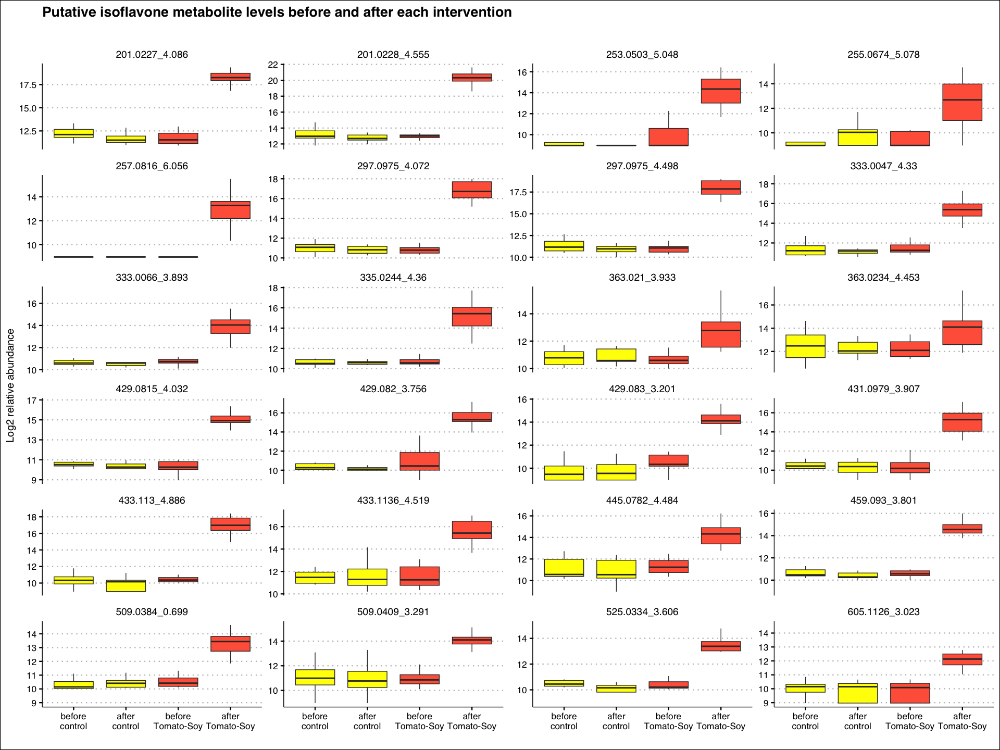<!-- -->

``` r
isoflavones_sum <- isoflavones %>%
  mutate(total_isoflavones = rowSums(.[12:ncol(.)]))

isoflavones_sum_tidy <- isoflavones_sum %>%
  pivot_longer(cols = 12:ncol(.),
               names_to = "mz_rt",
               values_to = "rel_abund_log2")

isoflavones_sum_tidy$pre_post <- factor(isoflavones_sum_tidy$pre_post, levels = c("pre", "post"))

isoflavones_sum_tidy$Intervention <- factor(isoflavones_sum_tidy$Intervention,
                                         levels = c("Yellow", "Red"))
```

``` r
isoflavones_sum_tidy %>% 
  filter(mz_rt == "total_isoflavones") %>%
  ggplot(aes(x = pre_post, y = rel_abund_log2, color = Intervention)) +
  geom_point() + 
  geom_line(aes(group = Intervention)) +
  scale_color_manual(values = c("Yellow" = "gold",
                                "Red" = "tomato1")) +
  facet_wrap(vars(Subject), scales = "free_y") + 
  theme_clean(base_size = 18, base_family = "sans") +
  labs(x = "",
       y = "Log2 relative abundance",
       title = "Total isoflavone abundances")
```

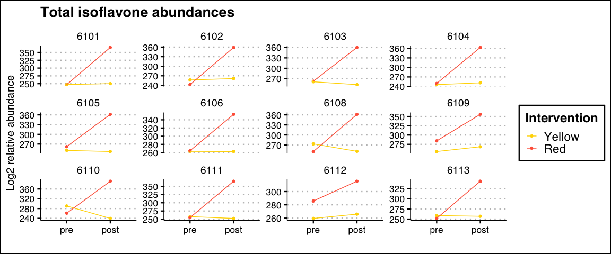<!-- -->
\## Descriptive stats

### all isoflavones

``` r
compare_means(rel_abund_log2 ~ pre_post, 
              isoflavones_sum_tidy %>% 
                filter(mz_rt == "total_isoflavones"), 
              method = "t.test", paired = TRUE, group.by = "Intervention")
```

    ## # A tibble: 2 × 9
    ##   Intervention .y.         group1 group2       p  p.adj p.format p.signif method
    ##   <fct>        <chr>       <chr>  <chr>    <dbl>  <dbl> <chr>    <chr>    <chr> 
    ## 1 Red          rel_abund_… pre    post   6.49e-8 1.3e-7 6.5e-08  ****     T-test
    ## 2 Yellow       rel_abund_… pre    post   3.29e-1 3.3e-1 0.33     ns       T-test

``` r
(total_isoflavones_boxplots <- isoflavones_sum_tidy %>%
   filter(mz_rt == "total_isoflavones") %>%
  ggpaired(x = "pre_post", y = "rel_abund_log2", fill = "Intervention", facet.by = "Intervention", short.panel.labs = FALSE, panel.labs = list(Intervention = c("", ""))) +
  scale_fill_manual(values = c("Red" = "tomato1",
                               "Yellow" = "yellow1"),
                    labels = c("Control", "Tomato-Soy")) +
  scale_x_discrete() +
  geom_line(aes(group = Subject), colour = "gray", linewidth = 0.15) +
  theme_clean(base_size = 18, base_family = "sans") +
  labs(x = "",
       y = expression(Log[2]~"Metabolite Abundance"),
       title = "Total Abundance of Isoflavone Metabolites",
       subtitle = "Negative ionization mode"))
```

    ## `geom_line()`: Each group consists of only one observation.
    ## ℹ Do you need to adjust the group aesthetic?
    ## `geom_line()`: Each group consists of only one observation.
    ## ℹ Do you need to adjust the group aesthetic?

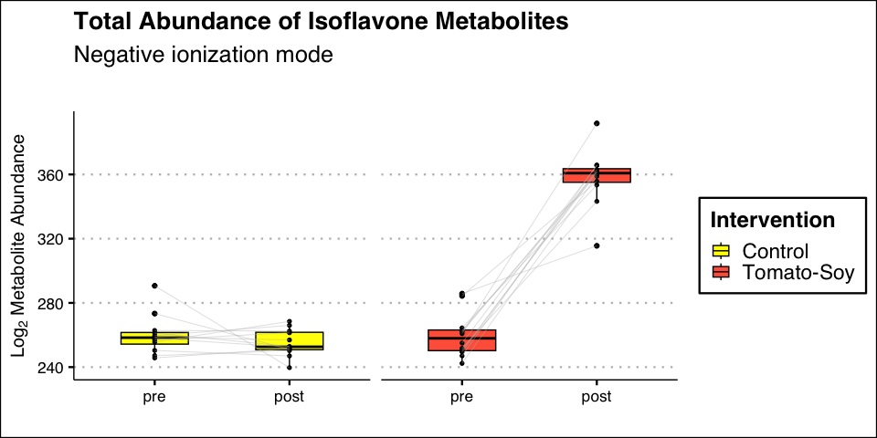<!-- -->

``` r
ggsave("figures/total_isoflavones.svg", total_isoflavones_boxplots, width = 10)
```

    ## Saving 10 x 5 in image
    ## `geom_line()`: Each group consists of only one observation.
    ## ℹ Do you need to adjust the group aesthetic?
    ## `geom_line()`: Each group consists of only one observation.
    ## ℹ Do you need to adjust the group aesthetic?

# Putative isoflavones

``` r
isoflavones_tidy$pre_post <- factor(isoflavones_tidy$pre_post,
                                         levels = c("pre", "post"))
```

## Ethylphenol sulfate (4- and/or 3-config)

1.  isomer 1: 201.0227_4.086 cluster: 201.0227_4.086;201.0227_4.09

### line graph

``` r
isoflavones_tidy %>% 
  filter(mz_rt == "201.0227_4.086") %>%
  ggplot(aes(x = pre_post, y = rel_abund_log2, color = Intervention)) +
  geom_point() + 
  geom_line(aes(group = Intervention)) +
  scale_color_manual(values = c("Yellow" = "gold",
                                "Red" = "tomato1")) +
  facet_wrap(vars(Subject), scales = "free_y") + 
  theme_clean(base_size = 18, base_family = "sans") +
  labs(x = "",
       y = "Log 2 relative abundance",
       title = "Possibly ethylphenyl sulfate 1: levels in each patient before/after each intervention")
```

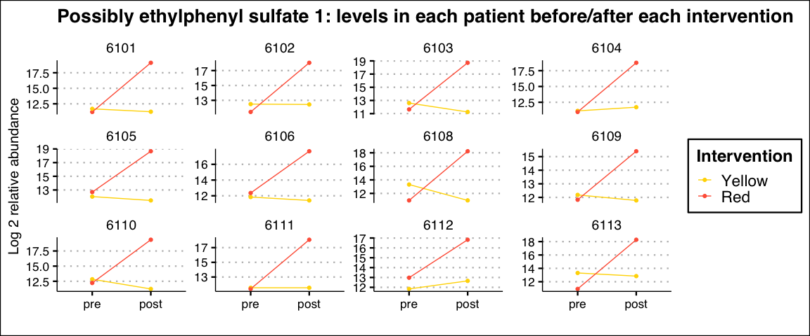<!-- -->

2.  isomer 2: 201.0228_4.555 cluster:
    1122.0244_4.55;201.0228_4.555;203.0172_4.555;425.0363_4.553

``` r
isoflavones_tidy %>% 
  filter(mz_rt == "201.0228_4.555") %>%
  ggplot(aes(x = pre_post, y = rel_abund_log2, color = Intervention)) +
  geom_point() + 
  geom_line(aes(group = Intervention)) +
  scale_color_manual(values = c("Yellow" = "gold",
                                "Red" = "tomato1")) +
  facet_wrap(vars(Subject), scales = "free_y") + 
  theme_clean(base_size = 18, base_family = "sans") +
  labs(x = "",
       y = "Log 2 relative abundance",
       title = "Possibly ethylphenyl sulfate 2: levels in each patient before/after each intervention")
```

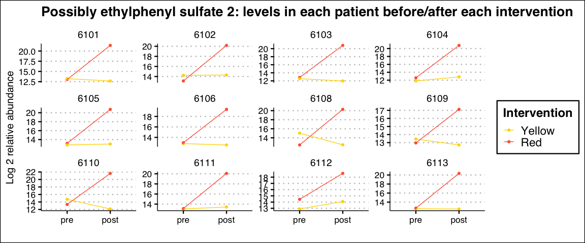<!-- -->

### boxplots

``` r
# make ethylphenyl sulfate isomer 1 df
EPS1_tidy <- isoflavones_tidy %>%
  filter(mz_rt == "201.0227_4.086")

compare_means(rel_abund_log2 ~ pre_post, EPS1_tidy, method = "t.test", paired = TRUE, group.by = "Intervention")
```

    ## # A tibble: 2 × 9
    ##   Intervention .y.        group1 group2       p   p.adj p.format p.signif method
    ##   <fct>        <chr>      <chr>  <chr>    <dbl>   <dbl> <chr>    <chr>    <chr> 
    ## 1 Red          rel_abund… pre    post   9.19e-9 1.80e-8 9.2e-09  ****     T-test
    ## 2 Yellow       rel_abund… pre    post   6.60e-2 6.6 e-2 0.066    ns       T-test

``` r
EPS1_tidy$pre_post <- as.factor(EPS1_tidy$pre_post)

EPS1_tidy$pre_post <- factor(EPS1_tidy$pre_post, levels = c("pre", "post"))

(EPS1_bps <- EPS1_tidy %>% 
  ggpaired(x = "pre_post", y = "rel_abund_log2", fill = "Intervention", line.color = "gray", line.size = 1, facet.by = "Intervention", short.panel.labs = FALSE, panel.labs = list(Intervention = c("", ""))) +
  scale_fill_manual(values = c("Red" = "tomato1",
                               "Yellow" = "yellow1"),
                    labels = c("Control", "Tomato-Soy")) +
  scale_x_discrete() +
  geom_line(aes(group = Subject), colour = "gray", size = 0.15) +
  theme_clean(base_size = 18, base_family = "sans") +
  labs(x = "",
       y = expression(Log[2]~"Metabolite Abundance"),
       title = "Abundance of 4-Ethylphenyl Sulfate",
       subtitle = "Negative ionization mode, m/z = 201.0227, retention time = 4.08"))
```

    ## Warning: Using `size` aesthetic for lines was deprecated in ggplot2 3.4.0.
    ## ℹ Please use `linewidth` instead.
    ## This warning is displayed once every 8 hours.
    ## Call `lifecycle::last_lifecycle_warnings()` to see where this warning was
    ## generated.

    ## `geom_line()`: Each group consists of only one observation.
    ## ℹ Do you need to adjust the group aesthetic?
    ## `geom_line()`: Each group consists of only one observation.
    ## ℹ Do you need to adjust the group aesthetic?

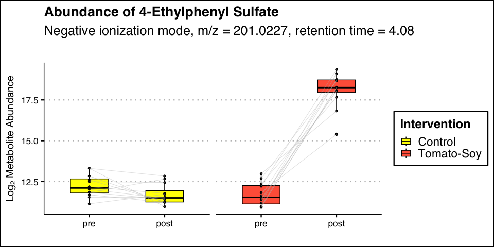<!-- -->

confirmed with authentic standard

``` r
ggsave(filename = "figures/4-EPS.svg", plot = EPS1_bps, width = 12)
```

    ## Saving 12 x 5 in image
    ## `geom_line()`: Each group consists of only one observation.
    ## ℹ Do you need to adjust the group aesthetic?
    ## `geom_line()`: Each group consists of only one observation.
    ## ℹ Do you need to adjust the group aesthetic?

``` r
isoflavones_tidy %>% 
  filter(mz_rt == "201.0227_4.086") %>%
  ggplot(aes(x = pre_post_intervention, y = rel_abund_log2, fill = Intervention)) +
  geom_boxplot(outlier.shape = NA, show.legend = FALSE) + 
  scale_fill_manual(values = c("Red" = "tomato1",
                               "Yellow" = "yellow1")) +
  scale_x_discrete(labels = labs_ppintervention) +
  theme_clean(base_size = 18, base_family = "sans") +
  labs(x = "",
       y = "Log2 relative abundance",
       title = "Possibly ethylphenyl sulfate 1",
       subtitle = "201.0227_4.086")
```

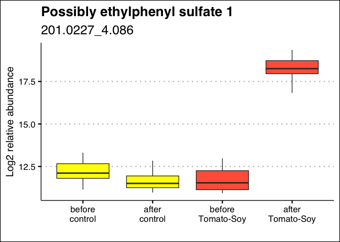<!-- -->

``` r
isoflavones_tidy %>% 
  filter(mz_rt == "201.0228_4.555") %>%
  ggplot(aes(x = pre_post_intervention, y = rel_abund_log2, fill = Intervention)) +
  geom_boxplot(outlier.shape = NA, show.legend = FALSE) + 
  scale_fill_manual(values = c("Red" = "tomato1",
                               "Yellow" = "yellow1")) +
  scale_x_discrete(labels = labs_ppintervention) +
  theme_clean(base_size = 18, base_family = "sans") +
  labs(x = "",
       y = "Log2 relative abundance",
       title = "Possibly ethylphenyl sulfate 2",
       subtitle = "201.0228_4.555")
```

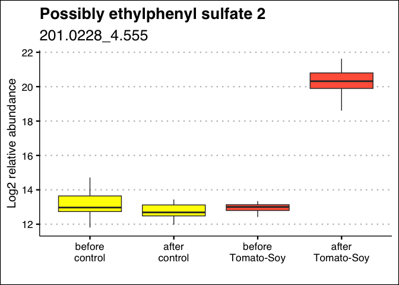<!-- -->

``` r
isoflavones_tidy %>% 
  filter(mz_rt == "201.0228_4.555") %>%
  ggplot(aes(x = pre_post_intervention, y = rel_abund_log2, fill = Intervention)) +
  geom_boxplot(outlier.shape = NA, show.legend = FALSE) + 
  scale_fill_manual(values = c("Red" = "tomato1",
                               "Yellow" = "yellow1")) +
  scale_x_discrete(labels = labs_ppintervention) +
  theme_clean(base_size = 18, base_family = "sans") +
  labs(x = "",
       y = "Log2 relative abundance",
       title = "Possibly ethylphenyl sulfate 2",
       subtitle = "201.0228_4.555")
```

<!-- -->

## Ethylphenol glucuronide (4- and/or 3-config)

1.  isomer 1: 297.0975_4.498 cluster:
    297.0975_4.498;297.1062_4.504;365.0866_4.514

``` r
isoflavones_tidy %>% 
  filter(mz_rt == "297.0975_4.498") %>%
  ggplot(aes(x = pre_post, y = rel_abund_log2, color = Intervention)) +
  geom_point() + 
  geom_line(aes(group = Intervention)) +
  scale_color_manual(values = c("Yellow" = "gold",
                                "Red" = "tomato1")) +
  facet_wrap(vars(Subject), scales = "free_y") + 
  theme_clean(base_size = 18, base_family = "sans") +
  labs(x = "",
       y = "Log 2 relative abundance",
       title = "Possibly ethylphenyl glucuronide 1: levels in each patient before/after each intervention")
```

<!-- -->

2.  isomer 2: 297.0975_4.072

``` r
isoflavones_tidy %>% 
  filter(mz_rt == "297.0975_4.072") %>%
  ggplot(aes(x = pre_post, y = rel_abund_log2, color = Intervention)) +
  geom_point() + 
  geom_line(aes(group = Intervention)) +
  scale_color_manual(values = c("Yellow" = "gold",
                                "Red" = "tomato1")) +
  facet_wrap(vars(Subject), scales = "free_y") + 
  theme_clean(base_size = 18, base_family = "sans") +
  labs(x = "",
       y = "Log2 relative abundance",
       title = "Possibly ethylphenyl glucuronide 1: levels in each patient before/after each intervention",
       subtitle = "297.0975_4.072")
```

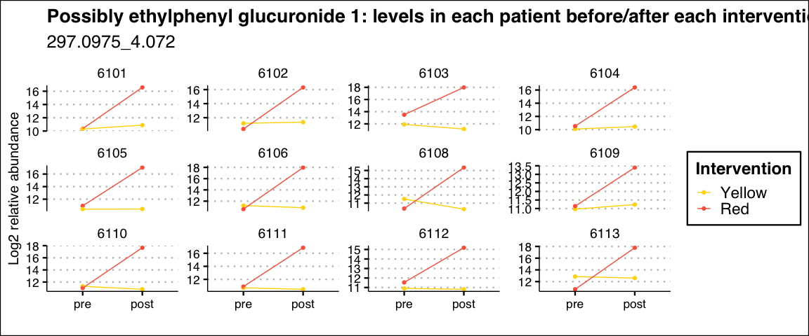<!-- -->

### boxplots

``` r
isoflavones_tidy %>% 
  filter(mz_rt == "297.0975_4.498") %>%
  ggplot(aes(x = pre_post_intervention, y = rel_abund_log2, fill = Intervention)) +
  geom_boxplot(outlier.shape = NA, show.legend = FALSE) + 
  scale_fill_manual(values = c("Red" = "tomato1",
                               "Yellow" = "yellow1")) +
  scale_x_discrete(labels = labs_ppintervention) +
  theme_clean(base_size = 18, base_family = "sans") +
  labs(x = "",
       y = "Log2 relative abundance",
       title = "Possibly ethylphenyl glucuronide 1",
       subtitle = "297.0975_4.498")
```

<!-- -->

``` r
isoflavones_tidy %>% 
  filter(mz_rt == "297.0975_4.072") %>%
  ggplot(aes(x = pre_post_intervention, y = rel_abund_log2, fill = Intervention)) +
  geom_boxplot(outlier.shape = NA, show.legend = FALSE) + 
  scale_fill_manual(values = c("Red" = "tomato1",
                               "Yellow" = "yellow1")) +
  scale_x_discrete(labels = labs_ppintervention) +
  theme_clean(base_size = 18, base_family = "sans") +
  labs(x = "",
       y = "Log2 relative abundance",
       title = "Possibly ethylphenyl glucuronide 2",
       subtitle = "297.0975_4.072")
```

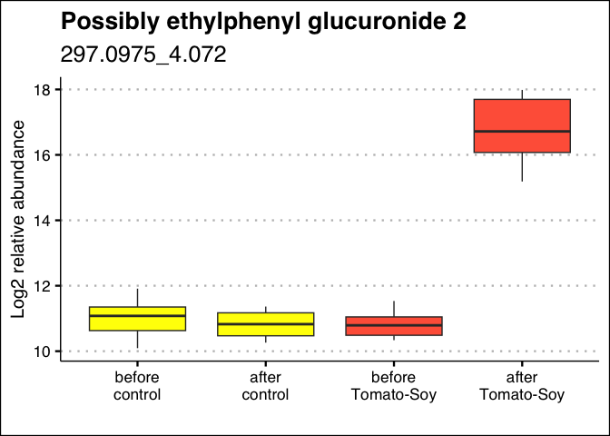<!-- -->

## O-DMA glucuronide

### line graph

isomer 1: 433.113_4.886

``` r
isoflavones_tidy %>% 
  filter(mz_rt == "433.113_4.886") %>%
  ggplot(aes(x = pre_post, y = rel_abund_log2, color = Intervention)) +
  geom_point() + 
  geom_line(aes(group = Intervention)) +
  scale_color_manual(values = c("Yellow" = "gold",
                                "Red" = "tomato1")) +
  facet_wrap(vars(Subject), scales = "free_y") + 
  theme_clean(base_size = 18, base_family = "sans") +
  labs(x = "",
       y = "Log2 relative abundance",
       title = "Possibly O-DMA glucuronide 1: levels in each patient before/after each intervention",
       subtitle = "433.113_4.886")
```

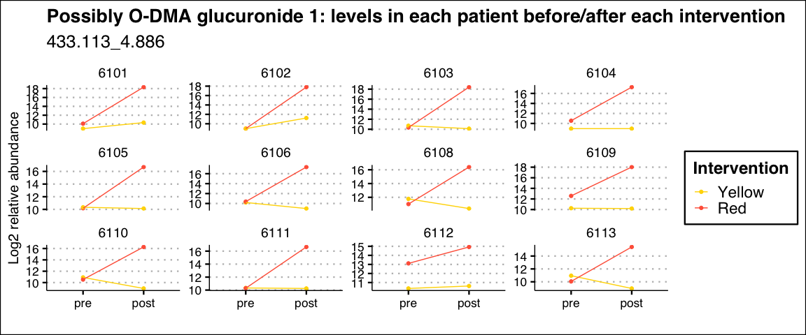<!-- -->

isomer 2: 433.1136_4.519

``` r
isoflavones_tidy %>% 
  filter(mz_rt == "433.1136_4.519") %>%
  ggplot(aes(x = pre_post, y = rel_abund_log2, color = Intervention)) +
  geom_point() + 
  geom_line(aes(group = Intervention)) +
  scale_color_manual(values = c("Yellow" = "gold",
                                "Red" = "tomato1")) +
  facet_wrap(vars(Subject), scales = "free_y") + 
  theme_clean(base_size = 18, base_family = "sans") +
  labs(x = "",
       y = "Log2 relative abundance",
       title = "Possibly O-DMA glucuronide 2",
       subtitle = "433.1136_4.519")
```

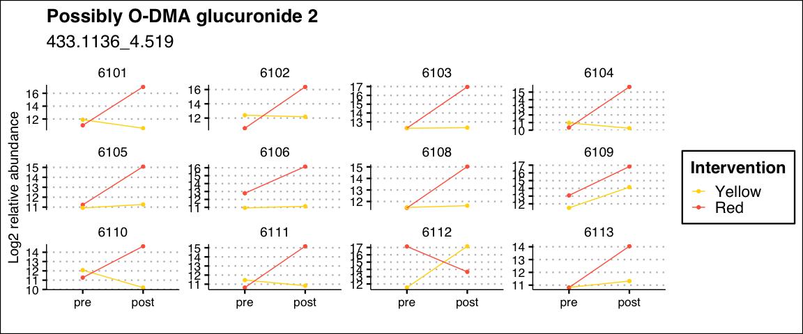<!-- -->

### boxplots

``` r
isoflavones_tidy %>% 
  filter(mz_rt == "433.113_4.886") %>%
  ggplot(aes(x = pre_post_intervention, y = rel_abund_log2, fill = Intervention)) +
  geom_boxplot(outlier.shape = NA, show.legend = FALSE) + 
  scale_fill_manual(values = c("Red" = "tomato1",
                               "Yellow" = "yellow1")) +
  scale_x_discrete(labels = labs_ppintervention) +
  theme_clean(base_size = 18, base_family = "sans") +
  labs(x = "",
       y = "Log2 relative abundance",
       title = "Possibly O-DMA glucuronide 1",
       subtitle = "433.113_4.886")
```

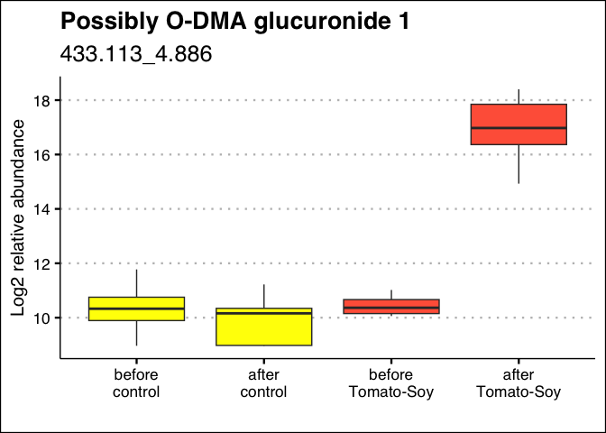<!-- -->

``` r
isoflavones_tidy %>% 
  filter(mz_rt == "433.1136_4.519") %>%
  ggplot(aes(x = pre_post_intervention, y = rel_abund_log2, fill = Intervention)) +
  geom_boxplot(outlier.shape = NA, show.legend = FALSE) + 
  scale_fill_manual(values = c("Red" = "tomato1",
                               "Yellow" = "yellow1")) +
  scale_x_discrete(labels = labs_ppintervention) +
  theme_clean(base_size = 18, base_family = "sans") +
  labs(x = "",
       y = "Log2 relative abundance",
       title = "Possibly O-DMA glucuronide 2",
       subtitle = "433.1136_4.519")
```

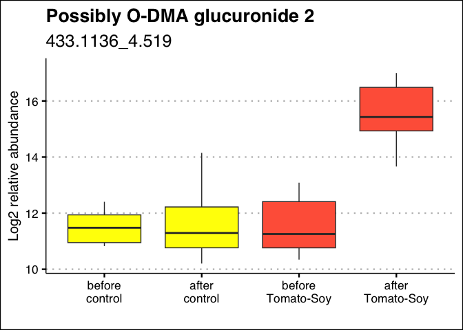<!-- -->

- Patient 6112 looks weird here

## O-DMA

257.0816_6.056

### line graph

``` r
isoflavones_tidy %>% 
  filter(mz_rt == "257.0816_6.056") %>%
  ggplot(aes(x = pre_post, y = rel_abund_log2, color = Intervention)) +
  geom_point() + 
  geom_line(aes(group = Intervention)) +
  scale_color_manual(values = c("Yellow" = "gold",
                                "Red" = "tomato1")) +
  facet_wrap(vars(Subject), scales = "free_y") + 
  theme_clean(base_size = 18, base_family = "sans") +
  labs(x = "",
       y = "Log2 relative abundance",
       title = "Possibly O-DMA",
       subtitle = "257.0816_6.056")
```

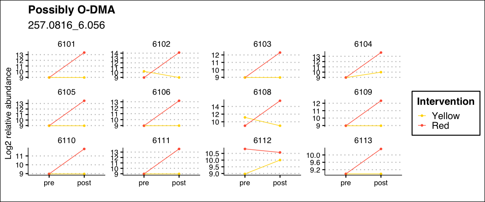<!-- -->

### boxplots

``` r
isoflavones_tidy %>% 
  filter(mz_rt == "257.0816_6.056") %>%
  ggplot(aes(x = pre_post_intervention, y = rel_abund_log2, fill = Intervention)) +
  geom_boxplot(outlier.shape = NA, show.legend = FALSE) + 
  scale_fill_manual(values = c("Red" = "tomato1",
                               "Yellow" = "yellow1")) +
  scale_x_discrete(labels = labs_ppintervention) +
  theme_clean(base_size = 18, base_family = "sans") +
  labs(x = "",
       y = "Log2 relative abundance",
       title = "Possibly O-DMA",
       subtitle = "257.0816_6.056")
```

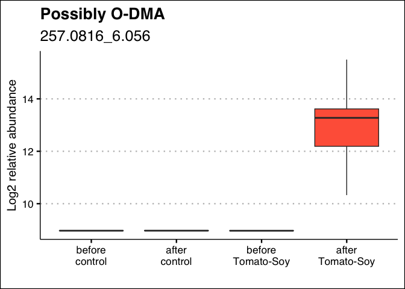<!-- -->

## Daidzein sulfate

### line graphs

isomer 1: 333.0047_4.33

``` r
isoflavones_tidy %>% 
  filter(mz_rt == "333.0047_4.33") %>%
  ggplot(aes(x = pre_post, y = rel_abund_log2, color = Intervention)) +
  geom_point() + 
  geom_line(aes(group = Intervention)) +
  scale_color_manual(values = c("Yellow" = "gold",
                                "Red" = "tomato1")) +
  facet_wrap(vars(Subject), scales = "free_y") + 
  theme_clean(base_size = 18, base_family = "sans") +
  labs(x = "",
       y = "Log2 relative abundance",
       title = "Possibly daidzein sulfate: levels in each patient before/after each intervention",
       subtitle = "333.0047_4.33")
```

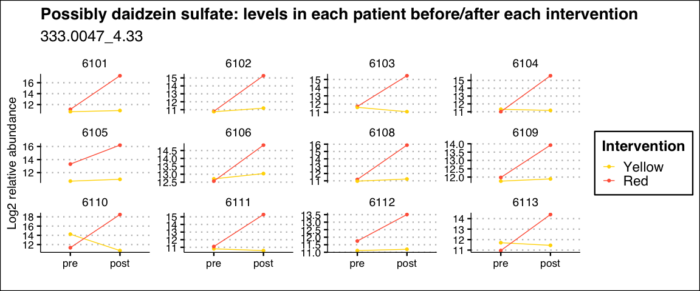<!-- -->

isomer 2: 333.0066_3.893

``` r
isoflavones_tidy %>% 
  filter(mz_rt == "333.0066_3.893") %>%
  ggplot(aes(x = pre_post, y = rel_abund_log2, color = Intervention)) +
  geom_point() + 
  geom_line(aes(group = Intervention)) +
  scale_color_manual(values = c("Yellow" = "gold",
                                "Red" = "tomato1")) +
  facet_wrap(vars(Subject), scales = "free_y") + 
  theme_clean(base_size = 18, base_family = "sans") +
  labs(x = "",
       y = "Log2 relative abundance",
       title = "Possibly daidzein sulfate isomer 2",
       subtitle = "333.0066_3.893")
```

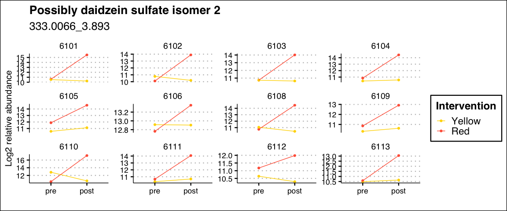<!-- -->

### boxplots

``` r
isoflavones_tidy %>% 
  filter(mz_rt == "333.0047_4.33") %>%
  ggplot(aes(x = pre_post_intervention, y = rel_abund_log2, fill = Intervention)) +
  geom_boxplot(outlier.shape = NA, show.legend = FALSE) + 
  scale_fill_manual(values = c("Red" = "tomato1",
                               "Yellow" = "yellow1")) +
  scale_x_discrete(labels = labs_ppintervention) +
  theme_clean(base_size = 18, base_family = "sans") +
  labs(x = "",
       y = "Log2 relative abundance",
       title = "Possibly daidzein sulfate isomer 1",
       subtitle = "333.0047_4.33")
```

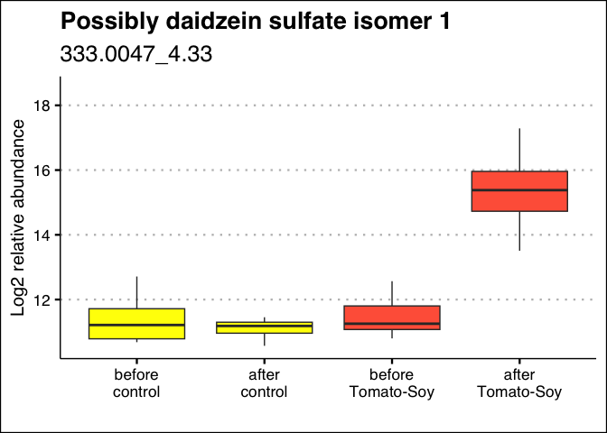<!-- -->

``` r
isoflavones_tidy %>% 
  filter(mz_rt == "333.0066_3.893") %>%
  ggplot(aes(x = pre_post_intervention, y = rel_abund_log2, fill = Intervention)) +
  geom_boxplot(outlier.shape = NA, show.legend = FALSE) + 
  scale_fill_manual(values = c("Red" = "tomato1",
                               "Yellow" = "yellow1")) +
  scale_x_discrete(labels = labs_ppintervention) +
  theme_clean(base_size = 18, base_family = "sans") +
  labs(x = "",
       y = "Log2 relative abundance",
       title = "Possibly daidzein sulfate isomer 2",
       subtitle = "333.0066_3.893")
```

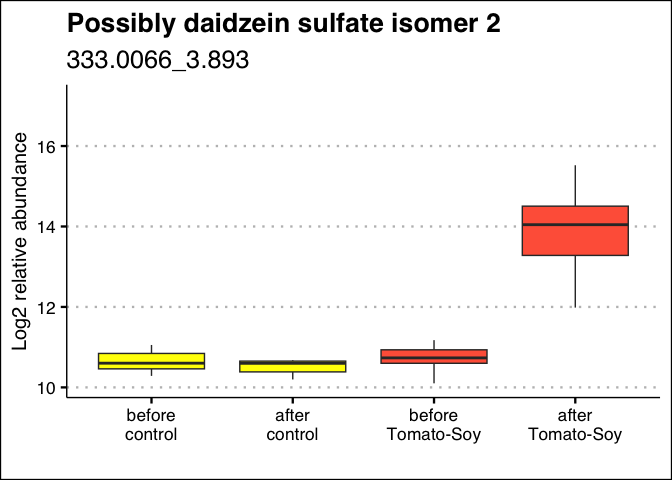<!-- -->

## Dihydrodaidzein sulfate

335.0244_4.36

### line graph

``` r
isoflavones_tidy %>% 
  filter(mz_rt == "335.0244_4.36") %>%
  ggplot(aes(x = pre_post, y = rel_abund_log2, color = Intervention)) +
  geom_point() + 
  geom_line(aes(group = Intervention)) +
  scale_color_manual(values = c("Yellow" = "gold",
                                "Red" = "tomato1")) +
  facet_wrap(vars(Subject), scales = "free_y") + 
  theme_clean(base_size = 18, base_family = "sans") +
  labs(x = "",
       y = "Log2 relative abundance",
       title = "Possibly dihydrodaizein",
       subtitle = "335.0244_4.36")
```

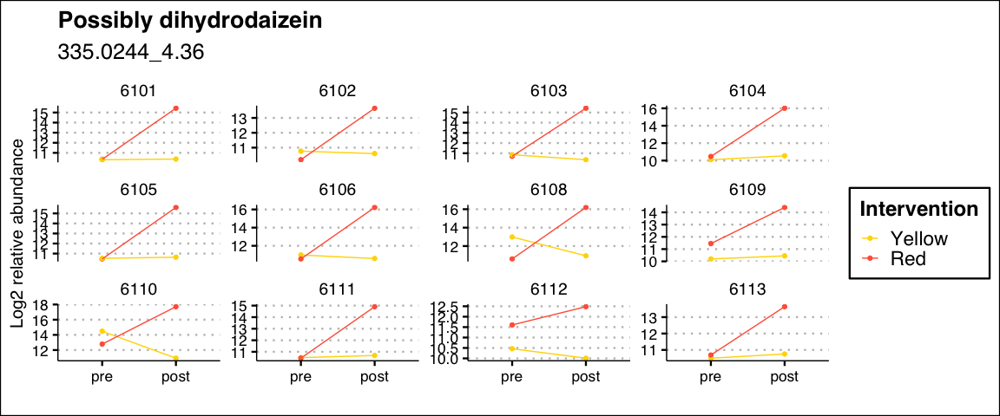<!-- -->

### boxplots

``` r
isoflavones_tidy %>% 
  filter(mz_rt == "335.0244_4.36") %>%
  ggplot(aes(x = pre_post_intervention, y = rel_abund_log2, fill = Intervention)) +
  geom_boxplot(outlier.shape = NA, show.legend = FALSE) + 
  scale_fill_manual(values = c("Red" = "tomato1",
                               "Yellow" = "yellow1")) +
  scale_x_discrete(labels = labs_ppintervention) +
  theme_clean(base_size = 18, base_family = "sans") +
  labs(x = "",
       y = "Log2 relative abundance",
       title = "Possibly dihydrodaidzein",
       subtitle = "335.0244_4.36")
```

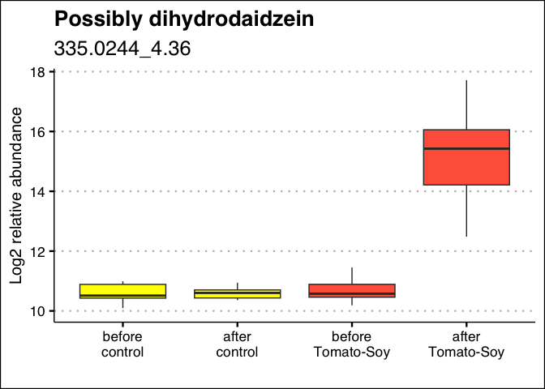<!-- -->

## Daidzein glucuronide

## Dihydrodaidzein glucuronide

## Daidzein

## Dihydrodaidzein

## Genistein sulfoglucuronide

## Daidzein sulfoglucuronide

## Genistein glucuronide

## Glycitein sulfate

(and/or biochanin a sulfate)

## Daidzein diglucuronide
