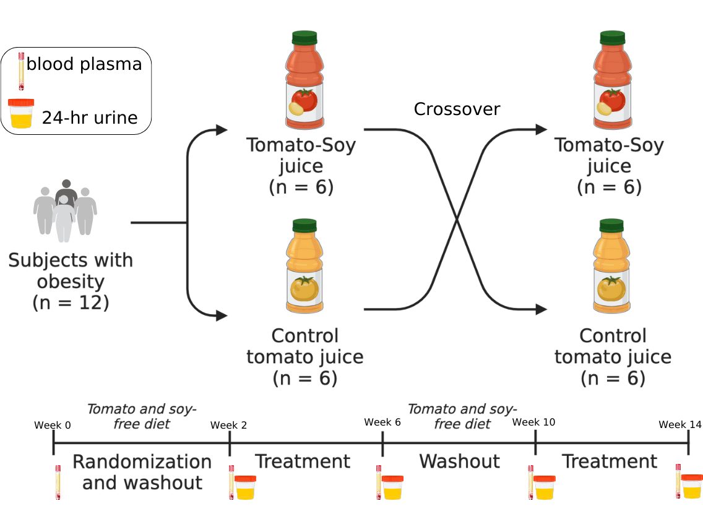

```{r setup, include=FALSE}
knitr::opts_chunk$set(echo = TRUE)
knitr::opts_chunk$set(warning = FALSE, message = FALSE)
```


# Introduction

Statistical analysis of plasma carotenoids, plasma cytokines and immune cells from randomized cross-over USDA inflammation clinical trial. Subjects consumed both low lycopene tomato (yellow) and high lycopene tomato-soy juices (red) for 4 weeks each.


```{r echo=FALSE, out.width="500px", fig.align='center', fig.cap="Crossover clinical trial design supplementing individuals with obesity 360 mL of a low carotenoid tomato juice or a high lycopene tomato-soy juice daily. Daily serving of low carotenoid tomato juice consisted of ~1.5mg lycopene/day while high lycopene tomato-soy juice intervention consisted of 54 mg lycopene/day in addition to 210 mg total soy isoflavones/day."}


```

# Load libraries
```{r, message=FALSE}
library(tidyverse) # data wrangling
library(readxl) # read in excel files
library(janitor) # clean up names in dataset
library(corrr) # finding correlations
library(rstatix) # stats
library(knitr) # aesthetic table viewing
library(purrr) # create functions
library(kableExtra)
library(ggthemes)
library(ggtext)
library(ggpubr)
library(ggcorrplot) # to make corr plots
library(pheatmap)
library(wesanderson) # nice color palettes
library(readxl)
library(effectsize)
```

# Read in data

```{r, results='hide'}
# load data
meta_table <- read_excel("CompiledData_Results_Meta.xlsx",
                         sheet = "metadata_corrected_withsequence")

# clean up variable names 
meta_table <- clean_names(meta_table)

str(meta_table)
```


## Wrangle

### Meta table

```{r, results='hide'}
# convert variables that should be factors to factors
meta_table <- meta_table %>%
  mutate(across(.cols = c("patient_id", "period", 
                          "intervention", "intervention_week", 
                          "pre_post", "sex", "sequence"),
                .fns = as.factor))


# some stuff came in as characters but should be numeric
meta_table <- meta_table %>%
  mutate(across(.cols = c("il_2", "il_10", "il_13", "il_4"),
                .fns = as.numeric))

```


```{r}
# changing factor levels for pre_post
meta_table$pre_post <- factor(meta_table$pre_post,
                              levels = c("pre", "post"))

levels(meta_table$pre_post)  
```


```{r}
# Calculate total_cis_lyc, total_lyc, and total_carotenoids
meta_table <- meta_table %>%
  rename(n5_cis_lyc = x5_cis_lyc) %>%
  mutate(total_cis_lyc = other_cis_lyc + n5_cis_lyc,
         total_lyc = all_trans_lyc + total_cis_lyc,
         total_carotenoids = lutein + zeaxanthin + b_cryptoxanthin + 
                             a_carotene + b_carotene + total_lyc + phytoene + phytofluene) 
```

```{r}
# create a more specific pre_post_intervention column
meta_table_edited <- meta_table %>%
  unite(col = "pre_post_intervention",
        c("pre_post","intervention"),
        sep = "_",
        remove = FALSE)
```

### Carot tidy table
```{r}
carot_tidy_meta_tbl_edited <- meta_table_edited %>%
  pivot_longer(cols = lutein:total_carotenoids,
               names_to = "carotenoid",
               values_to = "nmol_per_L")
```

```{r}
# nicer names for plots and tables
names_caroteniods <- c("Lutein", "Zeaxanthin", "\u03b2-Cryptoxanthin", "\u03b1-Carotene", "\u03b2-Carotene", "other-cis-Lycopene", "all-trans-Lycopene", "5-cis-Lycopene", "Phytoene", "Phytofluene", "Total cis-Lycopene", "Total Lycopene", "Total Carotenoids")

names(names_caroteniods) <- unique(carot_tidy_meta_tbl_edited$carotenoid)
```

# Carotenoids

## All-trans-lyc levels

```{r}
# line plots for each subject at each timepoint
meta_table %>% 
  ggplot(aes(x = intervention_week, y = all_trans_lyc, color = intervention)) +
  geom_point() + 
  geom_line(aes(group = intervention)) +
  scale_color_manual(values = c("Baseline" = "gray", 
                                           "Yellow" = "gold",
                                           "Red" = "tomato1")) +
  facet_wrap(vars(patient_id), scales = "free_y") + 
  theme_bw() +
  labs(x = "Intervention Week",
       y = "All-trans-lycopene levels (nmol/L)",
       title = "All-trans-lycopene levels in each patient before/after each intervention")
```

## Total cis-lyc levels
```{r}
# line plots for each subject at each timepoint
meta_table %>% 
  ggplot(aes(x = intervention_week, y = total_cis_lyc, color = intervention)) +
  geom_point() + 
  geom_line(aes(group = intervention)) +
  scale_color_manual(values = c("Baseline" = "gray", 
                                           "Yellow" = "gold",
                                           "Red" = "tomato1")) +
  facet_wrap(vars(patient_id)) +
  theme_bw() +
  labs(x = "Intervention Week",
       y = "Total cis-lycopene levels (nmol/L)",
       title = "Total cis-lycopene levels in each patient before/after each intervention")
```

### Subj 6112

```{r}
# line plots for 6112 at each timepoint
carot_tidy_meta_tbl_edited %>% 
  filter(patient_id == 6112) %>%
  filter(carotenoid %in% c("n5_cis_lyc", "other_cis_lyc", "total_cis_lyc", "all_trans_lyc")) %>%
  ggplot(aes(x = intervention_week, y = nmol_per_L, color = intervention)) +
  geom_point() + 
  geom_line(aes(group = intervention)) +
  scale_color_manual(values = c("Baseline" = "gray", 
                                           "Yellow" = "gold",
                                           "Red" = "tomato1")) +
  facet_wrap(vars(carotenoid), nrow = 1) +
  theme_bw() +
  labs(x = "Intervention Week",
       y = "nmol/L",
       title = "Lycopene levels in subj 6112 before/after each intervention")
```

```{r}
# line plots for 6112 at each timepoint
carot_tidy_meta_tbl_edited %>% 
  filter(patient_id == 6112) %>%
  filter(carotenoid == "all_trans_lyc") %>%
  ggplot(aes(x = intervention_week, y = nmol_per_L, color = intervention)) +
  geom_point() + 
  geom_line(aes(group = intervention)) +
  scale_color_manual(values = c("Baseline" = "gray", 
                                           "Yellow" = "gold",
                                           "Red" = "tomato1")) +
  facet_wrap(vars(carotenoid)) +
  theme_bw() +
  labs(x = "Intervention Week",
       y = "all-trans-lycopene levels (nmol/L)",
       title = "All-trans-lycopene levels in subj 6112 before/after each intervention")
```

## Total lyc levels

### lineplots 

```{r}
# line plots for each subject at each timepoint
meta_table %>% 
  ggplot(aes(x = intervention_week, y = total_lyc, color = intervention)) +
  geom_point() + 
  geom_line(aes(group = intervention)) +
  scale_color_manual(values = c("Baseline" = "gray", 
                                           "Yellow" = "gold",
                                           "Red" = "tomato1")) +
  facet_wrap(vars(patient_id), scales = "free_y") +
  theme_bw() +
  labs(x = "Intervention Week",
       y = "Total lycopene levels (nmol/L)",
       title = "Total lycopene levels in each patient before/after each intervention")
```

*note* Subject 6112 has increased total lycopene levels after yellow intervention. I'll remove them from statistical analyses.

### Boxplots

#### wrangling

```{r}
# make pre_post_intervention column factors
meta_table_edited$pre_post_intervention <- as.factor(meta_table_edited$pre_post_intervention)

# relevel factor columns
meta_table_edited$pre_post_intervention <- factor(meta_table_edited$pre_post_intervention, levels = c("pre_Yellow", "post_Yellow", "pre_Red", "post_Red"))

meta_table_edited$intervention <- factor(meta_table_edited$intervention,
                                         levels = c("Baseline","Yellow", "Red"))

```


```{r}
# make legend title
legendtitle_ppintervention <- "Timepoint"


# labels
labs_ppintervention <- c("pre control",
                         "post control",
                         "pre Tomato-Soy",
                         "post Tomato-Soy")
```


```{r, fig.width=12}
# ggpubr to make pub ready plot
(total_lyc_levels <- meta_table_edited %>% 
    filter(intervention != "Baseline") %>%
  ggpaired(x = "pre_post", y = "total_lyc", fill = "intervention", line.color = "gray", line.size = 1, facet.by = "intervention", short.panel.labs = FALSE, panel.labs = list(intervention = c("", "", ""))) +
  scale_fill_manual(values = c("Red" = "tomato1",
                               "Yellow" = "yellow1"),
                    labels = c("Control", "Tomato-Soy"),
                    name = "Intervention") +
  geom_line(aes(group = patient_id), colour = "gray", linewidth = 0.15) +
  theme_clean(base_size = 18, base_family = "sans") +
  labs(x = "",
       y = "nmol/L plasma",
       title = "Concentration of Lycopene",
       subtitle = ""))
```

### Descriptive stats

#### wrangle
```{r}
# convert meta_table_edited to long format for total lycopene
meta_table_lyc_long <- meta_table_edited %>%
  pivot_longer(cols = total_lyc,
               names_to = "total_lycopene",
               values_to = "nmol_per_L")
```


#### Avg/std dev

##### tomsoy
```{r}
meta_table_lyc_long %>%
  filter(intervention == "Red") %>%
  group_by(pre_post) %>%
  summarize(mean = mean(nmol_per_L),
            stdev = sd(nmol_per_L))
```

##### yellow
```{r}
meta_table_lyc_long %>%
  filter(intervention == "Yellow") %>%
  group_by(pre_post) %>%
  summarize(mean = mean(nmol_per_L),
            stdev = sd(nmol_per_L))
```

#### Mean fold changes
```{r}
lyc_subset <- meta_table_lyc_long %>%
  select(patient_id, pre_post_intervention, nmol_per_L) %>%
  pivot_wider(names_from = pre_post_intervention,
              values_from = nmol_per_L) %>%
  mutate(red_FC = post_Red/pre_Red,
         yellow_FC = post_Yellow/pre_Yellow)

lyc_subset %>%
  summarize(mean_red_FC = mean(red_FC),
            mean_yellow_FC = mean(yellow_FC))
```


```{r}
# convert outlier subset to long so i can remove them
subj6112_yellow <- carot_tidy_meta_tbl_edited %>%
  filter(patient_id == 6112) %>%
  filter(intervention == "Yellow")
```


Remove outlier (subject 6112 in yellow) to get correct FCs with yellow.
```{r}
lyc_subset_noOutlier <- meta_table_lyc_long %>%
  anti_join(subj6112_yellow, by = "patient_id") %>%
  select(patient_id, pre_post_intervention, nmol_per_L) %>%
  pivot_wider(names_from = pre_post_intervention,
              values_from = nmol_per_L) %>%
  mutate(red_FC = post_Red/pre_Red,
         yellow_FC = post_Yellow/pre_Yellow,
         post_FC = post_Red/post_Yellow)

lyc_subset_noOutlier %>%
  summarize(mean_red_FC = mean(red_FC),
            mean_yellow_FC = mean(yellow_FC),
            mean_post_FC = mean(post_FC))
```


## Beta-carotene
```{r, fig.width=12}
# ggpubr to make pub ready plot
(bC_levels_bps <- meta_table_edited %>% 
    filter(intervention != "Baseline") %>%
  ggpaired(x = "pre_post", y = "b_carotene", fill = "intervention", line.color = "gray", line.size = 1, facet.by = "intervention", short.panel.labs = FALSE, panel.labs = list(intervention = c("", "", ""))) +
  scale_fill_manual(values = c("Red" = "tomato1",
                               "Yellow" = "yellow1"),
                    labels = c("Control", "Tomato-Soy"),
                    name = "Intervention") +
  geom_line(aes(group = patient_id), colour = "gray", linewidth = 0.15) +
  theme_clean(base_size = 18, base_family = "sans") +
  labs(x = "",
       y = "nmol/L plasma",
       title = "Concentration of beta-Carotene",
       subtitle = ""))
```


### wrangle
```{r}
# convert meta_table_edited to long format for beta-carotene
meta_table_bc_long <- meta_table_edited %>%
  pivot_longer(cols = b_carotene,
               names_to = "beta_carotene",
               values_to = "nmol_per_L")
```


### Avg/std dev

#### tomsoy
```{r}
meta_table_bc_long %>%
  filter(intervention == "Red") %>%
  group_by(pre_post) %>%
  summarize(mean = mean(nmol_per_L),
            stdev = sd(nmol_per_L))
```

#### yellow
```{r}
meta_table_bc_long %>%
  filter(intervention == "Yellow") %>%
  group_by(pre_post) %>%
  summarize(mean = mean(nmol_per_L),
            stdev = sd(nmol_per_L))
```

### Mean fold changes
```{r}
bc_subset <- meta_table_bc_long %>%
  select(patient_id, pre_post_intervention, nmol_per_L) %>%
  pivot_wider(names_from = pre_post_intervention,
              values_from = nmol_per_L) %>%
  mutate(red_FC = post_Red/pre_Red,
         yellow_FC = post_Yellow/pre_Yellow)

bc_subset %>%
  summarize(mean_red_FC = mean(red_FC),
            mean_yellow_FC = mean(yellow_FC))
```

```{r}
# convert outlier subset to long so i can remove them
subj6112_yellow <- carot_tidy_meta_tbl_edited %>%
  filter(patient_id == 6112) %>%
  filter(intervention == "Yellow")
```


Remove outlier (subject 6112 in yellow) to get correct FCs with yellow.
```{r}
bc_subset_noOutlier <- meta_table_bc_long %>%
  anti_join(subj6112_yellow, by = "patient_id") %>%
  select(patient_id, pre_post_intervention, nmol_per_L) %>%
  pivot_wider(names_from = pre_post_intervention,
              values_from = nmol_per_L) %>%
  mutate(red_FC = post_Red/pre_Red,
         yellow_FC = post_Yellow/pre_Yellow,
         post_FC = post_Red/post_Yellow)

bc_subset_noOutlier %>%
  summarize(mean_red_FC = mean(red_FC),
            mean_yellow_FC = mean(yellow_FC),
            mean_post_FC = mean(post_FC))
```


## Mean_sd for all carotenoids

```{r}
carotenoids_summarized_withOutlier <- carot_tidy_meta_tbl_edited %>%
  group_by(carotenoid, pre_post_intervention) %>%
  summarise(mean = mean(nmol_per_L),
            stdev = sd(nmol_per_L),
            n = n()) %>%
  mutate(mean_sd = paste0(round(mean, 2), " ± ", round(stdev, 2)))
```

### Remove outlier

```{r}
# convert outlier subset to long so i can remove them
subj6112_yellow <- carot_tidy_meta_tbl_edited %>%
  filter(patient_id == 6112) %>%
  filter(intervention == "Yellow")
```


```{r}

carotenoids_summarized <- carot_tidy_meta_tbl_edited %>%
  anti_join(subj6112_yellow) %>%
  group_by(carotenoid, pre_post_intervention) %>%
  summarise(mean = mean(nmol_per_L),
            stdev = sd(nmol_per_L),
            n = n()) %>%
  mutate(mean_sd = paste0(round(mean, 2), " ± ", round(stdev, 2)))

# save
write_csv(carotenoids_summarized, "carotenoids_summarized.csv")
```


## Comparison stats total lyc


First, I need to remove subject 6112 from the yellow intervention, since their total lycopene levels is the only one increasing post-Yellow

```{r}
meta_table_lyc_long_rm_outlier <- anti_join(meta_table_lyc_long, 
                                            subj6112_yellow)
  
```

### Normality checks

Plot histogram
```{r}
gghistogram(meta_table_lyc_long_rm_outlier$nmol_per_L, bins = 40)
```

Shapiro's normality test

```{r}
# shapiro normality test for total lycopene. for pre yellow, post yellow, pre red and post red
meta_table_lyc_long_rm_outlier %>%
  filter(intervention != "Baseline") %>%
  group_by(pre_post_intervention) %>%
  shapiro_test(vars = "nmol_per_L")
```
P > 0.05 for all 4 groups, suggesting data here is normal.

### Paired t-test
```{r}
compare_means(nmol_per_L ~ pre_post, meta_table_lyc_long_rm_outlier, method = "t.test", paired = TRUE, group.by = "intervention")
```

### Boxplot
```{r}
(lyc_bp_stats_noOutlier <- meta_table_lyc_long_rm_outlier %>% 
   filter(intervention != "Baseline") %>%
  ggpaired(x = "pre_post", y = "nmol_per_L", fill = "intervention", 
           line.color = "gray", 
           line.size = 1, 
           facet.by = "intervention", 
           short.panel.labs = FALSE, panel.labs = list(intervention = c("", "", ""))) +
  scale_fill_manual(values = c("Red" = "tomato1",
                               "Yellow" = "yellow1"),
                    labels = c("Control", "Tomato-Soy"),
                    name = "Intervention") +
  geom_line(aes(group = patient_id), colour = "gray", linewidth = 0.15) +
  theme_clean(base_size = 18, base_family = "sans") +
  labs(x = "",
       y = "nmol/L plasma",
       title = "Concentration of Lycopene",
       subtitle = "") +
   stat_compare_means(method = "t.test", paired = TRUE) )
```

Total lycopene levels are significantly increasing only after post-Red intervention

#### export
```{r, eval=FALSE}
ggsave(filename = "Plots/total-lyc-red-yellow-boxplots-stats-noOutlier.svg", plot = lyc_bp_stats_noOutlier, width = 12)
```


## All carotenoids

### boxplots

```{r, fig.width=15, fig.height=15}
 carot_tidy_meta_tbl_edited %>% 
   filter(intervention != "Baseline",
          !carotenoid %in% c("all_trans_lyc", "n5_cis_lyc", "other_cis_lyc", "total_cis_lyc")) %>%
  ggpaired(x = "pre_post", y = "nmol_per_L", fill = "intervention", 
           line.color = "gray", 
           line.size = 1, 
           facet.by = c("intervention", "carotenoid"), 
           short.panel.labs = FALSE, panel.labs = list(intervention = c("", "", ""))) +
  scale_fill_manual(values = c("Red" = "tomato1",
                               "Yellow" = "yellow"),
                    labels = c("Control", "Tomato-Soy"),
                    name = "Intervention") +
  geom_line(aes(group = patient_id), colour = "gray", linewidth = 0.15) +
  theme_clean(base_size = 18, base_family = "sans") +
  labs(x = "",
       y = "nmol/L plasma",
       title = "Concentrations of carotenoids compared pre- to post- interventions \nfor tomato-soy juice and control ",
       subtitle = "") +
  stat_compare_means(method = "t.test", paired = TRUE)
  
```


```{r, fig.height=10}
 carot_tidy_meta_tbl_edited %>% 
   filter(pre_post == "post",
          !carotenoid %in% c("all_trans_lyc", "n5_cis_lyc", "other_cis_lyc", "total_cis_lyc")) %>%
  ggpaired(x = "pre_post_intervention", y = "nmol_per_L", fill = "intervention", 
           line.color = "gray", 
           line.size = 0.1, 
           facet.by = "carotenoid", 
           short.panel.labs = FALSE, panel.labs = list(intervention = c("", "", ""))) +
  scale_fill_manual(values = c("Red" = "tomato1",
                               "Yellow" = "yellow1"),
                    labels = c("Control", "Tomato-Soy"),
                    name = "Intervention") +
  geom_line(aes(group = patient_id), colour = "gray", linewidth = 0.15) +
  theme_clean(base_size = 18, base_family = "sans") +
  labs(x = "",
       y = "nmol/L plasma",
       title = "Concentrations of carotenoids compared between interventions",
       subtitle = "") +
  stat_compare_means(method = "wilcox.test", paired = TRUE)
  
```

#### Beta and lyc 

```{r}
my_comparisons <- list( c("pre_Yellow", "post_Yellow"), c("pre_Red", "post_Red"), c("post_Yellow", "post_Red") )
```


```{r}
# change pre_post_intervention to factor
carot_tidy_meta_tbl_edited$pre_post_intervention <- factor(carot_tidy_meta_tbl_edited$pre_post_intervention,
                                                           levels = c("NA_Baseline",
                                                                      "pre_Yellow", "post_Yellow",
                                                                      "pre_Red", "post_Red"))
```


```{r, fig.width=10, fig.height=6}
(carotenoids_bps <- carot_tidy_meta_tbl_edited %>% 
  filter(intervention != "Baseline",
         carotenoid %in% c("total_lyc", "b_carotene")) %>%
   filter(!patient_id %in% subj6112_yellow) %>%
  ggplot(aes(x = pre_post_intervention, y = nmol_per_L, fill = intervention)) +
  geom_boxplot(outlier.shape = NA) +
  scale_fill_manual(values = c("Red" = "tomato1",
                               "Yellow" = "yellow1"),
                    labels = c("Control", "Tomato-Soy"),
                    name = "Intervention") +
  stat_compare_means(comparisons = my_comparisons, method = "t.test", paired = TRUE, p.adjust.method = "BH") +
  geom_point() +
  geom_line(aes(group = patient_id), color = "gray", size = 0.2) +
  theme_classic(base_size = 18, base_family = "sans") +
  scale_x_discrete(labels = c("pre", "post", "pre", "post")) +
  labs(x = "",
       y = "nmol/L plasma",
       title = "Concentrations of Lycopene and \u03b2-Carotene in Blood Plasma",
       subtitle = "FDR adjusted p-values from paired T-tests") +
  facet_wrap( ~ carotenoid, labeller = labeller(carotenoid = names_caroteniods)))

```

```{r, warning=FALSE}
ggsave(filename = "Plots/carotenoids-boxplots.svg",
       plot = carotenoids_bps,
       width = 10,
       height = 6)
```

## T-test

```{r}
# doing this without outlier
carot_tidy_meta_tbl_edited_noOutlier <- carot_tidy_meta_tbl_edited %>%
  anti_join(subj6112_yellow)

carot_t_tests <- compare_means(nmol_per_L ~ pre_post, carot_tidy_meta_tbl_edited_noOutlier, method = "t.test", paired = TRUE, group.by = c("intervention", "carotenoid"))
```


# Missing data


```{r}
# calculate how many NAs there are per cytokine in whole data set
containsNAs_cytokines <- meta_table_edited %>%
  filter(intervention != "Baseline") %>%
  pivot_longer(cols = if_ng:il_4,
               names_to = "cytokine",
               values_to = "cyto_conc_pg_ml") %>%
  group_by(cytokine, patient_id) %>%
  count(is.na(cyto_conc_pg_ml)) %>%
  filter(`is.na(cyto_conc_pg_ml)` == TRUE)

kable(containsNAs_cytokines)
```


```{r}
# calculate how many NAs there are per cytokine in whole data set
containsNAs_cells <- meta_table_edited %>%
  filter(intervention != "Baseline") %>%
  pivot_longer(cols = starts_with("x"),
               names_to = "cell_type",
               values_to = "cell_value") %>%
  group_by(cell_type, pre_post_intervention) %>%
  count(is.na(cell_value)) %>%
  filter(`is.na(cell_value)` == TRUE)

kable(containsNAs_cells)
```

```{r}
# impute any missing values by replacing them with 1/2 of the lowest concentration value of a cytokine (i.e. in a row).
imputed_meta_table <- meta_table_edited %>%
  filter(intervention != "Baseline")

imputed_meta_table[,11:25] <- lapply(imputed_meta_table[,11:25], 
                              function(x) ifelse(is.na(x),
                                                 min(x, na.rm = TRUE)/2, x))

dim(imputed_meta_table)
```


```{r}
# impute any missing values by replacing them with 1/2 of the lowest concentration value of a cell type (i.e. in a row).
imputed_meta_table[,26:82] <- lapply(imputed_meta_table[,26:82], 
                              function(x) ifelse(is.na(x),
                                                 min(x, na.rm = TRUE)/2, x))

dim(imputed_meta_table)
```

# Cytokines

```{r}
# convert cytokines from wide to long
cytokines_long <- imputed_meta_table[-c(26:82)] %>%
  pivot_longer(cols = if_ng:il_4,
               names_to = "cytokine",
               values_to = "cyto_conc_pg_ml")
```


Let's remove subject data points for subject 6112's yellow intervention first (their total lycopene levels increased post-yellow intervention)

```{r}
cytokines_noOutlier_long <- anti_join(cytokines_long,
                                      subj6112_yellow)
```


After testing several mixed linear models, the best model turned out to have pre_post as a fixed variable and patient_id as random effect. Carotenoids added no statistically significant effect to the model, suggesting that carotenoids may not contribute to cytokine levels. We decided to move on with paired mean comparisons for each group. May revisit mixed linear modeling to see if significant metabolites from metabolomics analyses affect immune outcomes (i.e. cytokine concentrations and immune cell populations).

## Normality check

First, let's calculate differences

```{r}
cytokines_diff <- cytokines_noOutlier_long %>%
  select(patient_id, pre_post_intervention, cytokine, cyto_conc_pg_ml) %>%
  pivot_wider(names_from = pre_post_intervention,
              values_from = cyto_conc_pg_ml) %>%
  mutate(diff_yellow = post_Yellow - pre_Yellow,
         diff_red = post_Red - pre_Red)
```

Check normality - qqplots

```{r, fig.width=12, fig.height=12}
ggqqplot(cytokines_diff, "diff_red", facet.by = "cytokine")
```


Check normality - shapiro wilke's
```{r}
cytokines_diff %>% 
  group_by(cytokine) %>%
  shapiro_test(diff_red)

cytokines_diff %>% 
  group_by(cytokine) %>%
  shapiro_test(diff_yellow)
```

Data is not normally distributed for many variables, so will use nonparametric paired tests for the mean comparisons.

## Friedman's test

This is a nonparametric alternative to repeated measures ANOVA

```{r}
(fried.res.cytokines <- cytokines_long %>% 
  filter(intervention != "Baseline",
         patient_id != 6112) %>% # remove subj since their lyc levels increased post yellow
  group_by(cytokine) %>%
  friedman_test(cyto_conc_pg_ml ~ pre_post_intervention |patient_id))

# effect size
cytokines_long %>% 
  filter(intervention != "Baseline",
         patient_id != 6112) %>% # remove subj since their lyc levels increased post yellow
  group_by(cytokine) %>%
  friedman_effsize(cyto_conc_pg_ml ~ pre_post_intervention |patient_id)

```

*According to Friedman's test, IL-12p70 is significant across the 4 groups and has a moderate effect size*

What happens if we keep subj 6112?
```{r}
cytokines_long %>% 
  filter(intervention != "Baseline") %>% 
  group_by(cytokine) %>%
  friedman_test(cyto_conc_pg_ml ~ pre_post_intervention |patient_id)

# effect size
cytokines_long %>% 
  filter(intervention != "Baseline") %>% 
  group_by(cytokine) %>%
  friedman_effsize(cyto_conc_pg_ml ~ pre_post_intervention |patient_id)

```

IL-12p70 is still significant, but now with a smaller effect size.

## Wilcoxon rank-sum tests

### Carryover effects?

First, let's test for sequence effects. We don't expect to have this problem since the participants did a 4-week washout period (no tomato/lycopene or soy isoflavone-containing foods). This should have been sufficient enough for the intervention to not have lingering effects on cytokine levels.


```{r}
(wilcox_cyto_seqeffects <- cytokines_long %>%
   filter(pre_post == "post") %>%
   group_by(cytokine) %>%
   wilcox_test(cyto_conc_pg_ml ~ sequence, paired = TRUE, p.adjust.method = "BH", detailed = TRUE))
```

For every cytokine, sequence does not significantly effect the outcome. Therefore we can continue to assume there are no sequence effects.

### Baseline comparison

```{r}
(wilcox_cyto_baseline <- cytokines_noOutlier_long %>%
   filter(pre_post == "pre",
          patient_id != 6112) %>%
   group_by(cytokine) %>%
   wilcox_test(cyto_conc_pg_ml ~ intervention, paired = T, p.adjust.method = "BH", detailed = T))
```


### Yellow trt effects

Comparing pre- to post-yellow (low carotenoid) intervention

```{r}
(wilcox_cyto_yellow <- cytokines_noOutlier_long %>%
  filter(intervention == "Yellow") %>%
  group_by(cytokine) %>%
  wilcox_test(cyto_conc_pg_ml ~ pre_post, paired = TRUE, p.adjust.method = "BH", detailed = TRUE))
```


```{r}
# extract statistically significant cytokines 
(sig_cytokines_yellow <- wilcox_cyto_yellow %>%
  filter(p < 0.05))
```

#### Effect sizes

```{r}
cytokines_noOutlier_long %>%
  filter(intervention == "Yellow") %>%
  group_by(cytokine) %>%
  wilcox_effsize(cyto_conc_pg_ml ~ pre_post, paired = TRUE, p.adjust.method = "BH", detailed = TRUE, ci = T)
```


### Red trt effects

Comparing pre- to post-red (tomato-soy) intervention

```{r}
(wilcox_cyto_red <-  cytokines_noOutlier_long %>%
  filter(intervention == "Red") %>%
  group_by(cytokine) %>%
  wilcox_test(cyto_conc_pg_ml ~ pre_post, paired = TRUE, p.adjust.method = "BH", detailed = TRUE))
```

```{r}
# extract statistically significant cytokines 
(sig_cytokines_red <- wilcox_cyto_red %>%
  filter(wilcox_cyto_red$p < 0.05))
```

* There are 3 cytokines (GM-CSF, IL-12p70, and IL-5) significantly different between pre and post-Red interventions only. Lets investigate. 

#### Effect sizes

```{r}
cytokines_noOutlier_long %>%
  filter(intervention == "Red") %>%
  group_by(cytokine) %>%
  wilcox_effsize(cyto_conc_pg_ml ~ pre_post, paired = TRUE, p.adjust.method = "BH", detailed = TRUE, ci = T)
```


#### GM-CSF

##### boxplots
```{r}
cytokines_long %>% 
  filter(cytokine == "gm_csf") %>%
  ggpaired(x = "pre_post", y = "cyto_conc_pg_ml", fill = "intervention", facet.by = "intervention", short.panel.labs = FALSE, panel.labs = list(intervention = c("", "", ""))) +
  scale_fill_manual(values = c("Red" = "tomato1",
                               "Yellow" = "yellow1"),
                    labels = c("Control", "Tomato-Soy"),
                    name = "Intervention") +
  geom_line(aes(group = patient_id), colour = "gray", size = 0.15) +
  theme_clean(base_size = 18, base_family = "sans") +
  labs(x = "",
       y = "pg/mL plasma",
       title = "Concentration of GM-CSF",
       subtitle = "") +
  stat_compare_means(method = "wilcox.test", paired = TRUE, p.adjust.method = "BH")

```


```{r}
cytokines_long %>% 
  filter(cytokine == "gm_csf") %>%
  filter(patient_id != 6102) %>% #6102 has really high levels so let's see what the data looks like without them
  ggpaired(x = "pre_post", y = "cyto_conc_pg_ml", fill = "intervention", facet.by = "intervention", short.panel.labs = FALSE, panel.labs = list(intervention = c("", "", ""))) +
  scale_fill_manual(values = c("Red" = "tomato1",
                               "Yellow" = "yellow1"),
                    labels = c("Control", "Tomato-Soy"),
                    name = "Intervention") +
  geom_line(aes(group = patient_id), colour = "gray", size = 0.15) +
  theme_clean(base_size = 18, base_family = "sans") +
  labs(x = "",
       y = "pg/mL plasma",
       title = "Concentration of GM-CSF",
       subtitle = "Without subj 6102")

```

```{r}
cytokines_long %>% 
  filter(cytokine == "gm_csf") %>%
  ggpaired(x = "pre_post", y = "cyto_conc_pg_ml", fill = "intervention", facet.by = "intervention", short.panel.labs = FALSE, panel.labs = list(intervention = c("", "", ""))) +
  scale_fill_manual(values = c("Red" = "tomato1",
                               "Yellow" = "yellow1"),
                    labels = c("Control", "Tomato-Soy"),
                    name = "Intervention") +
  geom_line(aes(group = patient_id), colour = "gray", size = 0.15) +
  theme_clean(base_size = 18, base_family = "sans") +
  scale_y_log10() +
  labs(x = "",
       y = "Log10 pg/mL plasma",
       title = "Concentration of GM-CSF",
       subtitle = "Log10 transformed y-axis")

```

##### lineplots

```{r}
meta_table %>% 
  filter(intervention != "Baseline") %>%
  ggplot(aes(x = pre_post, y = gm_csf, color = intervention)) +
  geom_line(aes(group = intervention)) +
  scale_color_manual(values = c("Yellow" = "gold",
                                "Red" = "tomato1")) +
  facet_wrap(vars(patient_id), scales = "free_y") + 
  theme_classic() +
  labs(x = "",
       y = "GM-CSF conc (pg/mL)",
       title = "GM-CSF levels in each patient pre- and post- red and yellow intervention")
```

#### IL-12p70

##### boxplots
```{r}
cytokines_long %>% 
  filter(cytokine == "il_12p70") %>%
  ggpaired(x = "pre_post", y = "cyto_conc_pg_ml", fill = "intervention", facet.by = "intervention", short.panel.labs = FALSE, panel.labs = list(intervention = c("", "", ""))) +
  scale_fill_manual(values = c("Red" = "tomato1",
                               "Yellow" = "yellow1"),
                    labels = c("Control", "Tomato-Soy"),
                    name = "Intervention") +
  geom_line(aes(group = patient_id), colour = "gray", size = 0.15) +
  theme_clean(base_size = 18, base_family = "sans") +
  labs(x = "",
       y = "pg/mL plasma",
       title = "Concentration of IL-12p70",
       subtitle = "") +
  stat_compare_means(method = "wilcox.test", paired = TRUE, p.adjust.method = "BH")

```


```{r}
cytokines_long %>% 
  filter(cytokine == "il_12p70") %>%
  filter(patient_id != 6102) %>% # visualize without 6102 since their levels are so high
  ggpaired(x = "pre_post", y = "cyto_conc_pg_ml", fill = "intervention", facet.by = "intervention", short.panel.labs = FALSE, panel.labs = list(intervention = c("", "", ""))) +
  scale_fill_manual(values = c("Red" = "tomato1",
                               "Yellow" = "yellow1"),
                    labels = c("Control", "Tomato-Soy"),
                    name = "Intervention") +
  geom_line(aes(group = patient_id), colour = "gray", size = 0.15) +
  theme_clean(base_size = 18, base_family = "sans") +
  labs(x = "",
       y = "pg/mL plasma",
       title = "Concentration of IL-12p70",
       subtitle = "Without subj 6102")
```

```{r}
cytokines_long %>% 
  filter(cytokine == "il_12p70") %>%
  ggpaired(x = "pre_post", y = "cyto_conc_pg_ml", fill = "intervention", facet.by = "intervention", short.panel.labs = FALSE, panel.labs = list(intervention = c("", "", ""))) +
  scale_fill_manual(values = c("Red" = "tomato1",
                               "Yellow" = "yellow1"),
                    labels = c("Control", "Tomato-Soy"),
                    name = "Intervention") +
  geom_line(aes(group = patient_id), colour = "gray", size = 0.15) +
  scale_y_log10() +
  theme_clean(base_size = 18, base_family = "sans") +
  labs(x = "",
       y = "log10 pg/mL plasma",
       title = "Concentration of IL-12p70",
       subtitle = "Log10 transformed y-axis")
```

##### lineplots

```{r}
meta_table %>% 
  filter(intervention != "Baseline") %>%
  ggplot(aes(x = pre_post, y = il_12p70, color = intervention)) +
  geom_line(aes(group = intervention)) +
  scale_color_manual(values = c("Yellow" = "gold",
                                "Red" = "tomato1")) +
  facet_wrap(vars(patient_id), scales = "free_y") + 
  theme_classic() +
  labs(x = "",
       y = "IL-12p70 conc (pg/mL)",
       title = "IL-12p70 levels in each patient pre- and post- red and yellow intervention")
```


#### IL-5

##### boxplots

```{r}
cytokines_long %>% 
  filter(cytokine == "il_5") %>%
  filter(intervention != "Baseline") %>%
  ggpaired(x = "pre_post", y = "cyto_conc_pg_ml", fill = "intervention", facet.by = "intervention", short.panel.labs = FALSE, panel.labs = list(intervention = c("", "", ""))) +
  scale_fill_manual(values = c("Red" = "tomato1",
                               "Yellow" = "yellow1"),
                    labels = c("Control", "Tomato-Soy"),
                    name = "Intervention") +
  geom_line(aes(group = patient_id), colour = "gray", size = 0.15) +
  theme_clean(base_size = 18, base_family = "sans") +
  labs(x = "",
       y = "pg/mL plasma",
       title = "Concentration of IL-5",
       subtitle = "") +
  stat_compare_means(method = "wilcox.test", paired = TRUE, p.adjust.method = "BH")

```


```{r}
cytokines_long %>% 
  filter(cytokine == "il_5") %>%
  filter(intervention != "Baseline") %>%
  ggpaired(x = "pre_post", y = "cyto_conc_pg_ml", fill = "intervention", facet.by = "intervention", short.panel.labs = FALSE, panel.labs = list(intervention = c("", "", ""))) +
  scale_fill_manual(values = c("Red" = "tomato1",
                               "Yellow" = "yellow1"),
                    labels = c("Control", "Tomato-Soy"),
                    name = "Intervention") +
  geom_line(aes(group = patient_id), colour = "gray", size = 0.15) +
  theme_clean(base_size = 18, base_family = "sans") +
  scale_y_log10() +
  labs(x = "",
       y = "Log10 pg/mL plasma",
       title = "Concentration of IL-5",
       subtitle = "Log10 transformed y-axis")

```

##### lineplots

```{r}
meta_table %>% 
  filter(intervention != "Baseline") %>%
  ggplot(aes(x = pre_post, y = il_5, color = intervention)) +
  geom_line(aes(group = intervention)) +
  scale_color_manual(values = c("Yellow" = "gold",
                                "Red" = "tomato1")) +
  facet_wrap(vars(patient_id), scales = "free_y") + 
  theme_classic() +
  labs(x = "",
       y = "IL-5 conc (pg/mL)",
       title = "IL-5 levels in each patient pre- and post- red and yellow intervention")
```

#### fold change

Let's look at the average fold change for significantly changing cells in yellow. We'll look at the avg fold change comparing pre to post yellow, pre to post Red, and post-intervention comparison.

```{r}

red_sigcytokines_subset <- cytokines_noOutlier_long %>%
  filter(cytokine %in% sig_cytokines_red$cytokine)%>%
  select(patient_id, pre_post_intervention, cytokine, cyto_conc_pg_ml) %>%
  group_by(cytokine) %>%
  pivot_wider(names_from = pre_post_intervention,
              values_from = cyto_conc_pg_ml) %>%
  mutate(yellow_FC = post_Yellow/pre_Yellow,
         red_FC = post_Red/pre_Red,
         post_intervention_FC = post_Red/post_Yellow)

red_sigcytokines_subset %>%
  summarize(mean_yellow_FC = mean(yellow_FC, na.rm = TRUE),
            mean_red_FC = mean(red_FC),
            mean_intervention_FC = mean(post_intervention_FC, na.rm = TRUE))

```

## Cytokines for pres


```{r}
# nicer names for plots and tables
names_cytokines <- c("Lutein", "Zeaxanthin", "\u03b2-Cryptoxanthin", "\u03b1-Carotene", "\u03b2-Carotene", "other-cis-Lycopene", "all-trans-Lycopene", "5-cis-Lycopene", "Phytoene", "Phytofluene", "Total cis-Lycopene", "Total Lycopene", "Total Carotenoids")

names(names_caroteniods) <- unique(carot_tidy_meta_tbl_edited$carotenoid)
```


### Intervention comparison
```{r}
(wilcox_cyto_intervention <- cytokines_noOutlier_long %>%
  filter(patient_id != 6112) %>% # remove subject 6112 so the red vs yellow comparison is even
  filter(pre_post == "post") %>%
  group_by(cytokine) %>%
  wilcox_test(cyto_conc_pg_ml ~ pre_post_intervention, paired = TRUE, p.adjust.method = "BH", detailed = TRUE))
```


```{r}
# extract statistically significant cytokines 
(sig_cytokines_intervention <- wilcox_cyto_intervention %>%
  filter(p < 0.05))

```

#### Effect sizes

```{r}
cytokines_noOutlier_long %>%
  filter(patient_id != 6112) %>% # remove subject 6112 so the red vs yellow comparison is even
  filter(pre_post == "post") %>%
  group_by(cytokine) %>%
  wilcox_effsize(cyto_conc_pg_ml ~ pre_post_intervention, paired = TRUE, p.adjust.method = "BH", detailed = TRUE, ci = T)
```

# All cytokines

```{r}
names_cytokines <- c("IFN-\u03b3", "IL-1\u03b2", "IL-2", "IL-6", "IL-8", "IL-10", "IL-12p70", "MCP-1", "TNF-\u03b1", "IL-13", "IL-5", "IL-1Ra", "IL-12p40", "GM-CSF", "IL-4")

names(names_cytokines) <- unique(cytokines_long$cytokine)
```


## Boxplots

### stats

```{r}
my_comparisons <- list( c("pre_Yellow", "post_Yellow"), c("pre_Red", "post_Red"), c("post_Yellow", "post_Red") )
```


```{r, fig.width=15, fig.height=12}
cytokines_noOutlier_long %>% 
  filter(intervention != "Baseline") %>%
  ggplot(aes(x = pre_post_intervention, y = cyto_conc_pg_ml, fill = intervention)) +
  geom_boxplot() +
  scale_fill_manual(values = c("Red" = "tomato1",
                               "Yellow" = "yellow1"),
                    labels = c("Control", "Tomato-Soy"),
                    name = "Intervention") +
  geom_point() +
  geom_line(aes(group = patient_id, colour = patient_id), size = 0.2) +
  theme_classic(base_size = 18, base_family = "sans") +
  scale_x_discrete(labels = c("pre", "post", "pre", "post")) +
  labs(x = "",
       y = "pg/mL plasma",
       title = "Concentrations of all cytokines",
       subtitle = "FDR adjusted p-values from Wilcoxon signed-rank tests \nLog10 transformed y-axis") +
  facet_wrap( ~ cytokine, scales = "free", ncol = 5, labeller = labeller(cytokine = names_cytokines)) +
  stat_compare_means(comparisons = my_comparisons, method = "wilcox.test", paired = TRUE, p.adjust.method = "BH")
```

```{r with 6112 yellow, fig.width=15, fig.height=12}
cytokines_long %>% 
  filter(intervention != "Baseline") %>%
  ggplot(aes(x = pre_post_intervention, y = cyto_conc_pg_ml, fill = intervention)) +
  geom_boxplot() +
  scale_fill_manual(values = c("Red" = "tomato1",
                               "Yellow" = "yellow1"),
                    labels = c("Control", "Tomato-Soy"),
                    name = "Intervention") +
  geom_point() +
  geom_line(aes(group = patient_id), color = "gray", size = 0.2) +
  theme_classic(base_size = 18, base_family = "sans") +
  scale_x_discrete(labels = c("pre", "post", "pre", "post")) +
  labs(x = "",
       y = "pg/mL plasma",
       title = "Concentrations of all cytokines",
       subtitle = "FDR adjusted p-values from Wilcoxon signed-rank tests \nWith outliers") +
  facet_wrap( ~ cytokine, scales = "free", ncol = 5, labeller = labeller(cytokine = names_cytokines)) +
  stat_compare_means(comparisons = my_comparisons, method = "wilcox.test", paired = TRUE, p.adjust.method = "BH")
```


```{r, fig.width=15, fig.height=15}
(cytokines_bps <- cytokines_long %>% 
  filter(intervention != "Baseline",
         !patient_id %in% subj6112_yellow) %>%
  ggplot(aes(x = pre_post_intervention, y = cyto_conc_pg_ml, fill = intervention)) +
  geom_boxplot(outlier.shape = NA) +
  scale_fill_manual(values = c("Red" = "tomato1",
                               "Yellow" = "yellow1"),
                    labels = c("Control", "Tomato-Soy"),
                    name = "Intervention") +
  stat_compare_means(comparisons = my_comparisons, method = "wilcox.test", paired = TRUE, p.adjust.method = "BH") +
  geom_point() +
  geom_line(aes(group = patient_id), color = "gray", size = 0.2) +
  theme_classic(base_size = 18, base_family = "sans") +
  scale_x_discrete(labels = c("pre", "post", "pre", "post")) +
  labs(x = "",
       y = "pg/mL plasma",
       title = "Concentrations of Inflammatory Cytokines in Blood Plasma",
       subtitle = "FDR adjusted p-values from Wilcoxon signed-rank tests") +
  facet_wrap( ~ cytokine, scales = "free_y", ncol = 5, labeller = labeller(cytokine = names_cytokines)))

```


```{r, warning=FALSE}
ggsave(filename = "Plots/cytokine-boxplots.svg",
       plot = cytokines_bps,
       width = 15,
       height = 15)
```


### log2 scaled

```{r, fig.width=15, fig.height=12}
cytokines_long %>% 
  filter(intervention != "Baseline") %>%
  ggplot(aes(x = pre_post_intervention, y = log2(cyto_conc_pg_ml), fill = intervention)) +
  geom_boxplot() +
  scale_fill_manual(values = c("Red" = "tomato1",
                               "Yellow" = "yellow1"),
                    labels = c("Control", "Tomato-Soy"),
                    name = "Intervention") +
  geom_point() +
  geom_line(aes(group = patient_id), colour = "gray", size = 0.2) +
  theme_classic(base_size = 18, base_family = "sans") +
  scale_x_discrete(labels = c("pre", "post", "pre", "post")) +
  labs(x = "",
       y = "log2(pg/mL) plasma",
       title = "Concentrations of cytokines from bioplex assay",
       subtitle = "") +
  facet_wrap( ~ cytokine, scales = "free", ncol = 5)
```

### Significant cytokines

```{r, fig.width=10, fig.height=6}
cytokines_long %>% 
  filter(intervention != "Baseline",
         !patient_id %in% subj6112_yellow,
         cytokine %in% sig_cytokines_red$cytokine) %>%
  ggplot(aes(x = pre_post_intervention, y = cyto_conc_pg_ml, fill = intervention)) +
  geom_boxplot(outlier.shape = NA) +
  scale_fill_manual(values = c("Red" = "tomato1",
                               "Yellow" = "yellow1"),
                    labels = c("Control", "Tomato-Soy"),
                    name = "Intervention") +
  stat_compare_means(comparisons = my_comparisons, method = "wilcox.test", paired = TRUE, p.adjust.method = "BH") +
  theme_classic(base_size = 18, base_family = "sans") +
  scale_x_discrete(labels = c("pre", "post", "pre", "post")) +
  labs(x = "",
       y = "pg/mL plasma",
       title = "Concentrations of cytokines from bioplex assay",
       subtitle = "FDR adjusted p-values from Wilcoxon signed-rank tests") +
  facet_wrap( ~ cytokine, scales = "free_y", ncol = 5, labeller = labeller(cytokine = names_cytokines))

```


```{r, fig.width=15, fig.height=8}
cytokines_long %>% 
  filter(intervention != "Baseline",
         !patient_id %in% subj6112_yellow,
         cytokine %in% c("gm_csf", "il_12p70", "il_5", "tn_fa")) %>%
  ggplot(aes(x = pre_post_intervention, y = cyto_conc_pg_ml, fill = intervention)) +
  geom_boxplot(outlier.shape = NA) +
  scale_fill_manual(values = c("Red" = "tomato1",
                               "Yellow" = "yellow1"),
                    labels = c("Control", "Tomato-Soy"),
                    name = "Intervention") +
  stat_compare_means(comparisons = my_comparisons, method = "wilcox.test", paired = TRUE, p.adjust.method = "BH") +
  geom_point() +
  geom_line(aes(group = patient_id), color = "gray", size = 0.2) +
  theme_classic(base_size = 18, base_family = "sans") +
  scale_x_discrete(labels = c("pre", "post", "pre", "post")) +
  labs(x = "",
       y = "pg/mL plasma",
       title = "Concentrations of Inflammatory Cytokines in Blood Plasma",
       subtitle = "FDR adjusted p-values from Wilcoxon signed-rank tests") +
  facet_wrap( ~ cytokine, scales = "free_y", ncol = 5, labeller = labeller(cytokine = names_cytokines))

```

## Violin plot

### reg
```{r, fig.width=15, fig.height=12}
cytokines_long %>% 
  filter(intervention != "Baseline") %>%
  ggplot(aes(x = pre_post_intervention, y = cyto_conc_pg_ml, fill = intervention)) +
  geom_violin() +
  scale_fill_manual(values = c("Red" = "tomato1",
                               "Yellow" = "yellow1"),
                    labels = c("Control", "Tomato-Soy"),
                    name = "Intervention") +
  geom_point() +
  geom_line(aes(group = patient_id), colour = "gray", size = 0.2) +
  theme_bw(base_size = 18, base_family = "sans") +
  scale_x_discrete(labels = c("pre", "post", "pre", "post")) +
  labs(x = "",
       y = "pg/mL plasma",
       title = "Concentrations of all cytokines",
       subtitle = "") +
  facet_wrap( ~ cytokine, scales = "free", ncol = 5)
```

### log2 scaled
```{r, fig.width=15, fig.height=12}
cytokines_long %>% 
  filter(intervention != "Baseline") %>%
  ggplot(aes(x = pre_post_intervention, y = log2(cyto_conc_pg_ml), fill = intervention)) +
  geom_violin() +
  scale_fill_manual(values = c("Red" = "tomato1",
                               "Yellow" = "yellow1"),
                    labels = c("Control", "Tomato-Soy"),
                    name = "Intervention") +
  geom_point() +
  geom_line(aes(group = patient_id), colour = "gray", size = 0.4) +
  theme_bw(base_size = 18, base_family = "sans") +
  scale_x_discrete(labels = c("pre", "post", "pre", "post")) +
  labs(x = "",
       y = "log2(pg/mL) plasma",
       title = "Concentrations of all cytokines",
       subtitle = "") +
  facet_wrap( ~ cytokine, scales = "free", ncol = 5)
```


### stats

```{r, fig.width=15, fig.height=12}
cytokines_long %>%
  filter(intervention != "Baseline") %>%
  ggviolin(x = "pre_post_intervention", y = "cyto_conc_pg_ml", fill = "intervention",
             palette = c("yellow", "tomato"),
             add = "boxplot", add.params = list(fill = "white")) +
    stat_compare_means(comparisons = my_comparisons,  method = "wilcox.test", paired = TRUE, p.adjust.method = "BH") +
  labs(title = "Concentrations of all cytokines",
       subtitle = "FDR adjusted p-values from Wilcoxon signed-rank tests") +
  scale_x_discrete(labels = c("pre", "post", "pre", "post")) +
  theme(legend.position = "none") +
  labs(x = "",
       y = "pg/mL plasma",
       title = "Concentrations of all cytokines",
       subtitle = "") +
  facet_wrap( ~cytokine, ncol = 5, scales = "free_y") 
```


## Change summaries

### Delta

```{r}
delta_cytokines <- cytokines_noOutlier_long %>%
  select(patient_id, pre_post_intervention, cytokine, cyto_conc_pg_ml) %>%
  group_by(cytokine) %>%
  pivot_wider(names_from = pre_post_intervention,
              values_from = cyto_conc_pg_ml) %>%
  mutate(delta_control = post_Yellow - pre_Yellow,
         delta_red = post_Red - pre_Red)
 
 
summaries_cytokines <- delta_cytokines %>%
  group_by(cytokine) %>%
  summarize(mean_delta_control = mean(delta_control),
            mean_delta_red = mean(delta_red))

# this is a table with the means and sd for each visit and group
summaries_2_cytokines <- cytokines_noOutlier_long %>%
  group_by(cytokine, intervention, pre_post) %>%
  summarize(mean = mean(cyto_conc_pg_ml),
            median = median(cyto_conc_pg_ml),
            sd = sd(cyto_conc_pg_ml))

write_csv(summaries_2_cytokines, "cytokine_mean_med_sd.csv")
```


#### wilcoxon

```{r}
delta_cytokines_long <- delta_cytokines %>%
  select(patient_id, cytokine, delta_control, delta_red) %>%
  pivot_longer(cols = delta_control:delta_red,
               names_to = "intervention",
               values_to = "change_conc")

(wilcox_cyto_delta_intervention <- delta_cytokines_long %>%
  filter(patient_id != 6112) %>% # remove subject 6112 so the red vs yellow comparison is even
  group_by(cytokine) %>%
  wilcox_test(change_conc ~ intervention, paired = TRUE, p.adjust.method = "BH", detailed = TRUE))
```

### % Change

```{r}
percent_delta_cytokines <- cytokines_long %>%
  filter(patient_id != 6112) %>% # remove outlier
  select(patient_id, pre_post_intervention, cytokine, cyto_conc_pg_ml) %>%
  group_by(cytokine) %>%
  pivot_wider(names_from = pre_post_intervention,
              values_from = cyto_conc_pg_ml) %>%
  mutate(perc_delta_control = ((post_Yellow - pre_Yellow)/pre_Yellow)*100,
         perc_delta_red = ((post_Red - pre_Red)/pre_Red)*100)
 
 
kable(percent_delta_cytokines %>%
   group_by(cytokine) %>%
   summarize(mean_perc_delta_control = mean(perc_delta_control),
             mean_perc_delta_red = mean(perc_delta_red)))
```


