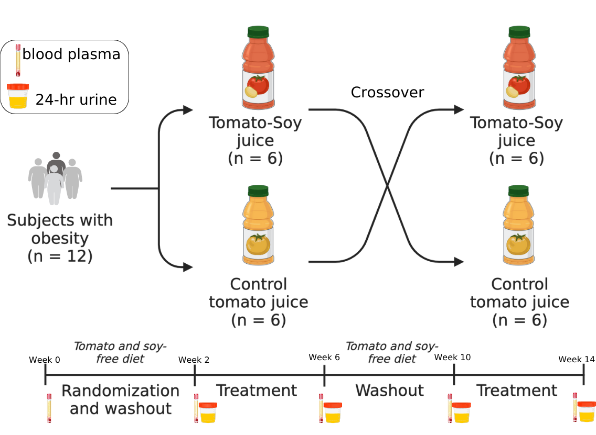

```{r setup, include=FALSE}
knitr::opts_chunk$set(echo = TRUE)
knitr::opts_chunk$set(warning = FALSE, message = FALSE)
```


# Introduction

Statistical analysis of plasma carotenoids, plasma cytokines and immune cells from randomized cross-over USDA inflammation clinical trial. Subjects consumed both low lycopene tomato (yellow) and high lycopene tomato-soy juices (red) for 4 weeks each.


```{r echo=FALSE, out.width="500px", fig.align='center', fig.cap="Crossover clinical trial design supplementing individuals with obesity 360 mL of a low carotenoid tomato juice or a high lycopene tomato-soy juice daily. Daily serving of low carotenoid tomato juice consisted of ~1.5mg lycopene/day while high lycopene tomato-soy juice intervention consisted of 54 mg lycopene/day in addition to 210 mg total soy isoflavones/day."}


```

# Load libraries
```{r, message=FALSE}
library(tidyverse) # data wrangling
library(readxl) # read in excel files
library(janitor) # clean up names in dataset
library(corrr) # finding correlations
library(rstatix) # stats
library(knitr) # aesthetic table viewing
library(purrr) # create functions
library(kableExtra)
library(ggthemes)
library(ggtext)
library(ggpubr)
library(ggcorrplot) # to make corr plots
library(pheatmap)
```

# Read in data

```{r, results='hide'}
# load data
meta_table <- read_excel("CompiledData_Results_Meta.xlsx",
                         sheet = "metadata_corrected_withsequence")

# clean up variable names 
meta_table <- clean_names(meta_table)

str(meta_table)
```


## Wrangle

```{r, results='hide'}
# convert variables that should be factors to factors
meta_table <- meta_table %>%
  mutate(across(.cols = c("patient_id", "period", 
                          "intervention", "intervention_week", 
                          "pre_post", "sex", "sequence"),
                .fns = as.factor))


# some stuff came in as characters but should be numeric
meta_table <- meta_table %>%
  mutate(across(.cols = c("il_2", "il_10", "il_13", "il_4"),
                .fns = as.numeric))

str(meta_table)
```


```{r}
# changing factor levels for pre_post
meta_table$pre_post <- factor(meta_table$pre_post,
                              levels = c("pre", "post"))

levels(meta_table$pre_post)  
```


```{r}
# Calculate total_cis_lyc, total_lyc, and total_carotenoids
meta_table <- meta_table %>%
  rename(n5_cis_lyc = x5_cis_lyc) %>%
  mutate(total_cis_lyc = other_cis_lyc + n5_cis_lyc,
         total_lyc = all_trans_lyc + total_cis_lyc,
         total_carotenoids = lutein + zeaxanthin + b_cryptoxanthin + 
                             a_carotene + b_carotene + total_lyc) 
```


# Carotenoids

## All-trans-lyc levels

```{r}
# line plots for each subject at each timepoint
meta_table %>% 
  ggplot(aes(x = intervention_week, y = all_trans_lyc, color = intervention)) +
  geom_point() + 
  geom_line(aes(group = intervention)) +
  scale_color_manual(values = c("Baseline" = "gray", 
                                           "Yellow" = "gold",
                                           "Red" = "tomato1")) +
  facet_wrap(vars(patient_id), scales = "free_y") + 
  theme_bw() +
  labs(x = "Intervention Week",
       y = "All-trans-lycopene levels (nmol/L)",
       title = "All-trans-lycopene levels in each patient before/after each intervention")
```

## Total cis-lyc levels
```{r}
# line plots for each subject at each timepoint
meta_table %>% 
  ggplot(aes(x = intervention_week, y = total_cis_lyc, color = intervention)) +
  geom_point() + 
  geom_line(aes(group = intervention)) +
  scale_color_manual(values = c("Baseline" = "gray", 
                                           "Yellow" = "gold",
                                           "Red" = "tomato1")) +
  facet_wrap(vars(patient_id)) +
  theme_bw() +
  labs(x = "Intervention Week",
       y = "Total cis-lycopene levels (nmol/L)",
       title = "Total cis-lycopene levels in each patient before/after each intervention")
```

## Total lyc levels

### lineplots 

```{r}
# line plots for each subject at each timepoint
meta_table %>% 
  ggplot(aes(x = intervention_week, y = total_lyc, color = intervention)) +
  geom_point() + 
  geom_line(aes(group = intervention)) +
  scale_color_manual(values = c("Baseline" = "gray", 
                                           "Yellow" = "gold",
                                           "Red" = "tomato1")) +
  facet_wrap(vars(patient_id), scales = "free_y") +
  theme_bw() +
  labs(x = "Intervention Week",
       y = "Total lycopene levels (nmol/L)",
       title = "Total lycopene levels in each patient before/after each intervention")
```

*note* Subject 6112 has increased total lycopene levels after yellow intervention. I'll remove them from statistical analyses.

### Boxplots

#### wrangling

```{r}
# create a more specific pre_post_intervention column
meta_table_edited <- meta_table %>%
  unite(col = "pre_post_intervention",
        c("pre_post","intervention"),
        sep = "_",
        remove = FALSE)

# make pre_post_intervention column factors
meta_table_edited$pre_post_intervention <- as.factor(meta_table_edited$pre_post_intervention)

# relevel factor columns
meta_table_edited$pre_post_intervention <- factor(meta_table_edited$pre_post_intervention, levels = c("pre_Yellow", "post_Yellow", "pre_Red", "post_Red"))

meta_table_edited$intervention <- factor(meta_table_edited$intervention,
                                         levels = c("Baseline","Yellow", "Red"))

```


```{r}
# make legend title
legendtitle_ppintervention <- "Timepoint"


# labels
labs_ppintervention <- c("pre control",
                         "post control",
                         "pre Tomato-Soy",
                         "post Tomato-Soy")
```


#### figure
```{r}
meta_table_edited %>% 
  filter(intervention != "Baseline") %>%
  ggplot(aes(x = intervention, y = total_lyc, fill = pre_post_intervention)) +
  geom_boxplot(outlier.shape = NA) + 
  scale_fill_manual(legendtitle_ppintervention,
                    values = c("pre_Red" = "#FF9966",
                               "post_Red" = "#FF3300",
                               "pre_Yellow" = "#FFFF99",
                               "post_Yellow" = "yellow"),
                    labels = labs_ppintervention) +
  theme_clean() +
  labs(x = "",
       y = "Total lycopene levels (nmol/L)",
       title = "Total lycopene levels before/after juice interventions")
```


```{r, fig.width=12}
# ggpubr to make pub ready plot
(total_lyc_levels <- meta_table_edited %>% 
    filter(intervention != "Baseline") %>%
  ggpaired(x = "pre_post", y = "total_lyc", fill = "intervention", line.color = "gray", line.size = 1, facet.by = "intervention", short.panel.labs = FALSE, panel.labs = list(intervention = c("", "", ""))) +
  scale_fill_manual(values = c("Red" = "tomato1",
                               "Yellow" = "yellow1"),
                    labels = c("Control", "Tomato-Soy"),
                    name = "Intervention") +
  geom_line(aes(group = patient_id), colour = "gray", linewidth = 0.15) +
  theme_clean(base_size = 18, base_family = "sans") +
  labs(x = "",
       y = "nmol/L plasma",
       title = "Concentration of Lycopene",
       subtitle = ""))
```

#### export
```{r, eval=FALSE}
ggsave(filename = "/Users/mariasholola/Documents/GitHub/USDA-Inflammation-Metabolomics/Plots/total-lyc-red-and-yellow-boxplots.svg", plot = total_lyc_levels, width = 12)
```


### Descriptive stats

#### wrangle
```{r}
# convert meta_table_edited to long format for total lycopene
meta_table_lyc_long <- meta_table_edited %>%
  pivot_longer(cols = total_lyc,
               names_to = "total_lycopene",
               values_to = "nmol_per_L")
```


#### Avg/std dev

##### tomsoy
```{r}
meta_table_lyc_long %>%
  filter(intervention == "Red") %>%
  group_by(pre_post) %>%
  summarize(mean = mean(nmol_per_L),
            stdev = sd(nmol_per_L))
```

##### yellow
```{r}
meta_table_lyc_long %>%
  filter(intervention == "Yellow") %>%
  group_by(pre_post) %>%
  summarize(mean = mean(nmol_per_L),
            stdev = sd(nmol_per_L))
```

#### Mean fold changes
```{r}
lyc_subset <- meta_table_lyc_long %>%
  select(patient_id, pre_post_intervention, nmol_per_L) %>%
  pivot_wider(names_from = pre_post_intervention,
              values_from = nmol_per_L) %>%
  mutate(red_FC = post_Red/pre_Red,
         yellow_FC = post_Yellow/pre_Yellow)

lyc_subset %>%
  summarize(mean_red_FC = mean(red_FC),
            mean_yellow_FC = mean(yellow_FC))
```

## Comparison stats

First, I need to remove subject 6112 from the yellow intervention, since their total lycopene levels is the only one increasing post-Yellow

```{r}
subj6112_yellow <- meta_table_lyc_long %>%
  filter(patient_id == 6112) %>%
  filter(intervention == "Yellow")

meta_table_lyc_long_rm_outlier <- anti_join(meta_table_lyc_long, 
                                            subj6112_yellow)
  
```

### Normality checks

Plot histogram
```{r}
gghistogram(meta_table_lyc_long_rm_outlier$nmol_per_L, bins = 40)
```

Shapiro's normality test

```{r}
# shapiro normality test for total lycopene. for pre yellow, post yellow, pre red and post red
meta_table_lyc_long_rm_outlier %>%
  filter(intervention != "Baseline") %>%
  group_by(pre_post_intervention) %>%
  shapiro_test(vars = "nmol_per_L")
```
P > 0.05 for all 4 groups, suggesting data here is normal.

### Paired t-test
```{r}
compare_means(nmol_per_L ~ pre_post, meta_table_lyc_long_rm_outlier, method = "t.test", paired = TRUE, group.by = "intervention")
```

### Boxplot
```{r}
(lyc_bp_stats_noOutlier <- meta_table_lyc_long_rm_outlier %>% 
   filter(intervention != "Baseline") %>%
  ggpaired(x = "pre_post", y = "nmol_per_L", fill = "intervention", 
           line.color = "gray", 
           line.size = 1, 
           facet.by = "intervention", 
           short.panel.labs = FALSE, panel.labs = list(intervention = c("", "", ""))) +
  scale_fill_manual(values = c("Red" = "tomato1",
                               "Yellow" = "yellow1"),
                    labels = c("Control", "Tomato-Soy"),
                    name = "Intervention") +
  geom_line(aes(group = patient_id), colour = "gray", linewidth = 0.15) +
  theme_clean(base_size = 18, base_family = "sans") +
  labs(x = "",
       y = "nmol/L plasma",
       title = "Concentration of Lycopene",
       subtitle = "") +
   stat_compare_means(method = "t.test", paired = TRUE) )
```

Total lycopene levels are significantly increasing only after post-Red intervention

#### export
```{r, eval=FALSE}
ggsave(filename = "Plots/total-lyc-red-yellow-boxplots-stats-noOutlier.svg", plot = lyc_bp_stats_noOutlier, width = 12)
```

# Missing data


```{r}
# calculate how many NAs there are per cytokine in whole data set
containsNAs_cytokines <- meta_table_edited %>%
  filter(intervention != "Baseline") %>%
  pivot_longer(cols = if_ng:il_4,
               names_to = "cytokine",
               values_to = "cyto_conc_pg_ml") %>%
  group_by(cytokine, patient_id) %>%
  count(is.na(cyto_conc_pg_ml)) %>%
  filter(`is.na(cyto_conc_pg_ml)` == TRUE)

kable(containsNAs_cytokines)
```


```{r}
# calculate how many NAs there are per cytokine in whole data set
containsNAs_cells <- meta_table_edited %>%
  filter(intervention != "Baseline") %>%
  pivot_longer(cols = starts_with("x"),
               names_to = "cell_type",
               values_to = "cell_value") %>%
  group_by(cell_type, pre_post_intervention) %>%
  count(is.na(cell_value)) %>%
  filter(`is.na(cell_value)` == TRUE)

kable(containsNAs_cells)
```

```{r}
# impute any missing values by replacing them with 1/2 of the lowest concentration value of a cytokine (i.e. in a row).
imputed_meta_table <- meta_table_edited %>%
  filter(intervention != "Baseline")

imputed_meta_table[,11:25] <- lapply(imputed_meta_table[,11:25], 
                              function(x) ifelse(is.na(x),
                                                 min(x, na.rm = TRUE)/2, x))

dim(imputed_meta_table)
```

# Cytokines

```{r}
# convert cytokines from wide to long
cytokines_long <- imputed_meta_table[-c(26:82)] %>%
  pivot_longer(cols = if_ng:il_4,
               names_to = "cytokine",
               values_to = "cyto_conc_pg_ml")
```


Let's remove subject data points for subject 6112's yellow intervention first (their total lycopene levels increased post-yellow intervention)

```{r}
cytokines_noOutlier_long <- anti_join(cytokines_long,
                                      subj6112_yellow)
```


After testing several mixed linear models, the best model turned out to have pre_post as a fixed variable and patient_id as random effect. Carotenoids added no statistically significant effect to the model, suggesting that carotenoids may not contribute to cytokine levels. We decided to move on with paired mean comparisons for each group. May revisit mixed linear modeling to see if significant metabolites from metabolomics analyses affect immune outcomes (i.e. cytokine concentrations and immune cell populations).

## Normality check

```{r}
cytokines_noOutlier_long %>%
  group_by(cytokine) %>%
  shapiro_test(cyto_conc_pg_ml)
```

Data is not normally distributed, so will use nonparametric paired tests for the mean comparisons.

## Wilcoxon rank-sum tests

### Carryover effects?

First, let's test for sequence effects. We don't expect to have this problem since the participants did a 4-week washout period (no tomato/lycopene or soy isoflavone-containing foods). This should have been sufficient enough for the intervention to not have lingering effects on cytokine levels.


```{r}
(wilcox_cyto_seqeffects <- cytokines_long %>%
   filter(pre_post == "post") %>%
   group_by(cytokine) %>%
   wilcox_test(cyto_conc_pg_ml ~ sequence, paired = TRUE, p.adjust.method = "BH", detailed = TRUE))
```

For every cytokine, sequence does not significantly effect the outcome. Therefore we can continue to assume there are no sequence effects.

### Friedman test

Non-parametric alternative to repeated measures ANOVA

```{r, eval=FALSE}
#not working for me
friedman_test <- cytokines_long %>%
  select(patient_id, pre_post_intervention, cytokine, cyto_conc_pg_ml) %>%
  friedman_test(cyto_conc_pg_ml ~ pre_post_intervention | patient_id)
```


### Yellow trt effects

Comparing pre- to post-yellow (low carotenoid) intervention

```{r}
(wilcox_cyto_yellow <- cytokines_noOutlier_long %>%
  filter(intervention == "Yellow") %>%
  group_by(cytokine) %>%
  wilcox_test(cyto_conc_pg_ml ~ pre_post, paired = TRUE, p.adjust.method = "BH", detailed = TRUE))
```


```{r}
# extract statistically significant cytokines 
(sig_cytokines_yellow <- wilcox_cyto_yellow %>%
  filter(p < 0.05))
```

### Red trt effects

Comparing pre- to post-red (tomato-soy) intervention

```{r}
(wilcox_cyto_red <-  cytokines_noOutlier_long %>%
  filter(intervention == "Red") %>%
  group_by(cytokine) %>%
  wilcox_test(cyto_conc_pg_ml ~ pre_post, paired = TRUE, p.adjust.method = "BH", detailed = TRUE))
```

```{r}
# extract statistically significant cytokines 
(sig_cytokines_red <- wilcox_cyto_red %>%
  filter(wilcox_cyto_red$p < 0.05))
```

* There are 3 cytokines (GM-CSF, IL-12p70, and IL-5) significantly different between pre and post-Red interventions only. Lets investigate. 

#### GM-CSF

##### boxplots
```{r}
cytokines_long %>% 
  filter(cytokine == "gm_csf") %>%
  ggpaired(x = "pre_post", y = "cyto_conc_pg_ml", fill = "intervention", facet.by = "intervention", short.panel.labs = FALSE, panel.labs = list(intervention = c("", "", ""))) +
  scale_fill_manual(values = c("Red" = "tomato1",
                               "Yellow" = "yellow1"),
                    labels = c("Control", "Tomato-Soy"),
                    name = "Intervention") +
  geom_line(aes(group = patient_id), colour = "gray", size = 0.15) +
  theme_clean(base_size = 18, base_family = "sans") +
  labs(x = "",
       y = "pg/mL plasma",
       title = "Concentration of GM-CSF",
       subtitle = "") +
  stat_compare_means(method = "wilcox.test", paired = TRUE, p.adjust.method = "BH")

```


```{r}
cytokines_long %>% 
  filter(cytokine == "gm_csf") %>%
  filter(patient_id != 6102) %>% #6102 has really high levels so let's see what the data looks like without them
  ggpaired(x = "pre_post", y = "cyto_conc_pg_ml", fill = "intervention", facet.by = "intervention", short.panel.labs = FALSE, panel.labs = list(intervention = c("", "", ""))) +
  scale_fill_manual(values = c("Red" = "tomato1",
                               "Yellow" = "yellow1"),
                    labels = c("Control", "Tomato-Soy"),
                    name = "Intervention") +
  geom_line(aes(group = patient_id), colour = "gray", size = 0.15) +
  theme_clean(base_size = 18, base_family = "sans") +
  labs(x = "",
       y = "pg/mL plasma",
       title = "Concentration of GM-CSF",
       subtitle = "")

```

##### lineplots

```{r}
meta_table %>% 
  filter(intervention != "Baseline") %>%
  ggplot(aes(x = pre_post, y = gm_csf, color = intervention)) +
  geom_line(aes(group = intervention)) +
  scale_color_manual(values = c("Yellow" = "gold",
                                "Red" = "tomato1")) +
  facet_wrap(vars(patient_id), scales = "free_y") + 
  theme_classic() +
  labs(x = "",
       y = "GM-CSF conc (pg/mL)",
       title = "GM-CSF levels in each patient pre- and post- red and yellow intervention")
```

#### IL-12p70

##### boxplots
```{r}
cytokines_long %>% 
  filter(cytokine == "il_12p70") %>%
  ggpaired(x = "pre_post", y = "cyto_conc_pg_ml", fill = "intervention", facet.by = "intervention", short.panel.labs = FALSE, panel.labs = list(intervention = c("", "", ""))) +
  scale_fill_manual(values = c("Red" = "tomato1",
                               "Yellow" = "yellow1"),
                    labels = c("Control", "Tomato-Soy"),
                    name = "Intervention") +
  geom_line(aes(group = patient_id), colour = "gray", size = 0.15) +
  theme_clean(base_size = 18, base_family = "sans") +
  labs(x = "",
       y = "pg/mL plasma",
       title = "Concentration of IL-12p70",
       subtitle = "") +
  stat_compare_means(method = "wilcox.test", paired = TRUE, p.adjust.method = "BH")

```


```{r}
cytokines_long %>% 
  filter(cytokine == "il_12p70") %>%
  filter(patient_id != 6102) %>% # take off subject 6102 since their levels are so high
  ggpaired(x = "pre_post", y = "cyto_conc_pg_ml", fill = "intervention", facet.by = "intervention", short.panel.labs = FALSE, panel.labs = list(intervention = c("", "", ""))) +
  scale_fill_manual(values = c("Red" = "tomato1",
                               "Yellow" = "yellow1"),
                    labels = c("Control", "Tomato-Soy"),
                    name = "Intervention") +
  geom_line(aes(group = patient_id), colour = "gray", size = 0.15) +
  theme_clean(base_size = 18, base_family = "sans") +
  labs(x = "",
       y = "pg/mL plasma",
       title = "Concentration of IL-12p70",
       subtitle = "")
```


##### lineplots

```{r}
meta_table %>% 
  filter(intervention != "Baseline") %>%
  ggplot(aes(x = pre_post, y = il_12p70, color = intervention)) +
  geom_line(aes(group = intervention)) +
  scale_color_manual(values = c("Yellow" = "gold",
                                "Red" = "tomato1")) +
  facet_wrap(vars(patient_id), scales = "free_y") + 
  theme_classic() +
  labs(x = "",
       y = "IL-12p70 conc (pg/mL)",
       title = "IL-12p70 levels in each patient pre- and post- red and yellow intervention")
```


#### IL-5

##### boxplots
```{r}
cytokines_long %>% 
  filter(cytokine == "il_5") %>%
  filter(intervention != "Baseline") %>%
  ggpaired(x = "pre_post", y = "cyto_conc_pg_ml", fill = "intervention", facet.by = "intervention", short.panel.labs = FALSE, panel.labs = list(intervention = c("", "", ""))) +
  scale_fill_manual(values = c("Red" = "tomato1",
                               "Yellow" = "yellow1"),
                    labels = c("Control", "Tomato-Soy"),
                    name = "Intervention") +
  geom_line(aes(group = patient_id), colour = "gray", size = 0.15) +
  theme_clean(base_size = 18, base_family = "sans") +
  labs(x = "",
       y = "pg/mL plasma",
       title = "Concentration of IL-5",
       subtitle = "") +
  stat_compare_means(method = "wilcox.test", paired = TRUE, p.adjust.method = "BH")

```


##### lineplots

```{r}
meta_table %>% 
  filter(intervention != "Baseline") %>%
  ggplot(aes(x = pre_post, y = il_5, color = intervention)) +
  geom_line(aes(group = intervention)) +
  scale_color_manual(values = c("Yellow" = "gold",
                                "Red" = "tomato1")) +
  facet_wrap(vars(patient_id), scales = "free_y") + 
  theme_classic() +
  labs(x = "",
       y = "IL-5 conc (pg/mL)",
       title = "IL-5 levels in each patient pre- and post- red and yellow intervention")
```

#### fold change

Let's look at the average fold change for significantly changing cells in yellow. We'll look at the avg fold change comparing pre to post yellow, pre to post Red, and post-intervention comparison.

```{r}

red_sigcytokines_subset <- cytokines_noOutlier_long %>%
  filter(cytokine %in% sig_cytokines_red$cytokine)%>%
  select(patient_id, pre_post_intervention, cytokine, cyto_conc_pg_ml) %>%
  group_by(cytokine) %>%
  pivot_wider(names_from = pre_post_intervention,
              values_from = cyto_conc_pg_ml) %>%
  mutate(yellow_FC = post_Yellow/pre_Yellow,
         red_FC = post_Red/pre_Red,
         post_intervention_FC = post_Red/post_Yellow)

red_sigcytokines_subset %>%
  summarize(mean_yellow_FC = mean(yellow_FC, na.rm = TRUE),
            mean_red_FC = mean(red_FC),
            mean_intervention_FC = mean(post_intervention_FC, na.rm = TRUE))

```

### Intervention comparison
```{r}
(wilcox_cyto_intervention <- cytokines_noOutlier_long %>%
  filter(patient_id != 6112) %>% # remove subject 6112 so the red vs yellow comparison is even
  filter(pre_post == "post") %>%
  group_by(cytokine) %>%
  wilcox_test(cyto_conc_pg_ml ~ pre_post_intervention, paired = TRUE, p.adjust.method = "BH", detailed = TRUE))
```


```{r}
# extract statistically significant cytokines 
(sig_cytokines_intervention <- wilcox_cyto_intervention %>%
  filter(p < 0.05))

```


# Immune Cells

```{r}
# convert immune cell data from wide to long
cells_long <- imputed_meta_table %>%
  pivot_longer(cols = starts_with("x"),
               names_to = "cell_type",
               values_to = "cell_value")
```


Let's remove subject data points for subject 6112's yellow intervention first (their total lycopene levels increased post-yellow intervention)

```{r}
cells_noOutlier_long <- anti_join(cells_long,
                                  subj6112_yellow)
```


After testing several mixed linear models, the best model turned out to have pre_post as a fixed variable and patient_id as random effect. Carotenoids added no statistically significant effect to the model, suggesting that carotenoids are not contributing to cytokine levels. We decided to move on with paired mean comparisons for each group. May revisit mixed linear modeling to see if significant metabolites from metabolomics analyses affect immune outcomes (i.e. cytokine concentrations and immune cell populations).

## Normality check

```{r}
cells_noOutlier_long %>%
  group_by(cell_type) %>%
  shapiro_test(cell_value)
```

Data is not normally distributed for several cell types, so it will be more appropriate use nonparametric paired tests for the mean comparisons.


## Wilcoxon rank-sum tests

### Carryover effects?

First, let's test for sequence effects. We don't expect to have this problem since the participants did a 4-week washout period (no tomato/lycopene or soy isoflavone-containing foods). This should have been sufficient enough for the intervention to not have lingering effects on cell populations.


```{r}
wilcox_cells_seqeffects <- cells_long %>%
   filter(pre_post == "post") %>%
   group_by(cell_type) %>%
   wilcox_test(cell_value ~ sequence, paired = TRUE, p.adjust.method = "BH", detailed = TRUE)

kable(wilcox_cells_seqeffects, format = "markdown", digits = 3)
```


```{r}
# extract statistically significant cytokines 
wilcox_cells_seqeffects %>%
  filter(p < 0.05)
```

Seems to be sequence effects for cell type #19. We will keep this in mind for the rest of the analyses.

### Yellow trt effects

Comparing pre- to post-yellow (low carotenoid) intervention

```{r}
wilcox_cells_yellow <- cells_noOutlier_long %>%
  filter(intervention == "Yellow") %>%
  group_by(cell_type) %>%
  wilcox_test(cell_value ~ pre_post, paired = TRUE, p.adjust.method = "BH", detailed = TRUE)

kable(wilcox_cells_yellow, format = "markdown", digits = 3)
```


```{r}
# extract statistically significant cytokines 
(sig_cells_yellow <- wilcox_cells_yellow %>%
  filter(p < 0.05))
```

#### Sig cells

##### boxplots

```{r, fig.height = 8, fig.width= 12}
(sigcells_yellow_bp <- cells_noOutlier_long %>% 
  filter(cell_type %in% sig_cells_yellow$cell_type) %>%
  filter(intervention == "Yellow") %>%
  ggpaired(x = "pre_post", y = "cell_value", fill = "intervention", facet.by = c("cell_type")) +
  scale_fill_manual(values = c("Yellow" = "yellow1",
                               "Red" = "tomato1"),
                    labels = c("Control"),
                    name = "Intervention") +
  geom_line(aes(group = patient_id), colour = "gray", size = 0.15) +
  theme_clean(base_size = 18, base_family = "sans") +
  labs(x = "",
       y = "Cell percentage",
       title = "Cell populations significantly different between pre- and post-Yellow",
       subtitle = "") +
  stat_compare_means(method = "wilcox.test", paired = TRUE, p.adjust.method = "BH"))

```

Log2 the scale so change is more visible
```{r, fig.height = 8, fig.width= 12}
cells_noOutlier_long %>% 
  filter(cell_type %in% sig_cells_yellow$cell_type) %>%
  filter(intervention == "Yellow") %>%
   mutate(log2_cellvalue = log2(cell_value)) %>%
  ggpaired(x = "pre_post", y = "log2_cellvalue", fill = "intervention", facet.by = c("cell_type")) +
  scale_fill_manual(values = c("Yellow" = "yellow1",
                               "Red" = "tomato1"),
                    labels = c("Control"),
                    name = "Intervention") +
  geom_line(aes(group = patient_id), colour = "gray", size = 0.15) +
  theme_clean(base_size = 18, base_family = "sans") +
  labs(x = "",
       y = "Log2 cell %",
       title = "Cell populations significantly different between pre- and post-Yellow",
       subtitle = "") +
  stat_compare_means(method = "wilcox.test", paired = TRUE, p.adjust.method = "BH")

```

Let's see what things look like in red intervention
```{r, fig.height = 12, fig.width= 12}
cells_noOutlier_long %>% 
  filter(cell_type %in% sig_cells_yellow$cell_type) %>%
  mutate(log2_cellvalue = log2(cell_value)) %>%
  filter(intervention == "Red") %>%
  ggpaired(x = "pre_post", y = "log2_cellvalue", fill = "intervention", facet.by = c("cell_type")) +
  scale_fill_manual(values = c("Yellow" = "yellow1",
                               "Red" = "tomato1"),
                    labels = c("Tomato Soy"),
                    name = "Intervention") +
  geom_line(aes(group = patient_id), colour = "gray", size = 0.15) +
  theme_clean(base_size = 18, base_family = "sans") +
  labs(x = "",
       y = "Log2 cell %",
       title = "Cell populations significantly different between pre- and post-Yellow",
       subtitle = "") +
  stat_compare_means(method = "wilcox.test", paired = TRUE, p.adjust.method = "BH")

```

Cell #26 (Naive B-cell) is significantly increased after both interventions, although post-red has a stronger significance.

##### lineplots
To get a sense of cell population percentages on the individual basis, we'll look at line graphs.

I'm going to make a function for this for this first.

```{r}
# function for line plots
line_plots_cells_fx <- function(immune_cell) {
  cells_long %>% # even though this subject 6112 wasnt included for yellow stats, I'll still include them for the plots
    filter(cell_type == immune_cell) %>%
    ggplot(aes(x = pre_post, y = cell_value, color = intervention)) +
    geom_line(aes(group = intervention)) +
    scale_color_manual(values = c("Yellow" = "gold",
                                "Red" = "tomato1")) +
    facet_wrap(vars(patient_id), scales = "free_y") + 
    theme_classic() +
    labs(x = "",
         y = "Cell population (%)",
         title = paste(immune_cell, "in each patient pre- and post- red and yellow intervention"))
}
```

```{r}
# create list for plots
lineplots_cells <- list()

# run this function on all cell types
for (i in cells_noOutlier_long$cell_type) {
  lineplots_cells[[i]] = line_plots_cells_fx(i)
}

```

```{r}
# signif immune cells pre vs post yellow
sig_cells_yellow$cell_type
```


###### 5- CD4-CD8+ (CD8 T cells)
```{r}
lineplots_cells[sig_cells_yellow$cell_type[1]]
```

###### 8- CD45RO+CD45RA- (EM CD8)
```{r}
lineplots_cells[sig_cells_yellow$cell_type[2]]
```

###### 9- CD45RO-CD45RA+ (TE CD4)
```{r}
lineplots_cells[sig_cells_yellow$cell_type[3]]
```

###### 15- CD45RO-CD45RA+ (TE CD4)

```{r}
lineplots_cells[sig_cells_yellow$cell_type[4]]
```

###### 26- CD27-IgD+ (Naive B cells)
```{r}
lineplots_cells[sig_cells_yellow$cell_type[5]]
```

###### 37- CD56+CD161+CD123- (NK cells)

```{r}
lineplots_cells[sig_cells_yellow$cell_type[6]]
```


#### fold change

Let's look at the average fold change for significantly changing cells in yellow. We'll look at the avg fold change comparing pre to post yellow, pre to post Red, and post-intervention comparison.

```{r}

yellow_sigcells_subset <- cells_noOutlier_long %>%
  filter(cell_type %in% sig_cells_yellow$cell_type)%>%
  select(patient_id, pre_post_intervention, cell_type, cell_value) %>%
  group_by(cell_type) %>%
  pivot_wider(names_from = pre_post_intervention,
              values_from = cell_value) %>%
  mutate(yellow_FC = post_Yellow/pre_Yellow,
         red_FC = post_Red/pre_Red,
         post_intervention_FC = post_Red/post_Yellow)

yellow_sigcells_subset %>%
  summarize(mean_yellow_FC = mean(yellow_FC, na.rm = TRUE),
            mean_red_FC = mean(red_FC),
            mean_intervention_FC = mean(post_intervention_FC, na.rm = TRUE))

# the fold change for cell type #15 was huge for red FC! subject 6108 had a very large increase post-red, so let's see what the fold change is like without that subject
yellow_sigcells_subset %>%
  filter(patient_id != 6108) %>%
  summarize(mean_yellow_FC = mean(yellow_FC, na.rm = TRUE),
            mean_red_FC = mean(red_FC),
            mean_intervention_FC = mean(post_intervention_FC, na.rm = TRUE))

```

### Red trt effects

Comparing pre- to post-yellow (low carotenoid) intervention

```{r}
wilcox_cells_red <- cells_noOutlier_long %>%
  filter(intervention == "Red") %>%
  group_by(cell_type) %>%
  wilcox_test(cell_value ~ pre_post, paired = TRUE, p.adjust.method = "BH", detailed = TRUE)

kable(wilcox_cells_red, format = "markdown", digits = 3)
```


```{r}
# extract statistically significant cytokines 
(sig_cells_red <- wilcox_cells_red %>%
  filter(p < 0.05))
```

#### Sig cells

##### boxplots
```{r, fig.width= 12}
cells_noOutlier_long %>% 
  filter(cell_type %in% sig_cells_red$cell_type) %>%
  filter(intervention == "Red") %>%
  ggpaired(x = "pre_post", y = "cell_value", fill = "intervention", facet.by = "cell_type", short.panel.labs = FALSE, panel.labs = list(cell_type = c("CD45RO+ CD45RA- (EM CD8)","CD19+CD3- (B cells)", "CD27-IgD+ (Naive B cells)"))) +
  scale_fill_manual(values = c("Yellow" = "yellow1",
                               "Red" = "tomato1"),
                    labels = c("Tomato-soy"),
                    name = "Intervention") +
  geom_line(aes(group = patient_id), colour = "gray", size = 0.15) +
  theme_clean(base_size = 18, base_family = "sans") +
  labs(x = "",
       y = "Cell value",
       title = "Cell populations significantly different between pre- and post-Tomato soy",
       subtitle = "") +
  stat_compare_means(method = "wilcox.test", paired = TRUE, p.adjust.method = "BH")

```

Let's see what this looks like pre- and post- control

```{r, fig.width= 12}
cells_noOutlier_long %>% 
  filter(cell_type %in% sig_cells_red$cell_type) %>%
  filter(intervention == "Yellow") %>%
  ggpaired(x = "pre_post", y = "cell_value", fill = "intervention", facet.by = "cell_type", short.panel.labs = FALSE, panel.labs = list(cell_type = c("CD45RO+ CD45RA- (EM CD8)","CD19+CD3- (B cells)", "CD27-IgD+ (Naive B cells)"))) +
  scale_fill_manual(values = c("Yellow" = "yellow1",
                               "Red" = "tomato1"),
                    labels = c("Control"),
                    name = "Intervention") +
  geom_line(aes(group = patient_id), colour = "gray", size = 0.15) +
  theme_clean(base_size = 18, base_family = "sans") +
  labs(x = "",
       y = "Cell value",
       title = "Cell populations significantly different between pre- and post-Tomato soy",
       subtitle = "") +
  stat_compare_means(method = "wilcox.test", paired = TRUE, p.adjust.method = "BH")

```

EM CD8 and Naive B- cells are significantly increased post control as well. Stronger effect in control.

##### lineplots
To get a sense of cell population percentages on the individual basis, we'll look at line graphs.

###### 8- CD45RO+CD45RA- (EM CD8)
```{r}
lineplots_cells[sig_cells_red$cell_type[1]]
```


###### 25- CD19+CD3- (B cells)
```{r}
lineplots_cells[sig_cells_red$cell_type[2]]
```


###### 26- CD27-IgD+ (Naive B cells)
```{r}
lineplots_cells[sig_cells_red$cell_type[3]]
```


#### fold change

Let's look at the average fold change for significantly changing cells in red. We'll look at the avg fold change comparing pre to post yellow, pre to post Red, and post-intervention comparison.

```{r}

red_sigcells_subset <- cells_noOutlier_long %>%
  filter(cell_type %in% sig_cells_red$cell_type)%>%
  select(patient_id, pre_post_intervention, cell_type, cell_value) %>%
  group_by(cell_type) %>%
  pivot_wider(names_from = pre_post_intervention,
              values_from = cell_value) %>%
  mutate(yellow_FC = post_Yellow/pre_Yellow,
         red_FC = post_Red/pre_Red,
         post_intervention_FC = post_Red/post_Yellow)

red_sigcells_subset %>%
  summarize(mean_yellow_FC = mean(yellow_FC, na.rm = TRUE),
            mean_red_FC = mean(red_FC),
            mean_intervention_FC = mean(post_intervention_FC, na.rm = TRUE))

```

### Post-trt comparison

Comparing post-tomato soy to post-control intervention

```{r}
wilcox_cells_intervention <- cells_noOutlier_long %>%
  filter(pre_post == "post",
         patient_id != "6112") %>%
  group_by(cell_type) %>%
  wilcox_test(cell_value ~ intervention, paired = TRUE, p.adjust.method = "BH", detailed = TRUE)

kable(wilcox_cells_intervention, format = "markdown", digits = 3)
```


```{r}
# extract statistically significant cytokines 
(sig_cells_intervention <- wilcox_cells_intervention %>%
  filter(p < 0.05))
```

#### Sig cells

##### boxplots
```{r, fig.width=10}
cells_noOutlier_long %>% 
  filter(cell_type %in% sig_cells_intervention$cell_type) %>%
  filter(pre_post == "post") %>%
  ggpaired(x = "pre_post_intervention", y = "cell_value", fill = "intervention", facet.by = "cell_type") +
  scale_fill_manual(values = c("Yellow" = "yellow1",
                               "Red" = "tomato1"),
                    labels = c("Control", "Tomato-soy"),
                    name = "Intervention") +
  geom_line(aes(group = patient_id), colour = "gray", size = 0.25) +
  theme_clean(base_size = 18, base_family = "sans") +
  labs(x = "",
       y = "Cell value",
       title = "Cell populations significantly different between post-Control and post-Tomato soy juices",
       subtitle = "") +
  stat_compare_means(method = "wilcox.test", paired = TRUE, p.adjust.method = "BH", comparisons = list(c("post_Yellow", "post_Red")), label.y = 40)

```

Let's look at the trends for these cell types during individual interventions
```{r}
cells_noOutlier_long %>% 
  filter(cell_type %in% sig_cells_intervention$cell_type) %>%
  filter(intervention == "Red") %>%
  ggpaired(x = "pre_post", y = "cell_value", fill = "intervention", facet.by = "cell_type", short.panel.labs = FALSE, panel.labs = list(cell_type = c("CD16- NK cells","CD14+ MDSC (Mono)"))) +
  scale_fill_manual(values = c("Yellow" = "yellow1",
                               "Red" = "tomato1"),
                    labels = c("Tomato-soy"),
                    name = "Intervention") +
  geom_line(aes(group = patient_id), colour = "gray", size = 0.25) +
  theme_clean(base_size = 18, base_family = "sans") +
  labs(x = "",
       y = "Cell value",
       title = "Cell populations significantly different between post-Control and post-Tomato soy juices",
       subtitle = "") +
  stat_compare_means(method = "wilcox.test", paired = TRUE, p.adjust.method = "BH")

```


```{r,fig.width= 12}
cells_noOutlier_long %>% 
  filter(cell_type %in% sig_cells_intervention$cell_type) %>%
  filter(intervention == "Yellow") %>%
  ggpaired(x = "pre_post", y = "cell_value", fill = "intervention", facet.by = "cell_type", short.panel.labs = FALSE, panel.labs = list(cell_type = c("CD16- NK cells","CD14+ MDSC (Mono)"))) +
  scale_fill_manual(values = c("Yellow" = "yellow1",
                               "Red" = "tomato1"),
                    labels = c("Control"),
                    name = "Intervention") +
  geom_line(aes(group = patient_id), colour = "gray", size = 0.25) +
  theme_clean(base_size = 18, base_family = "sans") +
  labs(x = "",
       y = "Cell value",
       title = "Cell populations significantly different between post-Control and post-Tomato soy juices",
       subtitle = "") +
  stat_compare_means(method = "wilcox.test", paired = TRUE, p.adjust.method = "BH")

```

##### lineplots
To get a sense of cell population percentages on the individual basis, we'll look at line graphs.

###### 38- CD16- NK cells


```{r}
lineplots_cells[sig_cells_intervention$cell_type[1]]
```

Looking at post control v post tomato soy

```{r}
imputed_meta_table %>% 
  filter(pre_post == "post") %>%
  ggplot(aes(x = pre_post_intervention, y = x38_cd16_nk_cells, color = patient_id)) +
  geom_line(aes(group = patient_id)) +
  theme_bw() +
  labs(x = "Timepoint",
       y = "Population level (%)",
       title = "CD16- NK Cell populations in each patient between post- interventions")
```


###### 40- CD14+ MDSC (Mono)
```{r}
lineplots_cells[sig_cells_intervention$cell_type[2]]
```


Let's look at post control vs post tomato soy
```{r}
imputed_meta_table %>% 
  filter(pre_post == "post") %>%
  ggplot(aes(x = pre_post_intervention, y = x40_cd14_mdsc_mono, color = patient_id)) +
  geom_line(aes(group = patient_id)) +
  theme_bw() +
  labs(x = "Timepoint",
       y = "Population level (%)",
       title = "CD14+ monocytic MDSC populations in each patient between post- interventions")
```


#### fold change

Let's look at the average fold change for significantly changing cells in red. We'll look at the avg fold change comparing pre to post yellow, pre to post Red, and post-intervention comparison.

```{r}

intervention_sigcells_subset <- cells_noOutlier_long %>%
  filter(cell_type %in% sig_cells_intervention$cell_type)%>%
  select(patient_id, pre_post_intervention, cell_type, cell_value) %>%
  group_by(cell_type) %>%
  pivot_wider(names_from = pre_post_intervention,
              values_from = cell_value) %>%
  mutate(yellow_FC = post_Yellow/pre_Yellow,
         red_FC = post_Red/pre_Red,
         post_intervention_FC = post_Red/post_Yellow)

intervention_sigcells_subset %>%
  summarize(mean_yellow_FC = mean(yellow_FC, na.rm = TRUE),
            mean_red_FC = mean(red_FC),
            mean_intervention_FC = mean(post_intervention_FC, na.rm = TRUE))

```

Very large fold change of approx 44 units higher post-Red vs. post-Yellow for MDSC cell type. 


# Correlation analyses

Let's look at the correlation between significant immuno outcomes (from each comparison) and carotenoids. I also plan to correlate these with urinary soy isoflavones and their metabolites, along with other significant urinary metabolites. I will perform a log2 fold change transformation for pre-post comparison and intervention comparisons.

## Yellow
Pre vs post yellow

wrangling
```{r}
# create df with pre-interventions data
meta_table_pre_subset <- imputed_meta_table %>%
  filter(pre_post == "pre") %>%
  mutate_at(11:ncol(.), log2)

# create df with post-interventions data
meta_table_post_subset <- imputed_meta_table %>%
  filter(pre_post == "post") %>%
  mutate_at(11:ncol(.), log2)

# subtract pre df from post df
meta_table_post_pre_differences <- meta_table_post_subset[,11:ncol(imputed_meta_table)] - meta_table_pre_subset[,11:ncol(imputed_meta_table)]

# add metadata back in and organize so that metadata is at beginning of df
meta_table_post_pre_differences <- meta_table_post_pre_differences %>%
  mutate(patient_id = meta_table_post_subset$patient_id,
         intervention = meta_table_post_subset$intervention,
         age_at_enrollment = meta_table_post_subset$age_at_enrollment,
         sex = meta_table_post_subset$sex,
         bmi_at_enrollment = meta_table_post_subset$bmi_at_enrollment) %>%
  relocate(patient_id, intervention, sex, age_at_enrollment, bmi_at_enrollment)
```


Corr table 

```{r}
correlation_yellow <- meta_table_post_pre_differences %>%
  filter(intervention == "Yellow") %>%
  filter(patient_id != 6112) %>% # remove this subj since they were an outlier in control juice for total lyc
  select(total_lyc, all_of(sig_cells_yellow$cell_type), all_of(sig_cytokines_yellow$cytokine)) %>%
  correlate(method = "spearman")

kable(correlation_yellow, format = "markdown", digits = 3)
```


```{r}
correlation_yellow %>%
  rearrange(absolute = FALSE) %>%
  shave() %>%
  rplot(shape = 19,
        colors = c("red", "green"),
        print_cor = TRUE) +
  theme(axis.text.x = element_text(angle = 90))
```


## Red

```{r}
correlation_red <- meta_table_post_pre_differences %>%
  filter(intervention == "Red") %>%
  select(total_lyc, all_of(sig_cells_red$cell_type), all_of(sig_cytokines_red$cytokine)) %>%
  correlate(method = "spearman")

kable(correlation_red, format = "markdown", digits = 3)
```

```{r}
correlation_red %>%
  rearrange(absolute = FALSE) %>%
  shave() %>%
  rplot(shape = 19,
        colors = c("red", "green"),
        print_cor = TRUE) +
  theme(axis.text.x = element_text(angle = 90))
```

## Intervention comparison

wrangling
```{r}
# create df with pre-interventions data
meta_table_postY_subset <- imputed_meta_table %>%
  filter(pre_post_intervention == "post_Yellow") %>%
  mutate_at(11:ncol(.), log2)

# create df with post-interventions data
meta_table_postR_subset <- imputed_meta_table %>%
  filter(pre_post_intervention == "post_Red") %>%
  mutate_at(11:ncol(.), log2)

# subtract pre df from post df
meta_table_intervention_differences <- meta_table_postR_subset[,11:ncol(imputed_meta_table)] - meta_table_postY_subset[,11:ncol(imputed_meta_table)]

# add metadata back in and organize so that metadata is at beginning of df
meta_table_intervention_differences <- meta_table_intervention_differences %>%
  mutate(patient_id = meta_table_postR_subset$patient_id,
         intervention = meta_table_postR_subset$intervention,
         age_at_enrollment = meta_table_postR_subset$age_at_enrollment,
         sex = meta_table_postR_subset$sex,
         bmi_at_enrollment = meta_table_postR_subset$bmi_at_enrollment) %>%
  relocate(patient_id, intervention, sex, age_at_enrollment, bmi_at_enrollment)
```


```{r}
correlation_intervention <- meta_table_intervention_differences %>%
  filter(intervention == "Red") %>%
  select(total_lyc, all_of(sig_cells_intervention$cell_type), all_of(sig_cytokines_intervention$cytokine)) %>%
  correlate(method = "spearman")

kable(correlation_intervention, format = "markdown", digits = 3)
```

```{r}
correlation_intervention %>%
  rearrange(absolute = FALSE) %>%
  shave() %>%
  rplot(shape = 19,
        colors = c("red", "green"),
        print_cor = TRUE)
```


## Overall corr
Let's take all of the significant outcomes and even add all of the metadata

### pre v post difference

```{r}
correlation_all_pre_post_sig <- meta_table_post_pre_differences %>%
  select(2:5, total_lyc, total_carotenoids, a_carotene, b_carotene, lutein, zeaxanthin, b_cryptoxanthin, all_of(sig_cells_red$cell_type), all_of(sig_cytokines_red$cytokine), all_of(sig_cells_yellow$cell_type), all_of(sig_cytokines_yellow$cytokine), all_of(sig_cells_intervention$cell_type), all_of(sig_cytokines_intervention$cytokine)) %>%
  correlate(method = "spearman")

kable(correlation_all_pre_post_sig, format = "markdown", digits = 3)
```

```{r, fig.width=10, fig.height=10}
correlation_all_pre_post_sig %>%
  rearrange(absolute = FALSE) %>%
  shave() %>%
  rplot(shape = 19, 
        print_cor = TRUE,
        colors = c("red", "green")) +
  theme(axis.text.x = element_text(angle = 90))
```

### post red vs post yellow difference
```{r}
correlation_all_intervention_sig <- meta_table_intervention_differences %>%
  select(2:5, total_lyc, total_carotenoids, a_carotene, b_carotene, lutein, zeaxanthin, b_cryptoxanthin, all_of(sig_cells_red$cell_type), all_of(sig_cytokines_red$cytokine), all_of(sig_cells_yellow$cell_type), all_of(sig_cytokines_yellow$cytokine), all_of(sig_cells_intervention$cell_type), all_of(sig_cytokines_intervention$cytokine)) %>%
  correlate(method = "spearman")

kable(correlation_all_intervention_sig, format = "markdown", digits = 3)
```

```{r, fig.width=10, fig.height=10}
correlation_all_intervention_sig %>%
  rearrange(absolute = FALSE) %>%
  shave() %>%
  rplot(shape = 19, 
        print_cor = TRUE,
        colors = c("red", "green")) +
  theme(axis.text.x = element_text(angle = 90))
```

# Heatmap

## Significant cytokines

### Z-score transformed

Here, I am using my raw data and allowing the pheatmap package to perform z-scaling.

Z-scoring standardizes the data by this calculation: (individual value within outcome - mean of outcome) / (std dev). The pheatmap package does this automatically with the call scale = "row" or "column"
```{r, fig.height=18, fig.width=9, fig.asp=1}

cytokine_heatmap_data <- imputed_meta_table %>%
  unite("subject_pre_post_intervention", patient_id, pre_post_intervention, sep = "_", remove = FALSE) %>%
  dplyr::select(patient_id, subject_pre_post_intervention, pre_post, all_of(sig_cytokines_red$cytokine), all_of(sig_cytokines_yellow$cytokine), all_of(sig_cytokines_intervention$cytokine))


cytokine_heatmap <- 
  pheatmap(cytokine_heatmap_data[,-c(1:3)],
           scale = "column", # z-scaling
           cluster_rows = TRUE,
           cutree_rows = 6,
           clustering_distance_rows = "euclidean",
           clustering_distance_cols = "euclidean",
           clustering_method = "ward.D2",
           labels_row = cytokine_heatmap_data$subject_pre_post_intervention,
           color = colorRampPalette(c("#67a9cf", "#f7f7f7", "#ef8a62"))(16),
           main = "Heatmap of significant immuno outcomes across timepoints \nby paired T-tests \nBenjamoni-Hochberg corrected p-values > 0.05 \nC18 (-)")
  
```

## All cytokines

### Z-score transformed


```{r, fig.height=18, fig.width=9, fig.asp=1}

cytokines_all_heatmap_data <- imputed_meta_table %>%
  unite("subject_pre_post_intervention", patient_id, pre_post_intervention, sep = "_", remove = FALSE) %>%
  dplyr::select(patient_id, subject_pre_post_intervention, pre_post, all_of(cytokines_long$cytokine))


cytokines_all_heatmap <- 
  pheatmap(cytokines_all_heatmap_data[,-c(1:3)],
           scale = "column", # z-scaling
           cluster_rows = TRUE,
           cutree_rows = 4,
           clustering_distance_rows = "euclidean",
           clustering_distance_cols = "euclidean",
           clustering_method = "ward.D",
           labels_row = cytokines_all_heatmap_data$subject_pre_post_intervention,
           color = colorRampPalette(c("#67a9cf", "#f7f7f7", "#ef8a62"))(16),
           main = "Heatmap of all cytokines from multiplex assay")
  
```

### Normalized to controls

I want to try a different technique here to see if we can capture variation by bringing the values to a visually meaningful range by normalizing values against "controls". Each subject serves as their own control pre-intervention (and also when they are on the low carotenoid/soy intervention (Yellow)). These dfs will be different from the log2 fold change dfs calculated for correlation plots. In this case, we will take every treatment and divide it by its control (so control should be end up being 0)


```{r}
# make a string of metadata and of immuno outcomes for ease
str_meta <- colnames(imputed_meta_table[,1:10])
str_immuno <- colnames(imputed_meta_table[,11:82])

# Extract pre-intervention data and set immuno outcome columns to 0
pre_data_zeros <- imputed_meta_table %>%
  filter(pre_post == "pre") %>%
  mutate(across(all_of(str_immuno), ~ 0))

# Combine pre-intervention zeros with log fold change table
normalized_to_pre <- meta_table_post_pre_differences %>%
  mutate(pre_post = "normalized_POST") %>%
  bind_rows(pre_data_zeros %>%
              select(str_meta[c(1:4, 6)], all_of(str_immuno)) %>%
              mutate(pre_post = "normalized_PRE")) %>%
  unite("pre_post_intervention", pre_post, intervention, sep = "_", remove = FALSE)
```


```{r, fig.height=10, fig.width=10, fig.asp=0.5}
cytokines_normlog2FC_heatmap_data <- normalized_to_pre %>%
  unite("subj_pre_post_intervention", patient_id, pre_post_intervention, sep = "_", remove = FALSE) %>% 
  filter(pre_post == "normalized_POST") %>%
  dplyr::select(subj_pre_post_intervention, all_of(cytokines_long$cytokine))


cytokines_normtopre_heatmap <- 
  pheatmap(cytokines_normlog2FC_heatmap_data[,-1],
           cluster_rows = TRUE,
           cutree_rows = 2,
           clustering_distance_rows = "euclidean",
           clustering_distance_cols = "euclidean",
           clustering_method = "ward.D",
           labels_row = cytokines_normlog2FC_heatmap_data$subj_pre_post_intervention,
           color = colorRampPalette(c("#67a9cf", "#f7f7f7", "#ef8a62"))(16),
           main = "Heatmap of all cytokines from multiplex assay")
  
```


```{r, fig.height=18, fig.width=10, fig.asp=0.8}
cytokines2_normlog2FC_heatmap_data <- normalized_to_pre %>%
  unite("subj_pre_post_intervention", patient_id, pre_post_intervention, sep = "_", remove = FALSE) %>% 
  dplyr::select(subj_pre_post_intervention, all_of(cytokines_long$cytokine))


cytokines2_normtopre_heatmap <- 
  pheatmap(cytokines2_normlog2FC_heatmap_data[,-1],
           cluster_rows = TRUE,
           cutree_rows = 2,
           clustering_distance_rows = "euclidean",
           clustering_distance_cols = "euclidean",
           clustering_method = "ward.D",
           labels_row = cytokines2_normlog2FC_heatmap_data$subj_pre_post_intervention,
           color = colorRampPalette(c("#67a9cf", "#f7f7f7", "#ef8a62"))(16),
           main = "Heatmap of all cytokines from multiplex assay")
  
```

#### Yellow

```{r}

yellow_norm_to_pre <- normalized_to_pre %>%
  filter(intervention == "Yellow")
```


```{r, fig.height=18, fig.width=9, fig.asp=1}
cytokines_normlog2FC_yellow_heatmap_data <- yellow_norm_to_pre %>%
  unite("subject_pre_post", patient_id, pre_post, sep = "_", remove = FALSE) %>%
  dplyr::select(subject_pre_post, all_of(cytokines_long$cytokine))


cytokines_yellow_heatmap <- 
  pheatmap(cytokines_normlog2FC_yellow_heatmap_data[,-1],
           cluster_rows = TRUE,
           cutree_rows = 2,
           clustering_distance_rows = "euclidean",
           clustering_distance_cols = "euclidean",
           clustering_method = "ward.D",
           labels_row = cytokines_normlog2FC_yellow_heatmap_data$subject_pre_post,
           color = colorRampPalette(c("#67a9cf", "#f7f7f7", "#ef8a62"))(16),
           main = "Heatmap of all cytokines from multiplex assay")
  
```


#### Red

```{r}
red_norm_to_pre <- normalized_to_pre %>%
  filter(intervention == "Red")
```


```{r, fig.height=18, fig.width=9, fig.asp=1}
cytokines_normlog2FC_red_heatmap_data <- red_norm_to_pre %>%
  unite("subject_pre_post", patient_id, pre_post, sep = "_", remove = FALSE) %>%
  dplyr::select(subject_pre_post, all_of(cytokines_long$cytokine))


cytokines_red_heatmap <- 
  pheatmap(cytokines_normlog2FC_red_heatmap_data[,-1],
           cluster_rows = TRUE,
           cutree_rows = 3,
           clustering_distance_rows = "euclidean",
           clustering_distance_cols = "euclidean",
           clustering_method = "ward.D",
           labels_row = cytokines_normlog2FC_red_heatmap_data$subject_pre_post,
           color = colorRampPalette(c("#67a9cf", "#f7f7f7", "#ef8a62"))(16),
           main = "Heatmap of all cytokines from multiplex assay")
  
```

## Significant cells
```{r, fig.height=18, fig.width=9, fig.asp=1}
cell_heatmap_data <- imputed_meta_table %>%
  unite("subject_pre_post_intervention", patient_id, pre_post_intervention, sep = "_", remove = FALSE) %>%
  dplyr::select(patient_id, subject_pre_post_intervention, pre_post, all_of(sig_cells_red$cell_type), all_of(sig_cells_yellow$cell_type), all_of(sig_cells_intervention$cell_type))


cell_heatmap <- 
  pheatmap(cell_heatmap_data[,-c(1:3)],
           scale = "column",
           cluster_rows = TRUE,
           cutree_rows = 6,
           clustering_distance_rows = "euclidean",
           clustering_distance_cols = "euclidean",
           clustering_method = "ward.D2",
           labels_row = cell_heatmap_data$subject_pre_post_intervention,
           color = colorRampPalette(c("#67a9cf", "#f7f7f7", "#ef8a62"))(16),
           main = "Heatmap of significant immuno outcomes across timepoints \nby paired T-tests \nBenjamoni-Hochberg corrected p-values > 0.05 \nC18 (-)")
```


# Summary

* There are no sequence effects for any of the outcomes 

* Carotenoids
  * Total lycopene levels increase significantly only after tomato-soy intervention.

* Cytokines
  * No effects of carotenoids on cytokine levels (from mixed linear modeling analysis)
    * Once isoflavones and other phytochemicals are quantified, they will be investigated and it will be interesting to test interactions between the phytochemicals in mixed models.
  * IL-5, GM-CSF, and IL-12p70 has a significant reduction in levels only after red (tomato-soy) intervention
  * There are no significantly different cytokines when comparing plasma levels between post interventions.

* Immune cell types
  * An NK cell type and MDSC monocytes significantly change (The NK cell type sig decreases, while MDSC monocytes increase) when comparing post-Yellow intervention to post-Red. 
  * 8 immune cell types significantly increase after yellow intervention.
  * 3 immune cell types (including Naive B cells) significantly increase after red intervention.
  * Cell type #8 (EM CD8) significantly increased after consuming both juices.
