USDA inflammation - summary stats for carotenoids, cytokines, and immune
cells
================
Maria Sholola
March 2022 and so on

# Introduction

Statistical analysis of plasma carotenoids, plasma cytokines and immune
cells from randomized cross-over USDA inflammation clinical trial.
Subjects consumed both low lycopene tomato (yellow) and high lycopene
tomato-soy juices (red) for 4 weeks each.

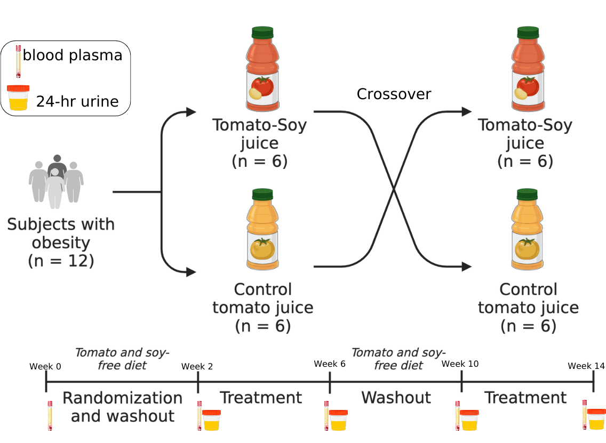

# Load libraries

``` r
library(tidyverse) # data wrangling
library(readxl) # read in excel files
library(janitor) # clean up names in dataset
library(corrr) # finding correlations
library(rstatix) # stats
library(lme4) # mixed linear modeling
library(knitr) # aesthetic table viewing
library(lmerTest) # add pvalue column to lmer models
library(purrr) # create functions
library(broom.mixed) # generate tidy data frames for lmer results
library(MuMIn) # lmer model testing using AICc
library(kableExtra)
library(ggthemes)
library(ggtext)
```

# Read in data

``` r
# load data
meta_table <- read_excel("CompiledData_Results_Meta.xlsx",
                         sheet = "metadata_corrected_withsequence")

# clean up variable names 
meta_table <- clean_names(meta_table)
```

## Wrangle

``` r
# convert variables that should be factors to factors
meta_table <- meta_table %>%
  mutate(across(.cols = c("patient_id", "period", 
                          "intervention", "intervention_week", 
                          "pre_post", "sex", "sequence"),
                .fns = as.factor))


# some stuff came in as characters but should be numeric
meta_table <- meta_table %>%
  mutate(across(.cols = c("il_2", "il_10", "il_13", "il_4"),
                .fns = as.numeric))


# changing factor levels for pre_post
meta_table$pre_post <- factor(meta_table$pre_post,
                              levels = c("pre", "post"))

levels(meta_table$pre_post)        
```

    ## [1] "pre"  "post"

``` r
# Calculate total_cis_lyc, total_lyc, and total_carotenoids
meta_table <- meta_table %>%
  rename(n5_cis_lyc = x5_cis_lyc) %>%
  mutate(total_cis_lyc = other_cis_lyc + n5_cis_lyc,
         total_lyc = all_trans_lyc + total_cis_lyc,
         total_carotenoids = lutein + zeaxanthin + b_cryptoxanthin + 
                             a_carotene + b_carotene + total_lyc) 
```

# Carotenoids

## All-trans-lyc levels

``` r
# line plots for each subject at each timepoint
meta_table %>% 
  ggplot(aes(x = intervention_week, y = all_trans_lyc, color = intervention)) +
  geom_point() + 
  geom_line(aes(group = intervention)) +
  scale_color_manual(values = c("Baseline" = "gray", 
                                           "Yellow" = "gold",
                                           "Red" = "tomato1")) +
  facet_wrap(vars(patient_id), scales = "free_y") + 
  theme_bw() +
  labs(x = "Intervention Week",
       y = "All-trans-lycopene levels (nmol/L)",
       title = "All-trans-lycopene levels in each patient before/after each intervention")
```

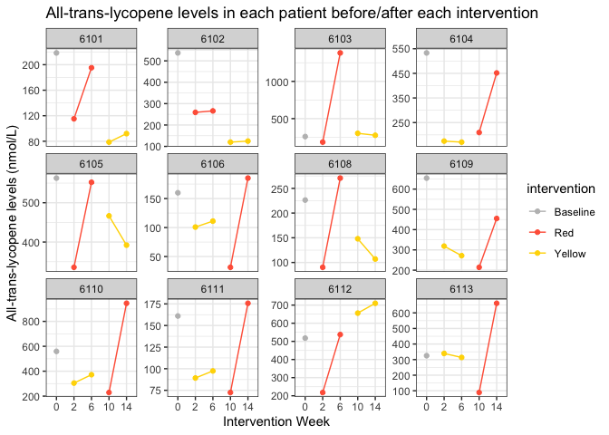<!-- -->

## Total cis-lyc levels

``` r
# line plots for each subject at each timepoint
meta_table %>% 
  ggplot(aes(x = intervention_week, y = total_cis_lyc, color = intervention)) +
  geom_point() + 
  geom_line(aes(group = intervention)) +
  scale_color_manual(values = c("Baseline" = "gray", 
                                           "Yellow" = "gold",
                                           "Red" = "tomato1")) +
  facet_wrap(vars(patient_id)) +
  theme_bw() +
  labs(x = "Intervention Week",
       y = "Total cis-lycopene levels (nmol/L)",
       title = "Total cis-lycopene levels in each patient before/after each intervention")
```

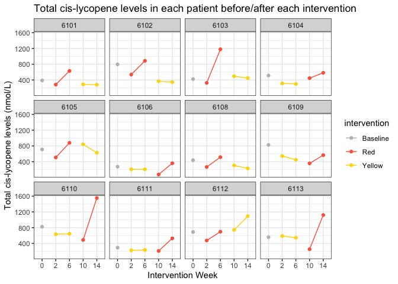<!-- -->

## Total lyc levels

``` r
# line plots for each subject at each timepoint
meta_table %>% 
  ggplot(aes(x = intervention_week, y = total_lyc, color = intervention)) +
  geom_point() + 
  geom_line(aes(group = intervention)) +
  scale_color_manual(values = c("Baseline" = "gray", 
                                           "Yellow" = "gold",
                                           "Red" = "tomato1")) +
  facet_wrap(vars(patient_id), scales = "free_y") +
  theme_bw() +
  labs(x = "Intervention Week",
       y = "Total lycopene levels (nmol/L)",
       title = "Total lycopene levels in each patient before/after each intervention")
```

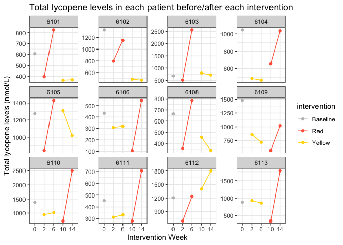<!-- -->

### Aggregate data

Data wrangling

``` r
# create a more specific pre_post_intervention column
meta_table_edited <- meta_table %>%
  unite(col = "pre_post_intervention",
        c("pre_post","intervention"),
        sep = "_",
        remove = FALSE)

# make legend title
legendtitle_ppintervention <- "Timepoint"

# make pre_post_intervention column factors
meta_table_edited$pre_post_intervention <- as.factor(meta_table_edited$pre_post_intervention)

# relevel factor columns
meta_table_edited$pre_post_intervention <- factor(meta_table_edited$pre_post_intervention, levels = c("pre_Yellow", "post_Yellow", "pre_Red", "post_Red"))

meta_table_edited$intervention <- factor(meta_table_edited$intervention,
                                         levels = c("Yellow", "Red"))

labs_ppintervention <- c("before\ncontrol",
                         "after\ncontrol",
                         "before\nTomato-Soy",
                         "after\nTomato-Soy")
```

#### boxplots

``` r
meta_table_edited %>% 
  filter(intervention != "Baseline") %>%
  ggplot(aes(x = intervention, y = total_lyc, fill = pre_post_intervention)) +
  geom_boxplot(outlier.shape = NA) + 
  scale_fill_manual(legendtitle_ppintervention,
                    values = c("pre_Red" = "#FF9966",
                               "post_Red" = "#FF3300",
                               "pre_Yellow" = "#FFFF99",
                               "post_Yellow" = "yellow"),
                    labels = labs_ppintervention) +
  theme_clean() +
  labs(x = "",
       y = "Total lycopene levels (nmol/L)",
       title = "Total lycopene levels before/after juice interventions")
```

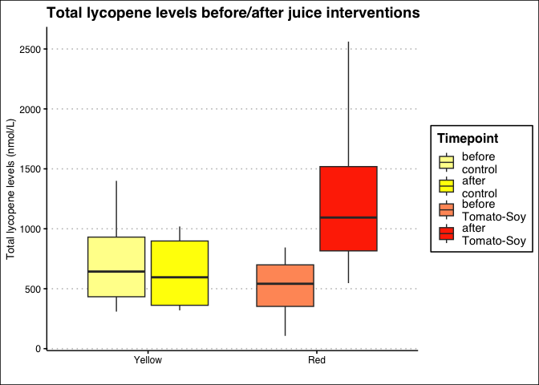<!-- -->

``` r
meta_table_edited %>% 
  filter(intervention != "Baseline") %>%
  ggplot(aes(x = pre_post_intervention, y = total_lyc, fill = intervention)) +
  geom_boxplot(outlier.shape = NA, show.legend = FALSE) + 
  scale_fill_manual(values = c("Red" = "tomato1",
                               "Yellow" = "yellow1")) +
  scale_x_discrete(labels = labs_ppintervention) +
  theme_clean(base_size = 22, base_family = "sans") +
  labs(x = "",
       y = "Overall plasma lycopene conc. (nmol/L)",
       title = "Total plasma lycopene levels",
       subtitle = "Before and after juice interventions")
```

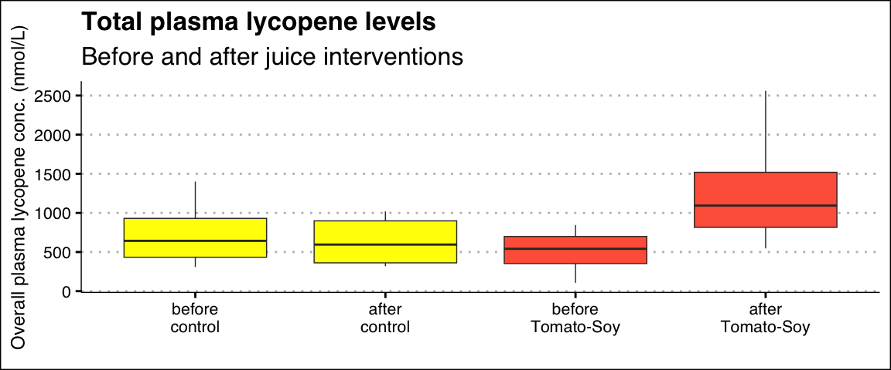<!-- -->

``` r
library(ggpubr)

(total_lyc_levels <- meta_table_edited %>% 
    filter(intervention != "Baseline") %>%
  ggpaired(x = "pre_post", y = "total_lyc", fill = "intervention", line.color = "gray", line.size = 1, facet.by = "intervention", short.panel.labs = FALSE, panel.labs = list(intervention = c("", ""))) +
  scale_fill_manual(values = c("Red" = "tomato1",
                               "Yellow" = "yellow1"),
                    labels = c("Control", "Tomato-Soy"),
                    name = "Intervention") +
  geom_line(aes(group = patient_id), colour = "gray", linewidth = 0.15) +
  theme_clean(base_size = 18, base_family = "sans") +
  labs(x = "",
       y = "nmol/L plasma",
       title = "Concentration of Lycopene",
       subtitle = ""))
```

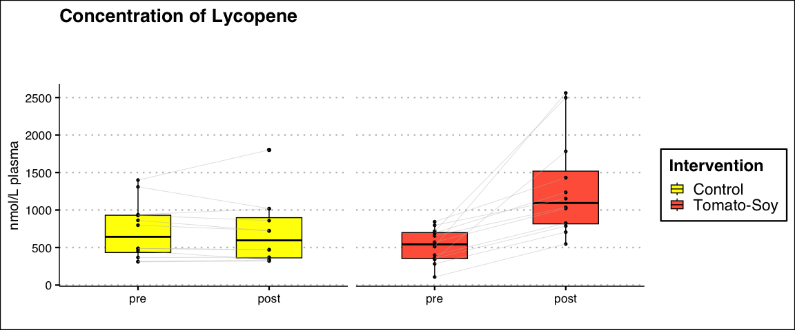<!-- -->
\#### export

``` r
ggsave(filename = "/Users/mariasholola/Documents/GitHub/USDA-Inflammation-Metabolomics/Plots/total-lyc-red-and-yellow-boxplots.svg", plot = total_lyc_levels, width = 12)
```

### Descriptive stats

Convert df to tidy for lycopene

``` r
# convert meta_table_edited to long format for lycopene
meta_table_lyc_long <- meta_table_edited %>%
  pivot_longer(cols = total_lyc,
               names_to = "total_lycopene",
               values_to = "nmol_per_L")
```

Tomato soy average and stdev

``` r
meta_table_lyc_long %>%
  filter(intervention == "Red") %>%
  group_by(pre_post) %>%
  summarize(mean = mean(nmol_per_L),
            stdev = sd(nmol_per_L))
```

    ## # A tibble: 2 × 3
    ##   pre_post  mean stdev
    ##   <fct>    <dbl> <dbl>
    ## 1 pre       523.  228.
    ## 2 post     1298.  665.

Low carotenoid average and stdev

``` r
meta_table_lyc_long %>%
  filter(intervention == "Yellow") %>%
  group_by(pre_post) %>%
  summarize(mean = mean(nmol_per_L),
            stdev = sd(nmol_per_L))
```

    ## # A tibble: 2 × 3
    ##   pre_post  mean stdev
    ##   <fct>    <dbl> <dbl>
    ## 1 pre       721.  377.
    ## 2 post      703.  434.

Fold increase subject-wise on each intervention

``` r
lyc_long_subset <- meta_table_lyc_long %>%
  select(patient_id, intervention, pre_post, nmol_per_L) %>%
  unite("intervention_pre_post", intervention:pre_post) %>%
  pivot_wider(names_from = intervention_pre_post,
              values_from = nmol_per_L) %>%
  mutate(red_FC = Red_post/Red_pre,
         yellow_FC = Yellow_post/Yellow_pre)

lyc_long_subset %>%
  summarize(mean_red_FC = mean(red_FC),
            mean_yellow_FC = mean(yellow_FC))
```

    ## # A tibble: 1 × 2
    ##   mean_red_FC mean_yellow_FC
    ##         <dbl>          <dbl>
    ## 1        2.83          0.966

#### Normality checks

Plot histogram

``` r
gghistogram(meta_table_lyc_long$nmol_per_L, bins = 40)
```

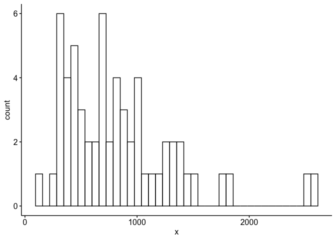<!-- -->

Shapiro’s normality test

``` r
# shapiro normality test for total lycopene 
meta_table_lyc_long %>%
  group_by(total_lycopene) %>%
  shapiro_test(vars = "nmol_per_L")
```

    ## # A tibble: 1 × 4
    ##   total_lycopene variable   statistic         p
    ##   <chr>          <chr>          <dbl>     <dbl>
    ## 1 total_lyc      nmol_per_L     0.886 0.0000410

P val for shapiro test turned out to \< 0.05, meaning data here is not
normal. I will run the non-parametric alternative to paired t-tests,
Wilcoxon’s test.

#### Compare means

``` r
# wilcoxon's rank-sum test
compare_means(nmol_per_L ~ pre_post, meta_table_lyc_long, method = "wilcox.test", paired = TRUE, group.by = "intervention")
```

    ## # A tibble: 2 × 9
    ##   intervention .y.        group1 group2        p  p.adj p.format p.signif method
    ##   <fct>        <chr>      <chr>  <chr>     <dbl>  <dbl> <chr>    <chr>    <chr> 
    ## 1 Red          nmol_per_L pre    post   0.000488 9.8e-4 0.00049  ***      Wilco…
    ## 2 Yellow       nmol_per_L pre    post   0.424    4.2e-1 0.42383  ns       Wilco…

## Total carotenoid levels

``` r
meta_table_edited %>% 
  ggplot(aes(x = intervention_week, y = total_carotenoids, color = intervention)) +
  geom_point() + 
  geom_line(aes(group = intervention)) +
  scale_color_manual(values = c("Baseline" = "gray", 
                                           "Yellow" = "gold",
                                           "Red" = "tomato1")) +
  facet_wrap(vars(patient_id)) +
  theme_bw() +
  labs(x = "Intervention Week",
       y = "Total carotenoid levels (nmol/L)",
       title = "Total carotenoid levels in each patient before/after each intervention")
```

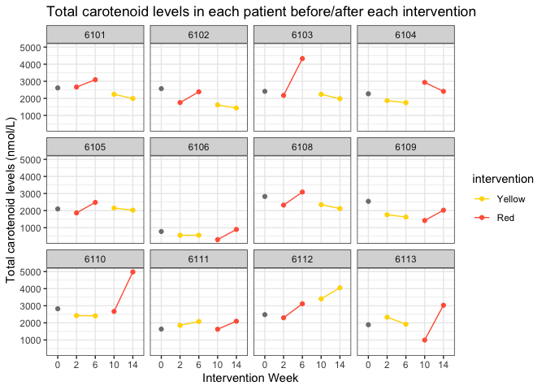<!-- -->

**Patient 6112 carotenoid levels go up after control intervention.**

# Cytokines

Wrangle

``` r
# convert cytokines from wide to long
meta_cytokines_long <- meta_table_edited %>%
  pivot_longer(cols = if_ng:il_4,
               names_to = "cytokines",
               values_to = "cyto_conc_pg_ml")
```

## Carryover effects?

First, let’s test for sequence effects. We hope to not have this problem
since we feel that the washout period of 4 weeks was sufficient enough
for the intervention to not have lingering effects on cytokine levels.

### Normality check

``` r
meta_cytokines_long %>%
  group_by(sequence) %>%
  shapiro_test(cyto_conc_pg_ml)
```

    ## # A tibble: 2 × 4
    ##   sequence variable        statistic        p
    ##   <fct>    <chr>               <dbl>    <dbl>
    ## 1 R_Y      cyto_conc_pg_ml     0.584 9.00e-28
    ## 2 Y_R      cyto_conc_pg_ml     0.502 1.30e-29

Data is not normally distributed, so will use nonparametric paired tests
for this test.

### Wilcoxon rank-sum

``` r
(wilcox_cyto_seqeffects <- meta_cytokines_long %>%
   filter(intervention != "Baseline") %>%
   group_by(period) %>%
   wilcox_test(cyto_conc_pg_ml ~ sequence, paired = TRUE, p.adjust.method = "BH"))
```

    ## # A tibble: 4 × 8
    ##   period .y.             group1 group2    n1    n2 statistic     p
    ## * <fct>  <chr>           <chr>  <chr>  <int> <int>     <dbl> <dbl>
    ## 1 B1     cyto_conc_pg_ml R_Y    Y_R       87    84     1883  0.403
    ## 2 B2     cyto_conc_pg_ml R_Y    Y_R       85    84     1495  0.55 
    ## 3 B3     cyto_conc_pg_ml R_Y    Y_R       84    83     1888. 0.199
    ## 4 B4     cyto_conc_pg_ml R_Y    Y_R       85    84     1824  0.443

Within each period, sequence does not significantly effect the outcome.
Therefore we can continue to assume there are no sequence effects.

## Intervention effects

Here, we look at significant differences between post-tomatosoy and
post-yellow.

### Normality check

``` r
meta_cytokines_long %>%
  filter(pre_post == "post") %>%
  group_by(cytokines) %>%
  shapiro_test(cyto_conc_pg_ml)
```

    ## # A tibble: 15 × 4
    ##    cytokines variable        statistic            p
    ##    <chr>     <chr>               <dbl>        <dbl>
    ##  1 gm_csf    cyto_conc_pg_ml     0.725 0.0000221   
    ##  2 if_ng     cyto_conc_pg_ml     0.721 0.0000191   
    ##  3 il_10     cyto_conc_pg_ml     0.703 0.0000153   
    ##  4 il_12p40  cyto_conc_pg_ml     0.862 0.00363     
    ##  5 il_12p70  cyto_conc_pg_ml     0.492 0.0000000473
    ##  6 il_13     cyto_conc_pg_ml     0.743 0.000189    
    ##  7 il_1b     cyto_conc_pg_ml     0.752 0.0000529   
    ##  8 il_1ra    cyto_conc_pg_ml     0.931 0.102       
    ##  9 il_2      cyto_conc_pg_ml     0.793 0.00219     
    ## 10 il_4      cyto_conc_pg_ml     0.740 0.000480    
    ## 11 il_5      cyto_conc_pg_ml     0.777 0.000129    
    ## 12 il_6      cyto_conc_pg_ml     0.666 0.00000372  
    ## 13 il_8      cyto_conc_pg_ml     0.967 0.597       
    ## 14 mcp_1     cyto_conc_pg_ml     0.935 0.123       
    ## 15 tn_fa     cyto_conc_pg_ml     0.843 0.00164

In this case, many cytokines are not normally distributed. So I’ll go
forward with non-parametric paired tests.

### Wilxocon rank-sum

``` r
(wilcox_cyto_intervention <- meta_cytokines_long %>%
  filter(pre_post == "post") %>%
  group_by(cytokines) %>%
  wilcox_test(cyto_conc_pg_ml ~ intervention, paired = TRUE, p.adjust.method = "BH"))
```

    ## # A tibble: 15 × 8
    ##    cytokines .y.             group1 group2    n1    n2 statistic     p
    ##  * <chr>     <chr>           <chr>  <chr>  <int> <int>     <dbl> <dbl>
    ##  1 gm_csf    cyto_conc_pg_ml Yellow Red       12    12      39   1    
    ##  2 if_ng     cyto_conc_pg_ml Yellow Red       12    12      39   1    
    ##  3 il_10     cyto_conc_pg_ml Yellow Red       11    12      32   0.683
    ##  4 il_12p40  cyto_conc_pg_ml Yellow Red       12    12      48   0.519
    ##  5 il_12p70  cyto_conc_pg_ml Yellow Red       12    12      46   0.622
    ##  6 il_13     cyto_conc_pg_ml Yellow Red       10     9      18   1    
    ##  7 il_1b     cyto_conc_pg_ml Yellow Red       12    12      45   0.677
    ##  8 il_1ra    cyto_conc_pg_ml Yellow Red       12    12      47   0.569
    ##  9 il_2      cyto_conc_pg_ml Yellow Red        8     8       7   1    
    ## 10 il_4      cyto_conc_pg_ml Yellow Red        8     8       8   0.688
    ## 11 il_5      cyto_conc_pg_ml Yellow Red       12    12      49   0.47 
    ## 12 il_6      cyto_conc_pg_ml Yellow Red       12    12      47.5 0.53 
    ## 13 il_8      cyto_conc_pg_ml Yellow Red       12    12      40   0.97 
    ## 14 mcp_1     cyto_conc_pg_ml Yellow Red       12    12      44   0.733
    ## 15 tn_fa     cyto_conc_pg_ml Yellow Red       12    12      40   0.97

``` r
# extract statistically significant cytokines 
wilcox_cyto_intervention %>%
  filter(wilcox_cyto_intervention$p < 0.05)
```

    ## # A tibble: 0 × 8
    ## # ℹ 8 variables: cytokines <chr>, .y. <chr>, group1 <chr>, group2 <chr>,
    ## #   n1 <int>, n2 <int>, statistic <dbl>, p <dbl>

- There are no cytokines with significantly different levels when
  comparing post-red vs. post-yellow treatment

- Moving forward, I will use wilcoxon rank sum tests for the rest of the
  tests under the assumption that all of the variables are not normally
  distributed.

## Yellow treatment effects

### Normality check

``` r
meta_cytokines_long %>%
  filter(intervention == "Yellow") %>%
  group_by(cytokines) %>%
  shapiro_test(cyto_conc_pg_ml)
```

    ## # A tibble: 15 × 4
    ##    cytokines variable        statistic             p
    ##    <chr>     <chr>               <dbl>         <dbl>
    ##  1 gm_csf    cyto_conc_pg_ml     0.581 0.000000379  
    ##  2 if_ng     cyto_conc_pg_ml     0.601 0.000000640  
    ##  3 il_10     cyto_conc_pg_ml     0.752 0.0000967    
    ##  4 il_12p40  cyto_conc_pg_ml     0.832 0.00101      
    ##  5 il_12p70  cyto_conc_pg_ml     0.390 0.00000000565
    ##  6 il_13     cyto_conc_pg_ml     0.710 0.000103     
    ##  7 il_1b     cyto_conc_pg_ml     0.755 0.0000593    
    ##  8 il_1ra    cyto_conc_pg_ml     0.669 0.00000400   
    ##  9 il_2      cyto_conc_pg_ml     0.584 0.00000729   
    ## 10 il_4      cyto_conc_pg_ml     0.685 0.000116     
    ## 11 il_5      cyto_conc_pg_ml     0.685 0.00000633   
    ## 12 il_6      cyto_conc_pg_ml     0.669 0.00000401   
    ## 13 il_8      cyto_conc_pg_ml     0.969 0.653        
    ## 14 mcp_1     cyto_conc_pg_ml     0.931 0.104        
    ## 15 tn_fa     cyto_conc_pg_ml     0.654 0.00000263

### Wilcoxon rank-sum

``` r
(wilcox_cyto_yellow <- meta_cytokines_long %>%
  filter(intervention == "Yellow") %>%
  group_by(cytokines) %>%
  wilcox_test(cyto_conc_pg_ml ~ pre_post, paired = TRUE, p.adjust.method = "BH"))
```

    ## # A tibble: 15 × 8
    ##    cytokines .y.             group1 group2    n1    n2 statistic     p
    ##  * <chr>     <chr>           <chr>  <chr>  <int> <int>     <dbl> <dbl>
    ##  1 gm_csf    cyto_conc_pg_ml pre    post      12    12      54   0.266
    ##  2 if_ng     cyto_conc_pg_ml pre    post      12    12      52   0.339
    ##  3 il_10     cyto_conc_pg_ml pre    post      11    11      29   0.922
    ##  4 il_12p40  cyto_conc_pg_ml pre    post      12    12      34.5 0.929
    ##  5 il_12p70  cyto_conc_pg_ml pre    post      12    12      33   1    
    ##  6 il_13     cyto_conc_pg_ml pre    post       8    10      19.5 0.889
    ##  7 il_1b     cyto_conc_pg_ml pre    post      12    12      41   0.185
    ##  8 il_1ra    cyto_conc_pg_ml pre    post      12    12      59   0.129
    ##  9 il_2      cyto_conc_pg_ml pre    post       9     8      26   0.313
    ## 10 il_4      cyto_conc_pg_ml pre    post       8     8      28   0.195
    ## 11 il_5      cyto_conc_pg_ml pre    post      12    12      31   0.569
    ## 12 il_6      cyto_conc_pg_ml pre    post      12    12      54   0.266
    ## 13 il_8      cyto_conc_pg_ml pre    post      12    12      34   0.733
    ## 14 mcp_1     cyto_conc_pg_ml pre    post      12    12      34   0.733
    ## 15 tn_fa     cyto_conc_pg_ml pre    post      12    12      40   0.97

``` r
# extract statistically significant cytokines 
wilcox_cyto_yellow %>%
  filter(wilcox_cyto_yellow$p < 0.05)
```

    ## # A tibble: 0 × 8
    ## # ℹ 8 variables: cytokines <chr>, .y. <chr>, group1 <chr>, group2 <chr>,
    ## #   n1 <int>, n2 <int>, statistic <dbl>, p <dbl>

- No significant cytokines within yellow treatment

## Red treatment effects

### Normality check

``` r
meta_cytokines_long %>%
  filter(intervention == "Red") %>%
  group_by(cytokines) %>%
  shapiro_test(cyto_conc_pg_ml)
```

    ## # A tibble: 15 × 4
    ##    cytokines variable        statistic            p
    ##    <chr>     <chr>               <dbl>        <dbl>
    ##  1 gm_csf    cyto_conc_pg_ml     0.628 0.00000128  
    ##  2 if_ng     cyto_conc_pg_ml     0.573 0.000000317 
    ##  3 il_10     cyto_conc_pg_ml     0.717 0.0000237   
    ##  4 il_12p40  cyto_conc_pg_ml     0.891 0.0139      
    ##  5 il_12p70  cyto_conc_pg_ml     0.429 0.0000000124
    ##  6 il_13     cyto_conc_pg_ml     0.732 0.000136    
    ##  7 il_1b     cyto_conc_pg_ml     0.746 0.0000440   
    ##  8 il_1ra    cyto_conc_pg_ml     0.871 0.00551     
    ##  9 il_2      cyto_conc_pg_ml     0.644 0.0000284   
    ## 10 il_4      cyto_conc_pg_ml     0.736 0.000435    
    ## 11 il_5      cyto_conc_pg_ml     0.736 0.0000312   
    ## 12 il_6      cyto_conc_pg_ml     0.625 0.00000120  
    ## 13 il_8      cyto_conc_pg_ml     0.949 0.252       
    ## 14 mcp_1     cyto_conc_pg_ml     0.927 0.0832      
    ## 15 tn_fa     cyto_conc_pg_ml     0.696 0.00000893

``` r
(wilcox_cyto_red <-  meta_cytokines_long %>%
  filter(intervention == "Red") %>%
  group_by(cytokines) %>%
  wilcox_test(cyto_conc_pg_ml ~ pre_post, paired = TRUE, p.adjust.method = "BH"))
```

    ## # A tibble: 15 × 8
    ##    cytokines .y.             group1 group2    n1    n2 statistic      p
    ##  * <chr>     <chr>           <chr>  <chr>  <int> <int>     <dbl>  <dbl>
    ##  1 gm_csf    cyto_conc_pg_ml pre    post      12    12      65   0.0425
    ##  2 if_ng     cyto_conc_pg_ml pre    post      12    12      49   0.168 
    ##  3 il_10     cyto_conc_pg_ml pre    post      11    12      45   0.32  
    ##  4 il_12p40  cyto_conc_pg_ml pre    post      12    12      61   0.0923
    ##  5 il_12p70  cyto_conc_pg_ml pre    post      12    12      66   0.0376
    ##  6 il_13     cyto_conc_pg_ml pre    post      10     9      26   0.313 
    ##  7 il_1b     cyto_conc_pg_ml pre    post      12    12      48   0.197 
    ##  8 il_1ra    cyto_conc_pg_ml pre    post      12    12      44   0.733 
    ##  9 il_2      cyto_conc_pg_ml pre    post       9     8      22   0.641 
    ## 10 il_4      cyto_conc_pg_ml pre    post       8     8      26   0.313 
    ## 11 il_5      cyto_conc_pg_ml pre    post      12    12      65   0.0425
    ## 12 il_6      cyto_conc_pg_ml pre    post      12    12      57   0.176 
    ## 13 il_8      cyto_conc_pg_ml pre    post      12    12      31.5 0.583 
    ## 14 mcp_1     cyto_conc_pg_ml pre    post      12    12      38   0.97  
    ## 15 tn_fa     cyto_conc_pg_ml pre    post      12    12      64   0.0522

``` r
# extract statistically significant cytokines 
wilcox_cyto_red %>%
  filter(wilcox_cyto_red$p < 0.05)
```

    ## # A tibble: 3 × 8
    ##   cytokines .y.             group1 group2    n1    n2 statistic      p
    ##   <chr>     <chr>           <chr>  <chr>  <int> <int>     <dbl>  <dbl>
    ## 1 gm_csf    cyto_conc_pg_ml pre    post      12    12        65 0.0425
    ## 2 il_12p70  cyto_conc_pg_ml pre    post      12    12        66 0.0376
    ## 3 il_5      cyto_conc_pg_ml pre    post      12    12        65 0.0425

- There are 3 cytokines (GM-CSF, IL-12p70, and IL-5) significantly
  different between pre and post-Red interventions only. Lets
  investigate.

#### GM-CSF

##### boxplots

``` r
meta_cytokines_long %>% 
   filter(cytokines == "gm_csf") %>%
  filter(intervention != "Baseline") %>%
  ggpaired(x = "pre_post", y = "cyto_conc_pg_ml", fill = "intervention", facet.by = "intervention", short.panel.labs = FALSE, panel.labs = list(intervention = c("", ""))) +
  scale_fill_manual(values = c("Red" = "tomato1",
                               "Yellow" = "yellow1"),
                    labels = c("Control", "Tomato-Soy"),
                    name = "Intervention") +
  geom_line(aes(group = patient_id), colour = "gray", size = 0.15) +
  theme_clean(base_size = 18, base_family = "sans") +
  labs(x = "",
       y = "pg/mL plasma",
       title = "Concentration of GM-CSF",
       subtitle = "")
```

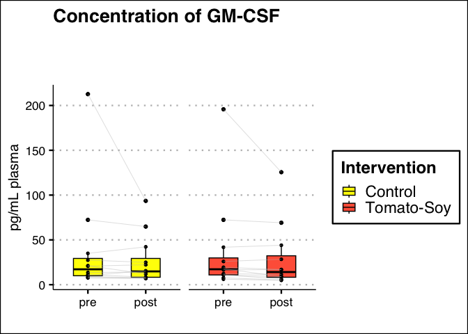<!-- -->

One subject has much higher levels than others. Let’s run a log2
transformation to get a better visual idea of what is happening with the
rest.

``` r
meta_logcytokines_long <- meta_cytokines_long %>%
  mutate(log2_cyto_conc_pg_ml = log2(cyto_conc_pg_ml))
```

``` r
meta_logcytokines_long %>% 
   filter(cytokines == "gm_csf") %>%
  filter(intervention != "Baseline") %>%
  ggpaired(x = "pre_post", y = "log2_cyto_conc_pg_ml", fill = "intervention", facet.by = "intervention", short.panel.labs = FALSE, panel.labs = list(intervention = c("", ""))) +
  scale_fill_manual(values = c("Red" = "tomato1",
                               "Yellow" = "yellow1"),
                    labels = c("Control", "Tomato-Soy"),
                    name = "Intervention") +
  geom_line(aes(group = patient_id), colour = "gray", size = 0.15) +
  theme_clean(base_size = 18, base_family = "sans") +
  labs(x = "",
       y = "Log2 transformed levels in plasma (pg/mL)",
       title = "Concentration of GM-CSF",
       subtitle = "")
```

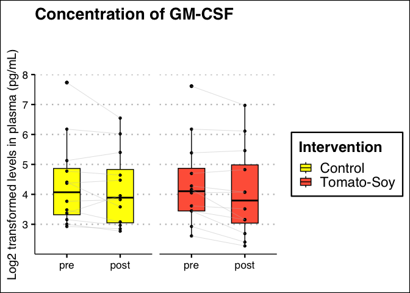<!-- -->

What do GM-CSF levels look like between interventions?

``` r
(total_GM_CSF_levels_postred_v_postyellow <- meta_cytokines_long %>% 
   filter(cytokines == "gm_csf") %>%
   filter(pre_post == "post") %>%
  ggpaired(x = "pre_post_intervention", y = "cyto_conc_pg_ml", fill = "intervention", short.panel.labs = FALSE, panel.labs = list(intervention = c("", ""))) +
  scale_fill_manual(values = c("Red" = "tomato1",
                               "Yellow" = "yellow1"),
                    name = "Intervention") +
  geom_line(aes(group = patient_id), colour = "gray", size = 0.15) +
  theme_clean(base_size = 18, base_family = "sans") +
  labs(x = "",
       y = "pg/mL plasma",
       title = "Concentration of GM-CSF",
       subtitle = ""))
```

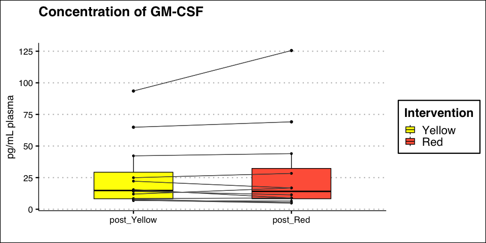<!-- -->

##### fold change

What is the avg fold change in the red intervention?

``` r
red_gmcsf_cyto_subset <- meta_cytokines_long %>%
  filter(intervention == "Red") %>%
  filter(cytokines == "gm_csf") %>%
  drop_na() %>%
  select(patient_id, intervention, pre_post_intervention, cyto_conc_pg_ml) %>%
  pivot_wider(names_from = pre_post_intervention,
              values_from = cyto_conc_pg_ml) %>%
  mutate(red_FC = post_Red/pre_Red)

red_gmcsf_cyto_subset %>%
  summarize(mean_red_FC = mean(red_FC))
```

    ## # A tibble: 1 × 1
    ##   mean_red_FC
    ##         <dbl>
    ## 1       0.830

What about within the yellow?

``` r
yellow_gmcsf_cyto_subset <- meta_cytokines_long %>%
  filter(intervention == "Yellow") %>%
  filter(cytokines == "gm_csf") %>%
  select(patient_id, intervention, pre_post_intervention, cyto_conc_pg_ml) %>%
  pivot_wider(names_from = pre_post_intervention,
              values_from = cyto_conc_pg_ml) %>%
  mutate(yellow_FC = post_Yellow/pre_Yellow)

yellow_gmcsf_cyto_subset %>%
  summarize(mean_yellow_FC = mean(yellow_FC))
```

    ## # A tibble: 1 × 1
    ##   mean_yellow_FC
    ##            <dbl>
    ## 1          0.922

#### IL-12p70

##### boxplots

``` r
meta_cytokines_long %>% 
   filter(cytokines == "il_12p70") %>%
  filter(intervention != "Baseline") %>%
  ggpaired(x = "pre_post", y = "cyto_conc_pg_ml", fill = "intervention", facet.by = "intervention", short.panel.labs = FALSE, panel.labs = list(intervention = c("", ""))) +
  scale_fill_manual(values = c("Red" = "tomato1",
                               "Yellow" = "yellow1"),
                    labels = c("Control", "Tomato-Soy"),
                    name = "Intervention") +
  geom_line(aes(group = patient_id), colour = "gray", size = 0.15) +
  theme_clean(base_size = 18, base_family = "sans") +
  labs(x = "",
       y = "pg/mL plasma",
       title = "Concentration of IL-12p70",
       subtitle = "")
```

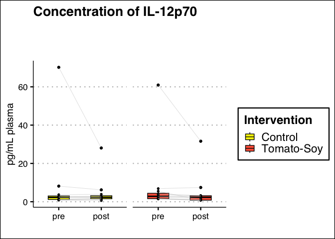<!-- -->

Again, one subj is extremely high. So we will log2 transform for
visualization purposes.

``` r
meta_logcytokines_long %>% 
   filter(cytokines == "il_12p70") %>%
  filter(intervention != "Baseline") %>%
  ggpaired(x = "pre_post", y = "log2_cyto_conc_pg_ml", fill = "intervention", facet.by = "intervention", short.panel.labs = FALSE, panel.labs = list(intervention = c("", ""))) +
  scale_fill_manual(values = c("Red" = "tomato1",
                               "Yellow" = "yellow1"),
                    labels = c("Control", "Tomato-Soy"),
                    name = "Intervention") +
  geom_line(aes(group = patient_id), colour = "gray", size = 0.15) +
  theme_clean(base_size = 18, base_family = "sans") +
  labs(x = "",
       y = "Log2 transformed levels in plasma (pg/mL)",
       title = "Concentration of IL-12p70",
       subtitle = "")
```

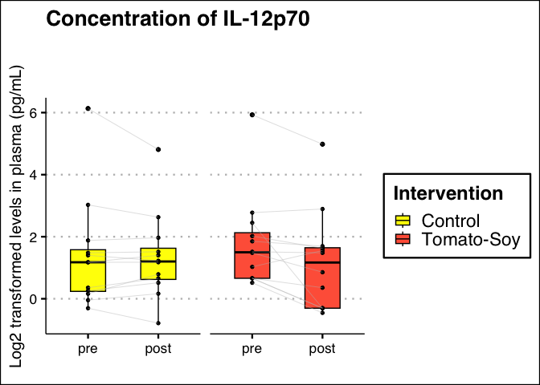<!-- -->

What do IL-12p70 levels look like between interventions?

``` r
(total_IL12p70_levels_postred_v_postyellow <- meta_cytokines_long %>% 
   filter(cytokines == "il_12p70") %>%
   filter(pre_post == "post") %>%
  ggpaired(x = "pre_post_intervention", y = "cyto_conc_pg_ml", fill = "intervention", short.panel.labs = FALSE, panel.labs = list(intervention = c("", ""))) +
  scale_fill_manual(values = c("Red" = "tomato1",
                               "Yellow" = "yellow1"),
                    name = "Intervention") +
  geom_line(aes(group = patient_id), colour = "gray", size = 0.15) +
  theme_clean(base_size = 18, base_family = "sans") +
  labs(x = "",
       y = "pg/mL plasma",
       title = "Concentration of IL-12p70",
       subtitle = ""))
```

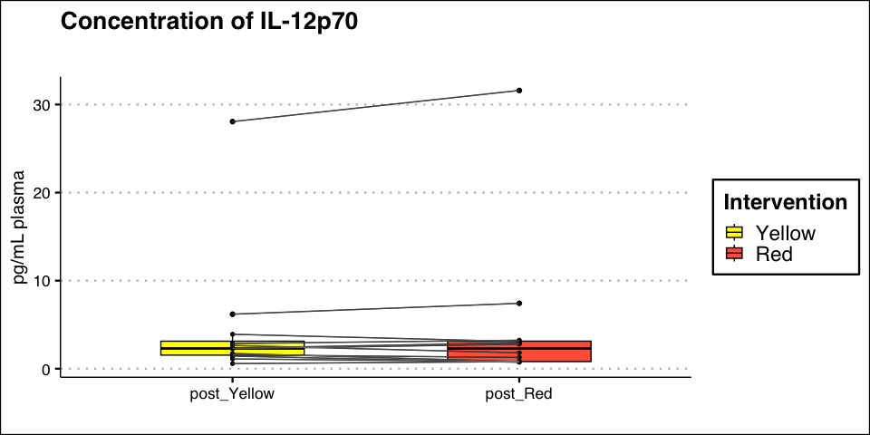<!-- -->

##### fold change

What is the avg fold change in the red intervention?

``` r
red_il_12p70_cyto_subset <- meta_cytokines_long %>%
  filter(intervention == "Red") %>%
  filter(cytokines == "il_12p70") %>%
  drop_na() %>%
  select(patient_id, intervention, pre_post_intervention, cyto_conc_pg_ml) %>%
  pivot_wider(names_from = pre_post_intervention,
              values_from = cyto_conc_pg_ml) %>%
  mutate(red_FC = post_Red/pre_Red)

red_il_12p70_cyto_subset %>%
  summarize(mean_red_FC = mean(red_FC))
```

    ## # A tibble: 1 × 1
    ##   mean_red_FC
    ##         <dbl>
    ## 1       0.735

What about within the yellow?

``` r
yellow_il_12p70_cyto_subset <- meta_cytokines_long %>%
  filter(intervention == "Yellow") %>%
  filter(cytokines == "il_12p70") %>%
  select(patient_id, intervention, pre_post_intervention, cyto_conc_pg_ml) %>%
  pivot_wider(names_from = pre_post_intervention,
              values_from = cyto_conc_pg_ml) %>%
  mutate(yellow_FC = post_Yellow/pre_Yellow)

yellow_il_12p70_cyto_subset %>%
  summarize(mean_yellow_FC = mean(yellow_FC))
```

    ## # A tibble: 1 × 1
    ##   mean_yellow_FC
    ##            <dbl>
    ## 1           1.01

#### IL-5

##### boxplots

``` r
(total_IL5_levels <- meta_cytokines_long %>% 
   filter(cytokines == "il_5") %>%
  filter(intervention != "Baseline") %>%
  ggpaired(x = "pre_post", y = "cyto_conc_pg_ml", fill = "intervention", facet.by = "intervention", short.panel.labs = FALSE, panel.labs = list(intervention = c("", ""))) +
  scale_fill_manual(values = c("Red" = "tomato1",
                               "Yellow" = "yellow1"),
                    labels = c("Control", "Tomato-Soy"),
                    name = "Intervention") +
  geom_line(aes(group = patient_id), colour = "gray", size = 0.15) +
  theme_clean(base_size = 18, base_family = "sans") +
  labs(x = "",
       y = "Log2 transformed levels in plasma (pg/mL)",
       title = "Concentration of IL-5",
       subtitle = ""))
```

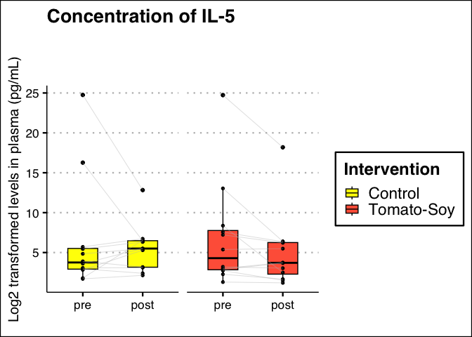<!-- -->

``` r
ggsave(filename = "/Users/mariasholola/Documents/GitHub/USDA-Inflammation-Metabolomics/Plots/total-IL5-levels-red-yellow.svg", plot = total_IL5_levels, width = 10)
```

``` r
meta_logcytokines_long %>% 
   filter(cytokines == "il_5") %>%
  filter(intervention != "Baseline") %>%
  ggpaired(x = "pre_post", y = "log2_cyto_conc_pg_ml", fill = "intervention", facet.by = "intervention", short.panel.labs = FALSE, panel.labs = list(intervention = c("", ""))) +
  scale_fill_manual(values = c("Red" = "tomato1",
                               "Yellow" = "yellow1"),
                    labels = c("Control", "Tomato-Soy"),
                    name = "Intervention") +
  geom_line(aes(group = patient_id), colour = "gray", size = 0.15) +
  theme_clean(base_size = 18, base_family = "sans") +
  labs(x = "",
       y = "pg/mL plasma",
       title = "Concentration of IL-5",
       subtitle = "")
```

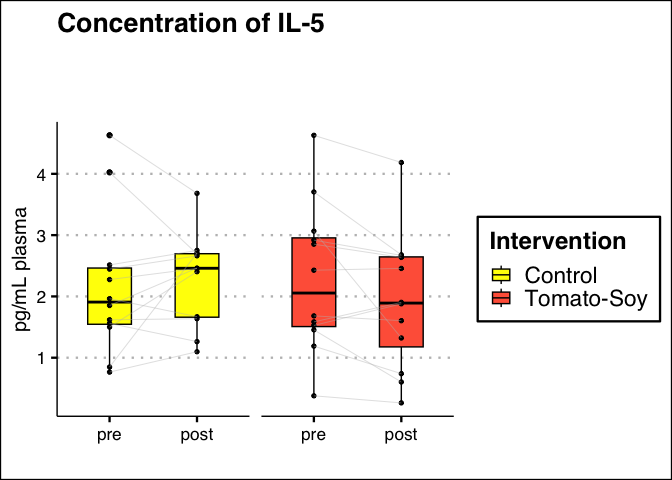<!-- -->

What do IL-5 levels look like between interventions?

``` r
(total_IL5_levels_postred_v_postyellow <- meta_cytokines_long %>% 
   filter(cytokines == "il_5") %>%
   filter(pre_post == "post") %>%
  ggpaired(x = "pre_post_intervention", y = "cyto_conc_pg_ml", fill = "intervention", short.panel.labs = FALSE, panel.labs = list(intervention = c("", ""))) +
  scale_fill_manual(values = c("Red" = "tomato1",
                               "Yellow" = "yellow1"),
                    name = "Intervention") +
  geom_line(aes(group = patient_id), colour = "gray", size = 0.15) +
  theme_clean(base_size = 18, base_family = "sans") +
  labs(x = "",
       y = "pg/mL plasma",
       title = "Concentration of IL-5",
       subtitle = ""))
```

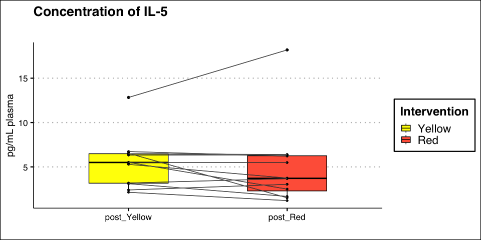<!-- -->

##### fold change

What is the avg fold change in the red intervention?

``` r
red_il_5_cyto_subset <- meta_cytokines_long %>%
  filter(intervention == "Red") %>%
  filter(cytokines == "il_5") %>%
  drop_na() %>%
  select(patient_id, intervention, pre_post_intervention, cyto_conc_pg_ml) %>%
  pivot_wider(names_from = pre_post_intervention,
              values_from = cyto_conc_pg_ml) %>%
  mutate(red_FC = post_Red/pre_Red)

red_il_5_cyto_subset %>%
  summarize(mean_red_FC = mean(red_FC))
```

    ## # A tibble: 1 × 1
    ##   mean_red_FC
    ##         <dbl>
    ## 1       0.828

What about within the yellow?

``` r
yellow_il_5_cyto_subset <- meta_cytokines_long %>%
  filter(intervention == "Yellow") %>%
  filter(cytokines == "il_5") %>%
  select(patient_id, intervention, pre_post_intervention, cyto_conc_pg_ml) %>%
  pivot_wider(names_from = pre_post_intervention,
              values_from = cyto_conc_pg_ml) %>%
  mutate(yellow_FC = post_Yellow/pre_Yellow)

yellow_il_5_cyto_subset %>%
  summarize(mean_yellow_FC = mean(yellow_FC))
```

    ## # A tibble: 1 × 1
    ##   mean_yellow_FC
    ##            <dbl>
    ## 1           1.28

### Correlation w/ carotenoids

``` r
correlation_cyto_red <- meta_table %>%
  filter(intervention == "Red") %>%
  select(total_lyc, total_carotenoids, b_carotene, total_cis_lyc, a_carotene, lutein, zeaxanthin, b_cryptoxanthin, il_5, il_12p70, gm_csf) %>%
  correlate()

kable(correlation_cyto_red, format = "markdown", digits = 3)
```

| term              | total_lyc | total_carotenoids | b_carotene | total_cis_lyc | a_carotene | lutein | zeaxanthin | b_cryptoxanthin |   il_5 | il_12p70 | gm_csf |
|:------------------|----------:|------------------:|-----------:|--------------:|-----------:|-------:|-----------:|----------------:|-------:|---------:|-------:|
| total_lyc         |        NA |             0.801 |      0.200 |         0.968 |      0.033 |  0.370 |     -0.094 |           0.257 |  0.218 |    0.002 |  0.077 |
| total_carotenoids |     0.801 |                NA |      0.679 |         0.805 |      0.455 |  0.784 |      0.202 |           0.420 |  0.305 |   -0.123 | -0.118 |
| b_carotene        |     0.200 |             0.679 |         NA |         0.280 |      0.531 |  0.740 |      0.312 |           0.068 |  0.206 |   -0.184 | -0.274 |
| total_cis_lyc     |     0.968 |             0.805 |      0.280 |            NA |      0.071 |  0.395 |     -0.097 |           0.190 |  0.299 |    0.075 |  0.156 |
| a_carotene        |     0.033 |             0.455 |      0.531 |         0.071 |         NA |  0.655 |      0.486 |           0.122 |  0.489 |   -0.118 | -0.231 |
| lutein            |     0.370 |             0.784 |      0.740 |         0.395 |      0.655 |     NA |      0.309 |           0.231 |  0.329 |   -0.232 | -0.264 |
| zeaxanthin        |    -0.094 |             0.202 |      0.312 |        -0.097 |      0.486 |  0.309 |         NA |           0.089 |  0.209 |    0.384 |  0.287 |
| b_cryptoxanthin   |     0.257 |             0.420 |      0.068 |         0.190 |      0.122 |  0.231 |      0.089 |              NA | -0.077 |   -0.108 | -0.059 |
| il_5              |     0.218 |             0.305 |      0.206 |         0.299 |      0.489 |  0.329 |      0.209 |          -0.077 |     NA |    0.273 |  0.281 |
| il_12p70          |     0.002 |            -0.123 |     -0.184 |         0.075 |     -0.118 | -0.232 |      0.384 |          -0.108 |  0.273 |       NA |  0.933 |
| gm_csf            |     0.077 |            -0.118 |     -0.274 |         0.156 |     -0.231 | -0.264 |      0.287 |          -0.059 |  0.281 |    0.933 |     NA |

No strong correlation between the significant cytokines and carotenoids.
Let’s still visualize what the trends look like in both interventions.

``` r
sig_cytokines_red <- meta_cytokines_long %>%
  filter(cytokines %in% c("il_5", "gm_csf", "il_12p70"))

sig_cytokines_red %>%
  ggplot(aes(x = total_lyc, y = cyto_conc_pg_ml, color = intervention)) +
  geom_point() +
  scale_color_manual(values = c("Yellow" = "yellow3",
                                "Red" = "red")) +
  theme_bw() +
  facet_wrap(vars(cytokines), scales = "free")
```

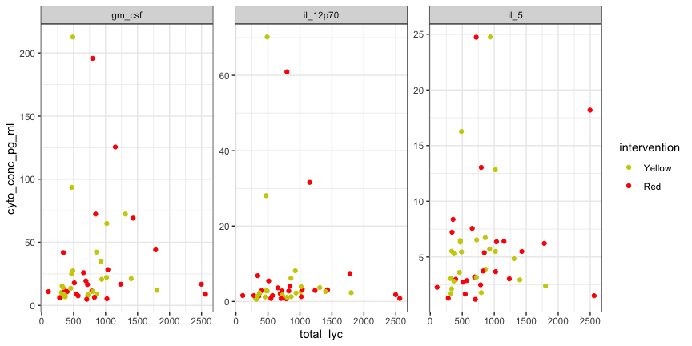<!-- -->

No differences between the trends.

# Immune Cells

``` r
# convert immune cell data from wide to long
meta_cells_long <- meta_table_edited %>%
  pivot_longer(cols = starts_with("x"),
               names_to = "cell_type",
               values_to = "cell_value")
```

## Carryover effects?

### Normality check

``` r
meta_cells_long %>%
  group_by(sequence) %>%
  shapiro_test(cell_value)
```

    ## # A tibble: 2 × 4
    ##   sequence variable   statistic        p
    ##   <fct>    <chr>          <dbl>    <dbl>
    ## 1 R_Y      cell_value     0.580 2.08e-42
    ## 2 Y_R      cell_value     0.585 3.14e-42

Data is not normally distributed, so will use nonparametric paired tests
for this test.

### Wilcoxon rank-sum

``` r
(wilcox_cells_seqeffects <- meta_cells_long %>%
   filter(intervention != "Baseline") %>%
   group_by(period) %>%
   wilcox_test(cell_value ~ sequence, paired = TRUE, p.adjust.method = "BH"))
```

    ## # A tibble: 4 × 8
    ##   period .y.        group1 group2    n1    n2 statistic     p
    ## * <fct>  <chr>      <chr>  <chr>  <int> <int>     <dbl> <dbl>
    ## 1 B1     cell_value R_Y    Y_R      234   228     13338 0.775
    ## 2 B2     cell_value R_Y    Y_R      234   228     12917 0.892
    ## 3 B3     cell_value R_Y    Y_R      228   234     11889 0.243
    ## 4 B4     cell_value R_Y    Y_R      228   234     12410 0.519

## Intervention effects

### Normality check

``` r
shap_cells_intervention <- meta_cells_long %>%
  filter(pre_post == "post") %>%
  group_by(cell_type) %>%
  shapiro_test(cell_value)

kable(shap_cells_intervention, format = "markdown", digits = 3)
```

| cell_type                              | variable   | statistic |     p |
|:---------------------------------------|:-----------|----------:|------:|
| x01_cd45_cd66b_lymph_dc_mono           | cell_value |     0.820 | 0.001 |
| x02_cd45_cd66b_grans                   | cell_value |     0.615 | 0.000 |
| x03_cd3_cd45_cd3_t\_cells              | cell_value |     0.983 | 0.948 |
| x04_tc_rgd_cd3_ab_t\_cells             | cell_value |     0.983 | 0.950 |
| x05_cd4_cd8_cd8_t\_cells               | cell_value |     0.940 | 0.162 |
| x06_cd45ro_cd45ra_naive_cd8            | cell_value |     0.873 | 0.006 |
| x07_cd46ro_cd45ra_cm_cd8               | cell_value |     0.887 | 0.012 |
| x08_cd45ro_cd45ra_em_cd8               | cell_value |     0.908 | 0.033 |
| x09_cd45r0_cd45ra_te_cd8               | cell_value |     0.845 | 0.002 |
| x10_cd38_hladr_activated_cd8           | cell_value |     0.962 | 0.479 |
| x11_cd4_cd8_cd4_t\_cells               | cell_value |     0.984 | 0.955 |
| x12_cd45ro_cd45ra_naive_cd4            | cell_value |     0.864 | 0.004 |
| x13_cd45ro_cd45ra_cm_cd4               | cell_value |     0.809 | 0.000 |
| x14_cd45ro_cd45ra                      | cell_value |     0.910 | 0.035 |
| x15_cd45ro_cd45ra_te_cd4               | cell_value |     0.286 | 0.000 |
| x16_cd38_hladr_activated_cd4           | cell_value |     0.976 | 0.822 |
| x17_cd25_cd127_tregs                   | cell_value |     0.603 | 0.000 |
| x18_ccr4_cd4_total_ccr4_treg           | cell_value |     0.607 | 0.000 |
| x19_cd45ra_cd45ro_ccr4_treg_naive      | cell_value |     0.825 | 0.001 |
| x20_hladr_total_ccr4_treg_activated    | cell_value |     0.957 | 0.390 |
| x21_cd45ra_cd45ro_ccr4_treg_memory     | cell_value |     0.664 | 0.000 |
| x22_cxcr3_ccr6_th1                     | cell_value |     0.821 | 0.001 |
| x23_cxcr3_ccr6_th2                     | cell_value |     0.943 | 0.190 |
| x24_cxcr3_ccr6_th17                    | cell_value |     0.768 | 0.000 |
| x25_cd19_cd3_b\_cells                  | cell_value |     0.853 | 0.002 |
| x26_cd27_ig_d\_naive_b\_cells          | cell_value |     0.829 | 0.001 |
| x27_cd27_ig_d\_memory_b\_cells         | cell_value |     0.871 | 0.006 |
| x28_cd27_ig_d\_memory_resting_b\_cells | cell_value |     0.705 | 0.000 |
| x30_cd27_cd38_plasmablasts             | cell_value |     0.830 | 0.001 |
| x31_cd14_monocytes                     | cell_value |     0.949 | 0.253 |
| x32_cd16_non_classical_mono            | cell_value |     0.924 | 0.072 |
| x33_cd16_classical_mono                | cell_value |     0.933 | 0.116 |
| x34_hladr_cd56                         | cell_value |     0.945 | 0.206 |
| x35_cd16_cd123_cd11c_p\_dc             | cell_value |     0.947 | 0.229 |
| x36_cd16_cd123_cd11c_m\_dc             | cell_value |     0.917 | 0.050 |
| x37_cd56_cd161_cd123_nk_cells          | cell_value |     0.839 | 0.001 |
| x38_cd16_nk_cells                      | cell_value |     0.846 | 0.002 |
| x40_cd14_mdsc_mono                     | cell_value |     0.654 | 0.000 |
| x41_cd66b_mdsc_grans                   | cell_value |     0.654 | 0.000 |

In this case, many cells are not normally distributed. So I’ll go
forward with non-parametric paired tests.

### Wilxocon rank-sum

``` r
(contains_NAs <- meta_cells_long %>%
  filter(intervention != "Baseline") %>%
  group_by(cell_type) %>%
  count(is.na(cell_value)) %>%
  filter(`is.na(cell_value)` == TRUE))
```

    ## # A tibble: 1 × 3
    ## # Groups:   cell_type [1]
    ##   cell_type            `is.na(cell_value)`     n
    ##   <chr>                <lgl>               <int>
    ## 1 x41_cd66b_mdsc_grans TRUE                   24

``` r
# CD66+CD11+ MDSC granulocytes have a lot of missing values - we will take this out moving forward.

wilcox_cells_intervention <- meta_cells_long %>%
  filter(cell_type != "x41_cd66b_mdsc_grans") %>%
  filter(pre_post == "post") %>%
  group_by(cell_type) %>%
  wilcox_test(cell_value ~ intervention, paired = TRUE, p.adjust.method = "BH") %>%
  add_significance("p")

kable(wilcox_cells_intervention, format = "markdown", digits = 5)
```

| cell_type                              | .y.        | group1 | group2 |  n1 |  n2 | statistic |       p | p.signif |
|:---------------------------------------|:-----------|:-------|:-------|----:|----:|----------:|--------:|:---------|
| x01_cd45_cd66b_lymph_dc_mono           | cell_value | Yellow | Red    |  12 |  12 |        42 | 0.85000 | ns       |
| x02_cd45_cd66b_grans                   | cell_value | Yellow | Red    |  12 |  12 |        31 | 0.56900 | ns       |
| x03_cd3_cd45_cd3_t\_cells              | cell_value | Yellow | Red    |  12 |  12 |        32 | 0.62200 | ns       |
| x04_tc_rgd_cd3_ab_t\_cells             | cell_value | Yellow | Red    |  12 |  12 |        33 | 0.67700 | ns       |
| x05_cd4_cd8_cd8_t\_cells               | cell_value | Yellow | Red    |  12 |  12 |        38 | 0.97000 | ns       |
| x06_cd45ro_cd45ra_naive_cd8            | cell_value | Yellow | Red    |  12 |  12 |        44 | 0.73300 | ns       |
| x07_cd46ro_cd45ra_cm_cd8               | cell_value | Yellow | Red    |  12 |  12 |        40 | 0.97000 | ns       |
| x08_cd45ro_cd45ra_em_cd8               | cell_value | Yellow | Red    |  12 |  12 |        38 | 0.97000 | ns       |
| x09_cd45r0_cd45ra_te_cd8               | cell_value | Yellow | Red    |  12 |  12 |        46 | 0.62200 | ns       |
| x10_cd38_hladr_activated_cd8           | cell_value | Yellow | Red    |  12 |  12 |        50 | 0.42400 | ns       |
| x11_cd4_cd8_cd4_t\_cells               | cell_value | Yellow | Red    |  12 |  12 |        32 | 0.62200 | ns       |
| x12_cd45ro_cd45ra_naive_cd4            | cell_value | Yellow | Red    |  12 |  12 |        38 | 0.97000 | ns       |
| x13_cd45ro_cd45ra_cm_cd4               | cell_value | Yellow | Red    |  12 |  12 |        39 | 1.00000 | ns       |
| x14_cd45ro_cd45ra                      | cell_value | Yellow | Red    |  12 |  12 |        35 | 0.79100 | ns       |
| x15_cd45ro_cd45ra_te_cd4               | cell_value | Yellow | Red    |  12 |  12 |        35 | 0.79100 | ns       |
| x16_cd38_hladr_activated_cd4           | cell_value | Yellow | Red    |  12 |  12 |        45 | 0.67700 | ns       |
| x17_cd25_cd127_tregs                   | cell_value | Yellow | Red    |  12 |  12 |        44 | 0.73300 | ns       |
| x18_ccr4_cd4_total_ccr4_treg           | cell_value | Yellow | Red    |  12 |  12 |        48 | 0.51900 | ns       |
| x19_cd45ra_cd45ro_ccr4_treg_naive      | cell_value | Yellow | Red    |  12 |  12 |        42 | 0.85000 | ns       |
| x20_hladr_total_ccr4_treg_activated    | cell_value | Yellow | Red    |  12 |  12 |        50 | 0.42400 | ns       |
| x21_cd45ra_cd45ro_ccr4_treg_memory     | cell_value | Yellow | Red    |  12 |  12 |        44 | 0.73300 | ns       |
| x22_cxcr3_ccr6_th1                     | cell_value | Yellow | Red    |  12 |  12 |        31 | 0.56900 | ns       |
| x23_cxcr3_ccr6_th2                     | cell_value | Yellow | Red    |  12 |  12 |        33 | 0.67700 | ns       |
| x24_cxcr3_ccr6_th17                    | cell_value | Yellow | Red    |  12 |  12 |        42 | 0.85000 | ns       |
| x25_cd19_cd3_b\_cells                  | cell_value | Yellow | Red    |  12 |  12 |        38 | 0.97000 | ns       |
| x26_cd27_ig_d\_naive_b\_cells          | cell_value | Yellow | Red    |  12 |  12 |        41 | 0.91000 | ns       |
| x27_cd27_ig_d\_memory_b\_cells         | cell_value | Yellow | Red    |  12 |  12 |        42 | 0.85000 | ns       |
| x28_cd27_ig_d\_memory_resting_b\_cells | cell_value | Yellow | Red    |  12 |  12 |        32 | 0.62200 | ns       |
| x30_cd27_cd38_plasmablasts             | cell_value | Yellow | Red    |  12 |  12 |        49 | 0.47000 | ns       |
| x31_cd14_monocytes                     | cell_value | Yellow | Red    |  12 |  12 |        48 | 0.51900 | ns       |
| x32_cd16_non_classical_mono            | cell_value | Yellow | Red    |  12 |  12 |        22 | 0.20400 | ns       |
| x33_cd16_classical_mono                | cell_value | Yellow | Red    |  12 |  12 |        50 | 0.42400 | ns       |
| x34_hladr_cd56                         | cell_value | Yellow | Red    |  12 |  12 |        46 | 0.62200 | ns       |
| x35_cd16_cd123_cd11c_p\_dc             | cell_value | Yellow | Red    |  12 |  12 |        52 | 0.33900 | ns       |
| x36_cd16_cd123_cd11c_m\_dc             | cell_value | Yellow | Red    |  12 |  12 |        43 | 0.79100 | ns       |
| x37_cd56_cd161_cd123_nk_cells          | cell_value | Yellow | Red    |  12 |  12 |        10 | 0.02100 | \*       |
| x38_cd16_nk_cells                      | cell_value | Yellow | Red    |  12 |  12 |        78 | 0.00049 | \*\*\*   |
| x40_cd14_mdsc_mono                     | cell_value | Yellow | Red    |  12 |  12 |         0 | 0.00049 | \*\*\*   |

``` r
# extract statistically significant cytokines 
(sig_cells_intervention <- wilcox_cells_intervention %>%
  filter(wilcox_cells_intervention$p < 0.05))
```

    ## # A tibble: 3 × 9
    ##   cell_type           .y.   group1 group2    n1    n2 statistic       p p.signif
    ##   <chr>               <chr> <chr>  <chr>  <int> <int>     <dbl>   <dbl> <chr>   
    ## 1 x37_cd56_cd161_cd1… cell… Yellow Red       12    12        10 2.1 e-2 *       
    ## 2 x38_cd16_nk_cells   cell… Yellow Red       12    12        78 4.88e-4 ***     
    ## 3 x40_cd14_mdsc_mono  cell… Yellow Red       12    12         0 4.88e-4 ***

- 3 cell types are significantly different between interventions! Let’s
  see how they are different by visualizations/summaries.

### Sig cells

#### boxplots

``` r
meta_cells_long %>% 
  filter(cell_type %in% sig_cells_intervention$cell_type) %>%
  filter(intervention != "Baseline") %>%
  filter(pre_post == "post") %>%
  ggpaired(x = "intervention", y = "cell_value", fill = "intervention", facet.by = "cell_type", short.panel.labs = FALSE, panel.labs = list(cell_type = c("CD56+CD161+CD123- (NK cells)", "CD16- NK cells", "CD14+ MDSC (Mono)"))) +
  scale_fill_manual(values = c("Yellow" = "yellow1",
                               "Red" = "tomato1"),
                    labels = c("Control", "Tomato-soy"),
                    name = "Intervention") +
  geom_line(aes(group = patient_id), colour = "gray", size = 0.15) +
  theme_clean(base_size = 18, base_family = "sans") +
  labs(x = "",
       y = "Cell value",
       title = "Cell populations significantly different between interventions",
       subtitle = "")
```

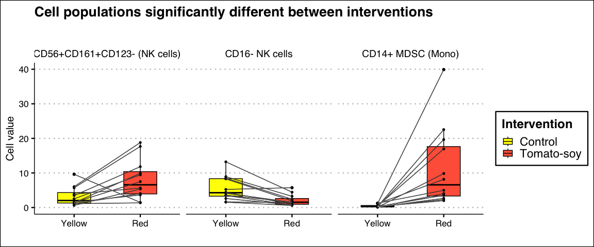<!-- -->

Let’s run a log2 transformation to get a better visual for CD14+
monocytes

``` r
meta_log_cells_long <- meta_cells_long %>%
  mutate(log2_cell_value = log2(cell_value))
```

``` r
meta_log_cells_long %>% 
  filter(cell_type %in% sig_cells_intervention$cell_type) %>%
  filter(intervention != "Baseline") %>%
  filter(pre_post == "post") %>%
  ggpaired(x = "intervention", y = "log2_cell_value", fill = "intervention", facet.by = "cell_type", short.panel.labs = FALSE, panel.labs = list(cell_type = c("CD56+CD161+CD123- (NK cells)", "CD16- NK cells", "CD14+ MDSC (Mono)"))) +
  scale_fill_manual(values = c("Red" = "tomato1",
                               "Yellow" = "yellow1"),
                    labels = c("Control", "Tomato-soy"),
                    name = "Intervention") +
  geom_line(aes(group = patient_id), colour = "gray", size = 0.15) +
  theme_clean(base_size = 18, base_family = "sans") +
  labs(x = "",
       y = "Log2 cell values",
       title = "Cell populations significantly different between interventions",
       subtitle = "")
```

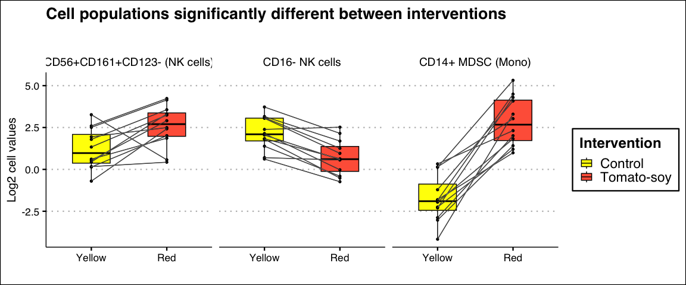<!-- -->

- Seems like the trend is CD56+CD161+ NK cells and CD14+ MDSCs are
  greater post-tomato soy compared to yellow interventions but the
  opposite for CD16- NK cells.

#### fold change

What is the avg fold change in the red intervention?

``` r
intervention_cells_subset <- meta_cells_long %>%
  filter(intervention != "Baseline") %>%
  filter(cell_type %in% sig_cells_intervention$cell_type)%>%
  select(patient_id, pre_post_intervention, cell_type, cell_value) %>%
  group_by(cell_type) %>%
  pivot_wider(names_from = pre_post_intervention,
              values_from = cell_value) %>%
  mutate(post_intervention_FC = post_Red/post_Yellow)

intervention_cells_subset %>%
  summarize(mean_intervention_FC = mean(post_intervention_FC))
```

    ## # A tibble: 3 × 2
    ##   cell_type                     mean_intervention_FC
    ##   <chr>                                        <dbl>
    ## 1 x37_cd56_cd161_cd123_nk_cells                3.62 
    ## 2 x38_cd16_nk_cells                            0.427
    ## 3 x40_cd14_mdsc_mono                          43.7

- CD14+ MDSC monocytes shows a huge mean fold change between
  interventions!

## Yellow treatment effects

### Normality check

``` r
shap_cells_yellow <- meta_cells_long %>%
  filter(cell_type != "x41_cd66b_mdsc_grans") %>%
  filter(intervention == "Yellow") %>%
  group_by(cell_type) %>%
  shapiro_test(cell_value)

kable(shap_cells_yellow, format = "markdown", digits = 3)
```

| cell_type                              | variable   | statistic |     p |
|:---------------------------------------|:-----------|----------:|------:|
| x01_cd45_cd66b_lymph_dc_mono           | cell_value |     0.628 | 0.000 |
| x02_cd45_cd66b_grans                   | cell_value |     0.776 | 0.000 |
| x03_cd3_cd45_cd3_t\_cells              | cell_value |     0.948 | 0.247 |
| x04_tc_rgd_cd3_ab_t\_cells             | cell_value |     0.954 | 0.335 |
| x05_cd4_cd8_cd8_t\_cells               | cell_value |     0.931 | 0.102 |
| x06_cd45ro_cd45ra_naive_cd8            | cell_value |     0.891 | 0.014 |
| x07_cd46ro_cd45ra_cm_cd8               | cell_value |     0.825 | 0.001 |
| x08_cd45ro_cd45ra_em_cd8               | cell_value |     0.902 | 0.023 |
| x09_cd45r0_cd45ra_te_cd8               | cell_value |     0.853 | 0.003 |
| x10_cd38_hladr_activated_cd8           | cell_value |     0.979 | 0.871 |
| x11_cd4_cd8_cd4_t\_cells               | cell_value |     0.970 | 0.656 |
| x12_cd45ro_cd45ra_naive_cd4            | cell_value |     0.856 | 0.003 |
| x13_cd45ro_cd45ra_cm_cd4               | cell_value |     0.908 | 0.033 |
| x14_cd45ro_cd45ra                      | cell_value |     0.921 | 0.060 |
| x15_cd45ro_cd45ra_te_cd4               | cell_value |     0.667 | 0.000 |
| x16_cd38_hladr_activated_cd4           | cell_value |     0.948 | 0.249 |
| x17_cd25_cd127_tregs                   | cell_value |     0.679 | 0.000 |
| x18_ccr4_cd4_total_ccr4_treg           | cell_value |     0.662 | 0.000 |
| x19_cd45ra_cd45ro_ccr4_treg_naive      | cell_value |     0.768 | 0.000 |
| x20_hladr_total_ccr4_treg_activated    | cell_value |     0.903 | 0.025 |
| x21_cd45ra_cd45ro_ccr4_treg_memory     | cell_value |     0.729 | 0.000 |
| x22_cxcr3_ccr6_th1                     | cell_value |     0.862 | 0.004 |
| x23_cxcr3_ccr6_th2                     | cell_value |     0.969 | 0.653 |
| x24_cxcr3_ccr6_th17                    | cell_value |     0.755 | 0.000 |
| x25_cd19_cd3_b\_cells                  | cell_value |     0.956 | 0.367 |
| x26_cd27_ig_d\_naive_b\_cells          | cell_value |     0.946 | 0.221 |
| x27_cd27_ig_d\_memory_b\_cells         | cell_value |     0.851 | 0.002 |
| x28_cd27_ig_d\_memory_resting_b\_cells | cell_value |     0.795 | 0.000 |
| x30_cd27_cd38_plasmablasts             | cell_value |     0.832 | 0.001 |
| x31_cd14_monocytes                     | cell_value |     0.950 | 0.272 |
| x32_cd16_non_classical_mono            | cell_value |     0.804 | 0.000 |
| x33_cd16_classical_mono                | cell_value |     0.955 | 0.343 |
| x34_hladr_cd56                         | cell_value |     0.964 | 0.532 |
| x35_cd16_cd123_cd11c_p\_dc             | cell_value |     0.956 | 0.371 |
| x36_cd16_cd123_cd11c_m\_dc             | cell_value |     0.943 | 0.194 |
| x37_cd56_cd161_cd123_nk_cells          | cell_value |     0.834 | 0.001 |
| x38_cd16_nk_cells                      | cell_value |     0.695 | 0.000 |
| x40_cd14_mdsc_mono                     | cell_value |     0.614 | 0.000 |

### Wilcoxon rank-sum

``` r
wilcox_cells_yellow <- meta_cells_long %>%
   filter(intervention == "Yellow") %>%
   filter(cell_type != "x41_cd66b_mdsc_grans") %>%
   group_by(cell_type) %>%
   wilcox_test(cell_value ~ pre_post, paired = TRUE, p.adjust.method = "BH")

kable(wilcox_cells_yellow, format = "markdown", digits = 3)
```

| cell_type                              | .y.        | group1 | group2 |  n1 |  n2 | statistic |     p |
|:---------------------------------------|:-----------|:-------|:-------|----:|----:|----------:|------:|
| x01_cd45_cd66b_lymph_dc_mono           | cell_value | pre    | post   |  12 |  12 |        39 | 1.000 |
| x02_cd45_cd66b_grans                   | cell_value | pre    | post   |  12 |  12 |        57 | 0.176 |
| x03_cd3_cd45_cd3_t\_cells              | cell_value | pre    | post   |  12 |  12 |        39 | 1.000 |
| x04_tc_rgd_cd3_ab_t\_cells             | cell_value | pre    | post   |  12 |  12 |        42 | 0.850 |
| x05_cd4_cd8_cd8_t\_cells               | cell_value | pre    | post   |  12 |  12 |         6 | 0.007 |
| x06_cd45ro_cd45ra_naive_cd8            | cell_value | pre    | post   |  12 |  12 |        35 | 0.791 |
| x07_cd46ro_cd45ra_cm_cd8               | cell_value | pre    | post   |  12 |  12 |        45 | 0.677 |
| x08_cd45ro_cd45ra_em_cd8               | cell_value | pre    | post   |  12 |  12 |         0 | 0.000 |
| x09_cd45r0_cd45ra_te_cd8               | cell_value | pre    | post   |  12 |  12 |        13 | 0.043 |
| x10_cd38_hladr_activated_cd8           | cell_value | pre    | post   |  12 |  12 |        31 | 0.569 |
| x11_cd4_cd8_cd4_t\_cells               | cell_value | pre    | post   |  12 |  12 |        49 | 0.470 |
| x12_cd45ro_cd45ra_naive_cd4            | cell_value | pre    | post   |  12 |  12 |        52 | 0.339 |
| x13_cd45ro_cd45ra_cm_cd4               | cell_value | pre    | post   |  12 |  12 |        48 | 0.519 |
| x14_cd45ro_cd45ra                      | cell_value | pre    | post   |  12 |  12 |        17 | 0.092 |
| x15_cd45ro_cd45ra_te_cd4               | cell_value | pre    | post   |  12 |  12 |         0 | 0.000 |
| x16_cd38_hladr_activated_cd4           | cell_value | pre    | post   |  12 |  12 |        26 | 0.339 |
| x17_cd25_cd127_tregs                   | cell_value | pre    | post   |  12 |  12 |        34 | 0.733 |
| x18_ccr4_cd4_total_ccr4_treg           | cell_value | pre    | post   |  12 |  12 |        29 | 0.470 |
| x19_cd45ra_cd45ro_ccr4_treg_naive      | cell_value | pre    | post   |  12 |  12 |        24 | 0.266 |
| x20_hladr_total_ccr4_treg_activated    | cell_value | pre    | post   |  12 |  12 |        25 | 0.301 |
| x21_cd45ra_cd45ro_ccr4_treg_memory     | cell_value | pre    | post   |  12 |  12 |        31 | 0.569 |
| x22_cxcr3_ccr6_th1                     | cell_value | pre    | post   |  12 |  12 |        49 | 0.470 |
| x23_cxcr3_ccr6_th2                     | cell_value | pre    | post   |  12 |  12 |        53 | 0.301 |
| x24_cxcr3_ccr6_th17                    | cell_value | pre    | post   |  12 |  12 |        28 | 0.424 |
| x25_cd19_cd3_b\_cells                  | cell_value | pre    | post   |  12 |  12 |        15 | 0.064 |
| x26_cd27_ig_d\_naive_b\_cells          | cell_value | pre    | post   |  12 |  12 |        11 | 0.027 |
| x27_cd27_ig_d\_memory_b\_cells         | cell_value | pre    | post   |  12 |  12 |        24 | 0.266 |
| x28_cd27_ig_d\_memory_resting_b\_cells | cell_value | pre    | post   |  12 |  12 |        48 | 0.519 |
| x30_cd27_cd38_plasmablasts             | cell_value | pre    | post   |  12 |  12 |        36 | 0.850 |
| x31_cd14_monocytes                     | cell_value | pre    | post   |  12 |  12 |        46 | 0.622 |
| x32_cd16_non_classical_mono            | cell_value | pre    | post   |  12 |  12 |        54 | 0.266 |
| x33_cd16_classical_mono                | cell_value | pre    | post   |  12 |  12 |        39 | 1.000 |
| x34_hladr_cd56                         | cell_value | pre    | post   |  12 |  12 |        40 | 0.970 |
| x35_cd16_cd123_cd11c_p\_dc             | cell_value | pre    | post   |  12 |  12 |        35 | 0.791 |
| x36_cd16_cd123_cd11c_m\_dc             | cell_value | pre    | post   |  12 |  12 |        42 | 0.850 |
| x37_cd56_cd161_cd123_nk_cells          | cell_value | pre    | post   |  12 |  12 |         5 | 0.005 |
| x38_cd16_nk_cells                      | cell_value | pre    | post   |  12 |  12 |        41 | 0.910 |
| x40_cd14_mdsc_mono                     | cell_value | pre    | post   |  12 |  12 |        53 | 0.301 |

``` r
# extract statistically significant cytokines 
(sig_cells_yellow <- wilcox_cells_yellow %>%
  filter(wilcox_cells_yellow$p < 0.05))
```

    ## # A tibble: 6 × 8
    ##   cell_type                    .y.   group1 group2    n1    n2 statistic       p
    ##   <chr>                        <chr> <chr>  <chr>  <int> <int>     <dbl>   <dbl>
    ## 1 x05_cd4_cd8_cd8_t_cells      cell… pre    post      12    12         6 6.84e-3
    ## 2 x08_cd45ro_cd45ra_em_cd8     cell… pre    post      12    12         0 4.88e-4
    ## 3 x09_cd45r0_cd45ra_te_cd8     cell… pre    post      12    12        13 4.25e-2
    ## 4 x15_cd45ro_cd45ra_te_cd4     cell… pre    post      12    12         0 4.88e-4
    ## 5 x26_cd27_ig_d_naive_b_cells  cell… pre    post      12    12        11 2.69e-2
    ## 6 x37_cd56_cd161_cd123_nk_cel… cell… pre    post      12    12         5 4.88e-3

### Sig cells

#### boxplots

``` r
meta_cells_long %>% 
  filter(cell_type %in% sig_cells_yellow$cell_type) %>%
  filter(intervention == "Yellow") %>%
  ggpaired(x = "pre_post", y = "cell_value", fill = "intervention", facet.by = "cell_type", short.panel.labs = FALSE, panel.labs = list(cell_type = c("CD8 T-cells","CD46RO+ CD45RA- (EM CD8)", "CD45R0- CD45A+ (TE CD)", "CD45RO-CD45RA+ (TE CD4)", "CD27-IgD+ (Naive B cells)", "CD56+CD161+CD123- (NK cells)"))) +
  scale_fill_manual(values = c("Yellow" = "yellow1",
                               "Red" = "tomato1"),
                    labels = c("Control"),
                    name = "Intervention") +
  geom_line(aes(group = patient_id), colour = "gray", size = 0.15) +
  theme_clean(base_size = 18, base_family = "sans") +
  labs(x = "",
       y = "Cell value",
       title = "Cell populations significantly different between pre- and post-Yellow",
       subtitle = "")
```

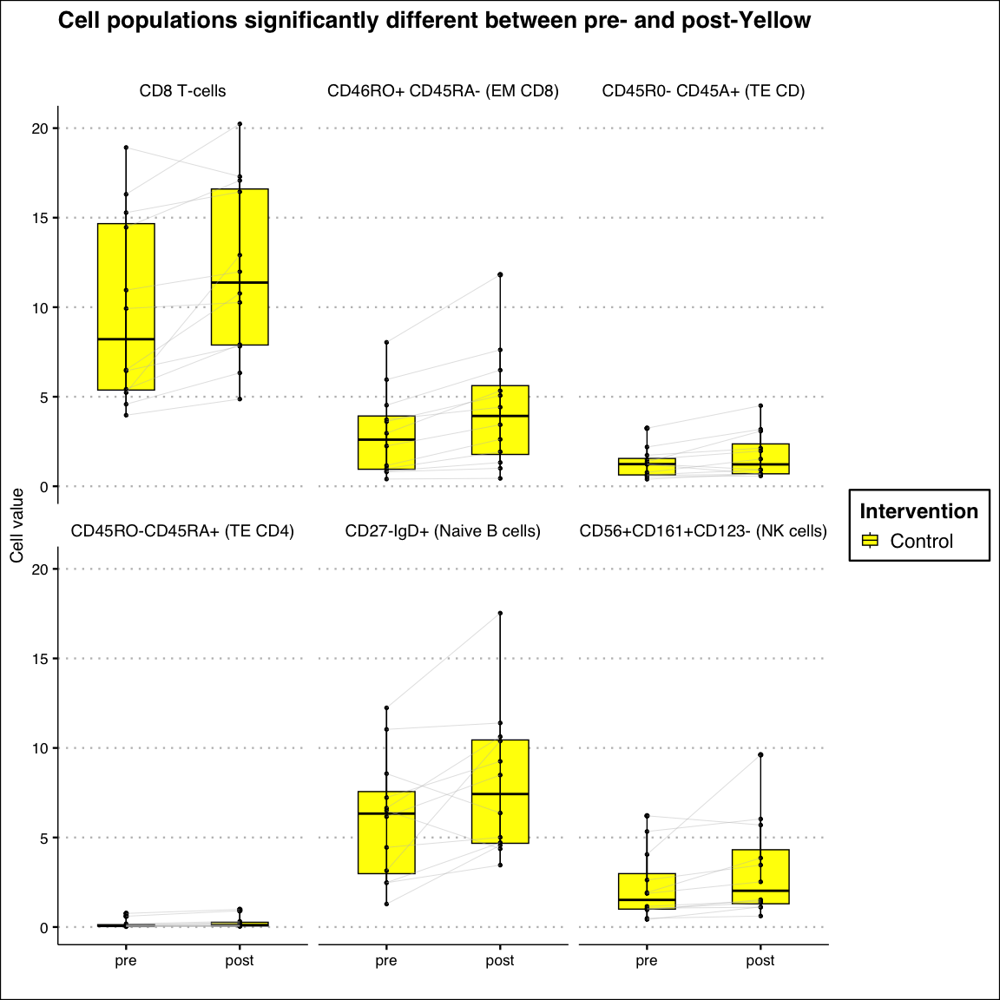<!-- -->

Let’s visualize boxplots with log2 transformed values

``` r
meta_log_cells_long %>% 
  filter(cell_type %in% sig_cells_yellow$cell_type) %>%
  filter(intervention == "Yellow") %>%
  ggpaired(x = "pre_post", y = "log2_cell_value", fill = "intervention", facet.by = "cell_type", short.panel.labs = FALSE, panel.labs = list(cell_type = c("CD8 T-cells","CD46RO+ CD45RA- (EM CD8)", "CD45R0- CD45A+ (TE CD)", "CD45RO-CD45RA+ (TE CD4)", "CD27-IgD+ (Naive B cells)", "CD56+CD161+CD123- (NK cells)"))) +
  scale_fill_manual(values = c("Yellow" = "yellow1",
                               "Red" = "tomato1"),
                    labels = c("Control"),
                    name = "Intervention") +
  geom_line(aes(group = patient_id), colour = "gray", size = 0.15) +
  theme_clean(base_size = 18, base_family = "sans") +
  labs(x = "",
       y = "Log2 transformed cell value",
       title = "Cell populations significantly different between pre- and post-Yellow",
       subtitle = "")
```

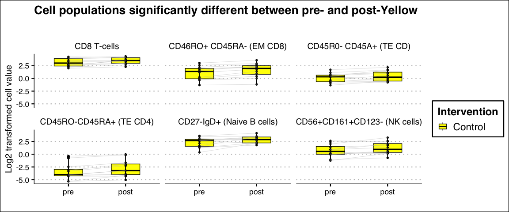<!-- -->

- All cells here are increasing, suggesting a significant increase

#### fold change

What is the avg fold change in the yellow intervention?

``` r
yellow_cells_subset <- meta_cells_long %>%
  filter(intervention == "Yellow") %>%
  filter(cell_type %in% sig_cells_yellow$cell_type)%>%
  select(patient_id, pre_post_intervention, cell_type, cell_value) %>%
  group_by(cell_type) %>%
  pivot_wider(names_from = pre_post_intervention,
              values_from = cell_value) %>%
  mutate(yellow_FC = post_Yellow/pre_Yellow)

yellow_cells_subset %>%
  summarize(mean_yellow_FC = mean(yellow_FC))
```

    ## # A tibble: 6 × 2
    ##   cell_type                     mean_yellow_FC
    ##   <chr>                                  <dbl>
    ## 1 x05_cd4_cd8_cd8_t_cells                 1.33
    ## 2 x08_cd45ro_cd45ra_em_cd8                1.52
    ## 3 x09_cd45r0_cd45ra_te_cd8                1.36
    ## 4 x15_cd45ro_cd45ra_te_cd4                1.60
    ## 5 x26_cd27_ig_d_naive_b_cells             1.62
    ## 6 x37_cd56_cd161_cd123_nk_cells           1.52

#### Correlation w/ carotenoids

``` r
correlation_cells_yellow <- meta_table_edited %>%  
  filter(intervention == "Yellow") %>%
  select(total_lyc, total_carotenoids, b_carotene, total_cis_lyc, a_carotene, lutein, zeaxanthin, b_cryptoxanthin, all_of(sig_cells_yellow$cell_type)) %>%
  correlate(method = "pearson")

kable(correlation_cells_yellow, format = "markdown", digits = 3)
```

| term                          | total_lyc | total_carotenoids | b_carotene | total_cis_lyc | a_carotene | lutein | zeaxanthin | b_cryptoxanthin | x05_cd4_cd8_cd8_t\_cells | x08_cd45ro_cd45ra_em_cd8 | x09_cd45r0_cd45ra_te_cd8 | x15_cd45ro_cd45ra_te_cd4 | x26_cd27_ig_d\_naive_b\_cells | x37_cd56_cd161_cd123_nk_cells |
|:------------------------------|----------:|------------------:|-----------:|--------------:|-----------:|-------:|-----------:|----------------:|-------------------------:|-------------------------:|-------------------------:|-------------------------:|------------------------------:|------------------------------:|
| total_lyc                     |        NA |             0.737 |      0.041 |         0.991 |     -0.186 | -0.056 |      0.039 |           0.757 |                   -0.290 |                   -0.124 |                   -0.292 |                    0.230 |                         0.280 |                        -0.152 |
| total_carotenoids             |     0.737 |                NA |      0.612 |         0.724 |      0.281 |  0.402 |      0.411 |           0.892 |                   -0.201 |                   -0.183 |                   -0.522 |                    0.086 |                         0.062 |                         0.071 |
| b_carotene                    |     0.041 |             0.612 |         NA |         0.019 |      0.473 |  0.289 |      0.328 |           0.343 |                    0.043 |                   -0.038 |                   -0.248 |                    0.008 |                        -0.204 |                         0.330 |
| total_cis_lyc                 |     0.991 |             0.724 |      0.019 |            NA |     -0.170 | -0.022 |      0.065 |           0.722 |                   -0.286 |                   -0.117 |                   -0.294 |                    0.257 |                         0.268 |                        -0.143 |
| a_carotene                    |    -0.186 |             0.281 |      0.473 |        -0.170 |         NA |  0.235 |      0.092 |           0.157 |                    0.312 |                   -0.136 |                   -0.472 |                   -0.055 |                        -0.176 |                         0.083 |
| lutein                        |    -0.056 |             0.402 |      0.289 |        -0.022 |      0.235 |     NA |      0.755 |           0.270 |                   -0.099 |                   -0.057 |                   -0.413 |                   -0.058 |                        -0.216 |                         0.254 |
| zeaxanthin                    |     0.039 |             0.411 |      0.328 |         0.065 |      0.092 |  0.755 |         NA |           0.253 |                   -0.156 |                   -0.064 |                   -0.207 |                    0.191 |                         0.065 |                         0.208 |
| b_cryptoxanthin               |     0.757 |             0.892 |      0.343 |         0.722 |      0.157 |  0.270 |      0.253 |              NA |                   -0.254 |                   -0.270 |                   -0.472 |                   -0.131 |                         0.165 |                        -0.138 |
| x05_cd4_cd8_cd8_t\_cells      |    -0.290 |            -0.201 |      0.043 |        -0.286 |      0.312 | -0.099 |     -0.156 |          -0.254 |                       NA |                    0.697 |                    0.169 |                    0.416 |                         0.224 |                        -0.153 |
| x08_cd45ro_cd45ra_em_cd8      |    -0.124 |            -0.183 |     -0.038 |        -0.117 |     -0.136 | -0.057 |     -0.064 |          -0.270 |                    0.697 |                       NA |                    0.031 |                    0.652 |                         0.330 |                        -0.137 |
| x09_cd45r0_cd45ra_te_cd8      |    -0.292 |            -0.522 |     -0.248 |        -0.294 |     -0.472 | -0.413 |     -0.207 |          -0.472 |                    0.169 |                    0.031 |                       NA |                   -0.035 |                        -0.070 |                         0.188 |
| x15_cd45ro_cd45ra_te_cd4      |     0.230 |             0.086 |      0.008 |         0.257 |     -0.055 | -0.058 |      0.191 |          -0.131 |                    0.416 |                    0.652 |                   -0.035 |                       NA |                         0.312 |                        -0.169 |
| x26_cd27_ig_d\_naive_b\_cells |     0.280 |             0.062 |     -0.204 |         0.268 |     -0.176 | -0.216 |      0.065 |           0.165 |                    0.224 |                    0.330 |                   -0.070 |                    0.312 |                            NA |                        -0.420 |
| x37_cd56_cd161_cd123_nk_cells |    -0.152 |             0.071 |      0.330 |        -0.143 |      0.083 |  0.254 |      0.208 |          -0.138 |                   -0.153 |                   -0.137 |                    0.188 |                   -0.169 |                        -0.420 |                            NA |

## Red treatment effects

### Normality check

``` r
shap_cells_red <- meta_cells_long %>%
  filter(cell_type != "x41_cd66b_mdsc_grans") %>%
  filter(intervention == "Red") %>%
  group_by(cell_type) %>%
  shapiro_test(cell_value)

kable(shap_cells_red, format = "markdown", digits = 3)
```

| cell_type                              | variable   | statistic |     p |
|:---------------------------------------|:-----------|----------:|------:|
| x01_cd45_cd66b_lymph_dc_mono           | cell_value |     0.877 | 0.007 |
| x02_cd45_cd66b_grans                   | cell_value |     0.599 | 0.000 |
| x03_cd3_cd45_cd3_t\_cells              | cell_value |     0.959 | 0.410 |
| x04_tc_rgd_cd3_ab_t\_cells             | cell_value |     0.956 | 0.362 |
| x05_cd4_cd8_cd8_t\_cells               | cell_value |     0.909 | 0.034 |
| x06_cd45ro_cd45ra_naive_cd8            | cell_value |     0.836 | 0.001 |
| x07_cd46ro_cd45ra_cm_cd8               | cell_value |     0.914 | 0.043 |
| x08_cd45ro_cd45ra_em_cd8               | cell_value |     0.885 | 0.011 |
| x09_cd45r0_cd45ra_te_cd8               | cell_value |     0.903 | 0.025 |
| x10_cd38_hladr_activated_cd8           | cell_value |     0.901 | 0.022 |
| x11_cd4_cd8_cd4_t\_cells               | cell_value |     0.960 | 0.440 |
| x12_cd45ro_cd45ra_naive_cd4            | cell_value |     0.898 | 0.020 |
| x13_cd45ro_cd45ra_cm_cd4               | cell_value |     0.884 | 0.010 |
| x14_cd45ro_cd45ra                      | cell_value |     0.932 | 0.108 |
| x15_cd45ro_cd45ra_te_cd4               | cell_value |     0.278 | 0.000 |
| x16_cd38_hladr_activated_cd4           | cell_value |     0.967 | 0.596 |
| x17_cd25_cd127_tregs                   | cell_value |     0.723 | 0.000 |
| x18_ccr4_cd4_total_ccr4_treg           | cell_value |     0.707 | 0.000 |
| x19_cd45ra_cd45ro_ccr4_treg_naive      | cell_value |     0.915 | 0.045 |
| x20_hladr_total_ccr4_treg_activated    | cell_value |     0.968 | 0.622 |
| x21_cd45ra_cd45ro_ccr4_treg_memory     | cell_value |     0.704 | 0.000 |
| x22_cxcr3_ccr6_th1                     | cell_value |     0.810 | 0.000 |
| x23_cxcr3_ccr6_th2                     | cell_value |     0.921 | 0.062 |
| x24_cxcr3_ccr6_th17                    | cell_value |     0.869 | 0.005 |
| x25_cd19_cd3_b\_cells                  | cell_value |     0.865 | 0.004 |
| x26_cd27_ig_d\_naive_b\_cells          | cell_value |     0.836 | 0.001 |
| x27_cd27_ig_d\_memory_b\_cells         | cell_value |     0.912 | 0.038 |
| x28_cd27_ig_d\_memory_resting_b\_cells | cell_value |     0.728 | 0.000 |
| x30_cd27_cd38_plasmablasts             | cell_value |     0.760 | 0.000 |
| x31_cd14_monocytes                     | cell_value |     0.893 | 0.015 |
| x32_cd16_non_classical_mono            | cell_value |     0.916 | 0.048 |
| x33_cd16_classical_mono                | cell_value |     0.892 | 0.014 |
| x34_hladr_cd56                         | cell_value |     0.904 | 0.026 |
| x35_cd16_cd123_cd11c_p\_dc             | cell_value |     0.938 | 0.146 |
| x36_cd16_cd123_cd11c_m\_dc             | cell_value |     0.886 | 0.011 |
| x37_cd56_cd161_cd123_nk_cells          | cell_value |     0.923 | 0.068 |
| x38_cd16_nk_cells                      | cell_value |     0.821 | 0.001 |
| x40_cd14_mdsc_mono                     | cell_value |     0.805 | 0.000 |

### Wilcoxon rank-sum

``` r
wilcox_cells_red <- meta_cells_long %>%
   filter(intervention == "Red") %>%
   filter(cell_type != "x41_cd66b_mdsc_grans") %>%
   group_by(cell_type) %>%
   wilcox_test(cell_value ~ pre_post, paired = TRUE, p.adjust.method = "BH")

kable(wilcox_cells_red, format = "markdown", digits = 3)
```

| cell_type                              | .y.        | group1 | group2 |  n1 |  n2 | statistic |     p |
|:---------------------------------------|:-----------|:-------|:-------|----:|----:|----------:|------:|
| x01_cd45_cd66b_lymph_dc_mono           | cell_value | pre    | post   |  12 |  12 |        63 | 0.064 |
| x02_cd45_cd66b_grans                   | cell_value | pre    | post   |  12 |  12 |        22 | 0.204 |
| x03_cd3_cd45_cd3_t\_cells              | cell_value | pre    | post   |  12 |  12 |        40 | 0.970 |
| x04_tc_rgd_cd3_ab_t\_cells             | cell_value | pre    | post   |  12 |  12 |        41 | 0.910 |
| x05_cd4_cd8_cd8_t\_cells               | cell_value | pre    | post   |  12 |  12 |        17 | 0.092 |
| x06_cd45ro_cd45ra_naive_cd8            | cell_value | pre    | post   |  12 |  12 |        33 | 0.677 |
| x07_cd46ro_cd45ra_cm_cd8               | cell_value | pre    | post   |  12 |  12 |        26 | 0.339 |
| x08_cd45ro_cd45ra_em_cd8               | cell_value | pre    | post   |  12 |  12 |        13 | 0.043 |
| x09_cd45r0_cd45ra_te_cd8               | cell_value | pre    | post   |  12 |  12 |        31 | 0.569 |
| x10_cd38_hladr_activated_cd8           | cell_value | pre    | post   |  12 |  12 |        44 | 0.733 |
| x11_cd4_cd8_cd4_t\_cells               | cell_value | pre    | post   |  12 |  12 |        44 | 0.733 |
| x12_cd45ro_cd45ra_naive_cd4            | cell_value | pre    | post   |  12 |  12 |        44 | 0.733 |
| x13_cd45ro_cd45ra_cm_cd4               | cell_value | pre    | post   |  12 |  12 |        49 | 0.470 |
| x14_cd45ro_cd45ra                      | cell_value | pre    | post   |  12 |  12 |        19 | 0.129 |
| x15_cd45ro_cd45ra_te_cd4               | cell_value | pre    | post   |  12 |  12 |        18 | 0.110 |
| x16_cd38_hladr_activated_cd4           | cell_value | pre    | post   |  12 |  12 |        52 | 0.339 |
| x17_cd25_cd127_tregs                   | cell_value | pre    | post   |  12 |  12 |        50 | 0.424 |
| x18_ccr4_cd4_total_ccr4_treg           | cell_value | pre    | post   |  12 |  12 |        45 | 0.677 |
| x19_cd45ra_cd45ro_ccr4_treg_naive      | cell_value | pre    | post   |  12 |  12 |        45 | 0.677 |
| x20_hladr_total_ccr4_treg_activated    | cell_value | pre    | post   |  12 |  12 |        42 | 0.850 |
| x21_cd45ra_cd45ro_ccr4_treg_memory     | cell_value | pre    | post   |  12 |  12 |        48 | 0.519 |
| x22_cxcr3_ccr6_th1                     | cell_value | pre    | post   |  12 |  12 |        28 | 0.424 |
| x23_cxcr3_ccr6_th2                     | cell_value | pre    | post   |  12 |  12 |        51 | 0.380 |
| x24_cxcr3_ccr6_th17                    | cell_value | pre    | post   |  12 |  12 |        41 | 0.910 |
| x25_cd19_cd3_b\_cells                  | cell_value | pre    | post   |  12 |  12 |         5 | 0.005 |
| x26_cd27_ig_d\_naive_b\_cells          | cell_value | pre    | post   |  12 |  12 |         9 | 0.016 |
| x27_cd27_ig_d\_memory_b\_cells         | cell_value | pre    | post   |  12 |  12 |        24 | 0.266 |
| x28_cd27_ig_d\_memory_resting_b\_cells | cell_value | pre    | post   |  12 |  12 |        16 | 0.077 |
| x30_cd27_cd38_plasmablasts             | cell_value | pre    | post   |  12 |  12 |        49 | 0.470 |
| x31_cd14_monocytes                     | cell_value | pre    | post   |  12 |  12 |        43 | 0.791 |
| x32_cd16_non_classical_mono            | cell_value | pre    | post   |  12 |  12 |        49 | 0.470 |
| x33_cd16_classical_mono                | cell_value | pre    | post   |  12 |  12 |        39 | 1.000 |
| x34_hladr_cd56                         | cell_value | pre    | post   |  12 |  12 |        43 | 0.791 |
| x35_cd16_cd123_cd11c_p\_dc             | cell_value | pre    | post   |  12 |  12 |        51 | 0.380 |
| x36_cd16_cd123_cd11c_m\_dc             | cell_value | pre    | post   |  12 |  12 |        39 | 1.000 |
| x37_cd56_cd161_cd123_nk_cells          | cell_value | pre    | post   |  12 |  12 |        43 | 0.791 |
| x38_cd16_nk_cells                      | cell_value | pre    | post   |  12 |  12 |        49 | 0.470 |
| x40_cd14_mdsc_mono                     | cell_value | pre    | post   |  12 |  12 |        48 | 0.519 |

``` r
# extract statistically significant cytokines 
(sig_cells_red <- wilcox_cells_red %>%
  filter(wilcox_cells_red$p < 0.05))
```

    ## # A tibble: 3 × 8
    ##   cell_type                   .y.    group1 group2    n1    n2 statistic       p
    ##   <chr>                       <chr>  <chr>  <chr>  <int> <int>     <dbl>   <dbl>
    ## 1 x08_cd45ro_cd45ra_em_cd8    cell_… pre    post      12    12        13 0.0425 
    ## 2 x25_cd19_cd3_b_cells        cell_… pre    post      12    12         5 0.00488
    ## 3 x26_cd27_ig_d_naive_b_cells cell_… pre    post      12    12         9 0.0161

### Sig cells

#### boxplots

``` r
meta_cells_long %>% 
  filter(cell_type %in% sig_cells_red$cell_type) %>%
  filter(intervention == "Red") %>%
  ggpaired(x = "pre_post", y = "cell_value", fill = "intervention", facet.by = "cell_type", short.panel.labs = FALSE, panel.labs = list(cell_type = c("CD46RO+ CD45RA- (EM CD8)", "CD19+ CD3- B-cells", "CD27-IgD+ (Naive B cells)"))) +
  scale_fill_manual(values = c("Yellow" = "yellow1",
                               "Red" = "tomato1"),
                    labels = c("Tomato-soy"),
                    name = "Intervention") +
  geom_line(aes(group = patient_id), colour = "gray", size = 0.15) +
  theme_clean(base_size = 18, base_family = "sans") +
  labs(x = "",
       y = "Cell value",
       title = "Cell populations significantly different between pre- and post-Red",
       subtitle = "")
```

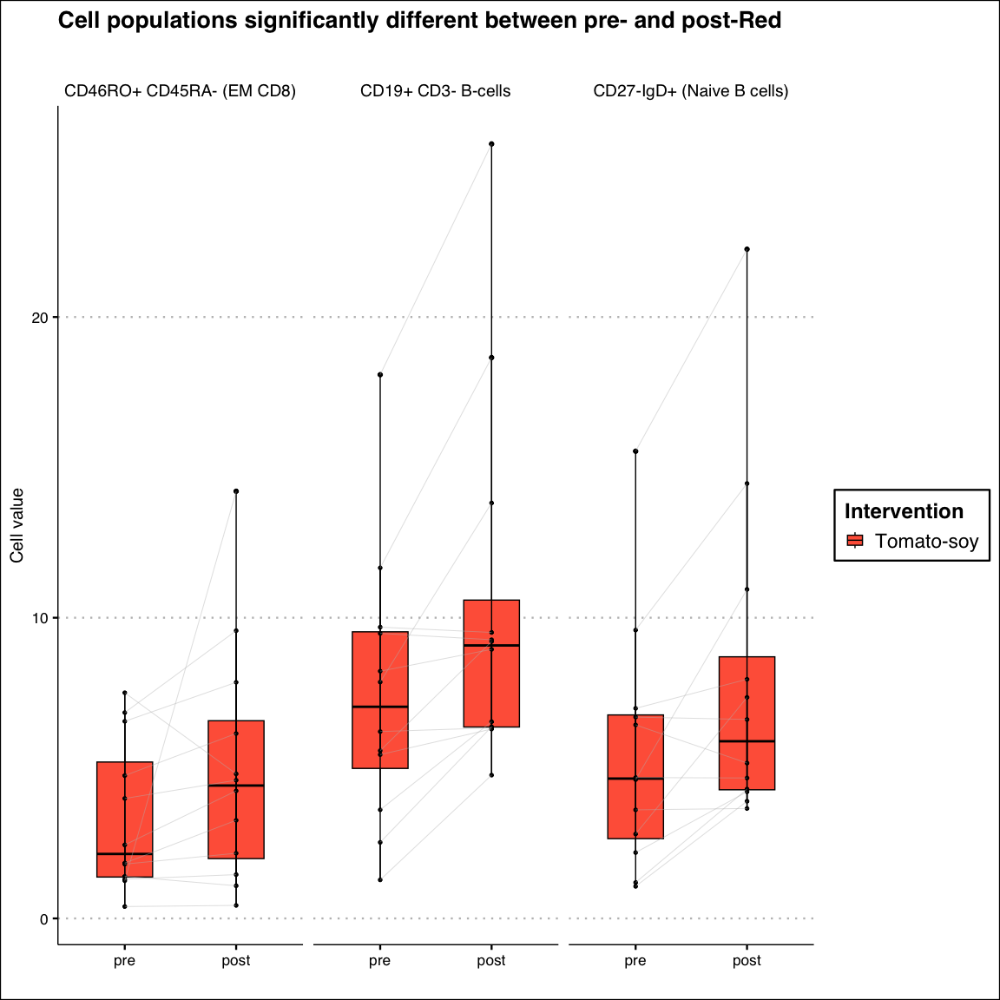<!-- -->

- All cells here are increasing, suggesting a significant increase

#### fold change

What is the avg fold change in the yellow intervention?

``` r
red_cells_subset <- meta_cells_long %>%
  filter(intervention == "Red") %>%
  filter(cell_type %in% sig_cells_red$cell_type)%>%
  select(patient_id, pre_post_intervention, cell_type, cell_value) %>%
  group_by(cell_type) %>%
  pivot_wider(names_from = pre_post_intervention,
              values_from = cell_value) %>%
  mutate(red_FC = post_Red/pre_Red)

red_cells_subset %>%
  summarize(mean_red_FC = mean(red_FC))
```

    ## # A tibble: 3 × 2
    ##   cell_type                   mean_red_FC
    ##   <chr>                             <dbl>
    ## 1 x08_cd45ro_cd45ra_em_cd8           2.06
    ## 2 x25_cd19_cd3_b_cells               1.64
    ## 3 x26_cd27_ig_d_naive_b_cells        1.84

## Correlation w/ carotenoids

``` r
correlation_cells_red <- meta_table_edited %>%
  filter(intervention == "Red") %>%
  select(total_lyc, total_cis_lyc, total_carotenoids, b_carotene, total_cis_lyc, a_carotene, lutein, zeaxanthin, b_cryptoxanthin, all_of(sig_cells_red$cell_type)) %>%
  correlate(method = "pearson")

kable(correlation_cells_red, format = "markdown", digits = 3)
```

| term                          | total_lyc | total_cis_lyc | total_carotenoids | b_carotene | a_carotene | lutein | zeaxanthin | b_cryptoxanthin | x08_cd45ro_cd45ra_em_cd8 | x25_cd19_cd3_b\_cells | x26_cd27_ig_d\_naive_b\_cells |
|:------------------------------|----------:|--------------:|------------------:|-----------:|-----------:|-------:|-----------:|----------------:|-------------------------:|----------------------:|------------------------------:|
| total_lyc                     |        NA |         0.968 |             0.801 |      0.200 |      0.033 |  0.370 |     -0.094 |           0.257 |                    0.110 |                 0.357 |                         0.343 |
| total_cis_lyc                 |     0.968 |            NA |             0.805 |      0.280 |      0.071 |  0.395 |     -0.097 |           0.190 |                    0.107 |                 0.325 |                         0.323 |
| total_carotenoids             |     0.801 |         0.805 |                NA |      0.679 |      0.455 |  0.784 |      0.202 |           0.420 |                    0.291 |                 0.008 |                        -0.007 |
| b_carotene                    |     0.200 |         0.280 |             0.679 |         NA |      0.531 |  0.740 |      0.312 |           0.068 |                    0.469 |                -0.270 |                        -0.272 |
| a_carotene                    |     0.033 |         0.071 |             0.455 |      0.531 |         NA |  0.655 |      0.486 |           0.122 |                    0.077 |                -0.553 |                        -0.530 |
| lutein                        |     0.370 |         0.395 |             0.784 |      0.740 |      0.655 |     NA |      0.309 |           0.231 |                    0.442 |                -0.345 |                        -0.338 |
| zeaxanthin                    |    -0.094 |        -0.097 |             0.202 |      0.312 |      0.486 |  0.309 |         NA |           0.089 |                    0.188 |                -0.122 |                        -0.038 |
| b_cryptoxanthin               |     0.257 |         0.190 |             0.420 |      0.068 |      0.122 |  0.231 |      0.089 |              NA |                   -0.200 |                -0.001 |                        -0.068 |
| x08_cd45ro_cd45ra_em_cd8      |     0.110 |         0.107 |             0.291 |      0.469 |      0.077 |  0.442 |      0.188 |          -0.200 |                       NA |                 0.218 |                         0.243 |
| x25_cd19_cd3_b\_cells         |     0.357 |         0.325 |             0.008 |     -0.270 |     -0.553 | -0.345 |     -0.122 |          -0.001 |                    0.218 |                    NA |                         0.986 |
| x26_cd27_ig_d\_naive_b\_cells |     0.343 |         0.323 |            -0.007 |     -0.272 |     -0.530 | -0.338 |     -0.038 |          -0.068 |                    0.243 |                 0.986 |                            NA |

- slightly negative correlation between two cell types and
  alpha-carotene. no strong correlations between cell types and
  lycopene. hmm.

### Corr scatterplots

Even though the correlations between lycopene levels and immune cell
types are weak according to Pearson, I want to visualize trends in red
and yellow interventions.

``` r
meta_cells_long %>%
  filter(cell_type %in% sig_cells_red$cell_type) %>%
  ggplot(aes(x = total_lyc, y = cell_value, color = intervention)) +
  geom_point() +
  scale_color_manual(values = c("Yellow" = "yellow3",
                                "Red" = "red")) +
  theme_bw() +
  facet_wrap(vars(cell_type), scales = "free")
```

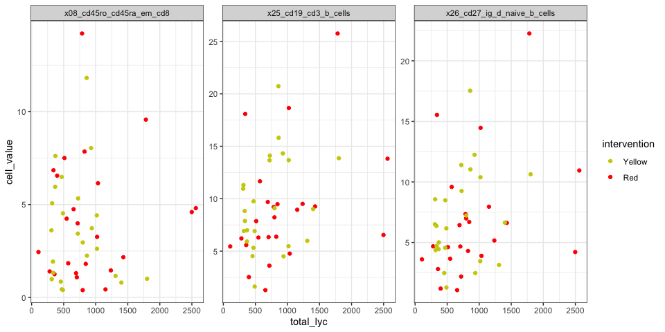<!-- -->

Since there are strong correlations between 2 of the immune cells (the
b-cells) and alpha-carotene, let’s see what those trends look like in
both interventions.

``` r
meta_cells_long %>%
  filter(cell_type %in% sig_cells_red$cell_type) %>%
  ggplot(aes(x = a_carotene, y = cell_value, color = intervention)) +
  geom_point() +
  scale_color_manual(values = c("Yellow" = "yellow3",
                                "Red" = "red")) +
  theme_bw() +
  facet_wrap(vars(cell_type), scales = "free")
```

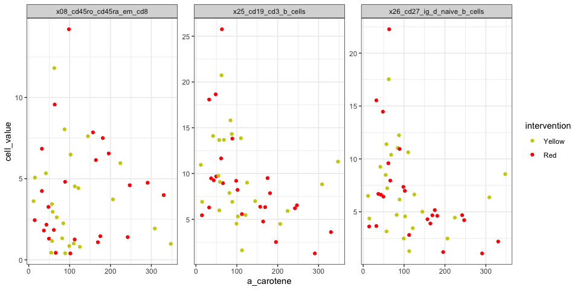<!-- -->

What about for total carotenoid levels?

``` r
meta_cells_long %>%
  filter(cell_type %in% sig_cells_red$cell_type) %>%
  ggplot(aes(x = total_carotenoids, y = cell_value, color = intervention)) +
  geom_point() +
  scale_color_manual(values = c("Yellow" = "yellow3",
                                "Red" = "red")) +
  theme_bw() +
  facet_wrap(vars(cell_type), scales = "free")
```

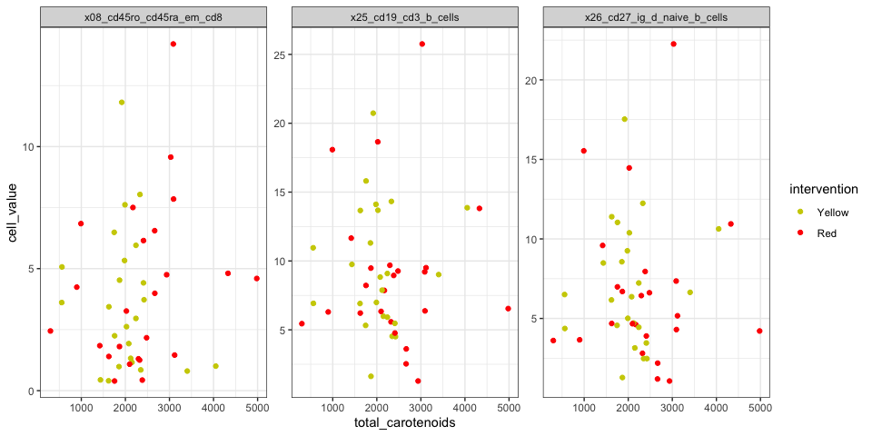<!-- -->

# Overall correlations?

Let’s look at the correlation between the immune cells, cytokines, and
carotenoids. We’ll look at all of the significant outcomes in all
comparisons (post-Red vs post-Yellow, pre vs post Red, pre vs post
Yellow)

## Intervention comparison

``` r
correlation_overall_intervention <- meta_table_edited %>%
  filter(pre_post == "post") %>%
  select(total_lyc, total_cis_lyc, total_carotenoids, b_carotene, total_cis_lyc, a_carotene, lutein, zeaxanthin, b_cryptoxanthin, all_of(sig_cells_red$cell_type), all_of(sig_cells_intervention$cell_type), all_of(sig_cells_yellow$cell_type), all_of(sig_cytokines_red$cytokines)) %>%
  correlate(method = "pearson")

kable(correlation_overall_intervention, format = "markdown", digits = 3)
```

| term                          | total_lyc | total_cis_lyc | total_carotenoids | b_carotene | a_carotene | lutein | zeaxanthin | b_cryptoxanthin | x08_cd45ro_cd45ra_em_cd8 | x25_cd19_cd3_b\_cells | x26_cd27_ig_d\_naive_b\_cells | x37_cd56_cd161_cd123_nk_cells | x38_cd16_nk_cells | x40_cd14_mdsc_mono | x05_cd4_cd8_cd8_t\_cells | x09_cd45r0_cd45ra_te_cd8 | x15_cd45ro_cd45ra_te_cd4 | il_12p70 |   il_5 | gm_csf |
|:------------------------------|----------:|--------------:|------------------:|-----------:|-----------:|-------:|-----------:|----------------:|-------------------------:|----------------------:|------------------------------:|------------------------------:|------------------:|-------------------:|-------------------------:|-------------------------:|-------------------------:|---------:|-------:|-------:|
| total_lyc                     |        NA |         0.968 |             0.857 |      0.224 |      0.128 |  0.381 |     -0.149 |           0.572 |                   -0.009 |                 0.316 |                         0.307 |                         0.130 |            -0.364 |              0.185 |                   -0.151 |                   -0.303 |                   -0.027 |   -0.037 |  0.328 |  0.060 |
| total_cis_lyc                 |     0.968 |            NA |             0.855 |      0.299 |      0.162 |  0.400 |     -0.171 |           0.517 |                   -0.017 |                 0.287 |                         0.290 |                         0.180 |            -0.363 |              0.198 |                   -0.146 |                   -0.292 |                   -0.016 |    0.067 |  0.420 |  0.160 |
| total_carotenoids             |     0.857 |         0.855 |                NA |      0.633 |      0.451 |  0.689 |      0.113 |           0.703 |                    0.077 |                 0.116 |                         0.104 |                         0.176 |            -0.228 |              0.133 |                   -0.074 |                   -0.461 |                    0.177 |   -0.120 |  0.322 | -0.118 |
| b_carotene                    |     0.224 |         0.299 |             0.633 |         NA |      0.573 |  0.565 |      0.175 |           0.247 |                    0.326 |                -0.193 |                        -0.192 |                         0.280 |            -0.125 |              0.136 |                    0.226 |                   -0.280 |                    0.508 |   -0.216 |  0.163 | -0.304 |
| a_carotene                    |     0.128 |         0.162 |             0.451 |      0.573 |         NA |  0.476 |      0.041 |           0.252 |                   -0.082 |                -0.368 |                        -0.366 |                         0.261 |             0.285 |              0.023 |                    0.221 |                   -0.470 |                   -0.006 |   -0.213 |  0.211 | -0.309 |
| lutein                        |     0.381 |         0.400 |             0.689 |      0.565 |      0.476 |     NA |      0.427 |           0.395 |                    0.136 |                -0.204 |                        -0.201 |                         0.073 |             0.164 |             -0.118 |                   -0.030 |                   -0.372 |                    0.234 |    0.013 |  0.488 | -0.058 |
| zeaxanthin                    |    -0.149 |        -0.171 |             0.113 |      0.175 |      0.041 |  0.427 |         NA |           0.254 |                    0.071 |                 0.127 |                         0.156 |                        -0.175 |             0.229 |             -0.321 |                   -0.059 |                   -0.180 |                    0.173 |    0.264 | -0.130 |  0.152 |
| b_cryptoxanthin               |     0.572 |         0.517 |             0.703 |      0.247 |      0.252 |  0.395 |      0.254 |              NA |                   -0.203 |                 0.192 |                         0.141 |                        -0.084 |            -0.090 |              0.018 |                   -0.327 |                   -0.484 |                   -0.043 |   -0.134 | -0.101 | -0.184 |
| x08_cd45ro_cd45ra_em_cd8      |    -0.009 |        -0.017 |             0.077 |      0.326 |     -0.082 |  0.136 |      0.071 |          -0.203 |                       NA |                 0.248 |                         0.285 |                        -0.169 |            -0.001 |             -0.057 |                    0.682 |                    0.037 |                    0.619 |   -0.280 |  0.063 | -0.254 |
| x25_cd19_cd3_b\_cells         |     0.316 |         0.287 |             0.116 |     -0.193 |     -0.368 | -0.204 |      0.127 |           0.192 |                    0.248 |                    NA |                         0.984 |                        -0.390 |            -0.338 |             -0.194 |                    0.032 |                   -0.095 |                   -0.020 |    0.054 | -0.119 |  0.103 |
| x26_cd27_ig_d\_naive_b\_cells |     0.307 |         0.290 |             0.104 |     -0.192 |     -0.366 | -0.201 |      0.156 |           0.141 |                    0.285 |                 0.984 |                            NA |                        -0.385 |            -0.289 |             -0.214 |                    0.055 |                   -0.092 |                    0.007 |    0.144 | -0.103 |  0.185 |
| x37_cd56_cd161_cd123_nk_cells |     0.130 |         0.180 |             0.176 |      0.280 |      0.261 |  0.073 |     -0.175 |          -0.084 |                   -0.169 |                -0.390 |                        -0.385 |                            NA |             0.090 |              0.824 |                   -0.233 |                    0.030 |                   -0.185 |   -0.028 |  0.178 |  0.178 |
| x38_cd16_nk_cells             |    -0.364 |        -0.363 |            -0.228 |     -0.125 |      0.285 |  0.164 |      0.229 |          -0.090 |                   -0.001 |                -0.338 |                        -0.289 |                         0.090 |                NA |             -0.057 |                    0.077 |                   -0.073 |                   -0.197 |   -0.082 |  0.198 |  0.013 |
| x40_cd14_mdsc_mono            |     0.185 |         0.198 |             0.133 |      0.136 |      0.023 | -0.118 |     -0.321 |           0.018 |                   -0.057 |                -0.194 |                        -0.214 |                         0.824 |            -0.057 |                 NA |                   -0.249 |                   -0.058 |                   -0.060 |   -0.099 | -0.033 |  0.126 |
| x05_cd4_cd8_cd8_t\_cells      |    -0.151 |        -0.146 |            -0.074 |      0.226 |      0.221 | -0.030 |     -0.059 |          -0.327 |                    0.682 |                 0.032 |                         0.055 |                        -0.233 |             0.077 |             -0.249 |                       NA |                    0.146 |                    0.340 |   -0.422 | -0.079 | -0.404 |
| x09_cd45r0_cd45ra_te_cd8      |    -0.303 |        -0.292 |            -0.461 |     -0.280 |     -0.470 | -0.372 |     -0.180 |          -0.484 |                    0.037 |                -0.095 |                        -0.092 |                         0.030 |            -0.073 |             -0.058 |                    0.146 |                       NA |                    0.019 |    0.110 | -0.027 |  0.273 |
| x15_cd45ro_cd45ra_te_cd4      |    -0.027 |        -0.016 |             0.177 |      0.508 |     -0.006 |  0.234 |      0.173 |          -0.043 |                    0.619 |                -0.020 |                         0.007 |                        -0.185 |            -0.197 |             -0.060 |                    0.340 |                    0.019 |                       NA |   -0.113 | -0.074 | -0.109 |
| il_12p70                      |    -0.037 |         0.067 |            -0.120 |     -0.216 |     -0.213 |  0.013 |      0.264 |          -0.134 |                   -0.280 |                 0.054 |                         0.144 |                        -0.028 |            -0.082 |             -0.099 |                   -0.422 |                    0.110 |                   -0.113 |       NA |  0.150 |  0.877 |
| il_5                          |     0.328 |         0.420 |             0.322 |      0.163 |      0.211 |  0.488 |     -0.130 |          -0.101 |                    0.063 |                -0.119 |                        -0.103 |                         0.178 |             0.198 |             -0.033 |                   -0.079 |                   -0.027 |                   -0.074 |    0.150 |     NA |  0.215 |
| gm_csf                        |     0.060 |         0.160 |            -0.118 |     -0.304 |     -0.309 | -0.058 |      0.152 |          -0.184 |                   -0.254 |                 0.103 |                         0.185 |                         0.178 |             0.013 |              0.126 |                   -0.404 |                    0.273 |                   -0.109 |    0.877 |  0.215 |     NA |

## Yellow

``` r
correlation_overall_yellow <- meta_table_edited %>%
  filter(intervention == "Yellow") %>%
  select(total_lyc, total_cis_lyc, total_carotenoids, b_carotene, total_cis_lyc, a_carotene, lutein, zeaxanthin, b_cryptoxanthin, all_of(sig_cells_red$cell_type), all_of(sig_cells_intervention$cell_type), all_of(sig_cells_yellow$cell_type), all_of(sig_cytokines_red$cytokines)) %>%
  correlate(method = "pearson")

kable(correlation_overall_yellow, format = "markdown", digits = 3)
```

| term                          | total_lyc | total_cis_lyc | total_carotenoids | b_carotene | a_carotene | lutein | zeaxanthin | b_cryptoxanthin | x08_cd45ro_cd45ra_em_cd8 | x25_cd19_cd3_b\_cells | x26_cd27_ig_d\_naive_b\_cells | x37_cd56_cd161_cd123_nk_cells | x38_cd16_nk_cells | x40_cd14_mdsc_mono | x05_cd4_cd8_cd8_t\_cells | x09_cd45r0_cd45ra_te_cd8 | x15_cd45ro_cd45ra_te_cd4 | il_12p70 |   il_5 | gm_csf |
|:------------------------------|----------:|--------------:|------------------:|-----------:|-----------:|-------:|-----------:|----------------:|-------------------------:|----------------------:|------------------------------:|------------------------------:|------------------:|-------------------:|-------------------------:|-------------------------:|-------------------------:|---------:|-------:|-------:|
| total_lyc                     |        NA |         0.991 |             0.737 |      0.041 |     -0.186 | -0.056 |      0.039 |           0.757 |                   -0.124 |                 0.297 |                         0.280 |                        -0.152 |            -0.121 |              0.211 |                   -0.290 |                   -0.292 |                    0.230 |   -0.116 |  0.085 |  0.014 |
| total_cis_lyc                 |     0.991 |            NA |             0.724 |      0.019 |     -0.170 | -0.022 |      0.065 |           0.722 |                   -0.117 |                 0.280 |                         0.268 |                        -0.143 |            -0.112 |              0.243 |                   -0.286 |                   -0.294 |                    0.257 |   -0.070 |  0.150 |  0.065 |
| total_carotenoids             |     0.737 |         0.724 |                NA |      0.612 |      0.281 |  0.402 |      0.411 |           0.892 |                   -0.183 |                 0.040 |                         0.062 |                         0.071 |            -0.031 |              0.016 |                   -0.201 |                   -0.522 |                    0.086 |   -0.151 |  0.026 | -0.144 |
| b_carotene                    |     0.041 |         0.019 |             0.612 |         NA |      0.473 |  0.289 |      0.328 |           0.343 |                   -0.038 |                -0.229 |                        -0.204 |                         0.330 |             0.060 |             -0.139 |                    0.043 |                   -0.248 |                    0.008 |   -0.254 | -0.093 | -0.336 |
| a_carotene                    |    -0.186 |        -0.170 |             0.281 |      0.473 |         NA |  0.235 |      0.092 |           0.157 |                   -0.136 |                -0.207 |                        -0.176 |                         0.083 |             0.166 |              0.073 |                    0.312 |                   -0.472 |                   -0.055 |   -0.123 |  0.045 | -0.209 |
| lutein                        |    -0.056 |        -0.022 |             0.402 |      0.289 |      0.235 |     NA |      0.755 |           0.270 |                   -0.057 |                -0.273 |                        -0.216 |                         0.254 |             0.120 |             -0.199 |                   -0.099 |                   -0.413 |                   -0.058 |    0.155 |  0.138 |  0.074 |
| zeaxanthin                    |     0.039 |         0.065 |             0.411 |      0.328 |      0.092 |  0.755 |         NA |           0.253 |                   -0.064 |                -0.002 |                         0.065 |                         0.208 |            -0.072 |             -0.180 |                   -0.156 |                   -0.207 |                    0.191 |    0.321 |  0.262 |  0.249 |
| b_cryptoxanthin               |     0.757 |         0.722 |             0.892 |      0.343 |      0.157 |  0.270 |      0.253 |              NA |                   -0.270 |                 0.146 |                         0.165 |                        -0.138 |            -0.096 |             -0.044 |                   -0.254 |                   -0.472 |                   -0.131 |   -0.081 | -0.115 | -0.103 |
| x08_cd45ro_cd45ra_em_cd8      |    -0.124 |        -0.117 |            -0.183 |     -0.038 |     -0.136 | -0.057 |     -0.064 |          -0.270 |                       NA |                 0.279 |                         0.330 |                        -0.137 |             0.083 |             -0.051 |                    0.697 |                    0.031 |                    0.652 |   -0.244 |  0.051 | -0.249 |
| x25_cd19_cd3_b\_cells         |     0.297 |         0.280 |             0.040 |     -0.229 |     -0.207 | -0.273 |     -0.002 |           0.146 |                    0.279 |                    NA |                         0.972 |                        -0.406 |            -0.555 |             -0.309 |                    0.218 |                   -0.025 |                    0.269 |   -0.068 | -0.273 | -0.074 |
| x26_cd27_ig_d\_naive_b\_cells |     0.280 |         0.268 |             0.062 |     -0.204 |     -0.176 | -0.216 |      0.065 |           0.165 |                    0.330 |                 0.972 |                            NA |                        -0.420 |            -0.489 |             -0.370 |                    0.224 |                   -0.070 |                    0.312 |    0.038 | -0.243 |  0.023 |
| x37_cd56_cd161_cd123_nk_cells |    -0.152 |        -0.143 |             0.071 |      0.330 |      0.083 |  0.254 |      0.208 |          -0.138 |                   -0.137 |                -0.406 |                        -0.420 |                            NA |             0.469 |             -0.059 |                   -0.153 |                    0.188 |                   -0.169 |   -0.174 | -0.034 | -0.023 |
| x38_cd16_nk_cells             |    -0.121 |        -0.112 |            -0.031 |      0.060 |      0.166 |  0.120 |     -0.072 |          -0.096 |                    0.083 |                -0.555 |                        -0.489 |                         0.469 |                NA |             -0.012 |                   -0.122 |                   -0.184 |                   -0.038 |    0.005 |  0.096 |  0.096 |
| x40_cd14_mdsc_mono            |     0.211 |         0.243 |             0.016 |     -0.139 |      0.073 | -0.199 |     -0.180 |          -0.044 |                   -0.051 |                -0.309 |                        -0.370 |                        -0.059 |            -0.012 |                 NA |                    0.071 |                    0.207 |                    0.297 |   -0.136 |  0.685 | -0.043 |
| x05_cd4_cd8_cd8_t\_cells      |    -0.290 |        -0.286 |            -0.201 |      0.043 |      0.312 | -0.099 |     -0.156 |          -0.254 |                    0.697 |                 0.218 |                         0.224 |                        -0.153 |            -0.122 |              0.071 |                       NA |                    0.169 |                    0.416 |   -0.336 | -0.134 | -0.361 |
| x09_cd45r0_cd45ra_te_cd8      |    -0.292 |        -0.294 |            -0.522 |     -0.248 |     -0.472 | -0.413 |     -0.207 |          -0.472 |                    0.031 |                -0.025 |                        -0.070 |                         0.188 |            -0.184 |              0.207 |                    0.169 |                       NA |                   -0.035 |    0.083 |  0.002 |  0.174 |
| x15_cd45ro_cd45ra_te_cd4      |     0.230 |         0.257 |             0.086 |      0.008 |     -0.055 | -0.058 |      0.191 |          -0.131 |                    0.652 |                 0.269 |                         0.312 |                        -0.169 |            -0.038 |              0.297 |                    0.416 |                   -0.035 |                       NA |   -0.079 |  0.466 | -0.025 |
| il_12p70                      |    -0.116 |        -0.070 |            -0.151 |     -0.254 |     -0.123 |  0.155 |      0.321 |          -0.081 |                   -0.244 |                -0.068 |                         0.038 |                        -0.174 |             0.005 |             -0.136 |                   -0.336 |                    0.083 |                   -0.079 |       NA |  0.423 |  0.944 |
| il_5                          |     0.085 |         0.150 |             0.026 |     -0.093 |      0.045 |  0.138 |      0.262 |          -0.115 |                    0.051 |                -0.273 |                        -0.243 |                        -0.034 |             0.096 |              0.685 |                   -0.134 |                    0.002 |                    0.466 |    0.423 |     NA |  0.429 |
| gm_csf                        |     0.014 |         0.065 |            -0.144 |     -0.336 |     -0.209 |  0.074 |      0.249 |          -0.103 |                   -0.249 |                -0.074 |                         0.023 |                        -0.023 |             0.096 |             -0.043 |                   -0.361 |                    0.174 |                   -0.025 |    0.944 |  0.429 |     NA |

## Red

``` r
correlation_overall_red <- meta_table_edited %>%
  filter(intervention == "Red") %>%
  select(total_lyc, total_cis_lyc, total_carotenoids, b_carotene, total_cis_lyc, a_carotene, lutein, zeaxanthin, b_cryptoxanthin, all_of(sig_cells_red$cell_type), all_of(sig_cells_intervention$cell_type), all_of(sig_cells_yellow$cell_type), all_of(sig_cytokines_red$cytokines)) %>%
  correlate(method = "pearson")

kable(correlation_overall_red, format = "markdown", digits = 3)
```

| term                          | total_lyc | total_cis_lyc | total_carotenoids | b_carotene | a_carotene | lutein | zeaxanthin | b_cryptoxanthin | x08_cd45ro_cd45ra_em_cd8 | x25_cd19_cd3_b\_cells | x26_cd27_ig_d\_naive_b\_cells | x37_cd56_cd161_cd123_nk_cells | x38_cd16_nk_cells | x40_cd14_mdsc_mono | x05_cd4_cd8_cd8_t\_cells | x09_cd45r0_cd45ra_te_cd8 | x15_cd45ro_cd45ra_te_cd4 | il_12p70 |   il_5 | gm_csf |
|:------------------------------|----------:|--------------:|------------------:|-----------:|-----------:|-------:|-----------:|----------------:|-------------------------:|----------------------:|------------------------------:|------------------------------:|------------------:|-------------------:|-------------------------:|-------------------------:|-------------------------:|---------:|-------:|-------:|
| total_lyc                     |        NA |         0.968 |             0.801 |      0.200 |      0.033 |  0.370 |     -0.094 |           0.257 |                    0.110 |                 0.357 |                         0.343 |                        -0.056 |            -0.078 |             -0.045 |                   -0.063 |                   -0.075 |                    0.003 |    0.002 |  0.218 |  0.077 |
| total_cis_lyc                 |     0.968 |            NA |             0.805 |      0.280 |      0.071 |  0.395 |     -0.097 |           0.190 |                    0.107 |                 0.325 |                         0.323 |                        -0.008 |            -0.051 |             -0.047 |                   -0.061 |                   -0.014 |                    0.014 |    0.075 |  0.299 |  0.156 |
| total_carotenoids             |     0.801 |         0.805 |                NA |      0.679 |      0.455 |  0.784 |      0.202 |           0.420 |                    0.291 |                 0.008 |                        -0.007 |                         0.178 |             0.108 |              0.077 |                    0.009 |                   -0.114 |                    0.192 |   -0.123 |  0.305 | -0.118 |
| b_carotene                    |     0.200 |         0.280 |             0.679 |         NA |      0.531 |  0.740 |      0.312 |           0.068 |                    0.469 |                -0.270 |                        -0.272 |                         0.291 |             0.194 |              0.094 |                    0.213 |                    0.104 |                    0.452 |   -0.184 |  0.206 | -0.274 |
| a_carotene                    |     0.033 |         0.071 |             0.455 |      0.531 |         NA |  0.655 |      0.486 |           0.122 |                    0.077 |                -0.553 |                        -0.530 |                         0.367 |             0.318 |              0.019 |                    0.219 |                   -0.267 |                   -0.028 |   -0.118 |  0.489 | -0.231 |
| lutein                        |     0.370 |         0.395 |             0.784 |      0.740 |      0.655 |     NA |      0.309 |           0.231 |                    0.442 |                -0.345 |                        -0.338 |                         0.249 |             0.147 |              0.163 |                    0.169 |                   -0.099 |                    0.235 |   -0.232 |  0.329 | -0.264 |
| zeaxanthin                    |    -0.094 |        -0.097 |             0.202 |      0.312 |      0.486 |  0.309 |         NA |           0.089 |                    0.188 |                -0.122 |                        -0.038 |                         0.189 |             0.210 |             -0.067 |                    0.032 |                   -0.115 |                    0.203 |    0.384 |  0.209 |  0.287 |
| b_cryptoxanthin               |     0.257 |         0.190 |             0.420 |      0.068 |      0.122 |  0.231 |      0.089 |              NA |                   -0.200 |                -0.001 |                        -0.068 |                         0.146 |             0.141 |              0.234 |                   -0.432 |                   -0.316 |                   -0.086 |   -0.108 | -0.077 | -0.059 |
| x08_cd45ro_cd45ra_em_cd8      |     0.110 |         0.107 |             0.291 |      0.469 |      0.077 |  0.442 |      0.188 |          -0.200 |                       NA |                 0.218 |                         0.243 |                        -0.211 |            -0.180 |             -0.066 |                    0.612 |                    0.131 |                    0.677 |   -0.280 | -0.068 | -0.308 |
| x25_cd19_cd3_b\_cells         |     0.357 |         0.325 |             0.008 |     -0.270 |     -0.553 | -0.345 |     -0.122 |          -0.001 |                    0.218 |                    NA |                         0.986 |                        -0.513 |            -0.372 |             -0.298 |                    0.004 |                   -0.042 |                    0.036 |    0.034 | -0.169 |  0.086 |
| x26_cd27_ig_d\_naive_b\_cells |     0.343 |         0.323 |            -0.007 |     -0.272 |     -0.530 | -0.338 |     -0.038 |          -0.068 |                    0.243 |                 0.986 |                            NA |                        -0.495 |            -0.352 |             -0.324 |                    0.034 |                   -0.056 |                    0.056 |    0.099 | -0.137 |  0.148 |
| x37_cd56_cd161_cd123_nk_cells |    -0.056 |        -0.008 |             0.178 |      0.291 |      0.367 |  0.249 |      0.189 |           0.146 |                   -0.211 |                -0.513 |                        -0.495 |                            NA |             0.902 |              0.784 |                   -0.362 |                    0.276 |                   -0.260 |    0.015 |  0.217 |  0.155 |
| x38_cd16_nk_cells             |    -0.078 |        -0.051 |             0.108 |      0.194 |      0.318 |  0.147 |      0.210 |           0.141 |                   -0.180 |                -0.372 |                        -0.352 |                         0.902 |                NA |              0.738 |                   -0.256 |                    0.225 |                   -0.192 |   -0.134 |  0.157 |  0.051 |
| x40_cd14_mdsc_mono            |    -0.045 |        -0.047 |             0.077 |      0.094 |      0.019 |  0.163 |     -0.067 |           0.234 |                   -0.066 |                -0.298 |                        -0.324 |                         0.784 |             0.738 |                 NA |                   -0.403 |                    0.203 |                   -0.170 |   -0.118 | -0.073 |  0.113 |
| x05_cd4_cd8_cd8_t\_cells      |    -0.063 |        -0.061 |             0.009 |      0.213 |      0.219 |  0.169 |      0.032 |          -0.432 |                    0.612 |                 0.004 |                         0.034 |                        -0.362 |            -0.256 |             -0.403 |                       NA |                   -0.027 |                    0.374 |   -0.406 | -0.131 | -0.501 |
| x09_cd45r0_cd45ra_te_cd8      |    -0.075 |        -0.014 |            -0.114 |      0.104 |     -0.267 | -0.099 |     -0.115 |          -0.316 |                    0.131 |                -0.042 |                        -0.056 |                         0.276 |             0.225 |              0.203 |                   -0.027 |                       NA |                    0.145 |    0.085 |  0.143 |  0.192 |
| x15_cd45ro_cd45ra_te_cd4      |     0.003 |         0.014 |             0.192 |      0.452 |     -0.028 |  0.235 |      0.203 |          -0.086 |                    0.677 |                 0.036 |                         0.056 |                        -0.260 |            -0.192 |             -0.170 |                    0.374 |                    0.145 |                       NA |   -0.100 | -0.067 | -0.109 |
| il_12p70                      |     0.002 |         0.075 |            -0.123 |     -0.184 |     -0.118 | -0.232 |      0.384 |          -0.108 |                   -0.280 |                 0.034 |                         0.099 |                         0.015 |            -0.134 |             -0.118 |                   -0.406 |                    0.085 |                   -0.100 |       NA |  0.273 |  0.933 |
| il_5                          |     0.218 |         0.299 |             0.305 |      0.206 |      0.489 |  0.329 |      0.209 |          -0.077 |                   -0.068 |                -0.169 |                        -0.137 |                         0.217 |             0.157 |             -0.073 |                   -0.131 |                    0.143 |                   -0.067 |    0.273 |     NA |  0.281 |
| gm_csf                        |     0.077 |         0.156 |            -0.118 |     -0.274 |     -0.231 | -0.264 |      0.287 |          -0.059 |                   -0.308 |                 0.086 |                         0.148 |                         0.155 |             0.051 |              0.113 |                   -0.501 |                    0.192 |                   -0.109 |    0.933 |  0.281 |     NA |

- IL-12p70 and GM-CSF have a strong correlation (0.933) to each other
  here.

# Summary

- There are no sequence effects for any of the outcomes

- Carotenoids

  - Total lycopene levels increase significantly only after tomato-soy
    intervention.

- Cytokines

  - No effects of carotenoids on cytokine levels
    - Once isoflavones and other phytochemicals are quantified, they
      will be investigated and it will be interesting to test
      interactions between the phytochemicals in mixed models.
  - IL-5, GM-CSF, and IL-12p70 has a significant reduction in levels
    only after red (tomato-soy) intervention
  - There are no significantly different cytokines when comparing plasma
    levels after both interventions.

- Immune cell types

  - 2 NK cell types and MDSC monocytes significantly change (1 NK and
    MDSC sig increase while the other NK cell type sig decreases) when
    comparing post-Yellow intervention to post-Red.
  - Several immune cell types significantly increase after yellow
    intervention.
  - EM CD8, and 2 B-cell types increase significantly after yellow
    intervention.
  - Several cell types are significantly different. Investigation of
    these cell populations are ongoing
